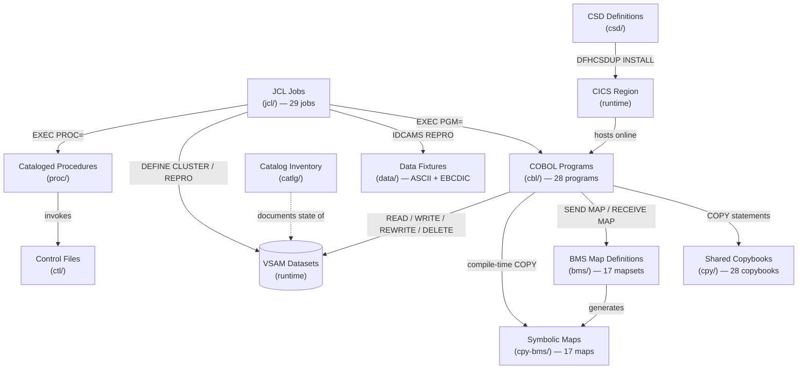

# CardDemo Application — `app/` Directory

## Overview

CardDemo is an AWS sample mainframe credit-card management application built with COBOL (Common Business-Oriented Language), CICS (Customer Information Control System), VSAM (Virtual Storage Access Method), JCL (Job Control Language), and BMS (Basic Mapping Support). It demonstrates mainframe coding patterns for discovery, migration, modernization, and testing use cases.

This `app/` directory contains the **complete application assembly** — business logic programs, shared data-layout contracts, 3270 terminal screen definitions, operational batch jobs, data fixtures, CICS resource definitions, and environment evidence. Every runtime and build-time artifact required to compile, deploy, and operate CardDemo on a z/OS mainframe resides within these subdirectories.

> **Note:** The coding style is intentionally non-uniform across the application to exercise a variety of analysis, transformation, and migration tooling scenarios.

For full installation instructions, environment setup, and demo access, see the [Main README](../README.md).

---

## Module Directory Structure

The `app/` directory contains **10 subdirectories**, each serving a distinct role in the CardDemo system:

| Directory | Contents | File Count | Description |
|-----------|----------|------------|-------------|
| [`cbl/`](cbl/README.md) | COBOL Programs | 28 | 18 online CICS programs + 10 batch programs implementing all business logic |
| [`cpy/`](cpy/README.md) | Shared Copybooks | 28 | Record layouts, navigation contracts, screen text, validation tables, CICS helpers, and report formats |
| [`bms/`](bms/README.md) | BMS Map Definitions | 17 | 3270 terminal screen definitions for CICS `SEND MAP` / `RECEIVE MAP` operations |
| [`cpy-bms/`](cpy-bms/README.md) | Symbolic Map Copybooks | 17 | Compile-time input (AI suffix) and output (AO suffix) buffer layouts for BMS maps |
| [`jcl/`](jcl/README.md) | JCL Jobs | 29 | Environment provisioning, CICS administration, batch processing, and dataset utilities |
| [`data/`](data/README.md) | Data Fixtures | 9 ASCII + 12 EBCDIC | Fixed-format plain-text and binary datasets for batch ingestion and demo scenarios |
| [`catlg/`](catlg/README.md) | Catalog Inventory | 1 | IDCAMS LISTCAT report for `AWS.M2.CARDDEMO` environment verification |
| `csd/` | CSD Definitions | 1 | CICS System Definition file (`CARDDEMO.CSD`) for resource group CARDDEMO |
| `ctl/` | Control Files | 1 | DFSORT/REPROC control statements (`REPROCT.ctl`) |
| `proc/` | Cataloged Procedures | 2 | Reusable JCL procedures (`REPROC.prc`, `TRANREPT.prc`) invoked by batch jobs |

> Directories with README links (`cbl/`, `cpy/`, `bms/`, `cpy-bms/`, `jcl/`, `data/`, `catlg/`) have dedicated module-level documentation. Directories without links (`csd/`, `ctl/`, `proc/`) contain supporting artifacts documented inline.

---

## Architecture Diagram

The following diagram illustrates how the modules within `app/` interact at build time and runtime:

**Reading the diagram:**

- **Solid arrows** represent compile-time or runtime dependencies (data flows, program invocations, dataset access).
- **Dashed arrows** represent documentation or verification relationships.
- COBOL programs in `cbl/` are the central hub — they consume copybooks, reference BMS maps, and access VSAM datasets.
- JCL jobs in `jcl/` orchestrate batch execution and environment provisioning around those same programs and datasets.

---

## Technology Stack

CardDemo employs the following mainframe technologies:

| Technology | Full Name | Role in CardDemo |
|------------|-----------|------------------|
| **COBOL** | Common Business-Oriented Language | Enterprise business logic language (COBOL 85 standard with IBM Enterprise COBOL extensions). All 28 programs are written in COBOL. |
| **CICS** | Customer Information Control System | Online transaction processing monitor. The 18 online programs use the CICS pseudo-conversational programming model with `EXEC CICS` API calls. |
| **VSAM** | Virtual Storage Access Method | Persistent data storage layer. CardDemo uses KSDS (Key-Sequenced Data Sets) with alternate indexes (AIX) and access paths (PATH) for keyed and sequential data access. |
| **JCL** | Job Control Language | z/OS batch job execution language. The 29 JCL jobs handle environment provisioning, dataset management, and batch business processing. |
| **BMS** | Basic Mapping Support | 3270 terminal screen definition facility within CICS. The 17 BMS mapsets define all online screen layouts, field attributes, colors, and geometries. |
| **RACF** | Resource Access Control Facility | Security infrastructure (implicit). User authentication flows through the `USRSEC` VSAM dataset rather than direct RACF calls in this demo. |
| **IDCAMS** | Access Method Services | VSAM cluster management utility. Used extensively in JCL for `DEFINE CLUSTER`, `DEFINE AIX`, `DEFINE PATH`, `REPRO`, `DELETE`, and `LISTCAT` operations. |
| **DFSORT** | Data Facility Sort | Sort/merge utility for batch data processing. Used in the COMBTRAN job to merge daily and system transaction files. |
| **LE** | Language Environment | IBM runtime services layer. The `CSUTLDTC` subprogram calls `CEEDAYS` for date validation and conversion. |
| **SDSF** | System Display and Search Facility | z/OS operator interface. The CLOSEFIL and OPENFIL jobs use SDSF command submission to manage CICS file states. |

Source: `README.md` (lines 32–37), `app/cbl/CSUTLDTC.cbl`, `app/jcl/POSTTRAN.jcl`, `app/jcl/COMBTRAN.jcl`

---

## Module Interaction Patterns

The following patterns describe how modules within `app/` communicate and depend on each other:

### Program ↔ Copybook

COBOL programs include shared copybooks via `COPY` statements in the `DATA DIVISION` and, in some cases, the `PROCEDURE DIVISION`. Copybooks provide standardized record layouts (e.g., `CVACT01Y` for the 300-byte account record), the COMMAREA navigation contract (`COCOM01Y`), common screen titles (`COTTL01Y`), message definitions (`CSMSG01Y`, `CSMSG02Y`), date/time working storage (`CSDAT01Y`), and validation tables (`CSLKPCDY`).

Source: `app/cbl/COSGN00C.cbl` (lines 48–59), `app/cpy/COCOM01Y.cpy`

### Program ↔ BMS Map

Online programs interact with 3270 terminal screens using `EXEC CICS SEND MAP` (to display data) and `EXEC CICS RECEIVE MAP` (to capture user input). Each program references a specific BMS mapset and map name — for example, `COSGN00C` sends map `COSGN0A` from mapset `COSGN00`.

Source: `app/cbl/COSGN00C.cbl` (lines 151–157), `app/bms/COSGN00.bms`

### Program ↔ Symbolic Map

At compile time, COBOL programs include symbolic map copybooks from `cpy-bms/` (e.g., `COPY COSGN00`) to gain byte-accurate access to BMS screen buffer fields. Each symbolic map provides paired input (AI suffix) and output (AO suffix) record layouts with length, flag, attribute, and data fields for every screen element.

Source: `app/cbl/COSGN00C.cbl` (line 50)

### Program ↔ VSAM

Programs access VSAM datasets for persistent data storage. Online programs use CICS file control commands (`EXEC CICS READ`, `EXEC CICS WRITE`, `EXEC CICS REWRITE`, `EXEC CICS DELETE`, `EXEC CICS STARTBR`, `EXEC CICS READNEXT`, `EXEC CICS ENDBR`). Batch programs use native COBOL `FILE-CONTROL` / `SELECT ... ASSIGN` declarations with `READ`, `WRITE`, `REWRITE`, and `START` verbs.

Source: `app/cbl/COSGN00C.cbl` (lines 211–219), `app/cbl/CBTRN02C.cbl` (lines 28–61)

### Program ↔ Program

Online programs navigate between each other using `EXEC CICS XCTL` (transfer control — no return) and `EXEC CICS LINK` (call/return). The COMMAREA copybook (`COCOM01Y`) serves as the navigation contract, carrying the source transaction ID, source program name, target program, user identity, user type, and program context (enter vs. re-enter) across transfers. For example, `COSGN00C` transfers control to `COADM01C` (admin menu) or `COMEN01C` (main menu) based on user type after successful authentication.

Source: `app/cbl/COSGN00C.cbl` (lines 230–240), `app/cbl/COMEN01C.cbl` (lines 152–155), `app/cpy/COCOM01Y.cpy`

### JCL ↔ Program

Batch JCL executes COBOL programs via `EXEC PGM=` steps with `DD` statements that map logical file names to physical VSAM datasets. For example, the `POSTTRAN` job executes `CBTRN02C` with DD allocations for `TRANFILE`, `DALYTRAN`, `XREFFILE`, `DALYREJS`, `ACCTFILE`, and `TCATBALF`.

Source: `app/jcl/POSTTRAN.jcl` (lines 23–42)

### JCL ↔ Data

Provisioning JCL loads ASCII fixture files from `data/ASCII/` (or EBCDIC files from `data/EBCDIC/`) into VSAM datasets using `IDCAMS REPRO` commands. This is the primary mechanism for initializing or refreshing the CardDemo runtime data environment.

Source: `app/jcl/ACCTFILE.jcl`, `app/jcl/CARDFILE.jcl`

### CSD ↔ CICS

The CSD file (`csd/CARDDEMO.CSD`) contains `DEFINE FILE`, `DEFINE PROGRAM`, `DEFINE TRANSACTION`, and `DEFINE MAPSET` commands that register all CardDemo resources within the CICS region. The `CBADMCDJ` JCL job executes `DFHCSDUP` to install these definitions.

Source: `app/csd/CARDDEMO.CSD`, `app/jcl/CBADMCDJ.jcl`

### Procedures ↔ JCL

Cataloged procedures in `proc/` (`REPROC.prc` and `TRANREPT.prc`) are invoked by JCL jobs as reusable step templates. The REPROC procedure handles report-output file processing, while TRANREPT packages the transaction reporting flow. The control file in `ctl/` (`REPROCT.ctl`) provides DFSORT control statements consumed by these procedures.

Source: `app/proc/REPROC.prc`, `app/proc/TRANREPT.prc`, `app/ctl/REPROCT.ctl`

---

## Getting Started

### Quick Orientation

1. **Start with the [Main README](../README.md)** for complete mainframe installation instructions, including dataset creation, sample data upload, JCL execution order, CICS resource installation, and program compilation.

2. **For module-level details**, see each subdirectory's README:
   - [COBOL Programs](cbl/README.md) — program catalog, transaction mappings, VSAM access patterns
   - [Copybook Library](cpy/README.md) — record layouts, field semantics, cross-program usage
   - [BMS Screen Definitions](bms/README.md) — screen inventory, field groups, attribute patterns
   - [Symbolic Maps](cpy-bms/README.md) — AI/AO buffer layouts, compile-time dependencies
   - [JCL Operations](jcl/README.md) — job categories, execution order, dataset management
   - [Data Fixtures](data/README.md) — file formats, record structures, ingestion context
   - [Catalog Inventory](catlg/README.md) — LISTCAT report contents and verification usage

### Environment Setup Execution Order

To provision the CardDemo environment from scratch, execute JCL jobs in the following sequence (see [Main README](../README.md) for full details):

| Step | Job | Purpose |
|------|-----|---------|
| 1 | `DUSRSECJ` | Seed user security VSAM file |
| 2 | `CLOSEFIL` | Close any CICS-held files |
| 3 | `ACCTFILE` | Load account master dataset |
| 4 | `CARDFILE` | Load card master dataset |
| 5 | `CUSTFILE` | Create customer master dataset |
| 6 | `XREFFILE` | Load card-account cross-reference |
| 7 | `TRANFILE` | Initialize transaction master |
| 8 | `DISCGRP` | Load disclosure group reference |
| 9 | `TCATBALF` | Load transaction category balances |
| 10 | `TRANCATG` | Load transaction category types |
| 11 | `TRANTYPE` | Load transaction type reference |
| 12 | `OPENFIL` | Open files for CICS access |
| 13 | `DEFGDGB` | Define GDG base entries |

Source: `README.md` (lines 82–99)

### Batch Processing Execution Order

To run the full batch processing cycle after environment setup:

| Step | Job | Program | Purpose |
|------|-----|---------|---------|
| 1 | `CLOSEFIL` | IEFBR14 | Close CICS-held files |
| 2 | `POSTTRAN` | CBTRN02C | Post daily transactions, update balances |
| 3 | `INTCALC` | CBACT04C | Calculate and post interest charges |
| 4 | `TRANBKP` | IDCAMS | Back up transaction master |
| 5 | `COMBTRAN` | SORT | Merge daily and system transactions |
| 6 | `CREASTMT` | CBSTM03A | Generate customer statements |
| 7 | `TRANIDX` | IDCAMS | Rebuild alternate indexes |
| 8 | `OPENFIL` | IEFBR14 | Reopen files for CICS |

Source: `README.md` (lines 161–183)

### Online Access

Start the CardDemo application using CICS transaction **`CC00`**:

- **Admin user:** `ADMIN001` / `PASSWORD` — access to user administration functions
- **Regular user:** `USER0001` / `PASSWORD` — access to account, card, transaction, billing, and report functions

These are synthetic demo credentials seeded by the `DUSRSECJ` job.

Source: `README.md` (lines 156–159), `app/jcl/DUSRSECJ.jcl`

---

## Known Limitations

- **Non-uniform coding style:** The application intentionally uses varied COBOL coding patterns across programs to exercise diverse analysis and migration scenarios. Source: `README.md` (line 28)
- **DEFCUST dataset name mismatch:** The `DEFCUST.jcl` job references a dataset name that does not align with the standard `AWS.M2.CARDDEMO.*` naming convention used by other provisioning jobs.
- **No automated test suite:** The repository contains no unit tests or integration tests — it relies on manual verification through CICS online transactions and batch job output inspection.
- **EBCDIC/ASCII duality:** Data fixtures exist in both ASCII (`data/ASCII/`) and EBCDIC (`data/EBCDIC/`) formats. The ASCII files are human-readable; the EBCDIC files require binary transfer to the mainframe. Ensure the correct transfer mode for your target environment.
