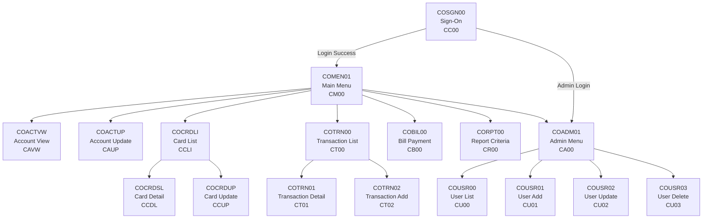

# BMS Screen Definitions — `app/bms/`

## Overview

This directory contains **17 CICS BMS (Basic Mapping Support) mapset definition source files** that define the visual layout, field geometry, attributes, and colors for the CardDemo online 3270 terminal interface.

BMS is the CICS presentation-layer facility for IBM 3270-family terminals. Each `.bms` file in this directory is a macro-assembler source that is processed by the **CICS BMS macro assembler (DFHMAPS)** to produce two outputs:

- **Physical map** — A load module used at runtime by CICS for screen rendering via `EXEC CICS SEND MAP` (output) and `EXEC CICS RECEIVE MAP` (input).
- **Symbolic map** — A COBOL copybook (stored in [`app/cpy-bms/`](../cpy-bms/README.md)) that defines field-level I/O buffers allowing COBOL programs to read and write individual screen fields by name.

All screens target the **IBM 3270 Model 2 terminal** (24 rows × 80 columns) and share a common header/footer pattern populated at runtime by the COBOL programs using shared copybooks ([`COTTL01Y.cpy`](../cpy/COTTL01Y.cpy) for titles, [`CSMSG01Y.cpy`](../cpy/CSMSG01Y.cpy) for messages).

### Key BMS Terminology

| Term | Definition |
|------|-----------|
| **DFHMSD** | Define Mapset — the top-level macro declaring a BMS mapset (one per `.bms` file) |
| **DFHMDI** | Define Map — declares an individual map (screen) within the mapset |
| **DFHMDF** | Define Field — declares a single field on the screen with position, length, attributes, and color |
| **Mapset** | A named collection of one or more maps; the unit of assembly and load |
| **Map** | A single screen layout within a mapset |
| **ATTRB** | Field attribute byte controlling protection (PROT/UNPROT/ASKIP), visibility (NORM/BRT/DRK), and behavior (FSET, IC, NUM) |

---

## Screen Inventory by Domain

The following table catalogs all 17 BMS mapset definitions organized by functional domain. Each mapset contains a single map.

| Mapset | Map Name | Screen Title | COBOL Program | Tran ID | Domain |
|--------|----------|-------------|---------------|---------|--------|
| **Authentication** | | | | | |
| `COSGN00` | `COSGN0A` | Sign-On (Login) | `COSGN00C` | `CC00` | Authentication |
| **Navigation / Menus** | | | | | |
| `COMEN01` | `COMEN1A` | Main Menu | `COMEN01C` | `CM00` | Navigation |
| `COADM01` | `COADM1A` | Admin Menu | `COADM01C` | `CA00` | Navigation |
| **Account Management** | | | | | |
| `COACTVW` | `CACTVWA` | Account View | `COACTVWC` | `CAVW` | Account |
| `COACTUP` | `CACTUPA` | Account Update | `COACTUPC` | `CAUP` | Account |
| **Card Management** | | | | | |
| `COCRDLI` | `CCRDLIA` | Card List | `COCRDLIC` | `CCLI` | Card |
| `COCRDSL` | `CCRDSLA` | Card Detail | `COCRDSLC` | `CCDL` | Card |
| `COCRDUP` | `CCRDUPA` | Card Update | `COCRDUPC` | `CCUP` | Card |
| **Transaction Processing** | | | | | |
| `COTRN00` | `COTRN0A` | Transaction List | `COTRN00C` | `CT00` | Transaction |
| `COTRN01` | `COTRN1A` | Transaction Detail | `COTRN01C` | `CT01` | Transaction |
| `COTRN02` | `COTRN2A` | Transaction Add | `COTRN02C` | `CT02` | Transaction |
| **Billing** | | | | | |
| `COBIL00` | `COBIL0A` | Bill Payment | `COBIL00C` | `CB00` | Billing |
| **Reporting** | | | | | |
| `CORPT00` | `CORPT0A` | Report Criteria | `CORPT00C` | `CR00` | Reporting |
| **User Administration** | | | | | |
| `COUSR00` | `COUSR0A` | User List | `COUSR00C` | `CU00` | User Admin |
| `COUSR01` | `COUSR1A` | User Add | `COUSR01C` | `CU01` | User Admin |
| `COUSR02` | `COUSR2A` | User Update | `COUSR02C` | `CU02` | User Admin |
| `COUSR03` | `COUSR3A` | User Delete | `COUSR03C` | `CU03` | User Admin |

> **Source:** Mapset and map names extracted from `DFHMSD` / `DFHMDI` macro labels in each `.bms` file. Transaction IDs and program names are defined in the CICS CSD resource definitions (Source: `app/jcl/CBADMCDJ.jcl`).

---

## Common BMS Attributes

All 17 mapsets share a core set of DFHMSD-level parameters, with variation in how extended attributes and control options are specified. Two distinct configuration patterns exist across the codebase.

### Shared DFHMSD Parameters

| Parameter | Value | Purpose |
|-----------|-------|---------|
| `LANG=COBOL` | — | Generates COBOL-compatible symbolic map copybooks (`.CPY` in `app/cpy-bms/`) |
| `MODE=INOUT` | — | Maps support both `SEND MAP` (output to terminal) and `RECEIVE MAP` (input from terminal) |
| `STORAGE=AUTO` | — | CICS allocates map storage automatically per task invocation |
| `TIOAPFX=YES` | — | Includes the 12-byte Terminal I/O Area Prefix required for BLL cell management |
| `TYPE=&&SYSPARM` | — | Assembly-time substitution parameter — set to `MAP` for physical map generation or `DSECT` for symbolic map (copybook) generation |
| `SIZE=(24,80)` | — | 24 rows × 80 columns — standard IBM 3270 Model 2 screen geometry (specified at DFHMDI level) |

### Pattern A — EXTATT at DFHMSD Level (12 Screens)

Used by: `COSGN00`, `COMEN01`, `COADM01`, `COTRN00`, `COTRN01`, `COTRN02`, `COBIL00`, `CORPT00`, `COUSR00`, `COUSR01`, `COUSR02`, `COUSR03`

```text
mapset  DFHMSD CTRL=(ALARM,FREEKB),
               EXTATT=YES,
               LANG=COBOL, ...
map     DFHMDI COLUMN=1,
               LINE=1,
               SIZE=(24,80)
```

- **`CTRL=(ALARM,FREEKB)`** — Sounds the audible alarm and unlocks the keyboard when the map is sent to the terminal.
- **`EXTATT=YES`** — Enables extended field attributes (COLOR, HILIGHT) at the mapset level, allowing individual DFHMDF fields to specify color and highlighting.
- **`COLUMN=1, LINE=1`** — Map starts at the top-left corner of the screen.

### Pattern B — DSATTS/MAPATTS at DFHMDI Level (5 Screens)

Used by: `COACTVW`, `COACTUP`, `COCRDLI`, `COCRDSL`, `COCRDUP`

```text
mapset  DFHMSD LANG=COBOL,
               MODE=INOUT, ...
map     DFHMDI CTRL=(FREEKB),
               DSATTS=(COLOR,HILIGHT,PS,VALIDN),
               MAPATTS=(COLOR,HILIGHT,PS,VALIDN),
               SIZE=(24,80)
```

- **`CTRL=(FREEKB)`** — Unlocks the keyboard only (no audible alarm) when the map is sent.
- **`DSATTS=(COLOR,HILIGHT,PS,VALIDN)`** — Specifies which extended attributes are included in the symbolic map (DSECT) for programmatic manipulation.
- **`MAPATTS=(COLOR,HILIGHT,PS,VALIDN)`** — Specifies which extended attributes are included in the physical map for screen rendering.
- **`PS`** — Programmed Symbols attribute. **`VALIDN`** — Field validation attribute (enables `MUSTFILL`, `MUSTENTER`, `TRIGGER` options).
- No `EXTATT=YES` at DFHMSD level — extended attributes are controlled per-map instead.

> **Note:** The Pattern B screens are the account management and card management screens. They also include the `VALIDN` attribute, enabling BMS-level field validation (e.g., `MUSTFILL` on the account number input in `COACTVW`). Source: `app/bms/COACTVW.bms`, `app/bms/COCRDLI.bms`.

---

## Field Patterns

All screens follow consistent field patterns for headers, data entry, display, error messaging, and function key legends.

### Standard Header Area (Lines 1–2)

Every screen includes a two-line header populated at runtime by the COBOL program from the [`COTTL01Y.cpy`](../cpy/COTTL01Y.cpy) copybook:

| Line | Fields | Content |
|------|--------|---------|
| 1 | `Tran:` label → `TRNNAME` (4 chars) → `TITLE01` (40 chars) → `Date:` label → `CURDATE` (8 chars, `mm/dd/yy`) | Transaction ID, application title, current date |
| 2 | `Prog:` label → `PGMNAME` (8 chars) → `TITLE02` (40 chars) → `Time:` label → `CURTIME` (8 chars, `hh:mm:ss`) | Program name, subtitle, current time |

- Labels are **BLUE**; titles (`TITLE01`, `TITLE02`) are **YELLOW**; date/time values are **BLUE**.
- **Exception:** `COSGN00` (Sign-On) has a 3-line header. Line 3 adds `AppID:` + `APPLID` (8 chars) and `SysID:` + `SYSID` (8 chars) for CICS region identification. Source: `app/bms/COSGN00.bms`.

### Screen Title (Line 4)

A centered title in **NEUTRAL** color with `BRT` (bright) intensity identifies the screen function:

- `Main Menu` (COMEN01), `Admin Menu` (COADM01), `View Account` (COACTVW), etc.
- Paged list screens (COCRDLI, COTRN00, COUSR00) additionally display a `Page:` label and `PAGENO`/`PAGENUM` field on line 4 for page-number tracking.

### Input Fields

Editable fields follow a consistent attribute pattern:

- **Primary input (cursor target):** `ATTRB=(FSET,IC,NORM,UNPROT)` — `IC` (Insert Cursor) positions the cursor on this field when the screen is first displayed.
- **Secondary inputs:** `ATTRB=(FSET,NORM,UNPROT)` — Unprotected and editable, but cursor does not start here.
- **Visual cue:** `HILIGHT=UNDERLINE` marks the field boundary for the user.
- **Color:** `GREEN` for data entry fields.
- **Numeric inputs:** Add `NUM` attribute (e.g., menu option fields in COMEN01 and COADM01).
- **Zero-length terminators:** A `DFHMDF LENGTH=0` field is placed immediately after input fields to stop attribute bleed into adjacent areas.

### Protected Display Fields

Read-only fields for displaying data retrieved from VSAM datasets:

- **Typical attributes:** `ATTRB=(ASKIP,FSET,NORM)` or `ATTRB=(NORM,PROT)` — Auto-skip or protected.
- **Color:** `BLUE` or `DEFAULT` for standard display data.
- **Highlighting:** `HILIGHT=OFF` to suppress underline or reverse-video effects.
- **Formatted outputs:** Financial fields use `PICOUT` for display formatting (e.g., `PICOUT='+ZZZ,ZZZ,ZZZ.99'` in COACTVW for currency amounts). Source: `app/bms/COACTVW.bms`.

### Selection Fields (List Screens)

Paged list screens use a repeating row pattern with per-row selection fields:

| Screen | Rows | Selection Field Pattern | Row Data Fields |
|--------|------|------------------------|-----------------|
| `COCRDLI` | 7 | `CRDSEL1`–`CRDSEL7` (1 char, PROT) | `ACCTNO`, `CRDNUM`, `CRDSTS` per row |
| `COTRN00` | 10 | `SEL0001`–`SEL0010` (1 char, UNPROT) | `TRNID`, `TDATE`, `TDESC`, `TAMT` per row |
| `COUSR00` | 10 | `SEL0001`–`SEL0010` (1 char, UNPROT) | `USRID`, `FNAME`, `LNAME`, `UTYPE` per row |

- **Hidden stop fields:** COCRDLI uses `CRDSTP2`–`CRDSTP7` with `ATTRB=(ASKIP,DRK,FSET)` to provide attribute isolation between rows. Row 1 lacks a `CRDSTPn` field — an implementation quirk preserved as-is. Source: `app/bms/COCRDLI.bms`.

### Error/Message Area (Lines 23–24)

| Line | Field | Attributes | Purpose |
|------|-------|-----------|---------|
| 23 | `ERRMSG` | `ATTRB=(ASKIP,BRT,FSET)`, `COLOR=RED`, `LENGTH=78` | Error and validation messages displayed by the COBOL program |
| 24 | (unnamed) | `ATTRB=(ASKIP,NORM)`, `COLOR=YELLOW` | Function key legend — varies by screen (e.g., `ENTER=Sign-on  F3=Exit`) |

The error message field is populated from [`CSMSG01Y.cpy`](../cpy/CSMSG01Y.cpy) and [`CSMSG02Y.cpy`](../cpy/CSMSG02Y.cpy) by the COBOL program.

### Color Usage Convention

| Color | Usage |
|-------|-------|
| **BLUE** | Labels, header fields, static text, date/time values |
| **YELLOW** | Application titles (`TITLE01`/`TITLE02`), function key legends |
| **GREEN** | Editable input fields, zero-length terminators |
| **RED** | Error messages (`ERRMSG`) |
| **TURQUOISE** | Instructional prompts, hints (e.g., "Type your User ID and Password") |
| **NEUTRAL** | Screen titles, column headers, section dividers |
| **DEFAULT** | Data display in list rows, general-purpose output |

---

## Screen-to-Program Mapping

The following diagram illustrates the BMS screen navigation flow. Navigation between screens is controlled by `EXEC CICS XCTL` (transfer control) in the COBOL programs. All screens follow the CICS **pseudo-conversational model** — each user interaction is a separate CICS task.



> **Reading the diagram:** Each node shows the BMS mapset name, screen title, and CICS transaction ID. Arrows indicate navigation paths via `EXEC CICS XCTL` in the COBOL programs. Source: [`app/cbl/`](../cbl/README.md) COBOL programs.

---

## Architecture Fit

BMS maps are the **presentation layer** of the CardDemo CICS application. They sit between the 3270 terminal hardware and the COBOL business logic programs:

```text
┌─────────────┐    ┌──────────────┐    ┌──────────────┐    ┌───────────┐
│ 3270        │◄──►│ CICS BMS     │◄──►│ COBOL        │◄──►│ VSAM      │
│ Terminal    │    │ Physical Map │    │ Program      │    │ Datasets  │
│             │    │ (app/bms/)   │    │ (app/cbl/)   │    │           │
└─────────────┘    └──────────────┘    └──────────────┘    └───────────┘
                   ┌──────────────┐
                   │ Symbolic Map │
                   │ (app/cpy-bms/)│
                   └──────────────┘
```

- Each BMS mapset corresponds **1:1** to a COBOL program in [`app/cbl/`](../cbl/README.md) and a symbolic map copybook in [`app/cpy-bms/`](../cpy-bms/README.md).
- The COBOL program uses `EXEC CICS SEND MAP('mapname') MAPSET('mapsetname')` to render screen data and `EXEC CICS RECEIVE MAP('mapname') MAPSET('mapsetname')` to collect user input.
- Screen navigation between maps is controlled by `EXEC CICS XCTL PROGRAM('progname')` (transfer control) in the COBOL programs — the BMS maps themselves have no navigation logic.
- All screens follow the CICS **pseudo-conversational model**: each screen interaction (SEND + RECEIVE) constitutes a separate CICS task. Between interactions, the terminal is free and no CICS resources are held.
- The **COMMAREA** (communication area, defined in [`COCOM01Y.cpy`](../cpy/COCOM01Y.cpy)) carries state between pseudo-conversational task invocations.

---

## Dependencies and Cross-References

### Direct Artifacts

| Dependency | Location | Relationship |
|-----------|----------|-------------|
| Symbolic map copybooks | [`app/cpy-bms/`](../cpy-bms/README.md) | Each `.bms` file produces a corresponding `.CPY` symbolic map with paired input (AI suffix) and output (AO suffix) record layouts |
| COBOL programs | [`app/cbl/`](../cbl/README.md) | Each screen is driven by a dedicated COBOL program that issues `SEND MAP` and `RECEIVE MAP` calls |
| BMS compile JCL | [`samples/jcl/BMSCMP.jcl`](../../samples/jcl/BMSCMP.jcl) | Sample JCL wrapper for assembling BMS sources into physical maps and symbolic copybooks |
| CICS CSD definitions | [`app/jcl/CBADMCDJ.jcl`](../jcl/CBADMCDJ.jcl) | Defines CICS resource entries (MAPSET, PROGRAM, TRANSACTION) for all 17 screens |

### Shared Copybooks Used at Runtime

| Copybook | Location | Purpose |
|----------|----------|---------|
| `COTTL01Y.cpy` | [`app/cpy/COTTL01Y.cpy`](../cpy/COTTL01Y.cpy) | Application title and banner text fields that populate `TITLE01`, `TITLE02` header fields |
| `CSMSG01Y.cpy` | [`app/cpy/CSMSG01Y.cpy`](../cpy/CSMSG01Y.cpy) | Common user message definitions displayed in the `ERRMSG` field |
| `CSMSG02Y.cpy` | [`app/cpy/CSMSG02Y.cpy`](../cpy/CSMSG02Y.cpy) | Abend data work area fields for abnormal termination messages |
| `CSSETATY.cpy` | [`app/cpy/CSSETATY.cpy`](../cpy/CSSETATY.cpy) | COBOL-side attribute byte manipulation for dynamic field protection changes (e.g., making list-row selection fields UNPROT when populated) |

---

## Design Patterns Observed

### Two-Phase Screens (Fetch-then-Display)

Several screens use a two-phase interaction model:

1. **Phase 1:** User enters a key identifier (account number, card number, user ID) and presses ENTER.
2. **Phase 2:** The COBOL program reads the record from VSAM and populates the display fields.

Screens using this pattern: `COACTVW`, `COCRDSL`, `COCRDUP`, `COUSR02`, `COUSR03`.

### Paged List Screens

Three screens display paginated lists of records using F7 (Backward) and F8 (Forward) keys:

| Screen | Rows per Page | Selection Mechanism | Paging Controls |
|--------|--------------|-------------------|-----------------|
| `COCRDLI` | 7 | `CRDSEL1`–`CRDSEL7` (1-char per row) | `F7=Backward  F8=Forward` |
| `COTRN00` | 10 | `SEL0001`–`SEL0010` (1-char per row) | `F7=Backward  F8=Forward` |
| `COUSR00` | 10 | `SEL0001`–`SEL0010` (1-char per row) | `F7=Backward  F8=Forward` |

These screens use the CICS VSAM browse pattern (`STARTBR` / `READNEXT` / `ENDBR`) in the COBOL program to retrieve records for display.

### Confirmation Pattern

Three screens require explicit user confirmation before committing operations:

| Screen | Operation | Confirmation Field |
|--------|-----------|-------------------|
| `COBIL00` | Bill payment submission | `CONFIRM` — 1-char `(Y/N)` |
| `COTRN02` | Transaction add | `CONFIRM` — 1-char `(Y/N)` |
| `CORPT00` | Report job submission | `CONFIRM` — 1-char `(Y/N)` |

Source: `app/bms/COBIL00.bms`, `app/bms/COTRN02.bms`, `app/bms/CORPT00.bms`.

### Zero-Length Terminators

Zero-length DFHMDF fields (`LENGTH=0`) are used extensively throughout all screens to stop attribute bleed. When one field has a specific color or protection attribute, a zero-length field is placed immediately after it to reset the attribute byte before the next visible field. Example from `COSGN00.bms`:

```text
USERID  DFHMDF ATTRB=(FSET,IC,NORM,UNPROT), COLOR=GREEN, LENGTH=8, ...
        DFHMDF ATTRB=(ASKIP,NORM), COLOR=GREEN, LENGTH=0, POS=(19,52)
```

### Asymmetric Row Fields

In `COCRDLI` (Card List), row 1 lacks a `CRDSTPn` (hidden dark stop field) while rows 2–7 include `CRDSTP2` through `CRDSTP7`. This is an implementation quirk in the original source, documented as-is per the Minimal Change Clause. Source: `app/bms/COCRDLI.bms`.

---

## Known Limitations

- **Incorrect header comments:** `COBIL00.bms` and `CORPT00.bms` both have the file header comment `"CardDemo - Main Menu Screen"` instead of their actual screen names (Bill Payment and Report Criteria, respectively). These are preserved as-is per the Minimal Change Clause. Source: `app/bms/COBIL00.bms`, `app/bms/CORPT00.bms`.
- **Non-uniform coding style:** The codebase uses two different BMS configuration patterns (Pattern A with `EXTATT=YES` at DFHMSD level; Pattern B with `DSATTS`/`MAPATTS` at DFHMDI level). There is no documented rationale for which pattern applies to which screens.
- **No BMS CURSOR attribute:** All initial cursor positioning is achieved via `ATTRB=(IC)` on individual fields. The `CURSOR` option on `DFHMDI` or `DFHMSD` is not used.
- **Basic 3270 color palette:** Color choices follow standard 3270 base-color conventions (7 colors) and are functional rather than visually sophisticated.
- **Single-map mapsets:** Each `.bms` file defines exactly one DFHMDI map within its DFHMSD mapset. The BMS mapset-to-map ratio is always 1:1, not leveraging the multi-map capability of BMS.
- **Asymmetric COCRDLI rows:** Row 1 in COCRDLI omits the hidden `CRDSTPn` stop field present in rows 2–7.

---

## Getting Started

| Item | Details |
|------|---------|
| **What it does** | Defines 17 terminal screen layouts for the CardDemo CICS online interface |
| **How to build** | Assemble each `.bms` file using the CICS BMS macro assembler (`DFHMAPS`). See [`samples/jcl/BMSCMP.jcl`](../../samples/jcl/BMSCMP.jcl) for a sample compile wrapper. |
| **Key configs** | `TYPE=&&SYSPARM` controls generation mode: set `SYSPARM=MAP` for physical map, `SYSPARM=DSECT` for symbolic map. `LANG=COBOL` targets COBOL symbolic maps. |
| **Common failures** | Mismatched field names between BMS source and COBOL program cause compile-time or runtime `MAPFAIL` errors. Field position overlaps (two fields occupying the same screen coordinates) cause assembly errors. Exceeding column 72 in continuation lines causes assembly warnings. |
| **Prerequisites** | z/OS environment with CICS TS installed; DFHMAPS procedure cataloged; CICS region CSD updated with mapset definitions (see [`app/jcl/CBADMCDJ.jcl`](../jcl/CBADMCDJ.jcl)). |

---

## Related Documentation

- [Application Overview — `app/README.md`](../README.md)
- [COBOL Programs — `app/cbl/README.md`](../cbl/README.md)
- [Shared Copybooks — `app/cpy/README.md`](../cpy/README.md)
- [Symbolic Map Copybooks — `app/cpy-bms/README.md`](../cpy-bms/README.md)
- [JCL Operations — `app/jcl/README.md`](../jcl/README.md)
- [Main README — `README.md`](../../README.md)
