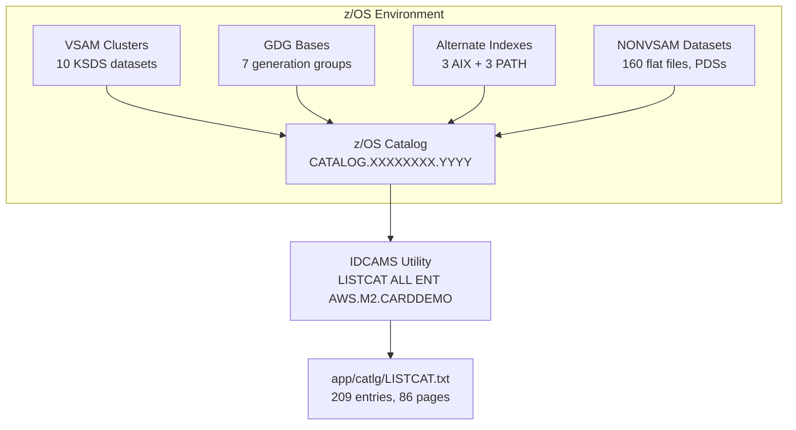

# Catalog Inventory — `app/catlg/` Directory

## Overview

This directory contains a single file, `LISTCAT.txt`, which is an IDCAMS (Access Method Services) `LISTCAT ALL` report for the `AWS.M2.CARDDEMO` high-level qualifier. It provides a point-in-time catalog inventory snapshot capturing every z/OS catalog entry related to the CardDemo application environment.

The report was generated using the command `LISTCAT LEVEL(AWS.M2.CARDDEMO) ALL` at 15:36:44 on 09/01/22 against the catalog `CATALOG.XXXXXXXX.YYYY`. It completed successfully with a highest condition code of 0 and a maximum condition code of 0. The report spans 3,956 lines across 86 pages, documenting 209 catalog entries.

This file serves as the authoritative reference for verifying that a target mainframe environment has been correctly provisioned with all required datasets, VSAM (Virtual Storage Access Method) clusters, GDG (Generation Data Group) bases, AIX (Alternate Index) definitions, and supporting flat files.

> Source: `app/catlg/LISTCAT.txt`

---

## Report Contents Summary

The report lists **209 catalog entries** organized across 86 pages. The following table summarizes the entry types and their counts as reported on page 85 of the LISTCAT output:

| Entry Type | Count | Description |
|------------|------:|-------------|
| NONVSAM    |   160 | Flat sequential datasets (PS files for data loading, GDG generation entries for reports/rejects, PDS libraries for source, JCL, procedures, and load modules) |
| CLUSTER    |    10 | VSAM KSDS (Key-Sequenced Data Set) base clusters for application data |
| DATA       |    13 | VSAM data components of clusters (10) and alternate indexes (3) |
| INDEX      |    13 | VSAM index components of clusters (10) and alternate indexes (3) |
| GDG        |     7 | Generation Data Group base definitions for versioned output datasets |
| AIX        |     3 | Alternate Index definitions for cross-entity access paths |
| PATH       |     3 | Alternate index path definitions enabling direct AIX access |
| **TOTAL**  | **209** | |

### VSAM Clusters

The environment defines 10 VSAM KSDS base clusters. Each cluster stores application data with fixed-length records accessed by a primary key. The following attributes are extracted from each cluster's DATA component ATTRIBUTES section:

| Cluster Dataset | Key Length | Key Position | Avg Record Length | Max Record Length | SHROPTNS | Purpose |
|-----------------|----------:|-------------:|------------------:|------------------:|----------|---------|
| `AWS.M2.CARDDEMO.ACCTDATA.VSAM.KSDS` | 11 | 0 | 300 | 300 | (2,3) | Account master data |
| `AWS.M2.CARDDEMO.CARDDATA.VSAM.KSDS` | 16 | 0 | 150 | 150 | (2,3) | Card data |
| `AWS.M2.CARDDEMO.CARDXREF.VSAM.KSDS` | 16 | 0 | 50 | 50 | (2,3) | Card-to-account cross-reference |
| `AWS.M2.CARDDEMO.CUSTDATA.VSAM.KSDS` | 9 | 0 | 500 | 500 | (2,3) | Customer master data |
| `AWS.M2.CARDDEMO.DISCGRP.VSAM.KSDS` | 16 | 0 | 50 | 50 | (2,3) | Disclosure group reference |
| `AWS.M2.CARDDEMO.TCATBALF.VSAM.KSDS` | 17 | 0 | 50 | 50 | (2,3) | Transaction category balance |
| `AWS.M2.CARDDEMO.TRANCATG.VSAM.KSDS` | 6 | 0 | 60 | 60 | (2,3) | Transaction category type |
| `AWS.M2.CARDDEMO.TRANSACT.VSAM.KSDS` | 16 | 0 | 350 | 350 | (2,3) | Transaction master data |
| `AWS.M2.CARDDEMO.TRANTYPE.VSAM.KSDS` | 2 | 0 | 60 | 60 | (1,4) | Transaction type reference |
| `AWS.M2.CARDDEMO.USRSEC.VSAM.KSDS` | 8 | 0 | 80 | 80 | (1,3) | User security and authentication |

All clusters use `INDEXED`, `UNIQUE`, and `NOREUSE` attributes with the exception of `USRSEC.VSAM.KSDS`, which specifies `REUSE`. SHROPTNS (Share Options) of `(2,3)` allow cross-region read sharing with write integrity; `(1,3)` requires exclusive control for writes within a region; `(1,4)` allows unrestricted cross-system access. CI (Control Interval) sizes are 18,432 bytes for all clusters except `USRSEC.VSAM.KSDS` which uses 8,192 bytes.

> Source: DATA component ATTRIBUTES sections in `app/catlg/LISTCAT.txt`

### Alternate Indexes (AIX)

Three alternate indexes enable reverse-lookup and alternate-key access paths across the application's VSAM datasets:

| AIX Dataset | AIX Key Length | AIX RKP | AXRKP | SHROPTNS | Base Cluster | Purpose |
|-------------|---------------:|--------:|------:|----------|--------------|---------|
| `AWS.M2.CARDDEMO.CARDDATA.VSAM.AIX` | 11 | 5 | 16 | (1,3) | `CARDDATA.VSAM.KSDS` | Card-to-account reverse lookup — extracts the 11-byte account ID from position 5 of the AIX data record, using position 16 of the base cluster record as the alternate key source |
| `AWS.M2.CARDDEMO.CARDXREF.VSAM.AIX` | 11 | 5 | 25 | (1,3) | `CARDXREF.VSAM.KSDS` | Cross-reference-to-account reverse lookup — extracts the 11-byte account ID from position 5 of the AIX record, with base record alternate key at position 25 |
| `AWS.M2.CARDDEMO.TRANSACT.VSAM.AIX` | 26 | 5 | 304 | (1,3) | `TRANSACT.VSAM.KSDS` | Transaction alternate key access — 26-byte composite key from position 5 of the AIX record, base record alternate key at position 304 |

All three AIX definitions specify `UPGRADE`, meaning the alternate index is automatically maintained when the base cluster is updated. All use `NONUNIQKEY` and `SPANNED` attributes.

> Source: AIX and AIX DATA component sections in `app/catlg/LISTCAT.txt`

### Alternate Index Paths (PATH)

Three PATH entries provide direct access to the alternate indexes, enabling COBOL programs to open and read through the AIX as if it were a standalone file:

| PATH Dataset | Associated AIX | Base Cluster | Attributes |
|--------------|----------------|--------------|------------|
| `AWS.M2.CARDDEMO.CARDDATA.VSAM.AIX.PATH` | `CARDDATA.VSAM.AIX` | `CARDDATA.VSAM.KSDS` | UPDATE |
| `AWS.M2.CARDDEMO.CARDXREF.VSAM.AIX.PATH` | `CARDXREF.VSAM.AIX` | `CARDXREF.VSAM.KSDS` | UPDATE |
| `AWS.M2.CARDDEMO.TRANSACT.VSAM.AIX.PATH` | `TRANSACT.VSAM.AIX` | `TRANSACT.VSAM.KSDS` | UPDATE |

Each PATH associates its AIX DATA and INDEX components with the base cluster's DATA and INDEX components, enabling transparent alternate-key reads.

> Source: PATH entry sections in `app/catlg/LISTCAT.txt`

### Generation Data Groups (GDG)

Seven GDG base definitions manage versioned output datasets produced by batch processing jobs. Each base retains up to 5 generations (LIMIT=5) using LIFO ordering:

| GDG Base Dataset | LIMIT | SCRATCH | Active Generations (sample) | Purpose |
|------------------|------:|---------|----------------------------|---------|
| `AWS.M2.CARDDEMO.DALYREJS` | 5 | SCRATCH | G0022V00–G0026V00 | Daily rejection reports from transaction posting |
| `AWS.M2.CARDDEMO.SYSTRAN` | 5 | SCRATCH | G0018V00–G0022V00 | System transaction dumps |
| `AWS.M2.CARDDEMO.TCATBALF.BKUP` | 5 | SCRATCH | G0005V00–G0009V00 | Transaction category balance backups |
| `AWS.M2.CARDDEMO.TRANREPT` | 5 | SCRATCH | G0010V00–G0014V00 | Transaction reports generated by CBTRN03C |
| `AWS.M2.CARDDEMO.TRANSACT.BKUP` | 5 | NOSCRATCH | G0072V00–G0076V00 | Transaction file backups (retained after uncataloging) |
| `AWS.M2.CARDDEMO.TRANSACT.COMBINED` | 5 | SCRATCH | G0015V00–G0019V00 | Combined transaction outputs from COMBTRAN |
| `AWS.M2.CARDDEMO.TRANSACT.DALY` | 5 | NOSCRATCH | G0026V00–G0030V00 | Daily transaction staging files (retained after uncataloging) |

All GDG bases specify `NOEMPTY`, `LIFO`, and `NOPURGE`. The `NOSCRATCH` attribute on `TRANSACT.BKUP` and `TRANSACT.DALY` means that when a generation rolls off the catalog, the underlying dataset is uncataloged but not physically deleted — it must be removed separately. The remaining bases use `SCRATCH`, which automatically deletes rolled-off generations.

> Source: GDG BASE entry sections in `app/catlg/LISTCAT.txt`

### Key NONVSAM Datasets

The 160 NONVSAM entries include flat sequential datasets, PDS (Partitioned Data Set) libraries, and GDG generation members. The most architecturally significant categories include:

**Source Data Flat Files (for REPRO loading into VSAM):**

| Dataset | Purpose |
|---------|---------|
| `AWS.M2.CARDDEMO.ACCTDATA.PS` | Account master source data |
| `AWS.M2.CARDDEMO.CARDDATA.PS` | Card data source file |
| `AWS.M2.CARDDEMO.CARDXREF.PS` | Card-to-account cross-reference source |
| `AWS.M2.CARDDEMO.CUSTDATA.PS` | Customer master source data |
| `AWS.M2.CARDDEMO.SECURITY.PS` | User security seed data |
| `AWS.M2.CARDDEMO.DISCGRP.PS` | Disclosure group reference data |
| `AWS.M2.CARDDEMO.TRANCATG.PS` | Transaction category type source |
| `AWS.M2.CARDDEMO.TRANTYPE.PS` | Transaction type reference source |

**Batch Processing and Staging Files:**

| Dataset | Purpose |
|---------|---------|
| `AWS.M2.CARDDEMO.DALYTRAN.PS` | Daily transaction staging file for batch ingestion |
| `AWS.M2.CARDDEMO.DALYTRAN.PS.INIT` | Initial daily transaction baseline |
| `AWS.M2.CARDDEMO.DATEPARM` | Date parameter file controlling batch processing date context |

**PDS Libraries:**

| Dataset | Purpose |
|---------|---------|
| `AWS.M2.CARDDEMO.CBL` | COBOL source library |
| `AWS.M2.CARDDEMO.CNTL` | Control card and JCL library |
| `AWS.M2.CARDDEMO.JCL` | JCL job library |
| `AWS.M2.CARDDEMO.PROC` | Cataloged procedure library |
| `AWS.M2.CARDDEMO.LOADLIB` | Load library containing compiled program modules |
| `AWS.M2.CARDDEMO.LISTCAT` | LISTCAT output dataset |
| `AWS.M2.CARDDEMO.LISTING` | Compilation listing output |
| `AWS.M2.CARDDEMO.LST` | General listing output |

**GDG Generation Members (representative samples):**

GDG generation members follow the pattern `<base>.GnnnnV00` where `nnnn` is the generation number. Examples include `AWS.M2.CARDDEMO.DALYREJS.G0022V00` through `G0026V00` for the daily rejection report generations. Each GDG base retains 5 active generations as documented above.

> Source: NONVSAM entries throughout `app/catlg/LISTCAT.txt`

---

## Usage for Environment Verification

The LISTCAT report serves multiple verification and troubleshooting use cases:

### New Environment Validation

After provisioning a new CardDemo environment using the JCL jobs in `app/jcl/`, run `LISTCAT LEVEL(AWS.M2.CARDDEMO) ALL` against the target environment and compare the output against this reference file. Verify that:

- All 10 VSAM KSDS clusters are defined with matching key lengths, key positions, and record sizes
- All 3 AIX definitions and 3 PATH associations exist with correct AXRKP values
- All 7 GDG bases are established with correct LIMIT and SCRATCH/NOSCRATCH settings
- Required source data flat files (PS datasets) are allocated and loaded

### VSAM Cluster Verification

Use the VSAM Clusters table above to validate that cluster attributes match expected values derived from COBOL copybook record layout definitions. Key verification points:

- **KEYLEN** must match the primary key field length in the corresponding copybook (e.g., 11 bytes for ACCTDATA matches the account ID field in `CVACT01Y.cpy`)
- **RKP** (Relative Key Position) confirms the key starts at byte 0 for all clusters
- **AVGLRECL/MAXLRECL** must match the total record length defined by the copybook PIC clause summation
- **SHROPTNS** must support the access patterns used by online CICS programs and batch jobs

### GDG Base Confirmation

Before running batch processing jobs (POSTTRAN, INTCALC, COMBTRAN, CREASTMT, TRANREPT), confirm that all 7 GDG bases are correctly established with their generation limits. Missing GDG bases cause JCL ABEND S013 or allocation failures when batch jobs attempt to create new generation datasets.

### AIX/PATH Validation

Validate that alternate index definitions and path associations match the expected alternate access patterns:

- **CARDDATA AIX** — enables card-to-account reverse lookup (AXRKP=16 in the 150-byte card record)
- **CARDXREF AIX** — enables cross-reference-to-account reverse lookup (AXRKP=25 in the 50-byte xref record)
- **TRANSACT AIX** — enables transaction alternate key access (AXRKP=304 in the 350-byte transaction record)

### Troubleshooting

Use this report as a reference when diagnosing the following common failure conditions:

| Symptom | Possible Cause | Verification Action |
|---------|----------------|---------------------|
| FILE STATUS 35 (file not found on OPEN) | VSAM cluster not defined or dataset name mismatch | Compare cluster names in LISTCAT against DD allocations in JCL |
| FILE STATUS 39 (file attribute conflict) | Key length, record size, or KSDS type mismatch | Compare KEYLEN and MAXLRECL in LISTCAT against copybook definitions |
| FILE STATUS 21/22 (sequence/duplicate key error) | Incorrect key position or key length | Verify RKP and KEYLEN match COBOL FILE-CONTROL SELECT assignments |
| JCL ABEND S013 | Dataset not found during allocation | Confirm NONVSAM/CLUSTER entries exist for all DD referenced datasets |
| GDG allocation failure | GDG base not defined or generation limit reached | Verify GDG BASE entries exist with expected LIMIT values |
| AIX read returns unexpected results | AIX not built or AXRKP mismatch | Verify AIX DATA component AXRKP against copybook field positions |

### Migration Validation

When migrating the CardDemo environment to a new z/OS LPAR or to AWS Mainframe Modernization (M2), compare the catalog state before and after migration to confirm that all VSAM structures, GDG bases, dataset attributes, and RACF (Resource Access Control Facility) protection settings are preserved.

---

## Key Metadata Captured

The LISTCAT ALL report captures detailed metadata for every catalog entry. The following sections describe the information available for each entry type:

### HISTORY Section

Captures dataset lifecycle metadata:

- **DATASET-OWNER** — Owner ID assigned at creation (typically NULL for system-managed datasets)
- **CREATION** — Dataset creation date in Julian format (YYYY.DDD), e.g., `2022.242` = day 242 of 2022
- **RELEASE** — Catalog release level (value `2` for all entries in this report)
- **EXPIRATION** — Retention expiration date (`0000.000` indicates no expiration)
- **LAST ALTER** — Last catalog alteration date (GDG bases only)

### SMSDATA Section

Storage Management Subsystem metadata (VSAM clusters and SMS-managed datasets):

- **STORAGECLASS** — SMS storage class assignment (e.g., `SCTECH`)
- **MANAGEMENTCLASS** — SMS management class (NULL for most entries)
- **DATACLASS** — SMS data class (NULL for most entries)
- **LBACKUP** — Last backup timestamp in Julian format with time
- **CA-RECLAIM** — Whether empty CAs (Control Areas) are reclaimed (YES for all clusters)

### ENCRYPTIONDATA Section

- **DATA SET ENCRYPTION** — Indicates whether the dataset is encrypted at rest (NO for all entries in this environment)

### PROTECTION Section

- **PSWD** — Password protection indicator (NULL for all entries — no password protection)
- **RACF** — RACF protection indicator (NO for all entries — security managed externally)

### ASSOCIATIONS Section

Links between related catalog entries:

- **Clusters** link to their DATA and INDEX components and any associated AIX definitions
- **AIX** entries link to their DATA/INDEX components, base CLUSTER, and PATH definitions
- **PATH** entries link to their AIX and the base cluster's DATA/INDEX components
- **GDG** bases list all active NONVSAM generation members

### ATTRIBUTES Section (VSAM DATA/INDEX Components)

Defines the physical and logical characteristics of VSAM data and index components:

- **KEYLEN** — Primary key length in bytes
- **RKP** — Relative Key Position (byte offset of the primary key within the record)
- **AVGLRECL/MAXLRECL** — Average and maximum logical record lengths
- **CISIZE** — CI (Control Interval) size in bytes
- **CI/CA** — Number of control intervals per control area
- **BUFSPACE** — Buffer space allocation in bytes
- **SHROPTNS** — Share options as (cross-region, cross-system) pair
- **RECOVERY/SPEED** — Whether recovery information is maintained
- **UNIQUE/SUBALLOC** — Whether the dataset occupies its own data space
- **ERASE/NOERASE** — Whether data is overwritten on deletion
- **INDEXED** — Confirms KSDS organization
- **SPANNED/NONSPANNED** — Whether records can span CI boundaries
- **REUSE/NOREUSE** — Whether the dataset can be reused (reset to empty) without redefining
- **ORDERED/UNORDERED** — Volume allocation ordering

For AIX DATA components, the additional attribute **AXRKP** specifies the alternate key position within the base cluster record.

### STATISTICS Section

Runtime activity counters for VSAM datasets:

- **REC-TOTAL** — Current total number of logical records
- **REC-DELETED/INSERTED/UPDATED/RETRIEVED** — Cumulative record operation counts
- **SPLITS-CI/SPLITS-CA** — CI and CA split counts (indicators of dataset reorganization needs)
- **EXCPS** — Total I/O operations (Execute Channel Programs)
- **EXTENTS** — Number of physical extents allocated
- **FREESPACE-%CI/%CA** — Free space percentages at CI and CA levels

### ALLOCATION Section

Physical space allocation:

- **SPACE-TYPE** — Allocation unit (CYLINDER or TRACK)
- **SPACE-PRI/SPACE-SEC** — Primary and secondary allocation quantities
- **HI-A-RBA** — Highest allocated RBA (Relative Byte Address) — total allocated space
- **HI-U-RBA** — Highest used RBA — actual space consumed by data

### VOLUME Section

Physical storage details:

- **VOLSER** — Volume serial number identifying the physical DASD volume
- **DEVTYPE** — Device type in hexadecimal (X'3010200F' = 3390 DASD)
- **PHYREC-SIZE** — Physical record size in bytes
- **PHYRECS/TRK** — Physical records per track
- **TRACKS/CA** — Tracks per control area
- **EXTENT-NUMBER** — Number of physical extents
- **LOW-CCHH/HIGH-CCHH** — Extent boundaries in cylinder-head format
- **LOW-RBA/HIGH-RBA** — Extent boundaries in RBA format

---

## Architecture Diagram

The following diagram illustrates the relationship between the LISTCAT report and the z/OS environment it documents:

---

## Cross-References

| Related Module | Link | Relationship |
|----------------|------|-------------|
| Application Overview | [app/README.md](../README.md) | Parent directory architectural overview of the entire CardDemo application |
| JCL Operations | [app/jcl/README.md](../jcl/README.md) | JCL jobs that create, load, and manage the VSAM datasets and GDG bases documented in this report |
| COBOL Programs | [app/cbl/README.md](../cbl/README.md) | Online and batch programs that access the VSAM datasets cataloged here |
| Data Fixtures | [app/data/README.md](../data/README.md) | ASCII source data files that are loaded into VSAM datasets via JCL REPRO operations |
| Copybook Library | [app/cpy/README.md](../cpy/README.md) | Record layout definitions whose field sizes and key structures correspond to the VSAM cluster attributes |

---

## Known Limitations

- **Point-in-time snapshot:** This report reflects the catalog state as of 09/01/22 at 15:36:44. The actual environment state may differ after subsequent job executions, dataset additions, or maintenance operations.
- **Catalog name redacted:** The catalog identifier appears as `CATALOG.XXXXXXXX.YYYY` — a sanitized placeholder. The actual catalog name in a provisioned environment will differ.
- **Statistics are cumulative:** Record counts and I/O statistics in the STATISTICS sections reflect cumulative activity since the last dataset reset or rebuild, not current record counts alone.
- **No RACF protection documented:** All entries show `RACF-(NO)`, indicating that security was managed outside the z/OS catalog scope at the time of the report. Actual production environments may have RACF profiles applied.
- **GDG generation numbers vary:** The specific generation numbers (e.g., G0022V00) are environment-specific and will differ across environments. Only the GDG base definitions and LIMIT values should be used for verification.
