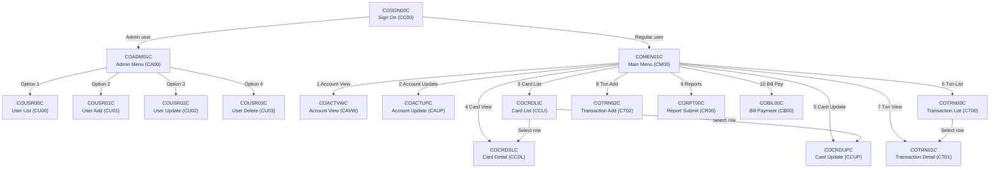
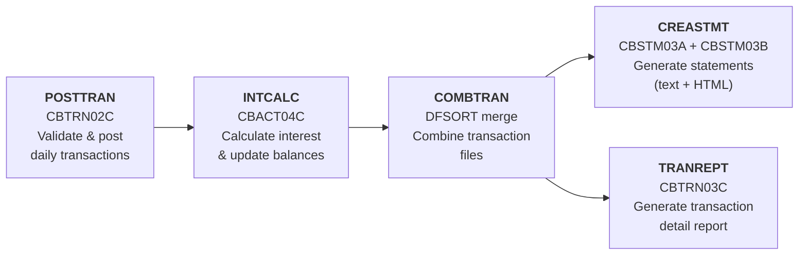
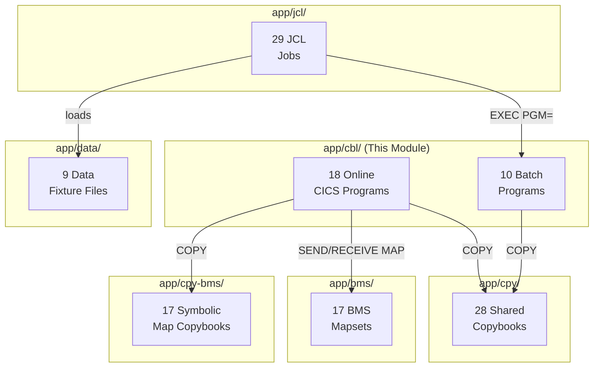

# COBOL Programs — `app/cbl/`

## Overview

This directory contains all **28 COBOL programs** that comprise the CardDemo application — a sample credit card management system designed for IBM z/OS mainframes. The programs are divided into two categories:

- **18 online programs** — CICS (Customer Information Control System) pseudo-conversational programs that drive the 3270 terminal user interface via BMS (Basic Mapping Support) screen maps
- **10 batch programs** — JCL (Job Control Language)-driven programs that perform sequential and indexed file processing for daily operations such as transaction posting, interest calculation, statement generation, and reporting

**Technology stack:** IBM Enterprise COBOL, CICS Transaction Server, VSAM (Virtual Storage Access Method) KSDS (Key-Sequenced Data Set) files, BMS mapsets for 3270 terminal I/O, and IBM Language Environment (LE) callable services.

> **Note:** The coding style is not uniform across the application. Some programs follow a different header format, variable naming convention, and structural layout than others. This is by design in the original AWS CardDemo sample.  
> *Source: Root [README.md](../../README.md)*

---

## Online Programs Inventory

All 18 online programs operate under the CICS pseudo-conversational model. Each program is associated with a 4-character CICS transaction ID, a BMS mapset for screen rendering, and accesses VSAM datasets via CICS file control API calls.

| Tran ID | BMS Map   | Program    | Function |
|---------|-----------|------------|----------|
| `CC00`  | COSGN00   | COSGN00C   | Sign-on screen — application entry point, authenticates user credentials against USRSEC file |
| `CM00`  | COMEN01   | COMEN01C   | Main menu — 10-option navigation hub for regular users |
| `CA00`  | COADM01   | COADM01C   | Admin menu — 4-option navigation hub for administrator users |
| `CAVW`  | COACTVW   | COACTVWC   | Account view — reads Account, Customer, and Cross-Reference records (3-entity join) |
| `CAUP`  | COACTUP   | COACTUPC   | Account update — dual-record write (Account + Customer) with SYNCPOINT rollback |
| `CCLI`  | COCRDLI   | COCRDLIC   | Credit card list — paginated browse displaying 7 rows per page via STARTBR/READNEXT/ENDBR |
| `CCDL`  | COCRDSL   | COCRDSLC   | Credit card detail — keyed read from CARDDAT, read-only display |
| `CCUP`  | COCRDUP   | COCRDUPC   | Credit card update — optimistic concurrency control via before/after image comparison |
| `CT00`  | COTRN00   | COTRN00C   | Transaction list — paginated browse of TRANSACT file, 10 rows per page |
| `CT01`  | COTRN01   | COTRN01C   | Transaction detail — keyed read from TRANSACT with type/category description lookup |
| `CT02`  | COTRN02   | COTRN02C   | Transaction add — generates next transaction ID via browse-to-end pattern |
| `CB00`  | COBIL00   | COBIL00C   | Bill payment — updates account balance and creates a transaction record |
| `CR00`  | CORPT00   | CORPT00C   | Report submission — writes batch JCL to JOBS TDQ (Transient Data Queue) for offline report generation |
| `CU00`  | COUSR00   | COUSR00C   | User list — admin-only browse of USRSEC security file with row selection |
| `CU01`  | COUSR01   | COUSR01C   | User add — admin function, writes new record to USRSEC |
| `CU02`  | COUSR02   | COUSR02C   | User update — admin function, reads USRSEC for update and rewrites |
| `CU03`  | COUSR03   | COUSR03C   | User delete — admin function, deletes record from USRSEC with confirmation |
| —       | —         | CSUTLDTC   | Date validation subprogram — wraps IBM LE CEEDAYS callable service (invoked via `EXEC CICS LINK`) |

*Sources: Program headers in `app/cbl/*.cbl`, transaction IDs from `WS-TRANID` / `LIT-THISTRANID` declarations*

---

## Batch Programs Inventory

All 10 batch programs use native COBOL `FILE-CONTROL` / `OPEN` / `READ` / `WRITE` / `CLOSE` statements for VSAM file I/O. They are invoked by JCL jobs defined in [`app/jcl/`](../jcl/README.md).

| JCL Job    | Program   | Function |
|------------|-----------|----------|
| READACCT   | CBACT01C  | Account file sequential read/display utility |
| READCARD   | CBACT02C  | Card file sequential read/display utility |
| READXREF   | CBACT03C  | Cross-reference file sequential read/display utility |
| INTCALC    | CBACT04C  | Interest calculation — rate lookup from DISCGRP, account balance updates, generates transaction output |
| READCUST   | CBCUS01C  | Customer file sequential read/display utility |
| —          | CBTRN01C  | Daily transaction driver — opens all required files, reads and validates daily transactions, looks up cross-references and accounts (not invoked by any JCL job in this repository) |
| POSTTRAN   | CBTRN02C  | Transaction posting engine — 4-stage validation cascade, reject processing, balance/category-balance updates |
| TRANREPT   | CBTRN03C  | Transaction reporting — date-filtered detail report with 3-level totals (account, category, grand), paginated |
| CREASTMT   | CBSTM03A  | Statement generation — produces both plain-text and HTML output, 4-entity join, memory buffering |
| *(called)* | CBSTM03B  | File service subroutine — OPEN/READ/CLOSE abstraction layer called by CBSTM03A |

*Sources: Program headers in `app/cbl/CB*.cbl` and `app/cbl/CB*.CBL`*

---

## Program Navigation Flow

The following diagram shows the CICS `EXEC CICS XCTL` (transfer control) routing between online programs. Navigation originates at the sign-on screen and branches based on user type (Admin vs. Regular).

Menu option-to-program mappings are defined in copybook [`COMEN02Y.cpy`](../cpy/COMEN02Y.cpy) (10 entries for the main menu) and [`COADM02Y.cpy`](../cpy/COADM02Y.cpy) (4 entries for the admin menu).



*Sources: `EXEC CICS XCTL PROGRAM` statements in online programs, `COMEN02Y.cpy` option table, `COADM02Y.cpy` option table*

---

## Batch Processing Pipeline

The five-stage batch processing pipeline is executed via JCL jobs in [`app/jcl/`](../jcl/README.md). The pipeline must run in the order shown below. CREASTMT and TRANREPT may run in parallel after COMBTRAN completes.



**Pipeline stages:**

1. **POSTTRAN** — CBTRN02C performs a 4-stage validation cascade on daily transaction records from DALYTRAN (cross-reference lookup, account verification, category-balance update, transaction posting) and writes rejects to DALYREJS.
2. **INTCALC** — CBACT04C reads each account via cross-reference, looks up the applicable interest rate from DISCGRP, calculates interest, updates the account balance, and writes interest-charge transaction records.
3. **COMBTRAN** — A DFSORT utility job (no COBOL program) merges the posted transaction file with newly generated interest transactions.
4. **CREASTMT** — CBSTM03A reads transactions, cross-references, customers, and accounts (via subroutine CBSTM03B), then generates customer statements in both plain-text and HTML formats.
5. **TRANREPT** — CBTRN03C reads the merged transaction file, filters by date range (from DATEPARM), resolves transaction type and category descriptions, and produces a paginated detail report with 3-level totals.

*Sources: `app/jcl/POSTTRAN.jcl`, `app/jcl/INTCALC.jcl`, `app/jcl/COMBTRAN.jcl`, `app/jcl/CREASTMT.JCL`, `app/jcl/TRANREPT.jcl`*

---

## VSAM File Access Matrix

The table below maps each VSAM dataset to the programs that access it and the access modes used. Online programs use CICS file control commands (`EXEC CICS READ/WRITE/REWRITE/DELETE/STARTBR/READNEXT/ENDBR`). Batch programs use native COBOL I/O (`OPEN/READ/WRITE/REWRITE/CLOSE`).

| VSAM Dataset | Online Programs | Batch Programs | Access Modes |
|:-------------|:----------------|:---------------|:-------------|
| **USRSEC** | COSGN00C, COMEN01C, COADM01C, COUSR00C, COUSR01C, COUSR02C, COUSR03C | — | READ, WRITE, REWRITE, DELETE, BROWSE |
| **ACCTDAT** | COACTVWC, COACTUPC, COBIL00C | CBACT01C, CBACT04C, CBTRN01C, CBTRN02C, CBSTM03B | READ, REWRITE, BROWSE |
| **CARDDAT** | COCRDLIC, COCRDSLC, COCRDUPC | CBACT02C, CBTRN01C | READ, REWRITE, BROWSE |
| **CARDAIX** | COCRDSLC, COCRDUPC | — | READ (AIX path by account) |
| **CUSTDAT** | COACTVWC, COACTUPC | CBCUS01C, CBTRN01C, CBSTM03B | READ, BROWSE |
| **CXACAIX** | COACTVWC, COACTUPC, COBIL00C, COTRN02C | — | READ (AIX path by account) |
| **CCXREF** | COTRN02C | — | READ |
| **CARDXREF** | — | CBACT03C, CBTRN01C, CBTRN02C, CBTRN03C, CBSTM03B | READ, BROWSE |
| **TRANSACT** | COTRN00C, COTRN01C, COTRN02C, COBIL00C, CORPT00C | CBTRN01C, CBTRN02C, CBTRN03C, CBSTM03B | READ, WRITE, BROWSE |
| **TCATBALF** | — | CBACT04C, CBTRN02C | READ, REWRITE |
| **DISCGRP** | — | CBACT04C | READ |
| **DALYTRAN** | — | CBTRN01C, CBTRN02C | READ (sequential input) |
| **DALYREJS** | — | CBTRN02C | WRITE (sequential output) |
| **TRANTYPE** | — | CBTRN03C | READ |
| **TRANCATG** | — | CBTRN03C | READ |
| **STMTFILE** | — | CBSTM03A | WRITE (sequential output) |
| **HTMLFILE** | — | CBSTM03A | WRITE (sequential output) |

*Sources: `WS-*-FILE` value declarations, `LIT-*FILENAME` literals, `SELECT ... ASSIGN TO` statements, and `EXEC CICS READ/WRITE/STARTBR DATASET()` calls across all 28 programs*

---

## Copybook Dependencies

The following table lists the COBOL `COPY` statement dependencies for each program. Copybook source files are located in [`app/cpy/`](../cpy/README.md). Symbolic map copybooks (COSGN00, COMEN01, etc.) are located in [`app/cpy-bms/`](../cpy-bms/README.md). DFHAID and DFHBMSCA are IBM-supplied CICS copybooks.

### Online Programs

| Program    | Copybooks Consumed |
|:-----------|:-------------------|
| COSGN00C   | COCOM01Y, COSGN00, COTTL01Y, CSDAT01Y, CSMSG01Y, CSUSR01Y, DFHAID, DFHBMSCA |
| COMEN01C   | COCOM01Y, COMEN02Y, COMEN01, COTTL01Y, CSDAT01Y, CSMSG01Y, CSUSR01Y, DFHAID, DFHBMSCA |
| COADM01C   | COCOM01Y, COADM02Y, COADM01, COTTL01Y, CSDAT01Y, CSMSG01Y, CSUSR01Y, DFHAID, DFHBMSCA |
| COACTVWC   | CVCRD01Y, COCOM01Y, DFHBMSCA, DFHAID, COTTL01Y, COACTVW, CSDAT01Y, CSMSG01Y, CSMSG02Y, CSUSR01Y, CVACT01Y, CVACT02Y, CVACT03Y, CVCUS01Y, CSSTRPFY |
| COACTUPC   | CSUTLDWY, CVCRD01Y, CSLKPCDY, DFHBMSCA, DFHAID, COTTL01Y, COACTUP, CSDAT01Y, CSMSG01Y, CSMSG02Y, CSUSR01Y, CVACT01Y, CVACT03Y, CVCUS01Y, COCOM01Y, CSSETATY, CSSTRPFY, CSUTLDPY |
| COCRDLIC   | CVCRD01Y, COCOM01Y, DFHBMSCA, DFHAID, COTTL01Y, COCRDLI, CSDAT01Y, CSMSG01Y, CSUSR01Y, CVACT02Y, CSSTRPFY |
| COCRDSLC   | CVCRD01Y, COCOM01Y, DFHBMSCA, DFHAID, COTTL01Y, COCRDSL, CSDAT01Y, CSMSG01Y, CSMSG02Y, CSUSR01Y, CVACT02Y, CVCUS01Y, CSSTRPFY |
| COCRDUPC   | CVCRD01Y, COCOM01Y, DFHBMSCA, DFHAID, COTTL01Y, COCRDUP, CSDAT01Y, CSMSG01Y, CSMSG02Y, CSUSR01Y, CVACT02Y, CVCUS01Y, CSSTRPFY |
| COTRN00C   | COCOM01Y, COTRN00, COTTL01Y, CSDAT01Y, CSMSG01Y, CVTRA05Y, DFHAID, DFHBMSCA |
| COTRN01C   | COCOM01Y, COTRN01, COTTL01Y, CSDAT01Y, CSMSG01Y, CVTRA05Y, DFHAID, DFHBMSCA |
| COTRN02C   | COCOM01Y, COTRN02, COTTL01Y, CSDAT01Y, CSMSG01Y, CVTRA05Y, CVACT01Y, CVACT03Y, DFHAID, DFHBMSCA |
| COBIL00C   | COCOM01Y, COBIL00, COTTL01Y, CSDAT01Y, CSMSG01Y, CVACT01Y, CVACT03Y, CVTRA05Y, DFHAID, DFHBMSCA |
| CORPT00C   | COCOM01Y, CORPT00, COTTL01Y, CSDAT01Y, CSMSG01Y, CVTRA05Y, DFHAID, DFHBMSCA |
| COUSR00C   | COCOM01Y, COUSR00, COTTL01Y, CSDAT01Y, CSMSG01Y, CSUSR01Y, DFHAID, DFHBMSCA |
| COUSR01C   | COCOM01Y, COUSR01, COTTL01Y, CSDAT01Y, CSMSG01Y, CSUSR01Y, DFHAID, DFHBMSCA |
| COUSR02C   | COCOM01Y, COUSR02, COTTL01Y, CSDAT01Y, CSMSG01Y, CSUSR01Y, DFHAID, DFHBMSCA |
| COUSR03C   | COCOM01Y, COUSR03, COTTL01Y, CSDAT01Y, CSMSG01Y, CSUSR01Y, DFHAID, DFHBMSCA |
| CSUTLDTC   | *(none — self-contained subprogram)* |

### Batch Programs

| Program    | Copybooks Consumed |
|:-----------|:-------------------|
| CBACT01C   | CVACT01Y |
| CBACT02C   | CVACT02Y |
| CBACT03C   | CVACT03Y |
| CBACT04C   | CVACT01Y, CVACT03Y, CVTRA05Y, CVTRA01Y, CVTRA02Y |
| CBCUS01C   | CVCUS01Y |
| CBTRN01C   | CVTRA06Y, CVTRA05Y, CVACT01Y, CVACT02Y, CVACT03Y, CVCUS01Y |
| CBTRN02C   | CVTRA06Y, CVTRA05Y, CVACT03Y, CVACT01Y, CVTRA01Y |
| CBTRN03C   | CVTRA05Y, CVACT03Y, CVTRA03Y, CVTRA04Y, CVTRA07Y |
| CBSTM03A   | COSTM01, CVACT03Y, CUSTREC, CVACT01Y |
| CBSTM03B   | *(none — uses LINKAGE SECTION parameters)* |

**Common copybook groupings:**

- **All online programs** share: `COCOM01Y` (COMMAREA), `COTTL01Y` (title text), `CSDAT01Y` (date/time), `CSMSG01Y` (messages), `DFHAID` (attention IDs), `DFHBMSCA` (BMS attributes)
- **Account/card programs** add: `CVACT01Y` (account record), `CVACT02Y` (card record), `CVACT03Y` (cross-reference), `CVCUS01Y` (customer record), `CVCRD01Y` (card work area)
- **COACTUPC** uniquely adds: `CSSETATY` (attribute setting via COPY REPLACING), `CSUTLDPY` (date validation paragraphs), `CSLKPCDY` (area code/state/ZIP lookup tables), `CSUTLDWY` (date-edit working storage)

*Sources: `COPY` statements extracted from all 28 programs in `app/cbl/`*

---

## Common Design Patterns

The following patterns are consistently observed across the CardDemo COBOL programs.

### Pseudo-Conversational Model (Online)

All online programs yield the terminal between user interactions using `EXEC CICS RETURN TRANSID(WS-TRANID) COMMAREA(...)`. When the user presses a key, CICS re-invokes the program. The `EIBCALEN` field (length of incoming COMMAREA) distinguishes first-entry (`EIBCALEN = 0`) from returning interactions.

### COMMAREA-Based Navigation

The shared COMMAREA (Communication Area) structure defined in [`COCOM01Y.cpy`](../cpy/COCOM01Y.cpy) carries routing state and user identity across `EXEC CICS XCTL` transfers. Key fields include `CDEMO-FROM-PROGRAM`, `CDEMO-TO-PROGRAM`, `CDEMO-USER-ID`, and `CDEMO-USER-TYPE` (with 88-level conditions `CDEMO-USRTYP-ADMIN` / `CDEMO-USRTYP-USER`).

### Table-Driven Menu Dispatch

Menu programs (COMEN01C, COADM01C) use copybook-defined option tables rather than hard-coded IF/EVALUATE chains. [`COMEN02Y.cpy`](../cpy/COMEN02Y.cpy) defines 10 main-menu entries mapping option numbers to target program names. [`COADM02Y.cpy`](../cpy/COADM02Y.cpy) defines 4 admin-menu entries. The menu program indexes into the table by option number and passes the target program name to `EXEC CICS XCTL`.

### BMS Screen I/O

Online programs use `EXEC CICS SEND MAP` / `EXEC CICS RECEIVE MAP` paired with symbolic map copybooks (located in [`app/cpy-bms/`](../cpy-bms/README.md)) for 3270 terminal interaction. Each program has a corresponding BMS mapset in [`app/bms/`](../bms/README.md).

### VSAM I/O Patterns

- **Online (CICS):** `EXEC CICS READ`, `EXEC CICS WRITE`, `EXEC CICS REWRITE`, `EXEC CICS DELETE`, `EXEC CICS STARTBR` / `READNEXT` / `ENDBR`
- **Batch (native COBOL):** `OPEN INPUT|OUTPUT|I-O`, `READ`, `WRITE`, `REWRITE`, `CLOSE`

### Browse Pagination

List screens (COCRDLIC, COTRN00C, COUSR00C) implement pagination using the STARTBR/READNEXT/ENDBR pattern. `EXEC CICS STARTBR` positions a browse cursor at a key value, `EXEC CICS READNEXT` fills N display rows, and `EXEC CICS ENDBR` releases the browse. Page state (current top-of-page key) is tracked in COMMAREA or working storage.

### Error Handling

- **Online programs** evaluate CICS response codes via `WS-RESP-CD`: `DFHRESP(NORMAL)`, `DFHRESP(NOTFND)`, `DFHRESP(DUPREC)`, `DFHRESP(ENDFILE)`, with `WS-REAS-CD` for secondary reason codes.
- **Batch programs** check `FILE STATUS` after every I/O operation: `00` = success, `10` = end-of-file, `23` = record not found, `35` = file not open.

### Optimistic Concurrency Control

COCRDUPC and COACTUPC implement optimistic locking by saving a before-image of the record when it is first read for display. On submit, the program re-reads the current record and compares it with the saved image. If the record has changed (another user modified it), the update is rejected with an appropriate message.

### SYNCPOINT Rollback

COACTUPC uses `EXEC CICS SYNCPOINT ROLLBACK` to provide atomic dual-record updates. When updating both an account record and a customer record, if the second write fails, SYNCPOINT ROLLBACK reverses the first write.

### Next-ID Generation

COTRN02C generates the next transaction ID using a browse-to-end pattern: `EXEC CICS STARTBR` at high-values, then reads the last record to determine the highest existing ID, and increments it by one.

*Sources: Pattern analysis across all 18 online programs and 10 batch programs in `app/cbl/`*

---

## Known Limitations

- **Non-uniform coding style** — The application deliberately uses varying header formats, variable naming conventions, and structural layouts across programs. This is noted in the root [README.md](../../README.md).
- **CBSTM03A legacy constructs** — The statement generation program uses mainframe control block addressing (PSA/TCB/TIOT), `ALTER` / `GO TO` statements, `COMP` and `COMP-3` variables, and 2-dimensional arrays. These are intentional for modernization tooling exercises.  
  *Source: `app/cbl/CBSTM03A.CBL` header comment block (lines 28–35)*
- **CBSTM03A/CBSTM03B header ordering** — These two programs place `IDENTIFICATION DIVISION` before the program comment block, unlike all other programs which place the comment block first.
- **CSUTLDTC non-standard header** — This subprogram uses `"CALL TO CEEDAYS"` as its header title instead of the standard `Program/Application/Type/Function` format.
- **Batch abend handling** — The batch read utilities (CBACT01C, CBACT02C, CBACT03C, CBCUS01C) and processing programs (CBACT04C, CBTRN01C, CBTRN02C, CBTRN03C) use `CEE3ABD` for abend signaling rather than graceful error recovery.
- **DEFCUST JCL dataset mismatch** — The DEFCUST JCL job references a dataset name that does not align with the standard naming convention. See the [JCL module documentation](../jcl/README.md) for details.

---

## Architecture Fit



- This module contains **all executable COBOL programs** in the CardDemo application
- Programs are compiled into load modules deployed in z/OS PDS (Partitioned Data Set) libraries
- **Online programs** are registered in the CICS CSD (CICS System Definition) via [`app/jcl/CBADMCDJ.jcl`](../jcl/CBADMCDJ.jcl) and triggered by 4-character transaction IDs entered at the 3270 terminal
- **Batch programs** are invoked by JCL job steps (`EXEC PGM=programname`) in [`app/jcl/`](../jcl/README.md)
- All programs consume shared copybooks from [`app/cpy/`](../cpy/README.md)
- Online programs use BMS screen maps compiled from [`app/bms/`](../bms/README.md) with symbolic map layouts from [`app/cpy-bms/`](../cpy-bms/README.md)

### Related Modules

| Module | Relationship | Path |
|--------|-------------|------|
| Copybooks | Record layouts, COMMAREA, utilities consumed via `COPY` | [`app/cpy/`](../cpy/README.md) |
| BMS Maps | Screen definitions for online 3270 terminal UI | [`app/bms/`](../bms/README.md) |
| Symbolic Maps | Compile-time input/output buffer layouts for BMS maps | [`app/cpy-bms/`](../cpy-bms/README.md) |
| JCL Jobs | Batch job definitions that invoke batch programs | [`app/jcl/`](../jcl/README.md) |
| Data Fixtures | ASCII seed data loaded into VSAM datasets via JCL | [`app/data/`](../data/README.md) |

---

## Getting Started

For complete installation and environment setup instructions, see the root [README.md](../../README.md).

### Compiling Online Programs

Online CICS programs require the CICS translator and are compiled using the sample JCL wrapper:

```text
samples/jcl/CICCMP.jcl
```

After compilation, programs must be defined to the CICS region via the CSD resource definition job:

```text
app/jcl/CBADMCDJ.jcl
```

### Compiling Batch Programs

Batch programs are compiled using the standard batch compile wrapper:

```text
samples/jcl/BATCMP.jcl
```

After compilation, batch programs are executed via their corresponding JCL jobs in `app/jcl/`. See the [JCL Operations Guide](../jcl/README.md) for the complete job inventory and execution order.

### Execution Prerequisites

1. VSAM datasets must be provisioned and loaded using the JCL jobs in `app/jcl/` (ACCTFILE, CARDFILE, CUSTFILE, XREFFILE, TRANFILE, etc.)
2. For online programs: The CICS region must be running with file definitions installed (via `CBADMCDJ.jcl` and `OPENFIL.jcl`)
3. For batch programs: Daily transaction data (`DALYTRAN`) must be available for the POSTTRAN pipeline
4. GDG (Generation Data Group) bases must be defined for report and reject outputs (via `DEFGDGB.jcl`, `REPTFILE.jcl`, `DALYREJS.jcl`)
