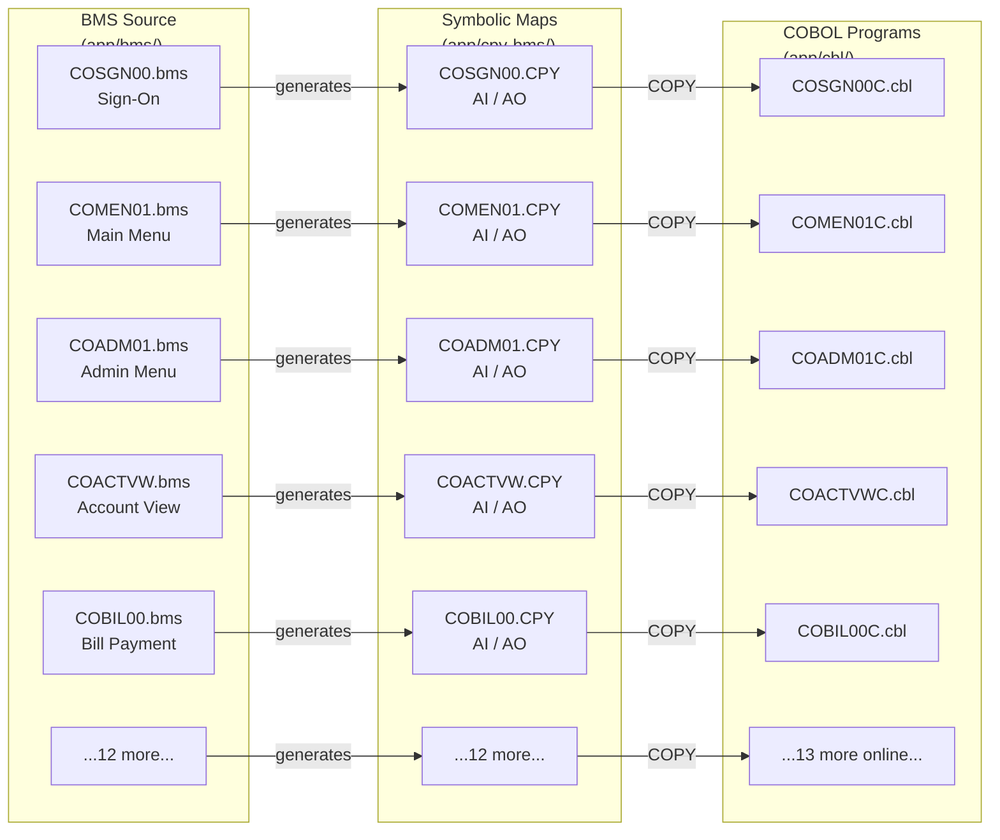

# Symbolic Map Copybooks — `app/cpy-bms/`

## Overview

This directory contains **17 compile-time COBOL symbolic map copybooks** for the AWS CardDemo application. Each `.CPY` file provides byte-accurate input and output buffer layouts that COBOL programs use for screen I/O with IBM 3270 terminals via CICS (Customer Information Control System) BMS (Basic Mapping Support).

These symbolic maps are generated from — and must remain synchronized with — the 17 BMS map definitions in [`app/bms/`](../bms/README.md). They serve as the **compile-time interface contract** between the BMS screen definitions and the COBOL program screen I/O logic.

**Key facts:**

- **17 copybooks** — one per BMS mapset, covering all online screens in CardDemo
- **Included via `COPY`** statements in the `DATA DIVISION WORKING-STORAGE SECTION` of COBOL programs in [`app/cbl/`](../cbl/README.md)
- **Dual-structure pattern** — each file defines paired input (AI suffix) and output (AO suffix) buffer layouts that share the same storage via `REDEFINES`
- **Target:** IBM 3270 terminal buffer layouts for 24×80 character screens
- **CICS operations:** These layouts are populated and consumed by `EXEC CICS SEND MAP` (output) and `EXEC CICS RECEIVE MAP` (input) commands in COBOL programs

> **Terminology:** Throughout this document, **CICS** refers to IBM's Customer Information Control System — the online transaction processing environment. **BMS** (Basic Mapping Support) is the CICS facility that maps between physical terminal data streams and logical field-level data structures. **COMMAREA** (Communication Area) is the inter-program data passing mechanism in CICS. `SEND MAP` and `RECEIVE MAP` are CICS API commands that transmit screen data to and from the 3270 terminal.

---

## AI/AO Dual-Structure Pattern

Every symbolic map copybook in this directory follows an identical dual-structure pattern consisting of an **Input (AI) layout** and an **Output (AO) layout** that overlay the same memory buffer.

### Input Layout (AI Suffix)

Each file defines a 01-level record with an **AI** suffix (e.g., `COSGN0AI`, `COBIL0AI`). This layout is used by COBOL programs to **read data received from the terminal** after executing `EXEC CICS RECEIVE MAP`.

- The 12-byte `FILLER PIC X(12)` at the start of every AI record is the **TIOA (Terminal I/O Area) prefix** — required because all BMS mapsets in CardDemo specify `TIOAPFX=YES`
- Each screen field is represented as a group of sub-fields with L/F/A/I suffixes (see [Field Structure Convention](#field-structure-convention) below)

### Output Layout (AO Suffix)

Each file defines a 01-level record with an **AO** suffix that `REDEFINES` the AI record (e.g., `COSGN0AO REDEFINES COSGN0AI`). This layout is used by COBOL programs to **populate data for terminal display** before executing `EXEC CICS SEND MAP`.

- Contains field groups with C/P/H/V/O suffixes (see [Field Structure Convention](#field-structure-convention) below)
- Shares the same storage as the AI layout via `REDEFINES` — the same buffer serves both input and output

### How It Works in Practice

The following sequence illustrates the runtime flow for a single screen interaction:

1. **Program populates AO fields** — e.g., `MOVE 'Welcome' TO TITLE01O`, `MOVE error-text TO ERRMSGO`
2. **`EXEC CICS SEND MAP`** transmits the AO buffer contents to the 3270 terminal for display
3. **User interacts** with the screen — types into input fields and presses a key (ENTER, PF3, PF7, etc.)
4. **`EXEC CICS RECEIVE MAP`** fills the AI fields with terminal input — e.g., `USERIDI` receives the typed user ID, `PASSWDI` receives the typed password
5. **Program reads AI fields** to process user input and determine the next action

Because the AI and AO records share storage via `REDEFINES`, a program **cannot simultaneously hold both input and output data** in the same buffer. Programs must copy needed input field values to working variables before populating output fields.

---

## Field Structure Convention

Every field in every symbolic map follows a strict suffix convention. The suffixes differ between the AI (input) and AO (output) sections.

### AI (Input) Section Field Suffixes

| Suffix | PIC Clause | Purpose |
|--------|------------|---------|
| **L** | `COMP PIC S9(4)` | **Length** — number of bytes received from the terminal for this field |
| **F** | `PICTURE X` | **Flag** — BMS attribute modification indicator |
| **A** | `PICTURE X` (via `REDEFINES F`) | **Attribute** — screen attribute byte (color, highlight, protection) |
| *(FILLER)* | `PICTURE X(4)` | Reserved bytes between attribute and data |
| **I** | `PICTURE X(n)` | **Input** — the actual data value received from the terminal |

### AO (Output) Section Field Suffixes

| Suffix | PIC Clause | Purpose |
|--------|------------|---------|
| *(FILLER)* | `PICTURE X(3)` | Reserved bytes preceding extended attributes |
| **C** | `PICTURE X` | **Color** — extended color attribute for the field |
| **P** | `PICTURE X` | **Programmed Symbol** — character set selection |
| **H** | `PICTURE X` | **Highlighting** — blink, reverse video, underline |
| **V** | `PICTURE X` | **Validation** — field validation attribute |
| **O** | `PICTURE X(n)` | **Output** — display data (`REDEFINES` the I field from AI layout) |

### Field Group Pattern

The following illustrative snippet from `COSGN00.CPY` shows how a single screen field (USERID) is represented in both the AI and AO sections:

```cobol
      * --- AI (Input) pattern for the USERID field ---
           02  USERIDL    COMP  PIC  S9(4).    *> Length received
           02  USERIDF    PICTURE X.           *> Flag byte
           02  FILLER REDEFINES USERIDF.
             03 USERIDA    PICTURE X.          *> Attribute byte
           02  FILLER   PICTURE X(4).          *> Reserved
           02  USERIDI  PIC X(8).              *> Input data (8 bytes)
      * --- AO (Output) pattern for the same field ---
           02  FILLER PICTURE X(3).            *> Reserved
           02  USERIDC    PICTURE X.           *> Color attribute
           02  USERIDP    PICTURE X.           *> Programmed Symbol
           02  USERIDH    PICTURE X.           *> Highlighting
           02  USERIDV    PICTURE X.           *> Validation
           02  USERIDO  PIC X(8).              *> Output data (8 bytes)
```

> **Note:** This is a representative snippet showing the pattern. See source file `app/cpy-bms/COSGN00.CPY` for the full layout.

---

## Map-to-BMS-to-Program Traceability

The following table maps every symbolic map copybook to its corresponding BMS source definition, COBOL program, and screen function. Each row represents a complete traceability chain from screen definition through compile-time layout to runtime program.

| Symbolic Map | AI Record | AO Record | BMS Source | COBOL Program | Screen Function |
|---|---|---|---|---|---|
| `COSGN00.CPY` | `COSGN0AI` | `COSGN0AO` | [`COSGN00.bms`](../bms/COSGN00.bms) | [`COSGN00C.cbl`](../cbl/COSGN00C.cbl) | Sign-On Screen |
| `COMEN01.CPY` | `COMEN1AI` | `COMEN1AO` | [`COMEN01.bms`](../bms/COMEN01.bms) | [`COMEN01C.cbl`](../cbl/COMEN01C.cbl) | Main Menu |
| `COADM01.CPY` | `COADM1AI` | `COADM1AO` | [`COADM01.bms`](../bms/COADM01.bms) | [`COADM01C.cbl`](../cbl/COADM01C.cbl) | Admin Menu |
| `COACTVW.CPY` | `CACTVWAI` | `CACTVWAO` | [`COACTVW.bms`](../bms/COACTVW.bms) | [`COACTVWC.cbl`](../cbl/COACTVWC.cbl) | Account View |
| `COACTUP.CPY` | `CACTUPAI` | `CACTUPAO` | [`COACTUP.bms`](../bms/COACTUP.bms) | [`COACTUPC.cbl`](../cbl/COACTUPC.cbl) | Account Update |
| `COCRDLI.CPY` | `CCRDLIAI` | `CCRDLIAO` | [`COCRDLI.bms`](../bms/COCRDLI.bms) | [`COCRDLIC.cbl`](../cbl/COCRDLIC.cbl) | Card List |
| `COCRDSL.CPY` | `CCRDSLAI` | `CCRDSLAO` | [`COCRDSL.bms`](../bms/COCRDSL.bms) | [`COCRDSLC.cbl`](../cbl/COCRDSLC.cbl) | Card Detail |
| `COCRDUP.CPY` | `CCRDUPAI` | `CCRDUPAO` | [`COCRDUP.bms`](../bms/COCRDUP.bms) | [`COCRDUPC.cbl`](../cbl/COCRDUPC.cbl) | Card Update |
| `COTRN00.CPY` | `COTRN0AI` | `COTRN0AO` | [`COTRN00.bms`](../bms/COTRN00.bms) | [`COTRN00C.cbl`](../cbl/COTRN00C.cbl) | Transaction List |
| `COTRN01.CPY` | `COTRN1AI` | `COTRN1AO` | [`COTRN01.bms`](../bms/COTRN01.bms) | [`COTRN01C.cbl`](../cbl/COTRN01C.cbl) | Transaction Detail |
| `COTRN02.CPY` | `COTRN2AI` | `COTRN2AO` | [`COTRN02.bms`](../bms/COTRN02.bms) | [`COTRN02C.cbl`](../cbl/COTRN02C.cbl) | Transaction Add |
| `COBIL00.CPY` | `COBIL0AI` | `COBIL0AO` | [`COBIL00.bms`](../bms/COBIL00.bms) | [`COBIL00C.cbl`](../cbl/COBIL00C.cbl) | Bill Payment |
| `CORPT00.CPY` | `CORPT0AI` | `CORPT0AO` | [`CORPT00.bms`](../bms/CORPT00.bms) | [`CORPT00C.cbl`](../cbl/CORPT00C.cbl) | Report Criteria |
| `COUSR00.CPY` | `COUSR0AI` | `COUSR0AO` | [`COUSR00.bms`](../bms/COUSR00.bms) | [`COUSR00C.cbl`](../cbl/COUSR00C.cbl) | User List |
| `COUSR01.CPY` | `COUSR1AI` | `COUSR1AO` | [`COUSR01.bms`](../bms/COUSR01.bms) | [`COUSR01C.cbl`](../cbl/COUSR01C.cbl) | User Add |
| `COUSR02.CPY` | `COUSR2AI` | `COUSR2AO` | [`COUSR02.bms`](../bms/COUSR02.bms) | [`COUSR02C.cbl`](../cbl/COUSR02C.cbl) | User Update |
| `COUSR03.CPY` | `COUSR3AI` | `COUSR3AO` | [`COUSR03.bms`](../bms/COUSR03.bms) | [`COUSR03C.cbl`](../cbl/COUSR03C.cbl) | User Delete |

---

## Compile-Time Dependencies

These copybooks integrate into the COBOL build process as follows:

- **Inclusion mechanism:** Each copybook is included via a `COPY` statement in a COBOL program's `DATA DIVISION WORKING-STORAGE SECTION`. For example, `COPY COSGN00` causes the compiler to include the contents of `COSGN00.CPY`.
- **Compiler resolution:** The COBOL compiler searches the SYSLIB concatenation (copy library search path) to locate the `.CPY` member matching the `COPY` statement name.
- **Synchronization requirement:** These files must remain synchronized with their corresponding BMS source definitions in `app/bms/`. Any field added, removed, or resized in a BMS map must be reflected in the corresponding symbolic map to avoid compile-time errors or runtime field-offset misalignment.

### COPY Usage — 1:1 Program Mapping

Each symbolic map copybook is `COPY`-included by exactly one COBOL program — its primary program. There is no cross-program sharing of symbolic maps in the CardDemo application. Programs navigate between screens using `EXEC CICS XCTL` with the COMMAREA (defined in `app/cpy/COCOM01Y.cpy`) as the inter-program data contract — they do not need to include each other's symbolic maps for screen transitions.

| Symbolic Map | COBOL Program | COPY Statement |
|---|---|---|
| `COSGN00.CPY` | `COSGN00C.cbl` | `COPY COSGN00` |
| `COMEN01.CPY` | `COMEN01C.cbl` | `COPY COMEN01` |
| `COADM01.CPY` | `COADM01C.cbl` | `COPY COADM01` |
| `COACTVW.CPY` | `COACTVWC.cbl` | `COPY COACTVW` |
| `COACTUP.CPY` | `COACTUPC.cbl` | `COPY COACTUP` |
| `COCRDLI.CPY` | `COCRDLIC.cbl` | `COPY COCRDLI` |
| `COCRDSL.CPY` | `COCRDSLC.cbl` | `COPY COCRDSL` |
| `COCRDUP.CPY` | `COCRDUPC.cbl` | `COPY COCRDUP` |
| `COTRN00.CPY` | `COTRN00C.cbl` | `COPY COTRN00` |
| `COTRN01.CPY` | `COTRN01C.cbl` | `COPY COTRN01` |
| `COTRN02.CPY` | `COTRN02C.cbl` | `COPY COTRN02` |
| `COBIL00.CPY` | `COBIL00C.cbl` | `COPY COBIL00` |
| `CORPT00.CPY` | `CORPT00C.cbl` | `COPY CORPT00` |
| `COUSR00.CPY` | `COUSR00C.cbl` | `COPY COUSR00` |
| `COUSR01.CPY` | `COUSR01C.cbl` | `COPY COUSR01` |
| `COUSR02.CPY` | `COUSR02C.cbl` | `COPY COUSR02` |
| `COUSR03.CPY` | `COUSR03C.cbl` | `COPY COUSR03` |

> **Note:** `COCRDLIC.cbl` contains a commented-out `*COPY COCRDSL` (column-7 asterisk = inactive code). This is the only trace of historical cross-program symbolic map sharing in the codebase; it is not active and has no compile-time effect.

Source: `grep "COPY " app/cbl/*.cbl` across all 28 COBOL programs

---

## BMS-to-Symbolic-Map-to-Program Flow

The following diagram illustrates the traceability chain from BMS screen definitions through symbolic map copybooks to the COBOL programs that perform screen I/O:



**Reading the diagram:** BMS source maps (left) are processed by the BMS macro assembler to **generate** symbolic map copybooks (center). These copybooks are then **included** via `COPY` statements into COBOL programs (right) at compile time.

---

## Architecture Fit

Within the CardDemo application architecture, symbolic map copybooks occupy the **interface contract layer** between the presentation tier (BMS screen definitions) and the application tier (COBOL program logic):

- **Type-safe field access:** They enable COBOL programs to access terminal buffer data through named, typed fields rather than raw byte offsets
- **Compile-time contract:** Any mismatch between a BMS source map and its symbolic map causes either a compile failure (missing field) or misaligned terminal data handling at runtime (wrong offset)
- **Standard CICS/BMS pattern:** The AI/AO `REDEFINES` pattern is the standard IBM-prescribed design for dual-use terminal buffers in CICS applications
- **Universal dependency:** All 18 online COBOL programs in CardDemo depend on at least one symbolic map from this directory
- **Related infrastructure:** Programs use these maps in conjunction with shared copybooks from [`app/cpy/`](../cpy/README.md) — particularly `CSSETATY.cpy` (attribute byte manipulation) and `CSSTRPFY.cpy` (EIBAID-to-AID condition mapping for keyboard input processing)

---

## Dependencies and Cross-References

### BMS Source Maps

Each `.CPY` file in this directory corresponds one-to-one with a `.bms` file in [`app/bms/`](../bms/README.md). The BMS source defines the physical screen layout (field positions, colors, attributes), and the symbolic map provides the COBOL-accessible data structure for that screen.

### COBOL Programs

Symbolic maps are consumed by online COBOL programs in [`app/cbl/`](../cbl/README.md) via `COPY` statements. See the [Map-to-BMS-to-Program Traceability](#map-to-bms-to-program-traceability) table for the complete mapping.

### Shared Copybooks

Several shared copybooks in [`app/cpy/`](../cpy/README.md) are used alongside symbolic maps during screen I/O:

| Shared Copybook | Purpose | Relationship to Symbolic Maps |
|---|---|---|
| `CSSETATY.cpy` | BMS field attribute setting logic | Sets attribute bytes (e.g., protection, color) in the AO section fields |
| `CSSTRPFY.cpy` | EIBAID-to-AID condition mapping | Maps keyboard input (ENTER, PF keys) to conditions checked after `RECEIVE MAP` populates AI fields |
| `COTTL01Y.cpy` | Application title/banner text | Provides values moved into `TITLE01O` and `TITLE02O` header fields in AO sections |
| `CSMSG01Y.cpy` | Common user message definitions | Provides message text moved into `ERRMSGO` fields in AO sections |
| `CSMSG02Y.cpy` | Abend data work area | Provides error context data used alongside `ERRMSGO` field population |

---

## File Size and Complexity Summary

The following table lists all 17 symbolic maps sorted by total line count (descending), with the approximate lines dedicated to the AI and AO sections respectively. Larger files correspond to screens with more input fields or repeated row structures (e.g., list/browse screens).

| File | Total Lines | AI Lines | AO Lines | Screen Type |
|------|-------------|----------|----------|-------------|
| `COUSR00.CPY` | 728 | 356 | 356 | 10-row user list |
| `COTRN00.CPY` | 728 | 356 | 356 | 10-row transaction list |
| `COACTUP.CPY` | 668 | 326 | 326 | Full account maintenance (largest form) |
| `COCRDLI.CPY` | 560 | 272 | 272 | 7-row card list |
| `COACTVW.CPY` | 464 | 224 | 224 | Account view (read-only) |
| `COTRN01.CPY` | 272 | 128 | 128 | Transaction detail |
| `COTRN02.CPY` | 272 | 128 | 128 | Transaction add |
| `COADM01.CPY` | 260 | 122 | 122 | Admin menu |
| `COMEN01.CPY` | 260 | 122 | 122 | Main menu |
| `CORPT00.CPY` | 224 | 104 | 104 | Report criteria |
| `COCRDUP.CPY` | 224 | 104 | 104 | Card update |
| `COCRDSL.CPY` | 200 | 92 | 92 | Card detail (read-only) |
| `COUSR01.CPY` | 164 | 74 | 74 | User add |
| `COUSR02.CPY` | 164 | 74 | 74 | User update |
| `COSGN00.CPY` | 152 | 68 | 68 | Sign-on (includes APPLID/SYSID) |
| `COUSR03.CPY` | 152 | 68 | 68 | User delete |
| `COBIL00.CPY` | 140 | 62 | 62 | Bill payment (smallest) |

> **Note:** Each file includes a 16-line Apache 2.0 license header. The AI and AO line counts above include the 01-level record definition and all contained 02/03-level field definitions. Total Lines = 16 (license) + AI Lines + AO Lines.

---

## Design Patterns

The following design patterns are consistently applied across all 17 symbolic map copybooks:

### Consistent L/F/A/I → C/P/H/V/O Field Suffix Pattern

Every file follows the exact same field suffix convention with no deviations. This consistency enables COBOL programs to use standardized attribute-setting routines (e.g., `CSSETATY.cpy`) across all screens.

### TIOA Prefix

Every AI record begins with `FILLER PIC X(12)` — the 12-byte TIOA (Terminal I/O Area) prefix. This is required because all BMS mapsets in CardDemo specify `TIOAPFX=YES`, which reserves space for the CICS terminal I/O area prefix in the symbolic map.

### REDEFINES for Dual Use

The AO record always `REDEFINES` the AI record, overlaying the same storage. This is the standard IBM CICS/BMS pattern that allows a single buffer area to serve both input (receiving terminal data) and output (sending display data) operations.

### Naming Convention

AI/AO record names are derived from the BMS mapset name with abbreviated prefixes to conform to COBOL's 7-character name preference for BMS maps:

| BMS Mapset | AI Record | AO Record | Abbreviation |
|---|---|---|---|
| COSGN00 | COSGN0AI | COSGN0AO | Dropped trailing `0` |
| COMEN01 | COMEN1AI | COMEN1AO | Dropped `0` before `1` |
| COADM01 | COADM1AI | COADM1AO | Dropped `0` before `1` |
| COACTUP | CACTUPAI | CACTUPAO | Dropped leading `O` |
| COACTVW | CACTVWAI | CACTVWAO | Dropped leading `O` |
| COCRDLI | CCRDLIAI | CCRDLIAO | Dropped leading `O` |
| COCRDSL | CCRDSLAI | CCRDSLAO | Dropped leading `O` |
| COCRDUP | CCRDUPAI | CCRDUPAO | Dropped leading `O` |
| COTRN00 | COTRN0AI | COTRN0AO | Dropped trailing `0` |
| COTRN01 | COTRN1AI | COTRN1AO | Dropped `0` before `1` |
| COTRN02 | COTRN2AI | COTRN2AO | Dropped `0` before `2` |
| COBIL00 | COBIL0AI | COBIL0AO | Dropped trailing `0` |
| CORPT00 | CORPT0AI | CORPT0AO | Dropped trailing `0` |
| COUSR00 | COUSR0AI | COUSR0AO | Dropped trailing `0` |
| COUSR01 | COUSR1AI | COUSR1AO | Dropped `0` before `1` |
| COUSR02 | COUSR2AI | COUSR2AO | Dropped `0` before `2` |
| COUSR03 | COUSR3AI | COUSR3AO | Dropped `0` before `3` |

### Common Header Fields

All 17 maps include the same standard header fields in the same order at the start of the record:

1. **TRNNAME** — Transaction name (PIC X(4))
2. **TITLE01** — Primary title/banner line (PIC X(40))
3. **CURDATE** — Current date display (PIC X(8))
4. **PGMNAME** — Current program name (PIC X(8))
5. **TITLE02** — Secondary title line (PIC X(40))
6. **CURTIME** — Current time display (PIC X(8); PIC X(9) for `COSGN00.CPY` only)

The sign-on screen (`COSGN00.CPY`) additionally includes **APPLID** (PIC X(8)) and **SYSID** (PIC X(8)) fields after CURTIME for displaying the CICS application and system identifiers.

### ERRMSG in Every Map

All 17 maps include an **ERRMSG** field — a 78- or 80-character error/information message area used to display feedback to the user (`PIC X(78)` for 15 maps; `PIC X(80)` for `COCRDSL.CPY` and `COCRDUP.CPY`). This enables every screen in the application to show status messages using a consistent mechanism.

---

## Known Limitations

- **Generated/maintained artifacts:** These files are generated from BMS source definitions. Manually editing a symbolic map without regenerating from the corresponding BMS source risks synchronization errors and runtime field-offset misalignment.
- **No prior inline documentation:** Before the current documentation enhancement effort, none of these files contained any inline comments beyond the Apache 2.0 license header.
- **Inconsistent naming abbreviations:** The record name abbreviation pattern varies across files (e.g., COACTUP→CACTUP drops the `O`, while COSGN00→COSGN0 drops the trailing `0`). This is standard BMS macro assembler behavior for fitting map names within 7-character limits — not a defect.
- **Shared-buffer constraint:** The AI/AO `REDEFINES` pattern means a program cannot simultaneously hold both input and output data in the same buffer. Programs must copy needed input data to separate working-storage variables before populating output fields for the next screen display.
- **No runtime validation:** The symbolic maps define field layouts but do not enforce data validation. All input validation logic resides in the COBOL programs themselves.

---

## Getting Started

### What It Does

Provides compile-time, field-level buffer layouts for CICS terminal screen I/O in COBOL programs. Each `.CPY` file defines the exact byte-level structure that CICS `SEND MAP` and `RECEIVE MAP` operations use to transfer data between COBOL programs and IBM 3270 terminals.

### How to Build

These files are not built independently — they are included via `COPY` statements during COBOL compilation. The CICS COBOL compile procedure is documented in [`samples/jcl/CICCMP.jcl`](../../samples/jcl/CICCMP.jcl). During compilation, the COBOL compiler resolves each `COPY` statement by searching the SYSLIB concatenation for the matching `.CPY` member.

### Key Configurations

- **SYSLIB:** The COPY search path (SYSLIB DD concatenation in the compile JCL) must include the directory or PDS containing these `.CPY` files
- **TIOAPFX=YES:** All BMS mapsets must specify `TIOAPFX=YES` to match the 12-byte FILLER prefix in the AI records
- **EXTATT=YES:** BMS mapsets specify `EXTATT=YES` to enable the extended attributes (Color, Programmed Symbol, Highlighting, Validation) present in the AO section field suffixes

### Common Failure Modes

| Failure | Symptom | Resolution |
|---------|---------|------------|
| Missing `.CPY` in SYSLIB | `COPY` statement compile error: member not found | Add the `app/cpy-bms/` directory to the SYSLIB concatenation in the compile JCL |
| Stale symbolic map after BMS change | Field offset misalignment — wrong data appears in wrong screen positions at runtime | Regenerate the symbolic map from the updated BMS source and recompile the COBOL program |
| Field name mismatch | Compile error: undefined identifier in COBOL `MOVE` or `IF` statement | Verify the field name in the COBOL program matches the exact spelling in the `.CPY` file |
| Missing TIOAPFX in BMS | CICS runtime error or corrupted screen display | Ensure the BMS mapset specifies `TIOAPFX=YES` to match the 12-byte FILLER in the symbolic map |

---

## Related Documentation

- **[BMS Map Definitions](../bms/README.md)** — Physical screen layout definitions that generate these symbolic maps
- **[COBOL Programs](../cbl/README.md)** — Programs that consume these symbolic maps via `COPY` statements
- **[Shared Copybooks](../cpy/README.md)** — Common copybooks used alongside symbolic maps for attribute manipulation, message handling, and title population
- **[Application Overview](../README.md)** — CardDemo application architecture and module relationships
- **[Build Samples](../../samples/jcl/README.md)** — Sample JCL for CICS COBOL compilation including SYSLIB setup
