# COBOL Copybook Library (`app/cpy/`)

## Overview

This directory contains **28 shared COBOL copybooks** that serve as the authoritative byte-level interface contract layer for the AWS CardDemo mainframe application. These copybooks provide standardized record layouts, inter-program navigation contracts, UI text constants, validation data tables, CICS/BMS helper logic, and reusable procedure fragments consumed across all CardDemo COBOL programs.

A COBOL copybook is analogous to a header file in C or an interface definition in Java — it provides shared data structure definitions that are textually included into COBOL programs at compile time via the `COPY` statement. Copybooks appear in programs' `DATA DIVISION` (for record layouts and working storage) and `PROCEDURE DIVISION` (for reusable executable paragraphs).

**Key terminology:**

| Acronym | Full Name | Description |
|---------|-----------|-------------|
| VSAM | Virtual Storage Access Method | IBM file system for indexed, sequential, and relative record datasets on z/OS |
| KSDS | Key-Sequenced Data Set | A VSAM cluster where records are stored and accessed by a unique primary key |
| CICS | Customer Information Control System | IBM online transaction processing middleware for 3270 terminal applications |
| BMS | Basic Mapping Support | CICS facility for defining 3270 screen layouts (maps) and symbolic field buffers |
| COMMAREA | Communication Area | A data block passed between CICS programs via `EXEC CICS XCTL` or `EXEC CICS LINK` |
| COMP-3 | Packed Decimal | COBOL internal storage format encoding two digits per byte (with trailing sign nibble) |
| PIC | Picture Clause | COBOL data type declaration specifying field size, type, and display format |
| 88-level | Condition Name | Named boolean values on a data item used for readable conditional testing |

> Source: All 28 files in `app/cpy/`

---

## Categorized Inventory

The 28 copybooks are organized into six functional categories.

### Record Layout Copybooks (15)

These copybooks define the byte-level structure of VSAM dataset records. Each maps one-to-one with a VSAM KSDS cluster and is included by every program that reads or writes that dataset.

| Copybook | Record Name | Size (bytes) | VSAM Dataset | Description |
|----------|-------------|:------------:|--------------|-------------|
| `CVACT01Y.cpy` | `ACCOUNT-RECORD` | 300 | ACCTDAT | Account master — ID, active status, balances, limits, dates, ZIP, group ID |
| `CVACT02Y.cpy` | `CARD-RECORD` | 150 | CARDDAT | Credit card — card number, account link, CVV, embossed name, expiry, status |
| `CVACT03Y.cpy` | `CARD-XREF-RECORD` | 50 | CARDXREF | Card-to-account-to-customer cross-reference linking |
| `CVTRA01Y.cpy` | `TRAN-CAT-BAL-RECORD` | 50 | TCATBALF | Transaction category balance — composite key (account+type+category) aggregation |
| `CVTRA02Y.cpy` | `DIS-GROUP-RECORD` | 50 | DISCGRP | Disclosure group — interest rate by account group, transaction type, and category |
| `CVTRA03Y.cpy` | `TRAN-TYPE-RECORD` | 60 | TRANTYPE | Transaction type lookup — 2-byte code mapped to 50-char description |
| `CVTRA04Y.cpy` | `TRAN-CAT-RECORD` | 60 | TRANCATG | Transaction category — subcategory within a transaction type |
| `CVTRA05Y.cpy` | `TRAN-RECORD` | 350 | TRANSACT | Transaction master — ID-keyed primary transaction store with merchant and timestamp data |
| `CVTRA06Y.cpy` | `DALYTRAN-RECORD` | 350 | DAILYTRAN | Daily transaction staging — identical layout to `CVTRA05Y` with `DALYTRAN-` field prefix |
| `CVTRA07Y.cpy` | *(multiple 01-levels)* | varies | N/A (report) | Report line formats — header, detail, page/account/grand totals for daily transaction report |
| `CVCUS01Y.cpy` | `CUSTOMER-RECORD` | 500 | CUSTDAT | Customer demographics — name, address (3 lines), state, country, ZIP, phones, SSN, DOB, FICO |
| `CUSTREC.cpy` | `CUSTOMER-RECORD` | 500 | CUSTDAT | Alternate customer layout — same record name as `CVCUS01Y`; minor field name difference (`CUST-DOB-YYYYMMDD` vs `CUST-DOB-YYYY-MM-DD`) |
| `CSUSR01Y.cpy` | `SEC-USER-DATA` | 80 | USRSEC | User security — user ID, first/last name, password, user type, 23-byte filler |
| `COSTM01.CPY` | `TRNX-RECORD` | 350 | TRNXFILE | Reporting transaction — card-number-keyed composite key for statement generation |
| `UNUSED1Y.cpy` | `UNUSED-DATA` | 80 | N/A | Reserved/unused 80-byte layout — structural placeholder, not actively consumed by any program |

> Sources: `app/cpy/CVACT01Y.cpy`, `app/cpy/CVACT02Y.cpy`, `app/cpy/CVACT03Y.cpy`, `app/cpy/CVTRA01Y.cpy`–`app/cpy/CVTRA07Y.cpy`, `app/cpy/CVCUS01Y.cpy`, `app/cpy/CUSTREC.cpy`, `app/cpy/CSUSR01Y.cpy`, `app/cpy/COSTM01.CPY`, `app/cpy/UNUSED1Y.cpy`

### Navigation / Contract Copybooks (3)

These copybooks define the inter-program communication protocol used by CICS online programs to route control and share state via the COMMAREA.

| Copybook | Record Name | Description |
|----------|-------------|-------------|
| `COCOM01Y.cpy` | `CARDDEMO-COMMAREA` | Central inter-program communication area (~160 bytes). Contains routing fields (`FROM-TRANID`, `FROM-PROGRAM`, `TO-TRANID`, `TO-PROGRAM`), user identity (`USER-ID`, `USER-TYPE` with 88-levels for Admin/User), program context flags, customer/account/card entity IDs, and last-map tracking. **Used by ALL 17 online programs.** |
| `COMEN02Y.cpy` | `CARDDEMO-MAIN-MENU-OPTIONS` | 10-entry main menu routing table. Each entry maps a menu option number to a description, target program name, and required user type. Consumed by `COMEN01C` to drive `EXEC CICS XCTL` navigation. |
| `COADM02Y.cpy` | `CARDDEMO-ADMIN-MENU-OPTIONS` | 4-entry admin menu routing table. Maps admin options (User List, Add, Update, Delete) to target programs (`COUSR00C`–`COUSR03C`). Consumed by `COADM01C`. |

> Sources: `app/cpy/COCOM01Y.cpy`, `app/cpy/COMEN02Y.cpy`, `app/cpy/COADM02Y.cpy`

### Screen / UI Copybooks (3)

These copybooks standardize user interface text and diagnostic data across all BMS screens.

| Copybook | Record Name | Description |
|----------|-------------|-------------|
| `COTTL01Y.cpy` | `CCDA-SCREEN-TITLE` | Application title and banner text — three 40-character fields: title line 1 ("AWS Mainframe Modernization"), title line 2 ("CardDemo"), and a thank-you message |
| `CSMSG01Y.cpy` | `CCDA-COMMON-MESSAGES` | Common user-facing messages — two 50-character fields: thank-you text and invalid-key-pressed notification |
| `CSMSG02Y.cpy` | `ABEND-DATA` | CICS abend diagnostic work area — 4-byte abend code, 8-byte culprit program, 50-byte reason, 72-byte message. Used by programs that implement abend handler logic. |

> Sources: `app/cpy/COTTL01Y.cpy`, `app/cpy/CSMSG01Y.cpy`, `app/cpy/CSMSG02Y.cpy`

### Utility / Validation Copybooks (4)

These copybooks provide reusable date handling, validation logic, and reference data for field-level input checking.

| Copybook | Level / Division | Description |
|----------|------------------|-------------|
| `CSDAT01Y.cpy` | `01 WS-DATE-TIME` (Working-Storage) | Date/time working storage — raw date components (`CCYYMMDD`), raw time (`HHMMSSms`), formatted display views (`MM/DD/YY`, `HH:MM:SS`), and ISO timestamp (`YYYY-MM-DD HH:MM:SS.mmmmmm`) |
| `CSUTLDWY.cpy` | `10`-level (nested under parent) | Date-edit working storage — input date fields (`CCYYMMDD` with century, year, month, day subfields), REDEFINES for numeric testing, validation flags (year/month/day with 88-level conditions for blank/invalid/valid), LE callable service result buffer, and current-date comparison fields |
| `CSUTLDPY.cpy` | `PROCEDURE DIVISION` paragraphs | Date validation executable paragraphs (375 lines) — `EDIT-DATE-CCYYMMDD` main entry, year validation (`EDIT-YEAR-CCYY`), month validation (`EDIT-MONTH`), day validation with leap year logic (`EDIT-DAY`), date-of-birth future-date check, and IBM Language Environment `CEEDAYS` callable service integration |
| `CSLKPCDY.cpy` | `01`-level (multiple) | Validation lookup data (1,318 lines) — NANPA area codes (~300 entries from `nationalnanpa.com`), US state codes (56 entries including territories), and state-plus-ZIP-prefix combinations (~240 entries). All stored as 88-level condition VALUE lists. |

> Sources: `app/cpy/CSDAT01Y.cpy`, `app/cpy/CSUTLDWY.cpy`, `app/cpy/CSUTLDPY.cpy`, `app/cpy/CSLKPCDY.cpy`

### CICS / BMS Helper Copybooks (2)

These copybooks provide reusable PROCEDURE DIVISION logic for CICS terminal interaction patterns.

| Copybook | Type | Description |
|----------|------|-------------|
| `CSSETATY.cpy` | PROCEDURE DIVISION template (used with `COPY REPLACING`) | BMS field attribute setter — highlights invalid or blank input fields in red (`DFHRED`) on the 3270 screen. Uses parameterized variable names (`TESTVAR1`, `SCRNVAR2`, `MAPNAME3`) replaced at compile time via `COPY REPLACING` to target specific screen fields. |
| `CSSTRPFY.cpy` | PROCEDURE DIVISION paragraph | EIBAID-to-AID condition mapper (`YYYY-STORE-PFKEY`) — translates the CICS `EIBAID` byte into the application's `CCARD-AID` named conditions defined in `CVCRD01Y.cpy`. Folds PF13–PF24 onto PF1–PF12 for a 12-key normalized model. |

> Sources: `app/cpy/CSSETATY.cpy`, `app/cpy/CSSTRPFY.cpy`

### Work Area Copybooks (1)

| Copybook | Record Name | Description |
|----------|-------------|-------------|
| `CVCRD01Y.cpy` | `CC-WORK-AREAS` | Card/credit-card module work area — AID key flags (ENTER, CLEAR, PA1, PA2, PFK01–PFK12 as 88-level conditions), next-program/mapset/map routing fields, error and return message buffers (75 bytes each), and entity ID fields (`CC-ACCT-ID`, `CC-CARD-NUM`, `CC-CUST-ID`) with alphanumeric/numeric REDEFINES pairs. Used by account, card, and transaction online programs. |

> Source: `app/cpy/CVCRD01Y.cpy`

---

## Record Layout Summary

The following table consolidates the VSAM-backed record layouts with their primary key structures. All datasets use VSAM KSDS (Key-Sequenced Data Set) organization.

| Copybook | Record Name | Size | Key Field(s) | Key Length | VSAM Dataset |
|----------|-------------|:----:|---------------|:----------:|:------------:|
| `CVACT01Y` | `ACCOUNT-RECORD` | 300 | `ACCT-ID` | 11 | ACCTDAT |
| `CVACT02Y` | `CARD-RECORD` | 150 | `CARD-NUM` | 16 | CARDDAT |
| `CVACT03Y` | `CARD-XREF-RECORD` | 50 | `XREF-CARD-NUM` | 16 | CARDXREF |
| `CVTRA01Y` | `TRAN-CAT-BAL-RECORD` | 50 | `TRANCAT-ACCT-ID` + `TRANCAT-TYPE-CD` + `TRANCAT-CD` | 17 | TCATBALF |
| `CVTRA02Y` | `DIS-GROUP-RECORD` | 50 | `DIS-ACCT-GROUP-ID` + `DIS-TRAN-TYPE-CD` + `DIS-TRAN-CAT-CD` | 16 | DISCGRP |
| `CVTRA03Y` | `TRAN-TYPE-RECORD` | 60 | `TRAN-TYPE` | 2 | TRANTYPE |
| `CVTRA04Y` | `TRAN-CAT-RECORD` | 60 | `TRAN-TYPE-CD` + `TRAN-CAT-CD` | 6 | TRANCATG |
| `CVTRA05Y` | `TRAN-RECORD` | 350 | `TRAN-ID` | 16 | TRANSACT |
| `CVTRA06Y` | `DALYTRAN-RECORD` | 350 | `DALYTRAN-ID` | 16 | DAILYTRAN |
| `CVCUS01Y` | `CUSTOMER-RECORD` | 500 | `CUST-ID` | 9 | CUSTDAT |
| `CSUSR01Y` | `SEC-USER-DATA` | 80 | `SEC-USR-ID` | 8 | USRSEC |
| `COSTM01` | `TRNX-RECORD` | 350 | `TRNX-CARD-NUM` + `TRNX-ID` | 32 | TRNXFILE |

> Sources: Derived from PIC clause analysis across all record layout copybooks; VSAM dataset names from `app/jcl/` DD allocations

---

## Cross-Program Usage Matrix

The following matrix shows which COBOL programs include each copybook via `COPY` statements. Online programs run under CICS; batch programs run as standalone z/OS jobs.

| Copybook | Online Programs | Batch Programs |
|----------|----------------|----------------|
| `COCOM01Y` | COSGN00C, COMEN01C, COADM01C, COACTVWC, COACTUPC, COCRDLIC, COCRDSLC, COCRDUPC, COTRN00C, COTRN01C, COTRN02C, COBIL00C, CORPT00C, COUSR00C, COUSR01C, COUSR02C, COUSR03C *(17)* | — |
| `COTTL01Y` | COSGN00C, COMEN01C, COADM01C, COACTVWC, COACTUPC, COCRDLIC, COCRDSLC, COCRDUPC, COTRN00C, COTRN01C, COTRN02C, COBIL00C, CORPT00C, COUSR00C, COUSR01C, COUSR02C, COUSR03C *(17)* | — |
| `CSDAT01Y` | COSGN00C, COMEN01C, COADM01C, COACTVWC, COACTUPC, COCRDLIC, COCRDSLC, COCRDUPC, COTRN00C, COTRN01C, COTRN02C, COBIL00C, CORPT00C, COUSR00C, COUSR01C, COUSR02C, COUSR03C *(17)* | — |
| `CSMSG01Y` | COSGN00C, COMEN01C, COADM01C, COACTVWC, COACTUPC, COCRDLIC, COCRDSLC, COCRDUPC, COTRN00C, COTRN01C, COTRN02C, COBIL00C, CORPT00C, COUSR00C, COUSR01C, COUSR02C, COUSR03C *(17)* | — |
| `CSUSR01Y` | COSGN00C, COMEN01C, COADM01C, COACTVWC, COACTUPC, COCRDLIC, COCRDSLC, COCRDUPC, COUSR00C, COUSR01C, COUSR02C, COUSR03C *(12)* | — |
| `CSMSG02Y` | COACTVWC, COACTUPC, COCRDLIC, COCRDSLC, COCRDUPC *(5)* | — |
| `CSSTRPFY` | COACTVWC, COACTUPC, COCRDLIC, COCRDSLC, COCRDUPC *(5)* | — |
| `CVCRD01Y` | COACTVWC, COACTUPC, COCRDLIC, COCRDSLC, COCRDUPC *(5)* | — |
| `CVACT01Y` | COACTVWC, COACTUPC, COBIL00C, COCRDSLC, COCRDUPC, COTRN02C *(6)* | CBACT01C, CBACT04C, CBTRN01C, CBTRN02C, CBSTM03A *(5)* |
| `CVACT02Y` | COACTVWC, COCRDLIC, COCRDSLC, COCRDUPC *(4)* | CBACT02C, CBTRN01C *(2)* |
| `CVACT03Y` | COACTVWC, COACTUPC, COBIL00C, COCRDSLC, COCRDUPC, COTRN02C *(6)* | CBACT03C, CBACT04C, CBTRN01C, CBTRN02C, CBTRN03C, CBSTM03A *(6)* |
| `CVCUS01Y` | COACTVWC, COACTUPC, COCRDSLC, COCRDUPC *(4)* | CBCUS01C, CBTRN01C *(2)* |
| `CVTRA05Y` | COTRN00C, COTRN01C, COTRN02C, COBIL00C, CORPT00C *(5)* | CBACT04C, CBTRN01C, CBTRN02C, CBTRN03C *(4)* |
| `CVTRA06Y` | — | CBTRN01C, CBTRN02C *(2)* |
| `CVTRA01Y` | — | CBACT04C, CBTRN02C *(2)* |
| `CVTRA02Y` | — | CBACT04C *(1)* |
| `CVTRA03Y` | — | CBTRN03C *(1)* |
| `CVTRA04Y` | — | CBTRN03C *(1)* |
| `CVTRA07Y` | — | CBTRN03C *(1)* |
| `COSTM01` | — | CBSTM03A *(1)* |
| `CUSTREC` | — | CBSTM03A *(1)* |
| `COMEN02Y` | COMEN01C *(1)* | — |
| `COADM02Y` | COADM01C *(1)* | — |
| `CSSETATY` | COACTUPC *(1, with COPY REPLACING)* | — |
| `CSUTLDWY` | COACTUPC *(1)* | — |
| `CSUTLDPY` | COACTUPC *(1)* | — |
| `CSLKPCDY` | COACTUPC *(1)* | — |
| `UNUSED1Y` | — | — |

> Sources: `COPY` statement analysis across all 28 programs in `app/cbl/`

**Usage highlights:**
- `COCOM01Y`, `COTTL01Y`, `CSDAT01Y`, and `CSMSG01Y` form the "universal quartet" — included by all 17 online programs
- `CVACT01Y` and `CVACT03Y` are the most cross-cutting record layouts, consumed by 11–12 programs each (online + batch)
- `COACTUPC` (Account Update) is the most copybook-intensive program, consuming 4 validation/utility copybooks that no other program uses
- `UNUSED1Y` is the only copybook with zero consumers — it exists as a reserved placeholder in the repository

---

## Copybook Dependency Graph

The following diagram shows how copybook categories flow into consuming program groups.

```mermaid
graph TD
    subgraph "Record Layout Copybooks"
        RL_ACCT["CVACT01Y<br/>CVACT02Y<br/>CVACT03Y"]
        RL_TRAN["CVTRA01Y–07Y"]
        RL_CUST["CVCUS01Y<br/>CUSTREC"]
        RL_USER["CSUSR01Y"]
        RL_STMT["COSTM01"]
        RL_UNUSED["UNUSED1Y"]
    end

    subgraph "Navigation Copybooks"
        NAV_COM["COCOM01Y<br/>(all 17 online)"]
        NAV_MENU["COMEN02Y"]
        NAV_ADM["COADM02Y"]
    end

    subgraph "Screen/UI Copybooks"
        UI_TTL["COTTL01Y<br/>CSMSG01Y"]
        UI_ABEND["CSMSG02Y"]
    end

    subgraph "Utility Copybooks"
        UTIL_DATE["CSDAT01Y<br/>CSUTLDWY<br/>CSUTLDPY"]
        UTIL_LKUP["CSLKPCDY"]
    end

    subgraph "CICS/BMS Helpers"
        CICS_SET["CSSETATY"]
        CICS_PFK["CSSTRPFY"]
    end

    subgraph "Work Area"
        WK_CRD["CVCRD01Y"]
    end

    subgraph "Online Programs (18)"
        ONL["COSGN00C, COMEN01C<br/>COADM01C, COACTVWC<br/>COACTUPC, COCRDLIC<br/>COCRDSLC, COCRDUPC<br/>COTRN00C–02C<br/>COBIL00C, CORPT00C<br/>COUSR00C–03C<br/>CSUTLDTC"]
    end

    subgraph "Batch Programs (10)"
        BAT["CBACT01C–04C<br/>CBCUS01C<br/>CBTRN01C–03C<br/>CBSTM03A, CBSTM03B"]
    end

    NAV_COM -->|"COMMAREA contract"| ONL
    NAV_MENU -->|"menu routing"| ONL
    NAV_ADM -->|"admin routing"| ONL
    UI_TTL -->|"screen text"| ONL
    UI_ABEND -->|"abend handling"| ONL
    UTIL_DATE -->|"date validation"| ONL
    UTIL_LKUP -->|"field lookups"| ONL
    CICS_SET -->|"BMS attributes"| ONL
    CICS_PFK -->|"PF key mapping"| ONL
    WK_CRD -->|"work fields"| ONL
    RL_ACCT -->|"account/card/xref I/O"| ONL
    RL_ACCT -->|"account/card/xref I/O"| BAT
    RL_TRAN -->|"transaction I/O"| ONL
    RL_TRAN -->|"transaction I/O"| BAT
    RL_CUST -->|"customer I/O"| ONL
    RL_CUST -->|"customer I/O"| BAT
    RL_USER -->|"security I/O"| ONL
    RL_STMT -->|"statement output"| BAT

    style NAV_COM fill:#f9f,stroke:#333,stroke-width:2px
    style RL_UNUSED fill:#ccc,stroke:#999,stroke-dasharray: 5 5
```



---

## Field Naming Conventions

The copybook library follows consistent prefix patterns that encode functional domain and data category.

### Copybook File Name Prefixes

| Prefix | Domain | Examples |
|--------|--------|----------|
| **CV** | VSAM record layouts | `CVACT` (Account), `CVTRA` (Transaction), `CVCUS` (Customer), `CVCRD` (Card work area) |
| **CO** | Communication / online contracts | `COCOM` (COMMAREA), `COMEN` (main menu), `COADM` (admin menu) |
| **CS** | Common / shared utilities | `CSDAT` (date), `CSUTLDWY`/`PY` (date utility working/procedure), `CSLKP` (lookup), `CSSET` (set attribute), `CSSTR` (store PF key), `CSMSG` (messages), `CSUSR` (user security) |
| **CU** | Customer | `CUSTREC` (alternate customer record layout) |
| **CO** + `STM` | Statement/reporting | `COSTM01` (reporting transaction layout) |

### PIC Clause Conventions

| PIC Pattern | Meaning | Example |
|-------------|---------|---------|
| `PIC X(nn)` | Alphanumeric field, `nn` bytes | `PIC X(16)` — 16-character card number |
| `PIC 9(nn)` | Unsigned display numeric, `nn` digits | `PIC 9(11)` — 11-digit account ID |
| `PIC S9(nn)V99` | Signed numeric with implied decimal; `V` marks the decimal position (not physically stored) | `PIC S9(10)V99` — currency amount (10 integer + 2 decimal digits) |
| `PIC S9(nn) BINARY` | Signed binary integer for arithmetic operations | `PIC S9(9) BINARY` — date serial number for `CEEDAYS` |
| `PIC +ZZZ,ZZZ,ZZZ.ZZ` | Edited numeric for display — leading sign, zero suppression, comma insertion | Report total fields in `CVTRA07Y` |
| 88-level condition | Named boolean value for conditional testing — not a PIC clause but a VALUE clause on a parent field | `88 CDEMO-USRTYP-ADMIN VALUE 'A'` |

### Field Name Prefix Patterns Within Records

| Prefix | Record Context | Example Fields |
|--------|---------------|----------------|
| `ACCT-` | Account record (`CVACT01Y`) | `ACCT-ID`, `ACCT-CURR-BAL`, `ACCT-CREDIT-LIMIT` |
| `CARD-` | Card record (`CVACT02Y`) | `CARD-NUM`, `CARD-CVV-CD`, `CARD-EMBOSSED-NAME` |
| `XREF-` | Cross-reference (`CVACT03Y`) | `XREF-CARD-NUM`, `XREF-CUST-ID`, `XREF-ACCT-ID` |
| `TRAN-` | Transaction (`CVTRA05Y`) | `TRAN-ID`, `TRAN-AMT`, `TRAN-MERCHANT-NAME` |
| `DALYTRAN-` | Daily transaction (`CVTRA06Y`) | `DALYTRAN-ID`, `DALYTRAN-AMT` — mirrors `TRAN-` fields |
| `CUST-` | Customer (`CVCUS01Y`) | `CUST-FIRST-NAME`, `CUST-SSN`, `CUST-FICO-CREDIT-SCORE` |
| `SEC-USR-` | User security (`CSUSR01Y`) | `SEC-USR-ID`, `SEC-USR-PWD`, `SEC-USR-TYPE` |
| `CDEMO-` | COMMAREA (`COCOM01Y`) | `CDEMO-FROM-PROGRAM`, `CDEMO-USER-ID`, `CDEMO-ACCT-ID` |
| `CCARD-` | Card work area (`CVCRD01Y`) | `CCARD-AID`, `CCARD-NEXT-PROG`, `CCARD-ERROR-MSG` |
| `WS-` | Working storage utilities | `WS-CURDATE`, `WS-EDIT-DATE-CCYYMMDD`, `WS-TIMESTAMP` |
| `TRNX-` | Reporting transaction (`COSTM01`) | `TRNX-CARD-NUM`, `TRNX-ID`, `TRNX-AMT` |

---

## Architecture Fit

Copybooks are the **shared contract layer** of the CardDemo application — they sit between COBOL programs and their data sources, ensuring consistent data interpretation across the entire system.

### Role Within the CardDemo Architecture

```
┌──────────────────────────────────────────────────────────────────┐
│                     CICS Online Programs                        │
│            (app/cbl/CO*.cbl — 18 programs)                      │
│                          │                                       │
│    ┌─────────────────────┼─────────────────────┐                │
│    │  COMMAREA (COCOM01Y) │  BMS Maps (app/bms/) │                │
│    │  Menu Tables          │  Symbolic Maps       │                │
│    │  (COMEN02Y, COADM02Y)│  (app/cpy-bms/)     │                │
│    └─────────────────────┼─────────────────────┘                │
│                          │                                       │
│    ┌─────────────────────┼─────────────────────┐                │
│    │    Record Layout Copybooks (this module)    │                │
│    │    CVACT01Y, CVACT02Y, CVACT03Y, CVTRA*,   │                │
│    │    CVCUS01Y, CSUSR01Y, COSTM01             │                │
│    └─────────────────────┼─────────────────────┘                │
│                          ▼                                       │
│              VSAM Datasets (provisioned by app/jcl/)            │
│              ACCTDAT, CARDDAT, CUSTDAT, TRANSACT, etc.          │
└──────────────────────────────────────────────────────────────────┘

┌──────────────────────────────────────────────────────────────────┐
│                     Batch Programs                               │
│            (app/cbl/CB*.cbl — 10 programs)                      │
│                          │                                       │
│    ┌─────────────────────┼─────────────────────┐                │
│    │    Record Layout Copybooks (this module)    │                │
│    │    Same VSAM record layouts + CVTRA06Y      │                │
│    │    (daily staging) + CVTRA07Y (report fmt)  │                │
│    └─────────────────────┼─────────────────────┘                │
│                          ▼                                       │
│              VSAM Datasets + Sequential Output Files            │
└──────────────────────────────────────────────────────────────────┘
```

### How Copybooks Connect Modules

- **Record layout copybooks → VSAM datasets**: Any program reading or writing a VSAM file includes the corresponding copybook to interpret the byte stream. The copybook IS the schema definition. See [`../jcl/README.md`](../jcl/README.md) for VSAM dataset provisioning via JCL.
- **Navigation copybooks → CICS online flow**: `COCOM01Y` defines the COMMAREA passed between programs on every `EXEC CICS XCTL`. `COMEN02Y` and `COADM02Y` define the menu routing tables. See [`../cbl/README.md`](../cbl/README.md) for program details.
- **Screen/UI copybooks → BMS maps**: `COTTL01Y` and `CSMSG01Y` provide the text constants displayed on every 3270 screen. See [`../bms/README.md`](../bms/README.md) for screen definitions.
- **Utility copybooks → Account Update program**: `CSDAT01Y`, `CSUTLDWY`, `CSUTLDPY`, `CSLKPCDY`, and `CSSETATY` are consumed exclusively by `COACTUPC` for comprehensive field validation.
- **Data fixtures → Record layouts**: The ASCII fixture files in [`../data/ASCII/`](../data/ASCII/README.md) use the exact byte layouts defined by these copybooks.

---

## Known Limitations

1. **Non-uniform coding style** — Some copybooks use tabs (e.g., `CUSTREC.cpy`), others use spaces. Some include sequence numbers in columns 1–6 (e.g., `CSMSG02Y.cpy`, `CVCRD01Y.cpy`), others do not. This is consistent with the CardDemo application's documented coding style variation.

2. **Duplicate record name conflict** — `CUSTREC.cpy` and `CVCUS01Y.cpy` both define `01 CUSTOMER-RECORD` with 500-byte layouts. They cannot both be included in the same COBOL program. `CVCUS01Y` uses `CUST-DOB-YYYY-MM-DD` (hyphenated) while `CUSTREC` uses `CUST-DOB-YYYYMMDD` (compact). In practice, `CVCUS01Y` is used by online/batch programs while `CUSTREC` is used exclusively by `CBSTM03A` (statement generation).

3. **Field name typo preserved** — `ACCT-EXPIRAION-DATE` in `CVACT01Y.cpy` and `CARD-EXPIRAION-DATE` in `CVACT02Y.cpy` contain a misspelling of "EXPIRATION." This is preserved as-is from the original AWS CardDemo source and cannot be renamed without impacting all consuming programs.

4. **Unreferenced copybook** — `UNUSED1Y.cpy` defines an 80-byte `UNUSED-DATA` record that mirrors the `SEC-USER-DATA` structure but is not consumed by any program. It is retained as a structural placeholder.

5. **Monolithic lookup data** — `CSLKPCDY.cpy` is a 1,318-line file dominated by literal validation data (NANPA area codes, US state codes, ZIP-prefix tables). Any updates to area codes, state codes, or ZIP combinations require manual editing of the VALUE literal lists.

6. **No version control metadata** — Version information exists only as footer comments (e.g., `Ver: CardDemo_v1.0-15-g27d6c6f-68 Date: 2022-07-19`). There is no formal versioning mechanism for copybook interface changes.

7. **Misleading header comment** — `COMEN02Y.cpy` contains the header comment "CardDemo - Admin Menu Options" but actually defines the *main menu* options table (`CARDDEMO-MAIN-MENU-OPTIONS` with 10 entries). The admin menu is defined in `COADM02Y.cpy`.

---

## Related Modules

| Module | Path | Relationship |
|--------|------|-------------|
| COBOL Programs | [`../cbl/README.md`](../cbl/README.md) | Consumers of these copybooks via `COPY` statements |
| BMS Screen Maps | [`../bms/README.md`](../bms/README.md) | Define 3270 screens whose symbolic maps share field names with copybook records |
| Symbolic Maps | [`../cpy-bms/README.md`](../cpy-bms/README.md) | Generated copybooks for BMS screen I/O buffers (separate from this library) |
| JCL Operations | [`../jcl/README.md`](../jcl/README.md) | Provision the VSAM datasets whose record layouts are defined here |
| Data Fixtures | [`../data/ASCII/README.md`](../data/ASCII/README.md) | ASCII flat files using the byte layouts defined by these copybooks |
| Application Root | [`../README.md`](../README.md) | Architectural overview of all CardDemo modules |
| Main README | [`../../README.md`](../../README.md) | Application inventory, installation guide, and technology context |
