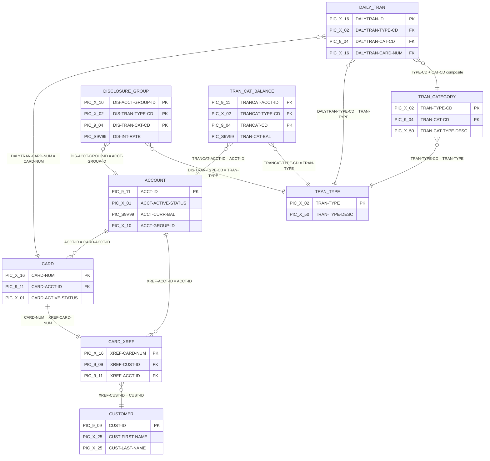

# CardDemo ASCII Data Fixtures — `app/data/ASCII/` Directory

## Overview

This directory contains 9 fixed-format ASCII plain-text data files that provide the canonical source and demo data for the CardDemo mainframe credit-card management application. All files use fixed-width positional records where each line represents one record with fields at specific byte offsets defined by corresponding COBOL copybook layouts.

These files serve as the canonical source data loaded into VSAM (Virtual Storage Access Method) datasets via JCL IDCAMS (Access Method Services) REPRO (Reproduce utility) operations during environment provisioning. Files are headerless — consumers must know byte offsets and field semantics from the corresponding COBOL copybook definitions in [`app/cpy/`](../../cpy/README.md).

The 9 files collectively represent: account master data, credit card data, customer demographics, card-to-account-to-customer cross-references, transaction category balances, daily transaction staging records, disclosure group rules, transaction category types, and transaction type codes.

## File Inventory

| File | Record Count | ASCII Record Size (bytes) | VSAM Record Size (bytes) | Copybook Layout | Description |
|------|-------------|---------------------------|--------------------------|-----------------|-------------|
| `acctdata.txt` | 50 | 300 | 300 | `CVACT01Y.cpy` | Account master data |
| `carddata.txt` | 50 | 150 | 150 | `CVACT02Y.cpy` | Credit card data |
| `custdata.txt` | 50 | 500 | 500 | `CVCUS01Y.cpy` | Customer demographic data |
| `cardxref.txt` | 50 | 36 | 50 | `CVACT03Y.cpy` | Card-account-customer cross-reference |
| `tcatbal.txt` | 50 | 50 | 50 | `CVTRA01Y.cpy` | Transaction category balance |
| `dailytran.txt` | 300 | 350 | 350 | `CVTRA06Y.cpy` | Daily transaction staging data |
| `discgrp.txt` | 51 | 50 | 50 | `CVTRA02Y.cpy` | Disclosure group reference |
| `trancatg.txt` | 18 | 60 | 60 | `CVTRA04Y.cpy` | Transaction category type reference |
| `trantype.txt` | 7 | 60 | 60 | `CVTRA03Y.cpy` | Transaction type reference |

> **Note:** `cardxref.txt` has 36-byte ASCII lines because the 14-byte trailing FILLER defined in `CVACT03Y.cpy` (RECLN 50) is trimmed in the text file. The IDCAMS REPRO utility pads records to the full 50-byte VSAM KSDS (Key-Sequenced Data Set) record size during load.

## Detailed Record Layouts

Each subsection below documents the field-level structure of a data file. Start positions are 1-based (first byte = position 1). Field names match the original COBOL copybook definitions exactly, including any misspellings present in the source.

### `acctdata.txt` — Account Master Data

Account master records store credit-card account attributes including balances, credit limits, lifecycle dates, and group assignment.

Source: `app/cpy/CVACT01Y.cpy` — Record: `ACCOUNT-RECORD`, VSAM RECLN 300

| Field Name | Start Pos | Length | PIC Clause | Description |
|------------|-----------|--------|------------|-------------|
| ACCT-ID | 1 | 11 | PIC 9(11) | Account identifier |
| ACCT-ACTIVE-STATUS | 12 | 1 | PIC X(01) | Active status flag (Y/N) |
| ACCT-CURR-BAL | 13 | 12 | PIC S9(10)V99 | Current balance (signed, implied 2 decimal places) |
| ACCT-CREDIT-LIMIT | 25 | 12 | PIC S9(10)V99 | Credit limit |
| ACCT-CASH-CREDIT-LIMIT | 37 | 12 | PIC S9(10)V99 | Cash credit limit |
| ACCT-OPEN-DATE | 49 | 10 | PIC X(10) | Account open date (YYYY-MM-DD) |
| ACCT-EXPIRAION-DATE | 59 | 10 | PIC X(10) | Expiration date (note: misspelling is in original copybook) |
| ACCT-REISSUE-DATE | 69 | 10 | PIC X(10) | Reissue date |
| ACCT-CURR-CYC-CREDIT | 79 | 12 | PIC S9(10)V99 | Current cycle credit total |
| ACCT-CURR-CYC-DEBIT | 91 | 12 | PIC S9(10)V99 | Current cycle debit total |
| ACCT-ADDR-ZIP | 103 | 10 | PIC X(10) | Address ZIP code |
| ACCT-GROUP-ID | 113 | 10 | PIC X(10) | Account group identifier |
| FILLER | 123 | 178 | PIC X(178) | Reserved padding to 300 bytes |

### `carddata.txt` — Credit Card Data

Credit card records store card-level details including the card number, associated account, CVV code, embossed name, and active status.

Source: `app/cpy/CVACT02Y.cpy` — Record: `CARD-RECORD`, VSAM RECLN 150

| Field Name | Start Pos | Length | PIC Clause | Description |
|------------|-----------|--------|------------|-------------|
| CARD-NUM | 1 | 16 | PIC X(16) | Card number |
| CARD-ACCT-ID | 17 | 11 | PIC 9(11) | Account identifier (links to ACCOUNT-RECORD) |
| CARD-CVV-CD | 28 | 3 | PIC 9(03) | CVV verification code |
| CARD-EMBOSSED-NAME | 31 | 50 | PIC X(50) | Embossed cardholder name |
| CARD-EXPIRAION-DATE | 81 | 10 | PIC X(10) | Expiration date (note: misspelling is in original copybook) |
| CARD-ACTIVE-STATUS | 91 | 1 | PIC X(01) | Active status flag (Y/N) |
| FILLER | 92 | 59 | PIC X(59) | Reserved padding to 150 bytes |

### `custdata.txt` — Customer Demographic Data

Customer records store personal demographics, contact information, address fields, government IDs, and credit scoring data.

Source: `app/cpy/CVCUS01Y.cpy` — Record: `CUSTOMER-RECORD`, VSAM RECLN 500

| Field Name | Start Pos | Length | PIC Clause | Description |
|------------|-----------|--------|------------|-------------|
| CUST-ID | 1 | 9 | PIC 9(09) | Customer identifier |
| CUST-FIRST-NAME | 10 | 25 | PIC X(25) | First name |
| CUST-MIDDLE-NAME | 35 | 25 | PIC X(25) | Middle name |
| CUST-LAST-NAME | 60 | 25 | PIC X(25) | Last name |
| CUST-ADDR-LINE-1 | 85 | 50 | PIC X(50) | Address line 1 |
| CUST-ADDR-LINE-2 | 135 | 50 | PIC X(50) | Address line 2 |
| CUST-ADDR-LINE-3 | 185 | 50 | PIC X(50) | Address line 3 |
| CUST-ADDR-STATE-CD | 235 | 2 | PIC X(02) | US state code |
| CUST-ADDR-COUNTRY-CD | 237 | 3 | PIC X(03) | Country code |
| CUST-ADDR-ZIP | 240 | 10 | PIC X(10) | ZIP code |
| CUST-PHONE-NUM-1 | 250 | 15 | PIC X(15) | Primary phone number |
| CUST-PHONE-NUM-2 | 265 | 15 | PIC X(15) | Secondary phone number |
| CUST-SSN | 280 | 9 | PIC 9(09) | Social Security Number |
| CUST-GOVT-ISSUED-ID | 289 | 20 | PIC X(20) | Government-issued ID |
| CUST-DOB-YYYY-MM-DD | 309 | 10 | PIC X(10) | Date of birth (YYYY-MM-DD) |
| CUST-EFT-ACCOUNT-ID | 319 | 10 | PIC X(10) | EFT account identifier |
| CUST-PRI-CARD-HOLDER-IND | 329 | 1 | PIC X(01) | Primary cardholder indicator (Y/N) |
| CUST-FICO-CREDIT-SCORE | 330 | 3 | PIC 9(03) | FICO credit score |
| FILLER | 333 | 168 | PIC X(168) | Reserved padding to 500 bytes |

### `cardxref.txt` — Card-Account-Customer Cross-Reference

Cross-reference records link a card number to its owning customer and account, forming the central join entity in the CardDemo data model.

Source: `app/cpy/CVACT03Y.cpy` — Record: `CARD-XREF-RECORD`, VSAM RECLN 50

| Field Name | Start Pos | Length | PIC Clause | Description |
|------------|-----------|--------|------------|-------------|
| XREF-CARD-NUM | 1 | 16 | PIC X(16) | Card number (links to CARD-RECORD) |
| XREF-CUST-ID | 17 | 9 | PIC 9(09) | Customer ID (links to CUSTOMER-RECORD) |
| XREF-ACCT-ID | 26 | 11 | PIC 9(11) | Account ID (links to ACCOUNT-RECORD) |
| FILLER | 37 | 14 | PIC X(14) | Reserved padding to 50 bytes — **trimmed in ASCII file** |

> **Note:** The ASCII file contains 36-byte lines (data fields only). The 14-byte FILLER is trimmed in the text file representation. IDCAMS REPRO pads records to the full 50-byte VSAM record size during load.

### `tcatbal.txt` — Transaction Category Balance

Transaction category balance records track running balance totals per account, transaction type, and transaction category combination. This record uses a composite key structure (`TRAN-CAT-KEY` group at 05 level contains three 10-level fields).

Source: `app/cpy/CVTRA01Y.cpy` — Record: `TRAN-CAT-BAL-RECORD`, VSAM RECLN 50

| Field Name | Start Pos | Length | PIC Clause | Description |
|------------|-----------|--------|------------|-------------|
| TRANCAT-ACCT-ID | 1 | 11 | PIC 9(11) | Account identifier (part of composite key) |
| TRANCAT-TYPE-CD | 12 | 2 | PIC X(02) | Transaction type code (part of composite key) |
| TRANCAT-CD | 14 | 4 | PIC 9(04) | Transaction category code (part of composite key) |
| TRAN-CAT-BAL | 18 | 11 | PIC S9(09)V99 | Category balance (signed, implied 2 decimal places) |
| FILLER | 29 | 22 | PIC X(22) | Reserved padding to 50 bytes |

### `dailytran.txt` — Daily Transaction Staging Data

Daily transaction staging records capture individual credit-card transactions awaiting batch processing. Each record includes transaction identification, merchant details, timestamps, and the card number linking to the cross-reference chain.

Source: `app/cpy/CVTRA06Y.cpy` — Record: `DALYTRAN-RECORD`, VSAM RECLN 350

| Field Name | Start Pos | Length | PIC Clause | Description |
|------------|-----------|--------|------------|-------------|
| DALYTRAN-ID | 1 | 16 | PIC X(16) | Transaction identifier |
| DALYTRAN-TYPE-CD | 17 | 2 | PIC X(02) | Transaction type code |
| DALYTRAN-CAT-CD | 19 | 4 | PIC 9(04) | Transaction category code |
| DALYTRAN-SOURCE | 23 | 10 | PIC X(10) | Transaction source (e.g., POS TERM, OPERATOR) |
| DALYTRAN-DESC | 33 | 100 | PIC X(100) | Transaction description |
| DALYTRAN-AMT | 133 | 11 | PIC S9(09)V99 | Transaction amount (signed, implied 2 decimal places) |
| DALYTRAN-MERCHANT-ID | 144 | 9 | PIC 9(09) | Merchant identifier |
| DALYTRAN-MERCHANT-NAME | 153 | 50 | PIC X(50) | Merchant name |
| DALYTRAN-MERCHANT-CITY | 203 | 50 | PIC X(50) | Merchant city |
| DALYTRAN-MERCHANT-ZIP | 253 | 10 | PIC X(10) | Merchant ZIP code |
| DALYTRAN-CARD-NUM | 263 | 16 | PIC X(16) | Card number (links to CARD-RECORD cross-reference chain) |
| DALYTRAN-ORIG-TS | 279 | 26 | PIC X(26) | Original timestamp (YYYY-MM-DD HH:MM:SS.mmmmmm) |
| DALYTRAN-PROC-TS | 305 | 26 | PIC X(26) | Processed timestamp |
| FILLER | 331 | 20 | PIC X(20) | Reserved padding to 350 bytes |

### `discgrp.txt` — Disclosure Group Reference

Disclosure group records define interest rates applied to specific account-group, transaction-type, and transaction-category combinations. This record uses a composite key structure (`DIS-GROUP-KEY` group at 05 level contains three 10-level fields).

Source: `app/cpy/CVTRA02Y.cpy` — Record: `DIS-GROUP-RECORD`, VSAM RECLN 50

| Field Name | Start Pos | Length | PIC Clause | Description |
|------------|-----------|--------|------------|-------------|
| DIS-ACCT-GROUP-ID | 1 | 10 | PIC X(10) | Account group identifier |
| DIS-TRAN-TYPE-CD | 11 | 2 | PIC X(02) | Transaction type code |
| DIS-TRAN-CAT-CD | 13 | 4 | PIC 9(04) | Transaction category code |
| DIS-INT-RATE | 17 | 6 | PIC S9(04)V99 | Interest rate (signed, implied 2 decimal places) |
| FILLER | 23 | 28 | PIC X(28) | Reserved padding to 50 bytes |

### `trancatg.txt` — Transaction Category Type Reference

Transaction category type records define the category codes within each transaction type, providing descriptive labels for transaction subcategories. This record uses a composite key structure (`TRAN-CAT-KEY` group at 05 level contains two 10-level fields).

Source: `app/cpy/CVTRA04Y.cpy` — Record: `TRAN-CAT-RECORD`, VSAM RECLN 60

| Field Name | Start Pos | Length | PIC Clause | Description |
|------------|-----------|--------|------------|-------------|
| TRAN-TYPE-CD | 1 | 2 | PIC X(02) | Transaction type code (part of composite key) |
| TRAN-CAT-CD | 3 | 4 | PIC 9(04) | Transaction category code (part of composite key) |
| TRAN-CAT-TYPE-DESC | 7 | 50 | PIC X(50) | Category type description |
| FILLER | 57 | 4 | PIC X(04) | Reserved padding to 60 bytes |

### `trantype.txt` — Transaction Type Reference

Transaction type records define the top-level transaction classification codes used throughout the CardDemo system.

Source: `app/cpy/CVTRA03Y.cpy` — Record: `TRAN-TYPE-RECORD`, VSAM RECLN 60

| Field Name | Start Pos | Length | PIC Clause | Description |
|------------|-----------|--------|------------|-------------|
| TRAN-TYPE | 1 | 2 | PIC X(02) | Transaction type code (01–07) |
| TRAN-TYPE-DESC | 3 | 50 | PIC X(50) | Type description (Purchase, Payment, Credit, Authorization, Refund, Reversal, Adjustment) |
| FILLER | 53 | 8 | PIC X(08) | Reserved padding to 60 bytes |

## Data Relationships

The 9 data files form an interconnected entity model for the CardDemo application. The cross-reference file (`cardxref.txt`) serves as the central join entity linking cards, accounts, and customers. Transaction-related reference files define the classification hierarchy, and the disclosure group file maps interest rates to specific account-group and transaction-type combinations.

### Key Entity Relationships

- **Account → Card (1:N):** One account holds one or more credit cards. Linked via `ACCT-ID` in `acctdata.txt` and `CARD-ACCT-ID` in `carddata.txt`.
- **Card → Cross-Reference (1:1):** Each card has exactly one cross-reference entry. Linked via `CARD-NUM` in `carddata.txt` and `XREF-CARD-NUM` in `cardxref.txt`.
- **Cross-Reference → Customer (N:1):** Multiple cross-reference entries can point to the same customer. Linked via `XREF-CUST-ID` and `CUST-ID` in `custdata.txt`.
- **Cross-Reference → Account (N:1):** The cross-reference also links back to the account. Linked via `XREF-ACCT-ID` and `ACCT-ID` in `acctdata.txt`.
- **Daily Transaction → Card (N:1):** Each daily transaction references a card number. Linked via `DALYTRAN-CARD-NUM` through the `CARD-XREF-RECORD` chain.
- **Daily Transaction → Transaction Type (N:1):** Each transaction has a type code. Linked via `DALYTRAN-TYPE-CD` and `TRAN-TYPE` in `trantype.txt`.
- **Daily Transaction → Transaction Category (N:1):** Each transaction has a type + category composite reference. Linked via `DALYTRAN-TYPE-CD` + `DALYTRAN-CAT-CD` to `TRAN-TYPE-CD` + `TRAN-CAT-CD` in `trancatg.txt`.
- **Disclosure Group → Account Group + Transaction Type/Category:** Maps interest rates to specific account-group and transaction-type/category combinations. Uses the composite key `DIS-ACCT-GROUP-ID` + `DIS-TRAN-TYPE-CD` + `DIS-TRAN-CAT-CD`.
- **Transaction Category Balance → Account + Type + Category:** Tracks running balance totals per composite key `TRANCAT-ACCT-ID` + `TRANCAT-TYPE-CD` + `TRANCAT-CD`.

## Usage Context

### 1. Environment Provisioning

These files are loaded into VSAM KSDS datasets by JCL provisioning jobs using the IDCAMS REPRO utility. Each data file has a corresponding JCL job in [`app/jcl/`](../../jcl/README.md):

| Data File | JCL Job | Target VSAM Dataset |
|-----------|---------|---------------------|
| `acctdata.txt` | ACCTFILE | AWS.M2.CARDDEMO.ACCTDATA |
| `carddata.txt` | CARDFILE | AWS.M2.CARDDEMO.CARDDATA |
| `custdata.txt` | CUSTFILE | AWS.M2.CARDDEMO.CUSTDATA |
| `cardxref.txt` | XREFFILE | AWS.M2.CARDDEMO.CARDXREF |
| `tcatbal.txt` | TCATBALF | AWS.M2.CARDDEMO.TCATBALF |
| `dailytran.txt` | TRANFILE | AWS.M2.CARDDEMO.TRANSACT |
| `discgrp.txt` | DISCGRP | AWS.M2.CARDDEMO.DISCGRP |
| `trancatg.txt` | TRANCATG | AWS.M2.CARDDEMO.TRANCATG |
| `trantype.txt` | TRANTYPE | AWS.M2.CARDDEMO.TRANTYPE |

See the [JCL Operations Guide](../../jcl/README.md) for execution order and job dependency details.

### 2. Demo Scenarios

The fixture data provides a reproducible initial state for the CardDemo application with:

- **50 accounts** — each with balance, credit limit, and lifecycle dates
- **50 cards** — linked to accounts with CVV codes, embossed names, and expiration dates
- **50 customers** — with full demographic profiles including addresses, phone numbers, and credit scores
- **50 cross-references** — linking every card to its customer and account
- **300 daily transactions** — staging records representing pending credit-card transactions
- **51 disclosure groups** — interest rate rules per account group and transaction classification
- **50 transaction category balances** — running totals per account and category
- **18 transaction categories** — subcategory descriptions within transaction types
- **7 transaction types** — top-level classification codes (Purchase, Payment, Credit, Authorization, Refund, Reversal, Adjustment)

### 3. Batch Pipeline Testing

The `dailytran.txt` transaction data feeds the 5-stage batch processing pipeline:

1. **POSTTRAN** — Validates and posts daily transactions
2. **INTCALC** — Calculates interest charges per account
3. **COMBTRAN** — Combines posted and new transactions
4. **CREASTMT** — Generates customer statements (text and HTML)
5. **TRANREPT** — Produces transaction reports with date filtering

See the [COBOL Programs catalog](../../cbl/README.md) for batch program details.

### 4. Test Data Reset

To restore the demo environment to its baseline state, re-run the JCL provisioning jobs in the documented execution order. This reloads all 9 ASCII files into their respective VSAM datasets, resetting balances, transactions, and reference data to the original fixture values.

## Handling Warnings

Working with fixed-format mainframe data files requires attention to several data integrity considerations:

1. **Byte-accurate sensitivity:** Trailing spaces are significant for fixed-width records. Text editors or tools that auto-trim trailing whitespace will corrupt the data by shortening records below the expected byte length.

2. **Line endings:** Files use Unix-style LF line endings in the repository. Mainframe upload may require conversion to EBCDIC encoding or specific file transfer mode settings (e.g., binary mode FTP to preserve byte accuracy).

3. **No header rows:** Files contain data records only — there are no column headers, metadata rows, or trailing summary records. The first byte of the first line is the first field of the first data record.

4. **Record order:** Records within key-sequenced files must maintain ascending key order for VSAM KSDS loading. The IDCAMS REPRO utility expects input records in key sequence when loading into a KSDS cluster.

5. **Signed numeric fields:** Fields defined with `PIC S9(n)V99` use zoned decimal sign representation in DISPLAY format. The last byte of the field encodes the sign (e.g., `{` represents positive zero, `}` represents negative zero). The implied decimal point (`V99`) does not occupy a physical byte — the last two digits are the decimal fraction.

6. **FILLER trimming:** The ASCII text representation of `cardxref.txt` trims the 14-byte FILLER field, resulting in 36-byte lines. The actual VSAM record is 50 bytes — IDCAMS REPRO pads the records during load.

> **Recommendation:** Edit these files only with byte-aware editors that preserve trailing spaces and fixed-width formatting. Avoid using spreadsheet applications, auto-formatting text editors, or tools that normalize whitespace.

## References

- [Data Fixtures Overview](../README.md) — parent directory documentation
- [Copybook Library](../../cpy/README.md) — COBOL copybook definitions for all record layouts
- [JCL Operations Guide](../../jcl/README.md) — data loading jobs and execution order
- [COBOL Programs](../../cbl/README.md) — online and batch programs that consume this data
- [Main README](../../../README.md) — application overview and installation guide
