# CardDemo Data Fixtures — `app/data/` Directory

## Overview

The `app/data/` directory serves as the **file-based data fixture area** for the AWS CardDemo mainframe credit-card management application. It contains test and demo data that seeds the runtime VSAM (Virtual Storage Access Method) datasets used by CardDemo's online CICS programs and batch COBOL jobs.

Data fixtures exist in two formats:

- **ASCII** (`ASCII/`) — 9 human-readable fixed-format plain-text data files. These are the **canonical source** for batch ingestion into VSAM KSDS (Key-Sequenced Data Set) clusters via IDCAMS (Access Method Services) REPRO (Reproduce utility) operations executed by JCL provisioning jobs in [`app/jcl/`](../jcl/README.md).
- **EBCDIC** (`EBCDIC/`) — 12 pre-converted EBCDIC binary datasets plus a `.gitkeep` sentinel. These are content-equivalent to the ASCII counterparts and are intended for direct binary transfer to the mainframe environment, bypassing the ASCII-to-EBCDIC code-page conversion step.

The ASCII files are the primary documented fixture source. JCL provisioning jobs read these files, convert and pad records to the full VSAM record length, and load them into KSDS clusters where CardDemo COBOL programs access them at runtime.

> For complete mainframe installation instructions — including dataset creation, sample data upload, JCL execution order, CICS resource installation, and program compilation — see the [Main README](../../README.md).

---

## Directory Structure

| Directory | Contents | File Count | Description |
|-----------|----------|:----------:|-------------|
| [`ASCII/`](ASCII/README.md) | Fixed-format plain-text data files | 9 files | Human-readable positional records for batch ingestion via IDCAMS REPRO |
| `EBCDIC/` | Binary mainframe datasets | 12 files + `.gitkeep` | Pre-converted EBCDIC binary equivalents for direct mainframe binary transfer |

The `ASCII/` directory is the **primary documented fixture source** with detailed file format specifications in its own [README](ASCII/README.md). The `EBCDIC/` directory contains binary equivalents that are not further documented here — they carry the same logical record content in mainframe-native encoding.

---

## Data Flow Diagram

The following diagram illustrates how ASCII fixture files flow through JCL provisioning jobs into VSAM datasets, which CardDemo COBOL programs then access at runtime.

```mermaid
flowchart LR
    subgraph ASCII["ASCII Fixture Files<br/>(app/data/ASCII/)"]
        A1["acctdata.txt"]
        A2["carddata.txt"]
        A3["custdata.txt"]
        A4["cardxref.txt"]
        A5["dailytran.txt"]
        A6["discgrp.txt"]
        A7["tcatbal.txt"]
        A8["trancatg.txt"]
        A9["trantype.txt"]
    end

    subgraph JCL["JCL Provisioning Jobs<br/>(app/jcl/) — IDCAMS REPRO"]
        J1["ACCTFILE.jcl"]
        J2["CARDFILE.jcl"]
        J3["CUSTFILE.jcl"]
        J4["XREFFILE.jcl"]
        J5["TRANFILE.jcl"]
        J6["DISCGRP.jcl"]
        J7["TCATBALF.jcl"]
        J8["TRANCATG.jcl"]
        J9["TRANTYPE.jcl"]
    end

    subgraph VSAM["VSAM KSDS Datasets<br/>(z/OS Catalog)"]
        V1["ACCTDATA.VSAM.KSDS"]
        V2["CARDDATA.VSAM.KSDS"]
        V3["CUSTDATA.VSAM.KSDS"]
        V4["CARDXREF.VSAM.KSDS"]
        V5["TRANSACT.VSAM.KSDS"]
        V6["DISCGRP.VSAM.KSDS"]
        V7["TCATBALF.VSAM.KSDS"]
        V8["TRANCATG.VSAM.KSDS"]
        V9["TRANTYPE.VSAM.KSDS"]
    end

    COBOL["COBOL Programs<br/>(app/cbl/)"]

    A1 --> J1 --> V1
    A2 --> J2 --> V2
    A3 --> J3 --> V3
    A4 --> J4 --> V4
    A5 --> J5 --> V5
    A6 --> J6 --> V6
    A7 --> J7 --> V7
    A8 --> J8 --> V8
    A9 --> J9 --> V9

    V1 --> COBOL
    V2 --> COBOL
    V3 --> COBOL
    V4 --> COBOL
    V5 --> COBOL
    V6 --> COBOL
    V7 --> COBOL
    V8 --> COBOL
    V9 --> COBOL
```

**Flow summary:**

1. **ASCII fixture files** contain fixed-width positional records — one record per line, newline-delimited.
2. **JCL provisioning jobs** execute IDCAMS `DEFINE CLUSTER` (to create or recreate the VSAM cluster) followed by `REPRO INFILE(...) OUTFILE(...)` (to load records from the flat file into the VSAM dataset).
3. **VSAM KSDS datasets** store records indexed by primary key for keyed access by COBOL programs.
4. **COBOL programs** (both online CICS programs and batch programs) read and write records via CICS file control commands (`EXEC CICS READ`, `EXEC CICS WRITE`, etc.) or native COBOL I/O verbs (`READ`, `WRITE`, `REWRITE`).

---

## Cross-Reference to COBOL Copybooks

Each ASCII fixture file corresponds to a COBOL copybook that defines the byte-level record layout. The copybook specifies field names, data types (PIC clauses), sizes, and the total VSAM record length. All copybooks reside in the [Copybook Library](../cpy/README.md).

| Data File | Copybook Layout | Record Name | VSAM Record Size (bytes) | ASCII Line Size (bytes) | Record Count | Description |
|-----------|----------------|-------------|:------------------------:|:-----------------------:|:------------:|-------------|
| `acctdata.txt` | `CVACT01Y.cpy` | `ACCOUNT-RECORD` | 300 | 300 | 50 | Account master — ID, active status, balances, credit limits, dates, ZIP, group ID |
| `carddata.txt` | `CVACT02Y.cpy` | `CARD-RECORD` | 150 | 150 | 50 | Credit card — card number, account link, CVV, embossed name, expiry, active status |
| `custdata.txt` | `CVCUS01Y.cpy` | `CUSTOMER-RECORD` | 500 | 500 | 50 | Customer demographics — name, 3-line address, state, country, ZIP, phones, SSN, DOB, FICO |
| `cardxref.txt` | `CVACT03Y.cpy` | `CARD-XREF-RECORD` | 50 | 36 | 50 | Card-to-account-to-customer cross-reference linking three entity keys |
| `tcatbal.txt` | `CVTRA01Y.cpy` | `TRAN-CAT-BAL-RECORD` | 50 | 50 | 50 | Transaction category balance — composite key (account + type + category) with running balance |
| `dailytran.txt` | `CVTRA06Y.cpy` | `DALYTRAN-RECORD` | 350 | 350 | 300 | Daily transaction staging — merchant, amount, card, timestamps for batch posting |
| `discgrp.txt` | `CVTRA02Y.cpy` | `DIS-GROUP-RECORD` | 50 | 50 | 51 | Disclosure group — interest rate lookup by account group, transaction type, and category |
| `trancatg.txt` | `CVTRA04Y.cpy` | `TRAN-CAT-RECORD` | 60 | 60 | 18 | Transaction category — subcategory code and description within a transaction type family |
| `trantype.txt` | `CVTRA03Y.cpy` | `TRAN-TYPE-RECORD` | 60 | 60 | 7 | Transaction type — 2-byte type code mapped to 50-character description |

> **Note on ASCII line sizes vs. VSAM record sizes:** Most ASCII fixture files carry the full VSAM record length per line (including trailing FILLER spaces). The exception is `cardxref.txt`, where ASCII lines contain only the 36 data-bearing bytes (XREF-CARD-NUM 16 + XREF-CUST-ID 9 + XREF-ACCT-ID 11 = 36) while the VSAM `CARD-XREF-RECORD` is 50 bytes (with a 14-byte FILLER defined in `CVACT03Y.cpy`). The IDCAMS REPRO process pads records to the full VSAM record size during load.

> Source: Record layout definitions from `app/cpy/CVACT01Y.cpy`, `CVACT02Y.cpy`, `CVACT03Y.cpy`, `CVCUS01Y.cpy`, `CVTRA01Y.cpy`, `CVTRA02Y.cpy`, `CVTRA03Y.cpy`, `CVTRA04Y.cpy`, `CVTRA06Y.cpy`

---

## References

- **[ASCII File Format Details](ASCII/README.md)** — Detailed record layouts, field offset tables, and per-file format specifications for all 9 ASCII fixture files
- **[Copybook Library](../cpy/README.md)** — Complete reference for all 28 COBOL copybooks including the record layout definitions that govern these data files
- **[JCL Operations Guide](../jcl/README.md)** — Provisioning job documentation including the VSAM cluster `DEFINE CLUSTER` and `REPRO` load sequences that consume these fixtures
- **[Main README](../../README.md)** — Full installation instructions, application overview, batch execution order, and CardDemo system context
