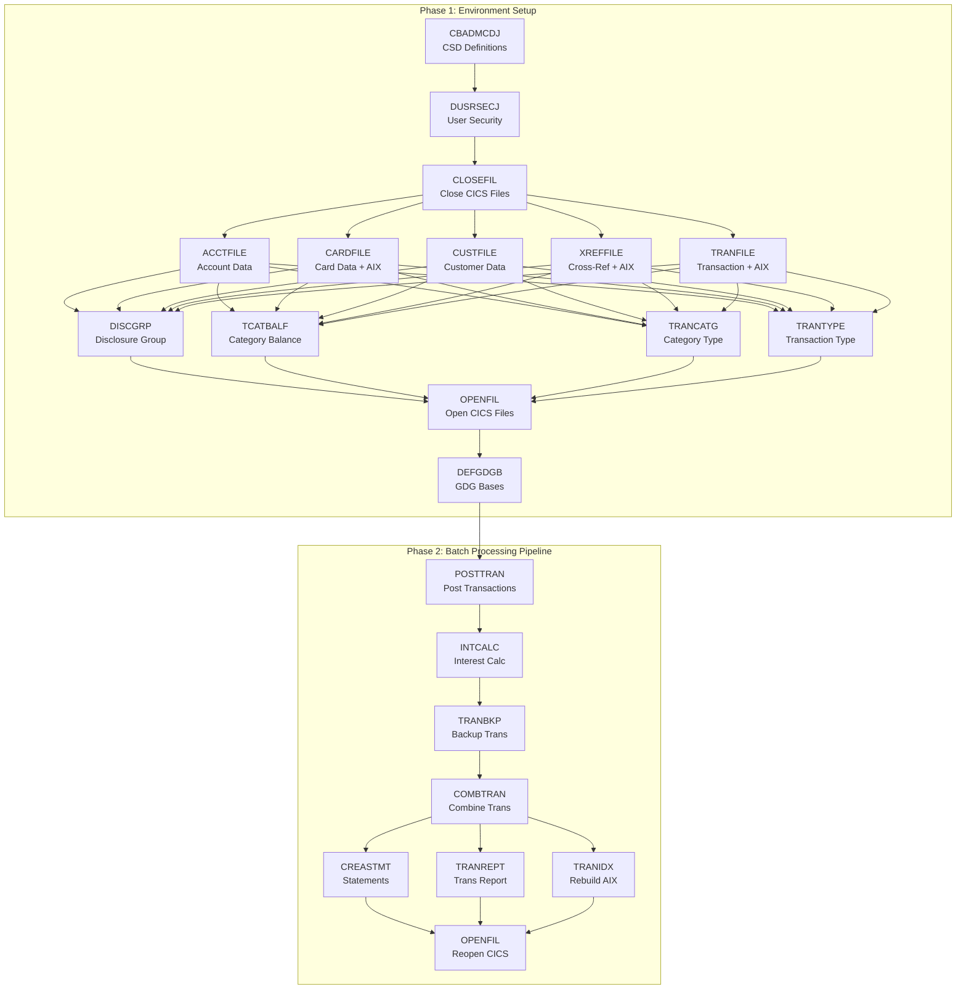

# JCL Operations Guide — `app/jcl/`

> **Module:** `app/jcl/` · **Files:** 29 JCL job members · **Source:** [Main README](../../README.md) · **Parent:** [Application Overview](../README.md)

## Overview

This directory contains 29 z/OS JCL (Job Control Language) job members that manage the complete lifecycle of the CardDemo application's VSAM (Virtual Storage Access Method) datasets and batch processing pipeline. These jobs are submitted via JES (Job Entry Subsystem) batch processing and cover five functional areas:

- **Environment Provisioning** — Define, delete, and load VSAM KSDS (Key-Sequenced Data Set) clusters from flat-file seed data
- **CICS Administration** — Register resources in the CSD (CICS System Definition) file and manage CICS file open/close state
- **Business Batch Processing** — Execute the daily transaction posting, interest calculation, statement generation, and reporting pipeline
- **Dataset Utilities** — Back up, merge, and reformat VSAM datasets for operational continuity
- **Diagnostic Read Utilities** — Invoke batch COBOL programs that sequentially read and display VSAM file contents

### Technology Context

| Utility / Program | Purpose |
|:------------------|:--------|
| IDCAMS | Access Method Services — defines, deletes, and copies VSAM clusters, AIX (Alternate Index) entries, GDG (Generation Data Group) bases, and PATH objects |
| DFSORT / SORT | Sorts, merges, filters, and reformats sequential and VSAM datasets |
| SDSF | System Display and Search Facility — sends MVS modify (`/F`) commands to the CICS region for CEMT file operations |
| DFHCSDUP | CICS CSD batch utility — defines programs, transactions, mapsets, files, and libraries in the CICS System Definition dataset |
| IEFBR14 | Null program — used for dataset allocation and deletion through DD statement dispositions |
| IEBGENER | Sequential copy utility — copies in-stream data or sequential files to a target dataset |

### Naming Conventions

- All VSAM datasets use the `AWS.M2.CARDDEMO.*` high-level qualifier (HLQ) prefix.
- The target DASD volume is `AWSHJ1` for all provisioning jobs, except `CREASTMT.JCL` which uses volume `TSU023`.
- GDG bases follow the pattern `AWS.M2.CARDDEMO.<entity>` with relative generation references `(+1)` and `(0)`.
- Load libraries are located at `AWS.M2.CARDDEMO.LOADLIB`; cataloged procedures reside in `AWS.M2.CARDDEMO.PROC`.

---

## Job Categorization

### Provisioning / Rebuild (12 Jobs)

These jobs perform idempotent delete-define-load cycles for VSAM clusters. Each job deletes any pre-existing cluster (suppressing "not found" errors via `SET MAXCC`), defines a new KSDS cluster, and loads seed data from a flat PS (Physical Sequential) dataset using IDCAMS `REPRO`. Jobs that manage datasets accessed by CICS also include SDSF steps to close and reopen the corresponding CICS file resources.

| Job | File | Dataset | Key (len/off) | Record Size | Description |
|:----|:-----|:--------|:--------------|:------------|:------------|
| ACCTFILE | `ACCTFILE.jcl` | ACCTDATA.VSAM.KSDS | 11 / 0 | 300 | Account master KSDS — delete, define, load from `ACCTDATA.PS` |
| CARDFILE | `CARDFILE.jcl` | CARDDATA.VSAM.KSDS | 16 / 0 | 150 | Card master KSDS + AIX (account key 11/16) + PATH + BLDINDEX, with CICS close/open |
| CUSTFILE | `CUSTFILE.jcl` | CUSTDATA.VSAM.KSDS | 9 / 0 | 500 | Customer master KSDS — delete, define, load, with CICS close/open |
| XREFFILE | `XREFFILE.jcl` | CARDXREF.VSAM.KSDS | 16 / 0 | 50 | Card-account cross-reference KSDS + AIX (account key 11/25) + PATH + BLDINDEX |
| TRANFILE | `TRANFILE.jcl` | TRANSACT.VSAM.KSDS | 16 / 0 | 350 | Transaction master KSDS + AIX (timestamp key 26/304) + PATH + BLDINDEX, with CICS close/open |
| TCATBALF | `TCATBALF.jcl` | TCATBALF.VSAM.KSDS | 17 / 0 | 50 | Transaction category balance KSDS — delete, define, load from `TCATBALF.PS` |
| TRANCATG | `TRANCATG.jcl` | TRANCATG.VSAM.KSDS | 6 / 0 | 60 | Transaction category type lookup KSDS — delete, define, load from `TRANCATG.PS` |
| TRANTYPE | `TRANTYPE.jcl` | TRANTYPE.VSAM.KSDS | 2 / 0 | 60 | Transaction type lookup KSDS — delete, define, load from `TRANTYPE.PS` |
| DISCGRP | `DISCGRP.jcl` | DISCGRP.VSAM.KSDS | 16 / 0 | 50 | Disclosure group reference KSDS — delete, define, load from `DISCGRP.PS` |
| DUSRSECJ | `DUSRSECJ.jcl` | USRSEC.VSAM.KSDS | 8 / 0 | 80 | User security KSDS — seeds from in-stream inline data (10 user records: 5 admin, 5 regular) via IEBGENER + IDCAMS |
| DEFCUST | `DEFCUST.jcl` | AWS.CUSTDATA.CLUSTER | 10 / 0 | 500 | Primitive customer define — draft job, does not follow `AWS.M2.CARDDEMO.*` naming convention |
| TRANIDX | `TRANIDX.jcl` | TRANSACT.VSAM.AIX | 26 / 304 | 350 | Defines AIX + PATH on existing transaction master base cluster, then runs BLDINDEX |

> **Source:** `app/jcl/ACCTFILE.jcl`, `app/jcl/CARDFILE.jcl`, `app/jcl/CUSTFILE.jcl`, `app/jcl/XREFFILE.jcl`, `app/jcl/TRANFILE.jcl`, `app/jcl/TCATBALF.jcl`, `app/jcl/TRANCATG.jcl`, `app/jcl/TRANTYPE.jcl`, `app/jcl/DISCGRP.jcl`, `app/jcl/DUSRSECJ.jcl`, `app/jcl/DEFCUST.jcl`, `app/jcl/TRANIDX.jcl`

### GDG Setup (3 Jobs)

These jobs define GDG (Generation Data Group) base entries using IDCAMS `DEFINE GENERATIONDATAGROUP`. GDG bases enable automatic versioning of sequential backup and output datasets used by the batch processing pipeline.

| Job | File | GDG Base(s) Defined | Limit | Description |
|:----|:-----|:--------------------|:------|:------------|
| DEFGDGB | `DEFGDGB.jcl` | `TRANSACT.BKUP`, `TRANSACT.DALY`, `TRANREPT`, `TCATBALF.BKUP`, `SYSTRAN`, `TRANSACT.COMBINED` | 5 each | Defines all 6 GDG bases needed by the batch processing pipeline, with SCRATCH option |
| REPTFILE | `REPTFILE.jcl` | `TRANREPT` | 10 | Defines the transaction report GDG base with a higher generation limit of 10 |
| DALYREJS | `DALYREJS.jcl` | `DALYREJS` | 5 | Defines the daily rejection GDG base for rejected transactions from POSTTRAN |

> **Source:** `app/jcl/DEFGDGB.jcl`, `app/jcl/REPTFILE.jcl`, `app/jcl/DALYREJS.jcl`

### CICS Administration (3 Jobs)

These jobs manage CICS region resources — defining application entries in the CSD file and controlling the open/close state of VSAM files registered with CICS.

| Job | File | Utility | Function | Target |
|:----|:-----|:--------|:---------|:-------|
| CBADMCDJ | `CBADMCDJ.jcl` | DFHCSDUP | Defines the CARDDEMO group in the CSD: LIBRARY, MAPSETs, PROGRAMs, TRANSACTIONs, and LIST commands | DFHCSD dataset |
| CLOSEFIL | `CLOSEFIL.jcl` | SDSF | Closes CICS file resources (TRANSACT, CCXREF, ACCTDAT, CXACAIX, USRSEC) via CEMT SET FIL(...) CLO | CICSAWSA region |
| OPENFIL | `OPENFIL.jcl` | SDSF | Opens CICS file resources (TRANSACT, CCXREF, ACCTDAT, CXACAIX, USRSEC) via CEMT SET FIL(...) OPE | CICSAWSA region |

> **Source:** `app/jcl/CBADMCDJ.jcl`, `app/jcl/CLOSEFIL.jcl`, `app/jcl/OPENFIL.jcl`

### Business Batch Processing (5 Jobs)

These jobs execute the CardDemo daily batch processing pipeline. They run COBOL batch programs from `AWS.M2.CARDDEMO.LOADLIB` and use DFSORT for data transformation tasks.

| Job | File | Program | Function |
|:----|:-----|:--------|:---------|
| POSTTRAN | `POSTTRAN.jcl` | CBTRN02C | Reads daily transactions from `DALYTRAN.PS`, validates against cross-reference and account data, posts valid transactions to `TRANSACT.VSAM.KSDS`, updates `TCATBALF.VSAM.KSDS` category balances, and writes rejected transactions to `DALYREJS(+1)` GDG |
| INTCALC | `INTCALC.jcl` | CBACT04C | Processes `TCATBALF.VSAM.KSDS` to compute interest and fees using disclosure group rates from `DISCGRP.VSAM.KSDS`, cross-references via `CARDXREF.VSAM.AIX.PATH`, and writes system-generated transactions to `SYSTRAN(+1)` GDG. Accepts a date parameter via `PARM='2022071800'` |
| COMBTRAN | `COMBTRAN.jcl` | SORT + IDCAMS | Sorts and merges the transaction backup `TRANSACT.BKUP(0)` with system-generated transactions `SYSTRAN(0)` by transaction ID, then loads the combined sorted output into `TRANSACT.VSAM.KSDS` via IDCAMS REPRO |
| TRANREPT | `TRANREPT.jcl` | CBTRN03C | Unloads transaction VSAM to sequential backup via REPROC procedure, filters transactions by date range using DFSORT SYMNAMES and INCLUDE COND, sorts by card number, and produces a formatted report to `TRANREPT(+1)` GDG |
| CREASTMT | `CREASTMT.JCL` | CBSTM03A | Creates a temporary VSAM work file `TRXFL.VSAM.KSDS` rekeyed by card number, then generates both plain-text (`STATEMNT.PS`) and HTML (`STATEMNT.HTML`) account statements using 4-entity join across transactions, cross-references, accounts, and customers |

> **Source:** `app/jcl/POSTTRAN.jcl`, `app/jcl/INTCALC.jcl`, `app/jcl/COMBTRAN.jcl`, `app/jcl/TRANREPT.jcl`, `app/jcl/CREASTMT.JCL`

### Dataset Utilities (3 Jobs)

These utility jobs manage dataset backup, reformatting, and reporting operations.

| Job | File | Function |
|:----|:-----|:---------|
| TRANBKP | `TRANBKP.jcl` | Backs up `TRANSACT.VSAM.KSDS` to `TRANSACT.BKUP(+1)` GDG via REPROC procedure, then deletes and redefines the transaction VSAM cluster as empty (ready for reload) |
| PRTCATBL | `PRTCATBL.jcl` | Unloads `TCATBALF.VSAM.KSDS` to `TCATBALF.BKUP(+1)` via REPROC, then sorts and formats the category balance data using DFSORT SYMNAMES and OUTREC EDIT into a readable report at `TCATBALF.REPT` |
| COMBTRAN | `COMBTRAN.jcl` | Also functions as a dataset utility — merges backup and system transaction GDG generations and reloads the combined result into the transaction VSAM master |

> **Source:** `app/jcl/TRANBKP.jcl`, `app/jcl/PRTCATBL.jcl`, `app/jcl/COMBTRAN.jcl`

### Diagnostic Read Utilities (4 Jobs)

These lightweight jobs invoke batch COBOL read-utility programs that sequentially read and display the contents of core VSAM master files to SYSOUT. They are useful for verifying dataset contents after provisioning or batch processing.

| Job | File | Program | VSAM Dataset Read |
|:----|:-----|:--------|:------------------|
| READACCT | `READACCT.jcl` | CBACT01C | `ACCTDATA.VSAM.KSDS` — account master |
| READCARD | `READCARD.jcl` | CBACT02C | `CARDDATA.VSAM.KSDS` — card master |
| READCUST | `READCUST.jcl` | CBCUS01C | `CUSTDATA.VSAM.KSDS` — customer master |
| READXREF | `READXREF.jcl` | CBACT03C | `CARDXREF.VSAM.KSDS` — card-account cross-reference |

> **Source:** `app/jcl/READACCT.jcl`, `app/jcl/READCARD.jcl`, `app/jcl/READCUST.jcl`, `app/jcl/READXREF.jcl`

---

## Environment Setup Execution Order

To provision a fresh CardDemo environment, execute the following JCL jobs in sequence. Each step depends on the successful completion of the prior step. The CICS CSD definitions (`CBADMCDJ`) should be run once before any CICS-dependent operations.

| Step | Job | Purpose |
|:-----|:----|:--------|
| 0 | `CBADMCDJ` | (One-time) Define CARDDEMO group resources in CICS CSD |
| 1 | `DUSRSECJ` | Create and seed the user security VSAM file with demo users |
| 2 | `CLOSEFIL` | Close all CICS-managed file resources for rebuild |
| 3 | `ACCTFILE` | Provision account master VSAM from `ACCTDATA.PS` |
| 4 | `CARDFILE` | Provision card master VSAM with AIX from `CARDDATA.PS` |
| 5 | `CUSTFILE` | Provision customer master VSAM from `CUSTDATA.PS` |
| 6 | `XREFFILE` | Provision cross-reference VSAM with AIX from `CARDXREF.PS` |
| 7 | `TRANFILE` | Provision transaction master VSAM with AIX from `DALYTRAN.PS.INIT` |
| 8 | `DISCGRP` | Provision disclosure group reference VSAM from `DISCGRP.PS` |
| 9 | `TCATBALF` | Provision transaction category balance VSAM from `TCATBALF.PS` |
| 10 | `TRANCATG` | Provision transaction category type VSAM from `TRANCATG.PS` |
| 11 | `TRANTYPE` | Provision transaction type lookup VSAM from `TRANTYPE.PS` |
| 12 | `OPENFIL` | Reopen all CICS-managed file resources after rebuild |
| 13 | `DEFGDGB` | Define GDG bases required by batch processing pipeline |

> **Source:** [Main README — Installation Steps](../../README.md), `app/jcl/CLOSEFIL.jcl`, `app/jcl/OPENFIL.jcl`

---

## Batch Processing Execution Order

After environment setup, the daily batch processing pipeline runs these jobs in strict sequence:

| Step | Job | Depends On | Purpose |
|:-----|:----|:-----------|:--------|
| 1 | `CLOSEFIL` | — | Close CICS file resources to allow exclusive batch access |
| 2 | *(Rebuild)* | CLOSEFIL | Re-provision any datasets as needed (ACCTFILE, CARDFILE, etc.) |
| 3 | `POSTTRAN` | Rebuild | Process and post daily transactions, update category balances |
| 4 | `INTCALC` | POSTTRAN | Calculate interest and fees, generate system transactions |
| 5 | `TRANBKP` | INTCALC | Back up transaction master VSAM to GDG, redefine cluster empty |
| 6 | `COMBTRAN` | TRANBKP | Merge backup transactions with system-generated transactions into VSAM |
| 7 | `CREASTMT` | COMBTRAN | Generate text and HTML account statements |
| 8 | `TRANREPT` | COMBTRAN | Generate date-filtered transaction report |
| 9 | `TRANIDX` | COMBTRAN | Rebuild transaction AIX and PATH on reloaded master |
| 10 | `OPENFIL` | All above | Reopen CICS file resources for online access |

> **Source:** [Main README — Running Full Batch](../../README.md), `app/jcl/POSTTRAN.jcl`, `app/jcl/INTCALC.jcl`, `app/jcl/TRANBKP.jcl`, `app/jcl/COMBTRAN.jcl`, `app/jcl/CREASTMT.JCL`, `app/jcl/TRANREPT.jcl`, `app/jcl/TRANIDX.jcl`

---

## VSAM Dataset Reference

The following table catalogs all VSAM datasets managed by the JCL jobs in this directory. Key length and offset values are sourced directly from the IDCAMS `DEFINE CLUSTER` and `DEFINE ALTERNATEINDEX` statements.

| Dataset Name (under `AWS.M2.CARDDEMO.`) | Type | Key (len/off) | Record Size | SHAREOPTIONS | Provisioning Job | Copybook Layout |
|:-----------------------------------------|:-----|:--------------|:------------|:-------------|:-----------------|:----------------|
| `ACCTDATA.VSAM.KSDS` | KSDS | 11 / 0 | 300 | (2 3) | ACCTFILE | `CVACT01Y` |
| `CARDDATA.VSAM.KSDS` | KSDS | 16 / 0 | 150 | (2 3) | CARDFILE | `CVACT02Y` |
| `CARDDATA.VSAM.AIX` | AIX | 11 / 16 | 150 | — | CARDFILE | `CVACT02Y` |
| `CARDDATA.VSAM.AIX.PATH` | PATH | — | — | — | CARDFILE | — |
| `CUSTDATA.VSAM.KSDS` | KSDS | 9 / 0 | 500 | (2 3) | CUSTFILE | `CVCUS01Y` |
| `CARDXREF.VSAM.KSDS` | KSDS | 16 / 0 | 50 | (2 3) | XREFFILE | `CVACT03Y` |
| `CARDXREF.VSAM.AIX` | AIX | 11 / 25 | 50 | — | XREFFILE | `CVACT03Y` |
| `CARDXREF.VSAM.AIX.PATH` | PATH | — | — | — | XREFFILE | — |
| `TRANSACT.VSAM.KSDS` | KSDS | 16 / 0 | 350 | (2 3) | TRANFILE | `CVTRA05Y` |
| `TRANSACT.VSAM.AIX` | AIX | 26 / 304 | 350 | — | TRANFILE / TRANIDX | `CVTRA05Y` |
| `TRANSACT.VSAM.AIX.PATH` | PATH | — | — | — | TRANFILE / TRANIDX | — |
| `TCATBALF.VSAM.KSDS` | KSDS | 17 / 0 | 50 | (2 3) | TCATBALF | `CVTRA01Y` |
| `TRANCATG.VSAM.KSDS` | KSDS | 6 / 0 | 60 | (2 3) | TRANCATG | `CVTRA04Y` |
| `TRANTYPE.VSAM.KSDS` | KSDS | 2 / 0 | 60 | (1 4) | TRANTYPE | `CVTRA03Y` |
| `DISCGRP.VSAM.KSDS` | KSDS | 16 / 0 | 50 | (2 3) | DISCGRP | `CVTRA02Y` |
| `USRSEC.VSAM.KSDS` | KSDS | 8 / 0 | 80 | — | DUSRSECJ | `CSUSR01Y` |

> **Note:** SHAREOPTIONS `(2 3)` allows cross-region read sharing with write integrity; `(1 4)` restricts to single-writer with cross-system buffered reads. The USRSEC cluster uses REUSE instead of ERASE and does not specify SHAREOPTIONS.
>
> **Source:** `app/jcl/ACCTFILE.jcl` (DEFINE CLUSTER), `app/jcl/CARDFILE.jcl`, `app/jcl/CUSTFILE.jcl`, `app/jcl/XREFFILE.jcl`, `app/jcl/TRANFILE.jcl`, `app/jcl/TCATBALF.jcl`, `app/jcl/TRANCATG.jcl`, `app/jcl/TRANTYPE.jcl`, `app/jcl/DISCGRP.jcl`, `app/jcl/DUSRSECJ.jcl`

---

## Execution Dependency Diagram

The following Mermaid diagram shows the execution dependency chain across environment setup and batch processing phases:



---

## Common JCL Patterns

The 29 jobs in this directory use several recurring JCL patterns documented below.

### IDCAMS Patterns

**Idempotent Cluster Deletion:**
Most provisioning jobs use this pattern to safely delete existing clusters before redefining:

```
DELETE AWS.M2.CARDDEMO.<dataset>.VSAM.KSDS -
       CLUSTER
IF MAXCC LE 08 THEN SET MAXCC = 0
```

The `SET MAXCC = 0` (or `IF MAXCC LE 08 THEN SET MAXCC = 0`) suppresses the non-zero return code when the cluster does not yet exist, making the job safe to rerun.

**VSAM KSDS Cluster Definition:**
Standard `DEFINE CLUSTER` specifies:
- `KEYS(length offset)` — primary key definition
- `RECORDSIZE(avg max)` — fixed-length records (avg equals max)
- `SHAREOPTIONS(cross-region cross-system)` — concurrent access control
- `ERASE` — secure delete of data on cluster removal
- `INDEXED` — KSDS organization
- `VOLUMES(AWSHJ1)` — target DASD volume
- Named `DATA` and `INDEX` components

**Alternate Index (AIX) Pattern:**
Jobs like CARDFILE, XREFFILE, TRANFILE, and TRANIDX use a three-step AIX creation sequence:
1. `DEFINE ALTERNATEINDEX` — creates AIX with `RELATE` to base cluster, `NONUNIQUEKEY`, and `UPGRADE`
2. `DEFINE PATH` — links AIX to its base cluster, enabling browse access through the alternate key
3. `BLDINDEX` — populates AIX entries from existing base cluster data

**REPRO (Data Copy):**
Loads flat PS datasets into VSAM clusters:
```
REPRO INFILE(ddname) OUTFILE(ddname)
```

### SDSF Pattern (CLOSEFIL / OPENFIL)

The CLOSEFIL and OPENFIL jobs use `PGM=SDSF` to send MVS modify commands directly to the CICS region:

```
/F CICSAWSA,'CEMT SET FIL(<filename>) CLO'
/F CICSAWSA,'CEMT SET FIL(<filename>) OPE'
```

This issues CICS CEMT (Master Terminal) commands to close or open file definitions within the `CICSAWSA` region without requiring an interactive terminal session.

### REPROC Cataloged Procedure (TRANBKP / TRANREPT / PRTCATBL)

Several jobs invoke the `REPROC` procedure from `AWS.M2.CARDDEMO.PROC` to unload VSAM data to sequential format:

```
//JOBLIB JCLLIB ORDER=('AWS.M2.CARDDEMO.PROC')
//stepname EXEC PROC=REPROC,
// CNTLLIB=AWS.M2.CARDDEMO.CNTL
//PRC001.FILEIN  DD DISP=SHR,DSN=<vsam-dataset>
//PRC001.FILEOUT DD DISP=(NEW,CATLG,DELETE),DSN=<gdg(+1)>
```

The `PRC001.FILEIN` and `PRC001.FILEOUT` DD overrides supply the input VSAM file and output sequential GDG generation to the procedure.

### DFSORT Patterns

The COMBTRAN, TRANREPT, and PRTCATBL jobs use DFSORT with these key features:

- **SYMNAMES** — Defines symbolic field names with position, length, and format for readable SORT control statements
- **SORT FIELDS** — Specifies sort keys by symbolic name (e.g., `SORT FIELDS=(TRAN-ID,A)`)
- **INCLUDE COND** — Filters records by field value comparison (e.g., date range filtering in TRANREPT)
- **OUTREC FIELDS** — Reformats output records, supporting field rekeying (CREASTMT step), decimal editing (PRTCATBL), and field reordering

---

## Known Issues

The following issues exist in the JCL source files as-is. Per the documentation policy, these are documented without modification.

| File | Issue | Details |
|:-----|:------|:--------|
| `DEFCUST.jcl` | Dataset name mismatch | DELETE targets `AWS.CCDA.CUSTDATA.CLUSTER` but DEFINE creates `AWS.CUSTDATA.CLUSTER`. Neither uses the standard `AWS.M2.CARDDEMO.*` naming convention. This appears to be a draft job. Source: `app/jcl/DEFCUST.jcl` lines 25, 35 |
| `DEFCUST.jcl` | Duplicate step name | Two steps are both named `STEP05` (delete step and define step). Source: `app/jcl/DEFCUST.jcl` lines 22, 32 |
| `OPENFIL.jcl` | JOB card typo | The JOB card reads `OEPNFIL` instead of `OPENFIL`. Source: `app/jcl/OPENFIL.jcl` line 1 |
| `DALYREJS.jcl` | Misleading comment | Section divider says "DELETE TRANSACATION MASTER VSAM FILE IF ONE ALREADY EXISTS" but the actual operation is `DEFINE GENERATIONDATAGROUP` for `DALYREJS`. Copy-pasted from another job. Source: `app/jcl/DALYREJS.jcl` line 19 |
| `REPTFILE.jcl` | Misleading comment | Same copy-paste issue — comment says "DELETE TRANSACATION MASTER VSAM FILE" but the job defines the `TRANREPT` GDG base. Source: `app/jcl/REPTFILE.jcl` line 20 |
| `TRANREPT.jcl` | Duplicate step name | Two steps are both named `STEP05R` (REPROC unload step and SORT filter step). Source: `app/jcl/TRANREPT.jcl` lines 23, 37 |
| `CREASTMT.JCL` | Malformed line | Line 90 contains apparent concatenation debris: `SPACE=(CYL,(1,1),RLSE), 00,RECFM=FB), ATA.VSAM.KSDS`. Source: `app/jcl/CREASTMT.JCL` line 90 |
| `CREASTMT.JCL` | Non-standard volume | Uses volume `TSU023` instead of the standard `AWSHJ1` used by all other provisioning jobs. Source: `app/jcl/CREASTMT.JCL` line 31 |
| `TRANFILE.jcl` | Comment typo | Line 114 reads "Opem files in CICS region" instead of "Open files". Source: `app/jcl/TRANFILE.jcl` line 114 |
| Various | Comment typos | Several jobs spell "TRANSACTION" as "TRANSACATION" in section divider comments (TRANBKP, TRANFILE, TRANTYPE). Source: `app/jcl/TRANBKP.jcl` line 35, `app/jcl/TRANFILE.jcl` line 30 |
| `READCUST.jcl` | Missing license header | Does not include the standard Apache 2.0 license header block present in all other JCL files. Source: `app/jcl/READCUST.jcl` |

---

## Cross-References

| Related Module | Link | Relationship |
|:---------------|:-----|:-------------|
| COBOL Programs | [app/cbl/README.md](../cbl/README.md) | Batch programs (CBTRN02C, CBACT04C, CBTRN03C, CBSTM03A, CBACT01C–03C, CBCUS01C) executed by these JCL jobs |
| Copybooks | [app/cpy/README.md](../cpy/README.md) | Record layout definitions (CVACT01Y, CVACT02Y, CVACT03Y, CVCUS01Y, CVTRA01Y–06Y, CSUSR01Y) used by VSAM datasets |
| Data Fixtures | [app/data/README.md](../data/README.md) | ASCII seed data files loaded into VSAM by provisioning jobs |
| Application Overview | [app/README.md](../README.md) | System architecture context and module relationships |
| Main README | [README.md](../../README.md) | Installation instructions, application inventory, and batch execution order |
| Sample JCL | [samples/jcl/README.md](../../samples/jcl/README.md) | Compile wrapper patterns for building COBOL programs referenced by these jobs |

---

## Glossary

| Acronym | Full Name | Description |
|:--------|:----------|:------------|
| JCL | Job Control Language | z/OS batch job submission language |
| VSAM | Virtual Storage Access Method | IBM indexed file access method for mainframe datasets |
| KSDS | Key-Sequenced Data Set | VSAM dataset type organized by a primary key |
| AIX | Alternate Index | Secondary index on a VSAM base cluster enabling access by an alternate key |
| PATH | VSAM Path | Object linking an AIX to its base cluster for sequential browse access |
| GDG | Generation Data Group | Versioned dataset group enabling automatic generation numbering |
| CICS | Customer Information Control System | IBM online transaction processing subsystem |
| CSD | CICS System Definition | Dataset storing CICS resource definitions (programs, transactions, files, mapsets) |
| SDSF | System Display and Search Facility | z/OS utility for system commands and job output browsing |
| IDCAMS | Access Method Services | Utility program for VSAM dataset management |
| IEFBR14 | Null Program | z/OS utility that does nothing — used for DD-driven dataset allocation/deletion |
| IEBGENER | Sequential Copy Utility | Copies sequential datasets or in-stream data |
| DFHCSDUP | CSD Utility Program | Batch utility for defining and managing CICS CSD entries |
| REPRO | IDCAMS Copy Command | Copies records between datasets (flat-to-VSAM or VSAM-to-flat) |
| BLDINDEX | IDCAMS Index Build | Populates an AIX from base cluster data |
| HLQ | High-Level Qualifier | First component of a z/OS dataset name (e.g., `AWS.M2`) |
| PS | Physical Sequential | Traditional sequential dataset organization |
| DASD | Direct Access Storage Device | Disk storage on z/OS |
