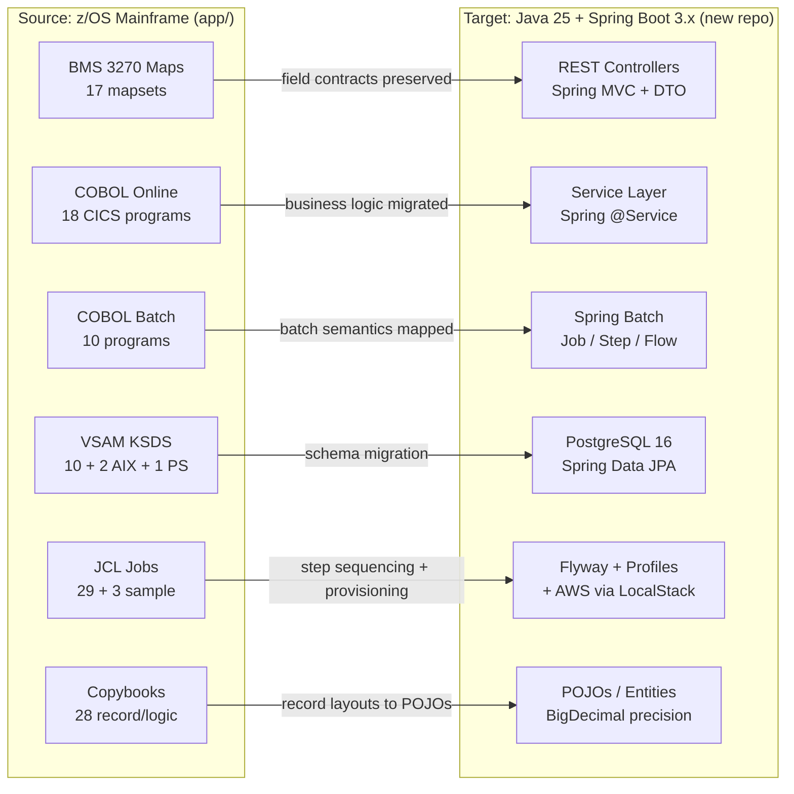
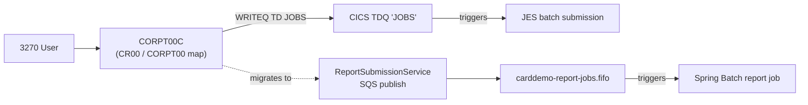

# Technical Specification

# 0. Agent Action Plan

## 0.1 Intent Clarification

### 0.1.1 Core Refactoring Objective

Based on the prompt, the Blitzy platform understands that the refactoring objective is to **migrate the AWS CardDemo mainframe application — its entire COBOL/CICS/VSAM/JCL/BMS estate under `app/` — to an idiomatic Java 25 LTS + Spring Boot 3.x application in a separate greenfield repository, preserving 100% behavioral parity and every external interface contract**.

A critical interpretation note governs this section. The user prompt was delivered as an **unfilled refactoring template**: the bracketed fields `[Project Name]` and `[target implementation]`, and the guiding-question sections (CORE OBJECTIVES, TARGET STATE DESCRIPTION, TECHNICAL IMPLEMENTATION DETAILS, SYSTEM BOUNDARIES & CONSTRAINTS, NON-FUNCTIONAL REQUIREMENTS, PRIVATE DEPENDENCIES + RUNNING THE CODE), were not populated with project-specific content. No attachments and no implementation rules were supplied. The only concrete, actionable directive in the prompt was the **Minimal Change Clause & Refactor Discipline Guidelines**, preserved verbatim in §0.7.1. The canonical objective stated above is therefore derived from authoritative repository evidence rather than from prose the user typed:

- The Backstage catalog entry describes the component as "AWS CardDemo COBOL mainframe application migrated to Java 25 + Spring Boot 3.x" [catalog-info.yaml:L5-L6] and labels its language as Java [catalog-info.yaml:L20].
- The repository is tagged `refactor`, `rewrite`, `migration`, and `modernization` [catalog-info.yaml:L7-L18] and links a pull request titled "PR #1: COBOL to Java 25 Migration" [catalog-info.yaml:L28-L29].
- The repository ships an in-repo **authoritative migration blueprint**, `docs/technical-specifications.md`, whose Section 0 states the same objective verbatim and supplies the full target design, scope, transformation map, and dependency inventory [docs/technical-specifications.md:L9]. This document is treated throughout this Agent Action Plan as a `REFERENCE` artifact and cited by line number.

The refactoring is classified along the following axes:

- **Refactoring Type:** Tech-stack migration — mainframe-to-cloud modernization (COBOL/CICS/VSAM/JCL/BMS → Java/Spring Boot/JPA/Spring Batch/PostgreSQL/AWS) [docs/technical-specifications.md:L11]. Secondary dimensions are present and unavoidable: design-pattern transformation (procedural `PARAGRAPH`/`SECTION` → layered Controller/Service/Repository), modularity decomposition (monolithic programs such as the 4,236-line `COACTUPC.cbl` [app/cbl/COACTUPC.cbl; docs/technical-specifications.md:L119] split into entity + repository + service + controller), and code-structure reorganization (flat COBOL members → a Maven/Spring package layout).
- **Target Repository:** New repository. The migrated Java application is a standalone greenfield project; COBOL source files are **not** copied into the target repository, and traceability references the original COBOL repository by commit SHA [docs/technical-specifications.md:L12]. No `*.java`, `pom.xml`, `build.gradle`, or `package.json` exists in this repository — confirming the legacy/contract custodian nature of `blitzy-card-demo`.
- **Processing Modes:** The migration spans two execution paradigms — 18 interactive CICS online programs (pseudo-conversational 3270 terminal screens) and 10 batch programs (JES-scheduled jobs) — both converging on a shared VSAM data layer of 11 primary datasets [docs/technical-specifications.md:L13].

**Refactoring goals (enhanced clarity):**

- Translate all 28 COBOL programs to idiomatic Java 25 service components under Spring Boot 3.x orchestration, preserving every control-flow semantic including `PERFORM THRU`, `GO TO` fall-through, and `EVALUATE` nesting [docs/technical-specifications.md:L17].
- Convert all 28 shared copybooks into Java POJOs, DTOs, and shared modules using `BigDecimal` for every `COMP-3`/`COMP`/`PIC S9(n)V99` field — zero floating-point substitution [docs/technical-specifications.md:L18].
- Map all 10 VSAM KSDS datasets, 2 AIX/PATH alternate indexes, and 1 sequential PS staging file to PostgreSQL 16+ tables with Spring Data JPA repositories, preserving primary, composite, and alternate-index access patterns [docs/technical-specifications.md:L19].
- Convert all 29 JCL jobs to Spring Batch jobs with step sequencing and condition-code logic, including the 5-stage pipeline POSTTRAN → INTCALC → COMBTRAN → CREASTMT/TRANREPT [docs/technical-specifications.md:L20].
- Replace BMS 3270 terminal I/O with REST endpoints that preserve the same field contracts and validation rules [docs/technical-specifications.md:L21].
- Integrate AWS S3 for batch file staging (replacing sequential PS datasets and GDG generations) and SQS/SNS for messaging (replacing CICS TDQ) [docs/technical-specifications.md:L22].

**Implicit requirements surfaced:**

- Every COBOL `FILE STATUS` code path must map to Java exception handling plus status enums [docs/technical-specifications.md:L28].
- The CICS pseudo-conversational model (`RETURN TRANSID COMMAREA`) translates to stateless REST endpoints with token-based state [docs/technical-specifications.md:L29].
- The sole online-to-batch bridge (`CORPT00C` → CICS TDQ JOBS → JES submission) must be preserved as an SQS-triggered Spring Batch job [docs/technical-specifications.md:L30].
- The only `SYNCPOINT ROLLBACK` (in `COACTUPC`) maps to Spring `@Transactional` rollback semantics, and the optimistic-concurrency checks in `COACTUPC` and `COCRDUPC` map to JPA `@Version` [docs/technical-specifications.md:L31-L32].
- Plaintext password storage (constraint C-003) is upgraded to BCrypt — the single explicitly-permitted behavioral change [docs/technical-specifications.md:L35].
- The 9 ASCII fixtures serve as canonical validation data; the 13 EBCDIC files are byte-level reference only [docs/technical-specifications.md:L36].

These implicit requirements align directly with the prompt's Minimal Change Clause: behavior is preserved exactly, no enhancement beyond the technology transition is undertaken, and new implementations are isolated in dedicated modules (§0.7.1).

### 0.1.2 Technical Interpretation

This refactoring translates to the following technical transformation strategy: each mainframe construct is mapped to a single, deterministic target pattern so that the migration is mechanical and auditable rather than interpretive.



The deterministic transformation rules below are the governing translation contract [docs/technical-specifications.md:L74-L90]:

| Source Construct | Transformation Rule | Target Pattern |
|---|---|---|
| `DATA DIVISION` (`PIC`, `COMP-3`, `COMP`) | Exact decimal precision mapping | Java POJOs with `BigDecimal` — no `float`/`double` |
| `PARAGRAPH` / `SECTION` | Method extraction preserving control flow | Service/component methods |
| `COPY` / `REPLACE` directives | Shared module extraction | Shared DTOs and utility classes |
| VSAM KSDS (keyed access) | Relational schema with JPA repositories | `@Entity` + `JpaRepository` |
| VSAM AIX/PATH (alternate index) | Secondary query methods | `@Query` / derived queries |
| CICS `SEND MAP` / `RECEIVE MAP` | REST request/response DTOs | `@RestController` + Jakarta Validation |
| CICS `RETURN TRANSID COMMAREA` | Stateless REST with context propagation | JWT or session-scoped state |
| JCL `EXEC PGM` + DD | Spring Batch job configuration | `@Configuration` + `Job`/`Step` beans |
| JCL `COND` codes | Step execution decisions | `JobExecutionDecider` + `FlowBuilder` |
| DFSORT / IDCAMS `REPRO` | Java sort + bulk insert | `Comparator` + JPA `saveAll`/`JdbcTemplate` |
| CICS TDQ `WRITEQ` | Message publish | AWS SQS via Spring Cloud AWS |
| GDG generations | Versioned objects | S3 keys with generation prefixes |
| `FILE STATUS` codes | Exception mapping | Custom exception hierarchy + status enums |
| CICS `SYNCPOINT ROLLBACK` | Transaction rollback | `@Transactional(rollbackFor=...)` |
| LE `CEEDAYS` date validation | Java date/time API | `java.time.LocalDate` + custom validators |

### 0.1.3 Required Clarifications

Because the prompt arrived as an unfilled template, the Blitzy platform proceeded with the repository-evidenced interpretation above as the canonical plan. The following clarifications would confirm or refine that interpretation; each is paired with the inferred answer the platform adopted and a confidence rating. None of these blocks execution — the in-repo authoritative blueprint resolves every item with high confidence — but they are surfaced for stakeholder sign-off.

| Unfilled Template Section | Open Question | Inferred Answer (Repository-Evidenced) | Confidence |
|---|---|---|---|
| `[Project Name]` / CORE OBJECTIVES | Which project is being refactored, and to what target? | AWS CardDemo COBOL → Java 25 + Spring Boot 3.x [catalog-info.yaml:L5-L6; docs/technical-specifications.md:L9] | High |
| TARGET STATE DESCRIPTION | What is the target architecture and stack? | Maven/Spring Boot layered app; PostgreSQL 16 via JPA; Spring Batch; AWS S3/SQS/SNS via LocalStack [docs/technical-specifications.md:L314-L489] | High |
| TECHNICAL IMPLEMENTATION DETAILS | Same repo or new repo? Are COBOL sources copied? | New greenfield repository; COBOL **not** copied; SHA-only traceability [docs/technical-specifications.md:L12] | High |
| SYSTEM BOUNDARIES & CONSTRAINTS | What is explicitly out of scope? | No feature expansion (F-001–F-022 only); no web UI; no live AWS; deferred Db2/IMS/MQ [docs/technical-specifications.md:L292-L305] | High |
| NON-FUNCTIONAL REQUIREMENTS | Parity, security, coverage targets? | 100% behavioral parity; BCrypt upgrade from C-003; ≥80% coverage; OWASP zero critical/high [docs/technical-specifications.md:L1027-L1099] | High |
| PRIVATE DEPENDENCIES + RUNNING THE CODE | Which package versions and run profile? | Spring Boot 3.5.11, Java 25.0.2, Spring Cloud AWS 3.3.0, etc. [docs/technical-specifications.md:L720-L766] | High |
| Target base package name | `com.cardemo` or `com.carddemo`? | The blueprint is internally inconsistent — `com.cardemo` at [docs/technical-specifications.md:L334] versus `com.carddemo` at [docs/technical-specifications.md:L783-L799]. A single base package must be selected and applied uniformly. | Needs confirmation |


## 0.2 Scope Boundaries

The scope is framed by a structural fact about this repository: the **source** artifacts of the migration live in this repository (`app/`, `samples/jcl/`, and the contract `docs/`), whereas the **target** Java artifacts are created in a separate greenfield repository [docs/technical-specifications.md:L12]. The `app/` tree is the frozen legacy custodian — it is read and mapped as migration input but is never mutated. "In scope" therefore comprises (a) the source artifacts consumed as migration input, (b) the in-repo documents that record the migration contract, and (c) the full set of target Java files the contract specifies.

### 0.2.1 Exhaustively In Scope

**Source transformations (COBOL → Java), with trailing-wildcard patterns:**

- `app/cbl/*.cbl` + `app/cbl/*.CBL` — all 28 COBOL programs: 18 online CICS programs (`app/cbl/CO*.cbl`) and 10 batch programs (`app/cbl/CB*` plus `CSUTLDTC.cbl`) [app/cbl/].
- `app/cpy/*.cpy` + `app/cpy/*.CPY` — all 28 shared copybooks: record schemas, the central COMMAREA (`COCOM01Y`), menu tables, message/title text, validation lookups, and CICS/BMS procedure-division templates [app/cpy/].
- `app/cpy-bms/*.CPY` — all 17 symbolic-map copybooks (byte-accurate `AI`/`AO` SEND/RECEIVE field contracts) [app/cpy-bms/].
- `app/bms/*.bms` — all 17 BMS mapset definitions (24×80 3270 screens → REST API contracts) [app/bms/].
- `app/jcl/*.jcl` + `app/jcl/*.JCL` — all 29 JCL jobs: VSAM/GDG provisioning, CICS administration, and business batch jobs [app/jcl/].
- `samples/jcl/*.jcl` — the 3 sample build jobs `BATCMP.jcl`, `BMSCMP.jcl`, `CICCMP.jcl` (build/compile/`NEWCOPY` pattern reference) [samples/jcl/].

**Data migration:**

- `app/data/ASCII/*.txt` — all 9 ASCII fixtures (`acctdata`, `carddata`, `custdata`, `cardxref`, `dailytran`, `discgrp`, `tcatbal`, `trancatg`, `trantype`); these drive the Flyway V3 seed and the validation-gate test fixtures [app/data/ASCII/; docs/technical-specifications.md:L685].
- `app/catlg/LISTCAT.txt` — the IDCAMS catalog report, a `REFERENCE` for verifying VSAM cluster/AIX/PATH/GDG definitions during schema design [app/catlg/LISTCAT.txt].

**Target deliverables (new Java repository, specified by the in-repo blueprint) [docs/technical-specifications.md:L247-L289, L314-L489]:**

- 11 Spring Data JPA `@Entity` classes mapping all 11 VSAM/PS data entities to PostgreSQL tables.
- 11 `JpaRepository` interfaces, 20 service classes, and 8 REST controllers preserving all 22 features (F-001–F-022).
- The complete 5-stage Spring Batch pipeline (6 job classes, 5 processors, 5 readers, 3 writers).
- 7 custom exception classes, a configuration layer (`SecurityConfig`, `BatchConfig`, `AwsConfig`, `JpaConfig`, `ObservabilityConfig`, `WebConfig`), and an observability layer (`CorrelationIdFilter`, `MetricsConfig`, `HealthIndicators`).
- PostgreSQL schema migrations (Flyway `V1`/`V2`/`V3`), `pom.xml`, `Dockerfile`, `docker-compose.yml`, and `application*.yml` profiles.
- Testcontainers-based unit, integration, and end-to-end tests, targeting ≥80% line coverage with zero OWASP critical/high CVEs [docs/technical-specifications.md:L285-L290].

**Contract and documentation in this repository (reference/maintenance):**

- `docs/technical-specifications.md`, `docs/project-guide.md`, `docs/index.md` — the authoritative migration blueprint, readiness/metrics guide, and documentation landing page [docs/].
- `README.md`, `mkdocs.yml`, `catalog-info.yaml` — project overview and the MkDocs/Backstage publishing configuration [mkdocs.yml; catalog-info.yaml].

**Rule-mandated files:** none. No implementation rules were provided in this run (`review_rules` returned an empty list), so no additional files are forced into scope by coding-guideline rules.

### 0.2.2 Explicitly Out of Scope

Per the preservation requirements and the explicit boundaries in the in-repo blueprint [docs/technical-specifications.md:L292-L305, L1023-L1035]:

- **Mutating the frozen `app/` source members** — the COBOL, copybook, BMS, and JCL members are read-only migration input; they are not edited.
- **Copying COBOL source into the target repository** — traceability uses the original commit SHA only (`27d6c6f`) [docs/technical-specifications.md:L297, L1035].
- **`app/data/EBCDIC/*`** — the 13 EBCDIC binaries are byte-level reference only; their ASCII equivalents drive the data migration [docs/technical-specifications.md:L302].
- **Feature expansion** — no business features beyond the 22 documented (F-001–F-022); no new endpoints, rules, or entities [docs/technical-specifications.md:L296].
- **Web/browser/graphical UI** — the target exposes REST endpoints only [docs/technical-specifications.md:L305].
- **RACF integration** — file-based `USRSEC` authentication is preserved (not RACF) [docs/technical-specifications.md:L303]; **Db2, IMS, IBM MQ, FTP/SFTP**, and distributed-transaction exposure remain deferred under constraint C-001 [docs/technical-specifications.md:L304].
- **Live AWS endpoints** — every AWS interaction is verifiable against LocalStack with zero live credentials [docs/technical-specifications.md:L300]; **no production/staging access**, **no CI/CD pipeline execution**, and **no multi-region** concerns [docs/technical-specifications.md:L298-L299].
- **Root governance files needing no change** — `LICENSE`, `CODE_OF_CONDUCT.md`, `CONTRIBUTING.md` are unchanged.

### 0.2.3 Design System Compliance

The Design System Alignment Protocol is **not applicable** to this refactoring. No component library or design system (e.g., Ant Design, Material UI, SAP UI5, Shadcn/ui, or a proprietary library) is named in the prompt, and no design system is present in the repository. The legacy user interface consists of 17 BMS 24×80 3270 terminal mapsets [app/bms/] with 17 symbolic-map copybooks [app/cpy-bms/]; the target is REST-only with no web, browser, or graphical interface [docs/technical-specifications.md:L305]. Consequently, there is no component/token catalog to produce and no Design System Compliance sub-section beyond this determination. The BMS screen contracts are instead migrated to REST request/response DTOs with Jakarta Validation (see §0.3.4 and §0.4) rather than to UI components.


## 0.3 Target Design

### 0.3.1 Refactored Structure Planning

The target Java repository is a standalone, fully operational Spring Boot 3.x application following Maven standard layout and a modular, domain-driven package organization that maps naturally from the COBOL program grouping [docs/technical-specifications.md:L312-L489]. The layout below is comprehensive and includes every file group required for standalone operation — build, dependency management, containerization, configuration, schema migration, and tests. The base package is shown as `<base-package>` pending the clarification in §0.1.3 (the blueprint uses both `com.cardemo` [docs/technical-specifications.md:L334] and `com.carddemo` [docs/technical-specifications.md:L783-L799]).

```
Target: carddemo-java/                         (new greenfield repository)
├── pom.xml                                     (Maven build, Spring Boot 3.5.x parent, dependencies)
├── mvnw / mvnw.cmd / .mvn/wrapper/             (Maven wrapper)
├── Dockerfile                                  (multi-stage Java 25 image)
├── docker-compose.yml                          (PostgreSQL 16, LocalStack, Jaeger, Prometheus, Grafana, app)
├── localstack-init/init-aws.sh                 (S3 buckets + SQS queue provisioning)
├── README.md                                   (setup → build → run → onboarding)
├── DECISION_LOG.md                             (non-trivial decision rationale)
├── TRACEABILITY_MATRIX.md                      (COBOL paragraph → Java method mapping)
├── docs/                                       (executive presentation, before/after diagrams, API contracts)
└── src/
    ├── main/java/<base-package>/
    │   ├── CardDemoApplication.java            (Spring Boot entry point)
    │   ├── config/                             (SecurityConfig, BatchConfig, AwsConfig, JpaConfig,
    │   │                                        ObservabilityConfig, WebConfig)
    │   ├── model/
    │   │   ├── entity/                         (11 @Entity: Account, Card, Customer, CardCrossReference,
    │   │   │                                    Transaction, UserSecurity, TransactionCategoryBalance,
    │   │   │                                    DisclosureGroup, TransactionType, TransactionCategory,
    │   │   │                                    DailyTransaction)
    │   │   ├── dto/                            (request/response payloads per screen + CommArea)
    │   │   ├── enums/                          (UserType, FileStatus, TransactionSource, RejectCode)
    │   │   └── key/                            (3 @Embeddable composite keys)
    │   ├── repository/                         (11 JpaRepository interfaces)
    │   ├── service/                            (20 services grouped: auth, account, card, transaction,
    │   │                                        billing, report, admin, menu, shared)
    │   ├── controller/                         (8 @RestController: Auth, Account, Card, Transaction,
    │   │                                        Billing, Report, UserAdmin, Menu)
    │   ├── batch/
    │   │   ├── jobs/                           (6: DailyTransactionPosting, InterestCalculation,
    │   │   │                                    CombineTransactions, StatementGeneration,
    │   │   │                                    TransactionReport, BatchPipelineOrchestrator)
    │   │   ├── processors/                     (5 ItemProcessors)
    │   │   ├── readers/                        (5 ItemReaders)
    │   │   └── writers/                        (3 ItemWriters)
    │   ├── exception/                          (7: CardDemoException base + 6 typed exceptions)
    │   └── observability/                      (CorrelationIdFilter, MetricsConfig, HealthIndicators)
    ├── main/resources/
    │   ├── application.yml + application-local.yml + application-test.yml
    │   ├── db/migration/                       (V1__create_schema, V2__create_indexes, V3__seed_data)
    │   ├── validation/                         (nanpa-area-codes, us-state-codes, state-zip-prefixes JSON)
    │   └── logback-spring.xml                  (structured logging)
    └── test/java/<base-package>/               (unit/, integration/, e2e/ with Testcontainers + LocalStack)
```

### 0.3.2 Web Search Research Conducted

Targeted research into current COBOL-to-Java/Spring modernization practice corroborates the in-repo transformation contract and informs the design choices above. The following findings were applied:

- **Predefined construct mappings over interpretive translation** — industry guidance recommends pre-defining mappings from CICS transactions to REST/message-queue equivalents and aligning output to the target stack, exactly the deterministic rule table adopted in §0.1.2 (Swimm GenAI modernization guidance).
- **Discovery-first, parity-validated migration** — established methodology performs full inventory and dependency mapping first, writes characterization tests before target code, and runs a parity audit on real datasets; "declaring the migration complete after code conversion without validating end-to-end workflows" is a documented anti-pattern (Access International ATLAS, which cites a CardDemo proof-of-concept). This validates using the 9 ASCII fixtures as golden parity data.
- **Decimal and structural fidelity** — faithful reproduction of decimal arithmetic, sequential file handling, `COPY`, and `REDEFINES` is mandatory; `COMP-3` packed decimals map to `BigDecimal`, and unstructured `GO TO` is restructured into `if`/`switch`/loop while preserving behavior (SoftwareMining, Factory Academy CardDemo conversion guidance).
- **Pseudo-conversational state** — because CICS is pseudo-conversational, the target must not hold server-side conversational state; token-based state (JWT) is the recommended replacement, matching the COMMAREA-to-stateless-REST rule (Factory Academy guidance).
- **Spring Batch for JCL** — COBOL batch jobs map cleanly to Spring Batch with reader/processor/writer components and working storage translated to POJOs (Keyhole Software modernization case study).

The in-repo blueprint additionally records platform-version research confirming Java 25 LTS, Spring Boot 3.5.x, and PostgreSQL 16+ as the current target baselines [docs/technical-specifications.md:L491-L496]; exact versions are inventoried in §0.5.

### 0.3.3 Design Pattern Applications

| Pattern | Application in the CardDemo Migration |
|---|---|
| Layered architecture | Controller → Service → Repository → Entity separation replaces the monolithic COBOL program-per-screen model [docs/technical-specifications.md:L503] |
| Repository pattern | One Spring Data JPA repository per VSAM KSDS dataset (`AccountRepository`, `TransactionRepository`, …) [docs/technical-specifications.md:L502] |
| Service layer | Each online COBOL program's business logic becomes a `@Service`, decoupled from I/O concerns [docs/technical-specifications.md:L503] |
| DTO pattern | Request/response DTOs mirror the BMS symbolic-map role, separating API contracts from entities [docs/technical-specifications.md:L504] |
| Strategy / Template Method | Batch validation cascade and statement generation (`CBSTM03A` + `CBSTM03B`) as pluggable strategies / template method [docs/technical-specifications.md:L505-L506] |
| Factory | Transaction-ID auto-generation (browse-to-end + increment) via a sequence factory [docs/technical-specifications.md:L507] |
| Observer / messaging | `CORPT00C` → TDQ bridge becomes SQS publish with event listeners [docs/technical-specifications.md:L508] |
| Composite key | `@EmbeddedId` / `@IdClass` for `TCATBALF`, `DISCGRP`, `TRANCATG` composite keys [docs/technical-specifications.md:L509] |
| Optimistic locking | JPA `@Version` for `Account` and `Card` updates, replacing CICS read-update snapshot comparison [docs/technical-specifications.md:L510] |
| Declarative transactions | Spring `@Transactional` with explicit rollback for the `COACTUPC` dual-dataset update [docs/technical-specifications.md:L511] |

The governing methodology is characterization-test-driven parity: each COBOL program's observable behavior is captured against the ASCII fixtures and replayed against the Java target, satisfying the 100% behavioral-parity requirement (§0.7.2).

### 0.3.4 User Interface Design

The legacy presentation tier is a set of 17 BMS 24×80 3270 terminal mapsets [app/bms/], each paired with a symbolic-map copybook that defines its byte-accurate `SEND`/`RECEIVE` field contract [app/cpy-bms/]. The target deliberately retires the terminal UI rather than reproducing it: there is no web, browser, or graphical interface in scope [docs/technical-specifications.md:L305]. Instead, every screen contract is migrated to a REST endpoint whose request/response DTOs preserve the original field names, lengths, and validation rules [docs/technical-specifications.md:L21, L504]. The 18 CICS transaction identifiers (for example `CC00` Sign-On, `CM00` Main Menu, `CAVW` Account View, `CAUP` Account Update) become the controller route table, and the 8 controllers consolidate the 17 mapsets by domain (authentication, account, card, transaction, billing, report, user administration, menu) [docs/technical-specifications.md:L417-L425, L644-L653]. Because no design system or component library is involved, the UI design effort reduces to faithful contract translation, covered in detail by the controller and DTO mappings in §0.4.


## 0.4 Transformation Mapping

### 0.4.1 File-by-File Transformation Plan

Every target file is mapped to its source artifact(s). Because the migration produces a new repository and COBOL sources are never copied, the modes used are **CREATE** (new Java file whose logic is translated from the cited COBOL source) and **REFERENCE** (an artifact consulted as an example or specification); there are no **UPDATE** rows against existing Java files [docs/technical-specifications.md:L520-L522]. Files with no source equivalent (e.g., `Dockerfile`, `DECISION_LOG.md`) are marked accordingly.

**Project root, build, and documentation:**

| Target File | Mode | Source File(s) | Key Changes |
|---|---|---|---|
| `pom.xml` | CREATE | `app/jcl/CBADMCDJ.jcl` (build reference) | Maven POM, Spring Boot 3.5.x parent, all dependencies [docs/technical-specifications.md:L528] |
| `Dockerfile`, `mvnw`/`.mvn/**` | CREATE | (none) | Multi-stage Java 25 image; Maven wrapper [docs/technical-specifications.md:L529, L536] |
| `docker-compose.yml`, `localstack-init/init-aws.sh` | CREATE | `app/jcl/DEFGDGB.jcl`, `app/jcl/DUSRSECJ.jcl` | PostgreSQL 16 + LocalStack; S3 buckets + SQS queue creation [docs/technical-specifications.md:L530-L531] |
| `README.md` | CREATE | `README.md` (REFERENCE) | Java setup/build/run/onboarding [docs/technical-specifications.md:L532] |
| `DECISION_LOG.md` | CREATE | (none) | Non-trivial decision rationale [docs/technical-specifications.md:L533] |
| `TRACEABILITY_MATRIX.md` | CREATE | `app/cbl/*.cbl`, `app/cpy/*.cpy` | 100% COBOL-paragraph → Java-method mapping [docs/technical-specifications.md:L534] |
| `docs/api-contracts.md` | CREATE | `app/bms/*.bms`, `app/cpy-bms/*.CPY` | REST endpoint specifications [docs/technical-specifications.md:L546] |

**JPA entities (from record copybooks):**

| Target File | Mode | Source File(s) | Key Changes |
|---|---|---|---|
| `entity/Account.java` | CREATE | `app/cpy/CVACT01Y.cpy` | `BigDecimal` balances; `@Version` optimistic locking [docs/technical-specifications.md:L568] |
| `entity/Card.java` | CREATE | `app/cpy/CVACT02Y.cpy` | FK to `Account`, active-status enum [docs/technical-specifications.md:L569] |
| `entity/Customer.java` | CREATE | `app/cpy/CVCUS01Y.cpy`, `app/cpy/CUSTREC.cpy` | 500-byte field mapping [docs/technical-specifications.md:L570] |
| `entity/CardCrossReference.java` | CREATE | `app/cpy/CVACT03Y.cpy` | Composite FK relationships [docs/technical-specifications.md:L571] |
| `entity/Transaction.java` | CREATE | `app/cpy/CVTRA05Y.cpy` | `BigDecimal` `TRAN-AMT`, timestamps [docs/technical-specifications.md:L572] |
| `entity/UserSecurity.java` | CREATE | `app/cpy/CSUSR01Y.cpy` | BCrypt password hash, role enum [docs/technical-specifications.md:L573] |
| `entity/TransactionCategoryBalance.java` | CREATE | `app/cpy/CVTRA01Y.cpy` | `@EmbeddedId` (acct+type+cat) [docs/technical-specifications.md:L574] |
| `entity/DisclosureGroup.java` | CREATE | `app/cpy/CVTRA02Y.cpy` | `@EmbeddedId`, `BigDecimal` interest rate [docs/technical-specifications.md:L575] |
| `entity/TransactionType.java` | CREATE | `app/cpy/CVTRA03Y.cpy` | 2-byte type-code PK [docs/technical-specifications.md:L576] |
| `entity/TransactionCategory.java` | CREATE | `app/cpy/CVTRA04Y.cpy` | `@EmbeddedId` (type+cat) [docs/technical-specifications.md:L577] |
| `entity/DailyTransaction.java` | CREATE | `app/cpy/CVTRA06Y.cpy` | Batch staging entity [docs/technical-specifications.md:L578] |

The 11 `repository/*.java` interfaces are each `CREATE`d as `JpaRepository` wrappers over the corresponding provisioning JCL/VSAM dataset (`AccountRepository` ← `app/jcl/ACCTFILE.jcl`, `TransactionRepository` ← `app/jcl/TRANFILE.jcl` with pagination/date-range/max-ID queries, `CardCrossReferenceRepository` ← `app/jcl/XREFFILE.jcl` exposing the `CXACAIX` alternate-index lookup, etc.) [docs/technical-specifications.md:L603-L615].

**Service classes (from COBOL programs):**

| Target File | Mode | Source File(s) | Key Changes |
|---|---|---|---|
| `service/auth/AuthenticationService.java` | CREATE | `app/cbl/COSGN00C.cbl` | `USRSEC` read + BCrypt verify + token issue [docs/technical-specifications.md:L621] |
| `service/account/AccountViewService.java` | CREATE | `app/cbl/COACTVWC.cbl` | `ACCTDAT`+`CUSTDAT`+`CXACAIX` multi-read [docs/technical-specifications.md:L622] |
| `service/account/AccountUpdateService.java` | CREATE | `app/cbl/COACTUPC.cbl` | `@Transactional` rollback + `@Version` + all validations [docs/technical-specifications.md:L623] |
| `service/card/CardListService.java` | CREATE | `app/cbl/COCRDLIC.cbl` | Paginated browse (7 rows/page) [docs/technical-specifications.md:L624] |
| `service/card/CardDetailService.java` | CREATE | `app/cbl/COCRDSLC.cbl` | Single keyed read [docs/technical-specifications.md:L625] |
| `service/card/CardUpdateService.java` | CREATE | `app/cbl/COCRDUPC.cbl` | Optimistic concurrency via `@Version` [docs/technical-specifications.md:L626] |
| `service/transaction/TransactionListService.java` | CREATE | `app/cbl/COTRN00C.cbl` | Paginated browse, ID filtering [docs/technical-specifications.md:L627] |
| `service/transaction/TransactionDetailService.java` | CREATE | `app/cbl/COTRN01C.cbl` | Single keyed read [docs/technical-specifications.md:L628] |
| `service/transaction/TransactionAddService.java` | CREATE | `app/cbl/COTRN02C.cbl` | Auto-ID, xref resolution, confirmation [docs/technical-specifications.md:L629] |
| `service/billing/BillPaymentService.java` | CREATE | `app/cbl/COBIL00C.cbl` | Balance update + transaction create in one tx [docs/technical-specifications.md:L630] |
| `service/report/ReportSubmissionService.java` | CREATE | `app/cbl/CORPT00C.cbl` | SQS publish replacing TDQ `WRITEQ` [docs/technical-specifications.md:L631] |
| `service/admin/User{List,Add,Update,Delete}Service.java` | CREATE | `app/cbl/COUSR00C.cbl`–`COUSR03C.cbl` | User CRUD; BCrypt on add [docs/technical-specifications.md:L632-L635] |
| `service/menu/MainMenuService.java` | CREATE | `app/cbl/COMEN01C.cbl`, `app/cpy/COMEN02Y.cpy` | 10-option routing metadata [docs/technical-specifications.md:L636] |
| `service/menu/AdminMenuService.java` | CREATE | `app/cbl/COADM01C.cbl`, `app/cpy/COADM02Y.cpy` | 4-option routing metadata [docs/technical-specifications.md:L637] |
| `service/shared/DateValidationService.java` | CREATE | `app/cbl/CSUTLDTC.cbl`, `app/cpy/CSUTLDPY.cpy`, `app/cpy/CSUTLDWY.cpy` | `LocalDate` validation replacing `CEEDAYS` [docs/technical-specifications.md:L638] |
| `service/shared/ValidationLookupService.java` | CREATE | `app/cpy/CSLKPCDY.cpy` | NANPA/state/ZIP lookups [docs/technical-specifications.md:L639] |
| `service/shared/FileStatusMapper.java` | CREATE | `app/cbl/CBTRN02C.cbl` | `FILE STATUS` → exception hierarchy [docs/technical-specifications.md:L640] |

**REST controllers (from BMS mapsets):**

| Target File | Mode | Source File(s) | Key Changes |
|---|---|---|---|
| `controller/AuthController.java` | CREATE | `app/bms/COSGN00.bms`, `app/cpy-bms/COSGN00.CPY` | `POST /api/auth/signin` [docs/technical-specifications.md:L646] |
| `controller/AccountController.java` | CREATE | `app/bms/COACTVW.bms`, `app/bms/COACTUP.bms` | `GET/PUT /api/accounts/{id}` [docs/technical-specifications.md:L647] |
| `controller/CardController.java` | CREATE | `app/bms/COCRDLI.bms`, `COCRDSL.bms`, `COCRDUP.bms` | `GET/PUT /api/cards/*` [docs/technical-specifications.md:L648] |
| `controller/TransactionController.java` | CREATE | `app/bms/COTRN00.bms`, `COTRN01.bms`, `COTRN02.bms` | `GET/POST /api/transactions/*` [docs/technical-specifications.md:L649] |
| `controller/BillingController.java` | CREATE | `app/bms/COBIL00.bms` | `POST /api/billing/pay` [docs/technical-specifications.md:L650] |
| `controller/ReportController.java` | CREATE | `app/bms/CORPT00.bms` | `POST /api/reports/submit` [docs/technical-specifications.md:L651] |
| `controller/UserAdminController.java` | CREATE | `app/bms/COUSR00.bms`–`COUSR03.bms` | CRUD `/api/admin/users/*` [docs/technical-specifications.md:L652] |
| `controller/MenuController.java` | CREATE | `app/bms/COMEN01.bms`, `app/bms/COADM01.bms` | `GET /api/menu/{type}` [docs/technical-specifications.md:L653] |

The corresponding `dto/*.java` payloads are each `CREATE`d from the matching symbolic-map copybooks under `app/cpy-bms/*.CPY` (for example `AccountDto` ← `COACTVW.CPY`+`COACTUP.CPY`), and `enums/*.java` from the COBOL value sets (`FileStatus`, `RejectCode` ← `app/cbl/CBTRN02C.cbl`) [docs/technical-specifications.md:L582-L599].

**Batch jobs, processors, readers, writers (from JCL + COBOL):**

| Target File | Mode | Source File(s) | Key Changes |
|---|---|---|---|
| `batch/jobs/DailyTransactionPostingJob.java` | CREATE | `app/jcl/POSTTRAN.jcl`, `app/cbl/CBTRN02C.cbl` | 4-stage validation, condition codes [docs/technical-specifications.md:L659] |
| `batch/jobs/InterestCalculationJob.java` | CREATE | `app/jcl/INTCALC.jcl`, `app/cbl/CBACT04C.cbl` | `PARM` mapping, rate lookup, formula fidelity [docs/technical-specifications.md:L660] |
| `batch/jobs/CombineTransactionsJob.java` | CREATE | `app/jcl/COMBTRAN.jcl` | Java `Comparator` sort + bulk insert (replaces DFSORT+REPRO) [docs/technical-specifications.md:L661] |
| `batch/jobs/StatementGenerationJob.java` | CREATE | `app/jcl/CREASTMT.JCL`, `app/cbl/CBSTM03A.CBL`, `app/cbl/CBSTM03B.CBL` | Text + HTML statements, S3 output [docs/technical-specifications.md:L662] |
| `batch/jobs/TransactionReportJob.java` | CREATE | `app/jcl/TRANREPT.jcl`, `app/cbl/CBTRN03C.cbl` | Date-filtered reporting, S3 output [docs/technical-specifications.md:L663] |
| `batch/jobs/BatchPipelineOrchestrator.java` | CREATE | `app/jcl/POSTTRAN.jcl` … `app/jcl/TRANREPT.jcl` | 5-stage sequential orchestration + COND logic [docs/technical-specifications.md:L664] |
| `batch/processors/*.java` (5) | CREATE | `app/cbl/CBTRN02C.cbl`, `CBACT04C.cbl`, `COMBTRAN.jcl`, `CBSTM03A.CBL`, `CBTRN03C.cbl` | Validation cascade, interest formula, merge, statements, report [docs/technical-specifications.md:L665-L669] |
| `batch/readers/*.java` (5) | CREATE | `app/cbl/CBTRN01C.cbl`, `CBACT01C.cbl`, `CBACT02C.cbl`, `CBACT03C.cbl`, `CBCUS01C.cbl` | S3/file readers; diagnostic utility readers [docs/technical-specifications.md:L670-L674] |
| `batch/writers/*.java` (3) | CREATE | `app/cbl/CBTRN02C.cbl`, `CBSTM03A.CBL` | DB+S3 transaction write; reject writer; statement writer [docs/technical-specifications.md:L675-L677] |

**Database migration and validation resources:**

| Target File | Mode | Source File(s) | Key Changes |
|---|---|---|---|
| `db/migration/V1__create_schema.sql` | CREATE | `app/jcl/ACCTFILE.jcl`, `CARDFILE.jcl`, `CUSTFILE.jcl`, `XREFFILE.jcl`, `TRANFILE.jcl`, `DUSRSECJ.jcl`, `TCATBALF.jcl`, `DISCGRP.jcl`, `TRANCATG.jcl`, `TRANTYPE.jcl` | All 11 tables from VSAM `DEFINE CLUSTER` specs [docs/technical-specifications.md:L683] |
| `db/migration/V2__create_indexes.sql` | CREATE | `app/jcl/XREFFILE.jcl`, `app/jcl/TRANFILE.jcl` | Alternate indexes (`CXACAIX`, `TRANSACT` AIX) [docs/technical-specifications.md:L684] |
| `db/migration/V3__seed_data.sql` | CREATE | `app/data/ASCII/*.txt` (all 9) | Fixture rows → `INSERT` statements [docs/technical-specifications.md:L685] |
| `resources/validation/{nanpa-area-codes,us-state-codes,state-zip-prefixes}.json` | CREATE | `app/cpy/CSLKPCDY.cpy` | Lookup tables extracted to JSON [docs/technical-specifications.md:L691-L693] |

### 0.4.2 Cross-File Dependencies

The COBOL `COPY` directive and `CALL` statement have no runtime equivalent in Java; both resolve at compile time to package imports and dependency injection. The dependency graph below must be honored so entities are defined before repositories, repositories before services, and services before controllers and batch jobs [docs/technical-specifications.md:L695-L712, L779-L799].

| COBOL Pattern | Java Replacement |
|---|---|
| `COPY COCOM01Y` | `import <base-package>.model.dto.CommArea;` [docs/technical-specifications.md:L701] |
| `COPY CVACT01Y` / `CVACT02Y` / `CVCUS01Y` / `CVACT03Y` / `CVTRA05Y` / `CSUSR01Y` | `import <base-package>.model.entity.{Account,Card,Customer,CardCrossReference,Transaction,UserSecurity};` [docs/technical-specifications.md:L702-L707] |
| `CALL 'CSUTLDTC'` | `@Autowired DateValidationService` [docs/technical-specifications.md:L710] |
| `CALL 'CBSTM03B'` | `@Autowired` file-service bean injection [docs/technical-specifications.md:L711] |
| `COPY CSSETATY` | `@Valid` + field-level Jakarta Validation annotations [docs/technical-specifications.md:L709] |
| `COPY DFHAID` / `DFHBMSCA` / `CSSTRPFY` | No equivalent — AID/PF keys map to distinct REST endpoints [docs/technical-specifications.md:L708] |

Configuration and test imports follow the same rule: `service/**/*.java` import entity/repository/DTO classes, `controller/**/*.java` import service/DTO classes, and `batch/**/*.java` import entity/repository/service classes [docs/technical-specifications.md:L774-L777].

### 0.4.3 Wildcard Patterns

Where a group of target files maps uniformly from a group of source artifacts, the following trailing-wildcard patterns apply. Per convention, only trailing wildcards are used (no leading wildcards):

- `app/cbl/CO*.cbl` → `service/**/*.java` + `controller/*.java` (online programs → services and controllers)
- `app/cbl/CB*.cbl` + `app/cbl/CSUTLDTC.cbl` → `batch/**/*.java` + `service/shared/*.java` (batch programs → batch components and shared utilities)
- `app/cpy/CV*.cpy` + `app/cpy/CUSTREC.cpy` + `app/cpy/CSUSR01Y.cpy` → `model/entity/*.java` (record copybooks → entities)
- `app/cpy-bms/*.CPY` → `model/dto/*.java` (symbolic maps → DTOs)
- `app/bms/*.bms` → `controller/*.java` + `docs/api-contracts.md` (mapsets → controllers and API docs)
- `app/jcl/*.jcl` (provisioning subset) → `db/migration/*.sql` (DEFINE CLUSTER → DDL)
- `app/data/ASCII/*.txt` → `db/migration/V3__seed_data.sql` + test fixtures

Specific file mappings in §0.4.1 take precedence; wildcards generalize only where the per-file table already enumerates a uniform group.

### 0.4.4 One-Phase Execution

The entire migration executes as a **single phase**. All target files — entities, repositories, services, controllers, DTOs/enums, batch components, migrations, configuration, observability, and tests — are delivered together; there is no phased or wave-based rollout [docs/technical-specifications.md:L713-L715]. The internal dependency ordering (entities → repositories → services → controllers/batch) is a compile-time ordering within the one phase, and the Flyway `V1`/`V2`/`V3` migrations run on application startup to provision and seed the PostgreSQL schema before any service or batch job executes.


## 0.5 Dependency Inventory

This repository contains **no executable build manifest** — there is no `pom.xml`, `build.gradle`, `package.json`, or `requirements.txt`; the only manifests present are `mkdocs.yml` (documentation site; plugins `techdocs-core` and `mermaid2`) [mkdocs.yml:L5-L7] and `catalog-info.yaml` (Backstage metadata) [catalog-info.yaml]. Consequently there are **zero dependency changes to an existing application manifest**. The inventory below is therefore an **additions-only** set: the entire dependency closure is newly declared in the greenfield Java target's `pom.xml`. All versions are taken from the in-repo authoritative blueprint, which verified them against the Spring Boot 3.5.11 managed BOM and Maven Central [docs/technical-specifications.md:L720-L766].

### 0.5.1 Key Private and Public Packages

**Runtime dependencies:**

| Registry | Group ID / Artifact ID | Version | Purpose |
|---|---|---|---|
| Maven Central | `org.springframework.boot:spring-boot-starter-web` | 3.5.11 (BOM) | REST API framework, embedded Tomcat [docs/technical-specifications.md:L728] |
| Maven Central | `org.springframework.boot:spring-boot-starter-data-jpa` | 3.5.11 (BOM) | JPA/Hibernate ORM for the VSAM→PostgreSQL replacement [docs/technical-specifications.md:L729] |
| Maven Central | `org.springframework.boot:spring-boot-starter-batch` | 3.5.11 (BOM) | Spring Batch for the JCL job migration [docs/technical-specifications.md:L730] |
| Maven Central | `org.springframework.boot:spring-boot-starter-security` | 3.5.11 (BOM) | Authentication/authorization, BCrypt [docs/technical-specifications.md:L731] |
| Maven Central | `org.springframework.boot:spring-boot-starter-validation` | 3.5.11 (BOM) | Jakarta Bean Validation for input integrity [docs/technical-specifications.md:L732] |
| Maven Central | `org.springframework.boot:spring-boot-starter-actuator` | 3.5.11 (BOM) | Health checks, metrics, readiness probes [docs/technical-specifications.md:L733] |
| Maven Central | `io.awspring.cloud:spring-cloud-aws-starter-s3` | 3.3.0 | S3 client for batch file staging (GDG replacement) [docs/technical-specifications.md:L734] |
| Maven Central | `io.awspring.cloud:spring-cloud-aws-starter-sqs` | 3.3.0 | SQS for CICS TDQ replacement [docs/technical-specifications.md:L735] |
| Maven Central | `io.awspring.cloud:spring-cloud-aws-starter-sns` | 3.3.0 | SNS for notifications [docs/technical-specifications.md:L736] |
| Maven Central | `org.postgresql:postgresql` | 42.7.x (BOM) | PostgreSQL 16+ JDBC driver [docs/technical-specifications.md:L737] |
| Maven Central | `org.flywaydb:flyway-core` | 11.x (BOM) | Schema migration management [docs/technical-specifications.md:L738] |
| Maven Central | `org.flywaydb:flyway-database-postgresql` | 11.x (BOM) | PostgreSQL-specific Flyway module [docs/technical-specifications.md:L739] |
| Maven Central | `io.micrometer:micrometer-tracing-bridge-otel` | 1.6.x (BOM) | OpenTelemetry distributed-tracing bridge [docs/technical-specifications.md:L740] |
| Maven Central | `io.opentelemetry:opentelemetry-exporter-otlp` | 1.x (BOM) | OTLP trace/metric exporter [docs/technical-specifications.md:L741] |
| Maven Central | `io.micrometer:micrometer-registry-prometheus` | 1.x (BOM) | Prometheus metrics endpoint [docs/technical-specifications.md:L742] |
| Maven Central | `net.logstash.logback:logstash-logback-encoder` | 8.0 | Structured JSON logging with correlation IDs [docs/technical-specifications.md:L743] |
| Maven Central | `com.fasterxml.jackson.core:jackson-databind` | 2.x (BOM) | JSON serialization [docs/technical-specifications.md:L744] |

**Test dependencies:**

| Registry | Group ID / Artifact ID | Version | Purpose |
|---|---|---|---|
| Maven Central | `org.springframework.boot:spring-boot-starter-test` | 3.5.11 (BOM) | JUnit 5 + Mockito + AssertJ bundle [docs/technical-specifications.md:L750] |
| Maven Central | `org.springframework.batch:spring-batch-test` | 5.x (BOM) | Spring Batch job testing [docs/technical-specifications.md:L751] |
| Maven Central | `org.springframework.security:spring-security-test` | 6.x (BOM) | Security context test utilities [docs/technical-specifications.md:L752] |
| Maven Central | `org.testcontainers:testcontainers-bom` (+ `postgresql`, `localstack`, `junit-jupiter`) | 2.0.3 | Integration tests for PostgreSQL and AWS via LocalStack [docs/technical-specifications.md:L753-L756] |

**Build plugins:**

| Registry | Group ID / Artifact ID | Version | Purpose |
|---|---|---|---|
| Maven Central | `org.springframework.boot:spring-boot-maven-plugin` | 3.5.11 | Executable JAR packaging [docs/technical-specifications.md:L762] |
| Maven Central | `org.apache.maven.plugins:maven-surefire-plugin` | 3.5.2 | Unit test execution [docs/technical-specifications.md:L763] |
| Maven Central | `org.apache.maven.plugins:maven-failsafe-plugin` | 3.5.2 | Integration test execution [docs/technical-specifications.md:L764] |
| Maven Central | `org.owasp:dependency-check-maven` | 12.1.0 | OWASP CVE scanning [docs/technical-specifications.md:L765] |
| Maven Central | `org.jacoco:jacoco-maven-plugin` | 0.8.12 / 0.8.14 | Coverage reporting; see version note below [docs/technical-specifications.md:L766] |

**Runtime/toolchain baselines** (from the project guide's technology appendix, corroborating the BOM versions above): Java (OpenJDK) 25.0.2; Spring Boot 3.5.11; Spring Data JPA 3.5.x (Hibernate 6.x); Spring Batch 5.x; Spring Security 6.x; PostgreSQL 16 (Alpine); Flyway 11.x; Spring Cloud AWS 3.3.0; Testcontainers 2.0.3; Micrometer 1.6.x; Maven 3.9.9; Docker 28.x; LocalStack Pro.

**Version note:** the JaCoCo plugin version is inconsistent across the contract — the blueprint's dependency table cites `0.8.12` [docs/technical-specifications.md:L766], whereas the project guide's technology appendix cites `0.8.14`. The target `pom.xml` must pin a single value; both are recorded here so the discrepancy is resolved explicitly during implementation. All other versions agree across the two sources.

### 0.5.2 Dependency Updates

Because the dependency set is entirely new, "updates" here mean the compile-time substitution of COBOL `COPY`/`CALL` linkage with Java imports and the external configuration files that replace JCL/dataset declarations.

**Import refactoring — COBOL `COPY` → Java import:**

| COBOL Source | Java Import Target |
|---|---|
| `COPY COCOM01Y` | `import <base-package>.model.dto.CommArea;` [docs/technical-specifications.md:L783] |
| `COPY CVACT01Y` / `CVACT02Y` / `CVCUS01Y` / `CVACT03Y` / `CVTRA05Y` | `import <base-package>.model.entity.{Account,Card,Customer,CardCrossReference,Transaction};` [docs/technical-specifications.md:L784-L788] |
| `COPY CVTRA01Y` / `CVTRA02Y` / `CVTRA03Y` / `CVTRA04Y` / `CVTRA06Y` | `import <base-package>.model.entity.{TransactionCategoryBalance,DisclosureGroup,TransactionType,TransactionCategory,DailyTransaction};` [docs/technical-specifications.md:L790-L794] |
| `COPY CSUTLDPY` / `CSUTLDWY` | `import <base-package>.service.shared.DateValidationService;` [docs/technical-specifications.md:L795] |
| `COPY CSLKPCDY` | `import <base-package>.service.shared.ValidationLookupService;` [docs/technical-specifications.md:L796] |
| `COPY CSSETATY` | `import jakarta.validation.Valid;` + field constraints [docs/technical-specifications.md:L798] |
| `COPY DFHAID` / `DFHBMSCA` | No equivalent — AID keys map to REST endpoints [docs/technical-specifications.md:L799] |

**External reference updates** (configuration/documentation that replaces JCL and dataset declarations) [docs/technical-specifications.md:L803-L811]:

- `pom.xml` — all dependency and plugin declarations.
- `src/main/resources/application*.yml` — Spring profiles, datasource, AWS endpoints, actuator.
- `src/main/resources/db/migration/*.sql` — Flyway scripts (auto-discovered on startup).
- `docker-compose.yml` — PostgreSQL + LocalStack (+ Jaeger/Prometheus/Grafana) container definitions.
- `README.md` and `docs/**/*.md` — build/run instructions, architecture diagrams, API contracts.


## 0.6 Special Analysis

This analysis documents the cross-cutting structure of the mainframe estate that materially shapes the refactoring scope — the dependencies that span program boundaries and therefore determine which Java modules are shared, where transactional integrity must be reproduced, and how the online and batch worlds couple. These observations are derived from repository inspection and are not duplicated elsewhere in this plan.

### 0.6.1 Shared-Copybook Fan-In and Module Consolidation

A small number of copybooks are included by many programs; these high fan-in copybooks become the shared, cross-cutting Java modules and are the highest-impact translation targets.

- **`COCOM01Y` (central `CARDDEMO-COMMAREA`)** is copied by every one of the 18 online programs and is the carrier of pseudo-conversational state [app/cpy/COCOM01Y.cpy; docs/technical-specifications.md:L139]. It consolidates into a single session/context DTO (`CommArea`) plus token-based state [docs/technical-specifications.md:L592, L701].
- **Record-layout copybooks cross the online/batch boundary**, so each becomes a single shared `@Entity` consumed by both `@Service` (REST) and Spring Batch layers: `CVACT01Y` (Account) is used by online `COACTVWC`/`COACTUPC` and batch `CBACT01C`/`CBACT04C`/`CBTRN02C`; `CVTRA05Y` (Transaction) by online `COTRN00C`/`01C`/`02C` and batch `CBTRN02C`/`03C`/`CBSTM03A`; `CVACT03Y` (cross-reference) by `COACTVWC`/`COCRDLIC`/`COTRN02C` and `CBACT03C`/`CBTRN02C`/`CBSTM03A` [app/cpy/].
- **Utility copybooks** fan into shared services: `CSMSG01Y` (messages), `COTTL01Y` (titles), `CSDAT01Y` (date/time), `CSUTLDPY`/`CSUTLDWY` (date validation), and `CSLKPCDY` (NANPA/state/ZIP lookups) consolidate into `DateValidationService` and `ValidationLookupService` [app/cpy/; docs/technical-specifications.md:L638-L639].
- **System copybooks `DFHAID` and `DFHBMSCA`** are CICS-supplied and are not present in the repository; they have no Java equivalent and resolve to REST endpoint routing rather than imported code [docs/technical-specifications.md:L708, L799].

### 0.6.2 VSAM Dataset-to-Program Access Matrix

The access matrix below establishes which entities/repositories are shared between the transactional (REST) and batch contexts, confirming that the 11 JPA repositories must serve both layers concurrently.

| VSAM Dataset | Online Programs | Batch Programs | Target Entity/Repository |
|---|---|---|---|
| `ACCTDAT` | `COACTVWC`, `COACTUPC` | `CBACT01C`, `CBACT04C`, `CBTRN02C` | `Account` / `AccountRepository` |
| `CARDDAT` | `COCRDLIC`, `COCRDSLC`, `COCRDUPC` | `CBACT02C` | `Card` / `CardRepository` |
| `CUSTDAT` | `COACTVWC`, `COACTUPC` | `CBCUS01C`, `CBSTM03A` | `Customer` / `CustomerRepository` |
| `CARDXREF` + `CXACAIX` | `COACTVWC`, `COCRDLIC`, `COTRN02C` | `CBACT03C`, `CBTRN02C`, `CBSTM03A` | `CardCrossReference` / `CardCrossReferenceRepository` |
| `TRANSACT` + AIX | `COTRN00C`, `COTRN01C`, `COTRN02C` | `CBTRN02C`, `CBTRN03C`, `CBSTM03A` | `Transaction` / `TransactionRepository` |
| `USRSEC` | `COSGN00C`, `COUSR00C`–`COUSR03C` | — | `UserSecurity` / `UserSecurityRepository` |
| `TCATBAL` | — | `CBTRN02C`, `CBACT04C` | `TransactionCategoryBalance` / repository |
| `DISCGRP` | — | `CBACT04C` | `DisclosureGroup` / repository |
| `TRANTYPE`, `TRANCATG` | — | `CBTRN02C`, `CBTRN03C` | `TransactionType`, `TransactionCategory` (reference data) |
| `DALYTRAN` (PS staging) | — | `CBTRN01C`, `CBTRN02C` | `DailyTransaction` / repository |

The VSAM landscape backing this matrix comprises `ACCTDATA.VSAM.KSDS` (key 11 / record 300), `CARDDATA`+AIX, `CUSTDATA`, `CARDXREF`+AIX (keys 11,25)+PATH, `TRANSACT`+AIX (keys 26,304)+PATH, `USRSEC` (key 8 / record 80), and the `TCATBALF`/`TRANCATG`/`TRANTYPE`/`DISCGRP` KSDS clusters, all provisioned by `app/jcl/*` IDCAMS jobs [app/jcl/].

### 0.6.3 Online-to-Batch Bridge and CICS Resource Binding

There is exactly one coupling point between the online and batch worlds, and one resource-binding artifact that defines the CICS runtime surface:



- **Single bridge:** `CORPT00C` writes a report request to the CICS Transient Data Queue `JOBS`, which triggers JES submission; this is the only online↔batch coupling and migrates to an SQS-triggered Spring Batch job on `carddemo-report-jobs.fifo` [app/cbl/CORPT00C.cbl; docs/technical-specifications.md:L30, L631].
- **CICS resource binding:** `CBADMCDJ.jcl` runs `DFHCSDUP DEFINE GROUP(CARDDEMO)` to install the BMS mapsets, programs, and transaction identifiers (including `CCDM` and `CCT1`–`CCT4`) [app/jcl/CBADMCDJ.jcl]. In the Java target this resource registry has no CSD analogue: it is replaced by Spring component scanning, the `@RequestMapping` route table that realizes the 18 online transaction IDs (`CC00`, `CM00`, `CAVW`, …), and the Spring Batch `JobRegistry`.

### 0.6.4 Transactional-Integrity and Concurrency Sites

The system has a deliberately small transactional surface, which bounds where Spring transaction and locking semantics must be applied:

- **`SYNCPOINT ROLLBACK`** appears only in `COACTUPC`, guarding the dual `ACCTDAT`+`CUSTDAT` update; it maps to `@Transactional(rollbackFor=...)` [app/cbl/COACTUPC.cbl; docs/technical-specifications.md:L1059].
- **Optimistic concurrency** (before/after record-image comparison) exists in `COACTUPC` and `COCRDUPC`; it maps to JPA `@Version` on the `Account` and `Card` entities [docs/technical-specifications.md:L1061]. All other programs are single-record or read-only and require no special locking.

### 0.6.5 Data Fidelity and Dead-Code Considerations

- **Golden data vs. byte-level reference:** the 9 ASCII fixtures [app/data/ASCII/] drive the Flyway `V3` seed and serve as the parity-validation ground truth, while the 13 EBCDIC files [app/data/EBCDIC/] are byte-level reference for verifying external-interface fidelity and are not loaded by the application [docs/technical-specifications.md:L685, L843-L869].
- **Build-pattern reference:** the sample build jobs `BATCMP`/`BMSCMP`/`CICCMP` document the legacy compile/`NEWCOPY` cadence (`BUILDBAT`/`BUILDBMS`/`BUILDONL` procedures) and serve only as `REFERENCE`; they are superseded by Maven plus the Spring Boot plugin [samples/jcl/; docs/technical-specifications.md:L221].
- **Dead code:** `UNUSED1Y.cpy` is a reserved/unused 80-byte layout [app/cpy/UNUSED1Y.cpy; docs/technical-specifications.md:L165]. Consistent with modernization best practice (identify and drop unreachable code), it is not migrated unless a downstream dependency is discovered during implementation.


## 0.7 Refactoring Rules

### 0.7.1 Minimal Change Clause and Refactor Discipline (User Directive)

The only concrete, project-specific content supplied in the prompt was the Minimal Change Clause and Refactor Discipline Guidelines. It is preserved verbatim below and is the governing constraint set for this refactoring.

> **User Directive (verbatim):**
> - Make only the changes absolutely necessary to implement the refactor.
> - Maintain existing functionality exactly as-is; do not modify code beyond what is directly required for the technology transition.
> - Preserve current behavior while updating the underlying technology with minimal risk and disruption.
> - Make only minimal necessary changes.
> - Do not modify code not directly impacted by the technology transition.
> - Do not enhance or optimize code beyond migration requirements.
> - Isolate new implementations in dedicated files/modules when possible.
> - Document all technology-specific changes with clear comments.

Applied to this migration, the directive means: the COBOL behavior is reproduced exactly (no business-rule "improvements"), the only permitted behavioral change is the BCrypt password upgrade mandated by constraint C-003 (§0.7.2), each translated unit is isolated in its own dedicated Java module per the package layout in §0.3.1, and technology-substitution points (VSAM→JPA, TDQ→SQS, GDG→S3, `CEEDAYS`→`java.time`) are documented at the point of change.

### 0.7.2 Preservation Requirements

The following non-negotiable preservation requirements govern correctness [docs/technical-specifications.md:L1023-L1035]:

- **100% behavioral parity** — every COBOL paragraph must produce identical output for identical input [docs/technical-specifications.md:L1027].
- **External interface contract preservation** — file formats, field layouts, record lengths, and delimiters are preserved exactly [docs/technical-specifications.md:L1029].
- **No hardcoded credentials** — secrets via environment variables or vault references only; the plaintext `USRSEC` passwords (constraint C-003) are upgraded to BCrypt while preserving the login flow — the single permitted behavioral change [docs/technical-specifications.md:L1031].
- **No feature expansion** — only the 22 documented features F-001–F-022; no new endpoints, rules, or entities [docs/technical-specifications.md:L1033].
- **COBOL sources not copied** — traceability references the original repository by commit SHA `27d6c6f` [docs/technical-specifications.md:L1035].

### 0.7.3 Decimal Precision Rules

- **Zero floating-point substitution** — every `COMP-3` (packed) and `COMP` (binary) field maps to `java.math.BigDecimal`; `float`/`double` are prohibited for any field originating from a COBOL `PIC` clause with decimal positions [docs/technical-specifications.md:L1039].
- **Scale preservation** — `BigDecimal` scale must match the `PIC` clause (e.g., `PIC S9(7)V99` → scale 2); the interest formula `(TRAN-CAT-BAL × DIS-INT-RATE) / 1200` uses `BigDecimal.divide()` with `RoundingMode.HALF_EVEN` (banker's rounding) [docs/technical-specifications.md:L1041].
- **Comparison semantics** — numeric comparisons use `compareTo()`, never `equals()` (which is scale-sensitive) [docs/technical-specifications.md:L1043].

### 0.7.4 Control Flow Preservation Rules

- **`PERFORM THRU`** sequences map to an ordered chain of method calls or a single consolidated method [docs/technical-specifications.md:L1047].
- **`GO TO`** maps to early return, labeled break, or method restructuring that eliminates the unconditional transfer while preserving behavior [docs/technical-specifications.md:L1049].
- **Fall-through** — COBOL paragraph fall-through is replaced by explicit invocation chains; Java methods do not fall through [docs/technical-specifications.md:L1051].
- **`EVALUATE` / nested `IF`** — condition evaluation order is preserved exactly; `EVALUATE TRUE` maps to `switch` or chained `if-else` [docs/technical-specifications.md:L1053].
- **`STRING` / `UNSTRING` / `INSPECT`** — delimiter, pointer, and tallying semantics are replicated with Java `String` utilities and explicit index tracking [docs/technical-specifications.md:L1055].

### 0.7.5 Transaction and Concurrency Rules

- **`SYNCPOINT` → `@Transactional`** — the sole `SYNCPOINT ROLLBACK` (in `COACTUPC`, dual `ACCTDAT`+`CUSTDAT` update) maps to Spring `@Transactional` with rollback-on-exception [docs/technical-specifications.md:L1059].
- **Optimistic locking** — `COACTUPC` and `COCRDUPC` map to JPA `@Version` with `OptimisticLockException` handling [docs/technical-specifications.md:L1061].
- **`FILE STATUS` error mapping** — every `FILE STATUS` code maps to a typed Java exception (e.g., `23` → `RecordNotFoundException`, `22` → `DuplicateKeyException`) [docs/technical-specifications.md:L1063].

### 0.7.6 Batch Pipeline Rules

- **Sequential dependency chain** — the 5-stage pipeline (POSTTRAN → INTCALC → COMBTRAN → CREASTMT/TRANREPT) preserves sequential dependencies; a stage starts only after its predecessor completes [docs/technical-specifications.md:L1067].
- **Condition-code logic** — JCL `COND` maps to Spring Batch `ExitStatus` and `JobExecutionDecider` [docs/technical-specifications.md:L1069].
- **DFSORT replacement** — `COMBTRAN`'s `SORT`+`REPRO` (no COBOL program) maps to `Collections.sort()` with a `Comparator` matching the `SORT FIELDS`, then bulk JPA insert [docs/technical-specifications.md:L1071].
- **Parallel stages 4a/4b** — `CREASTMT` and `TRANREPT` may run in parallel after `COMBTRAN` via Spring Batch `FlowBuilder.split()` [docs/technical-specifications.md:L1073].
- **Interest-formula fidelity** — `(TRAN-CAT-BAL × DIS-INT-RATE) / 1200` with `DEFAULT`-group fallback is preserved without algebraic rearrangement [docs/technical-specifications.md:L1075].

### 0.7.7 Blueprint-Documented Cross-Cutting Requirements

The in-repo authoritative blueprint records six cross-cutting implementation requirements in its §0.8.6 [docs/technical-specifications.md:L1077-L1091]. **Provenance note:** these were specified to a prior, fully-populated run of this migration; in the current run no implementation rules were supplied (the rules input was empty). They are reproduced here as **contract-documented** requirements that downstream agents should honor to remain consistent with the established target — not as user-specified rules of this run.

- **Observability** — structured logging with correlation IDs, distributed tracing, a metrics endpoint, health/readiness checks, and a dashboard template ship with the initial implementation and are exercisable locally [docs/technical-specifications.md:L1081, L816-L836].
- **Visual architecture documentation** — Mermaid diagrams with before/after views, each titled and legended [docs/technical-specifications.md:L1083, L953-L966].
- **Explainability** — a decision log plus a bidirectional traceability matrix with 100% COBOL-paragraph coverage; the decision log is the single source of truth [docs/technical-specifications.md:L1085, L903-L931].
- **Executive presentation** — a reveal.js HTML artifact for leadership with at least one visual per slide [docs/technical-specifications.md:L1087, L933-L951].
- **Onboarding & continued development** — documentation enabling clean-machine-to-running-app without questions, plus suggested next tasks [docs/technical-specifications.md:L1089, L968-L988].
- **LocalStack verification** — every AWS interaction verifiable against LocalStack with zero live dependencies; tests create and destroy their own resources [docs/technical-specifications.md:L1091, L990-L1018].

### 0.7.8 Build and Quality Rules

- **Zero-warning build** — `mvn clean verify` passes with zero warnings and zero suppressed warnings except for framework-generated code [docs/technical-specifications.md:L1095].
- **≥80% line coverage** — JaCoCo reports combined unit + integration coverage at or above 80% [docs/technical-specifications.md:L1097].
- **OWASP zero critical/high CVEs** — `dependency-check-maven` reports no critical or high-severity CVEs across direct and transitive dependencies [docs/technical-specifications.md:L1099].
- **Unsafe-code audit** — raw SQL concatenation, `Runtime.exec`, reflection, unchecked casts, and suppressed warnings are counted and justified per site where present [docs/technical-specifications.md:L1101].


## 0.8 Attachments

### 0.8.1 File Attachments

No file attachments were provided with this request — the attachments input returned "No attachments found for this project." Consequently, there are no supplementary documents, diagrams, datasets, or specification files to incorporate beyond the artifacts already present in the repository.

The authoritative inputs for this refactoring are therefore the in-repository artifacts themselves, principally:

- **`docs/technical-specifications.md`** — the in-repo authoritative migration blueprint (1,240 lines) that defines the complete COBOL→Java target, source-to-target mapping, dependency inventory, and preservation rules. It is treated as a **REFERENCE** artifact throughout this plan and is cited by line locator.
- **`docs/project-guide.md`** and the rendered MkDocs site (`mkdocs.yml` [mkdocs.yml:L1-L7]) — supporting narrative and onboarding documentation.
- **`catalog-info.yaml`** — the Backstage component descriptor identifying the system and its lifecycle metadata [catalog-info.yaml:L5-L6].
- The frozen COBOL/copybook/BMS/JCL/data sources under `app/` — the legacy artifacts being translated.

### 0.8.2 Figma Screens

No Figma frames or design-tool URLs were provided. As established in §0.2.3 and §0.3.4, the target is a headless REST/batch service with no web user interface, and no component library or design system applies. The legacy presentation layer consists of 17 BMS 3270 mapsets under `app/bms/`, which are translated into REST contract shapes rather than rendered UI screens; there are therefore no visual designs to attach or map.

### 0.8.3 Referenced Environment and Traceability Metadata

Although no attachments were supplied in this run, the authoritative blueprint documents the external metadata required to execute and trace the migration. These are recorded here for completeness [docs/technical-specifications.md:L1223-L1229]:

| Item | Value / Reference | Purpose |
|------|-------------------|---------|
| Source commit SHA | `27d6c6f` | Traceability anchor for the frozen COBOL baseline |
| Environment variable | `AWS_ACCESS_KEY_ID` | LocalStack/AWS SDK credential (non-secret id) |
| Environment variable | `AWS_DEFAULT_REGION` | Target AWS region for SQS/S3 clients |
| Secret | `AWS_SECRET_ACCESS_KEY` | LocalStack/AWS SDK credential (secret) |
| Secret | `LOCALSTACK_AUTH_TOKEN` | LocalStack Pro activation (where applicable) |

These values are referenced by the target greenfield repository's configuration and are not embedded in this repository; no credential material is present in the in-scope sources (consistent with constraint C-003, §0.7.2).


