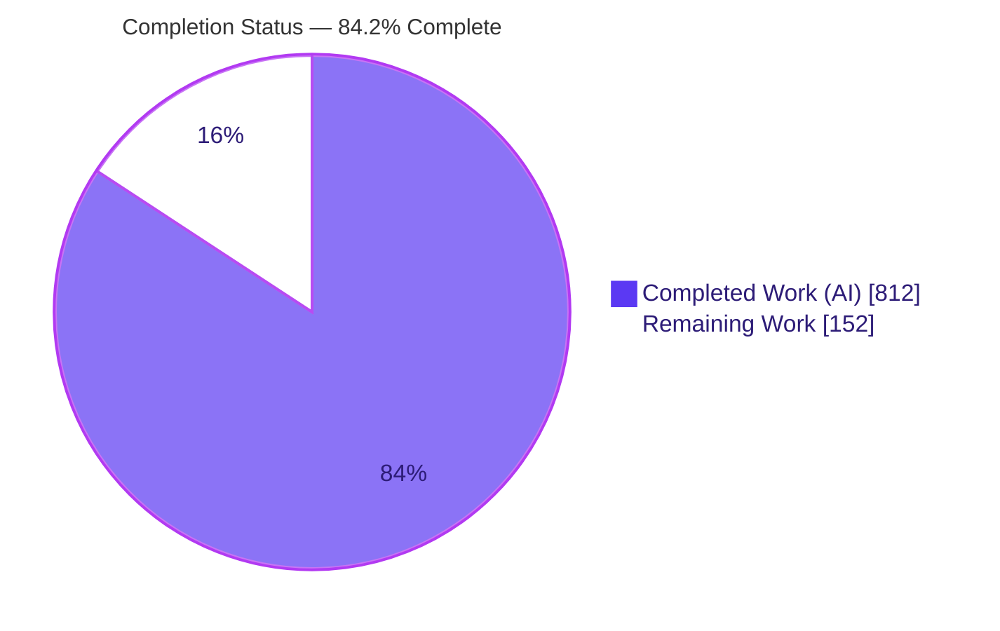
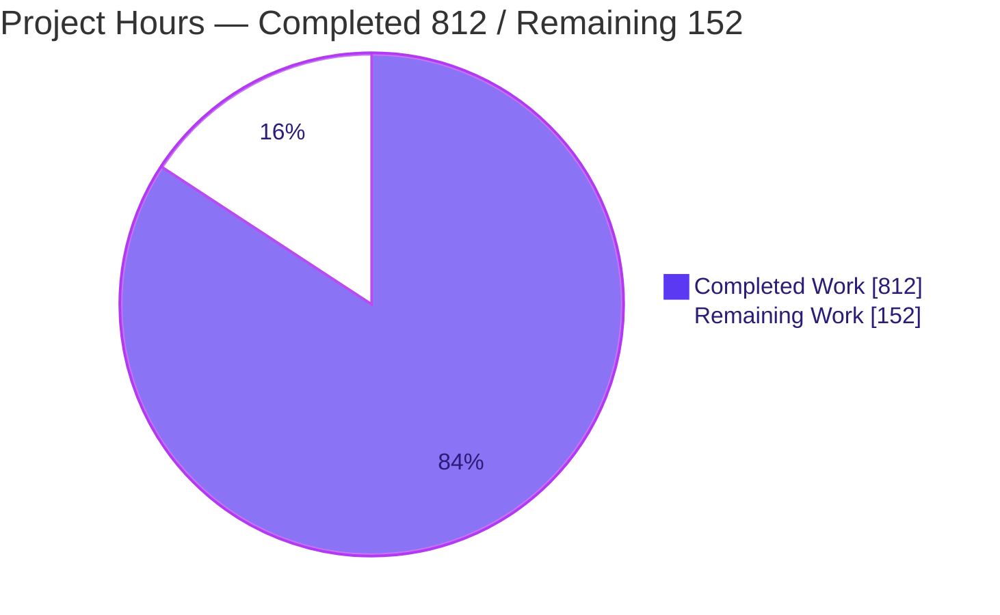
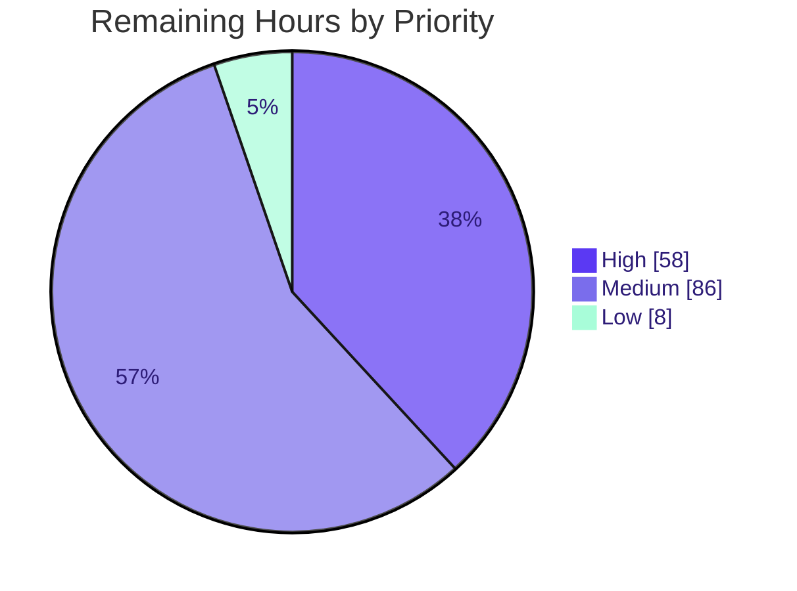

# Blitzy Project Guide — AWS CardDemo COBOL→Java Migration

> **Brand legend.** Throughout this guide, **Completed / AI Work** is rendered in Blitzy **Dark Blue `#5B39F3`** and **Remaining / Not Completed** in **White `#FFFFFF`**; headings/accents use Violet-Black `#B23AF2` and highlights use Mint `#A8FDD9`.

---

## 1. Executive Summary

### 1.1 Project Overview

This project migrates the **AWS CardDemo** credit-card management application — a z/OS mainframe reference workload (`CardDemo_v1.0-15-g27d6c6f-68`) implemented in COBOL/CICS/VSAM/JCL/BMS — to a fully operational, cloud-native **Java 25 LTS + Spring Boot 3.5.15** application (`carddemo-java/`). The target serves the same business users (card servicing, transactions, billing, reporting, user administration) and downstream batch systems while modernizing the runtime: 28 COBOL programs become Spring services/controllers/batch components, 11 VSAM datasets become a PostgreSQL 16 schema, 29 JCL jobs become Spring Batch, and CICS/TDQ messaging becomes AWS S3/SQS/SNS (run locally on LocalStack). The mandate is **100% behavioral parity** with zero feature expansion.

### 1.2 Completion Status

The project is **84.2% complete** on an AAP-scoped, hours-based basis. All Agent Action Plan deliverables are autonomously implemented and validated; the remaining 15.8% is deferred production deployment and mandatory human sign-off.


```mermaid
%%{init: {'theme':'base', 'themeVariables': {'pie1':'#5B39F3','pie2':'#FFFFFF','pieStrokeColor':'#B23AF2','pieStrokeWidth':'2px','pieOuterStrokeWidth':'2px','pieOuterStrokeColor':'#B23AF2','pieTitleTextSize':'16px','pieSectionTextColor':'#2D1C77','pieLegendTextColor':'#2D1C77'}}}%%
pie showData title Completion Status — 84.2% Complete
    "Completed Work (AI)" : 812
    "Remaining Work" : 152
```

| Metric | Hours |
|---|---|
| **Total Hours** | **964** |
| **Completed Hours (AI + Manual)** | **812** (812 AI + 0 Manual) |
| **Remaining Hours** | **152** |
| **Percent Complete** | **84.2%** |

> Completion formula (PA1): `812 / (812 + 152) = 812 / 964 = 84.2%`. All completed hours are autonomous (the Final Validator applied **zero** source modifications; all 23 migration commits are authored by `agent@blitzy.com`).

### 1.3 Key Accomplishments

- ✅ **Full source migration** — 28 COBOL programs (19,254 lines) translated to 125 Java main files (services, controllers, batch, config, observability); 28 copybooks → 11 JPA entities + 26 DTOs + 4 enums + 3 composite keys.
- ✅ **Data re-platforming** — 11 VSAM datasets → PostgreSQL 16 schema with Flyway `V1` (schema) / `V2` (indexes) / `V3` (seed); all 9 ASCII fixtures load with row counts matching the COBOL baseline.
- ✅ **Batch pipeline** — 29 JCL jobs → 6 Spring Batch jobs + orchestrator with a 5-stage flow, condition-code deciders, DFSORT→`Comparator` replacement, and the `BigDecimal` HALF_EVEN interest formula preserved verbatim.
- ✅ **Stateless online API** — 17 BMS screens → REST/JSON controllers secured by Spring Security + JWT with role-based access control; CICS COMMAREA replaced by stateless request/response DTOs.
- ✅ **Cloud integration** — S3 (GDG/staging), SQS FIFO (TDQ replacement), and SNS verified end-to-end against LocalStack with zero live AWS dependencies.
- ✅ **710/710 automated tests pass** with 94.12% line coverage, 0 OWASP vulnerabilities, and all 8 AAP validation gates green.
- ✅ **Observability + explainability shipped** — structured JSON logging with correlation IDs, distributed tracing, Prometheus metrics, health checks, a Grafana dashboard, a 100%-coverage traceability matrix, and a decision log.

### 1.4 Critical Unresolved Issues

| Issue | Impact | Owner | ETA |
|---|---|---|---|
| _None blocking._ Autonomous build, tests, and runtime are fully green. | No release-blocking defects identified. | — | — |
| Spring Boot 3.5 OSS support ends **2026-06-30** | Future security patches require a 4.0 upgrade; not blocking today | Eng Lead | Post-launch (8h planning) |
| Branch coverage 76.73% (line 94.12%) in complex paths | Some error/edge branches untested (e.g., `AccountUpdateService` 48% branch) | QA | With HT-01 |

> There are **no critical unresolved defects**. The two rows above are forward-looking quality items, tracked in Section 6 (T1, T2) and Section 2.2.

### 1.5 Access Issues

| System/Resource | Type of Access | Issue Description | Resolution Status | Owner |
|---|---|---|---|---|
| Source & build (local) | Repo + JDK 25 + Docker | None — autonomous build ran fully green | ✅ Resolved | — |
| Live AWS account | IAM, S3, SQS, SNS | Not provisioned; all AWS validated on LocalStack only | ⏳ Pending (remaining HT-02) | Cloud/DevOps |
| Production database | Managed PostgreSQL/RDS | Not provisioned; only local PostgreSQL exercised | ⏳ Pending (remaining HT-04) | DBA/DevOps |
| Production cluster | K8s/cloud platform creds | No prod environment; deployment deferred per AAP §0.3.2 | ⏳ Pending (remaining HT-05) | Platform |

> No access issues impeded autonomous build validation. All access items above are **forward-looking**, required only for live-cloud deployment, and are tracked as remaining work.

### 1.6 Recommended Next Steps

1. **[High]** Conduct human code review and sign-off of the autonomous output (HT-01, 24h).
2. **[High]** Provision live AWS resources (IAM, S3, SQS FIFO, SNS) and switch endpoints off LocalStack (HT-02, 24h).
3. **[High]** Move secrets (JWT signing key, DB credentials) into AWS Secrets Manager/Vault with rotation (HT-03, 10h).
4. **[Medium]** Stand up the production database and deployment path (managed PostgreSQL + K8s/CD) (HT-04/HT-05, 42h).
5. **[Medium]** Complete security pen-test and UAT business-parity sign-off against the COBOL baseline (HT-06/HT-07, 32h).

---

## 2. Project Hours Breakdown

### 2.1 Completed Work Detail

All rows below are autonomously delivered and validated. **Total = 812 hours.**

| Component | Hours | Description |
|---|---|---|
| Domain Model | 70 | 11 JPA entities + 26 DTOs + 4 enums + 3 composite-key classes from 28 copybooks; `BigDecimal` financial fields, `@Version` optimistic locking. |
| Persistence Layer | 56 | 11 Spring Data repositories + Flyway `V1` schema (11 tables), `V2` indexes, `V3` seed (9 fixtures, 93 KB). |
| Online Service Layer | 150 | 17 online COBOL programs (14,693 lines) → 17 services + 5 shared utilities: auth/JWT, account view/update, card list/detail/update, transaction list/detail/add, billing, report submission, user CRUD, menus, date/lookup validation. |
| REST API & Security | 56 | 8 controllers (← 17 BMS) + global exception handler; Spring Security + JWT + RBAC + RFC 7807 error contract. |
| Batch Pipeline | 110 | 11 batch programs + 29 JCL → 6 jobs / 5 processors / 5 readers / 4 writers / orchestrator; 5-stage flow, condition codes, DFSORT→`Comparator`, interest formula. |
| Exception Hierarchy & Status Enums | 14 | `CardDemoException` base + 6 subclasses mapped from COBOL FILE STATUS codes. |
| AWS Integration | 32 | S3 + SQS FIFO + SNS clients/config + the online→batch SQS bridge (TDQ replacement). |
| Observability | 36 | Logback JSON + `CorrelationIdFilter`, Micrometer/OpenTelemetry tracing, Prometheus metrics, composite health indicators, Grafana dashboard. |
| Test Suite | 150 | 710 tests (583 unit + 23 config + 13 e2e + 91 integration) using JUnit 5, Mockito, AssertJ, Testcontainers (PostgreSQL + LocalStack). |
| Documentation | 64 | `TRACEABILITY_MATRIX.md` (100% paragraph coverage), `DECISION_LOG.md`, reveal.js executive deck, Mermaid before/after architecture, onboarding, validation-gates, api-contracts, README. |
| Build & DevOps | 28 | `pom.xml`, Maven wrapper, Dockerfile, `docker-compose.yml` (6 services), LocalStack init, CI workflow, OWASP + JaCoCo gates. |
| Validation & Iterative Remediation | 46 | 8-gate verification harness, CP1–CP5 review cycles, QA final-acceptance findings, byte-equivalence reporting. |
| **Total** | **812** | |

### 2.2 Remaining Work Detail

Each row is path-to-production work the AAP deferred (§0.3.2) or standard pre-production sign-off. **Total = 152 hours.**

| Category | Hours | Priority |
|---|---|---|
| Human Code Review & Sign-off (125 main + 110 test files) | 24 | High |
| Live AWS Provisioning (account, IAM, S3, SQS FIFO, SNS; endpoint cutover) | 24 | High |
| Production Secrets Management (JWT key + DB creds via Secrets Manager/Vault + rotation) | 10 | High |
| Production Database Provisioning & Tuning (managed PostgreSQL/RDS, HA, backups, pool tuning, runbook) | 14 | Medium |
| Production Deployment & Orchestration (K8s/Helm, cloud cluster, prod CD) | 28 | Medium |
| Security Review & Penetration Test + threat-model sign-off | 16 | Medium |
| UAT & Business Behavioral-Parity Sign-off vs COBOL baseline | 16 | Medium |
| Production-Scale Performance/Load Testing (Gate 3 baseline → prod SLA) | 12 | Medium |
| Spring Boot 3.5→4.0 EOL Upgrade Planning + JDK 25 `Unsafe` deprecation monitoring | 8 | Low |
| **Total** | **152** | |

### 2.3 Hours Reconciliation

| Check | Result |
|---|---|
| Section 2.1 completed sum | 812 h |
| Section 2.2 remaining sum | 152 h |
| Section 2.1 + Section 2.2 | **964 h = Total (Section 1.2)** ✅ |
| Completion % | 812 / 964 = **84.2%** ✅ |
| Manual completed hours | 0 (fully autonomous) |

---

## 3. Test Results

All tests below originate from **Blitzy's autonomous validation logs** for this project (`target/surefire-reports`, `target/failsafe-reports`, `target/site/jacoco`, `target/dependency-check-report.json`). Aggregate result: **710 tests, 710 passed, 0 failed, 0 errors, 0 skipped.**

| Test Category | Framework | Total Tests | Passed | Failed | Coverage % | Notes |
|---|---|---|---|---|---|---|
| Unit | JUnit 5 + Mockito + AssertJ | 583 | 583 | 0 | — | Service, batch, validation, mapper logic. |
| Configuration / Context | Spring Boot Test | 23 | 23 | 0 | — | Context-load + config wiring. |
| End-to-End | Spring Boot Test + Testcontainers | 13 | 13 | 0 | — | `BatchPipelineE2ETest` (2), `OnlineTransactionE2ETest` (5), `GateVerificationTest` (6). |
| Integration — Repository | Testcontainers (PostgreSQL) | 63 | 63 | 0 | — | All 11 JPA repositories against real PostgreSQL. |
| Integration — Batch | Testcontainers | 23 | 23 | 0 | — | Batch jobs/steps/readers/writers. |
| Integration — AWS | Testcontainers (LocalStack) | 5 | 5 | 0 | — | S3 / SQS / SNS self-provisioning ITs. |
| **Total** | — | **710** | **710** | **0** | **94.12%** | Project-wide JaCoCo line coverage. |

**Coverage (JaCoCo, project-wide):** Line **94.12%** (3,439 / 3,654) · Method **98.17%** (857 / 873) · Class **100%** · Branch **76.73%** (986 / 1,285). The ≥80% line-coverage gate is enforced in the build and **passes**.

**Security scan (OWASP dependency-check 12.1.0):** **0 vulnerabilities** across **119 dependencies** scanned; **0 critical/high** CVEs (Gate 8 pass).

---

## 4. Runtime Validation & UI Verification

Runtime was exercised against live PostgreSQL + LocalStack with the bootable Spring Boot 3.5.15 jar (profile `local`). This migration exposes a **REST/JSON API** (no rich UI client is in scope; BMS symbolic maps become DTO contracts).

**Application health**
- ✅ Application boots in ~7.6s on port 8080; Flyway schema at version `v3`.
- ✅ `/actuator/health` → **UP** with composite indicators: `db`, `postgres` (16.14), `s3`, `sqs`, `liveness`, `readiness`.
- ✅ `/actuator/prometheus` → custom `carddemo.*` metrics + JVM + HTTP metrics exposed.

**Online API & security**
- ✅ `POST /api/auth/signin` (`ADMIN001` / `USER0001`) → JWT issued, role-mapped.
- ✅ Wrong password → `400`; unauthenticated → `401`; `USER` role hitting an admin endpoint → `403` (RBAC enforced).
- ✅ Paginated user list → 10 rows/page (COBOL parity) → `200`; user detail → `200`.

**Online→batch→cloud pipeline**
- ✅ `POST /api/reports/submit` → `202` → SQS FIFO (`carddemo-report-jobs.fifo`) → `@SqsListener` → Spring Batch `transactionReportJob` → S3 `carddemo-batch-output/TRANREPT` (real formatted report, 2,680 bytes) → `COMPLETED`.

**Observability**
- ✅ Structured JSON logs carry `traceId` / `spanId` / `correlationId` across request, service, and batch layers.

**Status legend:** ✅ Operational · ⚠ Partial · ❌ Failing — all verified items above are ✅ Operational.

---

## 5. Compliance & Quality Review

Cross-mapping of AAP deliverables and binding rules to validated outcomes. Fixes applied during autonomous validation are noted; no outstanding items remain within AAP scope.

| AAP / Rule Benchmark | Requirement | Status | Evidence / Notes |
|---|---|---|---|
| Behavioral parity (§0.8.1) | 100% paragraph parity, zero regression | ✅ Pass | Gate 1 boundary split 262/38 matches COBOL; `TRACEABILITY_MATRIX.md` 100% coverage. |
| Decimal precision (§0.8.2) | `BigDecimal` for COMP-3/COMP; HALF_EVEN | ✅ Pass | Interest formula `(BAL×RATE)/1200`, scale 2, HALF_EVEN; no floating point. |
| Transaction & concurrency (§0.8.4) | SYNCPOINT→`@Transactional`; `@Version` | ✅ Pass | `AccountUpdateService` transactional dual-update; `@Version` on Account/Card/Customer; optimistic-lock → HTTP 409. |
| Credential hardening (C-003) | Plaintext password → BCrypt; no hardcoded secrets | ✅ Pass | `BCryptPasswordEncoder`; JWT key resolves only from `${JWT_SECRET}`; no secret committed. |
| FILE STATUS mapping (§0.8.4) | Status codes → exception hierarchy | ✅ Pass | `CardDemoException` + 6 subclasses; status enums. |
| Batch pipeline (§0.8.5) | 5-stage chain, condition codes, DFSORT replacement | ✅ Pass | `BatchPipelineOrchestrator`; `CombineTransactionsJob` `Comparator` + bulk insert. |
| Observability rule | Logging + tracing + metrics + health + dashboard | ✅ Pass | 5 observability classes; runtime correlation IDs + Prometheus. |
| Explainability rule | Decision log + 100% bidirectional traceability | ✅ Pass | `DECISION_LOG.md` (52 KB); `TRACEABILITY_MATRIX.md` (119 KB). |
| Visual architecture rule | Mermaid before/after with titles/legends | ✅ Pass | `docs/architecture-before-after.md`. |
| Executive presentation rule | Self-contained reveal.js deck | ✅ Pass | `docs/executive-presentation.html` (42 KB). |
| Onboarding rule | Clean-machine-to-running docs | ✅ Pass | `docs/onboarding-guide.md` (30 KB). |
| LocalStack verification rule | All AWS verifiable on LocalStack; self-provisioning | ✅ Pass | 5 AWS ITs create/tear down their own resources. |
| Zero-warning build (Gate 2) | `-Xlint:all -Werror`, no warnings | ✅ Pass | `mvn clean verify` BUILD SUCCESS; 0 Maven warnings. |
| Coverage (Gate 8) | ≥80% line coverage | ✅ Pass | 94.12% line (enforced by JaCoCo 0.8.14). |
| OWASP (Gate 8) | Zero critical/high CVEs | ✅ Pass | 0 vulnerabilities / 119 deps (dependency-check 12.1.0). |
| Unsafe-code audit (Gate 6) | Counts < 50; near-zero | ✅ Pass | Project unsafe-marker count = 0. |

**Fixes applied during autonomous validation (illustrative, from commit history):** optimistic-lock → HTTP 409 mapping (F-LOCK-001); concurrency-safe transaction-ID allocation; RFC 7807 error envelope unification; per-record commit boundary for daily-posting parity; observability metric naming/tracing-export corrections; index-using date-range query + graceful pagination-offset overflow.

---

## 6. Risk Assessment

No critical or high-severity risks. Every risk has a mitigation traceable to a remaining-work item (Section 2.2 / Section 4 of the human task list) or an explicit monitoring action.

| Risk | Category | Severity | Probability | Mitigation | Status |
|---|---|---|---|---|---|
| T1 — Spring Boot 3.5 OSS support ends 2026-06-30; 4.0 GA | Technical | Medium | High | Plan 4.0 upgrade (Spring Cloud AWS 4.0.0-M1 + Testcontainers 2.x track 4.x); documented in AAP §0.8 / DECISION_LOG | Open (planning) |
| T2 — Branch coverage 76.73% vs line 94.12%; complex paths under-tested (`AccountUpdateService` 48% branch) | Technical | Low | Medium | Add negative/edge tests for optimistic-lock and reject-code branches | Open |
| T3 — Two third-party JDK 25 `sun.misc.Unsafe` deprecation notices (Maven Guava build-time; OTel jctools runtime) | Technical | Low | Low | Track upstream library updates; project unsafe-marker count = 0 | Monitored |
| S1 — Secrets supplied via env vars only; no Secrets Manager/Vault + rotation | Security | Medium | Medium | Integrate AWS Secrets Manager/Vault + rotation pre-prod | Open (HT-03) |
| S2 — No penetration test / threat-model sign-off | Security | Medium | Medium | Pen-test + threat model | Open (HT-06) |
| S3 — BCrypt hash-on-first-login migration (D-002) unvalidated vs real legacy users | Security | Low | Low | Validate during UAT cutover | Open |
| O1 — No production deployment/orchestration (only local Compose + CI) | Operational | Medium | High | Author K8s/Helm manifests + prod CD | Open (HT-05) |
| O2 — Production database not provisioned (HA/backups/pool tuning) | Operational | Medium | Medium | Managed RDS + migration runbook | Open (HT-04) |
| O3 — Performance is a Gate 3 baseline only; no validated prod SLA | Operational | Low | Medium | Prod-scale load test | Open (HT-08) |
| I1 — AWS validated on LocalStack only; live AWS nuances unverified | Integration | Medium | Medium | Provision live AWS + rerun integration suite | Open (HT-02) |
| I2 — SQS FIFO 300 msg/s cap (D-004) — ceiling under future load | Integration | Low | Low | Monitor; high-throughput FIFO if needed | Monitored |
| I3 — UAT/business parity sign-off not yet business-accepted | Integration | Medium | Low | UAT acceptance vs COBOL baseline | Open (HT-07) |

---

## 7. Visual Project Status

**Project hours breakdown** (Completed = Dark Blue `#5B39F3`, Remaining = White `#FFFFFF`). The "Remaining Work" value (152) equals the Section 1.2 remaining hours and the Section 2.2 total.


```mermaid
%%{init: {'theme':'base', 'themeVariables': {'pie1':'#5B39F3','pie2':'#FFFFFF','pieStrokeColor':'#B23AF2','pieStrokeWidth':'2px','pieOuterStrokeWidth':'2px','pieOuterStrokeColor':'#B23AF2','pieSectionTextColor':'#2D1C77','pieLegendTextColor':'#2D1C77'}}}%%
pie showData title Project Hours — Completed 812 / Remaining 152
    "Completed Work" : 812
    "Remaining Work" : 152
```

**Remaining work by priority** (sums to 152 h):


```mermaid
%%{init: {'theme':'base', 'themeVariables': {'pie1':'#5B39F3','pie2':'#7A6DEC','pie3':'#A8FDD9','pieSectionTextColor':'#2D1C77','pieLegendTextColor':'#2D1C77'}}}%%
pie showData title Remaining Hours by Priority
    "High" : 58
    "Medium" : 86
    "Low" : 8
```

**Remaining hours per category (Section 2.2):**

| Category | Hours |
|---|---|
| Human Code Review & Sign-off | 24 |
| Live AWS Provisioning | 24 |
| Production Secrets Management | 10 |
| Production Database Provisioning & Tuning | 14 |
| Production Deployment & Orchestration | 28 |
| Security Review & Penetration Test | 16 |
| UAT & Business Parity Sign-off | 16 |
| Production-Scale Performance/Load Testing | 12 |
| Spring Boot 3.5 EOL Upgrade Planning | 8 |
| **Total** | **152** |

---

## 8. Summary & Recommendations

**Achievements.** The migration delivers the **entire Agent Action Plan scope** as a production-grade Java 25 + Spring Boot 3.5.15 application: 28 COBOL programs (19,254 lines) re-expressed across 125 Java main files, 11 VSAM datasets re-platformed to PostgreSQL via Flyway, 29 JCL jobs converted to a 5-stage Spring Batch pipeline, 17 BMS screens replaced by a JWT-secured REST API, and CICS messaging re-hosted on S3/SQS/SNS. Behavioral parity is preserved at the semantic level (BigDecimal precision, optimistic locking, transactional rollback, BCrypt, FILE STATUS mapping). Quality is independently validated: **710/710 tests pass, 94.12% line coverage, 0 OWASP vulnerabilities, all 8 validation gates green, and a fully exercised online→batch→cloud runtime.**

**Remaining gaps.** The outstanding **152 hours (15.8%)** are not defects — they are the deferred "last mile" to production: human code review, live AWS provisioning, production-grade secrets management, a managed database, deployment orchestration (K8s/CD), security pen-testing, UAT business sign-off, prod-scale load testing, and Spring Boot EOL upgrade planning.

**Critical path to production.** (1) Human review & sign-off → (2) live AWS + secrets management → (3) production database + deployment orchestration → (4) security pen-test + UAT parity sign-off → (5) prod-scale load test, then launch. High-priority items (58 h) unblock a first deployable environment; medium-priority items (86 h) harden it for production.

**Success metrics achieved:** 100% AAP deliverable completion (autonomous), 100% test pass rate, ≥80% coverage gate (94.12% actual), 0 critical/high CVEs, all 8 gates passed, zero-warning build.

**Production readiness assessment.** The application is **functionally production-ready and 84.2% complete** on an AAP-scoped basis. It is **not yet deployed to production**: completing the High-priority remaining items is the minimum bar for a live environment, with the Medium-priority items required for a hardened, supportable production service. No release-blocking defects exist.

| Readiness Dimension | Status |
|---|---|
| Functional completeness (AAP scope) | ✅ Complete & validated |
| Automated quality gates | ✅ All green (tests, coverage, CVE, 8 gates) |
| Live-cloud deployment | ⏳ Pending (High-priority remaining) |
| Production hardening & sign-off | ⏳ Pending (Medium-priority remaining) |

---

## 9. Development Guide

All commands below were verified on the validation host (JDK 25.0.3, Docker 28.5.2, Docker Compose v5.1.4). Run from the `carddemo-java/` directory unless noted.

### 9.1 System Prerequisites

- **JDK 25 (LTS)** — e.g., `/usr/lib/jvm/java-25-openjdk-amd64`.
- **Maven** — use the bundled wrapper `./mvnw` (no system Maven required); Maven 3.9+ if invoking directly.
- **Docker + Docker Compose v2** — for PostgreSQL, LocalStack, and the observability stack. Use `docker compose` (with a space), not the legacy `docker-compose`.
- **Git**; optional **AWS CLI** (only for later live-AWS work).

### 9.2 Environment Setup

```bash
# 1. Point the build at JDK 25
export JAVA_HOME=/usr/lib/jvm/java-25-openjdk-amd64

# 2. Create your local env file from the template
cp .env.example .env

# 3. Provide a JWT signing key of at least 32 bytes (REQUIRED — app fails fast without it)
export JWT_SECRET="$(openssl rand -base64 48)"
```

Key environment variables (see `.env.example`): `POSTGRES_DB`, `POSTGRES_USER`, `POSTGRES_PASSWORD`, `AWS_REGION`, `AWS_ACCESS_KEY_ID`, `AWS_SECRET_ACCESS_KEY` (use `test`/`test` for LocalStack), `LOCALSTACK_IMAGE`, `LOCALSTACK_AUTH_TOKEN`, `LOCALSTACK_DEBUG`, `LOCALSTACK_PERSISTENCE`, `JWT_SECRET`, `JWT_EXPIRATION`, `OTLP_ENDPOINT`.

### 9.3 Start Supporting Services

```bash
# PostgreSQL + LocalStack + Jaeger + Prometheus + Grafana (+ app)
docker compose up -d

# Verify services are up
docker compose ps
```

### 9.4 Build, Test, and Package

```bash
# Default build: compiles, runs 619 unit/e2e tests, enforces JaCoCo >=80% and OWASP gates
./mvnw clean verify

# Integration profile: runs the 91 Testcontainers integration tests (PostgreSQL + LocalStack)
./mvnw verify -Pintegration
```

Expected: `BUILD SUCCESS`; 619 surefire tests then 91 failsafe tests pass with 0 failures; packaged jar at `target/carddemo-java.jar`.

### 9.5 Run the Application

```bash
# Option A — via Maven (forks a separate application JVM)
./mvnw spring-boot:run -Dspring-boot.run.profiles=local

# Option B — run the packaged jar
JWT_SECRET="$(openssl rand -base64 48)" SPRING_PROFILES_ACTIVE=local \
  java -jar target/carddemo-java.jar
```

### 9.6 Verification Steps

```bash
# Health (expect UP with db, postgres, s3, sqs, liveness, readiness)
curl -s http://localhost:8080/actuator/health | python3 -m json.tool

# Authenticate and capture a JWT
curl -s -X POST http://localhost:8080/api/auth/signin \
  -H 'Content-Type: application/json' \
  -d '{"userId":"ADMIN001","password":"<password>"}'

# Submit a report (online->SQS->batch->S3 bridge); expect HTTP 202
curl -s -X POST http://localhost:8080/api/reports/submit \
  -H "Authorization: Bearer <jwt>" -H 'Content-Type: application/json' \
  -d '{"reportType":"TRANSACTION","startDate":"2022-01-01","endDate":"2022-12-31"}'
```

### 9.7 Example Usage

Obtain a JWT via `/api/auth/signin`, then call protected endpoints with `Authorization: Bearer <jwt>`: `/api/accounts/*`, `/api/cards/*`, `/api/transactions/*`, `/api/billing/pay`, `/api/reports/submit`, `/api/admin/users/*` (admin endpoints require the `ADMIN` role). Batch flows run through the pipeline orchestrator and the SQS report bridge.

### 9.8 Troubleshooting

- **App fails to start with a JWT error** — `JWT_SECRET` must be set and ≥32 bytes.
- **`docker-compose: command not found`** — use `docker compose` (Compose v2 syntax).
- **`spring-boot:run` ignores profile** — pass `-Dspring-boot.run.profiles=local` (the plugin forks a separate JVM).
- **Integration tests fail to start containers** — ensure the Docker socket is accessible to Testcontainers.
- **Schema/seed issues** — Flyway applies `V1`→`V2`→`V3` on startup; confirm the database reaches version `v3`.
- **LocalStack S3 access** — uses path-style access against `http://localhost:4566`.
- **Money values compare unexpectedly** — use `BigDecimal.compareTo()`, never `equals()` (scale-sensitive).

---

## 10. Appendices

### Appendix A — Command Reference

| Command | Purpose |
|---|---|
| `export JAVA_HOME=/usr/lib/jvm/java-25-openjdk-amd64` | Select JDK 25 for the build |
| `docker compose up -d` / `docker compose down` | Start / stop the local stack (6 services) |
| `./mvnw clean verify` | Build + unit/e2e tests + JaCoCo + OWASP gates |
| `./mvnw verify -Pintegration` | Run Testcontainers integration tests |
| `./mvnw spring-boot:run -Dspring-boot.run.profiles=local` | Run the app (Maven) |
| `java -jar target/carddemo-java.jar` | Run the packaged jar |
| `curl http://localhost:8080/actuator/health` | Health check |

### Appendix B — Port Reference

| Service | Port |
|---|---|
| Application (Spring Boot) | 8080 |
| PostgreSQL | 5432 |
| LocalStack (AWS edge) | 4566 |
| Jaeger UI | 16686 |
| OTLP (gRPC / HTTP) | 4317 / 4318 |
| Prometheus | 9090 |
| Grafana | 3000 |

### Appendix C — Key File Locations

| Path | Contents |
|---|---|
| `carddemo-java/src/main/java/com/carddemo/` | Application code: `config/`, `controller/`, `service/`, `batch/`, `model/`, `repository/`, `exception/`, `observability/` |
| `carddemo-java/src/main/resources/db/migration/` | Flyway `V1__create_schema.sql`, `V2__create_indexes.sql`, `V3__seed_data.sql` |
| `carddemo-java/src/main/resources/` | `application.yml`, `application-local.yml`, `application-test.yml`, `logback-spring.xml`, `validation/*.json` |
| `carddemo-java/src/test/java/com/carddemo/` | `unit/`, `integration/`, `e2e/`, `config/` tests |
| `carddemo-java/docs/` | executive deck, architecture, onboarding, validation-gates, api-contracts, Grafana dashboard |
| `carddemo-java/` (root) | `pom.xml`, `Dockerfile`, `docker-compose.yml`, `DECISION_LOG.md`, `TRACEABILITY_MATRIX.md`, `README.md`, `localstack-init/init-aws.sh`, `.github/workflows/ci.yml` |

### Appendix D — Technology Versions

| Technology | Version |
|---|---|
| Java | 25 (LTS) |
| Spring Boot | 3.5.15 |
| Spring Cloud AWS (`io.awspring.cloud`) | 3.3.0 |
| PostgreSQL | 16 |
| Flyway | 11.x |
| Testcontainers | 2.0.3 |
| JaCoCo | 0.8.14 |
| OWASP dependency-check | 12.1.0 |
| Source commit (traceability) | `27d6c6f` |

### Appendix E — Environment Variable Reference

| Variable | Purpose |
|---|---|
| `JWT_SECRET` | JWT signing key (≥32 bytes; **required**, empty default) |
| `JWT_EXPIRATION` | JWT token lifetime |
| `POSTGRES_DB` / `POSTGRES_USER` / `POSTGRES_PASSWORD` | Database connection (local-dev defaults are non-secret) |
| `SPRING_DATASOURCE_USERNAME` / `SPRING_DATASOURCE_PASSWORD` | Datasource credential overrides |
| `AWS_REGION` / `AWS_ACCESS_KEY_ID` / `AWS_SECRET_ACCESS_KEY` | AWS/LocalStack credentials (`test`/`test` locally) |
| `LOCALSTACK_IMAGE` / `LOCALSTACK_AUTH_TOKEN` / `LOCALSTACK_DEBUG` / `LOCALSTACK_PERSISTENCE` | LocalStack configuration |
| `OTLP_ENDPOINT` | OpenTelemetry trace export endpoint |
| `SERVER_PORT` | Application port (default 8080) |

### Appendix F — Developer Tools Guide

| Tool | Use |
|---|---|
| Jaeger (`:16686`) | Inspect distributed traces (`traceId`/`spanId`) across REST, JPA, S3/SQS, and batch steps. |
| Prometheus (`:9090`) | Query `carddemo.*` custom metrics (records processed/rejected, auth attempts, transaction totals) + JVM/HTTP. |
| Grafana (`:3000`) | Import `docs/grafana-dashboard.json` for request/error rates, latency percentiles, batch throughput, JVM/GC. |
| Actuator (`/actuator/*`) | `health`, `prometheus`, liveness/readiness probes. |
| OWASP report | `target/dependency-check-report.html` after `mvn verify`. |
| JaCoCo report | `target/site/jacoco/index.html`. |

### Appendix G — Glossary

| Term | Meaning |
|---|---|
| AAP | Agent Action Plan — the authoritative project requirements specification. |
| BMS | Basic Mapping Support — CICS 3270 screen definitions (mapped to REST DTOs). |
| COMMAREA | CICS communication area — conversational state (replaced by stateless DTO + JWT). |
| GDG | Generation Data Group — z/OS versioned datasets (mapped to S3 versioned objects). |
| TDQ | Transient Data Queue — CICS queue (`WRITEQ TD`), mapped to SQS FIFO. |
| VSAM | Virtual Storage Access Method — mainframe indexed datasets (re-platformed to PostgreSQL). |
| DFSORT | z/OS sort utility (replaced by a Java `Comparator` + bulk JPA insert). |
| FILE STATUS | COBOL I/O status codes (mapped to a custom exception hierarchy). |
| RFC 7807 | "Problem Details" HTTP error response standard used by the API. |
