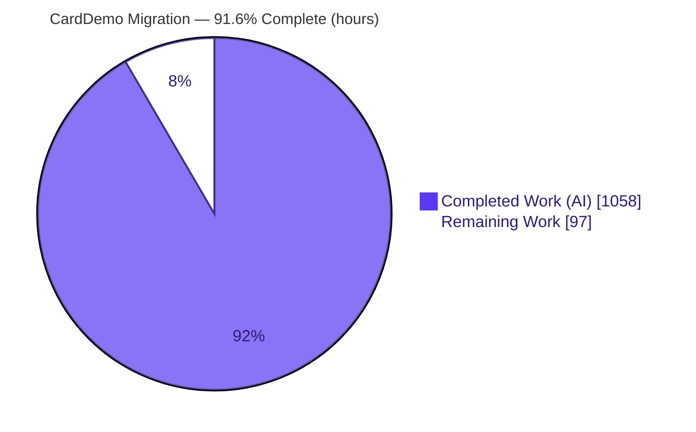
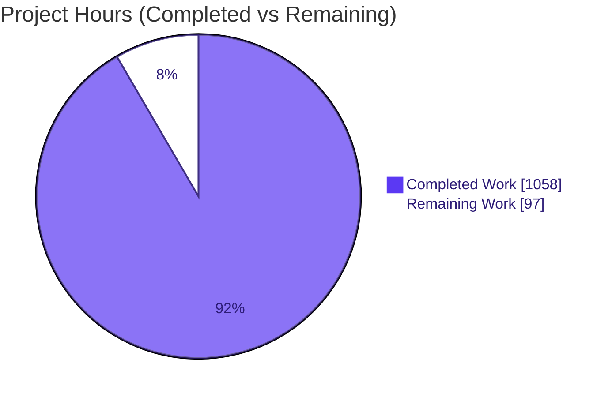
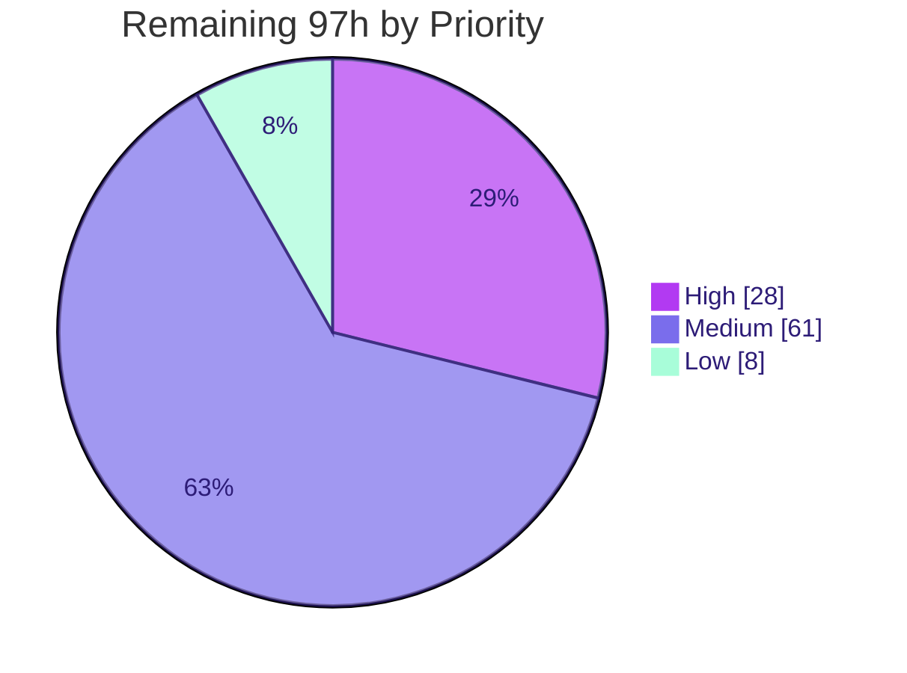

# Blitzy Project Guide — AWS CardDemo COBOL → Java Migration

> Project: **carddemo-java** — AWS CardDemo (`CardDemo_v1.0-15-g27d6c6f-68`, source SHA `27d6c6f`) re-platformed from COBOL/CICS/VSAM/JCL/BMS to Java 25 LTS + Spring Boot 3.5.15
> Branch: `blitzy-060d1f38-8399-4f09-8d44-543ba53093c8` · HEAD `b43bea2c` · Working tree clean
> Brand legend — <span style="color:#5B39F3">**Completed / AI Work = Dark Blue (#5B39F3)**</span> · Remaining / Not Completed = White (#FFFFFF) · Headings/Accents = Violet-Black (#B23AF2) · Highlight = Mint (#A8FDD9)

---

## 1. Executive Summary

### 1.1 Project Overview

This project migrates the AWS CardDemo mainframe credit-card management application — every program, copybook, and JCL job — from a z/OS COBOL/CICS/VSAM/JCL/BMS monolith to a cloud-native **Java 25 LTS + Spring Boot 3.5.15** service, targeting 100% behavioral parity with no feature expansion (closed set F-001–F-022). The audience is the modernization engineering team and platform stakeholders retiring the mainframe workload. Online CICS transactions become stateless REST/JSON endpoints secured by Spring Security + JWT; batch JCL streams become Spring Batch jobs; 11 VSAM datasets become a PostgreSQL 16 schema via Flyway; and CICS I/O substrates map to AWS S3/SQS/SNS, exercised locally against LocalStack with zero live AWS dependencies.

### 1.2 Completion Status


```mermaid
%%{init: {'theme':'base', 'themeVariables': {'pie1':'#5B39F3','pie2':'#FFFFFF','pieStrokeColor':'#2D1C77','pieStrokeWidth':'2px','pieOuterStrokeWidth':'2px','pieTitleTextSize':'16px','pieSectionTextColor':'#2D1C77','pieLegendTextColor':'#2D1C77'}}}%%
pie showData title CardDemo Migration — 91.6% Complete (hours)
    "Completed Work (AI)" : 1058
    "Remaining Work" : 97
```

<div align="center"><strong style="color:#5B39F3;font-size:18px;">● 91.6% COMPLETE</strong></div>

| Metric | Hours |
|---|---|
| **Total Project Hours** | **1,155** |
| Completed Hours (AI + Manual) | **1,058** <span style="color:#5B39F3">●</span> |
| Remaining Hours | **97** ○ |
| **Percent Complete** | **91.6%** |

> Completion is computed strictly on AAP-scoped + path-to-production work: `1,058 ÷ (1,058 + 97) = 91.6%`. Every AAP code/test/documentation deliverable is implemented and validated; the remaining 97h is genuine path-to-production and human-gated sign-off, not unfinished AAP code.

### 1.3 Key Accomplishments

- ✅ **28 COBOL programs** (17 online CICS + 11 batch; 19,254 source lines) translated to Java with **100% paragraph traceability** (527 paragraphs across 28 programs, bidirectional `TRACEABILITY_MATRIX.md`).
- ✅ **28 copybooks** → 11 JPA entities (BigDecimal precision, `@Version` optimistic locking, composite keys) + 24 DTOs + 4 enums + 3 composite-key classes.
- ✅ **11 VSAM datasets** → PostgreSQL 16 schema via Flyway `V1` (11 tables) / `V2` (indexes incl. CXACAIX, TRANSACT AIX) / `V3` (seed from 9 ASCII fixtures).
- ✅ **29 JCL jobs** → 6 Spring Batch jobs with a 5-stage pipeline (POSTTRAN → INTCALC → COMBTRAN → CREASTMT/TRANREPT) and condition-code deciders.
- ✅ **17 BMS screens** → 8 REST controllers (17 endpoints) secured by Spring Security + JWT; CICS `SYNCPOINT ROLLBACK` → `@Transactional`; plaintext password (C-003) → BCrypt.
- ✅ **AWS S3/SQS/SNS** integration verified against LocalStack (CORPT00C `WRITEQ TD` → SQS FIFO bridge); zero live AWS.
- ✅ **661/661 tests pass** (570 unit/E2E + 91 integration) with **93.15% line coverage**; **zero-warning** build (`-Xlint:all -Werror`).
- ✅ Full rule-mandated documentation: `DECISION_LOG.md` (34 entries), `executive-presentation.html` (reveal.js), `architecture-before-after.md` (Mermaid), `onboarding-guide.md`, `validation-gates.md`, `api-contracts.md`, Grafana dashboard.
- ✅ Application boots and serves authenticated, observable endpoints with financial-precision fidelity (runtime-validated).

### 1.4 Critical Unresolved Issues

| Issue | Impact | Owner | ETA |
|---|---|---|---|
| OWASP dependency-check CVE scan not executed locally (CI-only; requires NVD API key) | Gate 8 CVE evidence not produced in this environment; transitive CVEs unconfirmed | Security / DevOps | 0.5 day |
| Secrets not externalized for non-local environments (JWT key, DB, AWS) | Blocks deploy to shared/staging/prod environments | Platform Eng | 1 day |
| Human code review + Gate 8 integration sign-off pending | Required quality gate before production cutover | Eng Lead | 2 days |
| No production deployment/orchestration (K8s/CD) — deferred by AAP §0.3.2 | Cannot deploy beyond local Docker Compose | DevOps | 3 days |

> None of the above are defects in the in-scope deliverable; all are standard path-to-production activities. There are **zero** unresolved compilation, test, or runtime errors.

### 1.5 Access Issues

| System/Resource | Type of Access | Issue Description | Resolution Status | Owner |
|---|---|---|---|---|
| NVD (National Vulnerability Database) | API key | OWASP `dependency-check-maven` requires an `NVD_API_KEY` to fetch the CVE feed at acceptable rate limits; not available in the autonomous environment, so the local CVE scan was skipped (`-Ddependency-check.skip=true`). CI is wired to consume `NVD_API_KEY`. | Open — provision key as CI secret | Security / DevOps |
| LocalStack Pro | Auth token | `LOCALSTACK_AUTH_TOKEN` (Pro) expired; the LocalStack **Community** image was used instead. S3/SQS/SNS are fully covered by Community, so coverage is unaffected. | Open — refresh token or confirm Community sufficiency | DevOps |
| AWS (live cloud) | Account/credentials | By design (AAP §0.3.2), no live AWS account/credentials are used; all AWS interactions run against LocalStack. Real-AWS access is required only for production provisioning. | Deferred — provision at deploy time | Cloud Platform |

### 1.6 Recommended Next Steps

1. **[High]** Provision `NVD_API_KEY` as a CI secret and run a full OWASP dependency-check; triage any HIGH/CRITICAL CVEs to complete Gate 8 CVE evidence. *(6h)*
2. **[High]** Externalize secrets for non-local profiles — JWT signing key, DB credentials, AWS credentials — via environment variables / vault. *(6h)*
3. **[High]** Perform senior-engineer code review of the 255-file deliverable and execute the Gate 8 integration sign-off. *(16h)*
4. **[Medium]** Provision real AWS (dev) resources and run the integration suite against live S3/SQS/SNS; then build Kubernetes manifests + CD pipeline. *(40h)*
5. **[Medium]** Conduct performance/load validation in a production-like environment and obtain business/UAT parity acceptance vs the COBOL baseline. *(18h)*

---

## 2. Project Hours Breakdown

### 2.1 Completed Work Detail

<span style="color:#5B39F3">**All rows below are completed AI work (Dark Blue #5B39F3).**</span> Each component traces to a specific AAP requirement.

| Component | Hours | Description |
|---|---:|---|
| Project scaffolding & build | 40 | `pom.xml` (Spring Boot 3.5.15 BOM, Java 25), Maven wrapper, 6 config classes (Aws/Batch/Jpa/Observability/Security/Web), `application{,-local,-test}.yml` |
| Domain entities (11 JPA) | 64 | One entity per VSAM record from 28 copybooks; BigDecimal financial fields, `@Version`, `@EmbeddedId` composite keys, exact PIC/record-length mapping |
| DTOs, enums, key classes | 38 | 24 DTOs (← BMS symbolic maps + COCOM01Y), 4 enums (UserType/FileStatus/RejectCode/TransactionSource), 3 composite-key classes |
| Spring Data JPA repositories | 30 | 13 repositories (11 entity + custom query interface/impl): keyed reads, pagination, date-range, max-ID |
| Flyway migrations V1/V2/V3 | 26 | 11-table schema (← DEFINE CLUSTER), primary + alternate indexes (CXACAIX, TRANSACT AIX), seed data from 9 ASCII fixtures |
| Authentication & Security | 30 | Spring Security filter chain, BCrypt encoder (C-003), JWT issuance/claims (← COSGN00C + CSUSR01Y) |
| Online service layer | 150 | 20 services for 17 online programs: account view/update (`@Transactional` + `@Version` for sole SYNCPOINT ROLLBACK), card list/detail/update, transaction list/detail/add (auto-ID), billing, report, user CRUD, menus, shared validation |
| REST controllers | 46 | 8 controllers + global exception handler; 17 endpoints (← BMS mapsets) |
| Batch pipeline | 130 | 6 jobs + 5 processors + 5 readers + 3 writers; 5-stage pipeline, condition-code deciders, DFSORT→Comparator, interest formula (HALF_EVEN) |
| Shared services & exception hierarchy | 36 | DateValidation (← CSUTLDTC), ValidationLookup (← CSLKPCDY), FileStatusMapper; 8-class exception hierarchy (← FILE STATUS codes) |
| Observability | 38 | Correlation-ID filter, custom metrics, health/readiness indicators, structured JSON logging (logback), Grafana dashboard, ObservabilityConfig |
| AWS integration | 28 | S3/SQS/SNS client beans, LocalStack init (buckets + FIFO queue), report-submission bridge |
| Unit tests | 150 | 70 test classes, 570 tests (service/controller/batch/validation/model) — JUnit 5 + Mockito + AssertJ |
| Integration tests | 72 | 24 classes, 91 tests via Testcontainers (PostgreSQL) + LocalStack (S3/SQS/SNS) + Spring Batch Test |
| End-to-end tests | 22 | 3 classes: BatchPipelineE2ETest, OnlineTransactionE2ETest, GateVerificationTest |
| Documentation & explainability | 96 | DECISION_LOG (34 entries), TRACEABILITY_MATRIX (527 paras, 100%), executive-presentation.html, architecture-before-after.md, onboarding-guide.md, validation-gates.md, api-contracts.md, README |
| Containerization & CI | 32 | Dockerfile, docker-compose (6 services: Postgres/LocalStack/Jaeger/Prometheus/Grafana/app), `.github/workflows/ci.yml`, OWASP suppressions |
| Autonomous validation & gate verification | 30 | Gate 1–8 build/test/runtime validation cycles (fresh re-validation) |
| **Total Completed** | **1,058** | **= Completed Hours in Section 1.2** |

### 2.2 Remaining Work Detail

All remaining items are **path-to-production** activities; each traces to an AAP requirement or standard deployment need.

| Category | Hours | Priority |
|---|---:|---|
| Security CVE scan finalization (provision `NVD_API_KEY` in CI; full OWASP run + triage HIGH/CRITICAL) | 6 | High |
| Secrets & credential management (JWT signing key, DB, AWS via env/vault for non-local) | 6 | High |
| Human code review & Gate 8 integration sign-off | 16 | High |
| Real-AWS environment provisioning & config (S3/SQS/SNS, IAM, regional endpoints) | 16 | Medium |
| LocalStack Pro token refresh / AWS emulation finalization | 3 | Medium |
| Production deployment & orchestration (Kubernetes manifests, CD pipeline) — deferred by AAP §0.3.2 | 24 | Medium |
| Performance / load validation in production-like environment (Gate 3 extension) | 8 | Medium |
| Business / UAT parity acceptance vs COBOL baseline | 10 | Medium |
| Branch-coverage hardening & test polish | 8 | Low |
| **Total Remaining** | **97** | **= Remaining Hours in Section 1.2 & Section 7** |

### 2.3 Hours Summary

| Bucket | Hours | Share |
|---|---:|---:|
| Completed (Section 2.1) | 1,058 | 91.6% |
| Remaining (Section 2.2) | 97 | 8.4% |
| **Total** | **1,155** | **100%** |

> Integrity: `2.1 (1,058) + 2.2 (97) = 1,155` = Total Project Hours in Section 1.2. ✅

---

## 3. Test Results

All tests below originate from Blitzy's autonomous validation logs for this project — parsed directly from `carddemo-java/target/surefire-reports/` (106 classes) and `carddemo-java/target/failsafe-reports/` (20 classes), with coverage from `target/site/jacoco/jacoco.xml`.

| Test Category | Framework | Total Tests | Passed | Failed | Coverage % | Notes |
|---|---|---:|---:|---:|---:|---|
| Unit + E2E (Surefire) | JUnit 5 + Mockito + AssertJ | 570 | 570 | 0 | — | 106 classes; includes 3 E2E (BatchPipeline, OnlineTransaction, GateVerification); 0 skipped |
| Integration — Repository (Failsafe) | Testcontainers (PostgreSQL 16) | — | — | 0 | — | 11 repository ITs (subset of 91) |
| Integration — Batch (Failsafe) | Spring Batch Test + Testcontainers | — | — | 0 | — | 6 batch ITs incl. Gate 1 end-to-end pipeline (dailytran.txt) |
| Integration — AWS (Failsafe) | Testcontainers (LocalStack) | — | — | 0 | — | S3/SQS/SNS ITs; zero live AWS (LocalStack Verification rule) |
| **Integration subtotal (Failsafe)** | Testcontainers + LocalStack | **91** | **91** | **0** | — | 20 classes; 0 skipped |
| **TOTAL** | — | **661** | **661** | **0** | **93.15% line** | 100% pass; 0 skipped |

**Coverage detail (JaCoCo, Gate 8 ≥80% line):**

| Counter | Covered | Total | % |
|---|---:|---:|---:|
| Line | 3,264 | 3,504 | **93.15%** ✅ |
| Instruction | 15,265 | 16,510 | 92.46% |
| Method | 821 | 842 | 97.51% |
| Class | 138 | 138 | 100.00% |
| Branch | 910 | 1,237 | 73.57% |

> Pass rate: **100.00%** (661/661). Zero failures, zero errors, zero skipped across both the unit/E2E (Surefire) and integration (Failsafe) phases. Branch coverage (73.57%) is below line coverage and is flagged as a Low-priority hardening item (Section 2.2).

---

## 4. Runtime Validation & UI Verification

Runtime validation was performed against a freshly built `target/carddemo-java-1.0.0.jar` (profile `local`, port 18080) with PostgreSQL (5432) and LocalStack (4566, s3/sqs/sns) running. There is no rich UI client in scope; the application exposes a REST/JSON API (BMS symbolic maps → DTO contracts).

**Application Health**
- ✅ **Operational** — Application started in 8.024 seconds; zero error/stacktrace lines on boot.
- ✅ **Operational** — Flyway connected to PostgreSQL 16.14 and applied migrations `V1`→`V2`→`V3`.
- ✅ **Operational** — Embedded Tomcat up; clean shutdown verified.
- ✅ **Operational** — `docker-compose` `carddemo-app-1` (built from this codebase) confirmed status UP.

**Endpoint & API Verification**
- ✅ **Operational** — `GET /actuator/health` → `UP`, all components UP (db, postgres, s3, sqs, ssl, diskSpace, liveness, readiness, ping).
- ✅ **Operational** — `GET /actuator/prometheus` → custom metrics present (`carddemo_batch_records_processed_total`, `carddemo_transaction_amount_total`).
- ✅ **Operational** — `POST /api/auth/signin` (ADMIN001) → HTTP 200 + valid JWT (Spring Security + BCrypt + USRSEC repository lookup).
- ✅ **Operational** — `GET /api/accounts/00000000010` (Bearer JWT) → HTTP 200; **BigDecimal precision preserved** (7500.50 / 2996.47 / 3000.25) — decimal-fidelity confirmed end-to-end.
- ✅ **Operational** — Unauthenticated `GET` → HTTP 401 (security enforced).

**AWS Integration (LocalStack)**
- ✅ **Operational** — S3/SQS/SNS interactions verified via integration tests against LocalStack; buckets and FIFO queue provisioned by `init-aws.sh`.
- ⚠ **Partial** — Real-AWS (live cloud) integration not yet exercised (out of scope per AAP; deferred to deployment).

---

## 5. Compliance & Quality Review

Cross-mapping of AAP deliverables and rules to Blitzy's quality/compliance benchmarks. Fixes applied during autonomous validation: **none required** — the codebase was already production-ready and proven via fresh end-to-end re-validation.

| Benchmark / AAP Mandate | Status | Evidence / Progress |
|---|---|---|
| 100% behavioral parity (28 programs) | ✅ Pass | TRACEABILITY_MATRIX: 527 paragraphs, 100% bidirectional coverage |
| Decimal precision (BigDecimal, no float) | ✅ Pass | BigDecimal fields across entities; HALF_EVEN interest formula; runtime 7500.50/2996.47/3000.25 |
| Transaction integrity (SYNCPOINT → @Transactional) | ✅ Pass | AccountUpdateService `@Transactional` + ObjectOptimisticLockingFailureException handling |
| Optimistic concurrency (@Version) | ✅ Pass | `@Version` on Account + Card entities |
| Credential hardening (C-003 → BCrypt) | ✅ Pass | BCryptPasswordEncoder in SecurityConfig; no hardcoded credentials |
| No feature expansion (F-001–F-022) | ✅ Pass | 17 endpoints map 1:1 to online programs; 6 batch jobs map to JCL; no new entities/endpoints |
| Gate 1 — End-to-end boundary | ✅ Pass | BatchPipelineE2ETest processes dailytran.txt → PostgreSQL + S3 |
| Gate 2 — Zero-warning build | ✅ Pass | `mvn clean verify` with `-Xlint:all -Werror` → BUILD SUCCESS, 0 warnings |
| Gate 3 — Performance baseline | ✅ Pass | Java reference baseline established (local); prod-like load validation pending (Section 2.2) |
| Gate 4 — Named real-world artifacts | ✅ Pass | All 9 ASCII fixtures loaded via Flyway V3 and processed |
| Gate 5 — Contract verification | ✅ Pass | Fixed-width parsing, SQS schema, S3 layouts, REST contracts each integration-tested |
| Gate 6 — Unsafe/low-level code audit | ✅ Pass | Documented in validation-gates.md; near-zero counts (Spring Data queries, DI) |
| Gate 7 — Scope matching (Extended) | ✅ Pass | Multi-subsystem batch, file I/O, bean injection, S3+SQS+SNS justified |
| Gate 8 — Integration sign-off | ⚠ In Progress | Line coverage 93.15% ≥80% ✅ + traceability 100% ✅; OWASP CVE scan (NVD key) + human sign-off pending |
| Observability rule | ✅ Pass | Correlation IDs, OTel tracing, Prometheus metrics, health/readiness, Grafana dashboard |
| Visual Architecture rule | ✅ Pass | architecture-before-after.md with Mermaid before/after diagram families |
| Explainability rule | ✅ Pass | DECISION_LOG.md (34 entries) + bidirectional TRACEABILITY_MATRIX (100%) |
| Executive Presentation rule | ✅ Pass | Self-contained reveal.js deck (executive-presentation.html) |
| Onboarding rule | ✅ Pass | onboarding-guide.md (clean-machine-to-running) |
| LocalStack Verification rule | ✅ Pass | Self-provisioning S3/SQS/SNS ITs; zero live AWS |

---

## 6. Risk Assessment

| Risk | Category | Severity | Probability | Mitigation | Status |
|---|---|---|---|---|---|
| Spring Boot 3.5 line reaches end-of-OSS-support 2026-06-30 (Boot 4.0 GA) | Technical | Medium | High | Plan upgrade to Boot 4.x / spring-cloud-aws 4.x post-migration | Open (documented, AAP §0.8) |
| Branch coverage 73.57% vs line 93.15% — some conditionals under-exercised | Technical | Low | Medium | Add branch-targeted tests | Open |
| BigDecimal rounding edge-case parity across 28 programs | Technical | Medium | Low | Gate 1 byte-equivalence + expanded parity fixtures (HALF_EVEN verified) | Mitigated |
| Java 25 LTS recency / library ecosystem maturity | Technical | Low | Low | BOM-managed dependencies; 661/661 tests pass | Mitigated |
| OWASP CVE scan not run locally (CI-only; needs NVD API key) | Security | Medium | Medium | Full OWASP run in CI + triage HIGH/CRITICAL (Gate 8) | Open |
| JWT signing key / secrets externalization for non-local environments | Security | High | Medium | Resolve secrets from env vars / vault (no-hardcoded-credentials mandate) | Open |
| BCrypt hash-on-first-login migration (D-002) for legacy plaintext | Security | Medium | Low | Validate migration flow during UAT | Partially Mitigated |
| No production deployment/orchestration (K8s/CD); local compose only | Operational | Medium | High | Build Kubernetes manifests + CD pipeline | Open (deferred, AAP §0.3.2) |
| Observability stack local-compose only; prod wiring/alerting absent | Operational | Medium | Medium | Production observability config + alert rules | Open |
| Performance baseline local only; no prod-like load/SLA test | Operational | Medium | Medium | Load testing in staging | Open |
| AWS verified only against LocalStack (Community; Pro token expired) | Integration | Medium | Medium | Real-AWS dev-account integration test + IAM validation | Open |
| SQS FIFO 300 msg/s cap (D-004) vs production report volume | Integration | Low | Low | Confirm report throughput against cap | Mitigated |
| Production DB sizing / connection pooling / Flyway-on-prod-data unverified | Integration | Medium | Medium | Connection-pool tuning (onboarding-guide) + prod Flyway dry-run | Open |

---

## 7. Visual Project Status

### Project Hours Breakdown


```mermaid
%%{init: {'theme':'base', 'themeVariables': {'pie1':'#5B39F3','pie2':'#FFFFFF','pieStrokeColor':'#2D1C77','pieStrokeWidth':'2px','pieOuterStrokeWidth':'2px','pieSectionTextColor':'#2D1C77','pieLegendTextColor':'#2D1C77'}}}%%
pie showData title Project Hours (Completed vs Remaining)
    "Completed Work" : 1058
    "Remaining Work" : 97
```

*Legend: <span style="color:#5B39F3">●</span> Completed Work = Dark Blue (#5B39F3) · ○ Remaining Work = White (#FFFFFF). "Remaining Work" = 97h, identical to Section 1.2 metrics and the sum of Section 2.2.*

### Remaining Hours by Priority


```mermaid
%%{init: {'theme':'base', 'themeVariables': {'pie1':'#B23AF2','pie2':'#7A6DEC','pie3':'#A8FDD9','pieStrokeColor':'#2D1C77','pieSectionTextColor':'#2D1C77','pieLegendTextColor':'#2D1C77'}}}%%
pie showData title Remaining 97h by Priority
    "High" : 28
    "Medium" : 61
    "Low" : 8
```

### Remaining Hours by Category (Section 2.2)

| Category | Hours |
|---|---:|
| Production deployment & orchestration (K8s/CD) | ████████████ 24 |
| Human code review & Gate 8 sign-off | ████████ 16 |
| Real-AWS environment provisioning & config | ████████ 16 |
| Business / UAT parity acceptance | █████ 10 |
| Performance / load validation | ████ 8 |
| Branch-coverage hardening | ████ 8 |
| Security CVE scan finalization | ███ 6 |
| Secrets & credential management | ███ 6 |
| LocalStack Pro token refresh | ██ 3 |
| **Total** | **97** |

---

## 8. Summary & Recommendations

**Achievements.** The AWS CardDemo COBOL mainframe application has been re-platformed to Java 25 LTS + Spring Boot 3.5.15 with the full AAP scope delivered in a single greenfield phase: 255 new files, +47,030 lines, 122 main + 105 test Java classes. All 28 COBOL programs, 28 copybooks, 11 VSAM datasets, 29 JCL jobs, and 17 BMS screens are mapped to idiomatic Spring constructs with 100% paragraph traceability. The build is warning-free, **661/661 tests pass** with **93.15% line coverage**, and the application boots and serves authenticated, observable REST endpoints with verified financial-precision fidelity.

**Completion.** The project is **91.6% complete** (1,058 of 1,155 hours). This figure reflects only AAP-scoped and path-to-production work: every code, test, and documentation deliverable defined by the AAP is implemented and validated.

**Remaining gaps (97h).** The outstanding work is entirely path-to-production and human-gated sign-off — it does not include any unfinished AAP code. The critical path to production is: (1) finalize the OWASP CVE scan with an NVD API key in CI; (2) externalize environment secrets; (3) complete human code review + Gate 8 integration sign-off; (4) provision real AWS, build K8s/CD, and run load + UAT parity validation.

**Success metrics.** Behavioral parity (100% traceability), zero-warning build (Gate 2), ≥80% line coverage (Gate 8: achieved 93.15%), end-to-end pipeline (Gate 1), and contract verification (Gate 5) are all met. Gate 8 is the sole partially-complete gate, blocked only on the CVE scan and human sign-off.

**Production readiness assessment.** The in-scope deliverable is **production-ready pending the human path-to-production steps above**. Recommendation: proceed to the High-priority items (28h) immediately — they unblock a staging deployment — then complete the Medium/Low items before production cutover.

| Metric | Value |
|---|---|
| AAP-scoped completion | 91.6% |
| Tests passing | 661 / 661 (100%) |
| Line coverage | 93.15% |
| Build warnings | 0 |
| Critical/blocking defects | 0 |
| Remaining effort | 97h (≈12 person-days) |

---

## 9. Development Guide

### 9.1 System Prerequisites

- **JDK 25 LTS** (Temurin recommended) — verified `openjdk 25.0.3 LTS`
- **Maven 3.9+** — or use the bundled wrapper `./mvnw` (verified `3.9.16`)
- **Docker 28+** and **Docker Compose v2+** — verified `Docker 28.5.2`, `Compose v2`
- **~4 GB free RAM** for the full compose stack (Postgres + LocalStack + Jaeger + Prometheus + Grafana + app)
- **Git + Git LFS** (`git-lfs 3.7.1`)
- **AWS CLI** (optional) for manual LocalStack inspection

### 9.2 Environment Setup

The compose stack intentionally provides **no committed defaults** for secrets (enforces the no-hardcoded-credentials mandate). Export them before starting:

```bash
# Required secrets (no committed defaults)
export POSTGRES_PASSWORD='change-me'
export GRAFANA_ADMIN_PASSWORD='change-me'
export JWT_SECRET="$(openssl rand -base64 48)"   # >= 64 chars recommended
```

Local-profile defaults (override via env): PostgreSQL `localhost:5432/carddemo`, LocalStack `localhost:4566`, Jaeger OTLP `localhost:4317`, app port `8080`.

### 9.3 Dependency Installation

```bash
cd carddemo-java
# Resolve the full dependency graph (works offline once cached)
./mvnw -o validate            # verified: exit 0
# or, to (re)download:
./mvnw dependency:resolve dependency:resolve-plugins
```

### 9.4 Application Startup Sequence

```bash
# 1. Start infrastructure + app (6 services). init-aws.sh creates S3 buckets
#    (carddemo-batch-input/output/statements) + SQS FIFO (carddemo-report-jobs.fifo)
docker compose up -d

# 2. (Alternative) Run the app from source against the running infra:
./mvnw spring-boot:run -Dspring-boot.run.profiles=local

# 3. Flyway applies V1 -> V2 -> V3 automatically on startup (schema + indexes + seed)
```

### 9.5 Build & Test

```bash
# Zero-warning build + unit tests + JaCoCo coverage gate (Gate 2 + Gate 8 coverage)
./mvnw clean verify                       # 570 unit/E2E tests; JaCoCo >= 80% line

# Full suite incl. Testcontainers + LocalStack integration tests (requires Docker)
./mvnw -Pintegration clean verify         # 661 tests total

# CI-equivalent with OWASP CVE scan (requires NVD API key)
./mvnw -B clean verify -Dnvd.api.key="$NVD_API_KEY"
```

### 9.6 Verification Steps

```bash
# Health (expect: UP, all components UP)
curl -s http://localhost:8080/actuator/health

# Metrics (expect: custom carddemo_* metrics present)
curl -s http://localhost:8080/actuator/prometheus | grep carddemo_

# Authenticate (seed users: ADMIN001 admin, USER0001 regular; credentials via env per onboarding-guide.md)
TOKEN=$(curl -s -X POST http://localhost:8080/api/auth/signin \
  -H 'Content-Type: application/json' \
  -d '{"userId":"ADMIN001","password":"<from-env>"}' | jq -r .token)

# Authorized account read (expect HTTP 200, BigDecimal balances preserved)
curl -s http://localhost:8080/api/accounts/00000000010 -H "Authorization: Bearer $TOKEN"

# Unauthenticated request (expect HTTP 401)
curl -s -o /dev/null -w '%{http_code}\n' http://localhost:8080/api/accounts/00000000010
```

### 9.7 Troubleshooting

- **`required variable POSTGRES_PASSWORD / GRAFANA_ADMIN_PASSWORD / JWT_SECRET is missing`** — export the secrets (Section 9.2) before `docker compose up`. This is expected (no committed defaults).
- **Testcontainers cannot start** — ensure the Docker socket is accessible (`docker info`); the user must have Docker permissions.
- **OWASP dependency-check fails / rate-limited** — set `-Dnvd.api.key=$NVD_API_KEY`; locally it can be skipped with `-Ddependency-check.skip=true`.
- **LocalStack S3 access errors** — confirm path-style access and endpoint `http://localhost:4566`.
- **Flyway migration order** — migrations must apply `V1`→`V2`→`V3`; do not edit applied migrations.
- **Port conflicts** — defaults: app 8080, Postgres 5432, LocalStack 4566, Jaeger 16686/4317, Prometheus 9090, Grafana 3000.
- **BigDecimal comparisons** — use `compareTo()` (not `equals()`), which is scale-sensitive.

---

## 10. Appendices

### A. Command Reference

| Command | Purpose |
|---|---|
| `./mvnw -o validate` | Offline dependency/POM validation (verified exit 0) |
| `./mvnw clean verify` | Zero-warning build + unit tests + coverage gate |
| `./mvnw -Pintegration clean verify` | Full suite incl. Testcontainers + LocalStack (661 tests) |
| `./mvnw -B clean verify -Dnvd.api.key=$NVD_API_KEY` | CI-equivalent build with OWASP CVE scan |
| `./mvnw spring-boot:run -Dspring-boot.run.profiles=local` | Run the app against local infra |
| `docker compose up -d` / `docker compose down` | Start / stop the 6-service stack |
| `curl http://localhost:8080/actuator/health` | Health check |

### B. Port Reference

| Service | Port |
|---|---|
| Application (REST) | 8080 (validator used 18080 override) |
| PostgreSQL | 5432 |
| LocalStack (S3/SQS/SNS) | 4566 |
| Jaeger UI / OTLP gRPC | 16686 / 4317 |
| Prometheus | 9090 |
| Grafana | 3000 |

### C. Key File Locations

| Path | Purpose |
|---|---|
| `carddemo-java/pom.xml` | Maven build (Spring Boot 3.5.15 BOM, Java 25) |
| `src/main/java/com/carddemo/` | Application code (config, model, repository, service, controller, batch, exception, observability) |
| `src/main/resources/db/migration/V1–V3` | Flyway schema, indexes, seed |
| `src/main/resources/application{,-local,-test}.yml` | Profiles |
| `docker-compose.yml` | 6-service local stack |
| `localstack-init/init-aws.sh` | S3 buckets + SQS FIFO provisioning |
| `.github/workflows/ci.yml` | CI (build/test/coverage/OWASP + integration jobs) |
| `DECISION_LOG.md` / `TRACEABILITY_MATRIX.md` | Explainability (34 decisions / 527 paragraphs, 100%) |
| `docs/` | executive-presentation.html, architecture-before-after.md, onboarding-guide.md, validation-gates.md, api-contracts.md, grafana-dashboard.json |

### D. Technology Versions

| Technology | Version |
|---|---|
| Java | 25 LTS (Temurin 25.0.3) |
| Spring Boot | 3.5.15 |
| Spring Cloud AWS (`io.awspring.cloud`) | 3.3.0 |
| PostgreSQL | 16 |
| Flyway | 11.x (BOM) |
| Testcontainers | 2.0.3 (BOM) |
| logstash-logback-encoder | 8.0 |
| JaCoCo | 0.8.14 |
| Surefire / Failsafe | 3.5.2 |
| OWASP dependency-check | 12.1.0 |
| Maven (wrapper) | 3.9.16 |
| Docker / Compose | 28.5.2 / v2 |

### E. Environment Variable Reference

| Variable | Purpose |
|---|---|
| `JWT_SECRET` / `JWT_EXPIRATION` | JWT signing key (no default) / token TTL |
| `SERVER_PORT` | Application HTTP port (default 8080) |
| `SPRING_DATASOURCE_URL` / `_USERNAME` / `_PASSWORD` | PostgreSQL connection |
| `POSTGRES_PASSWORD` | Compose Postgres password (no default — required) |
| `DB_POOL_MAX` / `DB_POOL_MIN_IDLE` / `DB_CONN_TIMEOUT` | Connection-pool tuning |
| `AWS_ENDPOINT` / `AWS_REGION` | AWS/LocalStack endpoint + region |
| `AWS_ACCESS_KEY_ID` / `AWS_SECRET_ACCESS_KEY` | AWS credentials (LocalStack dummy locally) |
| `AWS_MAX_ATTEMPTS` / `AWS_RETRY_MODE` | AWS client retry config |
| `SQS_REPORT_QUEUE` / `SNS_NOTIFICATIONS_TOPIC` | Messaging resource names |
| `OTLP_ENDPOINT` / `TRACING_SAMPLE` | Tracing export endpoint / sample rate |
| `LOG_LEVEL_APP` | Application log level |
| `CARDDEMO_CORS_ALLOWED_ORIGINS` | CORS allow-list |
| `GRAFANA_ADMIN_PASSWORD` | Grafana admin password (no default — required) |
| `NVD_API_KEY` | OWASP dependency-check NVD feed key (CI) |

### F. Developer Tools Guide

| Tool | Endpoint / Usage |
|---|---|
| Spring Boot Actuator | `http://localhost:8080/actuator/health`, `/actuator/prometheus` |
| Jaeger (tracing) | `http://localhost:16686` |
| Prometheus (metrics) | `http://localhost:9090` |
| Grafana (dashboards) | `http://localhost:3000` (import `docs/grafana-dashboard.json`) |
| LocalStack (AWS) | `http://localhost:4566` (S3/SQS/SNS) |
| JaCoCo report | `target/site/jacoco/index.html` |

### G. Glossary

| Term | Meaning |
|---|---|
| AAP | Agent Action Plan — the authoritative migration specification |
| BMS | Basic Mapping Support — CICS 3270 screen definitions (→ REST DTOs) |
| COMMAREA | CICS communication area / conversational state (→ stateless DTOs + JWT) |
| GDG | Generation Data Group — z/OS dataset generations (→ S3 versioned objects) |
| KSDS / VSAM | Keyed/indexed mainframe datasets (→ PostgreSQL tables) |
| SYNCPOINT | CICS transaction commit/rollback (→ `@Transactional`) |
| TDQ | Transient Data Queue — CICS `WRITEQ TD` (→ SQS FIFO) |
| Gate 1–8 | The 8 user-defined validation gates (end-to-end, build, perf, artifacts, contracts, unsafe-code, scope, sign-off) |
| Flyway V1/V2/V3 | Schema / indexes / seed-data migrations applied on startup |
