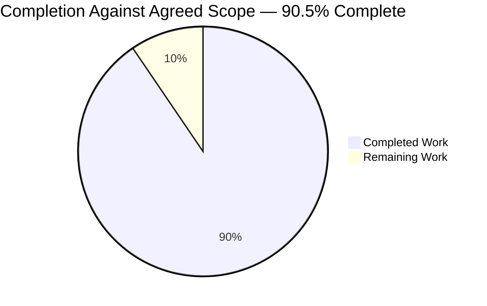
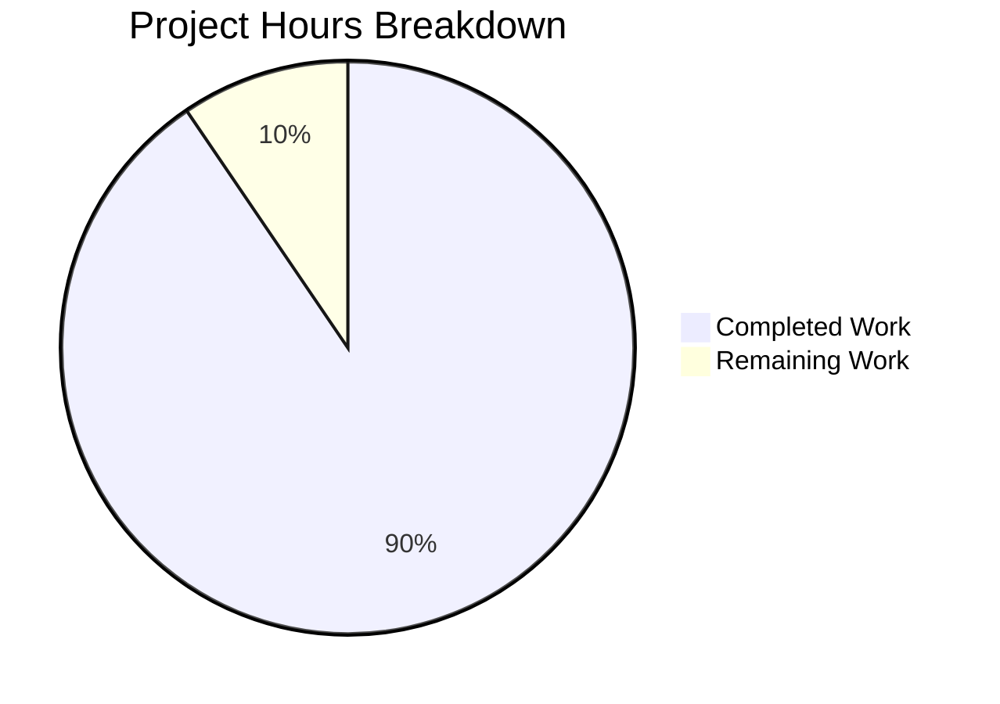
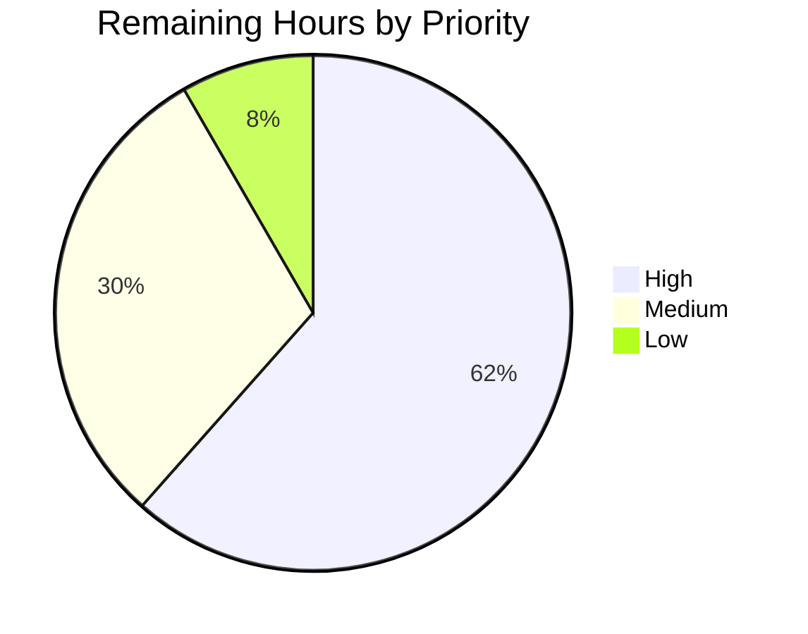

# 1. Executive Summary

## 1.1 Project Overview

The AWS CardDemo credit-card application — 19,254 lines of IBM Enterprise COBOL under CICS, VSAM, JCL and BMS on z/OS — now has an equivalent Java 25 and Spring Boot 3.5.11 implementation beside it in the same repository. All 22 catalogued features are delivered: 17 online operations as 17 REST endpoints, plus five Spring Batch jobs and an orchestrator over PostgreSQL 16, with object storage, a FIFO queue and notification topics replacing generation data groups and the transient data queue. The legacy corpus under `app/` is untouched and remains the parity reference. It serves the teams who operate and develop the card platform.

## 1.2 Completion Status


```mermaid
pie title Completion Against Agreed Scope — 90.5% Complete
    "Completed Work" : 1486
    "Remaining Work" : 156
```

Chart colours: Completed Work = Dark Blue `#5B39F3`; Remaining Work = White `#FFFFFF`.

| Metric | Value |
|---|---|
| Total Hours | **1,642** |
| Completed Hours (AI + Manual) | **1,486** |
| Remaining Hours | **156** |
| Percent Complete | **90.5%** |

Calculation: 1,486 ÷ (1,486 + 156) × 100 = **90.5%**. Scope is the agreed migration deliverables plus the path-to-production work needed to deploy them; hardening the plan explicitly defers is excluded from both sides.

## 1.3 Key Accomplishments

- All 22 catalogued features (F-001 to F-022) implemented and driven at runtime against a live seven-service stack.
- 17 REST endpoints across 8 controllers replacing 17 CICS screen programs, with the source page sizes of 7 and 10 preserved.
- Five-stage batch pipeline and a 20-step orchestrator: 300 fixture rows post to 262 transactions and 100 category balances at return code 4.
- 11 entities and 11 repositories over PostgreSQL 16, established by three migrations with zoned-decimal decoding and hashed seed credentials.
- Fixed-width geometry byte-exact: 430-byte rejects, 133-byte report lines, 80- and 100-byte statements.
- Observability the source never had: JSON logging with correlation, four named counters, metrics scrape, tracing and a 13-panel dashboard.
- 16,084 automated tests pass at 91.5% line coverage; the tree compiles warning-free at release 25 with warnings escalated to errors.
- The frozen COBOL corpus is byte-identical to its anchor commit, so it still serves as parity oracle and field-contract source.

## 1.4 Critical Unresolved Issues

| Issue | Impact | Owner | ETA |
|---|---|---|---|
| Byte-level parity against a real mainframe run is unproven — the comparison oracle is derived by executing the frozen COBOL under GnuCOBOL, not captured from z/OS | Logic parity is evidenced field for field; runtime parity on the original platform is not, so final parity sign-off cannot be given | Migration owner with mainframe operations | 24h once the capture is supplied |
| No per-caller authorization on 10 of the 17 operations — they are role-gated only (`src/main/java/com/cardemo/config/SecurityConfig.java`) | Any authenticated operator can read or modify any account, card or transaction; safe only inside a single trust domain | Product, then application security | 32h after the scoping decision |
| Three High advisories in the dependency graph are closable only by advancing the pinned Spring Boot parent, so the container-image and gate-evidence pipeline jobs fail deliberately | The pipeline stays red by design and the advisories remain present | Build maintenance | 12h after sign-off |
| Three High operating-system advisories in the image builder stage | Reported rather than gated; the delivered runtime layer scans clean | Build maintenance | 8h |
| The published evidence prose and the workflow's runner behaviour are asserted structurally, never exercised — no automated check reads the register prose and the workflow has never run on a hosted runner | A documentation or workflow regression would not be caught locally | Platform engineering | 8h |

## 1.5 Access Issues

| System/Resource | Type of Access | Issue Description | Resolution Status | Owner |
|---|---|---|---|---|
| z/OS or licensed mainframe emulator | Runtime execution | Needed to capture a real POSTTRAN run — the 430-byte reject dataset plus the resulting transaction, account and category-balance images — as the parity comparison target | Unavailable; blocks parity sign-off | Migration owner with mainframe operations |
| LocalStack Pro entitlement | Licence token | The supplied token has expired | Non-blocking — the community image is pinned everywhere and only object storage, queueing and notifications are used | Platform engineering |
| AWS account and credentials | Cloud service access | None exist, by design: every cloud call targets the local emulator and no code path may reach a live endpoint | Intentional; a production deployment must supply endpoints and scoped credentials | Platform engineering |
| Vulnerability-feed API key | Service credential | Not configured, by design | Non-blocking — a cold feed download takes about 1h50m against roughly 13 minutes warm | Build maintenance |
| Hosted CI runner | Pipeline execution | The six-job workflow has never executed on a hosted runner from this environment | Open — verify on first push | Platform engineering |

## 1.6 Recommended Next Steps

1. **[High]** Obtain the captured z/OS POSTTRAN run, load it beside the baselines in `src/test/resources/parity/gate1/`, diff it and close parity sign-off.
2. **[High]** Settle the authoritative user-to-resource relation, then implement the per-caller authorization predicate with negative tests.
3. **[High]** Take the pinned-version decision, advance the parent, re-run the three scanners and clear the builder-stage advisories.
4. **[High]** Provision production: managed PostgreSQL with its least-privilege roles, real cloud endpoints, and a secret store.
5. **[Medium]** Add TLS termination, rate limiting, alert rules over the counters and health groups, and the operational runbook.

# 2. Project Hours Breakdown

## 2.1 Completed Work Detail

| Component | Hours | Description |
|---|---:|---|
| Build foundation and toolchain determinism | 28 | `pom.xml` at release 25 with every plugin pinned, seven enforcer rules, warnings-as-errors, the 0.80 coverage floor and the CVSS 7 security gate; pinned Maven wrapper; hygiene and ignore files |
| Data substrate | 72 | 11 entities from the record-layout copybooks, 3 composite keys, 4 enums, 11 repositories including the three finders that replace the VSAM alternate indexes |
| Schema and seed migrations | 44 | `V1__create_schema.sql` (11 tables, not-null throughout, 5 check constraints, 10 foreign keys, version columns), `V2__create_indexes.sql`, `V3__seed_data.sql` with position-aware zoned-decimal decoding and BCrypt hashing |
| Online services — account and card | 150 | `AccountUpdateService` from a 4,236-line program with dual-record write, field-by-field snapshot comparison and asymmetric rollback; card update, card list, account view and card detail |
| Online services — transaction, billing and report | 92 | Transaction list, detail and add with descending-browse identifier generation and two distinct numeric parsers; full-balance bill payment; report submission bridging to the FIFO queue |
| Online services — auth, menus and user administration | 76 | Sign-on with case folding and BCrypt verification, main and admin menus with the user-type gate, and the four user administration paths |
| Shared services | 44 | Date validation replacing the language-environment call, lookup tables externalised as three classpath resources, the central file-status translator, and the file-access handler map |
| REST surface | 88 | 8 controllers exposing 17 endpoints, 29 DTOs shaped from 441 screen field contracts, and a 9-class typed exception hierarchy |
| Security | 36 | Token provider and authentication filter replacing communication-area propagation, user-details service, sealed update snapshots, and the 17-operation authorization matrix closing on deny-all |
| Batch jobs and processors | 168 | Daily posting with its validation cascade and reject engine, interest calculation, transaction combination, statement generation, transaction reporting, and the 20-step orchestrator with return-code deciders and a parallel split |
| Batch readers and writers | 40 | 7 readers including the concatenated and backup legs, 3 writers holding the 430-, 133-, 100- and 80-byte record geometries |
| Cloud integration | 44 | S3, SQS FIFO and SNS clients against the local emulator, generation-group keys mapped over seven prefixes, dead-letter redrive, and idempotent resource provisioning |
| Observability layer | 56 | JSON logging with credential and identifier masking, correlation filter, four named counters tagged by reject code, tracing export, four health contributors, and Prometheus and Grafana provisioning with a 13-panel dashboard |
| Configuration profiles | 28 | Four profiles with every secret environment-indirected and fail-fast on absence of the signing key |
| Unit test tier | 200 | 224 test classes covering services, processors, models, DTOs, enums, configuration and validation |
| Integration test tier | 68 | 40 test classes over containerised PostgreSQL 16 and the cloud emulator, covering repositories, batch steps and deciders |
| End-to-end tier and gate harness | 40 | Batch pipeline and online journey suites plus the machine-checkable gate harness |
| Parity oracle and fixture baselines | 32 | Oracle derivation harness executing the frozen COBOL, six expected-output baselines and the fixture copies |
| Container and compose topology | 36 | Multi-stage image on a pinned base and a seven-service compose stack with health gating, secrets and least-privilege database roles |
| Pipeline and supply-chain gates | 28 | Six-job workflow pinned to the toolchain, dependency and plugin-graph scanning with written dispositions, and payload redaction for smoke output |
| Evidence artefacts | 60 | Decision register, paragraph-level traceability matrix over 528 procedure paragraphs in 28 programs, and the gate ledger |
| Developer and stakeholder documentation | 56 | API contracts, onboarding guide, architecture before-and-after, executive summary, the appended build and run sections of the readme, and the documentation site machinery |
| **Total** | **1,486** | |

## 2.2 Remaining Work Detail

| Category | Hours | Priority |
|---|---:|---|
| Legacy parity sign-off — obtain the external z/OS capture, wire it in, diff and republish | 24 | High |
| Object-level authorization — scoping decision, user-model extension, per-caller predicate on 10 operations, negative tests | 32 | High |
| Dependency pin advance and supply-chain re-scan | 12 | High |
| Pipeline green — clear the builder-stage image advisories and confirm both security jobs exit zero | 8 | High |
| Production environment provisioning and secret management | 20 | High |
| Production hardening deferred by design — TLS termination, request rate limiting, connection-pool tuning | 24 | Medium |
| Operational runbook and alert rules | 12 | Medium |
| Published census and evidence reconciliation | 8 | Medium |
| In-image test parity — the one interpreter-dependent skip inside the image | 3 | Medium |
| Third-party and cosmetic residue | 6 | Low |
| Frozen-reference governance and catalogue metadata | 4 | Low |
| Observability environment adoption — fresh dashboard volume, scrape-config reload | 3 | Low |
| **Total** | **156** | |

## 2.3 Hours Reconciliation

| Check | Result |
|---|---|
| Section 2.1 total | 1,486h |
| Section 2.2 total | 156h |
| 2.1 + 2.2 | 1,642h — equals Total Hours in Section 1.2 |
| Completion | 1,486 ÷ 1,642 = 90.5% |
| Remaining by priority | High 96h · Medium 47h · Low 13h = 156h |

Effort was estimated per deliverable against its source: one service per COBOL program sized by that program's length and control-flow complexity, one entity per record layout, one endpoint per screen transaction, and testing at 308h — about 36% of the 852h implementation total, inside the normal 30–40% band. Confidence is high on every delivered row, which compiles, tests and runs. It is medium on the parity capture and the production provisioning rows, whose scope depends on an external party, and medium on the authorization row, which needs a product decision before it can be sized precisely; the 32h assumes one authoritative user-to-resource relation rather than a full tenancy model.

# 3. Test Results

Every figure below comes from one execution of `./mvnw -B -ntp clean verify` at the current head: **BUILD SUCCESS in 11 minutes 10 seconds, 16,084 cases, zero failures, zero errors, zero skips**, with 0 `[ERROR]` lines and one non-compiler `[WARNING]` (the dependency scanner's own summary banner) under `-Xlint:all -Werror` with `failOnWarning` at release 25.

| Area / Category | Framework | Tests | Passed | Failed | Coverage | What This Proves |
|---|---|---:|---:|---:|---|---|
| Domain model, DTOs, keys and enums | JUnit 5 + AssertJ | 7,250 | 7,250 | 0 | part of merged bundle | Every field name, width, scale and decimal precision matches its copybook or screen contract, and no monetary value uses binary floating point |
| Online services | JUnit 5 + Mockito | 3,309 | 3,309 | 0 | part of merged bundle | Each of the 17 screen programs behaves paragraph for paragraph, including snapshot comparison, case-folding asymmetry, pagination sizes and the preserved legacy literals |
| Batch processors and job wiring | JUnit 5 + Spring Batch test | 1,928 | 1,928 | 0 | part of merged bundle | The validation cascade, the reject-code engine including 103 overwriting 102, control breaks, the empty-paragraph no-op and exit-code semantics all reproduce the source |
| Configuration, security and validation | JUnit 5 + Spring Security test | 1,600 | 1,600 | 0 | part of merged bundle | Profile invariants and fail-fast hold, the authorization matrix admits and refuses exactly the intended callers, and lookup and date outcomes match the source tables |
| Controllers, exceptions, observability and repositories | JUnit 5 + MockMvc | 1,075 | 1,075 | 0 | part of merged bundle | Endpoint request and response contracts, file-status-to-exception translation, correlation, metrics and health wiring, and derived repository queries |
| Repository and persistence integration | Testcontainers PostgreSQL 16 | 447 | 447 | 0 | part of merged bundle | Migrations apply cleanly, constraints and indexes behave, and every repository round-trips against a real database |
| Cloud integration | Testcontainers LocalStack | 199 | 199 | 0 | part of merged bundle | Object keys, record geometry at the storage boundary, FIFO publication and dead-letter redrive work against real service APIs |
| Batch integration and end-to-end | Spring Batch test + REST | 276 | 276 | 0 | part of merged bundle | The pipeline runs end to end on the 300-row fixture, restart refuses to re-apply work, the online journey completes, and the eight gates are machine-checked |
| **Total** | | **16,084** | **16,084** | **0** | **Line 91.5% · Branch 81.0% · Method 97.8% · Class 351/351** | |

Coverage is measured once over the merged unit and integration data: line 22,801 covered of 24,923 (91.4858%), branch 81.0327%, method 97.8226%, class 351 of 351, against a 0.80 line floor that halts the build. Test counts split 15,162 across 212 unit suites and 922 across 38 integration and end-to-end suites. The dependency scan ran unskipped over 168 dependencies and reported two active findings at CVSS 6.7 and 5.3 with **none at or above 7**.

### Not Covered

- **Byte-level parity against a real mainframe run.** The 300-row fixture is diffed field for field against six committed baselines, but those baselines were produced by executing the frozen COBOL under GnuCOBOL on Linux, not captured from z/OS. A human must obtain the captured run named in `docs/validation-gates.md` before parity can be signed off.
- **Cross-caller authorization.** No test proves that one operator cannot read another's account, because no such rule exists in the implementation. Once the ownership predicate is added, it needs negative tests.
- **The published prose of the evidence registers.** Derived counts inside `DECISION_LOG.md` and `TRACEABILITY_MATRIX.md` are re-derived from the tree and fail the build when stale, but their narrative text is asserted by nothing. Review it by reading.
- **The build workflow's runtime behaviour.** `.github/workflows/build.yml` is parsed and its pins asserted, yet it has never executed on a hosted runner from here. Confirm on first push.
- **Live cloud services.** Every S3, SQS and SNS path is exercised only against the emulator. Run one staged integration against real endpoints before cutover.
- **Load and soak.** Latency is sampled 40 times per endpoint on a single instance; there is no sustained-volume or concurrency profile. Run a soak at expected volume before release.
- **The static stakeholder page below the first screen.** `docs/executive-presentation.html` is verified for encoding, structure and rendering; its lower content is not asserted by any check and should be proofread.

# 4. Runtime Validation &amp; UI Verification

The seven-service stack was brought up with `docker compose up -d --wait` and reached **all seven containers healthy in about 45 seconds**. Every line below was driven against that running stack.

- ✅ **Start-up and health** — application, PostgreSQL, the cloud emulator, tracing, metrics, dashboard and the metric gateway all healthy; `/actuator/health` returns `{"status":"UP","groups":["liveness","readiness"]}` and both group endpoints answer 200. Three Flyway migrations applied, 18 tables present, 10 credentials seeded as BCrypt hashes.
- ✅ **Authentication and authorization** — sign-on returns a bearer token with the correct user type for both a standard user and an administrator; an admin route answers 403 to a standard token, 401 with no token, and 200 to an administrator.
- ✅ **Online read journeys** — main menu, account view (cross-reference, account and customer composed in one traversal with the legacy edited masks), card list returning exactly 7 rows, transaction list returning exactly 10, user administration list returning 10.
- ✅ **Online write journeys** — card and account update through sealed snapshots, transaction add, full-balance bill payment, and the three user administration write paths, each carrying its byte-exact source caption; a contended row answers 409 rather than a generic fault.
- ✅ **Report submission bridge** — `POST /api/reports` returns 202, the FIFO listener launches the report job to completion, and the emitted object is **59,983 bytes — exactly 133 × 451** with no trailing newline, so the legacy record length is preserved byte for byte.
- ✅ **Batch pipeline** — the daily posting job processes all 300 fixture rows, rejects 38 and finishes at return code 4 with `COMPLETED WITH REJECTS`, leaving 262 transactions and 100 category balances; resubmitting the same instance is refused with the database unchanged.
- ✅ **Cloud integration** — three buckets, the report queue with its dead-letter queue, and two notification topics all provisioned idempotently; generation objects written under the expected prefixes.
- ✅ **Metrics and tracing** — the scrape endpoint answers 401 unauthenticated and 200 under its credential with 114 metric families; authentication and batch counters carry live values including the reject-code tag; both scrape targets report up and the tracing backend lists the application as a known service.
- ✅ **Observability dashboard** — 13 panels across four expanded rows, **9 of 9 data panels populated and matching the metric store exactly**, zero "No data", zero error states, zero console errors and zero network responses at or above 400 across 317 request/response pairs. At a 375 px viewport one legend label is hard-cut without an ellipsis — cosmetic, third-party layout, data unaffected.
- ✅ **Documentation site** — the strict site build exits zero with no warnings; **all 8 navigation targets return 200**, all 13 diagrams render as real inline SVG with accessible names, an exact hyphenated identifier search returns a single correct document, and there are **zero console messages and zero responses at or above 400** across every page.

**Never exercised at runtime.** The build workflow has not run on a hosted runner, so its job behaviour is asserted from its definition only. No code path has ever reached a live cloud endpoint — the emulator is enforced by an endpoint allowlist. There is no browser application to verify: the delivered interface is REST and JSON plus management endpoints, and the two browser surfaces above are the operational dashboard and the documentation site. Sustained-load behaviour is unmeasured beyond a 40-sample-per-endpoint latency baseline.

# 5. Compliance &amp; Quality Review

## 5.1 Compliance Matrix

| Deliverable / Benchmark | Verified Status | Progress | Evidence |
|---|---|---|---|
| Executable Java target — single Spring Boot artefact at release 25 | ✅ Pass | 100% | 160 main sources compile warning-free; `CardDemoApplication` boots and serves |
| Data substrate — relational store replacing the VSAM clusters | ✅ Pass | 100% | 11 entities, 11 repositories, 3 composite keys, 3 migrations, 18 tables live |
| Online presentation — REST replacing the CICS conversations | ✅ Pass | 100% | 17 endpoint mappings across 8 controllers; 29 DTOs from 441 field contracts |
| Batch stream — Spring Batch replacing the job stream | ✅ Pass | 100% | 5 jobs, 5 processors, 7 readers, 3 writers, a 20-step orchestrator with return-code deciders |
| Integration constructs — object store, queue and notification | ✅ Pass | 100% | 3 buckets, FIFO queue with dead-letter redrive, 2 topics, generation prefixes over 7 bases |
| Observability layer the source lacks | ✅ Pass | 100% | JSON logging with masking, correlation, 4 counters, tracing export, 4 health contributors, 13-panel dashboard |
| Regression net — line coverage floor of 80% | ✅ Pass | 91.5% | 16,084 cases green; merged line 91.4858%, branch 81.0%, method 97.8% |
| Evidence artefacts | ✅ Pass | 100% | Decision register, traceability over 528 paragraphs in 28 programs, gate ledger, 4 further documents, all published in the site navigation |
| Runnable topology | ✅ Pass | 100% | Seven digest-pinned services healthy in ~45s; idempotent resource provisioning |
| Behavioural parity across the 22 catalogued features | ⚠ Partial | 22/22 runtime, oracle outstanding | Every feature driven at runtime; field-level diff against a legacy-derived oracle, not a z/OS capture |
| Frozen corpus integrity and the three-file update constraint | ⚠ Partial | 3 of 4 edits sanctioned | `app/`, `samples/` and `diagrams/` byte-identical to the anchor; one document outside the sanctioned three carries a one-word edit |
| Global standard — correctness, quality, hygiene, security, documentation, evidence | ⚠ Partial | 5 of 6 clauses clear | Zero placeholders, zero unused imports, zero binary floating point in money, no committed secret, 26 package documents; least privilege is incomplete at the object level |

## 5.2 AAP &amp; Rule Divergences and Gaps

| What the AAP/Rule Required | What Was Delivered Instead | Why It Diverged | Impact | Remediation |
|---|---|---|---|---|
| Pinned dependency versions honoured as given (§0.6.1.1, §0.8.4) | The parent pin is held at 3.5.11 although three High advisories are closable only by advancing it; narrower forward overrides were applied where no pinned coordinate moved | Advancing a pinned coordinate needs sign-off the plan withholds; the divergence is recorded rather than resolved unilaterally | Advisories remain in the graph and two pipeline jobs fail deliberately | Take the pin decision — 12h (Section 2.2). Also in Section 1.4 |
| Absent guards preserved rather than supplied (§0.8.3) | No per-caller ownership predicate; 10 of 17 operations are role-gated only | The frozen 80-byte user layout carries no resource reference, so any predicate would invent a business rule | Any authenticated operator reaches the whole data set | Settle scoping and implement — 32h (Section 2.2). Also in Section 1.4 |
| Gate 1 asserts field-level parity against the legacy system (§0.7.8.1) | Field-level diffs run against an oracle produced by executing the frozen COBOL under GnuCOBOL; the z/OS capture is published as not available | No mainframe or licensed emulator is reachable; §0.7.8.2 requires stating the prerequisite rather than asserting a pass | Byte-level runtime parity is unproven | Obtain and diff the capture — 24h (Section 2.2). Also in Section 1.4 |
| Parity is the contract; legacy behaviour is preserved, not corrected (§0.3.2) | Three legacy hazards are deliberately not reproduced: an orphan-write window, a hard in-memory record ceiling, and an overwrite that destroyed stored card verification data | Each reproduces silent data loss or destroys live authentication data; none is observable in any output the parity comparison inspects | Behaviour is better than the source in three narrow places | None — each is labelled as a deviation with its reasoning |
| No dead code (global standard, clause B) | Three reachable no-ops retained: an empty fee-computation counterpart, a never-consumed reject constant, and a redundant index assignment | The plan records this exact conflict at §0.8.2 and resolves it toward parity; deleting a call site breaks the paragraph map the coverage gate verifies | None — each carries a tracking marker and a written rationale | None required |
| The planned production inventory — 132 files, 118 types, 16 DTOs (§0.3.1.1, §0.5.1.4) | 160 files and 134 types, chiefly 29 DTOs; the as-displayed update snapshot travels as a sealed opaque value rather than a readable group | Controllers must not return entities, and a stateless update cannot carry an as-displayed snapshot the caller can forge | None adverse; each addition is load-bearing and covered | None required |
| One notification queue and a five-service topology (§0.5.2.5, §0.3.1.4) | Two queues — the report queue plus a dead-letter queue with redrive — and seven compose services including a metric gateway | A poison message would otherwise loop indefinitely, and batch counters are process-exit metrics a scrape interval cannot observe | None adverse; both are additive | None required |
| The plan's published figures and its three-file update limit (§0.2.1.4, §0.7.5.2, §0.3.1.6) | The screen field budget measures 441 rather than 460; the monthly report window is the full calendar month, not month-to-date; a fourth document carries a one-word edit | Measured directly from the frozen corpus, which §0.2.2.1 makes the authority over the plan's prose; the edit corrected a factually wrong service count | Published prose and the tree disagree in a few places | Reconcile the figures — 8h; decide the frozen-file question — part of 4h (Section 2.2) |

**Pinned dependency versions.** The plan pins the framework parent exactly and directs that a divergence be recorded rather than settled without sign-off. Three High advisories — one on the framework artefact, two sharing the same data-access coordinate — are closable only by moving that pin, so it was held. Narrower forward overrides *were* taken where they moved no pinned coordinate: the core framework, the logging implementation, and the HTTP transport inside the scanner's own realm, each closing a 7.5-rated advisory. `pom.xml` still reads 3.5.11 and the Maven-side scan reports nothing at or above CVSS 7; the image scan fails, and the evidence-collating job then exits non-zero on purpose so the signal survives. Decide whether to advance the line.

**Object-level authorization.** `src/main/java/com/cardemo/config/SecurityConfig.java` grants 10 resource operations on role alone, with administrator operations separately gated and both chains closing on deny-all. Nothing scopes a request to the caller, so any authenticated operator can read or modify any account, card or transaction — CWE-639 and CWE-862. This is faithful: the frozen user-security layout is 80 bytes of six fields, none referencing an account, card or customer, so no relation exists to enforce and the plan forbids inventing one. It is safe exactly where the legacy system was — a closed network with administrator-issued operator accounts. Before any deployment spanning more than one trust domain, settle the authoritative relation and add the predicate with negative tests.

**Gate 1 parity oracle.** Parity is diffed field for field against six committed baselines in `src/test/resources/expected/posttran` and `src/test/resources/parity/gate1`, and those baselines are genuine COBOL output: the harness compiles and runs the frozen program itself, recording 300 read, 38 rejected, 262 posted and return code 4, with rejects at 430 bytes. What it is not is a capture from the original platform — `PROVENANCE.properties` records the compiler as GnuCOBOL 3.2.0 with a Berkeley DB file handler, and the gate publishes the mainframe run as not available rather than claiming a pass. Logic parity is evidenced; platform parity is not. Obtain the capture named in the gate ledger.

**Legacy hazards deliberately improved.** Three source behaviours were not reproduced, and each is labelled rather than presented as equivalence. The posting job's third write failure left an orphaned category-balance row and an orphaned transaction because the source committed three times; one transactional boundary closes that window. Statement generation held its working set in a fixed 510-record table with no bounds check, silently corrupting storage beyond that point; streaming removes the ceiling. Card update wrote three spaces over the stored card verification value on every update, destroying live authentication data. None is observable in any output the parity comparison inspects, so no diff is affected — but a reviewer comparing sources will see the difference.

**Retained no-ops against the no-dead-code rule.** Three constructs would fail a literal reading of the quality standard: a fee-computation method whose source paragraph is empty yet genuinely performed, a reject constant assigned on a reachable path but never consumed as an outcome, and a redundant index assignment before a loop that reinitialises it. The plan anticipates this collision at §0.8.2 and resolves it toward parity, because deleting any call site breaks the paragraph map the scope-coverage gate checks. The standard forbids *untracked* dead code; each site carries a marker, a source locator and a written justification in the decision register, so all three are accounted for rather than abandoned residue.

**Inventory beyond the plan.** The delivered tree carries 160 main sources and 134 types against a planned 132 and 118, and 29 DTOs against 16. The additions are load-bearing: 11 response types keep entities out of the API surface, a snapshot service seals the as-displayed values, a shared contract holds the generation-prefix rules that eight classes had copied, and two observability conventions name spans and templated request URIs. One shape differs from the plan's description: the account update request still carries both the old and new detail groups, but the old group travels as a sealed opaque value rather than readable JSON, because a stateless update must not let a caller forge the snapshot it is compared against.

**Extended topology and queue surface.** The plan translates the single legacy transient-data queue into one FIFO queue and names five infrastructure services. Two additions were made. A dead-letter queue with a redrive threshold of four now sits behind the report queue, because a message the downstream guard refuses would otherwise be redelivered indefinitely. A metric gateway joined the compose stack as a seventh service, because the batch counters are written by a process that exits, so no scrape interval can observe them; without it the dashboard's batch panels would be permanently empty. Both are additive, and neither changes an application code path.

**Published figures and the update limit.** Three of the plan's own statements are superseded by the corpus it defers to. The screen field budget measures 441 input fields, with one map at 37 rather than 36; the monthly report window is the full calendar month, provable line by line from `app/cbl/CORPT00C.cbl:L213-L238`, not the month-to-date the prose describes. Both were re-derived mechanically and are now pinned by tests. Separately, `docs/project-guide.md` — a reference document the plan freezes — carries one edited word correcting a service count from six to seven. Reconcile the remaining stale counts, and decide whether to revert that word or widen the freeze scope.

# 6. Risk Assessment

| Risk | Category | Severity | Probability | Mitigation | Status |
|---|---|---|---|---|---|
| Behaviour diverges from the original platform in a way the current oracle cannot see | Technical | High | Medium | The oracle is genuine COBOL output diffed field for field on all six baselines, and every record width is asserted, so residual exposure is platform runtime rather than program logic; obtain the captured run before cutover | Open — awaiting an external capture |
| Any authenticated operator can reach any account, card or transaction | Security | High | High | Both filter chains close on deny-all and administrator operations are separately gated, so exposure is bounded to authenticated operators; keep the service inside one trust domain until a per-caller predicate exists | Open — disclosed, scoping decision pending |
| Three High advisories in the dependency graph | Security | High | Medium | No delivered code path evaluates a caller-supplied expression, and the Maven-side scan reports nothing at or above CVSS 7; the image scan fails deliberately so the signal cannot be lost | Open — pin decision pending |
| Operating-system advisories in the image builder stage | Security | Medium | Medium | They sit in the toolchain layer only; the delivered runtime layer scans clean and the advisories are reported rather than gated | Open |
| Every cloud call has only ever run against a local emulator | Integration | High | High | The endpoint is configuration-only and an allowlist test refuses a live endpoint today, so the substitution is configuration rather than code; stage one integration against real services first | Open — by design |
| Behaviour under sustained load is unknown | Operational | Medium | Medium | Per-endpoint latency is baselined and the batch stream is measured end to end; connection-pool tuning is deferred, so run a soak at expected volume before release | Open |
| Secrets are supplied from a local environment file with no managed store | Operational | High | Medium | All six secrets are already environment-indirected with fail-fast on absence and no committed default, so introducing a store is a configuration change | Open |
| Published figures drift where no check pins them | Operational | Low | Medium | Guard suites re-derive most counts from the tree and fail the build when one goes stale; a small number of figures in the specification document are unpinned and currently behind the tree | Open |

# 7. Visual Project Status

### Overall Progress


```mermaid
pie title Project Hours Breakdown
    "Completed Work" : 1486
    "Remaining Work" : 156
```

Palette: **Completed Work = Dark Blue `#5B39F3`**, **Remaining Work = White `#FFFFFF`**. Total 1,642 hours; 1,486 complete, 156 outstanding, **90.5% complete**.

### Remaining Work by Priority


```mermaid
pie title Remaining Hours by Priority
    "High" : 96
    "Medium" : 47
    "Low" : 13
```

### Remaining Hours by Category

| Category | Hours | Share |
|---|---:|---|
| Object-level authorization | 32 | ████████████████ 20.5% |
| Legacy parity sign-off | 24 | ████████████ 15.4% |
| Production hardening deferred by design | 24 | ████████████ 15.4% |
| Production environment provisioning | 20 | ██████████ 12.8% |
| Operational runbook and alerting | 12 | ██████ 7.7% |
| Dependency pin advance and re-scan | 12 | ██████ 7.7% |
| Pipeline green | 8 | ████ 5.1% |
| Census and evidence reconciliation | 8 | ████ 5.1% |
| Third-party and cosmetic residue | 6 | ███ 3.8% |
| Frozen-reference governance and catalogue metadata | 4 | ██ 2.6% |
| In-image test parity | 3 | █ 1.9% |
| Observability environment adoption | 3 | █ 1.9% |
| **Total** | **156** | **100%** |

### Delivery Coverage

| Dimension | Delivered | Target | State |
|---|---|---|---|
| Catalogued features | 22 | 22 | ✅ |
| REST endpoints | 17 | 17 | ✅ |
| Batch jobs plus orchestrator | 6 | 6 | ✅ |
| Entities and repositories | 11 / 11 | 11 / 11 | ✅ |
| Line coverage | 91.5% | 80% floor | ✅ |
| Validation gates fully evidenced | 7 | 8 | ⚠ parity oracle outstanding |

# 8. Summary &amp; Recommendations

The migration is **90.5% complete** against its agreed scope: 1,486 of 1,642 hours delivered, with 156 outstanding. What exists is a working system, not a scaffold. All 22 catalogued features run — 17 REST operations across 8 controllers replacing the CICS screen programs, and a five-stage batch pipeline with a 20-step orchestrator replacing the job stream — over 11 entities in PostgreSQL 16 established by three migrations, with S3, a FIFO queue and notification topics standing in for generation data groups and the transient data queue. The seven-service stack comes up healthy in about 45 seconds and answers every documented endpoint. The 19,254-line COBOL corpus is byte-identical to its anchor commit, so it remains available as both the parity reference and the field-contract source.

Verification is the strongest part of the delivery. 16,084 automated cases pass with no failures, errors or skips; merged line coverage is 91.5% against an 80% floor that halts the build; the whole tree compiles warning-free at release 25 with warnings escalated to errors; and the dependency scan runs unskipped with nothing at or above CVSS 7. Beyond the suites, the behaviour was driven by hand: the posting job turns 300 fixture rows into 262 transactions and 100 category balances at return code 4, a submitted report travels through the queue and lands as an object of exactly 133 × 451 bytes, the card list returns 7 rows and the transaction list 10 as their source programs do, and the observability dashboard shows 9 of 9 data panels matching the metric store with no errors. Seven of the eight validation gates are fully evidenced.

Four things stand between this and production, and only one of them is engineering. **Byte-level parity is unproven**: the comparison oracle is genuine COBOL output, but produced by GnuCOBOL on Linux rather than captured from z/OS, so logic parity is evidenced while platform parity is not. **Authorization stops at the role**: ten operations scope nothing to the caller, faithfully, because the frozen user record carries no resource relation — which makes the system safe exactly where the legacy one was and unsafe anywhere broader. **The dependency pin is held** at the agreed version even though three High advisories need it advanced, and the security jobs fail deliberately rather than hide that. **The production substrate does not exist yet**: every cloud call has only ever reached a local emulator, and secrets come from a local file. Each is an owner decision or a provisioning task, not a defect in the delivered code.

The critical path is short and mostly sequential. Obtain the captured mainframe run and close parity (24h). Settle the user-to-resource relation and implement the per-caller predicate with negative tests (32h). Advance the pin, re-run the three scanners and clear the builder-stage advisories (20h). Provision managed PostgreSQL, real cloud endpoints and a secret store (20h). That is 96 hours of high-priority work; the remaining 60 hours — TLS, rate limiting, pool tuning, alerting, the runbook, and a handful of published-figure and cosmetic reconciliations — can proceed in parallel or follow.

**Production readiness: conditionally ready.** For a closed internal deployment behind an existing perimeter, with the parity risk formally accepted, this system can be deployed today on the strength of its test and runtime evidence. For anything reachable by more than one trust domain, or for a cutover that depends on demonstrated equivalence with the mainframe, the first two high-priority items are prerequisites rather than improvements. Success after cutover should be measured on the terms the source sets: identical posted, rejected and return-code figures for a given input day, byte-identical record widths at every output boundary, and the four named counters agreeing with the batch run they describe.

# 9. Development Guide

Every command in this section was executed against the current head on a Linux host. Run all of them from the repository root.

## 9.1 System Prerequisites

| Requirement | Version | Notes |
|---|---|---|
| JDK | 25 (verified on 25.0.3) | `maven.compiler.release` is 25 and an enforcer rule requires 25 or later. Do not use JDK 26 |
| Maven | 3.9.11, via the wrapper only | Always `./mvnw`; a bare `mvn` may resolve a different Maven |
| Docker Engine + Compose | 29.x + v5.x | Required for the integration tiers and for the local stack |
| Host memory | 4 GB minimum | Do not overlap a full build with a stack rebuild |
| Optional | `mkdocs` 1.6.1 with the TechDocs and diagram plugins | Only to build the documentation site |

```bash
java -version          # expect: openjdk version "25.x"
./mvnw -v              # expect: Apache Maven 3.9.11
docker compose version # expect: v5.x
```

## 9.2 Environment Setup

The application fails fast on a missing signing key and refuses to start without it, so create the environment file first.

```bash
cp .env.example .env
chmod 600 .env
```

Fill the six values that ship blank by design. Strip `/`, `+` and `=` from generated values so shell and compose interpolation stay clean.

```bash
# a signing key of at least 32 bytes
openssl rand -base64 48
# one value each for the four database and dashboard passwords, and the scrape credential
openssl rand -base64 32
```

| Variable | Purpose |
|---|---|
| `JWT_SIGNING_KEY` | Token signing; start-up fails if absent |
| `POSTGRES_PASSWORD` | Bootstrap superuser |
| `CARDDEMO_DB_APP_PASSWORD` | Least-privilege runtime role |
| `CARDDEMO_DB_MIGRATION_PASSWORD` | Migration role |
| `GRAFANA_ADMIN_PASSWORD` | Dashboard administrator; applies only on a fresh dashboard volume |
| `METRICS_SCRAPE_PASSWORD` | Credential the scrape endpoint requires |

Leave `NVD_API_KEY` and `CLONE_INDEX` blank; both are optional. Then confirm every required key resolves:

```bash
docker compose config --quiet   # exit 0 means all 11 required keys resolved
```

## 9.3 Build and Test

```bash
# full verification: compile, unit tier, integration tier, coverage, dependency scan
./mvnw -B -ntp clean verify
```

Observed on this host: **BUILD SUCCESS in 11:10** — 15,162 unit cases across 212 suites and 922 integration and end-to-end cases across 38 suites, all passing with no skips; `All coverage checks have been met` at 91.4858% line; the dependency scan covering 168 dependencies with two findings at 6.7 and 5.3 and none at or above 7; zero error lines and one non-compiler warning.

```bash
# faster loop while iterating — skips only the dependency scan
./mvnw -B -ntp -Ddependency-check.skip=true clean verify

# unit tier only
./mvnw test
```

The integration tiers need the Docker socket; they start PostgreSQL 16 and the cloud emulator as containers. Never relax the strict compiler arguments, the enforcer rules, the coverage floor or the security threshold — the build treats each as a gate, and a guard test fails if one is weakened.

## 9.4 Running the Application

```bash
docker compose up -d --wait --wait-timeout 600
docker compose ps
```

Observed: all **seven services healthy in about 45 seconds** — the application, PostgreSQL, the cloud emulator, tracing, metrics, the dashboard and the metric gateway. Migrations apply on start-up.

```bash
docker compose logs -f app     # follow application logs
docker compose down            # stop, keeping volumes
docker compose down -v         # stop and discard data
```

If a standalone emulator CLI is already listening on 4566, stop it first — both want that port.

## 9.5 Verification

```bash
curl -s localhost:8080/actuator/health
# {"status":"UP","groups":["liveness","readiness"]}

curl -s -o /dev/null -w '%{http_code}\n' localhost:8080/actuator/health/liveness   # 200
curl -s -o /dev/null -w '%{http_code}\n' localhost:8080/actuator/health/readiness  # 200
```

```bash
# sign on and keep the token
TOKEN=$(curl -s -X POST localhost:8080/api/auth/signon \
  -H 'Content-Type: application/json' \
  -d '{"userId":"USER0001","password":"PASSWORD"}' \
  | python3 -c 'import sys,json;print(json.load(sys.stdin)["token"])')
echo "${#TOKEN} characters"     # ~183
```

Seed credentials come from the frozen `app/jcl/DUSRSECJ.jcl` deck and are stored only as BCrypt hashes: `USER0001` through `USER0005` are standard operators, `ADMIN001` through `ADMIN005` are administrators, and every one has the password `PASSWORD`.

## 9.6 Example Usage

```bash
# paged card list — returns exactly 7 rows, the source page size
curl -s localhost:8080/api/cards -H "Authorization: Bearer $TOKEN"

# paged transaction list — returns exactly 10 rows
curl -s localhost:8080/api/transactions -H "Authorization: Bearer $TOKEN"

# account view: cross-reference, account and customer in one traversal
curl -s localhost:8080/api/accounts/00000000001 -H "Authorization: Bearer $TOKEN"

# administrator-only route: 403 with an operator token, 200 with an administrator token
curl -s -o /dev/null -w '%{http_code}\n' localhost:8080/api/admin/users -H "Authorization: Bearer $TOKEN"

# submit a report: 202, then the queue listener launches the report job
curl -s -X POST localhost:8080/api/reports -H "Authorization: Bearer $TOKEN" \
  -H 'Content-Type: application/json' -d '{"monthlySelected":"Y","confirmation":"Y"}'
# {"published":true,"message":"Monthly report submitted for printing ..."}
```

```bash
# metrics: 401 without the scrape credential, 200 with it
curl -s -o /dev/null -w '%{http_code}\n' localhost:8080/actuator/prometheus
curl -s -u "$METRICS_SCRAPE_USERNAME:$METRICS_SCRAPE_PASSWORD" \
  localhost:8080/actuator/prometheus | grep -c '^# TYPE'      # ~114 metric families

# scrape targets and traced services
curl -s localhost:9090/api/v1/targets | grep -o '"health":"up"' | wc -l   # 2
curl -s localhost:16686/api/services                                      # {"data":["carddemo"],...}
```

```bash
# inspect batch output in the object store
docker exec carddemo-localstack awslocal s3 ls s3://carddemo-batch-output --recursive
# gdg/tranrept/generation=...002/TRANREPT   59983 bytes == 133 x 451, byte-exact record length
```

```bash
# documentation site — always build to a directory outside the repository
mkdocs build --strict --site-dir ../carddemo-site   # exit 0, zero warnings
```

## 9.7 Troubleshooting

| Symptom | Cause | Resolution |
|---|---|---|
| Start-up aborts complaining about the signing key | `.env` missing or the key blank | Recreate from `.env.example` and generate a key of at least 32 bytes |
| `docker compose` fails during interpolation | A required variable is unset | Run `docker compose config --quiet` and fill whatever it names |
| Emulator container will not bind | A standalone emulator CLI already holds 4566 | Stop the CLI, then bring the stack up |
| Integration tier errors on every case | No Docker socket, or the container host advertises a bridge address the endpoint allowlist refuses | Expose the socket and, in a containerised build, add `--network host` with the Testcontainers host override |
| Dashboard rejects the configured password | The dashboard volume was initialised before the value was set | `docker compose down -v` for that volume, then bring it back up |
| Metric scrape configuration changes appear ignored | The scrape config is bind-mounted and read at start-up | Restart the metrics container |
| First dependency scan takes hours | The advisory feed downloads in full because no feed key is configured | Let the cache warm once; later runs take about 13 minutes |
| Build is killed part-way | Host memory exhausted by a concurrent stack rebuild | Run the build and `compose up --build` one at a time |
| A `mvn` invocation behaves differently from the wrapper | A different Maven is on the path | Use `./mvnw` exclusively |

# 10. Appendices

## A. Command Reference

| Purpose | Command |
|---|---|
| Verify the toolchain | `java -version` · `./mvnw -v` · `docker compose version` |
| Create the environment file | `cp .env.example .env && chmod 600 .env` |
| Generate a secret | `openssl rand -base64 48` (signing key) · `openssl rand -base64 32` (passwords) |
| Validate configuration resolution | `docker compose config --quiet` |
| Full verification | `./mvnw -B -ntp clean verify` |
| Fast iteration | `./mvnw -B -ntp -Ddependency-check.skip=true clean verify` |
| Unit tier only | `./mvnw test` |
| Single integration suite | `./mvnw -B -ntp -Dit.test=GateVerificationTest verify` |
| Start the stack | `docker compose up -d --wait --wait-timeout 600` |
| Stack state | `docker compose ps` |
| Application logs | `docker compose logs -f app` |
| Stop, keeping data | `docker compose down` |
| Stop and discard data | `docker compose down -v` |
| Health | `curl -s localhost:8080/actuator/health` |
| Sign on | `curl -s -X POST localhost:8080/api/auth/signon -H 'Content-Type: application/json' -d '{"userId":"USER0001","password":"PASSWORD"}'` |
| Metrics under the scrape credential | `curl -s -u "$METRICS_SCRAPE_USERNAME:$METRICS_SCRAPE_PASSWORD" localhost:8080/actuator/prometheus` |
| Object-store contents | `docker exec carddemo-localstack awslocal s3 ls s3://carddemo-batch-output --recursive` |
| Queues and topics | `docker exec carddemo-localstack awslocal sqs list-queues` · `... sns list-topics` |
| Documentation site | `mkdocs build --strict --site-dir ../carddemo-site` |
| Confirm the legacy corpus is untouched | `git diff 7756d895 -- app samples diagrams` (must print nothing) |

## B. Port Reference

All ports bind to `127.0.0.1`.

| Service | Port | Purpose |
|---|---|---|
| Application | 8080 | REST API and management endpoints |
| PostgreSQL | 5432 | Primary data store |
| Cloud emulator | 4566 | Object store, queue and notification APIs |
| Tracing UI | 16686 | Trace search |
| Tracing ingest | 4318 | OTLP over HTTP |
| Metrics store | 9090 | Scrape targets and queries |
| Dashboard | 3000 | Observability dashboard |
| Metric gateway | 9091 | Batch counters from exiting processes |

Parallel checkouts share the running stack by default. To run a second one, set `CLONE_INDEX` together with `SERVER_PORT`, `POSTGRES_PORT`, `LOCALSTACK_PORT`, `JAEGER_UI_PORT`, `JAEGER_OTLP_HTTP_PORT`, `PROMETHEUS_PORT` and `GRAFANA_PORT`.

## C. Key File Locations

| Concern | Path |
|---|---|
| Application entry point | `src/main/java/com/cardemo/CardDemoApplication.java` |
| Authorization matrix and filter chains | `src/main/java/com/cardemo/config/SecurityConfig.java` |
| Batch topology and queue consumer | `src/main/java/com/cardemo/config/BatchConfig.java` |
| Pipeline orchestration and gating | `src/main/java/com/cardemo/batch/jobs/BatchPipelineOrchestrator.java` |
| Largest online service (from a 4,236-line program) | `src/main/java/com/cardemo/service/account/AccountUpdateService.java` |
| Cloud clients and resource-name validation | `src/main/java/com/cardemo/config/AwsConfig.java` |
| Health contributors | `src/main/java/com/cardemo/observability/HealthIndicators.java` |
| Schema, indexes, seed | `src/main/resources/db/migration/V1__create_schema.sql`, `V2__create_indexes.sql`, `V3__seed_data.sql` |
| Runtime profiles | `src/main/resources/application.yml`, `-local.yml`, `-test.yml`, `-prod.yml` |
| Logging and masking | `src/main/resources/logback-spring.xml` |
| Externalised lookup tables | `src/main/resources/validation/*.json` |
| Gate harness | `src/test/java/com/cardemo/e2e/GateVerificationTest.java` |
| Parity oracle and provenance | `src/test/resources/parity/gate1/` |
| Expected posting output | `src/test/resources/expected/posttran/` |
| Frozen legacy corpus | `app/` (28 programs, 28 copybooks, 17 mapsets, 29 job members, 9 fixtures) |
| Decision register | `DECISION_LOG.md` |
| Paragraph-level traceability | `TRACEABILITY_MATRIX.md` |
| Gate ledger | `docs/validation-gates.md` |
| Endpoint contracts | `docs/api-contracts.md` |
| Local topology and provisioning | `docker-compose.yml`, `localstack-init/init-aws.sh` |
| Observability provisioning | `observability/` |
| Build pipeline | `.github/workflows/build.yml` |

## D. Technology Versions

| Component | Version |
|---|---|
| Java | 25 (release 25; verified on 25.0.3) |
| Spring Boot | 3.5.11 (pinned parent) |
| Spring Framework | 6.2.19 (forward override) |
| Spring Batch, Spring Security, Spring Data | as managed by the pinned parent |
| PostgreSQL | 16.14-alpine, digest-pinned |
| Flyway | 3 migrations, applied at start-up |
| Maven | 3.9.11, wrapper-pinned with a distribution checksum |
| JaCoCo | 0.8.x with an 0.80 line floor, halt on failure |
| Dependency scanner | 12.1.0, fail at CVSS 7 |
| Testcontainers | 2.0.3, prefixed module coordinates |
| Logback | 1.5.38 (forward override) with JSON encoding |
| Cloud emulator | 4.14.0 community image |
| Tracing | 2.20.0, digest-pinned |
| Metrics store / gateway | v3.13.2 / v1.11.1, digest-pinned |
| Dashboard | 12.4.6, digest-pinned |
| Documentation toolchain | MkDocs 1.6.1 with TechDocs and diagram plugins |

## E. Environment Variable Reference

44 variables are declared in `.env.example`; six are blank by design and two are optional.

| Group | Variables |
|---|---|
| Profile and server | `SPRING_PROFILES_ACTIVE`, `SERVER_PORT`, `CARDDEMO_BIND_ADDRESS`, `CARDDEMO_TIME_ZONE` |
| Token | `JWT_SIGNING_KEY` *(blank by design, fail-fast)*, `JWT_EXPIRATION_MINUTES`, `JWT_ISSUER` |
| Database | `POSTGRES_HOST`, `POSTGRES_PORT`, `POSTGRES_DB`, `POSTGRES_USER`, `POSTGRES_PASSWORD` *(blank)*, `POSTGRES_LOCK_TIMEOUT_MS`, `CARDDEMO_DB_APP_USER`, `CARDDEMO_DB_APP_PASSWORD` *(blank)*, `CARDDEMO_DB_MIGRATION_USER`, `CARDDEMO_DB_MIGRATION_PASSWORD` *(blank)* |
| Cloud | `AWS_ACCESS_KEY_ID`, `AWS_SECRET_ACCESS_KEY`, `AWS_DEFAULT_REGION`, `AWS_REGION`, `AWS_ENDPOINT_URL`, `LOCALSTACK_PORT`, `LOCALSTACK_DEBUG`, `LOCALSTACK_IMAGE` |
| Resources | `CARDDEMO_S3_BATCH_INPUT_BUCKET`, `CARDDEMO_S3_BATCH_OUTPUT_BUCKET`, `CARDDEMO_S3_STATEMENTS_BUCKET`, `CARDDEMO_SQS_REPORT_QUEUE`, `CARDDEMO_SNS_NOTIFICATION_TOPIC` |
| Observability | `OTEL_EXPORTER_OTLP_ENDPOINT`, `JAEGER_UI_PORT`, `JAEGER_OTLP_HTTP_PORT`, `PROMETHEUS_PORT`, `GRAFANA_PORT`, `GRAFANA_ADMIN_USER`, `GRAFANA_ADMIN_PASSWORD` *(blank)*, `PUSHGATEWAY_PORT`, `CARDDEMO_PUSHGATEWAY_ADDRESS`, `CARDDEMO_METRICS_PUSHGATEWAY_ENABLED`, `METRICS_SCRAPE_USERNAME`, `METRICS_SCRAPE_PASSWORD` *(blank)* |
| Optional | `NVD_API_KEY`, `CLONE_INDEX` |

Provisioned local resources: buckets `carddemo-batch-input`, `carddemo-batch-output` (versioned) and `carddemo-statements`; queues `carddemo-report-jobs.fifo` and `carddemo-report-jobs-dlq.fifo`; topics `carddemo-notifications` and `carddemo-notifications-inbox`.

## F. Developer Tools Guide

| Task | Tool | How |
|---|---|---|
| Inspect a batch run | Batch metadata tables | `select job_name, status, exit_code from batch_job_execution e join batch_job_instance i using (job_instance_id) order by job_execution_id desc;` |
| Confirm posting parity numbers | SQL | Expect 262 transactions, 100 category balances, 50 accounts, 50 customers, 50 cards, 10 users after a clean pipeline run |
| Read a queue without consuming | Emulator CLI | `docker exec carddemo-localstack awslocal sqs receive-message --queue-url <url> --visibility-timeout 0` |
| Check record geometry at the boundary | Shell arithmetic | Object size must divide exactly by its record length — 430 for rejects, 133 for report lines, 100 and 80 for statements |
| Trace one request end to end | Correlation identifier | Take `correlationId` from any response or error body and search the tracing UI and the JSON logs for it |
| Verify counter values | Metrics gateway | Batch counters are pushed on process exit; query them at the metrics store rather than the application scrape |
| Check the gate evidence | Gate harness output | `./mvnw -B -ntp -Dit.test=GateVerificationTest verify`, then read the properties written under `target/gate-verification/` |
| Confirm no floating point in money | Grep | No `float` or `double` declaration exists in `src/main/java`; monetary values are fixed-scale decimals throughout |

## G. Glossary

| Term | Meaning |
|---|---|
| Anchor commit | The revision the legacy corpus is frozen at and every provenance citation is keyed to |
| Alternate index | A secondary VSAM access path; each becomes a derived finder over a B-tree index |
| BMS mapset | The legacy screen definition; its generated symbolic map supplies DTO field names, types and lengths |
| Communication area | The legacy per-conversation state block; replaced by token claims and request parameters |
| Control break | A change of key value during a sequential read that triggers a subtotal — preserved even where the emitted label names a different level |
| Generation data group | A versioned sequence of legacy datasets; becomes object keys under a monotonically increasing prefix |
| Overpunch sign | The trailing character encoding a sign in zoned-decimal data; decoded position-aware from each field's picture clause |
| Paragraph | The unit of COBOL procedural code; each maps one-to-one to a private Java method that cites it |
| Parity oracle | Output captured from executing the legacy program, used as the comparison target |
| Reject code | A business outcome of posting validation, modelled as an enum constant and driving the exit status, never thrown |
| Return code 4 | Set when and only when the reject count exceeds zero; surfaces as completed-with-rejects |
| Sealed snapshot | The as-displayed field values carried on an update request as an opaque authenticated value, so a caller cannot forge the comparison basis |
| Transient data queue | The legacy online-to-batch bridge; becomes a FIFO queue with a dead-letter path |
| VSAM KSDS | The legacy keyed record store; each cluster becomes one entity and one repository |
