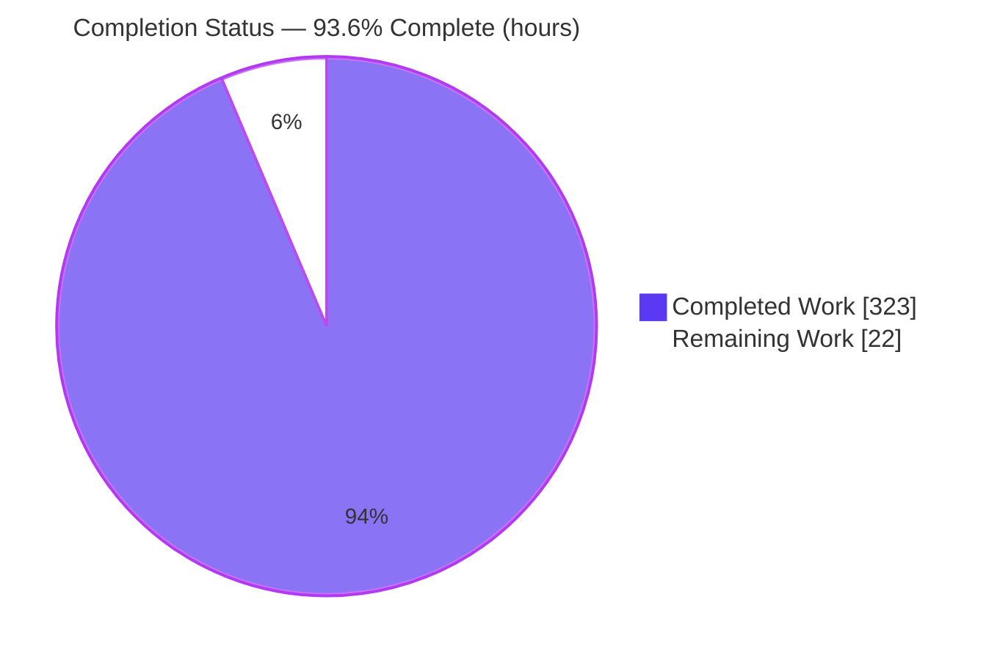
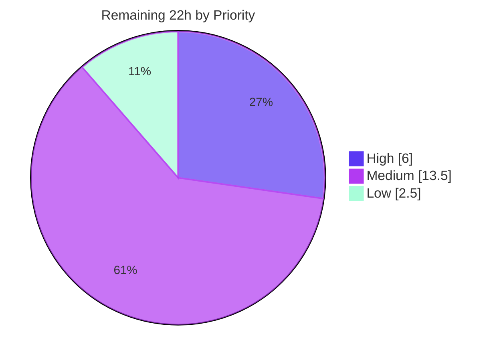

# CardDemo Walking Skeleton (F-SKEL) — Blitzy Project Guide

## 1. Executive Summary

### 1.1 Project Overview

The **CardDemo Walking Skeleton (F-SKEL)** is a clean-room modernization of the legacy AWS CardDemo mainframe application into a contract-first, containerized microservice topology. It delivers eight Spring Boot 3 / Java 21 services (`auth`, `account`, `card`, `transaction`, `payment`, `useradmin`, `reporting`, plus a `bff` aggregator), a React 19 + MUI single-page UI that binds only to the BFF, an Oracle 23ai data layer managed by Flyway, and a `docker-compose` deployment unit. It is a **structural (topology) run**: success is defined by every seam building green and exactly **one** vertical tracer slice — an authenticated Card Detail read (UI → BFF → `card-svc` → Oracle) — running end-to-end, with all remaining business logic intentionally delivered as typed `[DEFERRED]` stubs. Target users are the platform/engineering teams who will build functional epics atop this validated foundation.

### 1.2 Completion Status

The project is **93.6% complete** on an AAP-scoped basis. Every deliverable defined in the Agent Action Plan is complete, builds green, and is validated; the remaining 22 hours are standard path-to-production activities (human sign-off, secrets, production Oracle, TLS, CD automation) that lie outside the autonomous build.


```mermaid
%%{init: {'theme':'base','themeVariables':{'pie1':'#5B39F3','pie2':'#FFFFFF','pieStrokeColor':'#B23AF2','pieOuterStrokeColor':'#B23AF2','pieSectionTextSize':'15px','pieTitleTextSize':'17px'}}}%%
pie showData title Completion Status — 93.6% Complete (hours)
    "Completed Work" : 323
    "Remaining Work" : 22
```

| Metric | Hours |
|--------|------:|
| **Total Hours** | **345** |
| Completed Hours (AI + Manual) | 323 (AI: 323, Manual: 0) |
| Remaining Hours | 22 |
| **Percent Complete** | **93.6%** |

> Completion % = Completed ÷ (Completed + Remaining) = 323 ÷ 345 = **93.6%**. All completed work was delivered autonomously by Blitzy agents (Manual = 0h).

### 1.3 Key Accomplishments

- ✅ **8-service topology delivered** — `auth`, `account`, `card`, `transaction`, `payment`, `useradmin`, `reporting-svc` + `bff`, one bounded context per legacy CICS program grouping; all 8 fat JARs build green.
- ✅ **Contract-first SSoT** — 8 frozen OpenAPI 3.1 specs (`VERSION 1.0.0`) drive generated Java server interfaces (`spring`, `interfaceOnly`) and the UI's TypeScript client; a codegen-determinism gate keeps the committed client in-sync.
- ✅ **The one live tracer slice works end-to-end** — authenticated `GET /api/cards/0500024453765740` flows UI → BFF → `card-svc` → Oracle `FREEPDB1` and renders the seeded row ("Aniya Von", Active, 03/2023) with real loading / empty / error states.
- ✅ **Oracle 23ai data layer** — Flyway `V1__baseline.sql` (10 tables, `GENERATED BY DEFAULT AS IDENTITY` surrogate PKs) + `V2__seed_tracer.sql` (exactly one card + account); natural key `CARD.CARD_NUM` kept on the read path.
- ✅ **React 19 + MUI 9.0.1 SPA** — app shell, 10-option legacy navigation, permissive Sign-On, the wired Card Detail tracer, and 15 typed placeholder screens; binds only to the BFF.
- ✅ **44/44 automated tests pass (100%)** — 37 backend (incl. a real Testcontainers Oracle integration test) + 7 UI; independently re-verified this session.
- ✅ **Full topology runs healthy under `docker-compose`** — Oracle → Flyway (2 migrations) → 7 request-serving services (`/actuator/health` UP) → UI on `:3000`; `reporting-svc` correctly health-exempt with an invokable job entrypoint.
- ✅ **Correlation-ID hop proven real** — the same UUID appears in both `bff` and `card-svc` MDC logs across the UI → BFF → `card-svc` chain.
- ✅ **CI pipeline** — GitHub Actions builds, runs codegen-determinism checks, provisions Oracle via `gvenzl/setup-oracle-free@v1`, and asserts green.

### 1.4 Critical Unresolved Issues

There are **no build-blocking or functionality-blocking issues**. The build is 100% green, all 44 tests pass, and the tracer is live. The items below are pre-production hardening decisions, not defects.

| Issue | Impact | Owner | ETA |
|-------|--------|-------|-----|
| Permissive authentication (by design) | `auth-svc` accepts any credentials; must not be exposed publicly until hardened | Security / Backend | Pre-prod (out of skeleton scope) |
| Dev credentials in `.env` template | Oracle/dev secrets are placeholders; require a real secrets mechanism before prod | DevOps | 3h (HT-2) |
| 3 high-severity npm audit findings (build-only, transitive) | Under `@openapitools/openapi-generator-cli`; never shipped in the nginx static bundle | Frontend / Security | 1.5h (HT-6) |
| No TLS / reverse proxy on the compose edge | Traffic is plain HTTP; needs TLS termination for production | DevOps | 4h (HT-4) |

### 1.5 Access Issues

**No access issues identified.** The repository is on the correct branch with a clean working tree, all dependencies resolve from the warm local caches (Maven `.m2`, npm lockfile), Docker Engine is available for the Testcontainers integration test and the compose topology, and no external/third-party credentials are required to build, test, or run the skeleton. The Oracle image (`gvenzl/oracle-free`, pinned tag) is pulled from Docker Hub without authentication.

| System/Resource | Type of Access | Issue Description | Resolution Status | Owner |
|-----------------|----------------|-------------------|-------------------|-------|
| Git repository | Read/Write | None — correct branch, clean tree | ✅ No issue | — |
| Maven Central / `.m2` | Dependency resolution | None — offline reactor validates green | ✅ No issue | — |
| npm registry / lockfile | Dependency resolution | None — `npm ci` deterministic | ✅ No issue | — |
| Docker Hub (`gvenzl/oracle-free`) | Image pull | None — anonymous pull, pinned tag | ✅ No issue | — |

### 1.6 Recommended Next Steps

1. **[High]** Reproduce the green build and tracer E2E in your target environment (`mvn package`, UI `npm ci && npm test && npm run build`, `docker compose up -d`) and formally sign off — **HT-1 (3h)**.
2. **[High]** Replace dev credentials with production secrets management (rotate Oracle password, inject via CI/vault) — **HT-2 (3h)**.
3. **[Medium]** Provision a production-grade Oracle instance and repoint service datasources; run Flyway `V1`+`V2` against it — **HT-3 (4h)**.
4. **[Medium]** Add TLS/reverse-proxy termination and CD deployment automation to the target VM — **HT-4 + HT-5 (8h)**.
5. **[Low]** Tag/publish the frozen contracts (`v1.0.0`) and address minor Lighthouse SEO/a11y audits — **HT-7 + HT-8 (2.5h)**.

---

## 2. Project Hours Breakdown

### 2.1 Completed Work Detail

All rows below are AAP-scoped deliverables delivered and validated by Blitzy agents. Typed placeholder stubs are counted as **completed** work because, per the run contract, a typed stub is the correct outcome for every non-tracer seam.

| Component | Hours | Description |
|-----------|------:|-------------|
| API Contracts (SSoT) | 18 | 8 hand-authored OpenAPI 3.1 specs + `VERSION 1.0.0` + README freeze policy; generator wiring for Java + TS |
| `card-svc` — Live Tracer read path | 24 | JPA `Card` entity (natural key `card_num`, no sequence), `CardRepository`, `CardService`, `CardController GET /cards/{cardNumber}`, RFC 7807 errors, real Oracle read |
| `bff` — Aggregation service | 22 | 8 aggregators (Card Detail live via generated client; 7 typed stubs), RFC 7807 mapping, correlation propagation (22 source files) |
| `auth-svc` — Permissive login stub | 10 | Real token issuance + correlation seam over a permissive validation stub |
| Domain stub services | 28 | `account`, `transaction`, `payment`, `useradmin` — uniform typed-stub scaffold (controller/config/filter/yml/Dockerfile/test each) |
| `reporting-svc` — Async job stub | 12 | 5 job handlers + `JobInvocationRunner` + startup gating; health-exempt long-running container |
| Data layer (Flyway/Oracle) | 16 | `V1` 10-table baseline (identity PKs from copybooks) + `V2` single-row tracer seed + Oracle dialect / `ojdbc11` config |
| UI shell | 28 | Bootstrap, routing + guards, MUI `createTheme`, layout (AppBar/Drawer/Header), auth provider, generated-client API layer |
| UI Card Detail tracer feature | 12 | `CardDetail.tsx` + `useCardDetail` hook + `formatExpiry` with real loading/empty/error states |
| UI Sign-On + placeholders + components | 27 | Permissive Sign-On, 15 typed placeholder screens, shared MUI components (PageContainer, StatusChip, states) |
| UI build & codegen config | 14 | `package.json`, Vite, tsconfig, `openapitools.json`, `index.html`, nginx configs, Dockerfile |
| Cross-cutting correlation-ID | 8 | `OncePerRequestFilter` + MDC in all 8 services + Axios request interceptor |
| Containerization + compose deploy unit | 28 | 9 multi-stage Dockerfiles + `docker-compose.yml` health-gating + override + root aggregator pom |
| CI pipeline | 10 | GitHub Actions: build, codegen determinism, `gvenzl/setup-oracle-free`, green assert |
| Automated tests | 30 | 44 tests: 37 backend (incl. real-Oracle Testcontainers integration) + 7 UI |
| Documentation | 12 | `docs/skeleton` (write-ownership matrix, architecture, `[DEFERRED]` register, README), root README, catalog, mkdocs |
| QA hardening iterations | 24 | 24+ findings resolved across multiple rounds — security (password-in-logs, supply-chain pinning), a11y/UX, backend conformance |
| **Total Completed** | **323** | |

### 2.2 Remaining Work Detail

All rows are standard path-to-production activities required to deploy the AAP deliverables. **No AAP feature work and no `[DEFERRED]` functional epics are included here** — those are out of scope for the skeleton (see Section 8).

| Category | Hours | Priority |
|----------|------:|----------|
| Human verification & sign-off (reproduce build/test/compose green) | 3 | High |
| Production secrets management (replace dev `.env` creds; vault/CI secrets) | 3 | High |
| Production Oracle provisioning (managed instance + datasource repoint + migrations) | 4 | Medium |
| TLS / reverse-proxy termination for the single-VM edge | 4 | Medium |
| CD / deployment automation to target Linux VM | 4 | Medium |
| npm audit remediation decision (3 high-sev build-only transitive) | 1.5 | Medium |
| Contract release tag & freeze publication (`v1.0.0`) | 1 | Low |
| Lighthouse SEO / a11y polish (robots.txt / llms.txt / landmark-one-main) | 1.5 | Low |
| **Total Remaining** | **22** | |

### 2.3 Hours Reconciliation

| Aggregate | Hours |
|-----------|------:|
| Section 2.1 Completed | 323 |
| Section 2.2 Remaining | 22 |
| **Total (2.1 + 2.2)** | **345** |
| Completion (323 ÷ 345) | 93.6% |

---

## 3. Test Results

All tests below originate from Blitzy's autonomous validation logs and were independently re-verified this session from the on-disk Surefire reports (backend) and a live `vitest run` (UI). Totals: **44 tests, 44 passed, 0 failed (100%)**. Line-coverage instrumentation was not part of the walking-skeleton scope; the "Notes" column describes what each category exercises.

| Test Category | Framework | Total | Passed | Failed | Coverage % | Notes |
|---------------|-----------|------:|------:|------:|-----------:|-------|
| Backend — Integration (Real Oracle Tracer) | JUnit 5 + Spring Boot Test + Testcontainers (`gvenzl/oracle-free:23.26.2-slim`) | 5 | 5 | 0 | n/a | `card-svc` `GET /cards/{n}` → `CardService` → `CardRepository` → Oracle SELECT on seeded row + 404 path (not skipped) |
| Backend — Web / Controller & Aggregation | JUnit 5 + Spring MockMvc | 9 | 9 | 0 | n/a | Live Card controller (7) + BFF `AuthAggregator` (2) |
| Backend — Context-Load / Application Smoke | JUnit 5 + Spring Boot Test | 8 | 8 | 0 | n/a | `@SpringBootTest` context boot per service (auth 2; account/txn/payment/useradmin/bff/reporting 1 each) |
| Backend — Correlation-ID Filter (unit) | JUnit 5 | 2 | 2 | 0 | n/a | MDC propagation / regeneration behavior |
| Backend — Reporting Job Stubs & Gating | JUnit 5 | 13 | 13 | 0 | n/a | 5 `[DEFERRED]` job entrypoints (9) + invocation runner (2) + gating (2) |
| UI — Unit | Vitest | 7 | 7 | 0 | n/a | Card Detail expiry formatting + safe-fallback branches |
| **Total** | | **44** | **44** | **0** | | **100% pass** |

**Backend subtotal:** 37 (5 + 9 + 8 + 2 + 13). **UI subtotal:** 7. Surefire aggregate on disk: 14 test classes, 37 tests, **0 failures / 0 errors / 0 skipped**.

---

## 4. Runtime Validation & UI Verification

Runtime health and UI behavior were validated by building all 9 images and running the full `docker-compose` topology, plus HTTP and browser-level checks of the tracer.

**Container / topology health**
- ✅ **Oracle 23ai** — starts and reports healthy (built-in `healthcheck.sh`).
- ✅ **Flyway migration step** — "Successfully applied 2 migrations, now at v2" (`V1` schema + `V2` seed).
- ✅ **`auth-svc`, `account-svc`, `card-svc`, `transaction-svc`, `payment-svc`, `useradmin-svc`, `bff`** — all report `/actuator/health` = 200 UP; health-gated in order Oracle → Flyway → services.
- ✅ **UI (nginx)** — healthy on `:3000`.
- ✅ **`reporting-svc`** — runs as a long-running container, **correctly health-exempt**; job entrypoint invokable (all 5 `[DEFERRED]` job stubs acknowledged).

**API / tracer integration**
- ✅ `POST /api/auth/login` → 200 with a real bearer token.
- ✅ `GET /api/cards/0500024453765740` → 200 exact seeded row (accountId 50, "Aniya Von", 2023-03-09, Active = Y).
- ✅ `GET /api/cards/{unknown}` → 404 RFC 7807 `application/problem+json`.
- ✅ **Correlation-ID propagation** — the same UUID appears in both `bff` and `card-svc` MDC logs; a valid inbound UUID is honored, a non-UUID is regenerated.
- ✅ Stub endpoints (accounts / transactions / etc.) return typed placeholders — correct per the "interface + typed stub" rule.

**Browser / UI verification (Chrome, `:3000`)**
- ✅ Sign-On → Main Menu (AppBar + permanent Drawer with the legacy 10-option navigation + Admin).
- ✅ **Card Detail renders real Oracle data** — Account 50, Card 0500024453765740, "Aniya Von", green "Active" success `Chip`, Expiry 03/2023 (visually confirmed).
- ✅ Empty state ("Card not found.") and error/loading states render as designed.
- ✅ Clean console/network (only the deliberate 404).
- ✅ Lighthouse: **Accessibility 98–100**, **Best Practices 100**, SEO 91, Agentic 67 (only minor `robots-txt` / `llms-txt` / `landmark-one-main` audits outstanding — cosmetic, non-blocking).

---

## 5. Compliance & Quality Review

Cross-mapping of AAP run-contract rules to delivered evidence. All mandatory rules are satisfied.

| Compliance Item (AAP rule) | Requirement | Status | Evidence / Notes |
|----------------------------|-------------|--------|------------------|
| Interface + typed stub default | Non-tracer seams return typed placeholders | ✅ Pass | 7 BFF stub aggregators + domain stub controllers; no hallucinated logic |
| Contract-first, frozen SSoT | OpenAPI 3.1 specs are SSoT; clients generated, not hand-edited | ✅ Pass | 8 specs `3.1.0`, `VERSION 1.0.0`; codegen-determinism gate green |
| Exactly one live tracer | One vertical slice fully wired end-to-end | ✅ Pass | Card Detail UI → BFF → `card-svc` → Oracle validated (HTTP + browser) |
| UI binds only to BFF | No direct UI→domain calls | ✅ Pass | UI Axios client targets BFF only |
| Correlation-ID hop is real | Propagate UI → BFF → `card-svc` via MDC | ✅ Pass | Same UUID proven in both service logs |
| Surrogate PKs `GENERATED BY DEFAULT AS IDENTITY` | Seed-safe identity PKs; no AUTO/SEQUENCE | ✅ Pass | `V1__baseline.sql` uses identity PKs (avoids ORA-32795) |
| Natural-key read path | Tracer keys `CARD` on `CARD_NUM` | ✅ Pass | `CardRepository` reads by natural card number |
| Single-row seed | Exactly one card + account | ✅ Pass | `V2__seed_tracer.sql` = 2 INSERTs |
| Build-and-start-green | 7 request-serving services healthy; `reporting-svc` exempt | ✅ Pass | All `/actuator/health` UP; reporting health-exempt |
| Oracle image pinned to explicit tag | Not `latest` / bare `23` | ✅ Pass | `gvenzl/oracle-free:${ORACLE_IMAGE_TAG}` explicit pin |
| MUI core only (no MUI X) | List screens use core `Table`, not `DataGrid` | ✅ Pass | `@mui/material` 9.0.1 core only |
| `docker-compose` deploy unit | Single Linux VM; no K8s/serverless | ✅ Pass | Root `docker-compose.yml` is the deploy unit |
| `[DEFERRED]` epics, zero implementation | Functional epics scaffolded only | ✅ Pass | `docs/skeleton/deferred-epics.md` register; stubs only |
| No legacy modification | `app/**` read-only reference | ✅ Pass | 226 files added, legacy tree untouched |
| Artifact hygiene | No build artifacts/secrets tracked | ✅ Pass | `target/`, `dist/`, `node_modules/`, `.env` gitignored |

**Fixes applied during autonomous validation:** 24+ QA findings resolved across multiple rounds — password-in-logs removal, supply-chain version pinning, backend conformance, frontend a11y/UX, nginx and container hardening, and documentation topology corrections.

**Outstanding quality items:** minor Lighthouse SEO/a11y audits (non-blocking); npm audit build-only transitive findings (documented, deferred by design).

---

## 6. Risk Assessment

| Risk | Category | Severity | Probability | Mitigation | Status |
|------|----------|----------|-------------|------------|--------|
| Business logic deliberately stubbed (`[DEFERRED]` epics) | Technical | Low | N/A (known) | Roadmap the functional epics atop the frozen contracts | Accepted (by design) |
| Single tracer coverage — only one slice exercised with real data | Technical | Low | Low | Contract-first codegen fails the build on any contract mismatch | Accepted (by design) |
| Vite chunk-size advisory (bundle untuned) | Technical | Low | Low | Optional code-splitting later | Open (out of scope) |
| Permissive authentication (any credentials accepted) | Security | High | High if exposed | Implement real credential validation / hashing / RBAC before non-demo exposure | Open (by design for skeleton) |
| Dev credentials in `.env` | Security | High | High if reused | Production secrets management (HT-2) | Open (path-to-prod) |
| 3 high-severity npm audit findings (build-only transitive) | Security | Medium | Low (not in runtime bundle) | Monitor upstream; do **not** `audit fix --force` (breaks deterministic codegen) | Open / Accepted |
| Plain HTTP / no TLS on compose edge | Security | Medium | Medium | Add TLS/reverse-proxy termination (HT-4) | Open (path-to-prod) |
| No CD / deploy automation (CI green-asserts only) | Operational | Medium | Medium | Add image-push + remote compose deploy stage (HT-5) | Open (path-to-prod) |
| Single-VM / single-instance (no HA/scaling) | Operational | Low-Medium | Low | Acceptable for skeleton; revisit for prod scale | Accepted (by design) |
| Minimal observability (correlation-ID + Actuator only) | Operational | Low | Low | Add metrics/tracing backend when functional epics land | Accepted (by design) |
| Oracle image is dev/CI-grade (`gvenzl/oracle-free`) | Operational | Medium | Medium | Provision managed/licensed Oracle for prod (HT-3) | Open (path-to-prod) |
| Contract freeze `v1.0.0` — future work must version carefully | Integration | Low | Low | Documented freeze policy; version-bump on change | Managed |
| Human environment reproduction (Docker + JDK 21 + Node 22) | Integration | Low | Low | Verified development guide (Section 9) | Open (verification) |
| Oracle first-boot latency (~14s in integration test) | Integration | Low | Low | `depends_on: service_healthy` gating already handles it | Managed |

---

## 7. Visual Project Status

**Project hours — Completed vs Remaining** (Completed = Dark Blue `#5B39F3`, Remaining = White `#FFFFFF`):


```mermaid
%%{init: {'theme':'base','themeVariables':{'pie1':'#5B39F3','pie2':'#FFFFFF','pieStrokeColor':'#B23AF2','pieOuterStrokeColor':'#B23AF2','pieSectionTextSize':'15px','pieTitleTextSize':'17px'}}}%%
pie showData title Project Hours Breakdown (Total 345h)
    "Completed Work" : 323
    "Remaining Work" : 22
```

**Remaining work by priority (hours):**


```mermaid
%%{init: {'theme':'base','themeVariables':{'pie1':'#5B39F3','pie2':'#B23AF2','pie3':'#A8FDD9','pieStrokeColor':'#B23AF2','pieSectionTextSize':'15px','pieTitleTextSize':'17px'}}}%%
pie showData title Remaining 22h by Priority
    "High" : 6
    "Medium" : 13.5
    "Low" : 2.5
```

**Remaining hours per category (Section 2.2):**

| Category | Hours |
|----------|------:|
| Human verification & sign-off | 3.0 |
| Production secrets management | 3.0 |
| Production Oracle provisioning | 4.0 |
| TLS / reverse-proxy termination | 4.0 |
| CD / deployment automation | 4.0 |
| npm audit remediation decision | 1.5 |
| Contract release tag & publish | 1.0 |
| Lighthouse SEO / a11y polish | 1.5 |
| **Total** | **22.0** |

---

## 8. Summary & Recommendations

**Achievements.** The CardDemo Walking Skeleton is **93.6% complete** and fully meets its run-contract objective: the complete target-state topology builds green, and exactly one vertical tracer slice is live end-to-end. Every AAP requirement group — service topology, frozen contract SSoT, Oracle/Flyway data layer, React 19 + MUI UI, the Card Detail tracer, correlation-ID propagation, containerization, and CI — is delivered and validated. Independent re-verification this session confirmed 44/44 tests passing (including a real Testcontainers Oracle integration test), a healthy full `docker-compose` topology, and the tracer rendering the seeded Oracle row in the browser.

**Remaining gaps (22h).** The residual is entirely standard path-to-production work, not AAP feature work: human verification/sign-off (3h) and production secrets management (3h) at High priority; production Oracle provisioning, TLS, CD automation, and the npm-audit decision (13.5h) at Medium; and contract tagging plus minor Lighthouse polish (2.5h) at Low.

**Critical path to production.** (1) Reproduce and sign off on the green build and tracer E2E; (2) introduce production secrets and provision a production-grade Oracle; (3) add TLS termination and CD automation to the target VM; (4) tag the frozen contracts and clear minor audits.

**Beyond the skeleton (out of AAP scope — not counted in the 22h).** The `[DEFERRED]` functional epics (real account/card/transaction/payment/useradmin/reporting business logic, authentication hardening/RBAC, and batch calculation internals) constitute the path from skeleton to full product. They were intentionally excluded from this run and therefore do not count against skeleton completion. The frozen OpenAPI contracts and per-service write-ownership matrix are designed precisely so these epics can be built incrementally, one bounded context at a time.

**Production readiness assessment.** The skeleton is **production-ready for its defined scope** (a green, running topology with one live tracer). It is **not** a functionally complete application, nor is it hardened for public exposure — the permissive auth stub and dev credentials must be replaced first. Recommended posture: promote to an internal/demo environment now; complete the High/Medium path-to-production tasks before any production or externally-reachable deployment.

| Success Metric | Target | Actual | Status |
|----------------|--------|--------|--------|
| Build green (all modules) | 100% | 100% (8 JARs + UI dist) | ✅ |
| Automated tests passing | 100% | 44/44 (100%) | ✅ |
| Tracer slice live end-to-end | 1 slice | 1 slice (validated) | ✅ |
| Request-serving services healthy | 7 | 7 (+ reporting exempt) | ✅ |
| AAP requirement groups complete | 16 | 16 | ✅ |

---

## 9. Development Guide

### 9.1 System Prerequisites

All versions below are verified present in the validation environment and match the AAP pins.

- **JDK 21** (Eclipse Temurin) — verified `openjdk 21.0.11`
- **Apache Maven 3.9.x** — verified `3.9.9`
- **Node.js ≥ 22.12** (required by Vite 8) — verified `v22.23.1`
- **npm 11.x** — verified `11.18.0`
- **Docker Engine 28.x** — verified `28.5.2` (required for the compose topology and the Testcontainers integration test)
- **Docker Compose v2+** — verified `v5.3.1`
- OS: Linux (single VM, Docker Engine); ~4 GB RAM free recommended for the Oracle container.

### 9.2 Environment Setup

```bash
# From the repository root
cp .env.example .env
# Key variables (defaults shown are LOCAL DEV ONLY):
#   ORACLE_IMAGE_TAG   -> explicit Oracle Free tag, e.g. 23.26.2-slim (never 'latest')
#   DB_URL             -> jdbc:oracle:thin:@oracle:1521/FREEPDB1
#   ORACLE_PORT=1521   UI_PORT=3000   BFF_PORT=8080
#   AUTH_SVC_PORT=8081 ACCOUNT_SVC_PORT=8082 CARD_SVC_PORT=8083
#   TRANSACTION_SVC_PORT=8084 PAYMENT_SVC_PORT=8085 USERADMIN_SVC_PORT=8086
# .env is gitignored (never committed); .env.example is the tracked template.
```

### 9.3 Dependency Installation

```bash
# Backend — warms the Maven reactor (8 modules)
mvn -B -ntp -f pom.xml dependency:go-offline

# UI — deterministic install from the committed lockfile
cd ui
CI=true npm ci
cd ..
```

### 9.4 Build & Test

```bash
# Backend: full build + 44 backend tests (card-svc integration test needs Docker running)
mvn -B -ntp -f pom.xml package
#   Build-only (skip tests):  mvn -B -ntp -f pom.xml -DskipTests package

# UI: regenerate the typed client from the frozen BFF contract, test, and build
cd ui
CI=true npm ci
npm run generate:api      # regenerates ui/app/api/generated (must stay in-sync)
npm test                  # vitest run -> 7 passed (verified this session)
npm run build             # tsc --noEmit && vite build -> dist/
cd ..
```

### 9.5 Application Startup (docker-compose deploy unit)

```bash
# Build all 9 images
docker compose -f docker-compose.yml build

# Start the full topology (Oracle -> Flyway -> services -> UI)
docker compose -f docker-compose.yml up -d

# The base compose file publishes ONLY the UI edge on :3000.
# For local per-service ports (8080-8086, Oracle 1521), the override file is applied
# automatically when present:
#   docker compose up -d      (merges docker-compose.yml + docker-compose.override.yml)

# Invoke the reporting-svc job entrypoint (health-exempt async stub)
docker compose run --rm --no-deps \
  -e CARDDEMO_REPORTING_INVOKE_JOBS_ON_STARTUP=true reporting-svc

# Teardown (removes volumes)
docker compose down -v
```

### 9.6 Verification

```bash
# UI (browser): open the SPA
#   http://localhost:3000   -> Sign-On -> Menu -> Credit Card View

# Tracer end-to-end via the UI proxy (:3000)
TOKEN=$(curl -s -X POST http://localhost:3000/api/auth/login \
  -H 'Content-Type: application/json' \
  -d '{"userId":"USER0001","password":"anything"}' | python3 -c "import sys,json;print(json.load(sys.stdin).get('token',''))")

curl -s http://localhost:3000/api/cards/0500024453765740 \
  -H "Authorization: Bearer $TOKEN" | python3 -m json.tool
#   Expect 200 with accountId 50, name "Aniya Von", expiry 2023-03-09, active Y

curl -s -o /dev/null -w "%{http_code}\n" http://localhost:3000/api/cards/9999999999999999
#   Expect 404 (RFC 7807 problem+json)

# Per-service health (local dev ports, via override)
for p in 8081 8082 8083 8084 8085 8086 8080; do
  echo -n "port $p: "; curl -s http://localhost:$p/actuator/health; echo
done
#   Expect {"status":"UP"} on each
```

### 9.7 Example Usage & Troubleshooting

**Ports:** UI `3000→80` (nginx); `bff 8080`, `auth 8081`, `account 8082`, `card 8083`, `transaction 8084`, `payment 8085`, `useradmin 8086` (all container port 8080, local-dev override only); Oracle `1521`. `reporting-svc` publishes **no** host port (async job stub).

Common issues and resolutions:
- **Oracle slow first boot** (~14s+ to healthy): let `depends_on: service_healthy` gating do its job — do not bypass it; watch `docker compose logs -f oracle`.
- **Port already in use**: override the relevant `*_PORT` in `.env`.
- **Codegen drift** (`git diff` shows changes under `ui/app/api/generated`): rerun `npm run generate:api` and commit the in-sync client — the CI determinism gate enforces this.
- **`card-svc` integration test fails to start a container**: ensure the Docker daemon is running (`docker info`) — the test uses Testcontainers.
- **npm audit shows 3 high-severity findings**: these are build-only transitive dependencies (never in the shipped nginx bundle); do **not** run `npm audit fix --force` (it breaks the deterministic codegen). Track upstream instead.

---

## 10. Appendices

### A. Command Reference

| Purpose | Command |
|---------|---------|
| Warm Maven reactor (offline deps) | `mvn -B -ntp -f pom.xml dependency:go-offline` |
| Backend full build + tests | `mvn -B -ntp -f pom.xml package` |
| Backend build only | `mvn -B -ntp -f pom.xml -DskipTests package` |
| UI deterministic install | `cd ui && CI=true npm ci` |
| Regenerate UI TS client | `cd ui && npm run generate:api` |
| UI tests | `cd ui && npm test` |
| UI production build | `cd ui && npm run build` |
| Build all images | `docker compose -f docker-compose.yml build` |
| Start topology | `docker compose -f docker-compose.yml up -d` |
| Invoke reporting jobs | `docker compose run --rm --no-deps -e CARDDEMO_REPORTING_INVOKE_JOBS_ON_STARTUP=true reporting-svc` |
| Teardown (with volumes) | `docker compose down -v` |

### B. Port Reference

| Service | Host Port | Container Port | Notes |
|---------|----------:|---------------:|-------|
| UI (nginx) | 3000 | 80 | Only edge exposed by base compose |
| bff | 8080 | 8080 | Local-dev override |
| auth-svc | 8081 | 8080 | Local-dev override |
| account-svc | 8082 | 8080 | Local-dev override |
| card-svc | 8083 | 8080 | Local-dev override |
| transaction-svc | 8084 | 8080 | Local-dev override |
| payment-svc | 8085 | 8080 | Local-dev override |
| useradmin-svc | 8086 | 8080 | Local-dev override |
| reporting-svc | — | — | Async job stub; no host port (health-exempt) |
| Oracle 23ai | 1521 | 1521 | `FREEPDB1`; local-dev override |

### C. Key File Locations

| Path | Purpose |
|------|---------|
| `/contracts/*.openapi.yaml` | 8 frozen OpenAPI 3.1 specs (SSoT); `/contracts/VERSION` = 1.0.0 |
| `/services/<svc>/` | One bounded-context Spring Boot service each |
| `/services/card-svc/src/main/java/com/carddemo/card/{domain,repo,service}/` | Live tracer read path |
| `/services/bff/src/main/java/com/carddemo/bff/aggregation/` | 8 aggregators (Card Detail live) |
| `/services/reporting-svc/src/main/java/com/carddemo/reporting/jobs/` | 5 `[DEFERRED]` job handlers |
| `/db/migration/V1__baseline.sql`, `V2__seed_tracer.sql` | Flyway schema + single-row seed |
| `/ui/app/` | UI shell (routing, theme, layout, auth, generated API client) |
| `/ui/features/card-detail/` | Wired tracer screen |
| `/docker-compose.yml`, `docker-compose.override.yml` | Deployment unit + local overrides |
| `/.github/workflows/ci.yml` | CI pipeline |
| `/docs/skeleton/` | Write-ownership matrix, architecture, `[DEFERRED]` register |

### D. Technology Versions

| Component | Version |
|-----------|---------|
| Java (Temurin) | 21 |
| Spring Boot | 3.5.16 |
| Oracle JDBC (`ojdbc11`) | 23.26.2.0.0 |
| Oracle Database Free | 23ai (`gvenzl/oracle-free`, pinned tag) |
| Flyway | Boot-managed (core + database-oracle) |
| OpenAPI Generator (Maven plugin) | 7.23.0 |
| React | 19.2.x |
| MUI (`@mui/material`) | 9.0.1 (exact pin) |
| Vite | 8.1.x |
| TypeScript | ~5.9 |
| react-router-dom | ~7.15 |
| Node.js / npm | 22 / 11.x |
| Docker Engine / Compose | 28.x / v2+ |

### E. Environment Variable Reference

| Variable | Example / Default | Purpose |
|----------|-------------------|---------|
| `ORACLE_IMAGE_TAG` | `23.26.2-slim` | Explicit Oracle Free image tag (never `latest`) |
| `DB_URL` | `jdbc:oracle:thin:@oracle:1521/FREEPDB1` | JDBC URL for services |
| `ORACLE_PORT` | `1521` | Oracle host port (local dev) |
| `UI_PORT` | `3000` | UI edge host port |
| `BFF_PORT` | `8080` | BFF host port (local dev) |
| `AUTH_SVC_PORT` … `USERADMIN_SVC_PORT` | `8081`–`8086` | Per-service host ports (local dev) |
| `CARDDEMO_REPORTING_INVOKE_JOBS_ON_STARTUP` | `true` | Invoke reporting job stubs on startup |

### F. Developer Tools Guide

- **Backend build/test:** Maven reactor at the repo root aggregates all 8 service modules; `openapi-generator-maven-plugin` (generator `spring`, `interfaceOnly`) emits server interfaces into `target/generated-sources`.
- **UI codegen:** `@openapitools/openapi-generator-cli` (wrapping generator 7.23.0) generates the `typescript-axios` client from the frozen BFF contract into `ui/app/api/generated`; a determinism gate (`git diff --exit-code`) enforces in-sync commits.
- **Integration testing:** Testcontainers manages a real `gvenzl/oracle-free` container for `card-svc`'s `CardRealOracleReadTest`; requires a running Docker daemon.
- **Health & correlation:** every request-serving service exposes Spring Boot Actuator `/actuator/health`; a `CorrelationIdFilter` (`OncePerRequestFilter` + SLF4J MDC) propagates `X-Correlation-ID` across the chain.

### G. Glossary

| Term | Definition |
|------|------------|
| Walking Skeleton | A minimal end-to-end implementation of the target topology that builds green and runs one vertical slice, with all other logic stubbed |
| Tracer slice | The single fully-wired vertical path: UI → BFF → `card-svc` → Oracle → rendered Card Detail |
| BFF | Backend-for-Frontend; the thin aggregation service the UI binds to exclusively |
| SSoT | Single Source of Truth — here, the frozen OpenAPI 3.1 contracts |
| `[DEFERRED]` | Tag for functional epics scaffolded with zero implementation (out of skeleton scope) |
| Typed stub | A contract-conformant placeholder response (the correct outcome for non-tracer seams) |
| Health-exempt | `reporting-svc`'s status: builds green with an invokable job entrypoint but not held to start-and-serve / `service_healthy` |
| Identity PK | `GENERATED BY DEFAULT AS IDENTITY` surrogate key (seed-safe; avoids ORA-32795) |

---

*Completion basis: AAP-scoped hours (PA1). Completed 323h ÷ Total 345h = 93.6%. All completed work delivered autonomously by Blitzy agents; all 44 tests originate from Blitzy's autonomous validation logs.*