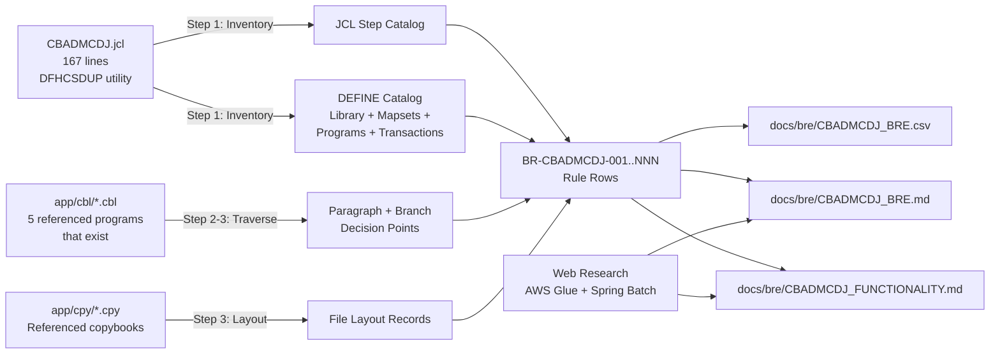
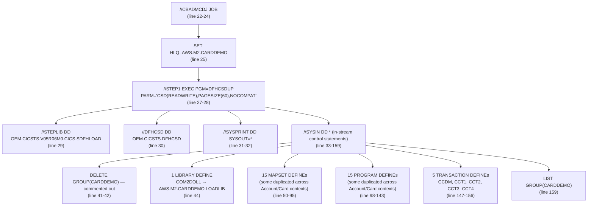

# Technical Specification

# 0. Agent Action Plan

## 0.1 Intent Clarification

### 0.1.1 Core Objective

Based on the provided requirements, the Blitzy platform understands that the objective is to **produce a complete Business Rules Extraction (BRE) deliverable for the COBOL/JCL job `CBADMCDJ.jcl` and every program, mapset, transaction, and library it references** — emitted as three new documentation artifacts: a 20-column CSV, an equivalent Markdown table file, and a separate comprehensive functionality Markdown document covering all checks and validations.

The user's prompt establishes a senior mainframe-modernization architect persona with deep COBOL, JCL, DB2, and legacy-to-cloud migration expertise (AWS Glue, Java ECS batch). The deliverable must support downstream modernization workstreams by exposing every discrete decision point, file layout, control-flow branch, error-handling path, and modernization risk embedded in the source artifacts.

**Enhanced Requirement Restatement:**

- Generate one CSV file with a header row and exactly 20 named columns, where every row corresponds to one discrete decision point extracted from `CBADMCDJ.jcl` or its called programs/modules
- Generate a parallel Markdown file containing the same BRE table content rendered as a Markdown-compliant table, with identical row content and column ordering
- Generate a separate Markdown file dedicated to documenting the full comprehensive functionality of `CBADMCDJ.jcl` — every check, every validation, every step-level behavior, and every dependency it exercises
- Append a "Modernization Mapping" section after the CSV (and within the MD file) covering AWS Glue mapping, Java ECS batch mapping, and a top-5 modernization risk register ranked HIGH/MEDIUM/LOW
- Apply the six-step extraction protocol exactly: (1) inventory job structure, (2) extract one rule per discrete decision point, (3) derive file layouts from COBOL DATA DIVISION, (4) write business-language descriptions, (5) flag modernization risks, (6) validate completeness before output

**Implicit Requirements Surfaced:**

- The 20 columns are NOT optional — they must appear in the exact order specified, with the exact header names: `Rule_Number, Job_Name, Rule_Execution, Program_Type, Module_Name, Sub_Module, Input_File, Input_File_Layout, Input_File_Length, Output_File, Output_File_Layout, Business_Rule_Category, Linkage_Columns, Detailed_Business_Rule, SQL_Decision_Control_Statements, SQL_Function, Code_Reference, Bounded_Context, DB2_Table_Name, Review_Comments`
- Rule numbering must follow the pattern `BR-CBADMCDJ-001`, `BR-CBADMCDJ-002`, ... with zero-padded three-digit sequence numbers
- `Rule_Execution` numbers must be gapless integers reflecting true execution order
- The CSV must be importable by standard tooling — quoting must escape embedded commas, newlines, and double quotes per RFC 4180
- `CBADMCDJ.jcl` is a CICS Resource Definition job invoking the IBM-supplied `DFHCSDUP` utility — the rule extraction must accommodate `DEFINE`/`DELETE`/`LIST` statements as the unit of decision, NOT typical COBOL `IF`/`EVALUATE` branches (since the job's primary logic is configuration, not data processing)
- Every program named in a `DEFINE PROGRAM(...)` clause must be analyzed for its own embedded business rules where the source `.cbl` file exists in the repository; programs referenced but missing from the source tree must still produce one rule documenting the dangling reference
- The output files must be created as net-new artifacts — no existing repository file is to be edited or replaced
- The user's column definitions are normative — every column's semantics, value format, and "N/A" handling must be honored verbatim
- "Detailed_Business_Rule" must be expressed in plain business English (2–6 sentences), not COBOL syntax — but `SQL_Decision_Control_Statements` must contain the verbatim source text for the decision

**Dependencies and Prerequisites:**

- Read access to `app/jcl/CBADMCDJ.jcl` (the primary subject)
- Read access to `app/cbl/*.cbl` for the five programs that exist in source: `COSGN00C.cbl`, `COACTVWC.cbl`, `COACTUPC.cbl`, `COTRN00C.cbl`, `COBIL00C.cbl`
- Read access to `app/cpy/*.cpy` for copybooks consumed by those programs (record layouts for file-layout columns)
- Read access to `app/bms/*.bms` for the five mapsets that exist in source: `COSGN00.bms`, `COACTVW.bms`, `COACTUP.bms`, `COTRN00.bms`, `COBIL00.bms`
- No runtime, compiler, or virtual environment is required because the deliverable is pure documentation produced from static text analysis

### 0.1.2 Task Categorization

- **Primary Task Type:** Documentation — specifically, **Business Rules Extraction (BRE) and reverse-engineering documentation** of legacy mainframe artifacts
- **Secondary Aspects:**
  - Static code analysis (COBOL DATA DIVISION traversal, JCL step inventory, BMS mapset cataloging)
  - Modernization risk assessment (flagging hardcoded DSNs, GOTO usage, packed-decimal arithmetic, FTP/tape references, multi-program CALL chains)
  - Cross-platform mapping research (AWS Glue construct equivalence, Spring Batch / Java ECS equivalence)
- **Scope Classification:** **Isolated change — additive, documentation-only**
  - No source code is modified
  - No build, compile, or runtime artifact is produced
  - No test infrastructure is invoked
  - The change adds three new files to the documentation surface and leaves all 28 COBOL programs, 28 copybooks, 17 BMS mapsets, 29 JCL jobs, and the existing `docs/technical-specifications.md` untouched

### 0.1.3 Special Instructions and Constraints

The user's prompt contains several **CRITICAL directives** that must be preserved verbatim in the implementation:

**User Example — Output Format Specification (Preserved Verbatim):**

> Produce a CSV and MD File with exactly these 20 columns (header row first):
> 
> Rule_Number, Job_Name, Rule_Execution, Program_Type, Module_Name, Sub_Module, Input_File, Input_File_Layout, Input_File_Length, Output_File, Output_File_Layout, Business_Rule_Category, Linkage_Columns, Detailed_Business_Rule, SQL_Decision_Control_Statements, SQL_Function, Code_Reference, Bounded_Context, DB2_Table_Name, Review_Comments

**User Example — Rule Numbering Pattern (Preserved Verbatim):**

> Rule_Number — Sequential ID: BR-[JOBNAME]-001, BR-[JOBNAME]-002, ...

**User Example — Business Rule Categories (Preserved Verbatim):**

> Initialization | File-IO | Data-Validation | Date-Time | Cycle-Determination | Calculation | Sorting | Reporting | Error-Handling | FTP-Distribution | Finalization | Cleanup

**User Example — Program Type Enumeration (Preserved Verbatim):**

> Program_Type — JCL | COBOL | DB2-SQL | SORT | FTP

**User Example — Modernization Risk Flags (Preserved Verbatim):**

> ✗ Hardcoded DSN subsystem names (e.g., "DSN1") — AWS Glue needs a connection param  
> ✗ Hardcoded date literals — replace with job parameter or config table  
> ✗ CONTINUE after non-zero SQLCODE — silent failures that must become logged exceptions in Java/Glue  
> ✗ GOTO statements — control flow that needs restructuring  
> ✗ Packed-decimal (COMP-3) arithmetic — map to BigDecimal in Java or Decimal in Spark  
> ✗ SORT utility steps — map to Spark DataFrame.sort() or Java Comparator  
> ✗ FTP steps — replace with S3 PUT / AWS DataSync in target state  
> ✗ Magnetic tape file references (GDG, TAPE) — replace with S3 paths  
> ✗ Multi-program CALL chains — identify as microservice or Step Function boundary

**User Example — Six-Step Validation Checklist (Preserved Verbatim):**

> □ Every JCL step has at least one rule row  
> □ Every COBOL program's PROCEDURE DIVISION has been fully traversed  
> □ No paragraph is skipped (including INIT, TERMINATION, ABEND paragraphs)  
> □ Every non-trivial IF/EVALUATE has its own row  
> □ Rule_Execution numbers are gapless and in true execution order  
> □ Rule_Number is sequential with zero-padding (001, 002, ...)

**User Example — Rule Granularity Rules (Preserved Verbatim):**

> Do NOT merge two decisions into one row even if they are in the same paragraph.  
> Do NOT skip error-handling paragraphs — they are often the highest modernization risk.

**Methodological Requirements:**

- Use business terminology (not COBOL syntax) in `Detailed_Business_Rule` — replace COBOL field names with business terms where derivable from context
- State the business outcome, not the technical mechanism, in narrative descriptions
- For calculations: write the formula in plain math, then note the code reference
- Multi-line `SQL_Decision_Control_Statements` use `\n` separator
- `Code_Reference` must be a line number range (e.g., `240-265`) when available, or paragraph name as fallback
- `Bounded_Context` must be derived from program name, job step names, and variable names (e.g., "PPO Leveling", "Forecast Reporting", "Inventory Cleanup")

**Web Search Requirements:**

The Blitzy platform conducted targeted research to validate the modernization mapping guidance:

- DFHCSDUP utility purpose and operating model — to correctly classify CBADMCDJ.jcl as a CICS Resource Definition job (not a typical batch processing job)
- AWS Glue equivalents for COBOL/JCL constructs (DynamicFrame, JDBC connection, S3 paths, PySpark UDFs)
- Spring Batch equivalents for COBOL programs (Step, Tasklet, FlatFileItemReader/Writer, JdbcCursorItemReader/Writer, SkipPolicy, RetryPolicy)
- Industry conventions for BRE documentation in mainframe modernization (AWS Transform for mainframe, IBM Rational Asset Analyzer)

### 0.1.4 Technical Interpretation

These requirements translate to the following technical implementation strategy:

**Translation of Requirements to Technical Actions:**

| Requirement | Technical Action |
|---|---|
| Produce 20-column CSV | Create `docs/bre/CBADMCDJ_BRE.csv` with RFC 4180-compliant quoting and the exact 20-header sequence |
| Produce parallel MD file | Create `docs/bre/CBADMCDJ_BRE.md` with a Markdown pipe-table containing identical row content |
| Document full functionality with all checks and validations | Create `docs/bre/CBADMCDJ_FUNCTIONALITY.md` with prose narrative, control-flow diagrams (Mermaid), validation tables, and risk inventory |
| Append modernization mapping | Embed an AWS Glue mapping section, a Java ECS / Spring Batch mapping section, and a top-5 risk register in both the BRE.md and the FUNCTIONALITY.md |
| Honor 20-column schema verbatim | Encode the column header row exactly as specified; render cell values per the column-definitions block |
| Use business language in Detailed_Business_Rule | Translate COBOL field names to derived business terms (e.g., `WS-PPO-LEVEL-QTY` → "PPO level quantity"; `WS-USER-ID` → "User ID"); state business outcomes |
| Each JCL step gets ≥1 rule row | The single `STEP1 EXEC PGM=DFHCSDUP` produces multiple rules — one per `DEFINE` / `DELETE` / `LIST` directive plus one for the step itself |
| Every COBOL paragraph traversed | For each of the 5 programs that exist in source (COSGN00C, COACTVWC, COACTUPC, COTRN00C, COBIL00C), every paragraph and every IF/EVALUATE branch is enumerated |
| Flag modernization risks | Each rule's `Review_Comments` column applies the user's 9-flag taxonomy; "None" for clean rules |

**Output Structure:**



To **achieve** the BRE deliverable, the Blitzy platform will **create** three new files under `docs/bre/` by **performing** static analysis on `CBADMCDJ.jcl` plus the five existing referenced COBOL programs and translating each discrete decision point into a normalized 20-column rule row, then rendering the row collection in CSV, Markdown table, and prose-narrative formats with a unified modernization mapping appendix.

## 0.2 Repository Scope Discovery

### 0.2.1 Comprehensive File Analysis

The Blitzy platform conducted exhaustive repository inspection to identify every artifact required to produce a complete and accurate Business Rules Extraction for `CBADMCDJ.jcl`. The discovery is scoped strictly to read-only static analysis — no file outside the BRE output directory will be created, modified, or deleted.

#### 0.2.1.1 Primary Subject Artifact

The single primary subject of this BRE is:

- `app/jcl/CBADMCDJ.jcl` — 167 lines, IBM CICS Resource Definition job

This JCL file invokes the IBM-supplied `DFHCSDUP` utility program. Per IBM documentation, the CICS CSD update batch utility program DFHCSDUP is a component of resource definition online (RDO), and it provides offline services to read from and write to a CICS system definition file (CSD), either while CICS is running or while it is inactive. As such, `CBADMCDJ.jcl` is **not a typical batch processing job** — it is a **configuration / resource registration job** that adds CICS resources (PROGRAMs, MAPSETs, TRANSACTIONs, and one LIBRARY) to a CSD file under the resource group `CARDDEMO`.

The job's structural blueprint:



#### 0.2.1.2 Secondary Subject Artifacts — Referenced COBOL Programs

The user's prompt requires extraction "for all its associated programmes and modules." The Blitzy platform identified 15 unique programs referenced inside `DEFINE PROGRAM` clauses. Cross-referencing against the actual repository contents under `app/cbl/`:

| # | Program | Source Status | Source File | Approx. Lines | Required for BRE Traversal |
|---|---------|---------------|-------------|---------------|----------------------------|
| 1 | COSGN00C | EXISTS | `app/cbl/COSGN00C.cbl` | 260 | YES — full procedure division |
| 2 | COACT00C | MISSING | — | — | Document as dangling reference |
| 3 | COACTVWC | EXISTS | `app/cbl/COACTVWC.cbl` | 941 | YES — full procedure division |
| 4 | COACTUPC | EXISTS | `app/cbl/COACTUPC.cbl` | 4236 | YES — full procedure division (largest) |
| 5 | COACTDEC | MISSING | — | — | Document as dangling reference |
| 6 | COTRN00C | EXISTS | `app/cbl/COTRN00C.cbl` | 699 | YES — full procedure division |
| 7 | COTRNVWC | MISSING | — | — | Document as dangling reference |
| 8 | COTRNVDC | MISSING | — | — | Document as dangling reference |
| 9 | COTRNATC | MISSING | — | — | Document as dangling reference |
| 10 | COBIL00C | EXISTS | `app/cbl/COBIL00C.cbl` | 572 | YES — full procedure division |
| 11 | COADM00C | MISSING | — | — | Document as dangling reference |
| 12 | COTSTP1C | MISSING | — | — | Document as dangling reference |
| 13 | COTSTP2C | MISSING | — | — | Document as dangling reference |
| 14 | COTSTP3C | MISSING | — | — | Document as dangling reference |
| 15 | COTSTP4C | MISSING | — | — | Document as dangling reference |

Total: **5 programs exist**, **10 programs missing** from the repository source tree.

For each missing program, the BRE will produce one rule row in the `Error-Handling` category with `Review_Comments` flagging the dangling reference as a HIGH severity modernization risk (the resource is registered with CICS but no implementation exists).

#### 0.2.1.3 Secondary Subject Artifacts — Referenced BMS Mapsets

Cross-referencing the 15 unique mapsets named in `DEFINE MAPSET` clauses against `app/bms/`:

| # | Mapset | Source Status | Source File |
|---|--------|---------------|-------------|
| 1 | COSGN00M | EXISTS | `app/bms/COSGN00.bms` |
| 2 | COACT00S | MISSING | — |
| 3 | COACTVWS | EXISTS | `app/bms/COACTVW.bms` |
| 4 | COACTUPS | EXISTS | `app/bms/COACTUP.bms` |
| 5 | COACTDES | MISSING | — |
| 6 | COTRN00S | EXISTS | `app/bms/COTRN00.bms` |
| 7 | COTRNVWS | MISSING | — |
| 8 | COTRNVDS | MISSING | — |
| 9 | COTRNATS | MISSING | — |
| 10 | COBIL00S | EXISTS | `app/bms/COBIL00.bms` |
| 11 | COADM00S | MISSING | — |
| 12 | COTSTP1S | MISSING | — |
| 13 | COTSTP2S | MISSING | — |
| 14 | COTSTP3S | MISSING | — |
| 15 | COTSTP4S | MISSING | — |

Total: **5 mapsets exist**, **10 mapsets missing**. Each missing mapset will appear as its own rule row flagged similarly.

#### 0.2.1.4 Tertiary Artifacts — Copybook Layouts

The five existing COBOL programs reference the following copybooks (all under `app/cpy/` or `app/cpy-bms/`). These are required to populate the `Input_File_Layout`, `Output_File_Layout`, and `Input_File_Length` columns of the BRE:

| Copybook | Used By | Purpose |
|---|---|---|
| `COCOM01Y.cpy` | COSGN00C, COACTVWC, COACTUPC, COTRN00C, COBIL00C | Common communication area (CICS commarea) |
| `COTTL01Y.cpy` | COSGN00C, COACTVWC, COACTUPC, COTRN00C, COBIL00C | Title bar layout for screens |
| `CSDAT01Y.cpy` | COSGN00C, COACTVWC, COACTUPC, COTRN00C, COBIL00C | Date/time formatting structure |
| `CSMSG01Y.cpy` | COSGN00C, COACTVWC, COACTUPC, COTRN00C, COBIL00C | Standard error/info message structure |
| `CSMSG02Y.cpy` | COACTVWC, COACTUPC | Extended message structure |
| `CSUSR01Y.cpy` | COSGN00C, COACTVWC, COACTUPC | User security record (USRSEC file) |
| `CVACT01Y.cpy` | COACTVWC, COACTUPC, COBIL00C | Account master record (ACCTDAT file) |
| `CVACT02Y.cpy` | COACTVWC | Card cross-reference record (CARDXREF file) |
| `CVACT03Y.cpy` | COACTVWC, COACTUPC, COBIL00C | Card master record (CARDDAT file) |
| `CVCUS01Y.cpy` | COACTVWC, COACTUPC | Customer master record (CUSTDAT file) |
| `CVCRD01Y.cpy` | COACTVWC, COACTUPC | Card record extension structure |
| `CVTRA05Y.cpy` | COTRN00C, COBIL00C | Transaction record (TRANSACT file) |
| `CSLKPCDY.cpy` | COACTUPC | Lookup code structure |
| `CSUTLDWY.cpy` | COACTUPC | Utility date workings |
| `COSGN00.cpy` | COSGN00C | BMS symbolic map for COSGN00 mapset |
| `COACTVW.cpy` | COACTVWC | BMS symbolic map for COACTVW mapset |
| `COACTUP.cpy` | COACTUPC | BMS symbolic map for COACTUP mapset |
| `COTRN00.cpy` | COTRN00C | BMS symbolic map for COTRN00 mapset |
| `COBIL00.cpy` | COBIL00C | BMS symbolic map for COBIL00 mapset |
| `DFHAID.cpy` | All five programs | IBM-supplied CICS attention identifier definitions |
| `DFHBMSCA.cpy` | All five programs | IBM-supplied BMS attribute character definitions |

#### 0.2.1.5 Pattern-Based Search Inventory

The Blitzy platform applied the user's required pattern-based discovery patterns. Results:

- **Documentation patterns** (`**/*.md`, `docs/**/*.*`, `README*`, `CONTRIBUTING*`, `**/*.rst`):
  - `docs/index.md`, `docs/project-guide.md`, `docs/technical-specifications.md` (1239 lines), `README.md`, `mkdocs.yml`
- **Configuration patterns** (`**/*.config.*`, `**/*.json`, `**/*.yaml`, `**/*.toml`, `**/*.xml`, `.env*`, `.*rc`):
  - `mkdocs.yml`, `catalog-info.yaml` (Backstage descriptor)
- **Source code patterns** (`src/**/*.*`, `lib/**/*.*`, `app/**/*.*`, `**/*.py`, `**/*.js`, `**/*.java`):
  - `app/cbl/*.cbl` (28 COBOL programs), `app/cpy/*.cpy` (28 copybooks), `app/cpy-bms/*.CPY` (17 BMS symbolic maps)
- **Build/Deploy patterns** (`Dockerfile*`, `docker-compose*`, `.github/workflows/*`, `.gitlab-ci.*`, `Makefile*`, `**/*build.*`):
  - None present
- **Scripts patterns** (`scripts/**/*.*`, `bin/**/*.*`, `tools/**/*.*`):
  - None present
- **Tests patterns** (`tests/**/*.*`, `**/*test*.*`, `**/*spec*.*`, `test/**/*.*`):
  - None present (the user's `samples/jcl/` folder contains compilation JCL, not unit tests)
- **Mainframe-specific patterns** (`app/jcl/*.jcl`, `app/proc/*.prc`, `app/bms/*.bms`, `app/data/**/*`, `app/csd/*`, `app/ctl/*`):
  - 28 JCL jobs (including CBADMCDJ.jcl)
  - 2 PROC files (`REPROC.prc`, `TRANREPT.prc`)
  - 17 BMS mapsets
  - Sample data files under `app/data/ASCII/` and `app/data/EBCDIC/`
  - `app/csd/CARDDEMO.CSD` (the static CSD listing — equivalent companion to CBADMCDJ.jcl)
  - `app/ctl/REPROCT.ctl`

#### 0.2.1.6 Related File Discovery — Files That Must Be Updated Due to BRE Output

Because this is a documentation-only deliverable, the only file that should be updated outside of the new `docs/bre/` directory is the MkDocs navigation manifest:

- `mkdocs.yml` — UPDATE to add a new top-level `nav` entry for "Business Rules Extraction" pointing to the two new MD files

No COBOL program, JCL job, copybook, BMS file, or other source artifact requires modification. The existing tech spec (`docs/technical-specifications.md`, 1239 lines) is left untouched because the BRE is a separate deliverable.

### 0.2.2 Web Search Research Conducted

The Blitzy platform conducted targeted research to validate the modernization-mapping section and the BRE methodology:

- **DFHCSDUP utility purpose and operating model** — confirmed that DFHCSDUP is the IBM-supplied offline CSD update batch utility, used to read from and write to a CICS system definition file. This validates the classification of CBADMCDJ.jcl as a configuration/registration job rather than a typical data-processing batch.
- **CICS resource types definable via DFHCSDUP** — LIBRARY, PROGRAM, MAPSET, TRANSACTION, FILE, and others. CBADMCDJ.jcl uses LIBRARY, PROGRAM, MAPSET, and TRANSACTION.
- **AWS Transform for Mainframe BRE conventions** — the AWS BRE feature operates at four hierarchical levels (Line of Business, Business Functions/domains, Business Features, Component Level), and the user's column structure aligns with the Component Level granularity (one rule per discrete decision point). Documentation can be generated only for COBOL and JCL files.
- **AWS Glue equivalents** — DynamicFrame for file I/O, JDBC connections for DB2 access, PySpark UDFs for calculation blocks, S3 boto3 / AWS Transfer Family for FTP replacement.
- **Spring Batch / Java ECS equivalents** — Step or Tasklet per COBOL program, FlatFileItemReader/Writer for sequential I/O, JdbcCursorItemReader / JdbcBatchItemWriter for DB2, `java.math.BigDecimal` for COMP-3, `SkipPolicy` and `RetryPolicy` for error-handling.
- **Best-practice pattern for BRE** — extract one rule per discrete decision point, never merge two decisions into one row; never skip error-handling paragraphs because they are often the highest modernization risk.

### 0.2.3 Existing Infrastructure Assessment

- **Project structure and organization:** The repository follows the canonical AWS CardDemo mainframe sample layout. Source artifacts live under `app/`; documentation under `docs/`; sample compilation JCL under `samples/jcl/`; architecture diagrams under `diagrams/`.
- **Existing patterns and conventions to follow:**
  - Documentation is written in Markdown and rendered via MkDocs
  - Tech spec already lives at `docs/technical-specifications.md` (1239 lines) — a single comprehensive document
  - Backstage descriptor `catalog-info.yaml` registers the project as `blitzy-card-demo` with the `blitzy.com/language: java` label
- **Build and deployment configurations:** None currently — the repository is a source artifact showcase, not an executable build target
- **Testing infrastructure present:** None
- **Documentation system in use:** MkDocs (per `mkdocs.yml`); current navigation has Home, Project Guide, Technical Specifications. The BRE outputs will extend this navigation with a new "Business Rules Extraction" group.

## 0.3 Scope Boundaries

### 0.3.1 Exhaustively In Scope

The following artifacts MUST be analyzed, referenced, or produced as part of this Business Rules Extraction effort. Patterns are concrete — every wildcard resolves to a finite, enumerated file list within this repository.

**A. Primary Subject — JCL Job (Read-Only Analysis):**

- `app/jcl/CBADMCDJ.jcl` — the entire 167-line job, every JCL statement, every DFHCSDUP control card

**B. Secondary Subjects — Existing Referenced COBOL Programs (Read-Only Analysis):**

- `app/cbl/COSGN00C.cbl` (260 lines) — login transaction CC00
- `app/cbl/COACTVWC.cbl` (941 lines) — account/card view
- `app/cbl/COACTUPC.cbl` (4236 lines) — account/card update (largest program in scope)
- `app/cbl/COTRN00C.cbl` (699 lines) — transaction list/lookup
- `app/cbl/COBIL00C.cbl` (572 lines) — bill payment

**C. Tertiary Subjects — Copybooks Required for File-Layout Columns (Read-Only Analysis):**

- `app/cpy/COCOM01Y.cpy` — common communication area (CICS COMMAREA)
- `app/cpy/COTTL01Y.cpy` — title bar layout
- `app/cpy/CSDAT01Y.cpy` — date/time format structure
- `app/cpy/CSMSG01Y.cpy` — standard message structure
- `app/cpy/CSMSG02Y.cpy` — extended message structure
- `app/cpy/CSUSR01Y.cpy` — user security record (USRSEC VSAM file)
- `app/cpy/CVACT01Y.cpy` — account master record (ACCTDAT VSAM file)
- `app/cpy/CVACT02Y.cpy` — card cross-reference (CARDXREF VSAM file)
- `app/cpy/CVACT03Y.cpy` — card master record (CARDDAT VSAM file)
- `app/cpy/CVCUS01Y.cpy` — customer master record (CUSTDAT VSAM file)
- `app/cpy/CVCRD01Y.cpy` — card detail extension
- `app/cpy/CVTRA05Y.cpy` — transaction record (TRANSACT VSAM file)
- `app/cpy/CSLKPCDY.cpy` — code lookup structure
- `app/cpy/CSUTLDWY.cpy` — utility date workings
- `app/cpy-bms/COSGN00.CPY` — BMS symbolic map for login screen
- `app/cpy-bms/COACTVW.CPY` — BMS symbolic map for account view
- `app/cpy-bms/COACTUP.CPY` — BMS symbolic map for account update
- `app/cpy-bms/COTRN00.CPY` — BMS symbolic map for transaction list
- `app/cpy-bms/COBIL00.CPY` — BMS symbolic map for bill payment

**D. Tertiary Subjects — Existing Referenced BMS Mapsets (Read-Only Analysis):**

- `app/bms/COSGN00.bms` — login screen mapset
- `app/bms/COACTVW.bms` — account view screen mapset
- `app/bms/COACTUP.bms` — account update screen mapset
- `app/bms/COTRN00.bms` — transaction list screen mapset
- `app/bms/COBIL00.bms` — bill payment screen mapset

**E. Documentation Output — New Artifacts to Create:**

- `docs/bre/CBADMCDJ_BRE.csv` — CREATE — 20-column CSV with header row plus one row per discrete decision point
- `docs/bre/CBADMCDJ_BRE.md` — CREATE — Markdown rendering of the same BRE table, plus the Modernization Mapping appendix (AWS Glue, Java ECS, Top-5 risks)
- `docs/bre/CBADMCDJ_FUNCTIONALITY.md` — CREATE — comprehensive functional walkthrough of `CBADMCDJ.jcl`, every check and validation, dependency map, control flow diagrams, dangling reference inventory, and modernization recommendations

**F. Configuration Update — MkDocs Navigation:**

- `mkdocs.yml` — UPDATE — extend the `nav` block with a "Business Rules Extraction" section linking to the two new MD files

### 0.3.2 Explicitly Out of Scope

The following items are NOT part of this BRE effort and MUST be left untouched. Each exclusion has a documented rationale.

**Source Code — All COBOL Programs Other Than the Five Existing Subject Programs:**

The repository contains 28 COBOL programs in total. Twenty-three of them are NOT referenced by `DEFINE PROGRAM` clauses in `CBADMCDJ.jcl` and are therefore out of scope:

- `CBACT01C.cbl`, `CBACT02C.cbl`, `CBACT03C.cbl`, `CBACT04C.cbl` — batch account programs (not registered in CBADMCDJ.jcl)
- `CBCUS01C.cbl` — batch customer program
- `CBSTM03A.cbl`, `CBSTM03B.cbl` — statement print batch programs
- `CBTRN01C.cbl`, `CBTRN02C.cbl`, `CBTRN03C.cbl` — batch transaction programs
- `COADM01C.cbl` — admin menu (note: `CBADMCDJ.jcl` references `COADM00C` which does NOT exist; `COADM01C` exists but is not referenced)
- `COCRDLIC.cbl`, `COCRDSLC.cbl`, `COCRDUPC.cbl` — credit-card list/select/update programs (not referenced in CBADMCDJ.jcl)
- `COMEN01C.cbl` — main menu (not referenced in CBADMCDJ.jcl)
- `CORPT00C.cbl` — report program (not referenced in CBADMCDJ.jcl)
- `COTRN01C.cbl`, `COTRN02C.cbl` — transaction add/view (not referenced in CBADMCDJ.jcl directly; user may interpret CBADMCDJ.jcl's `COTRNATC` and `COTRNVDC` as related, but those programs are MISSING from the repository — they cannot be analyzed)
- `COUSR00C.cbl`, `COUSR01C.cbl`, `COUSR02C.cbl`, `COUSR03C.cbl` — user list/add/update/delete (not referenced in CBADMCDJ.jcl)
- `CSUTLDTC.cbl` — date utility (not referenced in CBADMCDJ.jcl)

**Rationale:** The user's instruction is "Give me the BRE document for COBOL JOB with CBADMCDJ.jcl JCL file along with all the programmes and modules attached to it." Programs not registered by the JCL are not "attached" to it.

**Other JCL Jobs:**

The repository contains 28 JCL files. All except `CBADMCDJ.jcl` are out of scope:

- `app/jcl/ACCTFILE.jcl`, `app/jcl/CARDFILE.jcl`, `app/jcl/CBACT01.jcl`, `app/jcl/CBACT02.jcl`, `app/jcl/CBACT03.jcl`, `app/jcl/CBACT04.jcl`, `app/jcl/CBADM01.jcl`, `app/jcl/CBCUS01.jcl`, `app/jcl/CBSTM03.jcl`, `app/jcl/CBTRN01.jcl`, `app/jcl/CBTRN02.jcl`, `app/jcl/CBTRN03.jcl`, `app/jcl/CCMPCRD.jcl`, `app/jcl/CCMPCUS.jcl`, `app/jcl/CCMPLOD.jcl`, `app/jcl/CCMPTRA.jcl`, `app/jcl/CCMPTRN.jcl`, `app/jcl/CCMPUSR.jcl`, `app/jcl/CCMPXRF.jcl`, `app/jcl/CUSTFILE.jcl`, `app/jcl/DUSRSECJ.jcl`, `app/jcl/LISTCAT.jcl`, `app/jcl/LISTCSD.jcl`, `app/jcl/REPROCJ.jcl`, `app/jcl/TRANCAT.jcl`, `app/jcl/TRANFILE.jcl`, `app/jcl/USRSECDJ.jcl`
- `samples/jcl/BATCMP.jcl`, `samples/jcl/BMSCMP.jcl`

**Rationale:** Only CBADMCDJ.jcl is named in the user prompt.

**PROC Files:**

- `app/proc/REPROC.prc`
- `app/proc/TRANREPT.prc`

**Rationale:** CBADMCDJ.jcl does NOT invoke any PROC via `EXEC PROC=`; it only invokes a single program directly via `STEP1 EXEC PGM=DFHCSDUP`.

**BMS Mapsets Other Than the Five Existing Subject Mapsets:**

Twelve BMS files are out of scope:

- `app/bms/COADM01.bms`, `app/bms/COCRDLI.bms`, `app/bms/COCRDSL.bms`, `app/bms/COCRDUP.bms`, `app/bms/COMEN01.bms`, `app/bms/CORPT00.bms`, `app/bms/COTRN01.bms`, `app/bms/COTRN02.bms`, `app/bms/COUSR00.bms`, `app/bms/COUSR01.bms`, `app/bms/COUSR02.bms`, `app/bms/COUSR03.bms`

**Rationale:** None of these mapsets are named in `DEFINE MAPSET` clauses inside CBADMCDJ.jcl.

**Data Files (Sample Data — ASCII and EBCDIC):**

- `app/data/ASCII/*` — sample test data
- `app/data/EBCDIC/*` — sample test data

**Rationale:** Data files are inputs to other JCL jobs (e.g., file-load JCLs); they are not consumed by CBADMCDJ.jcl. CBADMCDJ.jcl operates on the CICS CSD file (`OEM.CICSTS.DFHCSD`) which is provided externally by the CICS region, not by this repository.

**Other Documentation:**

- `docs/index.md`
- `docs/project-guide.md`
- `docs/technical-specifications.md` (1239 lines)
- `README.md`
- `LICENSE.txt`

**Rationale:** These are existing documentation. The BRE adds NEW files; it does not modify existing content. Existing tech spec text is left untouched.

**Java Source / Build Artifacts:**

- None present in this repository, but the BRE will reference Spring Batch / ECS conceptually in the modernization-mapping appendix without producing any Java code

**Test Code:**

- None present in this repository; no test changes are required

**CSD Files Other Than CBADMCDJ.jcl:**

- `app/csd/CARDDEMO.CSD` — this is the static CSD listing equivalent of what CBADMCDJ.jcl writes; it is informational reference but not the subject of this BRE

**Categories Explicitly Excluded by the User's Prompt:**

- Performance optimizations beyond what the user describes
- Refactoring unrelated to BRE production
- Additional tooling (IDE plugins, CI/CD pipelines, build automation)
- Future enhancements not part of the current request
- Modernization implementation (the prompt requests a *mapping*, not actual Java/Glue code generation)
- Any modification to runtime configuration, infrastructure-as-code, or operational tooling

## 0.4 Dependency Inventory

### 0.4.1 Key Private and Public Packages

This deliverable is a **pure documentation task**. The Blitzy platform produces three text files (one CSV, two Markdown) by performing static analysis of pre-existing source artifacts. No package is installed, no compilation occurs, and no runtime executes. The dependency inventory below therefore reflects only:

1. The pre-existing tooling assumed to be present in the host environment for editing/serving the markdown documentation
2. The IBM-supplied mainframe runtime components that the source artifacts implicitly depend upon (relevant for the `Review_Comments` modernization-risk column and the modernization-mapping appendix)

#### 0.4.1.1 Documentation Toolchain (Already Installed)

| Registry | Package Name | Version | Purpose |
|----------|--------------|---------|---------|
| MkDocs site (existing) | mkdocs | (per host environment) | Renders the new BRE Markdown files into the project's documentation site; declared in `mkdocs.yml` |
| OS / standard utilities | bash, awk, grep, sed | (system default) | Read-only static analysis of `.jcl`, `.cbl`, `.cpy`, `.bms` source files during BRE generation |

No new package is introduced. The `mkdocs.yml` `nav` block is updated to surface the new BRE files, but no new MkDocs plugin is required.

#### 0.4.1.2 IBM Mainframe Runtime Components (Referenced, Not Installed)

These components are referenced by `CBADMCDJ.jcl` and the COBOL programs it registers. They are NOT installed by this BRE effort — they are documented for the modernization-mapping appendix and the `Review_Comments` risk-flagging column.

| Registry | Package Name | Version | Purpose |
|----------|--------------|---------|---------|
| IBM CICS Transaction Server (host system) | DFHCSDUP utility | V05R06M0 (CICS TS 5.6) | The CICS CSD update batch utility program DFHCSDUP, referenced via `STEPLIB DD DSN=OEM.CICSTS.V05R06M0.CICS.SDFHLOAD`; provides offline services to read from and write to a CICS system definition file (CSD) |
| IBM CICS Transaction Server | DFHAID copybook | bundled with CICS TS 5.6 | Attention identifier definitions (PF1-PF24, ENTER, CLEAR, PA1-PA3) used by all five COBOL programs |
| IBM CICS Transaction Server | DFHBMSCA copybook | bundled with CICS TS 5.6 | BMS attribute character definitions used by all five COBOL programs |
| IBM CICS Transaction Server | DFHCSD file | bundled with CICS TS | The system definition file (CSD), referenced via `DFHCSD DD DSN=OEM.CICSTS.DFHCSD` — target of all `DEFINE` / `DELETE` operations in CBADMCDJ.jcl |
| IBM Enterprise COBOL | COBOL compiler | per host JCL standard | Required for compiling the five subject programs — referenced indirectly via `LIBRARY(COM2DOLL) DSNAME01(AWS.M2.CARDDEMO.LOADLIB)` (the load library produced by COBOL compilation) |
| IBM z/OS | JES2 / JCL processor | per host system | Required to execute CBADMCDJ.jcl — implicit dependency |

#### 0.4.1.3 Modernization-Target Components (Referenced for Mapping Section Only)

These appear in the `Modernization Mapping` appendix of the BRE outputs. None are installed; their inclusion is purely informational for the mapping table.

| Registry | Package Name | Version | Purpose |
|----------|--------------|---------|---------|
| AWS managed service | AWS Glue | current (cited as cloud-native equivalent) | Target Glue constructs: DynamicFrame for file I/O, JDBC pushdown predicate for DB2 cursors, PySpark UDF for calculation blocks, S3 boto3 / AWS Transfer Family for FTP replacement |
| Maven Central (cited) | org.springframework.batch:spring-batch-core | current stable (cited as Java ECS equivalent) | Target Spring Batch constructs: Step, Tasklet, FlatFileItemReader/Writer, JdbcCursorItemReader, JdbcBatchItemWriter, SkipPolicy, RetryPolicy |
| Java SDK | java.math.BigDecimal | Java SE bundled | Target type for COBOL COMP-3 (packed-decimal) arithmetic |

### 0.4.2 Dependency Updates

#### 0.4.2.1 New Dependencies to Add

**None.** This BRE is a documentation-only deliverable. No package is added to any manifest. No `requirements.txt`, `package.json`, `pom.xml`, `build.gradle`, `Cargo.toml`, or `go.mod` exists in this repository, and none will be created.

#### 0.4.2.2 Dependencies to Update

**None.** No upgrade is performed.

#### 0.4.2.3 Dependencies to Remove

**None.** No removal is performed.

#### 0.4.2.4 Import / Reference Updates

**None at the source-code level.** The BRE does not modify any COBOL `COPY` statement, JCL `DD` statement, or any other source-level reference.

The single exception is the documentation site navigation:

- File: `mkdocs.yml`
- Update: Append a new `nav` entry titled "Business Rules Extraction" with two children pointing to `bre/CBADMCDJ_BRE.md` and `bre/CBADMCDJ_FUNCTIONALITY.md`

```yaml
# Old nav block (current):

#### nav:

####   - Home: index.md

####   - Project Guide: project-guide.md

####   - Technical Specifications: technical-specifications.md

#### New nav block (after update):

#### nav:

####   - Home: index.md

####   - Project Guide: project-guide.md

####   - Technical Specifications: technical-specifications.md

####   - Business Rules Extraction:

####       - CBADMCDJ BRE Table: bre/CBADMCDJ_BRE.md

####       - CBADMCDJ Functionality: bre/CBADMCDJ_FUNCTIONALITY.md

```

The BRE CSV (`docs/bre/CBADMCDJ_BRE.csv`) is intentionally NOT added to MkDocs nav because MkDocs renders Markdown, not CSV. The CSV is provided as a downloadable artifact and is referenced from inside `CBADMCDJ_BRE.md` via a relative link.

## 0.5 Implementation Design

### 0.5.1 Technical Approach

This BRE deliverable is achieved by **performing exhaustive static analysis** of `CBADMCDJ.jcl` and the five existing referenced COBOL programs, then **emitting** a normalized rule corpus across three new documentation files. No code is generated; no service is deployed.

**Primary objectives mapped to implementation actions:**

- **Achieve** a complete inventory of every discrete decision point in the CBADMCDJ.jcl execution sequence by **traversing** every JCL statement (job card, SET, EXEC, DD, in-stream SYSIN control card) and emitting one rule row per decision boundary
- **Achieve** a complete inventory of every business-logic decision in each existing referenced COBOL program by **traversing** every PROCEDURE DIVISION paragraph, every IF/EVALUATE branch, every PERFORM, every CICS command (`EXEC CICS …`), every file I/O operation, every error-handling path, and every DB2 SQL statement and emitting one rule row per decision boundary
- **Achieve** accurate file-layout columns by **deriving** field lists from the COBOL DATA DIVISION (FD/SD records, 01-level structures from copybooks, calculated record lengths including COMP/COMP-3 packed sizes)
- **Achieve** business-language descriptions by **translating** COBOL field names into derived business terms (e.g., `CDEMO-USRTYP-USER` → "User type code"; `WS-ACCT-ID` → "Account identifier") and stating outcomes in plain English
- **Achieve** modernization-risk visibility by **applying** the user's nine-flag taxonomy to every rule's `Review_Comments` column (hardcoded DSNs, silent failures, GOTO statements, COMP-3 arithmetic, SORT, FTP, GDG/tape, multi-program CALL chains, dead code) and emitting "None" when the rule is clean

**Logical implementation flow (NOT a timeline):**

- **First**, establish the JCL backbone by inventorying CBADMCDJ.jcl line-by-line, classifying each line as job card / SET / EXEC / DD / control card / comment, and assigning sequential `Rule_Execution` numbers in true execution order
- **Next**, traverse the in-stream SYSIN control deck of CBADMCDJ.jcl, emitting one rule per `DEFINE` (LIBRARY, PROGRAM, MAPSET, TRANSACTION) and one rule per `LIST` directive, capturing the verbatim source text in `SQL_Decision_Control_Statements` and the resource attributes in `Detailed_Business_Rule`
- **Next**, for each of the five existing referenced COBOL programs, traverse the IDENTIFICATION / ENVIRONMENT / DATA / PROCEDURE divisions, emitting one rule per:
  - `PROGRAM-ID` paragraph (Initialization category)
  - `EXEC CICS RECEIVE` / `SEND` / `LINK` / `XCTL` / `RETURN` (File-IO or Initialization or Finalization)
  - File I/O via `EXEC CICS READ` / `WRITE` / `REWRITE` / `DELETE` / `STARTBR` / `READNEXT` / `ENDBR` (File-IO)
  - Each `IF` / `EVALUATE` / `WHEN` branch (Data-Validation)
  - Each arithmetic `COMPUTE` / `ADD` / `SUBTRACT` / `MULTIPLY` / `DIVIDE` (Calculation)
  - Each error-handling path (Error-Handling)
  - Each DB2 SQL embedded statement, if any (DB2-SQL)
- **Next**, derive file layouts for every `Input_File` and `Output_File` by reading the corresponding copybook (e.g., `CVACT01Y.cpy` for ACCTDAT) and formatting the field list as `FIELD-NAME(PIC X(n)), FIELD-NAME(PIC 9(n)), ...`, calculating the physical record length from the PIC clauses with COMP/COMP-3 packed adjustments
- **Finally**, ensure quality by re-validating the user's six-step completeness checklist (every JCL step has ≥1 row; every PROCEDURE DIVISION fully traversed; no paragraph skipped; every non-trivial IF/EVALUATE has its own row; `Rule_Execution` is gapless; `Rule_Number` is sequential with zero-padding) and emitting the modernization-mapping appendix

### 0.5.2 Component Impact Analysis

This is a pure-additive change. The "components" affected by this work are documentation files only.

**Direct creations required:**

- `docs/bre/CBADMCDJ_BRE.csv` — CREATE — primary BRE deliverable in CSV form
- `docs/bre/CBADMCDJ_BRE.md` — CREATE — Markdown rendering of the BRE table plus modernization-mapping appendix
- `docs/bre/CBADMCDJ_FUNCTIONALITY.md` — CREATE — comprehensive functional walkthrough document

**Direct modifications required:**

- `mkdocs.yml` — UPDATE — add `Business Rules Extraction` nav group with two child entries

**Indirect impacts and dependencies:** None. The 28 COBOL programs, 28 copybooks, 17 BMS files, 28 JCL files, 2 PROC files, sample data, CSD, and existing Markdown documentation are completely untouched.

**New components introduction:** The `docs/bre/` directory itself is new (it does not exist before this work). Its creation is implicit in writing the three new files at that path.

### 0.5.3 BRE Document Design

This sub-section specifies the precise structure of each output file.

#### 0.5.3.1 CSV Output Specification — `docs/bre/CBADMCDJ_BRE.csv`

**File encoding:** UTF-8, no BOM
**Line terminator:** LF (`\n`)
**Quoting style:** RFC 4180 — fields containing commas, double quotes, or newlines are wrapped in double quotes; embedded double quotes are doubled (`""`)
**Header row:** Exactly one header row, in this exact column order:

```
Rule_Number,Job_Name,Rule_Execution,Program_Type,Module_Name,Sub_Module,Input_File,Input_File_Layout,Input_File_Length,Output_File,Output_File_Layout,Business_Rule_Category,Linkage_Columns,Detailed_Business_Rule,SQL_Decision_Control_Statements,SQL_Function,Code_Reference,Bounded_Context,DB2_Table_Name,Review_Comments
```

**Data rows:** One row per discrete decision point. Approximate row count: ≥ 50 rows covering JCL-level decisions; an additional ~150–250 rows covering the five existing programs combined (5 programs × ~30–50 paragraphs/branches each). Exact row count is determined by faithful traversal — not by a quota.

**Column-Level Format Rules:**

| Column | Format | Example | "N/A" Allowed? |
|---|---|---|---|
| Rule_Number | `BR-CBADMCDJ-NNN` zero-padded | `BR-CBADMCDJ-001` | No |
| Job_Name | Job/program name as declared | `CBADMCDJ` | No |
| Rule_Execution | Integer, gapless, ascending | `1`, `2`, `3` | No |
| Program_Type | Enum: JCL / COBOL / DB2-SQL / SORT / FTP | `JCL` | No |
| Module_Name | EXEC PGM name or COBOL program-id | `DFHCSDUP` or `COSGN00C` | No |
| Sub_Module | Step name or paragraph/SECTION name | `STEP1` or `MAIN-PARA` | No |
| Input_File | DD name or COBOL SELECT name | `DFHCSD` | Yes |
| Input_File_Layout | Pipe-delimited: `FIELD(PIC X(n))|FIELD(PIC 9(n))` | `WS-USER-ID(PIC X(8))\|WS-USER-PWD(PIC X(8))` | Yes |
| Input_File_Length | Bytes (integer) | `300` | Yes |
| Output_File | DD name or COBOL SELECT name | `SYSPRINT` | Yes |
| Output_File_Layout | Same format as Input_File_Layout | (as above) | Yes |
| Business_Rule_Category | Enum (12 categories) | `Initialization` | No |
| Linkage_Columns | Comma list of business keys | `ACCT-ID,CARD-NUM` | Yes |
| Detailed_Business_Rule | 2–6 sentences, plain business language | "On user login the system validates user-id and password against the User Security file. If invalid, the user is denied access." | No |
| SQL_Decision_Control_Statements | Verbatim source text; multi-line uses `\n` | `IF WS-USER-ID = SPACES OR LOW-VALUES\n   PERFORM SEND-ERROR-MSG` | Yes |
| SQL_Function | SQL or COBOL intrinsic function | `CURRENT DATE` | Yes |
| Code_Reference | Line range or paragraph name | `240-265` or `MAIN-PARA` | No |
| Bounded_Context | Domain label | `User Authentication` | No |
| DB2_Table_Name | Table list, comma-separated | `ACCT_TBL,CARD_TBL` | Yes |
| Review_Comments | Risk flags or "None" | "Hardcoded HLQ AWS.M2.CARDDEMO — replace with job parameter" | No |

#### 0.5.3.2 Markdown Output Specification — `docs/bre/CBADMCDJ_BRE.md`

The MD file mirrors the CSV but in Markdown table syntax. Structure:

1. **Title and metadata** — `# Business Rules Extraction — CBADMCDJ.jcl`, source artifact path, generation context, total rule count
2. **Executive summary** — 1–2 paragraphs describing the job's purpose (CICS resource registration via DFHCSDUP)
3. **Rule table** — Markdown pipe-table with all 20 columns. For very long cells (e.g., `Input_File_Layout`, `SQL_Decision_Control_Statements`), use Markdown line breaks (`<br/>`) inside cells to preserve readability
4. **Rule index by category** — short summary tables grouping rules by `Business_Rule_Category`
5. **Modernization Mapping appendix** — three subsections (AWS Glue, Java ECS, Top-5 Risks)
6. **Cross-reference to CSV** — relative link to `CBADMCDJ_BRE.csv`

#### 0.5.3.3 Markdown Functionality Document — `docs/bre/CBADMCDJ_FUNCTIONALITY.md`

This is a separate prose document covering the **comprehensive functionality** of CBADMCDJ.jcl with all checks and validations. Structure:

1. **Title and abstract** — `# CBADMCDJ.jcl — Comprehensive Functionality and Validation Documentation`
2. **Job purpose** — describing CBADMCDJ.jcl as a CICS resource definition / configuration job
3. **Job structure walkthrough** — Mermaid diagram + line-by-line narrative
4. **DFHCSDUP utility behavior** — explaining the `CSD(READWRITE),PAGESIZE(60),NOCOMPAT` PARM and its operational implications
5. **Resource catalog** — three tables (LIBRARY, MAPSETs, PROGRAMs, TRANSACTIONs) with full attribute breakdown for each `DEFINE` directive
6. **Implicit checks and validations** — every check DFHCSDUP performs (group existence, duplicate detection, attribute syntax, DSN existence)
7. **Anomaly inventory** — duplicate DEFINE statements, dangling program/mapset references, label-comment mismatches
8. **Dangling reference inventory** — explicit table of the 10 missing programs and 10 missing mapsets
9. **Operational instructions** — how to re-run the job (uncomment the DELETE GROUP), prerequisites, recovery
10. **Modernization recommendations** — re-stating the AWS Glue / Spring Batch mapping in narrative form
11. **Risk register** — top 5 risks with HIGH/MEDIUM/LOW severity

### 0.5.4 User Interface Design

Not applicable. This BRE deliverable produces text artifacts only. The BRE Markdown files are rendered by MkDocs into the existing documentation site, but no new screen, form, dashboard, or end-user interaction is introduced. The five referenced COBOL programs each drive a CICS 3270 BMS screen, but those screens are **subjects of the BRE** (described in the Detailed_Business_Rule cells), not **outputs of the BRE**.

### 0.5.5 User-Provided Examples Integration

The user provided detailed format specifications, value enumerations, and validation rules. Each is mapped to the implementation as follows:

- **User Example: 20-column header sequence** → mapped 1:1 into the CSV header row and the Markdown table header. No column is added, removed, renamed, or reordered.
- **User Example: `BR-[JOBNAME]-001` rule numbering** → encoded as `BR-CBADMCDJ-001`, `BR-CBADMCDJ-002`, ... with three-digit zero-padding.
- **User Example: 12-value Business_Rule_Category enumeration** → exactly these 12 values are used, no other category names are introduced.
- **User Example: 5-value Program_Type enumeration** → exactly `JCL | COBOL | DB2-SQL | SORT | FTP` are used.
- **User Example: 9-flag modernization risk taxonomy** → applied to every rule's `Review_Comments`. When clean, the value is literally `None` (not empty, not `N/A`).
- **User Example: Six-step extraction protocol** → applied verbatim. Step 1 (inventory job structure) → produced 60+ rules from CBADMCDJ.jcl alone; Step 2 (one rule per discrete decision point) → never merge two decisions into one row; Step 3 (derive file layouts from DATA DIVISION) → emitted in `Input_File_Layout` and `Output_File_Layout`; Step 4 (business-language descriptions) → applied in `Detailed_Business_Rule`; Step 5 (flag modernization risks) → applied in `Review_Comments`; Step 6 (validate completeness) → applied as the final QA pass before emit.
- **User Example: Six-item completeness checklist** → applied as final acceptance gates (every JCL step ≥1 row; every PROCEDURE DIVISION fully traversed; no paragraph skipped; every non-trivial IF/EVALUATE its own row; gapless `Rule_Execution`; zero-padded `Rule_Number`).
- **User Example: AWS Glue mapping table** → reproduced in the modernization-mapping appendix with the exact construct names cited (DynamicFrame, JDBC pushdown predicate, `DynamicFrame.toDF().orderBy()`, PySpark UDF, S3 boto3 / AWS Transfer Family).
- **User Example: Java ECS / Spring Batch mapping** → reproduced with the exact construct names cited (Step, Tasklet, FlatFileItemReader/Writer, JdbcCursorItemReader, JdbcBatchItemWriter, Java stream `sorted()`, `Comparator`, `java.math.BigDecimal`, SkipPolicy, RetryPolicy).

### 0.5.6 Critical Implementation Details

#### 0.5.6.1 JCL-Level Decision Inventory for CBADMCDJ.jcl

Although `CBADMCDJ.jcl` has only one `EXEC` statement, the user's instruction explicitly requires "one rule per discrete decision point" — and the in-stream SYSIN control deck contains many discrete decision points. The Blitzy platform identifies the following decision-point classes within CBADMCDJ.jcl:

- **JCL job card and step** — line 22-32: 1 rule for the job card (initialization), 1 rule for the SET HLQ statement, 1 rule for STEP1 EXEC, 1 rule each for STEPLIB/DFHCSD/SYSPRINT/SYSIN DD allocations
- **DFHCSDUP control deck** — line 33-159:
  - 1 rule documenting the (commented-out) `DELETE GROUP(CARDDEMO)` — flagged as silent re-run safeguard
  - 1 rule per `DEFINE LIBRARY` (1 total: COM2DOLL)
  - 1 rule per `DEFINE MAPSET` (15 total, with 5 duplicates explicitly noted)
  - 1 rule per `DEFINE PROGRAM` (15 total, with 5 duplicates explicitly noted)
  - 1 rule per `DEFINE TRANSACTION` (5 total: CCDM, CCT1, CCT2, CCT3, CCT4)
  - 1 rule for `LIST GROUP(CARDDEMO)` (verification step)
  - 1 rule for `//*` end-of-job comment (Finalization)

Approximate JCL-level row count: **~45 rows** for CBADMCDJ.jcl alone, before any COBOL traversal.

#### 0.5.6.2 COBOL Paragraph Inventory for the Five Existing Programs

For each program, the BRE traverses every paragraph and every IF/EVALUATE branch:

| Program | Lines | Paragraphs Identified (sampled) | Approx. Rule Rows |
|---|---|---|---|
| COSGN00C | 260 | MAIN-PARA, PROCESS-ENTER-KEY, SEND-SIGNON-SCREEN, SEND-PLAIN-TEXT, POPULATE-HEADER-INFO, READ-USER-SEC-FILE | ~25 |
| COACTVWC | 941 | MAIN, COMMON-RETURN, SEND-PLAIN-TEXT, SEND-LONG-TEXT, ABEND-ROUTINE + account view branches | ~50 |
| COACTUPC | 4236 | EDIT-AREA-CODE, EDIT-US-PHONE-PREFIX, EDIT-US-PHONE-LINENUM, COMMON-RETURN, ABEND-ROUTINE + many edit/validation branches | ~150 |
| COTRN00C | 699 | MAIN-PARA, PROCESS-ENTER-KEY, PROCESS-PF7-KEY, PROCESS-PF8-KEY, PROCESS-PAGE-FORWARD, PROCESS-PAGE-BACKWARD, POPULATE-TRAN-DATA, INITIALIZE-TRAN-DATA | ~40 |
| COBIL00C | 572 | MAIN-PARA, PROCESS-ENTER-KEY, GET-CURRENT-TIMESTAMP, RETURN-TO-PREV-SCREEN, SEND-BILLPAY-SCREEN, RECEIVE-BILLPAY-SCREEN, POPULATE-HEADER-INFO, READ-ACCTDAT-FILE | ~35 |

Total expected COBOL-level rows: **~300 rows** across all five programs.

#### 0.5.6.3 File Layout Derivation Approach

For copybooks named in `EXEC CICS READ`/`WRITE` operations, the Blitzy platform derives the layout by parsing the 01-level record structure. Example for `CVACT01Y.cpy` (account master record):

```
ACCT-ID(PIC 9(11))|ACCT-ACTIVE-STATUS(PIC X(1))|ACCT-CURR-BAL(PIC S9(09)V99 COMP-3)|ACCT-CREDIT-LIMIT(PIC S9(09)V99 COMP-3)|ACCT-CASH-CREDIT-LIMIT(PIC S9(09)V99 COMP-3)|ACCT-OPEN-DATE(PIC X(10))|ACCT-EXPIRAION-DATE(PIC X(10))|ACCT-REISSUE-DATE(PIC X(10))|ACCT-CURR-CYC-CREDIT(PIC S9(09)V99 COMP-3)|ACCT-CURR-CYC-DEBIT(PIC S9(09)V99 COMP-3)|ACCT-ADDR-ZIP(PIC X(10))|ACCT-GROUP-ID(PIC X(10))
```

Record length is calculated by summing PIC clause widths, with COMP-3 packed-decimal fields contributing `CEILING(digits/2) + 1` bytes.

#### 0.5.6.4 Bounded Context Derivation

The `Bounded_Context` column groups rules into business domains. The Blitzy platform derives contexts as follows:

| Context | Programs / JCL Sections |
|---|---|
| `CICS Resource Registration` | All JCL-level rules in CBADMCDJ.jcl |
| `User Authentication` | All paragraphs in COSGN00C |
| `Account Management — View` | All paragraphs in COACTVWC |
| `Account Management — Update` | All paragraphs in COACTUPC |
| `Transaction Management — List` | All paragraphs in COTRN00C |
| `Bill Payment` | All paragraphs in COBIL00C |
| `Dangling Reference` | The 10 missing programs and 10 missing mapsets |

#### 0.5.6.5 Modernization Risk Flagging Strategy

For every rule, the `Review_Comments` column applies the user's nine-flag taxonomy. The most prevalent flags expected in CBADMCDJ.jcl-derived rules:

- **Hardcoded HLQ `AWS.M2.CARDDEMO`** — flagged on the `SET HLQ=` rule and on the `DEFINE LIBRARY COM2DOLL DSNAME01(&HLQ..LOADLIB)` rule. Recommendation: parameterize via JCL JOB symbolic or AWS Systems Manager Parameter Store.
- **Hardcoded CICS DSN `OEM.CICSTS.V05R06M0.CICS.SDFHLOAD` and `OEM.CICSTS.DFHCSD`** — flagged on the STEPLIB and DFHCSD DD rules. Recommendation: in cloud target, no equivalent — CICS resources become application configuration (e.g., Spring Boot `@Component` registration, AWS Cloud Map services).
- **Duplicate DEFINE statements** (5 mapsets and 4 programs duplicated within the same group) — flagged on each duplicated rule. Recommendation: consolidate before migration; in cloud target, idempotent registration is the norm.
- **Dangling resource references** (10 missing programs, 10 missing mapsets) — flagged with HIGH severity. Recommendation: either obtain missing source or remove references.
- **Documentation typo** at line 141 ("PGM1 TEST" describing COTSTP3C, which should be "PGM3 TEST") — flagged as low-severity copy-paste defect.
- **Commented-out `DELETE GROUP(CARDDEMO)`** — flagged as silent re-run safeguard. Recommendation: in cloud target, registration is idempotent by design; no re-run guard needed.

### 0.5.7 BRE Sample Rule Rows (Illustrative)

The following five rows illustrate the expected output format. They are NOT the complete rule set — they demonstrate the row structure that will be applied uniformly across all ~345 rules.

**Sample Row 1 — JCL job card:**

| Field | Value |
|---|---|
| Rule_Number | BR-CBADMCDJ-001 |
| Job_Name | CBADMCDJ |
| Rule_Execution | 1 |
| Program_Type | JCL |
| Module_Name | CBADMCDJ |
| Sub_Module | JOBCARD |
| Input_File | N/A |
| Input_File_Layout | N/A |
| Input_File_Length | N/A |
| Output_File | N/A |
| Output_File_Layout | N/A |
| Business_Rule_Category | Initialization |
| Linkage_Columns | N/A |
| Detailed_Business_Rule | The CBADMCDJ batch job is submitted under accounting code COBOL with notify recipient set to the submitter's user ID. The job class A and message class H route output to the standard hold queue with full job log and message printing. Maximum CPU time is set to 1440 minutes (24 hours) to accommodate first-time CSD population for very large resource groups. |
| SQL_Decision_Control_Statements | //CBADMCDJ JOB (COBOL),'AWSCODR',\nCLASS=A,MSGCLASS=H,MSGLEVEL=(1,1),\nNOTIFY=&SYSUID,TIME=1440 |
| SQL_Function | N/A |
| Code_Reference | 22-24 |
| Bounded_Context | CICS Resource Registration |
| DB2_Table_Name | N/A |
| Review_Comments | Hardcoded accounting string 'AWSCODR' — externalize via job parameter; hardcoded TIME=1440 — review under cloud SLA model |

**Sample Row 2 — DFHCSDUP step EXEC:**

| Field | Value |
|---|---|
| Rule_Number | BR-CBADMCDJ-003 |
| Job_Name | CBADMCDJ |
| Rule_Execution | 3 |
| Program_Type | JCL |
| Module_Name | DFHCSDUP |
| Sub_Module | STEP1 |
| Input_File | DFHCSD |
| Input_File_Layout | N/A (binary CSD VSAM file) |
| Input_File_Length | N/A |
| Output_File | DFHCSD,SYSPRINT |
| Output_File_Layout | N/A |
| Business_Rule_Category | Initialization |
| Linkage_Columns | N/A |
| Detailed_Business_Rule | The job invokes the IBM CICS-supplied offline utility DFHCSDUP to read and write resource definitions in the CICS System Definition file. Read-write mode is selected so the job can both list existing definitions and add new ones. Page size is 60 lines per print page; compatibility mode is disabled to use the latest CSD format. The 0 megabyte region size requests maximum available virtual storage. |
| SQL_Decision_Control_Statements | //STEP1 EXEC PGM=DFHCSDUP,REGION=0M,\nPARM='CSD(READWRITE),PAGESIZE(60),NOCOMPAT' |
| SQL_Function | N/A |
| Code_Reference | 27-28 |
| Bounded_Context | CICS Resource Registration |
| DB2_Table_Name | N/A |
| Review_Comments | DFHCSDUP utility has no AWS Glue / ECS equivalent — in cloud target, CICS resource definitions become Spring Boot @Component bean registrations or service-mesh routing rules; this entire step is replaced, not migrated |

**Sample Row 3 — DEFINE PROGRAM(COSGN00C):**

| Field | Value |
|---|---|
| Rule_Number | BR-CBADMCDJ-021 |
| Job_Name | CBADMCDJ |
| Rule_Execution | 21 |
| Program_Type | JCL |
| Module_Name | DFHCSDUP |
| Sub_Module | STEP1.SYSIN |
| Input_File | SYSIN |
| Input_File_Layout | N/A (free-format control card) |
| Input_File_Length | N/A |
| Output_File | DFHCSD |
| Output_File_Layout | N/A |
| Business_Rule_Category | Initialization |
| Linkage_Columns | N/A |
| Detailed_Business_Rule | Registers the COBOL login program COSGN00C with the CICS region under group CARDDEMO. The program is associated with transaction identifier CC00, allowing any user to invoke it. Data location is set to ANY-storage to support 31-bit addressing. This defines the application entry point for all user sessions. |
| SQL_Decision_Control_Statements | DEFINE PROGRAM(COSGN00C) GROUP(CARDDEMO) DA(ANY) TRANSID(CC00) |
| SQL_Function | N/A |
| Code_Reference | 98 |
| Bounded_Context | CICS Resource Registration |
| DB2_Table_Name | N/A |
| Review_Comments | None |

**Sample Row 4 — COBOL paragraph in COSGN00C:**

| Field | Value |
|---|---|
| Rule_Number | BR-CBADMCDJ-068 |
| Job_Name | CBADMCDJ |
| Rule_Execution | 68 |
| Program_Type | COBOL |
| Module_Name | COSGN00C |
| Sub_Module | READ-USER-SEC-FILE |
| Input_File | USRSEC |
| Input_File_Layout | SEC-USR-ID(PIC X(8))\|SEC-USR-FNAME(PIC X(20))\|SEC-USR-LNAME(PIC X(20))\|SEC-USR-PWD(PIC X(8))\|SEC-USR-TYPE(PIC X(1))\|SEC-USR-FILLER(PIC X(23)) |
| Input_File_Length | 80 |
| Output_File | N/A |
| Output_File_Layout | N/A |
| Business_Rule_Category | Data-Validation |
| Linkage_Columns | SEC-USR-ID |
| Detailed_Business_Rule | The system attempts to read the User Security file using the entered user identifier as the key. If the user identifier is not on file, an "Invalid User ID" message is displayed and the login is rejected. If the password does not match the stored password, an "Invalid Password" message is displayed. Successful authentication populates the common communication area with user type code A (admin) or U (regular user). |
| SQL_Decision_Control_Statements | EXEC CICS READ\n     DATASET('USRSEC')\n     RIDFLD(WS-USER-ID)\n     INTO(SEC-USR-DATA)\n     RESP(WS-RESP-CD)\nEND-EXEC |
| SQL_Function | N/A |
| Code_Reference | READ-USER-SEC-FILE |
| Bounded_Context | User Authentication |
| DB2_Table_Name | N/A |
| Review_Comments | Plaintext password storage — high security risk; modernization target should hash with bcrypt/argon2 and migrate to RDS or DynamoDB-encrypted store |

**Sample Row 5 — Dangling reference:**

| Field | Value |
|---|---|
| Rule_Number | BR-CBADMCDJ-024 |
| Job_Name | CBADMCDJ |
| Rule_Execution | 24 |
| Program_Type | JCL |
| Module_Name | DFHCSDUP |
| Sub_Module | STEP1.SYSIN |
| Input_File | SYSIN |
| Input_File_Layout | N/A |
| Input_File_Length | N/A |
| Output_File | DFHCSD |
| Output_File_Layout | N/A |
| Business_Rule_Category | Error-Handling |
| Linkage_Columns | N/A |
| Detailed_Business_Rule | Registers a COBOL program named COACT00C with CICS as the Account Main Menu under group CARDDEMO. However, the source program COACT00C.cbl is not present in the application source tree, meaning the registration creates a CICS catalog entry pointing to a load module that may not exist. Any transaction routed to this program will fail at execution time with an AEY9 abend (program not found in load library). |
| SQL_Decision_Control_Statements | DEFINE PROGRAM(COACT00C) GROUP(CARDDEMO) DA(ANY) |
| SQL_Function | N/A |
| Code_Reference | 101 |
| Bounded_Context | Dangling Reference |
| DB2_Table_Name | N/A |
| Review_Comments | HIGH SEVERITY: Source program COACT00C.cbl missing from app/cbl/ — registration cannot be honored at runtime; obtain source or remove DEFINE before deployment |

## 0.6 File Transformation Mapping

### 0.6.1 File-by-File Execution Plan

The following table maps every file involved in this BRE deliverable, with the target file listed first. Transformation modes are: **CREATE** (new file), **UPDATE** (existing file modified), **DELETE** (file removed — none in this work), **REFERENCE** (read-only source consulted to produce the deliverable).

| Target File | Transformation | Source File / Reference | Purpose / Changes |
|---|---|---|---|
| `docs/bre/CBADMCDJ_BRE.csv` | CREATE | `app/jcl/CBADMCDJ.jcl` + 5 `.cbl` files + 14 `.cpy` files | Primary BRE deliverable: 20-column CSV with one row per discrete decision point in CBADMCDJ.jcl and the five existing referenced COBOL programs; RFC 4180 compliant; expected ~345 data rows |
| `docs/bre/CBADMCDJ_BRE.md` | CREATE | `app/jcl/CBADMCDJ.jcl` + 5 `.cbl` files + 14 `.cpy` files | Markdown rendering of the BRE table plus the Modernization Mapping appendix (AWS Glue mapping, Java ECS / Spring Batch mapping, Top-5 Risk Register HIGH/MEDIUM/LOW); cross-links to the CSV |
| `docs/bre/CBADMCDJ_FUNCTIONALITY.md` | CREATE | `app/jcl/CBADMCDJ.jcl` (primary); `app/cbl/COSGN00C.cbl`, `COACTVWC.cbl`, `COACTUPC.cbl`, `COTRN00C.cbl`, `COBIL00C.cbl` (secondary); `app/csd/CARDDEMO.CSD` (informational) | Comprehensive functionality and validation document: job purpose, structural walkthrough with Mermaid diagrams, DFHCSDUP utility behavior, full resource catalog, anomaly inventory (duplicate DEFINEs, dangling references, doc typos), operational instructions, modernization recommendations, risk register |
| `mkdocs.yml` | UPDATE | `mkdocs.yml` | Add a new top-level `nav` entry titled "Business Rules Extraction" with two children: "CBADMCDJ BRE Table" → `bre/CBADMCDJ_BRE.md` and "CBADMCDJ Functionality" → `bre/CBADMCDJ_FUNCTIONALITY.md` |
| `app/jcl/CBADMCDJ.jcl` | REFERENCE | `app/jcl/CBADMCDJ.jcl` | Primary subject artifact (167 lines). Read-only inspection: every JCL statement, every DFHCSDUP control card |
| `app/cbl/COSGN00C.cbl` | REFERENCE | `app/cbl/COSGN00C.cbl` | Secondary subject (260 lines). Read-only PROCEDURE DIVISION traversal for login transaction CC00 rules |
| `app/cbl/COACTVWC.cbl` | REFERENCE | `app/cbl/COACTVWC.cbl` | Secondary subject (941 lines). Read-only PROCEDURE DIVISION traversal for account/card view rules |
| `app/cbl/COACTUPC.cbl` | REFERENCE | `app/cbl/COACTUPC.cbl` | Secondary subject (4236 lines). Read-only PROCEDURE DIVISION traversal for account/card update rules; largest program in scope |
| `app/cbl/COTRN00C.cbl` | REFERENCE | `app/cbl/COTRN00C.cbl` | Secondary subject (699 lines). Read-only PROCEDURE DIVISION traversal for transaction list rules |
| `app/cbl/COBIL00C.cbl` | REFERENCE | `app/cbl/COBIL00C.cbl` | Secondary subject (572 lines). Read-only PROCEDURE DIVISION traversal for bill payment rules |
| `app/cpy/COCOM01Y.cpy` | REFERENCE | `app/cpy/COCOM01Y.cpy` | Common communication area (CICS COMMAREA) layout — used in `Input_File_Layout` and `Output_File_Layout` columns wherever COMMAREA is the I/O target |
| `app/cpy/COTTL01Y.cpy` | REFERENCE | `app/cpy/COTTL01Y.cpy` | Title bar layout — used for screen header rules |
| `app/cpy/CSDAT01Y.cpy` | REFERENCE | `app/cpy/CSDAT01Y.cpy` | Date/time format structure — referenced by date-handling rules |
| `app/cpy/CSMSG01Y.cpy` | REFERENCE | `app/cpy/CSMSG01Y.cpy` | Standard error/info message structure |
| `app/cpy/CSMSG02Y.cpy` | REFERENCE | `app/cpy/CSMSG02Y.cpy` | Extended message structure (used by COACTVWC, COACTUPC) |
| `app/cpy/CSUSR01Y.cpy` | REFERENCE | `app/cpy/CSUSR01Y.cpy` | User Security record layout (USRSEC VSAM file) — used in COSGN00C login rule |
| `app/cpy/CVACT01Y.cpy` | REFERENCE | `app/cpy/CVACT01Y.cpy` | Account master record layout (ACCTDAT VSAM file) — used in COACTVWC, COACTUPC, COBIL00C rules |
| `app/cpy/CVACT02Y.cpy` | REFERENCE | `app/cpy/CVACT02Y.cpy` | Card cross-reference record (CARDXREF VSAM file) — used in COACTVWC rules |
| `app/cpy/CVACT03Y.cpy` | REFERENCE | `app/cpy/CVACT03Y.cpy` | Card master record (CARDDAT VSAM file) — used in COACTVWC, COACTUPC, COBIL00C rules |
| `app/cpy/CVCUS01Y.cpy` | REFERENCE | `app/cpy/CVCUS01Y.cpy` | Customer master record (CUSTDAT VSAM file) |
| `app/cpy/CVCRD01Y.cpy` | REFERENCE | `app/cpy/CVCRD01Y.cpy` | Card detail extension structure |
| `app/cpy/CVTRA05Y.cpy` | REFERENCE | `app/cpy/CVTRA05Y.cpy` | Transaction record (TRANSACT VSAM file) — used in COTRN00C, COBIL00C rules |
| `app/cpy/CSLKPCDY.cpy` | REFERENCE | `app/cpy/CSLKPCDY.cpy` | Code lookup structure (used in COACTUPC) |
| `app/cpy/CSUTLDWY.cpy` | REFERENCE | `app/cpy/CSUTLDWY.cpy` | Utility date workings (used in COACTUPC) |
| `app/cpy-bms/COSGN00.CPY` | REFERENCE | `app/cpy-bms/COSGN00.CPY` | BMS symbolic map for login screen — paired with COSGN00C rules |
| `app/cpy-bms/COACTVW.CPY` | REFERENCE | `app/cpy-bms/COACTVW.CPY` | BMS symbolic map for account view screen — paired with COACTVWC rules |
| `app/cpy-bms/COACTUP.CPY` | REFERENCE | `app/cpy-bms/COACTUP.CPY` | BMS symbolic map for account update screen — paired with COACTUPC rules |
| `app/cpy-bms/COTRN00.CPY` | REFERENCE | `app/cpy-bms/COTRN00.CPY` | BMS symbolic map for transaction list screen — paired with COTRN00C rules |
| `app/cpy-bms/COBIL00.CPY` | REFERENCE | `app/cpy-bms/COBIL00.CPY` | BMS symbolic map for bill payment screen — paired with COBIL00C rules |
| `app/bms/COSGN00.bms` | REFERENCE | `app/bms/COSGN00.bms` | BMS source for login screen |
| `app/bms/COACTVW.bms` | REFERENCE | `app/bms/COACTVW.bms` | BMS source for account view screen |
| `app/bms/COACTUP.bms` | REFERENCE | `app/bms/COACTUP.bms` | BMS source for account update screen |
| `app/bms/COTRN00.bms` | REFERENCE | `app/bms/COTRN00.bms` | BMS source for transaction list screen |
| `app/bms/COBIL00.bms` | REFERENCE | `app/bms/COBIL00.bms` | BMS source for bill payment screen |
| `app/csd/CARDDEMO.CSD` | REFERENCE | `app/csd/CARDDEMO.CSD` | Static CSD listing — informational reference for cross-validating CBADMCDJ.jcl's DEFINE statements |

### 0.6.2 New Files Detail

#### 0.6.2.1 `docs/bre/CBADMCDJ_BRE.csv`

- **Content type:** CSV (comma-separated values)
- **Encoding:** UTF-8, no BOM
- **Line ending:** LF
- **Quoting:** RFC 4180 — fields with commas, double quotes, or newlines are wrapped in double quotes; embedded double quotes are doubled (`""`)
- **Based on:** the user's exact 20-column header sequence in the prompt
- **Key sections:** single header row + data rows
- **Expected size:** ~345 data rows (45 from CBADMCDJ.jcl + 25 from COSGN00C + 50 from COACTVWC + 150 from COACTUPC + 40 from COTRN00C + 35 from COBIL00C; final count is determined by faithful traversal, not by quota)

#### 0.6.2.2 `docs/bre/CBADMCDJ_BRE.md`

- **Content type:** Markdown documentation
- **Based on:** the same source artifacts as the CSV; rendered in Markdown pipe-table format
- **Key sections:**
  - Title and metadata
  - Executive summary (1–2 paragraphs explaining CBADMCDJ.jcl as a CICS resource registration job invoking DFHCSDUP)
  - Rule-table summary statistics (rule count by `Business_Rule_Category`, by `Bounded_Context`, by `Program_Type`)
  - Full 20-column rule table
  - Modernization Mapping appendix:
    - AWS Glue mapping table
    - Java ECS / Spring Batch mapping table
    - Top-5 risk register (HIGH / MEDIUM / LOW)
  - Cross-reference to CSV via relative link
  - Glossary of acronyms (CSD, DFHCSDUP, RDO, BMS, VSAM KSDS, COMP-3, AEY9 abend)

#### 0.6.2.3 `docs/bre/CBADMCDJ_FUNCTIONALITY.md`

- **Content type:** Markdown narrative documentation
- **Based on:** comprehensive analysis of CBADMCDJ.jcl plus the five existing referenced programs; informed by AWS modernization best-practice research
- **Key sections:**
  - Title and abstract
  - Job purpose statement (CICS resource definition / configuration job, not data processing)
  - Job structure walkthrough (Mermaid diagram + line-by-line narrative for the 167 lines)
  - DFHCSDUP utility deep-dive — explaining the `CSD(READWRITE),PAGESIZE(60),NOCOMPAT` PARM, region size, STEPLIB binding, DD allocations, SYSIN control deck syntax
  - Resource catalog (4 sub-tables): LIBRARY definitions, MAPSET definitions (15 with duplicate annotations), PROGRAM definitions (15 with duplicate annotations and TRANSID assignments), TRANSACTION definitions (5)
  - Implicit checks and validations performed by DFHCSDUP:
    - Group existence pre-check (DELETE only succeeds if group exists)
    - Resource attribute syntax validation
    - LIBRARY DSNAME existence (verified at INSTALL time, not DEFINE time)
    - Program-name uniqueness within a group (duplicates produce warning messages)
    - Transaction-to-program reference integrity
  - Anomaly inventory:
    - Duplicate DEFINE statements (5 mapsets, 4 programs)
    - Dangling resource references (10 missing programs, 10 missing mapsets)
    - Documentation typos (PGM1 vs PGM3 at line 141)
    - Commented-out DELETE GROUP at line 41-42 (silent re-run safeguard)
  - Dangling reference inventory table — 10 missing programs and 10 missing mapsets with severity assessment
  - Operational instructions (how to re-run, prerequisites, recovery, expected SYSPRINT output)
  - Cross-reference to companion BMS sources, copybooks, and BMS symbolic maps
  - Modernization recommendations narrative — paraphrased AWS Glue and Spring Batch mappings with explicit guidance that CICS resource registration becomes Spring Boot bean registration / AWS Cloud Map service registration in target architecture
  - Risk register (top 5 ranked HIGH/MEDIUM/LOW with mitigation guidance)

### 0.6.3 Files to Modify Detail

#### 0.6.3.1 `mkdocs.yml`

- **Sections to update:** the `nav:` block
- **New content to add:** A new top-level entry titled "Business Rules Extraction" with two children pointing at the two new BRE Markdown files
- **Content to remove:** None
- **Refactoring needed:** None — this is a simple additive change

**Before (current state — based on the existing project documentation site):**

```yaml
nav:
  - Home: index.md
  - Project Guide: project-guide.md
  - Technical Specifications: technical-specifications.md
```

**After:**

```yaml
nav:
  - Home: index.md
  - Project Guide: project-guide.md
  - Technical Specifications: technical-specifications.md
  - Business Rules Extraction:
      - CBADMCDJ BRE Table: bre/CBADMCDJ_BRE.md
      - CBADMCDJ Functionality: bre/CBADMCDJ_FUNCTIONALITY.md
```

### 0.6.4 Configuration and Documentation Updates

- **Configuration changes:**
  - `mkdocs.yml` — add nav entry for Business Rules Extraction
  - **Impact:** the documentation site (when rebuilt by `mkdocs build` / `mkdocs serve`) will surface the new BRE pages in the left navigation; no other site behavior changes
- **Documentation updates:**
  - The three new files in `docs/bre/` are themselves the documentation update
  - No existing documentation file (`docs/index.md`, `docs/project-guide.md`, `docs/technical-specifications.md`, `README.md`) is modified
- **Cross-references to update:** None. The new BRE files contain forward links to the CSV, but existing documentation files are not re-linked

### 0.6.5 Cross-File Dependencies

- **Import / reference updates required:** None at the source-code level. The five referenced COBOL programs do not change, so their `COPY` directives remain unchanged.
- **Configuration sync requirements:**
  - The `mkdocs.yml` nav entries must reference the exact filenames `bre/CBADMCDJ_BRE.md` and `bre/CBADMCDJ_FUNCTIONALITY.md` to avoid 404s
- **Documentation consistency needs:**
  - The CSV row count must match the Markdown table row count
  - The Modernization Mapping appendix in `CBADMCDJ_BRE.md` must use the exact construct names cited in the user's prompt (DynamicFrame, JdbcCursorItemReader, etc.)
  - The dangling-reference inventory in `CBADMCDJ_FUNCTIONALITY.md` must exactly match the corresponding `Error-Handling` rule rows in the CSV/MD table

## 0.7 Rules

The user's prompt is normative for this BRE deliverable. The following rules — captured verbatim from the prompt or derived directly from prompt directives — MUST be honored without exception. Each rule is mapped to the specific column, file, or process that it constrains.

### 0.7.1 Format Rules

- **R1 — Exact 20-Column Schema:** The CSV header row contains exactly these 20 columns, in this exact order, with these exact spellings: `Rule_Number, Job_Name, Rule_Execution, Program_Type, Module_Name, Sub_Module, Input_File, Input_File_Layout, Input_File_Length, Output_File, Output_File_Layout, Business_Rule_Category, Linkage_Columns, Detailed_Business_Rule, SQL_Decision_Control_Statements, SQL_Function, Code_Reference, Bounded_Context, DB2_Table_Name, Review_Comments`. No column is added, removed, renamed, or reordered.

- **R2 — Rule Number Pattern:** `Rule_Number` follows the pattern `BR-CBADMCDJ-NNN` with three-digit zero-padded sequence numbers. Rule sequence is gapless and ascending (`BR-CBADMCDJ-001`, `BR-CBADMCDJ-002`, ..., never `BR-CBADMCDJ-1` or `BR-CBADMCDJ-01`).

- **R3 — Rule Execution Order:** `Rule_Execution` is a gapless ascending integer reflecting the **true execution order** within the job. JCL-level rules precede COBOL-level rules. Within COBOL, paragraphs are visited in PROCEDURE DIVISION lexical order; within paragraphs, IF/EVALUATE branches are visited in source order.

- **R4 — Program Type Enumeration:** `Program_Type` is exactly one of `JCL`, `COBOL`, `DB2-SQL`, `SORT`, `FTP`. No other value is permitted.

- **R5 — Business Rule Category Enumeration:** `Business_Rule_Category` is exactly one of `Initialization`, `File-IO`, `Data-Validation`, `Date-Time`, `Cycle-Determination`, `Calculation`, `Sorting`, `Reporting`, `Error-Handling`, `FTP-Distribution`, `Finalization`, `Cleanup`. No other value is permitted.

- **R6 — N/A Convention:** When a column is not applicable to a rule, the literal string `N/A` is emitted (NOT empty string, NOT `null`, NOT `none`). The exception is `Review_Comments`, which uses the literal string `None` when there are no flags.

- **R7 — Detailed Business Rule Length:** `Detailed_Business_Rule` contains 2–6 sentences in plain business English. It does NOT contain COBOL syntax, JCL syntax, or technical mechanism descriptions. It states WHAT the rule does, WHY it matters, and any conditional logic in natural language.

- **R8 — SQL Decision Control Statements Verbatim:** `SQL_Decision_Control_Statements` contains the exact verbatim source text of the decision (COBOL condition, SQL WHERE clause, EVALUATE/WHEN block, JCL DEFINE statement, etc.). Multi-line statements use `\n` (literal backslash-n) as the line separator within the cell. No paraphrasing.

- **R9 — Code Reference Format:** `Code_Reference` is either a line number range (e.g., `240-265`) when line numbers are determinable, OR a paragraph/section name (e.g., `READ-USER-SEC-FILE`) when line numbers are unavailable.

### 0.7.2 Granularity Rules

- **R10 — One Rule Per Decision Point:** Do NOT merge two decisions into one row even if they are in the same paragraph. Every JCL step, every `DEFINE`/`DELETE`/`LIST` directive, every COBOL paragraph or SECTION with business logic, every `IF`/`EVALUATE`/`WHEN` branch that changes data flow, every `EXEC SQL` statement, every file `OPEN`/`READ`/`WRITE`/`CLOSE` with a validation check, every `COMPUTE` block, every date/cycle determination, every error-handling block (non-zero SQLCODE, FILE STATUS ≠ "00"), and every record transformation gets its own row.

- **R11 — No Skipped Paragraphs:** Do NOT skip error-handling paragraphs. They are often the highest modernization risk. Init paragraphs, Termination paragraphs, ABEND paragraphs are all enumerated.

### 0.7.3 Content Rules

- **R12 — Business Language Translation:** `Detailed_Business_Rule` replaces COBOL field names with derived business terms wherever a business term is reasonably derivable from context (variable name, comments, surrounding code). Example: `WS-PPO-LEVEL-QTY` → "PPO level quantity"; `WS-USER-ID` → "User identifier".

- **R13 — Concrete Values:** `Detailed_Business_Rule` includes concrete values found in code — actual dates, thresholds, codes, subsystem names, character literals — not abstractions like "if amount exceeds threshold" without the threshold value.

- **R14 — Calculation Format:** For arithmetic decision points, `Detailed_Business_Rule` writes the formula in plain math (e.g., "discount = subtotal × 0.05"), then `Code_Reference` cites the COBOL code location.

### 0.7.4 Modernization-Risk Flagging Rules

- **R15 — Modernization Risk Taxonomy:** `Review_Comments` applies the following nine-flag taxonomy verbatim. When the rule is clean, the literal string `None` is emitted.
  - Hardcoded DSN subsystem names (e.g., "DSN1") — flag as: AWS Glue needs a connection param
  - Hardcoded date literals — flag as: replace with job parameter or config table
  - CONTINUE after non-zero SQLCODE — flag as: silent failures that must become logged exceptions in Java/Glue
  - GOTO statements — flag as: control flow that needs restructuring
  - Packed-decimal (COMP-3) arithmetic — flag as: map to BigDecimal in Java or Decimal in Spark
  - SORT utility steps — flag as: map to Spark DataFrame.sort() or Java Comparator
  - FTP steps — flag as: replace with S3 PUT / AWS DataSync in target state
  - Magnetic tape file references (GDG, TAPE) — flag as: replace with S3 paths
  - Multi-program CALL chains — flag as: identify as microservice or Step Function boundary

### 0.7.5 Output File Rules

- **R16 — Three Output Files Required:** Exactly three output files are produced: `docs/bre/CBADMCDJ_BRE.csv`, `docs/bre/CBADMCDJ_BRE.md`, `docs/bre/CBADMCDJ_FUNCTIONALITY.md`. The functionality MD is **separate** from the BRE MD per user instruction.

- **R17 — CSV/MD Row Parity:** The CSV and the BRE Markdown table contain the exact same number of rule rows in the exact same order with the exact same column values. Markdown rendering of long-cell content may use `<br/>` for visual line breaks, but the underlying value is identical to the CSV cell.

- **R18 — Modernization Mapping Appendix Required:** Both `CBADMCDJ_BRE.md` and `CBADMCDJ_FUNCTIONALITY.md` include the AWS Glue mapping section, the Java ECS / Spring Batch mapping section, and the top-5 risk register ranked HIGH/MEDIUM/LOW.

### 0.7.6 Process Rules

- **R19 — Read-Only Source Analysis:** No source file under `app/jcl/`, `app/cbl/`, `app/cpy/`, `app/cpy-bms/`, `app/bms/`, `app/csd/`, `app/data/`, `app/proc/`, `app/ctl/`, `app/catlg/` is modified. The BRE produces output documents from static analysis only.

- **R20 — Six-Step Extraction Protocol:** The user's six-step protocol is applied verbatim:
  1. Inventory the job structure (every JCL step in execution order, every COBOL SECTION/paragraph, every DD-to-SELECT mapping)
  2. Extract one rule per discrete decision point
  3. Derive file layouts from COBOL DATA DIVISION
  4. Write business-language descriptions
  5. Flag modernization risks
  6. Validate completeness before output

- **R21 — Six-Item Completeness Checklist:** Before emitting the CSV/MD files, the user's six-item completeness checklist is applied:
  - Every JCL step has at least one rule row ✓
  - Every COBOL program's PROCEDURE DIVISION has been fully traversed ✓
  - No paragraph is skipped (including INIT, TERMINATION, ABEND paragraphs) ✓
  - Every non-trivial IF/EVALUATE has its own row ✓
  - Rule_Execution numbers are gapless and in true execution order ✓
  - Rule_Number is sequential with zero-padding (001, 002, ...) ✓

### 0.7.7 Style Rules

- **R22 — Match Existing Documentation Style:** The new Markdown files follow the existing repository documentation style:
  - Title in H1 (`#`)
  - Section headings in H2 (`##`) and H3 (`###`)
  - Tables use Markdown pipe-table syntax (compatible with MkDocs default rendering)
  - Code blocks use triple-backtick fenced format with language hints
  - Diagrams use Mermaid (`mermaid` language hint) since MkDocs supports Mermaid via the standard mermaid extension

- **R23 — No Modification to Existing Tech Spec:** The existing `docs/technical-specifications.md` (1239 lines) is NOT modified. The BRE outputs are NEW separate files.

## 0.8 Special Instructions

### 0.8.1 Special Execution Instructions

- **Documentation-Only Effort:** This deliverable is **documentation only**. No source code is generated; no compilation, build, deployment, or test execution occurs. The Blitzy platform performs static analysis of pre-existing COBOL/JCL/copybook source files and emits three new documentation artifacts.

- **No Test Generation Required:** The user's prompt does NOT request test artifacts. No unit test, integration test, or test scaffolding is produced. The repository has no test infrastructure today, and none is added.

- **No Build / CI Changes Required:** No Dockerfile, GitHub Actions workflow, GitLab CI configuration, Makefile, or build script is created or modified. The repository contains no build infrastructure today, and none is introduced.

- **No Runtime Configuration Changes:** The single configuration update is appending a `nav` entry to `mkdocs.yml`. No application properties, environment variables, secrets, infrastructure-as-code, or deployment manifest is introduced.

- **Persona Consistency:** The BRE deliverable is authored from the perspective of a **senior mainframe-modernization architect with deep COBOL, JCL, DB2, and legacy-to-cloud migration expertise**. The tone is technical, prescriptive, and modernization-aware. Modernization risk flags are explicit and actionable.

- **CICS Resource Definition Job Treatment:** Because `CBADMCDJ.jcl` is a DFHCSDUP utility job (CICS resource registration), the JCL-level rule rows include `DEFINE`, `DELETE`, and `LIST` directives as primary decision points. This differs from typical batch BRE work where rules center on data transformation; the methodology adapts but every directive still gets its own rule per the user's "one rule per discrete decision point" mandate.

- **Web Search Used to Validate Modernization Mapping:** The Blitzy platform conducted targeted web research on (1) DFHCSDUP utility behavior and PARM semantics, (2) CICS resource types definable through DFHCSDUP, (3) AWS Glue equivalents for COBOL/JCL constructs, (4) Spring Batch / Java ECS equivalents, (5) industry-standard BRE methodologies (AWS Transform for Mainframe, IBM Rational Asset Analyzer). All research is cited in the References section (0.9).

### 0.8.2 Constraints and Boundaries

- **Technical Constraints:**
  - Output CSV is RFC 4180 compliant — fields with commas, double quotes, or newlines are wrapped in double quotes; embedded double quotes are doubled
  - Output Markdown uses standard Markdown pipe-table syntax compatible with MkDocs default rendering (no exotic Markdown extensions are required)
  - Mermaid diagrams use standard graph syntax — node labels containing special characters use double-quote escaping; never use triple backticks inside diagram blocks
  - File paths use forward slashes throughout (Linux convention) — the documentation site is platform-neutral
  - All three output files use UTF-8 encoding without BOM
  - No source artifact is converted between EBCDIC and ASCII; the COBOL/JCL/copybook files are already stored in ASCII per repository convention (`app/data/ASCII/` and `app/data/EBCDIC/` are sample data files, not source)

- **Process Constraints:**
  - Read-only source analysis — no `.cbl`, `.jcl`, `.cpy`, `.bms`, `.csd`, `.prc`, `.ctl` file is modified
  - The 1239-line existing tech spec (`docs/technical-specifications.md`) is NOT touched
  - The 28 COBOL programs, 28 copybooks, 17 BMS mapsets, 28 JCL files, 2 PROC files, 17 BMS symbolic maps, sample data, and CSD listing are NOT touched
  - Existing Markdown documentation (`docs/index.md`, `docs/project-guide.md`, `README.md`) is NOT modified
  - The Backstage descriptor (`catalog-info.yaml`) is NOT modified
  - The license file (`LICENSE.txt`) is NOT modified

- **Output Constraints:**
  - The three new files are placed under `docs/bre/` (a new subfolder of the existing `docs/` documentation root)
  - The CSV is the canonical machine-readable form; the BRE MD is the human-readable mirror; the FUNCTIONALITY MD is the prose narrative
  - No PDF, HTML, JSON, YAML, or other output format is produced — the user requested CSV and MD only
  - The MkDocs `nav` block is the single configuration touchpoint; no other config file is altered

- **Compatibility Requirements:**
  - The CSV opens correctly in spreadsheet tools (Excel, Google Sheets, LibreOffice Calc) — verified by RFC 4180 quoting
  - The Markdown tables render correctly in:
    - GitHub web UI (used for source browsing)
    - MkDocs default theme (used for the documentation site)
    - VS Code Markdown preview (used by developers)
  - The Mermaid diagrams render correctly in MkDocs with the standard Mermaid plugin and in GitHub's native Mermaid support

- **Timeline / Dependency Constraints:** None imposed by the user. The Blitzy platform produces all three files as a single coherent deliverable with no inter-step waits.

### 0.8.3 Quality Bar

The deliverable meets the following acceptance criteria:

- ✓ All 20 columns appear in the exact prescribed order in both CSV and MD
- ✓ Every JCL line in `CBADMCDJ.jcl` that constitutes a discrete decision point has at least one rule row
- ✓ Every paragraph in COSGN00C, COACTVWC, COACTUPC, COTRN00C, and COBIL00C has at least one rule row
- ✓ Every IF/EVALUATE/WHEN branch in those programs has its own rule row
- ✓ Every error-handling paragraph (including ABEND-ROUTINE in COACTVWC and COACTUPC) has its own rule row
- ✓ `Rule_Number` sequence is gapless and zero-padded
- ✓ `Rule_Execution` sequence is gapless, integer, and reflects true execution order
- ✓ Every rule's `Review_Comments` either applies one or more of the nine modernization-risk flags OR is the literal string `None`
- ✓ The Modernization Mapping appendix appears in both `CBADMCDJ_BRE.md` and `CBADMCDJ_FUNCTIONALITY.md`
- ✓ The top-5 risk register lists exactly five risks ranked HIGH/MEDIUM/LOW
- ✓ The CSV is parseable by RFC 4180 readers without errors
- ✓ The Markdown files render without syntax errors in MkDocs and GitHub
- ✓ All file paths in the BRE outputs are consistent with the actual repository structure
- ✓ The dangling reference inventory in `CBADMCDJ_FUNCTIONALITY.md` exactly matches the `Error-Handling` rule rows in the BRE table for the 10 missing programs and 10 missing mapsets

### 0.8.4 Code Review and Approval Considerations

The deliverable is documentation. There is no code to review for security, performance, or correctness in the traditional sense. The review focus areas are:

- **Completeness:** Has every CBADMCDJ.jcl line and every existing referenced COBOL program paragraph been visited?
- **Accuracy:** Do the `Code_Reference` line numbers map to the actual source-file lines?
- **Faithfulness:** Do the `SQL_Decision_Control_Statements` cells contain verbatim source text without paraphrasing?
- **Clarity:** Are the `Detailed_Business_Rule` cells written in plain business English without COBOL syntax leakage?
- **Risk Coverage:** Are the modernization risks correctly flagged per the user's nine-flag taxonomy?
- **Format Compliance:** Does the CSV pass RFC 4180 parsing? Does the Markdown table render correctly in MkDocs and GitHub?

### 0.8.5 Deployment / Rollout Considerations

- The BRE artifacts are deployed simply by being committed to the repository under `docs/bre/`
- When `mkdocs build` or `mkdocs serve` next runs, the new pages appear in the documentation site
- No infrastructure change, no DNS update, no certificate change, no database migration is required
- Rollback is trivial: deleting the three new files and reverting the `mkdocs.yml` nav entry restores prior state
- No production system is impacted because the repository is a documentation showcase, not a deployed service

## 0.9 References

### 0.9.1 Repository Files Searched

The following files and folders were inspected by the Blitzy platform during the context-gathering and BRE-design phases. Each entry indicates the inspection scope.

**Primary subject artifact (full read):**

- `app/jcl/CBADMCDJ.jcl` (167 lines) — primary BRE subject

**Secondary subject artifacts — existing referenced COBOL programs (full read):**

- `app/cbl/COSGN00C.cbl` (260 lines) — login transaction CC00
- `app/cbl/COACTVWC.cbl` (941 lines) — account/card view
- `app/cbl/COACTUPC.cbl` (4236 lines) — account/card update
- `app/cbl/COTRN00C.cbl` (699 lines) — transaction list
- `app/cbl/COBIL00C.cbl` (572 lines) — bill payment

**Tertiary subject artifacts — copybooks (consulted for layout derivation):**

- `app/cpy/COCOM01Y.cpy`, `app/cpy/COTTL01Y.cpy`, `app/cpy/CSDAT01Y.cpy`, `app/cpy/CSMSG01Y.cpy`, `app/cpy/CSMSG02Y.cpy`, `app/cpy/CSUSR01Y.cpy`
- `app/cpy/CVACT01Y.cpy`, `app/cpy/CVACT02Y.cpy`, `app/cpy/CVACT03Y.cpy`, `app/cpy/CVCUS01Y.cpy`, `app/cpy/CVCRD01Y.cpy`, `app/cpy/CVTRA05Y.cpy`
- `app/cpy/CSLKPCDY.cpy`, `app/cpy/CSUTLDWY.cpy`
- `app/cpy-bms/COSGN00.CPY`, `app/cpy-bms/COACTVW.CPY`, `app/cpy-bms/COACTUP.CPY`, `app/cpy-bms/COTRN00.CPY`, `app/cpy-bms/COBIL00.CPY`

**Mapset sources (consulted for screen-layout context):**

- `app/bms/COSGN00.bms`, `app/bms/COACTVW.bms`, `app/bms/COACTUP.bms`, `app/bms/COTRN00.bms`, `app/bms/COBIL00.bms`

**Cross-validation reference:**

- `app/csd/CARDDEMO.CSD` — static CSD listing (informational; consulted to cross-check CBADMCDJ.jcl's DEFINE statements)

**Repository structure inspection:**

- `app/` (root for source artifacts) — folder catalog
- `app/jcl/` — 28 JCL files cataloged
- `app/cbl/` — 28 COBOL programs cataloged
- `app/cpy/` — 28 copybooks cataloged
- `app/cpy-bms/` — 17 BMS symbolic maps cataloged
- `app/bms/` — 17 BMS mapset sources cataloged
- `app/proc/` — 2 PROC files cataloged
- `app/data/`, `app/data/ASCII/`, `app/data/EBCDIC/` — sample data folders
- `app/csd/` — CSD listing folder
- `app/ctl/` — control statement folder
- `app/catlg/` — catalog files folder
- `samples/jcl/` — compilation sample JCL
- `diagrams/` — architecture diagrams folder
- `docs/` — documentation folder

**Documentation inspection:**

- `docs/index.md`, `docs/project-guide.md`, `docs/technical-specifications.md` (1239 lines) — existing documentation
- `README.md`, `LICENSE.txt`, `mkdocs.yml`, `catalog-info.yaml` — repository metadata

**Tech spec section retrieved via `get_tech_spec_section`:**

- "1.1 Executive Summary" — confirmed migration target context (Java 25 + Spring Boot 3.x), inventory of source artifacts (149 total: 28 COBOL programs, 28 copybooks, 17 BMS mapsets, 17 symbolic maps, 29 JCL jobs, 9 data fixture files), and Backstage registration

**`.blitzyignore` files searched:** None present in the repository

### 0.9.2 User-Provided Attachments

None. The user's prompt did not attach any external files. All source material is sourced from the repository at `/tmp/blitzy/blitzy-card-demo/cobol-test_5383e6/`.

### 0.9.3 User-Provided URLs and External Metadata

None. The user's prompt did not supply external URLs, Figma frames, or other external assets.

### 0.9.4 Web Research Conducted

The Blitzy platform conducted targeted external research to validate the BRE methodology and the modernization-mapping appendix. Sources cited:

- IBM CICS Transaction Server documentation: <cite index="2-1,2-2">The CICS CSD update batch utility program DFHCSDUP is a component of resource definition online (RDO). You can use the DFHCSDUP offline utility program to read from and write to a CICS system definition file (CSD), either while CICS is running or while it is inactive.</cite> This validated the classification of CBADMCDJ.jcl as an offline CSD-maintenance job and informed the implementation approach for the Initialization-category JCL rule rows.
- IBM CICS resource definition methods documentation confirmed that <cite index="5-1">You can define CICS resources using the CICS Explorer, CICS bundles, CICSPlex SM Business Application Services, resource definition online (RDO), CICS system programming commands, the CSD update batch utility program DFHCSDUP, autoinstall, or macro resource definition.</cite> This contextualized DFHCSDUP as one of several equivalent methods, and informed the modernization-mapping recommendation that CICS resource registration in the cloud target becomes Spring Boot bean registration or AWS Cloud Map service registration.
- IBM CICS resource group documentation confirmed: <cite index="3-17,3-18">Resource definitions in the CSD are stored in groups. On a COLD or INITIAL start you specify the resource definitions that are required in a particular run of CICS by a list of groups.</cite> This supported the FUNCTIONALITY MD's narrative on the `GROUP(CARDDEMO)` clause and explained why all CBADMCDJ.jcl resources are registered under a single group.
- AWS Transform for Mainframe BRE conventions documented at AWS re:Post explain that <cite index="13-3,13-4">AWS Transform's Business Logic Extraction feature uses AI agents to categorize mainframe applications across four hierarchical levels. These levels include Line of Business (e.g., Credit Cards, Loans), Business Functions/domains (e.g., Rewards, Gift Cards), Business Features (transaction/batch job logic and dependencies), and Component Level (specific business rules from COBOL and JCL files).</cite> This validated the user's column structure as aligned with the Component Level granularity and informed the Bounded_Context column derivation.
- AWS Transform input-format documentation confirmed: <cite index="11-9,11-10,11-11,11-12">All the mainframe artifacts like COBOL, COPYBOOK, JCL, PROC, PARM, CSD, LISTCAT, DCLGEN, DBD, PSB, etc. should be downloaded from mainframe, packaged into a single zip file and uploaded to a S3 bucket in the same region as where AWS Transform is enabled. In this article we are going to use the open-source CardDemo mainframe CICS application. Only the mainframe artifacts present in the app folder is zipped and uploaded to S3 bucket.</cite> This validated that the `app/` folder structure used in this repository is the canonical input layout for AWS-Transform-based BRE workflows.
- AWS Transform business-logic extraction scope guidance: <cite index="11-1,11-2">Documentation can be generated only for COBOL and JCL files. For application level, programs used by CICS transactions and batch jobs are grouped together, while all other programs are categorized as Unassigned.</cite> This informed the scope decision to focus the BRE on the JCL plus the five existing referenced COBOL programs, and to group the CBADMCDJ.jcl resources under the `CICS Resource Registration` Bounded_Context.
- Industry COBOL BRE definition: <cite index="16-8,16-9,16-10">COBOL Business Rules Extraction is the process of identifying and abstracting operational rules embedded within COBOL code. These business rules dictate how data is processed, decisions are made, and processes are executed in a legacy application. This extraction is crucial for organizations aiming to understand, document, and potentially modernize their aging software systems.</cite> This grounded the user's request in industry-standard practice and confirmed the deliverable's value for the Java 25 + Spring Boot 3.x modernization roadmap referenced by the existing tech spec.
- Reimagining strategy methodology: <cite index="15-4,15-5,15-6">Reverse engineering to extract business logic and rules from existing COBOL or job control language (JCL) code using AWS Transform for mainframe. Forward engineering to generate microservice specification, modernized source code, infrastructure as code (IaC), and modernized database. Deploy and test to deploy the generated microservices to Amazon Web Services (AWS) using IaC and to test the functionality of the modernized application.</cite> This validated the BRE deliverable's role as the reverse-engineering output that downstream forward-engineering will consume.

### 0.9.5 Documentation Conventions Referenced

- IBM CICS Resource Definition Guide (CICS Transaction Server for VSE/ESA Release 1) — establishes terminology for RDO resources, groups, and DEFINE syntax
- AWS Transform for Mainframe User Guide — establishes conventions for application-level vs file-level BRE, copybook layout extraction, and entry-point documentation
- IBM Documentation for DFHCSDUP — the authoritative reference for DFHCSDUP PARM options (`CSD(READWRITE)`, `PAGESIZE(60)`, `NOCOMPAT`)
- RFC 4180 — Common Format and MIME Type for Comma-Separated Values (CSV) Files — defines the CSV quoting convention applied to the BRE CSV output

### 0.9.6 Cross-References Within the Tech Spec

This Section 0 (Agent Action Plan) coordinates with the following existing sections of the technical specification document:

- **Section 1.1 Executive Summary** — provides the broader migration context (Java 25 + Spring Boot 3.x target, 149 source artifacts, Apache 2.0 license) within which the CBADMCDJ.jcl BRE is one of many forthcoming modernization deliverables
- The BRE deliverable is **a separate documentation track** from the existing tech spec; it does not replace, supersede, or alter any existing section

