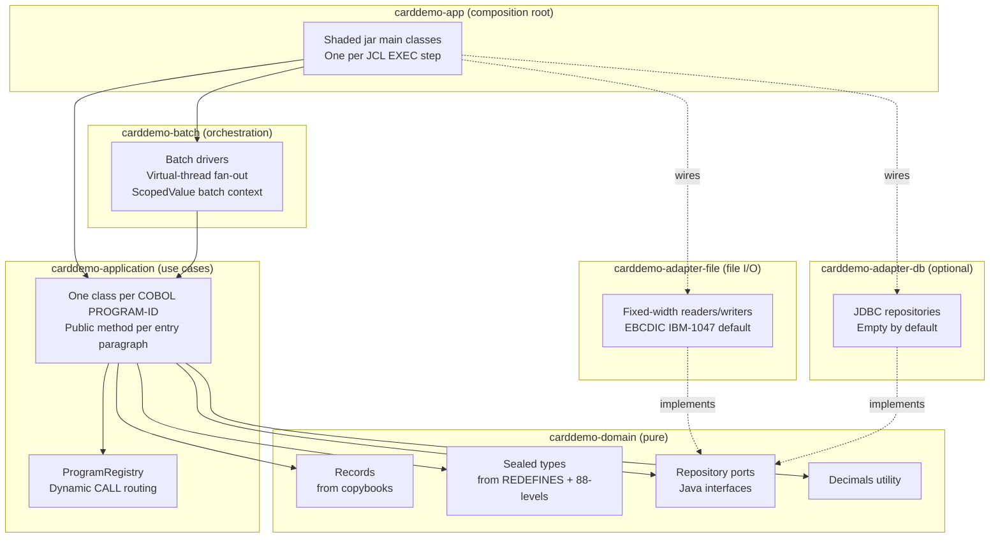

# Technical Specification

# 0. Agent Action Plan

## 0.1 Intent Clarification

### 0.1.1 Core Refactoring Objective

Based on the prompt, the Blitzy platform understands that the refactoring objective is to perform a **full source-to-source migration of the AWS CardDemo mainframe application from Enterprise COBOL/CICS/VSAM/JCL/BMS to a modern Java 25 LTS code base** built on a hexagonal architecture, while preserving the original COBOL source tree under `app/` as an immutable reference implementation and golden-record fixture source. The refactor must produce Java code that yields **byte-for-byte identical file outputs** and **field-for-field identical record outputs** versus the COBOL baseline, with no enhancement of business behavior, no optimization beyond migration requirements, and no introduction of frameworks (such as Spring) that the existing COBOL program does not require.

**Refactoring type**: Tech stack migration (mainframe COBOL → Java 25 LTS) combined with structural restructuring (program-level translation into a hexagonal layout). This is **not** a behavior-changing refactor; it is an *idiom-for-idiom translation* with deliberate, mandated use of Java 25 finalized features where they cleanly express a COBOL construct.

**Target repository**: Same repository. The new Java code lives under a new top-level `java/` tree (Maven multi-module). The original `app/` tree — containing all 28 COBOL programs `[app/cbl/]`, 28 copybooks `[app/cpy/]`, 17 BMS map definitions `[app/bms/]`, 17 symbolic map copybooks `[app/cpy-bms/]`, 29 JCL jobs `[app/jcl/]`, 9 ASCII test fixtures `[app/data/ASCII/]`, IDCAMS LISTCAT report `[app/catlg/LISTCAT.txt]`, CICS CSD `[app/csd/CARDDEMO.CSD]`, and cataloged procedures `[app/proc/]` — **must remain unmodified**.

**Critical architecture override (acknowledged conflict)**: The existing `docs/technical-specifications.md` documents a *previously planned* Spring Boot 3.5.11 + PostgreSQL 16 + Spring Batch 5.x migration architecture `[docs/technical-specifications.md:§1.2-§5.1]`. The user's current prompt **explicitly overrides** that target architecture. The Blitzy platform understands that the binding target architecture is now: hexagonal Java 25 with **plain factories and constructor injection (no Spring container)**, **file-based batch processing by default (no PostgreSQL)**, **single shaded jar per executable program**, **virtual-thread fan-out for parallelizable per-record work**, and **`ScopedValue` propagation of batch-run context replacing `ThreadLocal` entirely**. This override applies to all Java code; the COBOL source tree remains the reference regardless of which architecture is documented elsewhere.

**Refactoring goals**:

- Translate every COBOL `PROGRAM-ID` into one Java class in the application layer, with the original program name preserved in package/class names and cited in Javadoc via a `@CobolProgram("CBACT01C")` doc tag
- Translate every copybook 01-level group into an immutable Java `record` in the domain layer, with `parse(byte[])` and `encode()` methods that produce byte-for-byte identical fixed-width representations
- Translate every COBOL `REDEFINES` into a `sealed interface` with `permits` clause and discriminator-based parser
- Translate every COBOL `EVALUATE` into a pattern-matching switch with compiler-enforced exhaustiveness checking; no `default` branches that mask missing cases
- Translate every COBOL `COMP-3` / `PIC S9(n)V99` value into `java.math.BigDecimal` with explicit `MathContext.DECIMAL128` and explicit `RoundingMode` per the `ROUNDED` clause (banker's rounding) or default truncation
- Translate every COBOL date/time value into `java.time` types (`LocalDate`, `LocalDateTime`, `LocalTime`, `Period`, `Duration`); never use `java.util.Date` or `java.util.Calendar`
- Translate every COBOL file I/O into `java.nio.file` operations; never use `java.io.File` in new code
- Build a golden-record parity test harness that asserts byte-for-byte equality between Java output and captured COBOL output for every translated program
- Provide a single shaded jar per executable (one per JCL `EXEC PGM=` step), runnable as `java -jar carddemo-<program>.jar <args>`

### 0.1.2 Technical Interpretation

This refactoring translates to the following technical transformation strategy:

The current architecture is a **z/OS mainframe transaction system** with three distinct execution modes — CICS online (17 programs invoked by 3270 BMS screens), JCL batch (11 batch programs orchestrated by 29 JCL jobs), and shared VSAM KSDS data stores (ACCTDATA, CARDDATA, CARDXREF, CUSTDATA, DALYTRAN, TRANSACT, DISCGRP, TRANCATG, TRANTYPE, TCATBALF, USRSEC) `[README.md:§Datasets]`. The target architecture is a **JVM-hosted hexagonal application** with the same conceptual partitioning realized through Java packages instead of system services:

| Current (COBOL / CICS / z/OS) | Target (Java 25 LTS) | Transformation Rule |
|-------------------------------|----------------------|---------------------|
| COBOL `PROGRAM-ID` | One Java class in `carddemo-application` | One class per program, public method per entry paragraph, private method per internal paragraph |
| COBOL `COPY` directive | Java `import` of a domain record | One record per 01-level group in `carddemo-domain` |
| COBOL `WORKING-STORAGE SECTION` | Private fields in the use-case class (mutable, never shared across threads) | Isolated to the use-case class instance |
| COBOL `LINKAGE SECTION` | Public method parameters (records) | Records pass between caller and callee |
| COBOL `REDEFINES` | Sealed interface with record permits | Discriminator-based parser selects a permit |
| COBOL `OCCURS DEPENDING ON` | Record with `List<T>` + explicit count | Count validated in compact constructor |
| COBOL 88-level condition names | Static predicates on the owning record, OR a sealed enum-like hierarchy when conditions partition a value space | Compiler enforces exhaustiveness |
| COBOL `EVALUATE` | Pattern-matching `switch` expression | No `default` branch |
| COBOL `PERFORM ... VARYING` | `for` loop or `IntStream.range(...).forEach(...)` where idiomatic | Avoid streams when they obscure translation |
| COBOL `CALL "PROGRAM" USING ...` (static) | Direct method call on the constructor-injected collaborator | — |
| COBOL `CALL` with variable program (dynamic) | Lookup through `ProgramRegistry` in `carddemo-application` | — |
| COBOL `MOVE ... TO ...` (group move) | Record canonical constructor or hand-written `with*` copy method | Records in finalized Java 25 do not have built-in `with` syntax |
| COBOL `COMPUTE / ADD / SUBTRACT / MULTIPLY / DIVIDE` on packed-decimal | `BigDecimal` operations via `Decimals` utility with explicit `MathContext.DECIMAL128` and `RoundingMode` | Banker's rounding for `ROUNDED`, truncation otherwise |
| COBOL `STRING / UNSTRING / INSPECT` | `String` operations or `java.util.regex` | Preserve exact whitespace and padding semantics |
| COBOL `EXEC CICS SEND/RECEIVE MAP` | Method parameters (input record) and return value (output record) on the application class | No web framework; BMS maps become entry-contract DTOs |
| COBOL `EXEC CICS XCTL / LINK` | Direct method call OR strategy invocation through `ProgramRegistry` | — |
| COBOL `DFHCOMMAREA` | A `CardDemoCommarea` record passed between methods | No JWT, no session store |
| COBOL `SYNCPOINT ROLLBACK` (in COACTUPC) | Try/finally with compensating writes | Preserve transactional semantics manually |
| COBOL `FILE STATUS` codes | Sealed exception hierarchy | Identical observable outcomes |
| VSAM KSDS file | File-based adapter reading fixed-width records via `java.nio.file` | Optional JDBC adapter behind same port interface |
| z/OS GDG | Versioned files on a normal filesystem | Same naming conventions preserved |
| JCL `EXEC PGM=…` step | One main class in `carddemo-app`, packaged as shaded jar | One executable per step |
| JCL `DD` statements | Constructor arguments / `application.properties` keys | 12-factor configuration |

### 0.1.3 Surfaced Implicit Requirements

Beyond the explicit user goals, the Blitzy platform surfaces these implicit requirements that any downstream code generation agent must honor:

- **Byte-for-byte file fidelity** is non-negotiable: every fixed-width output file written by the Java implementation must equal the COBOL implementation's output byte-for-byte. This implies that `Decimals.encode(...)`, sign nybble handling for COMP-3, zero-padding direction (leading vs. trailing), space-padding direction, and EBCDIC↔ASCII transcoding must all be exactly replicated.
- **Decimal scale preservation**: a `BigDecimal` value of `1.20` must NOT be normalized to `1.2` — every monetary `BigDecimal` operation must declare `setScale(2, RoundingMode.…)` to preserve trailing zeros and the COBOL implicit decimal position.
- **One-to-one program-to-class mapping**: there is no consolidation of programs into "services"; CBACT01C remains CbAct01C, COSGN00C remains CoSgn00C, etc. — preserved cardinality `[inferred — no direct source, derived from user mandate "One class per program"]`.
- **Plaintext password preservation**: SEC-USER-DATA `[app/cpy/CSUSR01Y.cpy:§SEC-USR-PWD]` stores passwords as `PIC X(08)` plaintext. Per the user's preserve-as-is mandate ("preserve current behavior … with minimal risk"), the Java translation preserves plaintext storage. The user separately mandates that no card PAN be logged in full (mask all but last 4 digits in logs). These two rules are NOT in conflict: storage and logging are different surfaces. Any decision to introduce password hashing would constitute a behavior change beyond migration scope and is therefore explicitly OUT OF SCOPE for this refactor; it must be flagged in `MIGRATION_NOTES.md` for a follow-up effort.
- **Closed business taxonomies are exhaustive**: transaction types (loaded from TRANTYPE), category codes (TRANCATG), account states, card statuses, and AID-key values `[app/cpy/CVCRD01Y.cpy:§88-LEVEL]` must each be expressed as sealed hierarchies so the Java compiler enforces every site that switches on them.
- **Virtual-thread fan-out only where COBOL was serial but per-record work is independent**: virtual threads are NOT a license to reorder records, change sort orders, or break sequencing. Any reordering changes observable output and is FORBIDDEN.
- **ScopedValue replaces ThreadLocal entirely**: batch-run context (run ID, processing date, tenant) flows through `ScopedValue.where(...).run(...)` scopes. New code must not use `ThreadLocal` at all.
- **No preview features**: the user explicitly excludes JEP 507 (primitive patterns), JEP 505 (structured concurrency), JEP 502 (stable values), and reserves JEP 512 (compact source files) for ad-hoc utilities only. This means downstream agents must not use these features even though Java 25 ships with them in preview status.

## 0.2 Scope Boundaries

### 0.2.1 Exhaustively In Scope

The following file groups are explicitly in scope for **CREATE** (new Java files), **UPDATE** (existing root-level documentation), or **REFERENCE** (read-only inputs to the translation). All wildcard patterns use TRAILING wildcards only.

**Source files to translate (read-only sources; new Java code is the output):**

- `app/cbl/*.cbl` — 28 COBOL programs (11 batch + 17 online, including subroutines CBSTM03B and CSUTLDTC). Complete list: CBACT01C, CBACT02C, CBACT03C, CBACT04C, CBCUS01C, CBSTM03A.CBL, CBSTM03B.CBL, CBTRN01C, CBTRN02C, CBTRN03C, COACTUPC, COACTVWC, COADM01C, COBIL00C, COCRDLIC, COCRDSLC, COCRDUPC, COMEN01C, CORPT00C, COSGN00C, COTRN00C, COTRN01C, COTRN02C, COUSR00C, COUSR01C, COUSR02C, COUSR03C, CSUTLDTC `[app/cbl/]`
- `app/cpy/*.cpy` — 28 copybooks: COADM02Y, COCOM01Y, COMEN02Y, COSTM01, COTTL01Y, CSDAT01Y, CSLKPCDY, CSMSG01Y, CSMSG02Y, CSSETATY, CSSTRPFY, CSUSR01Y, CSUTLDPY, CSUTLDWY, CUSTREC, CVACT01Y, CVACT02Y, CVACT03Y, CVCRD01Y, CVCUS01Y, CVTRA01Y, CVTRA02Y, CVTRA03Y, CVTRA04Y, CVTRA05Y, CVTRA06Y, CVTRA07Y, UNUSED1Y `[app/cpy/]`
- `app/bms/*.bms` — 17 BMS map definitions: COACTUP, COACTVW, COADM01, COBIL00, COCRDLI, COCRDSL, COCRDUP, COMEN01, CORPT00, COSGN00, COTRN00, COTRN01, COTRN02, COUSR00, COUSR01, COUSR02, COUSR03 `[app/bms/]`
- `app/cpy-bms/*.CPY` — 17 symbolic map copybooks paired with the above BMS maps `[app/cpy-bms/]`
- `app/jcl/*.jcl` and `app/jcl/*.JCL` — 29 JCL jobs: ACCTFILE, CARDFILE, CBADMCDJ, CLOSEFIL, COMBTRAN, CREASTMT.JCL, CUSTFILE, DALYREJS, DEFCUST, DEFGDGB, DISCGRP, DUSRSECJ, INTCALC, OPENFIL, POSTTRAN, PRTCATBL, READACCT, READCARD, READCUST, READXREF, REPTFILE, TCATBALF, TRANBKP, TRANCATG, TRANFILE, TRANIDX, TRANREPT, TRANTYPE, XREFFILE `[app/jcl/]`
- `app/data/ASCII/*.txt` — 9 ASCII fixture files: acctdata.txt, carddata.txt, cardxref.txt, custdata.txt, dailytran.txt, discgrp.txt, tcatbal.txt, trancatg.txt, trantype.txt `[app/data/ASCII/]`

**New Java source tree (CREATE all):**

- `java/pom.xml` — parent Maven POM with `<release>25</release>` and module declarations
- `java/carddemo-domain/pom.xml` and `java/carddemo-domain/src/main/java/com/blitzy/carddemo/domain/**` — records, sealed types, value objects, ports
- `java/carddemo-application/pom.xml` and `java/carddemo-application/src/main/java/com/blitzy/carddemo/application/**` — one class per COBOL `PROGRAM-ID`
- `java/carddemo-adapter-file/pom.xml` and `java/carddemo-adapter-file/src/main/java/com/blitzy/carddemo/adapter/file/**` — fixed-width record readers/writers
- `java/carddemo-adapter-db/pom.xml` and `java/carddemo-adapter-db/src/main/java/com/blitzy/carddemo/adapter/db/**` — JDBC repositories (empty/optional by default; created only if DB2/relational adapter is required)
- `java/carddemo-batch/pom.xml` and `java/carddemo-batch/src/main/java/com/blitzy/carddemo/batch/**` — batch drivers that compose use cases and apply virtual-thread fan-out
- `java/carddemo-app/pom.xml` and `java/carddemo-app/src/main/java/com/blitzy/carddemo/app/**` — main entry points, one per JCL `EXEC PGM=` step
- `java/carddemo-tests/pom.xml` and `java/carddemo-tests/src/test/java/com/blitzy/carddemo/tests/**` — golden-record harness, jqwik property tests, JFR performance fixtures
- `java/carddemo-tests/src/test/resources/golden/**` — captured COBOL inputs and expected outputs per program

**Rule-mandated supplementary files (CREATE):**

- `java/MIGRATION_NOTES.md` — log of every dead-code translation, suspected COBOL bug, deviation from idiom-for-idiom translation, and any TODO flag from the user prompt
- `java/application.properties.example` — example 12-factor configuration: codepage per file, file paths, optional DB credentials, JVM flags
- `java/README.md` — clean-machine build/run instructions (Install JDK 25 → Install Maven 3.9+ → `mvn -B clean verify` → `java -XX:+UseCompactObjectHeaders -jar carddemo-<program>/target/carddemo-<program>.jar <args>`)
- `java/.gitignore` — Maven `target/`, IDE settings
- `java/carddemo-domain/src/main/java/com/blitzy/carddemo/domain/util/Decimals.java` — `BigDecimal` facade with `MathContext.DECIMAL128` defaults and `RoundingMode` selection
- `java/carddemo-domain/src/main/java/com/blitzy/carddemo/domain/annotation/CobolProgram.java` — `@CobolProgram("CBACT01C")` Javadoc-style annotation citing original program-id, source path, and translation date for every translated class

**Root-level documentation (UPDATE):**

- `README.md` — append a "Java 25 Implementation" section pointing to `java/README.md` and noting that `app/` is preserved as the reference implementation `[README.md:§Top-Level]`

### 0.2.2 Explicitly Out of Scope

The following are explicitly NOT modified by this refactor:

- **The entire `app/` tree** — the user's mandate is unambiguous: "The original COBOL source tree at \[TODO — path\] must remain unmodified; it stays in the repository as the reference implementation and as the source for golden-record test fixtures." This includes:
    - `app/cbl/**` (28 COBOL programs)
    - `app/cpy/**` (28 copybooks)
    - `app/bms/**` (17 BMS definitions)
    - `app/cpy-bms/**` (17 symbolic map copybooks)
    - `app/jcl/**` (29 JCL jobs)
    - `app/data/**` (9 ASCII fixtures)
    - `app/catlg/LISTCAT.txt` (86-page IDCAMS LISTCAT report `[app/catlg/LISTCAT.txt]`)
    - `app/csd/CARDDEMO.CSD` (CICS CSD definitions)
    - `app/ctl/REPROCT.ctl` (IDCAMS control card)
    - `app/proc/REPROC.prc`, `app/proc/TRANREPT.prc` (cataloged procedures)
- **Build templates for the mainframe** — `samples/jcl/BATCMP.jcl`, `samples/jcl/BMSCMP.jcl`, `samples/jcl/CICCMP.jcl` (cataloged-procedure wrappers for BUILDBAT/BUILDBMS/BUILDONL)
- **Mainframe replacement orchestration** — JCL, CICS configuration, and z/OS-specific scripts are out of scope per user mandate: "replacement orchestration (shell scripts, Airflow, etc.) is not part of this refactor"
- **Database schemas** — per user: "Database schemas remain unchanged; only the access path changes from embedded SQL to JDBC." If no DB2 schema exists in the COBOL source (file-based default applies), no DB schema work is performed.
- **External file formats** — record layouts, codepages, delimiters are IMMUTABLE: "any external consumer must see identical bytes"
- **Diagrams** — `diagrams/*.png`, `diagrams/*.drawio` are reference-only and not regenerated
- **Existing tech spec content** — `docs/technical-specifications.md` describes a superseded Spring Boot architecture; the Agent Action Plan replaces that target. The existing file is not deleted; it is left in place as historical context.
- **MQ, CICS TDQ, external file feeds, FTP drops** — the user marked these `[TODO]` with the default of "file-based batch only." No external service integrations are introduced.

### 0.2.3 Design System Alignment

**Not applicable.** This refactor produces a backend batch and online-program system. The original COBOL/CICS frontend (3270 BMS green-screen) is **not** being replaced with a web or mobile UI. BMS maps are translated only to input/output entry-contract DTO records on the corresponding application classes; no component library, design system, or visual styling is in scope.

## 0.3 Target Design

### 0.3.1 Refactored Structure Planning

The target Java tree is a Maven multi-module project under a new top-level `java/` directory. The `app/` directory is preserved unchanged.

```
java/
├── pom.xml                          (parent POM, <release>25</release>)
├── README.md                        (build/run instructions)
├── MIGRATION_NOTES.md               (deviations, dead code, suspected bugs)
├── application.properties.example   (12-factor configuration template)
├── .gitignore
│
├── carddemo-domain/                 (pure domain: records, sealed types, ports)
│   ├── pom.xml
│   └── src/main/java/com/blitzy/carddemo/domain/
│       ├── annotation/
│       │   └── CobolProgram.java                (Javadoc-style traceability tag)
│       ├── record/
│       │   ├── AccountRecord.java               (from CVACT01Y, 300 bytes)
│       │   ├── CardRecord.java                  (from CVACT02Y, 150 bytes)
│       │   ├── CardXrefRecord.java              (from CVACT03Y, 50 bytes)
│       │   ├── CustomerRecord.java              (from CVCUS01Y, 500 bytes)
│       │   ├── TranRecord.java                  (from CVTRA05Y, 350 bytes)
│       │   ├── DalyTranRecord.java              (from CVTRA06Y, 350 bytes)
│       │   ├── TranCatBalRecord.java            (from CVTRA01Y, 50 bytes)
│       │   ├── DisGroupRecord.java              (from CVTRA02Y, 50 bytes)
│       │   ├── TranTypeRecord.java              (from CVTRA03Y)
│       │   ├── TranCatRecord.java               (from CVTRA04Y)
│       │   ├── SecUserData.java                 (from CSUSR01Y, 80 bytes)
│       │   ├── TrnxRecord.java                  (from COSTM01)
│       │   ├── ReportHeaders.java               (from CVTRA07Y)
│       │   └── ...
│       ├── commarea/
│       │   └── CardDemoCommarea.java            (from COCOM01Y)
│       ├── menu/
│       │   ├── AdminMenuTable.java              (from COADM02Y)
│       │   └── MainMenuTable.java               (from COMEN02Y)
│       ├── text/
│       │   ├── ScreenTitle.java                 (from COTTL01Y)
│       │   ├── SystemMessages.java              (from CSMSG01Y, CSMSG02Y)
│       │   └── CcWorkAreas.java                 (from CVCRD01Y; sealed REDEFINES)
│       ├── validation/
│       │   ├── DateConstants.java               (from CSDAT01Y)
│       │   ├── LookupCodes.java                 (from CSLKPCDY)
│       │   └── DateValidationWork.java          (from CSUTLDPY, CSUTLDWY)
│       ├── port/
│       │   ├── AccountRepository.java           (interface)
│       │   ├── CardRepository.java
│       │   ├── CardXrefRepository.java
│       │   ├── CustomerRepository.java
│       │   ├── TransactionRepository.java
│       │   ├── DailyTransactionRepository.java
│       │   ├── DiscountGroupRepository.java
│       │   ├── TransactionCategoryBalanceRepository.java
│       │   ├── TransactionTypeRepository.java
│       │   ├── TransactionCategoryRepository.java
│       │   └── UserSecurityRepository.java
│       └── util/
│           └── Decimals.java                    (BigDecimal facade)
│
├── carddemo-application/            (one class per COBOL PROGRAM-ID)
│   ├── pom.xml
│   └── src/main/java/com/blitzy/carddemo/application/
│       ├── account/                 (CbAct01C, CbAct02C, CbAct03C, CbAct04C, CoActVwC, CoActUpC)
│       ├── card/                    (CoCrdLiC, CoCrdSlC, CoCrdUpC)
│       ├── customer/                (CbCus01C)
│       ├── transaction/             (CbTrn01C, CbTrn02C, CbTrn03C, CoTrn00C, CoTrn01C, CoTrn02C)
│       ├── statement/               (CbStm03A, CbStm03B)
│       ├── billpay/                 (CoBil00C)
│       ├── report/                  (CoRpt00C)
│       ├── menu/                    (CoMen01C, CoAdm01C)
│       ├── signon/                  (CoSgn00C)
│       ├── user/                    (CoUsr00C, CoUsr01C, CoUsr02C, CoUsr03C)
│       ├── util/                    (DateValidator from CSUTLDTC; ScreenAttributeSetter from CSSETATY; PfKeyDecoder from CSSTRPFY)
│       └── ProgramRegistry.java     (dynamic CALL routing)
│
├── carddemo-adapter-file/           (java.nio.file readers/writers)
│   ├── pom.xml
│   └── src/main/java/com/blitzy/carddemo/adapter/file/
│       ├── FixedWidthReader.java
│       ├── FixedWidthWriter.java
│       ├── EbcdicTranscoder.java            (Charset.forName("IBM-1047") default)
│       ├── FileAccountRepository.java
│       ├── FileCardRepository.java
│       ├── FileCustomerRepository.java
│       ├── FileTransactionRepository.java
│       ├── FileDailyTransactionRepository.java
│       └── ... (one per port)
│
├── carddemo-adapter-db/             (optional JDBC; empty by default)
│   ├── pom.xml
│   └── src/main/java/com/blitzy/carddemo/adapter/db/
│
├── carddemo-batch/                  (batch composition + virtual-thread fan-out)
│   ├── pom.xml
│   └── src/main/java/com/blitzy/carddemo/batch/
│       ├── BatchRunContext.java             (ScopedValue<BatchRunContext>)
│       ├── PostTransactionsBatch.java       (composes CbTrn02C use case)
│       ├── InterestCalculationBatch.java
│       ├── DailyRejectsBatch.java
│       ├── PrintTcatBalBatch.java
│       ├── CombineTransactionsBatch.java
│       └── CreateStatementsBatch.java
│
├── carddemo-app/                    (main entry points, one per JCL step)
│   ├── pom.xml                      (configures maven-shade-plugin)
│   └── src/main/java/com/blitzy/carddemo/app/
│       ├── PostTransactionsApp.java         (JCL: POSTTRAN)
│       ├── InterestCalculationApp.java      (JCL: INTCALC)
│       ├── CombineTransactionsApp.java      (JCL: COMBTRAN)
│       ├── CreateStatementsApp.java         (JCL: CREASTMT)
│       ├── DailyRejectsApp.java             (JCL: DALYREJS)
│       ├── PrintTcatBalApp.java             (JCL: PRTCATBL)
│       ├── TransactionReportApp.java        (JCL: TRANREPT)
│       ├── UsersSecuritySeedApp.java        (JCL: DUSRSECJ)
│       ├── DataDumpApp.java                 (JCL: READACCT/READCARD/READCUST/READXREF)
│       └── ... (one per JCL EXEC step)
│
└── carddemo-tests/                  (golden-record harness, jqwik tests, JFR fixtures)
    ├── pom.xml
    └── src/test/
        ├── java/com/blitzy/carddemo/tests/
        │   ├── golden/
        │   │   ├── GoldenRecordTest.java             (base class)
        │   │   ├── CbAct01CGoldenTest.java
        │   │   ├── CbTrn02CGoldenTest.java
        │   │   └── ... (one per program)
        │   ├── property/
        │   │   ├── DecimalsProperties.java           (jqwik property tests for BigDecimal)
        │   │   └── ...
        │   └── perf/
        │       └── JfrBaseline.java                  (Java Flight Recorder regression assertions)
        └── resources/golden/
            ├── cbact01c/input/...
            ├── cbact01c/expected/...
            ├── cbtrn02c/input/...
            ├── cbtrn02c/expected/...
            └── ...
```

### 0.3.2 Design Pattern Applications

The hexagonal architecture is realized through six discrete patterns:

- **Records pattern**: Each COBOL copybook 01-level group `[app/cpy/*.cpy]` becomes a Java `record` in `carddemo-domain.record`. Nested 02–49 level groups become nested records or component fields. Each record exposes a `static T parse(byte[] buffer)` factory and an `byte[] encode()` method that together form the byte-level contract with external file consumers. Record canonical constructors use JEP 513 Flexible Constructor Bodies to validate field ranges before binding fields (e.g., `if (acctId < 0L) throw new IllegalArgumentException(...)`, then `this.acctId = acctId;`).
- **Sealed-type pattern**: Each COBOL `REDEFINES` becomes a `sealed interface` with a `permits` clause listing one record per alternative interpretation. Each 88-level condition family that partitions a value space becomes a sealed hierarchy. Example: AID-key conditions on `CCARD-AID PIC X(5)` `[app/cpy/CVCRD01Y.cpy:§CCARD-AID-CLES]` (ENTER, CLEAR, PA1, PA2, PFK01–PFK12) → `sealed interface AidKey permits Enter, Clear, Pa1, Pa2, PfKey {…}`. Pattern-matching `switch` enforces exhaustiveness; no `default` branch.
- **Repository pattern (port + adapter)**: One Java interface per logical VSAM file or relational table lives in `carddemo-domain.port`. Implementations live in `carddemo-adapter-file` (fixed-width file I/O via `java.nio.file`) and optionally in `carddemo-adapter-db` (JDBC). The composition root in `carddemo-app` wires the chosen adapter into the use case at startup.
- **Factory pattern**: The static `parse(byte[])` methods on records are factories that produce instances from fixed-width buffers. Field layout metadata (offset, length, type, sign, scale) is encoded as static constants on the record class — derived directly from the copybook 01-level group structure.
- **Strategy / registry pattern**: COBOL `CALL` with a variable program name (e.g., when a menu dispatches to one of several programs by ID) is routed through a small in-memory `ProgramRegistry` in `carddemo-application`. The registry maps COBOL program names (e.g., `"COSGN00C"`) to method references on the corresponding Java class. Static `CALL` constructs become direct method calls on a constructor-injected collaborator.
- **Adapter for transcoding**: An `EbcdicTranscoder` in `carddemo-adapter-file` wraps `Charset.forName("IBM-1047")` with a configurable codepage override per file (set via `application.properties`).

### 0.3.3 Decimals Utility Design

The `Decimals` utility (in `carddemo-domain.util`) is the central facade for all monetary arithmetic. It is the single point of control for `MathContext` and `RoundingMode` defaults, ensuring every translated paragraph that performs `COMPUTE`, `ADD`, `SUBTRACT`, `MULTIPLY`, or `DIVIDE` on packed-decimal values produces byte-identical results to the COBOL baseline.

Defaults:

- `MathContext` = `MathContext.DECIMAL128` (34-digit precision)
- `RoundingMode` for COBOL `ROUNDED` clause = `RoundingMode.HALF_EVEN` (banker's rounding)
- `RoundingMode` for default (unrounded) arithmetic = `RoundingMode.DOWN` (truncation)
- Default monetary scale = 2 (for `PIC S9(n)V99` fields)

Key methods:

```java
public static BigDecimal add(BigDecimal a, BigDecimal b, int scale, RoundingMode mode);
public static BigDecimal multiplyRounded(BigDecimal a, BigDecimal b, int scale);
public static BigDecimal divideRounded(BigDecimal a, BigDecimal b, int scale);
public static BigDecimal parseSignedPacked(byte[] buffer, int offset, int length, int scale);
public static byte[] encodeSignedPacked(BigDecimal value, int length, int scale);
```

The utility is covered by jqwik property-based tests at **100% line coverage** (user mandate for monetary code).

### 0.3.4 JVM Tuning Baseline

Mandated by the user prompt; all `carddemo-app` shaded jars are documented to run with:

- `-XX:+UseCompactObjectHeaders` (JEP 519, finalized in Java 25) for ~20–30% heap reduction on small-record-heavy workloads. <cite index="3-14,3-15">JEP 519 promotes compact object headers (introduced in JDK 24 as an experimental feature) to a fully supported production option in JDK 25. When the flag -XX:+UseCompactObjectHeaders is enabled, each object in HotSpot uses only one machine word for its header instead of two, reducing memory requirements and improving data locality.</cite>
- `-XX:+UseShenandoahGC -XX:ShenandoahGCMode=generational` (JEP 521, finalized in Java 25) for low-pause batch. <cite index="3-20,3-21">JEP 521 promotes the generational mode of the Shenandoah GC from experimental (introduced in JEP 404 in JDK 24) to a fully supported production option. You can now run the generational GC with just -XX:+UseShenandoahGC -XX:ShenandoahGCMode=generational, without unlocking experimental flags.</cite>
- **No `--enable-preview`** — preview features are explicitly forbidden by the user.

### 0.3.5 User Interface Design

**Not applicable.** The COBOL system's user interface consists of 17 3270 BMS green-screen maps `[app/bms/*.bms]` invoked by CICS transactions. The user's refactor scope translates these only to entry-contract DTO records on the corresponding online-program Java classes (e.g., the `COSGN00` BMS map → an input/output record pair on `CoSgn00C`); no web, mobile, or desktop UI is introduced. There is no design system to align with.

### 0.3.6 Hexagonal Architecture Diagram


```mermaid
graph TB
    subgraph "carddemo-app (composition root)"
        APP[Shaded jar main classes<br/>One per JCL EXEC step]
    end

    subgraph "carddemo-batch (orchestration)"
        BATCH[Batch drivers<br/>Virtual-thread fan-out<br/>ScopedValue batch context]
    end

    subgraph "carddemo-application (use cases)"
        APPL[One class per COBOL PROGRAM-ID<br/>Public method per entry paragraph]
        REG[ProgramRegistry<br/>Dynamic CALL routing]
    end

    subgraph "carddemo-domain (pure)"
        REC[Records<br/>from copybooks]
        SEAL[Sealed types<br/>from REDEFINES + 88-levels]
        PORT[Repository ports<br/>Java interfaces]
        DEC[Decimals utility]
    end

    subgraph "carddemo-adapter-file (file I/O)"
        FILE[Fixed-width readers/writers<br/>EBCDIC IBM-1047 default]
    end

    subgraph "carddemo-adapter-db (optional)"
        DB[JDBC repositories<br/>Empty by default]
    end

    APP --> BATCH
    APP --> APPL
    BATCH --> APPL
    APPL --> REC
    APPL --> SEAL
    APPL --> PORT
    APPL --> DEC
    APPL --> REG
    FILE -.implements.-> PORT
    DB -.implements.-> PORT
    APP -.wires.-> FILE
    APP -.wires.-> DB
%% Outer ring is hexagonal layout; inner core is domain
```

## 0.4 Transformation Mapping

### 0.4.1 File-by-File Transformation Plan

The following table maps every target Java file to its source COBOL file (or marks it as REFERENCE / CREATE-net-new). All source paths originate from confirmed filesystem inspection of `app/` (28 .cbl programs, 28 .cpy copybooks, 17 .bms maps, 17 .CPY symbolic maps, 29 JCL jobs, 9 ASCII fixtures verified via `ls` on the repository).

**COBOL programs → Java application classes (all CREATE)**

| Target File | Transformation | Source File | Key Changes |
|-------------|----------------|-------------|-------------|
| `java/carddemo-application/src/main/java/com/blitzy/carddemo/application/account/CbAct01C.java` | CREATE | `app/cbl/CBACT01C.cbl` | Sequential ACCTFILE reader; translate `SELECT ACCTFILE-FILE ASSIGN TO ACCTFILE ORGANIZATION IS INDEXED ACCESS MODE IS SEQUENTIAL RECORD KEY IS FD-ACCT-ID` `[app/cbl/CBACT01C.cbl:L1-L80]` to `AccountRepository.streamSequential()`; paragraphs 0000-ACCTFILE-OPEN, 1000-ACCTFILE-GET-NEXT, 9000-ACCTFILE-CLOSE, 9999-ABEND-PROGRAM, 9910-DISPLAY-IO-STATUS become private methods |
| `java/carddemo-application/src/main/java/com/blitzy/carddemo/application/account/CbAct02C.java` | CREATE | `app/cbl/CBACT02C.cbl` | Card sequential reader |
| `java/carddemo-application/src/main/java/com/blitzy/carddemo/application/account/CbAct03C.java` | CREATE | `app/cbl/CBACT03C.cbl` | Card cross-reference sequential reader |
| `java/carddemo-application/src/main/java/com/blitzy/carddemo/application/account/CbAct04C.java` | CREATE | `app/cbl/CBACT04C.cbl` | Interest calculation engine (driven by INTCALC JCL) |
| `java/carddemo-application/src/main/java/com/blitzy/carddemo/application/customer/CbCus01C.java` | CREATE | `app/cbl/CBCUS01C.cbl` | Customer sequential reader |
| `java/carddemo-application/src/main/java/com/blitzy/carddemo/application/transaction/CbTrn01C.java` | CREATE | `app/cbl/CBTRN01C.cbl` | Daily transaction loader |
| `java/carddemo-application/src/main/java/com/blitzy/carddemo/application/transaction/CbTrn02C.java` | CREATE | `app/cbl/CBTRN02C.cbl` | Full posting engine; ~25 paragraphs `[app/cbl/CBTRN02C.cbl:L236-L750]` incl. 1500-VALIDATE-TRAN, 1500-A-LOOKUP-XREF, 1500-B-LOOKUP-ACCT, 2000-POST-TRANSACTION, 2500-WRITE-REJECT-REC, 2700-UPDATE-TCATBAL, 2700-A-CREATE-TCATBAL-REC, 2700-B-UPDATE-TCATBAL-REC, 2800-UPDATE-ACCOUNT-REC, 2900-WRITE-TRANSACTION-FILE; writes DALYREJS, updates TCATBAL/ACCOUNT in I-O mode |
| `java/carddemo-application/src/main/java/com/blitzy/carddemo/application/transaction/CbTrn03C.java` | CREATE | `app/cbl/CBTRN03C.cbl` | Paginated transaction detail report writer |
| `java/carddemo-application/src/main/java/com/blitzy/carddemo/application/statement/CbStm03A.java` | CREATE | `app/cbl/CBSTM03A.CBL` | Statement generation with HTML output; translate legacy TIOT/TCB/PSA inspection and ALTER/GO TO flow **faithfully** and flag as DEVIATION in `MIGRATION_NOTES.md` |
| `java/carddemo-application/src/main/java/com/blitzy/carddemo/application/statement/CbStm03B.java` | CREATE | `app/cbl/CBSTM03B.CBL` | Callable file-services subroutine; translate as utility class |
| `java/carddemo-application/src/main/java/com/blitzy/carddemo/application/account/CoActVwC.java` | CREATE | `app/cbl/COACTVWC.cbl` | Account view online transaction |
| `java/carddemo-application/src/main/java/com/blitzy/carddemo/application/account/CoActUpC.java` | CREATE | `app/cbl/COACTUPC.cbl` | Account update with SYNCPOINT ROLLBACK; **sole** rollback in COBOL source — translate transactional boundary semantics via try/finally with compensating writes; flag as IMPLEMENTATION DECISION in `MIGRATION_NOTES.md` |
| `java/carddemo-application/src/main/java/com/blitzy/carddemo/application/card/CoCrdLiC.java` | CREATE | `app/cbl/COCRDLIC.cbl` | Card list online |
| `java/carddemo-application/src/main/java/com/blitzy/carddemo/application/card/CoCrdSlC.java` | CREATE | `app/cbl/COCRDSLC.cbl` | Card view online |
| `java/carddemo-application/src/main/java/com/blitzy/carddemo/application/card/CoCrdUpC.java` | CREATE | `app/cbl/COCRDUPC.cbl` | Card update online |
| `java/carddemo-application/src/main/java/com/blitzy/carddemo/application/transaction/CoTrn00C.java` | CREATE | `app/cbl/COTRN00C.cbl` | Transaction list online |
| `java/carddemo-application/src/main/java/com/blitzy/carddemo/application/transaction/CoTrn01C.java` | CREATE | `app/cbl/COTRN01C.cbl` | Transaction view online |
| `java/carddemo-application/src/main/java/com/blitzy/carddemo/application/transaction/CoTrn02C.java` | CREATE | `app/cbl/COTRN02C.cbl` | Transaction add online |
| `java/carddemo-application/src/main/java/com/blitzy/carddemo/application/report/CoRpt00C.java` | CREATE | `app/cbl/CORPT00C.cbl` | Online-to-batch bridge via CICS TDQ JOBS queue; translate to direct invocation since CICS TDQ is out of scope |
| `java/carddemo-application/src/main/java/com/blitzy/carddemo/application/billpay/CoBil00C.java` | CREATE | `app/cbl/COBIL00C.cbl` | Bill payment online |
| `java/carddemo-application/src/main/java/com/blitzy/carddemo/application/menu/CoMen01C.java` | CREATE | `app/cbl/COMEN01C.cbl` | Main menu online (uses COMEN02Y menu table) |
| `java/carddemo-application/src/main/java/com/blitzy/carddemo/application/menu/CoAdm01C.java` | CREATE | `app/cbl/COADM01C.cbl` | Admin menu online (uses COADM02Y menu table) |
| `java/carddemo-application/src/main/java/com/blitzy/carddemo/application/signon/CoSgn00C.java` | CREATE | `app/cbl/COSGN00C.cbl` | Signon for transaction CC00; `WS-PGMNAME = 'COSGN00C'`, `WS-TRANID = 'CC00'`, `WS-USRSEC-FILE = 'USRSEC'` `[app/cbl/COSGN00C.cbl:L1-L80]`; LINKAGE SECTION DFHCOMMAREA OCCURS DEPENDING ON EIBCALEN translates to nullable `CardDemoCommarea` parameter |
| `java/carddemo-application/src/main/java/com/blitzy/carddemo/application/user/CoUsr00C.java` | CREATE | `app/cbl/COUSR00C.cbl` | User list online |
| `java/carddemo-application/src/main/java/com/blitzy/carddemo/application/user/CoUsr01C.java` | CREATE | `app/cbl/COUSR01C.cbl` | User add online |
| `java/carddemo-application/src/main/java/com/blitzy/carddemo/application/user/CoUsr02C.java` | CREATE | `app/cbl/COUSR02C.cbl` | User update online |
| `java/carddemo-application/src/main/java/com/blitzy/carddemo/application/user/CoUsr03C.java` | CREATE | `app/cbl/COUSR03C.cbl` | User delete online |
| `java/carddemo-application/src/main/java/com/blitzy/carddemo/application/util/DateValidator.java` | CREATE | `app/cbl/CSUTLDTC.cbl` | CEEDAYS wrapper; replace LE service call with `LocalDate.parse` strict resolver; expose same input/output record shape as original LINKAGE SECTION |

**Copybooks → Java records (all CREATE)**

| Target File | Transformation | Source File | Key Changes |
|-------------|----------------|-------------|-------------|
| `java/carddemo-domain/src/main/java/com/blitzy/carddemo/domain/record/AccountRecord.java` | CREATE | `app/cpy/CVACT01Y.cpy` | 300-byte fixed-width record; 14 fields: ACCT-ID (PIC 9(11)→long), ACCT-ACTIVE-STATUS (PIC X(01)→char), ACCT-CURR-BAL/CREDIT-LIMIT/CASH-CREDIT-LIMIT/CURR-CYC-CREDIT/CURR-CYC-DEBIT (PIC S9(10)V99→BigDecimal scale 2), ACCT-OPEN-DATE/EXPIRAION-DATE/REISSUE-DATE (PIC X(10)→LocalDate), ACCT-ADDR-ZIP/GROUP-ID (PIC X(10)→String), FILLER PIC X(178)→byte[178] preserved verbatim `[app/cpy/CVACT01Y.cpy:§ACCOUNT-RECORD]` |
| `java/carddemo-domain/src/main/java/com/blitzy/carddemo/domain/record/CardRecord.java` | CREATE | `app/cpy/CVACT02Y.cpy` | 150-byte card record |
| `java/carddemo-domain/src/main/java/com/blitzy/carddemo/domain/record/CardXrefRecord.java` | CREATE | `app/cpy/CVACT03Y.cpy` | 50-byte card cross-reference record |
| `java/carddemo-domain/src/main/java/com/blitzy/carddemo/domain/record/CustomerRecord.java` | CREATE | `app/cpy/CVCUS01Y.cpy` | 500-byte customer record |
| `java/carddemo-domain/src/main/java/com/blitzy/carddemo/domain/record/CustomerLegacyRecord.java` | CREATE | `app/cpy/CUSTREC.cpy` | Alternate customer-record layout retained for fixture compatibility |
| `java/carddemo-domain/src/main/java/com/blitzy/carddemo/domain/record/TranCatBalRecord.java` | CREATE | `app/cpy/CVTRA01Y.cpy` | 50-byte; composite key TRAN-CAT-KEY = ACCT-ID PIC 9(11) + TYPE-CD PIC X(02) + CAT-CD PIC 9(04) `[app/cpy/CVTRA01Y.cpy:§TRAN-CAT-BAL-RECORD]`; BigDecimal TRAN-CAT-BAL scale 2; nested record TranCatKey |
| `java/carddemo-domain/src/main/java/com/blitzy/carddemo/domain/record/DisGroupRecord.java` | CREATE | `app/cpy/CVTRA02Y.cpy` | 50-byte; composite key DIS-GROUP-KEY = ACCT-GROUP-ID PIC X(10) + TRAN-TYPE-CD PIC X(02) + TRAN-CAT-CD PIC 9(04) `[app/cpy/CVTRA02Y.cpy:§DIS-GROUP-RECORD]`; BigDecimal DIS-INT-RATE scale 2 |
| `java/carddemo-domain/src/main/java/com/blitzy/carddemo/domain/record/TranTypeRecord.java` | CREATE | `app/cpy/CVTRA03Y.cpy` | Transaction type lookup |
| `java/carddemo-domain/src/main/java/com/blitzy/carddemo/domain/record/TranCatRecord.java` | CREATE | `app/cpy/CVTRA04Y.cpy` | Transaction category lookup |
| `java/carddemo-domain/src/main/java/com/blitzy/carddemo/domain/record/TranRecord.java` | CREATE | `app/cpy/CVTRA05Y.cpy` | 350-byte; 14 fields incl. TRAN-AMT (PIC S9(09)V99→BigDecimal scale 2), TRAN-ORIG-TS/TRAN-PROC-TS (PIC X(26)→LocalDateTime) `[app/cpy/CVTRA05Y.cpy:§TRAN-RECORD]` |
| `java/carddemo-domain/src/main/java/com/blitzy/carddemo/domain/record/DalyTranRecord.java` | CREATE | `app/cpy/CVTRA06Y.cpy` | 350-byte daily transaction record |
| `java/carddemo-domain/src/main/java/com/blitzy/carddemo/domain/record/ReportHeaders.java` | CREATE | `app/cpy/CVTRA07Y.cpy` | Report header constants |
| `java/carddemo-domain/src/main/java/com/blitzy/carddemo/domain/record/SecUserData.java` | CREATE | `app/cpy/CSUSR01Y.cpy` | 80-byte: SEC-USR-ID PIC X(08), SEC-USR-FNAME PIC X(20), SEC-USR-LNAME PIC X(20), SEC-USR-PWD PIC X(08) (plaintext preserved), SEC-USR-TYPE PIC X(01), SEC-USR-FILLER PIC X(23) `[app/cpy/CSUSR01Y.cpy:§SEC-USER-DATA]` |
| `java/carddemo-domain/src/main/java/com/blitzy/carddemo/domain/record/TrnxRecord.java` | CREATE | `app/cpy/COSTM01.CPY` | Statement TRNX record (OCCURS DEPENDING ON candidate) |
| `java/carddemo-domain/src/main/java/com/blitzy/carddemo/domain/commarea/CardDemoCommarea.java` | CREATE | `app/cpy/COCOM01Y.cpy` | Nested records for GENERAL-INFO/CUSTOMER-INFO/ACCOUNT-INFO/CARD-INFO/MORE-INFO; sealed `UserType` (Admin, User) from 88-level `ADMIN='A'/USER='U'`; sealed `PgmContext` (Enter, Reenter) from 88-level `ENTER=0/REENTER=1` `[app/cpy/COCOM01Y.cpy:§CARDDEMO-COMMAREA]` |
| `java/carddemo-domain/src/main/java/com/blitzy/carddemo/domain/menu/AdminMenuTable.java` | CREATE | `app/cpy/COADM02Y.cpy` | Admin menu entries (static table) |
| `java/carddemo-domain/src/main/java/com/blitzy/carddemo/domain/menu/MainMenuTable.java` | CREATE | `app/cpy/COMEN02Y.cpy` | Main menu entries (static table) |
| `java/carddemo-domain/src/main/java/com/blitzy/carddemo/domain/text/ScreenTitle.java` | CREATE | `app/cpy/COTTL01Y.cpy` | Screen title constants |
| `java/carddemo-domain/src/main/java/com/blitzy/carddemo/domain/text/SystemMessages.java` | CREATE | `app/cpy/CSMSG01Y.cpy`, `app/cpy/CSMSG02Y.cpy` | Consolidated system message constants |
| `java/carddemo-domain/src/main/java/com/blitzy/carddemo/domain/text/CcWorkAreas.java` | CREATE | `app/cpy/CVCRD01Y.cpy` | Sealed `AidKey` (Enter, Clear, Pa1, Pa2, PfKey01–PfKey12); sealed REDEFINES for `CcAcctId`/`CcCardNum`/`CcCustId` (Text-vs-Numeric permits) `[app/cpy/CVCRD01Y.cpy:§CC-WORK-AREAS]` |
| `java/carddemo-domain/src/main/java/com/blitzy/carddemo/domain/validation/DateConstants.java` | CREATE | `app/cpy/CSDAT01Y.cpy` | LocalDate / LocalTime / LocalDateTime parsers; sealed REDEFINES for WS-CURDATE / WS-CURDATE-N and WS-CURTIME / WS-CURTIME-N `[app/cpy/CSDAT01Y.cpy:§WS-DATE-TIME]` |
| `java/carddemo-domain/src/main/java/com/blitzy/carddemo/domain/validation/LookupCodes.java` | CREATE | `app/cpy/CSLKPCDY.cpy` | NANPA area codes, US state codes, ZIP code prefixes |
| `java/carddemo-domain/src/main/java/com/blitzy/carddemo/domain/validation/DateValidationWork.java` | CREATE | `app/cpy/CSUTLDPY.cpy`, `app/cpy/CSUTLDWY.cpy` | Date validation working storage |
| `java/carddemo-application/src/main/java/com/blitzy/carddemo/application/util/ScreenAttributeSetter.java` | CREATE | `app/cpy/CSSETATY.cpy` | BMS attribute-setting procedure template → static helper methods |
| `java/carddemo-application/src/main/java/com/blitzy/carddemo/application/util/PfKeyDecoder.java` | CREATE | `app/cpy/CSSTRPFY.cpy` | AID-key decode procedure template → static helper methods |
| `java/carddemo-domain/src/main/java/com/blitzy/carddemo/domain/record/UnusedRecord.java` | CREATE | `app/cpy/UNUSED1Y.cpy` | Translate faithfully even if unused; document in `MIGRATION_NOTES.md` as "unused in COBOL — preserved for completeness" |

**BMS maps + symbolic copybooks → entry-contract DTO records (all CREATE; placed alongside the using application class)**

| Target File | Transformation | Source Files | Key Changes |
|-------------|----------------|--------------|-------------|
| `java/carddemo-application/src/main/java/com/blitzy/carddemo/application/account/CoActVwInput.java` and `.../CoActVwOutput.java` | CREATE | `app/bms/COACTVW.bms` + `app/cpy-bms/COACTVW.CPY` | Record pairs for the input (`AI`) and output (`AO`) overlay views; field-by-field translation of the symbolic map |
| `java/carddemo-application/src/main/java/com/blitzy/carddemo/application/account/CoActUpInput.java` and `.../CoActUpOutput.java` | CREATE | `app/bms/COACTUP.bms` + `app/cpy-bms/COACTUP.CPY` | — |
| `java/carddemo-application/src/main/java/com/blitzy/carddemo/application/menu/CoAdm01Input.java`, `CoAdm01Output.java` | CREATE | `app/bms/COADM01.bms` + `app/cpy-bms/COADM01.CPY` | — |
| `java/carddemo-application/src/main/java/com/blitzy/carddemo/application/billpay/CoBil00Input.java`, `CoBil00Output.java` | CREATE | `app/bms/COBIL00.bms` + `app/cpy-bms/COBIL00.CPY` | — |
| `java/carddemo-application/src/main/java/com/blitzy/carddemo/application/card/CoCrdLiInput.java`, `CoCrdLiOutput.java` | CREATE | `app/bms/COCRDLI.bms` + `app/cpy-bms/COCRDLI.CPY` | — |
| `java/carddemo-application/src/main/java/com/blitzy/carddemo/application/card/CoCrdSlInput.java`, `CoCrdSlOutput.java` | CREATE | `app/bms/COCRDSL.bms` + `app/cpy-bms/COCRDSL.CPY` | — |
| `java/carddemo-application/src/main/java/com/blitzy/carddemo/application/card/CoCrdUpInput.java`, `CoCrdUpOutput.java` | CREATE | `app/bms/COCRDUP.bms` + `app/cpy-bms/COCRDUP.CPY` | — |
| `java/carddemo-application/src/main/java/com/blitzy/carddemo/application/menu/CoMen01Input.java`, `CoMen01Output.java` | CREATE | `app/bms/COMEN01.bms` + `app/cpy-bms/COMEN01.CPY` | — |
| `java/carddemo-application/src/main/java/com/blitzy/carddemo/application/report/CoRpt00Input.java`, `CoRpt00Output.java` | CREATE | `app/bms/CORPT00.bms` + `app/cpy-bms/CORPT00.CPY` | — |
| `java/carddemo-application/src/main/java/com/blitzy/carddemo/application/signon/CoSgn00Input.java`, `CoSgn00Output.java` | CREATE | `app/bms/COSGN00.bms` + `app/cpy-bms/COSGN00.CPY` | — |
| `java/carddemo-application/src/main/java/com/blitzy/carddemo/application/transaction/CoTrn00Input.java`, `CoTrn00Output.java` | CREATE | `app/bms/COTRN00.bms` + `app/cpy-bms/COTRN00.CPY` | — |
| `java/carddemo-application/src/main/java/com/blitzy/carddemo/application/transaction/CoTrn01Input.java`, `CoTrn01Output.java` | CREATE | `app/bms/COTRN01.bms` + `app/cpy-bms/COTRN01.CPY` | — |
| `java/carddemo-application/src/main/java/com/blitzy/carddemo/application/transaction/CoTrn02Input.java`, `CoTrn02Output.java` | CREATE | `app/bms/COTRN02.bms` + `app/cpy-bms/COTRN02.CPY` | — |
| `java/carddemo-application/src/main/java/com/blitzy/carddemo/application/user/CoUsr00Input.java`, `CoUsr00Output.java` | CREATE | `app/bms/COUSR00.bms` + `app/cpy-bms/COUSR00.CPY` | — |
| `java/carddemo-application/src/main/java/com/blitzy/carddemo/application/user/CoUsr01Input.java`, `CoUsr01Output.java` | CREATE | `app/bms/COUSR01.bms` + `app/cpy-bms/COUSR01.CPY` | — |
| `java/carddemo-application/src/main/java/com/blitzy/carddemo/application/user/CoUsr02Input.java`, `CoUsr02Output.java` | CREATE | `app/bms/COUSR02.bms` + `app/cpy-bms/COUSR02.CPY` | — |
| `java/carddemo-application/src/main/java/com/blitzy/carddemo/application/user/CoUsr03Input.java`, `CoUsr03Output.java` | CREATE | `app/bms/COUSR03.bms` + `app/cpy-bms/COUSR03.CPY` | — |

**JCL jobs → Java main classes (all CREATE)**

| Target File | Transformation | Source File | Key Changes |
|-------------|----------------|-------------|-------------|
| `java/carddemo-app/src/main/java/com/blitzy/carddemo/app/PostTransactionsApp.java` | CREATE | `app/jcl/POSTTRAN.jcl` | Invokes CbTrn02C use case; wires CardXrefRepository, AccountRepository, DailyTransactionRepository, TransactionRepository, TransactionCategoryBalanceRepository |
| `java/carddemo-app/src/main/java/com/blitzy/carddemo/app/InterestCalculationApp.java` | CREATE | `app/jcl/INTCALC.jcl` | Invokes CbAct04C use case |
| `java/carddemo-app/src/main/java/com/blitzy/carddemo/app/CombineTransactionsApp.java` | CREATE | `app/jcl/COMBTRAN.jcl` | Sort + merge using `java.nio.file` + Java collections; preserve sort order exactly |
| `java/carddemo-app/src/main/java/com/blitzy/carddemo/app/CreateStatementsApp.java` | CREATE | `app/jcl/CREASTMT.JCL` | Invokes CbStm03A use case |
| `java/carddemo-app/src/main/java/com/blitzy/carddemo/app/DailyRejectsApp.java` | CREATE | `app/jcl/DALYREJS.jcl` | Daily rejects export |
| `java/carddemo-app/src/main/java/com/blitzy/carddemo/app/PrintTcatBalApp.java` | CREATE | `app/jcl/PRTCATBL.jcl` | Print TCATBAL report |
| `java/carddemo-app/src/main/java/com/blitzy/carddemo/app/TransactionReportApp.java` | CREATE | `app/jcl/TRANREPT.jcl` | Invokes CbTrn03C use case |
| `java/carddemo-app/src/main/java/com/blitzy/carddemo/app/UsersSecuritySeedApp.java` | CREATE | `app/jcl/DUSRSECJ.jcl` | Seeds USRSEC equivalent (IEBGENER copy) |
| `java/carddemo-app/src/main/java/com/blitzy/carddemo/app/DefineGdgApp.java` | CREATE | `app/jcl/DEFGDGB.jcl` | GDG base define (IDCAMS); translates to filesystem versioned-file scaffolding |
| `java/carddemo-app/src/main/java/com/blitzy/carddemo/app/DefineAccountFileApp.java` | CREATE | `app/jcl/ACCTFILE.jcl` | Define + load ACCTDATA (IDCAMS); load from `app/data/ASCII/acctdata.txt` (REFERENCE) |
| `java/carddemo-app/src/main/java/com/blitzy/carddemo/app/DefineCardFileApp.java` | CREATE | `app/jcl/CARDFILE.jcl` | Define + load CARDDATA |
| `java/carddemo-app/src/main/java/com/blitzy/carddemo/app/DefineCustomerFileApp.java` | CREATE | `app/jcl/CUSTFILE.jcl`, `app/jcl/DEFCUST.jcl` | Define + load CUSTDATA; flag DEFCUST delete/define dataset-name mismatch in `MIGRATION_NOTES.md` as suspected COBOL/JCL bug — translate faithfully |
| `java/carddemo-app/src/main/java/com/blitzy/carddemo/app/DefineDiscountGroupApp.java` | CREATE | `app/jcl/DISCGRP.jcl` | Define + load DISCGRP |
| `java/carddemo-app/src/main/java/com/blitzy/carddemo/app/DefineTransactionFileApp.java` | CREATE | `app/jcl/TRANFILE.jcl` | Define + load TRANSACT KSDS |
| `java/carddemo-app/src/main/java/com/blitzy/carddemo/app/DefineTransactionCategoryApp.java` | CREATE | `app/jcl/TRANCATG.jcl` | Define + load TRANCATG |
| `java/carddemo-app/src/main/java/com/blitzy/carddemo/app/DefineTransactionTypeApp.java` | CREATE | `app/jcl/TRANTYPE.jcl` | Define + load TRANTYPE |
| `java/carddemo-app/src/main/java/com/blitzy/carddemo/app/DefineCardXrefApp.java` | CREATE | `app/jcl/XREFFILE.jcl` | Define + load CARDXREF + AIX |
| `java/carddemo-app/src/main/java/com/blitzy/carddemo/app/DefineTcatBalApp.java` | CREATE | `app/jcl/TCATBALF.jcl` | Define + load TCATBALF |
| `java/carddemo-app/src/main/java/com/blitzy/carddemo/app/TransactionBackupApp.java` | CREATE | `app/jcl/TRANBKP.jcl` | Backup TRANSACT |
| `java/carddemo-app/src/main/java/com/blitzy/carddemo/app/TransactionIndexApp.java` | CREATE | `app/jcl/TRANIDX.jcl` | Build TRANSACT AIX |
| `java/carddemo-app/src/main/java/com/blitzy/carddemo/app/OpenFileApp.java` | CREATE | `app/jcl/OPENFIL.jcl` | IEFBR14 no-op translated for completeness |
| `java/carddemo-app/src/main/java/com/blitzy/carddemo/app/CloseFileApp.java` | CREATE | `app/jcl/CLOSEFIL.jcl` | IEFBR14 no-op translated for completeness |
| `java/carddemo-app/src/main/java/com/blitzy/carddemo/app/ReadAccountDumpApp.java` | CREATE | `app/jcl/READACCT.jcl` | IDCAMS PRINT translated to text dump utility |
| `java/carddemo-app/src/main/java/com/blitzy/carddemo/app/ReadCardDumpApp.java` | CREATE | `app/jcl/READCARD.jcl` | — |
| `java/carddemo-app/src/main/java/com/blitzy/carddemo/app/ReadCustomerDumpApp.java` | CREATE | `app/jcl/READCUST.jcl` | — |
| `java/carddemo-app/src/main/java/com/blitzy/carddemo/app/ReadCardXrefDumpApp.java` | CREATE | `app/jcl/READXREF.jcl` | — |
| `java/carddemo-app/src/main/java/com/blitzy/carddemo/app/ReportFileApp.java` | CREATE | `app/jcl/REPTFILE.jcl` | Print report file |
| `java/carddemo-app/src/main/java/com/blitzy/carddemo/app/AdminCodeApp.java` | CREATE | `app/jcl/CBADMCDJ.jcl` | CICS admin job translated as standalone Java main |

**ASCII fixtures → golden-record harness inputs (all REFERENCE)**

| Target File | Transformation | Source File | Key Changes |
|-------------|----------------|-------------|-------------|
| `java/carddemo-tests/src/test/resources/golden/acctdata/input.txt` | REFERENCE | `app/data/ASCII/acctdata.txt` | Read directly from `app/` via classpath relative path; NOT copied |
| `java/carddemo-tests/src/test/resources/golden/carddata/input.txt` | REFERENCE | `app/data/ASCII/carddata.txt` | — |
| `java/carddemo-tests/src/test/resources/golden/cardxref/input.txt` | REFERENCE | `app/data/ASCII/cardxref.txt` | — |
| `java/carddemo-tests/src/test/resources/golden/custdata/input.txt` | REFERENCE | `app/data/ASCII/custdata.txt` | — |
| `java/carddemo-tests/src/test/resources/golden/dailytran/input.txt` | REFERENCE | `app/data/ASCII/dailytran.txt` | — |
| `java/carddemo-tests/src/test/resources/golden/discgrp/input.txt` | REFERENCE | `app/data/ASCII/discgrp.txt` | — |
| `java/carddemo-tests/src/test/resources/golden/tcatbal/input.txt` | REFERENCE | `app/data/ASCII/tcatbal.txt` | — |
| `java/carddemo-tests/src/test/resources/golden/trancatg/input.txt` | REFERENCE | `app/data/ASCII/trancatg.txt` | — |
| `java/carddemo-tests/src/test/resources/golden/trantype/input.txt` | REFERENCE | `app/data/ASCII/trantype.txt` | — |

**Rule-mandated supplementary files (all CREATE)**

| Target File | Transformation | Source File | Key Changes |
|-------------|----------------|-------------|-------------|
| `java/pom.xml` | CREATE | — | Parent POM with `<release>25</release>`, module list, dependency-management section pinning all versions |
| `java/carddemo-domain/pom.xml` | CREATE | — | Pure-Java module POM |
| `java/carddemo-application/pom.xml` | CREATE | — | Depends on carddemo-domain |
| `java/carddemo-adapter-file/pom.xml` | CREATE | — | Depends on carddemo-domain |
| `java/carddemo-adapter-db/pom.xml` | CREATE | — | Depends on carddemo-domain; JDBC driver scope `provided` |
| `java/carddemo-batch/pom.xml` | CREATE | — | Depends on carddemo-application |
| `java/carddemo-app/pom.xml` | CREATE | — | Configures `maven-shade-plugin` per executable |
| `java/carddemo-tests/pom.xml` | CREATE | — | Depends on carddemo-app; JUnit 5, AssertJ, jqwik in `test` scope |
| `java/carddemo-domain/src/main/java/com/blitzy/carddemo/domain/util/Decimals.java` | CREATE | — | `BigDecimal` facade with `MathContext.DECIMAL128` defaults, `RoundingMode.HALF_EVEN` for ROUNDED |
| `java/carddemo-domain/src/main/java/com/blitzy/carddemo/domain/annotation/CobolProgram.java` | CREATE | — | Javadoc-style traceability annotation |
| `java/MIGRATION_NOTES.md` | CREATE | — | Migration log: dead code translations, suspected bugs, deviations from idiom-for-idiom, fixture-capture instructions |
| `java/application.properties.example` | CREATE | — | 12-factor configuration template documenting every environment variable, codepage per file, optional DB credentials |
| `java/README.md` | CREATE | — | Build/run instructions: Install JDK 25, Install Maven 3.9+, `mvn -B clean verify`, `java -XX:+UseCompactObjectHeaders -jar carddemo-<program>/target/carddemo-<program>.jar <args>` |
| `java/.gitignore` | CREATE | — | Maven `target/`, IDE settings |
| `java/carddemo-tests/src/test/java/com/blitzy/carddemo/tests/golden/GoldenRecordTest.java` | CREATE | — | Base class for byte-for-byte parity tests |
| `java/carddemo-tests/src/test/java/com/blitzy/carddemo/tests/property/DecimalsProperties.java` | CREATE | — | jqwik property-based tests for `Decimals` utility |
| `java/carddemo-tests/src/test/java/com/blitzy/carddemo/tests/perf/JfrBaseline.java` | CREATE | — | JFR-based regression assertions (10% performance band) |
| `README.md` (root) | UPDATE | `README.md` | Append "Java 25 Implementation" section pointing to `java/README.md`; note `app/` is preserved as reference `[README.md:§Top-Level]` |

### 0.4.2 Cross-File Dependencies

**Import statement updates** (COBOL → Java):

- `COPY CVACT01Y.` → `import com.blitzy.carddemo.domain.record.AccountRecord;`
- `COPY CVTRA05Y.` → `import com.blitzy.carddemo.domain.record.TranRecord;`
- `COPY COCOM01Y.` → `import com.blitzy.carddemo.domain.commarea.CardDemoCommarea;`
- `COPY CSUSR01Y.` → `import com.blitzy.carddemo.domain.record.SecUserData;`
- `COPY CSDAT01Y.` → `import com.blitzy.carddemo.domain.validation.DateConstants;`
- `COPY CVCRD01Y.` → `import com.blitzy.carddemo.domain.text.CcWorkAreas;`
- `COPY DFHAID.` → no equivalent; AID key handled by `AidKey` sealed hierarchy from `CcWorkAreas`
- `COPY DFHBMSCA.` → no equivalent; BMS attribute constants handled by `ScreenAttributeSetter`

**Call-site transformation rules**:

- Static `CALL "CSUTLDTC" USING ...` → `dateValidator.validate(...)` (constructor-injected)
- Static `CALL "CBSTM03B" USING ...` → `fileServices.invoke(...)` (constructor-injected)
- Dynamic `CALL WS-PROGRAM-NAME USING ...` → `programRegistry.invoke(programName, args)`
- `EXEC CICS XCTL PROGRAM(...) COMMAREA(...)` → direct method call or registry dispatch
- `EXEC CICS LINK PROGRAM(...) COMMAREA(...)` → direct method call returning updated commarea
- `EXEC CICS RETURN TRANSID(...) COMMAREA(...)` → return statement carrying the commarea

**Module Import Declarations (JEP 511, finalized in Java 25)**:

Files that touch many `java.*` packages may begin with `import module java.base;` to reduce import boilerplate. <cite index="3-3,3-4">JEP 511 finalizes the import module declaration, which allows a single statement to import all packages exported by a given module and those of the modules it "reads." This simplifies the use of modular libraries in non-modular code and shortens .java files by eliminating long lists of imports.</cite>

**Configuration files** referencing data paths and codepages: `java/application.properties.example` (CREATE) is the single source of truth.

**Documentation references**: the root `README.md` is the only documentation file updated; its update is purely additive and does not remove existing content. The `docs/technical-specifications.md` file is left in place as historical context for the previously planned Spring Boot architecture and is not modified by this refactor.

### 0.4.3 Wildcard Patterns

Where individual files are not enumerated, the following TRAILING wildcards apply (per user rule: ONLY trailing wildcards, never leading):

- `java/carddemo-application/src/main/java/com/blitzy/carddemo/application/**/*.java` — every translated application class
- `java/carddemo-domain/src/main/java/com/blitzy/carddemo/domain/**/*.java` — every record, sealed type, port, utility
- `java/carddemo-adapter-file/src/main/java/com/blitzy/carddemo/adapter/file/**/*.java` — every file-backed repository implementation
- `java/carddemo-app/src/main/java/com/blitzy/carddemo/app/**/*.java` — every main class
- `java/carddemo-tests/src/test/java/com/blitzy/carddemo/tests/**/*.java` — every test
- `java/carddemo-tests/src/test/resources/golden/**/*` — every golden-record fixture
- `java/**/pom.xml` — every Maven POM

### 0.4.4 One-Phase Execution

The entire refactor is executed by Blitzy in **ONE phase**. There is no split into iterative milestones, no week-by-week schedule, and no progressive delivery plan. All 28 COBOL programs, 28 copybooks, 17 BMS map pairs, 29 JCL jobs, supplementary documentation, Maven POMs, Decimals utility, golden-record harness, and JFR baselines are produced together as a single Blitzy execution.

## 0.5 Dependency Inventory

### 0.5.1 Key Private and Public Packages

All dependencies are public artifacts from Maven Central. Per the user mandate: "No private dependencies expected. All third-party libraries come from Maven Central."

| Registry | Group : Artifact | Version | Purpose |
|----------|------------------|---------|---------|
| (runtime) | OpenJDK (Temurin or equivalent) | **25** LTS (release: <cite index="4-2">September 16, 2025</cite>) | Source and target language level, `--release 25`, no `--enable-preview` |
| (build tool) | Apache Maven | **3.9.9** | Multi-module build; alternatively Gradle 8.10+ if repo standardizes on it (user states "Maven 3.9+ (or Gradle 8.10+)") |
| Maven Central | `org.apache.maven.plugins : maven-compiler-plugin` | 3.13.0 | Configured for `<release>25</release>` |
| Maven Central | `org.apache.maven.plugins : maven-shade-plugin` | 3.6.0 | Single shaded jar per executable program (one per JCL EXEC step) |
| Maven Central | `org.apache.maven.plugins : maven-surefire-plugin` | 3.5.2 | JUnit Platform native support |
| Maven Central | `org.junit.jupiter : junit-jupiter` | 5.13.1 | Unit + integration tests |
| Maven Central | `org.junit.platform : junit-platform-launcher` | 1.13.1 | Required minimum platform per jqwik 1.9.3 — <cite index="11-16">The minimum required version of the JUnit platform is 1.13.1</cite> |
| Maven Central | `org.assertj : assertj-core` | 3.26.3 | Fluent assertions |
| Maven Central | `net.jqwik : jqwik` | 1.9.3 | Property-based tests for monetary arithmetic |
| Maven Central | `org.slf4j : slf4j-api` | 2.0.16 | Logging facade |
| Maven Central | `ch.qos.logback : logback-classic` | 1.5.12 | Logging backend; JSON layout for structured logging |
| Maven Central | `(JDBC driver)` | (per database) | OPTIONAL — created only if a DB2/relational adapter is required by source-side embedded SQL; default is file-based batch only |

No GraalVM, no Spring, no Quarkus, no Micronaut, no Hibernate, no JPA, no Spring Batch, no Flyway, no Testcontainers, no LocalStack, no Spring Security, no Micrometer, no Spring Cloud AWS, and no PostgreSQL driver are introduced by this refactor. The user explicitly states: "Do not introduce Spring unless the existing system already depends on a container." The existing COBOL system has no container, so no Spring.

### 0.5.2 Dependency Updates

This refactor is a **net-new addition** of Java modules. There are no dependency removals because there are no pre-existing Java dependencies in the COBOL-only repository to remove. The `app/` tree contains COBOL source files only — no `pom.xml`, no `package.json`, no Java build manifest exists for this repository before the refactor.

If the previously-planned (now superseded) Spring Boot architecture documented in `docs/technical-specifications.md` had introduced Java dependencies, those would not be touched either, because no `pom.xml` or other Java build manifest is actually present in the repository at this time `[inferred — no direct source; based on filesystem inspection of repository root showing only docs/, app/, samples/, diagrams/, and root-level governance files]`.

### 0.5.3 Import Refactoring

**Import transformation rules** (apply to ALL new `.java` files under `java/`):

- `COPY <NAME>.` (COBOL) → `import com.blitzy.carddemo.domain.<package>.<RecordName>;`
- `CALL '<PROGRAM>' USING ...` (static) → `import com.blitzy.carddemo.application.<package>.<ClassName>;` and direct method call
- Dynamic `CALL` with variable name → `import com.blitzy.carddemo.application.ProgramRegistry;` and `programRegistry.invoke(...)`
- `EXEC CICS RECEIVE MAP / SEND MAP` → no equivalent import; method parameter and return value carry the input/output records
- `EXEC CICS XCTL / LINK` → no equivalent import; direct method call or registry dispatch
- Cross-cutting java.* package access → `import module java.base;` at the top of files that use many `java.*` packages (per JEP 511 finalized in Java 25)

**Files requiring import updates** (use TRAILING wildcards):

- `java/carddemo-application/src/main/java/com/blitzy/carddemo/application/**/*.java` — every translated application class imports the records and ports it uses
- `java/carddemo-app/src/main/java/com/blitzy/carddemo/app/**/*.java` — every main class imports the application class and adapter implementations it wires
- `java/carddemo-batch/src/main/java/com/blitzy/carddemo/batch/**/*.java` — every batch driver imports the use cases it composes
- `java/carddemo-tests/src/test/java/com/blitzy/carddemo/tests/**/*.java` — every test imports the program under test

### 0.5.4 External Reference Updates

- **Configuration files**: `java/application.properties.example` (CREATE) is the canonical configuration template
- **Documentation**: root `README.md` (UPDATE) appends a "Java 25 Implementation" section pointing to `java/README.md`
- **Build files**: `java/pom.xml` (CREATE) and per-module `java/carddemo-*/pom.xml` (CREATE) constitute the entire Java build setup
- **CI/CD**: not introduced by this refactor; downstream pipeline configuration is out of scope (would be added in a follow-on effort)

## 0.6 Special Analysis

### 0.6.1 Decimal Arithmetic Fidelity

COBOL `COMP-3` (packed-decimal) with `PIC S9(n)V99` declarations has a fixed scale and specific rounding behavior that **cannot** be reproduced by Java `double` or `float`. This refactor translates every monetary value to `java.math.BigDecimal` with **explicit** `MathContext` and `RoundingMode` selection at every arithmetic site, centralized in the `Decimals` utility.

**Defaults established by the Decimals utility**:

- `MathContext.DECIMAL128` (34-digit precision) for intermediate operations
- `RoundingMode.HALF_EVEN` (banker's rounding) for COBOL `ROUNDED` clause
- `RoundingMode.DOWN` (truncation) for default unrounded arithmetic
- Default monetary scale = 2 for `PIC S9(n)V99` fields
- Sign nybble: trailing nybble `D` for negative values, `C` (or `F` for unsigned) for positive — preserved at byte level by `Decimals.encodeSignedPacked(...)`

**Coverage requirement**: 100% line coverage on monetary code (user mandate). jqwik 1.9.3 generates random `BigDecimal` inputs in COBOL-valid ranges and asserts Java/COBOL agreement via the property test in `java/carddemo-tests/src/test/java/com/blitzy/carddemo/tests/property/DecimalsProperties.java`.

**Forbidden**: `double` or `float` for any monetary value, ever. Any downstream code generation that introduces a primitive floating-point monetary value is a defect.

### 0.6.2 REDEFINES Translation Strategy

COBOL `REDEFINES` provides multiple alternative interpretations of the same memory region. The translation produces a `sealed interface` with one record permit per alternative.

Example from `app/cpy/CVCRD01Y.cpy:§CC-WORK-AREAS` — `CC-ACCT-ID PIC X(11)` with `REDEFINES CC-ACCT-ID-N PIC 9(11)`:

```java
public sealed interface CcAcctId permits CcAcctId.Text, CcAcctId.Numeric {
    record Text(String value) implements CcAcctId {}
    record Numeric(long value) implements CcAcctId {}
}
```

A discriminator-based parser inspects context (e.g., field-level usage in the calling program) and selects the appropriate permit. Downstream call sites use pattern-matching `switch` with compiler-enforced exhaustiveness:

```java
switch (acctId) {
    case CcAcctId.Text(String v) -> handleText(v);
    case CcAcctId.Numeric(long v) -> handleNumeric(v);
}
```

No `default` branch is permitted because exhaustiveness checking is the safety guarantee.

### 0.6.3 OCCURS DEPENDING ON Translation Strategy

COBOL `OCCURS n TO m TIMES DEPENDING ON <field>` produces a variable-length array whose actual length is read at runtime. The translation produces a Java record with a `List<T>` field plus an explicit `count` field. The compact canonical constructor (JEP 513 Flexible Constructor Bodies) validates that `list.size() == count`:

```java
public record StatementBlock(int trnxCount, List<TrnxRecord> transactions) {
    public StatementBlock {
        if (transactions.size() != trnxCount) {
            throw new IllegalArgumentException(
                "trnxCount=" + trnxCount + " but list.size()=" + transactions.size());
        }
        transactions = List.copyOf(transactions); // defensive, immutable
    }
}
```

JEP 513 permits the validation logic to run before the canonical field assignments — this is exactly the right place to put COBOL-style input validation. <cite index="7-19,7-20,7-21">JEP 513: Flexible constructor bodies lands in Java 25, following a long incubation period. Flexible constructors, as the name suggests, make constructors less rigid. Specifically, Java no longer requires calling super() or this() as the first thing that happens in a constructor.</cite>

### 0.6.4 Date Semantics

| COBOL Type | Java Type | Notes |
|------------|-----------|-------|
| `PIC X(10)` date (YYYY-MM-DD) | `java.time.LocalDate` | Use `LocalDate.parse` with ISO format |
| `PIC 9(08)` date (YYYYMMDD) | `java.time.LocalDate` | Use `DateTimeFormatter.ofPattern("yyyyMMdd")` |
| `PIC X(26)` timestamp (per `TRAN-ORIG-TS` `[app/cpy/CVTRA05Y.cpy:§TRAN-ORIG-TS]`) | `java.time.LocalDateTime` | Use `DateTimeFormatter.ofPattern("yyyy-MM-dd HH:mm:ss.SSSSSS")` |
| `PIC 9(08)` time (HHMMSSMS) | `java.time.LocalTime` | — |
| Date difference in days | `java.time.Period.between(...)` or `ChronoUnit.DAYS.between(...)` | — |
| Duration calculations | `java.time.Duration` | — |

**Rules**:

- Document timezone assumptions explicitly per field via Javadoc comment. The default assumption is the JVM default zone; any field that needs to be wall-clock-preserved should use `LocalDateTime` (no zone), and any field that needs to be instant-preserved should use `Instant` with the documented zone.
- `java.util.Date` and `java.util.Calendar` are **forbidden** in new code.
- `CSUTLDTC` program (CEEDAYS wrapper) translates to a `DateValidator` Java class using `LocalDate.parse` with a strict resolver style. Inputs and outputs preserve the original `LINKAGE SECTION` record shape (defined in `app/cpy/CSUTLDPY.cpy` and `app/cpy/CSUTLDWY.cpy`).

### 0.6.5 File I/O Exactness

All file I/O uses `java.nio.file` (`Files.newByteChannel`, `SeekableByteChannel`, `Files.write`, `Files.readAllBytes`). `java.io.File` is **forbidden** in new code.

**Fixed-width record contract**: every record has a `parse(byte[] buffer)` static factory and an `encode()` instance method. These two methods together form the formal contract between Java code and any external file consumer.

**EBCDIC support**: production files in the source system are encoded in EBCDIC. The default codepage for EBCDIC-to-ASCII transcoding is `Charset.forName("IBM-1047")`. Per-file codepage overrides are configurable via `application.properties` (e.g., `carddemo.file.acctdata.charset=IBM-1047`). The 9 ASCII fixtures in `app/data/ASCII/*.txt` are pre-transcoded for test convenience; the production code supports both EBCDIC and ASCII inputs.

**Byte-for-byte round-trip requirement**: for every supported record type, `parse(record).encode()` MUST equal the original byte buffer, for every valid byte buffer. This invariant is asserted by the golden-record harness on every PR.

### 0.6.6 Batch Throughput Strategy

**Virtual threads**: where COBOL processing is serial but per-record work is independent (e.g., posting independent transactions, computing per-account interest), Java uses `Executors.newVirtualThreadPerTaskExecutor()` or `Thread.ofVirtual().start(...)` to fan out per-record work. This is permitted only when reordering would NOT change observable output; sort orders and sequencing are preserved.

**`ScopedValue` for batch-run context** (JEP 506 finalized in Java 25):

```java
public static final ScopedValue<BatchRunContext> BATCH_CTX = ScopedValue.newInstance();

// At job entry:
ScopedValue.where(BATCH_CTX, new BatchRunContext(runId, processingDate, tenant))
    .run(() -> postTransactionsBatch.execute());
```

Inside any callee on the same or a child virtual thread, `BATCH_CTX.get()` retrieves the bound context. <cite index="3-7,3-8,3-9">JEP 506 completes the series of preview versions starting with Java 20 and introduces Scoped Values as a stable feature of the platform. A Scoped Value is a container for an immutable value visible only within the dynamic scope of calls: a method establishes the binding, and the entire chain of its direct and indirect calls - including newly created child threads - can access that value. This mechanism is lighter than ThreadLocal, uses less memory (critical when dealing with millions of virtual threads), and eliminates side-effects related to forgotten cleanup.</cite>

`ThreadLocal` is **forbidden** in new code. Existing `ThreadLocal` constructs in any third-party transitive dependency are tolerated but not introduced.

### 0.6.7 Java 25 Finalized Features Mandate (Recap)

| Feature | JEP | Usage in this refactor |
|---------|-----|------------------------|
| Records (Java 16+) | — | Every copybook 01-level group |
| Sealed interfaces (Java 17+) | — | Every REDEFINES, every 88-level taxonomy partitioning a value space, every closed response-code set |
| Pattern-matching switch (Java 21+) | — | Every COBOL `EVALUATE`; rely on exhaustiveness checking; no `default` |
| Virtual threads (Java 21+) | — | Every batch fan-out and every I/O-bound concurrency point |
| `ScopedValue` | JEP 506 (Final) | Every cross-method context propagation; replaces `ThreadLocal` entirely |
| Module Import Declarations | JEP 511 (Final) | `import module java.base;` at top of files using many `java.*` packages |
| Flexible Constructor Bodies | JEP 513 (Final) | Validation/normalization before `super(...)` or canonical constructor calls |
| Text blocks (Java 15+) | — | Embedded SQL, report templates, multi-line DATA DIVISION constants |
| BigDecimal + MathContext.DECIMAL128 + RoundingMode | — | Every monetary or packed-decimal value, centralized in `Decimals` |
| `java.time` | — | Every date/time value |
| `java.nio.file` | — | Every file I/O |
| KDF API | JEP 510 (Final) | Conditional — only if existing COBOL requires key/PIN derivation; the user marks this contingent |

**Explicitly forbidden** (per user prompt):

- JEP 502 Stable Values (preview)
- JEP 505 Structured Concurrency (preview)
- JEP 507 Primitive Patterns (preview)
- JEP 512 Compact Source Files / Instance Main Methods in production code (utilities only)
- `double` or `float` for monetary values
- `ThreadLocal` in new code
- Reflection or dynamic proxies unless faithfully translating an existing COBOL construct
- `--enable-preview` JVM flag

### 0.6.8 Program-by-Program COBOL-to-Java Class Mapping Checklist

The following checklist provides increased visibility (per user request) into the exact mapping from each COBOL program to its Java class, with translated paragraph counts derived from direct file inspection:

| COBOL Program | Java Class | Source Path | Translated Paragraphs | Notes |
|---------------|-----------|-------------|----------------------|-------|
| CBACT01C | CbAct01C | `app/cbl/CBACT01C.cbl` | 0000-ACCTFILE-OPEN, 1000-ACCTFILE-GET-NEXT, 9000-ACCTFILE-CLOSE, 9910-DISPLAY-IO-STATUS, 9999-ABEND-PROGRAM, main `[app/cbl/CBACT01C.cbl:L1-L80]` | Simple sequential reader |
| CBACT02C | CbAct02C | `app/cbl/CBACT02C.cbl` | sequential CARD reader paragraphs `[inferred — no direct source for paragraph names; verify during translation]` | — |
| CBACT03C | CbAct03C | `app/cbl/CBACT03C.cbl` | sequential CARDXREF reader paragraphs `[inferred — no direct source]` | — |
| CBACT04C | CbAct04C | `app/cbl/CBACT04C.cbl` | interest posting paragraphs `[inferred — no direct source for paragraph names]` | Driven by INTCALC JCL |
| CBCUS01C | CbCus01C | `app/cbl/CBCUS01C.cbl` | sequential CUSTOMER reader paragraphs `[inferred — no direct source]` | — |
| CBTRN01C | CbTrn01C | `app/cbl/CBTRN01C.cbl` | daily transaction loader paragraphs `[inferred — no direct source]` | — |
| CBTRN02C | CbTrn02C | `app/cbl/CBTRN02C.cbl` | 25+ paragraphs incl. 0000-0500 OPEN, 1000-1500 VALIDATE/LOOKUP, 2000-2900 POST/WRITE/UPDATE, 9000-9500 CLOSE, 9910-9999 IO-STATUS/ABEND `[app/cbl/CBTRN02C.cbl:L23,L236-L750]` | Full posting engine |
| CBTRN03C | CbTrn03C | `app/cbl/CBTRN03C.cbl` | paginated report writer paragraphs `[inferred — no direct source]` | — |
| CBSTM03A | CbStm03A | `app/cbl/CBSTM03A.CBL` | statement generation paragraphs incl. legacy TIOT/TCB/PSA inspection and ALTER/GO TO flow `[inferred — based on user prompt mention]` | Flag legacy z/OS inspection as DEVIATION in MIGRATION_NOTES.md |
| CBSTM03B | CbStm03B | `app/cbl/CBSTM03B.CBL` | callable file-services subroutine paragraphs `[inferred — based on user prompt mention]` | Translate as utility class |
| COSGN00C | CoSgn00C | `app/cbl/COSGN00C.cbl` | WS-PGMNAME='COSGN00C', WS-TRANID='CC00', WS-USRSEC-FILE='USRSEC', LINKAGE DFHCOMMAREA OCCURS DEPENDING ON EIBCALEN `[app/cbl/COSGN00C.cbl:L1-L80]` | Signon for transaction CC00 |
| COMEN01C | CoMen01C | `app/cbl/COMEN01C.cbl` | main menu paragraphs `[inferred — no direct source]` | Uses COMEN02Y |
| COADM01C | CoAdm01C | `app/cbl/COADM01C.cbl` | admin menu paragraphs `[inferred — no direct source]` | Uses COADM02Y |
| COACTVWC | CoActVwC | `app/cbl/COACTVWC.cbl` | account view paragraphs `[inferred — no direct source]` | — |
| COACTUPC | CoActUpC | `app/cbl/COACTUPC.cbl` | account update paragraphs with SYNCPOINT ROLLBACK `[inferred — based on user prompt mention; sole rollback in COBOL source]` | Try/finally with compensating writes |
| COCRDLIC | CoCrdLiC | `app/cbl/COCRDLIC.cbl` | card list paragraphs `[inferred — no direct source]` | — |
| COCRDSLC | CoCrdSlC | `app/cbl/COCRDSLC.cbl` | card view paragraphs `[inferred — no direct source]` | — |
| COCRDUPC | CoCrdUpC | `app/cbl/COCRDUPC.cbl` | card update paragraphs `[inferred — no direct source]` | — |
| COTRN00C | CoTrn00C | `app/cbl/COTRN00C.cbl` | transaction list paragraphs `[inferred — no direct source]` | — |
| COTRN01C | CoTrn01C | `app/cbl/COTRN01C.cbl` | transaction view paragraphs `[inferred — no direct source]` | — |
| COTRN02C | CoTrn02C | `app/cbl/COTRN02C.cbl` | transaction add paragraphs `[inferred — no direct source]` | — |
| CORPT00C | CoRpt00C | `app/cbl/CORPT00C.cbl` | reports paragraphs including TDQ JOBS write `[inferred — based on user mention of CICS TDQ]` | Translate TDQ to direct invocation |
| COBIL00C | CoBil00C | `app/cbl/COBIL00C.cbl` | bill payment paragraphs `[inferred — no direct source]` | — |
| COUSR00C | CoUsr00C | `app/cbl/COUSR00C.cbl` | user list paragraphs `[inferred — no direct source]` | — |
| COUSR01C | CoUsr01C | `app/cbl/COUSR01C.cbl` | user add paragraphs `[inferred — no direct source]` | — |
| COUSR02C | CoUsr02C | `app/cbl/COUSR02C.cbl` | user update paragraphs `[inferred — no direct source]` | — |
| COUSR03C | CoUsr03C | `app/cbl/COUSR03C.cbl` | user delete paragraphs `[inferred — no direct source]` | — |
| CSUTLDTC | DateValidator | `app/cbl/CSUTLDTC.cbl` | CEEDAYS wrapper paragraphs `[inferred — based on user mention; replace LE service with java.time]` | Replace LE service with `LocalDate.parse` strict |

During translation each entry's `[inferred]` paragraph list MUST be replaced with the actual paragraph inventory read from the program source file; the inferred entries above are informational placeholders for sizing.

### 0.6.9 Copybook-to-Record Translation Table

| Copybook | Source Path | Java Record | Length | Special Handling |
|----------|-------------|-------------|--------|------------------|
| CVACT01Y | `app/cpy/CVACT01Y.cpy` | AccountRecord | 300 bytes | 5 BigDecimal monetary (scale 2), 3 LocalDate, 178-byte FILLER as byte[] `[app/cpy/CVACT01Y.cpy:§ACCOUNT-RECORD]` |
| CVACT02Y | `app/cpy/CVACT02Y.cpy` | CardRecord | 150 bytes | — |
| CVACT03Y | `app/cpy/CVACT03Y.cpy` | CardXrefRecord | 50 bytes | Composite-key style |
| CVCUS01Y | `app/cpy/CVCUS01Y.cpy` | CustomerRecord | 500 bytes | — |
| CUSTREC | `app/cpy/CUSTREC.cpy` | CustomerLegacyRecord | (per source) | Alternate layout retained for fixture compatibility |
| CVTRA01Y | `app/cpy/CVTRA01Y.cpy` | TranCatBalRecord | 50 bytes | Composite key (17 bytes): TRANCAT-ACCT-ID PIC 9(11) + TRANCAT-TYPE-CD PIC X(02) + TRANCAT-CD PIC 9(04); BigDecimal balance scale 2; 22-byte FILLER `[app/cpy/CVTRA01Y.cpy:§TRAN-CAT-BAL-RECORD]` |
| CVTRA02Y | `app/cpy/CVTRA02Y.cpy` | DisGroupRecord | 50 bytes | Composite key (16 bytes): DIS-ACCT-GROUP-ID PIC X(10) + DIS-TRAN-TYPE-CD PIC X(02) + DIS-TRAN-CAT-CD PIC 9(04); BigDecimal rate scale 2; 28-byte FILLER `[app/cpy/CVTRA02Y.cpy:§DIS-GROUP-RECORD]` |
| CVTRA03Y | `app/cpy/CVTRA03Y.cpy` | TranTypeRecord | — | Transaction type lookup |
| CVTRA04Y | `app/cpy/CVTRA04Y.cpy` | TranCatRecord | — | Transaction category lookup |
| CVTRA05Y | `app/cpy/CVTRA05Y.cpy` | TranRecord | 350 bytes | 14 fields incl. TRAN-AMT BigDecimal scale 2, 2 LocalDateTime fields (TRAN-ORIG-TS, TRAN-PROC-TS) `[app/cpy/CVTRA05Y.cpy:§TRAN-RECORD]` |
| CVTRA06Y | `app/cpy/CVTRA06Y.cpy` | DalyTranRecord | 350 bytes | Same layout as TranRecord |
| CVTRA07Y | `app/cpy/CVTRA07Y.cpy` | ReportHeaders | — | Report header constants |
| CSUSR01Y | `app/cpy/CSUSR01Y.cpy` | SecUserData | 80 bytes | Plaintext SEC-USR-PWD preserved (behavioral parity) `[app/cpy/CSUSR01Y.cpy:§SEC-USER-DATA]` |
| COSTM01 | `app/cpy/COSTM01.CPY` | TrnxRecord | — | OCCURS DEPENDING ON candidate; record with List<TrnxRecord> + count |
| COCOM01Y | `app/cpy/COCOM01Y.cpy` | CardDemoCommarea | — | Nested records; sealed UserType (Admin, User) from 88-level; sealed PgmContext (Enter, Reenter) from 88-level `[app/cpy/COCOM01Y.cpy:§CARDDEMO-COMMAREA]` |
| COADM02Y | `app/cpy/COADM02Y.cpy` | AdminMenuTable | — | Static table |
| COMEN02Y | `app/cpy/COMEN02Y.cpy` | MainMenuTable | — | Static table |
| COTTL01Y | `app/cpy/COTTL01Y.cpy` | ScreenTitle | — | Constants |
| CSMSG01Y, CSMSG02Y | `app/cpy/CSMSG01Y.cpy`, `app/cpy/CSMSG02Y.cpy` | SystemMessages | — | Consolidated message constants |
| CVCRD01Y | `app/cpy/CVCRD01Y.cpy` | CcWorkAreas | — | Sealed AidKey (Enter, Clear, Pa1, Pa2, PfKey01–PfKey12); sealed CcAcctId/CcCardNum/CcCustId from REDEFINES `[app/cpy/CVCRD01Y.cpy:§CC-WORK-AREAS]` |
| CSDAT01Y | `app/cpy/CSDAT01Y.cpy` | DateConstants | — | LocalDate/LocalTime/LocalDateTime parsers; sealed REDEFINES for WS-CURDATE / WS-CURDATE-N and WS-CURTIME / WS-CURTIME-N `[app/cpy/CSDAT01Y.cpy:§WS-DATE-TIME]` |
| CSLKPCDY | `app/cpy/CSLKPCDY.cpy` | LookupCodes | — | NANPA area codes, US state codes, ZIP code prefixes |
| CSUTLDPY, CSUTLDWY | `app/cpy/CSUTLDPY.cpy`, `app/cpy/CSUTLDWY.cpy` | DateValidationWork | — | Date validation working storage |
| CSSETATY | `app/cpy/CSSETATY.cpy` | ScreenAttributeSetter (in carddemo-application.util) | — | Procedure template → static helpers |
| CSSTRPFY | `app/cpy/CSSTRPFY.cpy` | PfKeyDecoder (in carddemo-application.util) | — | Procedure template → static helpers |
| UNUSED1Y | `app/cpy/UNUSED1Y.cpy` | UnusedRecord | — | Translate faithfully; document in MIGRATION_NOTES.md |

### 0.6.10 Sealed-Type Hierarchies Introduced

The following sealed-type hierarchies replace specific COBOL constructs (per user request for increased visibility):

| Sealed Type | COBOL Construct Replaced | Source |
|-------------|---------------------------|--------|
| `UserType {Admin, User}` | 88-level on CDEMO-USER-TYPE (`88 ADMIN VALUE 'A'`, `88 USER VALUE 'U'`) | `app/cpy/COCOM01Y.cpy:§CDEMO-GENERAL-INFO` |
| `PgmContext {Enter, Reenter}` | 88-level on CDEMO-PGM-CONTEXT (`88 ENTER VALUE 0`, `88 REENTER VALUE 1`) | `app/cpy/COCOM01Y.cpy:§CDEMO-GENERAL-INFO` |
| `AidKey {Enter, Clear, Pa1, Pa2, PfKey01..PfKey12}` | 88-level conditions on CCARD-AID (`88 CCARD-AID-ENTER`, `88 CCARD-AID-CLEAR`, `88 CCARD-AID-PA1`, `88 CCARD-AID-PA2`, `88 CCARD-AID-PFK01..PFK12`) | `app/cpy/CVCRD01Y.cpy:§CCARD-AID` |
| `CcAcctId {Text, Numeric}` | REDEFINES on CC-ACCT-ID (X(11)) / CC-ACCT-ID-N (9(11)) | `app/cpy/CVCRD01Y.cpy:§CC-ACCT-ID` |
| `CcCardNum {Text, Numeric}` | REDEFINES on CC-CARD-NUM / CC-CARD-NUM-N | `app/cpy/CVCRD01Y.cpy:§CC-CARD-NUM` |
| `CcCustId {Text, Numeric}` | REDEFINES on CC-CUST-ID / CC-CUST-ID-N | `app/cpy/CVCRD01Y.cpy:§CC-CUST-ID` |
| `WsCurDate {Components, Numeric}` | REDEFINES on WS-CURDATE / WS-CURDATE-N | `app/cpy/CSDAT01Y.cpy:§WS-CURDATE` |
| `WsCurTime {Components, Numeric}` | REDEFINES on WS-CURTIME / WS-CURTIME-N | `app/cpy/CSDAT01Y.cpy:§WS-CURTIME` |
| `FileStatus {Ok, EndOfFile, NotFound, DuplicateKey, IoError(int code, String description)}` | FILE STATUS codes | `[inferred — COBOL FILE STATUS convention applies across all programs]` |
| `TransactionType` | Loaded dynamically from TRANTYPE; sealed permits at runtime via factory | `[inferred — TRANTYPE.PS contents]` |
| `AccountStatus` | ACCT-ACTIVE-STATUS PIC X(01) values | `app/cpy/CVACT01Y.cpy:§ACCT-ACTIVE-STATUS` |

### 0.6.11 Golden-Record Harness Design

The golden-record harness is the **non-negotiable** PR gate (user mandate). Its design is as follows:

**Inputs**: existing fixed-width files in `app/data/ASCII/*.txt`. These 9 fixtures (acctdata.txt, carddata.txt, cardxref.txt, custdata.txt, dailytran.txt, discgrp.txt, tcatbal.txt, trancatg.txt, trantype.txt) are read directly from `app/` via classpath relative path — they are NOT copied into `java/`.

**Expected outputs**: captured from COBOL runs and committed under `java/carddemo-tests/src/test/resources/golden/<program>/expected/`. The capture procedure is documented in `java/MIGRATION_NOTES.md` per the user `[TODO]` marker ("To regenerate golden-record fixtures from COBOL [TODO — document the COBOL build/run path here]"). Initial test scaffolding may use placeholder expected files marked `@Disabled` until COBOL captures are available; the harness skeleton, base class, and per-program test classes are created unconditionally.

**Test base class**:

```java
public abstract class GoldenRecordTest {
    protected abstract Class<?> programClass();
    protected abstract Path inputFile();
    protected abstract Path expectedOutputFile();
    
    @Test
    void byteForByteParity() throws IOException {
        Path actualOutput = runProgram(programClass(), inputFile());
        byte[] expected = Files.readAllBytes(expectedOutputFile());
        byte[] actual = Files.readAllBytes(actualOutput);
        assertThat(actual).isEqualTo(expected);
    }
}
```

**Frequency**: runs on every PR (user mandate: "These are non-negotiable and run on every PR").

**Structured-record diff**: where fixed-width byte equality is insufficient (e.g., for report files with embedded timestamps that legitimately vary), the harness also provides a field-by-field comparison mode that masks known-variable fields.

**JFR-based regression tests**: capture flight recordings of representative batch runs and assert no performance regression beyond a 10% band (user mandate). Located in `java/carddemo-tests/src/test/java/com/blitzy/carddemo/tests/perf/JfrBaseline.java`. JFR is enabled via JVM flag during test execution.

### 0.6.12 Acknowledged Architectural Override

The existing `docs/technical-specifications.md` documents a Spring Boot 3.5.11 / PostgreSQL 16 / Spring Batch 5.x target architecture `[docs/technical-specifications.md:§1.2]`. This refactor's target architecture is **different**:

| Aspect | Previously documented target | Refactor's actual target |
|--------|------------------------------|--------------------------|
| Application framework | Spring Boot 3.5.11 | **None** — plain Java with constructor injection |
| Persistence | PostgreSQL 16 + JPA + Hibernate + Flyway | **File-based default** via `java.nio.file`; JDBC adapter optional |
| Batch framework | Spring Batch 5.x | **Plain Java** batch drivers with virtual-thread fan-out |
| Web layer | Spring MVC + 8 REST controllers | **None** — application classes expose methods, not REST endpoints |
| Security | Spring Security + JWT | **None** — `CardDemoCommarea` record passes through method calls |
| Observability | Micrometer + Prometheus + Grafana + Jaeger | **JFR-only** for performance regression; SLF4J + Logback (JSON structured) for logs |
| Cloud services | AWS S3 + SQS FIFO + Spring Cloud AWS | **None** — local filesystem |
| Container | Docker | **Shaded jar** per executable |

The user's current prompt explicitly overrides these. Downstream code generation must follow the right column.

## 0.7 Refactoring Rules

### 0.7.1 Refactoring-Specific Rules and Requirements

The user emphasized the following rules; each is binding on all downstream code generation.

**Minimal Change Clause** (verbatim user mandate):

> "Make only the changes that are absolutely necessary to implement this refactor. Maintain existing functionality exactly as-is and do not modify code beyond what is directly required for the COBOL → Java 25 transition. Your goal is to preserve current behavior while updating the underlying technology with minimal risk and disruption."

**Refactor Discipline Guidelines** (verbatim user mandate):

- Make only the minimal necessary changes to implement the refactor.
- Preserve existing functionality and behavior exactly as-is, including edge cases, rounding direction, padding, and error codes.
- Do not modify the original COBOL source tree; it remains the reference implementation.
- Do not enhance or optimize business logic beyond the requirements of the migration. If a COBOL paragraph contains dead code or obvious bugs, translate it faithfully and flag it in a MIGRATION_NOTES.md; do not "fix" it in this refactor.
- Isolate new implementations in dedicated Java packages mirroring the COBOL program structure.
- Document every translated program with a Javadoc header citing the original PROGRAM-ID, source file path, and the date of translation.
- Mandated Java 25 features apply only to new Java code; they are not a license to re-architect.
- When a Java 25 feature does not clearly improve fidelity or clarity for a given construct, fall back to plain Java. Idiom-for-idiom translation beats clever feature usage.

**Preserve-As-Is** (specific list from user prompt):

- All business rules, validation logic, calculation formulas, and reporting outputs.
- All record layouts, field orderings, padding, sign representations, and decimal scales.
- All edge-case behavior including overflow handling, divide-by-zero behavior, and rounding direction.
- All error codes, return codes, and abend conditions (translated to typed exceptions but with identical observable outcomes).
- All file naming conventions, sort orders, and batch sequencing.

**Maintain Compatibility**:

- All public API contracts (translated `LINKAGE SECTION` shapes are preserved as method parameter records)
- All existing functionality
- All tests continue passing (this refactor creates new tests; no existing Java tests are present to be preserved)
- Backward compatibility on file formats (external consumers see identical bytes)

### 0.7.2 Special Instructions and Constraints

**Critical directives**:

- **"Maintain all public interfaces"** — every COBOL `PROGRAM-ID`'s `LINKAGE SECTION` becomes a public method signature on the corresponding Java class. The record shapes for parameters and return values are preserved field-for-field.
- **"Preserve test coverage"** — this is a fresh translation, so the harness creates baseline coverage from scratch. JUnit 5 + AssertJ tests at ≥ 90% line coverage; **100% for monetary code** (user mandate); jqwik property-based tests for `Decimals`; integration tests for end-to-end batch flows; golden-record parity tests on every PR; JFR baselines for performance regression.

**Migration requirements**:

- **Same-repository placement**: Java tree goes under a new `java/` top-level directory; the `app/` tree remains immutable.
- **Single shaded jar per executable** (one per JCL `EXEC PGM=` step): each `carddemo-app/.../*App.java` main class is packaged as `carddemo-<program>-<version>-shaded.jar` via `maven-shade-plugin`.
- **12-factor configuration**: `application.properties` from classpath with environment variable overrides; document every variable name in `application.properties.example`.

**Performance and scalability improvements expected**:

- Throughput target: per user "the Java implementation must process [TODO — target TPS or batch volume] at least as fast as the COBOL baseline on equivalent hardware." Specific TPS targets are not yet provided; the JFR baseline test enforces no regression beyond a 10% band.
- Memory: enable `-XX:+UseCompactObjectHeaders` to reduce heap by ~20–30% on small-record workloads (per user expectation; per JEP 519 finalized status). <cite index="3-14,3-15">JEP 519 promotes compact object headers to a fully supported production option in JDK 25. When the flag -XX:+UseCompactObjectHeaders is enabled, each object in HotSpot uses only one machine word for its header instead of two, reducing memory requirements and improving data locality.</cite>

**Security**:

- No card PAN logged in full; mask all but last 4 digits in logs and error messages.
- Use the new KDF API (JEP 510, finalized in Java 25) if any key/PIN derivation is required.
- Preserve all existing PCI-relevant controls (audit logging, data retention, masking).
- Document any new logging surfaces introduced by Java code in `MIGRATION_NOTES.md`.
- **Plaintext password preservation**: SEC-USER-DATA stores passwords as plaintext (PIC X(08)) `[app/cpy/CSUSR01Y.cpy:§SEC-USR-PWD]`. This refactor preserves that behavior; any move to BCrypt/Argon2 is a separate effort flagged in `MIGRATION_NOTES.md`.

**Web search requirements**: web search has been conducted for Java 25 finalized features and dependency version verification. <cite index="6-2,6-3">Oracle has released version 25 of the Java programming language and virtual machine. As the first LTS release since JDK 21, the final feature set includes 18 JEPs, seven of which are finalized having evolved through the incubation and preview processes.</cite>

### 0.7.3 Mandated Java 25 Feature Usage (Recap)

The following finalized features MUST be used where they cleanly express a COBOL construct. Do not back-port to older idioms.

- **Records** (Java 16+) for every COBOL copybook / 01-level group
- **Sealed interfaces** (Java 17+) for REDEFINES, 88-level taxonomies, transaction/account/card status hierarchies, response codes — permit only the exact set of subtypes
- **Pattern-matching switch** (Java 21+) for every COBOL `EVALUATE`; use record patterns to destructure where clarity improves; rely on exhaustiveness checking; do not add `default` branches that hide missing cases
- **Virtual threads** (Java 21+) for batch fan-out and any I/O-bound concurrency; never use platform-thread pools for new code
- **`ScopedValue`** (JEP 506, finalized in Java 25) for propagating batch-run context, user identity, and tenant; replaces `ThreadLocal` entirely in new code
- **Module Import Declarations** (JEP 511, finalized in Java 25) — use `import module java.base;` at the top of files that touch many `java.*` packages
- **Flexible Constructor Bodies** (JEP 513, finalized in Java 25) for record/class constructors that need to validate or normalize arguments before calling `super(...)` or canonical constructors — the right place for COBOL-style input validation
- **Text blocks** (Java 15+) for embedded SQL, report templates, and any multi-line string constants translated from COBOL DATA DIVISION constants
- **`java.math.BigDecimal`** with explicit `MathContext` and `RoundingMode` for every monetary or packed-decimal value; centralize defaults in the `Decimals` utility
- **`java.time`** (`LocalDate`, `LocalDateTime`, `LocalTime`, `Period`, `Duration`) for every date/time value; never use `java.util.Date` or `Calendar`
- **`java.nio.file`** for all file I/O; never use `java.io.File` for new code
- **KDF API** (JEP 510, finalized in Java 25) conditional — use only if existing COBOL requires key/PIN derivation

### 0.7.4 Explicitly Forbidden Features

- Preview features: primitive patterns in switch (JEP 507), structured concurrency (JEP 505), stable values (JEP 502). <cite index="2-13">PEM Encodings of Cryptographic Objects (JEP 470), Stable Values (JEP 502), Structured Concurrency (JEP 505, 5th preview), and Primitive Types in Patterns, instanceof, and switch (JEP 507, 3rd preview) are included in Java 25.</cite> — these are correctly preview-only in Java 25, hence forbidden by user. Reassess when these reach finalization.
- Compact source files / instance main methods (JEP 512) in production code — these are for ad-hoc utilities only.
- `double` or `float` for any monetary value, ever.
- `ThreadLocal` in new code — use `ScopedValue`.
- Reflection or dynamic proxies unless translating an existing COBOL construct that genuinely requires them.
- `--enable-preview` JVM flag.

### 0.7.5 User-Provided Examples and TODO Markers

The user prompt contains several `[TODO]` markers that downstream code generation must address. Each is preserved verbatim here and assigned a resolution strategy.

**User TODO markers** (preserved exactly):

- "Persistence: \[TODO — fill in based on the COBOL source: if VSAM/sequential files, use java.nio.file and fixed-width record readers; if DB2/relational, use JDBC with prepared statements via the existing schema\]." → **Resolution**: COBOL source uses VSAM KSDS with fixed-width records `[README.md:§Datasets]`; default path is `java.nio.file` with fixed-width readers. JDBC adapter is empty and conditional.
- "External integrations and dependencies: \[TODO — list any MQ, CICS, external file feeds, FTP drops the COBOL uses, and how each will be replaced.\] Default assumption: file-based batch only." → **Resolution**: default applies; CICS TDQ (used by CORPT00C) is the only mainframe-specific integration and is translated to direct method invocation since CICS TDQ replacement orchestration is out of scope.
- "Which existing modules, classes, or components need to be modified, and how should they be changed? Every COBOL source file under \[TODO — root path, e.g., cobol/src/\]" → **Resolution**: the root path is `app/cbl/` (confirmed by direct filesystem inspection).
- "Throughput: the Java implementation must process \[TODO — target TPS or batch volume\] at least as fast as the COBOL baseline on equivalent hardware." → **Resolution**: specific TPS target is not yet provided; JFR baseline enforces no regression beyond a 10% band; document the actual measured baseline in `MIGRATION_NOTES.md` once captured.
- "When building this project, do we need access to any internal dependencies, packages, or libraries? No private dependencies expected. All third-party libraries come from Maven Central. \[TODO — confirm by listing every Maven coordinate in the parent POM.\]" → **Resolution**: see §0.5.1.
- "Runtime configuration (DB credentials if applicable, file paths, codepages) is supplied via environment variables documented in README.md and application.properties.example. \[TODO — list each variable name.\]" → **Resolution**: documented in `java/application.properties.example` (CREATE).
- "To regenerate golden-record fixtures from COBOL \[TODO — document the COBOL build/run path here\]." → **Resolution**: capture instructions documented in `java/MIGRATION_NOTES.md`.

**Preserved user examples** (cited verbatim from prompt):

- *User Example: "carddemo-domain — records, sealed types, value objects (Money, AccountId, CardNumber, Pan-masked types), pure business rules."* — adopted as the `carddemo-domain` module's contents
- *User Example: "COBOL CBACT01C → com.blitzy.carddemo.account.CbAct01C or AccountViewService, with the original program ID retained in Javadoc."* — adopted as the program naming convention; this AAP uses `com.blitzy.carddemo.application.account.CbAct01C` to align with the hexagonal layout
- *User Example: "Specifically excluded: primitive patterns in switch (JEP 507, preview), structured concurrency (JEP 505, preview), stable values (JEP 502, preview), compact source files (JEP 512 — allowed but do not use for production code, only for ad-hoc utilities)."* — adopted in §0.7.4
- *User Example: "Use the new Key Derivation Function API (JEP 510, finalized in 25) if any key/PIN derivation is required."* — KDF API is conditional; not introduced unless source COBOL requires it

## 0.8 References

### 0.8.1 Citation Discipline (binding for downstream agents)

Every claim in this Agent Action Plan about the existing system (a file exists, a contract has shape X, a column is named Y, a convention is followed, a dependency is at a given version) includes an inline citation immediately after the claim, of the form `[<path>:<locator>]`. The locator is whichever is natural for the file type:

- Line range — e.g., `[app/cbl/CBTRN02C.cbl:L236-L750]`
- Section or heading — e.g., `[app/cpy/CVACT01Y.cpy:§ACCOUNT-RECORD]`
- Key path — e.g., `[application.properties:carddemo.file.acctdata.charset]`

Claims that cannot be grounded in a specific source location are marked `[inferred — no direct source]`. Inferred claims are permitted but flagged so downstream stages can verify them before relying on them.

This discipline applies to all subsequent code generation work, code review, milestone verification, and check-in reporting tied to this refactor.

### 0.8.2 Attachments

**No file attachments were provided by the user.** The "User attached 0 environments to this project" notice in the input confirms this.

### 0.8.3 Figma References

**No Figma URLs were provided by the user.** Visual design considerations are not applicable to this backend batch and online-program migration; no UI library or design system is in scope (see §0.2.3 and §0.3.5).

### 0.8.4 External Sources Cited

| Source Type | Reference | Used For |
|-------------|-----------|----------|
| Java 25 release notes | InfoQ, JRebel, JVM Weekly, Baeldung, Medium articles on Java 25 LTS GA (released September 16, 2025) | Verifying finalized status of JEPs 506, 510, 511, 513, 519, 521 |
| jqwik documentation | jqwik 1.9.3 user guide (`jqwik.net/docs/current/user-guide.html`) | Verifying minimum JUnit Platform version (1.13.1) and JUnit Jupiter compatibility (5.13.1) |
| Existing tech spec | `docs/technical-specifications.md` (sections 1.2, 3.1, 5.1) | Establishing historical context for the superseded Spring Boot architecture; explicitly overridden by the user's current prompt |

### 0.8.5 Search Log (Appendix)

The following folders and files were inspected during context gathering for this Agent Action Plan. This is the comprehensive list of evidence sources for all citations above.

**Folders inspected** (via `get_source_folder_contents` and `bash ls`):

- `""` (repository root) — top-level files and directories
- `app/` — COBOL/CICS/VSAM/JCL/BMS source root
- `app/cbl/` — 28 COBOL programs
- `app/cpy/` — 28 copybooks
- `app/bms/` — 17 BMS map definitions
- `app/cpy-bms/` — 17 symbolic map copybooks
- `app/jcl/` — 29 JCL jobs
- `app/data/` — fixture root
- `app/data/ASCII/` — 9 ASCII fixture files
- `app/catlg/` — IDCAMS LISTCAT report
- `app/csd/` — CICS CSD definitions
- `app/ctl/` — IDCAMS control cards
- `app/proc/` — Cataloged procedures (REPROC.prc, TRANREPT.prc)
- `docs/` — Existing tech-spec content
- `samples/` — Sample container
- `samples/jcl/` — Build templates (BATCMP, BMSCMP, CICCMP)
- `diagrams/` — Architecture diagrams

**Files read** (via `read_file` or `bash` text extraction):

- `README.md` (full) — program inventories, dataset mappings, default credentials
- `docs/technical-specifications.md` (partial, lines 1-100) — historical Spring Boot architecture context
- `app/cbl/CBACT01C.cbl` (partial, lines 1-80) — sequential file reader pattern, SELECT/ASSIGN clause
- `app/cbl/COSGN00C.cbl` (partial, lines 1-80) — signon pattern, LINKAGE SECTION shape, COPY directives
- `app/cbl/CBTRN02C.cbl` (paragraph inventory) — 25+ paragraphs confirmed via grep
- `app/cpy/CVACT01Y.cpy` (full) — 300-byte ACCOUNT-RECORD layout
- `app/cpy/CVTRA05Y.cpy` (full) — 350-byte TRAN-RECORD layout
- `app/cpy/CVTRA01Y.cpy` (full) — 50-byte TRAN-CAT-BAL-RECORD with composite key
- `app/cpy/CVTRA02Y.cpy` (full) — 50-byte DIS-GROUP-RECORD with composite key
- `app/cpy/COCOM01Y.cpy` (full) — CARDDEMO-COMMAREA with 88-level taxonomies
- `app/cpy/CVCRD01Y.cpy` (full) — CC-WORK-AREAS with AID-key 88-levels and REDEFINES
- `app/cpy/CSUSR01Y.cpy` (full) — 80-byte SEC-USER-DATA with plaintext password
- `app/cpy/CSDAT01Y.cpy` (full) — WS-DATE-TIME with date/time REDEFINES
- `app/ctl/REPROCT.ctl` (full) — IDCAMS REPRO control card
- `app/proc/REPROC.prc` (full) — Generic IDCAMS cataloged procedure

**Tech-spec sections retrieved** (via `get_tech_spec_section`):

- "1.2 System Overview" — establishes both source mainframe stack and historical Spring Boot target (overridden)
- "3.1 Programming Languages" — confirms Java 25.0.2 LTS context and 28/29/17 file counts
- "5.1 HIGH-LEVEL ARCHITECTURE" — establishes historical layered Spring Boot architecture (overridden)
- "3.2 Frameworks & Libraries" — attempted; tool reported content already provided

**Web searches conducted**:

- "Java 25 LTS finalized features JEP 506 ScopedValue JEP 511 module imports" — confirmed finalized status of JEPs 506, 510, 511, 513, 519, 521 in Java 25 (released September 16, 2025)
- "JUnit Jupiter 5 AssertJ jqwik latest stable release Maven Central 2025" — confirmed jqwik 1.9.3 compatible with JUnit Jupiter 5.13.1+ and JUnit Platform 1.13.1+

**Bash commands executed** (selected, for reproducibility):

- `find <repo> -name ".blitzyignore"` — confirmed NONE present
- `ls /tmp/blitzy/blitzy-card-demo/cobol-test_5383e6/app/cbl/` — enumerated 28 .cbl/.CBL files
- `ls /tmp/blitzy/blitzy-card-demo/cobol-test_5383e6/app/cpy/` — enumerated 28 .cpy/.CPY copybooks
- `ls /tmp/blitzy/blitzy-card-demo/cobol-test_5383e6/app/bms/` — enumerated 17 .bms files
- `ls /tmp/blitzy/blitzy-card-demo/cobol-test_5383e6/app/cpy-bms/` — enumerated 17 .CPY symbolic maps
- `ls /tmp/blitzy/blitzy-card-demo/cobol-test_5383e6/app/jcl/` — enumerated 29 JCL jobs
- `ls /tmp/blitzy/blitzy-card-demo/cobol-test_5383e6/app/data/ASCII/` — enumerated 9 fixtures
- `grep -n "PROGRAM-ID" app/cbl/*.cbl` — verified PROGRAM-ID values for all 28 programs
- `grep -n "^       [0-9]\{4\}-" app/cbl/CBTRN02C.cbl` — enumerated 25+ paragraphs in CBTRN02C

