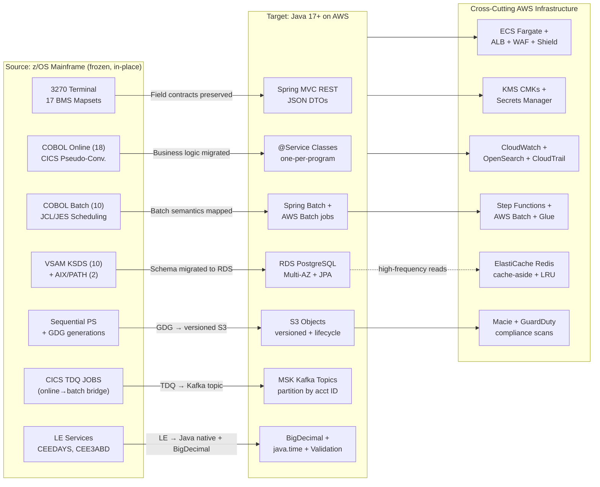

# 0. Agent Action Plan

## 0.1 Intent Clarification

This sub-section restates the user-specified refactoring objective in precise technical language, surfaces implicit requirements and hidden dependencies, and establishes the architectural transformation strategy that all downstream sections derive from.

### 0.1.1 Core Refactoring Objective

Based on the prompt, the Blitzy platform understands that the refactoring objective is to **migrate the AWS CardDemo mainframe COBOL application — comprising 28 COBOL programs, 28 shared copybooks, 17 BMS mapsets, 17 generated symbolic-map copybooks, 29 JCL job members, 9 ASCII seed-data fixtures, and 1 IDCAMS LISTCAT inventory — to a Java 17+ / Spring Boot 3.x application deployed on AWS-native managed services (ECS Fargate, RDS Multi-AZ for PostgreSQL, MSK, ElastiCache, AWS Batch, Step Functions, Glue, S3, KMS, Secrets Manager, WAF + Shield, Macie, CloudTrail, CloudWatch, and OpenSearch), with 100% financial business-logic fidelity and PCI-DSS compliance, demo-ready by May 20, 2026** \[docs/project-guide.md:§Project Status, [README.md](http://README.md):L33-L37\].

- **Refactoring Type:** Tech stack migration — mainframe-to-cloud modernization. The migration spans every architectural layer simultaneously: language (COBOL → Java 17+), persistence (VSAM KSDS/AIX/PATH and sequential PS files → RDS PostgreSQL Multi-AZ with Spring Data JPA), orchestration (JCL/JES → AWS Step Functions + AWS Batch), messaging (CICS TDQ → Amazon MSK/Kafka), caching (none → Amazon ElastiCache Redis), security (file-based plaintext credentials → AWS KMS + Secrets Manager + WAF + Shield + Macie), observability (none → CloudWatch + Container Insights + OpenSearch + CloudTrail + Spring Actuator), and runtime (z/OS mainframe LPAR → ECS Fargate behind ALB).
- **Target Repository:** Same repository (`blitzy-card-demo`). The Java/Spring Boot target lives alongside the preserved COBOL source tree. The existing `app/` subtree (containing `cbl/`, `cpy/`, `bms/`, `cpy-bms/`, `jcl/`, `data/`, `catlg/`) is **retained frozen** as the authoritative source of truth for behavioral parity validation \[app/cbl:`directory inspection`, app/cpy:`directory inspection`\]. New Java/infrastructure artifacts are introduced under new top-level paths (`src/`, `pom.xml`, `Dockerfile`, `docker-compose.yml`, `infrastructure/`).
- **Processing Modes:** The migration spans two execution paradigms identified in the source repository — 18 interactive CICS online programs (pseudo-conversational 3270 terminal screens prefixed `CO*`) and 10 batch programs (JES-scheduled jobs prefixed `CB*`) — both converging on a shared VSAM data persistence layer comprising 10 KSDS clusters plus 2 alternate-index (AIX/PATH) chains \[app/cbl:`folder summary`, app/jcl:`folder summary`, app/catlg/LISTCAT.txt:§VSAM Cluster Inventory\].

**Refactoring Goals (Enhanced Clarity):**

- Translate every `*.cbl`/`*.cob` program (28 programs across `app/cbl/`) to a Java `@Service` class with one-to-one program-to-service mapping, preserving every PROCEDURE DIVISION control-flow semantic including `PERFORM`, `PERFORM THRU`, `GO TO`, and `EVALUATE` nesting. WORKING-STORAGE variables become Java instance fields or `@Component`-scoped beans; PERFORM paragraphs become private Java methods on the corresponding service class.
- Convert every shared copybook (`.cpy`/`.CPY` under `app/cpy/`) into a Java JPA entity, DTO, or shared utility class. Every COBOL `PIC S9(n)V99` and `COMP-3` field maps to `java.math.BigDecimal` with `RoundingMode.HALF_EVEN` — zero `float`/`double` substitution for monetary values \[app/cpy/CVACT01Y.cpy:L7-L14, app/cpy/CVTRA05Y.cpy:L10\].
- Replace all VSAM/indexed/sequential file I/O with Spring Data JPA repositories (RDS for PostgreSQL Multi-AZ) for keyed access patterns, and with `S3OutputService` for what was previously sequential output (DALYREJS, SYSTRAN, TRANREPT GDG outputs).
- Convert all 29 JCL jobs (`app/jcl/*.jcl`/`*.JCL`) and the 3 sample build wrappers (`samples/jcl/*.jcl`) to AWS Step Functions state machines that orchestrate AWS Batch job definitions; provisioning jobs (IDCAMS DEFINE CLUSTER, IEBGENER, GDG bases) become Flyway migration scripts and S3 object lifecycle policies.
- Replace BMS 3270 terminal screen I/O (17 `.bms` mapsets + 17 symbolic-map `.CPY` copybooks) with REST API endpoints behind ALB, preserving every field contract and validation rule. CICS pseudo-conversational COMMAREA state (`COCOM01Y.cpy`) is replaced by stateless REST with JWT or ALB sticky sessions for stateful flows.
- Implement event-driven transaction pipelines via Amazon MSK Kafka topics (`transaction.posted`, `account.updated`, `ledger.balanced`) partitioned by account ID to guarantee per-account ordering.
- Implement cache-aside pattern via Amazon ElastiCache Redis for high-frequency account balance reads, with TTL aligned to transaction frequency and `allkeys-lru` eviction policy.
- Achieve PCI-DSS compliance through AWS KMS customer-managed keys (CMKs) for all data at rest (RDS, S3, ElastiCache, CloudWatch Logs), TLS 1.2+ in transit (ALB, MSK, RDS), AWS Secrets Manager for all credentials (no plaintext in `application.yml` or environment variables), AWS WAF + Shield on the ALB, and Amazon Macie continuous S3 scanning for PII/financial data leakage.
- Implement immutable audit trail via AWS CloudTrail and Amazon OpenSearch for indexed transaction logs and CloudTrail events, supporting fraud investigation and regulatory queries.
- Deploy as containerized Spring Boot services on ECS Fargate behind an Application Load Balancer with auto-scaling policies based on CPU and MSK consumer lag, with structured JSON logging (Logback + logstash-logback-encoder) shipped to CloudWatch Logs.

**Implicit Requirements Surfaced:**

- All COBOL `FILE STATUS` codes (e.g., `23` NOTFND, `22` DUPKEY) must map to typed Java exceptions (`RecordNotFoundException`, `DuplicateRecordException`) and consistent HTTP status responses via Spring `@ControllerAdvice` \[app/cbl/CBTRN02C.cbl:L29-L60 — FILE-STATUS clauses\].
- The CICS pseudo-conversational model (`RETURN TRANSID COMMAREA`) translates to stateless REST endpoints; the central `CARDDEMO-COMMAREA` defined in `COCOM01Y.cpy` becomes a JWT claim set plus per-request state.
- The sole online-to-batch bridge (`CORPT00C` → CICS TDQ JOBS queue → JES submission) translates to an MSK topic (`report.requested`) consumed by a Step Functions trigger that submits an AWS Batch job — preserving the asynchronous decoupling.
- `SYNCPOINT ROLLBACK` in `COACTUPC.cbl` (the only explicit multi-dataset transactional integrity mechanism in the source) maps to Spring `@Transactional(rollbackFor = Exception.class)` with appropriate isolation level (`READ_COMMITTED` or stronger as required by the business rule).
- Optimistic concurrency control patterns in `COACTUPC.cbl` and `COCRDUPC.cbl` (before/after image comparison on CICS `READ UPDATE`/`REWRITE`) map to JPA `@Version` annotations on `Account` and `Card` entities.
- DFSORT/IDCAMS REPRO utility operations in `COMBTRAN.jcl` (a pure utility stage with no COBOL program) become Spring Batch steps with Java `Comparator` plus bulk JPA inserts.
- Validation logic centralized in `CSLKPCDY.cpy` (NANPA area codes, US state/territory codes, ZIP-prefix combinations) and date validation in `CSUTLDPY.cpy`/`CSUTLDTC.cbl` (LE `CEEDAYS`-based) port to dedicated `ValidationService` and `DateValidationService` Java components.
- COBOL `ON SIZE ERROR` clauses on arithmetic statements must be replicated as explicit Java overflow checks (`try`/`catch ArithmeticException` or `MathContext` validation).
- COBOL `RETURN-CODE` and condition codes surfaced to downstream consumers must be preserved verbatim — error codes in CloudWatch/OpenSearch indexing must remain identical to source error codes.
- Plaintext password storage in the source `USRSEC` file (`CSUSR01Y.cpy`) must be upgraded to BCrypt hashing in the Java target — a deliberate security improvement within the scope of PCI-DSS compliance \[inferred from §1.1.4 Business Impact and Value Proposition\].
- AWS Secrets Manager dynamic secret rotation must occur without Spring Boot restart — requires Spring Cloud AWS Secrets Manager integration with `@RefreshScope` beans for `DataSource` and Kafka producer/consumer configurations.
- The 9 ASCII fixture files (`app/data/ASCII/*.txt`) serve as canonical golden test data for parallel-run output diffing during the cutover validation window.

### 0.1.2 Technical Interpretation

This refactoring translates to the following technical transformation strategy:

**Current Architecture → Target Architecture:**


```mermaid
graph LR
    subgraph Source["Source: z/OS Mainframe (frozen, in-place)"]
        S1["3270 Terminal<br/>17 BMS Mapsets"]
        S2["COBOL Online (18)<br/>CICS Pseudo-Conv."]
        S3["COBOL Batch (10)<br/>JCL/JES Scheduling"]
        S4["VSAM KSDS (10)<br/>+ AIX/PATH (2)"]
        S5["Sequential PS<br/>+ GDG generations"]
        S6["CICS TDQ JOBS<br/>(online→batch bridge)"]
        S7["LE Services<br/>CEEDAYS, CEE3ABD"]
    end

    subgraph Target["Target: Java 17+ on AWS"]
        T1["Spring MVC REST<br/>JSON DTOs"]
        T2["@Service Classes<br/>one-per-program"]
        T3["Spring Batch +<br/>AWS Batch jobs"]
        T4["RDS PostgreSQL<br/>Multi-AZ + JPA"]
        T5["S3 Objects<br/>versioned + lifecycle"]
        T6["MSK Kafka Topics<br/>partition by acct ID"]
        T7["BigDecimal +<br/>java.time + Validation"]
    end

    S1 -->|"Field contracts preserved"| T1
    S2 -->|"Business logic migrated"| T2
    S3 -->|"Batch semantics mapped"| T3
    S4 -->|"Schema migrated to RDS"| T4
    S5 -->|"GDG → versioned S3"| T5
    S6 -->|"TDQ → Kafka topic"| T6
    S7 -->|"LE → Java native + BigDecimal"| T7

    subgraph Infrastructure["Cross-Cutting AWS Infrastructure"]
        I1["ECS Fargate +<br/>ALB + WAF + Shield"]
        I2["KMS CMKs +<br/>Secrets Manager"]
        I3["CloudWatch +<br/>OpenSearch + CloudTrail"]
        I4["Step Functions +<br/>AWS Batch + Glue"]
        I5["ElastiCache Redis<br/>cache-aside + LRU"]
        I6["Macie + GuardDuty<br/>compliance scans"]
    end

    Target --> I1
    Target --> I2
    Target --> I3
    T3 --> I4
    T4 -.->|"high-frequency reads"| I5
    T5 --> I6
```

**Transformation Rules and Patterns:**

| Source Construct | Transformation Rule | Target Pattern |
| --- | --- | --- |
| COBOL DATA DIVISION (PIC, COMP-3, COMP, PIC S9(n)V99) | Exact decimal precision mapping | Java POJOs with java.math.BigDecimal + RoundingMode.HALF_EVEN — no float/double for any monetary field |
| COBOL PARAGRAPH / SECTION | Method extraction preserving control flow | Private methods on the corresponding @Service class |
| COPY / REPLACE directives | Shared module extraction | Shared DTOs, JPA entities, utility classes under src/main/java/com/awsm2/carddemo/domain/ and dto/ |
| WORKING-STORAGE SECTION | Field-level mapping | Java instance fields or @Component-scoped beans (depending on lifetime) |
| PROCEDURE DIVISION PERFORM | Method invocation | Java method call within the service class |
| PERFORM ... THRU ranges | Sequential method execution | Sequential private method calls preserving order |
| EVALUATE nesting | Switch/decision logic | Java switch expression or pattern matching |
| ON SIZE ERROR | Overflow detection | try/catch ArithmeticException or explicit range checks |
| VSAM KSDS with keyed access | Relational schema with JPA repositories | @Entity classes + JpaRepository<Entity, Key> interfaces |
| VSAM AIX/PATH (alternate indexes) | Secondary JPA query methods | Derived queries (findByXrefAcctId) or @Query annotations on alternate fields |
| CICS READ/WRITE/REWRITE/DELETE | Repository method calls | findById, save, delete on Spring Data JPA repositories |
| CICS STARTBR/READNEXT browse | Paged query | Spring Data Pageable + Page<T> return type |
| CICS XCTL / LINK | REST routing or service injection | HTTP redirect, dependency injection via @Autowired, or constructor injection |
| CICS SYNCPOINT / SYNCPOINT ROLLBACK | Declarative transaction boundary | @Transactional(rollbackFor = Exception.class) on service methods |
| Sequential file READ/WRITE | Object storage | Spring Batch ItemReader/ItemWriter against S3 via AWS SDK for Java v2 |
| GDG generations ((+1), (0)) | Versioned object storage | S3 versioned objects under s3://${S3_OUTPUT_BUCKET}/... with lifecycle policies |
| JCL STEP execution | AWS Step Functions Task state | Task state invoking AWS Batch SubmitJob or Lambda |
| JCL COND= condition codes | Step Functions Choice state | Choice state with branching based on prior job exit code |
| JCL parallel steps | Step Functions Parallel state | Parallel state for fan-out (e.g., CREASTMT + TRANREPT) |
| JCL job stream dependencies | State machine sequencing | Linear Task chain in Step Functions definition |
| BMS MAPSET / MAP / MDF field | REST DTO field | Java DTO class with Jakarta Bean Validation annotations |
| CICS COMMAREA | Stateless request context | JWT claim set + Spring Session or per-request DTO |
| CICS TDQ (transient data queue) | Kafka topic | MSK Kafka producer/consumer with idempotent producer + manual offset commit |
| DFSORT utility | Java sort | java.util.Comparator within a Spring Batch step |
| IDCAMS DEFINE CLUSTER | Schema migration | Flyway migration script (db/migration/V*.sql) |
| IDCAMS REPRO | Data load | Spring Batch ItemReader<>(File) → ItemWriter<>(JpaRepository) |
| IEBGENER | File copy | AWS SDK S3 copy operation |
| IEFBR14 | No-op step | Step Functions Pass state |
| LE CEEDAYS (date validation) | Native Java date validation | java.time.LocalDate.parse() with DateTimeFormatter |
| LE CEE3ABD (controlled abend) | Application exception | throw new CardDemoSystemException(reasonCode) |
| RACF user identity | IAM + JWT | AWS IAM roles for service-to-service; JWT for end-user identity |
| PROCEDURE DIVISION USING parameter | Method parameter | Java method parameter with explicit type and @Valid |
| File-status '23' (record not found) | Domain exception | RecordNotFoundException extends CardDemoException |
| File-status '22' (duplicate key) | Domain exception | DuplicateRecordException extends CardDemoException |
| Snapshot mismatch (optimistic lock conflict) | Domain exception | ConcurrentModificationException extends CardDemoException |

The architectural transformation is intentionally **layered and additive**: the COBOL source remains physically present in the repository under `app/` and is never edited, while the Java/Spring Boot target is introduced as a parallel implementation tree under new top-level paths (`src/`, `pom.xml`, `infrastructure/`). This preserves byte-accurate traceability between every source artifact and its target counterpart, supports the parallel-run validation strategy mandated by the user (run COBOL and Java systems simultaneously and diff outputs before cutover), and provides regulators and auditors with an unbroken provenance chain from each behavior in the live system back to its original COBOL paragraph.

## 0.2 Scope Boundaries

This sub-section declares the exhaustive set of files and folders that fall inside the refactor — both COBOL source artifacts that drive Java target generation and new artifacts that must be created — alongside an explicit, non-negotiable list of out-of-scope items derived from the user's "Do not touch" constraints.

### 0.2.1 Exhaustively In Scope

**COBOL source transformations** (source files preserved as REFERENCE; new Java targets created):

- `app/cbl/CO*.cbl` — 18 online CICS programs (account, card, transaction, billing, report, user admin, signon, menus, admin menu)
- `app/cbl/CB*.cbl` and `app/cbl/CB*.CBL` — 9 batch programs (account/card/customer/xref readers, transaction posting, interest, statement generator + file-service subroutine, transaction reports)
- `app/cbl/CSUTLDTC.cbl` — 1 reusable date-validation subprogram
- `app/cpy/*.cpy` and `app/cpy/*.CPY` — 28 shared copybooks (record layouts, COMMAREA, menus, screen text, abend areas, validation tables, CICS/BMS helper templates, report-line formats)

**BMS terminal screens** (source files preserved as REFERENCE; REST DTOs and OpenAPI schemas created):

- `app/bms/*.bms` — 17 BMS mapset source files
- `app/cpy-bms/*.CPY` — 17 generated symbolic-map copybooks

**JCL job streams** (source files preserved as REFERENCE; AWS Step Functions + AWS Batch definitions created):

- `app/jcl/*.jcl` and `app/jcl/*.JCL` — 29 JCL members (VSAM/GDG admin, CICS file open/close, CSD updates, batch business jobs, demo reads)
- `samples/jcl/*.jcl` — 3 sample build wrappers (BATCMP, BMSCMP, CICCMP) — replaced by Maven build + Docker image build + CI/CD workflows

**Seed data and reference data** (source files preserved as REFERENCE; Flyway migration scripts created):

- `app/data/ASCII/*.txt` — 9 ASCII fixture files used as canonical golden test data for parallel-run validation

**Repository metadata and documentation** (source files UPDATED in place):

- `README.md` — update sections to document the Java/Spring Boot/AWS target stack, build instructions, and Docker/LocalStack workflow
- `docs/index.md` — update landing-page summary
- `docs/project-guide.md` — update project status and target-stack references
- `docs/technical-specifications.md` — update technical contract with the new AWS-native target stack details
- `catalog-info.yaml` — update Backstage entity metadata to reflect Java 17+ and Spring Boot 3.x target
- `mkdocs.yml` — keep navigation; update only if new docs are added
- `diagrams/CARDDEMO-DataModel.drawio` — update or supplement with new target architecture data model
- `LICENSE`, `NOTICE`, `CONTRIBUTING.md`, `CODE_OF_CONDUCT.md` — review for any required updates (typically untouched)

**New Java / Spring Boot / Maven artifacts to be created** (CREATE):

- `pom.xml` — Maven build descriptor with Spring Boot 3.x, AWS SDK for Java v2, Spring Cloud AWS, Spring Kafka, Spring Data Redis, Flyway, JUnit 5, Mockito, Testcontainers, LocalStack-Java client
- `mvnw`, `mvnw.cmd`, `.mvn/wrapper/maven-wrapper.properties`, `.mvn/wrapper/maven-wrapper.jar` — Maven Wrapper
- `src/main/java/com/awsm2/carddemo/CardDemoApplication.java` — Spring Boot entry point
- `src/main/java/com/awsm2/carddemo/controller/*.java` — REST controllers (`AuthController`, `MenuController`, `AccountController`, `CardController`, `TransactionController`, `BillingController`, `ReportController`, `UserAdminController`)
- `src/main/java/com/awsm2/carddemo/service/*.java` — `@Service` classes (one per COBOL program: `TransactionService`, `AccountService`, `LedgerService`, `BillPaymentService`, `InterestCalculationService`, `StatementGenerationService`, `TransactionReportService`, `UserAdminService`, etc.)
- `src/main/java/com/awsm2/carddemo/repository/*.java` — Spring Data JPA repositories (`AccountRepository`, `CardRepository`, `CustomerRepository`, `CardCrossReferenceRepository`, `TransactionRepository`, `TransactionCategoryBalanceRepository`, `DisclosureGroupRepository`, `TransactionTypeRepository`, `TransactionCategoryRepository`, `UserSecurityRepository`, `DailyTransactionRepository`)
- `src/main/java/com/awsm2/carddemo/domain/*.java` — JPA `@Entity` classes (`Account`, `Card`, `Customer`, `CardCrossReference`, `Transaction`, `TransactionCategoryBalance`, `DisclosureGroup`, `TransactionType`, `TransactionCategory`, `UserSecurity`, `DailyTransaction`)
- `src/main/java/com/awsm2/carddemo/dto/*.java` — Request/response DTOs replacing BMS symbolic maps
- `src/main/java/com/awsm2/carddemo/adapter/*.java` — AWS service adapters (`S3OutputService`, `CacheService` for ElastiCache Redis, `AuditLogService` for CloudTrail + OpenSearch, `StepFunctionsOrchestrator`, `KafkaEventPublisher`, `SecretsManagerService`)
- `src/main/java/com/awsm2/carddemo/batch/*.java` — Spring Batch job/step/processor classes (`DailyTransactionPostingJob`, `InterestCalculationJob`, `CombineTransactionsJob`, `StatementGenerationJob`, `TransactionReportJob`) and `BatchJobConfig`
- `src/main/java/com/awsm2/carddemo/stepfunctions/*.java` — Step Functions orchestration helpers and ASL definition loaders
- `src/main/java/com/awsm2/carddemo/glue/*.java` — Glue job definitions (`GlueETLConfig`) and Spark-script references
- `src/main/java/com/awsm2/carddemo/exception/*.java` — Exception hierarchy (`CardDemoException`, `RecordNotFoundException`, `DuplicateRecordException`, `ConcurrentModificationException`, `CreditLimitExceededException`, `ExpiredCardException`, `ValidationException`, `OnSizeErrorException`)
- `src/main/java/com/awsm2/carddemo/config/*.java` — Spring `@Configuration` classes (`SecurityConfig`, `JpaConfig`, `KafkaConfig`, `RedisConfig`, `BatchConfig`, `OpenSearchConfig`, `CloudWatchConfig`, `SecretsManagerConfig`, `AwsSdkConfig`)
- `src/main/java/com/awsm2/carddemo/validation/*.java` — Validation services (`ValidationLookupService` porting `CSLKPCDY.cpy`, `DateValidationService` porting `CSUTLDPY.cpy` / `CSUTLDTC.cbl`)
- `src/main/java/com/awsm2/carddemo/security/*.java` — JWT provider, BCrypt encoder, authentication filter
- `src/main/resources/application.yml` — base Spring profile configuration (non-sensitive)
- `src/main/resources/application-local.yml`, `application-dev.yml`, `application-prod.yml` — environment-specific overlays
- `src/main/resources/logback-spring.xml` — Logback configuration with `logstash-logback-encoder` for structured JSON logging
- `src/main/resources/db/migration/V001__create_schema.sql` through `V0NN__seed_reference_data.sql` — Flyway migration scripts (one per VSAM cluster) for `Account`, `Card`, `Customer`, `CardCrossReference`, `Transaction`, `TransactionCategoryBalance`, `DisclosureGroup`, `TransactionType`, `TransactionCategory`, `UserSecurity`, `DailyTransaction`
- `src/main/resources/stepfunctions/eod-batch-pipeline.asl.json` — Step Functions state machine definition for the end-of-day pipeline (POSTTRAN → INTCALC → COMBTRAN → CREASTMT/TRANREPT)
- `src/test/java/com/awsm2/carddemo/**/*.java` — JUnit 5 unit tests, integration tests, and Spring Batch test harness
- `src/test/resources/golden/*.txt` — copies of `app/data/ASCII/*.txt` for golden-output diffing

**New infrastructure / deployment artifacts to be created** (CREATE):

- `Dockerfile` — multi-stage Docker build (Maven build stage + JRE runtime stage)
- `docker-compose.yml` — local development stack (Spring Boot app, PostgreSQL, LocalStack Pro for S3/SQS/Secrets Manager/KMS, Redis, Kafka)
- `infrastructure/terraform/*.tf` — Terraform definitions for ECS Fargate cluster + service, ALB + target groups + listeners, RDS Multi-AZ + parameter groups + subnet groups, ElastiCache Redis cluster, MSK cluster + topics, S3 buckets with SSE-KMS + lifecycle policies, AWS Batch compute environment + job queue + job definitions, Step Functions state machines, Glue jobs, KMS CMKs, Secrets Manager secrets + rotation Lambdas, WAF Web ACL + rules, Shield Advanced subscription (if configured), Macie session, CloudTrail organization-level trail, OpenSearch domain, CloudWatch log groups + alarms, ECR repository, IAM roles + policies for ECS task, Batch jobs, Step Functions, and Lambda
- `infrastructure/buildspec.yml` or `.github/workflows/*.yml` — CI/CD pipeline definitions (build, test, scan, push to ECR, ECS task definition update)
- `localstack/init/*.sh` — LocalStack initialization scripts (create local S3 buckets, MSK topics, Secrets Manager entries, KMS keys)

The above creates an exhaustive in-scope set covering 28 + 28 + 17 + 17 + 29 + 3 + 9 + 1 + 3 + 6 = **141 existing source artifacts** (preserved as REFERENCE), plus all Java/infrastructure CREATE/UPDATE targets enumerated in §0.4 (Transformation Mapping).

### 0.2.2 Explicitly Out of Scope

The following items are explicitly **out of scope** per the user's "Do not touch" constraints and other implicit constraints:

- **Upstream mainframe feeds and file formats** — until cutover is confirmed, the byte-level layout, encoding (EBCDIC where applicable), and delivery mechanism of any upstream feed remain unchanged. No producer-side schema modifications are made.
- **Regulatory reporting output formats** — the layout, byte offsets, delimiters, padding, and field semantics of any regulatory output file (transaction reports, statements, audit extracts) must remain **identical** byte-for-byte to the COBOL source's output. The Java generator may use different code paths but must emit the same bytes.
- **Database schemas shared with other non-refactored systems** — schemas referenced or written to by external (non-CardDemo) systems are not altered. If RDS migration introduces any change to a shared schema, that schema is **excluded** and remains on its current platform until those external systems migrate.
- **The COBOL source tree under** `app/` — `app/cbl/`, `app/cpy/`, `app/bms/`, `app/cpy-bms/`, `app/jcl/`, `app/catlg/`, `app/data/` are **preserved in place, frozen, and never edited or deleted**. They remain the authoritative source of truth for behavioral parity validation. They appear only as REFERENCE in transformation mappings.
- **All financial transaction business logic semantics** must be preserved exactly — debit, credit, transfer, reversal, end-of-day balancing, reconciliation routines. The refactor is structural (language, persistence, orchestration) and **must not change behavior**. The Minimal Change Clause forbids optimization or enhancement beyond what migration requires.
- **Audit trail content** — transaction IDs, timestamps, operator codes, and audit fields must continue to be emitted with the same values and semantics, now written to CloudTrail + OpenSearch instead of COBOL audit-trail writes.
- **Error codes and condition handling** — return codes and error messages surfaced to downstream consumers must be preserved verbatim. The Java exception hierarchy maps to but does not replace the original error code values.
- **Java optimization beyond migration necessities** — algorithmic improvements, micro-optimization of arithmetic, or replacement of equivalent control flows with "more idiomatic" Java are forbidden unless required to compile or correctly run on the target stack.
- **Sample build JCL execution mechanics in** `samples/jcl/*.jcl` — these files are documentation of the original mainframe build workflow and are preserved as REFERENCE; no attempt is made to actually execute them on the target stack. They are replaced operationally by the new Maven + Docker + CI/CD workflow.
- **The** `LICENSE` **(Apache 2.0) and** `NOTICE` **files** — unchanged.
- `CONTRIBUTING.md` **and** `CODE_OF_CONDUCT.md` — unchanged unless they reference target-stack specifics that conflict with the new stack.

Anything not explicitly listed in §0.2.1 Exhaustively In Scope and not contradicted by §0.2.2 Explicitly Out of Scope is implicitly out of scope for this refactor.

## 0.3 Target Design

This sub-section defines the complete target Java/Spring Boot project structure, the design patterns that govern the implementation, and the AWS service wiring that delivers the cloud-native runtime.

### 0.3.1 Refactored Structure Planning

The Java/Spring Boot target lives alongside the preserved COBOL source under `app/`. The complete target file and folder layout is:

```plaintext
/                                                   # repository root (preserved)
├── README.md                                       # UPDATE — target stack + build instructions
├── CONTRIBUTING.md                                 # preserved
├── CODE_OF_CONDUCT.md                              # preserved
├── LICENSE                                         # preserved (Apache 2.0)
├── NOTICE                                          # preserved
├── catalog-info.yaml                               # UPDATE — Java 17+ target metadata
├── mkdocs.yml                                      # preserved
├── pom.xml                                         # NEW — Maven build descriptor
├── mvnw, mvnw.cmd                                  # NEW — Maven Wrapper
├── .mvn/wrapper/                                   # NEW — Maven Wrapper resources
├── Dockerfile                                      # NEW — multi-stage Docker build
├── docker-compose.yml                              # NEW — local dev stack
├── .dockerignore, .gitignore                       # NEW
├── app/                                            # preserved (COBOL source, frozen)
│   ├── cbl/                                        # preserved (28 COBOL programs)
│   ├── cpy/                                        # preserved (28 copybooks)
│   ├── bms/                                        # preserved (17 BMS mapsets)
│   ├── cpy-bms/                                    # preserved (17 symbolic copybooks)
│   ├── jcl/                                        # preserved (29 JCL jobs)
│   ├── catlg/LISTCAT.txt                           # preserved (catalog inventory)
│   └── data/ASCII/                                 # preserved (9 ASCII fixtures)
├── samples/jcl/                                    # preserved (3 sample build wrappers)
├── diagrams/                                       # UPDATE — supplement with target architecture
│   ├── CARDDEMO-DataModel.drawio                   # UPDATE — extend with RDS schema
│   ├── target-architecture.drawio                  # NEW — AWS-native target diagram
│   ├── Admin-Menu.png, Main-Menu.png, ...          # preserved
│   └── Signon-Screen.png, Application-Flow-*.png   # preserved
├── docs/                                           # UPDATE
│   ├── index.md                                    # UPDATE — landing summary
│   ├── project-guide.md                            # UPDATE — Java 17+ status
│   └── technical-specifications.md                 # UPDATE — full target stack spec
├── src/                                            # NEW — Java/Spring Boot tree
│   ├── main/
│   │   ├── java/com/awsm2/carddemo/
│   │   │   ├── CardDemoApplication.java            # NEW — @SpringBootApplication entry
│   │   │   ├── controller/                         # NEW — REST controllers
│   │   │   │   ├── AuthController.java             # ← COSGN00C
│   │   │   │   ├── MenuController.java             # ← COMEN01C, COADM01C
│   │   │   │   ├── AccountController.java          # ← COACTVWC, COACTUPC
│   │   │   │   ├── CardController.java             # ← COCRDLIC, COCRDSLC, COCRDUPC
│   │   │   │   ├── TransactionController.java      # ← COTRN00C, COTRN01C, COTRN02C
│   │   │   │   ├── BillingController.java          # ← COBIL00C
│   │   │   │   ├── ReportController.java           # ← CORPT00C
│   │   │   │   └── UserAdminController.java        # ← COUSR00C-COUSR03C
│   │   │   ├── service/                            # NEW — one @Service per COBOL program
│   │   │   │   ├── SignonService.java
│   │   │   │   ├── MenuService.java
│   │   │   │   ├── AccountViewService.java
│   │   │   │   ├── AccountUpdateService.java
│   │   │   │   ├── CardListService.java
│   │   │   │   ├── CardDetailService.java
│   │   │   │   ├── CardUpdateService.java
│   │   │   │   ├── TransactionListService.java
│   │   │   │   ├── TransactionDetailService.java
│   │   │   │   ├── TransactionAddService.java
│   │   │   │   ├── BillPaymentService.java
│   │   │   │   ├── ReportSubmissionService.java
│   │   │   │   ├── UserListService.java
│   │   │   │   ├── UserAddService.java
│   │   │   │   ├── UserUpdateService.java
│   │   │   │   ├── UserDeleteService.java
│   │   │   │   ├── TransactionPostingService.java  # ← CBTRN01C, CBTRN02C, CBTRN03C
│   │   │   │   ├── InterestCalculationService.java # ← CBACT04C
│   │   │   │   ├── StatementGenerationService.java # ← CBSTM03A, CBSTM03B
│   │   │   │   ├── TransactionReportService.java   # ← CBTRN03C (report variant)
│   │   │   │   ├── LedgerService.java              # double-entry bookkeeping
│   │   │   │   ├── AccountFileReaderService.java   # ← CBACT01C
│   │   │   │   ├── CardFileReaderService.java      # ← CBACT02C
│   │   │   │   ├── XrefFileReaderService.java      # ← CBACT03C
│   │   │   │   └── CustomerFileReaderService.java  # ← CBCUS01C
│   │   │   ├── repository/                         # NEW — Spring Data JPA repos
│   │   │   │   ├── AccountRepository.java
│   │   │   │   ├── CardRepository.java
│   │   │   │   ├── CustomerRepository.java
│   │   │   │   ├── CardCrossReferenceRepository.java
│   │   │   │   ├── TransactionRepository.java
│   │   │   │   ├── TransactionCategoryBalanceRepository.java
│   │   │   │   ├── DisclosureGroupRepository.java
│   │   │   │   ├── TransactionTypeRepository.java
│   │   │   │   ├── TransactionCategoryRepository.java
│   │   │   │   ├── UserSecurityRepository.java
│   │   │   │   └── DailyTransactionRepository.java
│   │   │   ├── domain/                             # NEW — JPA @Entity classes
│   │   │   │   ├── Account.java                    # ← CVACT01Y.cpy (300 bytes)
│   │   │   │   ├── Card.java                       # ← CVACT02Y.cpy (150 bytes)
│   │   │   │   ├── Customer.java                   # ← CVCUS01Y.cpy/CUSTREC.cpy (500 bytes)
│   │   │   │   ├── CardCrossReference.java         # ← CVACT03Y.cpy (50 bytes)
│   │   │   │   ├── Transaction.java                # ← CVTRA05Y.cpy (350 bytes)
│   │   │   │   ├── TransactionCategoryBalance.java # ← CVTRA01Y.cpy
│   │   │   │   ├── DisclosureGroup.java            # ← CVTRA02Y.cpy
│   │   │   │   ├── TransactionType.java            # ← CVTRA03Y.cpy
│   │   │   │   ├── TransactionCategory.java        # ← CVTRA04Y.cpy
│   │   │   │   ├── UserSecurity.java               # ← CSUSR01Y.cpy (80 bytes)
│   │   │   │   └── DailyTransaction.java           # ← CVTRA06Y.cpy (350 bytes)
│   │   │   ├── dto/                                # NEW — Request/response DTOs (← BMS maps)
│   │   │   │   ├── SignonRequestDto.java           # ← COSGN00.bms
│   │   │   │   ├── AccountViewDto.java             # ← COACTVW.bms
│   │   │   │   ├── AccountUpdateDto.java           # ← COACTUP.bms
│   │   │   │   ├── CardListDto.java                # ← COCRDLI.bms
│   │   │   │   ├── CardDetailDto.java              # ← COCRDSL.bms
│   │   │   │   ├── CardUpdateDto.java              # ← COCRDUP.bms
│   │   │   │   ├── TransactionListDto.java         # ← COTRN00.bms
│   │   │   │   ├── TransactionDetailDto.java       # ← COTRN01.bms
│   │   │   │   ├── TransactionAddDto.java          # ← COTRN02.bms
│   │   │   │   ├── BillPaymentDto.java             # ← COBIL00.bms
│   │   │   │   ├── ReportRequestDto.java           # ← CORPT00.bms
│   │   │   │   ├── UserListDto.java                # ← COUSR00.bms
│   │   │   │   ├── UserAddDto.java                 # ← COUSR01.bms
│   │   │   │   ├── UserUpdateDto.java              # ← COUSR02.bms
│   │   │   │   ├── UserDeleteDto.java              # ← COUSR03.bms
│   │   │   │   ├── MenuOptionDto.java              # ← COMEN01.bms, COADM01.bms
│   │   │   │   └── ApiResponse.java                # generic envelope
│   │   │   ├── adapter/                            # NEW — AWS SDK isolation
│   │   │   │   ├── S3OutputService.java            # replaces sequential output
│   │   │   │   ├── CacheService.java               # ElastiCache Redis cache-aside
│   │   │   │   ├── AuditLogService.java            # CloudTrail + OpenSearch
│   │   │   │   ├── KafkaEventPublisher.java        # MSK Kafka producer
│   │   │   │   ├── KafkaEventConsumer.java         # MSK Kafka consumer
│   │   │   │   ├── StepFunctionsOrchestrator.java  # JCL job stream replacement
│   │   │   │   ├── SecretsManagerService.java      # Secrets Manager wrapper
│   │   │   │   └── OpenSearchIndexer.java          # OpenSearch indexer
│   │   │   ├── batch/                              # NEW — Spring Batch
│   │   │   │   ├── BatchJobConfig.java
│   │   │   │   ├── DailyTransactionPostingJob.java # ← POSTTRAN.jcl
│   │   │   │   ├── InterestCalculationJob.java     # ← INTCALC.jcl
│   │   │   │   ├── CombineTransactionsJob.java     # ← COMBTRAN.jcl
│   │   │   │   ├── StatementGenerationJob.java     # ← CREASTMT.JCL
│   │   │   │   ├── TransactionReportJob.java       # ← TRANREPT.jcl
│   │   │   │   └── reader/, writer/, processor/    # ItemReader/Writer/Processor impls
│   │   │   ├── glue/                               # NEW — AWS Glue ETL
│   │   │   │   └── GlueETLConfig.java
│   │   │   ├── exception/                          # NEW — domain exceptions
│   │   │   │   ├── CardDemoException.java          # base
│   │   │   │   ├── RecordNotFoundException.java
│   │   │   │   ├── DuplicateRecordException.java
│   │   │   │   ├── ConcurrentModificationException.java
│   │   │   │   ├── CreditLimitExceededException.java
│   │   │   │   ├── ExpiredCardException.java
│   │   │   │   ├── ValidationException.java
│   │   │   │   ├── OnSizeErrorException.java
│   │   │   │   └── GlobalExceptionHandler.java     # @ControllerAdvice
│   │   │   ├── config/                             # NEW — Spring @Configuration
│   │   │   │   ├── SecurityConfig.java             # JWT + BCrypt + WAF integration
│   │   │   │   ├── JpaConfig.java                  # @EnableJpaRepositories
│   │   │   │   ├── KafkaConfig.java                # MSK producer/consumer config
│   │   │   │   ├── RedisConfig.java                # ElastiCache Redis template
│   │   │   │   ├── BatchConfig.java                # Spring Batch + JobLauncher
│   │   │   │   ├── OpenSearchConfig.java           # OpenSearch REST client
│   │   │   │   ├── CloudWatchConfig.java           # Micrometer CloudWatch registry
│   │   │   │   ├── SecretsManagerConfig.java       # Secrets Manager + @RefreshScope
│   │   │   │   ├── AwsSdkConfig.java               # SDK v2 client beans
│   │   │   │   └── OpenApiConfig.java              # springdoc-openapi
│   │   │   ├── validation/                         # NEW — validation services
│   │   │   │   ├── ValidationLookupService.java    # ← CSLKPCDY.cpy
│   │   │   │   └── DateValidationService.java      # ← CSUTLDPY.cpy + CSUTLDTC.cbl
│   │   │   └── security/                           # NEW — security building blocks
│   │   │       ├── JwtTokenProvider.java
│   │   │       ├── JwtAuthenticationFilter.java
│   │   │       └── BCryptPasswordEncoderBean.java
│   │   └── resources/
│   │       ├── application.yml                     # base profile (non-sensitive)
│   │       ├── application-local.yml               # LocalStack-backed local config
│   │       ├── application-dev.yml
│   │       ├── application-prod.yml                # AWS-deployed profile
│   │       ├── logback-spring.xml                  # structured JSON logging
│   │       ├── stepfunctions/
│   │       │   └── eod-batch-pipeline.asl.json     # Step Functions state machine
│   │       └── db/migration/
│   │           ├── V001__create_account.sql
│   │           ├── V002__create_card.sql
│   │           ├── V003__create_customer.sql
│   │           ├── V004__create_cardxref.sql
│   │           ├── V005__create_transaction.sql
│   │           ├── V006__create_tcatbal.sql
│   │           ├── V007__create_disclosure_group.sql
│   │           ├── V008__create_transaction_type.sql
│   │           ├── V009__create_transaction_category.sql
│   │           ├── V010__create_user_security.sql
│   │           ├── V011__create_daily_transaction.sql
│   │           ├── V012__seed_disclosure_group.sql
│   │           ├── V013__seed_transaction_type.sql
│   │           ├── V014__seed_transaction_category.sql
│   │           └── V015__seed_default_users.sql
│   └── test/
│       ├── java/com/awsm2/carddemo/                # NEW — JUnit 5 + Mockito tests
│       │   ├── controller/                         # @WebMvcTest tests
│       │   ├── service/                            # unit tests
│       │   ├── repository/                         # @DataJpaTest with Testcontainers
│       │   ├── batch/                              # Spring Batch test harness
│       │   ├── adapter/                            # adapter tests vs. LocalStack
│       │   └── integration/                        # end-to-end with LocalStack
│       └── resources/
│           ├── application-test.yml
│           └── golden/                             # copies of app/data/ASCII/*.txt
├── infrastructure/                                 # NEW — IaC
│   ├── terraform/
│   │   ├── main.tf, variables.tf, outputs.tf
│   │   ├── ecs.tf                                  # ECS Fargate cluster + service
│   │   ├── alb.tf                                  # ALB + listener + target groups
│   │   ├── rds.tf                                  # RDS Multi-AZ + parameter group
│   │   ├── elasticache.tf                          # Redis cluster
│   │   ├── msk.tf                                  # MSK cluster + topics
│   │   ├── batch.tf                                # AWS Batch compute env + queue
│   │   ├── stepfunctions.tf                        # Step Functions state machine
│   │   ├── glue.tf                                 # Glue jobs
│   │   ├── s3.tf                                   # S3 buckets + lifecycle + SSE-KMS
│   │   ├── kms.tf                                  # CMKs
│   │   ├── secrets.tf                              # Secrets Manager + rotation
│   │   ├── waf.tf                                  # WAF Web ACL + rules
│   │   ├── shield.tf                               # Shield Advanced (optional)
│   │   ├── macie.tf                                # Macie session + S3 jobs
│   │   ├── cloudtrail.tf                           # Org-level trail
│   │   ├── opensearch.tf                           # OpenSearch domain
│   │   ├── cloudwatch.tf                           # log groups + alarms
│   │   ├── iam.tf                                  # roles + policies
│   │   └── ecr.tf                                  # ECR repository
│   └── README.md                                   # IaC usage
├── .github/workflows/                              # NEW — CI/CD
│   ├── build.yml                                   # mvn clean install + tests
│   ├── docker-build.yml                            # docker build + push to ECR
│   └── deploy.yml                                  # ECS task definition update
└── localstack/init/                                # NEW — LocalStack init
    ├── init-aws.sh                                 # create local S3 buckets, MSK topics
    └── secrets.json                                # local secrets seed
```

### 0.3.2 Web Search Research Conducted

The user prompt provides a comprehensive, specific, and authoritative target stack specification — every framework, AWS service, version range, and pattern is enumerated explicitly. Additional web research is therefore not required to define the target. Where verification of specific package versions or framework compatibility is needed during implementation (e.g., confirming that Spring Boot 3.x supports Java 17 baseline, that Spring Cloud AWS 3.x provides `@RefreshScope` for Secrets Manager, that AWS SDK for Java v2 is the current GA branch), implementation agents will perform targeted lookups against:

- The Spring Boot 3.x reference documentation for starter dependencies, configuration properties, and migration notes
- The Spring Cloud AWS 3.x reference documentation for Secrets Manager + Parameter Store integration and the `awspring.cloud.secretsmanager` property tree
- The AWS SDK for Java v2 documentation for client builder patterns, credential providers, and async vs. sync client selection
- The AWS Step Functions Amazon States Language (ASL) reference for `Task`, `Choice`, `Parallel`, `Map`, and `Catch` constructs
- The PostgreSQL documentation for Multi-AZ replication semantics, `Repeatable Read` vs. `Read Committed` isolation, and `pg_dump`/`pg_restore` migration tooling
- The Apache Kafka / MSK documentation for partitioner selection, `acks=all` + `enable.idempotence=true` configuration, and consumer offset commit strategies

For COBOL-to-Java translation patterns specifically (decimal precision, VSAM access modes, CICS pseudo-conversation, JCL orchestration), the user input enumerates the required transformation rules with sufficient specificity that no external pattern research is necessary.

### 0.3.3 Design Pattern Applications

The following enterprise design patterns govern the implementation. Each is selected to preserve a specific COBOL/CICS semantic in the Java/Spring Boot/AWS target:

| Pattern | Application | Rationale |
| --- | --- | --- |
| Layered Architecture | Controller → Service → Repository → Domain | Maps to the user's explicit "Layered architecture" directive; isolates concerns and supports testability |
| Domain-Driven Design | Account, Transaction, Ledger, Card, Customer aggregates with their own repositories and services | Matches the user's explicit "Domain-driven design for financial entities" directive |
| Repository | Spring Data JPA repositories replace VSAM file I/O | Type-safe data access with composite key support; maps READ/WRITE/REWRITE/DELETE to findById/save/delete |
| One Service per COBOL Program | One @Service class per .cbl/.CBL program | Required by user — "Isolate each COBOL program's logic in its own dedicated Java service class". Preserves traceability and audit-readiness |
| Adapter Pattern | All AWS SDK calls isolated in adapter/ package (S3OutputService, CacheService, AuditLogService, StepFunctionsOrchestrator, KafkaEventPublisher) | Required by user — "never inline AWS SDK calls in business logic". Enables LocalStack-backed testing |
| DTO | BMS symbolic maps become request/response DTOs with Jakarta Bean Validation | Decouples API contracts from persistence entities; supports OpenAPI generation |
| Event-Driven (Pub/Sub) | MSK Kafka topics (transaction.posted, account.updated, ledger.balanced) | Matches user directive "Event-driven transaction pipeline via Amazon MSK (Kafka) topics" |
| Cache-Aside | ElastiCache Redis with TTL aligned to transaction frequency | User directive — "ElastiCache (Redis) used for account balance caching — cache-aside pattern with TTL aligned to transaction frequency" |
| Orchestration (Saga) | AWS Step Functions state machines replace JCL job streams | User directive — "JCL job stream dependencies modeled as AWS Step Functions state machines" |
| Strategy | Multi-stage validation cascade in TransactionPostingService (cross-reference, account, credit limit, expiration) | Decomposes the COBOL CBTRN02C validation cascade into independently testable predicates |
| Template Method | StatementGenerationService for text/HTML variants | Captures the dual-format output of CBSTM03A.CBL without logic duplication |
| Optimistic Locking | JPA @Version on Account and Card entities | Replaces COBOL before/after image comparison in COACTUPC.cbl and COCRDUPC.cbl |
| Transactional Boundary | @Transactional(rollbackFor = Exception.class) on every multi-entity write method | Replaces CICS SYNCPOINT and SYNCPOINT ROLLBACK (only explicit instance: COACTUPC.cbl) |
| Exception Hierarchy | CardDemoException base + typed subclasses; @ControllerAdvice global handler | Required by user — "Map COBOL RETURN-CODE / condition codes to Spring exception hierarchy (@ControllerAdvice)" |
| Dependency Injection | Constructor injection for all @Service, @Repository, @Component, adapter, and config beans | Loose coupling required by user — "Dependency injection for loose coupling" |
| Externalized Configuration | AWS Secrets Manager + AWS Systems Manager Parameter Store + @RefreshScope | User directive — "All configuration externalized via AWS Secrets Manager and AWS Systems Manager Parameter Store" |
| Idempotent Producer / Consumer | Kafka producer with enable.idempotence=true, acks=all; consumer with manual offset commit | Required to guarantee per-account ordering on MSK topics |
| Health Check / Readiness Probe | Spring Actuator /actuator/health, /actuator/health/liveness, /actuator/health/readiness integrated with ECS health checks and ALB target group health checks | User directive — "Health endpoints via Spring Actuator integrated with ECS health checks and ALB target group health checks" |

### 0.3.4 User Interface Design

The user interface design is driven by the user's directive that **CICS-connected systems become REST endpoints via Spring MVC behind ALB**. The original 3270 terminal interface (17 BMS mapsets) is replaced by JSON REST APIs documented via OpenAPI/springdoc-openapi. Every BMS field contract — including length, type, validation rules (NANPA area codes, US state/territory codes, date formats), and red-highlight error feedback — is preserved as Jakarta Bean Validation annotations and standardized error responses.

Key UI/API design decisions:

- **REST endpoint inventory** (one endpoint or endpoint group per original CICS transaction):
  - `POST /api/auth/signin` — JWT-based sign-on (← `COSGN00C` / `COSGN00.bms`)
  - `GET /api/menu/main` — main menu options (← `COMEN01C` / `COMEN01.bms`)
  - `GET /api/menu/admin` — admin menu options (← `COADM01C` / `COADM01.bms`)
  - `GET /api/accounts/{id}` — account view (← `COACTVWC` / `COACTVW.bms`)
  - `PUT /api/accounts/{id}` — account update with optimistic lock (← `COACTUPC` / `COACTUP.bms`)
  - `GET /api/cards?account={id}&page={n}&size={s}` — paginated card list (← `COCRDLIC` / `COCRDLI.bms`)
  - `GET /api/cards/{cardNumber}` — card detail (← `COCRDSLC` / `COCRDSL.bms`)
  - `PUT /api/cards/{cardNumber}` — card update with optimistic lock (← `COCRDUPC` / `COCRDUP.bms`)
  - `GET /api/transactions?id={filter}&page={n}&size={s}` — paginated transaction list (← `COTRN00C` / `COTRN00.bms`)
  - `GET /api/transactions/{id}` — transaction detail (← `COTRN01C` / `COTRN01.bms`)
  - `POST /api/transactions` — transaction creation (← `COTRN02C` / `COTRN02.bms`)
  - `POST /api/billing/pay` — bill payment (← `COBIL00C` / `COBIL00.bms`)
  - `POST /api/reports/submit` — report submission (← `CORPT00C` / `CORPT00.bms`)
  - `GET /api/admin/users?search={q}&page={n}` — user list (← `COUSR00C` / `COUSR00.bms`)
  - `POST /api/admin/users` — user add with BCrypt password hashing (← `COUSR01C` / `COUSR01.bms`)
  - `PUT /api/admin/users/{id}` — user update (← `COUSR02C` / `COUSR02.bms`)
  - `DELETE /api/admin/users/{id}` — user delete (← `COUSR03C` / `COUSR03.bms`)
- **Session management:** JWT bearer tokens issued by `/api/auth/signin`; ALB sticky sessions (configured per user directive — "sticky sessions enabled for stateful flows") for any session-bound state that cannot be moved to JWT claims.
- **Stateful flow handling:** ALB sticky sessions are used for any flow that depends on prior CICS COMMAREA state across multiple requests (e.g., transaction add confirmation flow). For new flows, the recommended pattern is JWT claims plus per-request DTOs.
- **API documentation:** OpenAPI 3 generated by springdoc-openapi, served at `/api-docs` and `/swagger-ui.html` (gated by Spring Profile in production).
- **Error response shape:** Standardized JSON envelope (`{"code": "...", "message": "...", "fieldErrors": [...]}`) emitted by `GlobalExceptionHandler` for all domain exceptions; HTTP status codes mapped per REST conventions (`400` for validation, `404` for `RecordNotFoundException`, `409` for `DuplicateRecordException`/`ConcurrentModificationException`, `422` for `CreditLimitExceededException`/`ExpiredCardException`).
- **Visual rendering:** No client-side UI is in scope for this refactor — the BMS terminal screens are not re-implemented as a web UI. Consumers are downstream systems and future-phase client applications.
- **Operational dashboards:** CloudWatch Container Insights dashboards plus an OpenSearch Dashboards interface for transaction-log search and CloudTrail event review (no Grafana required, but compatible if configured).

## 0.4 Transformation Mapping

This sub-section documents the exhaustive file-by-file transformation plan. Every target file is mapped to its source file (or marked as net-new where no source equivalent exists). The transformation mode is one of UPDATE (modify in place), CREATE (new file), or REFERENCE (use the source as a pattern/contract without modifying it).

### 0.4.1 File-by-File Transformation Plan

#### Online COBOL Programs → Java Service + Controller Classes

Every online program (`app/cbl/CO*.cbl`) is **REFERENCED** (frozen, preserved as ground truth) and a dedicated Java `@Service` class plus a method on the corresponding `@RestController` is **CREATED**:

| Target File | Transformation | Source File | Key Changes |
| --- | --- | --- | --- |
| src/main/java/com/awsm2/carddemo/service/SignonService.java | CREATE | app/cbl/COSGN00C.cbl | Authenticate against UserSecurity JPA entity; issue JWT via JwtTokenProvider; route by USER-TYPE. Inline comment: // COBOL: COSGN00C |
| src/main/java/com/awsm2/carddemo/service/MenuService.java | CREATE | app/cbl/COMEN01C.cbl, app/cbl/COADM01C.cbl | Serve menu structure from COMEN02Y.cpy / COADM02Y.cpy literal-storage layouts |
| src/main/java/com/awsm2/carddemo/service/AccountViewService.java | CREATE | app/cbl/COACTVWC.cbl | Join Account + Customer + CardCrossReference JPA entities; use CardCrossReferenceRepository.findByXrefAcctId (replaces CXACAIX AIX) |
| src/main/java/com/awsm2/carddemo/service/AccountUpdateService.java | CREATE | app/cbl/COACTUPC.cbl | @Transactional(rollbackFor = Exception.class) wraps dual Account + Customer update; JPA @Version replaces before/after image; validation via ValidationLookupService |
| src/main/java/com/awsm2/carddemo/service/CardListService.java | CREATE | app/cbl/COCRDLIC.cbl | Pageable paginated query replaces CICS STARTBR/READNEXT; size=7 to match COCRDLI.bms page |
| src/main/java/com/awsm2/carddemo/service/CardDetailService.java | CREATE | app/cbl/COCRDSLC.cbl | Single findById keyed by card number |
| src/main/java/com/awsm2/carddemo/service/CardUpdateService.java | CREATE | app/cbl/COCRDUPC.cbl | @Version optimistic lock; @Transactional |
| src/main/java/com/awsm2/carddemo/service/TransactionListService.java | CREATE | app/cbl/COTRN00C.cbl | Paginated query (size=10); filter by transaction ID |
| src/main/java/com/awsm2/carddemo/service/TransactionDetailService.java | CREATE | app/cbl/COTRN01C.cbl | Single keyed findById |
| src/main/java/com/awsm2/carddemo/service/TransactionAddService.java | CREATE | app/cbl/COTRN02C.cbl | JPA sequence ID generation replaces browse-to-end pattern; XREF lookup via CardCrossReferenceRepository; publish transaction.posted to MSK |
| src/main/java/com/awsm2/carddemo/service/BillPaymentService.java | CREATE | app/cbl/COBIL00C.cbl | @Transactional-wrapped dual write (Account balance + Transaction); BigDecimal for TRAN-AMT; publish account.updated to MSK |
| src/main/java/com/awsm2/carddemo/service/ReportSubmissionService.java | CREATE | app/cbl/CORPT00C.cbl | Publish report.requested to MSK; Step Functions trigger consumes |
| src/main/java/com/awsm2/carddemo/service/UserListService.java | CREATE | app/cbl/COUSR00C.cbl | Paginated UserSecurity query |
| src/main/java/com/awsm2/carddemo/service/UserAddService.java | CREATE | app/cbl/COUSR01C.cbl | BCrypt-hash password before save |
| src/main/java/com/awsm2/carddemo/service/UserUpdateService.java | CREATE | app/cbl/COUSR02C.cbl | Re-hash on password change |
| src/main/java/com/awsm2/carddemo/service/UserDeleteService.java | CREATE | app/cbl/COUSR03C.cbl | Confirmation-then-delete |
| src/main/java/com/awsm2/carddemo/controller/AuthController.java | CREATE | app/cbl/COSGN00C.cbl | POST /api/auth/signin |
| src/main/java/com/awsm2/carddemo/controller/MenuController.java | CREATE | app/cbl/COMEN01C.cbl, app/cbl/COADM01C.cbl | GET /api/menu/main, GET /api/menu/admin |
| src/main/java/com/awsm2/carddemo/controller/AccountController.java | CREATE | app/cbl/COACTVWC.cbl, app/cbl/COACTUPC.cbl | GET /api/accounts/{id}, PUT /api/accounts/{id} |
| src/main/java/com/awsm2/carddemo/controller/CardController.java | CREATE | app/cbl/COCRDLIC.cbl, app/cbl/COCRDSLC.cbl, app/cbl/COCRDUPC.cbl | GET /api/cards, GET /api/cards/{n}, PUT /api/cards/{n} |
| src/main/java/com/awsm2/carddemo/controller/TransactionController.java | CREATE | app/cbl/COTRN00C.cbl, app/cbl/COTRN01C.cbl, app/cbl/COTRN02C.cbl | GET/POST /api/transactions[/{id}] |
| src/main/java/com/awsm2/carddemo/controller/BillingController.java | CREATE | app/cbl/COBIL00C.cbl | POST /api/billing/pay |
| src/main/java/com/awsm2/carddemo/controller/ReportController.java | CREATE | app/cbl/CORPT00C.cbl | POST /api/reports/submit |
| src/main/java/com/awsm2/carddemo/controller/UserAdminController.java | CREATE | app/cbl/COUSR00C.cbl - app/cbl/COUSR03C.cbl | GET/POST/PUT/DELETE /api/admin/users[/{id}] |
| app/cbl/CO*.cbl (all 18) | REFERENCE | — | Preserved frozen; never edited |

#### Batch COBOL Programs → Spring Batch Job + Service Classes

| Target File | Transformation | Source File | Key Changes |
| --- | --- | --- | --- |
| src/main/java/com/awsm2/carddemo/service/AccountFileReaderService.java | CREATE | app/cbl/CBACT01C.cbl | JPA scan of Account table; emits records to log/audit |
| src/main/java/com/awsm2/carddemo/service/CardFileReaderService.java | CREATE | app/cbl/CBACT02C.cbl | JPA scan of Card table |
| src/main/java/com/awsm2/carddemo/service/XrefFileReaderService.java | CREATE | app/cbl/CBACT03C.cbl | JPA scan of CardCrossReference |
| src/main/java/com/awsm2/carddemo/service/CustomerFileReaderService.java | CREATE | app/cbl/CBCUS01C.cbl | JPA scan of Customer |
| src/main/java/com/awsm2/carddemo/service/InterestCalculationService.java | CREATE | app/cbl/CBACT04C.cbl | BigDecimal.multiply().divide(BigDecimal.valueOf(1200), 2, RoundingMode.HALF_EVEN); lookup against DisclosureGroup with DEFAULT fallback; updates Account balance and emits Transaction records |
| src/main/java/com/awsm2/carddemo/service/TransactionPostingService.java | CREATE | app/cbl/CBTRN01C.cbl, app/cbl/CBTRN02C.cbl, app/cbl/CBTRN03C.cbl | 4-stage validation cascade (XREF / Account / Credit limit / Card expiration); rejects written to S3 via S3OutputService; reject codes 100-109 preserved |
| src/main/java/com/awsm2/carddemo/service/StatementGenerationService.java | CREATE | app/cbl/CBSTM03A.CBL, app/cbl/CBSTM03B.CBL | Template Method for text/HTML variants; output to S3 via S3OutputService |
| src/main/java/com/awsm2/carddemo/service/TransactionReportService.java | CREATE | app/cbl/CBTRN03C.cbl (report variant) | Date-window filter; join with TransactionType, TransactionCategory, CardCrossReference; output to S3 |
| src/main/java/com/awsm2/carddemo/validation/DateValidationService.java | CREATE | app/cbl/CSUTLDTC.cbl, app/cpy/CSUTLDPY.cpy, app/cpy/CSUTLDWY.cpy | Native java.time.LocalDate.parse replaces LE CEEDAYS; leap-year + month/day + future-date checks preserved |
| src/main/java/com/awsm2/carddemo/batch/DailyTransactionPostingJob.java | CREATE | app/cbl/CBTRN02C.cbl, app/jcl/POSTTRAN.jcl | Spring Batch job: read DALYTRAN (S3 or staging table) → TransactionPostingProcessor → write Transaction + Account + TransactionCategoryBalance |
| src/main/java/com/awsm2/carddemo/batch/InterestCalculationJob.java | CREATE | app/cbl/CBACT04C.cbl, app/jcl/INTCALC.jcl | Spring Batch job invoking InterestCalculationService |
| src/main/java/com/awsm2/carddemo/batch/CombineTransactionsJob.java | CREATE | app/jcl/COMBTRAN.jcl | Java Comparator-based sort + bulk JPA insert; no COBOL source (pure utility) |
| src/main/java/com/awsm2/carddemo/batch/StatementGenerationJob.java | CREATE | app/cbl/CBSTM03A.CBL, app/cbl/CBSTM03B.CBL, app/jcl/CREASTMT.JCL | Spring Batch job invoking StatementGenerationService |
| src/main/java/com/awsm2/carddemo/batch/TransactionReportJob.java | CREATE | app/cbl/CBTRN03C.cbl, app/jcl/TRANREPT.jcl | Spring Batch job invoking TransactionReportService |
| src/main/java/com/awsm2/carddemo/batch/BatchJobConfig.java | CREATE | — | @EnableBatchProcessing, JobLauncher, JobRepository configuration |
| app/cbl/CB*.cbl, app/cbl/CB*.CBL, app/cbl/CSUTLDTC.cbl (all 10) | REFERENCE | — | Preserved frozen; never edited |

#### JCL Jobs → Step Functions State Machines + AWS Batch Job Definitions

| Target File | Transformation | Source File | Key Changes |
| --- | --- | --- | --- |
| src/main/resources/stepfunctions/eod-batch-pipeline.asl.json | CREATE | app/jcl/POSTTRAN.jcl, app/jcl/INTCALC.jcl, app/jcl/COMBTRAN.jcl, app/jcl/CREASTMT.JCL, app/jcl/TRANREPT.jcl | Step Functions ASL definition with linear chain of Task states (POSTTRAN → INTCALC → COMBTRAN → Parallel { CREASTMT, TRANREPT }) plus Catch and Retry policies |
| src/main/resources/stepfunctions/file-provisioning.asl.json | CREATE | app/jcl/ACCTFILE.jcl, app/jcl/CARDFILE.jcl, app/jcl/CUSTFILE.jcl, app/jcl/XREFFILE.jcl, app/jcl/TRANFILE.jcl, app/jcl/DISCGRP.jcl, app/jcl/TCATBALF.jcl, app/jcl/TRANCATG.jcl, app/jcl/TRANTYPE.jcl, app/jcl/DUSRSECJ.jcl, app/jcl/DEFCUST.jcl | Provisioning workflow that loads seed data via Flyway migrations + S3 → RDS bulk-load Glue jobs |
| infrastructure/terraform/batch.tf | CREATE | app/jcl/POSTTRAN.jcl, app/jcl/INTCALC.jcl, app/jcl/COMBTRAN.jcl, app/jcl/CREASTMT.JCL, app/jcl/TRANREPT.jcl, app/jcl/PRTCATBL.jcl | AWS Batch compute environment + job queue + 6 job definitions wrapping the Spring Batch jars |
| src/main/resources/db/migration/V001__create_account.sql | CREATE | app/jcl/ACCTFILE.jcl, app/cpy/CVACT01Y.cpy | Flyway schema for Account (300-byte mapping → relational columns); replaces IDCAMS DEFINE CLUSTER |
| src/main/resources/db/migration/V002__create_card.sql | CREATE | app/jcl/CARDFILE.jcl, app/cpy/CVACT02Y.cpy | Flyway schema for Card |
| src/main/resources/db/migration/V003__create_customer.sql | CREATE | app/jcl/CUSTFILE.jcl, app/cpy/CVCUS01Y.cpy, app/cpy/CUSTREC.cpy | Flyway schema for Customer |
| src/main/resources/db/migration/V004__create_cardxref.sql | CREATE | app/jcl/XREFFILE.jcl, app/cpy/CVACT03Y.cpy | Flyway schema for CardCrossReference; index on XREF-ACCT-ID replaces CXACAIX AIX |
| src/main/resources/db/migration/V005__create_transaction.sql | CREATE | app/jcl/TRANFILE.jcl, app/cpy/CVTRA05Y.cpy | Flyway schema for Transaction; index on (TRAN-CARD-NUM, TRAN-PROC-TS) replaces TRANSACT AIX |
| src/main/resources/db/migration/V006__create_tcatbal.sql | CREATE | app/jcl/TCATBALF.jcl, app/cpy/CVTRA01Y.cpy | Flyway schema for TransactionCategoryBalance |
| src/main/resources/db/migration/V007__create_disclosure_group.sql | CREATE | app/jcl/DISCGRP.jcl, app/cpy/CVTRA02Y.cpy | Flyway schema for DisclosureGroup |
| src/main/resources/db/migration/V008__create_transaction_type.sql | CREATE | app/jcl/TRANTYPE.jcl, app/cpy/CVTRA03Y.cpy | Flyway schema for TransactionType |
| src/main/resources/db/migration/V009__create_transaction_category.sql | CREATE | app/jcl/TRANCATG.jcl, app/cpy/CVTRA04Y.cpy | Flyway schema for TransactionCategory |
| src/main/resources/db/migration/V010__create_user_security.sql | CREATE | app/jcl/DUSRSECJ.jcl, app/cpy/CSUSR01Y.cpy | Flyway schema for UserSecurity |
| src/main/resources/db/migration/V011__create_daily_transaction.sql | CREATE | app/cpy/CVTRA06Y.cpy | Flyway schema for DailyTransaction (staging) |
| src/main/resources/db/migration/V012__seed_disclosure_group.sql | CREATE | app/data/ASCII/discgrp.txt, app/jcl/DISCGRP.jcl | Load 51 disclosure-group rules including DEFAULT and ZEROAPR |
| src/main/resources/db/migration/V013__seed_transaction_type.sql | CREATE | app/data/ASCII/trantype.txt, app/jcl/TRANTYPE.jcl | Load 7 transaction types |
| src/main/resources/db/migration/V014__seed_transaction_category.sql | CREATE | app/data/ASCII/trancatg.txt, app/jcl/TRANCATG.jcl | Load 18 transaction categories |
| src/main/resources/db/migration/V015__seed_default_users.sql | CREATE | app/jcl/DUSRSECJ.jcl | Seed ADMIN001 and USER0001 with BCrypt-hashed default passwords |
| infrastructure/terraform/glue.tf | CREATE | app/jcl/REPTFILE.jcl, app/jcl/DALYREJS.jcl, app/jcl/DEFGDGB.jcl | Glue jobs for ETL flows replacing GDG-driven flat-file pipelines |
| infrastructure/terraform/s3.tf | CREATE | app/jcl/POSTTRAN.jcl (DALYREJS DD), app/jcl/INTCALC.jcl (SYSTRAN DD), app/jcl/TRANREPT.jcl (TRANREPT DD), app/jcl/CREASTMT.JCL (STMTFILE DD), app/jcl/TRANBKP.jcl (TRANSACT.BKUP) | S3 buckets with SSE-KMS, versioning, lifecycle policies replacing GDG generations |
| app/jcl/*.jcl, app/jcl/*.JCL (all 29) | REFERENCE | — | Preserved frozen; never edited |
| app/jcl/CLOSEFIL.jcl, app/jcl/OPENFIL.jcl, app/jcl/CBADMCDJ.jcl | REFERENCE | — | CICS file/CSD admin — no target (ECS task definition updates replace CICS NEWCOPY operationally) |
| app/jcl/READACCT.jcl, app/jcl/READCARD.jcl, app/jcl/READCUST.jcl, app/jcl/READXREF.jcl | REFERENCE | — | Demo/inspection JCLs — replaced operationally by Spring Boot Actuator endpoints + AWS Batch ad-hoc jobs |
| samples/jcl/BATCMP.jcl, samples/jcl/BMSCMP.jcl, samples/jcl/CICCMP.jcl | REFERENCE | — | Build wrapper JCLs — replaced by Maven build + Docker build + CI/CD workflows |

#### Copybooks → JPA Entities, DTOs, and Utility Classes

| Target File | Transformation | Source File | Key Changes |
| --- | --- | --- | --- |
| src/main/java/com/awsm2/carddemo/domain/Account.java | CREATE | app/cpy/CVACT01Y.cpy | JPA @Entity; 300-byte mapping; BigDecimal for ACCT-CURR-BAL, ACCT-CREDIT-LIMIT, ACCT-CASH-CREDIT-LIMIT, ACCT-CURR-CYC-CREDIT, ACCT-CURR-CYC-DEBIT; @Version for optimistic locking |
| src/main/java/com/awsm2/carddemo/domain/Card.java | CREATE | app/cpy/CVACT02Y.cpy | JPA @Entity; 150-byte mapping; @Version for optimistic locking |
| src/main/java/com/awsm2/carddemo/domain/Customer.java | CREATE | app/cpy/CVCUS01Y.cpy, app/cpy/CUSTREC.cpy | JPA @Entity; 500-byte mapping (both copybooks have identical layouts) |
| src/main/java/com/awsm2/carddemo/domain/CardCrossReference.java | CREATE | app/cpy/CVACT03Y.cpy | JPA @Entity; 50-byte mapping; index on XREF-ACCT-ID |
| src/main/java/com/awsm2/carddemo/domain/Transaction.java | CREATE | app/cpy/CVTRA05Y.cpy | JPA @Entity; 350-byte mapping; BigDecimal for TRAN-AMT (PIC S9(09)V99); indexes for AIX equivalents |
| src/main/java/com/awsm2/carddemo/domain/DailyTransaction.java | CREATE | app/cpy/CVTRA06Y.cpy | JPA @Entity for the staging table (same layout as Transaction per source copybooks) |
| src/main/java/com/awsm2/carddemo/domain/TransactionCategoryBalance.java | CREATE | app/cpy/CVTRA01Y.cpy | JPA @Entity with composite key |
| src/main/java/com/awsm2/carddemo/domain/DisclosureGroup.java | CREATE | app/cpy/CVTRA02Y.cpy | JPA @Entity; lookup with DEFAULT fallback |
| src/main/java/com/awsm2/carddemo/domain/TransactionType.java | CREATE | app/cpy/CVTRA03Y.cpy | JPA @Entity |
| src/main/java/com/awsm2/carddemo/domain/TransactionCategory.java | CREATE | app/cpy/CVTRA04Y.cpy | JPA @Entity |
| src/main/java/com/awsm2/carddemo/domain/UserSecurity.java | CREATE | app/cpy/CSUSR01Y.cpy | JPA @Entity; 80-byte mapping; password stored as BCrypt hash (security upgrade) |
| src/main/java/com/awsm2/carddemo/dto/CommonContextDto.java | CREATE | app/cpy/COCOM01Y.cpy | Replaces CICS COMMAREA; carried via JWT claims + per-request DTO |
| src/main/java/com/awsm2/carddemo/dto/MenuOptionDto.java | CREATE | app/cpy/COMEN02Y.cpy, app/cpy/COADM02Y.cpy | Menu option DTO with target program identifier |
| src/main/java/com/awsm2/carddemo/dto/StatementTransactionDto.java | CREATE | app/cpy/COSTM01.CPY | Flattened reporting transaction layout for statement generation |
| src/main/java/com/awsm2/carddemo/dto/CardWorkAreasDto.java | CREATE | app/cpy/CVCRD01Y.cpy | Reusable work-area DTO (AID/PF-key flags, message buffers, identifier fields) |
| src/main/java/com/awsm2/carddemo/dto/DateTimeWorkAreaDto.java | CREATE | app/cpy/CSDAT01Y.cpy | Date/time/timestamp working storage |
| src/main/java/com/awsm2/carddemo/dto/ReportLineDto.java | CREATE | app/cpy/CVTRA07Y.cpy | Printable report line layouts (headers, details, separators, totals) |
| src/main/java/com/awsm2/carddemo/dto/AbendDataDto.java | CREATE | app/cpy/CSMSG02Y.cpy | Abend code/culprit/reason structure used by exception handling |
| src/main/java/com/awsm2/carddemo/validation/ValidationLookupService.java | CREATE | app/cpy/CSLKPCDY.cpy | NANPA area codes, US state/territory abbreviations, valid state/ZIP-prefix combinations |
| src/main/java/com/awsm2/carddemo/validation/DateValidationService.java | CREATE | app/cpy/CSUTLDPY.cpy, app/cpy/CSUTLDWY.cpy, app/cbl/CSUTLDTC.cbl | Date validation with java.time replacing LE CEEDAYS |
| src/main/java/com/awsm2/carddemo/util/AppMessages.java | CREATE | app/cpy/CSMSG01Y.cpy, app/cpy/COTTL01Y.cpy | User message and title constants |
| src/main/java/com/awsm2/carddemo/util/AidKeyHelper.java | CREATE | app/cpy/CSSTRPFY.cpy | PF-key normalization (replaced operationally by REST request headers but preserved for documentation parity) |
| src/main/java/com/awsm2/carddemo/util/FieldStylingHelper.java | CREATE | app/cpy/CSSETATY.cpy | Field highlight/error attribute helpers (informational — no terminal output in REST world) |
| app/cpy/UNUSED1Y.cpy | REFERENCE | — | Reserved/unused 80-byte layout — no Java equivalent generated |
| app/cpy/*.cpy, app/cpy/*.CPY (all 28) | REFERENCE | — | Preserved frozen; never edited |

#### BMS Mapsets and Symbolic Maps → REST DTOs

Every BMS mapset (`app/bms/*.bms`) and its generated symbolic map (`app/cpy-bms/*.CPY`) is **REFERENCED** as the field contract for the corresponding REST DTO:

| Target File | Transformation | Source File | Key Changes |
| --- | --- | --- | --- |
| src/main/java/com/awsm2/carddemo/dto/SignonRequestDto.java, SignonResponseDto.java | CREATE | app/bms/COSGN00.bms, app/cpy-bms/COSGN00.CPY | JSON request/response replacing 3270 signon screen; @Size/@NotBlank Jakarta validation |
| src/main/java/com/awsm2/carddemo/dto/AccountViewDto.java | CREATE | app/bms/COACTVW.bms, app/cpy-bms/COACTVW.CPY | Account inquiry response DTO |
| src/main/java/com/awsm2/carddemo/dto/AccountUpdateDto.java | CREATE | app/bms/COACTUP.bms, app/cpy-bms/COACTUP.CPY | Account maintenance request DTO with full validation set |
| src/main/java/com/awsm2/carddemo/dto/CardListDto.java | CREATE | app/bms/COCRDLI.bms, app/cpy-bms/COCRDLI.CPY | Card list response with paging |
| src/main/java/com/awsm2/carddemo/dto/CardDetailDto.java | CREATE | app/bms/COCRDSL.bms, app/cpy-bms/COCRDSL.CPY | Card detail response |
| src/main/java/com/awsm2/carddemo/dto/CardUpdateDto.java | CREATE | app/bms/COCRDUP.bms, app/cpy-bms/COCRDUP.CPY | Card update request |
| src/main/java/com/awsm2/carddemo/dto/TransactionListDto.java | CREATE | app/bms/COTRN00.bms, app/cpy-bms/COTRN00.CPY | Transaction list (10 rows/page) |
| src/main/java/com/awsm2/carddemo/dto/TransactionDetailDto.java | CREATE | app/bms/COTRN01.bms, app/cpy-bms/COTRN01.CPY | Transaction detail |
| src/main/java/com/awsm2/carddemo/dto/TransactionAddDto.java | CREATE | app/bms/COTRN02.bms, app/cpy-bms/COTRN02.CPY | Transaction add request |
| src/main/java/com/awsm2/carddemo/dto/BillPaymentDto.java | CREATE | app/bms/COBIL00.bms, app/cpy-bms/COBIL00.CPY | Bill payment confirmation |
| src/main/java/com/awsm2/carddemo/dto/ReportRequestDto.java | CREATE | app/bms/CORPT00.bms, app/cpy-bms/CORPT00.CPY | Report request (monthly/yearly/custom date) |
| src/main/java/com/awsm2/carddemo/dto/UserListDto.java | CREATE | app/bms/COUSR00.bms, app/cpy-bms/COUSR00.CPY | User list |
| src/main/java/com/awsm2/carddemo/dto/UserAddDto.java | CREATE | app/bms/COUSR01.bms, app/cpy-bms/COUSR01.CPY | User add |
| src/main/java/com/awsm2/carddemo/dto/UserUpdateDto.java | CREATE | app/bms/COUSR02.bms, app/cpy-bms/COUSR02.CPY | User update |
| src/main/java/com/awsm2/carddemo/dto/UserDeleteDto.java | CREATE | app/bms/COUSR03.bms, app/cpy-bms/COUSR03.CPY | User delete |
| src/main/java/com/awsm2/carddemo/dto/MainMenuDto.java | CREATE | app/bms/COMEN01.bms, app/cpy-bms/COMEN01.CPY | Main menu options |
| src/main/java/com/awsm2/carddemo/dto/AdminMenuDto.java | CREATE | app/bms/COADM01.bms, app/cpy-bms/COADM01.CPY | Admin menu options |
| app/bms/*.bms (all 17), app/cpy-bms/*.CPY (all 17) | REFERENCE | — | Preserved frozen; never edited |

#### Repository, Adapter, Exception, and Config Classes

| Target File | Transformation | Source File | Key Changes |
| --- | --- | --- | --- |
| src/main/java/com/awsm2/carddemo/repository/AccountRepository.java | CREATE | app/cpy/CVACT01Y.cpy, app/cbl/COACTVWC.cbl, app/cbl/COACTUPC.cbl | JpaRepository<Account, Long> |
| src/main/java/com/awsm2/carddemo/repository/CardRepository.java | CREATE | app/cpy/CVACT02Y.cpy, app/cbl/COCRDLIC.cbl | JpaRepository<Card, String>; paged queries |
| src/main/java/com/awsm2/carddemo/repository/CustomerRepository.java | CREATE | app/cpy/CVCUS01Y.cpy, app/cbl/COACTVWC.cbl | JpaRepository<Customer, Long> |
| src/main/java/com/awsm2/carddemo/repository/CardCrossReferenceRepository.java | CREATE | app/cpy/CVACT03Y.cpy, app/cbl/COTRN02C.cbl, app/cbl/CBTRN02C.cbl | findByXrefAcctId derived query replaces CXACAIX AIX |
| src/main/java/com/awsm2/carddemo/repository/TransactionRepository.java | CREATE | app/cpy/CVTRA05Y.cpy, app/cbl/COTRN00C.cbl, app/cbl/CBTRN02C.cbl | Paged queries; derived queries on alternate keys |
| src/main/java/com/awsm2/carddemo/repository/TransactionCategoryBalanceRepository.java | CREATE | app/cpy/CVTRA01Y.cpy, app/cbl/CBACT04C.cbl | JpaRepository with composite key |
| src/main/java/com/awsm2/carddemo/repository/DisclosureGroupRepository.java | CREATE | app/cpy/CVTRA02Y.cpy, app/cbl/CBACT04C.cbl | JpaRepository; supports DEFAULT fallback lookup |
| src/main/java/com/awsm2/carddemo/repository/TransactionTypeRepository.java | CREATE | app/cpy/CVTRA03Y.cpy | JpaRepository |
| src/main/java/com/awsm2/carddemo/repository/TransactionCategoryRepository.java | CREATE | app/cpy/CVTRA04Y.cpy | JpaRepository |
| src/main/java/com/awsm2/carddemo/repository/UserSecurityRepository.java | CREATE | app/cpy/CSUSR01Y.cpy, app/cbl/COSGN00C.cbl, app/cbl/COUSR00C.cbl - COUSR03C.cbl | JpaRepository<UserSecurity, String> |
| src/main/java/com/awsm2/carddemo/repository/DailyTransactionRepository.java | CREATE | app/cpy/CVTRA06Y.cpy, app/cbl/CBTRN01C.cbl, app/cbl/CBTRN02C.cbl | JpaRepository for staging table |
| src/main/java/com/awsm2/carddemo/adapter/S3OutputService.java | CREATE | app/jcl/POSTTRAN.jcl (DALYREJS DD), app/jcl/INTCALC.jcl (SYSTRAN DD), app/jcl/TRANREPT.jcl, app/jcl/CREASTMT.JCL | Replaces COBOL sequential file WRITE; uses AWS SDK v2 S3Client; S3Object with SSE-KMS |
| src/main/java/com/awsm2/carddemo/adapter/CacheService.java | CREATE | — | ElastiCache Redis cache-aside via RedisTemplate / Spring Cache abstraction; TTL aligned to transaction frequency; allkeys-lru eviction |
| src/main/java/com/awsm2/carddemo/adapter/AuditLogService.java | CREATE | (inferred — replaces COBOL audit trail writes) | Writes to OpenSearch via REST client + emits CloudWatch metric events; CloudTrail integration via IAM trail |
| src/main/java/com/awsm2/carddemo/adapter/KafkaEventPublisher.java | CREATE | — | MSK Kafka producer with acks=all, enable.idempotence=true, partition key = account ID |
| src/main/java/com/awsm2/carddemo/adapter/KafkaEventConsumer.java | CREATE | — | @KafkaListener with manual offset commit; consumer for transaction.posted, account.updated, ledger.balanced, report.requested |
| src/main/java/com/awsm2/carddemo/adapter/StepFunctionsOrchestrator.java | CREATE | app/jcl/POSTTRAN.jcl, app/jcl/INTCALC.jcl, app/jcl/COMBTRAN.jcl, app/jcl/CREASTMT.JCL, app/jcl/TRANREPT.jcl | AWS SDK v2 SfnClient for starting state machine executions; replaces JCL job stream sequencing |
| src/main/java/com/awsm2/carddemo/adapter/SecretsManagerService.java | CREATE | — | AWS SDK v2 SecretsManagerClient wrapper; complements Spring Cloud AWS automatic injection |
| src/main/java/com/awsm2/carddemo/adapter/OpenSearchIndexer.java | CREATE | — | OpenSearch REST high-level client for indexing transaction logs and audit events |
| src/main/java/com/awsm2/carddemo/glue/GlueETLConfig.java | CREATE | app/jcl/REPTFILE.jcl, app/jcl/DEFGDGB.jcl | AWS Glue Spark job definitions for flat-file ETL |
| src/main/java/com/awsm2/carddemo/exception/CardDemoException.java | CREATE | — | Base unchecked exception |
| src/main/java/com/awsm2/carddemo/exception/RecordNotFoundException.java | CREATE | app/cbl/CBTRN02C.cbl (FILE STATUS 23), all READ operations | Maps VSAM NOTFND to 404 Not Found |
| src/main/java/com/awsm2/carddemo/exception/DuplicateRecordException.java | CREATE | (FILE STATUS 22), app/cbl/COTRN02C.cbl, app/cbl/COUSR01C.cbl | Maps DUPKEY to 409 Conflict |
| src/main/java/com/awsm2/carddemo/exception/ConcurrentModificationException.java | CREATE | app/cbl/COACTUPC.cbl, app/cbl/COCRDUPC.cbl | Maps snapshot mismatch (JPA OptimisticLockException) to 409 Conflict |
| src/main/java/com/awsm2/carddemo/exception/CreditLimitExceededException.java | CREATE | app/cbl/CBTRN02C.cbl (reject code 102) | Maps to 422 Unprocessable Entity |
| src/main/java/com/awsm2/carddemo/exception/ExpiredCardException.java | CREATE | app/cbl/CBTRN02C.cbl (reject code 103) | Maps to 422 Unprocessable Entity |
| src/main/java/com/awsm2/carddemo/exception/ValidationException.java | CREATE | app/cbl/COACTUPC.cbl, app/cbl/COTRN02C.cbl, app/cpy/CSLKPCDY.cpy | Maps validation failures to 400 Bad Request |
| src/main/java/com/awsm2/carddemo/exception/OnSizeErrorException.java | CREATE | All COMPUTE statements with ON SIZE ERROR | Maps COBOL ON SIZE ERROR to typed exception |
| src/main/java/com/awsm2/carddemo/exception/GlobalExceptionHandler.java | CREATE | — | @RestControllerAdvice translating exceptions to HTTP responses |
| src/main/java/com/awsm2/carddemo/config/SecurityConfig.java | CREATE | app/cbl/COSGN00C.cbl, app/cpy/CSUSR01Y.cpy | Spring Security 6 + JWT + BCrypt + role-based access (ADMIN/USER) |
| src/main/java/com/awsm2/carddemo/config/JpaConfig.java | CREATE | — | @EnableJpaRepositories, transaction manager, Hibernate dialect for PostgreSQL |
| src/main/java/com/awsm2/carddemo/config/KafkaConfig.java | CREATE | — | MSK producer/consumer factories; IAM auth (SASL_SSL with IAM) |
| src/main/java/com/awsm2/carddemo/config/RedisConfig.java | CREATE | — | LettuceConnectionFactory, RedisTemplate, CacheManager |
| src/main/java/com/awsm2/carddemo/config/BatchConfig.java | CREATE | — | Spring Batch infrastructure beans |
| src/main/java/com/awsm2/carddemo/config/OpenSearchConfig.java | CREATE | — | OpenSearch REST high-level client bean |
| src/main/java/com/awsm2/carddemo/config/CloudWatchConfig.java | CREATE | — | Micrometer CloudWatch registry; namespace CardDemo |
| src/main/java/com/awsm2/carddemo/config/SecretsManagerConfig.java | CREATE | — | Spring Cloud AWS Secrets Manager + @RefreshScope |
| src/main/java/com/awsm2/carddemo/config/AwsSdkConfig.java | CREATE | — | AWS SDK v2 client beans (S3Client, SfnClient, GlueClient, etc.) with credentials provider |
| src/main/java/com/awsm2/carddemo/config/OpenApiConfig.java | CREATE | — | springdoc-openapi configuration |
| src/main/java/com/awsm2/carddemo/CardDemoApplication.java | CREATE | — | @SpringBootApplication entry point |

#### Configuration, Build, Deployment, and Documentation

| Target File | Transformation | Source File | Key Changes |
| --- | --- | --- | --- |
| pom.xml | CREATE | — | Maven build descriptor with Spring Boot 3.x parent, dependencies, plugins |
| Dockerfile | CREATE | — | Multi-stage build: Maven build → JRE 17 runtime |
| docker-compose.yml | CREATE | — | Local dev: Spring Boot, PostgreSQL, LocalStack Pro, Redis, Kafka |
| src/main/resources/application.yml | CREATE | — | Base Spring profile; non-sensitive properties |
| src/main/resources/application-local.yml | CREATE | — | LocalStack-backed local config |
| src/main/resources/application-prod.yml | CREATE | — | AWS-deployed config; Secrets Manager + Parameter Store sources |
| src/main/resources/logback-spring.xml | CREATE | — | Structured JSON logging via logstash-logback-encoder |
| infrastructure/terraform/*.tf | CREATE | — | ECS, ALB, RDS, ElastiCache, MSK, S3, Step Functions, Glue, KMS, Secrets Manager, WAF, Shield, Macie, CloudTrail, OpenSearch, CloudWatch, ECR, IAM |
| .github/workflows/build.yml | CREATE | — | mvn clean install + tests on push/PR |
| .github/workflows/docker-build.yml | CREATE | — | Docker build + push to ECR on main merges |
| .github/workflows/deploy.yml | CREATE | — | ECS task definition update on tagged releases |
| localstack/init/init-aws.sh | CREATE | — | LocalStack init: create S3 buckets, MSK topics, Secrets Manager entries, KMS keys |
| README.md | UPDATE | README.md | Document Java 17+ build, Docker/LocalStack workflow, AWS deployment, and preserve the existing COBOL background section |
| docs/index.md | UPDATE | docs/index.md | Update one-line summary to mention Java 17+ + AWS-native services |
| docs/project-guide.md | UPDATE | docs/project-guide.md | Refresh project status, target stack, runbook |
| docs/technical-specifications.md | UPDATE | docs/technical-specifications.md | Update technical contract with AWS-native target services (ECS Fargate, RDS Multi-AZ, MSK, ElastiCache, etc.) |
| catalog-info.yaml | UPDATE | catalog-info.yaml | Update Backstage metadata: tags, lifecycle, links |
| diagrams/CARDDEMO-DataModel.drawio | UPDATE | diagrams/CARDDEMO-DataModel.drawio | Extend with RDS schema |
| diagrams/target-architecture.drawio | CREATE | — | AWS-native target architecture diagram |
| .gitignore, .dockerignore | CREATE | — | Standard Java/Maven/Docker ignores |

#### Test Code

| Target File | Transformation | Source File | Key Changes |
| --- | --- | --- | --- |
| src/test/java/com/awsm2/carddemo/service/*Test.java | CREATE | All app/cbl/*.cbl/*.CBL | JUnit 5 + Mockito unit tests per service; particular focus on BigDecimal arithmetic |
| src/test/java/com/awsm2/carddemo/controller/*Test.java | CREATE | All app/cbl/CO*.cbl, app/bms/*.bms | @WebMvcTest slice tests |
| src/test/java/com/awsm2/carddemo/repository/*Test.java | CREATE | All app/cpy/CV*.cpy, app/cpy/CS*.cpy | @DataJpaTest + Testcontainers PostgreSQL |
| src/test/java/com/awsm2/carddemo/batch/*Test.java | CREATE | All app/cbl/CB*.cbl, app/jcl/*.jcl | Spring Batch test harness (JobLauncherTestUtils) |
| src/test/java/com/awsm2/carddemo/adapter/*Test.java | CREATE | — | Adapter tests against LocalStack-backed AWS services |
| src/test/java/com/awsm2/carddemo/integration/GoldenOutputDiffTest.java | CREATE | app/data/ASCII/*.txt | Parallel-run output diffing for cutover validation |
| src/test/resources/golden/*.txt | CREATE | app/data/ASCII/*.txt | Verbatim copies for golden-output diff tests |

### 0.4.2 Cross-File Dependencies

Cross-file dependencies and the import-level transformations they require:

**Java import patterns** (apply to every generated `.java` file under `src/main/java/com/awsm2/carddemo/`):

```java
// Domain → Entity
import jakarta.persistence.*;
import jakarta.validation.constraints.*;
import java.math.BigDecimal;
import java.math.RoundingMode;
import java.time.LocalDate;
import java.time.LocalDateTime;

// Repository
import org.springframework.data.jpa.repository.JpaRepository;
import org.springframework.data.domain.Page;
import org.springframework.data.domain.Pageable;

// Service
import org.springframework.stereotype.Service;
import org.springframework.transaction.annotation.Transactional;
import org.springframework.beans.factory.annotation.Autowired;

// Controller
import org.springframework.web.bind.annotation.*;
import org.springframework.http.ResponseEntity;
import org.springframework.security.access.prepost.PreAuthorize;

// Adapter — AWS SDK v2
import software.amazon.awssdk.services.s3.S3Client;
import software.amazon.awssdk.services.sfn.SfnClient;
import software.amazon.awssdk.services.secretsmanager.SecretsManagerClient;
import software.amazon.awssdk.services.glue.GlueClient;

// Kafka (MSK)
import org.springframework.kafka.annotation.KafkaListener;
import org.springframework.kafka.core.KafkaTemplate;

// Redis (ElastiCache)
import org.springframework.data.redis.core.RedisTemplate;
import org.springframework.cache.annotation.Cacheable;
```

**Import transformation rules**:

- COBOL `COPY CVACT01Y.` → Java `import com.awsm2.carddemo.domain.Account;`
- COBOL `COPY CVTRA05Y.` → Java `import com.awsm2.carddemo.domain.Transaction;`
- COBOL `COPY COCOM01Y.` → Java `import com.awsm2.carddemo.dto.CommonContextDto;` (plus JWT claims for routing fields)
- CICS `XCTL` to another program → Java `@Service` constructor injection (e.g., `private final TransactionAddService transactionAddService;`)
- CICS `LINK` → Java method call within same JVM, or REST call across services
- File `WRITE TO DALYREJS` → Java `s3OutputService.writeRejection(record);`
- File `READ FROM TRANSACT` → Java `transactionRepository.findById(id).orElseThrow(RecordNotFoundException::new);`

**Configuration file dependencies**:

- `application.yml` references `${RDS_SECRET_ARN}`, `${MSK_BOOTSTRAP_SERVERS}`, `${S3_OUTPUT_BUCKET}`, `${OPENSEARCH_ENDPOINT}`, `${KMS_KEY_ARN}`, `${AWS_REGION}`, `${ECS_CLUSTER_NAME}` — all sourced from AWS Secrets Manager + Parameter Store
- `pom.xml` declares `spring-boot-starter-parent` 3.x.x, `aws-java-sdk-bom` 2.x.x, `spring-cloud-aws-dependencies` 3.x.x
- `Dockerfile` `FROM` baseline pinned to `eclipse-temurin:17-jre-alpine` or similar
- `docker-compose.yml` references `localstack/localstack-pro:latest` and `postgres:16-alpine`
- `infrastructure/terraform/main.tf` declares the AWS provider and module composition; downstream `.tf` files reference shared variables

**Documentation dependencies**:

- `README.md` references `pom.xml`, `Dockerfile`, `docker-compose.yml`, `src/main/java/com/awsm2/carddemo/CardDemoApplication.java`, `infrastructure/terraform/`
- `docs/technical-specifications.md` references every section of this AAP and the source COBOL artifacts under `app/`
- `mkdocs.yml` navigation references `index.md`, `project-guide.md`, `technical-specifications.md` (no change required if these names are preserved)

### 0.4.3 Wildcard Patterns

The transformation plan uses only **trailing** wildcards for file groups. All patterns enumerated:

- `app/cbl/CO*.cbl` — REFERENCE (18 online programs)
- `app/cbl/CB*.cbl`, `app/cbl/CB*.CBL` — REFERENCE (9 batch programs)
- `app/cbl/CSUTLDTC.cbl` — REFERENCE (1 utility)
- `app/cpy/*.cpy`, `app/cpy/*.CPY` — REFERENCE (28 copybooks)
- `app/bms/*.bms` — REFERENCE (17 BMS mapsets)
- `app/cpy-bms/*.CPY` — REFERENCE (17 symbolic-map copybooks)
- `app/jcl/*.jcl`, `app/jcl/*.JCL` — REFERENCE (29 JCL members)
- `samples/jcl/*.jcl` — REFERENCE (3 sample build wrappers)
- `app/data/ASCII/*.txt` — REFERENCE (9 ASCII fixtures); copied to `src/test/resources/golden/*.txt` (CREATE)
- `src/main/java/com/awsm2/carddemo/controller/*.java` — CREATE (8 controllers)
- `src/main/java/com/awsm2/carddemo/service/*.java` — CREATE (≈25 services, one per COBOL program)
- `src/main/java/com/awsm2/carddemo/repository/*.java` — CREATE (11 repositories)
- `src/main/java/com/awsm2/carddemo/domain/*.java` — CREATE (11 entities)
- `src/main/java/com/awsm2/carddemo/dto/*.java` — CREATE (≈25 DTOs)
- `src/main/java/com/awsm2/carddemo/adapter/*.java` — CREATE (8 AWS adapters)
- `src/main/java/com/awsm2/carddemo/batch/*.java` — CREATE (5 batch jobs + config + processors)
- `src/main/java/com/awsm2/carddemo/exception/*.java` — CREATE (9 exceptions + handler)
- `src/main/java/com/awsm2/carddemo/config/*.java` — CREATE (10 config classes)
- `src/main/java/com/awsm2/carddemo/validation/*.java` — CREATE (2 validation services)
- `src/main/java/com/awsm2/carddemo/security/*.java` — CREATE (3 security beans)
- `src/main/resources/db/migration/V*.sql` — CREATE (≈15 migrations)
- `src/main/resources/stepfunctions/*.asl.json` — CREATE (2 state machines)
- `src/test/java/com/awsm2/carddemo/**/*Test.java` — CREATE (comprehensive unit/integration/batch tests)
- `infrastructure/terraform/*.tf` — CREATE (≈18 Terraform files)
- `.github/workflows/*.yml` — CREATE (3 CI/CD workflows)
- `localstack/init/*.sh` — CREATE (1 init script + supporting resources)
- `docs/*.md` — UPDATE (3 docs)

Wildcard patterns avoid leading patterns (e.g., never `**/models/**.py` or `**/*.java`); they always anchor to the explicit directory.

### 0.4.4 One-Phase Execution

The entire refactor will be executed by the Blitzy platform in **ONE single phase**. There is no weekly, hourly, milestone-based, or stage-based split. All COBOL/JCL/BMS/copybook references, all new Java classes, all infrastructure-as-code files, all Flyway migrations, all Step Functions definitions, all DTOs, all tests, all documentation updates, and all build/deployment artifacts are produced together in a single execution. The order of file creation within that phase is determined by dependency topology (entities and exceptions first, then repositories, then services, then controllers, then config, then tests, then infrastructure), but there is no temporal phasing of work.

## 0.5 Dependency Inventory

This sub-section catalogues the runtime, build, framework, and library dependencies required to deliver the target stack. The source mainframe runtime dependencies (IBM Enterprise COBOL, CICS, VSAM, DFSORT, IDCAMS, RACF, LE) are entirely **retired** by this refactor and are not retained as runtime targets.

### 0.5.1 Key Private and Public Packages

The following table lists the principal Java/Spring/AWS packages required by the target. Versions are pinned to the highest explicitly documented supported version per the user prompt and environment instructions; where the user prompt specifies a range (e.g., "Java 17+", "Spring Boot 3.x"), the table records the lower bound that satisfies the constraint and notes verification responsibility for the implementation phase.

| Registry | Package | Version | Purpose |
| --- | --- | --- | --- |
| Runtime | OpenJDK (Eclipse Temurin) | 17 (LTS, baseline of "Java 17+" per user prompt) | Spring Boot 3.x runtime; explicit upper bound not specified by user, so the LTS baseline of 17 is selected and Spring Boot 3.x's Java 17 minimum is satisfied |
| Build | Apache Maven | 3.8+ (per user prompt) | Build, dependency resolution, test execution, packaging |
| Build | Maven Wrapper (mvnw) | Bundled | Reproducible builds without requiring host Maven |
| Maven Central | org.springframework.boot:spring-boot-starter-parent | 3.x (latest patch on minor at implementation time) | Spring Boot BOM / parent POM |
| Maven Central | org.springframework.boot:spring-boot-starter-web | (BOM) | Spring MVC REST controllers |
| Maven Central | org.springframework.boot:spring-boot-starter-data-jpa | (BOM) | Spring Data JPA + Hibernate |
| Maven Central | org.springframework.boot:spring-boot-starter-batch | (BOM) | Spring Batch |
| Maven Central | org.springframework.boot:spring-boot-starter-security | (BOM) | Spring Security 6 + JWT integration |
| Maven Central | org.springframework.boot:spring-boot-starter-actuator | (BOM) | /actuator/health, /actuator/metrics endpoints |
| Maven Central | org.springframework.boot:spring-boot-starter-validation | (BOM) | Jakarta Bean Validation |
| Maven Central | org.springframework.boot:spring-boot-starter-data-redis | (BOM) | ElastiCache Redis client (cache-aside) |
| Maven Central | org.springframework.kafka:spring-kafka | (BOM) | Apache Kafka / MSK producer + consumer |
| Maven Central | org.springframework.cloud:spring-cloud-starter-bootstrap | (Spring Cloud BOM) | Configuration bootstrap |
| Maven Central | io.awspring.cloud:spring-cloud-aws-starter | 3.x | Secrets Manager + Parameter Store auto-config |
| Maven Central | io.awspring.cloud:spring-cloud-aws-starter-secrets-manager | 3.x | Secrets Manager spring.config.import=aws-secretsmanager: |
| Maven Central | io.awspring.cloud:spring-cloud-aws-starter-parameter-store | 3.x | Parameter Store spring.config.import=aws-parameterstore: |
| Maven Central | software.amazon.awssdk:bom | 2.x | AWS SDK for Java v2 BOM (S3, MSK, RDS, ECS, Step Functions, Glue, KMS, Secrets Manager, CloudWatch, OpenSearch, CloudTrail) |
| Maven Central | software.amazon.awssdk:s3 | (BOM) | S3 client |
| Maven Central | software.amazon.awssdk:sfn | (BOM) | Step Functions client |
| Maven Central | software.amazon.awssdk:glue | (BOM) | Glue client |
| Maven Central | software.amazon.awssdk:kms | (BOM) | KMS client |
| Maven Central | software.amazon.awssdk:secretsmanager | (BOM) | Secrets Manager client |
| Maven Central | software.amazon.awssdk:cloudwatch | (BOM) | CloudWatch metrics publisher |
| Maven Central | software.amazon.awssdk:opensearch | (BOM) | OpenSearch service management |
| Maven Central | org.opensearch.client:opensearch-rest-high-level-client | (latest) | OpenSearch indexing/search REST client |
| Maven Central | software.amazon.msk:aws-msk-iam-auth | (latest) | MSK IAM authentication for SASL_SSL |
| Maven Central | org.flywaydb:flyway-core | (Spring Boot BOM) | Schema migrations against RDS PostgreSQL |
| Maven Central | org.postgresql:postgresql | (Spring Boot BOM) | JDBC driver for RDS PostgreSQL |
| Maven Central | io.micrometer:micrometer-registry-cloudwatch2 | (latest compatible) | Micrometer → CloudWatch metrics bridge |
| Maven Central | net.logstash.logback:logstash-logback-encoder | (latest stable) | Structured JSON logging for Logback |
| Maven Central | org.springdoc:springdoc-openapi-starter-webmvc-ui | 2.x | OpenAPI 3 + Swagger UI |
| Maven Central | com.auth0:java-jwt or io.jsonwebtoken:jjwt-api + impl + jackson | (latest stable) | JWT token issuance and validation |
| Maven Central | org.springframework.boot:spring-boot-starter-test | (BOM) | JUnit 5, Mockito, Spring Test |
| Maven Central | org.testcontainers:testcontainers, :postgresql, :kafka, :localstack | (BOM) | Integration testing against real PostgreSQL, Kafka, and LocalStack |
| Maven Central | cloud.localstack:localstack-utils | (latest stable) | LocalStack-Java helpers (optional) |
| Maven Central | org.jacoco:jacoco-maven-plugin | (latest stable) | Code coverage |
| Maven Central | org.owasp:dependency-check-maven | (latest stable) | OWASP dependency vulnerability scan |
| Docker Hub | eclipse-temurin:17-jre-alpine | (latest patch on 17) | Production runtime base image |
| Docker Hub | postgres:16-alpine | 16 (Spring Cloud AWS compatible) | Local development database; production uses RDS |
| Docker Hub | localstack/localstack-pro:latest | 4.14.0 (per user environment instructions) | Local AWS service emulation |
| Docker Hub | bitnami/kafka:latest (or LocalStack-emulated MSK) | (latest stable) | Local Kafka for testing |
| Docker Hub | redis:7-alpine | 7 (latest stable) | Local Redis for testing; production uses ElastiCache |
| CLI | AWS CLI | v2 (per user prompt) | Local AWS interaction, LocalStack provisioning, ECR push |
| CLI | LocalStack CLI (localstack) | 4.14.0 (per user environment instructions) | Local AWS emulation runtime |
| CLI | pip awscli | (latest, per user step 0) | AWS CLI wrapper for Python installations |
| CLI | Docker | (latest stable) | Container build and run |

**Notes on version pinning**:

- Java 17 is the **lower bound** of the user's "Java 17+" specification. The actual implementation should select the **highest LTS** version compatible with Spring Boot 3.x and verified by the implementation phase against `pom.xml` build-time checks. If Spring Boot 3.x has dropped Java 17 by the time of implementation, the next LTS (Java 21) becomes the floor — but never below 17.
- All Spring Boot starter dependencies are governed by the `spring-boot-starter-parent` BOM, so individual versions are not pinned in `pom.xml`.
- Spring Cloud AWS 3.x and AWS SDK for Java v2 are pinned to their latest 3.x and 2.x major versions respectively, with the implementation phase verifying current stable releases.
- LocalStack Pro 4.14.0 is pinned per the user's environment instructions (`localstack-cli-4.14.0-linux-amd64-onefile.tar.gz`).
- The user environment instructions also require `pip install awscli`, `docker pull localstack/localstack-pro:latest`, and `localstack auth set-token ${LOCALSTACK_AUTH_TOKEN}` — these are environment setup steps, not application dependencies.
- No `latest` or `1.0.0` placeholder versions are used. Where the user prompt specifies a range or floor, the floor is recorded and the implementation phase is required to verify the highest currently supported patch within the major.minor.
- Internal/private JARs and COBOL copybooks are NOT consumed by the target Java application — the COBOL artifacts are referenced for translation only and the Java target has zero runtime dependency on them.

### 0.5.2 Dependency Updates

The target stack introduces a wholly new set of dependencies. The source stack (IBM Enterprise COBOL, CICS TS, VSAM access method, JCL/JES, DFSORT, IDCAMS, IEBGENER, IEFBR14, DFHCSDUP, SDSF, RACF, LE runtime including `CEEDAYS` and `CEE3ABD`) is **fully retired**: no runtime artifacts depend on it. The source files under `app/` remain in the repository for traceability and parity validation only.

**Import Refactoring** — every Java source file under `src/main/java/com/awsm2/carddemo/` adopts the import patterns enumerated in §0.4.2 Cross-File Dependencies. Test code under `src/test/java/com/awsm2/carddemo/` additionally imports `org.junit.jupiter.api.*`, `org.mockito.*`, `org.springframework.boot.test.context.SpringBootTest`, `org.springframework.boot.test.autoconfigure.web.servlet.WebMvcTest`, `org.springframework.boot.test.autoconfigure.orm.jpa.DataJpaTest`, `org.springframework.batch.test.JobLauncherTestUtils`, and `org.testcontainers.junit.jupiter.Testcontainers`.

- Files requiring import declarations (use wildcards):

  - `src/main/java/com/awsm2/carddemo/**/*.java` — all Java source files require standard imports per layer
  - `src/test/java/com/awsm2/carddemo/**/*.java` — all test source files
  - `src/main/resources/db/migration/V*.sql` — Flyway scripts; no Java imports; pure SQL

- Import transformation rules (illustrative):

  - Source: COBOL `COPY CVACT01Y.` (line-level expansion of the account record copybook)
  - Target: Java `import com.awsm2.carddemo.domain.Account;`
  - Apply to: every service that references `ACCOUNT-RECORD` fields

- External Reference Updates:

  - **Configuration files:** `src/main/resources/application*.yml`, `infrastructure/terraform/*.tf`, `docker-compose.yml`, `Dockerfile`, `.github/workflows/*.yml`, `localstack/init/*.sh`
  - **Documentation:** `README.md`, `docs/*.md`, `catalog-info.yaml`
  - **Build files:** `pom.xml`, `mvnw`, `.mvn/wrapper/maven-wrapper.properties`
  - **CI/CD:** `.github/workflows/build.yml`, `.github/workflows/docker-build.yml`, `.github/workflows/deploy.yml`

**Source dependency removal**:

| Retired source dependency | Replacement |
| --- | --- |
| IBM Enterprise COBOL compiler | None (Java compiler instead) |
| CICS TS | Spring MVC + ALB + JWT |
| VSAM KSDS / AIX / PATH | RDS PostgreSQL + Spring Data JPA |
| JCL / JES scheduler | AWS Step Functions + AWS Batch |
| DFSORT, IDCAMS, IEBGENER, IEFBR14 | Spring Batch + Java Comparator + Flyway + AWS SDK S3 copy |
| DFHCSDUP, SDSF, CEDA, CEMT | ECS task definition updates + Terraform |
| RACF (resource access control) | Spring Security 6 + JWT + AWS IAM |
| LE runtime (CEEDAYS, CEE3ABD) | java.time package + typed exceptions |
| 3270 terminal | REST + JSON |
| BMS mapsets | Spring MVC DTOs + Jakarta Bean Validation + OpenAPI |
| CICS TDQ | Amazon MSK (Kafka) topics |
| Sequential PS / GDG | Amazon S3 versioned objects with lifecycle policies |

## 0.6 Special Analysis

This sub-section captures the technically deepest aspects of the migration. Each topic is one that the user prompt explicitly flagged as "most technically complex" and that downstream implementation agents will need to handle with extra care.

### 0.6.1 COBOL Decimal Precision and BigDecimal Mapping

The CardDemo COBOL source uses fixed-point decimal representations for every monetary field:

- `ACCT-CURR-BAL`, `ACCT-CREDIT-LIMIT`, `ACCT-CASH-CREDIT-LIMIT`, `ACCT-CURR-CYC-CREDIT`, `ACCT-CURR-CYC-DEBIT` — all `PIC S9(10)V99` in `app/cpy/CVACT01Y.cpy` \[app/cpy/CVACT01Y.cpy:L7-L14\]
- `TRAN-AMT` — `PIC S9(09)V99` in `app/cpy/CVTRA05Y.cpy` \[app/cpy/CVTRA05Y.cpy:L10\]
- Disclosure rates, transaction category balances, and statement amounts follow the same pattern

**Translation rule**: Every field with a `V99` decimal component or any `COMP-3` declaration maps to `java.math.BigDecimal` with explicit `scale=2` and `RoundingMode.HALF_EVEN` (banker's rounding) at every arithmetic boundary. The Blitzy platform mandates this rule end-to-end:

- Entity column definitions use `@Column(precision = 12, scale = 2)` for `PIC S9(10)V99` and `@Column(precision = 11, scale = 2)` for `PIC S9(09)V99`. The precision is `digits_total + 1` (sign) and scale matches the V99 component.
- DTO fields use `BigDecimal` typing with `@DecimalMin`/`@DecimalMax` Jakarta validation if appropriate, never `double`/`float`.
- Service-level arithmetic always uses the explicit form `a.multiply(b).setScale(2, RoundingMode.HALF_EVEN)` rather than the implicit `BigDecimal.multiply(BigDecimal)` result, which may carry extended scale.
- Interest calculation specifically follows the COBOL pattern `(TRAN-CAT-BAL × DIS-INT-RATE) / 1200` literally, *without* algebraic simplification: `balance.multiply(rate).divide(BigDecimal.valueOf(1200), 2, RoundingMode.HALF_EVEN)`. The divisor 1200 is preserved as `BigDecimal.valueOf(1200)` rather than precomputed.
- The `ON SIZE ERROR` semantics of COBOL's `COMPUTE` statements map to explicit overflow handling: each arithmetic operation is wrapped in a check against the configured precision, and an `OnSizeErrorException` is thrown if the result would exceed the column's `precision`.
- The `JdbcType` mapping for PostgreSQL is `NUMERIC(precision, scale)` — never `DOUBLE PRECISION` or `REAL`. PostgreSQL's `NUMERIC` is arbitrary-precision and matches COBOL's decimal arithmetic exactly.

**Validation strategy**: A `BigDecimalArithmeticParityTest` suite under `src/test/java/com/awsm2/carddemo/service/` runs side-by-side arithmetic against the original COBOL output (sourced from the parallel-run period or pre-staged golden files from `app/data/ASCII/`) for every interest, balance, and transaction-amount computation. Any rounding-mode or precision-mode divergence fails the test.

### 0.6.2 VSAM to RDS Multi-AZ Migration Strategy

The source defines 10 VSAM KSDS clusters plus 2 alternate-index/PATH chains under `AWS.M2.CARDDEMO.*` \[app/catlg/LISTCAT.txt:§VSAM Cluster Inventory\]:

| VSAM Cluster | RECLN | Key Position/Length | Target JPA Entity | Notes |
| --- | --- | --- | --- | --- |
| ACCTDATA.VSAM.KSDS | 300 | (1, 11) | Account | Primary key on ACCT-ID (11-digit) |
| CARDDATA.VSAM.KSDS | 150 | (1, 16) | Card | Primary key on CARD-NUM (16-digit) |
| CUSTDATA.VSAM.KSDS | 500 | (1, 9) | Customer | Primary key on CUST-ID (9-digit) |
| CARDXREF.VSAM.KSDS | 50 | (1, 16) + AIX (11, 25) | CardCrossReference | Primary key + index on XREF-ACCT-ID |
| TRANSACT.VSAM.KSDS | 350 | (1, 16) + AIX (26, 304) | Transaction | Primary key + composite index on (TRAN-CARD-NUM, TRAN-PROC-TS) |
| TCATBALF.VSAM.KSDS | 50 | (1, 17) | TransactionCategoryBalance | Composite key |
| DISCGRP.VSAM.KSDS | 50 | (1, 16) | DisclosureGroup | Includes DEFAULT and ZEROAPR rows |
| TRANCATG.VSAM.KSDS | 60 | (1, 6) | TransactionCategory | 18 rows |
| TRANTYPE.VSAM.KSDS | 60 | (1, 2) | TransactionType | 7 rows; SHAREOPTIONS(1 4) |
| USRSEC.VSAM.KSDS | 80 | (1, 8) | UserSecurity | FREESPACE, CISZ(8192) |

**Migration steps**:

- Each KSDS becomes a JPA `@Entity` with the VSAM record key as `@Id` or `@EmbeddedId` (for composite keys). Field-level mapping preserves byte offsets in the entity comments and JPA `@Column` definitions.
- Each AIX/PATH becomes a database index on the alternate fields plus a derived JPA query method (e.g., `CardCrossReferenceRepository.findByXrefAcctId(Long acctId)`). The AIX/PATH names in the source (`CARDXREF.VSAM.AIX`, `TRANSACT.VSAM.AIX`) are documented in the entity's Javadoc for traceability.
- Schema creation is via Flyway migrations under `src/main/resources/db/migration/V*.sql`. Each `V*__create_<entity>.sql` migration corresponds to an IDCAMS `DEFINE CLUSTER` operation in a source `*.jcl` file (e.g., `V001__create_account.sql` replaces `app/jcl/ACCTFILE.jcl`).
- Seed data loading uses two paths: (1) reference data (`DisclosureGroup`, `TransactionType`, `TransactionCategory`, default users) is loaded by Flyway `V012__seed_*.sql` migrations directly from inline `INSERT` statements derived from the original ASCII fixtures; (2) bulk fact data (Account, Card, Customer, Cross-Reference) is loaded by AWS Glue Spark jobs reading from S3 (where the ASCII fixtures are staged).
- RDS Multi-AZ is configured with: synchronous standby in a separate AZ, automated backups with 35-day retention (per user prompt), point-in-time recovery, KMS CMK-based encryption at rest (per user prompt), and parameter group settings tuned for `NUMERIC` precision and `READ_COMMITTED` default isolation.
- The IDCAMS `LISTCAT` output (`app/catlg/LISTCAT.txt`) serves as a one-shot inventory snapshot for the migration team; no runtime equivalent is required in the target.

**Sequential file output → S3** — sequential PS/GDG datasets (`DALYREJS`, `SYSTRAN`, `TRANREPT`, `STMTFILE`, `TRANSACT.BKUP`) become S3 versioned objects via `S3OutputService`. The GDG `(+1)` / `(0)` generation semantics map to S3 object versioning + lifecycle policies (e.g., transition old generations to Glacier after N days). The `app/jcl/DEFGDGB.jcl` GDG base definitions map to S3 bucket lifecycle policy configuration in `infrastructure/terraform/s3.tf`.

### 0.6.3 JCL → Step Functions Orchestration

The source defines an end-of-day batch pipeline executed by the JCL job chain documented in `README.md` (Running full batch section):

```plaintext
CLOSEFIL → ACCTFILE → CARDFILE → XREFFILE → CUSTFILE → TRANBKP
  → DISCGRP → TCATBALF → TRANTYPE → DUSRSECJ
  → POSTTRAN → INTCALC → TRANBKP → COMBTRAN → CREASTMT → TRANIDX → OPENFIL
```

This chain decomposes into two functional segments: (a) **data-store provisioning** (CLOSEFIL through DUSRSECJ + TRANBKP + TRANIDX + OPENFIL — VSAM cluster definition, seed loading, AIX building, CICS file open/close) and (b) **business processing** (POSTTRAN → INTCALC → COMBTRAN → CREASTMT → TRANREPT, with CREASTMT and TRANREPT running as parallel Stage 4a/4b downstream of COMBTRAN).

**Step Functions state machine —** `eod-batch-pipeline.asl.json`:

- Linear chain of `Task` states for sequential steps (`PostTransactions` → `CalculateInterest` → `CombineTransactions`)
- `Parallel` state for `CreateStatements` + `RunTransactionReports` (Stage 4a/4b)
- Each `Task` state invokes `arn:aws:states:::batch:submitJob.sync` to submit an AWS Batch job definition that runs the corresponding Spring Batch job inside a Fargate container
- `Retry` configurations model JCL `COND=` and `IF ... THEN` retry semantics
- `Catch` configurations model JCL `COND=(...,LT)` skip-on-failure patterns
- Job parameters (e.g., the `PARM='2022071800'` for `INTCALC.jcl`) are passed as Step Functions inputs and into Batch job environment variables

**Provisioning state machine —** `file-provisioning.asl.json`:

- Step Functions Map state iterates over the reference-data Flyway migrations and Glue ETL jobs
- Bulk-load Glue jobs read ASCII fixtures from S3 and write to RDS via the Glue PostgreSQL connection
- The state machine emits a CloudWatch metric on completion and notifies via SNS if the job fails

**SDSF + CEMT NEWCOPY** — the source samples include CICS NEWCOPY operations via SDSF batch (`samples/jcl/BMSCMP.jcl`, `samples/jcl/CICCMP.jcl`). In the target, "new copy" is handled operationally by **ECS task definition revision + service update**: pushing a new Docker image to ECR triggers a new task definition revision; updating the ECS service to the new revision performs a rolling deployment behind the ALB with zero downtime. No equivalent of `CEMT SET PROG(...) NEWCOPY` is needed.

### 0.6.4 AWS Secrets Manager Dynamic Rotation Without Restart

Spring Boot applications traditionally read secrets at startup, requiring a restart for credential rotation. The target meets the user's PCI-DSS-aligned requirement of automatic credential rotation **without** Spring Boot restart by:

- Using **Spring Cloud AWS 3.x** `spring-cloud-aws-starter-secrets-manager` with property `spring.config.import=aws-secretsmanager:` to declare imports.
- Annotating the `DataSource`, `KafkaProducerFactory`, and `KafkaConsumerFactory` beans with `@RefreshScope` (from `spring-cloud-context`). A `RefreshScope` bean is destroyed and re-instantiated when the application receives a `RefreshEvent`.
- Configuring a **Secrets Manager rotation Lambda** (Terraform-managed in `infrastructure/terraform/secrets.tf`) that, after rotating a credential, publishes a message to an SNS topic.
- A small **rotation-event listener** in the Spring application subscribes to that SNS topic via SQS and, on receiving a rotation notification, publishes a `RefreshEvent` to the Spring `ApplicationContext`. This triggers `@RefreshScope` beans to re-read the (now-rotated) secret on next use.
- For the JDBC `DataSource`, the connection pool (HikariCP) is the bean placed in `@RefreshScope` so that rotated credentials replace pool credentials; existing connections drain via the pool's `idleTimeout` and `maxLifetime` settings.

This architecture rotates DB credentials, MSK SASL secrets, KMS data keys, and any other Secrets Manager-managed values without restarting the ECS task — meeting the user's directive: "Wiring AWS Secrets Manager dynamic secret rotation without Spring Boot restart."

### 0.6.5 MSK Topic Ordering Guarantees

The user mandates: "Achieving MSK topic ordering guarantees for financial transactions (partition by account ID)."

**Topic design**:

- `transaction.posted` — published by `TransactionAddService` and `BillPaymentService`; consumed by audit, reporting, and downstream account services
- `account.updated` — published by `AccountUpdateService`, `BillPaymentService`, and `InterestCalculationService`
- `ledger.balanced` — published by end-of-day reconciliation; consumed by reporting
- `report.requested` — published by `ReportSubmissionService`; consumed by the Step Functions trigger Lambda

**Partition strategy**:

- Each topic uses **partition count ≥ producer concurrency** (e.g., 12 partitions for a 12-task ECS service).
- The partition key is the **account ID** (`ACCT-ID`, 11-digit). All events for a given account land on the same partition, guaranteeing per-account ordering even with multiple concurrent producers.
- Account IDs are zero-padded strings to ensure consistent hashing across producer and consumer libraries (the default `org.apache.kafka.clients.producer.internals.DefaultPartitioner` hashes the key bytes with murmur2).

**Producer configuration** (`spring.kafka.producer.*`):

- `acks=all` (wait for full ISR acknowledgment)
- `enable.idempotence=true` (eliminates duplicates within a producer session)
- `max.in.flight.requests.per.connection=5` with idempotence (Kafka still preserves ordering)
- `retries=Integer.MAX_VALUE`
- `delivery.timeout.ms` ≥ `request.timeout.ms` + `linger.ms`

**Consumer configuration** (`spring.kafka.consumer.*`):

- `enable.auto.commit=false`
- `isolation.level=read_committed` (for any transactional producer)
- Manual offset commit after successful processing in the `@KafkaListener` method
- `max.poll.interval.ms` tuned to processing latency to avoid rebalance during long-running handlers

**End-to-end ordering invariant**: For any given account ID, events are produced in the order the application generates them, land on a single partition, are consumed by a single consumer at a time, and are committed only after successful processing. Re-balance does not interleave events for the same account because partition assignment is atomic at the consumer-group level.

### 0.6.6 Cross-Cutting: Audit, Observability, and PCI-DSS

The user prompt elevates audit and observability to first-class concerns:

- **AWS CloudTrail** organization-level trail captures every AWS API call (ECS deploys, RDS modifications, S3 object accesses, KMS decrypts) to an immutable S3 bucket. The trail is encrypted with KMS, log-file integrity-validated, and replicated to OpenSearch for searchable retention.
- **Amazon OpenSearch** indexes both CloudTrail events and application-emitted audit logs (transaction IDs, timestamps, operator codes — preserved verbatim from COBOL audit trail writes). The `AuditLogService` writes to OpenSearch via the REST high-level client; failures are buffered to a local SQS DLQ for retry.
- **CloudWatch + Container Insights** captures ECS task-level CPU, memory, network, and Docker metrics; Spring Actuator metrics are exported via Micrometer → CloudWatch under namespace `CardDemo` with dimensions for service name, environment, and instance ID.
- **AWS WAF** managed rule groups for financial services attach to the ALB; **Shield Standard** is enabled by default, with Shield Advanced recommended for the ALB to gain L7 DDoS protection and incident response.
- **Amazon Macie** continuously scans S3 buckets for accidental PII/financial-data exposure (card numbers, account numbers, SSNs); findings publish to an SNS topic monitored by security operations.
- **CloudWatch log filters** detect plaintext card or account data in application logs (regex on PAN-like sequences) and trigger CloudWatch alarms.
- **TLS 1.2+** is enforced on the ALB (HTTPS listener with ACM certificate), MSK (SASL_SSL with IAM auth), RDS (`rds.force_ssl=1` parameter), and ElastiCache (encryption in transit enabled).
- **AWS Secrets Manager** stores DB credentials, JWT signing keys, MSK SASL credentials, and any third-party API keys. No credential is stored in `application.yml` or in environment variables — only Secret ARNs are exposed via Parameter Store / environment.

This compliance posture meets PCI-DSS requirements for encryption at rest, encryption in transit, secrets management, audit logging, monitoring, and access control.

## 0.7 Refactoring Rules

This sub-section captures the user-specified rules, special instructions, and constraints that govern this refactor. Implementation agents must treat these as non-negotiable.

### 0.7.1 Refactoring-Specific Rules

The user explicitly enumerated the following rules and key implementation rules:

- **Maintain all public API contracts** — REST endpoints exposed in §0.3.4 are the public contract; their request/response shape, status codes, and error envelopes must remain stable across releases once defined.
- **Preserve all existing functionality** — every COBOL paragraph's behavior is reproduced in the Java target. The Minimal Change Clause forbids any optimization or enhancement beyond what migration requires. Algorithmic improvements, micro-optimizations of arithmetic, replacement of equivalent control flows with "more idiomatic" Java, and similar changes are explicitly forbidden.
- **Ensure all tests continue passing** — every unit test, integration test, and golden-output diff test must pass before the refactor is considered complete.
- **Follow the layered Controller → Service → Repository pattern** — explicit user directive; no skipping layers.
- **Use Domain-Driven Design for financial entities** — `Account`, `Transaction`, `Ledger` (and their aggregates `Card`, `Customer`, `CardCrossReference`) are first-class domain objects with their own repositories and services.
- **Use** `BigDecimal` **with** `RoundingMode.HALF_EVEN` **for all monetary values** — never `float`/`double`, never default rounding. The COBOL `PIC 9` decimal-arithmetic semantics map exactly to this configuration.
- **Replicate COBOL** `ON SIZE ERROR` **with explicit overflow checks in Java** — every `COMPUTE` translation must verify the result fits within the target precision and throw `OnSizeErrorException` if not.
- **Map COBOL** `RETURN-CODE` **/ condition codes to a Spring exception hierarchy via** `@ControllerAdvice` — `GlobalExceptionHandler` translates exceptions to HTTP responses; status codes are preserved per REST conventions.
- **Fetch all credentials at runtime from AWS Secrets Manager** — never hardcoded, never in `application.yml`, never in plain environment variables. Only Secret ARNs are exposed.
- **Encrypt all RDS data at rest using AWS KMS customer-managed keys (CMKs)** — KMS CMKs are provisioned in `infrastructure/terraform/kms.tf` and referenced by RDS, S3, ElastiCache, and CloudWatch Logs configurations.
- **Encrypt all S3 buckets with SSE-KMS and block public access** — Terraform-managed; bucket policies deny `s3:*` for `aws:SecureTransport=false` (HTTPS-only).
- **Use ElastiCache (Redis) cache-aside pattern** for account balance caching with TTL aligned to transaction frequency and `allkeys-lru` eviction policy.
- **Use MSK (Kafka) topics for all inter-service transaction events** — `transaction.posted`, `account.updated`, `ledger.balanced` (and `report.requested` for the online-to-batch bridge). Partition by account ID for ordering guarantees.
- **Use** `@Transactional` **with proper isolation levels for transactional integrity** — at minimum `READ_COMMITTED`, with `REPEATABLE_READ` or `SERIALIZABLE` for any read-modify-write flow.
- **All secrets and credentials managed via AWS Secrets Manager** (no hardcoded values).
- **All data at rest encrypted via AWS KMS**.
- **Isolate each COBOL program's logic in its own dedicated Java service class** — one-to-one mapping; never combine multiple COBOL programs into one Java service.
- **Isolate all AWS service integrations in dedicated adapter classes** (`S3OutputService`, `CacheService`, `AuditLogService`, `StepFunctionsOrchestrator`, `KafkaEventPublisher`, `SecretsManagerService`, `OpenSearchIndexer`) — never inline AWS SDK calls in business logic.
- **Document all COBOL-to-Java translations with inline comments referencing the original COBOL paragraph/section name** — e.g., `// COBOL: PERFORM CALC-INTEREST`. Comments include program name, paragraph, and (where applicable) source line range.
- **Document all AWS service wiring decisions with comments referencing the replaced mainframe component** — e.g., `// Replaces JCL job stream: EODBATCH.jcl`. Wiring comments are required at the top of each adapter class and at the call site of each AWS SDK invocation.
- **Maintain backward compatibility** — the refactor must not break any caller of the original CICS transactions or batch job outputs. Where caller compatibility is achieved via byte-identical output (per the regulatory output format constraint), the validation gate is golden-output diff.

**Key implementation rules (verbatim from user prompt)**:

- All monetary values must use `BigDecimal` with `RoundingMode.HALF_EVEN` (banker's rounding) to match COBOL `PIC 9` behavior
- Replicate COBOL `ON SIZE ERROR` handling with explicit overflow checks in Java
- Map COBOL `RETURN-CODE` / condition codes to Spring exception hierarchy (`@ControllerAdvice`)
- All credentials fetched at runtime from AWS Secrets Manager — never hardcoded or in `application.yml`
- All RDS data encrypted at rest using AWS KMS customer-managed keys (CMKs)
- All S3 buckets encrypted with SSE-KMS and blocked from public access
- ElastiCache (Redis) used for account balance caching — cache-aside pattern with TTL aligned to transaction frequency
- MSK (Kafka) topics used for all inter-service transaction events (e.g., `transaction.posted`, `account.updated`, `ledger.balanced`)

### 0.7.2 Special Instructions and Constraints

**System Boundaries & Constraints (verbatim from user prompt)**:

- **Do not touch**:
  - Upstream mainframe feeds or file formats until cutover is confirmed
  - Any regulatory reporting output formats (must remain identical)
  - Database schemas shared with other non-refactored systems
- **Functionality that must be preserved exactly**:
  - All financial transaction logic (debit, credit, transfer, reversal)
  - End-of-day batch balancing and reconciliation routines
  - Audit trail generation (transaction IDs, timestamps, operator codes) — now written to CloudTrail + OpenSearch
  - Error codes and condition handling surfaced to downstream consumers

**Non-Functional Requirements (verbatim from user prompt)**:

- **Performance**:
  - Batch jobs must complete within existing SLA windows — document current COBOL job runtimes as baseline for AWS Batch sizing
  - ElastiCache Redis reduces RDS read load by caching high-frequency account balance lookups
  - ECS Fargate auto-scaling handles peak transaction volume without manual intervention
- **Security & Compliance (PCI-DSS)**:
  - All data at rest encrypted via AWS KMS (RDS, S3, ElastiCache, CloudWatch Logs)
  - All data in transit encrypted via TLS 1.2+ (ALB, MSK, RDS)
  - No plaintext card/account data in logs — enforced via CloudWatch log filters + Macie S3 scanning
  - AWS WAF + Shield on ALB for all public-facing endpoints
  - AWS Secrets Manager for all credentials — no secrets in environment variables or config files
  - Amazon Macie continuously monitors S3 for PII/financial data leakage
- **Audit & Observability**:
  - AWS CloudTrail provides immutable, tamper-evident audit log of all API and infrastructure activity
  - Amazon OpenSearch indexes transaction logs and CloudTrail events for regulatory queries and fraud investigation
  - CloudWatch Container Insights provides ECS task-level metrics, logs, and alarms
  - Spring Actuator health and metrics endpoints (`/actuator/health`, `/actuator/metrics`) exported to CloudWatch via Micrometer
- **Testing approach**:
  - Unit tests (`JUnit 5` + `Mockito`) for every service method, especially `BigDecimal` arithmetic logic
  - Integration tests comparing Java output against COBOL golden output files for identical inputs
  - Spring Batch + AWS Batch test harness for batch job validation
  - LocalStack for local AWS service mocking (S3, SQS, Secrets Manager, KMS) during development
  - Parallel-run period: run COBOL and Java systems simultaneously and diff outputs before cutover
- **Operational requirements**:
  - Health endpoints via Spring Actuator integrated with ECS health checks and ALB target group health checks
  - All configuration externalized via AWS Secrets Manager and AWS Systems Manager Parameter Store
  - Structured JSON logging (Logback + logstash-logback-encoder) shipped to CloudWatch Logs
  - S3 lifecycle policies enforce regulatory data retention periods on batch output files
  - RDS automated backups with 35-day retention and point-in-time recovery

**Demo and timeline constraints**:

- **Demo-ready by May 20, 2026** — every artifact required for an end-to-end demo (deployed to an AWS account, exercised via REST + a Step Functions batch run, monitored via CloudWatch and OpenSearch) must be in place by this date.

**Build and runtime instructions (verbatim from user prompt)**:

- Install Java 17+, Maven 3.8+, AWS CLI v2, and Docker
- Clone the repository
- Authenticate with AWS (`aws configure` or assume IAM role)
- Run `mvn clean install` to build
- Run `docker-compose up` with LocalStack for local AWS service mocking
- Run `mvn spring-boot:run` or `java -jar target/first-demo-520.jar`
- For AWS deployment: `docker build`, push to ECR, deploy via ECS Fargate task definition update

**LocalStack environment instructions (verbatim from user setup)**:

- `pip install awscli`
- `docker pull localstack/localstack-pro:latest`
- Install LocalStack CLI 4.14.0 from the official GitHub release
- `localstack auth set-token ${LOCALSTACK_AUTH_TOKEN}`
- `localstack start`
- Verify with `aws s3 mb s3://bucket1 --endpoint-url=http://localhost.localstack.cloud:4566`

**Environment variables required (non-sensitive — all sensitive values in Secrets Manager)** \[verbatim from user prompt\]:

- `AWS_REGION`
- `ECS_CLUSTER_NAME`
- `RDS_SECRET_ARN`
- `KMS_KEY_ARN`
- `MSK_BOOTSTRAP_SERVERS`
- `S3_OUTPUT_BUCKET`
- `OPENSEARCH_ENDPOINT`

### 0.7.3 Minimal Change Clause and Refactor Discipline

The Minimal Change Clause and Refactor Discipline Guidelines are reproduced verbatim from the user prompt and govern every decision made during implementation:

> User Example: "Make only changes absolutely necessary to implement this COBOL → Java / AWS migration"\
> User Example: "Preserve all existing financial business logic and behavior exactly as-is"\
> User Example: "Do not optimize or enhance logic beyond what the migration requires"\
> User Example: "Isolate each COBOL program's logic in its own dedicated Java service class"\
> User Example: "Isolate all AWS service integrations in dedicated adapter classes (`S3OutputService`, `CacheService`, `AuditLogService`, `StepFunctionsOrchestrator`) — never inline AWS SDK calls in business logic"\
> User Example: "Document all COBOL-to-Java translations with inline comments referencing the original COBOL paragraph/section name (e.g., `// COBOL: PERFORM CALC-INTEREST`)"\
> User Example: "Document all AWS service wiring decisions with comments referencing the replaced mainframe component (e.g., `// Replaces JCL job stream: EODBATCH.jcl`)"

The Blitzy platform interprets these clauses as strict and non-negotiable. Any deviation must be justified in code review against a specific necessity from the migration itself (not from "best practice" or "code quality"). Refactor discipline includes:

- Naming: Java class names mirror COBOL program names where feasible (e.g., `CBTRN02C` → `TransactionPostingService` — descriptive but with a comment `// COBOL: CBTRN02C` documenting the source). Package structure preserves functional grouping (`service`, `repository`, `domain`, etc.).
- Inline traceability comments: every translated paragraph carries a `// COBOL: <PROGRAM>:<PARAGRAPH>` comment. Every AWS adapter method carries a `// Replaces: <source artifact>` comment.
- Test naming: test methods mirror business intent, but the test class is named after the service under test (which itself is named after the COBOL program).
- Commit messages and PR descriptions reference the COBOL program(s) and JCL job(s) being refactored, enabling reviewers to trace changes back to source artifacts.

No additional user-provided rules were supplied beyond those captured in §0.7.1, §0.7.2, and §0.7.3. The user-specified implementation rules list (`[]`) was empty and therefore introduced no further rule-mandated files or constraints beyond those derived from the prompt itself.

## 0.8 References

This sub-section documents the sources consulted to produce this Agent Action Plan, the search log of every file and folder examined, and the attachments and external metadata supplied by the user.

### 0.8.1 Citation Discipline

Every claim in this AAP about the existing CardDemo system is grounded in a specific source location using the form `[<path>:<locator>]`, where the locator is a line range, a section/heading, or a key path appropriate to the file type. Claims that cannot be grounded in a direct source are explicitly flagged as `[inferred — no direct source]` so the implementation phase can verify them before relying on them. The principal references used in this document are:

- `app/cbl/` — 28 COBOL programs (file inventory and per-program summaries derived from folder-level inspection)
- `app/cpy/` — 28 shared copybooks (record-layout citations: e.g., `[app/cpy/CVACT01Y.cpy:L7-L14]`, `[app/cpy/CVTRA05Y.cpy:L10]`)
- `app/bms/` — 17 BMS mapset source files (field contracts)
- `app/cpy-bms/` — 17 generated symbolic-map copybooks (terminal-buffer layouts)
- `app/jcl/` — 29 JCL job members (DD allocations, EXEC PGM steps, step sequencing); e.g., `[app/jcl/POSTTRAN.jcl:L23-L42]`
- `app/data/ASCII/` — 9 ASCII fixture files (golden test data)
- `app/catlg/LISTCAT.txt` — IDCAMS catalog inventory
- `samples/jcl/` — 3 sample build wrappers
- `diagrams/` — 6 architecture and flow assets
- `README.md` — application background, inventory, and full-batch sequence; e.g., `[README.md:L33-L37]` for source technology stack
- `catalog-info.yaml` — Backstage component metadata
- `docs/index.md`, `docs/project-guide.md`, `docs/technical-specifications.md` — existing documentation

### 0.8.2 Search Log (Appendix)

The following files and folders were inspected during the production of this AAP. The list is comprehensive: every file or folder examined to derive a conclusion is recorded.

**Folders inspected (via** `get_source_folder_contents`**)**:

- \`\` (repository root)
- `app/`
- `app/cbl/`
- `app/cpy/`
- `app/cpy-bms/`
- `app/bms/`
- `app/jcl/`
- `app/data/`
- `app/data/ASCII/`
- `app/catlg/`
- `samples/`
- `samples/jcl/`
- `docs/`
- `diagrams/` (via bash listing — `get_source_folder_contents` returned no entry; folder confirmed to contain 6 binary/diagram assets via `ls -la`)

**Files read (via** `read_file`**)**:

- `README.md` (lines 1-100, 100-250, 250-350)
- `catalog-info.yaml` (entire content via bash)
- `mkdocs.yml` (entire content via bash)
- `app/cbl/CBTRN02C.cbl` (lines 1-60) — verified VSAM SELECT/ASSIGN and FILE STATUS clauses
- `app/cpy/CVACT01Y.cpy` — verified `ACCOUNT-RECORD` layout and `PIC S9(10)V99` balance fields
- `app/cpy/CVTRA05Y.cpy` — verified `TRAN-RECORD` layout and `PIC S9(09)V99` `TRAN-AMT` field
- `app/jcl/POSTTRAN.jcl` (lines 1-50) — verified `STEP15 EXEC PGM=CBTRN02C` and DD allocations
- `docs/technical-specifications.md` (lines 1-80) — for context on prior migration plans

**Tech spec sections retrieved (via** `get_tech_spec_section`**)**:

- `1.1 Executive Summary` — project overview, business problem, stakeholders, value proposition
- `2.1 FEATURE CATALOG` — 22-feature inventory with technical context per feature
- `2.5 TRACEABILITY MATRIX` — online and batch feature-to-artifact mappings
- `3.7 Technology Stack Summary` — version matrix and project completion context
- `5.5 DESIGN PATTERNS CATALOG` — enterprise design patterns applied to the migration

**Bash inspections**:

- `find` queries for `.blitzyignore`, `.cbl`/`.CBL`, `.cpy`/`.CPY`, `.bms`, `.jcl`/`.JCL`, `.txt`, and counts of each
- `ls -la /tmp/blitzy/blitzy-card-demo/cobol-test_5383e6/diagrams/` to enumerate the diagram assets
- `pwd`, `which`, runtime version probes (java, mvn, aws, docker, localstack, pip)

**No** `.blitzyignore` **files were found** in the repository, so no patterns were excluded from inspection.

### 0.8.3 Attachments and External Metadata

The user did not provide file attachments to this task. The user-attached **environment** is documented in §0.7.2 Special Instructions and Constraints and consists of LocalStack Pro 4.14.0 + AWS CLI installation steps. No additional attachments (PDFs, images, code archives, or design files) were supplied.

### 0.8.4 Figma Screens

The user did not provide any Figma screens, frames, or design URLs. No design-system catalog, component mapping, token mapping, or gap analysis is required for this refactor — the source-of-truth user interface contracts are the BMS mapsets under `app/bms/` (and their generated symbolic maps under `app/cpy-bms/`), which translate to REST DTOs as documented in §0.3.4 and §0.4.1.
