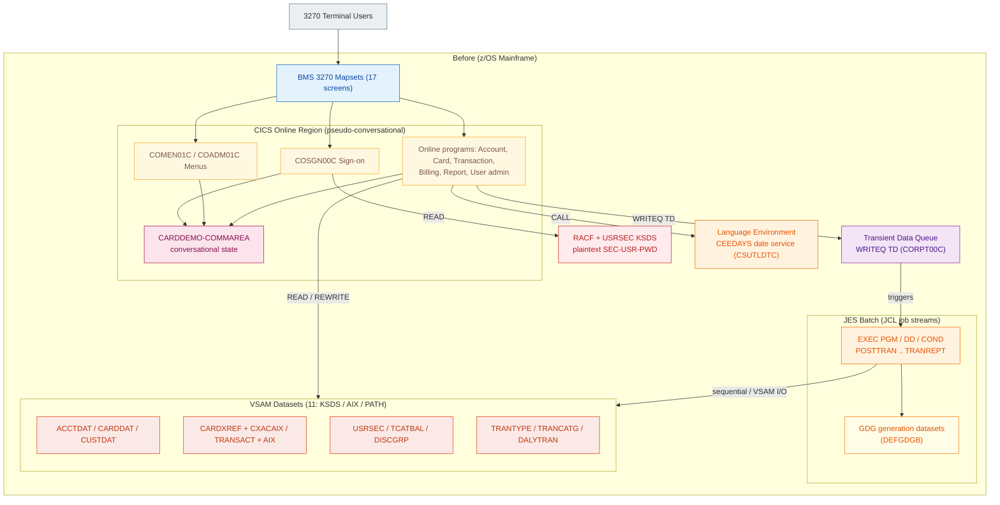
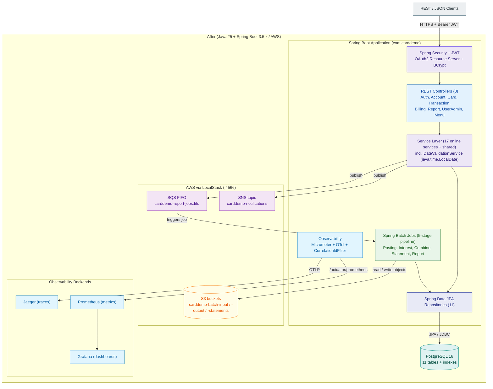
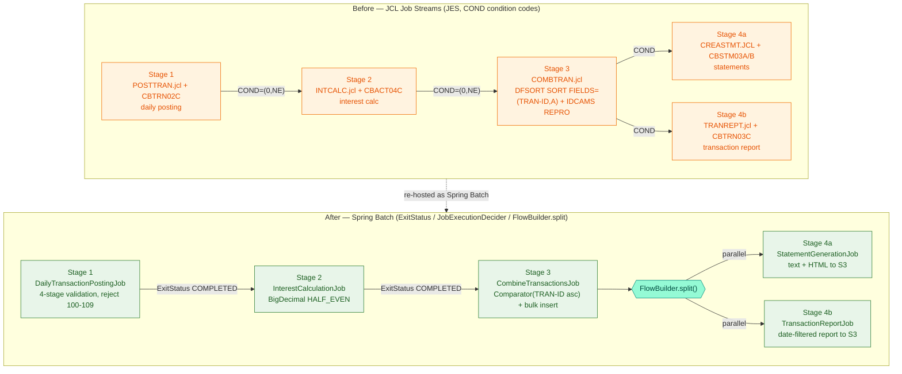
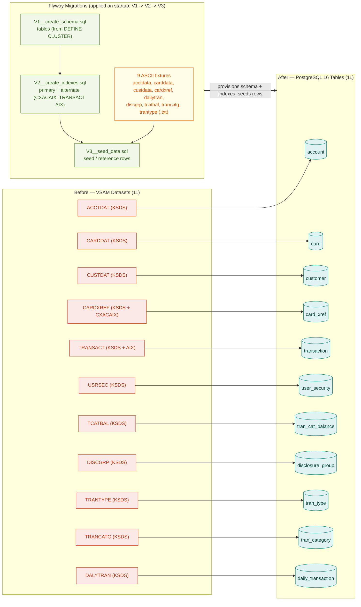
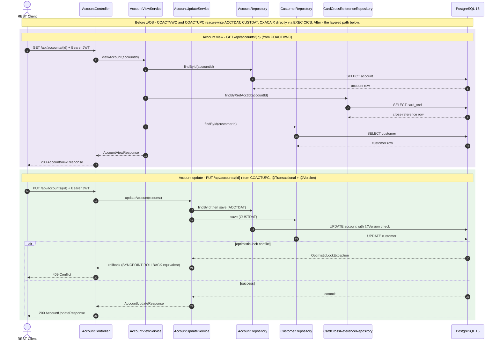
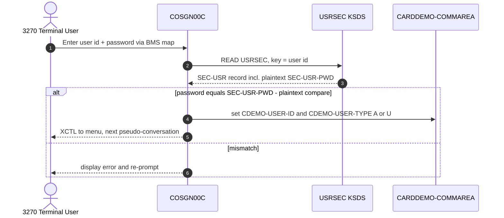
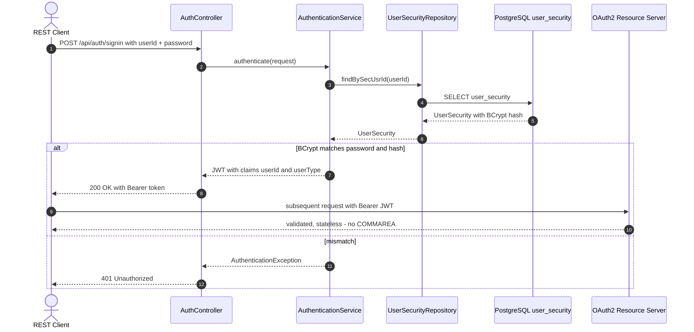

<!--
  CardDemo COBOL -> Java / AWS migration.
  Visual Architecture documentation: Mermaid before/after diagrams only.
  Source traceability: original mainframe repository commit SHA 27d6c6f
  (CardDemo_v1.0-15-g27d6c6f-68). The COBOL sources are NOT copied into this repository.
-->

# CardDemo — Architecture (Before / After)

This document is the **Visual Architecture** reference for the migration of the AWS **CardDemo**
mainframe credit-card management application (COBOL / CICS / VSAM / JCL / BMS on z/OS) to a
**Java 25 LTS + Spring Boot 3.5.x** cloud-native service backed by PostgreSQL and AWS (S3 / SQS /
SNS, exercised locally against LocalStack). It complements the prose overview in
[`../README.md`](../README.md) by showing, for every modified aspect of the system, **both** the
*before* (z/OS) and *after* (Java / AWS) states.

> **Source traceability.** The original COBOL/JCL/BMS sources are **not copied** into this
> repository. Traceability back to the mainframe code is anchored to the source repository commit
> SHA **`27d6c6f`** (`CardDemo_v1.0-15-g27d6c6f-68`). The full bidirectional
> COBOL-paragraph-to-Java-method mapping lives in
> [`../TRACEABILITY_MATRIX.md`](../TRACEABILITY_MATRIX.md); design rationale lives in
> [`../DECISION_LOG.md`](../DECISION_LOG.md).

> **Mermaid only.** Every diagram below is authored in **Mermaid 11.x** (the same major version
> pinned by [`executive-presentation.html`](executive-presentation.html), `mermaid@11.4.0`). There
> are **no** embedded images, PNG screenshots, draw.io exports, or ASCII diagrams. The legacy z/OS
> screenshots that once lived under the source `diagrams/` folder are intentionally **replaced** by
> the Mermaid renderings here.

> **Scope.** The diagrams depict only the closed migrated feature set (**F-001..F-022**), the
> **11** persistent entities, and the **5-stage** batch pipeline. No new components are invented —
> the source contains no Db2, IMS, or IBM MQ, so none appear here. Only the AWS platform (exercised
> locally via LocalStack) is represented; the second attached, non-AWS cloud environment is out of
> scope and is deliberately **absent** from every diagram.

---

## How to read this document

Each diagram family below appears as a `###`-titled section containing exactly one fenced Mermaid
(`mermaid`) code block followed by a **Legend** subsection. Diagrams are referenced **by name**
in the surrounding prose (for example, *Diagram 3 — Batch Pipeline (Before / After)*). For any
aspect that changed during the migration, the *before* and *after* states are shown together — as
two labelled `subgraph`s in one flowchart, as two stacked flowcharts, or as paired sequence
diagrams.

**Colour / grouping convention used throughout.** *Before (z/OS)* elements are grouped inside a
`Before (...)` subgraph and tinted in warm legacy tones (amber, terracotta). *After (Java / AWS)*
elements are grouped inside an `After (...)` subgraph and tinted in cool modern tones (Blitzy
purple `#5B39F3`, teal `#94FAD5`, green). A solid arrow (`-->`) is a runtime call or data flow; a
dotted arrow (`-.->`) is a *re-platforming / "becomes"* relationship that links a before element to
its after counterpart; a thick arrow (`==>`) marks a provisioning / migration action. Database and
object-store nodes use the cylinder shape `[( )]`; decision / split gateways use the hexagon shape
`{{ }}`.

## Diagram index

1. **Diagram 1 — Before-State z/OS Architecture** — the mainframe topology that is being migrated.
2. **Diagram 2 — After-State Java / AWS Architecture** — the target Spring Boot + AWS topology.
3. **Diagram 3 — Batch Pipeline (Before / After)** — JCL job streams vs. the Spring Batch 5-stage flow.
4. **Diagram 4 — Data Migration (VSAM → PostgreSQL via Flyway)** — the 11 datasets → 11 tables mapping.
5. **Diagram 5 — Component Interaction (Request Lifecycle)** — Controller → Service → Repository → Database.
6. **Diagram 6 — Authentication Flow (Before / After)** — COBOL sign-on vs. Spring Security + JWT.

## Architecture mapping (before → after)

The table below restates the binding paradigm mapping (AAP §0.1.2); every row is rendered visually
across *Diagram 1* and *Diagram 2*, and the changed aspects are expanded in *Diagrams 3–6*.

| Before — z/OS | After — Java / AWS | Shown in |
| :------------ | :----------------- | :------- |
| CICS pseudo-conversational programs + BMS 3270 maps | Spring MVC REST controllers + JSON DTOs | Diagrams 1, 2, 5 |
| `CARDDEMO-COMMAREA` conversational state | Stateless HTTP + JWT claims (`userId`, `userType`) | Diagrams 1, 2, 6 |
| VSAM KSDS / AIX / PATH (11 datasets) | PostgreSQL 16 tables + indexes via Spring Data JPA | Diagrams 1, 2, 4 |
| JCL job streams (`EXEC PGM` / `DD` / `COND`) | Spring Batch jobs/steps + `JobExecutionDecider` + profiles | Diagrams 1, 2, 3 |
| CICS TDQ (`WRITEQ TD`, `CORPT00C`) | AWS SQS FIFO queue `carddemo-report-jobs.fifo` | Diagrams 1, 2, 3 |
| GDG generation datasets (`DEFGDGB`) | AWS S3 versioned objects (`carddemo-batch-input` / `-output` / `-statements`) | Diagrams 1, 2, 3, 4 |
| Language Environment date services (`CEEDAYS`, `CSUTLDTC`) | `java.time.LocalDate` `DateValidationService` | Diagrams 1, 2 |
| RACF / plaintext `USRSEC` security | Spring Security + BCrypt (+ OAuth2 resource server) | Diagrams 1, 2, 6 |

---

## Diagram 1 — Before-State z/OS Architecture

*Diagram 1 — Before-State z/OS Architecture* captures the mainframe topology as it exists at source
commit `27d6c6f`: 3270 terminals drive a CICS pseudo-conversational online region whose programs
share state through the `CARDDEMO-COMMAREA`, read and write **11 VSAM datasets**, validate dates via
Language Environment (`CEEDAYS` in `CSUTLDTC`), authenticate against the plaintext `USRSEC` KSDS
under RACF, and hand report work to a Transient Data Queue (`WRITEQ TD`) that feeds **JES** batch
job streams (JCL). This is the "before" baseline; its counterpart is *Diagram 2 — After-State
Java / AWS Architecture*.

### Legend

- **Grouping:** the outer `Before (z/OS Mainframe)` subgraph contains all legacy elements; nested
  subgraphs isolate the **CICS Online Region**, the **JES Batch** tier, and the **VSAM Datasets**.
- **Node shapes / colours:** `3270 Terminal Users` (grey) = external actors; `BMS 3270 Mapsets`
  (blue) = the presentation layer; COBOL programs (amber); `CARDDEMO-COMMAREA` (pink) = shared
  conversational state; `RACF + USRSEC` (red) = security; `CEEDAYS` (orange) = date services;
  `Transient Data Queue` (purple) = the online-to-batch bridge; VSAM datasets (terracotta) = the
  persistent stores.
- **Edges:** solid arrows are runtime CICS/batch operations; labels name the mainframe verb
  (`READ`, `REWRITE`, `WRITEQ TD`, `CALL`). The `TDQ --> JCL` edge is the report-submission bridge
  reproduced after migration by SQS (see *Diagram 3*).
- Every element shown here has an explicit *after* counterpart in *Diagram 2 — After-State
  Java / AWS Architecture*.

---

## Diagram 2 — After-State Java / AWS Architecture

*Diagram 2 — After-State Java / AWS Architecture* is the direct counterpart of *Diagram 1*. REST/JSON
clients call a Spring Boot application (`com.carddemo`) whose request path is **Spring Security + JWT
→ REST Controllers → Service Layer → Spring Data JPA Repositories → PostgreSQL 16**. The CICS TDQ is
replaced by the SQS FIFO queue `carddemo-report-jobs.fifo`; GDG datasets become versioned S3 objects
in `carddemo-batch-input` / `carddemo-batch-output` / `carddemo-statements`; notifications fan out
through the SNS topic `carddemo-notifications`. Spring Batch jobs run the migrated pipeline (see
*Diagram 3*), and observability (Micrometer + OpenTelemetry, with a `CorrelationIdFilter`) exports to
Jaeger, Prometheus, and Grafana. All AWS calls run against **LocalStack** on `:4566` — no live AWS.

### Legend

- **Grouping:** the outer `After (Java 25 + Spring Boot 3.5.x / AWS)` subgraph mirrors the `Before`
  grouping of *Diagram 1*. Nested subgraphs isolate the **Spring Boot Application**, the **AWS via
  LocalStack** tier, and the **Observability Backends**.
- **Node shapes / colours:** `REST / JSON Clients` (grey) = external actors; `REST Controllers`
  (blue) = presentation layer (replaces BMS); `Spring Security + JWT` (Blitzy purple) replaces
  RACF/USRSEC; the **Service Layer** and **Repositories** (purple / indigo) replace COBOL program
  logic and VSAM access; `PostgreSQL 16` (teal cylinder) replaces the VSAM datasets; `S3` (yellow
  cylinder) replaces GDG; `SQS FIFO` / `SNS` (purple) replace the CICS TDQ; `Spring Batch Jobs`
  (green) replace the JCL job streams; observability nodes (light blue) are new cross-cutting
  infrastructure.
- **Edges:** solid arrows are the runtime request/data path; labels name the mechanism
  (`Bearer JWT`, `JPA / JDBC`, `publish`, `OTLP`). The `SQS --> BATCH` edge is the
  TDQ-replacement bridge (compare with `TDQ --> JCL` in *Diagram 1*).
- Read *Diagram 1* and *Diagram 2* together: every legacy node on the left has exactly one modern
  node here, satisfying the before-and-after requirement for the overall topology.

---

## Diagram 3 — Batch Pipeline (Before / After)

*Diagram 3 — Batch Pipeline (Before / After)* shows the 5-stage processing chain in both worlds
within a single flowchart. **Before**, JES runs the JCL job streams
`POSTTRAN → INTCALC → COMBTRAN → {CREASTMT, TRANREPT}`, sequenced by `COND` condition codes;
`COMBTRAN.jcl` sorts with **DFSORT** (`SORT FIELDS=(TRAN-ID,A)`) and loads the master with **IDCAMS
`REPRO`**. **After**, the same stages are Spring Batch jobs —
`DailyTransactionPostingJob → InterestCalculationJob → CombineTransactionsJob →` a
`FlowBuilder.split()` that runs `StatementGenerationJob` (4a) and `TransactionReportJob` (4b)
concurrently — sequenced by `ExitStatus` and `JobExecutionDecider`; the DFSORT + REPRO step becomes a
Java `Comparator` (TRAN-ID ascending) plus a bulk JPA insert. The dotted arrow records the
re-platforming relationship between the two halves.

### Legend

- **Grouping:** the upper `Before — JCL Job Streams` subgraph and the lower
  `After — Spring Batch` subgraph stack the two pipelines for direct comparison; the dotted
  `re-hosted as Spring Batch` edge links them.
- **Node shapes / colours:** JCL steps (amber) name the JCL job + COBOL program; Spring Batch jobs
  (green) use the exact migration class names; the hexagon `FlowBuilder.split()` (Blitzy teal) is the
  parallel-split gateway that has no single JCL equivalent (the JCL expresses 4a/4b as two
  `COND`-guarded steps).
- **Edges:** *before* edges are labelled with the governing `COND` condition code; *after* edges are
  labelled with the Spring Batch `ExitStatus` / decider semantics. Stage numbers (1, 2, 3, 4a, 4b)
  align one-to-one across the two halves, demonstrating preserved sequencing.
- **Fidelity note:** Stage 3's DFSORT + IDCAMS `REPRO` (per `app/jcl/COMBTRAN.jcl`) is reproduced by
  `CombineTransactionsJob` as a `Comparator` on `TRAN-ID` ascending followed by a bulk insert into the
  `transaction` table — the same sort key and load semantics, no algebraic change.

---

## Diagram 4 — Data Migration (VSAM → PostgreSQL via Flyway)

*Diagram 4 — Data Migration (VSAM → PostgreSQL via Flyway)* details how the **11 VSAM datasets**
become **11 JPA-backed PostgreSQL tables**. Schema is created by `V1__create_schema.sql` (from the
`DEFINE CLUSTER` JCL), indexes — including the `CXACAIX` cross-reference alternate index and the
`TRANSACT` alternate index — by `V2__create_indexes.sql`, and the **9 ASCII fixtures** are loaded as
reference/seed rows by `V3__seed_data.sql`. Each `DATASET --> table` edge carries the exact name
mapping; the thick arrow marks Flyway provisioning the target schema on application startup.

### Legend

- **Grouping:** the left `Before — VSAM Datasets` subgraph lists the 11 source KSDS clusters (with
  their AIX/PATH where relevant); the centre `Flyway Migrations` subgraph is the migration mechanism;
  the right `After — PostgreSQL 16 Tables` subgraph lists the 11 target tables (teal cylinders).
- **Node shapes / colours:** VSAM datasets (terracotta) name the mainframe DD/cluster; Flyway scripts
  (green) name the versioned migration files; the ASCII fixtures node (yellow) is the seed-data
  source for `V3`; PostgreSQL tables (teal cylinders) name the relational targets.
- **Edges:** each thin `DATASET --> table` arrow is the authoritative one-to-one name mapping
  (`ACCTDAT → account`, `CARDDAT → card`, `CUSTDAT → customer`, `CARDXREF → card_xref`,
  `TRANSACT → transaction`, `USRSEC → user_security`, `TCATBAL → tran_cat_balance`,
  `DISCGRP → disclosure_group`, `TRANTYPE → tran_type`, `TRANCATG → tran_category`,
  `DALYTRAN → daily_transaction`). The thick `provisions` arrow shows Flyway creating and seeding the
  schema before any online or batch flow runs. Inside the Flyway subgraph, `V1 -> V2 -> V3` is the
  fixed migration order.

---

## Diagram 5 — Component Interaction (Request Lifecycle)

*Diagram 5 — Component Interaction (Request Lifecycle)* traces a request through the layered Java
architecture using the **Account** function as the representative example — `AccountController`
delegating to `AccountViewService` / `AccountUpdateService`, which use `AccountRepository`,
`CustomerRepository`, and `CardCrossReferenceRepository` over PostgreSQL. The opening note records the
*before* state (the COBOL programs `COACTVWC` / `COACTUPC` issued `EXEC CICS READ` / `REWRITE`
directly against the VSAM datasets), so this diagram also expresses before → after for the access
pattern. The update path encodes the `@Transactional` + `@Version` semantics that replace the sole
`SYNCPOINT ROLLBACK` in `COACTUPC`.

### Legend

- **Participants (left → right):** the `REST Client` actor; the `AccountController` (presentation);
  the `AccountViewService` and `AccountUpdateService` (business logic, one per source COBOL program);
  the three Spring Data JPA repositories `AccountRepository`, `CustomerRepository`, and
  `CardCrossReferenceRepository`; and `PostgreSQL 16`.
- **Arrows:** a solid arrow (`->>`) is a synchronous call; a dashed arrow (`-->>`) is the return /
  response. `autonumber` sequences the steps.
- **Coloured bands (`rect`):** the purple band is the read-only **view** path
  (`GET /api/accounts/{id}`); the green band is the transactional **update** path
  (`PUT /api/accounts/{id}`). The `alt` block shows the optimistic-locking branch — an
  `OptimisticLockException` triggers a rollback (the `@Transactional` analogue of the COBOL
  `SYNCPOINT ROLLBACK`) and a `409 Conflict`.
- **Before / after:** the opening `Note` states the legacy COBOL access pattern; the body is the
  modern layered replacement, so the access-pattern change is shown both ways.

---

## Diagram 6 — Authentication Flow (Before / After)

*Diagram 6 — Authentication Flow (Before / After)* contrasts sign-on in the two systems as paired
sequence diagrams. **Before**, `COSGN00C` reads the `USRSEC` KSDS and compares the submitted password
to the **plaintext** `SEC-USR-PWD`, then records the user id and user type (`A`/`U`) in the
`CARDDEMO-COMMAREA` for the next pseudo-conversation. **After**, `POST /api/auth/signin` flows through
`AuthenticationService.authenticate()` → `UserSecurityRepository.findBySecUsrId` → **BCrypt**
verification → issuance of a **JWT** carrying `userId` and `userType` claims; subsequent calls are
validated statelessly by the OAuth2 resource server, with no server-held conversational state.

### Before — COBOL sign-on (COSGN00C, plaintext USRSEC)

### After — Spring Security + JWT (AuthenticationService, BCrypt)

### Legend

- **Participants — before:** the `3270 Terminal User`; `COSGN00C` (the sign-on program); the
  `USRSEC KSDS` (security dataset); and the `CARDDEMO-COMMAREA` (conversational state carrier).
- **Participants — after:** the `REST Client`; `AuthController`; `AuthenticationService`;
  `UserSecurityRepository`; `PostgreSQL user_security` (the migrated table); and the
  `OAuth2 Resource Server` that validates JWTs on later calls.
- **Arrows:** solid (`->>`) = request / call; dashed (`-->>`) = response / return. Each `alt` block
  shows the success branch versus the credential-mismatch branch.
- **Key before → after differences:** plaintext `SEC-USR-PWD` compare → **BCrypt** verification
  (credential hardening, constraint C-003); `CARDDEMO-COMMAREA` user-type state → stateless **JWT**
  claims (`userId`, `userType`); `XCTL` chaining to the next pseudo-conversation → a stateless
  resource-server check on every subsequent request.

---

## Summary

Together, *Diagram 1* and *Diagram 2* establish the overall before/after topology; *Diagram 3* expands
the batch pipeline; *Diagram 4* expands the data layer; *Diagram 5* shows the runtime request
lifecycle; and *Diagram 6* shows authentication. Every modified aspect of the system is therefore
presented in **both** its z/OS and its Java / AWS form, satisfying the Visual Architecture rule.

The migration preserves **100% behavioral parity** with the source at commit `27d6c6f` while
re-platforming the runtime: CICS + BMS become Spring MVC REST + JSON DTOs; the `CARDDEMO-COMMAREA`
becomes stateless HTTP + JWT; the 11 VSAM datasets become 11 PostgreSQL tables via Flyway; the JCL
job streams become a Spring Batch 5-stage pipeline; the CICS TDQ becomes the SQS FIFO queue
`carddemo-report-jobs.fifo`; GDG datasets become versioned S3 objects in `carddemo-batch-input`,
`carddemo-batch-output`, and `carddemo-statements`; `CEEDAYS` date services become a
`java.time.LocalDate` `DateValidationService`; and RACF / plaintext `USRSEC` becomes Spring Security
with BCrypt. No feature is added beyond the closed set **F-001..F-022**, and only the
AWS / LocalStack platform is represented (the second attached, non-AWS cloud environment is
intentionally excluded).

**Related documentation:** [`../README.md`](../README.md) (overview and run instructions) ·
[`api-contracts.md`](api-contracts.md) (REST / SQS / S3 contracts) ·
[`../TRACEABILITY_MATRIX.md`](../TRACEABILITY_MATRIX.md) (COBOL ↔ Java paragraph mapping) ·
[`../DECISION_LOG.md`](../DECISION_LOG.md) (design rationale) ·
[`validation-gates.md`](validation-gates.md) (gate evidence).

