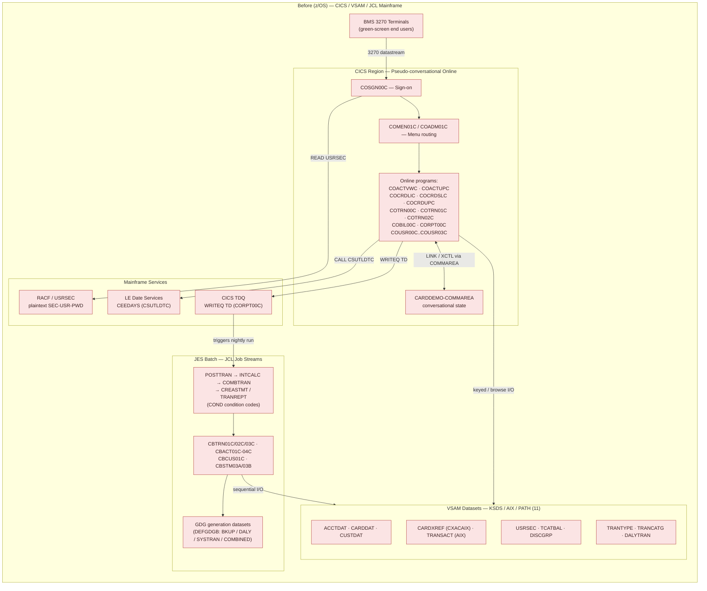
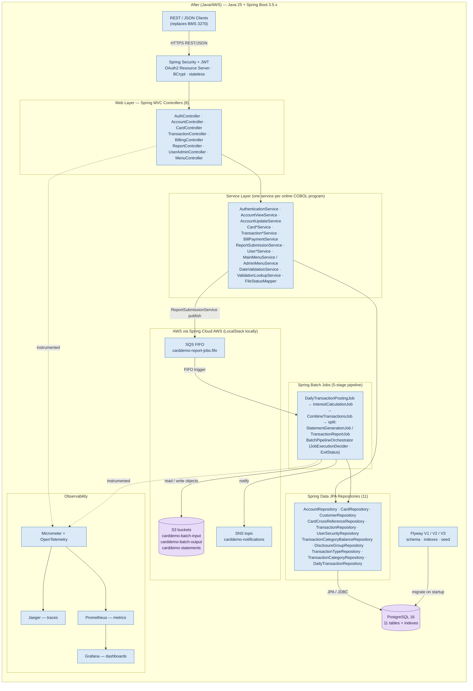
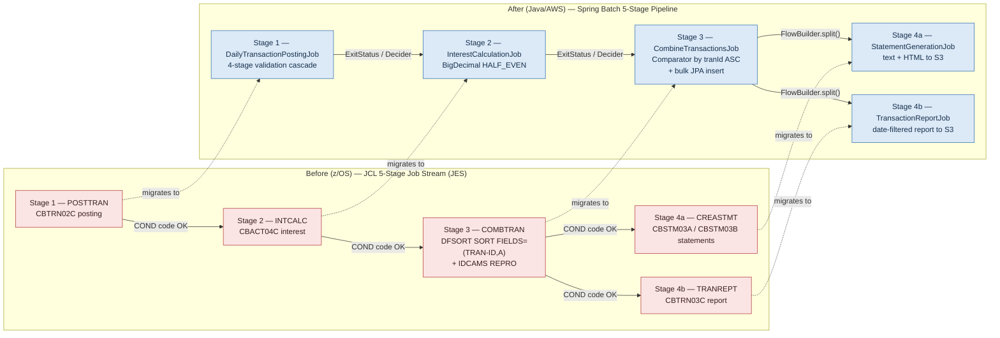
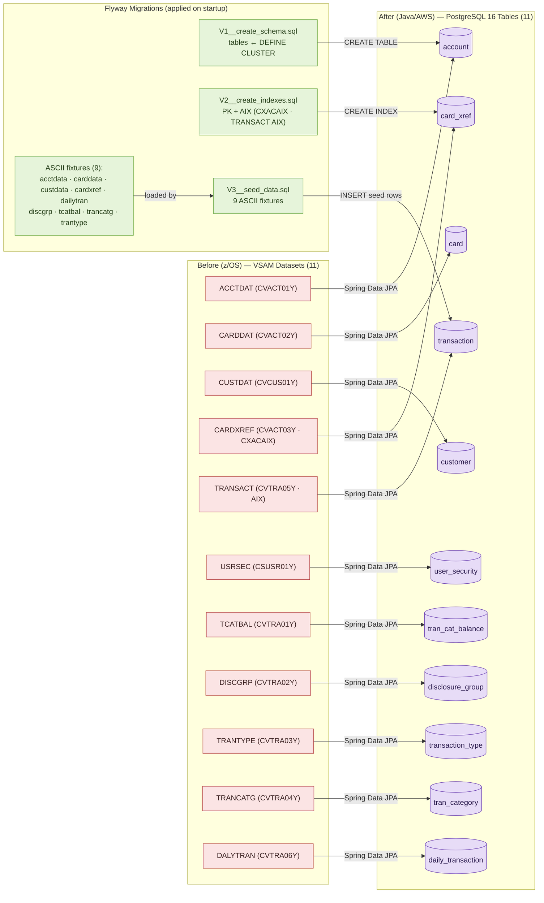
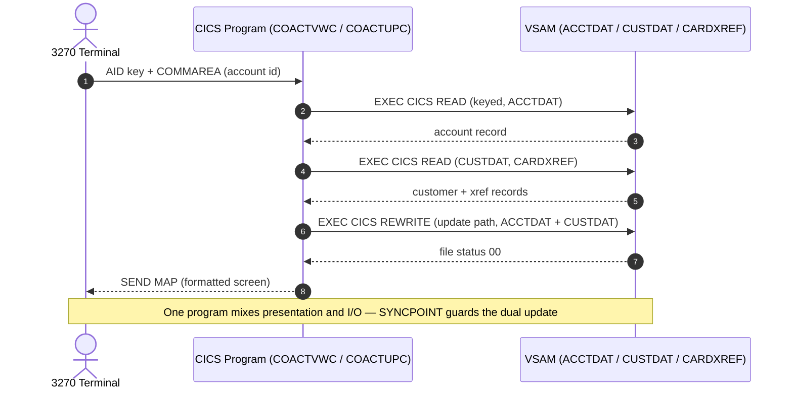
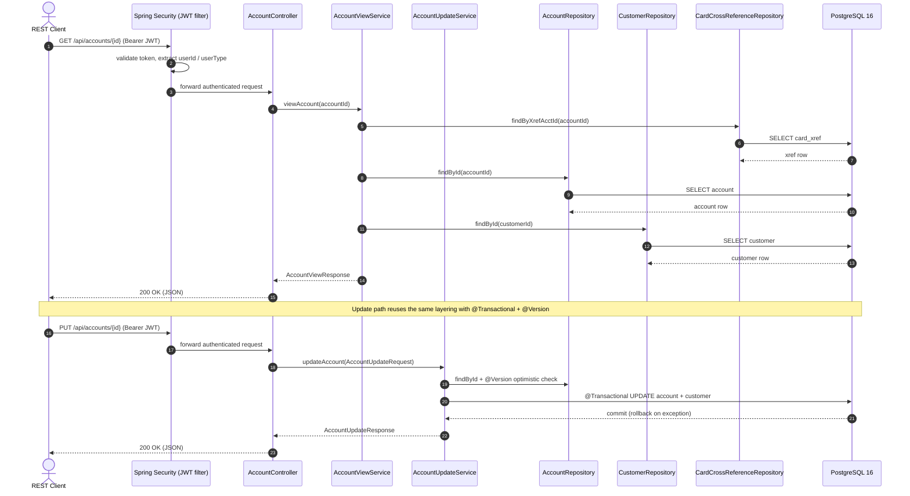
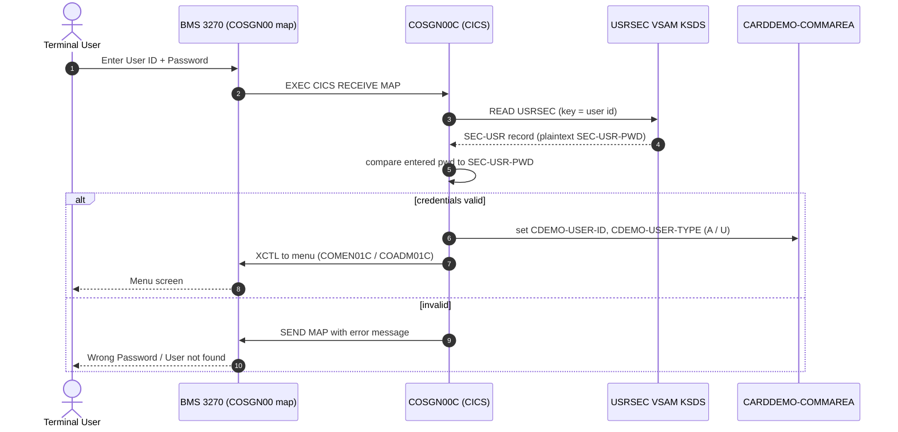
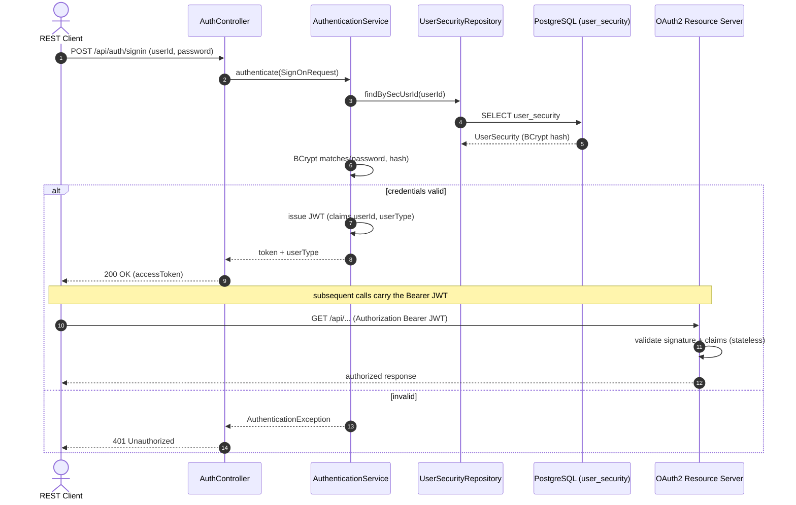

# Architecture — Before / After (z/OS → Java / AWS)

> **Visual Architecture documentation** for the **AWS CardDemo** COBOL → Java migration.
> This document satisfies the project's *Visual Architecture* rule: every architectural aspect that
> changes is shown with **both** its **before** (z/OS mainframe) **and after** (Java / AWS) states,
> using **Mermaid diagrams only** — rendered as text, with no embedded raster images, no external
> diagram-tool exports, and no ASCII art.

## About this document

- **Source of truth (reference only):** the original COBOL / CICS / VSAM / JCL / BMS application at
  commit SHA **`27d6c6f`** (from the version string `CardDemo_v1.0-15-g27d6c6f-68`). **The COBOL
  sources are not copied** into the Java project; the diagrams below translate their *behavior,
  layouts, and contracts* and trace each element back to that commit.
- **Scope discipline:** only the migrated, closed feature set (F-001 through F-022), the **11**
  data entities, and the **5-stage** batch pipeline are diagrammed. No components are invented —
  there is no Db2, IMS, or IBM MQ in the source, and none appear here. The Google Cloud emulator
  attached to the project is out of scope and is therefore **not** depicted.
- **Rendering:** the Mermaid blocks target **Mermaid 11.x** (the same major version pinned by
  `docs/executive-presentation.html`, `mermaid@11.4.0`). They render on GitHub, in IDEs with a
  Mermaid plugin, or via the Mermaid Live Editor.
- **Companion reading:** the prose narrative lives in
  [`carddemo-java/README.md`](../README.md) (*Architecture* section); the per-program mapping lives
  in [`TRACEABILITY_MATRIX.md`](../TRACEABILITY_MATRIX.md); the REST/SQS/S3 contracts live in
  [`docs/api-contracts.md`](api-contracts.md).

## Diagram index

Each diagram is referenced by name throughout this document and in the sibling docs.

| # | Diagram name | Kind | Before / After coverage |
| :- | :----------- | :--- | :---------------------- |
| 1 | *Diagram 1 — Before-State z/OS Architecture* | `flowchart` | Before half of the architecture pair (with *Diagram 2*) |
| 2 | *Diagram 2 — After-State Java/AWS Architecture* | `flowchart` | After half of the architecture pair (with *Diagram 1*) |
| 3 | *Diagram 3 — Batch Pipeline (Before/After)* | `flowchart` | Both, side by side |
| 4 | *Diagram 4 — Data Migration: VSAM → PostgreSQL via Flyway (Before/After)* | `flowchart` | Both, source → target |
| 5 | *Diagram 5 — Component Interaction: Controller → Service → Repository → Database (Before/After)* | `sequenceDiagram` | Both (COBOL inline vs. layered Spring) |
| 6 | *Diagram 6 — Authentication Flow (Before/After)* | `sequenceDiagram` | Both, sign-on path |

> **Global before/after convention** used in every flowchart: nodes inside a **`Before (z/OS)`**
> subgraph are shaded **red/terracotta**; nodes inside an **`After (Java/AWS)`** subgraph are shaded
> **blue**; **migration/Flyway** helpers are shaded **green**; **data stores** (PostgreSQL, S3) use a
> **cylinder** shape in a **purple** tint. Sequence diagrams label their `Before`/`After` halves in
> the heading and notes.

---

## Diagram 1 — Before-State z/OS Architecture

*Diagram 1 — Before-State z/OS Architecture* captures the source system exactly as it runs on z/OS:
**BMS 3270** terminals drive **CICS** pseudo-conversational programs that thread conversational state
through the `CARDDEMO-COMMAREA`; data lives in **VSAM** KSDS/AIX/PATH datasets; security is enforced
by **RACF** over the plaintext `USRSEC` file; date checks call **Language Environment** `CEEDAYS`
(via `CSUTLDTC`); and the online-to-batch handoff is a CICS **TDQ** (`WRITEQ TD` in `CORPT00C`) that
feeds **JES** batch **JCL** job streams writing **GDG** generation datasets. Its after-state
counterpart is *Diagram 2 — After-State Java/AWS Architecture*.



### Legend — Diagram 1

- **Outer subgraph `Before (z/OS)`** — everything here is part of the source mainframe and is
  replaced in *Diagram 2*; all nodes are shaded **red/terracotta** per the global convention.
- **Nodes** — labelled with the originating COBOL program(s), copybook(s), or dataset group(s).
- **Solid arrow `-->`** — a control-flow or I/O relationship; the arrow label names the mechanism
  (e.g., `WRITEQ TD`, `READ USRSEC`, `CALL CSUTLDTC`).
- **Bidirectional arrow `<-->`** — conversational state passed both ways through the COMMAREA on
  each pseudo-conversational turn.
- **Groupings** — `CICS Region` (online), `Mainframe Services` (security/date/TDQ), `VSAM Datasets`
  (the 11 persistent stores), and `JES Batch` (the JCL job streams + batch programs + GDG output).

---

## Diagram 2 — After-State Java/AWS Architecture

*Diagram 2 — After-State Java/AWS Architecture* is the target topology that replaces *Diagram 1*.
Stateless **REST/JSON** clients call **Spring MVC** controllers behind **Spring Security + JWT**
(OAuth2 resource server, BCrypt); controllers delegate to **service** classes (one per online COBOL
program), which use **Spring Data JPA** repositories over **PostgreSQL 16** (provisioned by
**Flyway**). Overnight work runs as **Spring Batch** jobs; the online-to-batch handoff is an **SQS
FIFO** publication; generation/staging datasets move to **S3**; notifications fan out over **SNS**;
and the whole service is instrumented for **observability** (Micrometer + OpenTelemetry → Jaeger,
Prometheus, Grafana). All AWS calls run against **LocalStack** locally.



### Legend — Diagram 2

- **Outer subgraph `After (Java/AWS)`** — the target system; all service/controller/repository/job
  nodes are shaded **blue** per the global convention.
- **Cylinder + purple tint** — data stores: **PostgreSQL 16** (`DB`) and **S3** (`S3`).
- **Solid arrow `-->`** — synchronous request/data flow (HTTP, JPA/JDBC, SQS trigger, S3 I/O);
  the label names the mechanism.
- **Dotted arrow `-.->`** — cross-cutting **instrumentation** (controllers and batch jobs emit
  traces/metrics to Micrometer/OpenTelemetry).
- **Before → After correspondence:** REST controllers replace BMS 3270; JWT claims replace the
  COMMAREA; JPA repositories + PostgreSQL replace VSAM; Spring Batch replaces JES/JCL; SQS FIFO
  replaces the CICS TDQ; S3 replaces GDG datasets; `DateValidationService` replaces `CEEDAYS`; and
  Spring Security + BCrypt replace RACF/plaintext `USRSEC` — each detailed in the sections below and
  in *Table — Authoritative Before → After Mapping*.

---

## Diagram 3 — Batch Pipeline (Before/After)

*Diagram 3 — Batch Pipeline (Before/After)* shows the overnight processing stream in both worlds.
**Before**, **JES** runs the JCL 5-stage chain `POSTTRAN → INTCALC → COMBTRAN → CREASTMT / TRANREPT`,
gating each step with `COND` condition codes; stage 3 (`COMBTRAN.jcl`) sorts with **DFSORT**
(`SORT FIELDS=(TRAN-ID,A)`) and loads the master with IDCAMS **`REPRO`**. **After**, the identical
5-stage flow is a **Spring Batch** pipeline — `DailyTransactionPostingJob → InterestCalculationJob →
CombineTransactionsJob → split: StatementGenerationJob (4a) / TransactionReportJob (4b)` — where
`JobExecutionDecider` + `ExitStatus` replace `COND` logic, `FlowBuilder.split()` runs stages 4a/4b in
parallel, and the DFSORT + REPRO step becomes a `Comparator` (by `tranId` ascending) followed by a
bulk JPA insert. The two halves appear side by side so each stage lines up with its successor.



### Legend — Diagram 3

- **Left subgraph `Before (z/OS)`** (red) — the JCL job stream as scheduled under JES; each job is
  annotated with its driving batch COBOL program.
- **Right subgraph `After (Java/AWS)`** (blue) — the equivalent Spring Batch jobs; class names match
  `batch/jobs/*` exactly (`DailyTransactionPostingJob`, `InterestCalculationJob`,
  `CombineTransactionsJob`, `StatementGenerationJob`, `TransactionReportJob`).
- **Solid arrow `-->`** — stage ordering; the **before** label is the JCL `COND` gate, the **after**
  label is the Spring Batch `ExitStatus` / `JobExecutionDecider` (and `FlowBuilder.split()` for the
  parallel 4a/4b fan-out).
- **Dotted arrow `-.->` `migrates to`** — maps each before stage to its after job (1:1).
- **Stage 3 detail** — DFSORT `SORT FIELDS=(TRAN-ID,A)` + IDCAMS `REPRO` (from `COMBTRAN.jcl`)
  become an in-memory `Comparator` (ascending `tranId`) plus a bulk JPA insert, preserving sort-key
  semantics and ascending order.

---

## Diagram 4 — Data Migration: VSAM → PostgreSQL via Flyway (Before/After)

*Diagram 4 — Data Migration: VSAM → PostgreSQL via Flyway (Before/After)* maps each of the **11 VSAM
datasets** (the *before* persistent stores, each defined by its COBOL copybook) to its **PostgreSQL
16** table (the *after* store). The schema is provisioned and seeded entirely by **Flyway** on
startup: `V1__create_schema.sql` creates the 11 tables (from the `DEFINE CLUSTER` JCL),
`V2__create_indexes.sql` creates primary and alternate indexes (notably the `CXACAIX` cross-reference
AIX and the `TRANSACT` AIX), and `V3__seed_data.sql` loads the **9 ASCII fixtures**. Table names match
the implemented JPA entities exactly.



### Legend — Diagram 4

- **Left subgraph `Before (z/OS)`** (red) — the 11 VSAM datasets; each label carries the dataset
  name and its defining copybook (and the alternate index where one exists: `CXACAIX` for the card
  cross-reference, plus the `TRANSACT` AIX).
- **Right subgraph `After (Java/AWS)`** (purple cylinders) — the 11 PostgreSQL tables; names match the
  JPA `@Table` mappings: `account`, `card`, `customer`, `card_xref`, `transaction`, `user_security`,
  `tran_cat_balance`, `disclosure_group`, `transaction_type`, `tran_category`, `daily_transaction`.
- **Center subgraph `Flyway Migrations`** (green) — `V1` schema, `V2` indexes, `V3` seed; the
  `ASCII fixtures` node lists all **9** files loaded by `V3`.
- **Solid arrow `-->` `Spring Data JPA`** — the 1:1 dataset → table re-platforming, accessed at
  runtime through Spring Data JPA repositories.
- **Solid arrow `-->` from Flyway** — `CREATE TABLE` (`V1`), `CREATE INDEX` (`V2`, shown to
  `card_xref` as the representative AIX target), and `INSERT seed rows` (`V3`, shown to `transaction`
  as a representative target); these run on application startup before any online or batch flow.

---

## Diagram 5 — Component Interaction: Controller → Service → Repository → Database (Before/After)

*Diagram 5 — Component Interaction: Controller → Service → Repository → Database (Before/After)* shows
the request lifecycle for the account feature. **Before**, a single CICS program (`COACTVWC` for view,
`COACTUPC` for update) performs presentation **and** VSAM I/O inline, with no separation of concerns.
**After**, the request flows through strict layering — `AccountController` → `AccountViewService` /
`AccountUpdateService` → `AccountRepository` / `CustomerRepository` / `CardCrossReferenceRepository` →
**PostgreSQL** — with `@Transactional` (and `@Version` optimistic locking) applied at the service
layer, exactly as the sole `SYNCPOINT ROLLBACK` in `COACTUPC` dictated.

**Before — COBOL / CICS inline (no layering):**



**After — layered Spring (Controller → Service → Repository → Database):**



### Legend — Diagram 5

- **`actor`** — the human/automated initiator (3270 terminal *before*, REST client *after*).
- **`participant`** — a component in the request path; *after* participants are named exactly as the
  implemented classes (`AccountController`, `AccountViewService`, `AccountUpdateService`,
  `AccountRepository`, `CustomerRepository`, `CardCrossReferenceRepository`).
- **Solid arrow `->>`** — a synchronous call/request; **dashed arrow `-->>`** — its return/response.
- **`Note over`** — highlights the key behavioral invariant being preserved (inline I/O + SYNCPOINT
  *before*; layered access with `@Transactional` + `@Version` *after*).
- **Before → After correspondence:** the single CICS program splits into Controller (presentation),
  Service (business logic + transactions), and Repository (data access); `EXEC CICS READ/REWRITE`
  becomes `findById` / JPA persistence; the VSAM datasets become PostgreSQL tables; and the CICS
  `SYNCPOINT` becomes Spring `@Transactional` with rollback-on-exception.

---

## Diagram 6 — Authentication Flow (Before/After)

*Diagram 6 — Authentication Flow (Before/After)* contrasts sign-on in the two systems. **Before**,
`COSGN00C` receives the BMS map, reads the `USRSEC` KSDS by user id, and compares the entered password
against the **plaintext** `SEC-USR-PWD`, then stamps the user type (`A`/`U`) into the COMMAREA and
transfers to the menu. **After**, `POST /api/auth/signin` invokes `AuthenticationService.authenticate()`,
which looks up the user via `UserSecurityRepository.findBySecUsrId`, verifies the password with
**BCrypt**, and issues a **JWT** (claims: `userId`, `userType`); subsequent calls are validated
statelessly by the OAuth2 resource server. The credential-hardening upgrade (plaintext → BCrypt) is the
only intentional behavioral change, and it preserves the login flow.

**Before — COBOL sign-on (`COSGN00C`, plaintext compare):**



**After — Spring Security JWT (`AuthenticationService`, BCrypt verify):**



### Legend — Diagram 6

- **`actor`** — the sign-on initiator (terminal user *before*, REST client *after*).
- **`participant`** — sign-on components; *after* names match the implementation exactly
  (`AuthController`, `AuthenticationService`, `UserSecurityRepository`, OAuth2 resource server).
- **Solid arrow `->>`** — a synchronous call; **dashed arrow `-->>`** — its return/response.
- **`alt` / `else`** — the valid vs. invalid credential branches (identical outcomes either side).
- **Before → After correspondence:** `EXEC CICS RECEIVE MAP` → `POST /api/auth/signin`;
  `READ USRSEC` → `UserSecurityRepository.findBySecUsrId`; **plaintext compare** → **BCrypt verify**;
  `CDEMO-USER-TYPE` in the COMMAREA → a `userType` **JWT claim**; and the pseudo-conversational
  `XCTL`/COMMAREA continuation → stateless JWT validation on every subsequent request.

---

## Table — Authoritative Before → After Mapping

The diagrams above collectively encode the canonical paradigm mapping. This table consolidates it for
quick reference; each row is realized in one or more of *Diagram 1* through *Diagram 6*.

| Before (z/OS) | After (Java / AWS) | Shown in |
| :------------ | :----------------- | :------- |
| CICS pseudo-conversational programs + BMS 3270 maps | Spring MVC REST controllers + JSON DTOs | Diagrams 1, 2, 5 |
| `CARDDEMO-COMMAREA` conversational state | Stateless HTTP + JWT claims | Diagrams 1, 2, 6 |
| VSAM KSDS / AIX / PATH (11 datasets) | PostgreSQL 16 tables + indexes via Spring Data JPA | Diagrams 1, 2, 4 |
| JCL job streams (`EXEC PGM`, `DD`, `COND`) | Spring Batch jobs / steps + `JobExecutionDecider` + profiles | Diagrams 1, 2, 3 |
| CICS TDQ (`WRITEQ TD`, `CORPT00C`) | AWS **SQS FIFO** queue (`carddemo-report-jobs.fifo`) | Diagrams 1, 2 |
| GDG generation datasets (`DEFGDGB`) | AWS **S3** versioned objects (`carddemo-batch-input` / `carddemo-batch-output` / `carddemo-statements`) | Diagrams 1, 2 |
| Language Environment date services (`CEEDAYS`, `CSUTLDTC`) | `java.time.LocalDate` `DateValidationService` | Diagrams 1, 2 |
| RACF / plaintext `USRSEC` security | Spring Security + **BCrypt** + JWT | Diagrams 1, 2, 6 |
| DFSORT `SORT FIELDS=(TRAN-ID,A)` + IDCAMS `REPRO` | `Comparator` (ascending `tranId`) + bulk JPA insert | Diagram 3 |
| `SYNCPOINT ROLLBACK` (dual ACCTDAT + CUSTDAT update) | `@Transactional` + `@Version` optimistic locking | Diagram 5 |

> **Traceability note.** Every before element above originates from the COBOL/JCL/copybook sources at
> commit SHA **`27d6c6f`**; the COBOL is **not** copied into this repository. The paragraph-level
> mapping is in [`TRACEABILITY_MATRIX.md`](../TRACEABILITY_MATRIX.md), the rationale for each
> non-trivial choice is in [`DECISION_LOG.md`](../DECISION_LOG.md), and the runtime contracts are in
> [`docs/api-contracts.md`](api-contracts.md).

## How to view these diagrams

- **GitHub** renders Mermaid in Markdown automatically — open this file in the repository web UI.
- **VS Code / IntelliJ IDEA** render Mermaid with the *Markdown Preview Mermaid* (or built-in)
  plugins.
- **Mermaid Live Editor** (`https://mermaid.live`) — paste any single ```` ```mermaid ```` block to
  edit or export. The blocks here target **Mermaid 11.x**, matching the version pinned in
  `docs/executive-presentation.html`.
