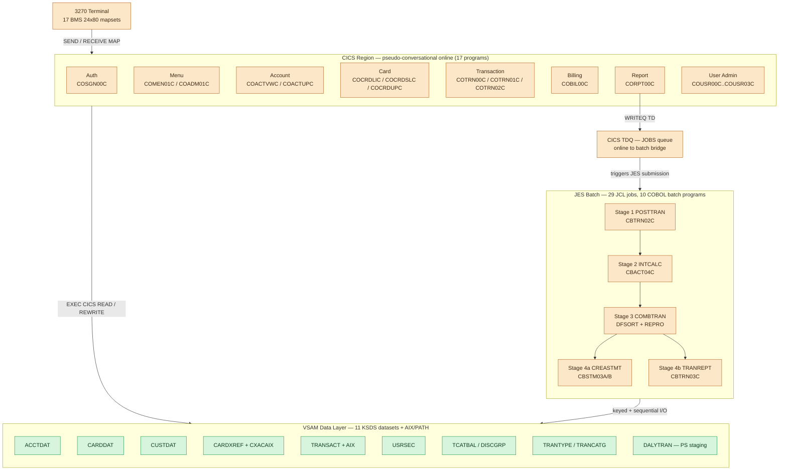
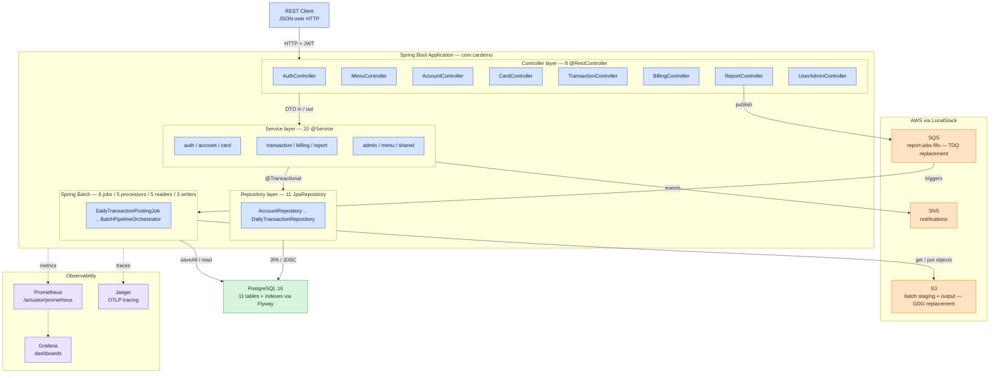
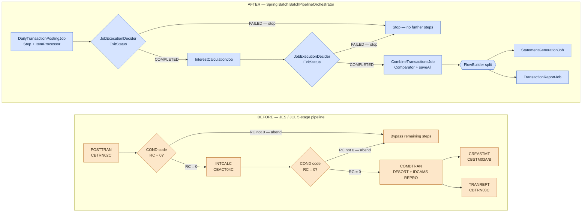
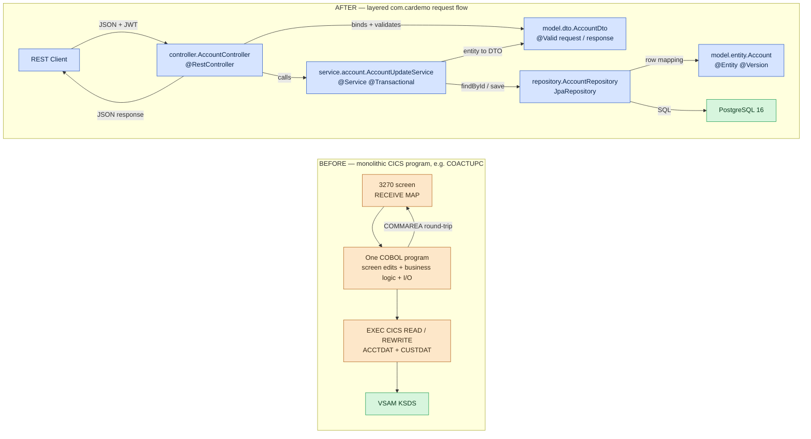
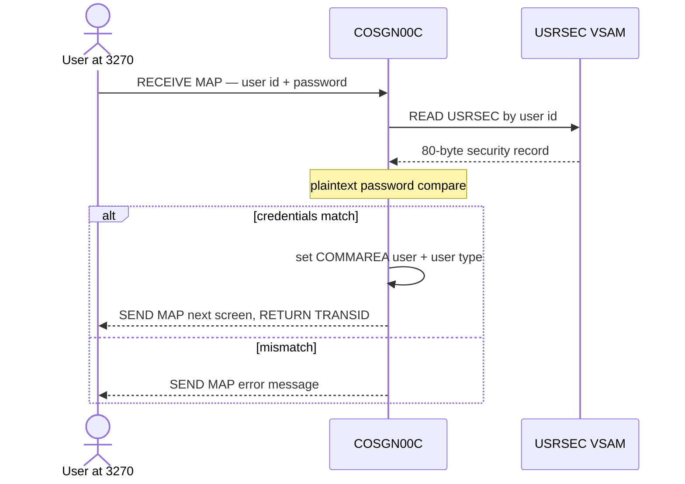
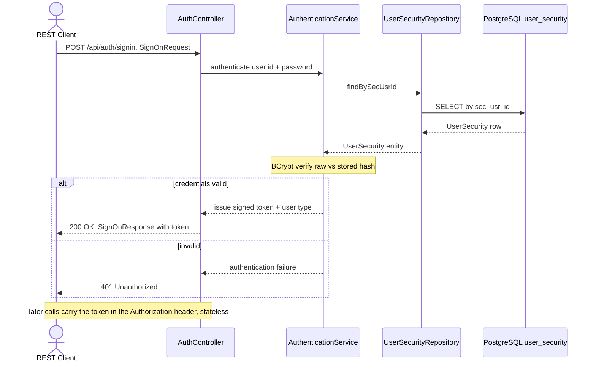

# CardDemo Architecture — Before / After (Visual Reference)

**Authoritative visual architecture reference for the AWS CardDemo COBOL → Java 25 + Spring Boot 3.x migration.**

This document renders every architectural aspect that changed during the migration in **both** its
**before** state (the z/OS mainframe: CICS, VSAM, JES/JCL, BMS) and its **after** state
(Java 25 LTS, Spring Boot 3.5.x, Spring Data JPA, Spring Batch, PostgreSQL 16, and AWS S3/SQS/SNS).
All diagrams use [Mermaid](https://mermaid.js.org/) so they render directly on GitHub and in the
MkDocs site (the repository configures the `mermaid2` plugin in `mkdocs.yml`). The same diagrams are
embedded into the leadership `docs/executive-presentation.html` reveal.js deck (slides 3, 4, 6, and 7),
so each diagram below is self-contained: it carries its own title, legend, and caption.

**Traceability.** The legacy baseline is the AWS CardDemo COBOL application at commit SHA **`27d6c6f`**.
COBOL, copybook, BMS, and JCL sources are **not** copied into this greenfield repository; every diagram
references the legacy constructs by name only, and paragraph-level mapping lives in
`TRACEABILITY_MATRIX.md`. Decision rationale lives in `DECISION_LOG.md`, and the REST contracts that the
"after" diagrams realize are specified in [`api-contracts.md`](api-contracts.md).

**Minimal Change Clause.** Per the migration's governing discipline, these diagrams depict only the
**documented target** — no speculative components, no feature expansion. The single intentional
behavioral change is the upgrade of plaintext `USRSEC` password storage to **BCrypt** verification
(shown in Diagram 6); every other flow preserves the COBOL behavior exactly.

---

## 1. How to read these diagrams

Every flowchart in this document shares one colour palette so that the **before → after** mapping is
visually consistent across diagrams. Colours are applied with Mermaid `classDef`/`class` statements.
Mermaid `sequenceDiagram` blocks (Diagram 6) do not support colour classes, so they convey the same
information through participant names and notes.

### 1.1 Shared colour legend

| Colour | Swatch meaning | Applies to |
|---|---|---|
| **Amber / tan** | Legacy z/OS mainframe construct (BEFORE) | CICS programs, VSAM datasets, JES/JCL, BMS, TDQ |
| **Blue** | Java / Spring Boot application component (AFTER) | Controllers, services, repositories, batch beans, entities |
| **Green** | Persistent data store | VSAM KSDS (before) and PostgreSQL 16 tables (after) |
| **Orange** | AWS managed service (via LocalStack) | S3, SQS, SNS |
| **Purple** | Observability sidecar | Prometheus, Grafana, Jaeger |

### 1.2 BEFORE / AFTER convention

- Diagrams **1** and **2** are the matched before/after pair for the **overall system architecture**.
- Diagrams **3**, **4**, and **5** each contain a `subgraph BEFORE` and a `subgraph AFTER` so the two
  states sit side by side in a single picture.
- Diagram **6** presents two adjacent `sequenceDiagram` blocks — the COBOL sign-on flow followed by the
  Spring Security flow.

### 1.3 Abbreviations

| Term | Expansion |
|---|---|
| BMS | Basic Mapping Support — 3270 terminal screen definitions |
| CICS | Customer Information Control System — online transaction monitor |
| COMMAREA | Communication Area — the COBOL record carrying pseudo-conversational state |
| GDG | Generation Data Group — versioned sequential dataset generations |
| JES | Job Entry Subsystem — z/OS batch job scheduler |
| KSDS / AIX / PATH | VSAM Key-Sequenced Data Set / Alternate Index / Path |
| PS | Physical Sequential dataset (flat file staging) |
| TDQ | Transient Data Queue — CICS queue used as the online→batch bridge |
| DTO | Data Transfer Object — REST request/response payload |
| JPA | Jakarta Persistence API — ORM over PostgreSQL |

---

## 2. Transformation rules at a glance

Each mainframe construct maps to exactly one deterministic Java/Spring/AWS target pattern, so the
migration is mechanical and auditable rather than interpretive. The diagrams that follow are visual
expansions of this rule table (`docs/technical-specifications.md` §0.1.2 transformation rules).

| Source construct (z/OS) | Transformation rule | Target pattern (Java / Spring / AWS) |
|---|---|---|
| `DATA DIVISION` (`PIC`, `COMP-3`, `COMP`) | Exact decimal-precision mapping | Java POJOs using `BigDecimal` — never `float`/`double` |
| `PARAGRAPH` / `SECTION` | Method extraction preserving control flow | `@Service` / component methods |
| `COPY` / `REPLACE` directives | Shared-module extraction | Shared DTOs and utility classes |
| VSAM KSDS (keyed access) | Relational schema + repositories | `@Entity` + `JpaRepository` |
| VSAM AIX / PATH (alternate index) | Secondary query methods | `@Query` / derived queries |
| CICS `SEND MAP` / `RECEIVE MAP` | REST request/response DTOs | `@RestController` + Jakarta Validation |
| CICS `RETURN TRANSID COMMAREA` | Stateless REST + context propagation | JWT / session-scoped token state |
| JCL `EXEC PGM` + DD | Spring Batch job configuration | `@Configuration` + `Job` / `Step` beans |
| JCL `COND` codes | Step execution decisions | `JobExecutionDecider` + `FlowBuilder` |
| DFSORT / IDCAMS `REPRO` | Java sort + bulk insert | `Comparator` + `saveAll` / `JdbcTemplate` |
| CICS TDQ `WRITEQ` | Message publish | AWS **SQS** via Spring Cloud AWS |
| GDG generations | Versioned objects | **S3** keys with generation prefixes |
| `FILE STATUS` codes | Exception mapping | Custom exception hierarchy + status enums |
| CICS `SYNCPOINT ROLLBACK` | Transaction rollback | `@Transactional(rollbackFor = ...)` |
| LE `CEEDAYS` date validation | Java date/time API | `java.time.LocalDate` + custom validators |

**Technology-substitution points** (documented at the point of change per the Minimal Change Clause):

- **VSAM KSDS → PostgreSQL 16** tables accessed through Spring Data JPA repositories.
- **CICS TDQ → AWS SQS** for the single online→batch report bridge.
- **GDG generations → AWS S3** versioned object keys for batch staging and output.
- **BMS 3270 maps → REST DTOs** that preserve the original field names, lengths, and validation rules.
- **LE `CEEDAYS` → `java.time.LocalDate`** with custom Jakarta validators.
- **COMMAREA → stateless token** (JWT) carried in the `Authorization` header.
- **`SYNCPOINT ROLLBACK` → `@Transactional`** rollback for the dual-dataset account update.
- **`FILE STATUS` codes → typed exceptions** (`RecordNotFoundException`, `DuplicateRecordException`, …).

---

## 3. Architecture: before and after

Diagrams 1 and 2 are the matched pair for the **whole system**. Read them together: every amber
mainframe tier in Diagram 1 has a corresponding blue/green/orange tier in Diagram 2.

### Diagram 1 — Before-State z/OS Mainframe Architecture (BEFORE)

**Legend.**

- **Amber nodes** — z/OS mainframe constructs: the 3270/BMS presentation tier, the 17 pseudo-conversational
  CICS online programs (grouped by business domain), the 10 batch COBOL programs, and the CICS TDQ bridge.
- **Green nodes** — the VSAM KSDS data layer (11 datasets), including the `CXACAIX` alternate index on
  `CARDXREF` and the alternate index on `TRANSACT`, plus the `DALYTRAN` physical-sequential staging file.
- **Solid arrows** — synchronous I/O and control flow. The `ONL_RPT → TDQ → JES` path is the single
  online→batch coupling in the system (the `CORPT00C` report bridge).

*Caption.* The legacy system is a CICS/VSAM monolith: 3270 screens drive program-per-screen online
transactions that read and rewrite VSAM directly, while JES schedules a five-stage JCL batch pipeline over
the same datasets. State flows through the COMMAREA and the only online→batch link is a CICS Transient
Data Queue.

### Diagram 2 — After-State Java / Spring Boot / AWS Architecture (AFTER)

**Legend.**

- **Blue nodes** — the Spring Boot application layers under the `com.cardemo` base package: 8 REST
  controllers, the service layer, the 11 JPA repositories, and the Spring Batch beans.
- **Green node** — PostgreSQL 16, which replaces the entire VSAM layer; schema and seed data are applied by
  Flyway on startup.
- **Orange nodes** — AWS managed services exercised against LocalStack: S3 (GDG replacement), SQS (the TDQ
  replacement that triggers the report batch job), and SNS for notifications.
- **Purple nodes** — observability sidecars: Prometheus scrapes Actuator metrics, Grafana visualises them,
  and Jaeger collects OTLP traces.
- **Solid arrows** — request / data flow; **dotted arrows** — telemetry (metrics and traces).

*Caption.* The CICS/VSAM monolith becomes a layered Spring Boot service: REST controllers receive JSON,
delegate to `@Transactional` services, which use JPA repositories over PostgreSQL 16. The JES batch tier
becomes Spring Batch, the TDQ bridge becomes SQS, GDG datasets become S3 objects, and first-class
observability (Prometheus/Grafana/Jaeger) is added — the only structural addition beyond the documented
target stack.

---

## 4. Batch processing

### Diagram 3 — Batch Pipeline (Before / After)

**Legend.**

- **Amber (BEFORE)** — JCL job steps; diamonds are `COND`-code gates evaluated by JES between steps.
- **Blue (AFTER)** — Spring Batch jobs; diamonds are `JobExecutionDecider` checks on `ExitStatus`; the
  hexagon is the `FlowBuilder` split that fans out into parallel statement and report jobs.
- **Stage numbering is preserved 1:1.** Stage 4a (`CREASTMT`) and Stage 4b (`TRANREPT`) both depend only on
  Stage 3 (`COMBTRAN`), so they run in parallel in both worlds — implicitly via independent JCL steps before,
  explicitly via `FlowBuilder.split()` after.

*Caption.* The five-stage JES pipeline (`POSTTRAN → INTCALC → COMBTRAN → CREASTMT / TRANREPT`) maps
step-for-step to Spring Batch jobs orchestrated by `BatchPipelineOrchestrator`. JCL `COND`-code gating
becomes `JobExecutionDecider` + `FlowBuilder` decisions, and the post-`COMBTRAN` fan-out becomes an explicit
parallel split — sequential dependencies and abort-on-failure semantics are preserved exactly.

---

## 5. Data layer

### Diagram 4 — Data Migration: VSAM → PostgreSQL via Flyway (Before / After)

```mermaid
graph LR
    subgraph BEFORE["BEFORE — VSAM datasets (11)"]
        direction TB
        D1["ACCTDAT — KSDS"]
        D2["CARDDAT — KSDS + AIX"]
        D3["CUSTDAT — KSDS"]
        D4["CARDXREF — KSDS<br/>CXACAIX alt index + PATH"]
        D5["TRANSACT — KSDS<br/>AIX + PATH"]
        D6["USRSEC — KSDS"]
        D7["TCATBAL — KSDS"]
        D8["DISCGRP — KSDS"]
        D9["TRANTYPE — KSDS"]
        D10["TRANCATG — KSDS"]
        D11["DALYTRAN — PS staging"]
    end

    subgraph FLY["Flyway migrations — run on startup"]
        direction TB
        FV1["V1__create_schema.sql<br/>11 tables from DEFINE CLUSTER"]
        FV2["V2__create_indexes.sql<br/>CXACAIX + TRANSACT AIX"]
        FV3["V3__seed_data.sql<br/>9 ASCII fixtures"]
        FV4["V4__user_type_not_null.sql<br/>user_type NOT NULL constraint"]
        FV5["V5__batch_metadata.sql<br/>Spring Batch metadata tables"]
        FV1 --> FV2 --> FV3 --> FV4 --> FV5
    end

    subgraph AFTER["AFTER — PostgreSQL 16 + Spring Data JPA"]
        direction TB
        T1["account"]
        T2["card"]
        T3["customer"]
        T4["card_xref<br/>derived query by card number"]
        T5["transaction<br/>@Query by date range"]
        T6["user_security"]
        T7["transaction_category_balance<br/>@EmbeddedId"]
        T8["disclosure_group<br/>@EmbeddedId"]
        T9["transaction_type"]
        T10["transaction_category<br/>@EmbeddedId"]
        T11["daily_transactions"]
    end

    BEFORE -->|"DEFINE CLUSTER becomes DDL"| FLY
    FLY -->|"provisions + seeds"| AFTER

    classDef data fill:#d7f5dd,stroke:#1f9d55,color:#0c3a1f;
    classDef mig fill:#d6e4ff,stroke:#2b59c3,color:#0b2447;
    class D1,D2,D3,D4,D5,D6,D7,D8,D9,D10,D11 data;
    class T1,T2,T3,T4,T5,T6,T7,T8,T9,T10,T11 data;
    class FV1,FV2,FV3,FV4,FV5 mig;
```

**Legend.**

- **Green nodes** — persistent data, before (VSAM KSDS / PS) and after (PostgreSQL 16 tables). The 11
  datasets map 1:1 to 11 tables.
- **Blue nodes** — the Flyway migration scripts that perform the move, applied in order on application
  startup: `V1` creates the schema (from the VSAM `DEFINE CLUSTER` specs), `V2` creates the indexes that
  replace the alternate indexes, `V3` seeds the 9 ASCII fixtures as `INSERT` rows, `V4` enforces the
  `user_type` NOT NULL constraint, and `V5` provisions the Spring Batch metadata tables.
- **Alternate-index note** — VSAM `AIX`/`PATH` access (e.g. `CXACAIX` on `CARDXREF`, the `TRANSACT` AIX) is
  reproduced as PostgreSQL secondary indexes plus JPA derived queries or `@Query` methods, annotated on the
  relevant tables.

*Caption.* All 11 VSAM/PS data entities migrate to PostgreSQL 16 tables with identical key semantics:
primary keys, the three composite keys (`@EmbeddedId`), and the alternate-index access paths are all
preserved. Flyway `V1`–`V5` provision schema, indexes, seed data, the `user_type` NOT NULL constraint, and
the Spring Batch metadata tables before any service or batch job runs.

---

## 6. Online request processing

### Diagram 5 — Component Interaction and Request Flow (Before / After)

**Legend.**

- **Amber (BEFORE)** — a single CICS program owns everything: screen field edits, business rules, and direct
  VSAM I/O, with the COMMAREA carrying state back to the screen.
- **Blue (AFTER)** — discrete `com.cardemo` layers with one responsibility each: `@RestController` →
  `@Service` → `JpaRepository` → `@Entity`. **DTO/entity boundary** — controllers and clients only ever see
  `model.dto.*` payloads; `model.entity.*` objects never cross the service boundary, so the API contract is
  decoupled from the persistence schema.
- **`@Transactional`** — the service method spans the dual `ACCTDAT` + `CUSTDAT` update that COBOL guarded
  with `SYNCPOINT ROLLBACK`; `@Version` on the entity provides the optimistic-locking check that COACTUPC did
  by before/after record-image comparison.

*Caption.* The COBOL program-per-screen monolith is decomposed into a clean Controller → Service →
Repository → Entity chain. Validation moves to Jakarta `@Valid` on DTOs, transactional integrity and
optimistic concurrency move to `@Transactional` and `@Version`, and the persistence model is hidden behind
the DTO boundary — while the externally observable behaviour is unchanged.

---

## 7. Authentication and security

### Diagram 6 — Authentication Flow (Before / After)

**Before — COBOL sign-on (`COSGN00C` reads `USRSEC`, plaintext compare, COMMAREA carries the user).**

**After — Spring Security (BCrypt verification, stateless token).**

**Legend.**

- **Before participants** — the 3270 user, the `COSGN00C` program, and the `USRSEC` VSAM dataset. The password
  is compared in **plaintext** and the authenticated identity is carried forward in the **COMMAREA**.
- **After participants** — `AuthController` → `AuthenticationService` → `UserSecurityRepository` → the
  `user_security` table. The password is verified with **BCrypt**, and a signed **token** replaces the COMMAREA
  so the server holds no conversational state.
- **Arrows** — solid (`->>`) are requests/queries; dashed (`-->>`) are responses; `alt`/`else` shows the
  success and failure branches; `Note` boxes mark the comparison step and the stateless-token contract.

*Caption.* The sign-on **flow and field contract are preserved**, but the plaintext password comparison is
replaced by BCrypt verification — the single intentional behavioral change in the migration (constraint
C-003 / decision D-002) — and the COMMAREA-carried session becomes a stateless bearer token.

---

## 8. Diagram reuse and cross-references

- **Executive presentation.** These diagrams are embedded directly into `docs/executive-presentation.html`
  (reveal.js): Diagram 1 on slide 3 (before architecture), Diagram 2 on slide 4 (after architecture),
  Diagram 3 on slide 6 (batch pipeline before/after), and Diagram 4 on slide 7 (data migration). They are
  authored to be self-contained so they can be lifted into a slide without edits.
- **REST contracts.** The controller, route, and DTO names in Diagrams 2, 5, and 6 match
  [`api-contracts.md`](api-contracts.md) (for example `AuthController` → `POST /api/auth/signin`,
  `AccountController` → `GET`/`PUT /api/accounts/{id}`).
- **Component names.** Entity, repository, service, controller, and batch names match the target package tree
  in `docs/technical-specifications.md` (§0.3.1) and the paragraph-level mapping in `TRACEABILITY_MATRIX.md`.
- **Decisions.** Rationale for the substitutions shown here (BCrypt, S3-for-GDG, SQS-for-TDQ, JPA-for-VSAM)
  is recorded in `DECISION_LOG.md`.

> **Baseline.** All "before" constructs reference the AWS CardDemo COBOL application at commit SHA
> **`27d6c6f`**. No COBOL, copybook, BMS, or JCL source is reproduced in this repository — the diagrams name
> the legacy constructs only, for traceability.

