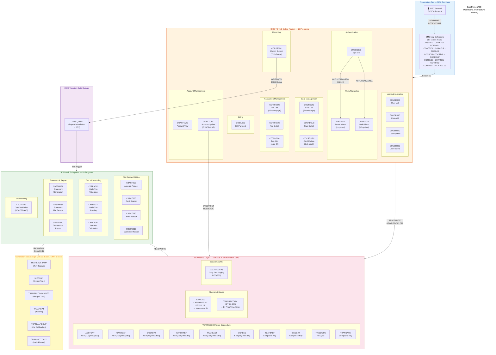
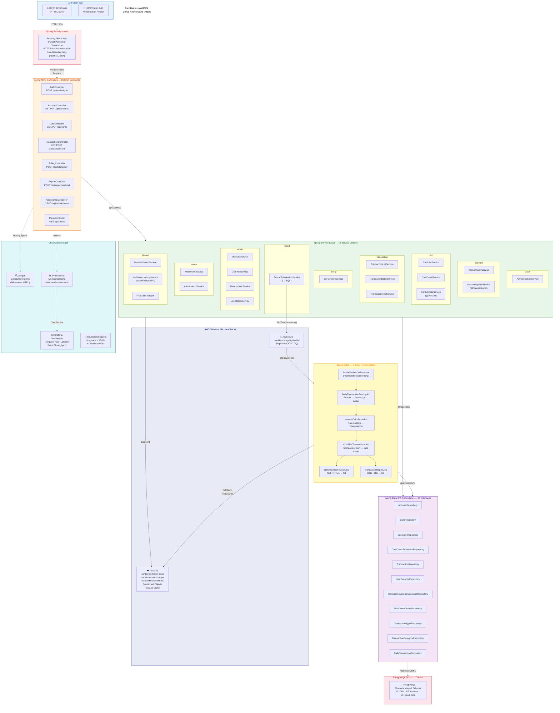
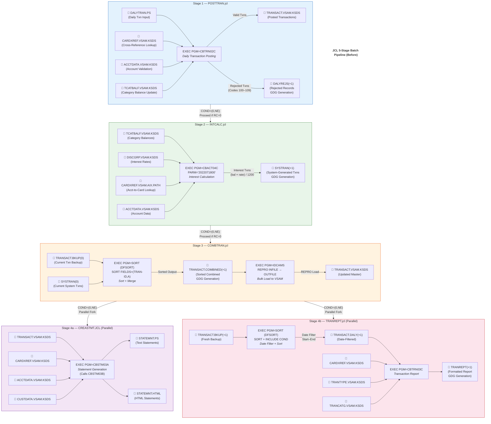
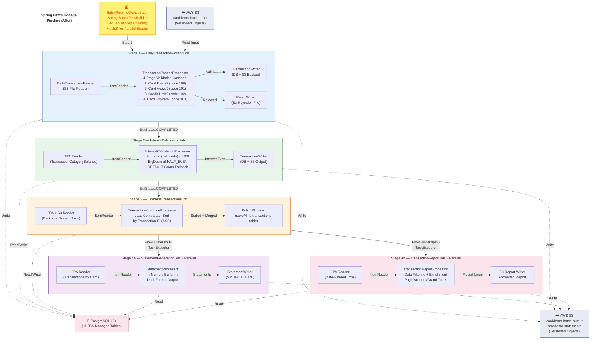
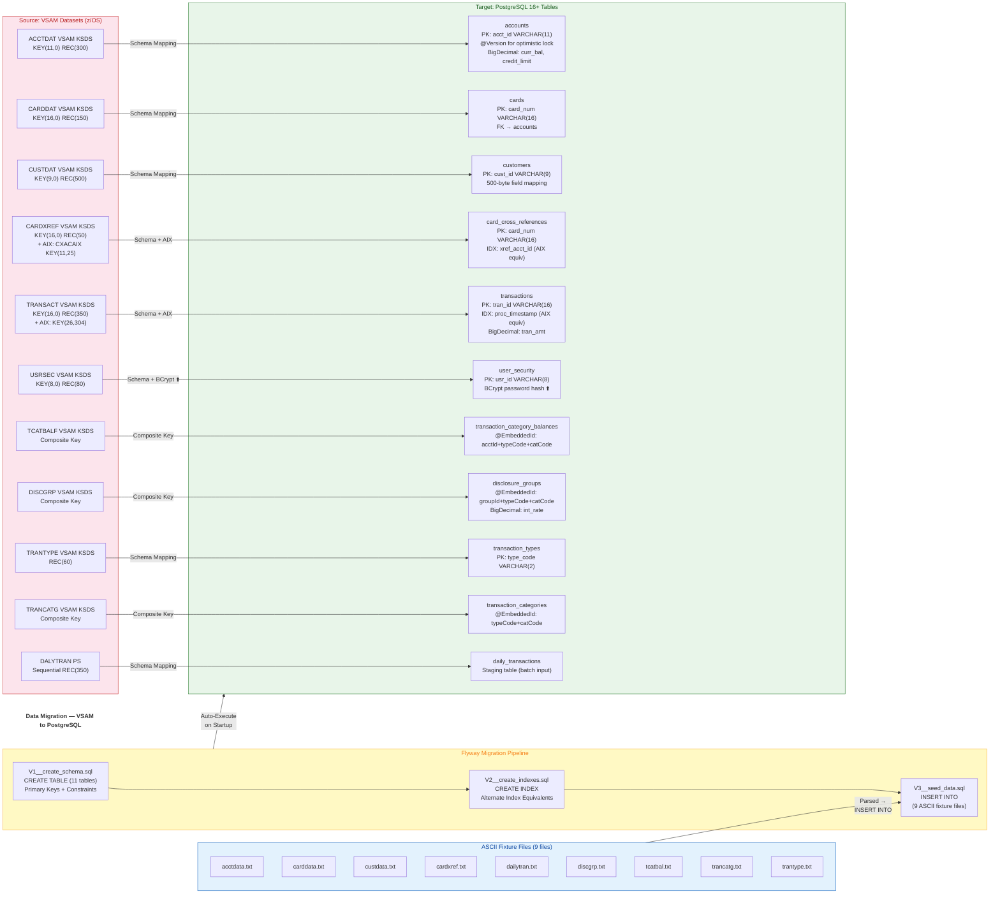
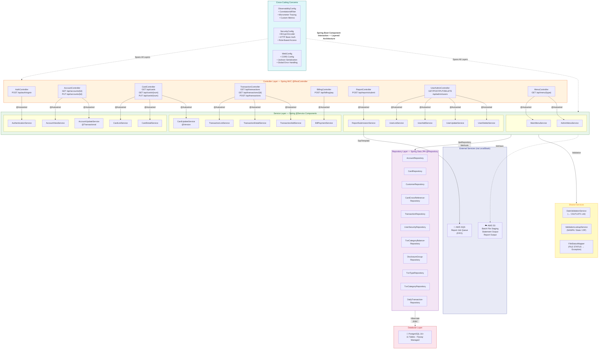
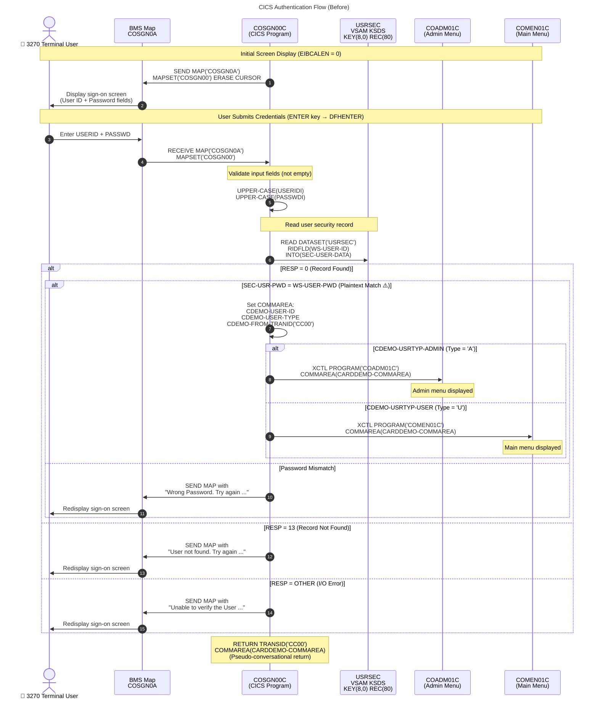
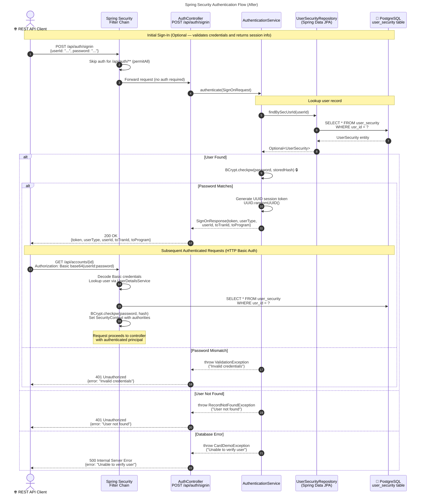

# CardDemo Architecture — Before & After Migration

> **Migration Context:** AWS CardDemo COBOL mainframe application (source commit `27d6c6f`) migrated to Java 25 LTS + Spring Boot 3.x cloud-native architecture with 100% behavioral parity.

This document provides comprehensive visual architecture documentation using Mermaid diagrams. Every modified architectural aspect shows both the **before** (z/OS mainframe) and **after** (Java/AWS cloud) states, per the Visual Architecture Documentation rule.

---

## Table of Contents

| # | Diagram | Description |
|---|---------|-------------|
| 1 | [Before-State z/OS Architecture](#1-before-state-zos-mainframe-architecture) | Complete z/OS mainframe tier diagram with CICS, VSAM, JES, TDQ, and GDG components |
| 2 | [After-State Java/AWS Architecture](#2-after-state-javaaws-cloud-architecture) | Spring Boot services, PostgreSQL, S3, SQS, observability stack, and security |
| 3 | [Batch Pipeline — Before & After](#3-batch-pipeline--before--after) | JCL 5-stage pipeline vs. Spring Batch 5-stage pipeline side by side |
| 4 | [Data Migration Flow](#4-data-migration--vsam-to-postgresql) | VSAM KSDS/AIX/PS to PostgreSQL relational tables via Flyway |
| 5 | [Component Interaction — Layered Architecture](#5-spring-boot-component-interaction--layered-architecture) | Controller → Service → Repository → Database layering with cross-cutting concerns |
| 6 | [Authentication Flow — Before & After](#6-authentication-flow--before--after) | CICS pseudo-conversational sign-on vs. Spring Security HTTP Basic Auth flow |

---

## 1. Before-State z/OS Mainframe Architecture

The original CardDemo application runs entirely on IBM z/OS. It consists of 18 CICS online programs serving 3270 terminal users through BMS screen maps, 10 batch programs executed via JES job scheduling, 10 VSAM KSDS datasets with 2 alternate indexes, 1 sequential PS staging file, 6 GDG bases for generational data management, and CICS Transient Data Queues (TDQ) for inter-program messaging.

**Legend:**

| Color | Component Type |
|-------|---------------|
| 🔵 Blue (`#E3F2FD`) | Presentation tier — 3270 terminals and BMS screen maps |
| 🟠 Orange (`#FFF3E0`) | CICS online region — 18 interactive COBOL programs |
| 🟣 Purple (`#F3E5F5`) | CICS TDQ — Transient data queues for inter-program messaging |
| 🟢 Green (`#E8F5E9`) | JES batch subsystem — 10 batch COBOL programs |
| 🔴 Red (`#FCE4EC`) | VSAM data layer — 10 KSDS datasets, 2 AIX/PATH, 1 PS |
| 🟡 Yellow (`#FFF9C4`) | GDG bases — 6 generation data groups for versioned output |

---

## 2. After-State Java/AWS Cloud Architecture

The migrated CardDemo application is a standalone Spring Boot 3.x service running on Java 25 LTS. It replaces the 3270 terminal interface with REST API endpoints, VSAM datasets with PostgreSQL 16+ tables managed via Spring Data JPA, JCL batch jobs with Spring Batch job definitions, CICS TDQ with AWS SQS, and GDG bases with versioned S3 objects. A full observability stack (Jaeger, Prometheus, Grafana) provides tracing, metrics, and dashboards from day one.

**Legend:**

| Color | Component Type |
|-------|---------------|
| 🔵 Blue (`#E3F2FD`) | API client tier — REST clients with HTTP Basic Authentication |
| 🔴 Red (`#FFEBEE`) | Spring Security — filter chain, BCrypt, HTTP Basic Authentication |
| 🟠 Orange (`#FFF3E0`) | Controller layer — 8 Spring MVC REST controllers |
| 🟢 Green (`#E8F5E9`) | Service layer — 19 service classes organized by domain |
| 🟣 Purple (`#F3E5F5`) | Repository layer — 11 Spring Data JPA repository interfaces |
| 🔴 Pink (`#FCE4EC`) | Database — PostgreSQL 16+ with Flyway-managed schema |
| 🟡 Yellow (`#FFF9C4`) | Spring Batch — 5 jobs with orchestrator, processors, readers, writers |
| 🔷 Indigo (`#E8EAF6`) | AWS services — S3 (file staging) and SQS (message queue) via LocalStack |
| 🩵 Teal (`#E0F7FA`) | Observability — Jaeger, Prometheus, Grafana, structured logging |

---

## 3. Batch Pipeline — Before & After

The CardDemo batch processing pipeline executes as a 5-stage sequential chain. Each stage depends on the successful completion of its predecessor (controlled by JCL COND codes in the before-state and Spring Batch `ExitStatus` in the after-state). Stages 4a and 4b (statement generation and transaction reporting) can execute in parallel after Stage 3 completes.

### 3a. JCL Batch Pipeline (Before)

The original pipeline uses JCL job steps, DFSORT for sorting, IDCAMS REPRO for bulk data loading, GDG generation numbering (`(+1)` for new, `(0)` for current), and JCL `COND` parameters for conditional execution.

**Legend (Before Pipeline):**

| Color | Stage | JCL Job | COBOL Program | Key Operation |
|-------|-------|---------|--------------|---------------|
| 🔵 Blue | Stage 1 | POSTTRAN.jcl | CBTRN02C | 4-stage validation, post to VSAM, reject to GDG |
| 🟢 Green | Stage 2 | INTCALC.jcl | CBACT04C | Interest: `(balance × rate) / 1200`, DEFAULT fallback |
| 🟠 Orange | Stage 3 | COMBTRAN.jcl | DFSORT + IDCAMS | Sort by TRAN-ID ascending, REPRO load to VSAM |
| 🟣 Purple | Stage 4a | CREASTMT.JCL | CBSTM03A/B | Per-card text + HTML statement generation |
| 🔴 Red | Stage 4b | TRANREPT.jcl | CBTRN03C + DFSORT | Date-filtered sort, formatted report |

### 3b. Spring Batch Pipeline (After)

The migrated pipeline uses Spring Batch `Job` and `Step` abstractions with `BatchPipelineOrchestrator` controlling sequencing via `FlowBuilder`. S3 versioned objects replace GDG generations. Stages 4a and 4b execute concurrently via `FlowBuilder.split()`.

**Legend (After Pipeline):**

| Color | Stage | Spring Batch Job | Key Transformation from JCL |
|-------|-------|-----------------|----------------------------|
| 🟡 Yellow | Orchestrator | `BatchPipelineOrchestrator` | JCL COND codes → `ExitStatus` + `FlowBuilder` |
| 🔵 Blue | Stage 1 | `DailyTransactionPostingJob` | S3 reader replaces DALYTRAN.PS; DB + S3 output replaces VSAM + GDG |
| 🟢 Green | Stage 2 | `InterestCalculationJob` | JPA reader replaces VSAM; `BigDecimal` preserves formula precision |
| 🟠 Orange | Stage 3 | `CombineTransactionsJob` | `Comparator` sort replaces DFSORT; `saveAll` replaces IDCAMS REPRO |
| 🟣 Purple | Stage 4a | `StatementGenerationJob` | S3 output replaces sequential PS files; parallel via `split()` |
| 🔴 Red | Stage 4b | `TransactionReportJob` | S3 output replaces GDG `TRANREPT(+1)`; parallel via `split()` |
| 🔷 Indigo | — | AWS S3 | Versioned objects replace GDG generation numbering |
| 🔴 Pink | — | PostgreSQL | JPA-managed tables replace VSAM KSDS |

---

## 4. Data Migration — VSAM to PostgreSQL

All 10 VSAM KSDS datasets, 2 alternate indexes (AIX/PATH), and 1 sequential PS staging file are mapped to 11 PostgreSQL tables managed by Spring Data JPA entities. The Flyway migration pipeline executes three versioned scripts: `V1` creates the schema DDL, `V2` creates secondary indexes (replacing VSAM AIX/PATH definitions), and `V3` seeds data from the 9 ASCII fixture files.

**Legend:**

| Color | Component | Description |
|-------|-----------|-------------|
| 🔴 Red | VSAM Datasets | Source: 10 KSDS + 2 AIX/PATH + 1 PS — keyed sequential and indexed access |
| 🟡 Yellow | Flyway Pipeline | Migration engine: V1 (DDL) → V2 (indexes) → V3 (seed data), auto-executes on Spring Boot startup |
| 🟢 Green | PostgreSQL Tables | Target: 11 relational tables with JPA entities, composite keys via `@EmbeddedId`, `@Version` for optimistic lock |
| 🔵 Blue | ASCII Fixtures | 9 source data files parsed into SQL INSERT statements for V3 migration |
| ⬆️ | Security Upgrade | `USRSEC` plaintext passwords → BCrypt hashed passwords (constraint C-003 upgrade) |

---

## 5. Spring Boot Component Interaction — Layered Architecture

The Java application follows a strict layered architecture: Controllers handle HTTP request/response mapping, Services encapsulate business logic (one per COBOL program), Repositories abstract database access (one per VSAM dataset), and Entities map to PostgreSQL tables. Cross-cutting concerns (observability, security, validation) span all layers.

**Legend:**

| Color | Layer | Description |
|-------|-------|-------------|
| 🩵 Teal | Cross-Cutting | Observability (tracing, metrics, correlation IDs), Security (BCrypt, HTTP Basic Auth), Web (CORS, serialization) |
| 🟠 Orange | Controller | 8 REST controllers — HTTP request routing and response mapping |
| 🟢 Green | Service | 19 service classes — business logic (1:1 mapping from COBOL programs) |
| 🟡 Yellow | Shared Services | 3 shared utilities — date validation, lookup tables, FILE STATUS mapping |
| 🟣 Purple | Repository | 11 JPA repository interfaces — database access abstraction |
| 🔴 Red | Database | PostgreSQL 16+ — 11 Flyway-managed tables |
| 🔷 Indigo | External | AWS S3 (file staging) and SQS (message queue) via LocalStack |

---

## 6. Authentication Flow — Before & After

The authentication flow demonstrates the transformation from CICS pseudo-conversational 3270 terminal interaction to REST API with HTTP Basic Authentication. The key security upgrade is the replacement of plaintext password comparison with BCrypt hash verification.

### 6a. CICS Authentication Flow (Before)

The original sign-on uses BMS screen `COSGN0A`, pseudo-conversational `RETURN TRANSID('CC00') COMMAREA`, plaintext password comparison against the `USRSEC` VSAM file, and `XCTL` program transfer to route users to the appropriate menu based on user type (Admin → `COADM01C`, Regular → `COMEN01C`).

**Legend (Before Authentication):**

| Symbol | Meaning |
|--------|---------|
| ⚠️ Plaintext Match | Password compared as plaintext string — security vulnerability (constraint C-003) |
| `XCTL` | CICS transfer control — loads target program with COMMAREA, original program terminates |
| `RETURN TRANSID` | Pseudo-conversational return — CICS suspends task, resumes on next user input with COMMAREA |
| `RESP = 13` | CICS response code for "record not found" in VSAM |

### 6b. Spring Security Authentication Flow (After)

The migrated authentication uses Spring Security HTTP Basic Authentication with BCrypt password hash verification for all API requests. The sign-in endpoint (`POST /api/auth/signin`) provides initial credential validation and returns a UUID session token for client tracking, while subsequent requests authenticate via HTTP Basic Auth (`Authorization: Basic <base64(userId:password)>`). The security filter chain delegates to `UserSecurityRepository` for credential lookup.

**Legend (After Authentication):**

| Symbol | Meaning |
|--------|---------|
| 🔒 BCrypt | Password verified via BCrypt hash comparison — replaces plaintext (security upgrade) |
| HTTP Basic Auth | HTTP Basic Authentication (`Authorization: Basic base64(userId:password)`) — replaces CICS COMMAREA pseudo-conversational state |
| UUID Token | Session tracking token returned by sign-in — for client-side session management, not for API authentication |
| `permitAll` | Spring Security configuration allows unauthenticated access to sign-in endpoint |
| `SecurityContext` | Spring Security thread-local context — replaces CICS COMMAREA for user identity propagation |
| `@Transactional` | Not shown in auth flow, but `AccountUpdateService` uses it for SYNCPOINT ROLLBACK equivalence |

---

## Cross-Reference: Before → After Mapping Summary

This table summarizes the architectural transformation for quick reference. Each row maps a source z/OS component to its Java/AWS equivalent.

| # | z/OS Component (Before) | Java/AWS Component (After) | Transformation |
|---|------------------------|---------------------------|----------------|
| 1 | 3270 Terminals + BMS Maps (17) | REST API Clients + 8 Spring MVC Controllers | Screen I/O → HTTP/JSON |
| 2 | CICS Region (18 online programs) | 19 Spring Service classes | Pseudo-conversational → Stateless REST |
| 3 | JES Batch (10 programs) | Spring Batch (5 jobs + processors/readers/writers) | JCL steps → Spring Batch steps |
| 4 | VSAM KSDS (10 datasets) | PostgreSQL 16+ (11 tables) | Keyed sequential → Relational |
| 5 | VSAM AIX/PATH (2 alternate indexes) | JPA secondary queries + DB indexes | AIX → `@Query` / derived queries |
| 6 | DALYTRAN PS (sequential) | daily_transactions table (staging) | Sequential → Relational staging |
| 7 | GDG Bases (6, LIMIT 5) | S3 versioned objects (3 buckets) | Generation numbering → S3 versioning |
| 8 | CICS TDQ (JOBS queue) | AWS SQS FIFO queue | Point-to-point → SQS FIFO |
| 9 | DFSORT + IDCAMS REPRO | Java Comparator + `saveAll()` | Utility programs → Java collections |
| 10 | Plaintext passwords (USRSEC) | BCrypt hash (user_security) | Security vulnerability → BCrypt |
| 11 | CICS SYNCPOINT ROLLBACK | `@Transactional(rollbackFor=...)` | Explicit → Declarative |
| 12 | CICS XCTL COMMAREA | HTTP Basic Auth + Spring Security | Pseudo-conversational → Stateless REST |
| 13 | LE CEEDAYS date validation | `java.time.LocalDate` + custom validators | Language Environment → Java API |
| 14 | COBOL COMP-3 / COMP fields | `BigDecimal` (zero floating-point) | Packed decimal → Exact precision |
| 15 | FILE STATUS codes | Custom exception hierarchy + `FileStatus` enum | Status codes → Exceptions |
| 16 | JCL COND parameters | Spring Batch `ExitStatus` + `JobExecutionDecider` | Condition codes → Flow decisions |
| 17 | COBOL copybooks (28) | Java POJOs, DTOs, Entities, Enums | COPY → import |
| 18 | (None — no observability) | Jaeger + Prometheus + Grafana + Structured Logging | New capability added |

---

> **Document Version:** Generated for CardDemo Java migration from COBOL source commit `27d6c6f`.
> See [TRACEABILITY_MATRIX.md](../TRACEABILITY_MATRIX.md) for 100% COBOL paragraph → Java method mapping.
> See [DECISION_LOG.md](../DECISION_LOG.md) for all non-trivial architectural decisions.
