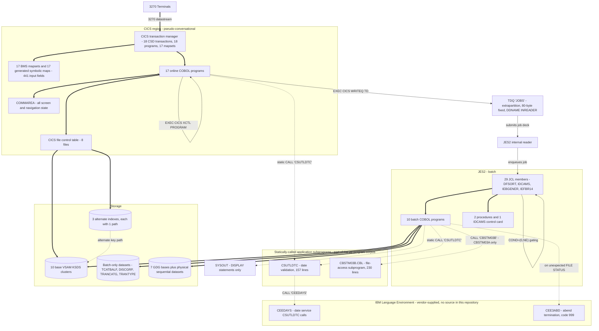
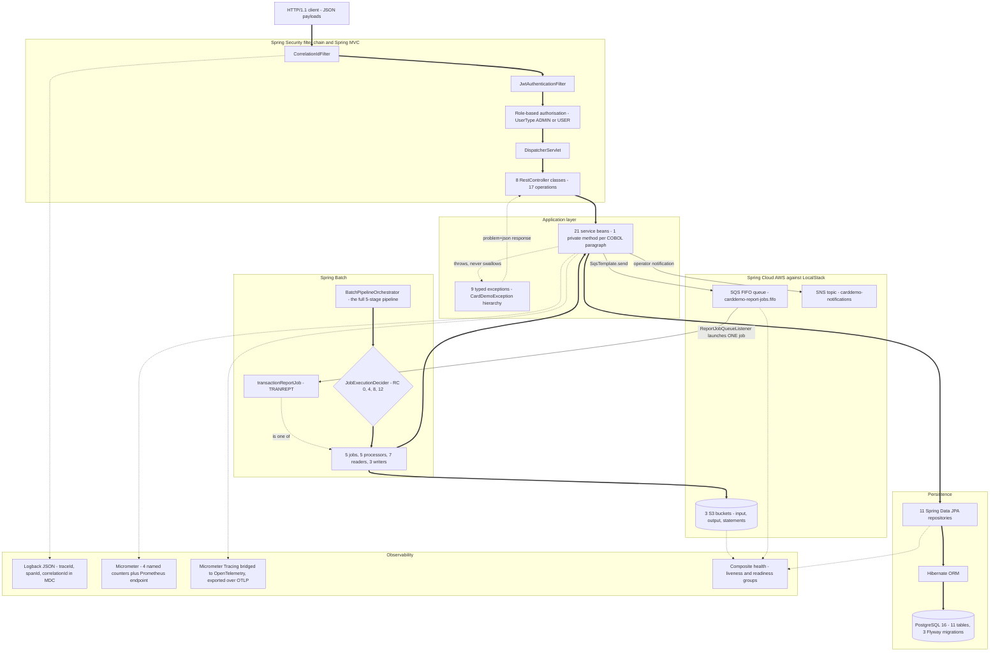
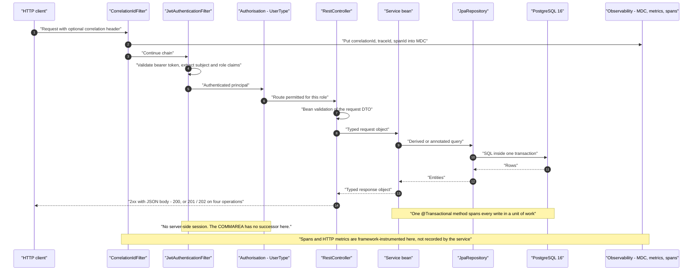
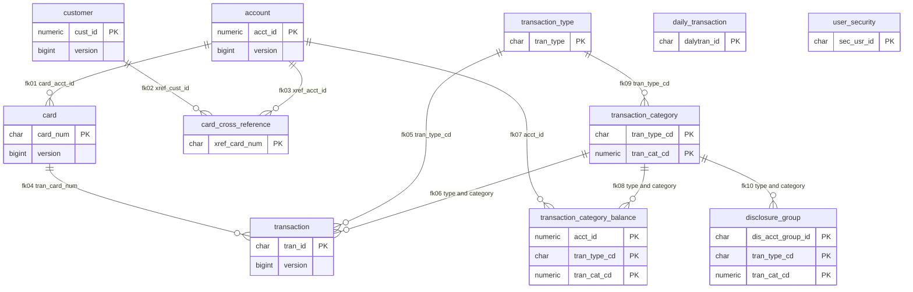
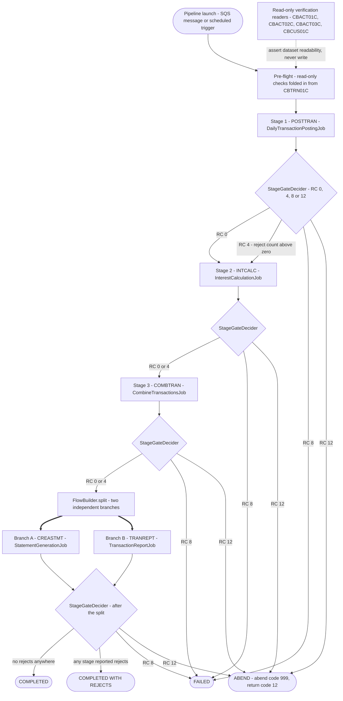
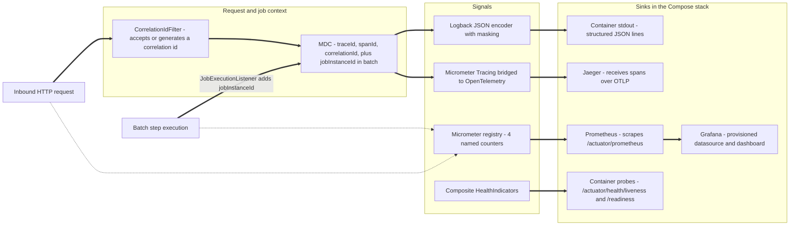
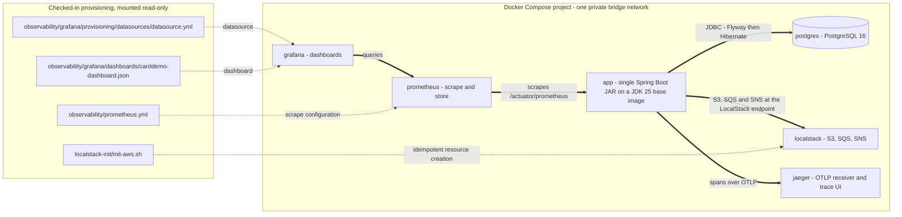
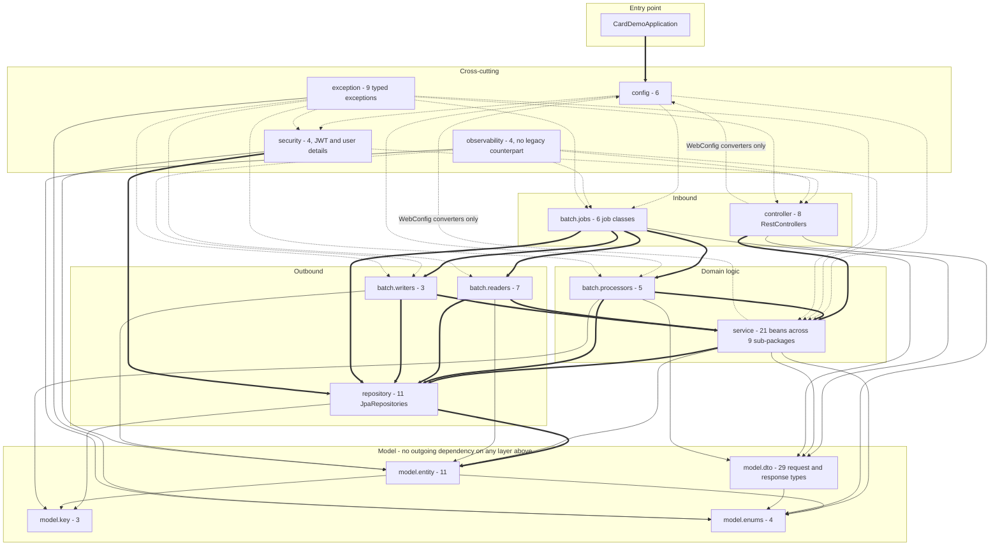
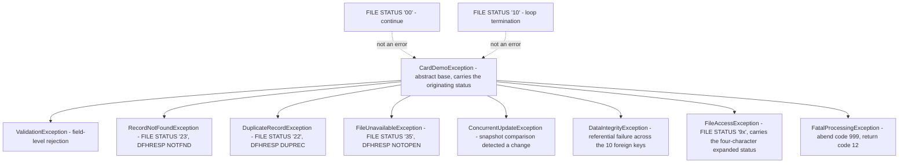

<!--
  ******************************************************************
  * Program     : architecture-before-after.md
  * Application : CardDemo
  * Type        : Documentation - side-by-side architectural comparison
  * Function    : Publishes the "before" and "after" architectures of the AWS
  *               CardDemo credit-card management application: the frozen z/OS
  *               system of record - CICS, VSAM, JCL, BMS, 3270 - beside the
  *               Java 25 / Spring Boot 3.5.11 modular monolith that replaces
  *               its execution substrate. 100% behavioural parity is the
  *               ACCEPTANCE CONTRACT and the design target of that
  *               replacement, and section 1.5 with the register in section 7.2
  *               states exactly which corroboration the retained comparison
  *               does and does not carry. Every layer, every mechanism
  *               substitution, every deliberate deviation and every preserved
  *               legacy quirk is named, diagrammed and cited.
  * Source      : app/csd/CARDDEMO.CSD, app/catlg/LISTCAT.txt, app/cbl/**,
  *               app/cpy/**, app/cpy-bms/**, app/bms/**, app/jcl/**,
  *               app/proc/REPROC.prc, app/proc/TRANREPT.prc,
  *               app/ctl/REPROCT.ctl, app/data/ASCII/**, diagrams/**,
  *               README.md, mkdocs.yml @ 7756d89
  ******************************************************************
  * Copyright Amazon.com, Inc. or its affiliates.
  * All Rights Reserved.
  *
  * Licensed under the Apache License, Version 2.0 (the "License").
  * You may not use this file except in compliance with the License.
  * You may obtain a copy of the License at
  *
  *    http://www.apache.org/licenses/LICENSE-2.0
  *
  * Unless required by applicable law or agreed to in writing,
  * software distributed under the License is distributed on an
  * "AS IS" BASIS, WITHOUT WARRANTIES OR CONDITIONS OF ANY KIND,
  * either express or implied. See the License for the specific
  * language governing permissions and limitations under the License
  ******************************************************************
-->

# Architecture Before and After

## 1. About this document

This page is the **architectural comparison of record** for the migration of the AWS
CardDemo credit-card management application from IBM Enterprise COBOL under CICS, VSAM,
JCL and BMS on z/OS to Java 25 LTS on Spring Boot 3.5.11.

**On parity, stated once and precisely.** Throughout this page, 100% behavioural parity is
**the contract the migration is held to** — the standard every mechanism substitution is
designed to meet and every validation gate exists to test. It is **not** a result this page
reports. Gate 1 is the gate that would establish it, and Gate 1 requires a retained
field-level comparison of this implementation's output against output captured from the frozen
COBOL. **No such legacy baseline exists in this repository**, so the comparison has not been
performed and parity is, as of this writing, unproven rather than proven. Where this page says
a substitution "must preserve" something, that is the obligation being stated; where it says a
deviation "changes" something, that is a departure from the contract being declared. Neither is
a measurement. [validation-gates.md](validation-gates.md) owns gate outcomes, and
[§7.2](#72-not-available-register) records exactly what is missing.

It answers three questions and nothing else:

1. **What was there?** The legacy system as it actually is, layer by layer, measured rather
   than remembered.
2. **What replaces it?** The target topology, layer by layer, with the mechanism chosen for
   each legacy construct.
3. **Why is it shaped that way?** In particular, why the target is a **single deployable
   modular monolith** and not a set of microservices — a conclusion forced by transactional
   atomicity in the source, not chosen by preference. That argument is [§4](#4-why-a-modular-monolith-is-mandatory).

The legacy corpus under `app/` is **frozen and read-only**. It is licensed under the Apache
License 2.0, copyright Amazon.com, Inc. or its affiliates — see the repository `LICENSE` and
`NOTICE`. The migration is **purely additive**: the Java tree is created at the repository
root as `src/`, in Maven standard layout, directly alongside `app/`. No COBOL program,
copybook, JCL member, BMS mapset or data file is edited, moved, renamed, reformatted or
deleted. `app/` keeps three roles simultaneously — parity oracle, field-contract source and
traceability anchor — and it loses all three the moment it is touched.

The anchor commit for every citation on this page is
`7756d895ffeb65f7ea72aaa609e356d9899afcec` (short `7756d89`). The Java package root is
`com.cardemo`, spelled that way uniformly in sources, tests, configuration and
documentation.

### 1.1 What this document is not

It is deliberately narrow, because four sibling documents own the detail and duplicating
them would put two copies of the same fact under two owners.

| Not covered here | Where it lives |
|---|---|
| Per-operation HTTP contracts — methods, paths, request and response fields, field widths, status codes, the error envelope | [api-contracts.md](api-contracts.md) |
| The validation-gate ledger, the evidence each gate produces and the residual-risk register | [validation-gates.md](validation-gates.md) |
| Environment provisioning, build, run and troubleshooting procedure step by step | [onboarding-guide.md](onboarding-guide.md) |
| The full transformation plan, scope boundaries, dependency inventory and per-file mapping | [technical-specifications.md](technical-specifications.md) |
| Every mechanism substitution and preserved quirk as a decision entry with rationale | `../DECISION_LOG.md` *(repository root, outside the MkDocs `docs_dir`)* |
| Paragraph-level mapping from all 28 COBOL programs to their Java methods | `../TRACEABILITY_MATRIX.md` *(repository root, outside the MkDocs `docs_dir`)* |
| A stakeholder-level summary of scope, evidence and risk | [executive-presentation.html](executive-presentation.html) |
| Documentation entry point | [index.md](index.md) |

Where this page needs one of those facts to make an architectural point, it states the fact
once and links. It never republishes a table that another document owns.

### 1.2 There is no user interface in the target, and none is implied

The legacy presentation layer is 3270 terminals driving BMS mapsets. **The target replaces
it with HTTP and JSON — nothing else.** To be explicit about what a reader might otherwise
assume:

* **No green-screen or 3270 emulation**, and no pseudo-conversational session emulation.
* **No single-page application, no web front end, no mobile client**, no component library
  and no design system. None is specified anywhere in the requirements, so none exists to
  align with.
* The 17 BMS symbolic maps are consumed **as DTO field contracts** — all 441 input fields —
  and are not reimplemented as a user interface.
* The only HTML artefacts in the repository are [executive-presentation.html](executive-presentation.html),
  a static stakeholder document, and the fixed 100-byte-per-line statement output that
  `CBSTM03A` emits from literal constants. Neither is an application interface.

### 1.3 Conventions used on this page

**Citations.** Every quantitative statement carries an inline citation of the form
`[<path>:<locator>]` pointing at the primary source that proves it. Where narrative prose
elsewhere in the repository disagrees with a figure here, **the source governs**, and the
divergence is recorded in the figure-verification ledger at [§8.1](#81-figure-verification-ledger)
rather than quietly absorbed.

**Diagrams.** Every diagram is a Mermaid fenced block. `mkdocs.yml` declares the `mermaid2`
plugin alongside `techdocs-core` and registers `mermaid` as a `pymdownx.superfences` custom
fence, so the blocks render as diagrams rather than as highlighted source
(the `plugins` and `markdown_extensions` blocks of [`mkdocs.yml`]), and `catalog-info.yaml`
publishes this directory through Backstage
TechDocs [`catalog-info.yaml:L22`]. No raster image, asset file, external diagramming
service or CDN is used, and none was added.

**Accessibility.** Every diagram carries three things, without exception: a **title** as the
heading immediately above it, a **legend** naming every shape, edge style and grouping
convention it uses, and a **prose equivalent** beneath it that conveys the same information
in text. A reader using a screen reader, or one whose renderer fails to load Mermaid, loses
nothing. The inventory at [§8.3](#83-diagram-inventory) counts diagrams, titles, legends and
prose equivalents and confirms the four counts agree.

**Legacy illustrations.** Six pre-existing illustrations are referenced by path and are not
embedded, because they are frozen reference material rather than artefacts of this
migration: `diagrams/CARDDEMO-DataModel.drawio`, `diagrams/Application-Flow-User.png`,
`diagrams/Application-Flow-Admin.png`, `diagrams/Main-Menu.png`, `diagrams/Admin-Menu.png`
and `diagrams/Signon-Screen.png` — six files in total. See [§8.2](#82-legacy-illustration-index).

### 1.4 Authoring-host environment and what was actually executed

As of **6 August 2026**, at commit `1363f491`, the authoring host has JDK 25.0.3, Apache Maven
3.9.11 (through the repository wrapper), Docker Engine 29.7.0 with `docker compose` v5.3.1,
Node v22.23.2, MkDocs 1.6.1 with the `techdocs-core` and `mermaid2` plugins, and mermaid-cli
(`mmdc`) 11.16.0 all present and invocable. Outbound internet access is available, which
matters because the rendered site fetches its Mermaid library from a CDN.

Three verifications were **executed** on that date rather than asserted. Each is stated with
the renderer or tool that produced it, because "the diagrams are valid" means nothing without
naming what validated them.

* **`mkdocs build --strict` completed with exit code 0**, against the **real `docs/` tree** —
  no scratch copy and no placeholder stubs. That distinction is load-bearing: a strict build run
  against a scratch copy carrying stubs for sibling documents proves nothing about the tree as
  committed. Every page, `docs/onboarding-guide.md` and `docs/executive-presentation.html`
  included, is on disk and registered in the `mkdocs.yml` nav.
* **The built page emits nine `<pre class="mermaid">` blocks and 33 rendered tables**, counted
  on the generated HTML, and **every one of the 484 same-page anchor links on this page's
  sibling `api-contracts.md` and on this page resolves to a generated heading identifier** — a
  strict build reports a dangling internal anchor, and it reported none.
* **All nine Mermaid blocks render, verified two independent ways.** Under **mermaid-cli
  11.16.0** each of the nine was extracted and rendered to SVG: nine invocations, nine
  successes, zero failures, output sizes 24 KB to 264 KB. And **in a real headless Chrome
  against the built and served site**, all nine produced an SVG in the DOM — ids `__mermaid_0`
  through `__mermaid_8`, each carrying `role="graphics-document document"` and an
  `aria-roledescription` matching its declared type (seven `flowchart-v2`, one `sequence`, one
  `er`) — with **zero Mermaid parse or syntax errors**, zero `.error-icon` elements, zero
  unrendered source blocks and no unhandled promise rejection.

**The diagrams are not validated under any mermaid 10.x line, and the browser run is what
establishes that.** The served page contains **no
Mermaid `<script>` tag at all** and makes **no request for mermaid 10.x**: the `mermaid2`
plugin logs a `10.4.0` library at build time but injects no loader into this build. What
actually executes is **Material for MkDocs' own bundled Mermaid integration**, which requests
`unpkg.com/mermaid@11/dist/mermaid.min.js` and receives a `302` to **mermaid 11.16.1**,
confirmed by the redirect target, the final request URL and the `version:"11.16.1"` string
inside the 3.57 MB body that was served. So the two validations above are both on the **11.x
line**, and **no evidence exists for 10.x behaviour** — that gap is recorded in
[§7.2](#72-not-available-register) rather than papered over.

**A second correction follows from the same run, and it matters to anyone who tries to repeat
the check.** Material's integration does not leave the SVG inline in the `<pre>`. It strips the
`mermaid` class, replaces the `<pre>` with a fresh `<div class="mermaid">`, and puts the SVG in
a shadow root opened with `mode: "closed"` — observed nine times, once per diagram. So on a
page where every diagram renders correctly, `document.querySelectorAll('pre.mermaid svg')`,
`div.mermaid svg` and `svg[id^="mermaid"]` all return **zero**. A durable check asserts
`document.querySelectorAll('div.mermaid').length === 9` **and**
`document.querySelectorAll('pre.mermaid').length === 0`, because a surviving `pre.mermaid` is
precisely the failed-render signature.

**One console error exists on every page of this site, and it is not caused by any document.**
`search/main.js:106` throws `Uncaught ReferenceError: base_url is not defined`. It is the stock
MkDocs search bootstrap, emitted because `techdocs-core` enables the `search` plugin while the
Material theme ships its own search through its bundle and never defines the `base_url` global
the stock script expects. It breaks the search web-worker, references nothing to do with
Mermaid, and is a theme-and-plugin wiring defect rather than a content defect — recorded here
because a reader who opens a developer console will see it, and disclosure is cheaper than a
surprise.

Provisioning detail belongs to [onboarding-guide.md](onboarding-guide.md); this note exists
only so that a reader knows exactly which claims on this page were executed and which were
not. What was **not** observed is recorded in the register at
[§7.2](#72-not-available-register).

### 1.5 What this page does not claim

This is an architecture document, not an evidence document. It describes the intended and
implemented topology, and it **does not report results**: it asserts no test count, no coverage
ratio, no performance figure and no validation-gate outcome. Those belong to
[validation-gates.md](validation-gates.md), which owns them, and this page points there rather than
restating them — because two documents publishing the same number is how one of them ends up stale.

**The reason it publishes none has changed, and the change is worth stating precisely.** When this
page was authored no run existed, and every place a result would go read *"Not available —
implementation/evidence not yet generated"*. Those runs have since happened: the topology described
here **has** been stood up against a real containerised database and cloud-service emulator, the
suites pass, and coverage and the performance baseline are measured. So the results are no longer
absent; they are simply **not this page's to publish**. How far that standing-up reached — including
the six-service compose topology, which has since been brought up as a unit in this working tree at
the commit the ledger names — is stated by the ledger, not summarised here.

The one thing this page **does** report about itself is its own render and link integrity,
because that is a property of this page rather than of the implementation:
[§1.4](#14-authoring-host-environment-and-what-was-actually-executed) states exactly what was
executed, under which tool and version, and on what date.

Where something genuinely is unavailable, it is named individually with its prerequisite in
[§7.2](#72-not-available-register) rather than covered by a blanket phrase. A blanket
*"Not available — implementation/evidence not yet generated"* is forbidden here, because it sweeps
together two different things — evidence that exists nowhere and evidence that exists in another
document — and reports both as missing.

One caveat deserves emphasis because it is easy to trip over. `docs/project-guide.md` is
retained **unchanged** as prior-run evidence, and its completion claims, test counts,
coverage figures and gate-pass statements describe **a previous attempt**. They are **not**
evidence for the current implementation and must not be cited as such.

---

## 2. Before: the z/OS architecture, frozen in `app/`

### 2.0 Diagram 1: Legacy z/OS topology


```mermaid
graph TD
    TERM["3270 Terminals"]

    subgraph ONLINE["CICS region - pseudo-conversational"]
        CICSR["CICS transaction manager - 18 CSD transactions, 18 programs, 17 mapsets"]
        MAPS["17 BMS mapsets and 17 generated symbolic maps - 441 input fields"]
        PGMS["17 online COBOL programs"]
        COMMAREA["COMMAREA - all screen and navigation state"]
        FCT["CICS file control table - 8 files"]
    end

    subgraph BATCH["JES2 - batch"]
        JCL["29 JCL members - DFSORT, IDCAMS, IEBGENER, IEFBR14"]
        BPGMS["10 batch COBOL programs"]
        PROCS["2 procedures and 1 IDCAMS control card"]
    end

    subgraph SUBS["Statically-called application subprograms - part of the 28-program corpus"]
        DTC["CSUTLDTC - date validation, 157 lines"]
        SUBP["CBSTM03B.CBL - file-access subprogram, 230 lines"]
    end

    subgraph LE["IBM Language Environment - vendor-supplied, no source in this repository"]
        CEED["CEEDAYS - date service CSUTLDTC calls"]
        ABD["CEE3ABD - abend termination, code 999"]
    end

    subgraph STORE["Storage"]
        KSDS[("10 base VSAM KSDS clusters")]
        AIX[("3 alternate indexes, each with 1 path")]
        BONLY[("Batch-only datasets - TCATBALF, DISCGRP, TRANCATG, TRANTYPE")]
        GDG[("7 GDG bases plus physical sequential datasets")]
    end

    TDQ["TDQ 'JOBS' - extrapartition, 80-byte fixed, DDNAME INREADER"]
    IREADER["JES2 internal reader"]
    SYSOUT["SYSOUT - DISPLAY statements only"]

    TERM ==>|"3270 datastream"| CICSR
    CICSR ==> MAPS
    CICSR ==> PGMS
    PGMS <==> COMMAREA
    PGMS -->|"EXEC CICS XCTL PROGRAM"| PGMS
    PGMS ==> FCT
    FCT ==> KSDS
    FCT ==> AIX
    AIX -.->|"alternate key path"| KSDS

    PGMS -->|"EXEC CICS WRITEQ TD"| TDQ
    TDQ -->|"submits job deck"| IREADER
    IREADER -->|"enqueues job"| JCL

    JCL ==> BPGMS
    JCL ==> PROCS
    BPGMS ==> KSDS
    BPGMS ==> BONLY
    BPGMS ==> GDG
    JCL -->|"COND=(0,NE) gating"| JCL

    PGMS -.->|"static CALL 'CSUTLDTC'"| DTC
    BPGMS -.->|"static CALL 'CSUTLDTC'"| DTC
    BPGMS -.->|"CALL 'CBSTM03B' - CBSTM03A only"| SUBP
    DTC -.->|"CALL 'CEEDAYS'"| CEED
    BPGMS -.->|"on unexpected FILE STATUS"| ABD
    BPGMS -.-> SYSOUT
```

**Legend.**

| Element | Meaning |
|---|---|
| Rectangle | A program, a component or a runtime construct |
| Cylinder `[( )]` | A persistent dataset or dataset family |
| `subgraph` box | A runtime boundary — the CICS region, JES2, the statically-called application subprograms, the vendor-supplied Language Environment, or storage |
| Thick arrow `==>` | The primary data or control path exercised on every transaction or job |
| Thin arrow `-->` | A discrete, named operation, labelled with the construct that performs it |
| Dashed arrow `-.->` | An auxiliary relationship — a static subprogram call, an index-to-base resolution, or diagnostic output |
| Self-directed arrow | Dispatch or gating that stays inside the same layer — `XCTL` between online programs, `COND` between JCL steps |

**Prose equivalent.** 3270 terminals send a datastream to a CICS region running in
pseudo-conversational mode. The region dispatches one of 18 catalogued transactions, pairs it
with one of 17 BMS mapsets and their 17 generated symbolic maps — 441 input fields in total —
and runs one of 17 online COBOL programs. Those programs keep every scrap of screen and
navigation state in the COMMAREA, which they read on entry and rewrite on exit, and they
transfer control to one another with `EXEC CICS XCTL`. Data reaches them through a CICS file
control table of exactly 8 files, which resolves onto 10 base VSAM KSDS clusters plus 3
alternate indexes, each fronted by one path that resolves back to its base cluster. Four
further datasets — `TCATBALF`, `DISCGRP`, `TRANCATG` and `TRANTYPE` — have no CICS
definition at all and are reachable only from batch.

The batch half is JES2 executing 29 JCL members, which invoke 10 batch COBOL programs plus
DFSORT, IDCAMS, IEBGENER and IEFBR14 utility steps, two procedures and one IDCAMS control
card, with step-to-step gating expressed as `COND=(0,NE)` return-code tests. Batch programs
read and write the same KSDS clusters, the four batch-only datasets, and 7 generation data
group families plus physical sequential datasets.

**Two subprograms sit outside both halves, and the boundary matters.** `CSUTLDTC` (157 lines)
and `CBSTM03B.CBL` (230 lines) are **application COBOL** — two of the 28 programs in `app/cbl/`
— reached by static `CALL` rather than by transaction dispatch or a JCL `EXEC PGM`. An earlier
revision of this diagram drew both inside the Language Environment box, which was wrong twice
over: it implied they are vendor-supplied when their source is in this repository, and it
double-counted `CBSTM03B` against the "10 batch COBOL programs" node, of which it is one. The
Language Environment supplies only `CEEDAYS`, which `CSUTLDTC` calls, and `CEE3ABD`, which the
abend routine calls — **neither has source anywhere in this repository**. Note also that
`CBSTM03A.CBL` and `CBSTM03B.CBL` are the two members of `app/cbl/` with an **upper-case**
`.CBL` extension, so a `app/cbl/*.cbl` glob silently drops both — the same case-sensitivity
hazard that `app/jcl/CREASTMT.JCL` presents.

`CBSTM03B` is called from exactly one place: `CBSTM03A`. It is not a general-purpose utility,
and the arrow is labelled accordingly rather than drawn from the batch group as a whole.

The two halves meet at exactly one place: an online program writes an 80-byte fixed-length
job deck to the extrapartition transient data queue `JOBS`, whose `DDNAME(INREADER)` hands it
to the JES2 internal reader, which enqueues the job. That is the only closed feedback path
between online and batch in the entire system.

Cutting across both halves, the IBM Language Environment supplies date validation through a
static call to `CSUTLDTC` over `CEEDAYS`, file-access indirection through a static call to
`CBSTM03B`, and abend termination through `CEE3ABD`. The only instrumentation anywhere is
`DISPLAY` to SYSOUT.

### 2.1 Presentation: 3270 and BMS

Screen layout comes from **17 BMS mapsets** (`app/bms/**`, 4,472 lines) with **17 generated
symbolic maps** (`app/cpy-bms/**`, 5,632 lines) carrying **441 input fields** in total. The
per-map distribution, machine-counted from the `<name>I` data items in each member, is:

| Symbolic map | Input fields | Symbolic map | Input fields |
|---|--:|---|--:|
| `COACTUP` | 54 | `COSGN00` | 11 |
| `COACTVW` | 37 | `COTRN00` | 59 |
| `COADM01` | 20 | `COTRN01` | 21 |
| `COBIL00` | 10 | `COTRN02` | 21 |
| `COCRDLI` | 45 | `COUSR00` | 59 |
| `COCRDSL` | 15 | `COUSR01` | 12 |
| `COCRDUP` | 17 | `COUSR02` | 12 |
| `COMEN01` | 20 | `COUSR03` | 11 |
| `CORPT00` | 17 | **Total** | **441** |

The three highest counts are explained by row arrays rather than by richer screens:
`COTRN00` and `COUSR00` carry ten-row tables — `TRNID01I` through `TRNID10I` and `USRID01I`
through `USRID10I` — and `COCRDLI` carries seven, `CRDSEL1I` through `CRDSEL7I`. Those row
counts *are* the legacy pagination sizes, and they are preserved in the target verbatim.

Every screen field is generated as a **quintuple**: a `COMP PIC S9(4)` length field, an
attribute byte, a redefined attribute alias, four reserved bytes, and the data field itself.
Each map group is preceded by a **twelve-byte terminal I/O area header**
[`app/cpy-bms/COACTUP.CPY:L17-L24`]. Six header fields recur on all seventeen maps —
`TRNNAME X(4)`, `TITLE01 X(40)`, `CURDATE X(8)`, `PGMNAME X(8)`, `TITLE02 X(40)` and
`CURTIME` — with one asymmetry worth recording because a DTO that got it wrong would drift:
`CURTIME` is `X(8)` on sixteen maps and `X(9)` on `COSGN00.CPY` alone.

Those 441 fields are the **field budget for the target DTOs**. Names, types and lengths are
taken from the symbolic maps exactly; neither silent truncation nor silent widening is
permitted, because a widened field passes every test that does not assert the contract.

### 2.2 Conversational state: the COMMAREA

Screen and navigation state lives in the COMMAREA, declared in the LINKAGE SECTION as a
variable-length area:

* `01 DFHCOMMAREA.` with `05 FILLER PIC X(1) OCCURS 1 TO 32767 TIMES DEPENDING ON EIBCALEN`
  [`app/cbl/COCRDLIC.cbl:L293-L295`].
* Its typed shape is the copybook `app/cpy/COCOM01Y.cpy`, carrying routing fields
  (`CDEMO-FROM-TRANID`, `CDEMO-FROM-PROGRAM`, `CDEMO-TO-TRANID`, `CDEMO-TO-PROGRAM`),
  identity (`CDEMO-USER-ID`, `CDEMO-USER-TYPE`), a re-entry flag
  (`CDEMO-PGM-CONTEXT` with `88 CDEMO-PGM-ENTER VALUE 0` and `88 CDEMO-PGM-REENTER VALUE 1`
  [`app/cpy/COCOM01Y.cpy:L30-L31`]), business keys (`CDEMO-CUST-ID`, `CDEMO-ACCT-ID`,
  `CDEMO-CARD-NUM`) and last-screen state (`CDEMO-LAST-MAP`, `CDEMO-LAST-MAPSET`).
* Navigation is `EXEC CICS XCTL PROGRAM(...) COMMAREA(CARDDEMO-COMMAREA)`
  [`app/cbl/COMEN01C.cbl:L153-L155`] — the area is the vehicle that carries context across a
  program transfer.

The COMMAREA appears as a first-class element in Diagram 1 on purpose: **its elimination is
the defining change in the online layer.** Everything the target does differently online —
stateless requests, JWT claims, URL-based routing, pagination in query parameters — follows
from removing it. The field-by-field disposition is [§3.9.2](#392-the-commarea-split).

### 2.3 Application: 28 COBOL programs, 19,254 lines

| Class | Count | Notes |
|---|--:|---|
| Online transaction programs | 17 | One per sourced CSD transaction |
| Batch programs | 10 | `CBACT01C`, `CBACT02C`, `CBACT03C`, `CBACT04C`, `CBCUS01C`, `CBSTM03A`, `CBSTM03B`, `CBTRN01C`, `CBTRN02C`, `CBTRN03C` |
| Statically-called utility | 1 | `CSUTLDTC`, 157 lines — date validation, absent from the CSD |
| **Total** | **28** | **19,254 lines** |

**A glob hazard that costs 1,154 lines.** `app/cbl/CBSTM03A.CBL` (924 lines) and
`app/cbl/CBSTM03B.CBL` (230 lines) use an **uppercase `.CBL` extension** while the other 26
use lowercase `.cbl`. A `*.cbl` pattern therefore yields 26 files and **18,100** of the
19,254 lines, silently dropping the entire statement-generation subsystem. Case-insensitive
matching is required anywhere this directory is enumerated.

Four of the batch programs — `CBACT01C`, `CBACT02C`, `CBACT03C` and `CBCUS01C` — have a verb
inventory of `OPEN`, `READ` and `CLOSE` only, with no `WRITE`, `REWRITE` or `DELETE`
anywhere. A fifth, `CBTRN01C` (491 lines), is likewise read-only. That single fact determines
their target shape: they become read-only verification steps, not writers.

### 2.4 Transaction routing, and the 17-versus-18 reconciliation

`app/csd/CARDDEMO.CSD` defines **18 transactions, 18 programs and only 17 mapsets** —
machine-counted as 18 `DEFINE TRANSACTION`, 18 `DEFINE PROGRAM` and 17 `DEFINE MAPSET`
statements. Seventeen transaction-to-program pairs have both a source file and a mapset:

| CSD | Program | CSD | Program | CSD | Program |
|---|---|---|---|---|---|
| `CC00` | `COSGN00C` | `CCLI` | `COCRDLIC` | `CA00` | `COADM01C` |
| `CM00` | `COMEN01C` | `CCDL` | `COCRDSLC` | `CU00` | `COUSR00C` |
| `CAVW` | `COACTVWC` | `CCUP` | `COCRDUPC` | `CU01` | `COUSR01C` |
| `CAUP` | `COACTUPC` | `CT00` | `COTRN00C` | `CU02` | `COUSR02C` |
| `CB00` | `COBIL00C` | `CT01` | `COTRN01C` | `CU03` | `COUSR03C` |
| `CR00` | `CORPT00C` | `CT02` | `COTRN02C` | | |

The eighteenth pair is `CDV1 → COCRDSEC`, and **`COCRDSEC` has no source file anywhere in
this repository.** Its only two occurrences repository-wide are the CSD definitions
themselves — `DEFINE PROGRAM(COCRDSEC) GROUP(CARDDEMO)` [`app/csd/CARDDEMO.CSD:L211`] and
`PROGRAM(COCRDSEC) TWASIZE(0) PROFILE(DFHCICST) STATUS(ENABLED)` [`:L390`]. It is a dangling
legacy definition with nothing to translate.

So the arithmetic is: **17 sourced screen programs + 1 orphan CSD definition = 18 CSD entries
→ 17 REST routes.** Independent corroboration comes from the repository's own inventory: the
*Online* table under `README.md`'s `#### **Online**` heading lists exactly 17 rows and
contains no `CDV1` row.
**No route, endpoint or placeholder is published for that transaction, and none should be
inferred from any diagram on this page.**

Two further programs sit outside the CSD entirely: `CSUTLDTC` is a statically-called
subprogram, and `CBSTM03A` and `CBSTM03B` are batch.

### 2.5 Data: VSAM

`app/catlg/LISTCAT.txt` is 3,956 lines of authoritative physical specification, and its own
summary block settles the counts: `AIX 3` [`app/catlg/LISTCAT.txt:L3938`],
`CLUSTER 10` [`:L3940`], `GDG 7` [`:L3942`], `PATH 3` [`:L3946`].

**Exactly 10 base KSDS clusters**, all named `AWS.M2.CARDDEMO.<name>.VSAM.KSDS`:

| Cluster | Catalogue line | Key length | Average record length | Online? |
|---|--:|--:|--:|:--:|
| `ACCTDATA` | L22 | 11 | 300 | yes |
| `CARDDATA` | L164 | 16 | 150 | yes |
| `CARDXREF` | L365 | 16 | 50 | yes |
| `CUSTDATA` | L595 | 9 | 500 | yes |
| `DISCGRP` | L859 | 16 | 50 | **no** |
| `TCATBALF` | L1334 | 17 | 50 | **no** |
| `TRANCATG` | L1440 | 6 | 60 | **no** |
| `TRANSACT` | L3555 | 16 | 350 | yes |
| `TRANTYPE` | L3742 | 2 | 60 | **no** |
| `USRSEC` | L3846 | 8 | 80 | yes |

`USRSEC` geometry is not catalogued with the others; it is authoritatively
`KEYS(8,0) RECORDSIZE(80,80) REUSE INDEXED` from its defining job
[`app/jcl/DUSRSECJ.jcl:L64-L69`].

**Three alternate indexes, each with a path — not two.** This matters because each one
becomes a finder method and a database index in the target, and a missing one is a silently
absent access path:

| Alternate index | AIX line | Path line | Physical placement |
|---|--:|--:|---|
| `CARDDATA.VSAM.AIX` | L254 | L150 | `KEYLEN 11, RKP 5, AXRKP 16` [`app/catlg/LISTCAT.txt:L281-L283`] — the alternate key sits at byte 16 of the base record, i.e. the account identifier inside the card record |
| `CARDXREF.VSAM.AIX` | L455 | L351 | account identifier over the card cross-reference |
| `TRANSACT.VSAM.AIX` | L3645 | L3541 | `KEYLEN 26, AXRKP 304` — the processing timestamp |

Record layouts are fixed-width, with `COMP-3` packed decimal and zoned-decimal signed
numerics throughout. Signed money fields carry a **trailing-sign overpunch**, which is why a
naive text load of the seed fixtures produces wrong values and why the target's seed
migration decodes position-aware from the PIC clauses.

### 2.6 Batch orchestration: JES2 and JCL

JES2 executes **29 JCL members**: 28 with a lowercase `.jcl` extension plus **`CREASTMT.JCL`
with an uppercase extension**, which a `*.jcl` glob silently omits and which is the *sole*
source for statement generation. This is the one place where a naive pattern makes an entire
feature disappear from scope, so every enumeration of `app/jcl/**` must be case-insensitive.

Utility steps use DFSORT, IDCAMS, IEBGENER and IEFBR14. Step-to-step gating is expressed as
`COND=(0,NE)` return-code tests — three of them in the statement job alone
[`app/jcl/CREASTMT.JCL:L56`, `:L66`, `:L79`].

Alongside the members sit **two procedures** and **one control card**:

* `app/proc/REPROC.prc` — an IDCAMS `REPRO` wrapper whose `SYSIN` resolves to
  `&CNTLLIB(REPROCT)` [`app/proc/REPROC.prc:L21-L28`].
* `app/proc/TRANREPT.prc` — the three-step report procedure: unload, filtered sort, report.
* `app/ctl/REPROCT.ctl` — a single IDCAMS control statement,
  `REPRO INFILE(FILEIN) OUTFILE(FILEOUT)` [`app/ctl/REPROCT.ctl:L15`].

Five members carry the batch business logic that exists nowhere else: `POSTTRAN.jcl`,
`INTCALC.jcl`, `COMBTRAN.jcl`, `CREASTMT.JCL` and `TRANREPT.jcl`. Two of those deserve
advance warning because their logic is *not* in any COBOL program:

* **`COMBTRAN.jcl` has no COBOL program at all.** Its work is a DFSORT step over a
  concatenated input [`app/jcl/COMBTRAN.jcl:L23-L30`] followed by an IDCAMS `REPRO`
  [`:L48`]. The JCL itself is the source of truth.
* **`CREASTMT.JCL`** performs a projection inside its sort that changes the record shape —
  see [§3.7](#371-the-three-sort-specifications).

### 2.7 Generation data groups: 7 bases

Seven GDG bases exist, each catalogued in `app/catlg/LISTCAT.txt`: `DALYREJS` [L684],
`SYSTRAN` [L1098], `TCATBALF.BKUP` [L1202], `TRANREPT` [L1527], `TRANSACT.BKUP` [L1631],
`TRANSACT.COMBINED` [L2919] and `TRANSACT.DALY` [L3021].

**A retention conflict exists in the source and cannot be propagated unresolved.** The report
group is declared with `LIMIT(5)` in one job [`app/jcl/DEFGDGB.jcl:L37-L38`] and with
`LIMIT(10)` in another [`app/jcl/REPTFILE.jcl:L26-L27`]. Because the target must choose one
object-lifecycle value, this is the single legacy inconsistency that is *resolved* rather
than merely logged — resolved in favour of 10, and recorded as a deviation. See
[§5.3](#53-deviations-labelled-as-deviations-and-not-as-parity).

### 2.8 The online-to-batch bridge: TDQ `JOBS`

The one closed feedback path in the legacy system is a transient data queue, defined as
[`app/csd/CARDDEMO.CSD:L499-L505`]:

```text
DEFINE TDQUEUE(JOBS) GROUP(CARDDEMO)
DESCRIPTION(SUBMIT JOBS FROM CICS)
       TYPE(EXTRA) DATABUFFERS(1) DDNAME(INREADER) ERROROPTION(IGNORE)
       OPENTIME(INITIAL) TYPEFILE(OUTPUT) RECORDSIZE(80)
       RECORDFORMAT(FIXED) BLOCKFORMAT(UNBLOCKED) DISPOSITION(MOD)
```

`CORPT00C` carries an entire job deck as **17 eighty-byte literal card images**
[`app/cbl/CORPT00C.cbl:L83-L125`], redefined as an array of up to one thousand cards
(`05 JOB-LINES OCCURS 1000 TIMES PIC X(80)` [`:L127`]). The submission loop walks that array,
sets a termination flag when the card is the `/*EOF` marker or blank or low values, and
writes the card [`:L498-L508`] — so the terminating card *is* written before the loop exits.
The write paragraph, whose name is misspelled `WIRTE-JOBSUB-TDQ` in the source, issues
`EXEC CICS WRITEQ TD QUEUE('JOBS')` and on failure produces the exact screen message
`Unable to Write TDQ (JOBS)...` [`:L515-L535`]. Both dates are injected through named
subfields positioned inside filler groups whose lengths are chosen so that each card totals
exactly eighty bytes.

`DDNAME(INREADER)` is what makes the queue a job-submission channel: the JES2 internal reader
consumes it. `RECORDSIZE(80)` with `RECORDFORMAT(FIXED)` is the record contract the target
message must reproduce.

### 2.9 The online file-control table: 8 CICS files, and 4 datasets that are batch-only

The CSD declares exactly **8** files: `ACCTDAT`, `CARDAIX`, `CARDDAT`, `CCXREF`, `CUSTDAT`,
`CXACAIX`, `TRANSACT`, `USRSEC`.

The consequence is architectural, not trivia: **`TCATBALF`, `DISCGRP`, `TRANCATG` and
`TRANTYPE` have no online definition whatsoever.** They are batch-only datasets. That single
fact shapes two things in the target — the authorisation model, because no online role ever
needs to reach them, and the integration-test surface, because their only exercising path is
a batch job.

### 2.10 Cross-cutting services

* **Date validation.** `CALL 'CSUTLDTC'` over the Language Environment `CEEDAYS` service,
  with a parameter block of a date, a format string and a result group of severity code,
  filler and message number. The *outcomes* — accept or reject — are the contract, not merely
  whether a string parses.
* **File-access indirection.** `CALL 'CBSTM03B' USING WS-M03B-AREA`, a shared area of a DD
  name, a one-character operation, a two-character return code, a key, a key length and a
  thousand-byte payload. Both `'00'` and `'04'` count as success — but **only at the nine
  `CBSTM03B` call sites inside `CBSTM03A`, and nowhere else in the corpus.** Reading it as a
  corpus-wide rule is the mistake to avoid.
  `grep -rn "'04'" app/cbl/` returns exactly nine hits, all in
  `app/cbl/CBSTM03A.CBL` [`:736`, `:748`, `:771`, `:789`, `:807`, `:862`, `:879`, `:895`,
  `:911`], each of the form `IF WS-M03B-RC = '00' OR '04'`. Every other I/O guard in the
  corpus — the universal `FILE STATUS` idiom described in [§6](#6-error-taxonomy-configuration-and-failure-modes) —
  accepts `'00'` alone. Widening `'04'` to all I/O paths would silently accept a condition the
  other 27 programs abend on.
* **Abend termination.** `9999-ABEND-PROGRAM` displays a message, zeroes a timing field,
  moves **999** into the abend code and calls `CEE3ABD`
  [`app/cbl/CBTRN02C.cbl:L707-L711`].

### 2.11 Authorisation

The legacy authorisation model has two layers, and it is important not to over-claim about
either.

1. **Program-enforced role logic.** A single-character user type carried in the COMMAREA,
   with the condition names `88 CDEMO-USRTYP-ADMIN VALUE 'A'`
   [`app/cpy/COCOM01Y.cpy:L27`] and `88 CDEMO-USRTYP-USER VALUE 'U'` [`:L28`], tested inside
   program logic and sourced from the `USRSEC` dataset. Credentials in `USRSEC` are
   **plaintext**.
2. **CICS transaction-level security defined in the CSD.** Each `DEFINE TRANSACTION` carries
   a transaction security profile, and the surrounding mainframe convention is a RACF-style
   external security manager.

**No RACF profile definition exists anywhere in this repository**, so no specific profile,
class or permission is asserted here. What can be evidenced is exactly the two layers above:
CSD-declared and program-enforced, with an external security manager as the platform
convention around them.

### 2.12 Observability: none

Stated plainly, because it is the single largest capability gap the migration closes: **the
entire 19,254-line corpus contains no instrumentation whatsoever.** There are no metrics, no
traces, no spans, no correlation identifier, no health endpoint, no structured log record and
no log aggregation. What exists is:

* `DISPLAY` statements to SYSOUT, including the end-of-run counters
  `DISPLAY 'TRANSACTIONS PROCESSED :'` and `DISPLAY 'TRANSACTIONS REJECTED  :'`
  [`app/cbl/CBTRN02C.cbl:L227-L228`].
* One four-character status renderer, `9910-DISPLAY-IO-STATUS`
  [`app/cbl/CBTRN02C.cbl:L714-L727`], which emits the literal prefix `FILE STATUS IS: NNNN`
  followed by a four-character status. When the status is non-numeric or its first byte is
  `'9'`, the first byte passes through and the second is expanded from a binary field into
  three digits; otherwise the field is four zeros with the two status characters at positions
  three and four.

That rendering is a **contract, not an implementation detail** — parity comparison reads log
output, so a differently formatted status is a diff. The target reproduces it byte for byte
while adding the observability layer described in [§3.10](#310-observability-entirely-new-capability).

Two jobs stand in for what would today be health checking: `app/jcl/OPENFIL.jcl` and
`app/jcl/CLOSEFIL.jcl` drive `CEMT SET FIL(...) OPE` and `CLO` through SDSF to make datasets
available to, or withdraw them from, the online region [`app/jcl/OPENFIL.jcl:L22-L30`].

---

## 3. After: the Java 25 / Spring Boot 3.5.11 architecture, in `src/`

### 3.0 Deployment shape: same repository, in place

The Java tree is created **at the repository root as `src/`**, in Maven standard layout,
**directly alongside the frozen `app/` tree**. New root-level artefacts — `pom.xml`, `mvnw`,
`mvnw.cmd`, `.mvn/`, `Dockerfile`, `docker-compose.yml`, `.dockerignore`, `.gitignore`,
`.gitattributes`, `.editorconfig`, `.env.example`, `localstack-init/`, `observability/`,
`.github/`, `DECISION_LOG.md` and `TRACEABILITY_MATRIX.md` — sit beside the existing `app/`,
`docs/`, `diagrams/` and `samples/` directories.

To be unambiguous, because two other shapes were considered and rejected: there is **no
sub-directory wrapper** holding the Java tree, and **no new or standalone repository**. One
repository, two trees, one of them frozen.

### 3.1 Diagram 2: Target application topology


```mermaid
graph TD
    CLIENT["HTTP/1.1 client - JSON payloads"]

    subgraph WEB["Spring Security filter chain and Spring MVC"]
        CIDF["CorrelationIdFilter"]
        JWTF["JwtAuthenticationFilter"]
        RBAC["Role-based authorisation - UserType ADMIN or USER"]
        DS["DispatcherServlet"]
        CTRL["8 RestController classes - 17 operations"]
    end

    subgraph APP["Application layer"]
        SVC["21 service beans - 1 private method per COBOL paragraph"]
        EXC["9 typed exceptions - CardDemoException hierarchy"]
    end

    subgraph PERSIST["Persistence"]
        REPO["11 Spring Data JPA repositories"]
        HIB["Hibernate ORM"]
        PG[("PostgreSQL 16 - 11 tables, 3 Flyway migrations")]
    end

    subgraph BATCHL["Spring Batch"]
        ORCH["BatchPipelineOrchestrator - the full 5-stage pipeline"]
        RPTJOB["transactionReportJob - TRANREPT"]
        JOBS["5 jobs, 5 processors, 7 readers, 3 writers"]
        DEC{"JobExecutionDecider - RC 0, 4, 8, 12"}
    end

    subgraph INTEG["Spring Cloud AWS against LocalStack"]
        S3[("3 S3 buckets - input, output, statements")]
        SQS["SQS FIFO queue - carddemo-report-jobs.fifo"]
        SNS["SNS topic - carddemo-notifications"]
    end

    subgraph OBSV["Observability"]
        LOG["Logback JSON - traceId, spanId, correlationId in MDC"]
        MET["Micrometer - 4 named counters plus Prometheus endpoint"]
        TRC["Micrometer Tracing bridged to OpenTelemetry, exported over OTLP"]
        HLTH["Composite health - liveness and readiness groups"]
    end

    CLIENT ==> CIDF
    CIDF ==> JWTF
    JWTF ==> RBAC
    RBAC ==> DS
    DS ==> CTRL
    CTRL ==> SVC
    SVC ==> REPO
    REPO ==> HIB
    HIB ==> PG
    SVC -.->|"throws, never swallows"| EXC
    EXC -.->|"problem+json response"| CTRL

    SVC -->|"SqsTemplate.send"| SQS
    SQS -->|"ReportJobQueueListener launches ONE job"| RPTJOB
    RPTJOB -.->|"is one of"| JOBS
    ORCH ==> DEC
    DEC ==> JOBS
    JOBS ==> SVC
    JOBS ==> S3
    SVC -->|"operator notification"| SNS

    CIDF -.-> LOG
    SVC -.-> MET
    SVC -.-> TRC
    REPO -.-> HLTH
    S3 -.-> HLTH
    SQS -.-> HLTH
```

**Legend.**

| Element | Meaning |
|---|---|
| Rectangle | A Spring bean, filter, component or component group |
| Cylinder `[( )]` | A persistent store — the relational database or an object-storage bucket family |
| Diamond `{ }` | A decision point — the batch decider that replaces JCL `COND` gating |
| `subgraph` box | An architectural layer inside the single deployable JAR, except `INTEG`, which is external infrastructure reached over the network |
| Thick arrow `==>` | The primary request or job path exercised on every call |
| Thin arrow `-->` | A discrete named operation, labelled with the mechanism that performs it |
| Dashed arrow `-.->` | A cross-cutting relationship — error propagation, signal emission, or a health probe |

**Prose equivalent.** An HTTP/1.1 client sends JSON to the application. The request passes
through `CorrelationIdFilter`, which establishes the thread of identity, then
`JwtAuthenticationFilter`, which validates the bearer token, then role-based authorisation
driven by the `UserType` claim, then the `DispatcherServlet`, and lands on one of 8
`@RestController` classes exposing 17 operations. Controllers delegate to 21 service beans,
which reach data through 11 Spring Data JPA repositories over Hibernate against PostgreSQL 16
whose schema is established by 3 Flyway migrations. Every I/O path raises one of 9 typed
exceptions rather than swallowing a failure, and the exception layer renders a
`problem+json` response.

Report submission publishes to an SQS FIFO queue. A listener on that queue,
`BatchConfig.ReportJobQueueListener`, stands in for the JES2 internal reader — but **it launches
exactly one job, `transactionReportJob`, and never the orchestrator.** Drawing the queue edge
into `BatchPipelineOrchestrator` would overstate the blast radius of a single report submission
by four jobs. The listener's constructor
takes one `Job`, the report job; it builds job parameters from the report name, the two dates
and the SQS deduplication identifier, and calls `JobLauncher.run` with that job. This is the
faithful reading of the source: the legacy deck the listener replaces contains the single card
`//STEP10 EXEC PROC=TRANREPT` [`app/cbl/CORPT00C.cbl:L93-L94`], which starts the report
procedure alone.

`BatchPipelineOrchestrator` runs the full five-stage pipeline on its own trigger, gating each
stage through a `JobExecutionDecider` mapping return codes 0, 4, 8 and 12, then running the
jobs, processors, readers and writers, which reuse the same service beans and write their
outputs to three S3 buckets. `transactionReportJob` is one of those five, which is why the
dashed "is one of" edge is drawn rather than a second copy of the node. Operator notification
goes to an SNS topic. All three AWS services are reached at a LocalStack endpoint.

Cutting across everything, the correlation filter feeds Logback's JSON encoder, services feed
Micrometer counters and OpenTelemetry spans, and the repository, bucket and queue clients each
contribute to a composite health endpoint with separate liveness and readiness groups.

### 3.2 Diagram 3: Online request path, end to end


```mermaid
sequenceDiagram
    autonumber
    participant C as "HTTP client"
    participant F1 as "CorrelationIdFilter"
    participant F2 as "JwtAuthenticationFilter"
    participant A as "Authorisation - UserType"
    participant R as "RestController"
    participant S as "Service bean"
    participant P as "JpaRepository"
    participant D as "PostgreSQL 16"
    participant O as "Observability - MDC, metrics, spans"

    C->>F1: "Request with optional correlation header"
    F1->>O: "Put correlationId, traceId, spanId into MDC"
    F1->>F2: "Continue chain"
    F2->>F2: "Validate bearer token, extract subject and role claims"
    F2->>A: "Authenticated principal"
    A->>R: "Route permitted for this role"
    R->>R: "Bean validation of the request DTO"
    R->>S: "Typed request object"
    S->>P: "Derived or annotated query"
    P->>D: "SQL inside one transaction"
    D-->>P: "Rows"
    P-->>S: "Entities"
    S-->>R: "Typed response object"
    R-->>C: "2xx with JSON body - 200, or 201 / 202 on four operations"

    Note over S,D: "One @Transactional method spans every write in a unit of work"
    Note over F2,A: "No server-side session. The COMMAREA has no successor here."
    Note over F1,O: "Spans and HTTP metrics are framework-instrumented here, not recorded by the service"
```

**Legend.** Participants are the components a request traverses, in order. A solid arrow
`->>` is a synchronous call moving forward; a dashed arrow `-->>` is the response moving back;
a self-directed arrow is work a component performs without leaving itself. `Note over`
annotates an invariant that spans the components it covers. `autonumber` numbers the steps so
they can be referenced.

**This is the success path of one operation, not a generalisation over all seventeen.** Two
properties of it are true of some operations and not of all, so both are stated explicitly rather
than left to be read off the diagram.

* **The success status is not always `200`.** Thirteen of the seventeen operations answer
  `200 OK`. **Three answer `201 Created`** — add user [`AdminController.java`], bill
  payment [`BillingController.java`] and add transaction
  [`TransactionController.java`] — and **one answers `202 Accepted`**, report submission
  [`ReportController.java`], because it accepts a job rather than returning a result. A
  client that treats anything other than `200` as a failure breaks on four of the seventeen.
* **The service does not increment a counter or record a span.** The earlier revision drew a
  `Service bean → Observability` step on the generic path. **Exactly one of the 21 service
  beans touches a counter**: `AuthenticationService`, which increments
  `carddemo.auth.attempts` tagged by outcome, and only on sign-on. One other,
  `ReportSubmissionService`, *reads* the current span through a `Tracer` in order to compose a
  W3C `traceparent` header onto the outbound queue message — it does not create one. Every
  other service bean is uninstrumented by design, and the observability that covers this path
  comes from framework instrumentation at the filter and JDBC layers, plus the correlation
  identifier the filter puts into the diagnostic context. The four named application counters
  are otherwise driven by the **batch** tier, not the online tier
  ([§3.10](#310-observability-entirely-new-capability)).

Everything else in the sequence holds for every operation.

**Prose equivalent.** A client sends a request carrying an optional correlation header.
`CorrelationIdFilter` accepts or generates a correlation identifier and places it, along with
the trace and span identifiers, into the logging context. `JwtAuthenticationFilter` validates
the bearer token and extracts the subject and role claims. Authorisation admits the request
only if the route permits that role. The controller validates the request DTO declaratively
and hands a typed object to a service bean. The service issues a repository query, which runs
SQL inside a single transaction, and rows come back as entities. The service returns a typed
response, and the controller serialises it as JSON. Two invariants hold throughout: a single
transactional method spans every write in a unit of work, and there is no server-side session
state — the COMMAREA has no successor on this path.

### 3.3 Controllers: 8 classes, 17 operations

Grouping is by resource, and it maps one-to-one onto the 17 sourced CSD transactions of
[§2.4](#24-transaction-routing-and-the-17-versus-18-reconciliation).

| Controller | CSD transactions replaced | Operations | Role required |
|---|---|--:|---|
| `AuthController` | `CC00` | 1 | none — this is where a token is issued |
| `MenuController` | `CM00`, `CA00` | 2 | USER or ADMIN; the admin menu is ADMIN-only |
| `AccountController` | `CAVW`, `CAUP` | 2 | USER or ADMIN |
| `CardController` | `CCLI`, `CCDL`, `CCUP` | 3 | USER or ADMIN |
| `TransactionController` | `CT00`, `CT01`, `CT02` | 3 | USER or ADMIN |
| `BillingController` | `CB00` | 1 | USER or ADMIN |
| `ReportController` | `CR00` | 1 | USER or ADMIN |
| `AdminController` | `CU00`, `CU01`, `CU02`, `CU03` | 4 | **ADMIN only**, all under `/api/admin/*` |
| **Total** | **17 transactions** | **17** | |

The distribution is **1 · 2 · 2 · 3 · 3 · 1 · 1 · 4 = 17**, machine-verified by counting the
request-mapping annotations in `src/main/java/com/cardemo/controller/`.

Per-operation detail — HTTP method, path, request and response fields with their widths,
success status, role, error envelope and stable error codes — is owned by
[api-contracts.md](api-contracts.md) §2.1 and is deliberately not repeated here.

Three Actuator endpoints are exposed and no others: `/actuator/health` (with its liveness and
readiness sub-paths), `/actuator/info` and `/actuator/prometheus`. They are operational
surface rather than application API, so they are not counted among the 17.

### 3.4 Services: 21 beans, and why that number is not a contradiction

The figure invites a double-take, because there are only 17 online programs. The
reconciliation is explicit:

**Twenty are directly mandated.** Seventeen are one-per-online-program:
`AuthenticationService`, `AccountViewService`, `AccountUpdateService`, `CardListService`,
`CardDetailService`, `CardUpdateService`, `TransactionListService`,
`TransactionDetailService`, `TransactionAddService`, `BillPaymentService`,
`ReportSubmissionService`, `UserListService`, `UserAddService`, `UserUpdateService`,
`UserDeleteService`, `MainMenuService` and `AdminMenuService`. Three more are shared:

* `DateValidationService` ← `CSUTLDTC` together with its two work-area copybooks
  `CSUTLDPY` and `CSUTLDWY`. One injected bean subsumes all three.
* `ValidationLookupService` ← the `CSLKPCDY` 88-level lookup tables, externalised as three
  classpath JSON resources rather than generated as more than a thousand Java constants.
* `FileStatusMapper` ← the universal `FILE STATUS` guard idiom, centralising the
  status-to-exception translation.

**A twenty-first, `FileService`, is additive.** `CBSTM03A` reaches all five of its datasets
through the DD-name-selected `CALL 'CBSTM03B' USING WS-M03B-AREA` indirection, and that
indirection has no home in any of the twenty. It becomes a keyed handler map over
`CBSTM03B`'s four-file-by-six-operation matrix.

**Total: 21.** Each service carries one private method per source COBOL paragraph, with a
Javadoc citation naming the paragraph label, which is what makes the paragraph-level mapping
in `../DECISION_LOG.md`'s companion, `../TRACEABILITY_MATRIX.md`, mechanically provable rather
than merely asserted.

### 3.5 Data layer: 11 entities, 11 repositories, 3 composite keys, 3 migrations

Ten base VSAM clusters map to **eleven tables**. The arithmetic is not an error: the eleventh
entity is `DailyTransaction`, the 350-byte staging layout for the daily input dataset, which
has **no catalogued cluster** because on z/OS it is a physical sequential dataset rather than
a KSDS.

| Entity | Source copybook | Record length | Key | Notes |
|---|---|--:|---|---|
| `Account` | `CVACT01Y` | 300 B | `acct_id`, length 11 | five `S9(10)V99` money fields; `@Version` |
| `Card` | `CVACT02Y` | 150 B | `card_num`, length 16 | derived finder by account; `@Version` |
| `Customer` | `CVCUS01Y` | 500 B | `cust_id`, length 9 | `CUSTREC` is the same layout differing only in the date-of-birth field name, so **one entity serves both**; `@Version` |
| `CardCrossReference` | `CVACT03Y` | 50 B slot | `xref_card_num`, length 16 | 36 populated bytes; the 14-byte slack is not modelled |
| `Transaction` | `CVTRA05Y` | 350 B | `tran_id`, length 16 | the offset map of [§3.7.2](#372-the-350-byte-transaction-offset-map); `@Version` |
| `DailyTransaction` | `CVTRA06Y` | 350 B | `dalytran_id` | staging layout; **no catalogued cluster** |
| `TransactionCategoryBalance` | `CVTRA01Y` | 50 B | composite, length 17 | `TRAN-CAT-BAL` is `S9(09)V99` |
| `DisclosureGroup` | `CVTRA02Y` | 50 B | composite, length 16 | `DIS-INT-RATE` is `S9(04)V99` |
| `TransactionType` | `CVTRA03Y` | 60 B | `tran_type`, length 2 | |
| `TransactionCategory` | `CVTRA04Y` | 60 B | composite, length 6 | |
| `UserSecurity` | `CSUSR01Y` | 80 B | `sec_usr_id`, length 8 | the 8-character password field becomes a 60-character BCrypt hash column |

Three composite keys are `@EmbeddedId` types — `TransactionCategoryBalanceId`,
`DisclosureGroupId` and `TransactionCategoryId` — each **preserving COBOL field order
exactly**, because key-order-sensitive browses must behave identically. The
transaction-category-balance key is account plus type plus category, which is precisely why an
account-level control break works when that dataset is read in key order.

Eleven repositories mirror the entities one-for-one and replace the VSAM verbs: `READ` and
`WRITE` and `REWRITE` become `findById` and `save`; `STARTBR`, `READNEXT`, `READPREV` and
`ENDBR` become `Pageable` and `Slice` queries; and the descending-key browse used for
identifier generation becomes a top-one ordered query.

Schema is established by **three Flyway migrations**:

| Migration | Content | Verified |
|---|---|---|
| `V1__create_schema.sql` | 11 tables, `NOT NULL` on every column, **5** `CHECK` constraints, **10** foreign keys named `fk01` through `fk10`, and `version` columns on the four entities that need optimistic locking | 11 `CREATE TABLE`; checks at `L558`, `L659`, `L667`, `L759`, `L1402`; `version BIGINT` on `account` `L550`, `customer` `L651`, `card` `L751` and `transaction` `L1097` |
| `V2__create_indexes.sql` | **3** B-tree indexes, one per legacy alternate index | `idx_card_acct_id` `L355`, `idx_card_cross_reference_acct_id` `L434`, `idx_transaction_proc_ts` `L567` |
| `V3__seed_data.sql` | the nine ASCII fixtures with **position-aware zoned-decimal overpunch decoding** driven by the PIC clauses, plus the ten seeded users BCrypt-hashed | — |

Two details in `V3` are load-bearing. First, the fixture is named **`dailytran.txt`** — the
mainframe DD name is `DALYTRAN` but the ASCII fixture spells the word in full, so every test
resource path must use the fixture's actual name. Second, there is **no `usrsec.txt`**: the ten
user records exist only as inline `SYSUT1 DD *` data inside `app/jcl/DUSRSECJ.jcl`, fed through
IEBGENER, and every one carries the same literal plaintext password, which is exactly what
makes "every password is BCrypt-hashed" provable rather than assumed.

#### 3.5.1 Diagram 4: Relational schema, 11 tables and 10 foreign keys


```mermaid
erDiagram
    account {
        numeric acct_id PK
        bigint version
    }
    customer {
        numeric cust_id PK
        bigint version
    }
    card {
        char card_num PK
        bigint version
    }
    card_cross_reference {
        char xref_card_num PK
    }
    transaction_type {
        char tran_type PK
    }
    transaction_category {
        char tran_type_cd PK
        numeric tran_cat_cd PK
    }
    disclosure_group {
        char dis_acct_group_id PK
        char tran_type_cd PK
        numeric tran_cat_cd PK
    }
    transaction_category_balance {
        numeric acct_id PK
        char tran_type_cd PK
        numeric tran_cat_cd PK
    }
    transaction {
        char tran_id PK
        bigint version
    }
    daily_transaction {
        char dalytran_id PK
    }
    user_security {
        char sec_usr_id PK
    }

    account ||--o{ card : "fk01 card_acct_id"
    customer ||--o{ card_cross_reference : "fk02 xref_cust_id"
    account ||--o{ card_cross_reference : "fk03 xref_acct_id"
    card ||--o{ transaction : "fk04 tran_card_num"
    transaction_type ||--o{ transaction : "fk05 tran_type_cd"
    transaction_category ||--o{ transaction : "fk06 type and category"
    account ||--o{ transaction_category_balance : "fk07 acct_id"
    transaction_category ||--o{ transaction_category_balance : "fk08 type and category"
    transaction_type ||--o{ transaction_category : "fk09 tran_type_cd"
    transaction_category ||--o{ disclosure_group : "fk10 type and category"
```

**Legend.** Each box is one table, showing only its primary-key columns and, where present,
its optimistic-locking `version` column — full column lists belong to
`V1__create_schema.sql`. `PK` marks a primary-key column; a table with several `PK` rows has a
composite key, and the row order is the COBOL field order. The crow's-foot notation
`||--o{` reads "exactly one on the left, zero or more on the right", and each relationship is
labelled with the constraint name and the referencing column or column pair. `daily_transaction`
deliberately has no relationship line.

**Prose equivalent.** Eleven tables carry ten foreign keys. `account` is referenced three
times: by `card` through `fk01` on the card's account identifier, by `card_cross_reference`
through `fk03`, and by `transaction_category_balance` through `fk07`. `customer` is referenced
once, by `card_cross_reference` through `fk02`. `card` is referenced once, by `transaction`
through `fk04` on the card number. `transaction_type` is referenced twice: by `transaction`
through `fk05` and by `transaction_category` through `fk09`. `transaction_category` — itself
composite on type plus category — is referenced three times, by `transaction` through `fk06`,
by `transaction_category_balance` through `fk08` and by `disclosure_group` through `fk10`.
Four tables carry a `version` column for optimistic locking: `account`, `customer`, `card` and
`transaction`. `daily_transaction` is a staging table with no foreign key at all, which is
consistent with its legacy origin as a sequential dataset rather than a catalogued cluster.
Note that `transaction` is a reserved word in SQL and is quoted in the DDL accordingly.

### 3.6 Precision, as an architectural constraint

Every monetary and rate field is `java.math.BigDecimal` in Java and `NUMERIC(p,2)` in
PostgreSQL, with the scale taken from the PIC clause. Three rules are absolute:

1. **There is zero `float` and zero `double` in any financial field.** This is asserted by a
   security-audit gate rather than left to review discipline.
2. Rounding is `RoundingMode.HALF_EVEN`.
3. Equality uses `compareTo()`, never `equals()`, because `BigDecimal.equals` compares scale.

Three precisions differ from one another and must not be conflated — using one width
everywhere would silently widen two of the three:

| COBOL field | PIC clause | SQL type | Source |
|---|---|---|---|
| Account money fields — current balance, credit limit, cash credit limit, current-cycle credit, current-cycle debit | `S9(10)V99` | `NUMERIC(12,2)` | `app/cpy/CVACT01Y.cpy` |
| `TRAN-CAT-BAL` | `S9(09)V99` | `NUMERIC(11,2)` | `app/cpy/CVTRA01Y.cpy` |
| `DIS-INT-RATE` | `S9(04)V99` | `NUMERIC(6,2)` | `app/cpy/CVTRA02Y.cpy` |

The schema bears this out by measurement: `NUMERIC(12,2)` appears six times,
`NUMERIC(11,2)` four times and `NUMERIC(6,2)` twice in `V1__create_schema.sql`.

Two arithmetic shapes must be transcribed rather than simplified, because algebraic
rewriting changes the result:

* **Interest** is the category balance multiplied by the rate, then divided by the literal
  `1200` [`app/cbl/CBACT04C.cbl:L462-L470`]. Never a division by 100 followed by a division
  by 12, and never a decimal multiplier — both change the rounding.
* **The over-limit temporary balance** is current-cycle credit **minus** current-cycle debit
  **plus** the transaction amount [`app/cbl/CBTRN02C.cbl:L403-L405`]. Subtraction is correct
  because the debit accumulator legitimately holds negative values: a negative transaction
  amount is *added* to the debit accumulator [`:L547-L552`]. **No absolute-value
  normalisation is permitted anywhere on that path**, and the shipped fixture exercises the
  branch genuinely, because `dailytran.txt` carries both positive and negative overpunch
  signs.

### 3.7 Batch: 6 job classes, 5 processors, 7 readers, 3 writers

| Job class | Derived from | Note |
|---|---|---|
| `DailyTransactionPostingJob` | `app/jcl/POSTTRAN.jcl` + `CBTRN02C` + `CBTRN01C` | **`CBTRN01C` is folded in as an explicitly labelled read-only pre-flight step.** It has no distinct JCL job and its verb inventory contains no write operation, so inventing a standalone job for it would be an invention rather than a translation |
| `InterestCalculationJob` | `app/jcl/INTCALC.jcl` + `CBACT04C` | the ten-character date parameter `PARM='2022071800'` [`app/jcl/INTCALC.jcl:L22`] becomes a job parameter; output goes to a **fresh sequential generation** `SYSTRAN(+1)` at `LRECL=350` [`:L39-L41`], *not* to the transaction table |
| `CombineTransactionsJob` | `app/jcl/COMBTRAN.jcl` | **no COBOL program exists** — the JCL is the source of truth |
| `StatementGenerationJob` | `app/jcl/CREASTMT.JCL` (5 steps) + `CBSTM03A.CBL` + `CBSTM03B.CBL` | includes the projection sort of [§3.7.1](#371-the-three-sort-specifications) |
| `TransactionReportJob` | `app/jcl/TRANREPT.jcl` + `app/proc/TRANREPT.prc` + `CBTRN03C` | backup, filtered sort, then a `LRECL=133` report [`app/jcl/TRANREPT.jcl:L78`] |
| `BatchPipelineOrchestrator` | the overall JCL job stream | flow composition and decider gating |

Seven readers: `AccountReader` ← `CBACT01C`, `CardReader` ← `CBACT02C`,
`CardCrossReferenceReader` ← `CBACT03C` and `CustomerReader` ← `CBCUS01C` — the four
**read-only verification** readers whose source verb inventory is `OPEN`, `READ` and `CLOSE`
only — plus `DailyTransactionReader` (350-byte fixed-width input), `TransactionBackupReader`
← `app/proc/TRANREPT.prc:L21-L31` and `CombinedTransactionReader` ← the concatenated `SORTIN`
of `app/jcl/COMBTRAN.jcl:L23-L26`.

Three writers: `TransactionWriter`, `RejectWriter` at `LRECL=430` and `StatementWriter` at
`LRECL=80` and `LRECL=100`.

#### 3.7.0 Diagram 5: Batch pipeline, gating and the parallel split


```mermaid
flowchart TD
    START(["Pipeline launch - SQS message or scheduled trigger"])
    PRE["Pre-flight - read-only checks folded in from CBTRN01C"]
    POST["Stage 1 - POSTTRAN - DailyTransactionPostingJob"]
    G1{"StageGateDecider - RC 0, 4, 8 or 12"}
    INT["Stage 2 - INTCALC - InterestCalculationJob"]
    G2{"StageGateDecider"}
    COMB["Stage 3 - COMBTRAN - CombineTransactionsJob"]
    G3{"StageGateDecider"}
    FORK["FlowBuilder.split - two independent branches"]
    STMT["Branch A - CREASTMT - StatementGenerationJob"]
    RPT["Branch B - TRANREPT - TransactionReportJob"]
    G4{"StageGateDecider - after the split"}
    DONE(["COMPLETED"])
    DONEREJ(["COMPLETED WITH REJECTS"])
    FAILED(["FAILED"])
    ABEND(["ABEND - abend code 999, return code 12"])

    VERIFY["Read-only verification readers - CBACT01C, CBACT02C, CBACT03C, CBCUS01C"]

    START --> PRE
    PRE --> POST
    POST --> G1
    G1 -->|"RC 0"| INT
    G1 -->|"RC 4 - reject count above zero"| INT
    G1 -->|"RC 8"| FAILED
    G1 -->|"RC 12"| ABEND
    INT --> G2
    G2 -->|"RC 0 or 4"| COMB
    G2 -->|"RC 8"| FAILED
    G2 -->|"RC 12"| ABEND
    COMB --> G3
    G3 -->|"RC 0 or 4"| FORK
    G3 -->|"RC 8"| FAILED
    G3 -->|"RC 12"| ABEND
    FORK ==> STMT
    FORK ==> RPT
    STMT --> G4
    RPT --> G4
    G4 -->|"no rejects anywhere"| DONE
    G4 -->|"any stage reported rejects"| DONEREJ
    G4 -->|"RC 8"| FAILED
    G4 -->|"RC 12"| ABEND

    VERIFY -.->|"assert dataset readability, never write"| PRE
```

**Legend.** A stadium node `([ ])` is a pipeline terminal — the launch point or a final exit
status. A rectangle is a job or step. A diamond `{ }` is a `JobExecutionDecider`, the
replacement for JCL `COND=(0,NE)` gating. A thin labelled arrow is a gated transition, and its
label is the return code that selects it. A thick arrow `==>` marks the two branches that run
**in parallel** after `FlowBuilder.split()`. A dashed arrow is an assertion-only relationship
that writes nothing.

**Prose equivalent.** The pipeline launches from an SQS message or a scheduled trigger and
begins with a pre-flight step folded in from `CBTRN01C`, which reads and validates without
writing anything; the four read-only verification readers derived from `CBACT01C`, `CBACT02C`,
`CBACT03C` and `CBCUS01C` contribute assertions here and never write. Stage 1 is daily
transaction posting; its outcome passes through a decider. Return code 0 and return code 4
both continue — 4 means the run completed with rejects, not that it failed — while 8 fails the
pipeline and 12 raises an abend. Stage 2 is interest calculation and stage 3 is transaction
combination, each followed by the same gate. After stage 3, `FlowBuilder.split()` forks into
two branches that have no ordering dependency on one another: statement generation and
transaction reporting. A final decider joins them and produces one of four outcomes:
completed, completed with rejects, failed, or abend with abend code 999 and process return
code 12.

**Return code 4 has exactly one determinant.** It is set if and only if the reject count
exceeds zero — `IF WS-REJECT-COUNT > 0 / MOVE 4 TO RETURN-CODE`
[`app/cbl/CBTRN02C.cbl:L196-L234`, specifically the test at `:L230-L232`]. There is no other
condition, and the "completed with rejects" exit status therefore keys on that and nothing
else. Reject codes themselves are **business outcomes, not exceptions**: they are modelled as
an enum with exactly five constants — 100, 101, 102, 103 and 109 — each carrying its exact
literal description, and they drive the exit status rather than being thrown.

#### 3.7.1 The three sort specifications

DFSORT becomes `java.util.Comparator` and repository ordering; IDCAMS `REPRO` becomes
`JdbcTemplate.batchUpdate`. **No external sort process is spawned.** All three specifications
must be reproduced, and the third contains a trap.

| Sort | Specification | Locator | Java form |
|---|---|---|---|
| Report | `SORT FIELDS=(TRAN-CARD-NUM,A)` with `INCLUDE COND` on an inclusive date range, driven by `SYMNAMES` placing `TRAN-CARD-NUM,263,16,ZD` and `TRAN-PROC-DT,305,10,CH` | [`app/proc/TRANREPT.prc:L39`], [`:L40`], [`:L44`], filter at [`:L45-L46`] | order by card number ascending plus an inclusive predicate on the ten-character prefix of the processing timestamp |
| Combine | `SORT FIELDS=(TRAN-ID,A)` over a **concatenated** input of the transaction backup and the interest-generated generation, then `REPRO INFILE(TRANSACT) OUTFILE(TRANVSAM)` | [`app/jcl/COMBTRAN.jcl:L30`], input at [`:L23-L26`], load at [`:L48`] | comparator on transaction identifier over a multi-source reader, then a batched insert |
| Statement | `SORT FIELDS=(263,16,CH,A,1,16,CH,A)` with `OUTREC FIELDS=(1:263,16,17:1,262,279:279,50)` | [`app/jcl/CREASTMT.JCL:L53`], [`:L54`] | two-key comparator — card number then transaction identifier — **plus a record projection** |

**The statement projection silently truncates two bytes, and Java must reproduce that
truncation exactly rather than "fixing" it.** Read against the offset map below, the `OUTREC`
emits the 16-byte card number from offset 263 into position 1, then 262 bytes of the original
record head from offset 1 into position 17, then **50 bytes from offset 279** into position
279. Offset 279 begins the 26-byte originating timestamp, so those 50 bytes are the full
originating timestamp plus only the **first 24** of the 26 processing-timestamp bytes. The
20-byte trailing filler is dropped entirely. The projected processing timestamp therefore
arrives as a 24-character value padded to 26. An implementation that "corrects" this produces
statement output that differs from the legacy baseline in a way that looks like a Java bug and
is not.

#### 3.7.2 The 350-byte transaction offset map

Needed to read the sort specifications above; derived field by field from
`app/cpy/CVTRA05Y.cpy` and independently consistent with both sets of `SYMNAMES` definitions.

| Field | PIC | Bytes | Field | PIC | Bytes |
|---|---|---|---|---|---|
| `TRAN-ID` | `X(16)` | 1-16 | `TRAN-MERCHANT-NAME` | `X(50)` | 153-202 |
| `TRAN-TYPE-CD` | `X(02)` | 17-18 | `TRAN-MERCHANT-CITY` | `X(50)` | 203-252 |
| `TRAN-CAT-CD` | `9(04)` | 19-22 | `TRAN-MERCHANT-ZIP` | `X(10)` | 253-262 |
| `TRAN-SOURCE` | `X(10)` | 23-32 | `TRAN-CARD-NUM` | `X(16)` | 263-278 |
| `TRAN-DESC` | `X(100)` | 33-132 | `TRAN-ORIG-TS` | `X(26)` | 279-304 |
| `TRAN-AMT` | `S9(09)V99` | 133-143 | `TRAN-PROC-TS` | `X(26)` | 305-330 |
| `TRAN-MERCHANT-ID` | `9(09)` | 144-152 | `FILLER` | `X(20)` | 331-350 |

The card number at 263 and the processing date at 305 are exactly where the report sort's
`SYMNAMES` place them, which is the cross-check that validates the whole map.

### 3.8 Integration: S3, SQS FIFO and SNS on LocalStack

* **Generation data groups become S3 keys over a versioned bucket.** A next-generation write
  `(+1)` becomes a new object under a monotonically increasing prefix — a timestamp or the
  job-instance identifier — and a current-generation read `(0)` becomes a read of the
  lexicographically greatest existing prefix. Retention limits become documented lifecycle
  intent rather than an enforced catalogue simulation. There is no tape or DASD emulation.
* **The transient data queue becomes an SQS FIFO queue**, `carddemo-report-jobs.fifo`
  (logical name `carddemo-report-jobs`), created with `FifoQueue=true` and content-based
  deduplication switched off. An SQS listener replaces the JES2 internal reader, mapping the
  message body onto job parameters that reproduce the 80-byte parameter record.
* **Exactly three S3 buckets** — `carddemo-batch-input`, `carddemo-batch-output` and
  `carddemo-statements` — plus the notification topic `carddemo-notifications` and **its one
  subscriber**, the standard queue `carddemo-notifications-inbox`, all provisioned
  **idempotently** by `localstack-init/init-aws.sh` so that repeated stack cycles converge
  instead of failing on already-existing resources. The subscriber is not optional garnish:
  SNS accepts a publish to a subscriberless topic and discards it, reporting success, so
  without the inbox the operator-notification path would be inert while appearing to work.
  That is why the provisioning script treats a subscription count of **zero** as fatal.
* **All AWS interaction targets LocalStack.** There are **zero live credentials anywhere in
  the repository**, and no code path may reach a real AWS endpoint. This is a design
  constraint, not a development convenience.

**Dataset and DD-name mapping. Record lengths are load-bearing — the parity comparison reads
bytes, so a wrong length is a wrong answer.**

| Legacy dataset or DD | Record length | Target |
|---|--:|---|
| `DALYTRAN` | 350 | input bucket, date-partitioned prefix, seeded from `app/data/ASCII/dailytran.txt` |
| `DALYREJS` | **430** | output bucket, job-instance prefix. **430 = 350 data bytes + an 80-byte trailer**, and the trailer is a four-digit reason code plus a 76-character description [`app/cbl/CBTRN02C.cbl:L176-L182`], independently confirmed by `DCB=(RECFM=F,LRECL=430)` [`app/jcl/POSTTRAN.jcl:L36`] |
| `TRANREPT` | 133 | output bucket, job-instance prefix [`app/jcl/TRANREPT.jcl:L78`]. **Retention conflict resolved to 10** |
| `TRANSACT.BKUP`, `TRANSACT.DALY`, `TRANSACT.COMBINED`, `SYSTRAN`, `TCATBALF.BKUP` | 350 or varies | output bucket, base-name plus job-instance prefixes; relative generation references become object versions plus a path segment |
| `STMTFILE` | 80 | statements bucket, account and month prefixes [`app/jcl/CREASTMT.JCL:L89`] |
| `HTMLFILE` | 100 | statements bucket, account and month prefixes [`app/jcl/CREASTMT.JCL:L94`] |
| `DATEPARM` | 80 | job parameters, delivered as the queue message body |
| `TRXFL` | 350, key 32 | an **in-job** projection and sort, never persisted [`app/jcl/CREASTMT.JCL:L30`, `:L32`] |

The 32-byte `TRXFL` key is itself a cross-check: the statement record's composite key is a
16-character card number plus a 16-character transaction identifier, which is exactly the
declared cluster key length.

### 3.9 Security: stateless REST with JWT

| Legacy mechanism | Target mechanism |
|---|---|
| `CDEMO-USER-ID` in the COMMAREA | JWT **subject** claim |
| `CDEMO-USER-TYPE` `'A'` / `'U'` 88-levels | JWT **role** claim driving `UserType`-based authorisation |
| Admin transactions reachable by program logic | `/api/admin/*` restricted to **ADMIN** in the filter chain |
| Pseudo-conversational session with COMMAREA carry-over | **stateless** session policy; no server-side session state exists |
| Plaintext `SEC-USR-PWD` comparison | **BCrypt with strength 10**; the seeded users' passwords are STORED only as hashes. This protects the stored representation, not the credential a caller presents: the documented demo password still authenticates, which is why those accounts exist only under the `local` and `test` profiles |
| Sign-on identifier folding | **both** the identifier and the password are upper-cased before comparison, exactly as the legacy program does |

**The signing key is resolved from an environment variable in every one of the four profiles,
with no default and no fallback, and the application context refuses to start when it is
absent.** The property is `carddemo.security.jwt.signing-key`, it reads `${JWT_SIGNING_KEY}`,
the HS256 algorithm requires at least 32 bytes of key material, and the token lifetime is 30
minutes. `.env.example` carries the variable name with a deliberately empty value so that a
developer sees what is required without a credential ever entering version control. **No
signing key, no issued token and no live provider endpoint appears anywhere in this
repository.**

One exception is stated precisely rather than glossed, because the unqualified form of that
sentence is false. A **password value does** appear: the frozen corpus carries the legacy demo
password inline at [`app/jcl/DUSRSECJ.jcl`], and `README.md` documents it for the legacy
sign-on. It is a **public demo-only credential** on a frozen reference tree that must not be
edited, it is stored only as a BCrypt cost-10 hash, and the accounts that use it are seeded
**only** under the `local` and `test` profiles &mdash; never under `application.yml` or
`application-prod.yml`. Hashing is not what makes it safe; profile isolation is.

Token validation uses the **parent-managed Spring Boot OAuth2 resource-server starter**
rather than a separately pinned third-party JWT library, so it introduces no unmanaged
dependency version.

#### 3.9.1 Supply chain and least privilege

Three further properties belong to the security architecture rather than to the request path,
and each is a deliberate design property rather than a convention:

* **Dependency pinning is total.** Every plugin and every non-BOM dependency in `pom.xml`
  carries an exact coordinate — **no version ranges, no `LATEST`, no `RELEASE`** — and the
  version-management roots are themselves pinned. Where a version is inherited from an imported
  bill of materials, the resolved version is recorded so that the security gate has a concrete
  baseline to assert against. The Maven Enforcer plugin asserts the Java and Maven floor so the
  build cannot silently run on a wrong toolchain, and the build is driven through a
  version-pinned wrapper so it is reproducible without a preinstalled Maven. Container images
  are pinned to a version **and** a content digest ([§3.11](#311-deployment-topology)).
* **A vulnerability scan is wired into the build** rather than run ad hoc, which is what makes
  the pinning verifiable instead of merely stated.
* **Least privilege applies to every credential.** The production profile separates the Flyway
  migration credential from the application credential, the metrics scrape credential is
  isolated in its own filter chain with its own principal and buys nothing on `/api/*`, and the
  reverse also holds — a business bearer token, including an administrator's, is refused on
  `/actuator/prometheus`. Because all AWS interaction targets LocalStack, there is no cloud
  credential in existence to over-privilege in the first place.

Two risky patterns that this migration explicitly does **not** introduce are worth naming,
because a COBOL translation could plausibly have reached for either: there is **no dynamic code
evaluation** anywhere — the self-modifying `ALTER` dispatch becomes ordinary straight-line code
([§5.2](#52-correcting-the-self-modifying-dispatch-design-note)) rather than reflective or
generated dispatch — and **no external process is spawned**, because DFSORT becomes an in-process
`Comparator` ([§3.7.1](#371-the-three-sort-specifications)) rather than a shelled-out sort
utility, which removes the shell-injection surface entirely.

#### 3.9.2 The COMMAREA split

The COMMAREA does not survive. Each of its fields goes to exactly one of three places — a
token claim, a request or response field, or nowhere at all — and the third column is the
interesting one.

| COMMAREA field | Target | Rationale |
|---|---|---|
| `CDEMO-USER-ID` | JWT subject claim | identity belongs in the token, not the payload |
| `CDEMO-USER-TYPE` | JWT role claim | drives authorisation before a controller is reached |
| `CDEMO-ACCT-ID`, `CDEMO-CARD-NUM`, `CDEMO-CUST-ID` | request and response DTO fields | business keys are per-call arguments |
| Page number and next-page flag | query parameter and response metadata | in the source these are program-local working storage, e.g. `CDEMO-CT00-PAGE-NUM` and `CDEMO-CT00-NEXT-PAGE-FLG` [`app/cbl/COTRN00C.cbl:L65-L66`], not COMMAREA fields |
| `CDEMO-FROM-TRANID`, `CDEMO-TO-TRANID`, `CDEMO-FROM-PROGRAM`, `CDEMO-TO-PROGRAM` | **no equivalent** | routing is URL-based; there is no program-to-program hand-off to record |
| `CDEMO-PGM-CONTEXT` | **no equivalent** | the enter-versus-re-enter flag collapses into stateless request handling |
| `CDEMO-LAST-MAP`, `CDEMO-LAST-MAPSET` | **no equivalent** | no screen state is retained |

Pagination sizes are preserved exactly: **7** rows for the card list
[`app/cbl/COCRDLIC.cbl:L177-L178`], **10** for the transaction list
[`app/cbl/COTRN00C.cbl:L290`] and **10** for the user list [`app/cbl/COUSR00C.cbl:L57`].

### 3.10 Observability: entirely new capability

Everything in this section is **new**, not a translation. The legacy system has no
instrumentation beyond `DISPLAY` and the four-character status renderer
([§2.12](#212-observability-none)), so this layer is designed rather than derived — and it
ships **with** the initial implementation rather than as follow-up work, because Rule 1
Clause A treats measurable behaviour as a first-class engineering requirement rather than an
optional extra.

#### 3.10.0 Diagram 6: Observability signal paths


```mermaid
graph LR
    REQ["Inbound HTTP request"]
    JOB["Batch step execution"]

    subgraph CTX["Request and job context"]
        CF["CorrelationIdFilter - accepts or generates a correlation id"]
        MDC["MDC - traceId, spanId, correlationId, plus jobInstanceId in batch"]
    end

    subgraph SIG["Signals"]
        LOGS["Logback JSON encoder with masking"]
        METS["Micrometer registry - 4 named counters"]
        SPANS["Micrometer Tracing bridged to OpenTelemetry"]
        HEALTH["Composite HealthIndicators"]
    end

    subgraph SINK["Sinks in the Compose stack"]
        STDOUT["Container stdout - structured JSON lines"]
        PROM["Prometheus - scrapes /actuator/prometheus"]
        JAEG["Jaeger - receives spans over OTLP"]
        PROBE["Container probes - /actuator/health/liveness and /readiness"]
        GRAF["Grafana - provisioned datasource and dashboard"]
    end

    REQ ==> CF
    CF ==> MDC
    JOB ==>|"JobExecutionListener adds jobInstanceId"| MDC
    MDC ==> LOGS
    MDC ==> SPANS
    REQ -.-> METS
    JOB -.-> METS
    LOGS ==> STDOUT
    METS ==> PROM
    SPANS ==> JAEG
    HEALTH ==> PROBE
    PROM ==> GRAF
```

**Legend.** Rectangles are components or sinks. The `CTX` subgraph is the identity context a
signal is stamped with; `SIG` is the four signal producers inside the application; `SINK` is
where each signal lands in the Compose stack. A thick arrow `==>` is the primary flow of a
signal; a thin labelled arrow is a specific enrichment step; a dashed arrow is a counter
increment, which carries no payload beyond a tag set.

**Prose equivalent.** Both an inbound HTTP request and a batch step establish an identity
context. For requests, `CorrelationIdFilter` accepts an incoming correlation identifier or
generates one and places it, with the trace and span identifiers, into the logging context;
for batch, a job-execution listener additionally contributes the job-instance identifier,
which is what makes per-run logs correlatable with the per-run S3 object prefixes that replace
GDG generations. From that context, four signals flow. Structured JSON log lines with masking
applied go to container stdout. Four named counters are exposed on a Prometheus scrape
endpoint, which Prometheus collects and Grafana visualises through a provisioned datasource
and dashboard. Spans are bridged from Micrometer Tracing to OpenTelemetry and exported over
OTLP to Jaeger. A composite health endpoint with separate liveness and readiness groups serves
container probes.

#### 3.10.1 What replaces what

| Legacy | Target |
|---|---|
| **no equivalent** — see the note below on `EIBTRNID` | `CorrelationIdFilter` — accepts or generates a correlation identifier, places it in the logging context, attaches it to spans, and propagates it on outbound AWS calls |
| `DISPLAY 'TRANSACTIONS PROCESSED :'` [`app/cbl/CBTRN02C.cbl:L227`] | counter `carddemo.batch.records.processed` |
| `DISPLAY 'TRANSACTIONS REJECTED  :'` [`app/cbl/CBTRN02C.cbl:L228`] | counter `carddemo.batch.records.rejected`, **tagged by reject code** — the tag is what turns the five reject constants into an operable signal |
| no equivalent | counter `carddemo.auth.attempts` |
| no equivalent | counter `carddemo.transaction.amount.total` |
| unstructured SYSOUT | Logback JSON encoding with `traceId`, `spanId` and `correlationId` carried in MDC |
| no equivalent | Micrometer Tracing bridged to OpenTelemetry, exported over OTLP to Jaeger |
| `app/jcl/OPENFIL.jcl` and `app/jcl/CLOSEFIL.jcl` driving `CEMT SET FIL` | composite health endpoint over the database, object storage and queue, with separate liveness and readiness groups |

**`EIBTRNID` is not the legacy construct this replaces, because the corpus does not contain
it**, and no row above claims it is. `grep -rn EIBTRNID app/` returns **zero
matches** across all 19,254 lines: the field belongs to the CICS EXEC Interface Block and is
supplied by the transaction monitor, not by application source. What the corpus does reference
is `EIBCALEN` (49 sites) and `EIBAID` (44 sites — 16 in the twelve programs that test it, 28 in the
procedural copybook they copy in), and neither is an identity — the first is a
COMMAREA length and the second an attention-identifier byte. So correlation identity is
**capability this migration adds**, with no legacy construct to cite as its origin, and it is
listed as such rather than given a provenance it does not have. The analogy remains a useful
way to explain *why* the filter exists; it is not a citation.

**Four named counters, and only four.** They are `carddemo.batch.records.processed`,
`carddemo.batch.records.rejected`, `carddemo.auth.attempts` and
`carddemo.transaction.amount.total`. All four are registered in
`observability.MetricsConfig`. Timers and the framework's own instrumentation are complementary
and additive, not substitutes for these.

**Who increments them is narrower than the diagram's dashed edges suggest.** Three of the four
are driven entirely by the **batch** tier — `DailyTransactionPostingJob`,
`TransactionReportProcessor`, `TransactionWriter` and `RejectWriter`. The fourth,
`carddemo.auth.attempts`, is incremented by **exactly one** of the 21 service beans,
`AuthenticationService`, and only on the sign-on path. **No other service bean is
instrumented**, and none creates a span: the only other service that touches the tracing API is
`ReportSubmissionService`, which *reads* the current span to compose a W3C `traceparent` header
onto its outbound queue message. Online request coverage therefore comes from framework
instrumentation plus the correlation identifier, not from per-service counters — a point the
sequence diagram in [§3.2](#32-diagram-3-online-request-path-end-to-end) now states
explicitly.

**Masking is not optional.** Credentials, password hashes, social security numbers, bearer
tokens, JWTs, AWS keys, card numbers and card verification values are masked in log output.
This follows directly from Rule 1 Clause D — no secrets in logs — and it matters concretely
here because the customer layout carries a nine-digit social security number and the user
layout carries a password field.

**The metrics endpoint refuses anonymous callers by design.** `/actuator/prometheus` requires
its own HTTP Basic credential, supplied through two environment variables and isolated from
business identity, so a deployment that forgets to configure it loses metrics *visibly* rather
than publishing them to the world. The full behaviour, including the response envelope on
refusal, is documented in [api-contracts.md](api-contracts.md) §2.2.

### 3.11 Deployment topology

#### 3.11.0 Diagram 7: Docker Compose stack, six services


```mermaid
graph LR
    subgraph STACK["Docker Compose project - one private bridge network"]
        APP["app - single Spring Boot JAR on a JDK 25 base image"]
        PGS[("postgres - PostgreSQL 16")]
        LS["localstack - S3, SQS, SNS"]
        JG["jaeger - OTLP receiver and trace UI"]
        PM["prometheus - scrape and store"]
        GF["grafana - dashboards"]
    end

    subgraph MOUNTS["Checked-in provisioning, mounted read-only"]
        P1["observability/prometheus.yml"]
        P2["observability/grafana/provisioning/datasources/datasource.yml"]
        P3["observability/grafana/dashboards/carddemo-dashboard.json"]
        P4["localstack-init/init-aws.sh"]
    end

    APP ==>|"JDBC - Flyway then Hibernate"| PGS
    APP ==>|"S3, SQS and SNS at the LocalStack endpoint"| LS
    APP ==>|"spans over OTLP"| JG
    PM ==>|"scrapes /actuator/prometheus"| APP
    GF ==>|"queries"| PM

    P1 -.->|"scrape configuration"| PM
    P2 -.->|"datasource"| GF
    P3 -.->|"dashboard"| GF
    P4 -.->|"idempotent resource creation"| LS
```

**Legend.** Rectangles are Compose services; the cylinder is the database service. The `STACK`
subgraph is the Compose project and its single private bridge network; the `MOUNTS` subgraph is
checked-in configuration mounted into a service rather than a running container. A thick
labelled arrow `==>` is a runtime dependency between services; a dashed arrow is a
configuration file being consumed at start-up.

**Prose equivalent.** Six services make up the stack: the application as a single Spring Boot
JAR on a JDK 25 base image, PostgreSQL 16, LocalStack providing S3, SQS and SNS, Jaeger as the
OTLP receiver and trace user interface, Prometheus, and Grafana. The application connects to
PostgreSQL over JDBC — Flyway applies the three migrations before Hibernate validates the
schema — reaches S3, SQS and SNS at the LocalStack endpoint, and exports spans to Jaeger over
OTLP. Prometheus scrapes the application's metrics endpoint and Grafana queries Prometheus.
Four checked-in files are mounted as provisioning: the Prometheus scrape configuration, the
Grafana datasource definition, the Grafana dashboard definition, and the LocalStack
initialisation script that idempotently creates the three buckets, the FIFO queue and the
notification topic.

**Hardening properties of the stack, stated because their absence would be a finding.**

* **No Docker socket is mounted into any service.** Nothing in the stack orchestrates Docker.
* **No privileged container and no host networking.** Services communicate over one private
  bridge network.
* **No `latest` image tag anywhere.** Every image is pinned to an explicit version *and* a
  content digest, so a rebuild resolves the same bytes.
* Least-privilege database roles are separated: migration and application connections use
  distinct credentials, each supplied from the environment.

**Orchestration stops at Docker Compose.** There is **no Kubernetes, no Helm and no service
mesh** in scope, and none is implied by any diagram on this page. How to bring the stack up is
[onboarding-guide.md](onboarding-guide.md)'s subject and is not duplicated here.

---

## 4. Why a modular monolith is mandatory

**The target is one deployable JAR — a modular monolith, explicitly not microservices.**

This is the most consequential architectural decision on this page, so it is worth being
precise about the reason. The decisive constraint is **transactional atomicity in the source**.
It is not team topology, not migration effort, not operational preference and not a staged
"monolith first" plan. Two write paths in the legacy corpus commit multiple datasets inside a
single unit of work, and the parity contract requires their failure semantics to be
reproduced exactly. That requirement is what fixes the deployment shape.

### 4.1 Evidence 1: the dual-dataset account write

`COACTUPC.9600-WRITE-PROCESSING` [`app/cbl/COACTUPC.cbl:L3888-L4105`] performs, inside one
CICS unit of work and in this fixed order:

1. Read the account record for update; on a non-normal response set an input-error flag and a
   lock-failure flag and branch to the exit.
2. Read the customer record for update; on a non-normal response set a distinct
   customer-lock-failure flag and branch to the exit.
3. Run the change-detection comparison; if the data changed since the screen was populated,
   branch to the exit.
4. Initialise the update images and move each new field into place.
5. **Rewrite the account record** [`:L4065-L4071`]. On failure, set a combined
   "locked but update failed" flag and branch to the exit [`:L4079-L4080`] — **with no
   rollback**.
6. **Rewrite the customer record** [`:L4085-L4091`]. On failure, set the same flag, issue
   **`EXEC CICS SYNCPOINT ROLLBACK`**, then branch to the exit [`:L4098-L4102`].
7. Exit [`:L4105`].

**The asymmetry is correct, not a defect, and it must not be "fixed".** At the earlier failure
point — step 5 — nothing has yet been written inside the unit of work, so the transaction
monitor releases the read-for-update locks at task end and no explicit backout is needed. At
the later failure point — step 6 — the account rewrite has *already occurred* inside the same
unit of work, so an explicit backout is the only way to avoid a half-applied update.

**Scoping both writes into one `@Transactional(rollbackFor = Exception.class)` method
reproduces both branches automatically, with no conditional logic**, because each failure path
returns or throws before the commit point. This is a mechanism substitution rather than a
behaviour change, and it is recorded as such in `../DECISION_LOG.md` — the distinction matters
because a reviewer comparing the two sources side by side will otherwise see a
`SYNCPOINT ROLLBACK` statement with no Java counterpart and conclude something was lost.

Two further properties of this program are worth naming here, because they also constrain the
shape of the target:

* **Four distinct outcome flags** — account lock failure, customer lock failure, data changed
  before update, and locked-but-update-failed — must each map to a *distinguishable* HTTP
  response. Collapsing them into one conflict status discards information the legacy screen
  displayed.
* **Optimistic version checking alone is insufficient.** A `@Version` column detects that
  *some* concurrent write occurred; the legacy program detects that *specific business field
  values* differ from what the user was shown. A concurrent write that set a field back to its
  original value passes the legacy check and fails a version check. Because the target is
  stateless, the snapshot cannot live on the server between requests, so the update request
  body carries both the old and the new detail groups, and **both** layers are mandatory —
  `@Version` for the store-level guard and an explicit field-by-field comparison for the
  business-level guard.

### 4.2 Evidence 2: the three-dataset posting write

`CBTRN02C.2000-POST-TRANSACTION` [`app/cbl/CBTRN02C.cbl:L424-L444`] moves thirteen fields from
the input record to the transaction record, copies the originating timestamp, generates a
formatted timestamp, and then performs three writes in order [`:L440-L442`]:

1. a transaction-category-balance **upsert**,
2. an account **update**,
3. a transaction **insert**.

**In the legacy system these are three independent commits**, and that is exactly why the
never-consumed reject-code-109 failure path can leave an **orphaned category-balance row and
an orphaned transaction row**: code 109 is assigned on the account-rewrite failure path inside
the posting routine, which runs only on the already-validated path, so no reject record is
written, the reject count is not incremented, execution continues to the transaction write,
and the value is cleared on the next iteration.

Scoping the three writes into one atomic Java transaction closes that hazard. That is a
**genuine improvement rather than parity**, and it is labelled as a deviation in
`../DECISION_LOG.md` rather than presented as equivalence — see
[§5.3](#53-deviations-labelled-as-deviations-and-not-as-parity), row D1.

### 4.3 The consequence

Distributing the account write and the customer write — or the three posting writes — across
service boundaries would require compensating transactions or sagas. Compensation **changes
failure semantics**: an intermediate state becomes observable, and the outcome of a partial
failure differs from the outcome the legacy system produces. A behaviour change is forbidden
under the parity contract, so the decomposition is not available.

Therefore, and stated so that no reader has to infer it:

* **Microservices are out of scope.** Not deferred — out of scope, for the reason above.
* **Event sourcing is out of scope.**
* **CQRS is out of scope.**
* **Kubernetes, Helm and service mesh are out of scope**; orchestration stops at Docker
  Compose.

### 4.4 Modularity is still achieved: at the package level

Rejecting process-level decomposition does not mean rejecting modularity. Rule 1 Clause A
requires modular design and clear separation of concerns, and that is delivered inside the
single artefact: **fourteen functional packages** under `com.cardemo`, each carrying a
`package-info.java` that names the COBOL artefacts it derives from, with a dependency direction
that is one-way at class granularity.

The fourteen are the packages that derive from a legacy artefact — `config`, `security`,
`model.entity`, `model.key`, `model.enums`, `model.dto`, `repository`, `service`,
`controller`, `batch.jobs`, `batch.processors`, `batch.readers`, `batch.writers` and
`exception`. A fifteenth, `observability`, is deliberately outside that count because it
derives from **nothing**: it is new capability with no COBOL counterpart, which is precisely
why it cannot appear in a tally of packages keyed to legacy provenance. Physically the tree is
deeper than fourteen directories, because `service` is split into **nine** sub-packages — the
eight domain ones `auth`, `account`, `card`, `transaction`, `billing`, `report`, `admin` and
`menu`, plus `shared`, which holds the four cross-program services `DateValidationService`,
`ValidationLookupService`, `FileStatusMapper` and `FileService` — and `batch` into four. **Every
physical package carries its own `package-info.java`** — 26 of them, counted by
`find src/main/java/com/cardemo -name package-info.java | wc -l`. The arithmetic: the root
package, `service` and `batch` as aggregators, nine `service` sub-packages, four `batch`
sub-packages, four `model` sub-packages, and `config`, `controller`, `exception`,
`observability`, `repository` and `security` — 1 + 2 + 9 + 4 + 4 + 6 = 26. Functional modularity
is the architectural unit; the physical tree is its realisation.

**`service` splits into nine sub-packages, and `shared` is the one most easily left out of that
list.** Omitting it understates two things at once: `service.shared` holds four classes, so it
carries both a leaf and part of the 21-service total. It is also the reason the arithmetic above
reaches 26 rather than 25.

### 4.5 Diagram 8: Package graph and dependency direction


```mermaid
graph TD
    subgraph ENTRY["Entry point"]
        BOOT["CardDemoApplication"]
    end

    subgraph INBOUND["Inbound"]
        CTRLP["controller - 8 RestControllers"]
        BJOBS["batch.jobs - 6 job classes"]
    end

    subgraph DOMAIN["Domain logic"]
        SVCP["service - 21 beans across 9 sub-packages"]
        BPROC["batch.processors - 5"]
    end

    subgraph OUTBOUND["Outbound"]
        REPOP["repository - 11 JpaRepositories"]
        BREAD["batch.readers - 7"]
        BWRITE["batch.writers - 3"]
    end

    subgraph MODEL["Model - no outgoing dependency on any layer above"]
        ENT["model.entity - 11"]
        KEY["model.key - 3"]
        ENUM["model.enums - 4"]
        DTO["model.dto - 29 request and response types"]
    end

    subgraph CROSS["Cross-cutting"]
        CFG["config - 6"]
        SEC["security - 4, JWT and user details"]
        OBS["observability - 4, no legacy counterpart"]
        EXCP["exception - 9 typed exceptions"]
    end

    BOOT ==> CFG
    CTRLP ==> SVCP
    BJOBS ==> BPROC
    BJOBS ==> BREAD
    BJOBS ==> BWRITE
    BPROC ==> SVCP
    BREAD ==> SVCP
    BWRITE ==> SVCP
    SVCP ==> REPOP
    BPROC ==> REPOP
    BREAD ==> REPOP
    BWRITE ==> REPOP
    BJOBS ==> REPOP
    SEC ==> REPOP
    REPOP ==> ENT
    REPOP --> KEY
    ENT --> KEY
    ENT --> ENUM
    SVCP --> ENT
    SVCP --> ENUM
    CTRLP --> DTO
    CTRLP --> ENUM
    SVCP --> DTO
    BREAD --> ENT
    BWRITE --> ENT
    BJOBS --> DTO
    BPROC --> DTO
    BPROC --> KEY
    SEC --> ENT
    DTO --> ENUM
    EXCP --> ENUM
    OBS --> ENUM

    CFG -.-> SVCP
    CFG -.-> BJOBS
    CFG -.-> BPROC
    CFG -.-> SEC
    SVCP -.->|"WebConfig converters only"| CFG
    CTRLP -.->|"WebConfig converters only"| CFG
    SEC -.-> CTRLP
    OBS -.-> CTRLP
    OBS -.-> SVCP
    OBS -.-> BJOBS
    OBS -.-> BWRITE
    EXCP -.-> SVCP
    EXCP -.-> CTRLP
    EXCP -.-> BPROC
    EXCP -.-> BREAD
    EXCP -.-> BWRITE
    EXCP -.-> BJOBS
    EXCP -.-> SEC
```

**Legend.** Each rectangle is one package with its member count, excluding
`package-info.java`. The `subgraph` boxes group packages by architectural role: entry point,
inbound adapters, domain logic, outbound adapters, model, and cross-cutting concerns. A thick
arrow `==>` is a collaboration dependency along the primary downward flow — inbound to domain
to outbound. A thin arrow `-->` is a type dependency on a model package. A dashed arrow `-.->`
is a cross-cutting relationship: configuration wiring, security enforcement, observability
instrumentation, or error propagation. Every edge shown is a real `import` in the tree, and
every real edge at this granularity is shown.

**Prose equivalent.** `CardDemoApplication` is the single entry point and depends only on
configuration. Two inbound adapters exist: the eight controllers for the HTTP surface and the
six batch job classes for the scheduled and queue-triggered surface. Both delegate downward —
controllers to the 21 service beans, jobs to the five processors, which in turn call the same
service beans, plus the seven readers and three writers. Services reach data through the 11
repositories, which map onto the 11 entities and the 3 composite key types. The batch
processors, readers and writers reach repositories directly as well as through services, and
`security` reaches the user repository and the user entity in order to resolve a principal. The
model packages — entities, keys, enums and DTOs — have no outgoing dependency on any layer
above them; `model.enums` is the leaf every other package may depend on, which is why
`exception`, `observability` and `model.dto` all point into it. Four cross-cutting packages
apply to multiple layers: configuration wires beans, security enforces authentication and
authorisation at the inbound edge, observability instruments the inbound edges and the batch
writers, and the nine typed exceptions propagate upward from every layer that performs I/O.

**How this graph was derived, and one honest exception.** The edges above are not drawn from
memory. They are the `com.cardemo.*` import graph of `src/main/java`, collapsed to the node
granularity of the diagram:

```shell
grep -rhn '^import \(static \)\?com\.cardemo\.' src/main/java
```

Fourteen edges in that graph are easy to omit and all fourteen are drawn above: every
`batch.* → repository` edge, `security → repository`, `security → model.entity`,
`controller → model.enums`, `service → model.entity`, the `→ model.enums` edges from
`exception`, `observability` and `model.dto`, and the `exception` edges into the batch packages.

**There is one package-level cycle, and it is stated rather than hidden.** At *package*
granularity a claim of "no cycle anywhere in the graph" would be false:
`config → service` and `service → config` both exist, drawn above as the two labelled dashed
edges. The whole of it is three imports. `config.BatchConfig` imports
`service.report.ReportSubmissionService.JobSubmissionMessage` and `service.shared.FileService`
so that the queue listener can bind its payload and reach the file service;
`service.transaction.TransactionAddService` and `controller.CardController` import three nested
converter types from `config.WebConfig`.

**At class granularity there is no cycle**, and that is the property that matters for
initialisation and for reasoning about change: `WebConfig` imports nothing from `service`, and
neither `ReportSubmissionService` nor `FileService` imports anything from `config`, so no class
participates in a dependency loop. Verify with
`grep -c '^import com.cardemo.service' src/main/java/com/cardemo/config/*.java`, which reports
`2` for `BatchConfig` and `0` for the other five. The residual coupling is that the three
`WebConfig` converters are declared in a configuration class rather than in a shared package of
their own; moving them would remove the package-level cycle and is recorded as a cosmetic
improvement rather than presented as already done.

---

## 5. Mechanism substitution, deviations and preserved quirks

Three tables, kept separate on purpose, because they carry different obligations. A
**substitution** must preserve behaviour. A **deviation** changes behaviour and must be
labelled and justified. A **preserved quirk** looks like a bug and is not, so it must be
documented or someone will "fix" it.

### 5.1 Mechanism substitution table

Each row states the legacy construct, the single target mechanism chosen for it, and the
invariant the substitution must preserve. Every row is an invariant rather than a guideline:
the validation gates exist to prove they hold.

| Legacy construct | Target mechanism | Invariant it must preserve |
|---|---|---|
| `PIC S9(n)V99`, `COMP-3`, `COMP` | `java.math.BigDecimal` with scale from the PIC clause; `NUMERIC(p,2)` columns | **Zero `float` or `double` in any financial field**; `RoundingMode.HALF_EVEN`; `compareTo()` for equality |
| `PARAGRAPH` / `SECTION` | one private Java method | One-to-one, **no consolidation across paragraphs**; Javadoc cites the source paragraph label |
| `COPY <member>` | a Java `import` | Exactly one entity import per record-layout copybook; the two customer layouts resolve to one entity |
| VSAM KSDS cluster | `@Entity` plus a `JpaRepository` | One entity per catalogued cluster, plus the one staging layout that has no cluster |
| Alternate index and its path | a derived or `@Query` finder plus a B-tree index | Non-unique alternate keys become non-unique indexes; all **three** are present |
| `EXEC CICS SEND MAP` / `RECEIVE MAP` | a `@RestController` method | Field names, types and lengths taken from `app/cpy-bms/**` **exactly** — no widening, no truncation |
| `RETURN TRANSID … COMMAREA` | stateless REST plus JWT claims | **No server-side session state**; paging state moves to request parameters and response metadata |
| JCL `EXEC PGM` plus DD statements | a Spring Batch `Job` and `Step` | `COND=(0,NE)` becomes a `JobExecutionDecider` over return codes 0, 4, 8 and 12 |
| DFSORT and IDCAMS `REPRO` | `java.util.Comparator` and `JdbcTemplate.batchUpdate` | **No external sort process is spawned**; the statement projection's byte geometry is reproduced, truncation included |
| `EXEC CICS WRITEQ TD` | `SqsTemplate.send()` to a FIFO queue | The 80-byte fixed record becomes a typed JSON message; the failure message text is reproduced verbatim |
| GDG generation `(+1)` / `(0)` | an S3 key with a timestamp or job-instance prefix over a **versioned** bucket | Record length is preserved byte-exactly at the S3 boundary |
| `FILE STATUS` value | a typed exception | Applied on **every** I/O path, **never swallowed**, always carrying the originating status |
| `EXEC CICS SYNCPOINT ROLLBACK` | `@Transactional(rollbackFor = Exception.class)` | Scoped so the source's asymmetric rollback behaviour is reproduced without conditional logic |
| `CALL 'CSUTLDTC'` over `CEEDAYS` | `java.time.LocalDate` plus `DateValidationService` | Validation **outcomes**, not merely parsing, must match — the service returns the same severity-code-and-message shape |
| Plaintext `SEC-USR-PWD` | BCrypt with **strength 10** | Seeded users are stored **only** as hashes; identifier and password are both upper-cased before comparison |
| `READ … UPDATE` plus snapshot comparison | JPA `@Version` **plus** an explicit field-by-field snapshot comparison | Both layers are required; the request carries the snapshot; case-handling asymmetry is preserved |
| `ALTER … TO PROCEED TO` | an **ordered initialisation sequence** | Observable order preserved; see [§5.2](#52-correcting-the-self-modifying-dispatch-design-note) |
| DD-name-selected `CALL 'CBSTM03B'` | a keyed handler map in `FileService` | The four-file-by-six-operation matrix; `'00'` and `'04'` accepted as success **at these call sites only**, not as a general I/O rule |
| `CSLKPCDY` 88-level tables | three classpath JSON resources loaded by `ValidationLookupService` | Exact membership preserved as data rather than as generated constants |
| `CALL 'CEE3ABD'` | `FatalProcessingException` | Abend code **999** and process return code **12** preserved |
| `EXEC CICS XCTL PROGRAM` | constructor dependency injection plus URL routing | No program-to-program hand-off state survives |
| `OPENFIL.jcl` / `CLOSEFIL.jcl` driving `CEMT SET FIL` | composite health indicators with liveness and readiness groups | Dataset availability becomes an observable readiness signal |

### 5.2 Correcting the self-modifying-dispatch design note

An earlier design note treated `CBSTM03A`'s `ALTER` chain as a runtime dispatch table and
proposed a strategy map at that level. **That reading is wrong, and implementing it would model
a variability that does not exist.**

What the source actually does: a dispatch paragraph's entire body is an unconditional branch,
and the entry point rewrites that branch's target before taking it — four
`ALTER 8100-FILE-OPEN TO PROCEED TO …` statements selected by a DD-name `EVALUATE`
[`app/cbl/CBSTM03A.CBL:L300`, `:L303`, `:L306`, `:L309`]. **But the state transitions are
hard-coded in each handler's tail**, so the machine is deterministic: open and read the
transaction file, then set the next state; build the in-memory table, then set the next state;
open the cross-reference file; open the customer file; open the account file and then
`GO TO 1000-MAINLINE` [`:L815`], leaving the state machine permanently.

It is therefore a **one-shot initialisation pipeline, not a dispatch table**, and it collapses
to straight-line code: an ordered sequence of five calls followed by the mainline. Recorded in
`../DECISION_LOG.md` as self-modifying code eliminated by static flow analysis with observable
order preserved.

**The strategy map belongs one layer down**, at the file-access layer, where `CBSTM03B`'s
four-file-by-six-operation matrix genuinely varies at run time. That is why `FileService`
exists as the twenty-first service bean rather than as indirection inside the statement
processor.

### 5.3 Deviations, labelled as deviations and not as parity

Three places where the target's behaviour differs from the source. Each is deliberate, each
has a stated rationale, and each carries an entry in `../DECISION_LOG.md`. **None of the three
is presented as equivalence.**

| # | Deviation | What changes | Rationale | Recorded |
|--:|---|---|---|---|
| D1 | The Java transaction boundary closes the orphan-write hazard | In the source, `CBTRN02C.2000-POST-TRANSACTION` commits three datasets as three independent commits [`app/cbl/CBTRN02C.cbl:L440-L442`], so the reject-code-109 failure path can leave an orphaned category-balance row and an orphaned transaction row. In the target, one atomic transaction spans all three, so that state is unreachable | Reproducing the orphan would require deliberately splitting a unit of work that the target has no reason to split, and would leave the database in a state no reader can interpret. Correctness wins, and the divergence is disclosed rather than absorbed | `../DECISION_LOG.md` |
| D2 | The hard 510-transaction capacity ceiling is removed by streaming | The source holds its statement working set in a fixed table of 51 card entries each holding 10 transaction entries — `OCCURS 51 TIMES` [`app/cbl/CBSTM03A.CBL:L226`], `OCCURS 10 TIMES` [`:L228`], with a parallel counter table `OCCURS 51 TIMES` [`:L232`] — and the building loop increments both indices **with no bounds check whatsoever**. That is a maximum of **510** transactions per run and a latent storage-overrun defect. The target uses unbounded collections and streams | This is the one Rule 1 Clause A performance tradeoff on this page, and it is justified rather than asserted: streaming is both more efficient and safer, and preserving the ceiling would mean preserving silent truncation and memory corruption. The legacy ceiling is recorded in `../TRACEABILITY_MATRIX.md` as the historical capacity limit so the change is visible, not hidden | `../DECISION_LOG.md` |
| D3 | The `TRANREPT` retention conflict is resolved to 10 | The source declares the report GDG with `LIMIT(5)` in one place [`app/jcl/DEFGDGB.jcl:L37-L38`] and `LIMIT(10)` in another [`app/jcl/REPTFILE.jcl:L26-L27`] | A single S3 lifecycle value must be chosen; the source contradicts itself, so propagating "both" is not an option. The larger value is chosen so that no evidence is discarded earlier than either source intended | `../DECISION_LOG.md` |

One consequence of D2 deserves a note. The statement transaction lookup is a linear scan with
an early exit that fires when the stored card number exceeds the sought one, and **that early
exit is only correct because the table is ascending by card number**, which the upstream sort
guarantees. Any implementation that makes the lookup order-independent changes which records
are found when the input is not sorted, and that would be a fourth deviation — so the ordering
guarantee is preserved instead.

### 5.4 Preserved quirks: fidelity that looks like a bug

Do not "fix" any of these. Each is behaviour the parity comparison measures, each is
reproduced in code, each is cited in `../TRACEABILITY_MATRIX.md` and justified in
`../DECISION_LOG.md`.

| Quirk | What the source does | Locator |
|---|---|---|
| **Reject code 103 overwrites 102** | The over-limit and expiry checks are **sequential and unguarded** — there is no alternative branch and no early exit between them. When both conditions fail, code 103 replaces code 102 and a **single** reject record bearing 103 is written. An implementation that guards the second check, or emits two reject records, diverges | [`app/cbl/CBTRN02C.cbl:L393-L422`], over-limit at `:L407-L413`, expiry at `:L414-L420` |
| **The expiry check compares against the originating timestamp** | Not the processing timestamp, and it uses the first ten characters of it as a string comparison. The account expiry field name is misspelled `ACCT-EXPIRAION-DATE` in the copybook, and **the misspelling is part of the field contract** | [`app/cbl/CBTRN02C.cbl:L414`], field at `app/cpy/CVACT01Y.cpy` |
| **Reject code 109 is assigned but never consumed** | It is set on the account-rewrite failure path, which runs only inside the already-validated posting routine. No reject record is written, the reject count is not incremented, and the value is cleared on the next iteration. It is effectively dead as an outcome, **yet the constant must exist** because the assignment is real code on a reachable path — hence exactly five enum constants | [`app/cbl/CBTRN02C.cbl:L545-L560`], cleared at `:L208` |
| **The report control break fires on the card number under an "Account Total" label** | The break test is `IF WS-CURR-CARD-NUM NOT= TRAN-CARD-NUM`, while the emitted label literal is `'Account Total'` | break at [`app/cbl/CBTRN03C.cbl:L181`], label at [`app/cpy/CVTRA07Y.cpy:L58`] |
| **No self-delete guard in user deletion** | `COUSR03C` never compares the target user identifier against the signed-on identifier — it contains **no reference to `CDEMO-USER-ID` at all**. No guard is added, because none exists | `app/cbl/COUSR03C.cbl` |
| **A reachable empty paragraph is retained** | `1400-COMPUTE-FEES` consists of a comment reading "To be implemented" and an `EXIT`, and it **is** reachable — performed from inside the interest loop. Java retains an empty private method with a Javadoc citation and an explicit marker stating that the no-op is intentional and preserved for control-flow parity | paragraph at [`app/cbl/CBACT04C.cbl:L518-L520`], performed from [`:L216`] |
| **Identifier generation is deliberately racy** | Two programs generate identifiers by moving high values into the key, starting a browse, reading the previous record, ending the browse and adding one. The empty-file path yields a first identifier of 1. In Java this becomes a top-one descending query; the race is **kept**, and a collision surfaces as a duplicate-record exception rather than being replaced by a database sequence, which would change generated values and break baseline comparison | `app/cbl/COTRN02C.cbl`, `app/cbl/COBIL00C.cbl` |
| **Case handling in the account snapshot comparison is asymmetric** | The account group identifier is compared through `FUNCTION LOWER-CASE` on both sides [`:L4139-L4140`]; customer first, middle and last name, the three address lines, state, country and government-issued identifier are compared through `FUNCTION UPPER-CASE` [`:L4152-L4173`]; postal code, both telephone numbers, the social security number, the electronic-funds account identifier, the primary-holder indicator and the credit score are compared with **no case function at all** [`:L4168-L4171`, `:L4181-L4186`]. Normalising in either direction changes which updates are accepted | paragraph `9700-CHECK-CHANGE-IN-REC` at [`app/cbl/COACTUPC.cbl:L4109-L4193`], snapshot groups `ACUP-OLD-DETAILS` at [`:L669`] and `ACUP-NEW-DETAILS` at [`:L757`] |
| **Dates are compared component-wise, with different offsets on each side** | Open, expiry and reissue dates are each compared as three substrings at offsets `(1:4)`, `(6:2)` and `(9:2)` against discrete snapshot fields [`:L4127-L4137`]. The date of birth is worse: the live record holds a dash-separated date so its components sit at 1, 6 and 9, while the snapshot holds the same date **without separators** so its components sit at 1, 5 and 7 — and the source compares 1 against 1, 6 against 5, and 9 against 7 [`:L4174-L4179`]. **A naive whole-string comparison would report a change on every single request**, making the endpoint permanently unusable | [`app/cbl/COACTUPC.cbl:L4127-L4179`] |
| **Two `FILE STATUS` not-found values are success, not errors** | The category-balance upsert accepts **either** `'00'` **or** `'23'` [`app/cbl/CBTRN02C.cbl:L481`] before dispatching to its create or rewrite branch, and the interest rate lookup accepts either [`app/cbl/CBACT04C.cbl:L422`] before substituting the literal `DEFAULT` group and retrying [`:L437-L438`] — and the retry accepts only `'00'` [`:L446`], so **a missing default row abends the job**. Everywhere else `'23'` is an error. A blanket not-found-to-exception rule would abend both paths | upsert at [`app/cbl/CBTRN02C.cbl:L467-L501`], rate lookup at [`app/cbl/CBACT04C.cbl:L415-L440`] with its retry at [`app/cbl/CBACT04C.cbl:L443-L460`] |
| **A third accepted secondary status exists at the file-service layer** | All **nine** `CBSTM03B` open and read call sites accept **either** `'00'` **or** `'04'` as success, treating `'10'` as end of file and anything else as an abend. The acceptance is local to these nine sites; no other program in the corpus admits `'04'` | `app/cbl/CBSTM03A.CBL:736`, `:748`, `:771`, `:789`, `:807`, `:862`, `:879`, `:895`, `:911` |
| **The generated timestamp carries hundredths of a second and then four literal zeros** | The 26-character value is `yyyy-MM-dd-HH.mm.ss.SS0000`. The fraction is **two digits, not three**: the generator moves `COB-MIL PIC X(02)` into `DB2-MIL PIC 9(002)` and then moves the literal `'0000'` into `DB2-REST PIC X(04)`, so the fractional field is six characters of which the first two are hundredths and the last four are always zero. "Millisecond precision plus four zeros" is the wrong reading, because three digits plus four zeros is seven characters and would make the value 27 characters, one wider than the declared `PIC X(26)`. Java must format to hundredths and append `0000`, and must not use nanosecond precision either, or every generated timestamp differs from the baseline | layout at [`app/cbl/CBTRN02C.cbl:L159-L174`] — note `DB2-MIL PIC 9(002)` at [`:L173`] and `DB2-REST PIC X(04)` at [`:L174`]; generator at [`:L692-L705`], the four zeros at [`:L701`], invoked from [`:L437-L438`] |
| **The interest job resets both cycle counters** | The account update adds accumulated interest to the current balance [`:L352`] and then **zeroes both cycle counters** [`:L353-L354`] before rewriting [`:L356`]. Omitting that reset breaks the over-limit arithmetic on the *following* posting cycle — a defect that would not surface until a second batch run | [`app/cbl/CBACT04C.cbl:L350-L370`] |
| **A negative amount is added to the debit accumulator** | The account update adds the transaction amount to the current balance, then adds it to the current-cycle **credit** when it is non-negative and to the current-cycle **debit** otherwise — so the debit accumulator legitimately holds negative values, which is exactly why the over-limit formula subtracts it | [`app/cbl/CBTRN02C.cbl:L547-L552`] |

### 5.5 Legacy defects logged rather than fixed

These are defects in the legacy job control. They are recorded with their locators and
**deliberately not repaired**, because repairing them would change the behaviour the parity
comparison is measured against.

| Defect | Evidence |
|---|---|
| A **corrupted `STMTFILE` DD line** in the statement job's execution step — the `SPACE=` parameter has fragments of two other lines spliced into it | [`app/jcl/CREASTMT.JCL:L90`], within the DD block at `:L87-L91` |
| An **80-versus-100 `HTMLFILE` record-length mismatch** between the pre-delete step and the execution step. The pre-delete step declares `DCB=(LRECL=80,…)` for `HTMLFILE` while the execution step declares `DCB=(LRECL=100,…)`. The 100-byte width is the correct one — it is independently confirmed by the 100-character HTML emission field in `CBSTM03A` — so the pre-delete declaration is the wrong half. `STMTFILE`, by contrast, is consistently 80 in both steps | pre-delete [`app/jcl/CREASTMT.JCL:L69`] versus execution [`:L94`]; `STMTFILE` at `:L73` and `:L89` |
| A **procedure whose internal name differs from the member name** the `EXEC` resolves: `app/proc/TRANREPT.prc` declares `//REPROC PROC` on its first line, so its internal procedure name is `REPROC` while `EXEC PROC=TRANREPT` resolves the member name `TRANREPT` | [`app/proc/TRANREPT.prc:L1`], and the same first-line declaration in [`app/proc/REPROC.prc:L1`] |
| **A duplicated step name.** `app/jcl/TRANREPT.jcl` declares `STEP05R` twice — once as the `REPROC` procedure invocation and once as the sort step | [`app/jcl/TRANREPT.jcl:L23`] and [`:L37`] |
| **An orphan cluster definition** that no program opens: `AWS.CUSTDATA.CLUSTER` with `KEYS(10 0) RECORDSIZE(500 500)` | `app/jcl/DEFCUST.jcl` |
| **A likely typo duplicate** in the EBCDIC reference set: `AWS.M2.CARDDEMO.ACCDATA.PS` alongside `AWS.M2.CARDDEMO.ACCTDATA.PS`, missing the `T`. These files are byte-level codepage reference only and are never parsed by the build | `app/data/EBCDIC/` |

The **only** legacy inconsistency actually resolved is the retention conflict of
[§5.3](#53-deviations-labelled-as-deviations-and-not-as-parity) row D3, and only because a single
lifecycle value must be chosen.

Three legacy JCL members have **no Java analogue at all**, and that is recorded rather than
papered over: `CBADMCDJ.jcl` installs the CICS resource definitions and is superseded by the
security configuration; `OPENFIL.jcl` and `CLOSEFIL.jcl` manage online dataset availability and
are superseded by the health indicators.

---

## 6. Error taxonomy, configuration and failure modes

### 6.1 Diagram 9: Exception hierarchy as an architectural layer

Rule 1 Clause B requires clear error handling with no swallowed exceptions and root cause
preserved. In this migration that requirement is discharged structurally: **every `FILE STATUS`
value and every CICS response code becomes a typed exception**, and there are exactly nine
classes.


```mermaid
graph TD
    BASE["CardDemoException - abstract base, carries the originating status"]

    VAL["ValidationException - field-level rejection"]
    RNF["RecordNotFoundException - FILE STATUS '23', DFHRESP NOTFND"]
    DUP["DuplicateRecordException - FILE STATUS '22', DFHRESP DUPREC"]
    FUN["FileUnavailableException - FILE STATUS '35', DFHRESP NOTOPEN"]
    CON["ConcurrentUpdateException - snapshot comparison detected a change"]
    DIN["DataIntegrityException - referential failure across the 10 foreign keys"]
    FAC["FileAccessException - FILE STATUS '9x', carries the four-character expanded status"]
    FAT["FatalProcessingException - abend code 999, return code 12"]

    BASE --> VAL
    BASE --> RNF
    BASE --> DUP
    BASE --> FUN
    BASE --> CON
    BASE --> DIN
    BASE --> FAC
    BASE --> FAT

    OK["FILE STATUS '00' - continue"] -.->|"not an error"| BASE
    EOF["FILE STATUS '10' - loop termination"] -.->|"not an error"| BASE
```

**Legend.** Each rectangle is one exception class. A solid arrow from the base to a subtype is
inheritance, read downward. The two dashed arrows at the bottom are **non**-relationships,
drawn deliberately: they name the two `FILE STATUS` values that must **never** become
exceptions, because turning either into one would break a control path rather than report a
fault.

**Prose equivalent.** `CardDemoException` is the abstract base and carries the originating
status so that root cause is never lost. Eight subtypes descend from it:
`ValidationException` for field-level rejection derived from the legacy per-field error-marker
template; `RecordNotFoundException` for `FILE STATUS '23'` and `DFHRESP(NOTFND)`;
`DuplicateRecordException` for `'22'` and `DFHRESP(DUPREC)`; `FileUnavailableException` for
`'35'` and `DFHRESP(NOTOPEN)`; `ConcurrentUpdateException` for the outcome of the account
snapshot comparison; `DataIntegrityException` for referential failures across the ten foreign
keys; `FileAccessException` for the `'9x'` family, carrying the four-character expanded status
that `9910-DISPLAY-IO-STATUS` renders; and `FatalProcessingException`, which carries the abend
work-area fields — abend code, culprit program, reason and message — with abend code 999 and
process return code 12. Two statuses are explicitly **not** exceptions: `'00'` means continue,
and `'10'` means end of file and therefore loop termination. Three further sites accept a
secondary status as success and are enumerated in [§5.4](#54-preserved-quirks-fidelity-that-looks-like-a-bug).

`FileStatusMapper` is the single place that performs this translation, which is what makes the
three exception sites auditable rather than scattered across a hundred call sites.

**Reject codes are not part of this hierarchy.** They are business outcomes: an enum of five
constants that drives batch exit status and is never thrown. The HTTP-level view of the error
envelope — media type, stable error codes, status mapping — belongs to
[api-contracts.md](api-contracts.md) §8 and is not restated here.

### 6.2 Configuration: four profiles and what differs

Four Spring profiles exist. Only the differences are given; the shared base is
`application.yml`, and the operational procedure for each belongs to
[onboarding-guide.md](onboarding-guide.md).

| Profile | Purpose | What differs |
|---|---|---|
| `application.yml` | base | Every value that is not environment-specific. **No secret and no host-specific resource carries a default** — the signing key, the database host, database name, database user and password, the three bucket names, the queue name, the topic name and the region pair are all defaultless placeholders, so a missing one fails at start-up instead of silently binding to something wrong |
| `application-local` | developer machine against the Compose stack | LocalStack endpoint override, Compose PostgreSQL host and port, developer-friendly logging |
| `application-test` | automated tests | Testcontainers-backed PostgreSQL and LocalStack; batch jobs not auto-started; deterministic clock zone |
| `application-prod` | least-privilege production | **Every secret externalised**; separate migration and application database credentials (`CARDDEMO_DB_MIGRATION_USER` / `CARDDEMO_DB_APP_USER` and their passwords); `banner-mode: off`; `show-sql: false`; Hibernate `ddl-auto: validate`; Flyway `baseline-on-migrate: false`, `validate-on-migrate: true`, `clean-disabled: true`, `out-of-order: false`; Actuator exposure limited to health, info and prometheus |

This profile exists **because Rule 1 Clause D requires least privilege**, and because its
absence was an open defect in the prior migration attempt — see finding **H-2** in
[§7.1](#71-findings-severity-classified).

Configuration defaults worth knowing at the architectural level, all resolved from the
environment:

* `JWT_SIGNING_KEY` — no default, HS256, minimum 32 bytes, 30-minute token lifetime.
* `METRICS_SCRAPE_USERNAME` and `METRICS_SCRAPE_PASSWORD` — **both** must be non-blank or
  `/actuator/prometheus` holds zero principals and refuses everyone.
* `AWS_ENDPOINT_URL` — points at LocalStack. There is no configuration path that reaches a
  real AWS endpoint.
* `CLONE_INDEX` — an optional suffix so that parallel checkouts do not collide on host ports
  or the Compose project name.

`.env.example` enumerates every variable with **all values deliberately blank**. It is a
manifest of what must be supplied, not a source of values.

### 6.3 Common failure modes and troubleshooting

Rule 1 Clause E requires common failure modes and their troubleshooting. These are the
architectural ones — the failures that follow from the topology described on this page rather
than from a coding mistake. Procedure-level troubleshooting is
[onboarding-guide.md](onboarding-guide.md)'s subject.

| Symptom | Cause | Resolution |
|---|---|---|
| Start-up aborts with an unresolvable placeholder for `carddemo.security.jwt.signing-key` | `JWT_SIGNING_KEY` is unset. **This is intended fail-fast behaviour, not a defect** — there is no committed default, by design | Export a key of at least 32 bytes before starting. Never add a default to any profile |
| Start-up aborts reporting an HS256 key-length error | `JWT_SIGNING_KEY` is set but shorter than 32 bytes | Supply a longer key |
| Hibernate schema validation fails at start-up | **The Flyway migrations have not run**, or ran against a different database than the one the application is pointed at. Production runs with `ddl-auto: validate`, so a missing or partial schema is refused rather than silently created | Confirm the datasource points at the intended database, then let Flyway apply `V1`, `V2` and `V3`. `baseline-on-migrate` is `false` deliberately, so an existing non-empty schema without a Flyway history is refused rather than assumed to be at version 1 |
| Every AWS call fails with a resource-not-found or bucket-not-found error | **LocalStack initialisation has not completed.** The three buckets, the FIFO queue and the topic are created by `localstack-init/init-aws.sh`, which is idempotent but not instantaneous | Wait for the LocalStack service to report healthy, then confirm the resources exist. Re-running the script is safe: it converges rather than failing on existing resources |
| The report submission endpoint returns success but no batch job ever runs | The message reached the queue but no listener consumed it — either the SQS listener is not enabled in the active profile, or the queue name in configuration does not match the one the initialisation script created | Confirm `CARDDEMO_SQS_REPORT_QUEUE` matches the created queue, remembering that a FIFO queue's physical name **must** end in `.fifo` |
| `/actuator/prometheus` returns `401` and Grafana panels are empty | The scrape credential is not configured. Either half blank means zero principals and a refusal to everyone | Set both `METRICS_SCRAPE_USERNAME` and `METRICS_SCRAPE_PASSWORD`. Note that the user name is also a literal inside `observability/prometheus.yml`, because Prometheus performs no environment substitution on its configuration file — change it in one place and it must change in the other |
| Readiness never turns healthy while liveness is fine | The composite health indicator covers the database, object storage and queue; one of the three is unreachable. Liveness deliberately does not depend on them, so the container is not restarted for a dependency outage | Read `/actuator/health/readiness`, which names the failing component |
| An account update returns a conflict on **every** attempt | The request is not carrying the old-detail snapshot, or it is carrying a date of birth in the separated rather than the compact form | The update request must carry both the old and the new detail groups, and the snapshot date must be in its compact form — see the date-offset asymmetry in [§5.4](#54-preserved-quirks-fidelity-that-looks-like-a-bug) |
| A batch run reports "completed with rejects" and this is mistaken for a failure | Return code 4 means the reject count exceeded zero. It is a **successful** run with rejected records, and it deliberately does not stop the pipeline | Read the reject objects under the output bucket's job-instance prefix; each reject record is 430 bytes carrying a four-digit reason code and its description |
| A build fails resolving `org.testcontainers:localstack` or `:postgresql` | The Testcontainers 2.x module rename — see finding **B-1** in [§7.1](#71-findings-severity-classified) | Apply **both** halves of the remedy; either alone still fails |

---

## 7. Findings and gaps

### 7.1 Findings, severity-classified

Rule 1 Clause F requires findings classified as Blocker, High, Medium or Low with clear
remediation. These are the architecture-level findings surfaced while producing this document.

#### Blocker

**B-1 — The Testcontainers 2.x line renamed every module artefact, and the naive coordinates
do not exist.**

The coordinates that were correct in the 1.x line — the bare `localstack`, `postgresql` and
`junit-jupiter` artefacts under the `org.testcontainers` group — **do not exist at version
2.0.3**. Resolution against them fails outright. There is a second, compounding hazard: Spring
Boot 3.5.11 already manages a Testcontainers version from the 1.x line and imports the
Testcontainers bill of materials itself, so adding a competing BOM import produces an
ordering-dependent resolution that may silently select the managed 1.x version instead.

*Remediation, and **both** halves are required — either alone still fails:*

1. Override the managed version by setting the Testcontainers version **property** to `2.0.3`
   in the project properties. Do **not** import a second bill of materials.
2. Use **only** the prefixed module coordinates throughout the test scope: `testcontainers`,
   `testcontainers-localstack`, `testcontainers-postgresql` and
   `testcontainers-junit-jupiter`.

Overriding without renaming resolves non-existent artefacts; renaming without overriding
resolves the wrong version. The remedy is applied in `pom.xml`, where the version property
carries the reasoning at the point of definition.

#### High

**H-1 — The prior migration attempt hardcoded the JWT signing key.** A committed signing key
is a permanent credential in version-control history and defeats rotation entirely.
*Remediation:* the key is resolved from `${JWT_SIGNING_KEY}` in **all four** profiles, with no
default and no fallback, and the context refuses to start when it is absent. Named files:
`src/main/resources/application.yml`, `application-local.yml`, `application-test.yml`,
`application-prod.yml`, plus `.env.example` as the manifest of what must be supplied.

**H-2 — The prior migration attempt shipped no production profile.** Without one, a production
deployment inherits development conveniences and permissive Actuator exposure.
*Remediation:* `src/main/resources/application-prod.yml`, with every secret externalised,
separated migration and application database credentials, `ddl-auto: validate`, Flyway
`clean-disabled: true` and Actuator exposure limited to health, info and prometheus.

**H-3 — The prior migration attempt shipped no continuous-integration workflow.** A
zero-warning build gate that only ever runs on a developer machine is not a gate.
*Remediation:* `.github/workflows/build.yml`, pinned to JDK 25 and Maven 3.9.11, running the
zero-warning compile, the coverage report and the vulnerability scan.

#### Medium

**M-1 — The `TRANREPT` retention limit is declared inconsistently in the source**, `LIMIT(5)`
[`app/jcl/DEFGDGB.jcl:L37-L38`] against `LIMIT(10)` [`app/jcl/REPTFILE.jcl:L26-L27`].
*Remediation:* resolved to 10, because a single object-lifecycle value must be chosen; recorded
as deviation D3 in [§5.3](#53-deviations-labelled-as-deviations-and-not-as-parity) and in
`../DECISION_LOG.md`. The `app/` source is **not** edited to agree with itself.

**M-2 — Migration filenames are aliased across documents.** Short forms appear in some prose
while the files are `V1__create_schema.sql`, `V2__create_indexes.sql` and
`V3__seed_data.sql`. Ordering is unaffected because Flyway keys on the `V1__` / `V2__` / `V3__`
prefixes, but the aliasing invites a wrong reference. *Remediation:* the full filenames are the
canonical spelling and are used on this page; the aliasing is recorded in `../DECISION_LOG.md`.

**M-3 — The pinned coverage-plugin version differs between sources.** The prior implementation
record cites one version and the requirements pin another. *Remediation:* the **pinned
requirement governs**; the divergence is recorded in `../DECISION_LOG.md` rather than resolved
unilaterally in either direction.

#### Low

**L-1 — `catalog-info.yaml` metadata is inaccurate for this component.** Reported with
remediation but **explicitly out of scope, because `catalog-info.yaml` must remain unchanged**:

| Locator | Inaccuracy | Would-be remediation |
|---|---|---|
| `catalog-info.yaml:L35` | `spec.type: website` — the component is a Spring Boot service, not a website | `spec.type: service` |
| `catalog-info.yaml:L38` | `spec.system: blitzy-typescript` — unrelated to this component | a Java or mainframe-migration system identifier |
| `catalog-info.yaml:L7-L18` | tags include `python` (`L14`), `typescript` (`L17`) and `web-app` (`L18`); no Python, TypeScript or web application exists anywhere in this repository | drop those three tags |
| `catalog-info.yaml:L31` | a link to `.../tree/main/blitzy/documentation`, a path that does not exist | remove the link or point it at `docs/` |

The one annotation that matters for this document is correct and must stay:
`backstage.io/techdocs-ref: dir:.` at `L22` is what makes MkDocs publish this directory.

**L-2 — No machine-readable API specification exists.** Generated OpenAPI is out of scope, so
[api-contracts.md](api-contracts.md) is the authoritative description of the HTTP surface.
*Remediation:* recorded as a deferred residual risk in
[validation-gates.md](validation-gates.md); no OpenAPI document, Swagger UI or Postman
collection exists in this repository and none should be inferred.

**L-3 — Two legacy artefacts need explicit disposition.** `app/cpy/UNUSED1Y.cpy` has zero
`COPY` references repository-wide, and `app/cpy/COSTM01.CPY` is the statement record consumed by
`CBSTM03A`. Left unaddressed, either would leave a hole in scope coverage that looks like an
oversight. *Remediation:* both are dispositioned — `UNUSED1Y` as documented dead code, recorded
in `../DECISION_LOG.md`, and `COSTM01.CPY` as the source of the statement DTO with its 32-byte
composite key ([§3.8](#38-integration-s3-sqs-fifo-and-sns-on-localstack)) — so scope coverage
reaches 100% with no unexplained artefact.

**L-4 — `COCRDSEC` is a dangling CSD definition with no source.** Reported so that nobody
looks for a missing endpoint. *Remediation:* documented in
[§2.4](#24-transaction-routing-and-the-17-versus-18-reconciliation); no route is invented.

### 7.2 "Not available" register

Rule 1 Clause F requires that missing information be stated plainly together with what is
needed. Nothing below is glossed.

This register was last reconciled on **6 August 2026**. Two of its earlier rows had gone stale
in the direction that understates what exists, and both are corrected below rather than left as
a blanket "not yet generated".

| Item | Status | What is needed |
|---|---|---|
| **End-to-end parity against a captured run of the real legacy runtime (Gate 1)** | **Partly available.** *"The legacy baseline does not exist in this repository"* is not the current state: the posting run is diffed against **two independent expectations** held in the tree — the frozen program's own output, compiled and executed unmodified, under `src/test/resources/parity/gate1`, and a source-derived expectation under `src/test/resources/expected/posttran`. What is still absent is a capture from the **real runtime** | A recorded run of the original system on z/OS or a licensed emulator at a known input state. It would **corroborate** both expectations rather than replace either; nothing in this corpus can supply it |
| **Measured throughput, per-endpoint latency and peak heap (Gate 3)** | **Available as a measured baseline, and owned elsewhere.** The legacy system publishes **no** service-level objective anywhere in the corpus, so this gate records a **measured baseline, not an improvement target**, and no threshold is applied to any of its figures | Read the figures and their run-to-run variance in [validation-gates.md](validation-gates.md), which owns them. A stakeholder-agreed objective would be needed before any of them could become a pass-or-fail threshold |
| Remaining validation-gate outcomes — zero-warning build, fixture validation, API contract verification, security audit, scope coverage, integration sign-off | **Owned elsewhere, not absent.** All eight gate outcomes have been executed. This page describes topology, not results, and does not restate them | Read them in [validation-gates.md](validation-gates.md), which owns gate definitions, evidence and residual risk |
| Test counts, line coverage and pass rates | **Owned elsewhere, not absent.** This page deliberately publishes none, so that one document owns them | Read them in [validation-gates.md](validation-gates.md). Note that `docs/project-guide.md` reports figures for a **previous attempt** and is not evidence for the current implementation |
| **Mermaid 10.x render behaviour for this page's nine diagrams** | **Not available — no 10.x code was ever executed.** All nine were validated under mermaid-cli **11.16.0** and, in a real browser, under **mermaid 11.16.1**, which is what Material for MkDocs actually loads ([§1.4](#14-authoring-host-environment-and-what-was-actually-executed)) | Pinning the `mermaid2` plugin so that it injects its own loader, or overriding Material's CDN URL, and re-running the browser check. Not required for this build, since nothing on the served site runs 10.x |
| The **published** Backstage TechDocs rendering of this page | **Not available — no published site was observed.** A local `mkdocs build --strict` **was** run and passed against the real tree, and the built page was served and exercised in a browser ([§1.4](#14-authoring-host-environment-and-what-was-actually-executed)), but neither is the same artefact as the TechDocs-served page | A Backstage instance with TechDocs configured against `backstage.io/techdocs-ref: dir:.` [`catalog-info.yaml:L22`]. The `mkdocs.yml` nav entry `Architecture Before and After: architecture-before-after.md` **now exists**, so the omission that would previously have prevented publication is closed |
| RACF profile definitions for the legacy authorisation model | **Not available — no RACF definition exists in this repository.** Only CSD transaction security and program-enforced role logic can be evidenced, and that is all [§2.11](#211-authorisation) asserts | The originating installation's external-security-manager configuration, which is not part of this corpus |
| Source for the program behind CSD transaction `CDV1` | **Not available — `COCRDSEC` has no source file anywhere in this repository** | Nothing can supply it; the definition is dangling and no endpoint is invented |
| An authoritative retention value for the `TRANREPT` generation group | **Not available from the source, which contradicts itself.** Resolved to 10 as deviation D3 | Nothing; the choice is documented rather than discovered |

---

## 8. Appendices

### 8.1 Figure-verification ledger

Every count on this page was re-measured at the anchor commit rather than inherited from
prose. The commands are given so any reader can repeat them.

| Figure | Value | How it was measured |
|---|--:|---|
| COBOL programs | 28 | `find app/cbl -type f \| wc -l` |
| COBOL lines | 19,254 | `find app/cbl -type f -exec cat {} + \| wc -l` |
| COBOL lines under a lowercase-only glob | 18,100 | `find app/cbl -name '*.cbl' -exec cat {} + \| wc -l` — the 1,154-line shortfall is `CBSTM03A.CBL` and `CBSTM03B.CBL` |
| Copybooks / lines | 28 / 2,614 | `find app/cpy -type f` |
| BMS mapsets / lines | 17 / 4,472 | `find app/bms -type f` |
| Symbolic maps / lines | 17 / 5,632 | `find app/cpy-bms -type f` — the directory also holds a `.gitkeep` |
| **Symbolic-map input fields** | **441** | machine count of `02 <name>I PIC` items per member; per-map breakdown in [§2.1](#21-presentation-3270-and-bms) |
| JCL members | 29 | `find app/jcl -type f` — 28 lowercase `.jcl` plus `CREASTMT.JCL` |
| Procedures / control cards | 2 / 1 | `app/proc/`, `app/ctl/` |
| VSAM clusters / AIX / paths / GDG bases | 10 / 3 / 3 / 7 | the catalogue's own summary block, `app/catlg/LISTCAT.txt:L3936-L3950` |
| CSD transactions / programs / mapsets / files | 18 / 18 / 17 / 8 | counted `DEFINE` statements in `app/csd/CARDDEMO.CSD` |
| ASCII fixtures | 9 | `ls app/data/ASCII` — note `dailytran.txt`, and note that no `usrsec.txt` exists |
| EBCDIC reference files | 12 `.PS` plus a `.gitkeep` | `ls -A app/data/EBCDIC` — never parsed by the build |
| Legacy illustrations | 6 | `ls diagrams` |
| z/OS build samples | 8 | `find samples -type f` — out of scope |
| REST operations | 17 | counted request-mapping annotations across `src/main/java/com/cardemo/controller/` |
| Controllers / services / repositories / entities / composite keys / enums / DTOs / exceptions | 8 / 21 / 11 / **11** / 3 / 4 / 29 / 9 | `ls` per package, excluding `package-info.java`. Count the labels against the values before reading this row: eight labels and eight figures, so a row of seven values would silently drop the entity count and shift every figure after it onto the wrong label |
| Service sub-packages | 9 | `ls -d src/main/java/com/cardemo/service/*/` — `auth`, `account`, `card`, `transaction`, `billing`, `report`, `admin`, `menu`, `shared`; `shared` is the one most often left out of that list |
| Packages carrying `package-info.java` | 26 | `find src/main/java -name package-info.java \| wc -l` |
| `security` / `observability` members | 4 / 4 | `ls` per package, excluding `package-info.java`. Both were published without a count in [§4.5](#45-diagram-8-package-graph-and-dependency-direction) |
| Batch jobs / processors / readers / writers | 6 / 5 / 7 / 3 | `ls` per package, excluding `package-info.java` |
| Flyway migrations | 3 | `ls src/main/resources/db/migration` |
| Tables / foreign keys / check constraints / version columns | 11 / 10 / 5 / 4 | `grep` on `V1__create_schema.sql` |
| B-tree indexes | 3 | `grep 'CREATE INDEX' V2__create_indexes.sql` |
| S3 buckets / FIFO queues / SNS topics | 3 / 1 / 1 | `localstack-init/init-aws.sh` |
| Compose services | 6 | `docker-compose.yml` — `app`, `postgres`, `localstack`, `jaeger`, `prometheus`, `grafana` |
| Configuration profiles | 4 | `ls src/main/resources/application*.yml` |

**Three figures on this page differ from narrative prose elsewhere in the repository.** Each
was re-measured, the source governs, and the divergence is recorded here rather than absorbed:

| Claim found in earlier prose | Verified value | Evidence |
|---|---|---|
| A symbolic-map input-field total of 460 | **441** | machine count per member; the same figure is independently published in [api-contracts.md](api-contracts.md) §2.1 |
| The `CORPT00C` embedded job deck is "eighteen cards" | **17** eighty-byte card images | machine count of the `05` items composing `JOB-DATA-1` at [`app/cbl/CORPT00C.cbl:L83-L125`] — ten `X(80)` literals, three composite groups of `18+10+52`, `16+10+54` and `10+1+10+59` bytes, and four further `X(80)` literals |
| The monthly report period is "month-to-date, not a full calendar month" | It **is** a full calendar month | start is year, month, `01` [`app/cbl/CORPT00C.cbl:L217-L219`]; end is computed as the day before the first of the following month, i.e. the last day of the current month [`:L223-L234`]. Because this is ordinary calendar arithmetic and not a quirk, it is **not** listed in [§5.4](#54-preserved-quirks-fidelity-that-looks-like-a-bug) |

Two locator corrections are also recorded, for the same reason:

* The 80-versus-100 `HTMLFILE` mismatch is between [`app/jcl/CREASTMT.JCL:L69`] and [`:L94`].
  Line `L73` is the `STMTFILE` DCB, which is consistently `LRECL=80` at both `:L73` and `:L89`
  and is therefore *not* part of that mismatch.
* `2000-POST-TRANSACTION` spans [`app/cbl/CBTRN02C.cbl:L424-L444`], with its three writes at
  [`:L440-L442`]; `L446-L465` is the separate `2500-WRITE-REJECT-REC` paragraph.

Finally, three planned-versus-implemented counts differ, and the measurement is given so
neither figure is mistaken for the other:

| Package | Planned | Implemented | Explanation |
|---|--:|--:|---|
| `model.dto` | 16 named DTO types | 29 classes | request and response types are separated per operation, and row, page and masking helper types are split out |
| `security` | 3 | 4 | a snapshot-token service seals the stateless account-update and card-update snapshots, the list cursors and the card row references |
| `observability` | 3 | 4 | a templated-URI observation convention keeps metric cardinality bounded |
| packages carrying `package-info.java` | 14 functional | 26 physical | `service` splits into **nine** sub-packages — eight domain plus `shared` — and `batch` into four, and both `service` and `batch` additionally carry an aggregator document of their own; see [§4.4](#44-modularity-is-still-achieved-at-the-package-level) |

### 8.2 Legacy illustration index

Six pre-existing illustrations, referenced by path and **not embedded**, because they are
frozen reference material rather than artefacts of this migration. No image or asset file was
added to the repository by this document.

| Path | What it shows | Relationship to this page |
|---|---|---|
| `diagrams/CARDDEMO-DataModel.drawio` | the legacy VSAM data model | the "before" side of [§3.5.1](#351-diagram-4-relational-schema-11-tables-and-10-foreign-keys) |
| `diagrams/Application-Flow-User.png` | the standard-user screen flow | the transaction set behind `CM00` and its options |
| `diagrams/Application-Flow-Admin.png` | the administrator screen flow | the transaction set behind `CA00` and the four user-administration transactions |
| `diagrams/Main-Menu.png` | the main menu screen | the source of `MenuController`'s main-menu operation |
| `diagrams/Admin-Menu.png` | the admin menu screen | the source of `MenuController`'s ADMIN-only admin-menu operation |
| `diagrams/Signon-Screen.png` | the sign-on screen | the source of `AuthController`, and the map whose `CURTIME` is `X(9)` |

### 8.3 Diagram inventory

Nine diagrams. Every one carries a title, a legend and a prose equivalent.
**The four counts agree: 9 diagrams, 9 titles, 9 legends, 9 prose equivalents.**

| # | Diagram | Section | Mermaid type | Has title | Has legend | Has prose |
|--:|---|---|---|:--:|:--:|:--:|
| 1 | Legacy z/OS topology | [§2.0](#20-diagram-1-legacy-zos-topology) | `graph TD` | yes | yes | yes |
| 2 | Target application topology | [§3.1](#31-diagram-2-target-application-topology) | `graph TD` | yes | yes | yes |
| 3 | Online request path, end to end | [§3.2](#32-diagram-3-online-request-path-end-to-end) | `sequenceDiagram` | yes | yes | yes |
| 4 | Relational schema, 11 tables and 10 foreign keys | [§3.5.1](#351-diagram-4-relational-schema-11-tables-and-10-foreign-keys) | `erDiagram` | yes | yes | yes |
| 5 | Batch pipeline, gating and the parallel split | [§3.7.0](#370-diagram-5-batch-pipeline-gating-and-the-parallel-split) | `flowchart TD` | yes | yes | yes |
| 6 | Observability signal paths | [§3.10.0](#3100-diagram-6-observability-signal-paths) | `graph LR` | yes | yes | yes |
| 7 | Docker Compose stack, six services | [§3.11.0](#3110-diagram-7-docker-compose-stack-six-services) | `graph LR` | yes | yes | yes |
| 8 | Package graph and dependency direction | [§4.5](#45-diagram-8-package-graph-and-dependency-direction) | `graph TD` | yes | yes | yes |
| 9 | Exception hierarchy as an architectural layer | [§6.1](#61-diagram-9-exception-hierarchy-as-an-architectural-layer) | `graph TD` | yes | yes | yes |

**Render evidence, as executed on 6 August 2026.** Every one of the nine was rendered to SVG by
**mermaid-cli 11.16.0** — nine invocations, nine successes, zero failures — and every one also
rendered in a **real headless Chrome** against the built and served site under **mermaid
11.16.1**, the version Material for MkDocs loads, with zero parse errors and zero unrendered
blocks. The earlier claim that they were also validated "by the mermaid 10.x line the `mermaid2`
plugin loads" is **withdrawn**: no 10.x code is fetched or executed by this site at all, as
[§1.4](#14-authoring-host-environment-and-what-was-actually-executed) documents. Both
validations are therefore on the 11.x line, and that is stated rather than dressed up as
cross-version coverage.

Syntax was kept conservative on purpose: only `graph`, `flowchart`, `sequenceDiagram` and
`erDiagram` are used; no `%%{init}%%` directive appears; no inline HTML appears inside any node
label; every label containing a parenthesis, bracket, comma, slash or colon is quoted; and no
reserved word is used as a bare node identifier.

### 8.4 Cross-reference index

| Document | Path | What it owns |
|---|---|---|
| Documentation home | [index.md](index.md) | entry point |
| Technical specification | [technical-specifications.md](technical-specifications.md) | the transformation plan, scope boundaries, dependency inventory and per-file mapping |
| API contracts | [api-contracts.md](api-contracts.md) | the 17 operations field by field, the error envelope, the Actuator surface |
| Validation gates | [validation-gates.md](validation-gates.md) | gate definitions, evidence and the residual-risk register |
| Onboarding guide | [onboarding-guide.md](onboarding-guide.md) | environment provisioning, build, run and step-by-step troubleshooting |
| Executive presentation | [executive-presentation.html](executive-presentation.html) | the stakeholder summary of scope, evidence and risk |
| Project guide | `project-guide.md` | **prior-run** evidence, retained unchanged; not evidence for the current implementation |
| Decision log | `../DECISION_LOG.md` | every mechanism substitution and preserved quirk as a decision entry *(repository root, outside the MkDocs `docs_dir`)* |
| Traceability matrix | `../TRACEABILITY_MATRIX.md` | paragraph-level mapping from all 28 programs to their Java methods *(repository root, outside the MkDocs `docs_dir`)* |

---

*End of `docs/architecture-before-after.md`. Legacy sources under `app/` are frozen and
read-only; nothing in this document authorises a change to them.*
