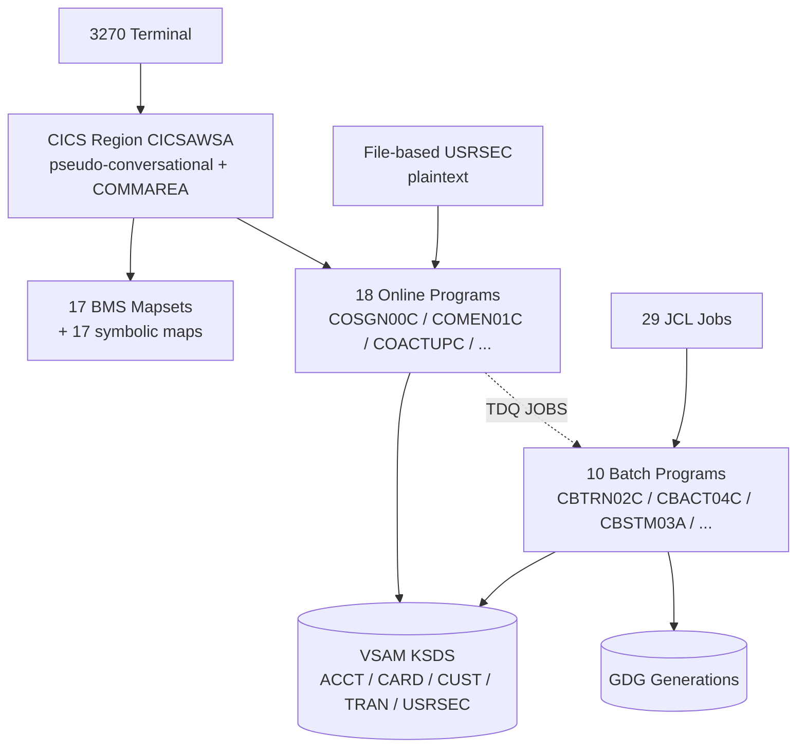
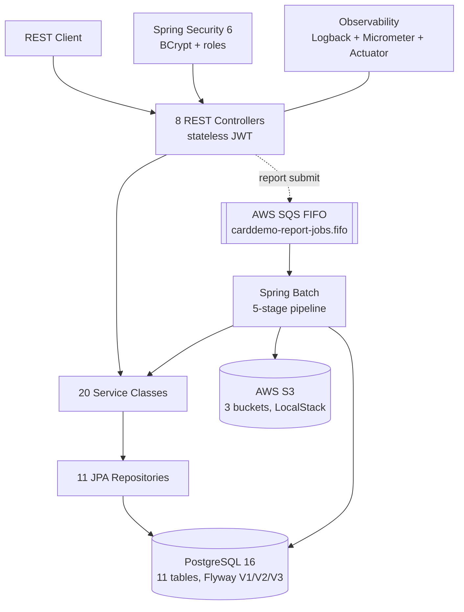
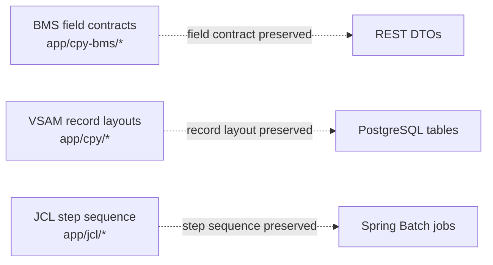
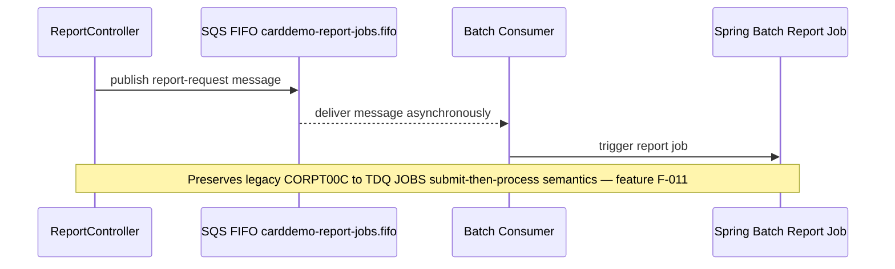
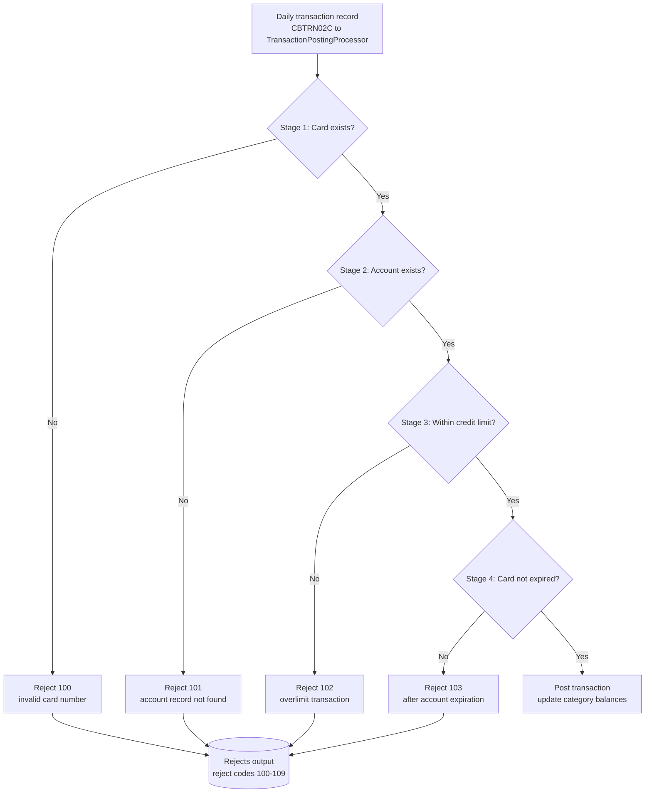

# CardDemo Migration — Before/After Architecture

This document provides paired **before/after** architecture views of the CardDemo modernization: the migration from the legacy z/OS mainframe stack (COBOL, CICS, JCL, and VSAM — a frozen REFERENCE pinned at source commit SHA `27d6c6f`) to the cloud-native **Java 25 LTS + Spring Boot 3.5.11** application that lives at the repository **root**. All diagrams below are authored in **Mermaid** so they render directly in the documentation site and in any Mermaid-aware viewer. The legacy 3270 screen captures under `diagrams/*.png` — namely `Admin-Menu.png`, `Main-Menu.png`, and `Signon-Screen.png` — were the prior visual reference for the terminal UI; they are **superseded by the architecture diagrams in this document** and are mentioned here by name only (not embedded), because the target system is **headless (REST API only, no web/browser UI)**.

> **How to read these diagrams.** Every diagram in this document uses one shared notation, defined once in the [Legend](#legend) below. Before reading any individual diagram, review the legend so the arrow styles and node shapes (synchronous flow, asynchronous messaging, persistent stores, and message queues) are unambiguous. The four diagrams are referenced throughout the prose by name — "Diagram 1 — BEFORE", "Diagram 2 — AFTER", "Diagram 3", and "Diagram 4".

## Legend

The following notation is used consistently across **all** diagrams in this document. Each diagram's prose refers back to these definitions rather than repeating them:

- **Solid arrow** (`-->`) — a synchronous call or direct data flow between components.
- **Dashed arrow** (`-.->`) — asynchronous messaging, **or** a contract-preservation linkage between a legacy artifact and its target equivalent (a specification relationship, not a runtime call).
- **Cylinder** (`[(...)]`) — a persistent data store (VSAM dataset, GDG generation, PostgreSQL table set, or S3 bucket).
- **Double-bordered box** (`[[...]]`) — a message queue (the SQS FIFO report-jobs queue).

## Diagrams

### Diagram 1 — BEFORE: Legacy Mainframe (app/, frozen REFERENCE @ 27d6c6f)

```mermaid
graph TB
    TERM["3270 Terminal"] --> CICS["CICS Region CICSAWSA<br/>pseudo-conversational + COMMAREA"]
    CICS --> BMS["17 BMS Mapsets<br/>+ 17 symbolic maps"]
    CICS --> ONL["18 Online Programs<br/>COSGN00C / COMEN01C / COACTUPC / ..."]
    ONL --> VSAM[("VSAM KSDS<br/>ACCT / CARD / CUST / TRAN / USRSEC")]
    JCL["29 JCL Jobs"] --> BAT["10 Batch Programs<br/>CBTRN02C / CBACT04C / CBSTM03A / ..."]
    BAT --> VSAM
    BAT --> GDG[("GDG Generations")]
    ONL -. "TDQ JOBS" .-> BAT
    SEC["File-based USRSEC<br/>plaintext"] --> ONL
```

**Diagram 1 — BEFORE** depicts the legacy z/OS runtime exactly as it exists in the frozen `app/` corpus at commit `27d6c6f`; this corpus is the read-only source-of-truth specification and is never modified or copied into the target. A 3270 terminal drives the **CICS region `CICSAWSA`**, which runs **18 online programs** in a *pseudo-conversational* model: cross-screen state is carried in the COMMAREA defined by copybook `COCOM01Y`, and screen I/O is bound by **17 BMS mapsets** and their **17 symbolic map copybooks**. Online programs read and write the **VSAM KSDS** datasets (account, card, customer, transaction, and the `USRSEC` security file) using keyed indexed access. In parallel, **29 JCL jobs** orchestrate **10 batch programs** that process the same VSAM stores and emit **GDG generation** datasets. The single asynchronous bridge is the dashed `TDQ JOBS` edge: the online report-submit program `CORPT00C` writes a job stream to the CICS Transient Data Queue `JOBS`, which triggers downstream batch reporting. Security is the file-based `USRSEC` dataset holding **plaintext** credentials consulted by the online sign-on flow.

### Diagram 2 — AFTER: Java 25 + Spring Boot 3.5.11 (greenfield)

```mermaid
graph TB
    CLIENT["REST Client"] --> CTRL["8 REST Controllers<br/>stateless JWT"]
    CTRL --> SVC["20 Service Classes"]
    SVC --> REPO["11 JPA Repositories"]
    REPO --> PG[("PostgreSQL 16<br/>11 tables, Flyway V1/V2/V3")]
    SCHED["Spring Batch<br/>5-stage pipeline"] --> SVC
    SCHED --> PG
    SCHED --> S3[("AWS S3<br/>3 buckets, LocalStack")]
    CTRL -. "report submit" .-> SQS[["AWS SQS FIFO<br/>carddemo-report-jobs.fifo"]]
    SQS --> SCHED
    SECJ["Spring Security 6<br/>BCrypt + roles"] --> CTRL
    OBS["Observability<br/>Logback + Micrometer + Actuator"] --- CTRL
```

**Diagram 2 — AFTER** shows the modernized topology that the migration produces, faithful to the legacy behavior but expressed in idiomatic, layered Java. The pseudo-conversational COMMAREA is replaced by **stateless JWT** request/response flows: a REST client calls **8 REST controllers**, which delegate to **20 service classes**, which in turn use **11 Spring Data JPA repositories** to reach **PostgreSQL 16** (the **11 tables** provisioned by Flyway migrations **V1** schema, **V2** indexes, and **V3** seed data). The **Spring Batch 5-stage pipeline** (POSTTRAN → INTCALC → COMBTRAN → CREASTMT/TRANREPT) replaces the JCL-orchestrated batch suite, invoking the same service logic, persisting to PostgreSQL, and staging files in **AWS S3 (3 buckets)** — all verified against **LocalStack** with no live-AWS dependency. The dashed `report submit` edge mirrors the legacy TDQ bridge: the `ReportController` publishes a request to the **SQS FIFO** queue `carddemo-report-jobs.fifo`, and a Spring Batch consumer triggers the report job, preserving the asynchronous submit-then-process semantics. **Spring Security 6** with **BCrypt** password hashing and role-based access replaces the plaintext `USRSEC` file, and the observability stack (**Logback** structured logging, **Micrometer** metrics/tracing, and Spring Boot **Actuator** health endpoints) is wired across the controller surface.

### Diagram 3 — Contract-Preservation Linkages (Legacy ↔ Target)

```mermaid
graph LR
    BMS["BMS field contracts<br/>app/cpy-bms/*"] -. "field contract preserved" .-> DTO["REST DTOs"]
    VSAMREC["VSAM record layouts<br/>app/cpy/*"] -. "record layout preserved" .-> PGT["PostgreSQL tables"]
    JCLSEQ["JCL step sequence<br/>app/jcl/*"] -. "step sequence preserved" .-> SB["Spring Batch jobs"]
```

**Diagram 3** uses dashed arrows to express **contract-preservation linkages** rather than runtime calls — each dashed edge denotes a specification relationship in which a frozen legacy artifact governs the shape of its target equivalent. The byte-accurate field lengths and validation attributes captured in the **BMS symbolic maps** (`app/cpy-bms/*`) survive into **REST DTO** bean-validation constraints. The fixed-width **VSAM record layouts** (`app/cpy/*`) — for example ACCOUNT 300B, CARD 150B, CUSTOMER 500B, TRAN 350B, and SEC-USER 80B — map to **PostgreSQL** columns with identical key and decimal-precision semantics (all monetary `COMP-3` fields become `BigDecimal` with scale 2). The **JCL step sequencing** (`app/jcl/*`) survives as ordered **Spring Batch** step execution, so condition-code and step-dependency logic is reproduced rather than reinvented. None of the `app/` reference artifacts are modified or copied; they are consulted only as the authoritative contract.

### Diagram 4 — Report Submission Bridge & 4-Stage Posting Validation

The first fenced block traces the **report submission bridge** as a sequence, showing how the synchronous REST submit hands off to asynchronous batch processing — the direct analog of the legacy `CORPT00C` → TDQ `JOBS` flow (feature F-011):

```mermaid
sequenceDiagram
    participant RC as ReportController
    participant Q as SQS FIFO carddemo-report-jobs.fifo
    participant BC as Batch Consumer
    participant SB as Spring Batch Report Job
    RC->>Q: publish report-request message
    Q-->>BC: deliver message asynchronously
    BC->>SB: trigger report job
    Note over RC,SB: Preserves legacy CORPT00C to TDQ JOBS submit-then-process semantics — feature F-011
```

The second fenced block depicts the **4-stage posting validation cascade** that `CBTRN02C` defines and that `TransactionPostingProcessor` reproduces. Evaluation is **ordered and short-circuit**: the first failing stage assigns a specific reject reason code (in the 100–109 family) and routes the record to the rejects output, exactly as the COBOL posting engine does:

```mermaid
flowchart TB
    START["Daily transaction record<br/>CBTRN02C to TransactionPostingProcessor"] --> V1{"Stage 1: Card exists?"}
    V1 -- No --> R1["Reject 100<br/>invalid card number"]
    V1 -- Yes --> V2{"Stage 2: Account exists?"}
    V2 -- No --> R2["Reject 101<br/>account record not found"]
    V2 -- Yes --> V3{"Stage 3: Within credit limit?"}
    V3 -- No --> R3["Reject 102<br/>overlimit transaction"]
    V3 -- Yes --> V4{"Stage 4: Card not expired?"}
    V4 -- No --> R4["Reject 103<br/>after account expiration"]
    V4 -- Yes --> POST["Post transaction<br/>update category balances"]
    R1 --> REJ[("Rejects output<br/>reject codes 100-109")]
    R2 --> REJ
    R3 --> REJ
    R4 --> REJ
```

**Diagram 4** therefore captures two behavior-critical bridges in one place. The sequence shows that report submission stays *asynchronous* across the migration — the REST call returns once the message is enqueued, and processing happens out-of-band in Spring Batch, preserving the legacy decoupling. The flowchart makes the posting cascade's **ordered short-circuit** evaluation explicit: Card-exists → Account-exists → Credit-Limit → Expiration, with reject codes 100, 101, 102, and 103 respectively (all within the documented 100–109 reject family) flowing to the rejects output, and only fully valid records reaching the posting step.

## Related Documentation

- [`./technical-specifications.md`](./technical-specifications.md) — the authoritative migration blueprint; its §0.1.2 carries the equivalent canonical before/after diagram.
- [`./api-contracts.md`](./api-contracts.md) — REST endpoint contracts derived from the BMS field definitions.
- [`./validation-gates.md`](./validation-gates.md) — evidence for validation Gates 1–8.
- [`../TRACEABILITY_MATRIX.md`](../TRACEABILITY_MATRIX.md) — bidirectional COBOL-paragraph → Java-method matrix (lives at the repository root).
- [`../DECISION_LOG.md`](../DECISION_LOG.md) — decision/alternative/rationale/risk log (lives at the repository root).

The equivalent before/after architecture diagram also appears in [`technical-specifications.md`](./technical-specifications.md) §0.1.2; this document is the consolidated visual reference and is kept faithful to that topology and its labels.
