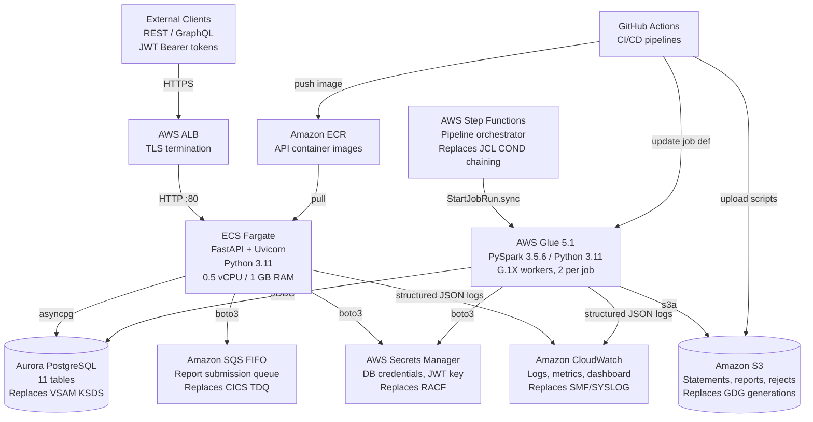
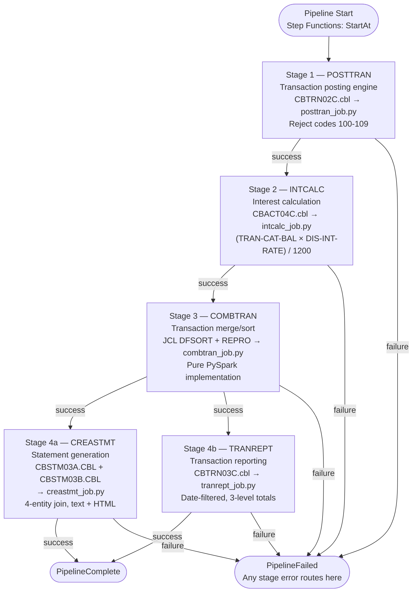
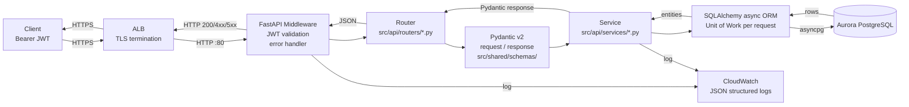
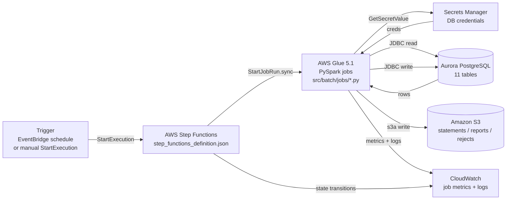

# CardDemo Architecture — Cloud-Native Modernization

<!-- Modernized from 28 COBOL programs, 28 copybooks, 17 BMS mapsets, 29 JCL jobs -->

## 1. Introduction

CardDemo is a credit card management application that has been modernized from its
original z/OS mainframe stack (COBOL, CICS, VSAM, JCL, BMS, RACF) to a cloud-native
Python stack running on Amazon Web Services. The refactor is a **tech stack migration**
— it preserves the application domain while replacing every implementation layer with
a supported, cloud-native equivalent.

The migration preserves **100% behavioral parity across all 22 features
(F-001 through F-022)** documented in the original technical specification. Every
business rule, validation cascade, calculation formula, reject code, control-flow
decision, and transactional boundary from the COBOL source has been faithfully
translated to Python without simplification, algebraic rewriting, or optimization.

The modernized application is organized into **two distinct workload types**, each
matched to the AWS service that best fits its runtime profile:

- **Online workload — API layer.** The 18 interactive CICS/COBOL programs are
  replaced by Python-based REST and GraphQL endpoints built on FastAPI, packaged
  into a Docker container, and deployed on AWS ECS Fargate behind an Application
  Load Balancer. Stateless sessions are carried by JWT tokens, replacing the
  CICS COMMAREA channel. All data access goes through SQLAlchemy 2.x against an
  Aurora PostgreSQL-Compatible cluster.

- **Batch workload — Batch layer.** The 10 batch COBOL programs and the 5-stage
  batch pipeline (POSTTRAN → INTCALC → COMBTRAN → CREASTMT ∥ TRANREPT) are replaced
  by PySpark ETL scripts running on AWS Glue 5.1 (Apache Spark 3.5.6, Python 3.11).
  AWS Step Functions orchestrates stage ordering, parallelism, and failure
  propagation — replacing the JCL `COND=(0,NE)` job-step chaining semantics. Statement
  and report outputs that previously landed in GDG generations now land as versioned
  objects in Amazon S3.

Both workloads share a common `src/shared/` module that contains SQLAlchemy ORM
models (derived from COBOL copybooks), Pydantic v2 schemas (derived from BMS
symbolic maps), constants (messages, lookup codes, menu options), and utility
functions (date, string, decimal) — guaranteeing that a single canonical
representation of every business entity is used by the API, by the batch jobs,
and by the test suite.

This document is the authoritative architectural reference for the modernized
CardDemo application. It describes the high-level topology, the two workload
layers, the database migration, the shared module, the deployment and infrastructure
stack, the design patterns applied, the security model, the online and batch data
flows, and the target project structure.

---

## 2. High-Level Architecture

The diagram below shows the end-to-end topology of the modernized application,
covering both workloads, the database, the asynchronous integration surface (SQS),
credential distribution (Secrets Manager), and observability (CloudWatch).



**Key topology notes**

- All inbound client traffic terminates at the ALB, which performs TLS
  termination and forwards plaintext HTTP on port 80 to the ECS Fargate task.
- The FastAPI service is the only public-facing compute surface; the batch
  workload is fully private (orchestrated internally by Step Functions).
- Both the ECS task and the Glue jobs share the same Aurora cluster and the
  same Secrets Manager namespace — enforcing a single canonical data model
  and a single credential distribution channel.
- CloudWatch aggregates logs and metrics from both workloads into one
  observability plane (`infra/cloudwatch/dashboard.json`).
- GitHub Actions workflows (`.github/workflows/`) build the API container
  image and push to ECR, and upload PySpark scripts to S3 before updating
  Glue job definitions.

---

## 3. Architecture Layers

### 3.1 API Layer — FastAPI on ECS Fargate

The API layer replaces the 18 online CICS/COBOL programs with a single
containerized Python service. It is the only public-facing component and the
single entry point for all user-initiated operations.

**Runtime characteristics**

| Attribute | Value | Notes |
|---|---|---|
| Language runtime | Python 3.11 | Aligned with AWS Glue 5.1 and FastAPI recommendation |
| Web framework | FastAPI 0.115.x | Async REST + GraphQL via Strawberry |
| ASGI server | Uvicorn 0.34.x (standard extras) | Binds `0.0.0.0:80` inside the container |
| Container base | `python:3.11-slim` | Defined in `Dockerfile` |
| Compute | ECS Fargate | 0.5 vCPU, 1 GB RAM (per AAP §0.5.1) |
| Load balancer | AWS ALB | TLS termination, path-based routing |
| ORM | SQLAlchemy 2.0.x (`asyncio` extras) | Async session, Unit-of-Work per request |
| Database driver | asyncpg 0.30.x | Async PostgreSQL driver |
| Authentication | JWT via `python-jose[cryptography]==3.3.0` | Replaces CICS COMMAREA |
| Password hashing | `passlib[bcrypt]==1.7.4` | Preserves existing COBOL-era security |
| GraphQL | `strawberry-graphql[fastapi]` 0.254.x | Mounted alongside REST |
| Request validation | Pydantic 2.10.x | Rust-backed core for performance |
| AWS SDK | boto3 1.35.x | SQS, Secrets Manager, S3 |

**Layering within the API service**

- `src/api/main.py` — FastAPI application factory; mounts all REST routers,
  mounts the Strawberry GraphQL router at `/graphql`, wires middleware, and
  registers startup/shutdown hooks for the SQLAlchemy engine.
- `src/api/dependencies.py` — Dependency-injection providers for database
  session, current user, and role-based authorization (derived from the
  COBOL `COCOM01Y` COMMAREA communication block).
- `src/api/database.py` — SQLAlchemy async engine + `async_sessionmaker`
  configured to Aurora PostgreSQL.
- `src/api/middleware/` — JWT validation middleware and the global error
  handler that translates exceptions into COBOL-equivalent error codes
  sourced from `CSMSG01Y.cpy` / `CSMSG02Y.cpy`.
- `src/api/routers/` — REST endpoint declarations grouped by domain.
- `src/api/services/` — Business-logic services that mirror the paragraph
  structure of the original COBOL programs.
- `src/api/graphql/` — Strawberry schema, types, queries, mutations.

**CICS program → FastAPI module mapping**

| COBOL Program | Feature | FastAPI Module |
|---|---|---|
| `COSGN00C.cbl` | F-001 Authentication | `src/api/routers/auth_router.py` + `src/api/services/auth_service.py` |
| `COMEN01C.cbl` | F-002 Main Menu | `src/api/main.py` (navigation config) |
| `COADM01C.cbl` | F-003 Admin Menu | `src/api/routers/admin_router.py` |
| `COACTVWC.cbl` | F-004 Account View | `src/api/routers/account_router.py` |
| `COACTUPC.cbl` | F-005 Account Update | `src/api/services/account_service.py` |
| `COCRDLIC.cbl` | F-006 Card List | `src/api/routers/card_router.py` |
| `COCRDSLC.cbl` | F-007 Card Detail | `src/api/services/card_service.py` |
| `COCRDUPC.cbl` | F-008 Card Update | `src/api/services/card_service.py` |
| `COTRN00C.cbl` | F-009 Transaction List | `src/api/routers/transaction_router.py` |
| `COTRN01C.cbl` | F-010 Transaction Detail | `src/api/services/transaction_service.py` |
| `COTRN02C.cbl` | F-011 Transaction Add | `src/api/services/transaction_service.py` |
| `COBIL00C.cbl` | F-012 Bill Payment | `src/api/routers/bill_router.py` + `src/api/services/bill_service.py` |
| `CORPT00C.cbl` | F-022 Report Submit | `src/api/routers/report_router.py` + `src/api/services/report_service.py` |
| `COUSR00C.cbl` | F-018 User List | `src/api/routers/user_router.py` |
| `COUSR01C.cbl` | F-019 User Add | `src/api/services/user_service.py` |
| `COUSR02C.cbl` | F-020 User Update | `src/api/services/user_service.py` |
| `COUSR03C.cbl` | F-021 User Delete | `src/api/services/user_service.py` |
| `CSUTLDTC.cbl` | Shared Utility | `src/shared/utils/date_utils.py` |

**Preserved behaviors**

- The **4,236-line Account Update program (`COACTUPC.cbl`)** is preserved in
  `account_service.py` — including its dual-write (ACCTFILE + CUSTFILE),
  atomicity guarantee via SQLAlchemy session context manager (replacing the
  CICS `SYNCPOINT ROLLBACK`), and its exact field-validation cascade.
- **Card Update (`COCRDUPC.cbl`)** uses an optimistic concurrency check on
  the `Card` model's version column — functionally equivalent to the original
  `READ UPDATE / REWRITE` pattern.
- **Bill Payment (`COBIL00C.cbl`)** remains an atomic dual-write: a Transaction
  row is inserted and the Account balance is debited in the same session.
- **Report Submission (`CORPT00C.cbl`)** publishes one FIFO message to SQS
  per submission, exactly replacing the CICS `WRITEQ JOBS` TDQ-bridge.

### 3.2 Batch Layer — PySpark on AWS Glue

The batch layer replaces 10 batch COBOL programs and the JCL-based 5-stage
pipeline with PySpark ETL scripts running on AWS Glue 5.1.

**Runtime characteristics**

| Attribute | Value | Notes |
|---|---|---|
| Engine | AWS Glue 5.1 (GA) | Spark 3.5.6, Python 3.11, Scala 2.12.18 |
| Worker type | G.1X (standard) | 2 workers per job (per AAP §0.5.1) |
| Database access | JDBC to Aurora PostgreSQL | Credentials loaded from Secrets Manager |
| Object storage | Amazon S3 | Statement files, report files, reject logs |
| Orchestration | AWS Step Functions | Replaces JCL `COND` parameter chaining |
| Bookmarks | AWS Glue job bookmarks | Enables incremental processing |
| Output format | Parquet (columnar, where applicable) | Derived-data products |

**Layering within the batch workload**

- `src/batch/common/glue_context.py` — Factory for `GlueContext` and
  `SparkSession`; centralizes logging configuration so every job emits
  structured JSON records to CloudWatch.
- `src/batch/common/db_connector.py` — Constructs the JDBC URL for Aurora
  PostgreSQL and retrieves credentials from Secrets Manager via boto3.
- `src/batch/common/s3_utils.py` — Read/write helpers for S3 that preserve
  the GDG-style versioning pattern (`/generation=NNNNN/` prefix layout).
- `src/batch/jobs/` — One PySpark script per COBOL batch program, plus the
  three reader/diagnostic utilities derived from the CB* utility programs.
- `src/batch/pipeline/step_functions_definition.json` — Amazon States
  Language (ASL) definition of the 5-stage pipeline.

**5-stage batch pipeline**

The pipeline executes five logical stages. Stages 1, 2, and 3 run strictly
serially; Stages 4a and 4b run in parallel. Any stage failure halts all
downstream stages — mirroring the original JCL `COND=(0,NE)` semantics
(seen in `CREASTMT.JCL` STEP020 through STEP040 and in `TRANREPT.jcl`).



**Stage behavior preservation**

- **Stage 1 (POSTTRAN)** — The 4-stage transaction validation cascade from
  `CBTRN02C.cbl` is preserved. Reject codes **100–109** are emitted to the
  `DALYREJS` S3 path (replacing the `AWS.M2.CARDDEMO.DALYREJS(+1)` GDG
  generation defined in `POSTTRAN.jcl`).
- **Stage 2 (INTCALC)** — The COBOL interest formula
  `(TRAN-CAT-BAL × DIS-INT-RATE) / 1200` from `CBACT04C.cbl` is preserved
  literally; it is **not algebraically simplified**. The `DEFAULT / ZEROAPR`
  disclosure-group fallback remains identical.
- **Stage 3 (COMBTRAN)** — Replaces the z/OS `SORT` + `REPRO` chain from
  `CREASTMT.JCL` STEP010/STEP020 with a pure PySpark `orderBy` + write
  operation, producing a sorted staging table used downstream.
- **Stage 4a (CREASTMT)** — Mirrors `CBSTM03A` + its `CBSTM03B` file-service
  subroutine: a 4-entity join across `transactions`, `card_cross_references`,
  `accounts`, and `customers`, producing paired text + HTML statement outputs
  to S3.
- **Stage 4b (TRANREPT)** — Mirrors `CBTRN03C.cbl`: date-filtered
  transaction report with 3-level totals (account, category, grand total).

**Batch program → PySpark job mapping**

| COBOL Program | Pipeline Stage | PySpark Job |
|---|---|---|
| `CBTRN02C.cbl` | Stage 1 (POSTTRAN) | `src/batch/jobs/posttran_job.py` |
| `CBACT04C.cbl` | Stage 2 (INTCALC) | `src/batch/jobs/intcalc_job.py` |
| (DFSORT JCL) | Stage 3 (COMBTRAN) | `src/batch/jobs/combtran_job.py` |
| `CBSTM03A.CBL` + `CBSTM03B.CBL` | Stage 4a (CREASTMT) | `src/batch/jobs/creastmt_job.py` |
| `CBTRN03C.cbl` | Stage 4b (TRANREPT) | `src/batch/jobs/tranrept_job.py` |
| `CBACT01C.cbl` | Utility | `src/batch/jobs/read_account_job.py` |
| `CBACT02C.cbl` | Utility | `src/batch/jobs/read_card_job.py` |
| `CBACT03C.cbl` | Utility | `src/batch/jobs/read_xref_job.py` |
| `CBCUS01C.cbl` | Utility | `src/batch/jobs/read_customer_job.py` |
| `CBTRN01C.cbl` | Pre-pipeline | `src/batch/jobs/daily_tran_driver_job.py` |
| (`PRTCATBL.jcl`) | Utility | `src/batch/jobs/prtcatbl_job.py` |

### 3.3 Database Layer — Aurora PostgreSQL

The database layer migrates the 10 VSAM KSDS datasets, the 3 alternate index
paths, and the supporting reference data to a single Amazon Aurora PostgreSQL
cluster. All original business semantics — composite keys, monetary precision,
alternate-index ordering — are preserved through idiomatic relational design.

**Engine and configuration**

- Engine: **AWS Aurora PostgreSQL-Compatible Edition** (16-family).
- All monetary columns are `NUMERIC(15,2)` — a direct one-to-one mapping
  from COBOL `PIC S9(13)V99` and preserves two-decimal-place precision
  exactly. Python code uses `decimal.Decimal` with `ROUND_HALF_EVEN`
  (banker's rounding) to match the COBOL `ROUNDED` semantic.
- Composite primary keys are used for the three tables that had compound
  VSAM keys: `transaction_category_balances`, `disclosure_groups`,
  `transaction_categories`.
- B-tree indexes (`V2__indexes.sql`) replace the three VSAM AIX (alternate
  index) paths that originally supported secondary lookups.

**Migration artifacts**

- `db/migrations/V1__schema.sql` — `CREATE TABLE` for all 11 entities;
  derived from the VSAM DEFINE CLUSTER definitions in `ACCTFILE.jcl`,
  `CARDFILE.jcl`, `CUSTFILE.jcl`, `TRANFILE.jcl`, `XREFFILE.jcl`,
  `TCATBALF.jcl`, `DUSRSECJ.jcl`, etc.
- `db/migrations/V2__indexes.sql` — B-tree indexes for
  `cards.acct_id`, `card_cross_references.acct_id`, `transactions.proc_ts`.
- `db/migrations/V3__seed_data.sql` — 50 accounts, 50 cards, 50 customers,
  50 cross-references, 50 category balances, 51 disclosure-group records
  (3 blocks), 18 category mappings, 7 transaction types, 10 users, plus
  daily-transaction fixtures — derived from `app/data/ASCII/*.txt`.

**VSAM dataset → PostgreSQL table mapping**

| VSAM Dataset | Copybook | PostgreSQL Table | Primary Key |
|---|---|---|---|
| ACCTFILE | `CVACT01Y.cpy` | `accounts` | `acct_id` (11-digit) |
| CARDFILE | `CVACT02Y.cpy` | `cards` | `card_num` (16-char) |
| CUSTFILE | `CVCUS01Y.cpy` | `customers` | `cust_id` (9-digit) |
| XREFFILE | `CVACT03Y.cpy` | `card_cross_references` | `card_num` (16-char) |
| TRANFILE | `CVTRA05Y.cpy` | `transactions` | `tran_id` (sequence) |
| TCATBALF | `CVTRA01Y.cpy` | `transaction_category_balances` | (`acct_id`, `type_code`, `cat_code`) |
| DAILYTRAN | `CVTRA06Y.cpy` | `daily_transactions` | staging entity |
| DISCGRP | `CVTRA02Y.cpy` | `disclosure_groups` | (`group_id`, `type`, `code`) |
| TRANTYPE | `CVTRA03Y.cpy` | `transaction_types` | `type_code` (2-char) |
| TRANCATG | `CVTRA04Y.cpy` | `transaction_categories` | (`type_code`, `cat_code`) |
| USRSEC | `CSUSR01Y.cpy` | `user_security` | `usr_id` (8-char) |

**Alternate index paths preserved via B-tree indexes**

| Original AIX Path | PostgreSQL Index | Purpose |
|---|---|---|
| Card AIX on account-id | `idx_cards_acct_id` | Secondary lookup: cards for an account |
| XRef AIX on account-id | `idx_card_cross_references_acct_id` | Secondary lookup: xrefs for an account |
| Transaction AIX on processing-timestamp | `idx_transactions_proc_ts` | Date-range scans for statements/reports |

### 3.4 Shared Module — `src/shared/`

The `src/shared/` module is the single source of truth for every entity,
contract, and helper used by the two workloads. Both the API and the batch
jobs import from this module, guaranteeing that ORM mappings, validation
schemas, constants, and utility semantics are identical across the
application.

| Sub-module | Contents | Derived From |
|---|---|---|
| `models/` | 11 SQLAlchemy ORM models | 11 VSAM record-layout copybooks (`CVACT01Y`, `CVACT02Y`, `CVACT03Y`, `CVCUS01Y`, `CVTRA01Y`–`CVTRA06Y`, `CSUSR01Y`) |
| `schemas/` | 8 Pydantic v2 schema modules | 17 BMS symbolic-map copybooks in `app/cpy-bms/` |
| `constants/` | `messages.py`, `lookup_codes.py`, `menu_options.py` | `CSMSG01Y.cpy`, `CSMSG02Y.cpy`, `COTTL01Y.cpy`, `CSLKPCDY.cpy`, `COMEN02Y.cpy`, `COADM02Y.cpy` |
| `utils/` | `date_utils.py`, `string_utils.py`, `decimal_utils.py` | `CSUTLDTC.cbl`, `CSDAT01Y.cpy`, `CSUTLDWY.cpy`, `CSUTLDPY.cpy`, `CSSTRPFY.cpy`, decimal math from `CVTRA01Y.cpy` |
| `config/` | `settings.py` (pydantic `BaseSettings`), `aws_config.py` (boto3 client factories, Secrets Manager helpers) | — (new module, no COBOL source) |

**Key invariants enforced by the shared module**

- Every monetary field uses `decimal.Decimal` at the Python layer and maps
  to `NUMERIC(15,2)` at the database layer — with no intermediate
  floating-point representation.
- Every ORM model includes the provenance comment referencing its source
  copybook so the migration trail is traceable in-code.
- Every Pydantic schema has validators that mirror the COBOL
  `PIC X(n) / PIC 9(n)` length-and-type constraints.

---

## 4. Infrastructure and Deployment

### 4.1 CI/CD — GitHub Actions

Three GitHub Actions workflows cover the full delivery lifecycle:

| Workflow | File | Responsibilities |
|---|---|---|
| Continuous Integration | `.github/workflows/ci.yml` | Ruff lint (`--no-fix`), mypy strict type-check, pytest (unit + integration), `pytest-cov` coverage reporting (target ≥ 80%, parity with the 81.5% documented in the existing spec) |
| API Deployment | `.github/workflows/deploy-api.yml` | Build the FastAPI Docker image, push to Amazon ECR, update the ECS Fargate service task definition |
| Glue Deployment | `.github/workflows/deploy-glue.yml` | Upload PySpark scripts to the Glue scripts S3 bucket, update AWS Glue job definitions via the AWS CLI |

The CI workflow enforces the same linters and type-checkers that
developers run locally (`ruff check src/`, `mypy src/`), so
contributions are validated identically in local and CI environments.

### 4.2 Infrastructure Configuration

Infrastructure-as-configuration artifacts live under `infra/`:

| Artifact | File | Purpose |
|---|---|---|
| ECS Task Definition | `infra/ecs-task-definition.json` | Python 3.11 container on Fargate, **0.5 vCPU / 1 GB RAM**, port 80, IAM task role with Secrets Manager + SQS + S3 scoped permissions |
| Glue Job Config — POSTTRAN | `infra/glue-job-configs/posttran.json` | Glue 5.1, G.1X worker, 2 workers, JDBC to Aurora |
| Glue Job Config — INTCALC | `infra/glue-job-configs/intcalc.json` | Glue 5.1, G.1X worker, 2 workers |
| Glue Job Config — COMBTRAN | `infra/glue-job-configs/combtran.json` | Glue 5.1, G.1X worker, 2 workers |
| Glue Job Config — CREASTMT | `infra/glue-job-configs/creastmt.json` | Glue 5.1, G.1X worker, 2 workers |
| Glue Job Config — TRANREPT | `infra/glue-job-configs/tranrept.json` | Glue 5.1, G.1X worker, 2 workers |
| CloudWatch Dashboard | `infra/cloudwatch/dashboard.json` | Unified widgets for ECS service health, Glue job DPU usage, Aurora connections, SQS queue depth, error rates |

### 4.3 AWS Services

The following AWS services collectively host the application. Each replaces
a specific z/OS capability from the legacy architecture.

| AWS Service | Purpose | Replaces |
|---|---|---|
| ECS Fargate | FastAPI container hosting (0.5 vCPU, 1 GB RAM) | CICS region |
| AWS Glue 5.1 | PySpark batch execution | JES2 / JCL |
| Aurora PostgreSQL | Relational database (Aurora-compatible) | VSAM KSDS |
| Amazon S3 | Output storage, PySpark script storage | GDG, PS datasets |
| SQS FIFO | Report queue (strict ordering) | CICS TDQ (`WRITEQ JOBS`) |
| Step Functions | Pipeline orchestration (ASL state machine) | JCL `COND` chaining |
| Secrets Manager | DB credentials, JWT signing key | RACF credentials |
| CloudWatch | Logs, metrics, dashboards, alarms | SMF / SYSLOG |
| ECR | Container image registry | N/A (new capability) |
| IAM | Service-to-service authentication / authorization | RACF access control |
| ALB | TLS termination, path-based routing | CICS terminal front-end |

---

## 5. Design Patterns

The modernized architecture applies a consistent set of design patterns that
collectively replace the mainframe's procedural / file-centric idioms with
idiomatic cloud-native Python patterns — while preserving every behavioral
contract.

| Pattern | Application in CardDemo | Mainframe Construct Replaced |
|---|---|---|
| **Repository Pattern** | SQLAlchemy ORM models encapsulate all data access; every CRUD operation flows through a session-bound repository rather than direct DB-API use. | Direct VSAM `READ / WRITE / REWRITE / DELETE` verbs |
| **Service Layer** | Each online feature has a service module in `src/api/services/` that mirrors the original COBOL program's paragraph structure; routers stay thin and delegate all business logic to services. | COBOL PROCEDURE DIVISION paragraphs and `PERFORM` chains |
| **Dependency Injection** | FastAPI `Depends()` provides request-scoped sessions, the current authenticated user, and service instances — evaluated lazily by the framework. | CICS COMMAREA passed by the transaction manager |
| **Factory Pattern** | Pydantic model factories construct typed response payloads from ORM entities — replacing field-by-field screen-map MOVEs. | COBOL `MOVE` statements populating BMS symbolic maps |
| **Pipeline Pattern** | AWS Step Functions orchestrates the 5-stage batch pipeline with sequential, parallel, and retry semantics encoded declaratively in ASL. | JCL `COND` parameter chaining across JOB steps |
| **Transactional Outbox / Unit-of-Work** | SQLAlchemy session context managers wrap multi-entity mutations; any exception triggers `ROLLBACK`, committing only on clean exit — delivering the same dual-write atomicity used in F-005 Account Update and F-012 Bill Payment. | CICS `SYNCPOINT` and `SYNCPOINT ROLLBACK` |
| **Optimistic Concurrency** | The `Card` and `Account` models carry a `version` column that SQLAlchemy increments on every update; a concurrent writer with a stale version receives a conflict exception. | `READ UPDATE` → `REWRITE` optimistic-lock pattern |
| **Stateless Authentication** | JWT tokens signed with a secret loaded from Secrets Manager convey identity and role across requests — no server-side session store. | CICS `RETURN TRANSID COMMAREA(...)` channel state |

---

## 6. Security Architecture

Security is layered across the network boundary, the application, and the
credential plane. Every measure mirrors a legacy z/OS control with a
cloud-native equivalent.

- **Transport security.** All client traffic uses HTTPS and terminates at
  the ALB; the ALB-to-ECS hop is on the private subnet. The VPC boundary
  replaces the pre-existing CICS-terminal network isolation.
- **Stateless authentication (JWT).** Authentication issues a JWT via
  `python-jose`; subsequent requests carry it as a Bearer token. Tokens
  include the user identifier, role (user / admin), and expiration. The
  JWT signing key is retrieved from AWS Secrets Manager at service
  startup — never committed to code. JWT tokens replace the CICS COMMAREA
  as the session-state carrier.
- **Password hashing.** User passwords are hashed with **BCrypt** via
  `passlib[bcrypt]==1.7.4` — preserving the hashing algorithm used in
  the original `COUSR01C.cbl` user-add path. Plaintext passwords are
  never stored or logged.
- **Service authentication.** ECS tasks and Glue jobs assume IAM roles
  (no static access keys are ever embedded in code or configuration).
  Each role grants the minimum set of permissions required: ECS task role
  grants Secrets Manager `GetSecretValue` on the DB-credentials secret
  and JWT-key secret, SQS `SendMessage` on the report queue, and S3
  `PutObject` on the output prefix only.
- **Credential isolation.** All sensitive values — Aurora credentials,
  JWT signing key, any third-party API keys — live in AWS Secrets Manager
  and are fetched at runtime by boto3. Environment-variable secrets are
  reserved for non-sensitive configuration (log level, environment name).
- **Authorization at the application layer.** The JWT payload's role
  claim is checked by FastAPI dependencies on every admin-only route
  (`src/api/routers/admin_router.py` and user-management mutations),
  replicating the RACF group-based authorization of the original COBOL
  admin menu (`COADM01C.cbl`).
- **Error-surface minimization.** The global error handler in
  `src/api/middleware/error_handler.py` returns COBOL-equivalent error
  codes (drawn from `CSMSG01Y.cpy` / `CSMSG02Y.cpy`) without leaking
  stack traces to the client.

---

## 7. Data Flow Diagrams

### 7.1 Online Request Flow (REST / GraphQL)



**Notes:** Each request opens exactly one async SQLAlchemy session (Unit of
Work). Commit happens only when the handler returns normally; any raised
exception triggers rollback — matching the `SYNCPOINT ROLLBACK` semantics
used in F-005 Account Update (`COACTUPC.cbl`) and F-012 Bill Payment
(`COBIL00C.cbl`).

### 7.2 Batch Pipeline Flow (Step Functions + Glue)



**Notes:** A job failure raises a `States.TaskFailed` event that
Step Functions routes to the `PipelineFailed` state, preventing any
downstream stage from executing. This replicates the JCL `COND=(0,NE)`
chain that skips subsequent steps on any non-zero return code — visible
in `CREASTMT.JCL` STEP020 / STEP030 / STEP040 and in `TRANREPT.jcl`.

---

## 8. Project Structure Reference

The target repository layout reflects the two-workload architecture: the
shared module sits at the center; the API and batch layers depend on it;
supporting infrastructure, database migrations, and tests are sibling
top-level directories. The original `app/` tree is retained unchanged for
traceability.

```text
carddemo/
├── README.md                          # Project overview (updated for Python/AWS)
├── LICENSE                            # Apache 2.0 (retained)
├── pyproject.toml                     # Python project + tool config (replaces compile JCL)
├── requirements.txt                   # Core / shared deps (boto3, pydantic)
├── requirements-api.txt               # API deps (FastAPI, SQLAlchemy, Strawberry, JWT, BCrypt)
├── requirements-glue.txt              # Batch deps (PySpark 3.5.6, pg8000)
├── requirements-dev.txt               # Dev / test deps (pytest, ruff, mypy, moto, testcontainers)
├── Dockerfile                         # API container (python:3.11-slim)
├── docker-compose.yml                 # Local dev: API + PostgreSQL + LocalStack
├── .github/
│   └── workflows/
│       ├── ci.yml                     # Lint + type-check + test + coverage
│       ├── deploy-api.yml             # Build Docker → ECR → ECS service update
│       └── deploy-glue.yml            # Upload scripts → S3 → Glue job def update
├── docs/
│   ├── index.md                       # MkDocs landing page
│   ├── project-guide.md               # Project status / development guide
│   ├── technical-specifications.md    # Authoritative technical spec
│   └── architecture.md                # This document
├── db/
│   └── migrations/
│       ├── V1__schema.sql             # 11 tables (from VSAM DEFINE CLUSTER)
│       ├── V2__indexes.sql            # 3 B-tree indexes (from VSAM AIX)
│       └── V3__seed_data.sql          # Seed data (from app/data/ASCII/*.txt)
├── src/
│   ├── shared/                        # Shared between API and Batch
│   │   ├── models/                    # 11 SQLAlchemy ORM models (from copybooks)
│   │   ├── schemas/                   # 8 Pydantic v2 schemas (from BMS maps)
│   │   ├── constants/                 # messages, lookup_codes, menu_options
│   │   ├── utils/                     # date_utils, string_utils, decimal_utils
│   │   └── config/                    # settings.py, aws_config.py
│   ├── api/                           # FastAPI REST + GraphQL (18 online programs)
│   │   ├── main.py                    # FastAPI app factory
│   │   ├── dependencies.py            # DI: session, current user, auth
│   │   ├── database.py                # SQLAlchemy async engine + session factory
│   │   ├── middleware/                # auth.py, error_handler.py
│   │   ├── routers/                   # auth, account, card, transaction, bill, report, user, admin
│   │   ├── services/                  # one service per feature
│   │   └── graphql/                   # Strawberry schema, types, queries, mutations
│   └── batch/                         # PySpark Glue jobs (10 batch programs + utilities)
│       ├── common/                    # glue_context, db_connector, s3_utils
│       ├── jobs/                      # posttran, intcalc, combtran, creastmt, tranrept + utilities
│       └── pipeline/
│           └── step_functions_definition.json   # ASL state machine
├── tests/
│   ├── conftest.py                    # Shared pytest fixtures
│   ├── unit/                          # Unit tests (models, services, routers, batch)
│   ├── integration/                   # Real PostgreSQL via testcontainers
│   └── e2e/                           # Full batch pipeline end-to-end
├── infra/
│   ├── ecs-task-definition.json       # ECS Fargate task (0.5 vCPU / 1 GB)
│   ├── glue-job-configs/              # posttran, intcalc, combtran, creastmt, tranrept
│   └── cloudwatch/
│       └── dashboard.json             # Unified observability dashboard
└── app/                               # Original COBOL sources — retained for traceability
    ├── cbl/                           # 28 COBOL programs
    ├── cpy/                           # 28 copybooks
    ├── bms/                           # 17 BMS mapsets
    ├── cpy-bms/                       # 17 symbolic-map copybooks
    ├── jcl/                           # 29 JCL job members
    ├── data/                          # 9 ASCII fixture files
    └── catlg/                         # LISTCAT.txt (209 VSAM catalog entries)
```

**Layering invariants**

- `src/shared/` has no imports from `src/api/` or `src/batch/` — it is a
  pure dependency with no cycles.
- `src/api/` and `src/batch/` are independent sibling trees. They share
  only through `src/shared/`; they do not import from each other.
- The `app/` tree is read-only. It is preserved verbatim for auditing,
  traceability, and downstream behavioral-equivalence validation. No
  production code path references anything in `app/` at runtime.

---

## 9. Feature Coverage Summary

All 22 features (F-001 through F-022) documented in the legacy technical
specification are covered by the two modernized workloads. The table below
maps feature IDs to the workload, the originating COBOL program, and the
new Python module(s).

| Feature | Name | Workload | COBOL Source | Python Module(s) |
|---|---|---|---|---|
| F-001 | Sign-On / Authentication | API | `COSGN00C.cbl` | `src/api/routers/auth_router.py`, `src/api/services/auth_service.py` |
| F-002 | Main Menu | API | `COMEN01C.cbl` | `src/api/main.py` (navigation config from `src/shared/constants/menu_options.py`) |
| F-003 | Admin Menu | API | `COADM01C.cbl` | `src/api/routers/admin_router.py` |
| F-004 | Account View | API | `COACTVWC.cbl` | `src/api/routers/account_router.py`, `src/api/services/account_service.py` |
| F-005 | Account Update | API | `COACTUPC.cbl` | `src/api/services/account_service.py` (dual-write, rollback-on-exception) |
| F-006 | Card List | API | `COCRDLIC.cbl` | `src/api/routers/card_router.py` |
| F-007 | Card Detail | API | `COCRDSLC.cbl` | `src/api/services/card_service.py` |
| F-008 | Card Update | API | `COCRDUPC.cbl` | `src/api/services/card_service.py` (optimistic concurrency via version column) |
| F-009 | Transaction List | API | `COTRN00C.cbl` | `src/api/routers/transaction_router.py` |
| F-010 | Transaction Detail | API | `COTRN01C.cbl` | `src/api/services/transaction_service.py` |
| F-011 | Transaction Add | API | `COTRN02C.cbl` | `src/api/services/transaction_service.py` (auto-ID, xref resolution) |
| F-012 | Bill Payment | API | `COBIL00C.cbl` | `src/api/routers/bill_router.py`, `src/api/services/bill_service.py` (dual-write) |
| F-013 | Transaction Posting (batch) | Batch | `CBTRN02C.cbl` | `src/batch/jobs/posttran_job.py` (Stage 1) |
| F-014 | Interest Calculation | Batch | `CBACT04C.cbl` | `src/batch/jobs/intcalc_job.py` (Stage 2) |
| F-015 | Transaction Merge/Sort | Batch | JCL DFSORT + REPRO | `src/batch/jobs/combtran_job.py` (Stage 3) |
| F-016 | Statement Generation | Batch | `CBSTM03A.CBL` + `CBSTM03B.CBL` | `src/batch/jobs/creastmt_job.py` (Stage 4a) |
| F-017 | Transaction Reporting | Batch | `CBTRN03C.cbl` | `src/batch/jobs/tranrept_job.py` (Stage 4b) |
| F-018 | User List | API | `COUSR00C.cbl` | `src/api/routers/user_router.py` |
| F-019 | User Add | API | `COUSR01C.cbl` | `src/api/services/user_service.py` (BCrypt hashing) |
| F-020 | User Update | API | `COUSR02C.cbl` | `src/api/services/user_service.py` |
| F-021 | User Delete | API | `COUSR03C.cbl` | `src/api/services/user_service.py` |
| F-022 | Report Submission | API (+ SQS) | `CORPT00C.cbl` | `src/api/routers/report_router.py`, `src/api/services/report_service.py` (SQS FIFO publish) |

---

## 10. Traceability Notes

- Every Python source file includes a header comment pointing back to its
  originating COBOL program or copybook (for example,
  `src/shared/models/account.py` begins with
  `# Source: COBOL copybook CVACT01Y.cpy — ACCOUNT-RECORD (RECLN 300)`).
  This in-code provenance makes it possible to trace any production
  behavior back to its z/OS origin without leaving the repository.
- The original `app/` tree is kept verbatim. It is never modified by
  any agent in the modernization pipeline and remains available as the
  authoritative source of truth for behavioral equivalence testing.
- The three migration SQL scripts (`V1__schema.sql`, `V2__indexes.sql`,
  `V3__seed_data.sql`) are versioned in-repository. They are the single
  authoritative path for database-state evolution; ad-hoc DDL changes
  outside this sequence are not permitted.
- Pipeline behavior preservation — including reject codes 100–109 in
  POSTTRAN, the literal `(TRAN-CAT-BAL × DIS-INT-RATE) / 1200` formula
  in INTCALC, and the DEFAULT/ZEROAPR fallback — is documented in the
  module header comments of the respective PySpark job scripts
  (`src/batch/jobs/posttran_job.py`, `src/batch/jobs/intcalc_job.py`).

---

<!--
This document is rendered by MkDocs using the `techdocs-core` and
`mermaid2` plugins declared in `mkdocs.yml`. All Mermaid diagrams use
the `flowchart` (top-down or left-right) syntax supported by the
mermaid2 plugin. If the rendering surface changes, the diagrams remain
valid GitHub-flavored Markdown and will render natively on
github.com without modification.
-->
