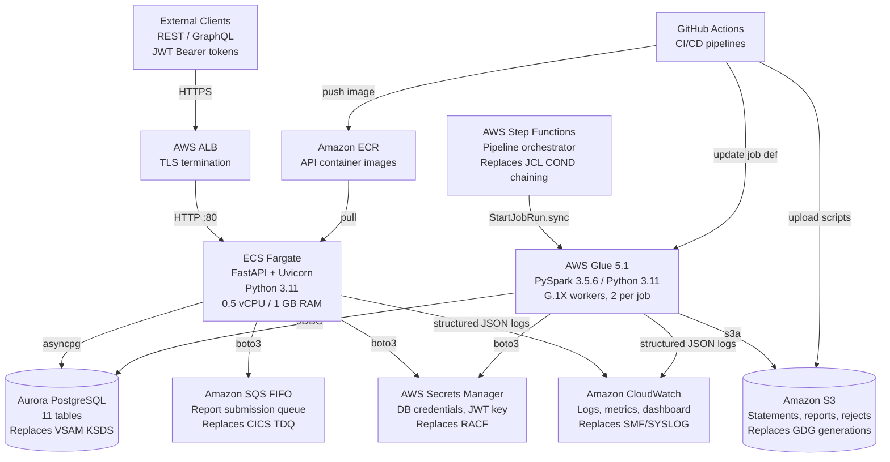
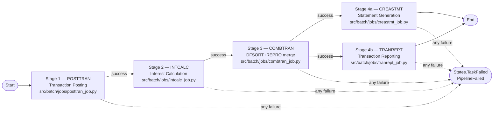
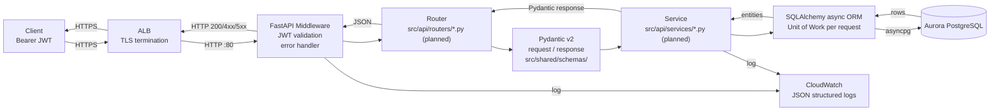
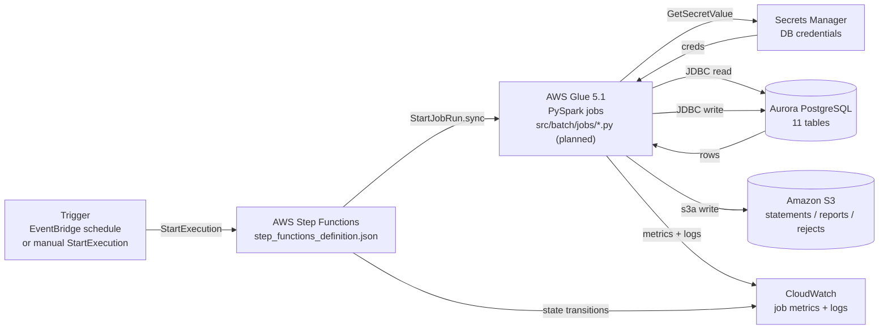

# CardDemo Architecture — Cloud-Native Modernization

<!-- Target architecture for the COBOL → Python / AWS migration.
     Source baseline: 28 COBOL programs, 28 copybooks, 17 BMS mapsets, 29 JCL jobs -->

## 1. Introduction

CardDemo is a credit card management application being modernized from its
original z/OS mainframe stack (COBOL, CICS, VSAM, JCL, BMS, RACF) to a
cloud-native Python stack running on Amazon Web Services. The refactor is a
**tech stack migration** — it preserves the application domain while replacing
every implementation layer with a supported, cloud-native equivalent.

The migration targets **full behavioral parity across all 22 features
(F-001 through F-022)** documented in the original technical specification.
Every business rule, validation cascade, calculation formula, reject code,
control-flow decision, and transactional boundary from the COBOL source is to
be faithfully translated to Python without simplification, algebraic rewriting,
or optimization.

The modernized application is organized into **two distinct workload types**,
each matched to the AWS service that best fits its runtime profile:

- **Online workload — API layer.** The 18 interactive CICS/COBOL programs are
  to be replaced by Python-based REST and GraphQL endpoints built on FastAPI,
  packaged into a Docker container, and deployed on AWS ECS Fargate behind an
  Application Load Balancer. Stateless sessions will be carried by JWT tokens,
  replacing the CICS COMMAREA channel. All data access goes through
  SQLAlchemy 2.x against an Aurora PostgreSQL-Compatible cluster.

- **Batch workload — Batch layer.** The 10 batch COBOL programs and the
  5-stage batch pipeline (POSTTRAN → INTCALC → COMBTRAN → CREASTMT ∥ TRANREPT)
  are to be replaced by PySpark ETL scripts running on AWS Glue 5.1
  (Apache Spark 3.5.6, Python 3.11). AWS Step Functions orchestrates stage
  ordering, parallelism, and failure propagation — replacing the JCL
  `COND=(0,NE)` job-step chaining semantics. Statement and report outputs
  that previously landed in GDG generations will land as versioned objects
  in Amazon S3.

Both workloads share a common `src/shared/` module that contains SQLAlchemy
ORM models (derived from COBOL copybooks), Pydantic v2 schemas (derived from
BMS symbolic maps), constants (messages, lookup codes, menu options), and
utility functions (date, string, decimal) — guaranteeing that a single
canonical representation of every business entity is used by the API, by the
batch jobs, and by the test suite.

!!! note "Implementation status at this checkpoint"
    At this checkpoint the **shared domain model** (`src/shared/` — 11 ORM
    models, 8 Pydantic schemas, 3 constants modules, 3 utility modules, 2
    config modules), the **Aurora PostgreSQL migration scripts**
    (`db/migrations/V1__schema.sql`, `V2__indexes.sql`, `V3__seed_data.sql`),
    the **AWS infrastructure configuration** (`infra/ecs-task-definition.json`,
    five `infra/glue-job-configs/*.json` files, `infra/cloudwatch/dashboard.json`),
    the **Step Functions state-machine definition**
    (`src/batch/pipeline/step_functions_definition.json`), the **three
    GitHub Actions workflows** (`.github/workflows/ci.yml`, `deploy-api.yml`,
    `deploy-glue.yml`), and the **Docker + Docker Compose local-dev scaffolding**
    (`Dockerfile`, `docker-compose.yml`) are all in place.

    The **FastAPI implementation modules** under `src/api/` (app factory,
    routers, services, middleware, database wiring, GraphQL schema) and the
    **PySpark job scripts** under `src/batch/jobs/` and `src/batch/common/`
    are **planned** in detail in this document but are **not yet
    implemented** at this checkpoint. The tables and inventories below
    annotate every planned module with a "planned" marker so that readers
    never confuse the target design with the current on-disk reality. The
    original COBOL source tree under `app/` is retained unchanged for
    traceability.

This document is the authoritative architectural reference for the modernized
CardDemo application. It describes the high-level topology, the two workload
layers, the database migration, the shared module, the deployment and
infrastructure stack, the design patterns applied, the security model, the
online and batch data flows, and the target project structure.

---

## 2. High-Level Architecture

The diagram below shows the end-to-end topology of the modernized application,
covering both workloads, the database, the asynchronous integration surface
(SQS), credential distribution (Secrets Manager), and observability
(CloudWatch).



**Key topology notes**

- All inbound client traffic terminates at the ALB, which performs TLS
  termination and forwards plaintext HTTP on port 80 to the ECS Fargate task.
- The FastAPI service is the only public-facing compute surface; the batch
  workload is fully private (orchestrated internally by Step Functions).
- Both the ECS task and the Glue jobs share the same Aurora cluster and the
  same Secrets Manager namespace — enforcing a single canonical data model
  and a single credential distribution channel.
- CloudWatch aggregates logs and metrics from both workloads into one
  observability plane (`infra/cloudwatch/dashboard.json`).
- GitHub Actions workflows (`.github/workflows/`) build the API container
  image and push to ECR, and upload PySpark scripts to S3 before updating
  Glue job definitions.

---

## 3. Architecture Layers

### 3.1 API Layer — FastAPI on ECS Fargate

The API layer replaces the 18 online CICS/COBOL programs with a single
containerized Python service. It is designed to be the only public-facing
component and the single entry point for all user-initiated operations.

!!! info "Status at this checkpoint"
    The shared domain model that the API layer depends on (`src/shared/`) is
    implemented. The `src/api/` tree exists only as package `__init__.py`
    placeholders at this checkpoint; the app factory, dependency module,
    database wiring, middleware, routers, services, and GraphQL schema are
    **planned** and described below as the authoritative target design.

**Runtime characteristics (target design)**

| Attribute | Value | Notes |
|---|---|---|
| Language runtime | Python 3.11 | Aligned with AWS Glue 5.1 and FastAPI recommendation |
| Web framework | FastAPI 0.115.x | Async REST + GraphQL via Strawberry |
| ASGI server | Uvicorn 0.34.x (standard extras) | Binds `0.0.0.0:80` inside the container |
| Container base | `python:3.11-slim` | Defined in `Dockerfile` |
| Compute | ECS Fargate | 0.5 vCPU, 1 GB RAM (per AAP §0.5.1) |
| Load balancer | AWS ALB | TLS termination, path-based routing |
| ORM | SQLAlchemy 2.0.x (`asyncio` extras) | Async session, Unit-of-Work per request |
| Database driver | asyncpg 0.30.x | Async PostgreSQL driver |
| Authentication | JWT via `python-jose[cryptography]>=3.4.0,<4.0` | Replaces CICS COMMAREA. Minimum 3.4.0 is required to pick up the fixes for CVE-2024-33663 and CVE-2024-33664 |
| Password hashing | `passlib[bcrypt]==1.7.4` | Preserves existing COBOL-era security |
| GraphQL | Strawberry 0.254.x | Mounted alongside REST routers |
| Validation | Pydantic v2 (2.10.x) | Shared schemas from `src/shared/schemas/` |
| AWS SDK | boto3 1.35.x | Used for Secrets Manager, SQS, CloudWatch |

**Target module layout under `src/api/` (all entries below are planned)**

| Planned module | Responsibility |
|---|---|
| `src/api/main.py` | FastAPI app factory; mounts REST routers and Strawberry GraphQL schema; configures middleware; registers startup/shutdown hooks |
| `src/api/dependencies.py` | FastAPI dependency providers: async DB session, current user (from JWT), authorization role checks |
| `src/api/database.py` | SQLAlchemy async engine, session factory, and context manager for Aurora PostgreSQL |
| `src/api/middleware/auth.py` | JWT validation middleware; extracts user identity and role claims from the Bearer token |
| `src/api/middleware/error_handler.py` | Global exception handler; emits COBOL-equivalent error codes drawn from `CSMSG01Y.cpy` / `CSMSG02Y.cpy` without leaking stack traces |
| `src/api/routers/*.py` | One router per feature group (auth, account, card, transaction, bill, report, user, admin) |
| `src/api/services/*.py` | One service per feature; encapsulates business logic mirroring COBOL PROCEDURE DIVISION paragraphs |
| `src/api/graphql/schema.py`, `types/`, `queries.py`, `mutations.py` | Strawberry-based GraphQL surface exposing the same data as the REST routers |

All API source files will declare a provenance header comment naming the
originating COBOL program (or programs) from which the behavior was
translated, consistent with the convention already established in
`src/shared/`.

**Target CICS/COBOL program → FastAPI module mapping (all target modules planned at this checkpoint)**

| Feature | CICS program | Planned router module | Planned service module |
|---|---|---|---|
| F-001 Sign-On / Authentication | `COSGN00C.cbl` | `src/api/routers/auth_router.py` | `src/api/services/auth_service.py` |
| F-002 Main Menu | `COMEN01C.cbl` | `src/api/main.py` (navigation config via `src/shared/constants/menu_options.py`) | — |
| F-003 Admin Menu | `COADM01C.cbl` | `src/api/routers/admin_router.py` | — |
| F-004 Account View | `COACTVWC.cbl` | `src/api/routers/account_router.py` | `src/api/services/account_service.py` |
| F-005 Account Update | `COACTUPC.cbl` | `src/api/routers/account_router.py` | `src/api/services/account_service.py` |
| F-006 Card List | `COCRDLIC.cbl` | `src/api/routers/card_router.py` | `src/api/services/card_service.py` |
| F-007 Card Detail | `COCRDSLC.cbl` | `src/api/routers/card_router.py` | `src/api/services/card_service.py` |
| F-008 Card Update | `COCRDUPC.cbl` | `src/api/routers/card_router.py` | `src/api/services/card_service.py` |
| F-009 Transaction List | `COTRN00C.cbl` | `src/api/routers/transaction_router.py` | `src/api/services/transaction_service.py` |
| F-010 Transaction Detail | `COTRN01C.cbl` | `src/api/routers/transaction_router.py` | `src/api/services/transaction_service.py` |
| F-011 Transaction Add | `COTRN02C.cbl` | `src/api/routers/transaction_router.py` | `src/api/services/transaction_service.py` |
| F-012 Bill Payment | `COBIL00C.cbl` | `src/api/routers/bill_router.py` | `src/api/services/bill_service.py` |
| F-018 User List | `COUSR00C.cbl` | `src/api/routers/user_router.py` | `src/api/services/user_service.py` |
| F-019 User Add | `COUSR01C.cbl` | `src/api/routers/user_router.py` | `src/api/services/user_service.py` |
| F-020 User Update | `COUSR02C.cbl` | `src/api/routers/user_router.py` | `src/api/services/user_service.py` |
| F-021 User Delete | `COUSR03C.cbl` | `src/api/routers/user_router.py` | `src/api/services/user_service.py` |
| F-022 Report Submission | `CORPT00C.cbl` | `src/api/routers/report_router.py` | `src/api/services/report_service.py` |

**Preserved behaviors (target contract for each planned module)**

The following COBOL behaviors must be preserved byte-for-byte when the
corresponding service is implemented:

- **F-005 Account Update (`COACTUPC.cbl`, ~4,236 lines):** multi-entity
  dual-write against `accounts` and `customers` inside a single SQLAlchemy
  transaction; any exception triggers a rollback, matching the original
  `SYNCPOINT ROLLBACK` contract.
- **F-008 Card Update (`COCRDUPC.cbl`):** optimistic concurrency using the
  `version` column on the `cards` table; a stale version causes a conflict
  exception rather than a silent overwrite.
- **F-012 Bill Payment (`COBIL00C.cbl`):** atomic dual-write — one INSERT
  into `transactions` and one UPDATE on `accounts.balance` — wrapped in a
  single Unit-of-Work.
- **F-022 Report Submission (`CORPT00C.cbl`):** replaces `WRITEQ TD
  QUEUE('JOBS')` with a `boto3` `SendMessage` call against the SQS FIFO
  report queue defined in `SQS_QUEUE_URL`.

### 3.2 Batch Layer — PySpark on AWS Glue

The batch layer replaces the 10 batch COBOL programs and the JCL-orchestrated
5-stage pipeline with PySpark ETL scripts running on AWS Glue 5.1. AWS Step
Functions orchestrates stage ordering, parallelism, and failure propagation.

!!! info "Status at this checkpoint"
    The `src/batch/pipeline/step_functions_definition.json` state machine is
    implemented. The `src/batch/common/*.py` shared helpers and all
    `src/batch/jobs/*_job.py` scripts are **planned** and described below
    as the authoritative target design. `src/batch/` contains only package
    `__init__.py` placeholders besides the Step Functions definition at
    this checkpoint.

**Runtime characteristics (target design)**

| Attribute | Value | Notes |
|---|---|---|
| Runtime | AWS Glue 5.1 (GA) | Apache Spark 3.5.6, Python 3.11, Scala 2.12.18 |
| Worker type | G.1X | Applied uniformly across all 5 pipeline configs (`infra/glue-job-configs/*.json`) |
| Workers per job | 2 | Standard configuration across pipeline stages |
| DataFrame interface | `DynamicFrame` (Glue) and Spark DataFrame | Schema flexibility for heterogenous inputs |
| Output format | Parquet (columnar) | For S3 statement / report outputs |
| Database access | JDBC → Aurora PostgreSQL | Credentials fetched from Secrets Manager |
| Orchestrator | AWS Step Functions (ASL) | Replaces JCL `COND` parameter chaining |

**Target module layout under `src/batch/` (all `common/` and `jobs/` entries are planned)**

| Planned module | Responsibility |
|---|---|
| `src/batch/common/glue_context.py` | `GlueContext` + `SparkSession` factory; JSON structured logging setup |
| `src/batch/common/db_connector.py` | JDBC URL and connection-properties builder; Secrets Manager integration |
| `src/batch/common/s3_utils.py` | S3 read/write helpers (input fixtures, versioned output paths replacing GDG) |

**5-stage batch pipeline (target orchestration — already encoded in `src/batch/pipeline/step_functions_definition.json`)**



**Stage behavior preservation (target contract for each planned job)**

- **Stage 1 POSTTRAN (planned `src/batch/jobs/posttran_job.py` ← `CBTRN02C.cbl`):**
  4-stage validation cascade producing reject codes **100–109**, with the
  exact reject-code taxonomy preserved; unchanged staging-to-posting data
  contract with `daily_transactions` as input.
- **Stage 2 INTCALC (planned `src/batch/jobs/intcalc_job.py` ← `CBACT04C.cbl`):**
  the interest-calculation formula is preserved literally as
  `(TRAN-CAT-BAL × DIS-INT-RATE) / 1200`, with no algebraic simplification.
  The DEFAULT / ZEROAPR disclosure-group fallback is preserved.
- **Stage 3 COMBTRAN (planned `src/batch/jobs/combtran_job.py` ← JCL DFSORT + REPRO):**
  pure-PySpark merge + sort; no COBOL program exists for this stage in the
  source baseline.
- **Stage 4a CREASTMT (planned `src/batch/jobs/creastmt_job.py` ← `CBSTM03A.CBL` + `CBSTM03B.CBL`):**
  4-entity join (accounts, customers, transactions, cross-references),
  generating both text and HTML statement output to versioned S3 objects.
- **Stage 4b TRANREPT (planned `src/batch/jobs/tranrept_job.py` ← `CBTRN03C.cbl`):**
  date-filtered transaction reports with 3-level totals (account → card →
  transaction).

**Target batch program → PySpark job mapping (all target modules planned at this checkpoint)**

| Pipeline role | COBOL source | Planned PySpark job |
|---|---|---|
| Stage 1 — Transaction posting | `CBTRN02C.cbl` | `src/batch/jobs/posttran_job.py` |
| Stage 2 — Interest calculation | `CBACT04C.cbl` | `src/batch/jobs/intcalc_job.py` |
| Stage 3 — Transaction merge/sort | JCL DFSORT + REPRO (no COBOL) | `src/batch/jobs/combtran_job.py` |
| Stage 4a — Statement generation | `CBSTM03A.CBL` + `CBSTM03B.CBL` | `src/batch/jobs/creastmt_job.py` |
| Stage 4b — Transaction reporting | `CBTRN03C.cbl` | `src/batch/jobs/tranrept_job.py` |
| Utility — Account reader | `CBACT01C.cbl` | `src/batch/jobs/read_account_job.py` |
| Utility — Card reader | `CBACT02C.cbl` | `src/batch/jobs/read_card_job.py` |
| Utility — Cross-reference reader | `CBACT03C.cbl` | `src/batch/jobs/read_xref_job.py` |
| Utility — Customer reader | `CBCUS01C.cbl` | `src/batch/jobs/read_customer_job.py` |
| Utility — Daily driver | `CBTRN01C.cbl` | `src/batch/jobs/daily_tran_driver_job.py` |
| Utility — Category balance print | `PRTCATBL.jcl` | `src/batch/jobs/prtcatbl_job.py` |

### 3.3 Database Layer — Aurora PostgreSQL

The 10 VSAM KSDS datasets and 3 alternate-index paths are mapped to 11
normalized relational tables with supporting B-tree indexes in AWS Aurora
PostgreSQL-Compatible Edition. Migration scripts (`db/migrations/V1__schema.sql`,
`V2__indexes.sql`, `V3__seed_data.sql`) are the single authoritative path for
database-state evolution and are in place at this checkpoint.

**Key engineering invariants**

- All monetary fields are declared as `NUMERIC(15,2)` at the DDL layer and
  `decimal.Decimal` at the ORM layer — preserving the semantics of COBOL
  `PIC S9(n)V99` literally, with no intermediate floating-point
  representation.
- Composite primary keys replicate the original VSAM composite-key
  structure for `transaction_category_balances`, `disclosure_groups`, and
  `transaction_categories`.
- Three B-tree indexes replace the three VSAM alternate-index paths,
  preserving the original secondary-lookup performance characteristics.

**Migration artifacts**

- `db/migrations/V1__schema.sql` — 11 `CREATE TABLE` statements covering
  every VSAM KSDS dataset (accounts, cards, customers, card_cross_references,
  transactions, transaction_category_balances, daily_transactions,
  disclosure_groups, transaction_types, transaction_categories, user_security).
- `db/migrations/V2__indexes.sql` — 3 B-tree indexes replacing the VSAM AIX
  paths (`idx_cards_acct_id`, `idx_card_cross_references_acct_id`,
  `idx_transactions_proc_ts`).
- `db/migrations/V3__seed_data.sql` — **636 seed rows in total** loaded from
  `app/data/ASCII/*.txt`, broken down as follows:

  | Table | Seed rows |
  |---|---|
  | `accounts` | 50 |
  | `cards` | 50 |
  | `customers` | 50 |
  | `card_cross_references` | 50 |
  | `transaction_category_balances` | 50 |
  | `disclosure_groups` | 51 |
  | `transaction_categories` | 18 |
  | `transaction_types` | 7 |
  | `user_security` | 10 |
  | `daily_transactions` | 300 |
  | **Total** | **636** |

**VSAM dataset → PostgreSQL table mapping**

| VSAM Dataset | Copybook | PostgreSQL Table | Primary Key |
|---|---|---|---|
| ACCTFILE | `CVACT01Y.cpy` | `accounts` | `acct_id` (11-digit) |
| CARDFILE | `CVACT02Y.cpy` | `cards` | `card_num` (16-char) |
| CUSTFILE | `CVCUS01Y.cpy` | `customers` | `cust_id` (9-digit) |
| XREFFILE | `CVACT03Y.cpy` | `card_cross_references` | `card_num` (16-char) |
| TRANFILE | `CVTRA05Y.cpy` | `transactions` | `tran_id` (sequence) |
| TCATBALF | `CVTRA01Y.cpy` | `transaction_category_balances` | (`acct_id`, `type_code`, `cat_code`) |
| DAILYTRAN | `CVTRA06Y.cpy` | `daily_transactions` | staging entity |
| DISCGRP | `CVTRA02Y.cpy` | `disclosure_groups` | (`group_id`, `type`, `code`) |
| TRANTYPE | `CVTRA03Y.cpy` | `transaction_types` | `type_code` (2-char) |
| TRANCATG | `CVTRA04Y.cpy` | `transaction_categories` | (`type_code`, `cat_code`) |
| USRSEC | `CSUSR01Y.cpy` | `user_security` | `usr_id` (8-char) |

**Alternate index paths preserved via B-tree indexes**

| Original AIX Path | PostgreSQL Index | Purpose |
|---|---|---|
| Card AIX on account-id | `idx_cards_acct_id` | Secondary lookup: cards for an account |
| XRef AIX on account-id | `idx_card_cross_references_acct_id` | Secondary lookup: xrefs for an account |
| Transaction AIX on processing-timestamp | `idx_transactions_proc_ts` | Date-range scans for statements/reports |

### 3.4 Shared Module — `src/shared/`

The `src/shared/` module is the single source of truth for every entity,
contract, and helper used by the two workloads. Both the API and the batch
jobs will import from this module, guaranteeing that ORM mappings, validation
schemas, constants, and utility semantics are identical across the
application. This module is **fully implemented at this checkpoint**.

| Sub-module | Contents | Derived From |
|---|---|---|
| `models/` | 11 SQLAlchemy ORM models | 11 VSAM record-layout copybooks (`CVACT01Y`, `CVACT02Y`, `CVACT03Y`, `CVCUS01Y`, `CVTRA01Y`–`CVTRA06Y`, `CSUSR01Y`) |
| `schemas/` | 8 Pydantic v2 schema modules | 17 BMS symbolic-map copybooks in `app/cpy-bms/` |
| `constants/` | `messages.py`, `lookup_codes.py`, `menu_options.py` | `CSMSG01Y.cpy`, `CSMSG02Y.cpy`, `COTTL01Y.cpy`, `CSLKPCDY.cpy`, `COMEN02Y.cpy`, `COADM02Y.cpy` |
| `utils/` | `date_utils.py`, `string_utils.py`, `decimal_utils.py` | `CSUTLDTC.cbl`, `CSDAT01Y.cpy`, `CSUTLDWY.cpy`, `CSUTLDPY.cpy`, `CSSTRPFY.cpy`, decimal math from `CVTRA01Y.cpy` |
| `config/` | `settings.py` (pydantic `BaseSettings`), `aws_config.py` (boto3 client factories, Secrets Manager helpers) | — (new module, no COBOL source) |

**Key invariants enforced by the shared module**

- Every monetary field uses `decimal.Decimal` at the Python layer and maps
  to `NUMERIC(15,2)` at the database layer — with no intermediate
  floating-point representation.
- Every ORM model includes the provenance comment referencing its source
  copybook so the migration trail is traceable in-code.
- Every Pydantic schema has validators that mirror the COBOL
  `PIC X(n) / PIC 9(n)` length-and-type constraints.

---

## 4. Infrastructure and Deployment

### 4.1 CI/CD — GitHub Actions

Three GitHub Actions workflows cover the full delivery lifecycle and are in
place at this checkpoint under `.github/workflows/`:

| Workflow | File | Responsibilities |
|---|---|---|
| Continuous Integration | `.github/workflows/ci.yml` | Ruff lint (`--no-fix`), mypy strict type-check, pytest (unit + integration), `pytest-cov` coverage reporting. `pyproject.toml` enforces the 🏗 planned `--cov-fail-under=80` threshold. **Note:** the `tests/` tree contains only package `__init__.py` placeholders at this checkpoint; the coverage gate will pass meaningfully only once test modules are added. |
| API Deployment | `.github/workflows/deploy-api.yml` | Build the FastAPI Docker image, push to Amazon ECR, update the ECS Fargate service task definition. Executes successfully only once the `src/api/` implementation is in place. |
| Glue Deployment | `.github/workflows/deploy-glue.yml` | Upload PySpark scripts to the Glue scripts S3 bucket, update AWS Glue job definitions via the AWS CLI. Iterates over 11 planned jobs; requires the `src/batch/jobs/*.py` scripts to be present at deploy time. |

The CI workflow enforces the same linters and type-checkers that developers
run locally (`ruff check src/`, `mypy src/`), so contributions are validated
identically in local and CI environments.

### 4.2 Infrastructure Configuration

Infrastructure-as-configuration artifacts live under `infra/` and are all in
place at this checkpoint:

| Artifact | File | Purpose |
|---|---|---|
| ECS Task Definition | `infra/ecs-task-definition.json` | Python 3.11 container on Fargate, **0.5 vCPU / 1 GB RAM**, port 80, IAM task role with Secrets Manager + SQS + S3 scoped permissions |
| Glue Job Config — POSTTRAN | `infra/glue-job-configs/posttran.json` | Glue 5.1, G.1X worker, 2 workers, JDBC to Aurora |
| Glue Job Config — INTCALC | `infra/glue-job-configs/intcalc.json` | Glue 5.1, G.1X worker, 2 workers |
| Glue Job Config — COMBTRAN | `infra/glue-job-configs/combtran.json` | Glue 5.1, G.1X worker, 2 workers |
| Glue Job Config — CREASTMT | `infra/glue-job-configs/creastmt.json` | Glue 5.1, G.1X worker, 2 workers |
| Glue Job Config — TRANREPT | `infra/glue-job-configs/tranrept.json` | Glue 5.1, G.1X worker, 2 workers |
| CloudWatch Dashboard | `infra/cloudwatch/dashboard.json` | Unified widgets for ECS service health, Glue job DPU usage, Aurora connections, SQS queue depth, error rates |

### 4.3 AWS Services

The following AWS services collectively host the application. Each replaces
a specific z/OS capability from the legacy architecture.

| AWS Service | Purpose | Replaces |
|---|---|---|
| ECS Fargate | FastAPI container hosting (0.5 vCPU, 1 GB RAM) | CICS region |
| AWS Glue 5.1 | PySpark batch execution | JES2 / JCL |
| Aurora PostgreSQL | Relational database (Aurora-compatible) | VSAM KSDS |
| Amazon S3 | Output storage, PySpark script storage | GDG, PS datasets |
| SQS FIFO | Report queue (strict ordering) | CICS TDQ (`WRITEQ JOBS`) |
| Step Functions | Pipeline orchestration (ASL state machine) | JCL `COND` chaining |
| Secrets Manager | DB credentials, JWT signing key | RACF credentials |
| CloudWatch | Logs, metrics, dashboards, alarms | SMF / SYSLOG |
| ECR | Container image registry | N/A (new capability) |
| IAM | Service-to-service authentication / authorization | RACF access control |
| ALB | TLS termination, path-based routing | CICS terminal front-end |

---

## 5. Design Patterns

The modernized architecture applies a consistent set of design patterns that
collectively replace the mainframe's procedural / file-centric idioms with
idiomatic cloud-native Python patterns — while preserving every behavioral
contract.

| Pattern | Application in CardDemo | Mainframe Construct Replaced |
|---|---|---|
| **Repository Pattern** | SQLAlchemy ORM models encapsulate all data access; every CRUD operation flows through a session-bound repository rather than direct DB-API use. | Direct VSAM `READ / WRITE / REWRITE / DELETE` verbs |
| **Service Layer** | Each online feature will have a service module in `src/api/services/` (planned) that mirrors the original COBOL program's paragraph structure; routers stay thin and delegate all business logic to services. | COBOL PROCEDURE DIVISION paragraphs and `PERFORM` chains |
| **Dependency Injection** | FastAPI `Depends()` will provide request-scoped sessions, the current authenticated user, and service instances — evaluated lazily by the framework. | CICS COMMAREA passed by the transaction manager |
| **Factory Pattern** | Pydantic model factories construct typed response payloads from ORM entities — replacing field-by-field screen-map MOVEs. | COBOL `MOVE` statements populating BMS symbolic maps |
| **Pipeline Pattern** | AWS Step Functions orchestrates the 5-stage batch pipeline with sequential, parallel, and retry semantics encoded declaratively in ASL (`src/batch/pipeline/step_functions_definition.json`). | JCL `COND` parameter chaining across JOB steps |
| **Transactional Outbox / Unit-of-Work** | SQLAlchemy session context managers wrap multi-entity mutations; any exception triggers `ROLLBACK`, committing only on clean exit — delivering the same dual-write atomicity used in F-005 Account Update and F-012 Bill Payment. | CICS `SYNCPOINT` and `SYNCPOINT ROLLBACK` |
| **Optimistic Concurrency** | The `Card` and `Account` models carry a `version` column that SQLAlchemy increments on every update; a concurrent writer with a stale version receives a conflict exception. | `READ UPDATE` → `REWRITE` optimistic-lock pattern |
| **Stateless Authentication** | JWT tokens signed with a secret loaded from Secrets Manager convey identity and role across requests — no server-side session store. | CICS `RETURN TRANSID COMMAREA(...)` channel state |

---

## 6. Security Architecture

Security is layered across the network boundary, the application, and the
credential plane. Every measure mirrors a legacy z/OS control with a
cloud-native equivalent. Items below marked with "planned" rely on the
`src/api/` implementation and will be active once that module is delivered.

- **Transport security.** All client traffic uses HTTPS and terminates at
  the ALB; the ALB-to-ECS hop is on the private subnet. The VPC boundary
  replaces the pre-existing CICS-terminal network isolation.
- **Stateless authentication (JWT) — planned.** Authentication issues a
  JWT via `python-jose[cryptography]>=3.4.0,<4.0`; subsequent requests
  carry it as a Bearer token. Tokens include the user identifier, role
  (user / admin), and expiration. The JWT signing key is retrieved from
  AWS Secrets Manager at service startup — never committed to code. JWT
  tokens replace the CICS COMMAREA as the session-state carrier. The
  version pin ≥ 3.4.0 is required to pick up the fixes for
  CVE-2024-33663 (algorithm confusion with OpenSSH ECDSA keys) and
  CVE-2024-33664 (DoS via compressed JWE tokens); both CVEs affect 3.3.0
  and earlier.
- **Password hashing — planned.** User passwords are to be hashed with
  **BCrypt** via `passlib[bcrypt]==1.7.4` — preserving the hashing
  algorithm used in the original `COUSR01C.cbl` user-add path. Plaintext
  passwords are never stored or logged.
- **Service authentication.** ECS tasks and Glue jobs assume IAM roles
  (no static access keys are ever embedded in code or configuration).
  Each role grants the minimum set of permissions required: ECS task role
  grants Secrets Manager `GetSecretValue` on the DB-credentials secret
  and JWT-key secret, SQS `SendMessage` on the report queue, and S3
  `PutObject` on the output prefix only.
- **Credential isolation.** All sensitive values — Aurora credentials,
  JWT signing key, any third-party API keys — live in AWS Secrets Manager
  and are fetched at runtime by boto3. Environment-variable secrets are
  reserved for non-sensitive configuration (log level, deployment
  identifier).
- **Authorization at the application layer — planned.** The JWT payload's
  role claim will be checked by FastAPI dependencies on every admin-only
  route (`src/api/routers/admin_router.py` and user-management mutations),
  replicating the RACF group-based authorization of the original COBOL
  admin menu (`COADM01C.cbl`).
- **Error-surface minimization — planned.** The global error handler in
  `src/api/middleware/error_handler.py` will return COBOL-equivalent
  error codes (drawn from `CSMSG01Y.cpy` / `CSMSG02Y.cpy`) without
  leaking stack traces to the client.

---

## 7. Data Flow Diagrams

### 7.1 Online Request Flow (REST / GraphQL — target design)



**Notes:** Each request opens exactly one async SQLAlchemy session (Unit of
Work). Commit happens only when the handler returns normally; any raised
exception triggers rollback — matching the `SYNCPOINT ROLLBACK` semantics
used in F-005 Account Update (`COACTUPC.cbl`) and F-012 Bill Payment
(`COBIL00C.cbl`).

### 7.2 Batch Pipeline Flow (Step Functions + Glue — target design)



**Notes:** A job failure raises a `States.TaskFailed` event that
Step Functions routes to the `PipelineFailed` state, preventing any
downstream stage from executing. This replicates the JCL `COND=(0,NE)`
chain that skips subsequent steps on any non-zero return code — visible
in `CREASTMT.JCL` STEP020 / STEP030 / STEP040 and in `TRANREPT.jcl`.

---

## 8. Project Structure Reference

The target repository layout reflects the two-workload architecture: the
shared module sits at the center; the API and batch layers depend on it;
supporting infrastructure, database migrations, and tests are sibling
top-level directories. The original `app/` tree is retained unchanged for
traceability.

Entries below are annotated as follows:

- ✅ **implemented** — on disk, populated, usable at this checkpoint
- 🏗 **planned** — directory scaffold exists (package `__init__.py` only)
  or file is referenced in the target design but not yet populated

```text
carddemo/
├── README.md                          ✅ Project overview (updated for Python/AWS)
├── LICENSE                            ✅ Apache 2.0 (retained)
├── pyproject.toml                     ✅ Python project + tool config
├── requirements.txt                   ✅ Core / shared deps (boto3, pydantic)
├── requirements-api.txt               ✅ API deps (FastAPI, SQLAlchemy, Strawberry, JWT, BCrypt)
├── requirements-glue.txt              ✅ Batch deps (PySpark 3.5.6, pg8000)
├── requirements-dev.txt               ✅ Dev / test deps (pytest, ruff, mypy, moto, testcontainers)
├── Dockerfile                         ✅ API container (python:3.11-slim)
├── docker-compose.yml                 ✅ Local dev: API + PostgreSQL + LocalStack
├── .github/
│   └── workflows/
│       ├── ci.yml                     ✅ Lint + type-check + test + coverage
│       ├── deploy-api.yml             ✅ Build Docker → ECR → ECS service update
│       └── deploy-glue.yml            ✅ Upload scripts → S3 → Glue job def update
├── docs/
│   ├── index.md                       ✅ MkDocs landing page
│   ├── project-guide.md               ✅ Project status / development guide
│   ├── technical-specifications.md    ✅ Authoritative technical spec
│   └── architecture.md                ✅ This document
├── db/
│   └── migrations/
│       ├── V1__schema.sql             ✅ 11 tables
│       ├── V2__indexes.sql            ✅ 3 B-tree indexes
│       └── V3__seed_data.sql          ✅ 636 seed rows
├── src/
│   ├── shared/                        ✅ Shared between API and Batch — fully implemented
│   │   ├── models/                    ✅ 11 SQLAlchemy ORM models
│   │   ├── schemas/                   ✅ 8 Pydantic v2 schemas
│   │   ├── constants/                 ✅ messages, lookup_codes, menu_options
│   │   ├── utils/                     ✅ date_utils, string_utils, decimal_utils
│   │   └── config/                    ✅ settings.py, aws_config.py
│   ├── api/                           🏗 FastAPI REST + GraphQL (18 online programs) — planned
│   │   ├── main.py                    🏗 planned — FastAPI app factory
│   │   ├── dependencies.py            🏗 planned — DI: session, current user, auth
│   │   ├── database.py                🏗 planned — SQLAlchemy async engine + session factory
│   │   ├── middleware/                🏗 planned — auth.py, error_handler.py
│   │   ├── routers/                   🏗 planned — auth, account, card, transaction, bill, report, user, admin
│   │   ├── services/                  🏗 planned — one service per feature
│   │   └── graphql/                   🏗 planned — Strawberry schema, types, queries, mutations
│   └── batch/                         🏗 PySpark Glue jobs (10 batch programs + utilities) — partially implemented
│       ├── common/                    🏗 planned — glue_context, db_connector, s3_utils
│       ├── jobs/                      🏗 planned — posttran, intcalc, combtran, creastmt, tranrept + utilities
│       └── pipeline/
│           └── step_functions_definition.json   ✅ ASL state machine
├── tests/                             🏗 planned — package scaffolding present; test modules not yet authored
│   ├── unit/                          🏗 planned
│   ├── integration/                   🏗 planned
│   └── e2e/                           🏗 planned
├── infra/
│   ├── ecs-task-definition.json       ✅ ECS Fargate task (0.5 vCPU / 1 GB)
│   ├── glue-job-configs/              ✅ posttran, intcalc, combtran, creastmt, tranrept
│   └── cloudwatch/
│       └── dashboard.json             ✅ Unified observability dashboard
└── app/                               ✅ Original COBOL sources — retained for traceability
    ├── cbl/                           ✅ 28 COBOL programs
    ├── cpy/                           ✅ 28 copybooks
    ├── bms/                           ✅ 17 BMS mapsets
    ├── cpy-bms/                       ✅ 17 symbolic-map copybooks
    ├── jcl/                           ✅ 29 JCL job members
    ├── data/                          ✅ 9 ASCII fixture files
    └── catlg/                         ✅ LISTCAT.txt (209 VSAM catalog entries)
```

**Layering invariants (enforced once `src/api/` and `src/batch/jobs/` are implemented)**

- `src/shared/` has no imports from `src/api/` or `src/batch/` — it is a
  pure dependency with no cycles.
- `src/api/` and `src/batch/` are independent sibling trees. They share
  only through `src/shared/`; they do not import from each other.
- The `app/` tree is read-only. It is preserved verbatim for auditing,
  traceability, and downstream behavioral-equivalence validation. No
  production code path references anything in `app/` at runtime.

---

## 9. Feature Coverage Summary

All 22 features (F-001 through F-022) documented in the legacy technical
specification are covered by the two modernized workloads. The table below
maps feature IDs to the workload, the originating COBOL program, and the
Python module(s) that deliver (or will deliver) the behavior. Each row's
**Status** column makes the checkpoint state explicit.

| Feature | Name | Workload | COBOL Source | Python Module(s) | Status |
|---|---|---|---|---|---|
| F-001 | Sign-On / Authentication | API | `COSGN00C.cbl` | `src/api/routers/auth_router.py`, `src/api/services/auth_service.py` | 🏗 planned |
| F-002 | Main Menu | API | `COMEN01C.cbl` | `src/api/main.py` (navigation config from `src/shared/constants/menu_options.py`) | 🏗 planned (constants present in `src/shared/`) |
| F-003 | Admin Menu | API | `COADM01C.cbl` | `src/api/routers/admin_router.py` | 🏗 planned |
| F-004 | Account View | API | `COACTVWC.cbl` | `src/api/routers/account_router.py`, `src/api/services/account_service.py` | 🏗 planned |
| F-005 | Account Update | API | `COACTUPC.cbl` | `src/api/services/account_service.py` (dual-write, rollback-on-exception) | 🏗 planned |
| F-006 | Card List | API | `COCRDLIC.cbl` | `src/api/routers/card_router.py` | 🏗 planned |
| F-007 | Card Detail | API | `COCRDSLC.cbl` | `src/api/services/card_service.py` | 🏗 planned |
| F-008 | Card Update | API | `COCRDUPC.cbl` | `src/api/services/card_service.py` (optimistic concurrency via version column) | 🏗 planned |
| F-009 | Transaction List | API | `COTRN00C.cbl` | `src/api/routers/transaction_router.py` | 🏗 planned |
| F-010 | Transaction Detail | API | `COTRN01C.cbl` | `src/api/services/transaction_service.py` | 🏗 planned |
| F-011 | Transaction Add | API | `COTRN02C.cbl` | `src/api/services/transaction_service.py` (auto-ID, xref resolution) | 🏗 planned |
| F-012 | Bill Payment | API | `COBIL00C.cbl` | `src/api/routers/bill_router.py`, `src/api/services/bill_service.py` (dual-write) | 🏗 planned |
| F-013 | Transaction Posting (batch) | Batch | `CBTRN02C.cbl` | `src/batch/jobs/posttran_job.py` (Stage 1) | 🏗 planned |
| F-014 | Interest Calculation | Batch | `CBACT04C.cbl` | `src/batch/jobs/intcalc_job.py` (Stage 2) | 🏗 planned |
| F-015 | Transaction Merge/Sort | Batch | JCL DFSORT + REPRO | `src/batch/jobs/combtran_job.py` (Stage 3) | 🏗 planned |
| F-016 | Statement Generation | Batch | `CBSTM03A.CBL` + `CBSTM03B.CBL` | `src/batch/jobs/creastmt_job.py` (Stage 4a) | 🏗 planned |
| F-017 | Transaction Reporting | Batch | `CBTRN03C.cbl` | `src/batch/jobs/tranrept_job.py` (Stage 4b) | 🏗 planned |
| F-018 | User List | API | `COUSR00C.cbl` | `src/api/routers/user_router.py` | 🏗 planned |
| F-019 | User Add | API | `COUSR01C.cbl` | `src/api/services/user_service.py` (BCrypt hashing) | 🏗 planned |
| F-020 | User Update | API | `COUSR02C.cbl` | `src/api/services/user_service.py` | 🏗 planned |
| F-021 | User Delete | API | `COUSR03C.cbl` | `src/api/services/user_service.py` | 🏗 planned |
| F-022 | Report Submission | API (+ SQS) | `CORPT00C.cbl` | `src/api/routers/report_router.py`, `src/api/services/report_service.py` (SQS FIFO publish) | 🏗 planned |

Cross-cutting shared components (ORM models, Pydantic schemas, constants,
utilities, configuration) that all 22 features depend on are implemented
and live under `src/shared/`.

---

## 10. Traceability Notes

- Every Python source file in **the implemented `src/shared/` module**
  includes a header comment pointing back to its originating COBOL
  program or copybook (for example, `src/shared/models/account.py`
  begins with
  `# Source: COBOL copybook CVACT01Y.cpy — ACCOUNT-RECORD (RECLN 300)`).
  This in-code provenance convention will be applied uniformly to the
  planned `src/api/` and `src/batch/` modules when they are authored,
  so that every production source file can be traced back to its z/OS
  origin without leaving the repository.
- The original `app/` tree is kept verbatim. It is never modified by
  any agent in the modernization pipeline and remains available as the
  authoritative source of truth for behavioral equivalence testing.
- The three migration SQL scripts (`V1__schema.sql`, `V2__indexes.sql`,
  `V3__seed_data.sql`) are versioned in-repository. They are the single
  authoritative path for database-state evolution; ad-hoc DDL changes
  outside this sequence are not permitted.
- Pipeline behavior preservation — including reject codes 100–109 in
  POSTTRAN, the literal `(TRAN-CAT-BAL × DIS-INT-RATE) / 1200` formula
  in INTCALC, and the DEFAULT/ZEROAPR fallback — is documented here as
  the target contract and will be reflected in the module header
  comments of the PySpark job scripts
  (`src/batch/jobs/posttran_job.py`, `src/batch/jobs/intcalc_job.py`)
  when those scripts are authored.

---

<!--
This document is rendered by MkDocs using the `techdocs-core` and
`mermaid2` plugins declared in `mkdocs.yml`. All Mermaid diagrams use
the `flowchart` (top-down or left-right) syntax supported by the
mermaid2 plugin. If the rendering surface changes, the diagrams remain
valid GitHub-flavored Markdown and will render natively on
github.com without modification.
-->
