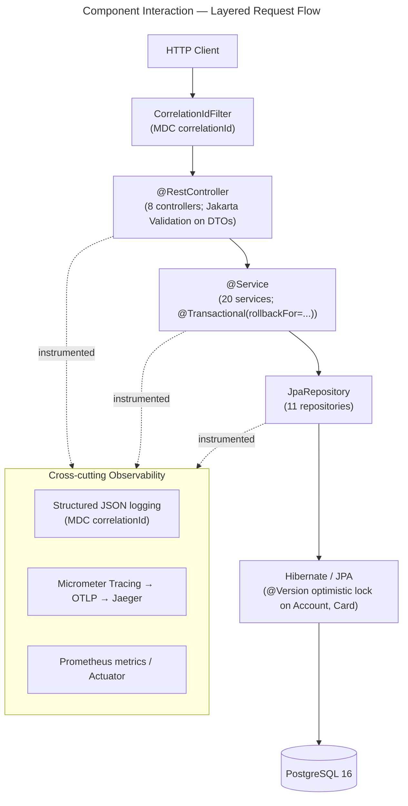
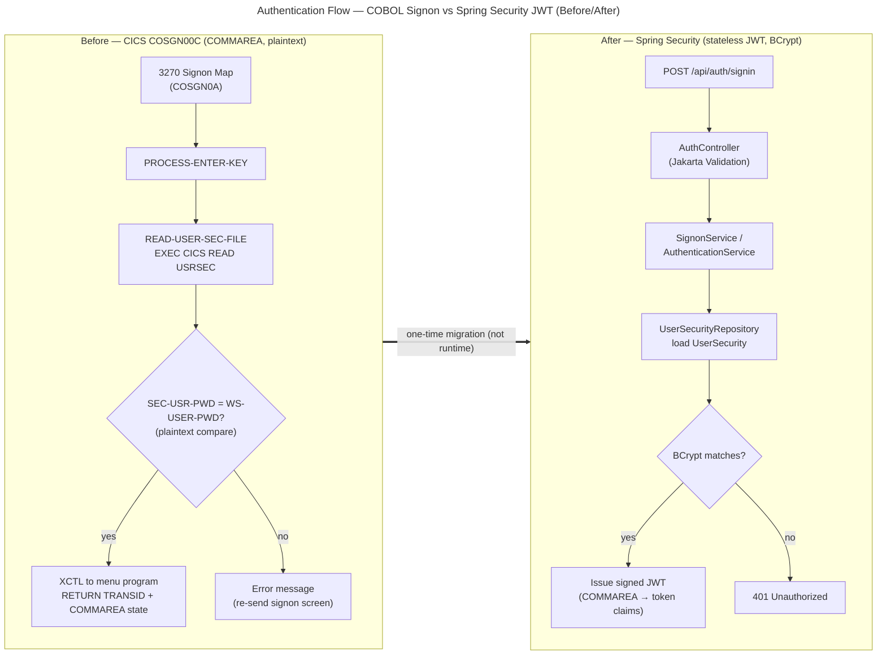

# Component Interactions

This page is the **component-interaction** view of the AWS CardDemo
[Visual Architecture Documentation](./overview.md). It drills into two things the
top-level [Architecture Overview](./overview.md) only sketches: **how a single request flows
through the layered Spring architecture** (Controller → Service → Repository → Database, wrapped
by cross-cutting observability), and **how authentication changed** from the legacy COBOL / CICS
sign-on to Spring Security with a stateless JWT. Because this is a **migration**, the
authentication aspect is presented as a **before/after pair**: the frozen COBOL behavior is the
authoritative baseline but is **not copied into this repository** — it is referenced only by its
original commit SHA **`27d6c6f`** (full `7756d895ffeb65f7ea72aaa609e356d9899afcec`).

Design rationale lives in documentation, never in code comments: every non-trivial choice shown
here is explained in the [Decision Log](../decision-log.md), and every COBOL paragraph is mapped
to its Java method in the [Traceability Matrix](../traceability-matrix.md). The companion
[Data Flow](./data-flow.md) page covers the VSAM → PostgreSQL and GDG / TDQ → S3 / SQS data
movement. The two diagrams below reuse the shared edge vocabulary defined in the overview's
[How to read these diagrams](./overview.md#how-to-read-these-diagrams) section — **solid arrows**
(`-->`) are runtime control/data flow, **dotted arrows** (`-.text.->`) are cross-cutting
instrumentation (not a business call), and **thick double arrows** (`==>`) mark the one-time
migration transformation (never a runtime dependency).

## Component Interaction — Layered Request Flow

The ***Component Interaction — Layered Request Flow*** diagram traces one HTTP request from the
client down to PostgreSQL and back through the layered architecture that replaces the monolithic
CICS program. Every request first passes through the **`CorrelationIdFilter`** servlet filter,
which generates or propagates an MDC `correlationId` so that logs, traces, and metrics can be
stitched together end to end. It then reaches the HTTP boundary — a **`@RestController`** (8 in
total) that applies **Jakarta Validation** to the request DTO — before delegating to the business
tier. A **`@Service`** (20 in total) holds the migrated business logic and owns the transaction
boundary via **`@Transactional(rollbackFor=...)`**, which reproduces the COBOL
`EXEC CICS SYNCPOINT ROLLBACK` (for example in COACTUPC). Persistence is reached through a
**`JpaRepository`** (11 in total) over **Hibernate / JPA**, where **`@Version`** optimistic
locking on the `Account` and `Card` entities reproduces the read-then-rewrite compare of COACTUPC
and COCRDUPC, and finally lands in **PostgreSQL 16**. Cutting across all tiers, the observability
stack — structured JSON logging, Micrometer tracing exported over OTLP to Jaeger, and Prometheus
metrics via Actuator — instruments the controller, service, and repository tiers rather than being
called as a business dependency.

**Diagram 1 — Component Interaction — Layered Request Flow**

**Legend — Diagram 1:**

- **`CorrelationIdFilter`** — a servlet filter at the very edge of the request; it establishes the
  MDC `correlationId` that every downstream log line, trace span, and metric carries.
- **`@RestController` (HTTP boundary)** — the 8 controllers that replace the 17 BMS screens; they
  bind and **validate** the request DTO with Jakarta Validation, then delegate to a service.
- **`@Service` (business logic + transaction boundary)** — the 20 services that hold the migrated
  paragraph logic; the **`@Transactional(rollbackFor=...)`** annotation demarcates the
  all-or-nothing transaction and reproduces `EXEC CICS SYNCPOINT ROLLBACK`
  (decision [D-008](../decision-log.md)).
- **`JpaRepository` (data access)** — the 11 repositories that replace VSAM keyed access.
- **Hibernate / JPA + PostgreSQL 16 (persistence)** — the ORM and database; **`@Version`**
  optimistic locking on `Account` and `Card` reproduces the read-then-rewrite compare of COACTUPC
  (CAUP) and COCRDUPC (CCUP), surfacing a version conflict as an HTTP 409
  (decision [D-007](../decision-log.md)). The cylinder node denotes the database.
- **Edges** — **solid** arrows (`-->`) are the runtime request path top-to-bottom; the **dotted**
  `instrumented` arrows (`-.instrumented.->`) show that the controller, service, and repository
  tiers emit logs, traces, and metrics into the cross-cutting **Observability** subgraph rather
  than invoking it as a business dependency.

## Authentication Flow — COBOL Signon vs Spring Security JWT (Before/After)

The ***Authentication Flow — COBOL Signon vs Spring Security JWT (Before/After)*** diagram places
the legacy COBOL sign-on beside its Spring Security replacement as a **before/after pair**. On the
**before** side, the CICS program COSGN00C dispatches on the Enter key to `PROCESS-ENTER-KEY`,
which performs `READ-USER-SEC-FILE` — an `EXEC CICS READ` against the `USRSEC` VSAM file — and then
compares the entered password to the stored one **in plaintext** (`SEC-USR-PWD = WS-USER-PWD`);
cross-screen state is carried in the CICS **COMMAREA** (pseudo-conversational). On the **after**
side, a client `POST /api/auth/signin` reaches the **`AuthController`**, which calls the
**`SignonService` / `AuthenticationService`** to load the **`UserSecurity`** entity through its
repository and verify the password with **BCrypt** (`BCryptPasswordEncoder.matches`); on success it
issues a **stateless JWT** whose claims carry the state that once lived in the COMMAREA, and every
subsequent request presents `Authorization: Bearer <jwt>` validated by a security filter. Two of
these changes are **logged deviations** from a literal translation: upgrading the plaintext compare
to a **BCrypt** hash, and replacing COMMAREA session state with a **stateless JWT**.

**Diagram 2 — Authentication Flow — COBOL Signon vs Spring Security JWT (Before/After)**

**Legend — Diagram 2:**

- **Before (CICS / COMMAREA / plaintext)** — the `B*` nodes are the COBOL sign-on: the 3270 map
  feeds `PROCESS-ENTER-KEY`, which performs `READ-USER-SEC-FILE` to read the `USRSEC` VSAM file,
  compares the password **in plaintext**, and on success transfers control (`XCTL`) to the menu
  program while `RETURN TRANSID … COMMAREA` carries pseudo-conversational state across screens.
- **After (REST / JWT / BCrypt)** — the `A*` nodes are the Spring replacement: `AuthController`
  validates the request, `SignonService` / `AuthenticationService` loads the `UserSecurity` entity
  through its repository, **BCrypt** verifies the password, and a **stateless JWT** replaces the
  COMMAREA (the former cross-screen state becomes signed token claims).
- **Decision diamonds** (`{ }`) — the branch points `SEC-USR-PWD = WS-USER-PWD?` (before) and
  `BCrypt matches?` (after) are the equivalent yes/no credential checks in each world.
- **The thick `==>` edge** is the **one-time migration transformation**, explicitly **not a runtime
  dependency**: the Spring service never calls back into CICS; the edge only records that the
  "after" sign-on was derived from the "before" sign-on during this project.

Rationale for the plaintext→BCrypt upgrade (D-002) and the COMMAREA→stateless-JWT change (D-009) is
recorded in the [Decision Log](../decision-log.md). Both are deliberate, explicitly logged
deviations from a literal COBOL translation: BCrypt eliminates plaintext credential storage while
preserving the sign-on flow, and the stateless JWT allows horizontal scaling with no server
affinity.

!!! warning "Open risk — externalize the JWT signing secret"
    The JWT signing secret is currently **hardcoded in configuration**, which is tracked as an
    open **High-severity** risk (see [D-009](../decision-log.md) and the
    [Project Guide](../project-guide.md) risk register). It **must be externalized** to an
    environment variable or a secrets manager / vault (for example AWS Secrets Manager or
    HashiCorp Vault) before any non-local deployment. No secret value is shown here or anywhere in
    the documentation, consistent with the "no hardcoded credentials" rule.

## See also

- [Architecture Overview](./overview.md) — the three top-level before/after views (whole-system
  and batch-pipeline) and the shared diagram vocabulary this page reuses.
- [Data Flow](./data-flow.md) — the VSAM → PostgreSQL data-migration mapping (Flyway) and the
  GDG / TDQ → S3 / SQS staging-and-messaging before/after.
- [Decision Log](../decision-log.md) — the rationale, alternatives, and residual risk for the
  decisions cited on this page: [D-002](../decision-log.md) (BCrypt password hashing),
  [D-007](../decision-log.md) (`@Version` optimistic locking),
  [D-008](../decision-log.md) (`@Transactional(rollbackFor=...)`), and
  [D-009](../decision-log.md) (stateless REST + JWT vs. COMMAREA).
- [Traceability Matrix](../traceability-matrix.md) — the 100% bidirectional COBOL-paragraph →
  Java-method mapping (source referenced by SHA `27d6c6f`); the sign-on path maps COSGN00C
  `PROCESS-ENTER-KEY` → `AuthenticationService.authenticate()`.
