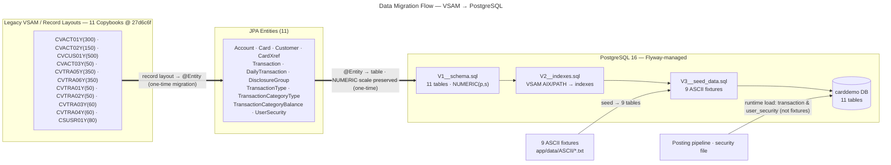
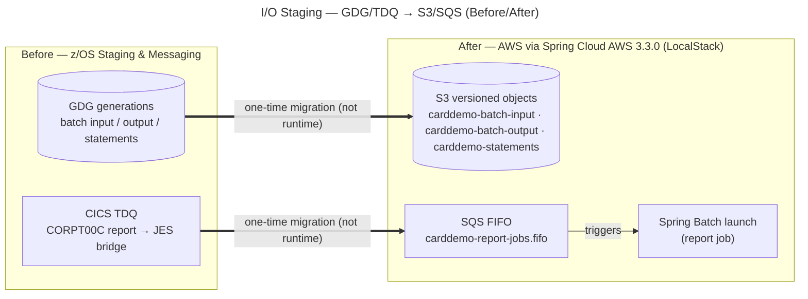

# Data Flow

This page is the **data-flow** view of the CardDemo [Visual Architecture Documentation](./overview.md).
It shows two things: first, how the legacy **VSAM / sequential record layouts** map to **PostgreSQL 16**
tables through **Flyway** migrations and JPA entities; and second, how the batch **I/O staging** (GDG
generation datasets) and the CICS **report-messaging** bridge (a Transient Data Queue) map to **Amazon S3**
and an **Amazon SQS FIFO** queue. As on every page here, the legacy COBOL copybooks and programs are the
authoritative behavioral baseline but are **not copied into this repository**; they are referenced only by
their original commit SHA **`27d6c6f`** (full `7756d895ffeb65f7ea72aaa609e356d9899afcec`). Short copybook and
field names (for example `CVACT01Y`, `TRAN-AMT`) are used purely as anchors — design rationale lives in the
[Decision Log](../decision-log.md), never in code comments.

This page follows the **shared visual vocabulary** defined under *How to read these diagrams* in the
[Architecture Overview](./overview.md): **solid** arrows (`-->`) are runtime data or control flow inside the
system being shown; **thick double** arrows (`==>`) are the **one-time migration transformation** — a
derivation performed during this project, **not** a runtime dependency (the target never calls back into the
mainframe); and **cylinder** nodes are persistent datastores. The companion pages are the
[Architecture Overview](./overview.md) (whole-system before/after and the batch pipeline) and
[Component Interactions](./component-interactions.md) (the layered Controller → Service → Repository request
flow and the authentication before/after). Every copybook→entity and paragraph→method pairing is enumerated
in the [Traceability Matrix](../traceability-matrix.md).

## Data Migration Flow — VSAM → PostgreSQL

The ***Data Migration Flow — VSAM → PostgreSQL*** diagram (Diagram 1) traces the three-stage derivation that
carries legacy data into the target database. Each of the **11 record-layout copybooks** (frozen at SHA
`27d6c6f`) becomes a **JPA `@Entity`**, and each entity is realized as a **PostgreSQL table** created by the
**Flyway** migration set. The Flyway stages execute in a fixed order that the target must honor:
**`V1__schema.sql`** creates the 11 tables with `NUMERIC(p,s)` columns, **`V2__indexes.sql`** adds the
secondary indexes that replace the VSAM alternate indexes (AIX/PATH — evidenced in `app/catlg/LISTCAT.txt`,
e.g. `CARDDATA.VSAM.AIX.PATH`), and **`V3__seed_data.sql`** loads the **9 ASCII fixtures** under
`app/data/ASCII/`.

The single most important data-migration invariant is **decimal fidelity**: every COBOL `PIC S9(n)V99` /
`COMP-3` monetary field becomes a `java.math.BigDecimal` with a **matching scale** and is persisted in a
`NUMERIC(p,s)` column — **never** `float`/`double` (Decision [D-001](../decision-log.md)). Concretely, the
`CVACT01Y` account balance and limit fields (`ACCT-CURR-BAL`, `ACCT-CREDIT-LIMIT`, `ACCT-CASH-CREDIT-LIMIT`,
`ACCT-CURR-CYC-CREDIT`, `ACCT-CURR-CYC-DEBIT`) are `PIC S9(10)V99` → `BigDecimal` scale 2 → `NUMERIC(12,2)`,
and `CVTRA05Y`'s `TRAN-AMT` is `PIC S9(09)V99` → `BigDecimal` scale 2 → `NUMERIC(11,2)`.

**Diagram 1 — Data Migration Flow — VSAM → PostgreSQL**

The copybook → entity → table correspondence, with the fixed record lengths that must be preserved for
byte-equivalent I/O (Gates 1 and 4), is:

| Copybook (@ `27d6c6f`) | JPA Entity | PostgreSQL Table | Record length (bytes) |
|---|---|---|---|
| `CSUSR01Y` | `UserSecurity` | `user_security` | 80 |
| `CVACT01Y` | `Account` | `account` | 300 |
| `CVACT02Y` | `Card` | `card` | 150 |
| `CVCUS01Y` | `Customer` | `customer` | 500 |
| `CVACT03Y` | `CardXref` | `card_xref` | 50 |
| `CVTRA06Y` | `DailyTransaction` | `daily_transaction` | 350 |
| `CVTRA05Y` | `Transaction` | `transaction` | 350 |
| `CVTRA02Y` | `DisclosureGroup` | `disclosure_group` | 50 |
| `CVTRA04Y` | `TransactionCategoryType` | `transaction_category_type` | 60 |
| `CVTRA03Y` | `TransactionType` | `transaction_type` | 60 |
| `CVTRA01Y` | `TransactionCategoryBalance` | `transaction_category_balance` | 50 |

**Legend — Diagram 1:**

- **Three stages, left to right** — a legacy **record layout** (copybook) becomes a **JPA `@Entity`**, which
  becomes a **PostgreSQL table**. The `SRC`, `ENT`, and `PG` subgraphs are those three stages.
- **Thick `==>` edges are the one-time migration derivation**, *not* runtime calls: `copybook ==> @Entity`
  and `@Entity ==> schema`. They record that the entity was derived from the copybook, and the table from the
  entity, during this project. This matches the `==>` semantics used throughout the
  [Architecture Overview](./overview.md).
- **Decimal fidelity is the headline pitfall** — `PIC S9(n)V99` / `COMP-3` → `BigDecimal` with matching scale
  → `NUMERIC(p,s)`; **no `float`/`double` for money** ([D-001](../decision-log.md)). The `V1__schema.sql`
  columns encode this: e.g. `NUMERIC(12,2)` for the `CVACT01Y` balances/limits and `NUMERIC(11,2)` for
  `CVTRA05Y`'s `TRAN-AMT`.
- **Flyway ordering (solid `-->`)** — `V1__schema.sql` → `V2__indexes.sql` → `V3__seed_data.sql` is a strict
  deploy-time sequence ([D-011](../decision-log.md)). VSAM KSDS keyed access maps to `@Entity` +
  `JpaRepository`, and VSAM **AIX/PATH** alternate indexes become **secondary indexes** in `V2` and/or
  **derived queries**/`@Query` methods ([D-006](../decision-log.md)); `app/catlg/LISTCAT.txt` is the catalog
  evidence for index design.
- **Seeding (solid `-->`)** — the **9 ASCII fixtures** feed `V3__seed_data.sql` (`acctdata → account`,
  `carddata → card`, `cardxref → card_xref`, `custdata → customer`, `dailytran → daily_transaction`,
  `discgrp → disclosure_group`, `tcatbal → transaction_category_balance`, `trancatg → transaction_category_type`,
  `trantype → transaction_type`) ([D-019](../decision-log.md)). The **cylinder** node is the datastore.

!!! note "Seeding accuracy"
    Only the **9 named ASCII fixtures** seed `V3`. The **`transaction`** table is populated at runtime by the
    posting pipeline (`CBTRN02C` → `PostTransactionJob`), and **`user_security`** is loaded from the security
    file — neither is among the nine fixtures, so no fixture arrow is drawn for them (shown instead by the
    `Posting pipeline · security file → carddemo DB` runtime-load edge).

## I/O Staging — GDG/TDQ → S3/SQS (Before/After)

The ***I/O Staging — GDG/TDQ → S3/SQS (Before/After)*** diagram (Diagram 2) is a **before/after pair**. On the
**before** side, the mainframe stages batch files in **GDG generation datasets** and bridges reports from CICS
to JES through a **Transient Data Queue (TDQ)**. On the **after** side, GDG generations become **versioned
Amazon S3 objects** and the TDQ report bridge becomes an **Amazon SQS FIFO** queue that triggers a Spring
Batch launch. All AWS access goes through **Spring Cloud AWS 3.3.0** and is **verified against LocalStack with
zero live AWS dependencies**.

**Diagram 2 — I/O Staging — GDG/TDQ → S3/SQS (Before/After)**

**Legend — Diagram 2:**

- **Before/after pair** — the `BEFORE` subgraph is the frozen z/OS staging and messaging model; the `AFTER`
  subgraph is the target AWS model. The two **thick `==>` edges** are the **one-time migration
  transformation** and are explicitly **not runtime dependencies** — the Spring service never calls back into
  GDG or the CICS TDQ.
- **File staging: GDG ↔ S3** — GDG generation datasets map to **versioned S3 objects** in the buckets
  `carddemo-batch-input`, `carddemo-batch-output`, and `carddemo-statements`; S3 object versioning reproduces
  GDG generation numbering ([D-003](../decision-log.md)). The **cylinder** nodes are the datastores.
- **Report messaging: TDQ ↔ SQS FIFO** — the `CORPT00C` TDQ→JES report bridge becomes the FIFO queue
  `carddemo-report-jobs.fifo`, whose strictly ordered, point-to-point delivery matches TDQ semantics; a message
  **triggers a Spring Batch launch** (the solid `SQS --> Spring Batch launch` edge is that runtime trigger)
  ([D-004](../decision-log.md)).
- **LocalStack-verified, zero live AWS** — all S3/SQS/SNS interaction runs through **Spring Cloud AWS 3.3.0**
  ([D-017](../decision-log.md)) against **LocalStack** on `:4566`; no test, local, or CI path uses real AWS
  credentials. Integration tests **self-provision** their S3 buckets and SQS queues in `@BeforeAll` and
  **delete** them in `@AfterAll`, never depending on pre-existing state ([D-018](../decision-log.md)).

## See also

- [Architecture Overview](./overview.md) — the whole-system *before/after* views and the batch-pipeline
  before/after; start here for the shared visual vocabulary.
- [Component Interactions](./component-interactions.md) — the layered Controller → Service → Repository →
  Database request flow and the COBOL sign-on vs. Spring Security JWT authentication before/after.
- [Decision Log](../decision-log.md) — rationale, alternatives, and risk for every choice cited here:
  [D-001](../decision-log.md) (decimal/`BigDecimal`), [D-003](../decision-log.md) (GDG → S3),
  [D-004](../decision-log.md) (TDQ → SQS FIFO), [D-006](../decision-log.md) (VSAM → PostgreSQL/JPA), and
  [D-011](../decision-log.md) (Flyway V1 → V2 → V3).
- [Traceability Matrix](../traceability-matrix.md) — the 100% bidirectional copybook→entity and
  paragraph→method mapping (source referenced by SHA `27d6c6f`).
