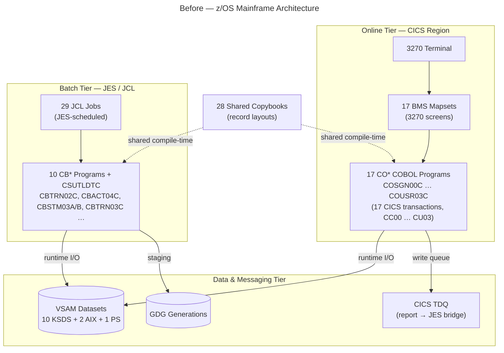
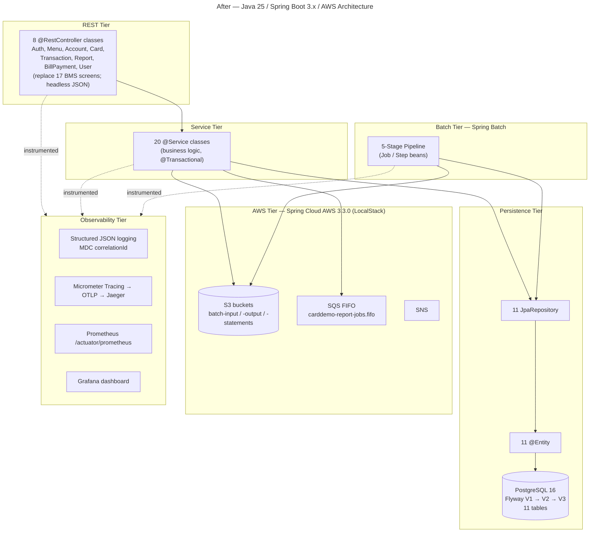
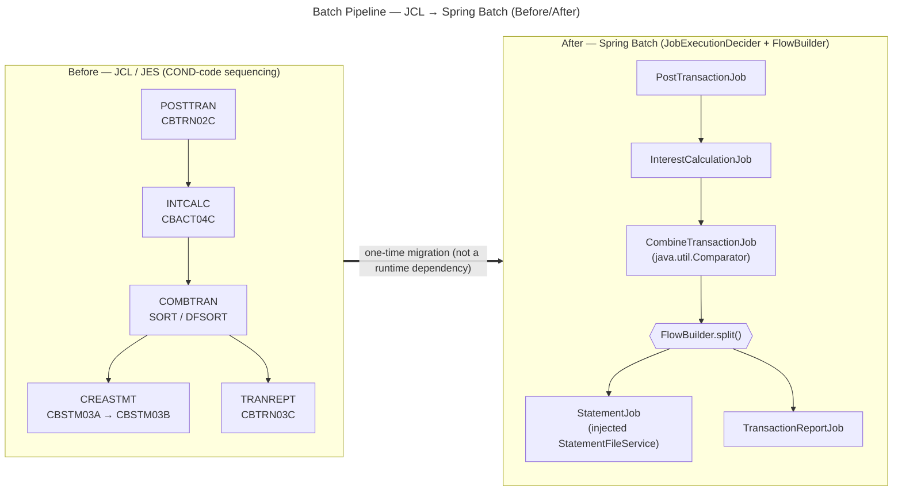

# Architecture Overview

This page is the top-level **Visual Architecture Documentation** for the AWS CardDemo
migration. Because this is a **migration**, every architectural aspect is presented as a
**before/after pair** — the legacy COBOL / CICS / VSAM / JCL system on z/OS alongside its
modern target: **Java 25 LTS**, **Spring Boot 3.5.11**, **PostgreSQL 16**, and **AWS
(S3 / SQS / SNS) verified against LocalStack**. The COBOL source is the authoritative
behavioral baseline but is **not copied into this repository**; it is referenced only by its
original commit SHA **`27d6c6f`** (full `7756d895ffeb65f7ea72aaa609e356d9899afcec`). This
page carries the three top-level views; the companion pages
[Component Interactions](./component-interactions.md) (layered request flow and the
authentication before/after) and [Data Flow](./data-flow.md) (VSAM → PostgreSQL and
GDG / TDQ → S3 / SQS) drill into the request, authentication, and data-migration details.

Design rationale is documented — never embedded in code comments. Every non-trivial choice
shown here is explained in the [Decision Log](../decision-log.md), and every COBOL
paragraph is mapped to its Java method in the [Traceability Matrix](../traceability-matrix.md).
New contributors should start with the [Onboarding Guide](../onboarding.md).

## How to read these diagrams

The three diagrams below share a common visual vocabulary:

- **Solid arrows** (`-->`) denote **runtime data or control flow** in the system being shown.
- **Dotted arrows** (`-.text.->`) denote **compile-time copybook sharing** in the legacy
  system (a `COPY` inclusion, resolved by the COBOL compiler, not a runtime call).
- **Thick double arrows** (`==>`) denote the **one-time migration transformation**. A
  migration edge is **not a runtime dependency** — the target system does not call back into
  the mainframe; the edge records that the "after" artifacts were derived from the "before"
  artifacts during this project.
- **Hexagon nodes** (`{{ }}`) denote a **decision or parallel-split** point (for example, a
  Spring Batch `FlowBuilder.split()` fan-out), as distinct from rectangular **step/component
  nodes**.

Each diagram has a descriptive title (rendered from Mermaid frontmatter and repeated as a bold
caption) and is followed by a **Legend** that names its tiers and edge types. The two
whole-system views (*Before — z/OS Mainframe Architecture* and *After — Java 25 / Spring
Boot 3.x / AWS Architecture*) form the paired before/after set for the platform as a whole,
and the *Batch Pipeline — JCL → Spring Batch (Before/After)* diagram shows the batch tier's
before and after side by side within a single figure.

## Before — z/OS Mainframe Architecture

The ***Before — z/OS Mainframe Architecture*** diagram shows the legacy three-tier system as
it exists in the frozen COBOL source at SHA `27d6c6f`: a **CICS online tier** driving 3270
terminals through BMS mapsets into the online COBOL programs, a **JES/JCL batch tier**
running the batch COBOL programs, and a shared **data & messaging tier** built on VSAM
datasets, GDG generation datasets, and a CICS Transient Data Queue (TDQ). Twenty-eight shared
copybooks supply the record layouts to both program tiers at compile time.

**Diagram 1 — Before — z/OS Mainframe Architecture**

**Legend — Diagram 1:**

- **Online tier (`CICS Region`)** — 3270 terminals → **17 BMS mapsets** → **17 `CO*`
  online COBOL programs**, mapped one-to-one to **17 CICS transactions** (`CC00` … `CU03`).
- **Batch tier (`JES / JCL`)** — **29 JCL jobs** invoke the **10 `CB*` batch programs plus
  the `CSUTLDTC` date utility** (28 COBOL programs in total, 19,254 lines of code).
- **Data & messaging tier** — **VSAM** datasets (10 KSDS + 2 alternate indexes + 1 physical-
  sequential), **GDG** generation datasets for batch staging, and a **CICS TDQ** that bridges
  reports to JES. Cylinder nodes denote persistent datastores.
- **Edges** — **solid** arrows are runtime I/O and messaging; **dotted** arrows are the
  compile-time `COPY` copybook sharing that supplies record layouts to both program tiers.

## After — Java 25 / Spring Boot 3.x / AWS Architecture

The ***After — Java 25 / Spring Boot 3.x / AWS Architecture*** diagram shows the target
modular service: a **REST tier** of 8 controllers replacing the 17 BMS screens with headless
JSON APIs, a **service tier** of 20 business-logic components, a **persistence tier** of 11
JPA repositories and 11 entities over Flyway-managed PostgreSQL 16, a **batch tier** running
the 5-stage Spring Batch pipeline, an **AWS tier** (S3 / SQS / SNS via Spring Cloud AWS 3.3.0,
LocalStack-verified), and a cross-cutting **observability tier**. The 17→8 controller
consolidation is recorded as decision [D-010](../decision-log.md), and the choice of
PostgreSQL 16 via Spring Data JPA as [D-006](../decision-log.md).

**Diagram 2 — After — Java 25 / Spring Boot 3.x / AWS Architecture**

**Legend — Diagram 2:**

- **REST tier** — **8 `@RestController` classes** (Auth, Menu, Account, Card, Transaction,
  Report, BillPayment, User) expose headless JSON APIs and replace the 17 BMS screens; there
  is no browser UI ([D-020](../decision-log.md)).
- **Service tier** — **20 `@Service` classes** hold the migrated business logic; declarative
  `@Transactional` boundaries reproduce the CICS `SYNCPOINT ROLLBACK` semantics
  ([D-008](../decision-log.md)).
- **Persistence tier** — **11 `JpaRepository` interfaces + 11 `@Entity` classes** over
  **PostgreSQL 16**, with schema managed by **Flyway** (V1 schema → V2 indexes → V3 seed,
  11 tables — [D-011](../decision-log.md)). The cylinder node denotes the database.
- **Batch tier** — the **5-stage Spring Batch pipeline** (detailed in Diagram 3).
- **AWS tier** — **S3** buckets replace GDG staging ([D-003](../decision-log.md)), an **SQS
  FIFO** queue replaces the CICS TDQ report bridge ([D-004](../decision-log.md)), and **SNS**
  provides notifications; all are **LocalStack-verified with zero live AWS dependencies**
  ([D-017](../decision-log.md), [D-018](../decision-log.md)).
- **Observability tier** — structured JSON logging with an MDC `correlationId`, Micrometer
  Tracing exported over OTLP to Jaeger, Prometheus metrics at `/actuator/prometheus`, and a
  Grafana dashboard, shipped from day one ([D-021](../decision-log.md)).
- **Edges** — **solid** arrows are runtime request/data flow (REST → service → repository →
  entity → database, and batch → repository/S3); **dotted** `instrumented` arrows indicate
  that the REST, service, and batch tiers emit logs, traces, and metrics into the
  observability tier rather than calling it as a business dependency.

## Batch Pipeline — JCL → Spring Batch (Before/After)

The ***Batch Pipeline — JCL → Spring Batch (Before/After)*** diagram places the legacy JCL/JES
job stream beside its Spring Batch replacement. **The five-stage order is preserved exactly**:
**POSTTRAN** (`CBTRN02C`) → **INTCALC** (`CBACT04C`) → **COMBTRAN** (a `SORT`/DFSORT utility
step, no COBOL program) → then a **parallel split** into **CREASTMT** (`CBSTM03A` calling
`CBSTM03B`) and **TRANREPT** (`CBTRN03C`). In the target, JCL `COND`-code sequencing becomes a
`JobExecutionDecider`, and the stage-4 fan-out becomes a `FlowBuilder.split()` that runs the
statement and report jobs concurrently after `COMBTRAN` completes.

**Diagram 3 — Batch Pipeline — JCL → Spring Batch (Before/After)**

**Legend — Diagram 3:**

- **Rectangular step nodes** are batch stages: on the left, JCL job steps; on the right, Spring
  Batch `Job` beans. The order **POSTTRAN → INTCALC → COMBTRAN → (CREASTMT ‖ TRANREPT)** is
  identical on both sides.
- **The hexagon node `{{ FlowBuilder.split() }}`** is the parallel-split decision point:
  **CREASTMT** (stage 4a) and **TRANREPT** (stage 4b) run **in parallel** after **COMBTRAN**
  completes — they are not linearized.
- **JCL `COND` codes → `JobExecutionDecider`**: legacy condition-code sequencing between steps
  is reproduced by a Spring Batch decider plus `FlowBuilder` flow, re-platforming the pipeline
  onto Spring Batch ([D-005](../decision-log.md)).
- **COMBTRAN's DFSORT keys → `java.util.Comparator`** chains preserve sort order, direction,
  and duplicate handling ([D-012](../decision-log.md)); **`CBSTM03A`'s `CALL 'CBSTM03B'`**
  becomes a constructor-injected `StatementFileService` bean ([D-015](../decision-log.md)).
- **The thick `==>` edge** is the **one-time migration transformation**, explicitly **not a
  runtime dependency**: the Spring Batch jobs never invoke the JCL/JES stream.

The full paragraph-to-method mapping for every batch program is in the
[Traceability Matrix](../traceability-matrix.md); the batch platform, sort, and injection
decisions are recorded as [D-005, D-012, and D-015](../decision-log.md).

## See also

- [Component Interactions](./component-interactions.md) — the layered Controller → Service →
  Repository → Database request flow, and the COBOL sign-on vs. Spring Security JWT
  authentication before/after.
- [Data Flow](./data-flow.md) — the VSAM → PostgreSQL data-migration mapping (Flyway) and the
  GDG / TDQ → S3 / SQS staging-and-messaging before/after.
- [Decision Log](../decision-log.md) — the rationale, alternatives, and risk for every decision
  cited on this page.
- [Traceability Matrix](../traceability-matrix.md) — the 100% bidirectional COBOL-paragraph →
  Java-method mapping (source referenced by SHA `27d6c6f`).

---

!!! note "Inventory note — 17 online programs"
    Diagram 1 shows **17** `CO*` online programs, matching the authoritative Application
    Inventory in the repository `README.md` (17 CICS transactions `CC00` … `CU03` mapped to 17
    BMS mapsets and 17 programs). Some summary documents — including the top-level before/after
    diagram in the technical specifications (§0.1.2) and the project guide's overview line —
    state "18" online programs; that is a known off-by-one in the prose summaries. The batch
    count (10 `CB*` programs + `CSUTLDTC`) and the overall total (**28** COBOL programs,
    **19,254** lines of code) are consistent across all sources and are used throughout this
    page.
