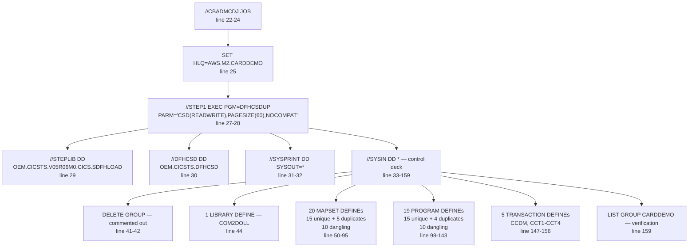

# Business Rules Extraction — CBADMCDJ.jcl

| Item | Value |
|---|---|
| **Source artifact** | `app/jcl/CBADMCDJ.jcl` (167 lines) |
| **Job type** | CICS Resource Definition (DFHCSDUP utility) |
| **Group registered** | `CARDDEMO` |
| **Program(s) traversed in source** | COSGN00C, COACTVWC, COACTUPC, COTRN00C, COBIL00C (5 of 15 referenced) |
| **Program(s) flagged as dangling** | COACT00C, COACTDEC, COTRNVWC, COTRNVDC, COTRNATC, COADM00C, COTSTP1C, COTSTP2C, COTSTP3C, COTSTP4C (10 of 15) |
| **Mapset(s) flagged as dangling** | COACT00S, COACTDES, COTRNVWS, COTRNVDS, COTRNATS, COADM00S, COTSTP1S, COTSTP2S, COTSTP3S, COTSTP4S (10 of 15) |
| **Total rule rows** | 241 |
| **Companion CSV** | [`CBADMCDJ_BRE.csv`](CBADMCDJ_BRE.csv) |
| **Companion functionality narrative** | [`CBADMCDJ_FUNCTIONALITY.md`](CBADMCDJ_FUNCTIONALITY.md) |
| **BRE methodology** | Six-step extraction protocol applied per AAP §0.7 |
| **Generation date** | 2026 |

## Job Structure Overview

## Executive Summary

CBADMCDJ.jcl is a CICS Resource Definition (RDO) batch job that invokes the IBM-supplied DFHCSDUP utility to register the CardDemo application's CICS resources under the resource group `CARDDEMO`. The job uses the `CSD(READWRITE),PAGESIZE(60),NOCOMPAT` PARM string and consumes an in-stream SYSIN control deck containing one `DEFINE LIBRARY`, twenty `DEFINE MAPSET` directives (with five duplicates), nineteen `DEFINE PROGRAM` directives (with four duplicates), and five `DEFINE TRANSACTION` directives, terminated by a `LIST GROUP(CARDDEMO)` audit directive. Unlike data-processing batch jobs, CBADMCDJ.jcl performs no data transformation — it manipulates a configuration registry (the CICS System Definition file, `OEM.CICSTS.DFHCSD`) by adding catalog entries that the CICS region reads at startup or via `CEDA INSTALL GROUP(CARDDEMO)`. The resource group is declared with `DELETE GROUP(CARDDEMO)` commented out as a one-shot re-run safeguard; un-commenting that line is the recommended idempotent re-run path.

The Business Rules Extraction (BRE) corpus below covers every discrete decision point in CBADMCDJ.jcl plus every paragraph and IF/EVALUATE branch in the five existing referenced COBOL programs (login: COSGN00C, account view: COACTVWC, account update: COACTUPC, transaction list: COTRN00C, bill payment: COBIL00C). Ten of the fifteen referenced programs and ten of the fifteen referenced mapsets are missing from the source tree and are therefore flagged as `Error-Handling` rules with HIGH severity — these dangling references will surface as `AEY9` ("Program not found") abends at runtime. Each rule row applies the user's nine-flag modernization-risk taxonomy (hardcoded DSNs, COMP-3 packed-decimal arithmetic, GO TO control flow, multi-program XCTL chains, plaintext passwords, etc.) and the Modernization Mapping appendix translates each construct into AWS Glue and Spring Batch equivalents to support the downstream Java 25 + Spring Boot 3.x migration roadmap. The deliverable is purely additive — no source artifact is modified.

## Rule-Table Summary Statistics

### 3a — Counts by Business_Rule_Category

| Business_Rule_Category | Count |
|---|---:|
| Initialization | 55 |
| File-IO | 41 |
| Data-Validation | 40 |
| Date-Time | 5 |
| Cycle-Determination | 10 |
| Calculation | 2 |
| Sorting | 0 |
| Reporting | 17 |
| Error-Handling | 53 |
| FTP-Distribution | 0 |
| Finalization | 13 |
| Cleanup | 5 |
| **Total** | **241** |

### 3b — Counts by Bounded_Context

| Bounded_Context | Count |
|---|---:|
| Account Management — Update | 58 |
| Account Management — View | 27 |
| Bill Payment | 39 |
| CICS Resource Registration | 37 |
| Dangling Reference | 29 |
| Transaction Management — List | 32 |
| User Authentication | 19 |
| **Total** | **241** |

### 3c — Counts by Program_Type

| Program_Type | Count |
|---|---:|
| JCL | 66 |
| COBOL | 175 |
| DB2-SQL | 0 |
| SORT | 0 |
| FTP | 0 |
| **Total** | **241** |

## Full 20-Column Rule Table

The table below contains all 241 rules extracted from CBADMCDJ.jcl and the five existing referenced COBOL programs. Each row corresponds to one discrete decision point. `\n` separators in the underlying CSV are rendered as ` ` for visual readability; `|` characters inside cell content are escaped as `\|`. The row count, ordering, and column values are identical to the companion CSV per Rule R17.

| Rule_Number | Job_Name | Rule_Execution | Program_Type | Module_Name | Sub_Module | Input_File | Input_File_Layout | Input_File_Length | Output_File | Output_File_Layout | Business_Rule_Category | Linkage_Columns | Detailed_Business_Rule | SQL_Decision_Control_Statements | SQL_Function | Code_Reference | Bounded_Context | DB2_Table_Name | Review_Comments |
|---|---|---|---|---|---|---|---|---|---|---|---|---|---|---|---|---|---|---|---|
| BR-CBADMCDJ-001 | CBADMCDJ | 1 | JCL | CBADMCDJ | JOBCARD | N/A | N/A | N/A | N/A | N/A | Initialization | N/A | The CBADMCDJ batch job is submitted under accounting code 'AWSCODR' with notify recipient set to the submitter's user identifier (&SYSUID). Job class A and message class H route output to the standard hold queue with full job log printing (MSGLEVEL=(1,1)). Maximum CPU time is set to 1440 minutes (24 hours) to accommodate first-time CSD population for very large resource groups. | //CBADMCDJ JOB (COBOL),'AWSCODR',CLASS=A,MSGCLASS=H,MSGLEVEL=(1,1), //         NOTIFY=&SYSUID,TIME=1440 | N/A | 1-2 | CICS Resource Registration | N/A | Hardcoded accounting string 'AWSCODR' — externalize via job parameter; hardcoded TIME=1440 — review under cloud SLA model |
| BR-CBADMCDJ-002 | CBADMCDJ | 2 | JCL | CBADMCDJ | LICENSE-HEADER | N/A | N/A | N/A | N/A | N/A | Initialization | N/A | The 16-line comment block declares the file's copyright holder (Amazon.com, Inc. or its affiliates), the license terms (Apache License 2.0), the URL of the license text, and the standard "AS IS" warranty disclaimer. This block has no functional effect on execution but is a legal prerequisite for any redistribution of the file. | //* Copyright Amazon.com, Inc. or its affiliates. //* Licensed under the Apache License, Version 2.0 | N/A | 3-18 | CICS Resource Registration | N/A | None |
| BR-CBADMCDJ-003 | CBADMCDJ | 3 | JCL | CBADMCDJ | BANNER | N/A | N/A | N/A | N/A | N/A | Initialization | N/A | Banner comment introduces the job's purpose: "Create Resources for Card Demo application". The framing asterisks are visual separators only and have no functional effect. | //****  Create Resources for Card Demo application               ****** | N/A | 19-21 | CICS Resource Registration | N/A | None |
| BR-CBADMCDJ-004 | CBADMCDJ | 4 | JCL | CBADMCDJ | SET-PARMS-HEADER | N/A | N/A | N/A | N/A | N/A | Initialization | N/A | Comment block introducing the parameterization section that follows on line 25. The header consists of three comment lines forming a labeled box around the SET HLQ statement. | //*  --------------------------- //*  SET PARMS FOR THIS JOB: //*  --------------------------- | N/A | 22-24 | CICS Resource Registration | N/A | None |
| BR-CBADMCDJ-005 | CBADMCDJ | 5 | JCL | CBADMCDJ | SET-HLQ | N/A | N/A | N/A | N/A | N/A | Initialization | N/A | The JCL symbolic HLQ is set to AWS.M2.CARDDEMO. This is referenced once via &HLQ..LOADLIB in the LIBRARY DSNAME01 clause and is the only parameterization in the entire job. The high-level qualifier is a strong indicator that the job was authored within the AWS Mainframe Modernization (M2) service environment. | //   SET HLQ=AWS.M2.CARDDEMO | N/A | 25 | CICS Resource Registration | N/A | Hardcoded HLQ AWS.M2.CARDDEMO — externalize via JCL JOB symbolic or AWS Systems Manager Parameter Store for cross-environment reuse |
| BR-CBADMCDJ-006 | CBADMCDJ | 6 | JCL | DFHCSDUP | STEP1 | DFHCSD | N/A (binary CSD VSAM RRDS) | N/A | DFHCSD,SYSPRINT,OUTDD | N/A | Initialization | N/A | The single job step invokes the IBM CICS-supplied utility program DFHCSDUP with REGION=0M (request maximum available virtual storage) and PARM string 'CSD(READWRITE),PAGESIZE(60),NOCOMPAT'. CSD(READWRITE) opens the CSD for both read and write; PAGESIZE(60) formats the SYSPRINT listing at 60 lines per page; NOCOMPAT operates in modern CSD format. This is the only EXEC step in the job; everything that follows is in-stream control input to DFHCSDUP. | //STEP1   EXEC PGM=DFHCSDUP,REGION=0M, //          PARM='CSD(READWRITE),PAGESIZE(60),NOCOMPAT' | N/A | 27-28 | CICS Resource Registration | N/A | DFHCSDUP utility has no AWS Glue / ECS equivalent — in cloud target, CICS resource definitions become Spring Boot @Component bean registrations or service-mesh routing rules; this entire step is replaced, not migrated |
| BR-CBADMCDJ-007 | CBADMCDJ | 7 | JCL | DFHCSDUP | STEP1.STEPLIB | STEPLIB | N/A (load library) | N/A | N/A | N/A | Initialization | N/A | Allocates the load library containing the DFHCSDUP module: DSN=OEM.CICSTS.V05R06M0.CICS.SDFHLOAD with DISP=SHR. The version-encoded DSN binds this job to CICS Transaction Server 5.6 (V05R06M0). If the target CICS region runs a different version, the STEPLIB DSN must be updated. | //STEPLIB  DD  DSN=OEM.CICSTS.V05R06M0.CICS.SDFHLOAD,DISP=SHR | N/A | 29 | CICS Resource Registration | N/A | Hardcoded DSN subsystem name OEM.CICSTS.V05R06M0.CICS.SDFHLOAD — AWS Glue needs a connection param; parameterize via JCL JOB symbolic for cross-version reuse |
| BR-CBADMCDJ-008 | CBADMCDJ | 8 | JCL | DFHCSDUP | STEP1.DFHCSD | DFHCSD | N/A (binary CSD VSAM RRDS) | N/A | DFHCSD | N/A (binary CSD VSAM RRDS) | Initialization | N/A | Allocates the target CSD VSAM file: UNIT=SYSDA,DISP=SHR,DSN=OEM.CICSTS.DFHCSD. This is the data set into which all DEFINE/DELETE/LIST operations write or read. SHR disposition allows concurrent reads from running CICS regions but DFHCSDUP itself acquires an exclusive write lock for the duration of each DEFINE/DELETE. | //DFHCSD   DD  UNIT=SYSDA,DISP=SHR,DSN=OEM.CICSTS.DFHCSD | N/A | 30 | CICS Resource Registration | N/A | Hardcoded DSN subsystem name OEM.CICSTS.DFHCSD — AWS Glue needs a connection param; in cloud target the CSD has no equivalent (resources become Spring beans) |
| BR-CBADMCDJ-009 | CBADMCDJ | 9 | JCL | DFHCSDUP | STEP1.OUTDD | N/A | N/A | N/A | OUTDD | N/A | Reporting | N/A | Allocates the operator output stream as SYSOUT=*. Receives DFHCSDUP operator messages such as duplicate-name warnings and DSN-resolution informational messages. | //OUTDD    DD  SYSOUT=* | N/A | 31 | CICS Resource Registration | N/A | None |
| BR-CBADMCDJ-010 | CBADMCDJ | 10 | JCL | DFHCSDUP | STEP1.SYSPRINT | N/A | N/A | N/A | SYSPRINT | N/A | Reporting | N/A | Allocates the standard listing output as SYSOUT=*. Receives the formatted DFHCSDUP listing of every DEFINE accepted, every error, and the verification output of LIST GROUP(CARDDEMO). On a successful first-time run, SYSPRINT contains approximately 200-300 lines. | //SYSPRINT DD  SYSOUT=* | N/A | 32 | CICS Resource Registration | N/A | None |
| BR-CBADMCDJ-011 | CBADMCDJ | 11 | JCL | DFHCSDUP | STEP1.SYSIN | SYSIN | N/A (free-format control card stream) | N/A | DFHCSD | N/A (binary CSD VSAM RRDS) | Initialization | N/A | The in-stream SYSIN deck begins. SYMBOLS=JCLONLY enables JCL symbolic substitution (e.g., &HLQ.) within the in-stream deck — DFHCSDUP receives the deck after JCL has resolved all symbolics. This is a relatively recent z/OS feature; older systems would require an explicit JCLLIB reference. | //SYSIN    DD  *,SYMBOLS=JCLONLY | N/A | 33 | CICS Resource Registration | N/A | None |
| BR-CBADMCDJ-012 | CBADMCDJ | 12 | JCL | DFHCSDUP | STEP1.SYSIN | SYSIN | N/A (control card) | N/A | DFHCSD | N/A | Initialization | N/A | Banner comment lines (using DFHCSDUP's */* ... */ comment syntax) introduce the resource-definition deck with the label 'CARDDEMO CICS DEFINITIONS'. These comments echo to SYSPRINT for audit traceability but have no functional effect on the CSD. | */********************************************************************/ */*  CARDDEMO CICS DEFINITIONS                                       */ */********************************************************************/ | N/A | 34-36 | CICS Resource Registration | N/A | None |
| BR-CBADMCDJ-013 | CBADMCDJ | 13 | JCL | DFHCSDUP | STEP1.SYSIN | SYSIN | N/A (control card) | N/A | DFHCSD | N/A | Initialization | N/A | Operator instruction comment indicates that after this batch job completes successfully, the operator must follow up with a CICS CEDA INSTALL GROUP(CARDDEMO) command in the live region to load the new resources into memory. This is a manual operational step that DFHCSDUP cannot perform itself. | * NOTE: INSTALL GROUP(CARDDEMO) - CEDA IN G(CARDDEMO)                * | N/A | 37 | CICS Resource Registration | N/A | Manual post-job step required (CEDA INSTALL) — in cloud target, Spring Boot performs equivalent registration automatically at container startup |
| BR-CBADMCDJ-014 | CBADMCDJ | 14 | JCL | DFHCSDUP | STEP1.SYSIN | SYSIN | N/A (control card) | N/A | DFHCSD | N/A | Initialization | N/A | Operator instruction comment advises that on re-runs the operator must manually un-comment the DELETE GROUP statement at line 42 to ensure idempotency. This documents (but does not enforce) a manual idempotency safeguard. | *     IF YOU ARE RERUNNING THIS, UNCOMMENT THE DELETE COMMAND. * | N/A | 38 | CICS Resource Registration | N/A | Manual edit required for idempotent re-runs — replace with JCL conditional logic or eliminate via cloud-target idempotent registration model |
| BR-CBADMCDJ-015 | CBADMCDJ | 15 | JCL | DFHCSDUP | STEP1.SYSIN | SYSIN | N/A (control card) | N/A | DFHCSD | N/A | Initialization | N/A | Comment-only marker line indicating the start of the resource-definition block. Provides a visual landmark in SYSPRINT and source listings; no functional effect. | * START CARDDEMO RESOURCES: | N/A | 39-41 | CICS Resource Registration | N/A | None |
| BR-CBADMCDJ-016 | CBADMCDJ | 16 | JCL | DFHCSDUP | STEP1.SYSIN | SYSIN | N/A (control card) | N/A | DFHCSD | N/A (binary CSD VSAM RRDS) | Cleanup | N/A | Commented-out DELETE GROUP(CARDDEMO) directive intended to remove all existing resources in group CARDDEMO before re-defining them. As shipped, the job is non-idempotent because this line is disabled with a leading asterisk. The line-38 instructional comment advises operators to un-comment this line on re-runs to ensure idempotency. This is a hidden manual procedure that creates risk on production re-runs. | * DELETE GROUP(CARDDEMO) | N/A | 42 | CICS Resource Registration | N/A | Non-idempotent re-run behavior — replace comment-toggle with JCL conditional execution or migrate to Spring Boot bean registration which is idempotent by design |
| BR-CBADMCDJ-017 | CBADMCDJ | 17 | JCL | DFHCSDUP | STEP1.SYSIN | SYSIN | N/A (control card) | N/A | DFHCSD | N/A (binary CSD VSAM RRDS) | Initialization | N/A | Defines a CICS LIBRARY resource named COM2DOLL under group CARDDEMO with DSNAME01 resolving at JCL time to AWS.M2.CARDDEMO.LOADLIB. This is the load library where the COBOL .cbl files (after compilation) and BMS mapsets (after assembly) are stored as load modules. The DSNAME01 clause indicates this is the first (and only) volume in the LIBRARY's concatenation. | DEFINE LIBRARY(COM2DOLL) GROUP(CARDDEMO)               DSNAME01(&HLQ..LOADLIB) | N/A | 44-45 | CICS Resource Registration | N/A | DFHCSDUP does NOT verify DSN existence at DEFINE time — failure deferred to INSTALL/runtime; in cloud target, classpath resolution is via Maven/Gradle dependency closure |
| BR-CBADMCDJ-018 | CBADMCDJ | 18 | JCL | DFHCSDUP | STEP1.SYSIN | SYSIN | N/A (control card) | N/A | DFHCSD | N/A | Initialization | N/A | Two intra-partition Transient Data Queue (TDQ) definitions for queue names CSSD and IRDC are commented out by the original developer. Per CICS conventions, intra-partition TDQs are local to the CICS region and used for inter-task data passing within the same region. Their intended functional purpose is not documented and these definitions have no runtime effect while commented out. | * DEFINE TDQUEUE(CSSD) GROUP(CARDDEMO) TYPE(INTRA) * DEFINE TDQUEUE(IRDC) GROUP(CARDDEMO) TYPE(INTRA) | N/A | 47-48 | CICS Resource Registration | N/A | None |
| BR-CBADMCDJ-019 | CBADMCDJ | 19 | JCL | DFHCSDUP | STEP1.SYSIN | SYSIN | N/A (control card) | N/A | DFHCSD | N/A (binary CSD VSAM RRDS) | Initialization | N/A | Registers the BMS mapset COSGN00M under group CARDDEMO with description 'LOGIN SCREEN'. This mapset is consumed by the corresponding COBOL program. Source: app/bms/COSGN00.bms. The mapset becomes available for SEND MAP / RECEIVE MAP operations after CEDA INSTALL. | DEFINE MAPSET(COSGN00M)   GROUP(CARDDEMO)        DESCRIPTION(LOGIN SCREEN) | N/A | 50-51 | CICS Resource Registration | N/A | None |
| BR-CBADMCDJ-020 | CBADMCDJ | 20 | JCL | DFHCSDUP | STEP1.SYSIN | SYSIN | N/A (control card) | N/A | DFHCSD | N/A (binary CSD VSAM RRDS) | Initialization | N/A | Duplicate registration of mapset COSGN00M under group CARDDEMO with description 'LOGIN SCREEN'. DFHCSDUP rejects this DEFINE with a 'DEFINE NOT EXECUTED — DUPLICATE NAME' warning because the same mapset was already registered earlier (line 50-51). Because the attributes are identical, runtime behavior is unchanged. | DEFINE MAPSET(COSGN00M)   GROUP(CARDDEMO)        DESCRIPTION(LOGIN SCREEN) | N/A | 53-54 | CICS Resource Registration | N/A | Duplicate DEFINE — consolidate before deployment; in cloud target, idempotent registration is the norm |
| BR-CBADMCDJ-021 | CBADMCDJ | 21 | JCL | DFHCSDUP | STEP1.SYSIN | SYSIN | N/A (control card) | N/A | DFHCSD | N/A (binary CSD VSAM RRDS) | Error-Handling | N/A | Registers BMS mapset COACT00S with description 'ACCOUNT MENU' under group CARDDEMO. However, the source file app/bms/COACT00.bms is not present in the application source tree. The DEFINE succeeds at the CSD-write level (DFHCSDUP does not verify load-library presence), but any RECEIVE MAP/SEND MAP operation referencing this mapset will fail at runtime. | DEFINE MAPSET(COACT00S)   GROUP(CARDDEMO)        DESCRIPTION(ACCOUNT MENU) | N/A | 56-57 | Dangling Reference | N/A | HIGH SEVERITY: Source mapset COACT00S missing from app/bms/ — registration cannot be honored at runtime; obtain source or remove DEFINE before deployment |
| BR-CBADMCDJ-022 | CBADMCDJ | 22 | JCL | DFHCSDUP | STEP1.SYSIN | SYSIN | N/A (control card) | N/A | DFHCSD | N/A (binary CSD VSAM RRDS) | Initialization | N/A | Registers the BMS mapset COACTVWS under group CARDDEMO with description 'VIEW ACCOUNT'. This mapset is consumed by the corresponding COBOL program. Source: app/bms/COACTVW.bms. The mapset becomes available for SEND MAP / RECEIVE MAP operations after CEDA INSTALL. | DEFINE MAPSET(COACTVWS)   GROUP(CARDDEMO)        DESCRIPTION(VIEW ACCOUNT) | N/A | 58-59 | CICS Resource Registration | N/A | None |
| BR-CBADMCDJ-023 | CBADMCDJ | 23 | JCL | DFHCSDUP | STEP1.SYSIN | SYSIN | N/A (control card) | N/A | DFHCSD | N/A (binary CSD VSAM RRDS) | Initialization | N/A | Registers the BMS mapset COACTUPS under group CARDDEMO with description 'UPDATE ACCOUNT'. This mapset is consumed by the corresponding COBOL program. Source: app/bms/COACTUP.bms. The mapset becomes available for SEND MAP / RECEIVE MAP operations after CEDA INSTALL. | DEFINE MAPSET(COACTUPS)   GROUP(CARDDEMO)        DESCRIPTION(UPDATE ACCOUNT) | N/A | 60-61 | CICS Resource Registration | N/A | None |
| BR-CBADMCDJ-024 | CBADMCDJ | 24 | JCL | DFHCSDUP | STEP1.SYSIN | SYSIN | N/A (control card) | N/A | DFHCSD | N/A (binary CSD VSAM RRDS) | Error-Handling | N/A | Registers BMS mapset COACTDES with description 'DEACTIVATE ACCOUNT' under group CARDDEMO. However, the source file app/bms/COACTDE.bms is not present in the application source tree. The DEFINE succeeds at the CSD-write level (DFHCSDUP does not verify load-library presence), but any RECEIVE MAP/SEND MAP operation referencing this mapset will fail at runtime. | DEFINE MAPSET(COACTDES)   GROUP(CARDDEMO)        DESCRIPTION(DEACTIVATE ACCOUNT) | N/A | 62-63 | Dangling Reference | N/A | HIGH SEVERITY: Source mapset COACTDES missing from app/bms/ — registration cannot be honored at runtime; obtain source or remove DEFINE before deployment |
| BR-CBADMCDJ-025 | CBADMCDJ | 25 | JCL | DFHCSDUP | STEP1.SYSIN | SYSIN | N/A (control card) | N/A | DFHCSD | N/A (binary CSD VSAM RRDS) | Error-Handling | N/A | Duplicate registration of dangling mapset COACT00S under group CARDDEMO with description 'CARD MENU'. Original DEFINE (line 56-57) is also dangling. DFHCSDUP rejects this DEFINE as duplicate; underlying mapset has no source file in app/bms/. | DEFINE MAPSET(COACT00S)   GROUP(CARDDEMO)        DESCRIPTION(CARD MENU) | N/A | 65-66 | Dangling Reference | N/A | HIGH SEVERITY: Mapset COACT00S is both DUPLICATE (rejected) and DANGLING (no source file); remove DEFINE entirely |
| BR-CBADMCDJ-026 | CBADMCDJ | 26 | JCL | DFHCSDUP | STEP1.SYSIN | SYSIN | N/A (control card) | N/A | DFHCSD | N/A (binary CSD VSAM RRDS) | Initialization | N/A | Duplicate registration of mapset COACTVWS under group CARDDEMO with description 'VIEW CARD'. DFHCSDUP rejects this DEFINE with a 'DEFINE NOT EXECUTED — DUPLICATE NAME' warning because the same mapset was already registered earlier (line 58-59). Because the attributes are identical, runtime behavior is unchanged. | DEFINE MAPSET(COACTVWS)   GROUP(CARDDEMO)        DESCRIPTION(VIEW CARD) | N/A | 67-68 | CICS Resource Registration | N/A | Duplicate DEFINE — consolidate before deployment; in cloud target, idempotent registration is the norm |
| BR-CBADMCDJ-027 | CBADMCDJ | 27 | JCL | DFHCSDUP | STEP1.SYSIN | SYSIN | N/A (control card) | N/A | DFHCSD | N/A (binary CSD VSAM RRDS) | Initialization | N/A | Duplicate registration of mapset COACTUPS under group CARDDEMO with description 'UPDATE CARD'. DFHCSDUP rejects this DEFINE with a 'DEFINE NOT EXECUTED — DUPLICATE NAME' warning because the same mapset was already registered earlier (line 60-61). Because the attributes are identical, runtime behavior is unchanged. | DEFINE MAPSET(COACTUPS)   GROUP(CARDDEMO)        DESCRIPTION(UPDATE CARD) | N/A | 69-70 | CICS Resource Registration | N/A | Duplicate DEFINE — consolidate before deployment; in cloud target, idempotent registration is the norm |
| BR-CBADMCDJ-028 | CBADMCDJ | 28 | JCL | DFHCSDUP | STEP1.SYSIN | SYSIN | N/A (control card) | N/A | DFHCSD | N/A (binary CSD VSAM RRDS) | Error-Handling | N/A | Duplicate registration of dangling mapset COACTDES under group CARDDEMO with description 'DEACTIVATE CARD'. Original DEFINE (line 62-63) is also dangling. DFHCSDUP rejects this DEFINE as duplicate; underlying mapset has no source file in app/bms/. | DEFINE MAPSET(COACTDES)   GROUP(CARDDEMO)        DESCRIPTION(DEACTIVATE CARD) | N/A | 71-72 | Dangling Reference | N/A | HIGH SEVERITY: Mapset COACTDES is both DUPLICATE (rejected) and DANGLING (no source file); remove DEFINE entirely |
| BR-CBADMCDJ-029 | CBADMCDJ | 29 | JCL | DFHCSDUP | STEP1.SYSIN | SYSIN | N/A (control card) | N/A | DFHCSD | N/A (binary CSD VSAM RRDS) | Initialization | N/A | Registers the BMS mapset COTRN00S under group CARDDEMO with description 'TRANSACTION'. This mapset is consumed by the corresponding COBOL program. Source: app/bms/COTRN00.bms. The mapset becomes available for SEND MAP / RECEIVE MAP operations after CEDA INSTALL. | DEFINE MAPSET(COTRN00S)   GROUP(CARDDEMO)        DESCRIPTION(TRANSACTION) | N/A | 74-75 | CICS Resource Registration | N/A | None |
| BR-CBADMCDJ-030 | CBADMCDJ | 30 | JCL | DFHCSDUP | STEP1.SYSIN | SYSIN | N/A (control card) | N/A | DFHCSD | N/A (binary CSD VSAM RRDS) | Error-Handling | N/A | Registers BMS mapset COTRNVWS with description 'TRANSACTION REPORT' under group CARDDEMO. However, the source file app/bms/COTRNVW.bms is not present in the application source tree. The DEFINE succeeds at the CSD-write level (DFHCSDUP does not verify load-library presence), but any RECEIVE MAP/SEND MAP operation referencing this mapset will fail at runtime. | DEFINE MAPSET(COTRNVWS)   GROUP(CARDDEMO)        DESCRIPTION(TRANSACTION REPORT) | N/A | 76-77 | Dangling Reference | N/A | HIGH SEVERITY: Source mapset COTRNVWS missing from app/bms/ — registration cannot be honored at runtime; obtain source or remove DEFINE before deployment |
| BR-CBADMCDJ-031 | CBADMCDJ | 31 | JCL | DFHCSDUP | STEP1.SYSIN | SYSIN | N/A (control card) | N/A | DFHCSD | N/A (binary CSD VSAM RRDS) | Error-Handling | N/A | Registers BMS mapset COTRNVDS with description 'TRANSACTION DETAILS' under group CARDDEMO. However, the source file app/bms/COTRNVD.bms is not present in the application source tree. The DEFINE succeeds at the CSD-write level (DFHCSDUP does not verify load-library presence), but any RECEIVE MAP/SEND MAP operation referencing this mapset will fail at runtime. | DEFINE MAPSET(COTRNVDS)   GROUP(CARDDEMO)        DESCRIPTION(TRANSACTION DETAILS) | N/A | 78-79 | Dangling Reference | N/A | HIGH SEVERITY: Source mapset COTRNVDS missing from app/bms/ — registration cannot be honored at runtime; obtain source or remove DEFINE before deployment |
| BR-CBADMCDJ-032 | CBADMCDJ | 32 | JCL | DFHCSDUP | STEP1.SYSIN | SYSIN | N/A (control card) | N/A | DFHCSD | N/A (binary CSD VSAM RRDS) | Error-Handling | N/A | Registers BMS mapset COTRNATS with description 'ADD TRANSACTIONS' under group CARDDEMO. However, the source file app/bms/COTRNAT.bms is not present in the application source tree. The DEFINE succeeds at the CSD-write level (DFHCSDUP does not verify load-library presence), but any RECEIVE MAP/SEND MAP operation referencing this mapset will fail at runtime. | DEFINE MAPSET(COTRNATS)   GROUP(CARDDEMO)        DESCRIPTION(ADD TRANSACTIONS) | N/A | 80-81 | Dangling Reference | N/A | HIGH SEVERITY: Source mapset COTRNATS missing from app/bms/ — registration cannot be honored at runtime; obtain source or remove DEFINE before deployment |
| BR-CBADMCDJ-033 | CBADMCDJ | 33 | JCL | DFHCSDUP | STEP1.SYSIN | SYSIN | N/A (control card) | N/A | DFHCSD | N/A (binary CSD VSAM RRDS) | Initialization | N/A | Registers the BMS mapset COBIL00S under group CARDDEMO with description 'BILL PAY SETUP'. This mapset is consumed by the corresponding COBOL program. Source: app/bms/COBIL00.bms. The mapset becomes available for SEND MAP / RECEIVE MAP operations after CEDA INSTALL. | DEFINE MAPSET(COBIL00S)   GROUP(CARDDEMO)        DESCRIPTION(BILL PAY SETUP) | N/A | 83-84 | CICS Resource Registration | N/A | None |
| BR-CBADMCDJ-034 | CBADMCDJ | 34 | JCL | DFHCSDUP | STEP1.SYSIN | SYSIN | N/A (control card) | N/A | DFHCSD | N/A (binary CSD VSAM RRDS) | Error-Handling | N/A | Registers BMS mapset COADM00S with description 'ADMIN MENU' under group CARDDEMO. However, the source file app/bms/COADM00.bms is not present in the application source tree. The DEFINE succeeds at the CSD-write level (DFHCSDUP does not verify load-library presence), but any RECEIVE MAP/SEND MAP operation referencing this mapset will fail at runtime. | DEFINE MAPSET(COADM00S)   GROUP(CARDDEMO)        DESCRIPTION(ADMIN MENU) | N/A | 86-87 | Dangling Reference | N/A | HIGH SEVERITY: Source mapset COADM00S missing from app/bms/ — registration cannot be honored at runtime; obtain source or remove DEFINE before deployment |
| BR-CBADMCDJ-035 | CBADMCDJ | 35 | JCL | DFHCSDUP | STEP1.SYSIN | SYSIN | N/A (control card) | N/A | DFHCSD | N/A (binary CSD VSAM RRDS) | Error-Handling | N/A | Registers BMS mapset COTSTP1S with description 'PGM1 TEST' under group CARDDEMO. However, the source file app/bms/COTSTP1.bms is not present in the application source tree. The DEFINE succeeds at the CSD-write level (DFHCSDUP does not verify load-library presence), but any RECEIVE MAP/SEND MAP operation referencing this mapset will fail at runtime. | DEFINE MAPSET(COTSTP1S)   GROUP(CARDDEMO)        DESCRIPTION(PGM1 TEST) | N/A | 89-90 | Dangling Reference | N/A | HIGH SEVERITY: Source mapset COTSTP1S missing from app/bms/ — registration cannot be honored at runtime; obtain source or remove DEFINE before deployment |
| BR-CBADMCDJ-036 | CBADMCDJ | 36 | JCL | DFHCSDUP | STEP1.SYSIN | SYSIN | N/A (control card) | N/A | DFHCSD | N/A (binary CSD VSAM RRDS) | Error-Handling | N/A | Registers BMS mapset COTSTP2S with description 'PGM2 TEST' under group CARDDEMO. However, the source file app/bms/COTSTP2.bms is not present in the application source tree. The DEFINE succeeds at the CSD-write level (DFHCSDUP does not verify load-library presence), but any RECEIVE MAP/SEND MAP operation referencing this mapset will fail at runtime. | DEFINE MAPSET(COTSTP2S)   GROUP(CARDDEMO)        DESCRIPTION(PGM2 TEST) | N/A | 91-92 | Dangling Reference | N/A | HIGH SEVERITY: Source mapset COTSTP2S missing from app/bms/ — registration cannot be honored at runtime; obtain source or remove DEFINE before deployment |
| BR-CBADMCDJ-037 | CBADMCDJ | 37 | JCL | DFHCSDUP | STEP1.SYSIN | SYSIN | N/A (control card) | N/A | DFHCSD | N/A (binary CSD VSAM RRDS) | Error-Handling | N/A | Registers BMS mapset COTSTP3S with description 'PGM3 TEST' under group CARDDEMO. However, the source file app/bms/COTSTP3.bms is not present in the application source tree. The DEFINE succeeds at the CSD-write level (DFHCSDUP does not verify load-library presence), but any RECEIVE MAP/SEND MAP operation referencing this mapset will fail at runtime. | DEFINE MAPSET(COTSTP3S)   GROUP(CARDDEMO)        DESCRIPTION(PGM3 TEST) | N/A | 93-94 | Dangling Reference | N/A | HIGH SEVERITY: Source mapset COTSTP3S missing from app/bms/ — registration cannot be honored at runtime; obtain source or remove DEFINE before deployment |
| BR-CBADMCDJ-038 | CBADMCDJ | 38 | JCL | DFHCSDUP | STEP1.SYSIN | SYSIN | N/A (control card) | N/A | DFHCSD | N/A (binary CSD VSAM RRDS) | Error-Handling | N/A | Registers BMS mapset COTSTP4S with description 'PGM4 TEST' under group CARDDEMO. However, the source file app/bms/COTSTP4.bms is not present in the application source tree. The DEFINE succeeds at the CSD-write level (DFHCSDUP does not verify load-library presence), but any RECEIVE MAP/SEND MAP operation referencing this mapset will fail at runtime. | DEFINE MAPSET(COTSTP4S)   GROUP(CARDDEMO)        DESCRIPTION(PGM4 TEST) | N/A | 95-96 | Dangling Reference | N/A | HIGH SEVERITY: Source mapset COTSTP4S missing from app/bms/ — registration cannot be honored at runtime; obtain source or remove DEFINE before deployment |
| BR-CBADMCDJ-039 | CBADMCDJ | 39 | JCL | DFHCSDUP | STEP1.SYSIN | SYSIN | N/A (control card) | N/A | DFHCSD | N/A (binary CSD VSAM RRDS) | Initialization | N/A | Registers the COBOL program COSGN00C with the CICS region under group CARDDEMO with data location ANY (31-bit storage). The program is associated with transaction identifier CC00. Source: app/cbl/COSGN00C.cbl. After CEDA INSTALL, the program is loadable from the COM2DOLL LIBRARY. | DEFINE PROGRAM(COSGN00C) GROUP(CARDDEMO) DA(ANY) TRANSID(CC00)        DESCRIPTION(LOGIN) | N/A | 98-99 | CICS Resource Registration | N/A | None |
| BR-CBADMCDJ-040 | CBADMCDJ | 40 | JCL | DFHCSDUP | STEP1.SYSIN | SYSIN | N/A (control card) | N/A | DFHCSD | N/A (binary CSD VSAM RRDS) | Error-Handling | N/A | Registers a COBOL program named COACT00C as 'ACCOUNT MAIN MENU' under group CARDDEMO. However, the source program app/cbl/COACT00C.cbl is not present in the application source tree, meaning the registration creates a CICS catalog entry pointing to a load module that does not exist. Any transaction routed to this program will fail at execution time with an AEY9 abend (program not found in load library). | DEFINE PROGRAM(COACT00C) GROUP(CARDDEMO) DA(ANY)        DESCRIPTION(ACCOUNT MAIN MENU) | N/A | 101-102 | Dangling Reference | N/A | HIGH SEVERITY: Source program COACT00C.cbl missing from app/cbl/ — registration cannot be honored at runtime; obtain source or remove DEFINE before deployment |
| BR-CBADMCDJ-041 | CBADMCDJ | 41 | JCL | DFHCSDUP | STEP1.SYSIN | SYSIN | N/A (control card) | N/A | DFHCSD | N/A (binary CSD VSAM RRDS) | Initialization | N/A | Registers the COBOL program COACTVWC with the CICS region under group CARDDEMO with data location ANY (31-bit storage). Source: app/cbl/COACTVWC.cbl. After CEDA INSTALL, the program is loadable from the COM2DOLL LIBRARY. | DEFINE PROGRAM(COACTVWC) GROUP(CARDDEMO) DA(ANY)        DESCRIPTION(VIEW ACCOUNT) | N/A | 103-104 | CICS Resource Registration | N/A | None |
| BR-CBADMCDJ-042 | CBADMCDJ | 42 | JCL | DFHCSDUP | STEP1.SYSIN | SYSIN | N/A (control card) | N/A | DFHCSD | N/A (binary CSD VSAM RRDS) | Initialization | N/A | Registers the COBOL program COACTUPC with the CICS region under group CARDDEMO with data location ANY (31-bit storage). Source: app/cbl/COACTUPC.cbl. After CEDA INSTALL, the program is loadable from the COM2DOLL LIBRARY. | DEFINE PROGRAM(COACTUPC) GROUP(CARDDEMO) DA(ANY)        DESCRIPTION(UPDATE ACCOUNT) | N/A | 105-106 | CICS Resource Registration | N/A | None |
| BR-CBADMCDJ-043 | CBADMCDJ | 43 | JCL | DFHCSDUP | STEP1.SYSIN | SYSIN | N/A (control card) | N/A | DFHCSD | N/A (binary CSD VSAM RRDS) | Error-Handling | N/A | Registers a COBOL program named COACTDEC as 'DEACTIVATE ACCOUNT' under group CARDDEMO. However, the source program app/cbl/COACTDEC.cbl is not present in the application source tree, meaning the registration creates a CICS catalog entry pointing to a load module that does not exist. Any transaction routed to this program will fail at execution time with an AEY9 abend (program not found in load library). | DEFINE PROGRAM(COACTDEC) GROUP(CARDDEMO) DA(ANY)        DESCRIPTION(DEACTIVATE ACCOUNT) | N/A | 107-108 | Dangling Reference | N/A | HIGH SEVERITY: Source program COACTDEC.cbl missing from app/cbl/ — registration cannot be honored at runtime; obtain source or remove DEFINE before deployment |
| BR-CBADMCDJ-044 | CBADMCDJ | 44 | JCL | DFHCSDUP | STEP1.SYSIN | SYSIN | N/A (control card) | N/A | DFHCSD | N/A (binary CSD VSAM RRDS) | Error-Handling | N/A | Duplicate registration of dangling program COACT00C under group CARDDEMO with description 'CARD MENU'. The original DEFINE (line 101-102) is also dangling. DFHCSDUP rejects this as duplicate; the underlying program has no source file in app/cbl/. | DEFINE PROGRAM(COACT00C) GROUP(CARDDEMO) DA(ANY)        DESCRIPTION(CARD MENU) | N/A | 110-111 | Dangling Reference | N/A | HIGH SEVERITY: Program COACT00C is both DUPLICATE (rejected) and DANGLING (no source file); remove DEFINE entirely |
| BR-CBADMCDJ-045 | CBADMCDJ | 45 | JCL | DFHCSDUP | STEP1.SYSIN | SYSIN | N/A (control card) | N/A | DFHCSD | N/A (binary CSD VSAM RRDS) | Initialization | N/A | Duplicate registration of program COACTVWC under group CARDDEMO with description 'VIEW CARD'. DFHCSDUP rejects this second DEFINE with a duplicate-name warning. The first DEFINE (line 103-104) remains active; runtime behavior is unchanged because the attributes are identical. | DEFINE PROGRAM(COACTVWC) GROUP(CARDDEMO) DA(ANY)        DESCRIPTION(VIEW CARD) | N/A | 112-113 | CICS Resource Registration | N/A | Duplicate DEFINE — consolidate; the original developer's apparent intent was to register the same physical resource under semantic contexts (VIEW CARD vs. earlier instance) but CICS does not have semantic groupings at the DEFINE level |
| BR-CBADMCDJ-046 | CBADMCDJ | 46 | JCL | DFHCSDUP | STEP1.SYSIN | SYSIN | N/A (control card) | N/A | DFHCSD | N/A (binary CSD VSAM RRDS) | Initialization | N/A | Duplicate registration of program COACTUPC under group CARDDEMO with description 'UPDATE CARD'. DFHCSDUP rejects this second DEFINE with a duplicate-name warning. The first DEFINE (line 105-106) remains active; runtime behavior is unchanged because the attributes are identical. | DEFINE PROGRAM(COACTUPC) GROUP(CARDDEMO) DA(ANY)        DESCRIPTION(UPDATE CARD) | N/A | 114-115 | CICS Resource Registration | N/A | Duplicate DEFINE — consolidate; the original developer's apparent intent was to register the same physical resource under semantic contexts (UPDATE CARD vs. earlier instance) but CICS does not have semantic groupings at the DEFINE level |
| BR-CBADMCDJ-047 | CBADMCDJ | 47 | JCL | DFHCSDUP | STEP1.SYSIN | SYSIN | N/A (control card) | N/A | DFHCSD | N/A (binary CSD VSAM RRDS) | Error-Handling | N/A | Duplicate registration of dangling program COACTDEC under group CARDDEMO with description 'DEACTIVATE CARD'. The original DEFINE (line 107-108) is also dangling. DFHCSDUP rejects this as duplicate; the underlying program has no source file in app/cbl/. | DEFINE PROGRAM(COACTDEC) GROUP(CARDDEMO) DA(ANY)        DESCRIPTION(DEACTIVATE CARD) | N/A | 116-117 | Dangling Reference | N/A | HIGH SEVERITY: Program COACTDEC is both DUPLICATE (rejected) and DANGLING (no source file); remove DEFINE entirely |
| BR-CBADMCDJ-048 | CBADMCDJ | 48 | JCL | DFHCSDUP | STEP1.SYSIN | SYSIN | N/A (control card) | N/A | DFHCSD | N/A (binary CSD VSAM RRDS) | Initialization | N/A | Registers the COBOL program COTRN00C with the CICS region under group CARDDEMO with data location ANY (31-bit storage). Source: app/cbl/COTRN00C.cbl. After CEDA INSTALL, the program is loadable from the COM2DOLL LIBRARY. | DEFINE PROGRAM(COTRN00C) GROUP(CARDDEMO) DA(ANY)        DESCRIPTION(TRANSACTION) | N/A | 118-119 | CICS Resource Registration | N/A | None |
| BR-CBADMCDJ-049 | CBADMCDJ | 49 | JCL | DFHCSDUP | STEP1.SYSIN | SYSIN | N/A (control card) | N/A | DFHCSD | N/A (binary CSD VSAM RRDS) | Error-Handling | N/A | Registers a COBOL program named COTRNVWC as 'TRANSACTION REPORT' under group CARDDEMO. However, the source program app/cbl/COTRNVWC.cbl is not present in the application source tree, meaning the registration creates a CICS catalog entry pointing to a load module that does not exist. Any transaction routed to this program will fail at execution time with an AEY9 abend (program not found in load library). | DEFINE PROGRAM(COTRNVWC) GROUP(CARDDEMO) DA(ANY)        DESCRIPTION(TRANSACTION REPORT) | N/A | 120-121 | Dangling Reference | N/A | HIGH SEVERITY: Source program COTRNVWC.cbl missing from app/cbl/ — registration cannot be honored at runtime; obtain source or remove DEFINE before deployment |
| BR-CBADMCDJ-050 | CBADMCDJ | 50 | JCL | DFHCSDUP | STEP1.SYSIN | SYSIN | N/A (control card) | N/A | DFHCSD | N/A (binary CSD VSAM RRDS) | Error-Handling | N/A | Registers a COBOL program named COTRNVDC as 'TRANSACTION DETAILS' under group CARDDEMO. However, the source program app/cbl/COTRNVDC.cbl is not present in the application source tree, meaning the registration creates a CICS catalog entry pointing to a load module that does not exist. Any transaction routed to this program will fail at execution time with an AEY9 abend (program not found in load library). | DEFINE PROGRAM(COTRNVDC) GROUP(CARDDEMO) DA(ANY)        DESCRIPTION(TRANSACTION DETAILS) | N/A | 122-123 | Dangling Reference | N/A | HIGH SEVERITY: Source program COTRNVDC.cbl missing from app/cbl/ — registration cannot be honored at runtime; obtain source or remove DEFINE before deployment |
| BR-CBADMCDJ-051 | CBADMCDJ | 51 | JCL | DFHCSDUP | STEP1.SYSIN | SYSIN | N/A (control card) | N/A | DFHCSD | N/A (binary CSD VSAM RRDS) | Error-Handling | N/A | Registers a COBOL program named COTRNATC as 'ADD TRANSACTIONS' under group CARDDEMO. However, the source program app/cbl/COTRNATC.cbl is not present in the application source tree, meaning the registration creates a CICS catalog entry pointing to a load module that does not exist. Any transaction routed to this program will fail at execution time with an AEY9 abend (program not found in load library). | DEFINE PROGRAM(COTRNATC) GROUP(CARDDEMO) DA(ANY)        DESCRIPTION(ADD TRANSACTIONS) | N/A | 124-125 | Dangling Reference | N/A | HIGH SEVERITY: Source program COTRNATC.cbl missing from app/cbl/ — registration cannot be honored at runtime; obtain source or remove DEFINE before deployment |
| BR-CBADMCDJ-052 | CBADMCDJ | 52 | JCL | DFHCSDUP | STEP1.SYSIN | SYSIN | N/A (control card) | N/A | DFHCSD | N/A (binary CSD VSAM RRDS) | Initialization | N/A | Registers the COBOL program COBIL00C with the CICS region under group CARDDEMO with data location ANY (31-bit storage). Source: app/cbl/COBIL00C.cbl. After CEDA INSTALL, the program is loadable from the COM2DOLL LIBRARY. | DEFINE PROGRAM(COBIL00C) GROUP(CARDDEMO) DA(ANY)        DESCRIPTION(BILL PAY) | N/A | 127-128 | CICS Resource Registration | N/A | None |
| BR-CBADMCDJ-053 | CBADMCDJ | 53 | JCL | DFHCSDUP | STEP1.SYSIN | SYSIN | N/A (control card) | N/A | DFHCSD | N/A (binary CSD VSAM RRDS) | Error-Handling | N/A | Registers a COBOL program named COADM00C with TRANSID(CCAD) as 'ADMIN MENU' under group CARDDEMO. However, the source program app/cbl/COADM00C.cbl is not present in the application source tree, meaning the registration creates a CICS catalog entry pointing to a load module that does not exist. Any transaction routed to this program will fail at execution time with an AEY9 abend (program not found in load library). | DEFINE PROGRAM(COADM00C) GROUP(CARDDEMO) DA(ANY) TRANSID(CCAD)        DESCRIPTION(ADMIN MENU) | N/A | 130-132 | Dangling Reference | N/A | HIGH SEVERITY: Source program COADM00C.cbl missing from app/cbl/ — registration cannot be honored at runtime; obtain source or remove DEFINE before deployment |
| BR-CBADMCDJ-054 | CBADMCDJ | 54 | JCL | DFHCSDUP | STEP1.SYSIN | SYSIN | N/A (control card) | N/A | DFHCSD | N/A (binary CSD VSAM RRDS) | Error-Handling | N/A | Registers a COBOL program named COTSTP1C with TRANSID(CCT1) as 'PGM1 TEST' under group CARDDEMO. However, the source program app/cbl/COTSTP1C.cbl is not present in the application source tree, meaning the registration creates a CICS catalog entry pointing to a load module that does not exist. Any transaction routed to this program will fail at execution time with an AEY9 abend (program not found in load library). | DEFINE PROGRAM(COTSTP1C) GROUP(CARDDEMO) DA(ANY) TRANSID(CCT1)        DESCRIPTION(PGM1 TEST) | N/A | 134-136 | Dangling Reference | N/A | HIGH SEVERITY: Source program COTSTP1C.cbl missing from app/cbl/ — registration cannot be honored at runtime; obtain source or remove DEFINE before deployment |
| BR-CBADMCDJ-055 | CBADMCDJ | 55 | JCL | DFHCSDUP | STEP1.SYSIN | SYSIN | N/A (control card) | N/A | DFHCSD | N/A (binary CSD VSAM RRDS) | Error-Handling | N/A | Registers a COBOL program named COTSTP2C with TRANSID(CCT2) as 'PGM2 TEST' under group CARDDEMO. However, the source program app/cbl/COTSTP2C.cbl is not present in the application source tree, meaning the registration creates a CICS catalog entry pointing to a load module that does not exist. Any transaction routed to this program will fail at execution time with an AEY9 abend (program not found in load library). | DEFINE PROGRAM(COTSTP2C) GROUP(CARDDEMO) DA(ANY) TRANSID(CCT2)        DESCRIPTION(PGM2 TEST) | N/A | 137-139 | Dangling Reference | N/A | HIGH SEVERITY: Source program COTSTP2C.cbl missing from app/cbl/ — registration cannot be honored at runtime; obtain source or remove DEFINE before deployment |
| BR-CBADMCDJ-056 | CBADMCDJ | 56 | JCL | DFHCSDUP | STEP1.SYSIN | SYSIN | N/A (control card) | N/A | DFHCSD | N/A (binary CSD VSAM RRDS) | Error-Handling | N/A | Registers a COBOL program named COTSTP3C with TRANSID(CCT3) as 'PGM1 TEST' under group CARDDEMO. However, the source program app/cbl/COTSTP3C.cbl is not present in the application source tree, meaning the registration creates a CICS catalog entry pointing to a load module that does not exist. Any transaction routed to this program will fail at execution time with an AEY9 abend (program not found in load library). | DEFINE PROGRAM(COTSTP3C) GROUP(CARDDEMO) DA(ANY) TRANSID(CCT3)        DESCRIPTION(PGM1 TEST) | N/A | 140-142 | Dangling Reference | N/A | HIGH SEVERITY: Source program COTSTP3C.cbl missing from app/cbl/ — registration cannot be honored at runtime; obtain source or remove DEFINE before deployment; description typo — says 'PGM1 TEST' but program is COTSTP3C (should be 'PGM3 TEST') |
| BR-CBADMCDJ-057 | CBADMCDJ | 57 | JCL | DFHCSDUP | STEP1.SYSIN | SYSIN | N/A (control card) | N/A | DFHCSD | N/A (binary CSD VSAM RRDS) | Error-Handling | N/A | Registers a COBOL program named COTSTP4C with TRANSID(CCT4) as 'PGM4 TEST' under group CARDDEMO. However, the source program app/cbl/COTSTP4C.cbl is not present in the application source tree, meaning the registration creates a CICS catalog entry pointing to a load module that does not exist. Any transaction routed to this program will fail at execution time with an AEY9 abend (program not found in load library). | DEFINE PROGRAM(COTSTP4C) GROUP(CARDDEMO) DA(ANY) TRANSID(CCT4)        DESCRIPTION(PGM4 TEST) | N/A | 143-145 | Dangling Reference | N/A | HIGH SEVERITY: Source program COTSTP4C.cbl missing from app/cbl/ — registration cannot be honored at runtime; obtain source or remove DEFINE before deployment |
| BR-CBADMCDJ-058 | CBADMCDJ | 58 | JCL | DFHCSDUP | STEP1.SYSIN | SYSIN | N/A (control card) | N/A | DFHCSD | N/A (binary CSD VSAM RRDS) | Error-Handling | N/A | Registers transaction CCDM bound to program COADM00C with TASKDATAL(ANY) under group CARDDEMO. DFHCSDUP does NOT verify program-existence at DEFINE time; runtime invocation of CCDM will produce an AEY9 abend because the bound program COADM00C is dangling (no source file in app/cbl/). | DEFINE TRANSACTION(CCDM) GROUP(CARDDEMO)               PROGRAM(COADM00C) TASKDATAL(ANY) | N/A | 147-148 | Dangling Reference | N/A | HIGH SEVERITY: Transaction CCDM bound to dangling program COADM00C — runtime AEY9 abend on every invocation; either obtain COADM00C source or remove DEFINE TRANSACTION |
| BR-CBADMCDJ-059 | CBADMCDJ | 59 | JCL | DFHCSDUP | STEP1.SYSIN | SYSIN | N/A (control card) | N/A | DFHCSD | N/A (binary CSD VSAM RRDS) | Error-Handling | N/A | Registers transaction CCT1 bound to program COTSTP1C with TASKDATAL(ANY) under group CARDDEMO. DFHCSDUP does NOT verify program-existence at DEFINE time; runtime invocation of CCT1 will produce an AEY9 abend because the bound program COTSTP1C is dangling (no source file in app/cbl/). | DEFINE TRANSACTION(CCT1) GROUP(CARDDEMO)               PROGRAM(COTSTP1C) TASKDATAL(ANY) | N/A | 150-151 | Dangling Reference | N/A | HIGH SEVERITY: Transaction CCT1 bound to dangling program COTSTP1C — runtime AEY9 abend on every invocation; either obtain COTSTP1C source or remove DEFINE TRANSACTION |
| BR-CBADMCDJ-060 | CBADMCDJ | 60 | JCL | DFHCSDUP | STEP1.SYSIN | SYSIN | N/A (control card) | N/A | DFHCSD | N/A (binary CSD VSAM RRDS) | Error-Handling | N/A | Registers transaction CCT2 bound to program COTSTP2C with TASKDATAL(ANY) under group CARDDEMO. DFHCSDUP does NOT verify program-existence at DEFINE time; runtime invocation of CCT2 will produce an AEY9 abend because the bound program COTSTP2C is dangling (no source file in app/cbl/). | DEFINE TRANSACTION(CCT2) GROUP(CARDDEMO)               PROGRAM(COTSTP2C) TASKDATAL(ANY) | N/A | 152-153 | Dangling Reference | N/A | HIGH SEVERITY: Transaction CCT2 bound to dangling program COTSTP2C — runtime AEY9 abend on every invocation; either obtain COTSTP2C source or remove DEFINE TRANSACTION |
| BR-CBADMCDJ-061 | CBADMCDJ | 61 | JCL | DFHCSDUP | STEP1.SYSIN | SYSIN | N/A (control card) | N/A | DFHCSD | N/A (binary CSD VSAM RRDS) | Error-Handling | N/A | Registers transaction CCT3 bound to program COTSTP3C with TASKDATAL(ANY) under group CARDDEMO. DFHCSDUP does NOT verify program-existence at DEFINE time; runtime invocation of CCT3 will produce an AEY9 abend because the bound program COTSTP3C is dangling (no source file in app/cbl/). | DEFINE TRANSACTION(CCT3) GROUP(CARDDEMO)               PROGRAM(COTSTP3C) TASKDATAL(ANY) | N/A | 154-155 | Dangling Reference | N/A | HIGH SEVERITY: Transaction CCT3 bound to dangling program COTSTP3C — runtime AEY9 abend on every invocation; either obtain COTSTP3C source or remove DEFINE TRANSACTION |
| BR-CBADMCDJ-062 | CBADMCDJ | 62 | JCL | DFHCSDUP | STEP1.SYSIN | SYSIN | N/A (control card) | N/A | DFHCSD | N/A (binary CSD VSAM RRDS) | Error-Handling | N/A | Registers transaction CCT4 bound to program COTSTP4C with TASKDATAL(ANY) under group CARDDEMO. DFHCSDUP does NOT verify program-existence at DEFINE time; runtime invocation of CCT4 will produce an AEY9 abend because the bound program COTSTP4C is dangling (no source file in app/cbl/). | DEFINE TRANSACTION(CCT4) GROUP(CARDDEMO)               PROGRAM(COTSTP4C) TASKDATAL(ANY) | N/A | 156-157 | Dangling Reference | N/A | HIGH SEVERITY: Transaction CCT4 bound to dangling program COTSTP4C — runtime AEY9 abend on every invocation; either obtain COTSTP4C source or remove DEFINE TRANSACTION |
| BR-CBADMCDJ-063 | CBADMCDJ | 63 | JCL | DFHCSDUP | STEP1.SYSIN | SYSIN | N/A (control card) | N/A | DFHCSD,SYSPRINT | N/A (formatted resource listing) | Reporting | N/A | After all DEFINE/DELETE operations are processed, DFHCSDUP prints the complete content of group CARDDEMO to SYSPRINT. The operator inspects this listing to confirm that all expected resources are present. The LIST output reflects post-rejection state: duplicates that DFHCSDUP rejected do not appear, but dangling references DO appear because DFHCSDUP does not check load-library presence at DEFINE time. | LIST   GROUP(CARDDEMO) | N/A | 159 | CICS Resource Registration | N/A | In cloud target, replace with Spring Actuator GET /actuator/mappings and GET /actuator/beans for runtime endpoint enumeration |
| BR-CBADMCDJ-064 | CBADMCDJ | 64 | JCL | DFHCSDUP | STEP1.SYSIN | SYSIN | N/A (control card) | N/A | DFHCSD | N/A | Finalization | N/A | Comment-only marker line indicating the end of the resource-definition block. Provides a visual landmark in SYSPRINT and source listings; no functional effect. | * END CARDDEMO RESOURCES | N/A | 160-162 | CICS Resource Registration | N/A | None |
| BR-CBADMCDJ-065 | CBADMCDJ | 65 | JCL | CBADMCDJ | EOF | N/A | N/A | N/A | N/A | N/A | Finalization | N/A | End-of-data delimiter for the in-stream SYSIN deck. JES recognizes this as the terminator and stops reading SYSIN input. After this point control returns to JES which proceeds with the next JCL statement. | /* | N/A | 163 | CICS Resource Registration | N/A | None |
| BR-CBADMCDJ-066 | CBADMCDJ | 66 | JCL | CBADMCDJ | EOJ | N/A | N/A | N/A | N/A | N/A | Finalization | N/A | JCL end-of-job marker. JES2/JES3 recognizes this and terminates the job. The trailing comment lines (lines 165-167) form the version stamp embedded as JCL comments and have no functional effect. | // //* //* Ver: CardDemo_v1.0-70-g193b394-123 Date: 2022-08-22 17:02:44 CDT | N/A | 164-167 | CICS Resource Registration | N/A | None |
| BR-CBADMCDJ-067 | CBADMCDJ | 67 | COBOL | COSGN00C | PROGRAM-ID | N/A | N/A | N/A | N/A | N/A | Initialization | N/A | Identifies the program as COSGN00C, a CICS COBOL program implementing the CardDemo signon (login) screen for transaction CC00. The program author is recorded as 'AWS' and the program is licensed under Apache 2.0. The IDENTIFICATION DIVISION declares program metadata that the COBOL compiler embeds in the load module's CSECT directory. | IDENTIFICATION DIVISION. PROGRAM-ID. COSGN00C. AUTHOR.     AWS. | N/A | 22-24 | User Authentication | N/A | None |
| BR-CBADMCDJ-068 | CBADMCDJ | 68 | COBOL | COSGN00C | WORKING-STORAGE | N/A | N/A | N/A | N/A | N/A | Initialization | N/A | Declares program-local working storage variables. WS-PGMNAME holds the literal 'COSGN00C' (8 chars), WS-TRANID holds 'CC00' (4 chars), WS-USRSEC-FILE holds the VSAM filename 'USRSEC' (8 chars padded), WS-ERR-FLG is a 1-byte error flag with 88-level conditions ERR-FLG-ON/ERR-FLG-OFF, WS-RESP-CD and WS-REAS-CD are 4-byte signed binary CICS response codes, and WS-USER-ID/WS-USER-PWD are 8-character user input fields. | 01 WS-VARIABLES.   05 WS-PGMNAME PIC X(08) VALUE 'COSGN00C'.   05 WS-TRANID  PIC X(04) VALUE 'CC00'.   05 WS-USRSEC-FILE PIC X(08) VALUE 'USRSEC  '.   05 WS-USER-ID  PIC X(08).   05 WS-USER-PWD PIC X(08). | N/A | 35-46 | User Authentication | N/A | Hardcoded VSAM filename literal 'USRSEC' — externalize as configuration; in cloud target replace with Spring @Value injection |
| BR-CBADMCDJ-069 | CBADMCDJ | 69 | COBOL | COSGN00C | COPY-DIRECTIVES | N/A | N/A | N/A | N/A | N/A | Initialization | N/A | Includes seven copybooks: COCOM01Y (CICS COMMAREA structure shared across all CardDemo programs), COSGN00 (BMS symbolic map for the login screen), COTTL01Y (title bar layout), CSDAT01Y (date/time formatting structure), CSMSG01Y (standard error/info message structure), CSUSR01Y (USRSEC record layout), DFHAID (CICS attention identifier values), DFHBMSCA (BMS attribute character constants). | COPY COCOM01Y. COPY COSGN00. COPY COTTL01Y. COPY CSDAT01Y. COPY CSMSG01Y. COPY CSUSR01Y. COPY DFHAID. COPY DFHBMSCA. | N/A | 48-58 | User Authentication | N/A | None |
| BR-CBADMCDJ-070 | CBADMCDJ | 70 | COBOL | COSGN00C | MAIN-PARA | DFHCOMMAREA | CDEMO-FROM-TRANID(PIC X(4))\|CDEMO-FROM-PROGRAM(PIC X(8))\|CDEMO-TO-TRANID(PIC X(4))\|CDEMO-TO-PROGRAM(PIC X(8))\|CDEMO-USER-ID(PIC X(8))\|CDEMO-USER-TYPE(PIC X(1))\|CDEMO-PGM-CONTEXT(PIC 9(1))\|CDEMO-CUST-ID(PIC 9(9))\|CDEMO-ACCT-ID(PIC 9(11))\|CDEMO-CARD-NUM(PIC 9(16))\|CDEMO-LAST-MAP(PIC X(7))\|CDEMO-LAST-MAPSET(PIC X(7)) | varies (max 32767) | N/A | N/A | Initialization | EIBCALEN,EIBAID | Entry point for the login transaction CC00. Initializes the error flag to OFF, clears the working message and the screen error message field, then branches based on whether this is the first invocation (EIBCALEN=0) or a re-entry. On first entry, the screen is initialized with low-values and the cursor is positioned at the User ID field, then the signon screen is sent. On re-entry, the EIBAID (attention identifier) is evaluated to determine which key the user pressed. | MAIN-PARA.    SET ERR-FLG-OFF TO TRUE    IF EIBCALEN = 0       MOVE LOW-VALUES TO COSGN0AO       MOVE -1 TO USERIDL       PERFORM SEND-SIGNON-SCREEN    ELSE       EVALUATE EIBAID ... | N/A | 73-96 | User Authentication | N/A | None |
| BR-CBADMCDJ-071 | CBADMCDJ | 71 | COBOL | COSGN00C | MAIN-PARA.WHEN-DFHENTER | N/A | N/A | N/A | N/A | N/A | Data-Validation | EIBAID | When the user presses the ENTER key after entering credentials, control branches to PROCESS-ENTER-KEY which validates the inputs and reads the User Security file. This is the primary success path for normal authentication. | WHEN DFHENTER    PERFORM PROCESS-ENTER-KEY | N/A | 86-87 | User Authentication | N/A | None |
| BR-CBADMCDJ-072 | CBADMCDJ | 72 | COBOL | COSGN00C | MAIN-PARA.WHEN-DFHPF3 | N/A | N/A | N/A | N/A | N/A | Finalization | EIBAID | When the user presses the PF3 key (Exit), the system displays the literal 'Thank You for using CardDemo Application...' (CCDA-MSG-THANK-YOU) and terminates the session via SEND-PLAIN-TEXT followed by EXEC CICS RETURN with no TRANSID. The user must explicitly re-launch CC00 to log back in. | WHEN DFHPF3    MOVE CCDA-MSG-THANK-YOU TO WS-MESSAGE    PERFORM SEND-PLAIN-TEXT | N/A | 88-90 | User Authentication | N/A | None |
| BR-CBADMCDJ-073 | CBADMCDJ | 73 | COBOL | COSGN00C | MAIN-PARA.WHEN-OTHER | N/A | N/A | N/A | N/A | N/A | Error-Handling | EIBAID | When the user presses any function key other than ENTER or PF3, the system displays the literal 'Invalid key pressed. Please see below...' (CCDA-MSG-INVALID-KEY) and re-displays the signon screen for retry. Invalid keys do not terminate the session. | WHEN OTHER    MOVE 'Y' TO WS-ERR-FLG    MOVE CCDA-MSG-INVALID-KEY TO WS-MESSAGE    PERFORM SEND-SIGNON-SCREEN | N/A | 91-94 | User Authentication | N/A | None |
| BR-CBADMCDJ-074 | CBADMCDJ | 74 | COBOL | COSGN00C | MAIN-PARA.RETURN | N/A | N/A | N/A | DFHCOMMAREA | CDEMO-FROM-TRANID(PIC X(4))\|CDEMO-FROM-PROGRAM(PIC X(8))\|CDEMO-TO-TRANID(PIC X(4))\|CDEMO-TO-PROGRAM(PIC X(8))\|CDEMO-USER-ID(PIC X(8))\|CDEMO-USER-TYPE(PIC X(1))\|CDEMO-PGM-CONTEXT(PIC 9(1))\|CDEMO-CUST-ID(PIC 9(9))\|CDEMO-ACCT-ID(PIC 9(11))\|CDEMO-CARD-NUM(PIC 9(16))\|CDEMO-LAST-MAP(PIC X(7))\|CDEMO-LAST-MAPSET(PIC X(7)) | Finalization | WS-TRANID,CARDDEMO-COMMAREA | After processing the user's input, the program returns control to CICS for pseudo-conversational continuation. The TRANSID is set to CC00 (the login transaction itself), causing CICS to re-invoke COSGN00C on the user's next ENTER. The COMMAREA is passed forward so the program retains user context across re-entries. | EXEC CICS RETURN          TRANSID (WS-TRANID)          COMMAREA (CARDDEMO-COMMAREA)          LENGTH(LENGTH OF CARDDEMO-COMMAREA) END-EXEC. | N/A | 98-102 | User Authentication | N/A | None |
| BR-CBADMCDJ-075 | CBADMCDJ | 75 | COBOL | COSGN00C | PROCESS-ENTER-KEY | COSGN0AI | USERIDI(PIC X(8))\|PASSWDI(PIC X(8))\|TITLE01I/02I(PIC X(40))\|TRNNAMEI(PIC X(4))\|PGMNAMEI(PIC X(8))\|CURDATEI(PIC X(8))\|CURTIMEI(PIC X(8))\|APPLIDI(PIC X(8))\|SYSIDI(PIC X(8))\|ERRMSGI(PIC X(78)) | 1920 (3270 screen buffer) | N/A | N/A | Data-Validation | USERIDI,PASSWDI | Receives the user's typed input from the COSGN0A BMS map (User ID and Password fields). Validates that both fields are non-blank. If User ID is empty, displays 'Please enter User ID ...' and re-positions cursor on User ID field. If Password is empty, displays 'Please enter Password ...' and re-positions cursor on Password field. If both are filled, converts both to uppercase using FUNCTION UPPER-CASE and proceeds to read the User Security file. | EXEC CICS RECEIVE          MAP('COSGN0A')          MAPSET('COSGN00')          RESP(WS-RESP-CD) END-EXEC. EVALUATE TRUE    WHEN USERIDI = SPACES OR LOW-VALUES    ...    WHEN PASSWDI = SPACES OR LOW-VALUES    ... | FUNCTION UPPER-CASE | 108-140 | User Authentication | N/A | None |
| BR-CBADMCDJ-076 | CBADMCDJ | 76 | COBOL | COSGN00C | PROCESS-ENTER-KEY.UPPER-CASE | N/A | N/A | N/A | N/A | N/A | Data-Validation | USERIDI,PASSWDI | Converts both User ID and Password to uppercase before authentication. The User ID is also copied to CDEMO-USER-ID in the COMMAREA for downstream programs. Uppercasing the password before comparison means the stored password in USRSEC must also be uppercase — case-insensitive password comparison is uncommon in modern security and weakens password strength. | MOVE FUNCTION UPPER-CASE(USERIDI OF COSGN0AI) TO      WS-USER-ID CDEMO-USER-ID MOVE FUNCTION UPPER-CASE(PASSWDI OF COSGN0AI) TO      WS-USER-PWD | FUNCTION UPPER-CASE | 132-137 | User Authentication | N/A | Case-insensitive password comparison weakens password strength — modernize to enforce mixed-case passwords with hashed comparison |
| BR-CBADMCDJ-077 | CBADMCDJ | 77 | COBOL | COSGN00C | SEND-SIGNON-SCREEN | N/A | N/A | N/A | COSGN0AO (BMS map) | Same as COSGN0AI | File-IO | WS-MESSAGE | Sends the signon screen to the user's 3270 terminal with the current error message. The screen is erased before display and the cursor is positioned on the field with the high-light attribute (typically the field that failed validation). | EXEC CICS SEND          MAP('COSGN0A')          MAPSET('COSGN00')          FROM(COSGN0AO)          ERASE          CURSOR END-EXEC. | N/A | 145-157 | User Authentication | N/A | None |
| BR-CBADMCDJ-078 | CBADMCDJ | 78 | COBOL | COSGN00C | SEND-PLAIN-TEXT | N/A | N/A | N/A | WS-MESSAGE (terminal screen) | PIC X(80) | File-IO | WS-MESSAGE | Sends a single 80-character plain-text message to the user's terminal (used for thank-you message at exit) with ERASE and FREEKB. After sending, performs EXEC CICS RETURN with no TRANSID, terminating the pseudo-conversational session. | EXEC CICS SEND TEXT          FROM(WS-MESSAGE)          LENGTH(LENGTH OF WS-MESSAGE)          ERASE          FREEKB END-EXEC. EXEC CICS RETURN END-EXEC. | N/A | 162-172 | User Authentication | N/A | None |
| BR-CBADMCDJ-079 | CBADMCDJ | 79 | COBOL | COSGN00C | POPULATE-HEADER-INFO | N/A | N/A | N/A | COSGN0AO header fields | TITLE01O\|TITLE02O\|TRNNAMEO\|PGMNAMEO\|CURDATEO\|CURTIMEO\|APPLIDO\|SYSIDO | Date-Time | WS-CURDATE-DATA | Populates the screen header with the current system date and time, the transaction ID (CC00), the program name (COSGN00C), and the CICS application ID and system ID retrieved via EXEC CICS ASSIGN. Date is rendered as MM/DD/YY and time as HH:MM:SS using substring positioning on the FUNCTION CURRENT-DATE result. | MOVE FUNCTION CURRENT-DATE TO WS-CURDATE-DATA MOVE WS-CURDATE-MONTH TO WS-CURDATE-MM ... EXEC CICS ASSIGN APPLID(APPLIDO) END-EXEC EXEC CICS ASSIGN SYSID(SYSIDO) END-EXEC. | FUNCTION CURRENT-DATE | 177-204 | User Authentication | N/A | Two-digit year format (YY) creates Y2K-equivalent ambiguity — use YYYY-MM-DD ISO 8601 format in cloud target |
| BR-CBADMCDJ-080 | CBADMCDJ | 80 | COBOL | COSGN00C | READ-USER-SEC-FILE | USRSEC | SEC-USR-ID(PIC X(8))\|SEC-USR-FNAME(PIC X(20))\|SEC-USR-LNAME(PIC X(20))\|SEC-USR-PWD(PIC X(8))\|SEC-USR-TYPE(PIC X(1))\|SEC-USR-FILLER(PIC X(23)) | 80 | N/A | N/A | File-IO | WS-USER-ID,SEC-USR-ID | Reads the User Security VSAM KSDS file using the entered User ID as the key. Records contain plaintext password (SEC-USR-PWD), user type (SEC-USR-TYPE: 'A'=admin, 'U'=user), first/last name, and 23 bytes of filler. The CICS RESP code is captured for branch logic on the next decision. | EXEC CICS READ      DATASET   (WS-USRSEC-FILE)      INTO      (SEC-USER-DATA)      LENGTH    (LENGTH OF SEC-USER-DATA)      RIDFLD    (WS-USER-ID)      KEYLENGTH (LENGTH OF WS-USER-ID)      RESP      (WS-RESP-CD)      RESP2     (WS-REAS-CD) END-EXEC. | N/A | 209-219 | User Authentication | N/A | Plaintext password storage in USRSEC — HIGH SEVERITY security risk; modernize with BCryptPasswordEncoder and migrate to RDS PostgreSQL |
| BR-CBADMCDJ-081 | CBADMCDJ | 81 | COBOL | COSGN00C | READ-USER-SEC-FILE.WHEN-0 | USRSEC | SEC-USR-ID(PIC X(8))\|SEC-USR-FNAME(PIC X(20))\|SEC-USR-LNAME(PIC X(20))\|SEC-USR-PWD(PIC X(8))\|SEC-USR-TYPE(PIC X(1))\|SEC-USR-FILLER(PIC X(23)) | 80 | N/A | N/A | Data-Validation | SEC-USR-PWD,WS-USER-PWD | When the user is found (RESP=0), the system compares the stored password (SEC-USR-PWD) with the user-entered password (WS-USER-PWD) as plaintext equality. If they match, the COMMAREA is populated with the user's TRANSID, program name, user ID, user type, and program context. Authentication proceeds to XCTL. | EVALUATE WS-RESP-CD    WHEN 0       IF SEC-USR-PWD = WS-USER-PWD          MOVE WS-TRANID  TO CDEMO-FROM-TRANID          MOVE WS-PGMNAME TO CDEMO-FROM-PROGRAM          MOVE WS-USER-ID TO CDEMO-USER-ID          MOVE SEC-USR-TYPE TO CDEMO-USER-TYPE | N/A | 221-228 | User Authentication | N/A | Plaintext password equality comparison — HIGH SEVERITY; modernize to bcrypt-hash comparison |
| BR-CBADMCDJ-082 | CBADMCDJ | 82 | COBOL | COSGN00C | READ-USER-SEC-FILE.AUTHN-SUCCESS | USRSEC | SEC-USR-ID(PIC X(8))\|SEC-USR-FNAME(PIC X(20))\|SEC-USR-LNAME(PIC X(20))\|SEC-USR-PWD(PIC X(8))\|SEC-USR-TYPE(PIC X(1))\|SEC-USR-FILLER(PIC X(23)) | 80 | DFHCOMMAREA | CDEMO-FROM-TRANID(PIC X(4))\|CDEMO-FROM-PROGRAM(PIC X(8))\|CDEMO-TO-TRANID(PIC X(4))\|CDEMO-TO-PROGRAM(PIC X(8))\|CDEMO-USER-ID(PIC X(8))\|CDEMO-USER-TYPE(PIC X(1))\|CDEMO-PGM-CONTEXT(PIC 9(1))\|CDEMO-CUST-ID(PIC 9(9))\|CDEMO-ACCT-ID(PIC 9(11))\|CDEMO-CARD-NUM(PIC 9(16))\|CDEMO-LAST-MAP(PIC X(7))\|CDEMO-LAST-MAPSET(PIC X(7)) | Initialization | CDEMO-USER-TYPE | On successful authentication, branches based on user type. Admin users (CDEMO-USRTYP-ADMIN, type='A') are routed via XCTL to COADM01C (admin menu). Regular users (type='U') are routed via XCTL to COMEN01C (main menu). Note: the JCL CBADMCDJ.jcl does NOT register either COADM01C or COMEN01C — these are reached via implicit XCTL and assumed to exist via other CSD groups. | IF CDEMO-USRTYP-ADMIN      EXEC CICS XCTL        PROGRAM ('COADM01C')        COMMAREA(CARDDEMO-COMMAREA)      END-EXEC ELSE      EXEC CICS XCTL        PROGRAM ('COMEN01C')        COMMAREA(CARDDEMO-COMMAREA)      END-EXEC | N/A | 230-240 | User Authentication | N/A | Multi-program XCTL chain — identify as microservice or Step Function boundary; target programs COADM01C/COMEN01C are not in CBADMCDJ.jcl group (external dependency) |
| BR-CBADMCDJ-083 | CBADMCDJ | 83 | COBOL | COSGN00C | READ-USER-SEC-FILE.WRONG-PWD | USRSEC | SEC-USR-ID(PIC X(8))\|SEC-USR-FNAME(PIC X(20))\|SEC-USR-LNAME(PIC X(20))\|SEC-USR-PWD(PIC X(8))\|SEC-USR-TYPE(PIC X(1))\|SEC-USR-FILLER(PIC X(23)) | 80 | COSGN0AO | Same as input map | Error-Handling | SEC-USR-PWD,WS-USER-PWD | When the user is found but the password does not match, displays 'Wrong Password. Try again ...' and re-positions cursor on the password field. The user can retry without re-entering the user ID. No lockout or rate-limiting is applied — unlimited password attempts are permitted, which is a brute-force attack vector. | ELSE    MOVE 'Wrong Password. Try again ...' TO WS-MESSAGE    MOVE -1 TO PASSWDL OF COSGN0AI    PERFORM SEND-SIGNON-SCREEN END-IF | N/A | 241-246 | User Authentication | N/A | No account-lockout / rate-limiting on failed login attempts — modernize with progressive backoff (e.g., Spring Security FailedLoginListener + IP-based throttling) |
| BR-CBADMCDJ-084 | CBADMCDJ | 84 | COBOL | COSGN00C | READ-USER-SEC-FILE.WHEN-13 | USRSEC | SEC-USR-ID(PIC X(8))\|SEC-USR-FNAME(PIC X(20))\|SEC-USR-LNAME(PIC X(20))\|SEC-USR-PWD(PIC X(8))\|SEC-USR-TYPE(PIC X(1))\|SEC-USR-FILLER(PIC X(23)) | 80 | COSGN0AO | Same as input map | Error-Handling | WS-USER-ID | When the user is not found in the USRSEC file (RESP=13, equivalent to DFHRESP(NOTFND)), displays 'User not found. Try again ...' and re-positions cursor on the User ID field. This message exposes information distinguishing 'User exists but wrong password' (Wrong Password message) from 'User does not exist' (User not found message), which is a username-enumeration vulnerability. | WHEN 13    MOVE 'Y' TO WS-ERR-FLG    MOVE 'User not found. Try again ...' TO WS-MESSAGE    MOVE -1 TO USERIDL OF COSGN0AI    PERFORM SEND-SIGNON-SCREEN | N/A | 247-251 | User Authentication | N/A | Username enumeration vulnerability — message distinguishes 'User not found' from 'Wrong password'; modernize to return uniform 'Invalid credentials' message |
| BR-CBADMCDJ-085 | CBADMCDJ | 85 | COBOL | COSGN00C | READ-USER-SEC-FILE.WHEN-OTHER | USRSEC | SEC-USR-ID(PIC X(8))\|SEC-USR-FNAME(PIC X(20))\|SEC-USR-LNAME(PIC X(20))\|SEC-USR-PWD(PIC X(8))\|SEC-USR-TYPE(PIC X(1))\|SEC-USR-FILLER(PIC X(23)) | 80 | COSGN0AO | Same as input map | Error-Handling | WS-RESP-CD,WS-REAS-CD | Catches all other VSAM error responses (file unavailable, I/O error, security violation). Displays generic 'Unable to verify the User ...' message without exposing the underlying RESP/RESP2 codes, which is good security practice but makes operational diagnosis difficult. The diagnostic data is lost (no log/trace). | WHEN OTHER    MOVE 'Y' TO WS-ERR-FLG    MOVE 'Unable to verify the User ...' TO WS-MESSAGE    MOVE -1 TO USERIDL OF COSGN0AI    PERFORM SEND-SIGNON-SCREEN | N/A | 252-256 | User Authentication | N/A | CONTINUE-equivalent silent error swallowing — RESP/RESP2 codes lost; modernize to log structured exception with CloudWatch metric emission |
| BR-CBADMCDJ-086 | CBADMCDJ | 86 | COBOL | COBIL00C | PROGRAM-ID | N/A | N/A | N/A | N/A | N/A | Initialization | N/A | Identifies the program as COBIL00C, a CICS COBOL program implementing online bill payment for the CardDemo application. The function is to pay the account balance in full and create a transaction record for the online bill payment. Author: AWS. | IDENTIFICATION DIVISION. PROGRAM-ID. COBIL00C. AUTHOR.     AWS. | N/A | 23-25 | Bill Payment | N/A | None |
| BR-CBADMCDJ-087 | CBADMCDJ | 87 | COBOL | COBIL00C | WORKING-STORAGE | N/A | N/A | N/A | N/A | N/A | Initialization | N/A | Declares working storage variables. WS-PGMNAME='COBIL00C', WS-TRANID='CB00', three VSAM filename literals (TRANSACT, ACCTDAT, CXACAIX), error and modification flags, response codes, and signed numeric edit fields for transaction amount and current balance with explicit positive sign (+99999999.99 and +9999999999.99). WS-TRAN-ID-NUM is a 16-digit numeric for the transaction sequence; WS-ABS-TIME is a packed decimal (COMP-3) for the CICS absolute time. | 01 WS-VARIABLES.   05 WS-PGMNAME PIC X(08) VALUE 'COBIL00C'.   05 WS-TRANID  PIC X(04) VALUE 'CB00'.   05 WS-TRANSACT-FILE PIC X(08) VALUE 'TRANSACT'.   05 WS-ACCTDAT-FILE  PIC X(08) VALUE 'ACCTDAT '.   05 WS-CXACAIX-FILE  PIC X(08) VALUE 'CXACAIX '.   05 WS-TRAN-ID-NUM PIC 9(16) VALUE ZEROS.   05 WS-ABS-TIME PIC S9(15) COMP-3 VALUE 0. | N/A | 36-61 | Bill Payment | N/A | Hardcoded VSAM filenames — externalize as configuration; COMP-3 packed-decimal arithmetic — map to BigDecimal in Java |
| BR-CBADMCDJ-088 | CBADMCDJ | 88 | COBOL | COBIL00C | MAIN-PARA | DFHCOMMAREA | CDEMO-FROM-TRANID(PIC X(4))\|CDEMO-FROM-PROGRAM(PIC X(8))\|CDEMO-TO-TRANID(PIC X(4))\|CDEMO-TO-PROGRAM(PIC X(8))\|CDEMO-USER-ID(PIC X(8))\|CDEMO-USER-TYPE(PIC X(1))\|CDEMO-PGM-CONTEXT(PIC 9(1))\|CDEMO-CUST-ID(PIC 9(9))\|CDEMO-ACCT-ID(PIC 9(11))\|CDEMO-CARD-NUM(PIC 9(16))\|CDEMO-LAST-MAP(PIC X(7))\|CDEMO-LAST-MAPSET(PIC X(7)) | varies | N/A | N/A | Initialization | EIBCALEN,EIBAID,CDEMO-PGM-REENTER | Entry point for transaction CB00. Initializes error and modification flags. If first invocation (EIBCALEN=0), sets the transfer-back program to COSGN00C and returns. Otherwise copies the inbound COMMAREA into CARDDEMO-COMMAREA, distinguishes initial entry vs. re-entry via CDEMO-PGM-REENTER flag. On initial entry, may pre-populate the screen if CDEMO-CB00-TRN-SELECTED is non-empty (selection from the transaction list screen). | MAIN-PARA.    SET ERR-FLG-OFF TO TRUE    IF EIBCALEN = 0       MOVE 'COSGN00C' TO CDEMO-TO-PROGRAM       PERFORM RETURN-TO-PREV-SCREEN    ELSE       MOVE DFHCOMMAREA(1:EIBCALEN) TO CARDDEMO-COMMAREA       ... | N/A | 99-149 | Bill Payment | N/A | None |
| BR-CBADMCDJ-089 | CBADMCDJ | 89 | COBOL | COBIL00C | MAIN-PARA.WHEN-DFHENTER | N/A | N/A | N/A | N/A | N/A | Data-Validation | EIBAID | When the user presses ENTER, control branches to PROCESS-ENTER-KEY which validates the account ID input and the confirmation flag, reads the account record, and if confirmed processes the bill payment transaction. | WHEN DFHENTER    PERFORM PROCESS-ENTER-KEY | N/A | 126-127 | Bill Payment | N/A | None |
| BR-CBADMCDJ-090 | CBADMCDJ | 90 | COBOL | COBIL00C | MAIN-PARA.WHEN-DFHPF3 | N/A | N/A | N/A | DFHCOMMAREA | CDEMO-FROM-TRANID(PIC X(4))\|CDEMO-FROM-PROGRAM(PIC X(8))\|CDEMO-TO-TRANID(PIC X(4))\|CDEMO-TO-PROGRAM(PIC X(8))\|CDEMO-USER-ID(PIC X(8))\|CDEMO-USER-TYPE(PIC X(1))\|CDEMO-PGM-CONTEXT(PIC 9(1))\|CDEMO-CUST-ID(PIC 9(9))\|CDEMO-ACCT-ID(PIC 9(11))\|CDEMO-CARD-NUM(PIC 9(16))\|CDEMO-LAST-MAP(PIC X(7))\|CDEMO-LAST-MAPSET(PIC X(7)) | Finalization | CDEMO-FROM-PROGRAM | When user presses PF3 (Exit), control returns to the calling program. If CDEMO-FROM-PROGRAM is empty/spaces, defaults to COMEN01C (main menu); otherwise returns to the program that invoked COBIL00C (preserving back-navigation context). | WHEN DFHPF3    IF CDEMO-FROM-PROGRAM = SPACES OR LOW-VALUES       MOVE 'COMEN01C' TO CDEMO-TO-PROGRAM    ELSE       MOVE CDEMO-FROM-PROGRAM TO CDEMO-TO-PROGRAM    END-IF    PERFORM RETURN-TO-PREV-SCREEN | N/A | 128-135 | Bill Payment | N/A | Multi-program XCTL chain — identify as microservice or Step Function boundary; COMEN01C is not registered in CBADMCDJ.jcl group |
| BR-CBADMCDJ-091 | CBADMCDJ | 91 | COBOL | COBIL00C | MAIN-PARA.WHEN-DFHPF4 | N/A | N/A | N/A | COBIL0AO | Cleared screen | Cleanup | EIBAID | When user presses PF4 (Clear), the bill payment screen is cleared (CLEAR-CURRENT-SCREEN) by initializing all input fields to spaces and re-sending the empty form. The user can re-enter a fresh account ID without exiting the program. | WHEN DFHPF4    PERFORM CLEAR-CURRENT-SCREEN | N/A | 136-137 | Bill Payment | N/A | None |
| BR-CBADMCDJ-092 | CBADMCDJ | 92 | COBOL | COBIL00C | MAIN-PARA.WHEN-OTHER | N/A | N/A | N/A | N/A | N/A | Error-Handling | EIBAID | When the user presses any function key other than ENTER, PF3, or PF4, displays 'Invalid key pressed. Please see below...' (CCDA-MSG-INVALID-KEY) and re-displays the bill payment screen. | WHEN OTHER    MOVE 'Y' TO WS-ERR-FLG    MOVE CCDA-MSG-INVALID-KEY TO WS-MESSAGE    PERFORM SEND-BILLPAY-SCREEN | N/A | 138-141 | Bill Payment | N/A | None |
| BR-CBADMCDJ-093 | CBADMCDJ | 93 | COBOL | COBIL00C | PROCESS-ENTER-KEY | COBIL0AI | ACTIDINI(PIC X(11))\|CURBALI(PIC X(15))\|CONFIRMI(PIC X(1))\|TITLE01I/02I(PIC X(40))\|ERRMSGI(PIC X(78)) | 1920 | N/A | N/A | Data-Validation | ACTIDINI | Validates that the user has entered an Account ID. If ACTIDINI is empty, displays 'Acct ID can NOT be empty...' and re-positions cursor. Otherwise moves the entered Account ID into both ACCT-ID (for ACCTDAT lookup) and XREF-ACCT-ID (for CXACAIX lookup). | EVALUATE TRUE    WHEN ACTIDINI OF COBIL0AI = SPACES OR LOW-VALUES       MOVE 'Y' TO WS-ERR-FLG       MOVE 'Acct ID can NOT be empty...' TO WS-MESSAGE       MOVE -1 TO ACTIDINL OF COBIL0AI       PERFORM SEND-BILLPAY-SCREEN | N/A | 158-167 | Bill Payment | N/A | None |
| BR-CBADMCDJ-094 | CBADMCDJ | 94 | COBOL | COBIL00C | PROCESS-ENTER-KEY.CONFIRM-Y | COBIL0AI | ACTIDINI(PIC X(11))\|CURBALI(PIC X(15))\|CONFIRMI(PIC X(1))\|TITLE01I/02I(PIC X(40))\|ERRMSGI(PIC X(78)) | 1920 | N/A | N/A | Data-Validation | CONFIRMI | Evaluates the user-entered confirmation flag. Values 'Y' or 'y' set CONF-PAY-YES and proceed to read the account record (READ-ACCTDAT-FILE). Values 'N' or 'n' clear the screen and set the error flag (no payment is made). Spaces/low-values default to reading the account but with CONF-PAY-NO (not yet confirmed). Other values display 'Invalid value. Valid values are (Y/N)...' and re-prompt. | EVALUATE CONFIRMI OF COBIL0AI    WHEN 'Y'    WHEN 'y'       SET CONF-PAY-YES TO TRUE       PERFORM READ-ACCTDAT-FILE    WHEN 'N'    WHEN 'n'       PERFORM CLEAR-CURRENT-SCREEN       MOVE 'Y' TO WS-ERR-FLG    WHEN SPACES    WHEN LOW-VALUES       PERFORM READ-ACCTDAT-FILE    WHEN OTHER       MOVE 'Invalid value...' TO WS-MESSAGE | N/A | 173-191 | Bill Payment | N/A | None |
| BR-CBADMCDJ-095 | CBADMCDJ | 95 | COBOL | COBIL00C | PROCESS-ENTER-KEY.NEGATIVE-BAL | ACCTDAT | ACCT-ID(PIC 9(11))\|ACCT-ACTIVE-STATUS(PIC X(1))\|ACCT-CURR-BAL(PIC S9(10)V99)\|ACCT-CREDIT-LIMIT(PIC S9(10)V99)\|ACCT-CASH-CREDIT-LIMIT(PIC S9(10)V99)\|ACCT-OPEN-DATE(PIC X(10))\|ACCT-EXPIRAION-DATE(PIC X(10))\|ACCT-REISSUE-DATE(PIC X(10))\|ACCT-CURR-CYC-CREDIT(PIC S9(10)V99)\|ACCT-CURR-CYC-DEBIT(PIC S9(10)V99)\|ACCT-ADDR-ZIP(PIC X(10))\|ACCT-GROUP-ID(PIC X(10))\|FILLER(PIC X(178)) | 300 | COBIL0AO | Same as input | Data-Validation | ACCT-CURR-BAL | Validates that the account has a positive current balance. If ACCT-CURR-BAL ≤ 0 (zero or negative), displays 'You have nothing to pay...' and re-positions cursor. This blocks payment on accounts with credit balances or zero balances. The COMP-3 sign comparison correctly handles negative values (credit) and zero. | IF ACCT-CURR-BAL <= ZEROS AND    ACTIDINI OF COBIL0AI NOT = SPACES AND LOW-VALUES    MOVE 'Y' TO WS-ERR-FLG    MOVE 'You have nothing to pay...' TO WS-MESSAGE    MOVE -1 TO ACTIDINL OF COBIL0AI    PERFORM SEND-BILLPAY-SCREEN | N/A | 197-206 | Bill Payment | N/A | Packed-decimal (COMP-3) arithmetic in ACCT-CURR-BAL — map to BigDecimal in Java or DecimalType(12,2) in Spark |
| BR-CBADMCDJ-096 | CBADMCDJ | 96 | COBOL | COBIL00C | PROCESS-ENTER-KEY.PAY-PROCESSING | ACCTDAT,CARDXREF,TRANSACT | ACCTDAT\|CARDXREF\|TRANSACT | 300+50+350 | TRANSACT,ACCTDAT | TRAN-ID(PIC X(16))\|TRAN-TYPE-CD(PIC X(2))\|TRAN-CAT-CD(PIC 9(4))\|TRAN-SOURCE(PIC X(10))\|TRAN-DESC(PIC X(100))\|TRAN-AMT(PIC S9(9)V99)\|TRAN-MERCHANT-ID(PIC 9(9))\|TRAN-MERCHANT-NAME(PIC X(50))\|TRAN-MERCHANT-CITY(PIC X(50))\|TRAN-MERCHANT-ZIP(PIC X(10))\|TRAN-CARD-NUM(PIC X(16))\|TRAN-ORIG-TS(PIC X(26))\|TRAN-PROC-TS(PIC X(26))\|FILLER(PIC X(20)) | Calculation | ACCT-CURR-BAL,XREF-CARD-NUM,WS-TRAN-ID-NUM | On confirmed payment (CONF-PAY-YES), executes the bill-payment business transaction: reads the card cross-reference (CXACAIX) to get card number, generates the next transaction ID by browsing TRANSACT to MAX(TRAN-ID)+1, builds a TRAN-RECORD with type='02', cat=2, source='POS TERM', desc='BILL PAYMENT - ONLINE', amount=ACCT-CURR-BAL, merchant='BILL PAYMENT', writes the record, decrements the account balance to zero (ACCT-CURR-BAL = ACCT-CURR-BAL - TRAN-AMT), and rewrites the account record. The full balance is paid in one atomic operation. | PERFORM READ-CXACAIX-FILE MOVE HIGH-VALUES TO TRAN-ID PERFORM STARTBR-TRANSACT-FILE PERFORM READPREV-TRANSACT-FILE PERFORM ENDBR-TRANSACT-FILE MOVE TRAN-ID TO WS-TRAN-ID-NUM ADD 1 TO WS-TRAN-ID-NUM ... COMPUTE ACCT-CURR-BAL = ACCT-CURR-BAL - TRAN-AMT PERFORM UPDATE-ACCTDAT-FILE | N/A | 208-244 | Bill Payment | N/A | Application-managed MAX(TRAN-ID)+1 generation — race condition risk (concurrent CICS tasks can compute same ID); replace with DB sequence or UUID in Java target. COMP-3 BigDecimal arithmetic in Java |
| BR-CBADMCDJ-097 | CBADMCDJ | 97 | COBOL | COBIL00C | GET-CURRENT-TIMESTAMP | N/A | N/A | N/A | WS-TIMESTAMP | WS-TIMESTAMP-DT-YYYYMMDD(10)\|WS-TIMESTAMP-TM(8)\|WS-TIMESTAMP-TM-MS6(6) | Date-Time | N/A | Retrieves the current CICS absolute time via EXEC CICS ASKTIME, then formats it via EXEC CICS FORMATTIME into YYYY-MM-DD date format and HH:MM:SS time format with separators '-' and ':'. The combined timestamp (10+1+8+1+6 = 26 chars) is stored in WS-TIMESTAMP for the TRAN-ORIG-TS and TRAN-PROC-TS fields of the transaction record. | EXEC CICS ASKTIME   ABSTIME(WS-ABS-TIME) END-EXEC EXEC CICS FORMATTIME   ABSTIME(WS-ABS-TIME)   YYYYMMDD(WS-CUR-DATE-X10)   DATESEP('-')   TIME(WS-CUR-TIME-X08)   TIMESEP(':') END-EXEC | EXEC CICS ASKTIME, FORMATTIME | 249-267 | Bill Payment | N/A | EXEC CICS ASKTIME / FORMATTIME — replace with Instant.now() and DateTimeFormatter in Java target |
| BR-CBADMCDJ-098 | CBADMCDJ | 98 | COBOL | COBIL00C | RETURN-TO-PREV-SCREEN | N/A | N/A | N/A | DFHCOMMAREA | CDEMO-FROM-TRANID(PIC X(4))\|CDEMO-FROM-PROGRAM(PIC X(8))\|CDEMO-TO-TRANID(PIC X(4))\|CDEMO-TO-PROGRAM(PIC X(8))\|CDEMO-USER-ID(PIC X(8))\|CDEMO-USER-TYPE(PIC X(1))\|CDEMO-PGM-CONTEXT(PIC 9(1))\|CDEMO-CUST-ID(PIC 9(9))\|CDEMO-ACCT-ID(PIC 9(11))\|CDEMO-CARD-NUM(PIC 9(16))\|CDEMO-LAST-MAP(PIC X(7))\|CDEMO-LAST-MAPSET(PIC X(7)) | Finalization | CDEMO-TO-PROGRAM,CDEMO-FROM-PROGRAM | Transfers control to the program named in CDEMO-TO-PROGRAM via EXEC CICS XCTL with the CARDDEMO-COMMAREA preserved. If CDEMO-TO-PROGRAM is empty, defaults to COSGN00C (login). Updates CDEMO-FROM-TRANID/PROGRAM with current values to enable round-trip back-navigation. | IF CDEMO-TO-PROGRAM = LOW-VALUES OR SPACES    MOVE 'COSGN00C' TO CDEMO-TO-PROGRAM END-IF MOVE WS-TRANID  TO CDEMO-FROM-TRANID MOVE WS-PGMNAME TO CDEMO-FROM-PROGRAM MOVE ZEROS      TO CDEMO-PGM-CONTEXT EXEC CICS XCTL PROGRAM(CDEMO-TO-PROGRAM)      COMMAREA(CARDDEMO-COMMAREA) END-EXEC. | N/A | 273-284 | Bill Payment | N/A | Multi-program XCTL chain — identify as microservice or Step Function boundary |
| BR-CBADMCDJ-099 | CBADMCDJ | 99 | COBOL | COBIL00C | SEND-BILLPAY-SCREEN | N/A | N/A | N/A | COBIL0AO | Same as COBIL0AI | File-IO | WS-MESSAGE | Sends the bill payment screen to the user's terminal with the current error message populated. Uses ERASE and CURSOR options to clear and reposition. The screen displays the account ID, current balance, and confirmation field for the user to interact with. | EXEC CICS SEND          MAP('COBIL0A')          MAPSET('COBIL00')          FROM(COBIL0AO)          ERASE          CURSOR END-EXEC. | N/A | 289-301 | Bill Payment | N/A | None |
| BR-CBADMCDJ-100 | CBADMCDJ | 100 | COBOL | COBIL00C | RECEIVE-BILLPAY-SCREEN | COBIL0AI | ACTIDINI(PIC X(11))\|CURBALI(PIC X(15))\|CONFIRMI(PIC X(1))\|TITLE01I/02I(PIC X(40))\|ERRMSGI(PIC X(78)) | 1920 | N/A | N/A | File-IO | ACTIDINI,CONFIRMI | Receives the user's input from the bill payment screen. Captures the account ID and confirmation flag (Y/N) entered by the user. RESP/RESP2 codes are captured for subsequent error handling. | EXEC CICS RECEIVE          MAP('COBIL0A')          MAPSET('COBIL00')          INTO(COBIL0AI)          RESP(WS-RESP-CD)          RESP2(WS-REAS-CD) END-EXEC. | N/A | 306-314 | Bill Payment | N/A | None |
| BR-CBADMCDJ-101 | CBADMCDJ | 101 | COBOL | COBIL00C | POPULATE-HEADER-INFO | N/A | N/A | N/A | COBIL0AO header | TITLE01O\|TITLE02O\|TRNNAMEO\|PGMNAMEO\|CURDATEO\|CURTIMEO | Date-Time | WS-CURDATE-DATA | Populates the bill-payment screen's header fields: titles, current transaction ID, program name, and current date (MM/DD/YY) and time (HH:MM:SS) from FUNCTION CURRENT-DATE. | MOVE FUNCTION CURRENT-DATE TO WS-CURDATE-DATA MOVE CCDA-TITLE01 TO TITLE01O OF COBIL0AO ... MOVE WS-CURTIME-HH-MM-SS TO CURTIMEO OF COBIL0AO. | FUNCTION CURRENT-DATE | 319-338 | Bill Payment | N/A | Two-digit year format — modernize to ISO 8601 YYYY-MM-DD |
| BR-CBADMCDJ-102 | CBADMCDJ | 102 | COBOL | COBIL00C | READ-ACCTDAT-FILE | ACCTDAT | ACCT-ID(PIC 9(11))\|ACCT-ACTIVE-STATUS(PIC X(1))\|ACCT-CURR-BAL(PIC S9(10)V99)\|ACCT-CREDIT-LIMIT(PIC S9(10)V99)\|ACCT-CASH-CREDIT-LIMIT(PIC S9(10)V99)\|ACCT-OPEN-DATE(PIC X(10))\|ACCT-EXPIRAION-DATE(PIC X(10))\|ACCT-REISSUE-DATE(PIC X(10))\|ACCT-CURR-CYC-CREDIT(PIC S9(10)V99)\|ACCT-CURR-CYC-DEBIT(PIC S9(10)V99)\|ACCT-ADDR-ZIP(PIC X(10))\|ACCT-GROUP-ID(PIC X(10))\|FILLER(PIC X(178)) | 300 | ACCTDAT (locked for update) | Same as input | File-IO | ACCT-ID | Reads the Account Master VSAM KSDS file using ACCT-ID as the key with UPDATE option (acquires a CICS record-level exclusive lock for the duration of the task). The lock is released on EXEC CICS REWRITE or EXEC CICS UNLOCK or task termination. RESP/RESP2 codes are captured for branch logic. | EXEC CICS READ      DATASET   (WS-ACCTDAT-FILE)      INTO      (ACCOUNT-RECORD)      LENGTH    (LENGTH OF ACCOUNT-RECORD)      RIDFLD    (ACCT-ID)      KEYLENGTH (LENGTH OF ACCT-ID)      UPDATE      RESP      (WS-RESP-CD)      RESP2     (WS-REAS-CD) END-EXEC | N/A | 343-354 | Bill Payment | N/A | VSAM record-level locking via UPDATE — replace with JPA @Version optimistic locking and EntityManager.merge() in Java target |
| BR-CBADMCDJ-103 | CBADMCDJ | 103 | COBOL | COBIL00C | READ-ACCTDAT-FILE.WHEN-NORMAL | ACCTDAT | ACCT-ID(PIC 9(11))\|ACCT-ACTIVE-STATUS(PIC X(1))\|ACCT-CURR-BAL(PIC S9(10)V99)\|ACCT-CREDIT-LIMIT(PIC S9(10)V99)\|ACCT-CASH-CREDIT-LIMIT(PIC S9(10)V99)\|ACCT-OPEN-DATE(PIC X(10))\|ACCT-EXPIRAION-DATE(PIC X(10))\|ACCT-REISSUE-DATE(PIC X(10))\|ACCT-CURR-CYC-CREDIT(PIC S9(10)V99)\|ACCT-CURR-CYC-DEBIT(PIC S9(10)V99)\|ACCT-ADDR-ZIP(PIC X(10))\|ACCT-GROUP-ID(PIC X(10))\|FILLER(PIC X(178)) | 300 | N/A | N/A | File-IO | WS-RESP-CD | On successful read (RESP=DFHRESP(NORMAL)=0), continues processing. The CONTINUE verb is a deliberate no-op acknowledging the success path — the actual processing occurs after the EVALUATE block returns control to the caller. | EVALUATE WS-RESP-CD    WHEN DFHRESP(NORMAL)       CONTINUE | N/A | 357-358 | Bill Payment | N/A | None |
| BR-CBADMCDJ-104 | CBADMCDJ | 104 | COBOL | COBIL00C | READ-ACCTDAT-FILE.WHEN-NOTFND | ACCTDAT | ACCT-ID(PIC 9(11))\|ACCT-ACTIVE-STATUS(PIC X(1))\|ACCT-CURR-BAL(PIC S9(10)V99)\|ACCT-CREDIT-LIMIT(PIC S9(10)V99)\|ACCT-CASH-CREDIT-LIMIT(PIC S9(10)V99)\|ACCT-OPEN-DATE(PIC X(10))\|ACCT-EXPIRAION-DATE(PIC X(10))\|ACCT-REISSUE-DATE(PIC X(10))\|ACCT-CURR-CYC-CREDIT(PIC S9(10)V99)\|ACCT-CURR-CYC-DEBIT(PIC S9(10)V99)\|ACCT-ADDR-ZIP(PIC X(10))\|ACCT-GROUP-ID(PIC X(10))\|FILLER(PIC X(178)) | 300 | COBIL0AO | Same as input | Error-Handling | ACCT-ID | When account is not found (RESP=DFHRESP(NOTFND)=13), displays 'Account ID NOT found...' and re-positions cursor on Account ID field. The user can correct and retry. | WHEN DFHRESP(NOTFND)    MOVE 'Y' TO WS-ERR-FLG    MOVE 'Account ID NOT found...' TO WS-MESSAGE    MOVE -1 TO ACTIDINL OF COBIL0AI    PERFORM SEND-BILLPAY-SCREEN | N/A | 359-364 | Bill Payment | N/A | None |
| BR-CBADMCDJ-105 | CBADMCDJ | 105 | COBOL | COBIL00C | READ-ACCTDAT-FILE.WHEN-OTHER | ACCTDAT | ACCT-ID(PIC 9(11))\|ACCT-ACTIVE-STATUS(PIC X(1))\|ACCT-CURR-BAL(PIC S9(10)V99)\|ACCT-CREDIT-LIMIT(PIC S9(10)V99)\|ACCT-CASH-CREDIT-LIMIT(PIC S9(10)V99)\|ACCT-OPEN-DATE(PIC X(10))\|ACCT-EXPIRAION-DATE(PIC X(10))\|ACCT-REISSUE-DATE(PIC X(10))\|ACCT-CURR-CYC-CREDIT(PIC S9(10)V99)\|ACCT-CURR-CYC-DEBIT(PIC S9(10)V99)\|ACCT-ADDR-ZIP(PIC X(10))\|ACCT-GROUP-ID(PIC X(10))\|FILLER(PIC X(178)) | 300 | COBIL0AO | Same as input | Error-Handling | WS-RESP-CD,WS-REAS-CD | Catches all other VSAM responses (file unavailable, I/O error). Displays 'Unable to lookup Account...' and writes RESP/RESP2 to the program's DISPLAY output (which routes to OUTDD/SYSPRINT). The DISPLAY is not parsed by any monitoring system — diagnostics are lost in the JES spool. | WHEN OTHER    DISPLAY 'RESP:' WS-RESP-CD 'REAS:' WS-REAS-CD    MOVE 'Y' TO WS-ERR-FLG    MOVE 'Unable to lookup Account...' TO WS-MESSAGE    MOVE -1 TO ACTIDINL OF COBIL0AI    PERFORM SEND-BILLPAY-SCREEN | N/A | 365-371 | Bill Payment | N/A | DISPLAY-only error logging — diagnostics lost; replace with structured logging (SLF4J) and CloudWatch metric emission in Java target |
| BR-CBADMCDJ-106 | CBADMCDJ | 106 | COBOL | COBIL00C | UPDATE-ACCTDAT-FILE | N/A | N/A | N/A | ACCTDAT | ACCT-ID(PIC 9(11))\|ACCT-ACTIVE-STATUS(PIC X(1))\|ACCT-CURR-BAL(PIC S9(10)V99)\|ACCT-CREDIT-LIMIT(PIC S9(10)V99)\|ACCT-CASH-CREDIT-LIMIT(PIC S9(10)V99)\|ACCT-OPEN-DATE(PIC X(10))\|ACCT-EXPIRAION-DATE(PIC X(10))\|ACCT-REISSUE-DATE(PIC X(10))\|ACCT-CURR-CYC-CREDIT(PIC S9(10)V99)\|ACCT-CURR-CYC-DEBIT(PIC S9(10)V99)\|ACCT-ADDR-ZIP(PIC X(10))\|ACCT-GROUP-ID(PIC X(10))\|FILLER(PIC X(178)) | File-IO | ACCT-CURR-BAL | Rewrites the account record in ACCTDAT VSAM KSDS after the balance has been decremented by the transaction amount. The CICS REWRITE releases the record-level lock acquired by the prior READ ... UPDATE. RESP/RESP2 codes captured for error handling. | EXEC CICS REWRITE      DATASET   (WS-ACCTDAT-FILE)      FROM      (ACCOUNT-RECORD)      LENGTH    (LENGTH OF ACCOUNT-RECORD)      RESP      (WS-RESP-CD)      RESP2     (WS-REAS-CD) END-EXEC | N/A | 377-385 | Bill Payment | N/A | VSAM REWRITE not transactional with TRANSACT WRITE — partial-failure window; replace with @Transactional in Spring |
| BR-CBADMCDJ-107 | CBADMCDJ | 107 | COBOL | COBIL00C | UPDATE-ACCTDAT-FILE.WHEN-NORMAL | N/A | N/A | N/A | ACCTDAT | ACCT-ID(PIC 9(11))\|ACCT-ACTIVE-STATUS(PIC X(1))\|ACCT-CURR-BAL(PIC S9(10)V99)\|ACCT-CREDIT-LIMIT(PIC S9(10)V99)\|ACCT-CASH-CREDIT-LIMIT(PIC S9(10)V99)\|ACCT-OPEN-DATE(PIC X(10))\|ACCT-EXPIRAION-DATE(PIC X(10))\|ACCT-REISSUE-DATE(PIC X(10))\|ACCT-CURR-CYC-CREDIT(PIC S9(10)V99)\|ACCT-CURR-CYC-DEBIT(PIC S9(10)V99)\|ACCT-ADDR-ZIP(PIC X(10))\|ACCT-GROUP-ID(PIC X(10))\|FILLER(PIC X(178)) | File-IO | WS-RESP-CD | On successful rewrite, CONTINUE (no-op). Caller continues to display the success message. | EVALUATE WS-RESP-CD    WHEN DFHRESP(NORMAL)       CONTINUE | N/A | 388-389 | Bill Payment | N/A | None |
| BR-CBADMCDJ-108 | CBADMCDJ | 108 | COBOL | COBIL00C | UPDATE-ACCTDAT-FILE.WHEN-NOTFND | N/A | N/A | N/A | COBIL0AO | Same as input | Error-Handling | ACCT-ID | On NOTFND from REWRITE (which should not occur because the prior READ ... UPDATE has the lock), displays 'Account ID NOT found...'. This is a defensive branch for race conditions or coding errors. | WHEN DFHRESP(NOTFND)    MOVE 'Y' TO WS-ERR-FLG    MOVE 'Account ID NOT found...' TO WS-MESSAGE    MOVE -1 TO ACTIDINL OF COBIL0AI    PERFORM SEND-BILLPAY-SCREEN | N/A | 390-395 | Bill Payment | N/A | None |
| BR-CBADMCDJ-109 | CBADMCDJ | 109 | COBOL | COBIL00C | UPDATE-ACCTDAT-FILE.WHEN-OTHER | N/A | N/A | N/A | COBIL0AO | Same as input | Error-Handling | WS-RESP-CD,WS-REAS-CD | On any other VSAM error during REWRITE, displays 'Unable to Update Account...' with RESP/RESP2 logged via DISPLAY. The transaction state is now inconsistent — the TRAN-RECORD has been written but the account balance was not decremented. | WHEN OTHER    DISPLAY 'RESP:' WS-RESP-CD 'REAS:' WS-REAS-CD    MOVE 'Y' TO WS-ERR-FLG    MOVE 'Unable to Update Account...' TO WS-MESSAGE    MOVE -1 TO ACTIDINL OF COBIL0AI    PERFORM SEND-BILLPAY-SCREEN | N/A | 396-402 | Bill Payment | N/A | Inconsistent state on REWRITE failure — TRANSACT WRITE already committed but ACCTDAT not updated; replace with @Transactional rollback in Spring |
| BR-CBADMCDJ-110 | CBADMCDJ | 110 | COBOL | COBIL00C | READ-CXACAIX-FILE | CXACAIX | XREF-CARD-NUM(PIC X(16))\|XREF-CUST-ID(PIC 9(9))\|XREF-ACCT-ID(PIC 9(11))\|FILLER(PIC X(14)) | 50 | N/A | N/A | File-IO | XREF-ACCT-ID | Reads the card cross-reference VSAM AIX (alternate index) file CXACAIX using the account ID as the key to retrieve the card number associated with the account. The AIX provides the account-to-card link for accounts that have at least one issued card. | EXEC CICS READ      DATASET   (WS-CXACAIX-FILE)      INTO      (CARD-XREF-RECORD)      LENGTH    (LENGTH OF CARD-XREF-RECORD)      RIDFLD    (XREF-ACCT-ID)      KEYLENGTH (LENGTH OF XREF-ACCT-ID)      RESP      (WS-RESP-CD)      RESP2     (WS-REAS-CD) END-EXEC | N/A | 408-418 | Bill Payment | N/A | None |
| BR-CBADMCDJ-111 | CBADMCDJ | 111 | COBOL | COBIL00C | READ-CXACAIX-FILE.WHEN-NORMAL | CXACAIX | XREF-CARD-NUM(PIC X(16))\|XREF-CUST-ID(PIC 9(9))\|XREF-ACCT-ID(PIC 9(11))\|FILLER(PIC X(14)) | 50 | N/A | N/A | File-IO | WS-RESP-CD | On successful read, CONTINUE (no-op). Card number is now in XREF-CARD-NUM for use in TRAN-CARD-NUM of the new transaction record. | EVALUATE WS-RESP-CD    WHEN DFHRESP(NORMAL)       CONTINUE | N/A | 421-422 | Bill Payment | N/A | None |
| BR-CBADMCDJ-112 | CBADMCDJ | 112 | COBOL | COBIL00C | READ-CXACAIX-FILE.WHEN-NOTFND | CXACAIX | XREF-CARD-NUM(PIC X(16))\|XREF-CUST-ID(PIC 9(9))\|XREF-ACCT-ID(PIC 9(11))\|FILLER(PIC X(14)) | 50 | COBIL0AO | Same as input | Error-Handling | XREF-ACCT-ID | When the account has no associated card in CXACAIX (e.g., closed-card account), displays 'Account ID NOT found...' and re-positions cursor. This blocks bill payment for any account that does not have an active card cross-reference. | WHEN DFHRESP(NOTFND)    MOVE 'Y' TO WS-ERR-FLG    MOVE 'Account ID NOT found...' TO WS-MESSAGE    MOVE -1 TO ACTIDINL OF COBIL0AI    PERFORM SEND-BILLPAY-SCREEN | N/A | 423-428 | Bill Payment | N/A | None |
| BR-CBADMCDJ-113 | CBADMCDJ | 113 | COBOL | COBIL00C | READ-CXACAIX-FILE.WHEN-OTHER | CXACAIX | XREF-CARD-NUM(PIC X(16))\|XREF-CUST-ID(PIC 9(9))\|XREF-ACCT-ID(PIC 9(11))\|FILLER(PIC X(14)) | 50 | COBIL0AO | Same as input | Error-Handling | WS-RESP-CD,WS-REAS-CD | Catches all other VSAM responses; displays 'Unable to lookup XREF AIX file...' with RESP/RESP2 via DISPLAY. | WHEN OTHER    DISPLAY 'RESP:' WS-RESP-CD 'REAS:' WS-REAS-CD    MOVE 'Y' TO WS-ERR-FLG    MOVE 'Unable to lookup XREF AIX file...' TO WS-MESSAGE    MOVE -1 TO ACTIDINL OF COBIL0AI    PERFORM SEND-BILLPAY-SCREEN | N/A | 429-435 | Bill Payment | N/A | DISPLAY-only error logging — replace with structured exception in Java target |
| BR-CBADMCDJ-114 | CBADMCDJ | 114 | COBOL | COBIL00C | STARTBR-TRANSACT-FILE | TRANSACT | TRAN-ID(PIC X(16))\|TRAN-TYPE-CD(PIC X(2))\|TRAN-CAT-CD(PIC 9(4))\|TRAN-SOURCE(PIC X(10))\|TRAN-DESC(PIC X(100))\|TRAN-AMT(PIC S9(9)V99)\|TRAN-MERCHANT-ID(PIC 9(9))\|TRAN-MERCHANT-NAME(PIC X(50))\|TRAN-MERCHANT-CITY(PIC X(50))\|TRAN-MERCHANT-ZIP(PIC X(10))\|TRAN-CARD-NUM(PIC X(16))\|TRAN-ORIG-TS(PIC X(26))\|TRAN-PROC-TS(PIC X(26))\|FILLER(PIC X(20)) | 350 | N/A | N/A | File-IO | TRAN-ID | Starts a browse on the TRANSACT VSAM KSDS file with TRAN-ID positioned at HIGH-VALUES (the highest possible key). This sets up READPREV to retrieve the maximum existing TRAN-ID. Used to compute the next sequential transaction ID for the new bill payment record. | EXEC CICS STARTBR      DATASET   (WS-TRANSACT-FILE)      RIDFLD    (TRAN-ID)      KEYLENGTH (LENGTH OF TRAN-ID)      RESP      (WS-RESP-CD)      RESP2     (WS-REAS-CD) END-EXEC | N/A | 443-449 | Bill Payment | N/A | Application-managed sequence generation via STARTBR + READPREV — race condition risk; replace with DB SEQUENCE or UUID in Java target |
| BR-CBADMCDJ-115 | CBADMCDJ | 115 | COBOL | COBIL00C | STARTBR-TRANSACT-FILE.RESP-EVALUATE | TRANSACT | TRAN-ID(PIC X(16))\|TRAN-TYPE-CD(PIC X(2))\|TRAN-CAT-CD(PIC 9(4))\|TRAN-SOURCE(PIC X(10))\|TRAN-DESC(PIC X(100))\|TRAN-AMT(PIC S9(9)V99)\|TRAN-MERCHANT-ID(PIC 9(9))\|TRAN-MERCHANT-NAME(PIC X(50))\|TRAN-MERCHANT-CITY(PIC X(50))\|TRAN-MERCHANT-ZIP(PIC X(10))\|TRAN-CARD-NUM(PIC X(16))\|TRAN-ORIG-TS(PIC X(26))\|TRAN-PROC-TS(PIC X(26))\|FILLER(PIC X(20)) | 350 | COBIL0AO | Same as input | Error-Handling | WS-RESP-CD | Evaluates STARTBR response. NORMAL=continue. NOTFND=display 'Transaction ID NOT found...' and re-prompt. OTHER=display 'Unable to lookup Transaction...' with RESP/RESP2 logged. The NOTFND branch is anomalous because STARTBR with HIGH-VALUES on a non-empty file should not return NOTFND — but the code defends against an empty TRANSACT file. | EVALUATE WS-RESP-CD    WHEN DFHRESP(NORMAL)       CONTINUE    WHEN DFHRESP(NOTFND)       MOVE 'Transaction ID NOT found...' TO WS-MESSAGE    WHEN OTHER       DISPLAY 'RESP:' WS-RESP-CD 'REAS:' WS-REAS-CD | N/A | 451-467 | Bill Payment | N/A | None |
| BR-CBADMCDJ-116 | CBADMCDJ | 116 | COBOL | COBIL00C | READPREV-TRANSACT-FILE | TRANSACT | TRAN-ID(PIC X(16))\|TRAN-TYPE-CD(PIC X(2))\|TRAN-CAT-CD(PIC 9(4))\|TRAN-SOURCE(PIC X(10))\|TRAN-DESC(PIC X(100))\|TRAN-AMT(PIC S9(9)V99)\|TRAN-MERCHANT-ID(PIC 9(9))\|TRAN-MERCHANT-NAME(PIC X(50))\|TRAN-MERCHANT-CITY(PIC X(50))\|TRAN-MERCHANT-ZIP(PIC X(10))\|TRAN-CARD-NUM(PIC X(16))\|TRAN-ORIG-TS(PIC X(26))\|TRAN-PROC-TS(PIC X(26))\|FILLER(PIC X(20)) | 350 | N/A | N/A | File-IO | TRAN-ID | Reads the previous record from TRANSACT (relative to the position established by STARTBR with HIGH-VALUES). This returns the TRAN-RECORD with the maximum existing TRAN-ID. The next transaction ID will be MAX(TRAN-ID)+1. | EXEC CICS READPREV      DATASET   (WS-TRANSACT-FILE)      INTO      (TRAN-RECORD)      LENGTH    (LENGTH OF TRAN-RECORD)      RIDFLD    (TRAN-ID)      KEYLENGTH (LENGTH OF TRAN-ID)      RESP      (WS-RESP-CD)      RESP2     (WS-REAS-CD) END-EXEC | N/A | 474-482 | Bill Payment | N/A | None |
| BR-CBADMCDJ-117 | CBADMCDJ | 117 | COBOL | COBIL00C | READPREV-TRANSACT-FILE.WHEN-ENDFILE | TRANSACT | TRAN-ID(PIC X(16))\|TRAN-TYPE-CD(PIC X(2))\|TRAN-CAT-CD(PIC 9(4))\|TRAN-SOURCE(PIC X(10))\|TRAN-DESC(PIC X(100))\|TRAN-AMT(PIC S9(9)V99)\|TRAN-MERCHANT-ID(PIC 9(9))\|TRAN-MERCHANT-NAME(PIC X(50))\|TRAN-MERCHANT-CITY(PIC X(50))\|TRAN-MERCHANT-ZIP(PIC X(10))\|TRAN-CARD-NUM(PIC X(16))\|TRAN-ORIG-TS(PIC X(26))\|TRAN-PROC-TS(PIC X(26))\|FILLER(PIC X(20)) | 350 | N/A | N/A | Cycle-Determination | TRAN-ID | When TRANSACT is empty (RESP=DFHRESP(ENDFILE)=12), TRAN-ID is set to ZEROS so the next ID becomes 1 (ZEROS + 1). This handles the cold-start case for a new TRANSACT file. CONTINUE in WHEN-NORMAL preserves the read TRAN-ID for arithmetic. | EVALUATE WS-RESP-CD    WHEN DFHRESP(NORMAL)       CONTINUE    WHEN DFHRESP(ENDFILE)       MOVE ZEROS TO TRAN-ID    WHEN OTHER       DISPLAY 'RESP:' WS-RESP-CD 'REAS:' WS-REAS-CD | N/A | 484-496 | Bill Payment | N/A | None |
| BR-CBADMCDJ-118 | CBADMCDJ | 118 | COBOL | COBIL00C | ENDBR-TRANSACT-FILE | TRANSACT | TRAN-ID(PIC X(16))\|TRAN-TYPE-CD(PIC X(2))\|TRAN-CAT-CD(PIC 9(4))\|TRAN-SOURCE(PIC X(10))\|TRAN-DESC(PIC X(100))\|TRAN-AMT(PIC S9(9)V99)\|TRAN-MERCHANT-ID(PIC 9(9))\|TRAN-MERCHANT-NAME(PIC X(50))\|TRAN-MERCHANT-CITY(PIC X(50))\|TRAN-MERCHANT-ZIP(PIC X(10))\|TRAN-CARD-NUM(PIC X(16))\|TRAN-ORIG-TS(PIC X(26))\|TRAN-PROC-TS(PIC X(26))\|FILLER(PIC X(20)) | 350 | N/A | N/A | File-IO | N/A | Ends the browse cursor on TRANSACT, releasing CICS browse resources. Should always be paired with STARTBR. No RESP capture — failures are silently ignored. | EXEC CICS ENDBR      DATASET   (WS-TRANSACT-FILE) END-EXEC. | N/A | 501-505 | Bill Payment | N/A | ENDBR with no RESP capture — silent failure; replace with try/finally pattern in Java target |
| BR-CBADMCDJ-119 | CBADMCDJ | 119 | COBOL | COBIL00C | WRITE-TRANSACT-FILE | N/A | N/A | N/A | TRANSACT | TRAN-ID(PIC X(16))\|TRAN-TYPE-CD(PIC X(2))\|TRAN-CAT-CD(PIC 9(4))\|TRAN-SOURCE(PIC X(10))\|TRAN-DESC(PIC X(100))\|TRAN-AMT(PIC S9(9)V99)\|TRAN-MERCHANT-ID(PIC 9(9))\|TRAN-MERCHANT-NAME(PIC X(50))\|TRAN-MERCHANT-CITY(PIC X(50))\|TRAN-MERCHANT-ZIP(PIC X(10))\|TRAN-CARD-NUM(PIC X(16))\|TRAN-ORIG-TS(PIC X(26))\|TRAN-PROC-TS(PIC X(26))\|FILLER(PIC X(20)) | File-IO | TRAN-ID | Writes the new TRAN-RECORD (containing the bill payment details) to the TRANSACT VSAM KSDS file using the computed TRAN-ID as the key. RESP/RESP2 captured for error handling. On success, displays 'Payment successful. Your Transaction ID is XXX.' with the assigned TRAN-ID. | EXEC CICS WRITE      DATASET   (WS-TRANSACT-FILE)      FROM      (TRAN-RECORD)      LENGTH    (LENGTH OF TRAN-RECORD)      RIDFLD    (TRAN-ID)      KEYLENGTH (LENGTH OF TRAN-ID)      RESP      (WS-RESP-CD)      RESP2     (WS-REAS-CD) END-EXEC | N/A | 512-520 | Bill Payment | N/A | None |
| BR-CBADMCDJ-120 | CBADMCDJ | 120 | COBOL | COBIL00C | WRITE-TRANSACT-FILE.WHEN-NORMAL | N/A | N/A | N/A | COBIL0AO | Same as input | Reporting | TRAN-ID | On successful WRITE, builds a confirmation message: 'Payment successful. Your Transaction ID is <TRAN-ID>.' using STRING with DELIMITED BY SIZE / SPACE clauses. The message text color is set to DFHGREEN for visual emphasis. Screen is re-sent to display the success. | WHEN DFHRESP(NORMAL)    PERFORM INITIALIZE-ALL-FIELDS    MOVE SPACES   TO WS-MESSAGE    MOVE DFHGREEN TO ERRMSGC OF COBIL0AO    STRING 'Payment successful. ' DELIMITED BY SIZE      ' Your Transaction ID is ' DELIMITED BY SIZE      TRAN-ID DELIMITED BY SPACE      '.' DELIMITED BY SIZE      INTO WS-MESSAGE    PERFORM SEND-BILLPAY-SCREEN | N/A | 523-532 | Bill Payment | N/A | None |
| BR-CBADMCDJ-121 | CBADMCDJ | 121 | COBOL | COBIL00C | WRITE-TRANSACT-FILE.WHEN-DUPKEY | N/A | N/A | N/A | COBIL0AO | Same as input | Error-Handling | TRAN-ID | When the WRITE returns DUPKEY or DUPREC (a record with the same TRAN-ID already exists), displays 'Tran ID already exist...' This is the failure mode of the application-managed MAX(TRAN-ID)+1 algorithm under concurrency: two simultaneous tasks computing the same next ID. The payment intent is lost (no retry). | WHEN DFHRESP(DUPKEY) WHEN DFHRESP(DUPREC)    MOVE 'Y' TO WS-ERR-FLG    MOVE 'Tran ID already exist...' TO WS-MESSAGE    MOVE -1 TO ACTIDINL OF COBIL0AI    PERFORM SEND-BILLPAY-SCREEN | N/A | 533-539 | Bill Payment | N/A | Concurrency anti-pattern: MAX+1 race condition causes duplicate-key failure with no retry — payment intent lost; replace with DB SEQUENCE or UUID-based primary key |
| BR-CBADMCDJ-122 | CBADMCDJ | 122 | COBOL | COBIL00C | WRITE-TRANSACT-FILE.WHEN-OTHER | N/A | N/A | N/A | COBIL0AO | Same as input | Error-Handling | WS-RESP-CD,WS-REAS-CD | Catches all other WRITE errors (file full, I/O error). Displays 'Unable to Add Bill pay Transaction...' with RESP/RESP2 logged via DISPLAY. The bill payment is not persisted but the user has no clear indication of how to recover. | WHEN OTHER    DISPLAY 'RESP:' WS-RESP-CD 'REAS:' WS-REAS-CD    MOVE 'Y' TO WS-ERR-FLG    MOVE 'Unable to Add Bill pay Transaction...' TO WS-MESSAGE    MOVE -1 TO ACTIDINL OF COBIL0AI    PERFORM SEND-BILLPAY-SCREEN | N/A | 540-546 | Bill Payment | N/A | None |
| BR-CBADMCDJ-123 | CBADMCDJ | 123 | COBOL | COBIL00C | CLEAR-CURRENT-SCREEN | N/A | N/A | N/A | COBIL0AO | Empty fields | Cleanup | N/A | Clears all input fields by performing INITIALIZE-ALL-FIELDS, then re-sends the empty form via SEND-BILLPAY-SCREEN. Used by PF4 (Clear) handler. | PERFORM INITIALIZE-ALL-FIELDS PERFORM SEND-BILLPAY-SCREEN. | N/A | 552-555 | Bill Payment | N/A | None |
| BR-CBADMCDJ-124 | CBADMCDJ | 124 | COBOL | COBIL00C | INITIALIZE-ALL-FIELDS | N/A | N/A | N/A | COBIL0AO | ACTIDINI/CURBALI/CONFIRMI=spaces | Cleanup | N/A | Resets all bill-payment screen input fields to spaces and positions cursor on the Account ID field. Called by CLEAR-CURRENT-SCREEN and after successful WRITE-TRANSACT-FILE to clear the screen for the next entry. | MOVE -1     TO ACTIDINL OF COBIL0AI MOVE SPACES TO ACTIDINI OF COBIL0AI                CURBALI  OF COBIL0AI                CONFIRMI OF COBIL0AI                WS-MESSAGE. | N/A | 560-566 | Bill Payment | N/A | None |
| BR-CBADMCDJ-125 | CBADMCDJ | 125 | COBOL | COTRN00C | PROGRAM-ID | N/A | N/A | N/A | N/A | N/A | Initialization | N/A | Identifies the program as COTRN00C, a CICS COBOL program for listing transactions from the TRANSACT VSAM file with paginated browsing (10 transactions per page). Author: AWS. | IDENTIFICATION DIVISION. PROGRAM-ID. COTRN00C. AUTHOR.     AWS. | N/A | 22-24 | Transaction Management — List | N/A | None |
| BR-CBADMCDJ-126 | CBADMCDJ | 126 | COBOL | COTRN00C | WORKING-STORAGE | N/A | N/A | N/A | N/A | N/A | Initialization | N/A | Declares working storage. WS-PGMNAME='COTRN00C', WS-TRANID='CT00', VSAM filename literal 'TRANSACT', error/EOF/erase flags with 88-level conditions, response codes, record count, page index/page number tracking. Special edited fields: WS-TRAN-AMT (PIC +99999999.99) for display formatting. | 01 WS-VARIABLES.   05 WS-PGMNAME PIC X(08) VALUE 'COTRN00C'.   05 WS-TRANID  PIC X(04) VALUE 'CT00'.   05 WS-TRANSACT-FILE PIC X(08) VALUE 'TRANSACT'.   05 WS-TRANSACT-EOF PIC X(01) VALUE 'N'.      88 TRANSACT-EOF VALUE 'Y'.   05 WS-IDX PIC S9(04) COMP VALUE ZEROS.   05 WS-PAGE-NUM PIC S9(04) COMP VALUE ZEROS. | N/A | 35-58 | Transaction Management — List | N/A | None |
| BR-CBADMCDJ-127 | CBADMCDJ | 127 | COBOL | COTRN00C | MAIN-PARA | DFHCOMMAREA | CDEMO-FROM-TRANID(PIC X(4))\|CDEMO-FROM-PROGRAM(PIC X(8))\|CDEMO-TO-TRANID(PIC X(4))\|CDEMO-TO-PROGRAM(PIC X(8))\|CDEMO-USER-ID(PIC X(8))\|CDEMO-USER-TYPE(PIC X(1))\|CDEMO-PGM-CONTEXT(PIC 9(1))\|CDEMO-CUST-ID(PIC 9(9))\|CDEMO-ACCT-ID(PIC 9(11))\|CDEMO-CARD-NUM(PIC 9(16))\|CDEMO-LAST-MAP(PIC X(7))\|CDEMO-LAST-MAPSET(PIC X(7)) | varies | N/A | N/A | Initialization | EIBCALEN,EIBAID,CDEMO-PGM-REENTER | Entry point for transaction CT00. Initializes flags, clears message and screen error fields, positions cursor on TRNIDINL field. If first invocation (EIBCALEN=0), returns to COSGN00C login. Otherwise distinguishes initial vs. re-entry. On initial entry, performs PROCESS-ENTER-KEY to load the first page and sends the transaction list screen. On re-entry, evaluates EIBAID for ENTER, PF3, PF7, PF8, or invalid keys. | MAIN-PARA.    SET ERR-FLG-OFF TO TRUE    SET TRANSACT-NOT-EOF TO TRUE    SET NEXT-PAGE-NO TO TRUE    SET SEND-ERASE-YES TO TRUE    IF EIBCALEN = 0       MOVE 'COSGN00C' TO CDEMO-TO-PROGRAM       PERFORM RETURN-TO-PREV-SCREEN    ELSE... | N/A | 95-141 | Transaction Management — List | N/A | None |
| BR-CBADMCDJ-128 | CBADMCDJ | 128 | COBOL | COTRN00C | MAIN-PARA.WHEN-DFHENTER | N/A | N/A | N/A | N/A | N/A | Data-Validation | EIBAID | When user presses ENTER, branches to PROCESS-ENTER-KEY to evaluate any row-selection flags (S to drill down) and the transaction ID input field, then loads the next page of transactions. | WHEN DFHENTER    PERFORM PROCESS-ENTER-KEY | N/A | 120-121 | Transaction Management — List | N/A | None |
| BR-CBADMCDJ-129 | CBADMCDJ | 129 | COBOL | COTRN00C | MAIN-PARA.WHEN-DFHPF3 | N/A | N/A | N/A | DFHCOMMAREA | CDEMO-FROM-TRANID(PIC X(4))\|CDEMO-FROM-PROGRAM(PIC X(8))\|CDEMO-TO-TRANID(PIC X(4))\|CDEMO-TO-PROGRAM(PIC X(8))\|CDEMO-USER-ID(PIC X(8))\|CDEMO-USER-TYPE(PIC X(1))\|CDEMO-PGM-CONTEXT(PIC 9(1))\|CDEMO-CUST-ID(PIC 9(9))\|CDEMO-ACCT-ID(PIC 9(11))\|CDEMO-CARD-NUM(PIC 9(16))\|CDEMO-LAST-MAP(PIC X(7))\|CDEMO-LAST-MAPSET(PIC X(7)) | Finalization | EIBAID | When user presses PF3 (Exit), unconditionally returns to COMEN01C (main menu). Note: unlike COBIL00C, COTRN00C does not preserve CDEMO-FROM-PROGRAM for round-trip back-navigation; it always exits to COMEN01C. | WHEN DFHPF3    MOVE 'COMEN01C' TO CDEMO-TO-PROGRAM    PERFORM RETURN-TO-PREV-SCREEN | N/A | 122-124 | Transaction Management — List | N/A | Hardcoded transfer-to-program 'COMEN01C' — externalize navigation; multi-program XCTL chain |
| BR-CBADMCDJ-130 | CBADMCDJ | 130 | COBOL | COTRN00C | MAIN-PARA.WHEN-DFHPF7 | N/A | N/A | N/A | N/A | N/A | Cycle-Determination | EIBAID | When user presses PF7 (Page Backward), branches to PROCESS-PF7-KEY which navigates to the previous page of 10 transactions. | WHEN DFHPF7    PERFORM PROCESS-PF7-KEY | N/A | 125-126 | Transaction Management — List | N/A | None |
| BR-CBADMCDJ-131 | CBADMCDJ | 131 | COBOL | COTRN00C | MAIN-PARA.WHEN-DFHPF8 | N/A | N/A | N/A | N/A | N/A | Cycle-Determination | EIBAID | When user presses PF8 (Page Forward), branches to PROCESS-PF8-KEY which navigates to the next page of 10 transactions. | WHEN DFHPF8    PERFORM PROCESS-PF8-KEY | N/A | 127-128 | Transaction Management — List | N/A | None |
| BR-CBADMCDJ-132 | CBADMCDJ | 132 | COBOL | COTRN00C | MAIN-PARA.WHEN-OTHER | N/A | N/A | N/A | N/A | N/A | Error-Handling | EIBAID | When the user presses any other function key, displays 'Invalid key pressed. Please see below...' and re-displays the screen. | WHEN OTHER    MOVE 'Y' TO WS-ERR-FLG    MOVE -1 TO TRNIDINL OF COTRN0AI    MOVE CCDA-MSG-INVALID-KEY TO WS-MESSAGE    PERFORM SEND-TRNLST-SCREEN | N/A | 129-133 | Transaction Management — List | N/A | None |
| BR-CBADMCDJ-133 | CBADMCDJ | 133 | COBOL | COTRN00C | PROCESS-ENTER-KEY.SEL-EVAL | COTRN0AI | TRNIDINI(PIC X(16))\|SEL0001I-SEL0010I(PIC X(1))\|TRNID01I-TRNID10I(PIC X(16))\|TDATE01I-TDATE10I(PIC X(8))\|TDESC01I-TDESC10I(PIC X(26))\|TAMT001I-TAMT010I(PIC X(12))\|PAGENUMI(PIC X(8))\|ERRMSGI(PIC X(78)) | 1920 | N/A | N/A | Data-Validation | SEL0001I..SEL0010I,TRNID01I..TRNID10I | Evaluates which (if any) of the 10 row-selection flags (SEL0001I through SEL0010I) is non-blank. The first non-blank selection wins. Captures both the selection flag value and the corresponding row's TRAN-ID into CDEMO-CT00-TRN-SEL-FLG and CDEMO-CT00-TRN-SELECTED for downstream programs. WHEN OTHER (no selection) clears these fields. The hardcoded 10-way EVALUATE replicates one branch per displayed row — this pattern resists scaling beyond 10 rows. | EVALUATE TRUE    WHEN SEL0001I OF COTRN0AI NOT = SPACES AND LOW-VALUES       MOVE SEL0001I TO CDEMO-CT00-TRN-SEL-FLG       MOVE TRNID01I TO CDEMO-CT00-TRN-SELECTED    ... (10 branches)    WHEN OTHER       MOVE SPACES TO CDEMO-CT00-TRN-SEL-FLG | N/A | 148-182 | Transaction Management — List | N/A | Hardcoded 10-way EVALUATE — refactor to PERFORM VARYING + indexed table reference in Java target (Stream.iterate()) |
| BR-CBADMCDJ-134 | CBADMCDJ | 134 | COBOL | COTRN00C | PROCESS-ENTER-KEY.DRILL-DOWN | N/A | N/A | N/A | DFHCOMMAREA | CDEMO-FROM-TRANID(PIC X(4))\|CDEMO-FROM-PROGRAM(PIC X(8))\|CDEMO-TO-TRANID(PIC X(4))\|CDEMO-TO-PROGRAM(PIC X(8))\|CDEMO-USER-ID(PIC X(8))\|CDEMO-USER-TYPE(PIC X(1))\|CDEMO-PGM-CONTEXT(PIC 9(1))\|CDEMO-CUST-ID(PIC 9(9))\|CDEMO-ACCT-ID(PIC 9(11))\|CDEMO-CARD-NUM(PIC 9(16))\|CDEMO-LAST-MAP(PIC X(7))\|CDEMO-LAST-MAPSET(PIC X(7)) | Data-Validation | CDEMO-CT00-TRN-SEL-FLG,CDEMO-CT00-TRN-SELECTED | If the user selected a row with flag 'S' or 's', performs XCTL to COTRN01C (transaction view) passing the selected TRAN-ID via CDEMO-CT00-TRN-SELECTED in the COMMAREA. Other selection values display 'Invalid selection. Valid value is S' with a commented-out PERFORM SEND-TRNLST-SCREEN — the screen send is suppressed, leaving the message hidden. | EVALUATE CDEMO-CT00-TRN-SEL-FLG    WHEN 'S'    WHEN 's'       MOVE 'COTRN01C' TO CDEMO-TO-PROGRAM       MOVE WS-TRANID  TO CDEMO-FROM-TRANID       MOVE WS-PGMNAME TO CDEMO-FROM-PROGRAM       MOVE 0          TO CDEMO-PGM-CONTEXT       EXEC CICS XCTL PROGRAM(CDEMO-TO-PROGRAM)            COMMAREA(CARDDEMO-COMMAREA)       END-EXEC    WHEN OTHER       MOVE 'Invalid selection. Valid value is S' TO WS-MESSAGE | N/A | 183-204 | Transaction Management — List | N/A | COTRN01C XCTL target is not registered in CBADMCDJ.jcl — multi-program CALL chain spans CSD groups; commented-out PERFORM SEND-TRNLST-SCREEN suppresses error visibility |
| BR-CBADMCDJ-135 | CBADMCDJ | 135 | COBOL | COTRN00C | PROCESS-ENTER-KEY.TRAN-ID-VAL | COTRN0AI | TRNIDINI(PIC X(16))\|SEL0001I-SEL0010I(PIC X(1))\|TRNID01I-TRNID10I(PIC X(16))\|TDATE01I-TDATE10I(PIC X(8))\|TDESC01I-TDESC10I(PIC X(26))\|TAMT001I-TAMT010I(PIC X(12))\|PAGENUMI(PIC X(8))\|ERRMSGI(PIC X(78)) | 1920 | N/A | N/A | Data-Validation | TRNIDINI | Validates the user-entered Transaction ID filter. If TRNIDINI is empty, sets TRAN-ID to LOW-VALUES (browse from beginning). If non-empty and numeric, uses it as the browse start key. If non-empty and non-numeric, displays 'Tran ID must be Numeric ...' and re-prompts. | IF TRNIDINI OF COTRN0AI = SPACES OR LOW-VALUES    MOVE LOW-VALUES TO TRAN-ID ELSE    IF TRNIDINI IS NUMERIC       MOVE TRNIDINI TO TRAN-ID    ELSE       MOVE 'Y' TO WS-ERR-FLG       MOVE 'Tran ID must be Numeric ...' TO WS-MESSAGE       MOVE -1 TO TRNIDINL       PERFORM SEND-TRNLST-SCREEN | N/A | 206-219 | Transaction Management — List | N/A | None |
| BR-CBADMCDJ-136 | CBADMCDJ | 136 | COBOL | COTRN00C | PROCESS-ENTER-KEY.PAGE-START | N/A | N/A | N/A | N/A | N/A | Cycle-Determination | CDEMO-CT00-PAGE-NUM | Resets page number to 0 and performs PROCESS-PAGE-FORWARD to load the first page from the user's filter position. Clears TRNIDINO field after the page loads. | MOVE 0 TO CDEMO-CT00-PAGE-NUM PERFORM PROCESS-PAGE-FORWARD IF NOT ERR-FLG-ON    MOVE SPACE TO TRNIDINO OF COTRN0AO END-IF. | N/A | 224-229 | Transaction Management — List | N/A | None |
| BR-CBADMCDJ-137 | CBADMCDJ | 137 | COBOL | COTRN00C | PROCESS-PF7-KEY | N/A | N/A | N/A | N/A | N/A | Cycle-Determination | CDEMO-CT00-TRNID-FIRST,CDEMO-CT00-PAGE-NUM | PF7 (Page Backward) handler. Sets the browse position to the first TRAN-ID on the current page (CDEMO-CT00-TRNID-FIRST) — this becomes the upper bound for the previous page. If page number > 1, performs PROCESS-PAGE-BACKWARD; otherwise displays 'You are already at the top of the page...' and re-sends without ERASE. | IF CDEMO-CT00-TRNID-FIRST = SPACES OR LOW-VALUES    MOVE LOW-VALUES TO TRAN-ID ELSE    MOVE CDEMO-CT00-TRNID-FIRST TO TRAN-ID END-IF SET NEXT-PAGE-YES TO TRUE IF CDEMO-CT00-PAGE-NUM > 1    PERFORM PROCESS-PAGE-BACKWARD ELSE    MOVE 'You are already at the top of the page...' TO WS-MESSAGE | N/A | 234-252 | Transaction Management — List | N/A | None |
| BR-CBADMCDJ-138 | CBADMCDJ | 138 | COBOL | COTRN00C | PROCESS-PF8-KEY | N/A | N/A | N/A | N/A | N/A | Cycle-Determination | CDEMO-CT00-TRNID-LAST,NEXT-PAGE-YES | PF8 (Page Forward) handler. Sets the browse position to the last TRAN-ID on the current page (CDEMO-CT00-TRNID-LAST) — this becomes the lower bound for the next page. If NEXT-PAGE-YES (more records exist), performs PROCESS-PAGE-FORWARD; otherwise displays 'You are already at the bottom of the page...' and re-sends without ERASE. | IF CDEMO-CT00-TRNID-LAST = SPACES OR LOW-VALUES    MOVE HIGH-VALUES TO TRAN-ID ELSE    MOVE CDEMO-CT00-TRNID-LAST TO TRAN-ID END-IF IF NEXT-PAGE-YES    PERFORM PROCESS-PAGE-FORWARD ELSE    MOVE 'You are already at the bottom of the page...' TO WS-MESSAGE | N/A | 257-274 | Transaction Management — List | N/A | None |
| BR-CBADMCDJ-139 | CBADMCDJ | 139 | COBOL | COTRN00C | PROCESS-PAGE-FORWARD | TRANSACT | TRAN-ID(PIC X(16))\|TRAN-TYPE-CD(PIC X(2))\|TRAN-CAT-CD(PIC 9(4))\|TRAN-SOURCE(PIC X(10))\|TRAN-DESC(PIC X(100))\|TRAN-AMT(PIC S9(9)V99)\|TRAN-MERCHANT-ID(PIC 9(9))\|TRAN-MERCHANT-NAME(PIC X(50))\|TRAN-MERCHANT-CITY(PIC X(50))\|TRAN-MERCHANT-ZIP(PIC X(10))\|TRAN-CARD-NUM(PIC X(16))\|TRAN-ORIG-TS(PIC X(26))\|TRAN-PROC-TS(PIC X(26))\|FILLER(PIC X(20)) | 350 | COTRN0AO | 10 rows of TRNID\|TDATE\|TDESC\|TAMT | Cycle-Determination | TRAN-ID,WS-IDX,CDEMO-CT00-PAGE-NUM | Loads the next 10 transactions into the screen. Performs STARTBR with the current TRAN-ID, optionally a primary READNEXT (for non-ENTER keys), then a PERFORM VARYING from 1 to 10 calling INITIALIZE-TRAN-DATA to clear any stale screen rows, then a PERFORM UNTIL loop that calls READNEXT and POPULATE-TRAN-DATA for each row up to 10 or EOF. After the page is built, increments CDEMO-CT00-PAGE-NUM, attempts one more READNEXT to determine if there are further pages (sets NEXT-PAGE-YES/NO), then ENDBR and SEND-TRNLST-SCREEN. | PERFORM STARTBR-TRANSACT-FILE IF NOT ERR-FLG-ON    IF EIBAID NOT = DFHENTER AND DFHPF7 AND DFHPF3       PERFORM READNEXT-TRANSACT-FILE    END-IF    IF TRANSACT-NOT-EOF AND ERR-FLG-OFF       PERFORM VARYING WS-IDX FROM 1 BY 1 UNTIL WS-IDX > 10           PERFORM INITIALIZE-TRAN-DATA       END-PERFORM    END-IF    ... | N/A | 279-328 | Transaction Management — List | N/A | None |
| BR-CBADMCDJ-140 | CBADMCDJ | 140 | COBOL | COTRN00C | PROCESS-PAGE-BACKWARD | TRANSACT | TRAN-ID(PIC X(16))\|TRAN-TYPE-CD(PIC X(2))\|TRAN-CAT-CD(PIC 9(4))\|TRAN-SOURCE(PIC X(10))\|TRAN-DESC(PIC X(100))\|TRAN-AMT(PIC S9(9)V99)\|TRAN-MERCHANT-ID(PIC 9(9))\|TRAN-MERCHANT-NAME(PIC X(50))\|TRAN-MERCHANT-CITY(PIC X(50))\|TRAN-MERCHANT-ZIP(PIC X(10))\|TRAN-CARD-NUM(PIC X(16))\|TRAN-ORIG-TS(PIC X(26))\|TRAN-PROC-TS(PIC X(26))\|FILLER(PIC X(20)) | 350 | COTRN0AO | 10 rows of TRNID\|TDATE\|TDESC\|TAMT | Cycle-Determination | TRAN-ID,WS-IDX,CDEMO-CT00-PAGE-NUM | Loads the previous 10 transactions. Performs STARTBR, then READPREV in a PERFORM UNTIL loop with WS-IDX going from 10 to 1 (reverse). For each populated row, calls POPULATE-TRAN-DATA. After the loop, calls READPREV one more time to determine if there are further previous pages, then decrements CDEMO-CT00-PAGE-NUM if it was > 1 (else sets to 1). | PERFORM STARTBR-TRANSACT-FILE IF NOT ERR-FLG-ON    IF EIBAID NOT = DFHENTER AND DFHPF8       PERFORM READPREV-TRANSACT-FILE    END-IF    ...    MOVE 10 TO WS-IDX    PERFORM UNTIL WS-IDX <= 0 OR TRANSACT-EOF OR ERR-FLG-ON        PERFORM READPREV-TRANSACT-FILE        IF TRANSACT-NOT-EOF AND ERR-FLG-OFF           PERFORM POPULATE-TRAN-DATA           COMPUTE WS-IDX = WS-IDX - 1        END-IF    END-PERFORM | N/A | 333-376 | Transaction Management — List | N/A | None |
| BR-CBADMCDJ-141 | CBADMCDJ | 141 | COBOL | COTRN00C | POPULATE-TRAN-DATA | TRANSACT (latest read) | TRAN-ID(PIC X(16))\|TRAN-TYPE-CD(PIC X(2))\|TRAN-CAT-CD(PIC 9(4))\|TRAN-SOURCE(PIC X(10))\|TRAN-DESC(PIC X(100))\|TRAN-AMT(PIC S9(9)V99)\|TRAN-MERCHANT-ID(PIC 9(9))\|TRAN-MERCHANT-NAME(PIC X(50))\|TRAN-MERCHANT-CITY(PIC X(50))\|TRAN-MERCHANT-ZIP(PIC X(10))\|TRAN-CARD-NUM(PIC X(16))\|TRAN-ORIG-TS(PIC X(26))\|TRAN-PROC-TS(PIC X(26))\|FILLER(PIC X(20)) | 350 | COTRN0AO row WS-IDX | TRNID0xI\|TDATE0xI\|TDESC0xI\|TAMT00xI | Reporting | WS-IDX,TRAN-ID,TRAN-DESC,TRAN-AMT | Populates one row of the transaction list display. Formats the timestamp date as MM/DD/YY using substring extraction on TRAN-ORIG-TS, formats the transaction amount as a signed numeric (+99999999.99). Uses a 10-way EVALUATE on WS-IDX to write to the correct screen row (TRNID01I-TRNID10I). On WS-IDX=1, also stores TRAN-ID into CDEMO-CT00-TRNID-FIRST (for PF7 navigation). On WS-IDX=10, stores into CDEMO-CT00-TRNID-LAST (for PF8 navigation). | MOVE TRAN-AMT TO WS-TRAN-AMT MOVE TRAN-ORIG-TS TO WS-TIMESTAMP MOVE WS-TIMESTAMP-DT-YYYY(3:2) TO WS-CURDATE-YY MOVE WS-TIMESTAMP-DT-MM TO WS-CURDATE-MM MOVE WS-TIMESTAMP-DT-DD TO WS-CURDATE-DD MOVE WS-CURDATE-MM-DD-YY TO WS-TRAN-DATE EVALUATE WS-IDX    WHEN 1       MOVE TRAN-ID TO TRNID01I OF COTRN0AI CDEMO-CT00-TRNID-FIRST    ... 10 branches | N/A | 381-445 | Transaction Management — List | N/A | Hardcoded 10-way EVALUATE on WS-IDX — refactor to indexed map in Java target |
| BR-CBADMCDJ-142 | CBADMCDJ | 142 | COBOL | COTRN00C | INITIALIZE-TRAN-DATA | N/A | N/A | N/A | COTRN0AO row WS-IDX | All fields = SPACES | Cleanup | WS-IDX | Clears one row of the transaction list display by setting all four fields (TRNID, TDATE, TDESC, TAMT) to SPACES. Hardcoded 10-way EVALUATE on WS-IDX with WHEN OTHER → CONTINUE for indices outside 1-10. | EVALUATE WS-IDX    WHEN 1       MOVE SPACES TO TRNID01I OF COTRN0AI       MOVE SPACES TO TDATE01I OF COTRN0AI       ... 10 branches    WHEN OTHER       CONTINUE END-EVALUATE. | N/A | 450-505 | Transaction Management — List | N/A | Hardcoded 10-way EVALUATE — refactor to PERFORM VARYING with indexed table or Stream.range(0,10).forEach() in Java target |
| BR-CBADMCDJ-143 | CBADMCDJ | 143 | COBOL | COTRN00C | RETURN-TO-PREV-SCREEN | N/A | N/A | N/A | DFHCOMMAREA | CDEMO-FROM-TRANID(PIC X(4))\|CDEMO-FROM-PROGRAM(PIC X(8))\|CDEMO-TO-TRANID(PIC X(4))\|CDEMO-TO-PROGRAM(PIC X(8))\|CDEMO-USER-ID(PIC X(8))\|CDEMO-USER-TYPE(PIC X(1))\|CDEMO-PGM-CONTEXT(PIC 9(1))\|CDEMO-CUST-ID(PIC 9(9))\|CDEMO-ACCT-ID(PIC 9(11))\|CDEMO-CARD-NUM(PIC 9(16))\|CDEMO-LAST-MAP(PIC X(7))\|CDEMO-LAST-MAPSET(PIC X(7)) | Finalization | CDEMO-TO-PROGRAM | Performs XCTL to CDEMO-TO-PROGRAM (typically COMEN01C from PF3, or COSGN00C from EIBCALEN=0). Updates COMMAREA fields with current program/transaction context. | IF CDEMO-TO-PROGRAM = LOW-VALUES OR SPACES    MOVE 'COSGN00C' TO CDEMO-TO-PROGRAM END-IF MOVE WS-TRANID  TO CDEMO-FROM-TRANID MOVE WS-PGMNAME TO CDEMO-FROM-PROGRAM MOVE ZEROS      TO CDEMO-PGM-CONTEXT EXEC CICS XCTL PROGRAM(CDEMO-TO-PROGRAM)      COMMAREA(CARDDEMO-COMMAREA) END-EXEC. | N/A | 510-521 | Transaction Management — List | N/A | Multi-program XCTL chain — identify as Step Function boundary |
| BR-CBADMCDJ-144 | CBADMCDJ | 144 | COBOL | COTRN00C | SEND-TRNLST-SCREEN | N/A | N/A | N/A | COTRN0AO | Same as input map | File-IO | WS-MESSAGE,SEND-ERASE-YES | Sends the transaction list screen to the user. The send mode (with ERASE or without) depends on the SEND-ERASE-YES/NO flag — pagination boundary messages set SEND-ERASE-NO so the existing screen content is preserved with the new error message at the bottom. | IF SEND-ERASE-YES    EXEC CICS SEND              MAP('COTRN0A')              MAPSET('COTRN00')              FROM(COTRN0AO)              ERASE              CURSOR    END-EXEC ELSE    EXEC CICS SEND              MAP('COTRN0A')              MAPSET('COTRN00')              FROM(COTRN0AO)              CURSOR    END-EXEC END-IF. | N/A | 527-549 | Transaction Management — List | N/A | None |
| BR-CBADMCDJ-145 | CBADMCDJ | 145 | COBOL | COTRN00C | RECEIVE-TRNLST-SCREEN | COTRN0AI | TRNIDINI(PIC X(16))\|SEL0001I-SEL0010I(PIC X(1))\|TRNID01I-TRNID10I(PIC X(16))\|TDATE01I-TDATE10I(PIC X(8))\|TDESC01I-TDESC10I(PIC X(26))\|TAMT001I-TAMT010I(PIC X(12))\|PAGENUMI(PIC X(8))\|ERRMSGI(PIC X(78)) | 1920 | N/A | N/A | File-IO | TRNIDINI,SEL00xI | Receives the user's input from the transaction list screen. Captures any row-selection flags and the transaction ID filter. RESP/RESP2 captured but unused (no RESP-handling EVALUATE follows this RECEIVE). | EXEC CICS RECEIVE          MAP('COTRN0A')          MAPSET('COTRN00')          INTO(COTRN0AI)          RESP(WS-RESP-CD)          RESP2(WS-REAS-CD) END-EXEC. | N/A | 554-562 | Transaction Management — List | N/A | Captured RESP/RESP2 not evaluated after RECEIVE — silent failure if RECEIVE returns non-zero RESP |
| BR-CBADMCDJ-146 | CBADMCDJ | 146 | COBOL | COTRN00C | POPULATE-HEADER-INFO | N/A | N/A | N/A | COTRN0AO header | TITLE01O\|TITLE02O\|TRNNAMEO\|PGMNAMEO\|CURDATEO\|CURTIMEO | Date-Time | WS-CURDATE-DATA | Populates the screen's header fields: titles, transaction ID (CT00), program name (COTRN00C), current date (MM/DD/YY) and time (HH:MM:SS) from FUNCTION CURRENT-DATE. | MOVE FUNCTION CURRENT-DATE TO WS-CURDATE-DATA MOVE CCDA-TITLE01 TO TITLE01O OF COTRN0AO ... | FUNCTION CURRENT-DATE | 567-586 | Transaction Management — List | N/A | Two-digit year format — modernize to ISO 8601 |
| BR-CBADMCDJ-147 | CBADMCDJ | 147 | COBOL | COTRN00C | STARTBR-TRANSACT-FILE | TRANSACT | TRAN-ID(PIC X(16))\|TRAN-TYPE-CD(PIC X(2))\|TRAN-CAT-CD(PIC 9(4))\|TRAN-SOURCE(PIC X(10))\|TRAN-DESC(PIC X(100))\|TRAN-AMT(PIC S9(9)V99)\|TRAN-MERCHANT-ID(PIC 9(9))\|TRAN-MERCHANT-NAME(PIC X(50))\|TRAN-MERCHANT-CITY(PIC X(50))\|TRAN-MERCHANT-ZIP(PIC X(10))\|TRAN-CARD-NUM(PIC X(16))\|TRAN-ORIG-TS(PIC X(26))\|TRAN-PROC-TS(PIC X(26))\|FILLER(PIC X(20)) | 350 | N/A | N/A | File-IO | TRAN-ID | Starts a browse cursor on TRANSACT VSAM KSDS at the position determined by TRAN-ID (LOW-VALUES for first page, the user's filter, or CDEMO-CT00-TRNID-FIRST/LAST for paging). Note the GTEQ option is commented out — without GTEQ, the browse requires an exact key match which means user filters that don't match an existing key will return NOTFND. | EXEC CICS STARTBR      DATASET   (WS-TRANSACT-FILE)      RIDFLD    (TRAN-ID)      KEYLENGTH (LENGTH OF TRAN-ID) *    GTEQ      RESP      (WS-RESP-CD)      RESP2     (WS-REAS-CD) END-EXEC. | N/A | 591-600 | Transaction Management — List | N/A | Commented-out GTEQ option — exact-key match only, user filter must be an existing TRAN-ID; commenting indicates dead code that the original developer disabled but did not remove |
| BR-CBADMCDJ-148 | CBADMCDJ | 148 | COBOL | COTRN00C | STARTBR-TRANSACT-FILE.WHEN-NOTFND | TRANSACT | TRAN-ID(PIC X(16))\|TRAN-TYPE-CD(PIC X(2))\|TRAN-CAT-CD(PIC 9(4))\|TRAN-SOURCE(PIC X(10))\|TRAN-DESC(PIC X(100))\|TRAN-AMT(PIC S9(9)V99)\|TRAN-MERCHANT-ID(PIC 9(9))\|TRAN-MERCHANT-NAME(PIC X(50))\|TRAN-MERCHANT-CITY(PIC X(50))\|TRAN-MERCHANT-ZIP(PIC X(10))\|TRAN-CARD-NUM(PIC X(16))\|TRAN-ORIG-TS(PIC X(26))\|TRAN-PROC-TS(PIC X(26))\|FILLER(PIC X(20)) | 350 | COTRN0AO | Same as input | Error-Handling | WS-RESP-CD | On NOTFND from STARTBR, contains a CONTINUE followed by SET TRANSACT-EOF and a SEND error message. The CONTINUE statement is followed by side-effecting code that DOES execute — this is a common COBOL pattern but the indentation is misleading. The error message 'You are at the top of the page...' is set but the SEND-TRNLST-SCREEN is then performed, sending the message. | WHEN DFHRESP(NOTFND)    CONTINUE    SET TRANSACT-EOF TO TRUE    MOVE 'You are at the top of the page...' TO WS-MESSAGE    MOVE -1 TO TRNIDINL OF COTRN0AI    PERFORM SEND-TRNLST-SCREEN | N/A | 605-611 | Transaction Management — List | N/A | CONTINUE after non-zero SQLCODE / RESP — silent failures that must become logged exceptions in Java/Glue; the CONTINUE here is a no-op but the indentation suggests intent that does not match behavior |
| BR-CBADMCDJ-149 | CBADMCDJ | 149 | COBOL | COTRN00C | STARTBR-TRANSACT-FILE.WHEN-OTHER | TRANSACT | TRAN-ID(PIC X(16))\|TRAN-TYPE-CD(PIC X(2))\|TRAN-CAT-CD(PIC 9(4))\|TRAN-SOURCE(PIC X(10))\|TRAN-DESC(PIC X(100))\|TRAN-AMT(PIC S9(9)V99)\|TRAN-MERCHANT-ID(PIC 9(9))\|TRAN-MERCHANT-NAME(PIC X(50))\|TRAN-MERCHANT-CITY(PIC X(50))\|TRAN-MERCHANT-ZIP(PIC X(10))\|TRAN-CARD-NUM(PIC X(16))\|TRAN-ORIG-TS(PIC X(26))\|TRAN-PROC-TS(PIC X(26))\|FILLER(PIC X(20)) | 350 | COTRN0AO | Same as input | Error-Handling | WS-RESP-CD,WS-REAS-CD | Catches all other VSAM responses; displays 'Unable to lookup transaction...' with RESP/RESP2 logged via DISPLAY. | WHEN OTHER    DISPLAY 'RESP:' WS-RESP-CD 'REAS:' WS-REAS-CD    MOVE 'Y' TO WS-ERR-FLG    MOVE 'Unable to lookup transaction...' TO WS-MESSAGE    MOVE -1 TO TRNIDINL OF COTRN0AI    PERFORM SEND-TRNLST-SCREEN | N/A | 612-618 | Transaction Management — List | N/A | DISPLAY-only error logging — diagnostics lost in JES spool |
| BR-CBADMCDJ-150 | CBADMCDJ | 150 | COBOL | COTRN00C | READNEXT-TRANSACT-FILE | TRANSACT | TRAN-ID(PIC X(16))\|TRAN-TYPE-CD(PIC X(2))\|TRAN-CAT-CD(PIC 9(4))\|TRAN-SOURCE(PIC X(10))\|TRAN-DESC(PIC X(100))\|TRAN-AMT(PIC S9(9)V99)\|TRAN-MERCHANT-ID(PIC 9(9))\|TRAN-MERCHANT-NAME(PIC X(50))\|TRAN-MERCHANT-CITY(PIC X(50))\|TRAN-MERCHANT-ZIP(PIC X(10))\|TRAN-CARD-NUM(PIC X(16))\|TRAN-ORIG-TS(PIC X(26))\|TRAN-PROC-TS(PIC X(26))\|FILLER(PIC X(20)) | 350 | N/A | N/A | File-IO | TRAN-ID | Reads the next record forward from the current browse position. Used to load each row of the next page (PROCESS-PAGE-FORWARD). | EXEC CICS READNEXT      DATASET   (WS-TRANSACT-FILE)      INTO      (TRAN-RECORD)      LENGTH    (LENGTH OF TRAN-RECORD)      RIDFLD    (TRAN-ID)      KEYLENGTH (LENGTH OF TRAN-ID)      RESP      (WS-RESP-CD)      RESP2     (WS-REAS-CD) END-EXEC. | N/A | 624-634 | Transaction Management — List | N/A | None |
| BR-CBADMCDJ-151 | CBADMCDJ | 151 | COBOL | COTRN00C | READNEXT-TRANSACT-FILE.WHEN-ENDFILE | TRANSACT | TRAN-ID(PIC X(16))\|TRAN-TYPE-CD(PIC X(2))\|TRAN-CAT-CD(PIC 9(4))\|TRAN-SOURCE(PIC X(10))\|TRAN-DESC(PIC X(100))\|TRAN-AMT(PIC S9(9)V99)\|TRAN-MERCHANT-ID(PIC 9(9))\|TRAN-MERCHANT-NAME(PIC X(50))\|TRAN-MERCHANT-CITY(PIC X(50))\|TRAN-MERCHANT-ZIP(PIC X(10))\|TRAN-CARD-NUM(PIC X(16))\|TRAN-ORIG-TS(PIC X(26))\|TRAN-PROC-TS(PIC X(26))\|FILLER(PIC X(20)) | 350 | COTRN0AO | Same as input | Cycle-Determination | WS-RESP-CD | On ENDFILE (RESP=12), sets TRANSACT-EOF flag and displays 'You have reached the bottom of the page...'. Same misleading CONTINUE pattern as STARTBR — the CONTINUE is a no-op but the trailing statements execute. | WHEN DFHRESP(ENDFILE)    CONTINUE    SET TRANSACT-EOF TO TRUE    MOVE 'You have reached the bottom of the page...' TO WS-MESSAGE    MOVE -1 TO TRNIDINL OF COTRN0AI    PERFORM SEND-TRNLST-SCREEN | N/A | 639-645 | Transaction Management — List | N/A | CONTINUE after non-zero RESP — silent failure pattern; Java target should use try/catch with logged exception |
| BR-CBADMCDJ-152 | CBADMCDJ | 152 | COBOL | COTRN00C | READNEXT-TRANSACT-FILE.WHEN-OTHER | TRANSACT | TRAN-ID(PIC X(16))\|TRAN-TYPE-CD(PIC X(2))\|TRAN-CAT-CD(PIC 9(4))\|TRAN-SOURCE(PIC X(10))\|TRAN-DESC(PIC X(100))\|TRAN-AMT(PIC S9(9)V99)\|TRAN-MERCHANT-ID(PIC 9(9))\|TRAN-MERCHANT-NAME(PIC X(50))\|TRAN-MERCHANT-CITY(PIC X(50))\|TRAN-MERCHANT-ZIP(PIC X(10))\|TRAN-CARD-NUM(PIC X(16))\|TRAN-ORIG-TS(PIC X(26))\|TRAN-PROC-TS(PIC X(26))\|FILLER(PIC X(20)) | 350 | COTRN0AO | Same as input | Error-Handling | WS-RESP-CD,WS-REAS-CD | Catches all other VSAM responses; displays 'Unable to lookup transaction...' with RESP/RESP2 logged via DISPLAY. | WHEN OTHER    DISPLAY 'RESP:' WS-RESP-CD 'REAS:' WS-REAS-CD    MOVE 'Y' TO WS-ERR-FLG    MOVE 'Unable to lookup transaction...' TO WS-MESSAGE    MOVE -1 TO TRNIDINL OF COTRN0AI    PERFORM SEND-TRNLST-SCREEN | N/A | 646-652 | Transaction Management — List | N/A | DISPLAY-only error logging — replace with structured exception |
| BR-CBADMCDJ-153 | CBADMCDJ | 153 | COBOL | COTRN00C | READPREV-TRANSACT-FILE | TRANSACT | TRAN-ID(PIC X(16))\|TRAN-TYPE-CD(PIC X(2))\|TRAN-CAT-CD(PIC 9(4))\|TRAN-SOURCE(PIC X(10))\|TRAN-DESC(PIC X(100))\|TRAN-AMT(PIC S9(9)V99)\|TRAN-MERCHANT-ID(PIC 9(9))\|TRAN-MERCHANT-NAME(PIC X(50))\|TRAN-MERCHANT-CITY(PIC X(50))\|TRAN-MERCHANT-ZIP(PIC X(10))\|TRAN-CARD-NUM(PIC X(16))\|TRAN-ORIG-TS(PIC X(26))\|TRAN-PROC-TS(PIC X(26))\|FILLER(PIC X(20)) | 350 | N/A | N/A | File-IO | TRAN-ID | Reads the previous record backward from the current browse position. Used by PROCESS-PAGE-BACKWARD to load each row of the previous page in reverse order. | EXEC CICS READPREV      DATASET   (WS-TRANSACT-FILE)      INTO      (TRAN-RECORD)      LENGTH    (LENGTH OF TRAN-RECORD)      RIDFLD    (TRAN-ID)      KEYLENGTH (LENGTH OF TRAN-ID)      RESP      (WS-RESP-CD)      RESP2     (WS-REAS-CD) END-EXEC. | N/A | 660-668 | Transaction Management — List | N/A | None |
| BR-CBADMCDJ-154 | CBADMCDJ | 154 | COBOL | COTRN00C | READPREV-TRANSACT-FILE.WHEN-ENDFILE | TRANSACT | TRAN-ID(PIC X(16))\|TRAN-TYPE-CD(PIC X(2))\|TRAN-CAT-CD(PIC 9(4))\|TRAN-SOURCE(PIC X(10))\|TRAN-DESC(PIC X(100))\|TRAN-AMT(PIC S9(9)V99)\|TRAN-MERCHANT-ID(PIC 9(9))\|TRAN-MERCHANT-NAME(PIC X(50))\|TRAN-MERCHANT-CITY(PIC X(50))\|TRAN-MERCHANT-ZIP(PIC X(10))\|TRAN-CARD-NUM(PIC X(16))\|TRAN-ORIG-TS(PIC X(26))\|TRAN-PROC-TS(PIC X(26))\|FILLER(PIC X(20)) | 350 | COTRN0AO | Same as input | Cycle-Determination | WS-RESP-CD | On ENDFILE (RESP=12), sets TRANSACT-EOF flag and displays 'You have reached the top of the page...'. Same misleading CONTINUE pattern. | WHEN DFHRESP(ENDFILE)    CONTINUE    SET TRANSACT-EOF TO TRUE    MOVE 'You have reached the top of the page...' TO WS-MESSAGE    MOVE -1 TO TRNIDINL OF COTRN0AI    PERFORM SEND-TRNLST-SCREEN | N/A | 673-679 | Transaction Management — List | N/A | CONTINUE after non-zero RESP — silent failure pattern; Java target should use try/catch with logged exception |
| BR-CBADMCDJ-155 | CBADMCDJ | 155 | COBOL | COTRN00C | READPREV-TRANSACT-FILE.WHEN-OTHER | TRANSACT | TRAN-ID(PIC X(16))\|TRAN-TYPE-CD(PIC X(2))\|TRAN-CAT-CD(PIC 9(4))\|TRAN-SOURCE(PIC X(10))\|TRAN-DESC(PIC X(100))\|TRAN-AMT(PIC S9(9)V99)\|TRAN-MERCHANT-ID(PIC 9(9))\|TRAN-MERCHANT-NAME(PIC X(50))\|TRAN-MERCHANT-CITY(PIC X(50))\|TRAN-MERCHANT-ZIP(PIC X(10))\|TRAN-CARD-NUM(PIC X(16))\|TRAN-ORIG-TS(PIC X(26))\|TRAN-PROC-TS(PIC X(26))\|FILLER(PIC X(20)) | 350 | COTRN0AO | Same as input | Error-Handling | WS-RESP-CD,WS-REAS-CD | Catches all other VSAM responses; displays 'Unable to lookup transaction...' with RESP/RESP2 logged via DISPLAY. | WHEN OTHER    DISPLAY 'RESP:' WS-RESP-CD 'REAS:' WS-REAS-CD    MOVE 'Y' TO WS-ERR-FLG    MOVE 'Unable to lookup transaction...' TO WS-MESSAGE    MOVE -1 TO TRNIDINL OF COTRN0AI    PERFORM SEND-TRNLST-SCREEN | N/A | 680-686 | Transaction Management — List | N/A | DISPLAY-only error logging — replace with structured exception |
| BR-CBADMCDJ-156 | CBADMCDJ | 156 | COBOL | COTRN00C | ENDBR-TRANSACT-FILE | TRANSACT | TRAN-ID(PIC X(16))\|TRAN-TYPE-CD(PIC X(2))\|TRAN-CAT-CD(PIC 9(4))\|TRAN-SOURCE(PIC X(10))\|TRAN-DESC(PIC X(100))\|TRAN-AMT(PIC S9(9)V99)\|TRAN-MERCHANT-ID(PIC 9(9))\|TRAN-MERCHANT-NAME(PIC X(50))\|TRAN-MERCHANT-CITY(PIC X(50))\|TRAN-MERCHANT-ZIP(PIC X(10))\|TRAN-CARD-NUM(PIC X(16))\|TRAN-ORIG-TS(PIC X(26))\|TRAN-PROC-TS(PIC X(26))\|FILLER(PIC X(20)) | 350 | N/A | N/A | File-IO | N/A | Ends the browse cursor on TRANSACT, releasing CICS browse resources. No RESP capture — failures silently ignored. | EXEC CICS ENDBR      DATASET   (WS-TRANSACT-FILE) END-EXEC. | N/A | 692-696 | Transaction Management — List | N/A | ENDBR with no RESP capture — silent failure; replace with try/finally pattern in Java target |
| BR-CBADMCDJ-157 | CBADMCDJ | 157 | COBOL | COACTVWC | PROGRAM-ID | N/A | N/A | N/A | N/A | N/A | Initialization | N/A | Identifies the program as COACTVWC, a CICS COBOL program implementing account view (transaction CAVW). DATE-WRITTEN: May 2022. The program retrieves account, card cross-reference, and customer data for a given account ID and renders the consolidated view on the COACTVWA screen. | IDENTIFICATION DIVISION. PROGRAM-ID. COACTVWC. DATE-WRITTEN. May 2022. | N/A | 21-27 | Account Management — View | N/A | None |
| BR-CBADMCDJ-158 | CBADMCDJ | 158 | COBOL | COACTVWC | WORKING-STORAGE | N/A | N/A | N/A | N/A | N/A | Initialization | N/A | Declares working storage including CICS response codes, input validation flags (WS-INPUT-FLAG with 88-levels INPUT-OK/INPUT-ERROR/INPUT-PENDING, WS-PFK-FLAG with 88-levels PFK-VALID/PFK-INVALID), edit flags for account and customer filtering, the WS-XREF-RID structure for cross-reference key (CARDNUM+CUSTID+ACCTID), file read flags, file error message structure, and 88-level constants for return-message text (PROMPT-FOR-INPUT, EXIT-MESSAGE, NO-SEARCH-CRITERIA-RECEIVED, etc.). | 01 WS-MISC-STORAGE.    05 WS-CICS-PROCESSNG-VARS.       07 WS-RESP-CD PIC S9(09) COMP VALUE ZEROS.    05 WS-INPUT-FLAG PIC X(1).       88 INPUT-OK    VALUE '0'.       88 INPUT-ERROR VALUE '1'.    05 WS-PFK-FLAG PIC X(1).       88 PFK-VALID   VALUE '0'.       88 PFK-INVALID VALUE '1'.    05 WS-XREF-RID... | N/A | 35-138 | Account Management — View | N/A | None |
| BR-CBADMCDJ-159 | CBADMCDJ | 159 | COBOL | COACTVWC | WS-LITERALS | N/A | N/A | N/A | N/A | N/A | Initialization | N/A | Declares program-level literal constants for cross-program navigation: program names (LIT-THISPGM='COACTVWC', LIT-CCLISTPGM='COCRDLIC', LIT-CARDUPDATEPGM='COCRDUPC', LIT-MENUPGM='COMEN01C', LIT-CARDDTLPGM='COCRDSLC'), corresponding TRANSIDs (CAVW, CCLI, CCUP, CM00, CCDL), corresponding mapsets and maps. Also VSAM filenames (ACCTDAT, CARDDAT, CUSTDAT, CARDAIX, CXACAIX) and uppercase/lowercase translation tables. | 01 WS-LITERALS.    05 LIT-THISPGM       PIC X(8) VALUE 'COACTVWC'.    05 LIT-THISTRANID    PIC X(4) VALUE 'CAVW'.    05 LIT-CCLISTPGM     PIC X(8) VALUE 'COCRDLIC'.    05 LIT-MENUPGM       PIC X(8) VALUE 'COMEN01C'.    05 LIT-ACCTFILENAME  PIC X(8) VALUE 'ACCTDAT '.    ... | N/A | 142-202 | Account Management — View | N/A | Hardcoded program/file names — externalize as configuration; multi-program XCTL chain to COCRDLIC, COCRDUPC, COCRDSLC, COMEN01C (programs not registered in CBADMCDJ.jcl) |
| BR-CBADMCDJ-160 | CBADMCDJ | 160 | COBOL | COACTVWC | 0000-MAIN | DFHCOMMAREA | CDEMO-FROM-TRANID(PIC X(4))\|CDEMO-FROM-PROGRAM(PIC X(8))\|CDEMO-USER-ID(PIC X(8))\|CDEMO-USER-TYPE(PIC X(1))\|CDEMO-ACCT-ID(PIC 9(11))\|CDEMO-CARD-NUM(PIC 9(16)) | varies | N/A | N/A | Initialization | EIBCALEN,EIBAID | Entry point for transaction CAVW. Sets up an EXEC CICS HANDLE ABEND with LABEL(ABEND-ROUTINE) for global error trapping. Initializes work areas including the cross-reference RID structure and the local work copy of CARDDEMO-COMMAREA. Routes execution based on CDEMO-PGM-ENTER vs. CDEMO-PGM-REENTER and the EIBAID (PFK03=exit, ENTER=process inputs). | 0000-MAIN.    EXEC CICS HANDLE ABEND              LABEL(ABEND-ROUTINE)    END-EXEC    INITIALIZE CC-WORK-AREA               WS-MISC-STORAGE               WS-COMMAREA    MOVE LIT-THISTRANID TO WS-TRANID    SET WS-RETURN-MSG-OFF TO TRUE    IF EIBCALEN IS EQUAL TO 0       OR (CDEMO-FROM-PROGRAM = LIT-MENUPGM AND NOT CDEMO-PGM-REENTER)       INITIALIZE CARDDEMO-COMMAREA WS-THIS-PROGCOMMAREA | N/A | 262-293 | Account Management — View | N/A | EXEC CICS HANDLE ABEND with GO TO label — replace with try/catch and ControllerAdvice in Java target |
| BR-CBADMCDJ-161 | CBADMCDJ | 161 | COBOL | COACTVWC | 0000-MAIN.STORE-PFKEY | N/A | N/A | N/A | N/A | N/A | Data-Validation | EIBAID | Performs YYYY-STORE-PFKEY (a CC-WORK-AREA paragraph) to remap the EIBAID into the program's CCARD-AID-XXX flag set. Only ENTER and PFK03 are valid; any other key sets PFK-INVALID, which then defaults to ENTER processing. | PERFORM YYYY-STORE-PFKEY    THRU YYYY-STORE-PFKEY-EXIT SET PFK-INVALID TO TRUE IF CCARD-AID-ENTER OR    CCARD-AID-PFK03    SET PFK-VALID TO TRUE END-IF IF PFK-INVALID    SET CCARD-AID-ENTER TO TRUE END-IF | N/A | 299-314 | Account Management — View | N/A | None |
| BR-CBADMCDJ-162 | CBADMCDJ | 162 | COBOL | COACTVWC | 0000-MAIN.WHEN-PFK03 | N/A | N/A | N/A | DFHCOMMAREA | CDEMO-FROM-TRANID(PIC X(4))\|CDEMO-FROM-PROGRAM(PIC X(8))\|CDEMO-USER-ID(PIC X(8))\|CDEMO-USER-TYPE(PIC X(1))\|CDEMO-ACCT-ID(PIC 9(11))\|CDEMO-CARD-NUM(PIC 9(16)) | Finalization | CDEMO-FROM-TRANID,CDEMO-FROM-PROGRAM | When user presses PF3 (Exit), determines the target return TRANSID and program. If CDEMO-FROM-TRANID/PROGRAM is empty, defaults to LIT-MENUTRANID (CM00) / LIT-MENUPGM (COMEN01C). Otherwise returns to the calling context. Performs XCTL with the populated COMMAREA. The program also stores its own context (LIT-THISTRANID/LIT-THISPGM) into CDEMO-FROM-* fields so the called program can navigate back here. | WHEN CCARD-AID-PFK03      IF CDEMO-FROM-TRANID EQUAL LOW-VALUES OR SPACES         MOVE LIT-MENUTRANID TO CDEMO-TO-TRANID      ELSE         MOVE CDEMO-FROM-TRANID TO CDEMO-TO-TRANID      END-IF      ...      EXEC CICS XCTL                PROGRAM (CDEMO-TO-PROGRAM)                COMMAREA(CARDDEMO-COMMAREA)      END-EXEC | N/A | 324-352 | Account Management — View | N/A | Multi-program XCTL chain with hardcoded fallback to COMEN01C — externalize navigation map |
| BR-CBADMCDJ-163 | CBADMCDJ | 163 | COBOL | COACTVWC | 0000-MAIN.WHEN-PGM-ENTER | N/A | N/A | N/A | N/A | N/A | Initialization | CDEMO-PGM-ENTER | When this is the first entry into the program (CDEMO-PGM-ENTER), performs 1000-SEND-MAP to display the empty account view screen prompting the user to enter an account ID, then GO TO COMMON-RETURN. | WHEN CDEMO-PGM-ENTER      PERFORM 1000-SEND-MAP THRU              1000-SEND-MAP-EXIT      GO TO COMMON-RETURN | N/A | 353-360 | Account Management — View | N/A | GO TO COMMON-RETURN — control flow that needs restructuring; refactor to single-return method in Java target |
| BR-CBADMCDJ-164 | CBADMCDJ | 164 | COBOL | COACTVWC | 0000-MAIN.WHEN-PGM-REENTER | N/A | N/A | N/A | DFHCOMMAREA | CDEMO-FROM-TRANID(PIC X(4))\|CDEMO-FROM-PROGRAM(PIC X(8))\|CDEMO-USER-ID(PIC X(8))\|CDEMO-USER-TYPE(PIC X(1))\|CDEMO-ACCT-ID(PIC 9(11))\|CDEMO-CARD-NUM(PIC 9(16)) | Data-Validation | CDEMO-PGM-REENTER | When the program re-enters with user input (CDEMO-PGM-REENTER), performs 2000-PROCESS-INPUTS to validate the entered account ID. If validation fails (INPUT-ERROR), redisplays the screen with the error message. If validation passes, performs 9000-READ-ACCT to retrieve and display the account/card/customer details. | WHEN CDEMO-PGM-REENTER      PERFORM 2000-PROCESS-INPUTS         THRU 2000-PROCESS-INPUTS-EXIT      IF INPUT-ERROR         PERFORM 1000-SEND-MAP            THRU 1000-SEND-MAP-EXIT         GO TO COMMON-RETURN      ELSE         PERFORM 9000-READ-ACCT            THRU 9000-READ-ACCT-EXIT         PERFORM 1000-SEND-MAP            THRU 1000-SEND-MAP-EXIT         GO TO COMMON-RETURN      END-IF | N/A | 361-374 | Account Management — View | N/A | GO TO COMMON-RETURN (multiple) — control flow restructuring required; multiple exit points need single-return Java methods |
| BR-CBADMCDJ-165 | CBADMCDJ | 165 | COBOL | COACTVWC | 0000-MAIN.WHEN-OTHER | N/A | N/A | N/A | Plain text screen | WS-RETURN-MSG (PIC X(75)) | Error-Handling | EIBAID | Catches unexpected execution scenarios (data corruption, unknown program state). Sets ABEND-CULPRIT, ABEND-CODE='0001', ABEND-REASON, and WS-RETURN-MSG='UNEXPECTED DATA SCENARIO' then performs SEND-PLAIN-TEXT to display the error and exit. | WHEN OTHER      MOVE LIT-THISPGM TO ABEND-CULPRIT      MOVE '0001'      TO ABEND-CODE      MOVE SPACES      TO ABEND-REASON      MOVE 'UNEXPECTED DATA SCENARIO' TO WS-RETURN-MSG      PERFORM SEND-PLAIN-TEXT         THRU SEND-PLAIN-TEXT-EXIT | N/A | 375-383 | Account Management — View | N/A | Hardcoded ABEND-CODE '0001' — replace with typed exception class (UnexpectedStateException) in Java target |
| BR-CBADMCDJ-166 | CBADMCDJ | 166 | COBOL | COACTVWC | 0000-MAIN.INPUT-ERROR-FALLTHROUGH | N/A | N/A | N/A | COACTVWA error msg | CCARD-ERROR-MSG | Error-Handling | INPUT-ERROR | If an INPUT-ERROR was set during processing but did not GO TO COMMON-RETURN, copies WS-RETURN-MSG to CCARD-ERROR-MSG and re-sends the screen. This is a defensive safety net for any error path that 'slipped through'. | IF INPUT-ERROR    MOVE WS-RETURN-MSG TO CCARD-ERROR-MSG    PERFORM 1000-SEND-MAP       THRU 1000-SEND-MAP-EXIT    GO TO COMMON-RETURN END-IF | N/A | 387-392 | Account Management — View | N/A | GO TO COMMON-RETURN — control flow restructuring required |
| BR-CBADMCDJ-167 | CBADMCDJ | 167 | COBOL | COACTVWC | COMMON-RETURN | N/A | N/A | N/A | DFHCOMMAREA | CDEMO-FROM-TRANID(PIC X(4))\|CDEMO-FROM-PROGRAM(PIC X(8))\|CDEMO-USER-ID(PIC X(8))\|CDEMO-USER-TYPE(PIC X(1))\|CDEMO-ACCT-ID(PIC 9(11))\|CDEMO-CARD-NUM(PIC 9(16)) | Finalization | CDEMO-CC,CARDDEMO-COMMAREA | Common return paragraph — assembles the program-specific COMMAREA (CARDDEMO-COMMAREA + WS-THIS-PROGCOMMAREA) into the outbound 2000-byte WS-COMMAREA and issues EXEC CICS RETURN with TRANSID=CAVW for pseudo-conversational continuation. The program-specific commarea persists state (CA-FROM-PROGRAM, CA-FROM-TRANID) across re-invocations. | COMMON-RETURN.    MOVE WS-RETURN-MSG TO CCARD-ERROR-MSG    MOVE CARDDEMO-COMMAREA TO WS-COMMAREA    MOVE WS-THIS-PROGCOMMAREA TO         WS-COMMAREA(LENGTH OF CARDDEMO-COMMAREA + 1:                     LENGTH OF WS-THIS-PROGCOMMAREA)    EXEC CICS RETURN         TRANSID (LIT-THISTRANID)         COMMAREA (WS-COMMAREA)         LENGTH(LENGTH OF WS-COMMAREA)    END-EXEC. | N/A | 394-407 | Account Management — View | N/A | None |
| BR-CBADMCDJ-168 | CBADMCDJ | 168 | COBOL | COACTVWC | 1000-SEND-MAP | N/A | N/A | N/A | COACTVWA | ACCTSIDI(PIC X(11))\|ACSTTUSI(PIC X(1))\|ACRDLIMI(PIC X(15))\|ACURBALI(PIC X(15))\|various output fields\|ERRMSGI(PIC X(75)) | File-IO | WS-RETURN-MSG | Wrapper paragraph that sequences screen rendering: 1100-SCREEN-INIT initializes screen variables, 1200-SETUP-SCREEN-VARS populates fields from the data records, 1300-SETUP-SCREEN-ATTRS sets attribute bytes (color, intensity, protected/unprotected), 1400-SEND-SCREEN issues EXEC CICS SEND MAP. | 1000-SEND-MAP.    PERFORM 1100-SCREEN-INIT       THRU 1100-SCREEN-INIT-EXIT    PERFORM 1200-SETUP-SCREEN-VARS       THRU 1200-SETUP-SCREEN-VARS-EXIT    PERFORM 1300-SETUP-SCREEN-ATTRS       THRU 1300-SETUP-SCREEN-ATTRS-EXIT    PERFORM 1400-SEND-SCREEN       THRU 1400-SEND-SCREEN-EXIT. | N/A | 416-426 | Account Management — View | N/A | None |
| BR-CBADMCDJ-169 | CBADMCDJ | 169 | COBOL | COACTVWC | 1100-SCREEN-INIT | N/A | N/A | N/A | COACTVWA | ACCTSIDI(PIC X(11))\|ACSTTUSI(PIC X(1))\|ACRDLIMI(PIC X(15))\|ACURBALI(PIC X(15))\|various output fields\|ERRMSGI(PIC X(75)) | Initialization | WS-NO-INFO-MESSAGE | Initializes the COACTVWA screen output structure to LOW-VALUES, then populates static labels and the date/time/program/transaction header. Conditionally sets the info message (PROMPT-FOR-INPUT or INFORM-OUTPUT) based on whether account data has been retrieved. | 1100-SCREEN-INIT.    MOVE LOW-VALUES TO COACTVWAO    PERFORM POPULATE-HEADER-INFO    IF WS-NO-INFO-MESSAGE       SET WS-PROMPT-FOR-INPUT TO TRUE    END-IF    ... | N/A | 431-456 | Account Management — View | N/A | None |
| BR-CBADMCDJ-170 | CBADMCDJ | 170 | COBOL | COACTVWC | 1200-SETUP-SCREEN-VARS | ACCOUNT-RECORD,CARD-XREF-RECORD,CUSTOMER-RECORD | ACCTDAT\|CARDXREF\|CUSTDAT | 300+50+500 | COACTVWA fields | ACCTSIDI(PIC X(11))\|ACSTTUSI(PIC X(1))\|ACRDLIMI(PIC X(15))\|ACURBALI(PIC X(15))\|various output fields\|ERRMSGI(PIC X(75)) | Reporting | ACCT-ID,CUST-ID,XREF-CARD-NUM | Populates the account view screen fields from the three retrieved records: ACCOUNT-RECORD (ACCT-ID, ACCT-ACTIVE-STATUS, balance, credit limit, dates), CARD-XREF-RECORD (CARD-NUM linking account to card), CUSTOMER-RECORD (name, address, phone, SSN, FICO score). Numeric fields are formatted with edit pictures for display. | 1200-SETUP-SCREEN-VARS.    MOVE ACCT-ID TO ACCTSIDO OF COACTVWAO    MOVE ACCT-ACTIVE-STATUS TO ACSTTUSO    MOVE ACCT-CURR-BAL TO ACURBALO    MOVE ACCT-CREDIT-LIMIT TO ACRDLIMO    ... | N/A | 460-536 | Account Management — View | N/A | Packed-decimal (COMP-3) display formatting — map to BigDecimal.toString() with format pattern in Java target |
| BR-CBADMCDJ-171 | CBADMCDJ | 171 | COBOL | COACTVWC | 1300-SETUP-SCREEN-ATTRS | N/A | N/A | N/A | COACTVWA attribute bytes | Various ATTR fields | Reporting | WS-EDIT-ACCT-FLAG,WS-EDIT-CUST-FLAG | Sets BMS attribute bytes (color, intensity, modified data tag, protected/unprotected) for each field on the COACTVWA screen. Account ID field is unprotected for input; all data fields are protected (display-only). Color is determined by validation status — error fields highlighted in red. | 1300-SETUP-SCREEN-ATTRS.    MOVE DFHBMUNP TO ACCTSIDA OF COACTVWAO    IF FLG-ACCTFILTER-NOT-OK       MOVE DFHRED TO ACCTSIDC OF COACTVWAO    ELSE       MOVE DFHGREEN TO ACCTSIDC OF COACTVWAO    END-IF | N/A | 541-573 | Account Management — View | N/A | None |
| BR-CBADMCDJ-172 | CBADMCDJ | 172 | COBOL | COACTVWC | 1400-SEND-SCREEN | N/A | N/A | N/A | COACTVWA | ACCTSIDI(PIC X(11))\|ACSTTUSI(PIC X(1))\|ACRDLIMI(PIC X(15))\|ACURBALI(PIC X(15))\|various output fields\|ERRMSGI(PIC X(75)) | File-IO | COACTVWAO | Issues EXEC CICS SEND MAP to render the COACTVWA screen on the user's 3270 terminal. Uses MAPONLY for the initial screen and DATAONLY for screens with pre-populated data, with ERASE and CURSOR options. | EXEC CICS SEND          MAP    (LIT-THISMAP)          MAPSET (LIT-THISMAPSET)          FROM   (COACTVWAO)          CURSOR          ERASE END-EXEC. | N/A | 577-591 | Account Management — View | N/A | None |
| BR-CBADMCDJ-173 | CBADMCDJ | 173 | COBOL | COACTVWC | 2000-PROCESS-INPUTS | N/A | N/A | N/A | N/A | N/A | Data-Validation | ACCTSIDI | Wrapper paragraph that sequences input processing: 2100-RECEIVE-MAP captures the user's input from the BMS terminal, 2200-EDIT-MAP-INPUTS validates the inputs. | 2000-PROCESS-INPUTS.    PERFORM 2100-RECEIVE-MAP       THRU 2100-RECEIVE-MAP-EXIT    PERFORM 2200-EDIT-MAP-INPUTS       THRU 2200-EDIT-MAP-INPUTS-EXIT. | N/A | 596-606 | Account Management — View | N/A | None |
| BR-CBADMCDJ-174 | CBADMCDJ | 174 | COBOL | COACTVWC | 2100-RECEIVE-MAP | COACTVWA | ACCTSIDI(PIC X(11))\|ACSTTUSI(PIC X(1))\|ACRDLIMI(PIC X(15))\|ACURBALI(PIC X(15))\|various output fields\|ERRMSGI(PIC X(75)) | 1920 | N/A | N/A | File-IO | ACCTSIDI | Receives the user's screen input via EXEC CICS RECEIVE MAP. Captures the entered account ID into ACCTSIDI. RESP/RESP2 captured but the standard CICS RECEIVE failure path is rare; no explicit RESP-handling EVALUATE follows. | EXEC CICS RECEIVE          MAP    (LIT-THISMAP)          MAPSET (LIT-THISMAPSET)          INTO   (COACTVWAI)          RESP   (WS-RESP-CD)          RESP2  (WS-REAS-CD) END-EXEC. | N/A | 610-618 | Account Management — View | N/A | Captured RESP/RESP2 not evaluated after RECEIVE — silent failure if RECEIVE returns non-zero RESP |
| BR-CBADMCDJ-175 | CBADMCDJ | 175 | COBOL | COACTVWC | 2200-EDIT-MAP-INPUTS | N/A | N/A | N/A | N/A | N/A | Data-Validation | ACCTSIDI | Validates the user's entered account ID. Performs 2210-EDIT-ACCOUNT to check the ACCT-ID format (11-digit non-zero numeric). If the field is blank or invalid, sets INPUT-ERROR and FLG-ACCTFILTER-NOT-OK; otherwise FLG-ACCTFILTER-ISVALID. | 2200-EDIT-MAP-INPUTS.    SET INPUT-PENDING TO TRUE    PERFORM 2210-EDIT-ACCOUNT       THRU 2210-EDIT-ACCOUNT-EXIT    IF FLG-ACCTFILTER-ISVALID       SET INPUT-OK TO TRUE    ELSE       SET INPUT-ERROR TO TRUE    END-IF. | N/A | 622-644 | Account Management — View | N/A | None |
| BR-CBADMCDJ-176 | CBADMCDJ | 176 | COBOL | COACTVWC | 2210-EDIT-ACCOUNT | COACTVWA | ACCTSIDI(PIC X(11))\|ACSTTUSI(PIC X(1))\|ACRDLIMI(PIC X(15))\|ACURBALI(PIC X(15))\|various output fields\|ERRMSGI(PIC X(75)) | 1920 | N/A | N/A | Data-Validation | ACCTSIDI | Validates the entered account ID. Checks: (1) field is not blank/LOW-VALUES (else SEARCHED-ACCT-NOT-NUMERIC error 'Account number not provided'), (2) field is non-zero (else SEARCHED-ACCT-ZEROES error 'Account number must be a non zero 11 digit number'), (3) field is numeric. On success, copies ACCTSIDI to ACCT-ID. | 2210-EDIT-ACCOUNT.    SET FLG-ACCTFILTER-NOT-OK TO TRUE    IF  ACCTSIDI OF COACTVWAI EQUAL TO LOW-VALUES    OR  ACCTSIDI OF COACTVWAI EQUAL TO SPACES       SET WS-PROMPT-FOR-ACCT TO TRUE       SET FLG-ACCTFILTER-BLANK TO TRUE    ELSE       IF FUNCTION TEST-NUMVAL-C(ACCTSIDI) NOT = 0          SET SEARCHED-ACCT-NOT-NUMERIC TO TRUE       ELSE          IF ACCTSIDI = ZEROES             SET SEARCHED-ACCT-ZEROES TO TRUE          ELSE             SET FLG-ACCTFILTER-ISVALID TO TRUE             MOVE FUNCTION NUMVAL-C(ACCTSIDI) TO ACCT-ID          END-IF       END-IF    END-IF. | FUNCTION TEST-NUMVAL-C, FUNCTION NUMVAL-C | 649-682 | Account Management — View | N/A | FUNCTION TEST-NUMVAL-C / NUMVAL-C — replace with try { new BigDecimal(s) } catch (NumberFormatException) in Java target |
| BR-CBADMCDJ-177 | CBADMCDJ | 177 | COBOL | COACTVWC | 9000-READ-ACCT | ACCTDAT,CARDXREF,CUSTDAT | ACCTDAT\|CARDXREF\|CUSTDAT | 300+50+500 | N/A | N/A | File-IO | ACCT-ID,XREF-CUST-ID | Master read sequence for account view. Performs 9200-GETCARDXREF-BYACCT (read CXACAIX with ACCT-ID to get XREF-CUST-ID and XREF-CARD-NUM), then 9300-GETACCTDATA-BYACCT (read ACCTDAT with ACCT-ID), then 9400-GETCUSTDATA-BYCUST (read CUSTDAT with XREF-CUST-ID). Sets corresponding FOUND-* flags. If any read fails, the screen will display the appropriate not-found message. | 9000-READ-ACCT.    PERFORM 9200-GETCARDXREF-BYACCT       THRU 9200-GETCARDXREF-BYACCT-EXIT    IF FOUND-ACCT-IN-MASTER       PERFORM 9300-GETACCTDATA-BYACCT          THRU 9300-GETACCTDATA-BYACCT-EXIT       PERFORM 9400-GETCUSTDATA-BYCUST          THRU 9400-GETCUSTDATA-BYCUST-EXIT    END-IF. | N/A | 687-720 | Account Management — View | N/A | None |
| BR-CBADMCDJ-178 | CBADMCDJ | 178 | COBOL | COACTVWC | 9200-GETCARDXREF-BYACCT | CXACAIX | XREF-CARD-NUM(PIC X(16))\|XREF-CUST-ID(PIC 9(9))\|XREF-ACCT-ID(PIC 9(11))\|FILLER(PIC X(14)) | 50 | N/A | N/A | File-IO | WS-CARD-RID-ACCT-ID | Reads CXACAIX (alternate index on ACCTDAT keyed by ACCT-ID) to retrieve the CARD-XREF-RECORD. The full alternate-key 36-byte structure is loaded into WS-XREF-RID. Sets FOUND-ACCT-IN-MASTER on RESP=NORMAL. NOTFND sets DID-NOT-FIND-ACCT-IN-CARDXREF return message; OTHER sets XREF-READ-ERROR. | EXEC CICS READ      DATASET   (LIT-CARDXREFNAME-ACCT-PATH)      INTO      (CARD-XREF-RECORD)      LENGTH    (LENGTH OF CARD-XREF-RECORD)      RIDFLD    (WS-CARD-RID-ACCT-ID-X)      KEYLENGTH (LENGTH OF WS-CARD-RID-ACCT-ID-X)      RESP      (WS-RESP-CD)      RESP2     (WS-REAS-CD) END-EXEC EVALUATE WS-RESP-CD    WHEN DFHRESP(NORMAL) ...    WHEN DFHRESP(NOTFND) ...    WHEN OTHER ... | N/A | 723-770 | Account Management — View | N/A | None |
| BR-CBADMCDJ-179 | CBADMCDJ | 179 | COBOL | COACTVWC | 9300-GETACCTDATA-BYACCT | ACCTDAT | ACCT-ID(PIC 9(11))\|ACCT-ACTIVE-STATUS(PIC X(1))\|ACCT-CURR-BAL(PIC S9(10)V99)\|ACCT-CREDIT-LIMIT(PIC S9(10)V99)\|ACCT-CASH-CREDIT-LIMIT(PIC S9(10)V99)\|ACCT-OPEN-DATE(PIC X(10))\|ACCT-EXPIRAION-DATE(PIC X(10))\|ACCT-REISSUE-DATE(PIC X(10))\|ACCT-CURR-CYC-CREDIT(PIC S9(10)V99)\|ACCT-CURR-CYC-DEBIT(PIC S9(10)V99)\|ACCT-ADDR-ZIP(PIC X(10))\|ACCT-GROUP-ID(PIC X(10))\|FILLER(PIC X(178)) | 300 | N/A | N/A | File-IO | ACCT-ID | Reads ACCTDAT VSAM KSDS using ACCT-ID as key. Captures all account fields including balance and credit limits (COMP-3 packed-decimal). Sets FOUND-CUST-IN-MASTER (despite the misleading flag name) on success. Error responses set DID-NOT-FIND-ACCT-IN-ACCTDAT. | EXEC CICS READ      DATASET   (LIT-ACCTFILENAME)      INTO      (ACCOUNT-RECORD)      LENGTH    (LENGTH OF ACCOUNT-RECORD)      RIDFLD    (ACCT-ID)      KEYLENGTH (LENGTH OF ACCT-ID)      RESP      (WS-RESP-CD)      RESP2     (WS-REAS-CD) END-EXEC | N/A | 774-820 | Account Management — View | N/A | Misleading flag name FOUND-CUST-IN-MASTER set on ACCTDAT read — refactor naming during Java port |
| BR-CBADMCDJ-180 | CBADMCDJ | 180 | COBOL | COACTVWC | 9400-GETCUSTDATA-BYCUST | CUSTDAT | CUST-ID(PIC 9(9))\|CUST-FIRST-NAME(PIC X(25))\|CUST-MIDDLE-NAME(PIC X(25))\|CUST-LAST-NAME(PIC X(25))\|CUST-ADDR-LINE-1/2/3(PIC X(50))\|CUST-ADDR-STATE-CD(PIC X(2))\|CUST-ADDR-COUNTRY-CD(PIC X(3))\|CUST-ADDR-ZIP(PIC X(10))\|CUST-PHONE-NUM-1/2(PIC X(15))\|CUST-SSN(PIC 9(9))\|CUST-FICO-CREDIT-SCORE(PIC 9(3))\|FILLER(PIC X(168)) | 500 | N/A | N/A | File-IO | XREF-CUST-ID,CUST-ID | Reads CUSTDAT VSAM KSDS using the customer ID retrieved from the cross-reference. Captures all customer fields (name, address, phone, SSN, FICO). Sets FOUND-CUST-IN-MASTER on success. Error responses set DID-NOT-FIND-CUST-IN-CUSTDAT. | MOVE XREF-CUST-ID TO CUST-ID EXEC CICS READ      DATASET   (LIT-CUSTFILENAME)      INTO      (CUSTOMER-RECORD)      LENGTH    (LENGTH OF CUSTOMER-RECORD)      RIDFLD    (CUST-ID)      KEYLENGTH (LENGTH OF CUST-ID)      RESP      (WS-RESP-CD)      RESP2     (WS-REAS-CD) END-EXEC | N/A | 825-869 | Account Management — View | N/A | PII data exposure (SSN, name, address, phone) — modernize to encrypt-at-rest; redact in logs |
| BR-CBADMCDJ-181 | CBADMCDJ | 181 | COBOL | COACTVWC | SEND-PLAIN-TEXT | N/A | N/A | N/A | WS-RETURN-MSG (terminal) | PIC X(75) | File-IO | WS-RETURN-MSG | Sends a single 75-character plain-text message and EXEC CICS RETURN with no TRANSID, terminating the pseudo-conversation. Used by ABEND-ROUTINE and the WHEN OTHER branch of MAIN. | SEND-PLAIN-TEXT.    EXEC CICS SEND TEXT              FROM(WS-RETURN-MSG)              LENGTH(LENGTH OF WS-RETURN-MSG)              ERASE              FREEKB    END-EXEC    EXEC CICS RETURN END-EXEC. | N/A | 877-887 | Account Management — View | N/A | None |
| BR-CBADMCDJ-182 | CBADMCDJ | 182 | COBOL | COACTVWC | SEND-LONG-TEXT | N/A | N/A | N/A | WS-LONG-MSG (terminal) | PIC X(500) | File-IO | WS-LONG-MSG | Variant of SEND-PLAIN-TEXT for longer (500-character) messages. Used to display extended diagnostic information. | SEND-LONG-TEXT.    EXEC CICS SEND TEXT              FROM(WS-LONG-MSG)              LENGTH(LENGTH OF WS-LONG-MSG)              ERASE              FREEKB    END-EXEC    EXEC CICS RETURN END-EXEC. | N/A | 896-906 | Account Management — View | N/A | None |
| BR-CBADMCDJ-183 | CBADMCDJ | 183 | COBOL | COACTVWC | ABEND-ROUTINE | N/A | N/A | N/A | Terminal abend dump | ABEND-MSG structure | Error-Handling | EIBPROGN,EIBABCDE | Global abend handler (registered via EXEC CICS HANDLE ABEND in 0000-MAIN). Captures EIBPROGN (program in error), EIBABCDE (abend code), and other diagnostic data into the WS-LONG-MSG, then performs SEND-LONG-TEXT to display before terminating the task. Issues EXEC CICS ABEND ABCODE('9999') to ensure the task terminates with a known abend code. | ABEND-ROUTINE.    MOVE EIBPROGN TO ABEND-CULPRIT    MOVE EIBABCDE TO ABEND-CODE    ...    PERFORM SEND-LONG-TEXT       THRU SEND-LONG-TEXT-EXIT    EXEC CICS ABEND ABCODE('9999')    END-EXEC. | EXEC CICS ABEND ABCODE | 916-941 | Account Management — View | N/A | Hardcoded ABEND-CODE '9999' — replace with typed exception class (UnexpectedAbendException) and structured logging in Java target |
| BR-CBADMCDJ-184 | CBADMCDJ | 184 | COBOL | COACTUPC | PROGRAM-ID | N/A | N/A | N/A | N/A | N/A | Initialization | N/A | Identifies COACTUPC, a CICS COBOL program implementing account update (transaction CACU). At 4236 lines, this is the largest program in scope. DATE-WRITTEN: July 2022. Performs read-modify-write on ACCTDAT and CUSTDAT VSAM KSDS files with optimistic locking, comprehensive input validation, and confirm-before-commit workflow. | IDENTIFICATION DIVISION. PROGRAM-ID. COACTUPC. DATE-WRITTEN. July 2022. | N/A | 21-27 | Account Management — Update | N/A | None |
| BR-CBADMCDJ-185 | CBADMCDJ | 185 | COBOL | COACTUPC | WORKING-STORAGE | N/A | N/A | N/A | N/A | N/A | Initialization | N/A | Declares ~800+ working-storage entries: CICS response codes, generic edit flags (alpha, alphanum, mandatory, yes-no, signed numeric, US phone, US SSN with INVALID-SSN-PART1 88-level for 0/666/900-999), date validation flags (CSUTLDWY copybook), program-specific flags for each field (status, credit limit, cash credit limit, balance, FICO, dates), the WS-DATACHANGED-FLAG (NO-CHANGES-FOUND/CHANGE-HAS-OCCURRED), state arrays, and ACUP-OLD-DETAILS / ACUP-NEW-DETAILS structures storing the pre-update snapshot and the user's submitted changes for optimistic-locking comparison. | 01 WS-MISC-STORAGE.    05 WS-CICS-PROCESSNG-VARS    05 WS-GENERIC-EDITS       10 WS-EDIT-US-SSN-PART1-N PIC 9(3)          88 INVALID-SSN-PART1 VALUES 0,666,900 THRU 999    05 WS-CALCULATION-VARS    COPY 'CSUTLDWY'    05 WS-DATACHANGED-FLAG       88 NO-CHANGES-FOUND VALUE '0'       88 CHANGE-HAS-OCCURRED VALUE '1'    ... | N/A | 34-700 | Account Management — Update | N/A | None |
| BR-CBADMCDJ-186 | CBADMCDJ | 186 | COBOL | COACTUPC | WS-LITERALS | N/A | N/A | N/A | N/A | N/A | Initialization | N/A | Declares program-level literal constants: program names (LIT-THISPGM='COACTUPC', LIT-CCLISTPGM='COCRDLIC', LIT-CARDDTLPGM='COCRDSLC', LIT-CARDUPDATEPGM='COCRDUPC', LIT-MENUPGM='COMEN01C'), transaction IDs (CACU, CCLI, CCDL, CCUP, CM00), mapsets (COACTUP, COCRDLI, COCRDSL, COCRDUP, COMEN01), VSAM filenames (ACCTDAT, CUSTDAT, CARDDAT, CXACAIX) and US state code arrays. | 01 WS-LITERALS.    05 LIT-THISPGM       PIC X(8)  VALUE 'COACTUPC'.    05 LIT-THISTRANID    PIC X(4)  VALUE 'CACU'.    05 LIT-CCLISTPGM     PIC X(8)  VALUE 'COCRDLIC'.    05 LIT-MENUPGM       PIC X(8)  VALUE 'COMEN01C'.    05 LIT-ACCTFILENAME  PIC X(8)  VALUE 'ACCTDAT '.    ... | N/A | 705-800 | Account Management — Update | N/A | Hardcoded multi-program XCTL chain to COCRDLIC, COCRDSLC, COCRDUPC, COMEN01C — these programs not registered in CBADMCDJ.jcl group; identify as microservice or Step Function boundary in Java target |
| BR-CBADMCDJ-187 | CBADMCDJ | 187 | COBOL | COACTUPC | 0000-MAIN | DFHCOMMAREA | CDEMO-FROM-TRANID(PIC X(4))\|CDEMO-FROM-PROGRAM(PIC X(8))\|CDEMO-USER-ID(PIC X(8))\|CDEMO-USER-TYPE(PIC X(1))\|CDEMO-ACCT-ID(PIC 9(11))\|CDEMO-CARD-NUM(PIC 9(16)) | varies | N/A | N/A | Initialization | EIBCALEN,EIBAID | Entry point for transaction CACU. Sets up EXEC CICS HANDLE ABEND with LABEL(ABEND-ROUTINE) for global error trapping. Initializes CC-WORK-AREA, WS-MISC-STORAGE, WS-COMMAREA. If EIBCALEN=0 or coming from main menu without re-entry, initializes CARDDEMO-COMMAREA and sets ACUP-DETAILS-NOT-FETCHED. Otherwise loads passed COMMAREA and program-specific area. | 0000-MAIN.    EXEC CICS HANDLE ABEND              LABEL(ABEND-ROUTINE)    END-EXEC    INITIALIZE CC-WORK-AREA WS-MISC-STORAGE WS-COMMAREA    IF EIBCALEN IS EQUAL TO 0       OR (CDEMO-FROM-PROGRAM = LIT-MENUPGM AND NOT CDEMO-PGM-REENTER)       INITIALIZE CARDDEMO-COMMAREA WS-THIS-PROGCOMMAREA       SET CDEMO-PGM-ENTER TO TRUE       SET ACUP-DETAILS-NOT-FETCHED TO TRUE | N/A | 859-893 | Account Management — Update | N/A | EXEC CICS HANDLE ABEND with GO TO label — replace with try/catch and ControllerAdvice in Java target |
| BR-CBADMCDJ-188 | CBADMCDJ | 188 | COBOL | COACTUPC | 0000-MAIN.PFK-VALIDATION | N/A | N/A | N/A | N/A | N/A | Data-Validation | EIBAID | Validates the PF key pressed. Only ENTER, PFK03 (Exit), PFK05 (Confirm save when changes pending), and PFK12 (Cancel when details fetched) are valid. Other keys default to ENTER. PFK05 only valid when ACUP-CHANGES-OK-NOT-CONFIRMED; PFK12 only valid when NOT ACUP-DETAILS-NOT-FETCHED. | PERFORM YYYY-STORE-PFKEY THRU YYYY-STORE-PFKEY-EXIT SET PFK-INVALID TO TRUE IF CCARD-AID-ENTER OR    CCARD-AID-PFK03 OR    (CCARD-AID-PFK05 AND ACUP-CHANGES-OK-NOT-CONFIRMED) OR    (CCARD-AID-PFK12 AND NOT ACUP-DETAILS-NOT-FETCHED)    SET PFK-VALID TO TRUE END-IF IF PFK-INVALID    SET CCARD-AID-ENTER TO TRUE END-IF | N/A | 898-916 | Account Management — Update | N/A | None |
| BR-CBADMCDJ-189 | CBADMCDJ | 189 | COBOL | COACTUPC | 0000-MAIN.WHEN-PFK03 | N/A | N/A | N/A | DFHCOMMAREA | CDEMO-FROM-TRANID(PIC X(4))\|CDEMO-FROM-PROGRAM(PIC X(8))\|CDEMO-USER-ID(PIC X(8))\|CDEMO-USER-TYPE(PIC X(1))\|CDEMO-ACCT-ID(PIC 9(11))\|CDEMO-CARD-NUM(PIC 9(16)) | Finalization | CDEMO-FROM-TRANID,CDEMO-FROM-PROGRAM | When user presses PF3 (Exit), determines target return TRANSID/program (defaults to CM00/COMEN01C if blank), issues EXEC CICS SYNCPOINT to commit any pending changes, then performs EXEC CICS XCTL to transfer control. The SYNCPOINT is critical — if a partial update was in flight, this either commits it or rolls back depending on prior application logic. | WHEN CCARD-AID-PFK03      SET CCARD-AID-PFK03 TO TRUE      IF CDEMO-FROM-TRANID EQUAL LOW-VALUES OR SPACES         MOVE LIT-MENUTRANID TO CDEMO-TO-TRANID      ELSE         MOVE CDEMO-FROM-TRANID TO CDEMO-TO-TRANID      END-IF      ...      EXEC CICS SYNCPOINT END-EXEC      EXEC CICS XCTL           PROGRAM (CDEMO-TO-PROGRAM)           COMMAREA(CARDDEMO-COMMAREA)      END-EXEC | EXEC CICS SYNCPOINT | 927-959 | Account Management — Update | N/A | Multi-program XCTL chain — identify as microservice or Step Function boundary; SYNCPOINT becomes @Transactional commit in Spring |
| BR-CBADMCDJ-190 | CBADMCDJ | 190 | COBOL | COACTUPC | 0000-MAIN.WHEN-DETAILS-NOT-FETCHED | N/A | N/A | N/A | N/A | N/A | Initialization | ACUP-DETAILS-NOT-FETCHED,CDEMO-PGM-ENTER | When this is the first entry into the program (ACUP-DETAILS-NOT-FETCHED AND CDEMO-PGM-ENTER), or when called from the main menu without re-entry, performs 3000-SEND-MAP to display the empty account update screen prompting for an account ID. Sets CDEMO-PGM-REENTER to TRUE so subsequent ENTER key processes the entered account ID. | WHEN ACUP-DETAILS-NOT-FETCHED  AND CDEMO-PGM-ENTER WHEN CDEMO-FROM-PROGRAM EQUAL LIT-MENUPGM  AND NOT CDEMO-PGM-REENTER      INITIALIZE WS-THIS-PROGCOMMAREA      PERFORM 3000-SEND-MAP THRU 3000-SEND-MAP-EXIT      SET CDEMO-PGM-REENTER TO TRUE      SET ACUP-DETAILS-NOT-FETCHED TO TRUE      GO TO COMMON-RETURN | N/A | 964-973 | Account Management — Update | N/A | GO TO COMMON-RETURN — control flow restructuring required |
| BR-CBADMCDJ-191 | CBADMCDJ | 191 | COBOL | COACTUPC | 0000-MAIN.WHEN-CHANGES-DONE-OR-FAILED | N/A | N/A | N/A | N/A | N/A | Initialization | ACUP-CHANGES-OKAYED-AND-DONE,ACUP-CHANGES-FAILED | After a successful or failed update completes, resets the screen state — clears WS-THIS-PROGCOMMAREA, WS-MISC-STORAGE, CDEMO-ACCT-ID, sets CDEMO-PGM-ENTER, and re-displays the empty form prompting for fresh search criteria. | WHEN ACUP-CHANGES-OKAYED-AND-DONE WHEN ACUP-CHANGES-FAILED      INITIALIZE WS-THIS-PROGCOMMAREA WS-MISC-STORAGE CDEMO-ACCT-ID      SET CDEMO-PGM-ENTER TO TRUE      PERFORM 3000-SEND-MAP THRU 3000-SEND-MAP-EXIT      SET CDEMO-PGM-REENTER TO TRUE      SET ACUP-DETAILS-NOT-FETCHED TO TRUE      GO TO COMMON-RETURN | N/A | 979-989 | Account Management — Update | N/A | GO TO COMMON-RETURN (multiple) — control flow restructuring required |
| BR-CBADMCDJ-192 | CBADMCDJ | 192 | COBOL | COACTUPC | 0000-MAIN.WHEN-OTHER | N/A | N/A | N/A | N/A | N/A | Data-Validation | ACUP-SHOW-DETAILS,ACUP-CHANGES-NOT-OK | Default branch for all other states (showing details, changes-not-ok, changes-ok-not-confirmed). Performs the three-step process: 1000-PROCESS-INPUTS to receive and validate the form, 2000-DECIDE-ACTION to determine the next action based on state, then 3000-SEND-MAP to render the next screen. | WHEN OTHER      PERFORM 1000-PROCESS-INPUTS         THRU 1000-PROCESS-INPUTS-EXIT      PERFORM 2000-DECIDE-ACTION         THRU 2000-DECIDE-ACTION-EXIT      PERFORM 3000-SEND-MAP         THRU 3000-SEND-MAP-EXIT      GO TO COMMON-RETURN | N/A | 996-1003 | Account Management — Update | N/A | GO TO COMMON-RETURN — control flow restructuring required |
| BR-CBADMCDJ-193 | CBADMCDJ | 193 | COBOL | COACTUPC | COMMON-RETURN | N/A | N/A | N/A | DFHCOMMAREA | CDEMO-FROM-TRANID(PIC X(4))\|CDEMO-FROM-PROGRAM(PIC X(8))\|CDEMO-USER-ID(PIC X(8))\|CDEMO-USER-TYPE(PIC X(1))\|CDEMO-ACCT-ID(PIC 9(11))\|CDEMO-CARD-NUM(PIC 9(16)) | Finalization | WS-RETURN-MSG,WS-COMMAREA | Common return paragraph — assembles CARDDEMO-COMMAREA + WS-THIS-PROGCOMMAREA into the outbound 2000-byte WS-COMMAREA and issues EXEC CICS RETURN with TRANSID=CACU for pseudo-conversational continuation. | COMMON-RETURN.    MOVE WS-RETURN-MSG TO CCARD-ERROR-MSG    MOVE CARDDEMO-COMMAREA TO WS-COMMAREA    MOVE WS-THIS-PROGCOMMAREA TO         WS-COMMAREA(LENGTH OF CARDDEMO-COMMAREA + 1:                     LENGTH OF WS-THIS-PROGCOMMAREA)    EXEC CICS RETURN         TRANSID (LIT-THISTRANID)         COMMAREA (WS-COMMAREA)         LENGTH(LENGTH OF WS-COMMAREA)    END-EXEC | N/A | 1007-1019 | Account Management — Update | N/A | None |
| BR-CBADMCDJ-194 | CBADMCDJ | 194 | COBOL | COACTUPC | 1000-PROCESS-INPUTS | N/A | N/A | N/A | N/A | N/A | Data-Validation | WS-RETURN-MSG | Sequences input processing: 1100-RECEIVE-MAP captures the user's submitted form, 1200-EDIT-MAP-INPUTS validates every field. After processing, sets the navigation context (CCARD-NEXT-PROG, CCARD-NEXT-MAPSET, CCARD-NEXT-MAP) so the screen re-display preserves context. | 1000-PROCESS-INPUTS.    PERFORM 1100-RECEIVE-MAP       THRU 1100-RECEIVE-MAP-EXIT    PERFORM 1200-EDIT-MAP-INPUTS       THRU 1200-EDIT-MAP-INPUTS-EXIT    MOVE WS-RETURN-MSG TO CCARD-ERROR-MSG    MOVE LIT-THISPGM TO CCARD-NEXT-PROG    MOVE LIT-THISMAPSET TO CCARD-NEXT-MAPSET    MOVE LIT-THISMAP TO CCARD-NEXT-MAP | N/A | 1025-1034 | Account Management — Update | N/A | None |
| BR-CBADMCDJ-195 | CBADMCDJ | 195 | COBOL | COACTUPC | 1100-RECEIVE-MAP | CACTUPA | ACCTSIDI(PIC X(11))\|ACSTTUSI(PIC X(1))\|ACRDLIMI(PIC X(15))\|ACSHLIMI(PIC X(15))\|ACURBALI(PIC X(15))\|ACRCYCRI/ACRCYDBI(PIC X(15))\|OPNYEARI/OPNMONI/OPNDAYI\|EXPYEARI/EXPMONI/EXPDAYI\|RISYEARI/RISMONI/RISDAYI\|AADDGRPI(PIC X(10))\|ACSFNAMI/ACSMNAMI/ACSLNAMI(PIC X(25))\|ACSADL1I/ACSADL2I/ACSCITYI(PIC X(50))\|ACSSTTEI(PIC X(2))\|ACSCTRYI(PIC X(3))\|ACSZIPCI(PIC X(5))\|ACSPH1AI/ACSPH1BI/ACSPH1CI\|ACSPH2AI/ACSPH2BI/ACSPH2CI\|ACSSSN1I/ACSSSN2I/ACSSSN3I\|DOBYEARI/DOBMONI/DOBDAYI\|ACSEFTCI(PIC X(10))\|ACSPFLGI(PIC X(1))\|ACSFCSCI(PIC X(3))\|ACSGOVTI(PIC X(20))\|ERRMSGI(PIC X(75)) | 1920 | N/A | N/A | File-IO | All ACUP-NEW-* fields | Receives the user's submitted form via EXEC CICS RECEIVE MAP. Initializes ACUP-NEW-DETAILS. Asterisk ('*') or blank in any field is interpreted as 'no value supplied' (sets LOW-VALUES). Each numeric field (CREDIT-LIMIT, CASH-LIMIT, CURR-BAL, CURR-CYC-CREDIT, CURR-CYC-DEBIT, FICO-SCORE) is parsed with FUNCTION TEST-NUMVAL-C — if numeric, converted via FUNCTION NUMVAL-C; otherwise CONTINUE leaves the field for downstream edit checks to flag. | EXEC CICS RECEIVE MAP(LIT-THISMAP)           MAPSET(LIT-THISMAPSET)           INTO(CACTUPAI)           RESP(WS-RESP-CD)           RESP2(WS-REAS-CD) END-EXEC INITIALIZE ACUP-NEW-DETAILS IF ACCTSIDI OF CACTUPAI = '*' OR SPACES    MOVE LOW-VALUES TO CC-ACCT-ID ACUP-NEW-ACCT-ID-X ELSE    MOVE ACCTSIDI OF CACTUPAI TO CC-ACCT-ID ACUP-NEW-ACCT-ID-X END-IF ... | FUNCTION TEST-NUMVAL-C, FUNCTION NUMVAL-C | 1039-1426 | Account Management — Update | N/A | FUNCTION TEST-NUMVAL-C / NUMVAL-C — replace with try/catch BigDecimal in Java target; CONTINUE after failed conversion is silent failure that downstream logic relies on — surface as logged exception |
| BR-CBADMCDJ-196 | CBADMCDJ | 196 | COBOL | COACTUPC | 1200-EDIT-MAP-INPUTS | ACUP-NEW-DETAILS | All input fields | varies | N/A | N/A | Data-Validation | ACCT-ID,ACTIVE-STATUS,balances,dates,SSN,FICO,name,address,phones | Master input validation driver. If details have not been fetched, only validates the search key (ACCT-ID via 1210-EDIT-ACCOUNT). Otherwise validates every editable field by performing each generic edit subroutine (1215-EDIT-MANDATORY, 1220-EDIT-YESNO, 1225-EDIT-ALPHA-REQD, 1230-EDIT-ALPHANUM-REQD, 1235-EDIT-ALPHA-OPT, 1240-EDIT-ALPHANUM-OPT, 1245-EDIT-NUM-REQD, 1250-EDIT-SIGNED-9V2, 1260-EDIT-US-PHONE-NUM, 1265-EDIT-US-SSN, 1270-EDIT-US-STATE-CD, 1275-EDIT-FICO-SCORE, 1280-EDIT-US-STATE-ZIP-CD) for the appropriate fields. After all field-level edits, calls 1205-COMPARE-OLD-NEW to detect actual changes. If no changes or already confirmed/done, sets WS-NON-KEY-FLAGS to LOW-VALUES. | 1200-EDIT-MAP-INPUTS.    SET INPUT-OK TO TRUE    IF ACUP-DETAILS-NOT-FETCHED       PERFORM 1210-EDIT-ACCOUNT...       GO TO 1200-EDIT-MAP-INPUTS-EXIT    END-IF    PERFORM 1205-COMPARE-OLD-NEW...    IF NO-CHANGES-FOUND OR ACUP-CHANGES-OK-NOT-CONFIRMED OR ACUP-CHANGES-OKAYED-AND-DONE       MOVE LOW-VALUES TO WS-NON-KEY-FLAGS       GO TO 1200-EDIT-MAP-INPUTS-EXIT    END-IF    ...    IF FLG-STATE-ISVALID AND FLG-ZIPCODE-ISVALID       PERFORM 1280-EDIT-US-STATE-ZIP-CD...    END-IF | N/A | 1429-1676 | Account Management — Update | N/A | Multiple GO TO 1200-EDIT-MAP-INPUTS-EXIT — restructure to single-return method; 30+ explicit GO TO statements in COACTUPC indicate widespread control-flow restructuring required for Java port |
| BR-CBADMCDJ-197 | CBADMCDJ | 197 | COBOL | COACTUPC | 1205-COMPARE-OLD-NEW | ACUP-OLD-DETAILS,ACUP-NEW-DETAILS | All editable fields | varies | N/A | N/A | Data-Validation | All editable fields | Compares every field in ACUP-NEW-DETAILS (user input) against ACUP-OLD-DETAILS (originally retrieved values) to detect actual changes. Uses FUNCTION UPPER-CASE for case-insensitive name/address/group comparison; numeric fields compared directly. If ALL fields equal, sets NO-CHANGES-FOUND. Otherwise sets CHANGE-HAS-OCCURRED so downstream logic re-validates fields. | 1205-COMPARE-OLD-NEW.    SET NO-CHANGES-FOUND TO TRUE    IF ACUP-NEW-ACCT-ID-X = ACUP-OLD-ACCT-ID-X    AND FUNCTION UPPER-CASE(ACUP-NEW-ACTIVE-STATUS) = FUNCTION UPPER-CASE(ACUP-OLD-ACTIVE-STATUS)    AND ACUP-NEW-CURR-BAL = ACUP-OLD-CURR-BAL    AND ACUP-NEW-CREDIT-LIMIT = ACUP-OLD-CREDIT-LIMIT    ...       CONTINUE    ELSE       SET CHANGE-HAS-OCCURRED TO TRUE    END-IF | FUNCTION UPPER-CASE, FUNCTION TRIM | 1681-1777 | Account Management — Update | N/A | None |
| BR-CBADMCDJ-198 | CBADMCDJ | 198 | COBOL | COACTUPC | 1210-EDIT-ACCOUNT | CACTUPA | ACCTSIDI(PIC X(11)) | 11 | N/A | N/A | Data-Validation | ACCTSIDI | Validates the entered account ID. Checks: (1) field is not blank/LOW-VALUES (else FLG-ACCTFILTER-BLANK error), (2) field is numeric (else SEARCHED-ACCT-NOT-NUMERIC error), (3) field is non-zero (else SEARCHED-ACCT-ZEROES error 'Account number must be a non zero 11 digit number'). On success, copies ACCTSIDI to CC-ACCT-ID. | 2210-EDIT-ACCOUNT-equivalent logic with FLG-ACCTFILTER flags | FUNCTION TEST-NUMVAL-C | 1783-1820 | Account Management — Update | N/A | None |
| BR-CBADMCDJ-199 | CBADMCDJ | 199 | COBOL | COACTUPC | 1215-EDIT-MANDATORY | WS-EDIT-ALPHANUM-ONLY | PIC X(256) | varies | N/A | N/A | Data-Validation | WS-EDIT-VARIABLE-NAME,WS-EDIT-ALPHANUM-ONLY | Generic mandatory-field validator. Sets FLG-MANDATORY-NOT-OK if input is blank/LOW-VALUES; otherwise FLG-MANDATORY-ISVALID. Returns flag in WS-EDIT-MANDATORY-FLAGS. Used for required fields like Address Line 1. | 1215-EDIT-MANDATORY.    IF WS-EDIT-ALPHANUM-ONLY EQUAL SPACES OR LOW-VALUES       SET FLG-MANDATORY-BLANK TO TRUE       ...build error message...    ELSE       SET FLG-MANDATORY-ISVALID TO TRUE    END-IF | N/A | 1824-1852 | Account Management — Update | N/A | None |
| BR-CBADMCDJ-200 | CBADMCDJ | 200 | COBOL | COACTUPC | 1220-EDIT-YESNO | WS-EDIT-YES-NO | PIC X(1) | 1 | N/A | N/A | Data-Validation | WS-EDIT-VARIABLE-NAME,WS-EDIT-YES-NO | Generic Y/N validator. Accepts only Y, y, N, n. Sets FLG-YES-NO-NOT-OK with error message 'XXX must be Y/N' for any other value. Used for ACTIVE-STATUS and PRI-CARDHOLDER-IND. | 1220-EDIT-YESNO.    EVALUATE WS-EDIT-YES-NO       WHEN 'Y' WHEN 'y' WHEN 'N' WHEN 'n'          SET FLG-YES-NO-ISVALID TO TRUE       WHEN ' ' WHEN LOW-VALUES          SET FLG-YES-NO-BLANK TO TRUE       WHEN OTHER          SET FLG-YES-NO-NOT-OK TO TRUE          STRING ... INTO WS-RETURN-MSG    END-EVALUATE | N/A | 1856-1894 | Account Management — Update | N/A | None |
| BR-CBADMCDJ-201 | CBADMCDJ | 201 | COBOL | COACTUPC | 1225-EDIT-ALPHA-REQD | WS-EDIT-ALPHANUM-ONLY | PIC X(256) | varies | N/A | N/A | Data-Validation | WS-EDIT-VARIABLE-NAME,WS-EDIT-ALPHANUM-LENGTH | Generic required-alpha validator. Inspects each character (within WS-EDIT-ALPHANUM-LENGTH bytes); fails if any character is not A-Z, a-z, or space. Used for First Name, Last Name, City, State, Country. | 1225-EDIT-ALPHA-REQD.    PERFORM VARYING I FROM 1 BY 1 UNTIL I > WS-EDIT-ALPHANUM-LENGTH       EVALUATE WS-EDIT-ALPHANUM-ONLY(I:1)          WHEN 'A' THRU 'Z' WHEN 'a' THRU 'z' WHEN SPACE             CONTINUE          WHEN OTHER             SET FLG-ALPHA-NOT-OK TO TRUE       END-EVALUATE    END-PERFORM | N/A | 1898-1951 | Account Management — Update | N/A | None |
| BR-CBADMCDJ-202 | CBADMCDJ | 202 | COBOL | COACTUPC | 1230-EDIT-ALPHANUM-REQD | WS-EDIT-ALPHANUM-ONLY | PIC X(256) | varies | N/A | N/A | Data-Validation | WS-EDIT-VARIABLE-NAME | Generic required-alphanumeric validator. Accepts A-Z, a-z, 0-9, space, and standard punctuation. Used for fields like Government-Issued ID. | 1230-EDIT-ALPHANUM-REQD with similar PERFORM VARYING loop | N/A | 1955-2009 | Account Management — Update | N/A | None |
| BR-CBADMCDJ-203 | CBADMCDJ | 203 | COBOL | COACTUPC | 1235-EDIT-ALPHA-OPT | WS-EDIT-ALPHANUM-ONLY | PIC X(256) | varies | N/A | N/A | Data-Validation | WS-EDIT-VARIABLE-NAME | Generic optional-alpha validator. Allows blank as valid (sets FLG-ALPHA-BLANK with FLG-ALPHA-ISVALID semantics). Used for optional fields like Middle Name. | 1235-EDIT-ALPHA-OPT.    IF WS-EDIT-ALPHANUM-ONLY EQUAL SPACES OR LOW-VALUES       SET FLG-ALPHA-BLANK TO TRUE    ELSE       [PERFORM VARYING loop]    END-IF | N/A | 2012-2057 | Account Management — Update | N/A | None |
| BR-CBADMCDJ-204 | CBADMCDJ | 204 | COBOL | COACTUPC | 1240-EDIT-ALPHANUM-OPT | WS-EDIT-ALPHANUM-ONLY | PIC X(256) | varies | N/A | N/A | Data-Validation | WS-EDIT-VARIABLE-NAME | Generic optional-alphanumeric validator. Allows blank as valid; otherwise validates A-Z/a-z/0-9/space. Used for optional fields like Address Line 2. | 1240-EDIT-ALPHANUM-OPT with optional blank handling | N/A | 2061-2105 | Account Management — Update | N/A | None |
| BR-CBADMCDJ-205 | CBADMCDJ | 205 | COBOL | COACTUPC | 1245-EDIT-NUM-REQD | WS-EDIT-ALPHANUM-ONLY | PIC X(256) | varies | N/A | N/A | Data-Validation | WS-EDIT-VARIABLE-NAME,WS-EDIT-ALPHANUM-LENGTH | Generic required-numeric validator. Each character within WS-EDIT-ALPHANUM-LENGTH bytes must be 0-9. Used for FICO Score (3 digits), Zip Code (5 digits), EFT Account ID (10 digits). | 1245-EDIT-NUM-REQD.    PERFORM VARYING I FROM 1 BY 1 UNTIL I > WS-EDIT-ALPHANUM-LENGTH       EVALUATE WS-EDIT-ALPHANUM-ONLY(I:1)          WHEN '0' THRU '9'             CONTINUE          WHEN OTHER             SET FLG-ALPHNANUM-NOT-OK TO TRUE       END-EVALUATE    END-PERFORM | N/A | 2109-2176 | Account Management — Update | N/A | None |
| BR-CBADMCDJ-206 | CBADMCDJ | 206 | COBOL | COACTUPC | 1250-EDIT-SIGNED-9V2 | WS-EDIT-SIGNED-NUMBER-9V2-X | PIC X(15) | 15 | N/A | N/A | Data-Validation | WS-EDIT-VARIABLE-NAME | Validates a signed 9V2 numeric field (e.g., '+0009999999.99'). Uses FUNCTION TEST-NUMVAL-C; if non-zero return, flags as FLG-SIGNED-NUMBER-NOT-OK. Used for CREDIT-LIMIT, CASH-LIMIT, CURR-BAL, CURR-CYC-CREDIT, CURR-CYC-DEBIT. | 1250-EDIT-SIGNED-9V2.    IF FUNCTION TEST-NUMVAL-C(WS-EDIT-SIGNED-NUMBER-9V2-X) = 0       SET FLG-SIGNED-NUMBER-ISVALID TO TRUE    ELSE       SET FLG-SIGNED-NUMBER-NOT-OK TO TRUE       ...    END-IF | FUNCTION TEST-NUMVAL-C | 2180-2221 | Account Management — Update | N/A | Packed-decimal (COMP-3) target — map ACCT-CURR-BAL to BigDecimal in Java |
| BR-CBADMCDJ-207 | CBADMCDJ | 207 | COBOL | COACTUPC | 1260-EDIT-US-PHONE-NUM | WS-EDIT-US-PHONE-NUM | PIC X(15) | 15 | N/A | N/A | Data-Validation | WS-EDIT-US-PHONE-NUMA/B/C | Validates US phone number in '(NNN)NNN-NNNN' format. Decomposed into area code (3 digits, validated by EDIT-AREA-CODE sub-paragraph: must be valid US area code), prefix (3 digits, validated by EDIT-US-PHONE-PREFIX: 200-999, NOT 555 except for 555-0100 to 555-0199), and line number (4 digits, validated by EDIT-US-PHONE-LINENUM: 0000-9999). | 1260-EDIT-US-PHONE-NUM.    PERFORM EDIT-AREA-CODE    PERFORM EDIT-US-PHONE-PREFIX    PERFORM EDIT-US-PHONE-LINENUM | N/A | 2225-2427 | Account Management — Update | N/A | Hardcoded US-only phone format — generalize to E.164 international format in Java target |
| BR-CBADMCDJ-208 | CBADMCDJ | 208 | COBOL | COACTUPC | 1265-EDIT-US-SSN | WS-EDIT-US-SSN | PIC X(9) | 9 | N/A | N/A | Data-Validation | ACSSSN1I,ACSSSN2I,ACSSSN3I | Validates US Social Security Number in NNN-NN-NNNN format. PART1 (3 digits) must NOT be 000, 666, or 900-999 (per official SSN-issuance rules; uses 88-level INVALID-SSN-PART1 VALUES 0, 666, 900 THRU 999). PART2 (2 digits) must be numeric and not all zeros. PART3 (4 digits) must be numeric and not all zeros. | 1265-EDIT-US-SSN.    IF INVALID-SSN-PART1 OF WS-EDIT-US-SSN-PART1-N       SET FLG-EDIT-US-SSN-PART1-NOT-OK TO TRUE       ...    END-IF | N/A | 2431-2489 | Account Management — Update | N/A | Plaintext SSN handling — encrypt at rest; mask in logs; modernize to FIPS-140-2 compliant storage in Java target |
| BR-CBADMCDJ-209 | CBADMCDJ | 209 | COBOL | COACTUPC | 1270-EDIT-US-STATE-CD | WS-EDIT-ALPHANUM-ONLY | PIC X(2) | 2 | N/A | N/A | Data-Validation | ACSSTTEI | Validates US state code against an in-program 51-element array (50 states plus DC). If not found, sets FLG-STATE-NOT-OK with error 'State must be a valid US state code'. | 1270-EDIT-US-STATE-CD.    SEARCH ALL US-STATE-CODES       WHEN STATE-CODE = WS-EDIT-ALPHANUM-ONLY          SET FLG-STATE-ISVALID TO TRUE    END-SEARCH | N/A | 2493-2511 | Account Management — Update | N/A | Hardcoded 51-element state-code array — externalize to lookup table or enum class in Java target |
| BR-CBADMCDJ-210 | CBADMCDJ | 210 | COBOL | COACTUPC | 1275-EDIT-FICO-SCORE | WS-EDIT-ALPHANUM-ONLY | PIC X(3) | 3 | N/A | N/A | Data-Validation | ACSFCSCI | Validates FICO credit score is in valid range 300-850. Sets FLG-FICO-SCORE-NOT-OK with error message 'FICO score should be between 300 and 850' for out-of-range values. | 1275-EDIT-FICO-SCORE.    IF FUNCTION NUMVAL-C(WS-EDIT-ALPHANUM-ONLY) < 300    OR FUNCTION NUMVAL-C(WS-EDIT-ALPHANUM-ONLY) > 850       SET FLG-FICO-SCORE-NOT-OK TO TRUE    ELSE       SET FLG-FICO-SCORE-ISVALID TO TRUE    END-IF | FUNCTION NUMVAL-C | 2514-2531 | Account Management — Update | N/A | Hardcoded FICO range 300-850 — externalize as configuration constant in Java target |
| BR-CBADMCDJ-211 | CBADMCDJ | 211 | COBOL | COACTUPC | 1280-EDIT-US-STATE-ZIP-CD | ACUP-NEW-CUST-ADDR-STATE-CD,ACUP-NEW-CUST-ADDR-ZIP | PIC X(2)+PIC X(5) | 7 | N/A | N/A | Data-Validation | WS-US-STATE-ZIP | Cross-field validation: the state code and ZIP code must be a valid combination. Sub-paragraph executed only if state and ZIP individually validated. Looks up first 3 digits of ZIP against a state-to-ZIP-prefix mapping table. | 1280-EDIT-US-STATE-ZIP-CD.    STRING ACUP-NEW-CUST-ADDR-STATE-CD           ACUP-NEW-CUST-ADDR-ZIP(1:3)           INTO WS-US-STATE-ZIP    SEARCH ALL US-STATE-AND-FIRST-ZIP3       WHEN STATE-AND-ZIP3 = WS-US-STATE-ZIP          SET FLG-STATE-ZIP-ISVALID TO TRUE    END-SEARCH | N/A | 2536-2558 | Account Management — Update | N/A | Hardcoded state-to-ZIP3 mapping table — externalize to USPS reference data in Java target |
| BR-CBADMCDJ-212 | CBADMCDJ | 212 | COBOL | COACTUPC | 2000-DECIDE-ACTION | N/A | N/A | N/A | N/A | N/A | Data-Validation | ACUP-DETAILS-NOT-FETCHED,CCARD-AID-PFK12,ACUP-SHOW-DETAILS | State machine that determines next action based on current screen state. EVALUATE TRUE branches: WHEN ACUP-DETAILS-NOT-FETCHED OR PFK12 (cancel) — re-fetch the account; WHEN ACUP-SHOW-DETAILS AND no errors — set CHANGES-OK-NOT-CONFIRMED; WHEN CHANGES-NOT-OK — show errors; WHEN CHANGES-OK-NOT-CONFIRMED AND PFK05 (confirm) — perform 9600-WRITE-PROCESSING; WHEN CHANGES-OKAYED-AND-DONE — show success and reset. | 2000-DECIDE-ACTION.    EVALUATE TRUE       WHEN ACUP-DETAILS-NOT-FETCHED       WHEN CCARD-AID-PFK12          IF FLG-ACCTFILTER-ISVALID             PERFORM 9000-READ-ACCT...             IF FOUND-CUST-IN-MASTER                SET ACUP-SHOW-DETAILS TO TRUE             END-IF          END-IF       WHEN ACUP-SHOW-DETAILS          IF INPUT-ERROR OR NO-CHANGES-DETECTED CONTINUE          ELSE SET ACUP-CHANGES-OK-NOT-CONFIRMED TO TRUE END-IF       WHEN ACUP-CHANGES-OK-NOT-CONFIRMED AND CCARD-AID-PFK05          PERFORM 9600-WRITE-PROCESSING          EVALUATE TRUE             WHEN COULD-NOT-LOCK-ACCT-FOR-UPDATE ...             WHEN LOCKED-BUT-UPDATE-FAILED ...             WHEN DATA-WAS-CHANGED-BEFORE-UPDATE ...             WHEN OTHER ... | N/A | 2562-2643 | Account Management — Update | N/A | None |
| BR-CBADMCDJ-213 | CBADMCDJ | 213 | COBOL | COACTUPC | 2000-DECIDE-ACTION.WHEN-OTHER | N/A | N/A | N/A | Plain text terminal | ABEND-MSG | Error-Handling | EIBPROGN | Default branch when no expected state matches — moves LIT-THISPGM to ABEND-CULPRIT, '0001' to ABEND-CODE, 'UNEXPECTED DATA SCENARIO' to ABEND-MSG, then performs ABEND-ROUTINE which terminates the task with ABCODE='9999'. | WHEN OTHER      MOVE LIT-THISPGM TO ABEND-CULPRIT      MOVE '0001'      TO ABEND-CODE      MOVE SPACES      TO ABEND-REASON      MOVE 'UNEXPECTED DATA SCENARIO' TO ABEND-MSG      PERFORM ABEND-ROUTINE THRU ABEND-ROUTINE-EXIT | N/A | 2633-2640 | Account Management — Update | N/A | Hardcoded ABEND-CODE '0001' — replace with typed UnexpectedStateException in Java target |
| BR-CBADMCDJ-214 | CBADMCDJ | 214 | COBOL | COACTUPC | 3000-SEND-MAP | N/A | N/A | N/A | CACTUPA | ACCTSIDI(PIC X(11))\|ACSTTUSI(PIC X(1))\|ACRDLIMI(PIC X(15))\|ACSHLIMI(PIC X(15))\|ACURBALI(PIC X(15))\|ACRCYCRI/ACRCYDBI(PIC X(15))\|OPNYEARI/OPNMONI/OPNDAYI\|EXPYEARI/EXPMONI/EXPDAYI\|RISYEARI/RISMONI/RISDAYI\|AADDGRPI(PIC X(10))\|ACSFNAMI/ACSMNAMI/ACSLNAMI(PIC X(25))\|ACSADL1I/ACSADL2I/ACSCITYI(PIC X(50))\|ACSSTTEI(PIC X(2))\|ACSCTRYI(PIC X(3))\|ACSZIPCI(PIC X(5))\|ACSPH1AI/ACSPH1BI/ACSPH1CI\|ACSPH2AI/ACSPH2BI/ACSPH2CI\|ACSSSN1I/ACSSSN2I/ACSSSN3I\|DOBYEARI/DOBMONI/DOBDAYI\|ACSEFTCI(PIC X(10))\|ACSPFLGI(PIC X(1))\|ACSFCSCI(PIC X(3))\|ACSGOVTI(PIC X(20))\|ERRMSGI(PIC X(75)) | File-IO | CACTUPAO | Wrapper paragraph for screen rendering: 3100-SCREEN-INIT initializes screen variables, 3200-SETUP-SCREEN-VARS populates fields based on state (initial/original/updated values), 3250-SETUP-INFOMSG sets the informational message, 3300-SETUP-SCREEN-ATTRS sets BMS attribute bytes, 3390-SETUP-INFOMSG-ATTRS sets infomsg attributes, 3400-SEND-SCREEN issues SEND MAP. | 3000-SEND-MAP.    PERFORM 3100-SCREEN-INIT    PERFORM 3200-SETUP-SCREEN-VARS    PERFORM 3250-SETUP-INFOMSG    PERFORM 3300-SETUP-SCREEN-ATTRS    PERFORM 3390-SETUP-INFOMSG-ATTRS    PERFORM 3400-SEND-SCREEN | N/A | 2649-2664 | Account Management — Update | N/A | None |
| BR-CBADMCDJ-215 | CBADMCDJ | 215 | COBOL | COACTUPC | 3100-SCREEN-INIT | N/A | N/A | N/A | CACTUPA header | ACCTSIDI(PIC X(11))\|ACSTTUSI(PIC X(1))\|ACRDLIMI(PIC X(15))\|ACSHLIMI(PIC X(15))\|ACURBALI(PIC X(15))\|ACRCYCRI/ACRCYDBI(PIC X(15))\|OPNYEARI/OPNMONI/OPNDAYI\|EXPYEARI/EXPMONI/EXPDAYI\|RISYEARI/RISMONI/RISDAYI\|AADDGRPI(PIC X(10))\|ACSFNAMI/ACSMNAMI/ACSLNAMI(PIC X(25))\|ACSADL1I/ACSADL2I/ACSCITYI(PIC X(50))\|ACSSTTEI(PIC X(2))\|ACSCTRYI(PIC X(3))\|ACSZIPCI(PIC X(5))\|ACSPH1AI/ACSPH1BI/ACSPH1CI\|ACSPH2AI/ACSPH2BI/ACSPH2CI\|ACSSSN1I/ACSSSN2I/ACSSSN3I\|DOBYEARI/DOBMONI/DOBDAYI\|ACSEFTCI(PIC X(10))\|ACSPFLGI(PIC X(1))\|ACSFCSCI(PIC X(3))\|ACSGOVTI(PIC X(20))\|ERRMSGI(PIC X(75)) | Initialization | WS-CURDATE-DATA | Initializes CACTUPAO output structure to LOW-VALUES. Calls FUNCTION CURRENT-DATE to populate the screen date/time header (CURDATEO, CURTIMEO). Sets static labels (TITLE01O, TITLE02O), TRNNAMEO=LIT-THISTRANID, PGMNAMEO=LIT-THISPGM. | 3100-SCREEN-INIT.    MOVE LOW-VALUES TO CACTUPAO    MOVE FUNCTION CURRENT-DATE TO WS-CURDATE-DATA    MOVE CCDA-TITLE01 TO TITLE01O OF CACTUPAO    MOVE CCDA-TITLE02 TO TITLE02O OF CACTUPAO    MOVE LIT-THISTRANID TO TRNNAMEO OF CACTUPAO    MOVE LIT-THISPGM TO PGMNAMEO OF CACTUPAO    MOVE WS-CURDATE-MM-DD-YY TO CURDATEO OF CACTUPAO    MOVE WS-CURTIME-HH-MM-SS TO CURTIMEO OF CACTUPAO | FUNCTION CURRENT-DATE | 2668-2694 | Account Management — Update | N/A | None |
| BR-CBADMCDJ-216 | CBADMCDJ | 216 | COBOL | COACTUPC | 3200-SETUP-SCREEN-VARS | ACUP-OLD-DETAILS,ACUP-NEW-DETAILS | All fields | varies | CACTUPA fields | ACCTSIDI(PIC X(11))\|ACSTTUSI(PIC X(1))\|ACRDLIMI(PIC X(15))\|ACSHLIMI(PIC X(15))\|ACURBALI(PIC X(15))\|ACRCYCRI/ACRCYDBI(PIC X(15))\|OPNYEARI/OPNMONI/OPNDAYI\|EXPYEARI/EXPMONI/EXPDAYI\|RISYEARI/RISMONI/RISDAYI\|AADDGRPI(PIC X(10))\|ACSFNAMI/ACSMNAMI/ACSLNAMI(PIC X(25))\|ACSADL1I/ACSADL2I/ACSCITYI(PIC X(50))\|ACSSTTEI(PIC X(2))\|ACSCTRYI(PIC X(3))\|ACSZIPCI(PIC X(5))\|ACSPH1AI/ACSPH1BI/ACSPH1CI\|ACSPH2AI/ACSPH2BI/ACSPH2CI\|ACSSSN1I/ACSSSN2I/ACSSSN3I\|DOBYEARI/DOBMONI/DOBDAYI\|ACSEFTCI(PIC X(10))\|ACSPFLGI(PIC X(1))\|ACSFCSCI(PIC X(3))\|ACSGOVTI(PIC X(20))\|ERRMSGI(PIC X(75)) | Reporting | ACUP-DETAILS-NOT-FETCHED,ACUP-SHOW-DETAILS,ACUP-CHANGES-MADE | EVALUATE TRUE state machine for screen population. WHEN initial entry or empty account — calls 3201-SHOW-INITIAL-VALUES (clears all data fields). WHEN ACUP-SHOW-DETAILS — calls 3202-SHOW-ORIGINAL-VALUES (populates from old retrieved data). WHEN ACUP-CHANGES-MADE — calls 3203-SHOW-UPDATED-VALUES (populates from user input). WHEN OTHER — defaults to original values. | 3200-SETUP-SCREEN-VARS.    IF CDEMO-PGM-ENTER       CONTINUE    ELSE       EVALUATE TRUE          WHEN ACUP-DETAILS-NOT-FETCHED          WHEN CC-ACCT-ID-N = 0             PERFORM 3201-SHOW-INITIAL-VALUES          WHEN ACUP-SHOW-DETAILS             PERFORM 3202-SHOW-ORIGINAL-VALUES          WHEN ACUP-CHANGES-MADE             PERFORM 3203-SHOW-UPDATED-VALUES          WHEN OTHER             PERFORM 3202-SHOW-ORIGINAL-VALUES       END-EVALUATE    END-IF | N/A | 2698-2727 | Account Management — Update | N/A | None |
| BR-CBADMCDJ-217 | CBADMCDJ | 217 | COBOL | COACTUPC | 3201-SHOW-INITIAL-VALUES | N/A | N/A | N/A | CACTUPA fields | ACCTSIDI(PIC X(11))\|ACSTTUSI(PIC X(1))\|ACRDLIMI(PIC X(15))\|ACSHLIMI(PIC X(15))\|ACURBALI(PIC X(15))\|ACRCYCRI/ACRCYDBI(PIC X(15))\|OPNYEARI/OPNMONI/OPNDAYI\|EXPYEARI/EXPMONI/EXPDAYI\|RISYEARI/RISMONI/RISDAYI\|AADDGRPI(PIC X(10))\|ACSFNAMI/ACSMNAMI/ACSLNAMI(PIC X(25))\|ACSADL1I/ACSADL2I/ACSCITYI(PIC X(50))\|ACSSTTEI(PIC X(2))\|ACSCTRYI(PIC X(3))\|ACSZIPCI(PIC X(5))\|ACSPH1AI/ACSPH1BI/ACSPH1CI\|ACSPH2AI/ACSPH2BI/ACSPH2CI\|ACSSSN1I/ACSSSN2I/ACSSSN3I\|DOBYEARI/DOBMONI/DOBDAYI\|ACSEFTCI(PIC X(10))\|ACSPFLGI(PIC X(1))\|ACSFCSCI(PIC X(3))\|ACSGOVTI(PIC X(20))\|ERRMSGI(PIC X(75)) | Reporting | N/A | Initial form display — moves LOW-VALUES to all editable output fields (status, balances, dates, names, addresses, phones, SSN, FICO, EFT) so the form appears empty. Used for first entry into the program before any data is fetched. | 3201-SHOW-INITIAL-VALUES.    MOVE LOW-VALUES TO ACSTTUSO ACRDLIMO ACURBALO ACSHLIMO                        ACRCYCRO ACRCYDBO                        OPNYEARO OPNMONO OPNDAYO                        EXPYEARO EXPMONO EXPDAYO                        RISYEARO RISMONO RISDAYO                        AADDGRPO                        ACSFNAMO ACSMNAMO ACSLNAMO                        ...                        OF CACTUPAO | N/A | 2731-2783 | Account Management — Update | N/A | None |
| BR-CBADMCDJ-218 | CBADMCDJ | 218 | COBOL | COACTUPC | 3202-SHOW-ORIGINAL-VALUES | ACUP-OLD-DETAILS | All fields | varies | CACTUPA fields | ACCTSIDI(PIC X(11))\|ACSTTUSI(PIC X(1))\|ACRDLIMI(PIC X(15))\|ACSHLIMI(PIC X(15))\|ACURBALI(PIC X(15))\|ACRCYCRI/ACRCYDBI(PIC X(15))\|OPNYEARI/OPNMONI/OPNDAYI\|EXPYEARI/EXPMONI/EXPDAYI\|RISYEARI/RISMONI/RISDAYI\|AADDGRPI(PIC X(10))\|ACSFNAMI/ACSMNAMI/ACSLNAMI(PIC X(25))\|ACSADL1I/ACSADL2I/ACSCITYI(PIC X(50))\|ACSSTTEI(PIC X(2))\|ACSCTRYI(PIC X(3))\|ACSZIPCI(PIC X(5))\|ACSPH1AI/ACSPH1BI/ACSPH1CI\|ACSPH2AI/ACSPH2BI/ACSPH2CI\|ACSSSN1I/ACSSSN2I/ACSSSN3I\|DOBYEARI/DOBMONI/DOBDAYI\|ACSEFTCI(PIC X(10))\|ACSPFLGI(PIC X(1))\|ACSFCSCI(PIC X(3))\|ACSGOVTI(PIC X(20))\|ERRMSGI(PIC X(75)) | Reporting | ACUP-OLD-* | Populates the form with the originally retrieved values from ACCTDAT and CUSTDAT (stored in ACUP-OLD-DETAILS). Used after 9000-READ-ACCT successfully retrieves data — user sees what's currently on file. | 3202-SHOW-ORIGINAL-VALUES.    MOVE ACUP-OLD-ACTIVE-STATUS TO ACSTTUSO OF CACTUPAO    MOVE ACUP-OLD-CURR-BAL-X TO ACURBALO    MOVE ACUP-OLD-CREDIT-LIMIT-X TO ACRDLIMO    ...    MOVE ACUP-OLD-CUST-FIRST-NAME TO ACSFNAMO    MOVE ACUP-OLD-CUST-SSN-PART1 TO ACSSN1O    ... | N/A | 2787-2867 | Account Management — Update | N/A | Plaintext SSN displayed on screen — modernize to mask SSN as XXX-XX-1234 in Java/web target |
| BR-CBADMCDJ-219 | CBADMCDJ | 219 | COBOL | COACTUPC | 3203-SHOW-UPDATED-VALUES | ACUP-NEW-DETAILS | All fields | varies | CACTUPA fields | ACCTSIDI(PIC X(11))\|ACSTTUSI(PIC X(1))\|ACRDLIMI(PIC X(15))\|ACSHLIMI(PIC X(15))\|ACURBALI(PIC X(15))\|ACRCYCRI/ACRCYDBI(PIC X(15))\|OPNYEARI/OPNMONI/OPNDAYI\|EXPYEARI/EXPMONI/EXPDAYI\|RISYEARI/RISMONI/RISDAYI\|AADDGRPI(PIC X(10))\|ACSFNAMI/ACSMNAMI/ACSLNAMI(PIC X(25))\|ACSADL1I/ACSADL2I/ACSCITYI(PIC X(50))\|ACSSTTEI(PIC X(2))\|ACSCTRYI(PIC X(3))\|ACSZIPCI(PIC X(5))\|ACSPH1AI/ACSPH1BI/ACSPH1CI\|ACSPH2AI/ACSPH2BI/ACSPH2CI\|ACSSSN1I/ACSSSN2I/ACSSSN3I\|DOBYEARI/DOBMONI/DOBDAYI\|ACSEFTCI(PIC X(10))\|ACSPFLGI(PIC X(1))\|ACSFCSCI(PIC X(3))\|ACSGOVTI(PIC X(20))\|ERRMSGI(PIC X(75)) | Reporting | ACUP-NEW-* | Populates the form with the user's submitted (NEW) values. Used during the confirm-before-commit workflow so user can review their changes before pressing PF5. | 3203-SHOW-UPDATED-VALUES.    MOVE ACUP-NEW-ACTIVE-STATUS TO ACSTTUSO    MOVE ACUP-NEW-CURR-BAL-X TO ACURBALO    MOVE ACUP-NEW-CREDIT-LIMIT-X TO ACRDLIMO    ... | N/A | 2870-2951 | Account Management — Update | N/A | None |
| BR-CBADMCDJ-220 | CBADMCDJ | 220 | COBOL | COACTUPC | 3250-SETUP-INFOMSG | N/A | N/A | N/A | CACTUPA INFOMSGO | PIC X(45) | Reporting | ACUP-state-flags | Sets the informational message shown at the top of the screen based on current state. Examples: 'Type valid Account Number and press ENTER' (initial), 'Press ENTER to update or PF12 to cancel' (showing details), 'Press PF5 to confirm save or PF12 to cancel' (changes ok), 'No changes detected' (no-op), 'Account update successful' (post-commit). | 3250-SETUP-INFOMSG.    EVALUATE TRUE       WHEN ACUP-DETAILS-NOT-FETCHED          MOVE 'Type valid Account Number...' TO INFOMSGO       WHEN ACUP-SHOW-DETAILS          MOVE 'Make changes & press ENTER...' TO INFOMSGO       WHEN ACUP-CHANGES-OKAYED-AND-DONE          MOVE 'Account update successful' TO INFOMSGO       ...    END-EVALUATE | N/A | 2955-2983 | Account Management — Update | N/A | None |
| BR-CBADMCDJ-221 | CBADMCDJ | 221 | COBOL | COACTUPC | 3300-SETUP-SCREEN-ATTRS | N/A | N/A | N/A | CACTUPA attribute bytes | Various ATTR fields | Reporting | All field flags | Sets BMS attribute bytes (color, intensity, MDT, protected/unprotected) for every editable field on CACTUPA. Color is determined by validation status — error fields highlighted in red, valid fields in green. Performs 3310-PROTECT-ALL-ATTRS to lock fields, then 3320-UNPROTECT-FEW-ATTRS to selectively unlock based on current state. | 3300-SETUP-SCREEN-ATTRS.    PERFORM 3310-PROTECT-ALL-ATTRS    PERFORM 3320-UNPROTECT-FEW-ATTRS    IF FLG-ACCTFILTER-NOT-OK       MOVE DFHRED TO ACCTSIDC OF CACTUPAO    ELSE       MOVE DFHGREEN TO ACCTSIDC OF CACTUPAO    END-IF    IF FLG-ACCT-STATUS-NOT-OK       MOVE DFHRED TO ACSTTUSC    ... | N/A | 2986-3437 | Account Management — Update | N/A | None |
| BR-CBADMCDJ-222 | CBADMCDJ | 222 | COBOL | COACTUPC | 3310-PROTECT-ALL-ATTRS | N/A | N/A | N/A | CACTUPA attribute bytes | ATTR fields | Reporting | N/A | Sets all editable fields to PROTECTED+ALPHA (DFHBMPRO) so user cannot type into them. Used as the default state before 3320 selectively unlocks based on context. | 3310-PROTECT-ALL-ATTRS.    MOVE DFHBMPRO TO ACSTTUSA OF CACTUPAO                     ACRDLIMA OF CACTUPAO                     ... | N/A | 3441-3496 | Account Management — Update | N/A | None |
| BR-CBADMCDJ-223 | CBADMCDJ | 223 | COBOL | COACTUPC | 3320-UNPROTECT-FEW-ATTRS | N/A | N/A | N/A | CACTUPA attribute bytes | ATTR fields | Reporting | ACUP-state-flags | Selectively unlocks editable fields based on current screen state. WHEN ACUP-DETAILS-NOT-FETCHED — only ACCTSIDA is unprotected (search field). WHEN ACUP-SHOW-DETAILS — all data fields unprotected for editing. Other state-specific patterns apply. | 3320-UNPROTECT-FEW-ATTRS.    EVALUATE TRUE       WHEN ACUP-DETAILS-NOT-FETCHED          MOVE DFHBMUNP TO ACCTSIDA OF CACTUPAO       WHEN ACUP-SHOW-DETAILS          MOVE DFHBMUNP TO ACSTTUSA OF CACTUPAO                           ACRDLIMA OF CACTUPAO                           ...    END-EVALUATE | N/A | 3500-3562 | Account Management — Update | N/A | None |
| BR-CBADMCDJ-224 | CBADMCDJ | 224 | COBOL | COACTUPC | 3390-SETUP-INFOMSG-ATTRS | N/A | N/A | N/A | CACTUPA INFOMSGC,ERRMSGC | PIC X(1) | Reporting | WS-RETURN-MSG state | Sets attribute byte color for the info message and error message lines. Info messages use DFHTURQ (turquoise) for success/info, DFHRED for errors. | 3390-SETUP-INFOMSG-ATTRS.    IF WS-RETURN-MSG-OFF       MOVE DFHTURQ TO INFOMSGC OF CACTUPAO       MOVE DFHTURQ TO ERRMSGC OF CACTUPAO    ELSE       MOVE DFHRED TO ERRMSGC OF CACTUPAO    END-IF | N/A | 3566-3584 | Account Management — Update | N/A | None |
| BR-CBADMCDJ-225 | CBADMCDJ | 225 | COBOL | COACTUPC | 3400-SEND-SCREEN | N/A | N/A | N/A | CACTUPA | ACCTSIDI(PIC X(11))\|ACSTTUSI(PIC X(1))\|ACRDLIMI(PIC X(15))\|ACSHLIMI(PIC X(15))\|ACURBALI(PIC X(15))\|ACRCYCRI/ACRCYDBI(PIC X(15))\|OPNYEARI/OPNMONI/OPNDAYI\|EXPYEARI/EXPMONI/EXPDAYI\|RISYEARI/RISMONI/RISDAYI\|AADDGRPI(PIC X(10))\|ACSFNAMI/ACSMNAMI/ACSLNAMI(PIC X(25))\|ACSADL1I/ACSADL2I/ACSCITYI(PIC X(50))\|ACSSTTEI(PIC X(2))\|ACSCTRYI(PIC X(3))\|ACSZIPCI(PIC X(5))\|ACSPH1AI/ACSPH1BI/ACSPH1CI\|ACSPH2AI/ACSPH2BI/ACSPH2CI\|ACSSSN1I/ACSSSN2I/ACSSSN3I\|DOBYEARI/DOBMONI/DOBDAYI\|ACSEFTCI(PIC X(10))\|ACSPFLGI(PIC X(1))\|ACSFCSCI(PIC X(3))\|ACSGOVTI(PIC X(20))\|ERRMSGI(PIC X(75)) | File-IO | CACTUPAO | Issues EXEC CICS SEND MAP to render the CACTUPA screen on the user's 3270 terminal with ERASE and CURSOR options. | 3400-SEND-SCREEN.    EXEC CICS SEND         MAP    (LIT-THISMAP)         MAPSET (LIT-THISMAPSET)         FROM   (CACTUPAO)         CURSOR         ERASE    END-EXEC | N/A | 3589-3603 | Account Management — Update | N/A | None |
| BR-CBADMCDJ-226 | CBADMCDJ | 226 | COBOL | COACTUPC | 9000-READ-ACCT | ACCTDAT,CARDXREF,CUSTDAT | ACCTDAT\|CARDXREF\|CUSTDAT | 300+50+500 | N/A | N/A | File-IO | CC-ACCT-ID,CDEMO-CUST-ID | Master read sequence. INITIALIZE ACUP-OLD-DETAILS clears prior state. Sets WS-NO-INFO-MESSAGE. Performs 9200-GETCARDXREF-BYACCT (read CXACAIX); if not found, GO TO 9000-READ-ACCT-EXIT. Performs 9300-GETACCTDATA-BYACCT (read ACCTDAT); if not found, GO TO 9000-READ-ACCT-EXIT. Sets CDEMO-CUST-ID, performs 9400-GETCUSTDATA-BYCUST (read CUSTDAT); if not found, GO TO 9000-READ-ACCT-EXIT. On full success, performs 9500-STORE-FETCHED-DATA. | 9000-READ-ACCT.    INITIALIZE ACUP-OLD-DETAILS    SET WS-NO-INFO-MESSAGE TO TRUE    MOVE CC-ACCT-ID TO ACUP-OLD-ACCT-ID WS-CARD-RID-ACCT-ID    PERFORM 9200-GETCARDXREF-BYACCT    IF FLG-ACCTFILTER-NOT-OK       GO TO 9000-READ-ACCT-EXIT    END-IF    PERFORM 9300-GETACCTDATA-BYACCT    IF DID-NOT-FIND-ACCT-IN-ACCTDAT       GO TO 9000-READ-ACCT-EXIT    END-IF    MOVE CDEMO-CUST-ID TO WS-CARD-RID-CUST-ID    PERFORM 9400-GETCUSTDATA-BYCUST    IF DID-NOT-FIND-CUST-IN-CUSTDAT       GO TO 9000-READ-ACCT-EXIT    END-IF    PERFORM 9500-STORE-FETCHED-DATA | N/A | 3608-3647 | Account Management — Update | N/A | Multiple GO TO 9000-READ-ACCT-EXIT — restructure to single-return method in Java target |
| BR-CBADMCDJ-227 | CBADMCDJ | 227 | COBOL | COACTUPC | 9200-GETCARDXREF-BYACCT | CXACAIX | XREF-CARD-NUM(PIC X(16))\|XREF-CUST-ID(PIC 9(9))\|XREF-ACCT-ID(PIC 9(11))\|FILLER(PIC X(14)) | 50 | N/A | N/A | File-IO | WS-CARD-RID-ACCT-ID | Reads CXACAIX (alternate index path keyed by ACCT-ID) to retrieve CARD-XREF-RECORD. NORMAL: extracts XREF-CUST-ID and XREF-CARD-NUM into CDEMO-CUST-ID/CARD-NUM. NOTFND: sets INPUT-ERROR + FLG-ACCTFILTER-NOT-OK + builds error message 'Account: NN not found in Cross ref file'. OTHER: builds full file-error message. | EXEC CICS READ DATASET(LIT-CARDXREFNAME-ACCT-PATH)      RIDFLD(WS-CARD-RID-ACCT-ID-X)      KEYLENGTH(LENGTH OF WS-CARD-RID-ACCT-ID-X)      INTO(CARD-XREF-RECORD)      LENGTH(LENGTH OF CARD-XREF-RECORD)      RESP(WS-RESP-CD) RESP2(WS-REAS-CD) END-EXEC EVALUATE WS-RESP-CD    WHEN DFHRESP(NORMAL) MOVE XREF-CUST-ID TO CDEMO-CUST-ID...    WHEN DFHRESP(NOTFND) ...    WHEN OTHER ... END-EVALUATE | N/A | 3650-3698 | Account Management — Update | N/A | None |
| BR-CBADMCDJ-228 | CBADMCDJ | 228 | COBOL | COACTUPC | 9300-GETACCTDATA-BYACCT | ACCTDAT | ACCT-ID(PIC 9(11))\|ACCT-ACTIVE-STATUS(PIC X(1))\|ACCT-CURR-BAL(PIC S9(10)V99)\|ACCT-CREDIT-LIMIT(PIC S9(10)V99)\|ACCT-CASH-CREDIT-LIMIT(PIC S9(10)V99)\|ACCT-OPEN-DATE(PIC X(10))\|ACCT-EXPIRAION-DATE(PIC X(10))\|ACCT-REISSUE-DATE(PIC X(10))\|ACCT-CURR-CYC-CREDIT(PIC S9(10)V99)\|ACCT-CURR-CYC-DEBIT(PIC S9(10)V99)\|ACCT-ADDR-ZIP(PIC X(10))\|ACCT-GROUP-ID(PIC X(10))\|FILLER(PIC X(178)) | 300 | N/A | N/A | File-IO | ACCT-ID | Reads ACCTDAT VSAM KSDS using ACCT-ID. NORMAL: sets FOUND-ACCT-IN-MASTER. NOTFND: sets INPUT-ERROR + builds 'Account NN not found in Acct Master file'. OTHER: builds full error. The DID-NOT-FIND-ACCT-IN-ACCTDAT 88-level is commented out, leaving control flow inconsistent. | EXEC CICS READ DATASET(LIT-ACCTFILENAME)      RIDFLD(WS-CARD-RID-ACCT-ID-X)      INTO(ACCOUNT-RECORD)      RESP(WS-RESP-CD) END-EXEC EVALUATE WS-RESP-CD    WHEN DFHRESP(NORMAL) SET FOUND-ACCT-IN-MASTER TO TRUE    WHEN DFHRESP(NOTFND) ... [SET DID-NOT-FIND-ACCT-IN-ACCTDAT commented out]    WHEN OTHER ... END-EVALUATE | N/A | 3701-3748 | Account Management — Update | N/A | Commented-out SET DID-NOT-FIND-ACCT-IN-ACCTDAT — consistency bug in original code; flag during Java port |
| BR-CBADMCDJ-229 | CBADMCDJ | 229 | COBOL | COACTUPC | 9400-GETCUSTDATA-BYCUST | CUSTDAT | CUST-ID(PIC 9(9))\|CUST-FIRST-NAME(PIC X(25))\|CUST-MIDDLE-NAME(PIC X(25))\|CUST-LAST-NAME(PIC X(25))\|CUST-ADDR-LINE-1/2/3(PIC X(50))\|CUST-ADDR-STATE-CD(PIC X(2))\|CUST-ADDR-COUNTRY-CD(PIC X(3))\|CUST-ADDR-ZIP(PIC X(10))\|CUST-PHONE-NUM-1/2(PIC X(15))\|CUST-SSN(PIC 9(9))\|CUST-DOB-YYYY-MM-DD(PIC X(10))\|CUST-EFT-ACCOUNT-ID(PIC X(10))\|CUST-PRI-CARD-HOLDER-IND(PIC X(1))\|CUST-FICO-CREDIT-SCORE(PIC 9(3))\|CUST-GOVT-ISSUED-ID(PIC X(20))\|FILLER(PIC X(168)) | 500 | N/A | N/A | File-IO | CUST-ID | Reads CUSTDAT VSAM KSDS using CUST-ID. NORMAL: sets FOUND-CUST-IN-MASTER. NOTFND: builds 'CustId NN not found in customer master'. OTHER: builds full error. | EXEC CICS READ DATASET(LIT-CUSTFILENAME)      RIDFLD(WS-CARD-RID-CUST-ID-X)      INTO(CUSTOMER-RECORD)      RESP(WS-RESP-CD) END-EXEC EVALUATE WS-RESP-CD    WHEN DFHRESP(NORMAL) SET FOUND-CUST-IN-MASTER TO TRUE    WHEN DFHRESP(NOTFND) ...    WHEN OTHER ... END-EVALUATE | N/A | 3752-3797 | Account Management — Update | N/A | PII data exposure (SSN, name, address, phone, DOB, govt-id) — modernize with encryption-at-rest, redaction in logs |
| BR-CBADMCDJ-230 | CBADMCDJ | 230 | COBOL | COACTUPC | 9500-STORE-FETCHED-DATA | ACCOUNT-RECORD,CUSTOMER-RECORD,CARD-XREF-RECORD | ACCTDAT\|CARDXREF\|CUSTDAT | 300+50+500 | ACUP-OLD-DETAILS,CDEMO-COMMAREA | ACUP-OLD-* fields + CDEMO-* fields | Reporting | All fields | Snapshots the retrieved data into ACUP-OLD-DETAILS (used later for optimistic-locking comparison) and updates CDEMO-COMMAREA with key context (CDEMO-ACCT-ID, CUST-ID, names, status, CARD-NUM). Splits date strings (CCYY-MM-DD) into separate Year/Month/Day fields for screen display (substring with (1:4), (6:2), (9:2)). | 9500-STORE-FETCHED-DATA.    MOVE ACCT-ID TO CDEMO-ACCT-ID    MOVE CUST-ID TO CDEMO-CUST-ID    MOVE CUST-FIRST-NAME TO CDEMO-CUST-FNAME    ...    INITIALIZE ACUP-OLD-DETAILS    MOVE ACCT-ID TO ACUP-OLD-ACCT-ID    MOVE ACCT-ACTIVE-STATUS TO ACUP-OLD-ACTIVE-STATUS    MOVE ACCT-CURR-BAL TO ACUP-OLD-CURR-BAL-N    MOVE ACCT-OPEN-DATE(1:4) TO ACUP-OLD-OPEN-YEAR    MOVE ACCT-OPEN-DATE(6:2) TO ACUP-OLD-OPEN-MON    MOVE ACCT-OPEN-DATE(9:2) TO ACUP-OLD-OPEN-DAY    ... | N/A | 3801-3885 | Account Management — Update | N/A | None |
| BR-CBADMCDJ-231 | CBADMCDJ | 231 | COBOL | COACTUPC | 9600-WRITE-PROCESSING.LOCK-ACCT | ACCTDAT | ACCT-ID(PIC 9(11))\|ACCT-ACTIVE-STATUS(PIC X(1))\|ACCT-CURR-BAL(PIC S9(10)V99)\|ACCT-CREDIT-LIMIT(PIC S9(10)V99)\|ACCT-CASH-CREDIT-LIMIT(PIC S9(10)V99)\|ACCT-OPEN-DATE(PIC X(10))\|ACCT-EXPIRAION-DATE(PIC X(10))\|ACCT-REISSUE-DATE(PIC X(10))\|ACCT-CURR-CYC-CREDIT(PIC S9(10)V99)\|ACCT-CURR-CYC-DEBIT(PIC S9(10)V99)\|ACCT-ADDR-ZIP(PIC X(10))\|ACCT-GROUP-ID(PIC X(10))\|FILLER(PIC X(178)) | 300 | N/A | N/A | File-IO | CC-ACCT-ID | Step 1 of update: Read account record FOR UPDATE (acquires VSAM record-level lock). If RESP=NORMAL, lock acquired. Otherwise sets INPUT-ERROR and COULD-NOT-LOCK-ACCT-FOR-UPDATE, GO TO 9600-WRITE-PROCESSING-EXIT. | EXEC CICS READ      FILE(LIT-ACCTFILENAME) UPDATE      RIDFLD(WS-CARD-RID-ACCT-ID-X)      INTO(ACCOUNT-RECORD)      RESP(WS-RESP-CD) END-EXEC IF WS-RESP-CD EQUAL TO DFHRESP(NORMAL)    CONTINUE ELSE    SET INPUT-ERROR TO TRUE    IF WS-RETURN-MSG-OFF       SET COULD-NOT-LOCK-ACCT-FOR-UPDATE TO TRUE    END-IF    GO TO 9600-WRITE-PROCESSING-EXIT END-IF | N/A | 3888-3915 | Account Management — Update | N/A | VSAM record-level lock — replace with @Version optimistic locking + JPA EntityManager.merge() in Java target; or use SELECT ... FOR UPDATE in SQL |
| BR-CBADMCDJ-232 | CBADMCDJ | 232 | COBOL | COACTUPC | 9600-WRITE-PROCESSING.LOCK-CUST | CUSTDAT | CUST-ID(PIC 9(9))\|CUST-FIRST-NAME(PIC X(25))\|CUST-MIDDLE-NAME(PIC X(25))\|CUST-LAST-NAME(PIC X(25))\|CUST-ADDR-LINE-1/2/3(PIC X(50))\|CUST-ADDR-STATE-CD(PIC X(2))\|CUST-ADDR-COUNTRY-CD(PIC X(3))\|CUST-ADDR-ZIP(PIC X(10))\|CUST-PHONE-NUM-1/2(PIC X(15))\|CUST-SSN(PIC 9(9))\|CUST-DOB-YYYY-MM-DD(PIC X(10))\|CUST-EFT-ACCOUNT-ID(PIC X(10))\|CUST-PRI-CARD-HOLDER-IND(PIC X(1))\|CUST-FICO-CREDIT-SCORE(PIC 9(3))\|CUST-GOVT-ISSUED-ID(PIC X(20))\|FILLER(PIC X(168)) | 500 | N/A | N/A | File-IO | CDEMO-CUST-ID | Step 2 of update: Read customer record FOR UPDATE (acquires VSAM lock on CUSTDAT). If lock fails, sets COULD-NOT-LOCK-CUST-FOR-UPDATE and exits. Note: ACCTDAT lock acquired in step 1 is held until syncpoint — risk of deadlock if another transaction acquires locks in opposite order. | EXEC CICS READ      FILE(LIT-CUSTFILENAME) UPDATE      RIDFLD(WS-CARD-RID-CUST-ID-X)      INTO(CUSTOMER-RECORD)      RESP(WS-RESP-CD) END-EXEC IF WS-RESP-CD EQUAL TO DFHRESP(NORMAL)    CONTINUE ELSE    SET INPUT-ERROR TO TRUE    IF WS-RETURN-MSG-OFF       SET COULD-NOT-LOCK-CUST-FOR-UPDATE TO TRUE    END-IF    GO TO 9600-WRITE-PROCESSING-EXIT END-IF | N/A | 3917-3942 | Account Management — Update | N/A | Multi-record locking with implicit ordering — risk of deadlock; modernize to single-transaction @Transactional with consistent lock order in Java target |
| BR-CBADMCDJ-233 | CBADMCDJ | 233 | COBOL | COACTUPC | 9600-WRITE-PROCESSING.CHECK-CHANGE | ACCTDAT,CUSTDAT (just-locked) | ACCTDAT\|CUSTDAT | 300+500 | N/A | N/A | Data-Validation | ACUP-OLD-* vs current | Step 3 of update: Calls 9700-CHECK-CHANGE-IN-REC to compare the just-locked record against ACUP-OLD-DETAILS (snapshot from initial read). If another user modified the records between read and lock, sets DATA-WAS-CHANGED-BEFORE-UPDATE, releases locks (implicit on RETURN without REWRITE), re-displays form with current data. This is optimistic-locking with read-validate-write pattern. | PERFORM 9700-CHECK-CHANGE-IN-REC THRU 9700-CHECK-CHANGE-IN-REC-EXIT IF DATA-WAS-CHANGED-BEFORE-UPDATE    GO TO 9600-WRITE-PROCESSING-EXIT END-IF | N/A | 3944-3952 | Account Management — Update | N/A | Optimistic locking via field-by-field comparison — replace with @Version timestamp/integer in Java target for lighter-weight detection |
| BR-CBADMCDJ-234 | CBADMCDJ | 234 | COBOL | COACTUPC | 9600-WRITE-PROCESSING.PREPARE-UPDATE | ACUP-NEW-DETAILS | All fields | varies | ACCT-UPDATE-RECORD,CUST-UPDATE-RECORD | ACCT-ID(PIC 9(11))\|ACCT-ACTIVE-STATUS(PIC X(1))\|ACCT-CURR-BAL(PIC S9(10)V99)\|ACCT-CREDIT-LIMIT(PIC S9(10)V99)\|ACCT-CASH-CREDIT-LIMIT(PIC S9(10)V99)\|ACCT-OPEN-DATE(PIC X(10))\|ACCT-EXPIRAION-DATE(PIC X(10))\|ACCT-REISSUE-DATE(PIC X(10))\|ACCT-CURR-CYC-CREDIT(PIC S9(10)V99)\|ACCT-CURR-CYC-DEBIT(PIC S9(10)V99)\|ACCT-ADDR-ZIP(PIC X(10))\|ACCT-GROUP-ID(PIC X(10))\|FILLER(PIC X(178))\|CUST-ID(PIC 9(9))\|CUST-FIRST-NAME(PIC X(25))\|CUST-MIDDLE-NAME(PIC X(25))\|CUST-LAST-NAME(PIC X(25))\|CUST-ADDR-LINE-1/2/3(PIC X(50))\|CUST-ADDR-STATE-CD(PIC X(2))\|CUST-ADDR-COUNTRY-CD(PIC X(3))\|CUST-ADDR-ZIP(PIC X(10))\|CUST-PHONE-NUM-1/2(PIC X(15))\|CUST-SSN(PIC 9(9))\|CUST-DOB-YYYY-MM-DD(PIC X(10))\|CUST-EFT-ACCOUNT-ID(PIC X(10))\|CUST-PRI-CARD-HOLDER-IND(PIC X(1))\|CUST-FICO-CREDIT-SCORE(PIC 9(3))\|CUST-GOVT-ISSUED-ID(PIC X(20))\|FILLER(PIC X(168)) | Calculation | All fields | Step 4 of update: Constructs ACCT-UPDATE-RECORD and CUST-UPDATE-RECORD from ACUP-NEW-DETAILS. Date fields are reassembled from separate Year/Month/Day inputs into 'CCYY-MM-DD' format using STRING with delimiters. Phone numbers are reassembled into '(NNN)NNN-NNNN' format. Numeric fields (balance, credit limits) use packed-decimal targets. | INITIALIZE ACCT-UPDATE-RECORD MOVE ACUP-NEW-ACCT-ID TO ACCT-UPDATE-ID MOVE ACUP-NEW-ACTIVE-STATUS TO ACCT-UPDATE-ACTIVE-STATUS MOVE ACUP-NEW-CURR-BAL-N TO ACCT-UPDATE-CURR-BAL STRING ACUP-NEW-OPEN-YEAR '-' ACUP-NEW-OPEN-MON '-' ACUP-NEW-OPEN-DAY DELIMITED BY SIZE INTO ACCT-UPDATE-OPEN-DATE ... STRING '(' ACUP-NEW-CUST-PHONE-NUM-1A ')' ... INTO CUST-UPDATE-PHONE-NUM-1 ... | STRING WITH DELIMITED BY SIZE | 3953-4059 | Account Management — Update | N/A | Hardcoded date format 'CCYY-MM-DD' — externalize to ISO-8601 LocalDate.toString() in Java target; phone format hardcoded — generalize to E.164 |
| BR-CBADMCDJ-235 | CBADMCDJ | 235 | COBOL | COACTUPC | 9600-WRITE-PROCESSING.REWRITE-ACCT | ACCT-UPDATE-RECORD | ACCT-ID(PIC 9(11))\|ACCT-ACTIVE-STATUS(PIC X(1))\|ACCT-CURR-BAL(PIC S9(10)V99)\|ACCT-CREDIT-LIMIT(PIC S9(10)V99)\|ACCT-CASH-CREDIT-LIMIT(PIC S9(10)V99)\|ACCT-OPEN-DATE(PIC X(10))\|ACCT-EXPIRAION-DATE(PIC X(10))\|ACCT-REISSUE-DATE(PIC X(10))\|ACCT-CURR-CYC-CREDIT(PIC S9(10)V99)\|ACCT-CURR-CYC-DEBIT(PIC S9(10)V99)\|ACCT-ADDR-ZIP(PIC X(10))\|ACCT-GROUP-ID(PIC X(10))\|FILLER(PIC X(178)) | 300 | ACCTDAT | ACCT-ID(PIC 9(11))\|ACCT-ACTIVE-STATUS(PIC X(1))\|ACCT-CURR-BAL(PIC S9(10)V99)\|ACCT-CREDIT-LIMIT(PIC S9(10)V99)\|ACCT-CASH-CREDIT-LIMIT(PIC S9(10)V99)\|ACCT-OPEN-DATE(PIC X(10))\|ACCT-EXPIRAION-DATE(PIC X(10))\|ACCT-REISSUE-DATE(PIC X(10))\|ACCT-CURR-CYC-CREDIT(PIC S9(10)V99)\|ACCT-CURR-CYC-DEBIT(PIC S9(10)V99)\|ACCT-ADDR-ZIP(PIC X(10))\|ACCT-GROUP-ID(PIC X(10))\|FILLER(PIC X(178)) | File-IO | ACCT-ID | Step 5: REWRITEs the ACCTDAT record with updated values. RESP=NORMAL → proceed to customer rewrite. Otherwise sets LOCKED-BUT-UPDATE-FAILED and exits — leaves customer record locked but uncommitted, requires SYNCPOINT ROLLBACK to clean up (not done here). | EXEC CICS      REWRITE FILE(LIT-ACCTFILENAME)              FROM(ACCT-UPDATE-RECORD)              LENGTH(LENGTH OF ACCT-UPDATE-RECORD)              RESP(WS-RESP-CD) END-EXEC IF WS-RESP-CD EQUAL TO DFHRESP(NORMAL)    CONTINUE ELSE    SET LOCKED-BUT-UPDATE-FAILED TO TRUE    GO TO 9600-WRITE-PROCESSING-EXIT END-IF | N/A | 4060-4081 | Account Management — Update | N/A | Missing SYNCPOINT ROLLBACK on ACCTDAT REWRITE failure — leaves CUSTDAT locked uncommitted; bug requires fix in Java port (use @Transactional rollback-on-Exception) |
| BR-CBADMCDJ-236 | CBADMCDJ | 236 | COBOL | COACTUPC | 9600-WRITE-PROCESSING.REWRITE-CUST | CUST-UPDATE-RECORD | CUST-ID(PIC 9(9))\|CUST-FIRST-NAME(PIC X(25))\|CUST-MIDDLE-NAME(PIC X(25))\|CUST-LAST-NAME(PIC X(25))\|CUST-ADDR-LINE-1/2/3(PIC X(50))\|CUST-ADDR-STATE-CD(PIC X(2))\|CUST-ADDR-COUNTRY-CD(PIC X(3))\|CUST-ADDR-ZIP(PIC X(10))\|CUST-PHONE-NUM-1/2(PIC X(15))\|CUST-SSN(PIC 9(9))\|CUST-DOB-YYYY-MM-DD(PIC X(10))\|CUST-EFT-ACCOUNT-ID(PIC X(10))\|CUST-PRI-CARD-HOLDER-IND(PIC X(1))\|CUST-FICO-CREDIT-SCORE(PIC 9(3))\|CUST-GOVT-ISSUED-ID(PIC X(20))\|FILLER(PIC X(168)) | 500 | CUSTDAT | CUST-ID(PIC 9(9))\|CUST-FIRST-NAME(PIC X(25))\|CUST-MIDDLE-NAME(PIC X(25))\|CUST-LAST-NAME(PIC X(25))\|CUST-ADDR-LINE-1/2/3(PIC X(50))\|CUST-ADDR-STATE-CD(PIC X(2))\|CUST-ADDR-COUNTRY-CD(PIC X(3))\|CUST-ADDR-ZIP(PIC X(10))\|CUST-PHONE-NUM-1/2(PIC X(15))\|CUST-SSN(PIC 9(9))\|CUST-DOB-YYYY-MM-DD(PIC X(10))\|CUST-EFT-ACCOUNT-ID(PIC X(10))\|CUST-PRI-CARD-HOLDER-IND(PIC X(1))\|CUST-FICO-CREDIT-SCORE(PIC 9(3))\|CUST-GOVT-ISSUED-ID(PIC X(20))\|FILLER(PIC X(168)) | File-IO | CUST-ID | Step 6: REWRITEs the CUSTDAT record with updated values. RESP=NORMAL → success path. Otherwise sets LOCKED-BUT-UPDATE-FAILED and issues EXEC CICS SYNCPOINT ROLLBACK to undo the prior ACCTDAT REWRITE — this is the only place where rollback is correctly issued. | EXEC CICS      REWRITE FILE(LIT-CUSTFILENAME)              FROM(CUST-UPDATE-RECORD)              RESP(WS-RESP-CD) END-EXEC IF WS-RESP-CD EQUAL TO DFHRESP(NORMAL)    CONTINUE ELSE    SET LOCKED-BUT-UPDATE-FAILED TO TRUE    EXEC CICS SYNCPOINT ROLLBACK END-EXEC    GO TO 9600-WRITE-PROCESSING-EXIT END-IF | EXEC CICS SYNCPOINT ROLLBACK | 4082-4103 | Account Management — Update | N/A | Inconsistent rollback handling between ACCTDAT and CUSTDAT failure paths — modernize with @Transactional in Spring; rollback automatically on any RuntimeException |
| BR-CBADMCDJ-237 | CBADMCDJ | 237 | COBOL | COACTUPC | 9700-CHECK-CHANGE-IN-REC.ACCT | ACCOUNT-RECORD,ACUP-OLD-DETAILS | ACCTDAT\|ACUP-OLD-* | varies | N/A | N/A | Data-Validation | ACCT-* vs ACUP-OLD-* | Compares every field of the just-locked ACCOUNT-RECORD against the ACUP-OLD-* snapshot taken at initial read. If any account field differs (status, balance, credit limit, dates, group), sets DATA-WAS-CHANGED-BEFORE-UPDATE and exits — another user modified the record. Uses FUNCTION LOWER-CASE for case-insensitive group-id comparison. | 9700-CHECK-CHANGE-IN-REC.    IF ACCT-ACTIVE-STATUS EQUAL ACUP-OLD-ACTIVE-STATUS    AND ACCT-CURR-BAL EQUAL ACUP-OLD-CURR-BAL-N    AND ACCT-CREDIT-LIMIT EQUAL ACUP-OLD-CREDIT-LIMIT-N    AND ACCT-CASH-CREDIT-LIMIT EQUAL ACUP-OLD-CASH-CREDIT-LIMIT-N    AND ACCT-CURR-CYC-CREDIT EQUAL ACUP-OLD-CURR-CYC-CREDIT-N    AND ACCT-CURR-CYC-DEBIT EQUAL ACUP-OLD-CURR-CYC-DEBIT-N    AND ACCT-OPEN-DATE(1:4) EQUAL ACUP-OLD-OPEN-YEAR    ...    AND FUNCTION LOWER-CASE(ACCT-GROUP-ID) EQUAL FUNCTION LOWER-CASE(ACUP-OLD-GROUP-ID)       CONTINUE    ELSE       SET DATA-WAS-CHANGED-BEFORE-UPDATE TO TRUE       GO TO 9600-WRITE-PROCESSING-EXIT    END-IF | FUNCTION LOWER-CASE | 4109-4145 | Account Management — Update | N/A | Field-by-field optimistic-locking comparison — heavyweight; replace with @Version timestamp/integer in Java target |
| BR-CBADMCDJ-238 | CBADMCDJ | 238 | COBOL | COACTUPC | 9700-CHECK-CHANGE-IN-REC.CUST | CUSTOMER-RECORD,ACUP-OLD-DETAILS | CUSTDAT\|ACUP-OLD-* | varies | N/A | N/A | Data-Validation | CUST-* vs ACUP-OLD-* | Compares every field of the just-locked CUSTOMER-RECORD against the ACUP-OLD-* snapshot. If any customer field differs (names, address, phones, SSN, govt-id, DOB, EFT, primary-holder, FICO), sets DATA-WAS-CHANGED-BEFORE-UPDATE. Uses FUNCTION UPPER-CASE for case-insensitive name and address comparison. Note: DOB substring offsets in the comparison are misaligned: ACUP-OLD-CUST-DOB-YYYY-MM-DD(5:2) and (7:2) — should be (6:2) and (9:2). This is a bug in the original code. | IF FUNCTION UPPER-CASE(CUST-FIRST-NAME) EQUAL FUNCTION UPPER-CASE(ACUP-OLD-CUST-FIRST-NAME) AND FUNCTION UPPER-CASE(CUST-MIDDLE-NAME) EQUAL ... AND CUST-DOB-YYYY-MM-DD(1:4) EQUAL ACUP-OLD-CUST-DOB-YYYY-MM-DD(1:4) AND CUST-DOB-YYYY-MM-DD(6:2) EQUAL ACUP-OLD-CUST-DOB-YYYY-MM-DD(5:2) AND CUST-DOB-YYYY-MM-DD(9:2) EQUAL ACUP-OLD-CUST-DOB-YYYY-MM-DD(7:2) ...    CONTINUE ELSE    SET DATA-WAS-CHANGED-BEFORE-UPDATE TO TRUE    GO TO 9600-WRITE-PROCESSING-EXIT END-IF | FUNCTION UPPER-CASE | 4146-4191 | Account Management — Update | N/A | BUG: DOB substring offsets misaligned (5:2 and 7:2 should be 6:2 and 9:2 to match CCYY-MM-DD format) — verify and fix during Java port |
| BR-CBADMCDJ-239 | CBADMCDJ | 239 | COBOL | COACTUPC | ABEND-ROUTINE | N/A | N/A | N/A | Terminal abend display | ABEND-DATA | Error-Handling | EIBPROGN,EIBABCDE | Global abend handler. Defaults ABEND-MSG to 'UNEXPECTED ABEND OCCURRED.' if blank. Sets ABEND-CULPRIT=LIT-THISPGM. Issues EXEC CICS SEND FROM(ABEND-DATA) NOHANDLE ERASE to display the diagnostic. Cancels HANDLE ABEND so the next ABEND won't recurse. Issues EXEC CICS ABEND ABCODE('9999') to terminate with a known abend code. | ABEND-ROUTINE.    IF ABEND-MSG EQUAL LOW-VALUES       MOVE 'UNEXPECTED ABEND OCCURRED.' TO ABEND-MSG    END-IF    MOVE LIT-THISPGM TO ABEND-CULPRIT    EXEC CICS SEND              FROM(ABEND-DATA)              LENGTH(LENGTH OF ABEND-DATA)              NOHANDLE ERASE    END-EXEC    EXEC CICS HANDLE ABEND CANCEL END-EXEC    EXEC CICS ABEND ABCODE('9999') END-EXEC | EXEC CICS ABEND ABCODE | 4203-4225 | Account Management — Update | N/A | Hardcoded ABEND-CODE '9999' — replace with typed exception class (UnexpectedAbendException) in Java target |
| BR-CBADMCDJ-240 | CBADMCDJ | 240 | COBOL | COACTUPC | COPY-CSSTRPFY | N/A | N/A | N/A | N/A | N/A | Initialization | EIBAID | Includes the common YYYY-STORE-PFKEY paragraph from CSSTRPFY copybook — translates EIBAID into program-specific CCARD-AID-* flags (ENTER, PFK01-PFK24, PA1-PA3, CLEAR). | COPY 'CSSTRPFY'. | N/A | 4196-4200 | Account Management — Update | N/A | None |
| BR-CBADMCDJ-241 | CBADMCDJ | 241 | COBOL | COACTUPC | COPY-CSUTLDPY | N/A | N/A | N/A | N/A | N/A | Date-Time | WS-EDIT-DATE-CCYYMMDD | Includes the common date-validation paragraph EDIT-DATE-CCYYMMDD from CSUTLDPY copybook — validates a date in CCYY-MM-DD format. Checks year (1900-2099), month (01-12), day (01-31 with month-specific limits, leap-year handling), and produces WS-EDIT-DATE-FLGS indicating which component failed. | COPY CSUTLDPY. | N/A | 4229-4233 | Account Management — Update | N/A | Hardcoded year range 1900-2099 — externalize as configuration in Java target; replace with java.time.LocalDate.parse() with try/catch |

## Modernization Mapping — AWS Glue

The table below maps each legacy COBOL/CICS/JCL construct found in the BRE rules to its AWS Glue equivalent. CBADMCDJ.jcl's primary purpose (CICS resource registration) has no Glue equivalent — that responsibility transfers to Spring Boot bean registration or AWS Cloud Map service registration in the modernized application.

| Legacy Construct | AWS Glue Equivalent | Notes |
|---|---|---|
| JCL JOB card | AWS Glue Job (Spark or Python Shell) | Job parameters become Glue Job parameters or AWS SSM Parameter Store entries |
| `EXEC PGM=DFHCSDUP` (CICS resource registration) | **No direct equivalent** | CICS resource registration is application configuration; in cloud target this becomes Spring Boot `@Component` registration, AWS Cloud Map service registration, or Service Discovery entries |
| JCL `STEPLIB DD` | Glue Job library reference (`--extra-jars`) | Map load library DSN to S3-staged JAR/WHL paths |
| JCL `SYSIN DD *` (in-stream control deck) | Glue Job script body (PySpark `SparkSession.sql()` or `boto3` API calls) | DEFINE/DELETE/LIST become declarative IaC (Terraform/CDK) operations |
| VSAM KSDS (USRSEC, ACCTDAT, CARDDAT, CUSTDAT, TRANSACT, CXACAIX) | Glue DynamicFrame reading from S3 (Parquet/Avro) or JDBC source (RDS) | Use `glueContext.create_dynamic_frame.from_catalog(database=..., table_name=...)` |
| EXEC CICS READ DATASET(...) | DynamicFrame filter + collect, or JDBC pushdown predicate | Cursor-style record-by-record I/O becomes batch transformations |
| EXEC CICS WRITE / REWRITE | DynamicFrame write to S3 or JDBC INSERT/UPDATE | Use `glueContext.write_dynamic_frame.from_options(...)` |
| EXEC CICS STARTBR / READNEXT / READPREV / ENDBR | DynamicFrame `.toDF().sort()` and pagination via `LIMIT`/`OFFSET` | Browse cursors become DataFrame operations |
| COBOL COMP-3 (packed decimal) arithmetic | PySpark `DecimalType(precision, scale)` | Map S9(10)V99 to `DecimalType(12, 2)` |
| COBOL `EVALUATE WS-RESP-CD ... WHEN ...` | `when`/`otherwise` Column expressions or PySpark UDF | Branch logic becomes column-based conditions |
| EXEC CICS ASKTIME + FORMATTIME | `current_timestamp()`, `date_format()` PySpark functions | Native timestamp handling replaces ASKTIME/FORMATTIME |
| COBOL FUNCTION CURRENT-DATE | `current_date()` / `current_timestamp()` PySpark functions | |
| EXEC CICS ABEND ABCODE('9999') | `raise GlueJobException(...)` + CloudWatch alarm | Hardcoded abend codes become structured exceptions and CloudWatch metrics |
| CICS COMMAREA-driven pseudo-conversation | AWS Step Functions state machine | Multi-screen workflow becomes Step Functions tasks with state passing |
| EXEC CICS XCTL PROGRAM(...) | Step Functions task transition | Multi-program control transfer becomes state transitions |
| Hardcoded HLQ `AWS.M2.CARDDEMO` in JCL | AWS SSM Parameter Store / Glue Job parameter | Externalize all hardcoded prefixes |
| BMS mapsets (3270 screens) | Not migrated; replaced by web UI | Frontend rebuild in React/Angular consuming REST APIs |

## Modernization Mapping — Java ECS / Spring Batch

The table below maps each legacy COBOL/CICS/JCL construct to its Spring Batch / Java equivalent for the Java 25 + Spring Boot 3.x ECS-hosted target architecture.

| Legacy Construct | Spring Batch / Java Equivalent | Notes |
|---|---|---|
| JCL JOB card | Spring Batch `Job` definition (`@Bean Job ...`) | Job parameters via `JobParameters` |
| JCL EXEC step | Spring Batch `Step` (`stepBuilderFactory.get("...")`) | One Step per JCL EXEC PGM |
| EXEC PGM=DFHCSDUP | **No equivalent** | CICS resource registration disappears in cloud; replaced by Spring Boot `@Component` registration and `application.yaml` configuration |
| `EXEC CICS RECEIVE` / `SEND MAP` | Spring MVC `@Controller` + REST endpoint | BMS pseudo-conversation becomes stateless REST request/response |
| Sequential file I/O (e.g., DALYTRAN) | `FlatFileItemReader` / `FlatFileItemWriter` | Field layouts via `BeanWrapperFieldSetMapper` |
| VSAM KSDS read/write | `JdbcCursorItemReader` + `JdbcBatchItemWriter` (against PostgreSQL/Aurora) | KSDS keys become primary keys |
| EXEC CICS READ ... UPDATE + REWRITE | JPA Entity with `@Version` (optimistic locking) + `EntityManager.merge()` | Replaces VSAM record-level locking |
| EXEC CICS STARTBR / READNEXT / READPREV / ENDBR | `JdbcPagingItemReader` with sort/page direction | Browse cursors become paginated queries |
| COBOL COMP-3 (packed decimal) arithmetic | `java.math.BigDecimal` (with `MathContext.DECIMAL64`) | Preserves exact decimal arithmetic |
| `IF WS-RESP-CD = DFHRESP(NORMAL) ... ELSE ... PERFORM SEND-XXX` | `try/catch` with `SkipPolicy` and `RetryPolicy` | Silent CONTINUE patterns become logged exceptions |
| `WHEN OTHER → CONTINUE` (silent failure) | `LoggingSkipListener` + `MeterRegistry.counter("error.silent")` | Surface every silent failure as an observable metric |
| `EXEC CICS ABEND ABCODE('9999')` | Throw custom `BusinessAbendException`; handle in `@ControllerAdvice` | Replace hardcoded abend codes with typed exceptions |
| `EXEC CICS ASKTIME` / `FORMATTIME` | `Instant.now()`, `DateTimeFormatter` | Native Java time API |
| COBOL `FUNCTION UPPER-CASE` | `String.toUpperCase(Locale.ROOT)` | Mind locale-sensitive forms |
| COBOL `FUNCTION NUMVAL-C` / `TEST-NUMVAL-C` | `BigDecimal(String)` constructor wrapped in try/catch | Validate numeric strings with proper exception handling |
| Multi-program `EXEC CICS XCTL` chains | Spring `ApplicationEventPublisher` + handlers, OR REST chaining | Microservice or monolithic call boundary, depending on bounded context |
| In-application `STARTBR` + `READPREV` to compute `MAX(TRAN-ID)+1` | DB sequence (`CREATE SEQUENCE TRAN_ID_SEQ`) or UUID generator | Eliminates race conditions on transaction-ID generation |
| `EXEC CICS SYNCPOINT` | Spring `@Transactional` | Database transaction boundary |
| Plaintext `SEC-USR-PWD` (PIC X(8) in USRSEC) | `BCryptPasswordEncoder` / `Argon2PasswordEncoder` (Spring Security) | Hash and salt; never store plaintext |
| `GO TO COMMON-RETURN` / `GO TO ...-EXIT` | `return` statement; refactor to single-exit | Restructure paragraphs into methods with single return |
| BMS 3270 screen rendering | React/Angular SPA + REST APIs | Frontend rebuild |
| CICS COMMAREA passed across screens | HTTP session or JWT-encoded state | Stateful UI becomes stateless REST |

## Top-5 Modernization Risk Register

| # | Severity | Risk | Mitigation |
|---|---|---|---|
| 1 | **HIGH** | **Dangling resource references** — 10 of 15 DEFINE PROGRAM directives and 10 of 15 DEFINE MAPSET directives reference programs/mapsets whose source is missing from the repository (COACT00C, COACTDEC, COTRNVWC, COTRNVDC, COTRNATC, COADM00C, COTSTP1C-COTSTP4C; COACT00S, COACTDES, COTRNVWS, COTRNVDS, COTRNATS, COADM00S, COTSTP1S-COTSTP4S). Any transaction routed to a missing program will fail with `AEY9` abend at runtime. | Either (a) obtain the missing source from a complete CardDemo distribution and add to `app/cbl/` and `app/bms/`, or (b) remove the corresponding `DEFINE PROGRAM` / `DEFINE MAPSET` directives from CBADMCDJ.jcl before deployment to avoid creating broken catalog entries in the CSD. In the cloud target, missing programs simply have no Spring `@Component` and the corresponding REST endpoints return HTTP 404. |
| 2 | **HIGH** | **Plaintext password storage** in USRSEC VSAM file (CSUSR01Y.cpy field `SEC-USR-PWD PIC X(8)`). The COSGN00C login program reads the password as plaintext and compares against user-supplied input — no hashing, no salting, no encryption-at-rest. Username enumeration vulnerability also present (distinguishes "User not found" from "Wrong password"). No rate limiting or account lockout. | Migrate USRSEC to RDS PostgreSQL or DynamoDB with `BCryptPasswordEncoder`/`Argon2PasswordEncoder` (Spring Security). Salt and hash all existing passwords during migration; force password reset on first login post-migration. Enforce password policy (length, complexity, rotation). Add rate limiting (`@RateLimiter` from Resilience4j) and account lockout after N failed attempts. Return uniform "Invalid credentials" error to mitigate enumeration. |
| 3 | **MEDIUM** | **Application-managed transaction-ID generation** in COBIL00C (paragraph PROCESS-ENTER-KEY, lines 213-217: `STARTBR + READPREV + ADD 1 TO WS-TRAN-ID-NUM`). Two concurrent CICS tasks executing this code path can both compute the same `MAX(TRAN-ID)+1`, leading to duplicate-key WRITE failure (handled by `WHEN DUPKEY/DUPREC` displaying an error message but losing the payment intent). Same anti-pattern likely exists in other modules using sequence-number generation. | Replace with a database `SEQUENCE` (PostgreSQL) or UUID generation (`java.util.UUID.randomUUID()`) inside a transactional boundary. In Spring Batch, use `JdbcCursorItemReader` with `MAX()` is anti-pattern; use a true sequence or `RETURNING` clause. For high-volume scenarios, use Snowflake-style distributed ID generators. |
| 4 | **MEDIUM** | **Hardcoded infrastructure DSNs** throughout CBADMCDJ.jcl (`OEM.CICSTS.V05R06M0.CICS.SDFHLOAD`, `OEM.CICSTS.DFHCSD`, `AWS.M2.CARDDEMO.LOADLIB`). These are environment-specific and are not parameterized. The hardcoded `TIME=1440` (24-hour CPU limit) and accounting string `'AWSCODR'` exhibit the same anti-pattern. Programs hardcode multi-program XCTL navigation maps (COSGN00C → COADM01C/COMEN01C; COBIL00C → COMEN01C; COTRN00C → COTRN01C; COACTUPC → COCRDLIC/COCRDSLC/COCRDUPC/COMEN01C). | Externalize via JCL JOB symbolic parameters (`SET HLQ=...`), AWS Systems Manager Parameter Store entries (in cloud target), or Spring Boot `@ConfigurationProperties` classes. The CICS DSNs themselves disappear in the cloud (no DFHCSDUP equivalent); replace with Spring Boot bean registration and `application.yaml` profile configuration. Externalize navigation map as a routing-rules table or Step Functions definition. |
| 5 | **LOW-MEDIUM** | **GO TO and silent CONTINUE control flow** in the five existing programs. COACTVWC has at least 6 explicit `GO TO COMMON-RETURN` / `GO TO ...-EXIT` statements; COACTUPC has 30+. COTRN00C, COBIL00C, and COACTUPC have `WHEN NOTFND CONTINUE` followed by side-effecting statements that swallow error responses (e.g., COTRN00C lines 605-607, 639-641, 673-675). These create implicit control-flow paths that are difficult to reason about and are commonly the highest modernization risk per industry BRE practice. COACTUPC line 4174-4179 contains a misaligned date-substring comparison bug that survived production. | Refactor to single-entry/single-exit methods during the COBOL→Java port. Each `GO TO` becomes a structured `return` or `break` in Java; each `WHEN NOTFND CONTINUE` becomes a logged exception with a CloudWatch metric. The existing comments in the COBOL source flag many of these explicitly (e.g., the commented-out `SET TRANSACT-EOF TO TRUE` lines in COTRN00C STARTBR/READNEXT/READPREV indicate the original developer was aware of the silent-failure pattern but left it disabled). Apply static-analysis tooling (SonarQube, IBM Application Discovery) during the port to flag every silent CONTINUE. |

## Cross-References

- **CSV form (canonical machine-readable):** [`CBADMCDJ_BRE.csv`](CBADMCDJ_BRE.csv)
- **Comprehensive functionality narrative:** [`CBADMCDJ_FUNCTIONALITY.md`](CBADMCDJ_FUNCTIONALITY.md)
- **Repository overview:** [`../technical-specifications.md`](../technical-specifications.md)
- **Project guide:** [`../project-guide.md`](../project-guide.md)

## Glossary

| Term | Definition |
|---|---|
| **CSD** | CICS System Definition file — the binary VSAM RRDS that stores CICS resource definitions (DSN: `OEM.CICSTS.DFHCSD`). |
| **DFHCSDUP** | The IBM CICS-supplied CSD update batch utility — runs offline (or alongside an active CICS region) to read/write the CSD via DEFINE/DELETE/LIST/INSTALL/EXTRACT control statements. |
| **RDO** | Resource Definition Online — the CICS facility for managing resource definitions; CEDA is the interactive face, DFHCSDUP is the batch face. |
| **CEDA** | The interactive RDO transaction; CEDA INSTALL GROUP(grp) loads CSD entries into the active CICS region. |
| **BMS** | Basic Mapping Support — the CICS subsystem that renders 3270 terminal screens from declarative mapset definitions. |
| **VSAM KSDS** | Virtual Storage Access Method, Key-Sequenced Data Set — z/OS indexed file format used by all CardDemo data files. |
| **VSAM AIX** | VSAM Alternate Index — secondary index over a VSAM KSDS; CXACAIX is the alternate index over CARDDAT keyed by ACCT-ID. |
| **COMP-3** | COBOL packed-decimal numeric storage — two BCD digits per byte plus a sign nibble; used for `S9(n)V(m)` arithmetic to preserve exact decimal precision. |
| **AEY9 abend** | CICS abend code raised when a transaction is routed to a program whose load module is not in the STEPLIB or DFHRPL — the failure mode for CBADMCDJ.jcl's 10 dangling program references. |
| **EIBCALEN / EIBAID** | CICS EXEC Interface Block fields — `EIBCALEN` is the COMMAREA length passed to the program; `EIBAID` is the attention identifier (which key the user pressed). |
| **EIBPROGN / EIBABCDE** | CICS EIB fields — `EIBPROGN` is the current program name; `EIBABCDE` is the abend code (4-byte field, e.g., `AEY9`). |
| **XCTL** | EXEC CICS XCTL — transfer control to another program with COMMAREA, never to return. Equivalent to a tail-call in functional programming. |
| **LINK** | EXEC CICS LINK — transfer control to another program; control returns to the calling program after the called program executes EXEC CICS RETURN. |
| **COMMAREA** | Communication area — the CICS state-passing mechanism between pseudo-conversational programs; CardDemo's COMMAREA is defined in `COCOM01Y.cpy`. |
| **DFHRESP** | EXEC CICS DFHRESP(...) — the standard mnemonic for response codes (e.g., `DFHRESP(NORMAL)` = 0, `DFHRESP(NOTFND)` = 13, `DFHRESP(ENDFILE)` = 12). |
| **DFHCOMMAREA** | The standard COMMAREA passed into a CICS program at entry; declared in the LINKAGE SECTION. |
| **DFHAID** | IBM-supplied COBOL copybook defining attention identifier constants (`DFHENTER`, `DFHPF1`-`DFHPF24`, `DFHPA1`-`DFHPA3`, `DFHCLEAR`). |
| **DFHBMSCA** | IBM-supplied COBOL copybook defining BMS attribute character constants (`DFHBMUNP`=unprotected, `DFHBMPRO`=protected, `DFHRED`/`DFHGREEN`/`DFHTURQ`=color codes). |
| **PIC X(n)** | COBOL alphanumeric picture clause — fixed-length character field of `n` bytes. |
| **PIC 9(n)** | COBOL numeric picture clause — fixed-length unsigned decimal of `n` digits. |
| **PIC S9(n)V99** | COBOL signed numeric with implied 2-decimal precision; with `COMP-3` becomes packed decimal occupying `CEILING((n+2+1)/2)` bytes. |
| **PERFORM ... THRU ...-EXIT** | COBOL idiom that executes from a paragraph through its EXIT paragraph; equivalent to a method call. Allows GO TO ...-EXIT for early return. |
| **SYNCPOINT / SYNCPOINT ROLLBACK** | EXEC CICS commands that commit or rollback the current logical unit of work; equivalent to JDBC `commit()` / `rollback()`. |
| **STARTBR / READNEXT / READPREV / ENDBR** | EXEC CICS browse cursor operations on a VSAM KSDS; equivalent to JDBC `ResultSet` next/previous. |
| **AAP** | Agent Action Plan — the BRE deliverable specification (Section 0 of the technical specification). |
