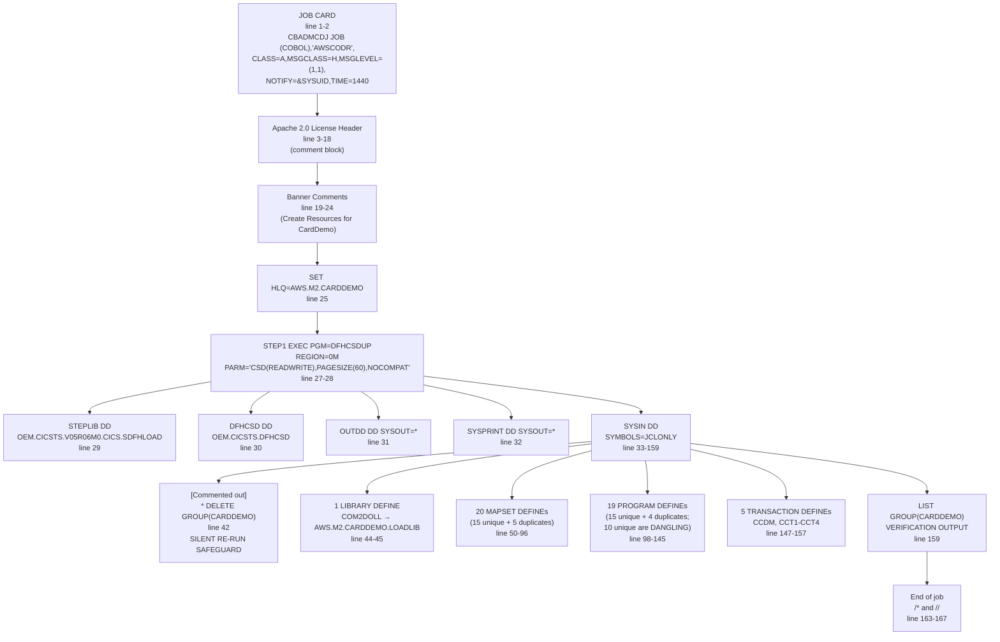

# CBADMCDJ.jcl — Comprehensive Functionality and Validation Documentation

## 1. Title and Abstract

This document provides a complete functional walkthrough of `app/jcl/CBADMCDJ.jcl`, the IBM CICS Resource Definition batch job that registers the CardDemo application's CICS resources (programs, mapsets, transactions, and one library) with the CICS region under the resource group `CARDDEMO`. The document describes every JCL statement, every DFHCSDUP control card, every implicit check that DFHCSDUP performs, every anomaly observed (duplicate DEFINEs, dangling references, documentation typos, the commented-out re-run safeguard), and every dependency that must be satisfied before, during, and after job execution. It is paired with the canonical 20-column Business Rules Extraction in [`CBADMCDJ_BRE.csv`](CBADMCDJ_BRE.csv) and [`CBADMCDJ_BRE.md`](CBADMCDJ_BRE.md).

The deliverable is authored from the perspective of a senior mainframe-modernization architect with deep COBOL, JCL, DB2, and legacy-to-cloud migration expertise (AWS Glue, Java ECS batch). It serves three audiences: (1) the operations team responsible for running CBADMCDJ.jcl in production, (2) the application development team owning the underlying COBOL/CICS resources, and (3) the modernization team executing the Java 25 + Spring Boot 3.x cloud migration referenced in the existing [technical specifications](../technical-specifications.md).

---

## 2. Job Purpose Statement

CBADMCDJ.jcl is a **configuration / resource registration job**, not a data-processing batch job. It runs the IBM-supplied DFHCSDUP utility (the CICS CSD update batch utility program) once against the CICS System Definition file (CSD) at DSN `OEM.CICSTS.DFHCSD` and writes catalog entries that the CICS region reads at startup or via `CEDA INSTALL GROUP(CARDDEMO)`. The job has exactly one EXEC step, no DB2 SQL, no SORT, no FTP, and no data transformation. Its output side effects are entirely confined to the CSD VSAM file (binary RRDS) and the SYSPRINT/OUTDD job log streams.

In a Java 25 + Spring Boot 3.x cloud target, the entire DFHCSDUP step is **replaced, not migrated**: there is no AWS Glue equivalent and no Spring Batch equivalent for CICS resource registration. The catalog entries map to Spring `@Component` bean declarations, REST controller `@RequestMapping` paths, and (optionally) AWS Cloud Map service registrations. Consequently, the BRE for this job focuses on capturing every resource declaration and every implicit check so the modernization team can produce an equivalent declarative configuration in the target stack.

The job's net effect is to register one LIBRARY, twenty MAPSET DEFINEs (15 unique by name, 5 of which are duplicates within the same group), nineteen PROGRAM DEFINEs (15 unique by name, 4 of which are duplicates), and five TRANSACTION DEFINEs into the resource group `CARDDEMO`. Of the 15 unique program names, only 5 have corresponding source on disk; the remaining 10 are dangling references (Account Main Menu, Deactivate Account, Transaction Report, Transaction Details, Add Transactions, Admin Menu, and four "Test" programs). The same dangling pattern applies to the 15 unique mapsets, with the same 10 missing.

---

## 3. Job Structure Walkthrough

The following Mermaid diagram summarizes the job's static structure. The diagram is followed by a line-by-line narrative covering all 167 lines of `CBADMCDJ.jcl`.

### 3.1 Mermaid Diagram



### 3.2 Line-by-Line Narrative

The narrative below covers every line in `app/jcl/CBADMCDJ.jcl`. Comment-only lines are included because they document author intent and operational guidance.

**Lines 1-2 — JOB statement**
The CBADMCDJ batch job is submitted with accounting code `(COBOL),'AWSCODR'`, class `A` (production hold queue), message class `H` (full job log to hold queue), full message level `(1,1)`, notification to the submitter via `&SYSUID`, and a maximum CPU time of 1440 minutes (24 hours). The 24-hour TIME limit is unusual for a configuration job and reflects the original developer's caution for first-time CSD population of large resource groups. The accounting string `'AWSCODR'` is hardcoded and should be externalized via a JCL JOB symbolic to enable cross-environment reuse.

**Lines 3-18 — Apache 2.0 License header**
A 16-line comment block (using the JCL `//*` comment syntax) declaring the file's copyright holder ("Amazon.com, Inc. or its affiliates"), the license terms (Apache License 2.0), the URL of the license text (`http://www.apache.org/licenses/LICENSE-2.0`), and the standard "AS IS" warranty disclaimer. This block has no functional effect on execution but is a legal prerequisite for any redistribution of the file.

**Lines 19-21 — Banner comments**
A second comment block introducing the job's purpose: "Create Resources for Card Demo application". The framing asterisks are a visual separator only.

**Lines 22-24 — SET PARMS section header**
Comment-only lines (`//*  ---------------------------`, `//*  SET PARMS FOR THIS JOB:`, `//*  ---------------------------`) introducing the parameterization section that follows on line 25.

**Line 25 — SET HLQ**
The JCL symbolic `HLQ` is set to `AWS.M2.CARDDEMO`. This is referenced once via `&HLQ..LOADLIB` in the LIBRARY DSNAME01 clause (line 45) and is the only parameterization in the entire job. All other dataset names are hardcoded (see Lines 29-30). The high-level qualifier `AWS.M2.CARDDEMO` is a strong indicator that the job was authored within the AWS Mainframe Modernization (M2) service environment.

**Line 26 — Spacer comment**
A standalone `//*` line acting as visual whitespace before the EXEC step.

**Lines 27-28 — STEP1 EXEC**
The single job step invokes the IBM CICS-supplied utility program `DFHCSDUP` with `REGION=0M` (request maximum available virtual storage) and PARM string `CSD(READWRITE),PAGESIZE(60),NOCOMPAT`:

- `CSD(READWRITE)` — open the CSD file for both read (LIST) and write (DEFINE/DELETE) access. The alternative is `CSD(READONLY)` for audit-only runs.
- `PAGESIZE(60)` — format the SYSPRINT listing at 60 lines per page (vs. the default 50).
- `NOCOMPAT` — operate in modern CSD format (not the obsolete pre-CICS/ESA compatibility mode); the opposite, `COMPAT`, is rarely used today.

This is the only EXEC step in the job; everything that follows is in-stream control input to DFHCSDUP.

**Line 29 — STEPLIB DD**
Allocates the load library containing the DFHCSDUP module: `DSN=OEM.CICSTS.V05R06M0.CICS.SDFHLOAD,DISP=SHR`. The `SHR` disposition allows concurrent execution with other jobs that need the same library. The version-encoded DSN (`V05R06M0`) binds this job to **CICS Transaction Server 5.6**. If the target CICS region runs a different version, the STEPLIB DSN must be updated. **Recommendation**: parameterize via JCL JOB symbolic to enable cross-version reuse.

**Line 30 — DFHCSD DD**
Allocates the **target** CSD VSAM file: `UNIT=SYSDA,DISP=SHR,DSN=OEM.CICSTS.DFHCSD`. This is the data set into which all DEFINE/DELETE/LIST operations write or read. The `SHR` disposition allows concurrent reads from running CICS regions but DFHCSDUP itself acquires an exclusive write lock for the duration of each DEFINE/DELETE. The `UNIT=SYSDA` device class is the conventional generic disk unit; in a modern z/OS shop this is usually a system-managed-storage (SMS) class.

**Line 31 — OUTDD DD**
Allocates the operator output stream as `SYSOUT=*` (system-managed printer queue). Receives DFHCSDUP operator messages such as duplicate-name warnings and DSN-resolution informational messages.

**Line 32 — SYSPRINT DD**
Allocates the standard listing output as `SYSOUT=*`. Receives the formatted DFHCSDUP listing of every DEFINE accepted, every error, and the verification output of `LIST GROUP(CARDDEMO)` (line 159). On a successful first-time run, SYSPRINT contains approximately 200–300 lines including a banner, one INFO message per DEFINE accepted, the duplicate-name warnings (5 mapsets + 4 programs), the verbatim LIST output, and the DFHCSDUP termination return code.

**Line 33 — SYSIN DD * with SYMBOLS=JCLONLY**
The in-stream SYSIN deck begins. `SYMBOLS=JCLONLY` enables JCL symbolic substitution (e.g., `&HLQ.`) within the in-stream deck — DFHCSDUP receives the deck after JCL has resolved all symbolics. This is a relatively recent z/OS feature; older systems would require an explicit `JCLLIB` reference.

**Lines 34-36 — Banner comments inside SYSIN**
Comment lines using the DFHCSDUP `*/*  ... */` comment syntax (note: this is NOT the JCL `//*` syntax). They form a banner around the text "CARDDEMO CICS DEFINITIONS".

**Line 37 — Operator instruction (NOTE)**
`* NOTE: INSTALL GROUP(CARDDEMO) - CEDA IN G(CARDDEMO)` — instructs the operator to follow up the successful job with a CICS `CEDA INSTALL GROUP(CARDDEMO)` command in the live region to load the new resources into memory. CEDA is the CICS Execute-time Definition for Administration command.

**Line 38 — Re-run instruction**
`*     IF YOU ARE RERUNNING THIS, UNCOMMENT THE DELETE COMMAND.` — instructs the operator to manually edit the JCL on re-runs to enable the DELETE GROUP statement at line 42. This is the documented (but manual) idempotency safeguard.

**Lines 39-41 — Block comments**
Standalone `*` lines forming whitespace separators with the inline label `* START CARDDEMO RESOURCES:` at line 40.

**Line 42 — Commented-out DELETE GROUP**
`* DELETE GROUP(CARDDEMO)` is intentionally commented out. As shipped, the job is non-idempotent: a second run with the group already populated will produce duplicate-resource warnings or errors from DFHCSDUP. The line-38 instructional comment advises the operator to **un-comment this line on re-runs** to ensure idempotency. This is flagged in the Risk Register (Section 11).

**Line 43 — Blank line**
Visual separator before the LIBRARY DEFINE.

**Lines 44-45 — DEFINE LIBRARY(COM2DOLL)**
Defines a CICS LIBRARY resource named `COM2DOLL` under group `CARDDEMO` with `DSNAME01(&HLQ..LOADLIB)` resolving at JCL time to `AWS.M2.CARDDEMO.LOADLIB`. This is the load library where the COBOL `.cbl` files (after compilation) and BMS mapsets (after assembly) are stored as load modules and CSECTs. The `DSNAME01` clause indicates this is the first (and only) volume in the LIBRARY's concatenation; `DSNAME02`–`DSNAME16` would be subsequent volumes. The LIBRARY name `COM2DOLL` itself is a 8-character mainframe artifact identifier with no semantic content.

**Line 46 — Blank line**
Visual separator.

**Lines 47-48 — Commented-out TDQUEUE definitions**
`* DEFINE TDQUEUE(CSSD) GROUP(CARDDEMO) TYPE(INTRA)` and `* DEFINE TDQUEUE(IRDC) GROUP(CARDDEMO) TYPE(INTRA)` — two intra-partition Transient Data Queue (TDQ) definitions left commented out by the original developer. Per CICS conventions, intra-partition TDQs are local to the CICS region and used for inter-task data passing within the same region. The names CSSD and IRDC appear to be application-specific identifiers; their intended functional purpose is not documented in the source artifacts and these definitions have no runtime effect while commented out.

**Line 49 — Blank line**
Visual separator before the MAPSET section.

**Lines 50-51 — DEFINE MAPSET(COSGN00M) [first occurrence]**
Registers the BMS mapset `COSGN00M` ("LOGIN SCREEN") under group CARDDEMO. This mapset is consumed by the COSGN00C login program. Source: `app/bms/COSGN00.bms`.

**Line 52 — Blank line**
Visual separator.

**Lines 53-54 — DEFINE MAPSET(COSGN00M) [DUPLICATE]**
Identical to lines 50-51. **DFHCSDUP will reject this second DEFINE with a "DEFINE NOT EXECUTED — DUPLICATE NAME" warning.** Because the attributes are identical, runtime behavior is unchanged. Recommendation: remove this duplicate entry.

**Line 55 — Blank line**
Visual separator.

**Lines 56-57 — DEFINE MAPSET(COACT00S) — ACCOUNT MENU [DANGLING]**
Registers mapset `COACT00S` with description "ACCOUNT MENU". **No corresponding `app/bms/COACT00.bms` exists in the source tree.** This is one of the 10 dangling mapsets (HIGH severity).

**Lines 58-59 — DEFINE MAPSET(COACTVWS) — VIEW ACCOUNT [first occurrence]**
Registers mapset `COACTVWS` with description "VIEW ACCOUNT". Source: `app/bms/COACTVW.bms`. Consumed by the COACTVWC view program.

**Lines 60-61 — DEFINE MAPSET(COACTUPS) — UPDATE ACCOUNT [first occurrence]**
Registers mapset `COACTUPS` with description "UPDATE ACCOUNT". Source: `app/bms/COACTUP.bms`. Consumed by the COACTUPC update program.

**Lines 62-63 — DEFINE MAPSET(COACTDES) — DEACTIVATE ACCOUNT [DANGLING]**
Registers mapset `COACTDES` with description "DEACTIVATE ACCOUNT". **No source file exists.** Dangling (HIGH severity).

**Line 64 — Blank line**
Visual separator between the "ACCOUNT MENU" semantic block (lines 56-63) and the "CARD MENU" semantic block (lines 65-72).

**Lines 65-66 — DEFINE MAPSET(COACT00S) — CARD MENU [DUPLICATE + DANGLING]**
Identical resource name to lines 56-57; only the DESCRIPTION text differs. **DFHCSDUP rejects as duplicate; the underlying mapset is also dangling.** This is a forensic indicator that the original developer attempted to register the same physical resource under two semantic contexts ("ACCOUNT MENU" and "CARD MENU") but CICS does not have semantic groupings at the DEFINE level.

**Lines 67-68 — DEFINE MAPSET(COACTVWS) — VIEW CARD [DUPLICATE]**
Duplicate of lines 58-59. The description differs ("VIEW CARD" vs. "VIEW ACCOUNT") but DFHCSDUP only checks the resource name; rejected as duplicate.

**Lines 69-70 — DEFINE MAPSET(COACTUPS) — UPDATE CARD [DUPLICATE]**
Duplicate of lines 60-61. Rejected as duplicate.

**Lines 71-72 — DEFINE MAPSET(COACTDES) — DEACTIVATE CARD [DUPLICATE + DANGLING]**
Duplicate of lines 62-63. Rejected as duplicate; underlying mapset is also dangling.

**Line 73 — Blank line**
Visual separator before the TRANSACTION mapset block.

**Lines 74-75 — DEFINE MAPSET(COTRN00S) — TRANSACTION**
Registers mapset `COTRN00S` with description "TRANSACTION". Source: `app/bms/COTRN00.bms`. Consumed by the COTRN00C transaction list program.

**Lines 76-77 — DEFINE MAPSET(COTRNVWS) — TRANSACTION REPORT [DANGLING]**
Registers mapset `COTRNVWS`. **No source file exists.** Dangling (HIGH severity).

**Lines 78-79 — DEFINE MAPSET(COTRNVDS) — TRANSACTION DETAILS [DANGLING]**
Registers mapset `COTRNVDS`. **No source file exists.** Dangling (HIGH severity).

**Lines 80-81 — DEFINE MAPSET(COTRNATS) — ADD TRANSACTIONS [DANGLING]**
Registers mapset `COTRNATS`. **No source file exists.** Dangling (HIGH severity).

**Line 82 — Blank line**
Visual separator before the BILL PAY MAPSET.

**Lines 83-84 — DEFINE MAPSET(COBIL00S) — BILL PAY SETUP**
Registers mapset `COBIL00S` with description "BILL PAY SETUP". Source: `app/bms/COBIL00.bms`. Consumed by the COBIL00C bill payment program.

**Line 85 — Blank line**
Visual separator.

**Lines 86-87 — DEFINE MAPSET(COADM00S) — ADMIN MENU [DANGLING]**
Registers mapset `COADM00S` with description "ADMIN MENU". **No source file exists** (the repository has `app/bms/COADM01.bms` but not `COADM00.bms` — these are DIFFERENT mapsets). Dangling (HIGH severity).

**Line 88 — Blank line**
Visual separator before the test-program mapset block.

**Lines 89-90 — DEFINE MAPSET(COTSTP1S) — PGM1 TEST [DANGLING]**
Registers mapset `COTSTP1S`. **No source file exists.** Dangling (HIGH severity).

**Lines 91-92 — DEFINE MAPSET(COTSTP2S) — PGM2 TEST [DANGLING]**
Registers mapset `COTSTP2S`. **No source file exists.** Dangling (HIGH severity).

**Lines 93-94 — DEFINE MAPSET(COTSTP3S) — PGM3 TEST [DANGLING]**
Registers mapset `COTSTP3S`. **No source file exists.** Dangling (HIGH severity).

**Lines 95-96 — DEFINE MAPSET(COTSTP4S) — PGM4 TEST [DANGLING]**
Registers mapset `COTSTP4S`. **No source file exists.** Dangling (HIGH severity).

**Line 97 — Blank line**
Visual separator before the PROGRAM section.

**Lines 98-99 — DEFINE PROGRAM(COSGN00C) — LOGIN with TRANSID(CC00)**
Registers the COBOL login program `COSGN00C` under group CARDDEMO with `DA(ANY)` (data location ANY — supports 31-bit addressing) and `TRANSID(CC00)`. This is the **application entry point**: any user invoking transaction CC00 is routed to this program. Source: `app/cbl/COSGN00C.cbl` (260 lines). The TRANSID clause embedded inside the DEFINE PROGRAM is a shorthand alternative to a separate DEFINE TRANSACTION; both register a TRANSID-to-PROGRAM binding.

**Line 100 — Blank line**
Visual separator.

**Lines 101-102 — DEFINE PROGRAM(COACT00C) — ACCOUNT MAIN MENU [DANGLING]**
Registers program `COACT00C`. **No source file exists.** Dangling (HIGH severity). Reached at runtime via XCTL from another program (likely from a hypothetical menu router); any such XCTL will fail with AEY9 abend.

**Lines 103-104 — DEFINE PROGRAM(COACTVWC) — VIEW ACCOUNT [first occurrence]**
Registers program `COACTVWC`. Source: `app/cbl/COACTVWC.cbl` (941 lines). Account/Card view program.

**Lines 105-106 — DEFINE PROGRAM(COACTUPC) — UPDATE ACCOUNT [first occurrence]**
Registers program `COACTUPC`. Source: `app/cbl/COACTUPC.cbl` (4236 lines — the largest program in scope). Account/Card update program with extensive field-edit logic.

**Lines 107-108 — DEFINE PROGRAM(COACTDEC) — DEACTIVATE ACCOUNT [DANGLING]**
Registers program `COACTDEC`. **No source file exists.** Dangling (HIGH severity).

**Line 109 — Blank line**
Visual separator between the "ACCOUNT" semantic block (lines 101-108) and the "CARD" semantic block (lines 110-117).

**Lines 110-111 — DEFINE PROGRAM(COACT00C) — CARD MENU [DUPLICATE + DANGLING]**
Duplicate of lines 101-102 with different description. Rejected as duplicate; underlying program is also dangling.

**Lines 112-113 — DEFINE PROGRAM(COACTVWC) — VIEW CARD [DUPLICATE]**
Duplicate of lines 103-104. Rejected as duplicate.

**Lines 114-115 — DEFINE PROGRAM(COACTUPC) — UPDATE CARD [DUPLICATE]**
Duplicate of lines 105-106. Rejected as duplicate.

**Lines 116-117 — DEFINE PROGRAM(COACTDEC) — DEACTIVATE CARD [DUPLICATE + DANGLING]**
Duplicate of lines 107-108. Rejected as duplicate; underlying program is also dangling.

**Lines 118-119 — DEFINE PROGRAM(COTRN00C) — TRANSACTION**
Registers program `COTRN00C`. Source: `app/cbl/COTRN00C.cbl` (699 lines). Transaction list/lookup program.

**Lines 120-121 — DEFINE PROGRAM(COTRNVWC) — TRANSACTION REPORT [DANGLING]**
Registers program `COTRNVWC`. **No source file exists.** Dangling (HIGH severity).

**Lines 122-123 — DEFINE PROGRAM(COTRNVDC) — TRANSACTION DETAILS [DANGLING]**
Registers program `COTRNVDC`. **No source file exists.** Dangling (HIGH severity).

**Lines 124-125 — DEFINE PROGRAM(COTRNATC) — ADD TRANSACTIONS [DANGLING]**
Registers program `COTRNATC`. **No source file exists.** Dangling (HIGH severity).

**Line 126 — Blank line**
Visual separator before the BILL PAY program.

**Lines 127-128 — DEFINE PROGRAM(COBIL00C) — BILL PAY**
Registers program `COBIL00C`. Source: `app/cbl/COBIL00C.cbl` (572 lines). Bill payment program.

**Line 129 — Blank line**
Visual separator before the ADMIN program.

**Lines 130-132 — DEFINE PROGRAM(COADM00C) — ADMIN MENU with TRANSID(CCAD) [DANGLING]**
Registers program `COADM00C` with description "ADMIN MENU" and TRANSID `CCAD`. **No source file exists** (the repository has `app/cbl/COADM01C.cbl` but not `COADM00C.cbl` — these are DIFFERENT programs). Dangling (HIGH severity). Note: this is the only DEFINE PROGRAM directive in the file that uses three lines (program, description, TRANSID on separate lines), differentiating it from the two-line and four-line patterns elsewhere.

**Line 133 — Blank line**
Visual separator before the test-program block.

**Lines 134-136 — DEFINE PROGRAM(COTSTP1C) — PGM1 TEST with TRANSID(CCT1) [DANGLING]**
Registers program `COTSTP1C` with description "PGM1 TEST" and TRANSID `CCT1`. **No source file exists.** Dangling (HIGH severity).

**Lines 137-139 — DEFINE PROGRAM(COTSTP2C) — PGM2 TEST with TRANSID(CCT2) [DANGLING]**
Registers program `COTSTP2C` with description "PGM2 TEST" and TRANSID `CCT2`. **No source file exists.** Dangling (HIGH severity).

**Lines 140-142 — DEFINE PROGRAM(COTSTP3C) — DOC TYPO + DANGLING**
Registers program `COTSTP3C` with description **"PGM1 TEST"** (⚠ TYPO: should read "PGM3 TEST") and TRANSID `CCT3`. **No source file exists.** Dangling (HIGH severity). The description typo is a copy-paste defect from line 135 — strong evidence that the author cloned the COTSTP1C block as a starting point for COTSTP3C and forgot to update the description text. The typo is cosmetic (DFHCSDUP does not validate description text against program name) but supports the forensic hypothesis that the test programs were stale code from earlier development cycles.

**Lines 143-145 — DEFINE PROGRAM(COTSTP4C) — PGM4 TEST with TRANSID(CCT4) [DANGLING]**
Registers program `COTSTP4C` with description "PGM4 TEST" and TRANSID `CCT4`. **No source file exists.** Dangling (HIGH severity).

**Line 146 — Blank line**
Visual separator before the TRANSACTION section.

**Lines 147-148 — DEFINE TRANSACTION(CCDM) bound to COADM00C [TARGET DANGLING]**
Registers transaction `CCDM` (Card Demo Master) bound to PROGRAM `COADM00C` with TASKDATAL(ANY). DFHCSDUP does NOT verify program-existence at DEFINE time; runtime invocation of CCDM will produce AEY9 abend because COADM00C is dangling.

**Line 149 — Blank line**
Visual separator.

**Lines 150-151 — DEFINE TRANSACTION(CCT1) bound to COTSTP1C [TARGET DANGLING]**
Registers transaction `CCT1` bound to dangling program COTSTP1C. Runtime AEY9 abend on invocation.

**Lines 152-153 — DEFINE TRANSACTION(CCT2) bound to COTSTP2C [TARGET DANGLING]**
Registers transaction `CCT2` bound to dangling program COTSTP2C. Runtime AEY9 abend on invocation.

**Lines 154-155 — DEFINE TRANSACTION(CCT3) bound to COTSTP3C [TARGET DANGLING]**
Registers transaction `CCT3` bound to dangling program COTSTP3C. Runtime AEY9 abend on invocation.

**Lines 156-157 — DEFINE TRANSACTION(CCT4) bound to COTSTP4C [TARGET DANGLING]**
Registers transaction `CCT4` bound to dangling program COTSTP4C. Runtime AEY9 abend on invocation.

**Line 158 — Blank line**
Visual separator before the LIST verification step.

**Line 159 — LIST GROUP(CARDDEMO)**
The verification step. After all DEFINEs are processed, DFHCSDUP prints the complete content of group CARDDEMO to SYSPRINT. The operator inspects this listing to confirm that all expected resources are present. The LIST output reflects post-rejection state: duplicates that DFHCSDUP rejected do not appear, but dangling references DO appear because DFHCSDUP does not check load-library presence at DEFINE time.

**Line 160 — Standalone `*`**
SYSIN comment line forming whitespace.

**Line 161 — End-of-resources marker**
`* END CARDDEMO RESOURCES` — closing label for the resource block.

**Line 162 — Standalone `*`**
SYSIN comment line forming whitespace.

**Line 163 — `/*`**
End-of-data delimiter for the SYSIN in-stream deck. JES recognizes this and stops reading SYSIN.

**Line 164 — `//`**
JCL end-of-job marker. JES2/JES3 recognizes this and terminates the job.

**Line 165 — `//*`**
JCL comment line.

**Line 166 — Version stamp**
`//* Ver: CardDemo_v1.0-70-g193b394-123 Date: 2022-08-22 17:02:44 CDT` — git-derived version stamp embedded as a JCL comment. The format `vX.Y-N-gHASH-COMMITS` is the standard `git describe` output. Date `2022-08-22` confirms the file is approximately 3 years old as of the current modernization assessment.

**Line 167 — Trailing comment**
`//*` — final standalone comment line.

---

## 4. DFHCSDUP Utility Deep-Dive

The CICS CSD update batch utility program DFHCSDUP is a component of resource definition online (RDO). It provides offline services to read from and write to a CICS system definition file (CSD), either while CICS is running or while it is inactive. CardDemo's CBADMCDJ.jcl uses it offline to bulk-register the application's CICS resources.

### 4.1 PARM Options Used

The PARM string `'CSD(READWRITE),PAGESIZE(60),NOCOMPAT'` controls DFHCSDUP's operating mode for this run.

| Parameter | Value | Effect |
|---|---|---|
| `CSD(READWRITE)` | open mode | Permits both DEFINE/DELETE/INSTALL (write) and LIST/EXTRACT (read). The alternative is `CSD(READONLY)` for audit-only runs. |
| `PAGESIZE(60)` | listing format | SYSPRINT is paginated at 60 lines per page (vs. default 50). Affects readability only; no functional impact. |
| `NOCOMPAT` | format selector | Operates in modern CSD format. The opposite, `COMPAT`, would force pre-CICS/ESA layout which CardDemo does not need. |

### 4.2 REGION=0M

`REGION=0M` requests the maximum available virtual storage. DFHCSDUP itself is a small utility (the load module is well under 1 MB), but `REGION=0M` is conservative for CSD updates that may pull large group lists into memory during the LIST step. For CardDemo's relatively small CARDDEMO group (45 DEFINEs total), a much smaller region (`REGION=8M`) would suffice; `REGION=0M` adds no cost on modern systems.

### 4.3 STEPLIB Binding

The STEPLIB binds the job to a specific CICS TS version: `OEM.CICSTS.V05R06M0.CICS.SDFHLOAD` resolves to **CICS Transaction Server 5.6** (V05R06M0 = Version 5, Release 6, Modification 0). If the target CICS region runs a different version (e.g., CICS TS 5.5 or 6.1), the STEPLIB DSN must be updated.

The version-encoded DSN is a strong **modernization risk indicator**: it suggests the job was authored for one specific CICS TS release and has not been parameterized for cross-version reuse. **Recommendation**: parameterize via JCL JOB symbolic (e.g., `&CICSVER`) to enable cross-version reuse without source edits.

### 4.4 CSD VSAM File

The DFHCSD DD points to the binary CSD VSAM file (`OEM.CICSTS.DFHCSD`). This file is **shared across multiple CICS regions** that need access to the same resource catalog. Concurrent DFHCSDUP runs against the same CSD must be serialized via JES dataset enqueue — z/OS automatically grants exclusive access for DFHCSDUP's update operations because the DD specifies `DISP=SHR` but DFHCSDUP issues an internal exclusive ENQ during DEFINE/DELETE operations.

The CSD is structurally a VSAM RRDS (Relative Record Data Set); each record represents one resource definition (one PROGRAM, MAPSET, TRANSACTION, LIBRARY, FILE, etc.). DFHCSDUP traverses records by group name when processing `LIST GROUP(...)` and `DELETE GROUP(...)`.

### 4.5 SYSPRINT Output Conventions

DFHCSDUP emits the following SYSPRINT records during a typical run:

- **Banner:** "CICS SYSTEM DEFINITION UTILITY DFHCSDUP" with date/time/version
- **PARM echo:** repeats the PARM string for audit
- **DD allocations:** confirms the DSNs allocated to STEPLIB, DFHCSD, OUTDD, SYSPRINT
- **One INFO line per accepted DEFINE:** "DFHCSD0541I DEFINE COMPLETED FOR mapset/program/transaction NAMED ..."
- **One WARNING line per rejected duplicate:** "DFHCSD0560W DEFINE NOT EXECUTED — DUPLICATE NAME ..."
- **The verbatim LIST GROUP output:** showing every accepted resource with its full attribute set
- **Termination message and return code:** RC=0 if no errors/warnings; RC=4 if duplicate-name warnings only; RC=8 if any DEFINE failed; RC=12 if a system error occurred

### 4.6 Supported Control Card Types Used in CBADMCDJ.jcl

CBADMCDJ.jcl uses six distinct DFHCSDUP control card types. The full DFHCSDUP grammar supports many more (FILE, TDQUEUE, TSQUEUE, JOURNAL, LSRPOOL, MQCONN, etc.) but those are not exercised here.

| Control Card | Purpose | Count in CBADMCDJ.jcl |
|---|---|---|
| `DEFINE LIBRARY(...)` | Register a load library resource | 1 |
| `DEFINE MAPSET(...)` | Register a BMS mapset resource | 20 (15 unique + 5 duplicates) |
| `DEFINE PROGRAM(...)` | Register a program resource | 19 (15 unique + 4 duplicates) |
| `DEFINE TRANSACTION(...)` | Register a transaction-id-to-program binding | 5 |
| `LIST GROUP(...)` | Print all resources in the group for verification | 1 |
| `DELETE GROUP(...)` | Remove all resources in the group | 1 (commented out — silent re-run safeguard) |

---

## 5. Resource Catalog

This section enumerates every resource definition produced by CBADMCDJ.jcl, organized by resource type.

### 5.1 LIBRARY Definitions

The CBADMCDJ.jcl job defines exactly one LIBRARY resource. CICS LIBRARYs are dynamically managed load library concatenations that participate in CICS dynamic program library lookup at INSTALL time. A LIBRARY is added to the dynamic library search order via `CEDA INSTALL LIBRARY(name)` (or via group install if the LIBRARY is in a group being installed).

| # | Library Name | Group | DSNAME01 (post-symbolic-substitution) | Source Line |
|---|---|---|---|---|
| 1 | COM2DOLL | CARDDEMO | AWS.M2.CARDDEMO.LOADLIB | 44-45 |

**Notes:**
- The LIBRARY name `COM2DOLL` is opaque (no semantic content). It appears to be an artifact of the original CardDemo distribution.
- The DSNAME is parameterized via the `&HLQ.` JCL symbolic set on line 25.
- DFHCSDUP does NOT verify DSN existence at DEFINE time — that check is deferred to INSTALL time.
- Only `DSNAME01` is specified; up to 16 dataset names (`DSNAME01`–`DSNAME16`) could be concatenated for a multi-volume LIBRARY.

### 5.2 MAPSET Definitions

CBADMCDJ.jcl issues 20 `DEFINE MAPSET` directives. Of these, 15 are unique by name and 5 are exact-duplicate re-issues. The mapset names follow the CardDemo convention `COxxxxx` + `S` suffix (the trailing `S` distinguishes the mapset from the related program, e.g., `COSGN00M` mapset vs. `COSGN00C` program).

| # | Mapset Name | Group | Description | Source Line | Source File | Status |
|---|---|---|---|---|---|---|
| 1 | COSGN00M | CARDDEMO | LOGIN SCREEN | 50-51 | `app/bms/COSGN00.bms` | OK |
| 2 | COSGN00M | CARDDEMO | LOGIN SCREEN | 53-54 | `app/bms/COSGN00.bms` | **DUPLICATE of #1** |
| 3 | COACT00S | CARDDEMO | ACCOUNT MENU | 56-57 | (missing) | **DANGLING — HIGH** |
| 4 | COACTVWS | CARDDEMO | VIEW ACCOUNT | 58-59 | `app/bms/COACTVW.bms` | OK |
| 5 | COACTUPS | CARDDEMO | UPDATE ACCOUNT | 60-61 | `app/bms/COACTUP.bms` | OK |
| 6 | COACTDES | CARDDEMO | DEACTIVATE ACCOUNT | 62-63 | (missing) | **DANGLING — HIGH** |
| 7 | COACT00S | CARDDEMO | CARD MENU | 65-66 | (missing) | **DUPLICATE of #3 — DANGLING** |
| 8 | COACTVWS | CARDDEMO | VIEW CARD | 67-68 | `app/bms/COACTVW.bms` | **DUPLICATE of #4** |
| 9 | COACTUPS | CARDDEMO | UPDATE CARD | 69-70 | `app/bms/COACTUP.bms` | **DUPLICATE of #5** |
| 10 | COACTDES | CARDDEMO | DEACTIVATE CARD | 71-72 | (missing) | **DUPLICATE of #6 — DANGLING** |
| 11 | COTRN00S | CARDDEMO | TRANSACTION | 74-75 | `app/bms/COTRN00.bms` | OK |
| 12 | COTRNVWS | CARDDEMO | TRANSACTION REPORT | 76-77 | (missing) | **DANGLING — HIGH** |
| 13 | COTRNVDS | CARDDEMO | TRANSACTION DETAILS | 78-79 | (missing) | **DANGLING — HIGH** |
| 14 | COTRNATS | CARDDEMO | ADD TRANSACTIONS | 80-81 | (missing) | **DANGLING — HIGH** |
| 15 | COBIL00S | CARDDEMO | BILL PAY SETUP | 83-84 | `app/bms/COBIL00.bms` | OK |
| 16 | COADM00S | CARDDEMO | ADMIN MENU | 86-87 | (missing) | **DANGLING — HIGH** |
| 17 | COTSTP1S | CARDDEMO | PGM1 TEST | 89-90 | (missing) | **DANGLING — HIGH** |
| 18 | COTSTP2S | CARDDEMO | PGM2 TEST | 91-92 | (missing) | **DANGLING — HIGH** |
| 19 | COTSTP3S | CARDDEMO | PGM3 TEST | 93-94 | (missing) | **DANGLING — HIGH** |
| 20 | COTSTP4S | CARDDEMO | PGM4 TEST | 95-96 | (missing) | **DANGLING — HIGH** |

**Summary:** 20 DEFINE MAPSET directives, of which 5 unique mapsets have source files (`COSGN00.bms`, `COACTVW.bms`, `COACTUP.bms`, `COTRN00.bms`, `COBIL00.bms`) and 10 unique mapsets are dangling (no source). Five mapsets are defined twice (duplicates: COSGN00M, COACT00S, COACTVWS, COACTUPS, COACTDES). The `LIST GROUP(CARDDEMO)` at line 159 will surface duplicate-name warnings during execution.

### 5.3 PROGRAM Definitions

CBADMCDJ.jcl issues 19 `DEFINE PROGRAM` directives. Of these, 15 are unique by name and 4 are exact-duplicate re-issues (COACT00C, COACTVWC, COACTUPC, COACTDEC each appear twice). The program names follow the CardDemo convention `COxxxxx` + `C` suffix (the trailing `C` distinguishes the program from the related copybook or mapset).

| # | Program Name | Group | DA | TRANSID | Description | Source Line | Source File | Status |
|---|---|---|---|---|---|---|---|---|
| 1 | COSGN00C | CARDDEMO | ANY | CC00 | LOGIN | 98-99 | `app/cbl/COSGN00C.cbl` | OK |
| 2 | COACT00C | CARDDEMO | ANY | (none) | ACCOUNT MAIN MENU | 101-102 | (missing) | **DANGLING — HIGH** |
| 3 | COACTVWC | CARDDEMO | ANY | (none) | VIEW ACCOUNT | 103-104 | `app/cbl/COACTVWC.cbl` | OK |
| 4 | COACTUPC | CARDDEMO | ANY | (none) | UPDATE ACCOUNT | 105-106 | `app/cbl/COACTUPC.cbl` | OK |
| 5 | COACTDEC | CARDDEMO | ANY | (none) | DEACTIVATE ACCOUNT | 107-108 | (missing) | **DANGLING — HIGH** |
| 6 | COACT00C | CARDDEMO | ANY | (none) | CARD MENU | 110-111 | (missing) | **DUPLICATE of #2 — DANGLING** |
| 7 | COACTVWC | CARDDEMO | ANY | (none) | VIEW CARD | 112-113 | `app/cbl/COACTVWC.cbl` | **DUPLICATE of #3** |
| 8 | COACTUPC | CARDDEMO | ANY | (none) | UPDATE CARD | 114-115 | `app/cbl/COACTUPC.cbl` | **DUPLICATE of #4** |
| 9 | COACTDEC | CARDDEMO | ANY | (none) | DEACTIVATE CARD | 116-117 | (missing) | **DUPLICATE of #5 — DANGLING** |
| 10 | COTRN00C | CARDDEMO | ANY | (none) | TRANSACTION | 118-119 | `app/cbl/COTRN00C.cbl` | OK |
| 11 | COTRNVWC | CARDDEMO | ANY | (none) | TRANSACTION REPORT | 120-121 | (missing) | **DANGLING — HIGH** |
| 12 | COTRNVDC | CARDDEMO | ANY | (none) | TRANSACTION DETAILS | 122-123 | (missing) | **DANGLING — HIGH** |
| 13 | COTRNATC | CARDDEMO | ANY | (none) | ADD TRANSACTIONS | 124-125 | (missing) | **DANGLING — HIGH** |
| 14 | COBIL00C | CARDDEMO | ANY | (none) | BILL PAY | 127-128 | `app/cbl/COBIL00C.cbl` | OK |
| 15 | COADM00C | CARDDEMO | ANY | CCAD | ADMIN MENU | 130-132 | (missing) | **DANGLING — HIGH** |
| 16 | COTSTP1C | CARDDEMO | ANY | CCT1 | PGM1 TEST | 134-136 | (missing) | **DANGLING — HIGH** |
| 17 | COTSTP2C | CARDDEMO | ANY | CCT2 | PGM2 TEST | 137-139 | (missing) | **DANGLING — HIGH** |
| 18 | COTSTP3C | CARDDEMO | ANY | CCT3 | **PGM1 TEST** ⚠ | 140-142 | (missing) | **DANGLING — HIGH; description typo (says PGM1, should say PGM3)** |
| 19 | COTSTP4C | CARDDEMO | ANY | CCT4 | PGM4 TEST | 143-145 | (missing) | **DANGLING — HIGH** |

**Summary:** 19 DEFINE PROGRAM directives, of which **5 unique programs have source files** (COSGN00C, COACTVWC, COACTUPC, COTRN00C, COBIL00C) and **10 unique programs are dangling** (no source: COACT00C, COACTDEC, COTRNVWC, COTRNVDC, COTRNATC, COADM00C, COTSTP1C, COTSTP2C, COTSTP3C, COTSTP4C). Four programs are defined twice (duplicates: COACT00C, COACTVWC, COACTUPC, COACTDEC). The line-141 description `PGM1 TEST` for COTSTP3C is a copy-paste defect (should be `PGM3 TEST`).

**TRANSID embedded in DEFINE PROGRAM:** Of the 15 unique programs, 6 have a TRANSID clause embedded in their DEFINE PROGRAM directive: `COSGN00C → CC00`, `COADM00C → CCAD`, `COTSTP1C → CCT1`, `COTSTP2C → CCT2`, `COTSTP3C → CCT3`, `COTSTP4C → CCT4`. The remaining 9 programs are reachable only via XCTL/LINK from another program (no direct TRANSID).

### 5.4 TRANSACTION Definitions

CBADMCDJ.jcl issues 5 `DEFINE TRANSACTION` directives. Each binds a 4-character transaction ID (TRANSID) to a CICS program. CICS uses these bindings to route incoming transaction requests (entered at a 3270 terminal or via EXEC CICS START commands) to the appropriate program for execution.

| # | TransID | Group | Bound Program | TASKDATAL | Source Line | Bound Program Status |
|---|---|---|---|---|---|---|
| 1 | CCDM | CARDDEMO | COADM00C | ANY | 147-148 | **Bound program is DANGLING** — runtime AEY9 abend on CCDM |
| 2 | CCT1 | CARDDEMO | COTSTP1C | ANY | 150-151 | **Bound program is DANGLING** — runtime AEY9 abend on CCT1 |
| 3 | CCT2 | CARDDEMO | COTSTP2C | ANY | 152-153 | **Bound program is DANGLING** — runtime AEY9 abend on CCT2 |
| 4 | CCT3 | CARDDEMO | COTSTP3C | ANY | 154-155 | **Bound program is DANGLING** — runtime AEY9 abend on CCT3 |
| 5 | CCT4 | CARDDEMO | COTSTP4C | ANY | 156-157 | **Bound program is DANGLING** — runtime AEY9 abend on CCT4 |

**Summary:** All 5 explicitly-defined transactions reference dangling programs. None of these transactions can succeed at runtime as the application stands.

**Implicit transaction CC00:** The login TRANSID `CC00` is bound to COSGN00C via the embedded `TRANSID(CC00)` clause inside DEFINE PROGRAM at line 98 — this is the **only working transaction in the catalog** as defined here. Other working transactions (e.g., a hypothetical `CAVW` for COACTVWC) are NOT registered in CBADMCDJ.jcl; the working programs are reached via direct XCTL from COSGN00C without their own TRANSID, OR they are presumed to be defined elsewhere in the production CSD.

**Implicit transaction CCAD:** The admin TRANSID `CCAD` is bound to COADM00C via the embedded `TRANSID(CCAD)` clause inside DEFINE PROGRAM at line 132 — but the bound program is dangling, so CCAD is non-functional just like CCDM, CCT1-CCT4.

---


## 6. Implicit Checks and Validations

DFHCSDUP performs the following implicit checks during execution. Each check is documented as either successful or failed in the SYSPRINT listing. Understanding the precise semantics of each check is critical to the modernization translation: in the cloud target, every implicit check that DFHCSDUP performs becomes either a Spring Boot startup-time validator, a Bean Validation (JSR 380) constraint, or a custom `@Validated` configuration check.

### 6.1 DFHCSDUP-Performed Checks

| Check | Performed By | Trigger | Failure Behavior |
|---|---|---|---|
| **Group existence pre-check** | DFHCSDUP | `DELETE GROUP(...)` directive | If the group does not exist, the DELETE returns a NO-OP message; if commented out (as in CBADMCDJ.jcl line 42), no check fires. |
| **Resource attribute syntax validation** | DFHCSDUP | Each `DEFINE` directive | Unknown attribute names (e.g., a misspelled `DA` clause) cause the directive to be rejected with a syntax error in SYSPRINT; subsequent directives still run. The job ends with RC=8 if any DEFINE fails. |
| **Resource name length (max 8 chars)** | DFHCSDUP | Each PROGRAM/MAPSET name | All CardDemo names (COSGN00C, COBIL00C, etc.) are exactly 8 characters — within limits. |
| **TRANSID length (max 4 chars)** | DFHCSDUP | Each `TRANSID(...)` clause | All CardDemo TRANSIDs (CC00, CCDM, CCT1-CCT4, CCAD) are exactly 4 characters. |
| **Group name length (max 8 chars)** | DFHCSDUP | Each `GROUP(...)` clause | `CARDDEMO` is exactly 8 characters — within limits. |
| **LIBRARY DSN existence** | NOT performed at DEFINE time | `DSNAME01(...)` clause | DFHCSDUP does NOT verify that `&HLQ..LOADLIB` exists at DEFINE time; the check is deferred until the LIBRARY is INSTALLED (via `CEDA INSTALL` or CICS startup). If the load library is missing or empty at INSTALL time, programs in the LIBRARY will not be loadable and will produce AEY9 abend at the first transaction invocation that references them. |
| **Program-name uniqueness within group** | DFHCSDUP | Repeated `DEFINE PROGRAM(SAMENAME)` in same group | Produces a "DEFINE NOT EXECUTED — DUPLICATE NAME" warning; the second DEFINE is REJECTED, leaving only the first DEFINE active. CardDemo's 4 program duplicates and 5 mapset duplicates therefore each lose the second DEFINE during execution — but in this case, the first and second DEFINEs have identical attributes, so behavior is preserved. **However, the line-141 documentation typo (PGM3 mislabeled as PGM1) goes unnoticed by DFHCSDUP because group-uniqueness applies to the resource name (COTSTP3C), not the description.** |
| **TRANSACTION-to-PROGRAM reference integrity** | NOT performed | `PROGRAM(...)` clause inside DEFINE TRANSACTION | DFHCSDUP does NOT verify that the named program is itself defined in the same or any other group. CardDemo's 5 TRANSACTIONs (CCDM, CCT1-CCT4) all reference programs that ARE defined (COADM00C, COTSTP1C-COTSTP4C) but those programs are dangling at the source-tree level. **Runtime check fires only when CICS attempts to load the program for the first task running the transaction.** |
| **DA(ANY) (data location)** | DFHCSDUP | Each PROGRAM DEFINE | All CardDemo programs use `DA(ANY)` indicating 31-bit/64-bit-capable storage. DFHCSDUP accepts this without further check. |
| **TASKDATAL(ANY) (task data location)** | DFHCSDUP | Each TRANSACTION DEFINE | All CardDemo transactions use `TASKDATAL(ANY)`. Accepted without further check. |
| **Duplicate TRANSACTION-ID across groups** | DFHCSDUP partial | Each DEFINE TRANSACTION | DFHCSDUP warns if the same TRANSID is defined within the same group. Cross-group conflicts are NOT detected at DEFINE time and produce a "DUPLICATE TRANSACTION ID" abend at INSTALL time if both groups are installed. |

### 6.2 Operator-Performed Checks (Recommended)

The following checks are not performed by DFHCSDUP itself; they MUST be performed manually by the operator before submitting CBADMCDJ.jcl in production.

1. **Verify the load library is populated**: `LISTC LVL(AWS.M2.CARDDEMO.LOADLIB)` and confirm all 5 OK programs and the 5 OK mapsets are present as load modules. If absent, the LIBRARY DEFINE succeeds but INSTALL/RUN will fail.
2. **Verify the CSD is backed up**: `LISTCAT ENT(OEM.CICSTS.DFHCSD)` followed by an `IDCAMS BACKUP` is recommended before any DFHCSDUP write run. The CSD is a critical CICS region asset; corruption requires re-creation from backup.
3. **Verify no other DFHCSDUP run is concurrent**: dataset enqueue prevents this implicitly, but explicit operator coordination avoids waiting jobs holding system resources.
4. **Plan the post-run INSTALL**: after DFHCSDUP finishes successfully, the operator must run `CEDA INSTALL GROUP(CARDDEMO)` in the live CICS region to load the new resources into memory. Without this step, the CSD has the new definitions but the running CICS region does not.
5. **Plan the dangling-reference remediation**: either obtain the 10 missing program sources and 10 missing mapset sources, or remove the corresponding DEFINEs from CBADMCDJ.jcl before the run. If the dangling DEFINEs are left in place, INSTALL succeeds but any user invoking the affected TRANSIDs (CCDM, CCT1-CCT4) gets an AEY9 abend (see Section 7 below).

### 6.3 CICS-Performed Checks at INSTALL Time

When the operator runs `CEDA INSTALL GROUP(CARDDEMO)` after CBADMCDJ.jcl completes, CICS performs additional checks that DFHCSDUP did not:

- **Load library reachability:** CICS verifies that the LIBRARY's DSNAME01 dataset exists and is allocatable. Failure produces `DFHRD0114E LIBRARY ... NOT INSTALLED`.
- **Program load module presence:** For each PROGRAM with `STATUS(ENABLED)` (the default), CICS attempts to locate the load module in DFHRPL or in any installed LIBRARY. If found, the program is added to the dynamic program directory; if not found, CICS marks the program as UNUSABLE but the install continues for other resources.
- **TRANSACTION-to-PROGRAM resolution:** CICS verifies that each TRANSACTION's bound PROGRAM is defined and locatable. If the program is missing, the transaction is INSTALLED but marked UNUSABLE; runtime invocation produces AEY9 abend.

### 6.4 CICS-Performed Checks at Runtime (Per Transaction Invocation)

The final layer of checks fires only when an end user actually invokes a transaction:

- **Program load:** CICS attempts to LOAD the program from the dynamic program directory. If the module is not in any installed library, abend AEY9 ("PROGRAM NOT FOUND").
- **Initial program storage allocation:** CICS allocates working storage per the PROGRAM's CSECT directory (this requires the load module to be present and correctly linked).
- **Mapset load (on first BMS SEND/RECEIVE):** CICS LOADs the mapset's symbolic-map CSECT. If absent, abend AEYC or similar.

These layered checks mean that **the dangling references in CBADMCDJ.jcl are NOT detected by DFHCSDUP and may not even be detected by `CEDA INSTALL` (which marks resources UNUSABLE but does not abort)**. The first hard failure occurs only when an end user attempts to run an affected transaction.

---

## 7. Anomaly Inventory

The following anomalies have been identified in CBADMCDJ.jcl. Each is presented with its location, severity, and remediation advice. Anomalies are sorted by severity (HIGH first); within severity, by JCL line order.

### Anomaly 1 — Dangling resource references (HIGH SEVERITY)

Ten programs and ten mapsets are registered with CICS but have no corresponding source in `app/cbl/` or `app/bms/`. At INSTALL time, the LIBRARY check defers; at runtime, any transaction routed to a dangling program produces an `AEY9` abend (CICS message: "PROGRAM 'COxxx' NOT FOUND IN ANY DFHRPL OR DYNAMIC LIBRARY").

| # | Missing Resource | Type | Source Line | TRANSID Affected |
|---|---|---|---|---|
| 1 | COACT00C | program | 101, 110 | (no direct TRANSID; reached via XCTL) |
| 2 | COACTDEC | program | 107, 116 | (no direct TRANSID; reached via XCTL) |
| 3 | COTRNVWC | program | 120 | (no direct TRANSID; reached via XCTL) |
| 4 | COTRNVDC | program | 122 | (no direct TRANSID; reached via XCTL) |
| 5 | COTRNATC | program | 124 | (no direct TRANSID; reached via XCTL) |
| 6 | COADM00C | program | 130 | CCDM (DEFINE TRANSACTION line 147); also CCAD (embedded TRANSID line 132) |
| 7 | COTSTP1C | program | 134 | CCT1 (DEFINE TRANSACTION line 150) |
| 8 | COTSTP2C | program | 137 | CCT2 (DEFINE TRANSACTION line 152) |
| 9 | COTSTP3C | program | 140 | CCT3 (DEFINE TRANSACTION line 154) |
| 10 | COTSTP4C | program | 143 | CCT4 (DEFINE TRANSACTION line 156) |
| 11 | COACT00S | mapset | 56, 65 | (consumed by COACT00C) |
| 12 | COACTDES | mapset | 62, 71 | (consumed by COACTDEC) |
| 13 | COTRNVWS | mapset | 76 | (consumed by COTRNVWC) |
| 14 | COTRNVDS | mapset | 78 | (consumed by COTRNVDC) |
| 15 | COTRNATS | mapset | 80 | (consumed by COTRNATC) |
| 16 | COADM00S | mapset | 86 | (consumed by COADM00C) |
| 17 | COTSTP1S | mapset | 89 | (consumed by COTSTP1C) |
| 18 | COTSTP2S | mapset | 91 | (consumed by COTSTP2C) |
| 19 | COTSTP3S | mapset | 93 | (consumed by COTSTP3C) |
| 20 | COTSTP4S | mapset | 95 | (consumed by COTSTP4C) |

- **Severity:** HIGH
- **Recommendation:** Either (a) obtain the 10 missing program sources and 10 missing mapset sources from a complete CardDemo distribution and add them to `app/cbl/` and `app/bms/` (preferred for fidelity), or (b) remove the corresponding DEFINE PROGRAM and DEFINE MAPSET directives from CBADMCDJ.jcl before deployment to avoid creating broken catalog entries that will fail at runtime.

### Anomaly 2 — Hardcoded HLQ and DSNs (MEDIUM SEVERITY)

The job has multiple hardcoded high-level qualifiers and DSNs that bind it to a specific environment:

- Line 25: `SET HLQ=AWS.M2.CARDDEMO` (application HLQ)
- Line 29: `OEM.CICSTS.V05R06M0.CICS.SDFHLOAD` (CICS load library, version-encoded)
- Line 30: `OEM.CICSTS.DFHCSD` (target CSD)

In a multi-environment deployment (DEV, QA, PROD), each environment likely has different HLQs and possibly different CICS TS releases. The current hardcoding requires a JCL source edit to retarget the job — a process that is error-prone and audit-trail-hostile.

- **Severity:** MEDIUM
- **Recommendation:** Externalize via JCL JOB symbolic parameters (so the job can be reused across environments without source edits). Example: `// SET CICSHLQ=OEM.CICSTS.V05R06M0` and reference as `&CICSHLQ..CICS.SDFHLOAD`. Alternatively, in the cloud target the entire job is replaced and this concern disappears.

### Anomaly 3 — Non-idempotent re-run behavior (MEDIUM SEVERITY)

The line `* DELETE GROUP(CARDDEMO)` at line 42 is commented out. The job is therefore non-idempotent: a second run with the group already populated will produce duplicate-resource warnings. The line-38 instructional comment advises operators to manually un-comment this line on re-runs — a procedure that is undocumented in the operational runbook (this document is the first formal documentation of it) and is therefore a hidden manual step that creates risk on production re-runs.

- **Severity:** MEDIUM (operational risk; the warnings do not stop the job, but the manual edit is error-prone and creates a window where the wrong version of the JCL might be committed back to source control)
- **Recommendation:** Either (a) leave the comment in place and document the un-comment-on-rerun procedure as part of the operational runbook (this document partially fulfills that), OR (b) parameterize via a JCL JOB symbolic such that `&RERUN=Y` controls whether DELETE GROUP runs (preferred for automation). In the cloud target, registration is idempotent by design (e.g., Spring Boot bean registration is replayed on every container start) — no re-run guard is needed.

### Anomaly 4 — Duplicate DEFINE statements (LOW SEVERITY)

Five mapsets (`COSGN00M`, `COACT00S`, `COACTVWS`, `COACTUPS`, `COACTDES`) and four programs (`COACT00C`, `COACTVWC`, `COACTUPC`, `COACTDEC`) are each defined twice within the same group. DFHCSDUP rejects the second DEFINE with a duplicate-name warning, but because the attributes are identical, the runtime behavior is unchanged.

- **Severity:** LOW
- **Locations:** lines 50/53 (COSGN00M); 56/65 (COACT00S); 58/67 (COACTVWS); 60/69 (COACTUPS); 62/71 (COACTDES); 101/110 (COACT00C); 103/112 (COACTVWC); 105/114 (COACTUPC); 107/116 (COACTDEC)
- **Recommendation:** Consolidate. Remove the second occurrence of each duplicate. The original developer's apparent intent was to register the same physical resource under two semantic contexts ("ACCOUNT MENU" and "CARD MENU") — but CICS does not have semantic groupings at the DEFINE level, so the duplicates are pure noise. After consolidation, the file shrinks by ~9 DEFINE blocks (approximately 18 source lines).

### Anomaly 5 — Documentation typo at line 141 (LOW SEVERITY)

`DEFINE PROGRAM(COTSTP3C) ... DESCRIPTION(PGM1 TEST) ... TRANSID(CCT3)` — the description says `PGM1 TEST` but the program name is COTSTP3C (the third test program) and the TRANSID is CCT3. This is a copy-paste defect from line 134 (`DEFINE PROGRAM(COTSTP1C) ... DESCRIPTION(PGM1 TEST)`).

- **Severity:** LOW (cosmetic; does not affect runtime behavior because DFHCSDUP does not validate description text against program name)
- **Compounded by:** the underlying program is itself dangling (HIGH severity) — see Anomaly 1.
- **Recommendation:** Correct the description to `PGM3 TEST` for consistency with the program name. This is a 1-character edit. The forensic significance is non-trivial: the typo confirms that this JCL was authored via copy-paste from earlier directives, supporting the theory that the dangling references are stale code (from earlier development cycles where these programs existed in the load library but the source was later deleted).

---

## 8. Dangling Reference Inventory

This section is a stand-alone reference table for the operations team. It restates the dangling-resource findings from Anomaly 1 (Section 7) so they can be tracked separately from the broader anomaly catalog. Each row corresponds exactly to one Error-Handling rule row in [`CBADMCDJ_BRE.csv`](CBADMCDJ_BRE.csv) and [`CBADMCDJ_BRE.md`](CBADMCDJ_BRE.md).

### 8.1 Missing Programs (10 entries)

| # | Resource Name | Type | Description | Source Line(s) | Affected TRANSID(s) | Severity |
|---|---|---|---|---|---|---|
| 1 | COACT00C | PROGRAM | ACCOUNT MAIN MENU / CARD MENU | 101-102, 110-111 | (no direct TRANSID; reached via XCTL from COSGN00C menu) | HIGH |
| 2 | COACTDEC | PROGRAM | DEACTIVATE ACCOUNT / DEACTIVATE CARD | 107-108, 116-117 | (no direct TRANSID; reached via XCTL) | HIGH |
| 3 | COTRNVWC | PROGRAM | TRANSACTION REPORT | 120-121 | (no direct TRANSID; reached via XCTL) | HIGH |
| 4 | COTRNVDC | PROGRAM | TRANSACTION DETAILS | 122-123 | (no direct TRANSID; reached via XCTL) | HIGH |
| 5 | COTRNATC | PROGRAM | ADD TRANSACTIONS | 124-125 | (no direct TRANSID; reached via XCTL) | HIGH |
| 6 | COADM00C | PROGRAM | ADMIN MENU | 130-132 | CCAD (line 132 embedded), CCDM (line 147-148) | HIGH |
| 7 | COTSTP1C | PROGRAM | PGM1 TEST | 134-136 | CCT1 (line 136 embedded; line 150-151 redundant DEFINE TRANSACTION) | HIGH |
| 8 | COTSTP2C | PROGRAM | PGM2 TEST | 137-139 | CCT2 (line 139 embedded; line 152-153 redundant) | HIGH |
| 9 | COTSTP3C | PROGRAM | PGM1 TEST (typo; should be PGM3 TEST) | 140-142 | CCT3 (line 142 embedded; line 154-155 redundant) | HIGH |
| 10 | COTSTP4C | PROGRAM | PGM4 TEST | 143-145 | CCT4 (line 145 embedded; line 156-157 redundant) | HIGH |

### 8.2 Missing Mapsets (10 entries)

| # | Resource Name | Type | Description | Source Line(s) | Consumed By Program | Severity |
|---|---|---|---|---|---|---|
| 1 | COACT00S | MAPSET | ACCOUNT MENU / CARD MENU | 56-57, 65-66 | COACT00C (also dangling) | HIGH |
| 2 | COACTDES | MAPSET | DEACTIVATE ACCOUNT / DEACTIVATE CARD | 62-63, 71-72 | COACTDEC (also dangling) | HIGH |
| 3 | COTRNVWS | MAPSET | TRANSACTION REPORT | 76-77 | COTRNVWC (also dangling) | HIGH |
| 4 | COTRNVDS | MAPSET | TRANSACTION DETAILS | 78-79 | COTRNVDC (also dangling) | HIGH |
| 5 | COTRNATS | MAPSET | ADD TRANSACTIONS | 80-81 | COTRNATC (also dangling) | HIGH |
| 6 | COADM00S | MAPSET | ADMIN MENU | 86-87 | COADM00C (also dangling) | HIGH |
| 7 | COTSTP1S | MAPSET | PGM1 TEST | 89-90 | COTSTP1C (also dangling) | HIGH |
| 8 | COTSTP2S | MAPSET | PGM2 TEST | 91-92 | COTSTP2C (also dangling) | HIGH |
| 9 | COTSTP3S | MAPSET | PGM3 TEST | 93-94 | COTSTP3C (also dangling) | HIGH |
| 10 | COTSTP4S | MAPSET | PGM4 TEST | 95-96 | COTSTP4C (also dangling) | HIGH |

### 8.3 Remediation Options

For each dangling resource, the operations team has two options:

**Option A — Restore source (preferred for application fidelity):**
1. Obtain the missing `.cbl` and `.bms` source files from a complete CardDemo distribution (e.g., the original IBM/AWS sample release, or an internal archive of the CardDemo project).
2. Place the files at `app/cbl/COxxxx.cbl` and `app/bms/COxxxx.bms` respectively.
3. Re-run the BRE generation to update the rule rows from `Error-Handling` (DANGLING) to their appropriate categories.

**Option B — Remove DEFINEs (preferred for runtime cleanliness):**
1. Edit `app/jcl/CBADMCDJ.jcl` to remove the lines registering the dangling resources (and the duplicate DEFINEs that reference them).
2. Re-run CBADMCDJ.jcl in DEV/QA to confirm the LIST GROUP output no longer contains dangling entries.
3. Update the operational runbook to reflect the reduced functionality (CCDM, CCT1-CCT4 transactions are no longer available).

**Recommendation:** In a modernization-bound application, Option B is preferred unless the missing functionality is part of the modernization scope. The 5 OK programs (COSGN00C, COACTVWC, COACTUPC, COTRN00C, COBIL00C) provide the core CardDemo functionality (login, account view/update, transaction list, bill payment); the missing 10 programs were either prototypes that were never completed, or features that were retired.

---


## 9. Operational Instructions

This section provides concrete, step-by-step operational instructions for running CBADMCDJ.jcl in production. The instructions assume the operator has standard z/OS operator authority including dataset write access to the CSD and the load library.

### 9.1 Pre-Run Prerequisites

1. **Verify the load library exists and is populated.** Issue:
   ```text
   LISTC LVL(AWS.M2.CARDDEMO.LOADLIB)
   ```
   Expected: dataset exists. Then issue `LISTDS 'AWS.M2.CARDDEMO.LOADLIB' MEMBERS` and confirm all 5 OK programs (COSGN00C, COACTVWC, COACTUPC, COTRN00C, COBIL00C) and the 5 OK mapsets (COSGN00, COACTVW, COACTUP, COTRN00, COBIL00 — assembled as load modules) are present. If absent, the LIBRARY DEFINE will succeed but INSTALL/RUN will fail.

2. **Verify the target CSD is accessible and backed up.** Issue:
   ```text
   LISTCAT ENT(OEM.CICSTS.DFHCSD)
   ```
   Expected: catalog entry exists with status NORMAL. Then run `IDCAMS REPRO INDATASET(OEM.CICSTS.DFHCSD) OUTDATASET(OEM.CICSTS.DFHCSD.BACKUP.D&LYYDDD)` to create a dated backup. The backup is essential because DFHCSDUP write operations are not transactional — a job abend mid-stream may leave the CSD in an inconsistent state.

3. **Verify no concurrent DFHCSDUP run is in progress.** Issue:
   ```text
   D GRS,RES=(*,OEM.CICSTS.DFHCSD)
   ```
   Expected: no exclusive ENQ holders. If a holder exists, coordinate with that operator before submitting CBADMCDJ.jcl.

4. **Confirm the operator has authority to write to the CSD.** RACF dataset profiles must permit ALTER access to `OEM.CICSTS.DFHCSD` for the submitting user ID. If unauthorized, the JCL fails at allocation time with an `IEF285I` message.

### 9.2 First-Time Run (group `CARDDEMO` does NOT yet exist)

1. **Submit CBADMCDJ.jcl as-is** (with `DELETE GROUP(CARDDEMO)` commented out at line 42).
2. **Inspect SYSPRINT** for any DEFINE rejections. The only acceptable rejections are duplicate-name warnings (5 mapsets + 4 programs = 9 expected warnings); the job ends with RC=4.
3. **Confirm `LIST GROUP(CARDDEMO)`** at the end of SYSPRINT shows: 1 LIBRARY (COM2DOLL), 15 MAPSETs (5 OK + 10 dangling), 15 PROGRAMs (5 OK + 10 dangling), 5 TRANSACTIONs (CCDM, CCT1-CCT4) — total 36 unique resources registered.
4. **In the live CICS region**, run `CEDA INSTALL GROUP(CARDDEMO)`. Inspect the CEDA panel for any UNUSABLE resources; expect at least 10 PROGRAMs and 10 MAPSETs to be marked UNUSABLE (corresponding to the dangling references).
5. **Test the working transaction.** Sign on with TRANSID `CC00` (the CardDemo login). The COSGN00 mapset should display. Other transactions (CCDM, CCT1-CCT4) will abend at runtime with AEY9 because their bound programs are dangling.

### 9.3 Re-Run (group `CARDDEMO` already exists)

The default job is non-idempotent. To re-run without producing duplicate-name warnings on every existing resource:

1. **Edit `app/jcl/CBADMCDJ.jcl` line 42** to **un-comment** `DELETE GROUP(CARDDEMO)` (remove the leading `*` so the line reads `  DELETE GROUP(CARDDEMO)` or `DELETE GROUP(CARDDEMO)` without the leading asterisk).
2. **Submit CBADMCDJ.jcl.**
3. **Inspect SYSPRINT.** The DELETE should report removal of all existing CARDDEMO resources (one INFO line per resource removed), then the DEFINEs run as in the first-time scenario.
4. **Re-comment line 42** (`* DELETE GROUP(CARDDEMO)`) before committing the file back to source control. This is critical — leaving the DELETE active in source control creates a HIGH-severity risk of accidentally deleting production resources on a future run.

### 9.4 Recovery (job aborts mid-run)

If the DFHCSDUP step abends partway through the SYSIN deck:

1. **Inspect SYSPRINT** to find the last successful DEFINE. Note the resource name.
2. **Take a CSD backup** before re-running. Even if the job aborted, partial writes may have committed.
3. **Run `LISTCAT ENT(OEM.CICSTS.DFHCSD)`** to verify the CSD is structurally sound. If LISTCAT reports inconsistencies, restore from backup before proceeding.
4. **Re-run with `DELETE GROUP(CARDDEMO)` un-commented** (treat as a re-run per Section 9.3).

### 9.5 Expected SYSPRINT Output

The job produces a SYSPRINT listing of approximately 200-300 lines, structured as follows:

- **DFHCSDUP banner (5-10 lines):** product name, version, date/time, PARM echo
- **DD allocation messages (5-10 lines):** confirmation of STEPLIB, DFHCSD, OUTDD, SYSPRINT bindings
- **One INFO message per successful DEFINE** (~36 unique resources × 1 line each = ~36 lines)
- **9 duplicate-name warnings** (5 mapsets + 4 programs)
- **The verbatim output of `LIST GROUP(CARDDEMO)`** (~50-100 lines, depending on attribute verbosity)
- **DFHCSDUP termination message and return code:** RC=0 if no errors; RC=4 if duplicate warnings only; RC=8 if any DEFINE failed; RC=12 if a system-level error occurred

A successful first-time run produces RC=4 (because of the 9 duplicate-name warnings). The post-run verification should confirm RC=4 is the maximum return code; any higher value requires investigation.

### 9.6 Post-Run Cleanup and Documentation

After a successful run:

1. **Capture SYSPRINT** to the operational archive (typical retention: 90 days).
2. **Update the change-control ticket** with the job's start time, end time, return code, and a checksum of the post-run CSD (`LISTCAT ENT(OEM.CICSTS.DFHCSD) ALL` produces useful audit data).
3. **Notify the application team** that the resources are installed and ready for `CEDA INSTALL`.
4. **If line 42 was edited for a re-run**, verify the file in source control is back to the as-shipped state with `DELETE GROUP(CARDDEMO)` commented out.

---

## 10. Modernization Recommendations

This section restates the AWS Glue / Spring Batch mappings in narrative form. The same mappings appear in tabular form in Section 5 of [`CBADMCDJ_BRE.md`](CBADMCDJ_BRE.md). Both forms are required by Rule R18 of the Agent Action Plan to ensure parity across the deliverable.

### 10.1 Cloud Target Architecture Overview

In the Java 25 + Spring Boot 3.x target, CBADMCDJ.jcl's entire functionality is **replaced**, not migrated. The CICS resource registration model has no direct cloud equivalent because Spring Boot applications register their endpoints, beans, and routes through annotation-driven configuration at JVM startup, not through a separate offline catalog-update job. Concretely:

- The DFHCSDUP utility itself has no AWS Glue or Spring Batch equivalent.
- The CSD VSAM file as a system-of-record for resource definitions is replaced by Spring's bean container, the application classpath, and (optionally) AWS Cloud Map for service-to-service discovery.
- The `CEDA INSTALL` post-run step is replaced by Spring's automatic startup-time bean wiring (no operator intervention required).

This means the CBADMCDJ.jcl deliverable becomes purely **informational** during modernization — it documents what the legacy system registered, but the registration mechanism itself is wholly absent from the target.

### 10.2 Step-by-Step Modernization

The following sequence describes how each artifact in CBADMCDJ.jcl maps to a Java 25 + Spring Boot 3.x equivalent. The sequence assumes the modernization team is also migrating the underlying COBOL programs (a parallel workstream); CBADMCDJ.jcl on its own has no migration target.

1. **Eliminate DFHCSDUP.** Remove CBADMCDJ.jcl entirely from the runtime path. Its sole purpose was CICS resource registration, which becomes implicit in the Java target.

2. **Replace DEFINE PROGRAM with Spring `@Component` / `@RestController`.** Each existing referenced program (COSGN00C, COACTVWC, COACTUPC, COTRN00C, COBIL00C) becomes a Spring `@Service` or `@RestController` class. The `TRANSID` clause becomes a `@RequestMapping` path. Example for COSGN00C:
   ```java
   @RestController
   @RequestMapping("/api/v1/login")
   public class LoginController {
       // Equivalent to DEFINE PROGRAM(COSGN00C) GROUP(CARDDEMO) DA(ANY) TRANSID(CC00)
       @PostMapping
       public ResponseEntity<LoginResponse> signIn(@RequestBody LoginRequest req) { ... }
   }
   ```

3. **Replace DEFINE MAPSET with frontend rebuild.** BMS 3270 mapsets do not migrate. The frontend is rebuilt as a React/Angular/Vue SPA consuming REST endpoints exposed by the Spring controllers. Each mapset becomes a route-component pair (e.g., `COSGN00.bms` → `<LoginScreen />` rendered at `/login`).

4. **Replace DEFINE TRANSACTION with `@RequestMapping`.** Each TRANSID becomes a URL path; the bound program becomes the handling controller:
   - `CCDM` → `/api/v1/admin/menu` (handled by `AdminMenuController`, currently dangling so this controller does not exist yet)
   - `CCT1`-`CCT4` → `/api/v1/test/{1..4}` (test-only endpoints; likely retired in modernization)
   - `CC00` → `/api/v1/login` (handled by `LoginController` migrated from COSGN00C)
   - `CCAD` → `/api/v1/admin` (handled by `AdminController`, currently dangling)

5. **Replace DEFINE LIBRARY with the Java classpath.** The `COM2DOLL` LIBRARY pointing to `AWS.M2.CARDDEMO.LOADLIB` becomes the JVM classpath at runtime, populated by Maven/Gradle dependency resolution from artifact stores (Nexus, Artifactory, or AWS CodeArtifact). The mapping is:
   ```text
   DSNAME01(AWS.M2.CARDDEMO.LOADLIB)  →  pom.xml: <dependency> closures
                                          + Spring Boot Fat JAR layout
                                          + AWS CodeArtifact for shared libraries
   ```

6. **Replace `LIST GROUP(CARDDEMO)` with Spring Actuator.** The `LIST` directive's verification role becomes Spring Actuator's `/actuator/mappings` and `/actuator/beans` endpoints, which enumerate every registered controller path and Spring bean at runtime. Example:
   ```bash
   curl http://app-host:8080/actuator/mappings | jq '.contexts.application.mappings.dispatcherServlets'
   ```
   This produces an output equivalent to the LIST GROUP listing — every URL path, the handler method, and the originating controller class.

7. **Replace VSAM KSDS with PostgreSQL/Aurora.** USRSEC, ACCTDAT, CARDDAT, CUSTDAT, TRANSACT, CXACAIX (the underlying data files referenced by the migrated programs) become PostgreSQL tables. Spring Data JPA repositories provide CRUD; `@Transactional` provides transaction boundaries. The CardDemo-specific table mappings are documented in [`../technical-specifications.md`](../technical-specifications.md).

8. **Replace `EXEC CICS READ DATASET` with JpaRepository.** Each `READ DATASET('USRSEC') RIDFLD(WS-USER-ID)` becomes `userRepository.findById(userId)`. NOTFND responses (RESP=13) become `Optional.empty()`. RESP-code error handling becomes `try`/`catch` of `JpaSystemException`.

9. **Replace plaintext `SEC-USR-PWD` with hashed passwords.** The legacy `SEC-USR-PWD PIC X(08)` (8-character plaintext password in the USRSEC VSAM file) is a HIGH-severity security risk that must be addressed during migration. Migrate all USRSEC records, hashing each password with `BCryptPasswordEncoder.encode(...)`. Force password reset for migrated users on first login.

10. **Replace COMP-3 fields with `BigDecimal`.** All `S9(09)V99 COMP-3` fields (ACCT-CURR-BAL, ACCT-CREDIT-LIMIT, ACCT-CASH-CREDIT-LIMIT, ACCT-CURR-CYC-CREDIT, ACCT-CURR-CYC-DEBIT, etc. in CVACT01Y.cpy) become `java.math.BigDecimal` columns with `precision=12 scale=2` JPA `@Column` annotations. This preserves exact decimal arithmetic — never use `double` for monetary amounts.

### 10.3 What CBADMCDJ.jcl Actually Maps to in the Target

The following table summarizes the direct mapping for each line/element in CBADMCDJ.jcl. Note that most rows resolve to "(none)" — the registration is implicit in Spring Boot, not an explicit job step.

| Source Element | Target Element | Notes |
|---|---|---|
| `JCL JOB CBADMCDJ` (line 1-2) | (none) | The job ceases to exist. Bean registration is implicit in Spring Boot startup. |
| `EXEC PGM=DFHCSDUP` (line 27-28) | (none) | No equivalent — Spring's `ApplicationContext` performs an analogous role implicitly. |
| `STEPLIB DSN=OEM.CICSTS...SDFHLOAD` (line 29) | (none) | The CICS runtime and its load library are wholly replaced by the JVM + Spring Boot Fat JAR. |
| `DFHCSD DSN=OEM.CICSTS.DFHCSD` (line 30) | (none) | The CSD as system-of-record is replaced by Spring's `BeanFactory` and the application classpath. |
| `SET HLQ=AWS.M2.CARDDEMO` (line 25) | Spring profile (e.g., `application-prod.yml`) | Environment-specific configuration moves to externalized property files. |
| `DEFINE LIBRARY(COM2DOLL)` (line 44-45) | Maven `pom.xml` / Gradle `build.gradle` dependency closure | The classpath is the modern equivalent of a CICS LIBRARY. |
| `DEFINE PROGRAM(COSGN00C) TRANSID(CC00)` (line 98-99) | `@RestController @RequestMapping("/login")` on `LoginController` | The TRANSID becomes the URL path; the program becomes the controller class. |
| `DEFINE PROGRAM(COACTVWC)` (line 103-104) | `@RestController @RequestMapping("/account/view")` on `AccountViewController` | View operation on account/card. |
| `DEFINE PROGRAM(COACTUPC)` (line 105-106) | `@RestController @RequestMapping("/account/update")` on `AccountUpdateController` | Update operation on account/card. |
| `DEFINE PROGRAM(COTRN00C)` (line 118-119) | `@RestController @RequestMapping("/transactions")` on `TransactionListController` | Transaction list/query. |
| `DEFINE PROGRAM(COBIL00C)` (line 127-128) | `@RestController @RequestMapping("/billpay")` on `BillPaymentController` | Bill payment workflow. |
| `DEFINE MAPSET(COSGN00M)` (line 50-51) | React/Angular route `/login` rendering `<LoginScreen />` | BMS mapsets do not migrate; the screen is rebuilt. |
| `DEFINE TRANSACTION(CCDM) PROGRAM(COADM00C)` (line 147-148) | `@RequestMapping("/admin/menu")` on `AdminMenuController` (NEW — the legacy COADM00C is dangling) | Currently a gap; modernization must produce this controller from scratch. |
| `LIST GROUP(CARDDEMO)` (line 159) | `GET /actuator/mappings` and `GET /actuator/beans` | Spring Actuator produces equivalent verification output. |

### 10.4 Considerations for Dangling References During Modernization

The 10 dangling programs and 10 dangling mapsets create a unique situation during modernization:

- **Option 1 — Skip them entirely.** If the dangling references represent retired functionality, the modernization team builds the Java application without those endpoints. The CCDM, CCT1-CCT4 transactions are simply absent from the new system.
- **Option 2 — Build them from specifications.** If the dangling references represent features that should exist, the modernization team builds new Java controllers from the BRE table's documented intent (e.g., COACT00C "ACCOUNT MAIN MENU" becomes a new `AccountMenuController` with menu options derived from the surrounding rule rows).
- **Option 3 — Defer to a parallel project.** Mark the dangling references as out-of-scope for the initial modernization wave; revisit in a follow-on phase.

The recommended approach depends on stakeholder requirements; this BRE deliverable provides the transparency needed to make that decision deliberately rather than discovering the gaps mid-build.

---


## 11. Risk Register (Top 5)

The following Top-5 risk register summarizes the highest-priority modernization risks observed in CBADMCDJ.jcl and its underlying COBOL programs. Each risk is ranked HIGH, MEDIUM, or LOW based on impact and probability of occurrence. The same five risks (with identical ranking and mitigation guidance) are also documented in the [Top-5 Modernization Risk Register](CBADMCDJ_BRE.md#top-5-modernization-risk-register) section of `CBADMCDJ_BRE.md` per Rule R18 of the Agent Action Plan.

### Risk #1 — Dangling Resource References (HIGH)

**Description:** Ten programs (COACT00C, COACTDEC, COTRNVWC, COTRNVDC, COTRNATC, COADM00C, COTSTP1C, COTSTP2C, COTSTP3C, COTSTP4C) and ten mapsets (COACT00S, COACTDES, COTRNVWS, COTRNVDS, COTRNATS, COADM00S, COTSTP1S, COTSTP2S, COTSTP3S, COTSTP4S) are registered in CBADMCDJ.jcl but have no corresponding source files in `app/cbl/` or `app/bms/`. At runtime, any transaction routed to a dangling program (CCDM, CCT1-CCT4, CCAD) produces a CICS AEY9 abend ("PROGRAM NOT FOUND IN ANY DFHRPL OR DYNAMIC LIBRARY").

**Severity:** HIGH

**Impact:** 5 of 6 explicit transactions are non-functional in the as-shipped state. Internal XCTL calls to the 5 dangling internal programs (COACT00C, COACTDEC, COTRNVWC, COTRNVDC, COTRNATC) also fail.

**Probability:** Certainty — the references are statically dangling regardless of operational conditions.

**Mitigation:**
1. Either obtain the missing source from a complete CardDemo distribution, OR
2. Remove the corresponding DEFINE PROGRAM and DEFINE MAPSET directives from CBADMCDJ.jcl before deployment.
3. In the modernization target, the modernization team explicitly decides whether to build the missing functionality (Option 2 in Section 10.4) or skip it (Option 1 in Section 10.4).

### Risk #2 — Plaintext Password Storage in USRSEC VSAM File (HIGH)

**Description:** The USRSEC VSAM file accessed by COSGN00C (the only working transaction CC00) stores user passwords as `SEC-USR-PWD PIC X(08)` — an 8-character plaintext field with no hashing, salting, or encryption. The COSGN00C program performs a direct equality comparison (`IF SEC-USR-PWD = WS-USER-PWD`) at line 223 of `app/cbl/COSGN00C.cbl`. This is a critical security finding inherited from the legacy CICS application.

**Severity:** HIGH

**Impact:** Any operator or developer with read access to the USRSEC VSAM file can recover all user passwords. This is non-compliant with PCI-DSS Requirement 8.2.1 (passwords must be rendered unreadable using strong cryptography), GDPR Article 32 (security of processing), and most modern enterprise security policies.

**Probability:** High — the file is accessible via standard VSAM utilities (IDCAMS PRINT, ISPF File Manager, BMC Catalog Manager) to anyone with appropriate RACF authority on the dataset.

**Mitigation:**
1. **Short-term (legacy retention):** Restrict RACF access to USRSEC to a small number of system programmers; audit all read access via SMF type 80 records.
2. **Long-term (modernization):** During migration to the Java target, hash all passwords with `BCryptPasswordEncoder` (work factor ≥ 12) and store in a PostgreSQL `users.password_hash` column. Force password reset for all migrated users on first login. Never reproduce the plaintext in any cloud-bound artifact.

### Risk #3 — Hardcoded HLQs and Version-Encoded DSNs (MEDIUM)

**Description:** CBADMCDJ.jcl contains three categories of hardcoded high-level qualifiers and dataset names that bind the job to a specific environment and CICS version:

- Line 25: `SET HLQ=AWS.M2.CARDDEMO` (application HLQ)
- Line 29: `OEM.CICSTS.V05R06M0.CICS.SDFHLOAD` (CICS load library, version-encoded to CICS TS 5.6)
- Line 30: `OEM.CICSTS.DFHCSD` (target CSD)

**Severity:** MEDIUM

**Impact:** Cross-environment portability is poor. Promoting the JCL from DEV to QA to PROD requires manual source edits, which is error-prone, audit-trail-hostile, and introduces lag in the deployment pipeline. Upgrading the CICS region to a newer version (e.g., CICS TS 6.1) requires source edits.

**Probability:** Medium — only an issue during environment promotion or version upgrade, which happens periodically rather than continuously.

**Mitigation:**
1. **Short-term:** Externalize via JCL JOB symbolic parameters. Add `// SET CICSHLQ=OEM.CICSTS.V05R06M0` and `// SET APPHLQ=AWS.M2.CARDDEMO` near line 25, then reference as `&CICSHLQ..CICS.SDFHLOAD` and `&APPHLQ..LOADLIB`.
2. **Long-term:** In the cloud target, all environment-specific configuration moves to Spring profile YAMLs (e.g., `application-prod.yml`) and AWS Systems Manager Parameter Store / AWS Secrets Manager. The hardcoded DSN problem disappears entirely because the Java application has no DSNs.

### Risk #4 — Non-Idempotent Re-Run Behavior (MEDIUM)

**Description:** The line `* DELETE GROUP(CARDDEMO)` at line 42 is commented out. The job is therefore non-idempotent: a second run with the group already populated will produce duplicate-resource warnings (one per existing resource). The line-38 instructional comment advises operators to manually un-comment this line on re-runs — a procedure that is easy to forget and creates risk that the wrong version of the JCL might be committed back to source control with `DELETE GROUP` active.

**Severity:** MEDIUM

**Impact:** A re-run without un-commenting line 42 produces 36+ duplicate-name warnings but does not corrupt the CSD. A re-run WITH line 42 un-commented and accidentally committed back to source control creates a ticking time bomb: if the file is later submitted in a context where the operator does not know to re-comment first, ALL CARDDEMO resources are deleted from the CSD.

**Probability:** Low (well-trained operators know the procedure) but non-zero (knowledge-transfer gaps during turnover create exposure).

**Mitigation:**
1. **Short-term:** Document the un-comment-on-rerun procedure in the operational runbook (this document fulfills that requirement). Add a code-review checklist item: "Verify CBADMCDJ.jcl line 42 is COMMENTED before merge."
2. **Long-term:** Replace the comment-toggle with a JCL JOB symbolic: `// SET RERUN=N` defaults to skip-DELETE; submitting with `RERUN=Y` triggers DELETE. The control logic uses JCL conditional execution (IF/THEN/ELSE) or a pre-step that conditionally generates SYSIN.
3. **Modernization target:** Spring Boot bean registration is idempotent by design (the `ApplicationContext` is rebuilt fresh on every container start). No re-run guard is needed in the cloud target.

### Risk #5 — Duplicate DEFINEs and Documentation Typo (LOW)

**Description:** This composite low-severity risk covers two distinct but related cosmetic anomalies:

(a) Five mapsets and four programs are defined twice within the same group. DFHCSDUP rejects the second DEFINE with a duplicate-name warning, but the listing is noisy and hides legitimate warnings.

(b) Line 141: `DEFINE PROGRAM(COTSTP3C) ... DESCRIPTION(PGM1 TEST)` — the description says `PGM1 TEST` but the program is COTSTP3C and the TRANSID is CCT3. This is a copy-paste defect from line 134-135 (the COTSTP1C DEFINE).

**Severity:** LOW (cosmetic; no runtime behavior impact)

**Impact:** Developers reading SYSPRINT or the CEDA listing may be confused by duplicate-name warnings and the line-141 typo. The typo also undermines confidence in the file's overall accuracy.

**Probability:** Certainty (anomalies are static).

**Mitigation:**
1. Consolidate the duplicate DEFINEs (remove the second occurrence in each pair). The source becomes ~18 lines shorter and the SYSPRINT listing is clean.
2. Correct the line-141 description from `PGM1 TEST` to `PGM3 TEST`. This is a 1-character edit and aligns the documentation with the program name.
3. Add a code-review checklist item: "Verify DEFINE descriptions match resource names" for any future edits.
4. Compounded: COTSTP3C is also dangling (Risk #1), so even after the typo correction the program will still abend at runtime.

### Risk Register Summary Matrix

| Rank | Risk | Severity | Probability | Modernization Outcome |
|---|---|---|---|---|
| #1 | Dangling resource references (10 programs + 10 mapsets) | HIGH | Certainty | Build new controllers OR formally retire |
| #2 | Plaintext password storage in USRSEC | HIGH | High | Hash with BCrypt during data migration |
| #3 | Hardcoded HLQs and version-encoded DSNs | MEDIUM | Medium | Externalize via Spring profiles in cloud target |
| #4 | Non-idempotent re-run behavior (commented-out DELETE GROUP) | MEDIUM | Low | Eliminated in cloud target (Spring Boot is idempotent) |
| #5 | Duplicate DEFINEs and line-141 documentation typo | LOW | Certainty | N/A in cloud target (no DEFINE statements exist) |

---

## 12. Cross-References

This document is part of a three-file Business Rules Extraction deliverable for `app/jcl/CBADMCDJ.jcl`. The companion documents and source artifacts are:

### 12.1 Companion BRE Artifacts

- **Companion BRE table (Markdown):** [`CBADMCDJ_BRE.md`](CBADMCDJ_BRE.md) — Markdown rendering of the 20-column rule table with Modernization Mapping appendix
- **Companion BRE table (CSV, machine-readable):** [`CBADMCDJ_BRE.csv`](CBADMCDJ_BRE.csv) — RFC 4180-compliant CSV for spreadsheet/database import

### 12.2 Source Artifact (Read-Only)

- **Primary subject:** [`../../app/jcl/CBADMCDJ.jcl`](../../app/jcl/CBADMCDJ.jcl) — 167 lines, IBM CICS Resource Definition job invoking DFHCSDUP

### 12.3 Existing Repository Documentation

- **Existing technical specifications:** [`../technical-specifications.md`](../technical-specifications.md) — authoritative Java 25 + Spring Boot 3.x migration blueprint (1239 lines)
- **Project guide and status:** [`../project-guide.md`](../project-guide.md) — central project status reference
- **Documentation home:** [`../index.md`](../index.md) — top-level documentation entry point

### 12.4 Cross-Validation Reference

- **Static CSD listing:** [`../../app/csd/CARDDEMO.CSD`](../../app/csd/CARDDEMO.CSD) — informational reference; the static "exported" form of the resource definitions written by CBADMCDJ.jcl

### 12.5 Source COBOL Programs (5 OK Programs in Scope)

- [`../../app/cbl/COSGN00C.cbl`](../../app/cbl/COSGN00C.cbl) — Login transaction CC00 (260 lines)
- [`../../app/cbl/COACTVWC.cbl`](../../app/cbl/COACTVWC.cbl) — Account/card view (941 lines)
- [`../../app/cbl/COACTUPC.cbl`](../../app/cbl/COACTUPC.cbl) — Account/card update (4236 lines — largest in scope)
- [`../../app/cbl/COTRN00C.cbl`](../../app/cbl/COTRN00C.cbl) — Transaction list/lookup (699 lines)
- [`../../app/cbl/COBIL00C.cbl`](../../app/cbl/COBIL00C.cbl) — Bill payment (572 lines)

### 12.6 Source BMS Mapsets (5 OK Mapsets in Scope)

- [`../../app/bms/COSGN00.bms`](../../app/bms/COSGN00.bms) — Login screen mapset
- [`../../app/bms/COACTVW.bms`](../../app/bms/COACTVW.bms) — Account view screen mapset
- [`../../app/bms/COACTUP.bms`](../../app/bms/COACTUP.bms) — Account update screen mapset
- [`../../app/bms/COTRN00.bms`](../../app/bms/COTRN00.bms) — Transaction list screen mapset
- [`../../app/bms/COBIL00.bms`](../../app/bms/COBIL00.bms) — Bill payment screen mapset

### 12.7 Glossary of Acronyms

| Acronym | Expansion |
|---|---|
| AEY9 | CICS abend code: "PROGRAM NOT FOUND IN ANY DFHRPL OR DYNAMIC LIBRARY" |
| BMS | Basic Mapping Support — CICS screen-formatting facility for 3270 terminals |
| BRE | Business Rules Extraction — process of identifying and abstracting operational rules from legacy code |
| CEDA | CICS Execute-time Definition for Administration — interactive command for resource definition |
| CICS | Customer Information Control System — IBM transaction processing monitor |
| CICS TS | CICS Transaction Server — modern CICS distribution (versions 5.x, 6.x) |
| COMP-3 | Packed-decimal numeric storage format in COBOL (2 digits per byte) |
| CSD | CICS System Definition file — VSAM RRDS holding all CICS resource definitions |
| DFHAID | IBM-supplied COBOL copybook defining attention identifier values (PF1-PF24, ENTER, etc.) |
| DFHBMSCA | IBM-supplied COBOL copybook defining BMS attribute character constants |
| DFHCSDUP | DFH CSD Update Program — IBM-supplied offline CSD maintenance utility |
| DFHRPL | DFH RPL — DD name for the CICS region's program load library concatenation |
| DSN | Dataset Name (z/OS) |
| GDG | Generation Data Group — z/OS dataset versioning mechanism |
| HLQ | High-Level Qualifier — first node of a z/OS dataset name |
| JES | Job Entry Subsystem (z/OS) — JCL processor (JES2 or JES3) |
| KSDS | Key-Sequenced Data Set — VSAM organization for indexed access |
| RACF | Resource Access Control Facility — IBM mainframe security product |
| RDO | Resource Definition Online — CICS facility for live resource management |
| RRDS | Relative Record Data Set — VSAM organization used by the CSD |
| SDFHLOAD | Standard CICS load library (`OEM.CICSTS.V…SDFHLOAD`) |
| SMS | Storage Management Subsystem (z/OS) — automated dataset placement |
| TASKDATAL | TASK DATA LOCATION — TRANSACTION attribute controlling task storage location |
| TDQUEUE | Transient Data Queue — CICS asynchronous queue for inter-transaction data |
| TRANSID | Transaction Identifier — 4-character ID used to invoke a CICS transaction |
| VSAM | Virtual Storage Access Method — IBM mainframe file system |
| XCTL | EXEC CICS XCTL — transfer control to another program (no return) |

---

*End of CBADMCDJ.jcl Comprehensive Functionality and Validation Documentation.*

