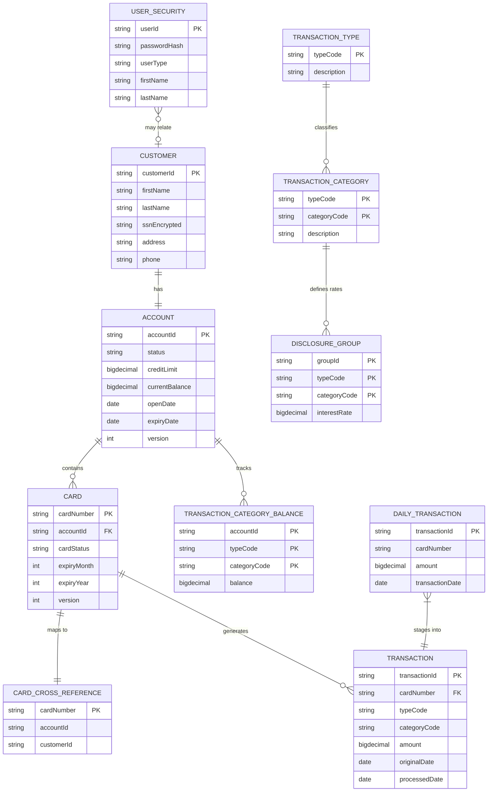
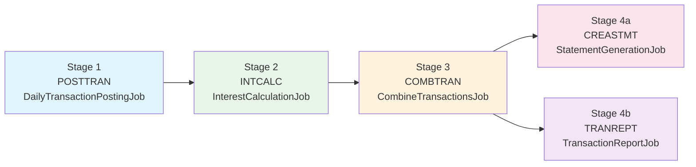

# CardDemo — New Developer Onboarding Guide

> **Goal:** Go from a clean machine to a running CardDemo application in under 30 minutes — no questions asked.

This guide walks you through every step needed to set up, build, run, and understand the CardDemo Java application. CardDemo is a fully operational credit card management system migrated from an AWS COBOL mainframe sample application (original source: [aws-samples/carddemo](https://github.com/aws-samples/aws-mainframe-modernization-carddemo), commit `27d6c6f`).

---

## Table of Contents

1. [Prerequisites](#1-prerequisites)
2. [Clone and Build](#2-clone-and-build)
3. [Local Environment Setup](#3-local-environment-setup)
4. [Health Verification](#4-health-verification)
5. [Observability Access](#5-observability-access)
6. [Run Full Test Suite](#6-run-full-test-suite)
7. [Domain Context — CardDemo Business Overview](#7-domain-context--carddemo-business-overview)
8. [Batch Pipeline Explanation](#8-batch-pipeline-explanation)
9. [Common Pitfalls](#9-common-pitfalls)
10. [How to Extend](#10-how-to-extend)
11. [Suggested Next Tasks (Future Development)](#11-suggested-next-tasks-future-development)

---

## 1. Prerequisites

Before starting, ensure the following tools are installed on your machine.

### 1.1 JDK 25 (Required)

CardDemo targets **Java 25 LTS** (released September 2025). You need Oracle JDK 25 or Eclipse Temurin 25.

**Install via SDKMAN (recommended):**

```bash
# Install SDKMAN if not already installed
curl -s "https://get.sdkman.io" | bash
source "$HOME/.sdkman/bin/sdkman-init.sh"

# Install Java 25 (Eclipse Temurin)
sdk install java 25-tem

# Verify
java -version
# Expected output: openjdk version "25..." (Temurin-25...)
```

**Alternative — Direct download:**

- [Eclipse Temurin 25](https://adoptium.net/temurin/releases/?version=25)
- [Oracle JDK 25](https://www.oracle.com/java/technologies/downloads/)

Set `JAVA_HOME` to the JDK 25 installation directory and add `$JAVA_HOME/bin` to your `PATH`.

### 1.2 Maven 3.9+ (Optional — Wrapper Included)

The project includes a Maven Wrapper (`./mvnw`), so you do **not** need to install Maven separately. The wrapper automatically downloads Maven 3.9.9 on first use.

If you prefer a global installation:

```bash
sdk install maven 3.9.9

# Verify
mvn -version
# Expected: Apache Maven 3.9.9
```

### 1.3 Docker and Docker Compose v2 (Required)

Docker is required for running local infrastructure (PostgreSQL, LocalStack, and the observability stack).

- **macOS / Windows:** Install [Docker Desktop](https://www.docker.com/products/docker-desktop/) (includes Docker Compose v2)
- **Linux:** Install Docker Engine and the Docker Compose plugin

```bash
# Verify Docker
docker --version
# Expected: Docker version 24.x or higher

# Verify Docker Compose v2
docker compose version
# Expected: Docker Compose version v2.x.x
```

### 1.4 AWS CLI (Optional)

Only needed for manual interaction with LocalStack (e.g., listing S3 buckets, inspecting SQS queues).

```bash
pip install awscli

# Configure a LocalStack profile (any dummy credentials work)
aws configure --profile localstack
# AWS Access Key ID: test
# AWS Secret Access Key: test
# Default region: us-east-1
# Output format: json

# Usage example (after infrastructure is running):
aws --endpoint-url=http://localhost:4566 --profile localstack s3 ls
```

### 1.5 Git (Required)

```bash
git --version
# Any recent version (2.30+) works
```

---

## 2. Clone and Build

### 2.1 Clone the Repository

```bash
git clone <repository-url> carddemo-java
cd carddemo-java
```

### 2.2 Build with Tests (Full Verification)

```bash
./mvnw clean verify
```

This single command performs:

- Compiles all Java 25 source files with `-Xlint:all` (zero-warning build)
- Runs all **unit tests** via Surefire
- Runs all **integration tests** via Failsafe (requires Docker for Testcontainers)
- Generates **JaCoCo code coverage** report (target: ≥80% line coverage)
- Runs **OWASP dependency-check** for CVE scanning

> **First run note:** The initial build downloads all Maven dependencies (~200+ JARs). Expect approximately 5 minutes for the first build. Subsequent builds are much faster.

### 2.3 Build without Tests (Quick Compile)

If you want to quickly verify compilation without running the full test suite:

```bash
./mvnw clean package -DskipTests
```

### 2.4 Resolve Dependencies Only

To download all dependencies without compiling:

```bash
./mvnw dependency:resolve -B
```

---

## 3. Local Environment Setup

The local development environment uses Docker Compose to run all infrastructure services.

### 3.1 Start Infrastructure

```bash
docker compose up -d
```

This starts the following services:

| Service       | Port(s)       | Purpose                                       |
|---------------|---------------|-----------------------------------------------|
| **PostgreSQL 16** | 5432      | Primary database (replaces VSAM KSDS datasets)|
| **LocalStack**    | 4566      | AWS S3, SQS, SNS emulation                    |
| **Jaeger**        | 16686     | Distributed tracing UI                         |
| **Prometheus**    | 9090      | Metrics collection and querying                |
| **Grafana**       | 3000      | Metrics dashboards and visualization           |

### 3.2 Wait for Health Checks

```bash
# Check all services are healthy
docker compose ps

# All services should show "healthy" or "running" status
```

### 3.3 Verify Individual Services

```bash
# Verify PostgreSQL is accepting connections
docker compose exec postgres pg_isready
# Expected: /var/run/postgresql:5432 - accepting connections

# Verify LocalStack is healthy
curl -s http://localhost:4566/_localstack/health | python3 -m json.tool
# Expected: JSON with service statuses showing "available" or "running"
```

### 3.4 Run the Application

```bash
./mvnw spring-boot:run -Dspring-boot.run.profiles=local
```

The `local` Spring profile configures:

- **PostgreSQL** connection to `localhost:5432`
- **AWS endpoints** pointing to LocalStack at `localhost:4566`
- **S3 path-style access** enabled (required for LocalStack)
- **Flyway migrations** run automatically on startup:
  - `V1__create_schema.sql` — Creates all 11 database tables
  - `V2__create_indexes.sql` — Creates primary and alternate indexes
  - `V3__seed_data.sql` — Loads all 9 ASCII fixture files as seed data

Once started, the application listens on **http://localhost:8080**.

### 3.5 Stop Everything

```bash
# Stop the application: Ctrl+C in the terminal running spring-boot:run

# Stop infrastructure
docker compose down

# Stop and remove volumes (clean slate)
docker compose down -v
```

---

## 4. Health Verification

After starting the application, verify it is running correctly.

### 4.1 Application Health

```bash
curl -s http://localhost:8080/actuator/health | python3 -m json.tool
```

**Expected response:**

```json
{
    "status": "UP",
    "components": {
        "db": { "status": "UP" },
        "diskSpace": { "status": "UP" },
        "s3": { "status": "UP" },
        "sqs": { "status": "UP" }
    }
}
```

### 4.2 Readiness and Liveness Probes

```bash
# Kubernetes-style readiness check
curl -s http://localhost:8080/actuator/health/readiness
# Expected: {"status":"UP"}

# Kubernetes-style liveness check
curl -s http://localhost:8080/actuator/health/liveness
# Expected: {"status":"UP"}
```

### 4.3 Metrics Endpoint

```bash
curl -s http://localhost:8080/actuator/prometheus | head -20
# Expected: Prometheus-format metrics (# HELP, # TYPE, metric_name value)
```

### 4.4 Quick API Test — Sign In

Test the authentication endpoint with default seed data credentials (originally from the COBOL DUSRSECJ.jcl inline user security records):

```bash
# Admin user sign-in
curl -s -X POST http://localhost:8080/api/auth/signin \
  -H 'Content-Type: application/json' \
  -d '{"userId":"ADMIN001","password":"PASSWORD"}' | python3 -m json.tool
```

**Expected response:**

```json
{
    "token": "<jwt-token>",
    "userType": "ADMIN",
    "firstName": "ADMIN",
    "lastName": "USER"
}
```

```bash
# Regular user sign-in
curl -s -X POST http://localhost:8080/api/auth/signin \
  -H 'Content-Type: application/json' \
  -d '{"userId":"USER0001","password":"PASSWORD"}' | python3 -m json.tool
```

> **Note:** These are test credentials from the seed data only. In a production deployment, passwords would be hashed with BCrypt on first use. The original COBOL application stored passwords in plaintext (constraint C-003); this migration upgrades to BCrypt hashing.

---

## 5. Observability Access

CardDemo ships with a full observability stack from day one. All components are accessible via the Docker Compose infrastructure.

### 5.1 Jaeger — Distributed Tracing

**URL:** [http://localhost:16686](http://localhost:16686)

- Select service **"carddemo"** from the dropdown
- Click **"Find Traces"** to see distributed traces across controllers, services, repositories, and AWS operations
- Each trace shows the full request lifecycle with timing breakdown

### 5.2 Prometheus — Metrics

**URL:** [http://localhost:9090](http://localhost:9090)

Useful queries for CardDemo metrics:

```promql
# Custom business metrics (prefixed with carddemo_)
carddemo_batch_records_processed_total
carddemo_batch_records_rejected_total
carddemo_auth_attempts_total
carddemo_transaction_amount_total_sum

# Spring Boot HTTP metrics
http_server_requests_seconds_count
http_server_requests_seconds_bucket

# JVM metrics
jvm_memory_used_bytes{area="heap"}
jvm_gc_pause_seconds_sum
```

### 5.3 Grafana — Dashboards

**URL:** [http://localhost:3000](http://localhost:3000)

**Default credentials:** admin / admin

**Import the CardDemo dashboard:**

1. Navigate to **Dashboards** → **Import**
2. Upload `docs/grafana-dashboard.json`
3. Select **Prometheus** as the data source
4. Click **Import**

The dashboard includes panels for:

- HTTP request rate, error rate, and response latency (P50/P95/P99)
- Batch job throughput and rejection rates
- Authentication attempt tracking
- JVM heap memory and GC pause durations
- HikariCP database connection pool status

### 5.4 Structured Logging

Application logs are output in structured JSON format with correlation IDs. Every HTTP request generates a unique `correlationId` propagated through the entire request lifecycle via MDC (Mapped Diagnostic Context).

Example log entry:

```json
{
    "timestamp": "2026-03-17T10:30:00.000Z",
    "level": "INFO",
    "logger": "com.cardemo.service.auth.AuthenticationService",
    "message": "User authenticated successfully",
    "correlationId": "abc-123-def-456",
    "traceId": "6a2b3c4d5e6f7a8b",
    "spanId": "1a2b3c4d5e6f"
}
```

---

## 6. Run Full Test Suite

### 6.1 Unit Tests Only

```bash
./mvnw test
```

Runs all JUnit 5 unit tests in `src/test/java/com/cardemo/unit/`. These tests use Mockito for dependency mocking and run without Docker.

### 6.2 Integration Tests (Requires Docker)

```bash
./mvnw verify -Pintegration
```

Integration tests use **Testcontainers** to automatically start isolated PostgreSQL and LocalStack containers. You do **not** need to run `docker compose up` separately — Testcontainers manages its own container lifecycle.

Test categories:

- `src/test/java/com/cardemo/integration/repository/` — JPA repository tests against real PostgreSQL
- `src/test/java/com/cardemo/integration/batch/` — Spring Batch job integration tests
- `src/test/java/com/cardemo/integration/aws/` — S3/SQS integration tests against LocalStack

### 6.3 End-to-End Tests

End-to-end tests are included in the integration test profile and exercise the full application stack:

- `BatchPipelineE2ETest.java` — Full 5-stage batch pipeline with real fixture data
- `OnlineTransactionE2ETest.java` — REST API end-to-end flows
- `GateVerificationTest.java` — Automated validation gate evidence collection

### 6.4 Coverage Report

After running tests, the JaCoCo coverage report is available at:

```
target/site/jacoco/index.html
```

Open this file in a browser to view line coverage by package and class. The project targets **≥80% line coverage** across all source packages.

### 6.5 OWASP Dependency Check

The OWASP dependency-check plugin scans all direct and transitive dependencies for known CVEs:

```bash
./mvnw org.owasp:dependency-check-maven:check
```

The report is generated at `target/dependency-check-report.html`. The project requires **zero critical or high-severity CVEs**.

---

## 7. Domain Context — CardDemo Business Overview

### 7.1 What Is CardDemo?

CardDemo is a **credit card management application** originally built as an AWS mainframe modernization reference application. It was written in COBOL and ran on z/OS with CICS for online transactions, VSAM for data storage, JCL for batch processing, and BMS for 3270 terminal screen definitions.

This Java migration preserves **100% behavioral parity** with the original COBOL application. Every business rule, validation, control flow, and data operation produces identical results for identical inputs.

**Original COBOL source:** [aws-samples/carddemo](https://github.com/aws-samples/aws-mainframe-modernization-carddemo) at commit `27d6c6f`

### 7.2 User Types and Access

The application supports two user roles:

| Role    | Access                                                                                   | Default User |
|---------|------------------------------------------------------------------------------------------|--------------|
| **ADMIN** | User administration (list, add, update, delete users) + admin menu                      | `ADMIN001`   |
| **USER**  | Account management, card management, transactions, bill payment, reports + main menu     | `USER0001`   |

Default password for both roles: `PASSWORD` (from seed data)

### 7.3 Business Domains

| Domain                  | Description                                                          | REST Endpoints                  |
|-------------------------|----------------------------------------------------------------------|---------------------------------|
| **Authentication**      | User sign-on with role-based access (ADMIN / USER)                   | `POST /api/auth/signin`        |
| **Account Management**  | View and update credit card accounts (balance, limits, customer info)| `GET/PUT /api/accounts/{id}`    |
| **Card Management**     | List, view, and update credit cards                                  | `GET/PUT /api/cards/*`          |
| **Transaction Processing** | List, view, and add transactions (with auto-ID generation)        | `GET/POST /api/transactions/*`  |
| **Bill Payment**        | Online bill payment with account balance updates                     | `POST /api/billing/pay`         |
| **Report Generation**   | Submit report criteria → SQS → batch processing                     | `POST /api/reports/submit`      |
| **User Administration** | CRUD operations for user accounts (ADMIN role only)                  | `CRUD /api/admin/users/*`       |
| **Batch Pipeline**      | 5-stage nightly batch processing                                     | Triggered via SQS or scheduler  |

### 7.4 Entity Relationships

The application manages 11 data entities mapped from the original VSAM datasets to PostgreSQL tables:



**Key relationships:**

- **Account ↔ Card:** One account can have multiple cards (1:N)
- **Card ↔ Transaction:** One card generates multiple transactions (1:N)
- **Card ↔ CardCrossReference:** One-to-one mapping for account/customer cross-referencing
- **Account ↔ Customer:** One-to-one relationship
- **Composite keys:** TransactionCategoryBalance (acctId + typeCode + catCode), DisclosureGroup (groupId + typeCode + catCode), TransactionCategory (typeCode + catCode)
- **DailyTransaction:** Staging table for unprocessed batch transactions
- **UserSecurity:** Independent authentication table

### 7.5 Technology Stack

| Layer                | Technology                                    | Purpose                                |
|----------------------|-----------------------------------------------|----------------------------------------|
| **Language**         | Java 25 LTS                                   | Application logic                      |
| **Framework**        | Spring Boot 3.5.x                             | Application framework and orchestration|
| **Web**              | Spring MVC                                    | REST API controllers                   |
| **Persistence**      | Spring Data JPA + Hibernate                   | ORM for PostgreSQL                     |
| **Database**         | PostgreSQL 16+                                | Primary data store                     |
| **Migrations**       | Flyway                                        | Schema version management              |
| **Batch**            | Spring Batch                                  | Batch job processing pipeline          |
| **Security**         | Spring Security + BCrypt                      | Authentication and authorization       |
| **AWS (Local)**      | Spring Cloud AWS + LocalStack                 | S3, SQS, SNS emulation                |
| **Tracing**          | Micrometer Tracing + OpenTelemetry            | Distributed tracing                    |
| **Metrics**          | Micrometer + Prometheus                       | Application and JVM metrics            |
| **Logging**          | SLF4J + Logback + Logstash Encoder            | Structured JSON logging                |
| **Testing**          | JUnit 5 + Mockito + Testcontainers            | Unit, integration, and E2E tests       |
| **Build**            | Maven 3.9+ (with wrapper)                     | Build automation and dependency management |
| **Containers**       | Docker + Docker Compose                       | Local infrastructure                   |

---

## 8. Batch Pipeline Explanation

The batch pipeline processes daily credit card transactions through a 5-stage sequential workflow. This replaces the original JCL job chain (POSTTRAN → INTCALC → COMBTRAN → CREASTMT/TRANREPT) with Spring Batch jobs orchestrated by `BatchPipelineOrchestrator`.

### 8.1 Pipeline Overview



**Sequential dependency:** Each stage waits for its predecessor to complete successfully before starting. Stages 4a and 4b execute **in parallel** after Stage 3 completes.

### 8.2 Stage 1: POSTTRAN — Daily Transaction Posting

**Spring Batch Job:** `DailyTransactionPostingJob`
**Original JCL:** `POSTTRAN.jcl` → program `CBTRN02C`

**What it does:**

1. **Reads** daily transaction records from S3 (replacing the DALYTRAN sequential PS dataset)
2. **Validates** each transaction through a 4-stage cascade:
   - **Stage 1 — Cross-reference lookup:** Validates the card number exists in the cross-reference table. Reject code `100` if not found.
   - **Stage 2 — Account lookup:** Validates the associated account exists and is active. Reject code `101` if not found.
   - **Stage 3 — Credit limit check:** Ensures the transaction amount does not exceed the account's available credit limit. Reject code `102` if exceeded.
   - **Stage 4 — Card expiry check:** Validates the card has not expired. Reject code `103` if expired.
3. **Posts** valid transactions to the PostgreSQL `transactions` table
4. **Updates** the account's `transaction_category_balance` records
5. **Writes** rejected transactions (with reason trailers) to an S3 rejection file

### 8.3 Stage 2: INTCALC — Interest Calculation

**Spring Batch Job:** `InterestCalculationJob`
**Original JCL:** `INTCALC.jcl` → program `CBACT04C`

**What it does:**

1. **Reads** all transaction category balance records
2. **Looks up** the applicable interest rate from the disclosure group table
   - Uses a `DEFAULT` group as a fallback if no specific group matches
3. **Computes** interest using the exact COBOL formula (preserved without algebraic simplification):
   ```
   interest = (balance × rate) / 1200
   ```
   - Uses `BigDecimal` with `RoundingMode.HALF_EVEN` (banker's rounding)
4. **Writes** computed interest as system-generated transactions

### 8.4 Stage 3: COMBTRAN — Combine Transactions

**Spring Batch Job:** `CombineTransactionsJob`
**Original JCL:** `COMBTRAN.jcl` → `DFSORT` + `IDCAMS REPRO` (no COBOL program — pure utility)

**What it does:**

1. **Sorts** the combination of backup transactions and system-generated transactions (from interest calculation) by transaction ID
   - Uses a Java `Comparator` matching the original DFSORT specification: `SORT FIELDS=(TRAN-ID,A)`
2. **Merges** the sorted records into the main transaction table via bulk JPA insert
   - Replaces the original IDCAMS `REPRO INFILE(TRANSACT) OUTFILE(TRANVSAM)` operation

### 8.5 Stage 4a: CREASTMT — Statement Generation (Parallel)

**Spring Batch Job:** `StatementGenerationJob`
**Original JCL:** `CREASTMT.JCL` → program `CBSTM03A` (with subroutine `CBSTM03B`)

**What it does:**

1. **Reads** transactions sorted by card number and transaction ID
2. **Looks up** account and customer information for each card via cross-reference
3. **Generates** statements in two formats:
   - **Plain text** (fixed-width, 80 chars/line) → S3 output
   - **HTML** (formatted for display) → S3 output
4. **Buffers** transactions per card in memory before producing the statement

### 8.6 Stage 4b: TRANREPT — Transaction Report (Parallel)

**Spring Batch Job:** `TransactionReportJob`
**Original JCL:** `TRANREPT.jcl` → program `CBTRN03C`

**What it does:**

1. **Filters** transactions by date range (configurable start/end dates)
2. **Sorts** filtered transactions by card number
3. **Enriches** each transaction with type and category descriptions
4. **Produces** a formatted report (133-char fixed-width lines) with:
   - Per-card transaction detail
   - Per-account subtotals
   - Per-page subtotals
   - Grand totals
5. **Writes** the report to S3

---

## 9. Common Pitfalls

### 9.1 BigDecimal Precision

**Rule:** Always use `BigDecimal` for financial amounts. Never use `float` or `double`.

```java
// CORRECT — BigDecimal for monetary values
BigDecimal amount = new BigDecimal("100.50");
BigDecimal rate = new BigDecimal("18.99");
BigDecimal interest = amount.multiply(rate)
    .divide(new BigDecimal("1200"), 2, RoundingMode.HALF_EVEN);

// WRONG — floating-point loses precision
double amount = 100.50;  // DO NOT DO THIS for financial fields
```

**Comparison trap:** `BigDecimal.equals()` is scale-sensitive. Always use `compareTo()`:

```java
// CORRECT
if (amount.compareTo(BigDecimal.ZERO) > 0) { ... }

// WRONG — equals() considers scale: new BigDecimal("1.0").equals(new BigDecimal("1.00")) is FALSE
if (amount.equals(BigDecimal.ZERO)) { ... }  // DO NOT DO THIS
```

### 9.2 LocalStack S3 Path-Style Access

LocalStack requires **path-style S3 access** instead of DNS-style virtual hosting. The `application-local.yml` profile sets:

```yaml
spring:
  cloud:
    aws:
      s3:
        path-style-access-enabled: true
```

Without this setting, S3 operations will fail locally with DNS resolution errors like `bucket-name.localhost:4566` not resolving.

### 9.3 Testcontainers Docker Socket Permissions

**Linux:** Ensure your user is in the `docker` group:

```bash
sudo usermod -aG docker $USER
# Log out and back in for the change to take effect
```

**macOS:** Docker Desktop must be running before executing integration tests.

**CI/CD:** Most CI environments (GitHub Actions, GitLab CI) have Docker pre-configured. If using a Docker-in-Docker setup, ensure the Docker socket is mounted.

### 9.4 Flyway Migration Ordering

Flyway migrations are versioned and run in order: `V1` → `V2` → `V3` → `V{N}`.

**Critical rules:**

- **Never modify** an already-applied migration. Flyway checksums each migration; changing an applied migration causes a startup failure.
- **Always create a new** `V{N+1}__description.sql` file for schema changes.
- If you need to fix seed data, create `V4__fix_seed_data.sql` — do not edit `V3__seed_data.sql`.

### 9.5 Optimistic Locking Exceptions

The `Account` and `Card` entities use JPA `@Version` for optimistic concurrency control (replacing the COBOL READ-UPDATE snapshot comparison pattern from `COACTUPC.cbl` and `COCRDUPC.cbl`).

When two concurrent requests update the same record, the second request receives an `OptimisticLockException`, which the service layer translates to **HTTP 409 Conflict**.

**Client handling:** Retry the request after re-fetching the latest version of the record.

### 9.6 Spring Batch Job Restart

Spring Batch jobs that fail do **not** auto-retry. A failed job instance remains in `FAILED` status in the Spring Batch metadata tables.

**To restart a failed job:**

1. Fix the root cause of the failure
2. Use the Spring Batch actuator endpoint or programmatic restart
3. Spring Batch will resume from the last successful checkpoint (chunk)

**To re-run a completed job with new parameters:**

Pass a different set of job parameters (e.g., a new `run.date` parameter) to create a new job instance.

### 9.7 Spring Profile Activation

Always specify the correct Spring profile for your environment:

| Environment       | Profile   | Command                                                        |
|-------------------|-----------|----------------------------------------------------------------|
| Local development | `local`   | `./mvnw spring-boot:run -Dspring-boot.run.profiles=local`     |
| Integration tests | `test`    | Automatically set by `application-test.yml` in test resources  |
| Production        | `default` | No profile needed; uses `application.yml` defaults             |

Forgetting to set the `local` profile causes the application to attempt connections to real AWS endpoints instead of LocalStack.

---

## 10. How to Extend

### 10.1 Adding a New Entity

Follow these steps to add a new database-backed entity to the application:

1. **Create the JPA entity** in `src/main/java/com/cardemo/model/entity/`:

   ```java
   @Entity
   @Table(name = "new_entities")
   public class NewEntity {
       @Id
       private String id;
       // fields with BigDecimal for any monetary/decimal values
       @Version
       private Integer version; // if optimistic locking is needed
   }
   ```

2. **Create the JPA repository** in `src/main/java/com/cardemo/repository/`:

   ```java
   public interface NewEntityRepository extends JpaRepository<NewEntity, String> {
       // Add custom query methods as needed
   }
   ```

3. **Create a Flyway migration** in `src/main/resources/db/migration/`:

   ```sql
   -- V{N}__add_new_entity.sql
   CREATE TABLE new_entities (
       id VARCHAR(50) PRIMARY KEY,
       -- columns matching entity fields
       version INTEGER DEFAULT 0
   );
   ```

4. **Create DTOs** in `src/main/java/com/cardemo/model/dto/`:

   ```java
   public record NewEntityDto(String id, /* fields */) {}
   ```

5. **Create a service** in `src/main/java/com/cardemo/service/{domain}/`:

   ```java
   @Service
   @Transactional(readOnly = true)
   public class NewEntityService {
       private final NewEntityRepository repository;
       // business logic methods
   }
   ```

6. **Create a controller** in `src/main/java/com/cardemo/controller/`:

   ```java
   @RestController
   @RequestMapping("/api/new-entities")
   public class NewEntityController {
       private final NewEntityService service;
       // endpoint methods
   }
   ```

7. **Add tests:**
   - Unit test for the service in `src/test/java/com/cardemo/unit/service/`
   - Integration test for the repository in `src/test/java/com/cardemo/integration/repository/`
   - API integration test in `src/test/java/com/cardemo/integration/`

### 10.2 Adding a Batch Job

1. **Create a Job configuration** in `src/main/java/com/cardemo/batch/jobs/`:

   ```java
   @Configuration
   public class NewBatchJobConfig {
       @Bean
       public Job newBatchJob(JobRepository jobRepository,
                              Step newBatchStep) {
           return new JobBuilder("newBatchJob", jobRepository)
               .start(newBatchStep)
               .build();
       }

       @Bean
       public Step newBatchStep(JobRepository jobRepository,
                                PlatformTransactionManager transactionManager) {
           return new StepBuilder("newBatchStep", jobRepository)
               .<InputType, OutputType>chunk(100, transactionManager)
               .reader(newItemReader())
               .processor(newItemProcessor())
               .writer(newItemWriter())
               .build();
       }
   }
   ```

2. **Create ItemReader, ItemProcessor, ItemWriter** as needed in `batch/readers/`, `batch/processors/`, `batch/writers/`

3. **Register in `BatchConfig.java`** if the job needs special infrastructure configuration

4. **Add a Spring Batch integration test** in `src/test/java/com/cardemo/integration/batch/`:

   ```java
   @SpringBatchTest
   @SpringBootTest
   class NewBatchJobIT {
       @Autowired
       private JobLauncherTestUtils jobLauncherTestUtils;

       @Test
       void shouldProcessRecordsSuccessfully() {
           JobExecution execution = jobLauncherTestUtils.launchJob();
           assertThat(execution.getExitStatus()).isEqualTo(ExitStatus.COMPLETED);
       }
   }
   ```

### 10.3 Adding an API Endpoint

1. **Add a method** to an existing `@RestController` or create a new one:

   ```java
   @GetMapping("/{id}/summary")
   public ResponseEntity<SummaryDto> getSummary(@PathVariable String id) {
       return ResponseEntity.ok(service.getSummary(id));
   }
   ```

2. **Create or update DTOs** for request/response payloads

3. **Implement the service method** with full business logic

4. **Add validation annotations** (`@Valid`, `@NotNull`, `@Size`, etc.)

5. **Add tests:**
   - Unit test for the service method
   - Integration test hitting the endpoint via `MockMvc` or `WebTestClient`

6. **Update `docs/api-contracts.md`** with the new endpoint documentation

---

## 11. Suggested Next Tasks (Future Development)

The following enhancements are recommended for future development. They were identified during the migration but are **out of scope** for the initial migration deliverable (per AAP §0.3.2 — no feature expansion).

### 11.1 Swagger / OpenAPI Documentation

Add automatic API documentation generation:

```xml
<dependency>
    <groupId>org.springdoc</groupId>
    <artifactId>springdoc-openapi-starter-webmvc-ui</artifactId>
    <version>2.8.x</version>
</dependency>
```

This provides a Swagger UI at `/swagger-ui.html` and an OpenAPI spec at `/v3/api-docs`.

### 11.2 Cursor-Based Pagination

The current pagination uses offset-based paging (matching the original COBOL browse behavior with page up/down). For better API performance at scale, consider implementing cursor-based pagination using keyset/seek-style queries.

### 11.3 Redis Caching for Reference Data

Transaction types, transaction categories, and disclosure groups are read-only reference data that rarely changes. Adding a Redis cache layer would eliminate repeated database queries:

```java
@Cacheable(value = "transactionTypes", key = "#typeCode")
public TransactionType findByTypeCode(String typeCode) { ... }
```

### 11.4 Async Batch Job Submission via REST API

Currently, batch jobs are triggered via SQS messages or scheduled execution. Adding a REST endpoint (`POST /api/batch/jobs/{jobName}/run`) would allow manual triggering with parameter control.

### 11.5 Database Connection Pooling Tuning

Document and tune HikariCP connection pool settings for production workloads:

```yaml
spring:
  datasource:
    hikari:
      maximum-pool-size: 20       # Adjust based on load testing
      minimum-idle: 5
      idle-timeout: 300000        # 5 minutes
      connection-timeout: 30000   # 30 seconds
      max-lifetime: 1800000       # 30 minutes
```

---

## Quick Reference Card

| Task                        | Command                                                                 |
|-----------------------------|-------------------------------------------------------------------------|
| Build (full)                | `./mvnw clean verify`                                                   |
| Build (quick, no tests)     | `./mvnw clean package -DskipTests`                                      |
| Start infrastructure        | `docker compose up -d`                                                  |
| Stop infrastructure         | `docker compose down`                                                   |
| Run application             | `./mvnw spring-boot:run -Dspring-boot.run.profiles=local`              |
| Run unit tests              | `./mvnw test`                                                           |
| Run all tests               | `./mvnw verify -Pintegration`                                           |
| Check health                | `curl http://localhost:8080/actuator/health`                            |
| View traces                 | Open http://localhost:16686                                              |
| View metrics                | Open http://localhost:9090                                               |
| View dashboards             | Open http://localhost:3000                                               |
| OWASP CVE check             | `./mvnw org.owasp:dependency-check-maven:check`                        |
| Coverage report             | Open `target/site/jacoco/index.html`                                    |

---

## Related Documentation

| Document                                           | Description                                          |
|----------------------------------------------------|------------------------------------------------------|
| [README.md](../README.md)                          | Project overview and top-level instructions           |
| [DECISION_LOG.md](../DECISION_LOG.md)              | All non-trivial architectural decisions with rationale|
| [TRACEABILITY_MATRIX.md](../TRACEABILITY_MATRIX.md)| Bidirectional COBOL paragraph → Java method mapping  |
| [docs/api-contracts.md](api-contracts.md)          | REST API endpoint specifications                      |
| [docs/architecture-before-after.md](architecture-before-after.md) | Before/after Mermaid architecture diagrams |
| [docs/validation-gates.md](validation-gates.md)    | Gate 1–8 evidence documentation                      |
| [docs/executive-presentation.html](executive-presentation.html) | reveal.js executive summary slides         |
| [docs/grafana-dashboard.json](grafana-dashboard.json) | Grafana dashboard template for import              |
