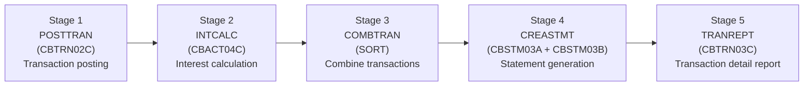

# Onboarding Guide

> **Goal of this guide:** take you from a **clean machine to a running, modifiable
> application** — with no prior knowledge of the project and without having to ask
> anyone a question.

This is the **detailed** onboarding and continued-development guide for CardDemo. The repository
root `README.md` is the concise front door and links here; this document is the full
walkthrough — prerequisites, the golden clone-build-run path, domain context, the pitfalls that
bite newcomers, extension recipes, and the suggested next tasks. It complements the README rather
than duplicating it.

## Table of Contents

1. [Introduction & Scope](#1-introduction-scope)
2. [Prerequisites (clean machine)](#2-prerequisites-clean-machine)
3. [Environment Variables](#3-environment-variables)
4. [Clone, Build, and Run — the Golden Path](#4-clone-build-and-run-the-golden-path)
5. [Service Endpoints & Ports](#5-service-endpoints-ports)
6. [Domain Context (credit-card management)](#6-domain-context-credit-card-management)
7. [Common Pitfalls](#7-common-pitfalls)
8. [How to Extend the Project](#8-how-to-extend-the-project)
9. [Suggested Next Tasks](#9-suggested-next-tasks)
10. [Where to Go Next](#10-where-to-go-next)

---

## 1. Introduction & Scope

CardDemo is a **credit-card management workload** — accounts, cards, transactions, and bill
payments — that was migrated from AWS's original COBOL / CICS / VSAM / JCL / BMS mainframe
reference application into an idiomatic **Java 25 LTS + Spring Boot 3.5.16** system. The target is
a **headless REST backend plus a Spring Batch pipeline**: there is **no browser UI and no design
system** — the 17 legacy 3270 terminal screens are exposed as JSON APIs. The migration targets
**100% behavioral parity** with the frozen COBOL source, preserving decimal fidelity, control-flow
semantics, and every external interface contract.

The **COBOL source is not part of this repository**. It is retained read-only as the migration's
source of truth and referenced by commit SHA `27d6c6f` (full
`7756d895ffeb65f7ea72aaa609e356d9899afcec`); the traceability matrix maps every COBOL paragraph to
its Java counterpart against that SHA. (In this working tree the legacy artifacts are mirrored
read-only under `app/` for convenient reference, but they are never built or run by the Java
target.)

**Key pinned versions** (all managed in `pom.xml`; the root `README.md` technology-stack
table and [`project-guide.md`](project-guide.md) hold the full matrix): **Java 25 LTS**,
**Spring Boot 3.5.16**, **Maven 3.9.9**, **PostgreSQL 16**, **Flyway 11.x**, **Spring Cloud AWS
3.3.0**, and **Testcontainers 2.0.3**.

For deeper detail beyond this guide:

- [`decision-log.md`](decision-log.md) — every non-trivial decision, its alternatives, rationale, and residual risk.
- [`traceability-matrix.md`](traceability-matrix.md) — the 100% bidirectional COBOL-paragraph ↔ Java-method mapping.
- [`architecture/overview.md`](architecture/overview.md) — the before/after architecture (with component-interaction and data-flow companions).
- [`project-guide.md`](project-guide.md) — delivery status, metrics, risks, and the operational runbook.
- [`technical-specifications.md`](technical-specifications.md) — the authoritative technical blueprint for the migration.

---

## 2. Prerequisites (clean machine)

Install the following before you begin. Every tool is checked with a one-line command so you can
confirm your machine is ready.

| Tool | Required version | Verify with |
| :--- | :--------------- | :---------- |
| **Java (JDK)** | **25 LTS** | `java -version` → reports `25` |
| **Apache Maven** | **3.9.9** (or the bundled `./mvnw` wrapper, if present) | `mvn -v` |
| **Docker + Docker Compose** | Docker 28.x, Compose v2 plugin | `docker compose version` |
| **AWS CLI** *(optional)* | v2 (or `awslocal`) | `aws --version` |

**Set `JAVA_HOME`** so Maven and Spring Boot use JDK 25 (adjust the path to your install):

```bash
export JAVA_HOME=/usr/lib/jvm/java-25-openjdk-amd64
java -version   # must report a 25.x.x build
```

**Docker + Docker Compose** run the local infrastructure stack (PostgreSQL 16, LocalStack, Jaeger,
Prometheus, Grafana). A reachable Docker daemon is also required by the integration tests, which
use Testcontainers (see [Common Pitfalls](#7-common-pitfalls)).

**The AWS CLI is optional** — you only need it (or the `awslocal` wrapper) if you want to poke
LocalStack by hand. The application and its tests talk to LocalStack directly.

### LocalStack authentication token — optional (Pro only)

The bundled local stack pins the **LocalStack community image** (`localstack/localstack:4`), which
provides everything this migration uses — **S3, SQS (FIFO), and SNS** — and requires **no
authentication token**. You can therefore run the entire stack **with zero credentials**.

`LOCALSTACK_AUTH_TOKEN` is **optional** and only needed if you deliberately opt into **LocalStack
Pro**. If you do, export it in your shell — **never hardcode it** in a file:

```bash
export LOCALSTACK_AUTH_TOKEN="<your-localstack-pro-token>"   # optional; Pro only
```

`docker-compose.yml` reads this variable from your environment and defaults it to empty, so
omitting it is fully supported and `docker compose up` still succeeds.

### Zero live AWS

There are **no live AWS credentials anywhere** in this project — not in tests, not in local
development, not in CI. Every S3 / SQS / SNS interaction runs against **LocalStack only**. The
`AWS_ACCESS_KEY_ID` / `AWS_SECRET_ACCESS_KEY` values used locally are deliberate dummies (`test`)
that satisfy the SDK's credential-provider chain while talking exclusively to
`http://localhost:4566`.

---

## 3. Environment Variables

Most variables have working defaults for local development (they come from `docker-compose.yml` and
the `local` Spring profile), so a clean run needs very little configuration. Real secrets are always
supplied via **environment variables or a vault — never hardcoded**.

| Variable | Required? | Default | Purpose |
| :------- | :-------- | :------ | :------ |
| `JAVA_HOME` | **Yes** | system default | Path to the JDK 25 installation used by Maven and the app. |
| `LOCALSTACK_AUTH_TOKEN` | No¹ | *(empty)* | LocalStack **Pro** auth token. Not needed for the bundled community image. |
| `SPRING_PROFILES_ACTIVE` | No | `local` | Active Spring profile; defaults to `local` (the golden path). Override to `prod` for production or `test` for integration tests. |
| `SERVER_PORT` | No | `8080` | Port the Spring Boot application listens on. |
| `POSTGRES_DB` | No | `carddemo` | PostgreSQL database name. |
| `POSTGRES_USER` | No | `carddemo` | PostgreSQL username. |
| `POSTGRES_PASSWORD` | No | `carddemo` | PostgreSQL password (dev-only default — not a production secret). |
| `AWS_REGION` / `AWS_DEFAULT_REGION` | No | `us-east-1` | Region used for LocalStack buckets/queues/topics. |
| `AWS_ACCESS_KEY_ID` | No | `test` | Dummy access key used **only** to talk to LocalStack. |
| `AWS_SECRET_ACCESS_KEY` | No | `test` | Dummy secret key used **only** to talk to LocalStack. |

> ¹ `LOCALSTACK_AUTH_TOKEN` is **optional** — required only if you switch to the LocalStack Pro
> image. The default community image (`localstack/localstack:4`) needs no token, and
> `docker compose up` works without it.

---

## 4. Clone, Build, and Run — the Golden Path

Follow these steps in order, from the repository root. Every command is copy-paste runnable.

### Step 1 — Clone the repository

```bash
git clone <repository-url>
cd carddemo
```

### Step 2 — (Optional) export the LocalStack Pro token

Skip this unless you are opting into LocalStack Pro (see
[Prerequisites](#2-prerequisites-clean-machine)). The bundled community image needs no token.

```bash
export LOCALSTACK_AUTH_TOKEN="<your-localstack-pro-token>"   # optional; Pro only
```

### Step 3 — Start the local infrastructure stack

```bash
docker compose up -d
```

This starts exactly **five** services — **PostgreSQL 16**, **LocalStack** (S3 / SQS / SNS),
**Jaeger**, **Prometheus**, and **Grafana**. The Spring Boot application itself is **not** a
Compose service; you run it on the host in Step 5. Wait until the containers report healthy:

```bash
docker compose ps
```

### Step 4 — Build and test

```bash
mvn clean verify
```

`mvn clean verify` compiles the project under `-Xlint:all` (**zero compiler warnings**, Gate 2),
runs the **JUnit 5 unit tests** and the **Testcontainers/LocalStack integration tests**, and
enforces **JaCoCo line coverage ≥ 80%** (Gate 8). The integration tests spin up their **own**
throwaway PostgreSQL and LocalStack containers via Testcontainers, so they do not depend on the
Compose stack from Step 3.

### Step 5 — Run the application (local profile)

```bash
mvn spring-boot:run -Dspring-boot.run.profiles=local
```

(The equivalent `-Dspring.profiles.active=local` also works.) On startup, **Flyway** applies the
database migrations automatically — `V1__schema.sql` (11 tables), `V2__indexes.sql`, and
`V3__seed_data.sql` (seed data derived from the ASCII fixtures) are all applied — after which the
app begins listening on `http://localhost:8080`.

### Step 6 — Verify it is up

```bash
curl -s http://localhost:8080/actuator/health
# Expected: {"status":"UP"}
```

You can also scrape metrics with `curl -s http://localhost:8080/actuator/prometheus`.

### Step 7 — Sign in with a seed login

Two users are seeded for local development. Passwords are **BCrypt-hashed at rest** (a logged
security upgrade over the legacy plaintext `USRSEC` model — see decision
[`D-002`](decision-log.md)):

| Role | User ID | Password |
| :--- | :------ | :------- |
| **Admin User** | `ADMIN001` | `PASSWORD` |
| **Regular User** | `USER0001` | `PASSWORD` |

```bash
curl -s -X POST http://localhost:8080/api/auth/login \
  -H "Content-Type: application/json" \
  -d '{"userId": "USER0001", "password": "PASSWORD"}'
# Expected: 200 OK with a JWT token in the response body
```

Use the returned JWT as a `Authorization: Bearer <token>` header on subsequent calls.

### AWS resources: how they get created (important nuance)

The `docker-compose.yml` **does not ship a LocalStack init hook** — there is no `init-aws.sh`
script and none is mounted. Instead, the code that needs an AWS resource creates it:

- **Integration tests self-provision.** Every integration test that touches AWS creates its own S3
  buckets and SQS queues in `@BeforeAll` and tears them down in `@AfterAll`, using the
  Testcontainers LocalStack module. Tests never rely on pre-existing LocalStack state.
- **Manual local runs.** If you want buckets/queues for ad-hoc CLI poking against the running
  Compose stack, create them yourself. With the LocalStack CLI (`awslocal`):

  ```bash
  awslocal s3 mb s3://carddemo-batch-input
  awslocal s3 mb s3://carddemo-batch-output
  awslocal s3 mb s3://carddemo-statements
  awslocal sqs create-queue \
    --queue-name carddemo-report-jobs.fifo \
    --attributes FifoQueue=true,ContentBasedDeduplication=true
  ```

  Or with the standard AWS CLI, pointing at the LocalStack endpoint:

  ```bash
  aws --endpoint-url http://localhost:4566 s3 mb s3://carddemo-batch-input
  aws --endpoint-url http://localhost:4566 s3 mb s3://carddemo-batch-output
  aws --endpoint-url http://localhost:4566 s3 mb s3://carddemo-statements
  aws --endpoint-url http://localhost:4566 sqs create-queue \
    --queue-name carddemo-report-jobs.fifo \
    --attributes FifoQueue=true,ContentBasedDeduplication=true
  ```

> **Do not** go looking for an init script to run — there isn't one, and that is by design.

---

## 5. Service Endpoints & Ports

After `docker compose up -d` (and Step 5 for the app itself), these are the endpoints you will use.
Host ports match `docker-compose.yml` and the [`project-guide.md`](project-guide.md) port reference.

| Service | URL / Port | Notes |
| :------ | :--------- | :---- |
| **Application (REST + Actuator)** | `http://localhost:8080` | `/actuator/health`, `/actuator/prometheus` |
| **PostgreSQL 16** | `localhost:5432` | database / user / password all `carddemo` (dev defaults) |
| **LocalStack (S3 / SQS / SNS)** | `http://localhost:4566` (also `http://localhost.localstack.cloud:4566`) | zero live AWS; single edge port fronts all three services |
| **Jaeger UI / OTLP** | `16686` (UI), `4317` (OTLP gRPC), `4318` (OTLP HTTP) | distributed traces across REST → service → repository → AWS |
| **Prometheus** | `http://localhost:9090` | scrapes the app's `/actuator/prometheus` endpoint |
| **Grafana** | `http://localhost:3000` | dev login `admin` / `admin`; the CardDemo dashboard is pre-provisioned |

---

## 6. Domain Context (credit-card management)

CardDemo lets users manage **accounts, credit cards, transactions, and bill payments**. The
behavior is bounded by a documented set of **22 features (F-001 through F-022)** — the migration
delivers exactly this scope, with **no feature expansion**.

### User roles

There are two roles (use the seed logins from
[Step 7](#step-7-sign-in-with-a-seed-login) above):

- **Regular User** — the back-office user functions: viewing and updating accounts, listing/viewing/updating cards, listing/viewing/adding transactions, running reports, and bill payment.
- **Admin User** — the administrative functions: user management (list / add / update / delete users).

### Online: 17 legacy screens → 8 REST controllers

The 17 legacy CICS transactions (BMS 3270 screens) are served as JSON APIs by **8 REST
controllers** (there is no terminal or browser UI):

| REST Controller | Replaces (legacy transactions / programs) |
| :-------------- | :----------------------------------------- |
| `AuthController` | Signon `CC00` (COSGN00C) → JWT issuance |
| `MenuController` | Main Menu `CM00` (COMEN01C) + Admin Menu `CA00` (COADM01C) |
| `AccountController` | Account View `CAVW` (COACTVWC) + Account Update `CAUP` (COACTUPC) |
| `CardController` | Card List `CCLI` (COCRDLIC) + View `CCDL` (COCRDSLC) + Update `CCUP` (COCRDUPC) |
| `TransactionController` | Txn List `CT00` (COTRN00C) + View `CT01` (COTRN01C) + Add `CT02` (COTRN02C) |
| `ReportController` | Transaction Reports `CR00` (CORPT00C) → SQS-triggered batch launch |
| `BillPaymentController` | Bill Payment `CB00` (COBIL00C) |
| `UserController` | User CRUD `CU00`–`CU03` (COUSR00C/01C/02C/03C) |

Pseudo-conversational CICS `COMMAREA` state becomes **stateless REST + JWT**; the read-then-rewrite
optimistic-concurrency pattern of the account and card updates is preserved with JPA `@Version`.

### Batch: the five-stage pipeline

The JCL batch monolith becomes a five-stage Spring Batch pipeline; the execution order is preserved
exactly. See [`traceability-matrix.md`](traceability-matrix.md) for the full paragraph → method map.



**Diagram — CardDemo Batch Pipeline.** *Legend:* each box is one pipeline stage, labelled with its
legacy JCL job name, the originating COBOL program (in parentheses), and its function; the solid
left-to-right arrows denote the preserved execution order. JCL `COND`-code sequencing becomes a
`JobExecutionDecider` + `FlowBuilder`; the `SORT` step becomes a Java `Comparator`.

Supporting print/reference programs — CBACT01C (account), CBACT02C (card), CBACT03C (xref),
CBCUS01C (customer), CBTRN01C (transaction) — become batch print steps, and CSUTLDTC
(LE `CEEDAYS` date validation) becomes `DateValidationService` built on `java.time.LocalDate`.

### Mapping glossary (mainframe → Spring/Java)

Keep this table handy — it is the Rosetta Stone for reading the code against the COBOL source.

| Legacy construct | Target pattern |
| :--------------- | :------------- |
| VSAM KSDS (keyed file) | PostgreSQL table (`@Entity` + `JpaRepository`) |
| BMS map (3270 screen) | REST JSON endpoint (`@RestController` + DTOs) |
| `COMMAREA` (pseudo-conversational state) | Stateless REST + JWT / session state |
| TDQ (Transient Data Queue) | AWS **SQS FIFO** |
| GDG (Generation Data Group) | Versioned **S3** object |
| `COMP-3` / `PIC S9(n)V99` (packed decimal) | `java.math.BigDecimal` (matching scale, `RoundingMode.HALF_UP`) |
| `SYNCPOINT ROLLBACK` | `@Transactional(rollbackFor = ...)` |
| `FILE STATUS` code | Typed exception hierarchy + status enums (EOF `'10'` = normal loop end) |

---

## 7. Common Pitfalls

These are the mistakes that most commonly trip up newcomers. Read them before you write code.

### 7.1 Decimal precision — money is never `float`/`double` (read this first)

The single most common footgun. Every monetary or financial value maps to
**`java.math.BigDecimal`** with a **scale that matches the COBOL picture**, and arithmetic applies
an **explicit `RoundingMode` (default `HALF_UP`)**. For example, account balances and limits
(`PIC S9(10)V99`) and transaction amounts (`TRAN-AMT PIC S9(09)V99`) are `BigDecimal` **scale 2**,
persisted as `NUMERIC(p,s)`.

Using `float` or `double` for money is **prohibited**, and a **mismatched scale breaks Gate 1
byte-parity** against the COBOL baseline. When you compute a monetary result, set the scale
explicitly:

```java
BigDecimal newBalance = currentBalance
        .add(transactionAmount)
        .setScale(2, RoundingMode.HALF_UP);
```

### 7.2 EBCDIC vs ASCII fixtures — use the ASCII ones

The **9 ASCII fixtures** under `app/data/ASCII/` (e.g. `acctdata.txt`, `carddata.txt`,
`custdata.txt`, `dailytran.txt`) **drive the migration and seed the database** (Flyway
`V3__seed_data.sql`). The **13 EBCDIC files** under `app/data/EBCDIC/` are **reference-only** — do
**not** feed them to the loaders or seed scripts. Loading EBCDIC bytes as if they were ASCII yields
garbage.

### 7.3 LocalStack endpoint configuration

Point the AWS SDK / Spring Cloud AWS clients at the LocalStack endpoint
(`http://localhost:4566`) — **never real AWS** — and use **path-style S3 access**
(`bucket` in the path, not the host). The `local` and `test` profiles already configure this for
you. Remember the bundled community image needs **no** `LOCALSTACK_AUTH_TOKEN`; only export a token
if you deliberately switch to LocalStack Pro (see [Prerequisites](#2-prerequisites-clean-machine)).

### 7.4 Testcontainers needs a reachable Docker daemon

The integration tests (`mvn verify`) use Testcontainers to start their own PostgreSQL and LocalStack
containers, so they require a **running Docker daemon your user can talk to**. If tests fail with
*"connection refused"* or a Docker socket error, confirm Docker is running and your user has
permission to access the Docker socket (on Docker Desktop, ensure it is started; on Linux, ensure
your user is in the `docker` group or the socket is accessible).

### 7.5 Flyway migration ordering — never edit an applied migration

Flyway applies migrations in version order: **`V1__schema.sql` → `V2__indexes.sql` →
`V3__seed_data.sql`**. Once a migration has been applied to any database, **never edit it** — Flyway
validates a checksum and will refuse to start if an applied migration changed. To change the schema
or seed data, **add a new versioned file** (e.g. `V4__...sql`) instead.

---

## 8. How to Extend the Project

The codebase follows a layered package layout under `com.carddemo`:

```
com.carddemo.{entity, repository, service, controller, dto, batch, config, exception, observability}
```

Three common recipes follow. Whatever you build, **record the rationale for any non-trivial
decision in [`decision-log.md`](decision-log.md)** — rationale lives in the decision log, **not in
code comments** — and keep [`traceability-matrix.md`](traceability-matrix.md) in sync.

### (a) Add a new JPA entity

1. Identify the source record layout (a COBOL copybook under `app/cpy/`) and its fixed byte length.
2. Create the `@Entity` in `com.carddemo.entity`, mapping every field. Monetary/`COMP-3` fields
   become `BigDecimal` with the **matching scale** (see [pitfall 7.1](#71-decimal-precision-money-is-never-floatdouble-read-this-first)); add `@Version` if the record participates in a read-then-rewrite update.
3. Add a `JpaRepository` in `com.carddemo.repository`; express any VSAM alternate index (AIX/PATH)
   as a derived query or `@Query` method.
4. Add a **new** Flyway migration (`V4__...sql`, etc.) that creates the table with `NUMERIC(p,s)`
   columns — do not edit an applied migration ([pitfall 7.5](#75-flyway-migration-ordering-never-edit-an-applied-migration)).
5. Add unit tests, and a row in the traceability matrix.

### (b) Add a REST endpoint

1. Create or extend a `@RestController` in `com.carddemo.controller`, defining the JSON contract
   with request/response **DTOs** in `com.carddemo.dto` and **Jakarta Validation** annotations.
2. Delegate to a `@Service` in `com.carddemo.service` that holds the business logic; wrap
   state-changing operations in `@Transactional(rollbackFor = ...)` where the COBOL used
   `SYNCPOINT`.
3. Inject the repository/entities you need via **constructor injection**.
4. Add unit tests (Mockito) plus an integration test, and add a **traceability-matrix row** linking
   the endpoint back to its COBOL paragraph.

### (c) Add a Spring Batch job

1. Add the job/step `@Configuration` (typically alongside the existing batch config in
   `com.carddemo.batch`).
2. Implement the chunk-oriented step as an `ItemReader` / `ItemProcessor` / `ItemWriter` — this is
   the idiomatic replacement for a COBOL `PERFORM UNTIL END-OF-FILE` read loop.
3. Wire it into the pipeline **in the correct order** using a `JobExecutionDecider` +
   `FlowBuilder` (the equivalent of JCL `COND`-code sequencing); preserve DFSORT key order,
   direction, and duplicate handling with a `java.util.Comparator`.
4. Ensure restart/idempotency semantics match the legacy JCL rerun behavior, and add tests.

---

## 9. Suggested Next Tasks

These follow-ups were discovered during the migration. Three of the original High-severity risks in
the [`project-guide.md`](project-guide.md) — the production profile, JWT externalization, and the
OWASP dependency-check execution — have been **delivered**, and appear below as delivered with only
deployment-time residual work. Validating the CI/CD pipeline green on a hosted runner and the
Spring Boot 3.5 → 4.x currency item (recorded in the [`decision-log.md`](decision-log.md)) remain
open.

- **OWASP dependency-check — executed, Gate 8 passing.** The scan is defined in the Maven
  `owasp` profile (`org.owasp:dependency-check-maven` 12.1.0, `failBuildOnCVSS=7`) and wired into
  CI. It has been run end-to-end against the live NVD feed
  (`mvn -Powasp org.owasp:dependency-check-maven:check`) and **passes with zero critical/high CVEs
  (CVSS ≥ 7)** — Gate 8 is met. Remediation upgraded Spring Boot 3.5.11 → 3.5.16 and pinned selected
  transitive dependencies, with four documented false-positive/residual findings suppressed in
  `dependency-check-suppressions.xml`; see decision [`D-024`](decision-log.md). Residual work:
  re-review the suppressions when upstream GA fixes ship, and supply an NVD API key on the CI runner
  for faster feed downloads.
- **Production Spring profile — delivered.** `application-prod.yml` now exists alongside `local`
  and `test`, deploying against real PostgreSQL/AWS with fully externalized configuration (no
  hardcoded endpoints or credentials). Residual work: validate the profile end-to-end against the
  target deployment environment and its secret store.
- **JWT secret externalization — delivered.** The signing secret is no longer held in
  configuration: base `application.yml` and `application-prod.yml` both bind
  `carddemo.security.jwt.secret` to `${JWT_SECRET}` with **no default**, so a production boot fails
  fast if it is unset. Residual work: provision `JWT_SECRET` from an environment variable / AWS
  Secrets Manager / Vault at deploy time.
- **Validate and harden the CI/CD pipeline.** A GitHub Actions workflow
  (`.github/workflows/ci.yml`) already builds, tests, enforces **JaCoCo ≥ 80%**, and runs the
  OWASP scan (retaining the dependency-check report as a build artifact); the remaining work is to
  validate it green on a hosted runner (provide the NVD API key) and add deployment stages (Gate 8).
- **Plan the Spring Boot 3.5 → 4.x upgrade.** The target now runs Spring Boot **3.5.16** (the final
  OSS patch of the 3.5 line), intentionally staying on Spring Boot **3.x** per the migration
  mandate. The 3.5 line reached **OSS end-of-life on 2026-06-30**, and Spring Boot 4.0/4.1 now exist
  on Spring Framework 7 — plan the 4.x migration next; see decision [`D-016`](decision-log.md).

> **Deferred (Constraint C-001):** additional database types (Db2, IMS) and messaging/integration
> expansion (MQ, FTP/SFTP) remain out of scope for this migration.

---

## 10. Where to Go Next

- [`architecture/overview.md`](architecture/overview.md) — before/after architecture, with
  [component interactions](architecture/component-interactions.md) and
  [data flow](architecture/data-flow.md) companions.
- [`decision-log.md`](decision-log.md) — decisions, alternatives, rationale, and residual risks.
- [`traceability-matrix.md`](traceability-matrix.md) — 100% bidirectional COBOL ↔ Java mapping.
- [`project-guide.md`](project-guide.md) — delivery status, metrics, risks, and the operational runbook.
- [`technical-specifications.md`](technical-specifications.md) — the authoritative technical blueprint.

Back to the front door: the repository-root `README.md`.

