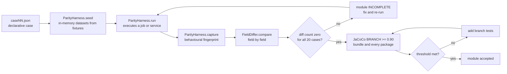
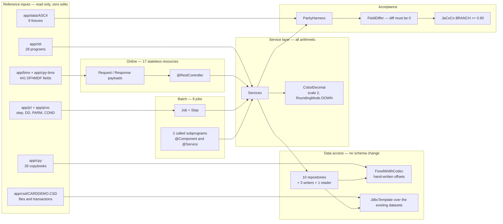

# CardDemo COBOL-to-Java Migration — Blitzy Project Guide

---

## 1. Executive Summary

### 1.1 Project Overview

This project migrates the AWS CardDemo mainframe COBOL application — 28 programs (19,254 lines), 28 copybooks, 17 BMS mapsets, 29 JCL jobs with 2 cataloged procedures, and 9 ASCII data fixtures — into a single Java 21 (LTS) / Spring Boot 3.x Maven module rooted at `app/java`. It is a **like-for-like language migration, not a redesign**: no new features and no changed business rules. Every observable output — record bytes, field values, numeric scale and rounding, message text, return codes, screen field shapes and error paths — is held identical to what the COBOL produces today.

The 28 programs divide into **17 CICS online programs and 11 non-CICS programs**, classified by the presence of `EXEC CICS` in each source. The online programs become stateless REST controllers; 9 of the non-CICS programs become Spring Batch jobs; the remaining 2 are `CALL`ed subprograms and become injected Spring components. 17 + 9 + 2 = 28, with no program counted twice and none left out.

One eighteenth name needs explaining, because the CICS definitions and the source tree disagree. `app/csd/CARDDEMO.CSD` defines 18 programs and 18 transactions. The eighteenth — `COCRDSEC`, reached through transaction `CDV1` — **has no source file anywhere in `app/cbl`** and is referenced by no COBOL program. It is therefore not migrated and no Java type exists for it. The CSD count is 18; the migratable source count is 17.

Nothing on the mainframe side changed. `app/cbl`, `app/cpy`, `app/cpy-bms`, `app/bms`, `app/jcl`, `app/proc`, `app/csd`, `app/ctl`, `app/catlg` and `app/data` are read-only and byte-identical, because they are the only oracle against which behavioural equivalence can be judged (practice **B3**). The mainframe installation path described in `README.md` remains valid and complete on its own; the Java module is additive.

### 1.2 Delivered Scope

| Legacy element | Count | Delivered form |
|---|---|---|
| CICS online program (`EXEC CICS` present) | 17 | `@RestController`, with a service and repositories behind it |
| Non-CICS program invoked by an `EXEC PGM=` step | 8 | Spring Batch `Job` mirroring the JCL step sequence |
| Non-CICS orphan invoked by nothing | 1 — `CBTRN01C` | Spring Batch `Job` with **no trigger** |
| Non-CICS `CALL`ed subprogram | 2 — `CBSTM03B`, `CSUTLDTC` | `@Component` and `@Service`; plain method calls |
| BMS mapset + symbolic-map copybook | 17 + 17 | one Request/Response payload pair per screen |
| Data copybook | 27 modelled, 1 not | one Java type per copybook; `app/cpy/UNUSED1Y.cpy` has no consumers and is not modelled |
| VSAM KSDS / sequential dataset | 12 | `JdbcTemplate`-backed access, no schema change |
| JCL job, step, DD, `PARM` and `COND` contract | 29 jobs, 2 procs | Spring Batch steps plus configuration bindings |
| `EXEC CICS XCTL` program transfer | 8 sites | a response field naming the next target; the server stays stateless |
| `CALL 'CEE3ABD'` | 9 sites | `AbendException` carrying the COBOL `RETURN-CODE` |

The job count is **nine**, and it is enforced rather than asserted: `carddemo.jobs` in `app/java/src/main/resources/application.yml` declares exactly nine job contracts and `BatchConfig.JobContracts` refuses to start the context if one is absent or re-pointed at another program. Nine decomposes exactly — eight programs carry an `EXEC PGM=` step somewhere under `app/jcl` or `app/proc`, and `CBTRN01C` carries none yet migrates all the same. Where the migration plan's prose says ten, the cause is `CBCUS01C` counted twice: once among the eight and again as the separately named customer file reader. No tenth job was invented to close that gap (practice **B4**).

### 1.3 Key Accomplishments

- All 28 COBOL programs are translated, each to the class name the build prompt fixed, with the behaviour taken from the source rather than from the name (rule **R1**). Section 2.3 maps every one of them and records every place the name misleads.
- 17 stateless REST resources replace the 17 BMS screens. No server-side session exists: the communication area, the key that was pressed and the screen's own field values all travel in the request and response payloads.
- Nine Spring Batch jobs reproduce the JCL step sequences, including `COND=(0,NE)` gating, which becomes a step transition requiring the preceding step to have exited zero.
- Every monetary value is a `BigDecimal` at the scale its `PICTURE` clause declares — scale 2 throughout — and every rounding operation truncates with `RoundingMode.DOWN`, because the keyword `ROUNDED` appears **zero times** across all 28 programs. No `double` and no `float` carries a value derived from a numeric COBOL field.
- Fixed-width record codecs are hand-written, so every byte offset stays reviewable against its copybook and no third-party copybook parser is trusted with the wire format (practice **B11**).
- Character sets are always named explicitly — IBM037 for the EBCDIC datasets, US-ASCII for the sample text fixtures — and never taken from the platform default (practice **B8**).
- Data access is plain JDBC over the existing datasets. No DDL, no schema migration, no object-relational mapper, no new database and no version column were introduced.
- Dataset names live only in configuration. `app/java/src/main/resources/application.yml` carries 27 dataset bindings, and no Java source reaches a dataset by a compiled-in name. A scan for `AWS.M2.CARDDEMO` finds exactly one occurrence outside comments, and it is not an access path: it is a line of the 80-byte JCL skeleton `ReportRequestController` emits, reproduced verbatim because the COBOL writes those bytes.
- Tests are a first-class deliverable authored alongside the code, in the same single phase, not bolted on afterwards (practice **B10**): 28 parameterised parity test classes plus per-package unit tests, all gated by branch coverage at the `verify` phase.
- Documented defects and dead code survive intact rather than being tidied (practice **B5**). Section 5.3 lists them.

### 1.4 Critical Unresolved Issues

Three items are open, and all three are escalated rather than absorbed (practice **B12**). The first two need a human decision; the third needs a deployment input. None of them is a defect in the code.

| Issue | Why it is open | What closing it requires |
|---|---|---|
| **R-A** — the regression baseline is statically derived, not captured from a run of the legacy programs | Executing the 28 COBOL programs is impossible in this environment; eight blockers are itemised in section 6.2. The substitute preserves every substantive part of the gate and changes only the *provenance* of the expected values, which modifies the wording of a stated success criterion | Explicit user confirmation that a statically derived baseline is accepted — or a z/OS runtime, or a COBOL toolchain with indexed file support, Language Environment `CEE*` services, a CICS emulator and the three absent IBM copybooks |
| **R-B** — `COTRN01C` is named `TransactionAddController` but views a transaction, and `COTRN02C` is named `TransactionViewController` but adds one | The mandated names are honoured verbatim and the behaviour is taken from the source, so the code is correct on both counts. The names are simply inverted relative to what the sources and `README.md` document | Explicit user confirmation of the naming, after which either the names stand or both classes are renamed together |
| **R-E** — the site JDBC driver is a deployment-time input | There is zero `EXEC SQL` in all 28 programs and indexed VSAM has no standard published JDBC driver, so no driver coordinate is compiled into the build. Production connectivity cannot be exercised here | Supplying `CARDDEMO_DATASOURCE_DRIVER_CLASS_NAME` and `CARDDEMO_DATASOURCE_URL` at deployment. Until then the repositories are validated against the fixture-backed harness |

### 1.5 Access Issues

The module needs no external system to build, test or be reviewed: no database server, no container runtime, no cloud account, no mainframe connectivity and no network beyond a Maven repository. Two environmental limits are nonetheless real and are recorded here so nobody re-derives them:

| Resource | Status | Consequence |
|---|---|---|
| z/OS or mainframe runtime | Not available | The legacy programs cannot be executed, so the regression baseline is derived statically — risk **R-A**, section 6.2 |
| Site data-access JDBC driver | Not available; deployment-time input | Production connectivity is unexercised — risk **R-E**. The `DataSource` is entirely configuration bound and startup is refused, naming the missing property, when none is supplied |
| IBM-supplied copybooks `DFHAID`, `DFHBMSCA`, `DFHATTR` | Referenced by 17, 17 and 2 programs; absent from this repository | Their AID and attribute constants are reproduced in Java from IBM CICS documentation rather than read from source — risk **R-D** |

### 1.6 Recommended Next Steps

1. **Confirm risk R-A** — accept the statically derived baseline, or provide an environment in which the legacy programs can be run. This is the one open item that touches a stated acceptance criterion.
2. **Confirm risk R-B** — rule on the `COTRN01C` / `COTRN02C` naming so the inversion is either ratified or corrected in one deliberate change rather than half-fixed.
3. **Bind the site driver** — supply the deployment-time `DataSource` properties in the target environment and exercise the repositories against real datasets, which is the only part of the module this environment cannot reach.
4. **Review the absent-copybook constants** — check the reproduced `DFHAID`, `DFHBMSCA` and `DFHATTR` values against the CICS release in use, since they came from documentation rather than from a copybook on disk.

---

## 2. The Delivered Java Module

### 2.1 Module layout

The module root is `app/java` and the build manifest is `app/java/pom.xml`. No build manifest exists at the repository root and there is no aggregator pom at any level, which is why the parent declaration carries an empty `<relativePath/>`. The base package is `com.vsergeychik.carddemo` and the entry point is `com.vsergeychik.carddemo.CardDemoApplication`, whose `scanBasePackages` names exactly eleven packages: `common`, `config`, `account`, `card`, `customer`, `user`, `transaction`, `admin`, `billing`, `statement`, `util`.

```text
app/java/
├── pom.xml                                  the only build manifest in the repository
├── src/main/resources/
│   ├── application.yml                      datasource, 27 dataset bindings, 9 job contracts, charsets
│   └── application-test.yml                 fixture-backed profile, in-memory datasets
├── src/main/java/com/vsergeychik/carddemo/
│   ├── CardDemoApplication.java             @SpringBootApplication, 11 scanned packages
│   ├── config/                              6 classes — see 2.2
│   ├── common/                              28 classes — see 2.2
│   ├── account/       + model/ + dto/       CBACT01C-04C, COACTVWC, COACTUPC
│   ├── card/          + model/ + dto/       COCRDLIC, COCRDSLC, COCRDUPC
│   ├── customer/      + model/              CBCUS01C
│   ├── transaction/   + model/ + dto/       CBTRN01C-03C, COTRN00C-02C, CORPT00C
│   ├── billing/                 + dto/      COBIL00C
│   ├── user/          + model/ + dto/       COSGN00C, COUSR00C-03C
│   ├── admin/         + model/ + dto/       COADM01C, COMEN01C
│   ├── statement/     + model/              CBSTM03A, CBSTM03B
│   └── util/                                CSUTLDTC
└── src/test/
    ├── java/com/vsergeychik/carddemo/
    │   ├── parity/                          ParityHarness, FieldDiffer, ParityCase,
    │   │                                    and one <PROGRAM>ParityTest per program
    │   └── <package>/                        per-package unit tests
    └── resources/
        ├── parity/<PROGRAM>/case01..case20.json
        ├── fixtures/                        9 fixed-width fixtures from app/data/ASCII
        └── carddemo-test-fixtures.yml       in-memory datasource and fixture inventory
```

Both resource files are real and both are load-bearing: `app/java/src/main/resources/application.yml` declares *what* every dataset is — DD name, organization, record format, record length, copybook and key length — while `app/java/src/main/resources/application-test.yml` declares only *where* each one lives while the suite runs, rebinding all of them onto in-memory test data.

### 2.2 `config/` and `common/`

`config/` holds **6** classes. Four are the ones the migration plan names, and two more emerged from the work:

| Class | Responsibility |
|---|---|
| `DataSourceConfig` | The pooled `DataSource`, `JdbcTemplate`, and the `carddemo.datasets` bindings |
| `BatchConfig` | `JobRepository`, transaction manager, the nine enforced job contracts, and the `COND=(0,NE)` step-transition policy |
| `WebConfig` | Payload mapping and the global error boundary; deliberately leaks no backend detail |
| `CobolCharsetConfig` | Explicit IBM037 / US-ASCII selection, never the platform default |
| `DatasetUnitOfWork` | The commit and rollback boundary a `SYNCPOINT` implied |
| `ScreenTextDeserializer` | Fixed-width screen text binding on the inbound payload edge |

`common/` holds **28** classes. Thirteen are the shared translations the plan enumerates — `CobolDecimal`, `FixedWidthRecord`, `FixedWidthCodec`, `AbendException`, `FileStatus`, `CicsAid`, `BmsAttributes`, `NavigationContext`, `ScreenTitles`, `SystemMessages`, `DateHeader`, `PfKeyResolver`, `FieldAttributeSetter` — and the remaining fifteen are supporting types the translation needed: `AidRequestParameter`, `CicsResponse`, `DatasetIntegrityException`, `DatasetObservation`, `DatasetRelation`, `DiagnosticText`, `NumericIntrinsics`, `PhysicalSequence`, `RecordImageForm`, `ResponseOnlyMembers`, `ScreenFieldImage`, `ScreenInputRejectedException`, `ScreenMetadata`, `ScreenResponse`, `SensitiveDiagnostics`.

Three of these deserve singling out:

- **`CobolDecimal`** is the single seam through which every monetary operation passes. Scale and `RoundingMode.DOWN` are named in one place, so numeric parity has exactly one location to verify.
- **`CicsAid` and `BmsAttributes`** reproduce the constants of `DFHAID`, `DFHBMSCA` and `DFHATTR`. Those three copybooks are referenced by 17, 17 and 2 programs respectively and are **absent from this repository**, so their values come from IBM CICS documentation. That is risk **R-D**.
- **`NavigationContext`** carries the `CARDDEMO-COMMAREA` in the request and response payloads. It is the reason no server-side session state exists.

No class in the module holds mutable state in a static field: COBOL `WORKING-STORAGE` never became a static Java field, and collaborators are constructor-injected throughout (practice **B9**). There are no wildcard imports anywhere, so each copybook-to-type correspondence stays auditable during review (practice **B8**).

### 2.3 All 28 programs mapped to package and class

Rule **R1** governs this table: **the name comes from the build prompt, the behaviour comes from the source.** Sixteen of the mandated names do not describe what the paired COBOL does, so a bare mapping would be actively misleading. Every divergence carries its caveat in the same row. A name is never a licence to "complete" a class by adding logic the COBOL does not have.

| Package | COBOL | Java class | What the source actually does — read this before trusting the name |
|---|---|---|---|
| `account` | `CBACT01C` | `AccountBalanceJob` | Batch job. The name says balance; the program only **reads and prints** the account file. It computes nothing and writes nothing. Its `SYSOUT` is 13 lines per record |
| `account` | `CBACT02C` | `AccountBalanceReaderJob` | The name says Account; the program reads the **CARD** file, so this job uses `card.CardRepository` — cross-package by design. Its inner display is commented out in the source, so its `SYSOUT` is **1** line per record |
| `account` | `CBACT03C` | `AccountBalanceUpdateJob` | The name says Update; the program reads the **cross-reference** file through `card.CardXrefRepository` and performs **no writes at all**. Its `SYSOUT` is **2** identical lines per record |
| `account` | `CBACT04C` | `AccountInterestCalcJob` | A genuine interest calculator, and the only job that takes a parameter: a single `parmDate` **string**. It also reads the disclosure-group dataset directly rather than through a repository |
| `account` | `COACTVWC` | `AccountViewController` | `GET /api/accounts/{acctId}`. 37 screen fields across 5 datasets |
| `account` | `COACTUPC` | `AccountUpdateController` + `AccountUpdateService` | `PUT /api/accounts/{acctId}`. 54 screen fields; the largest program at 4,236 lines. Its optimistic-concurrency paragraph is **`9700-CHECK-CHANGE-IN-REC`** — `9300` is a different program's label |
| `customer` | `CBCUS01C` | `CustomerFileReaderJob` + `CustomerService` + `CustomerRepository` | The job class exists so the program's **standalone batch behaviour** — read and print the customer file — is not lost behind the mandated repository-and-service naming |
| `transaction` | `CBTRN01C` | `TransactionPostingJob` | **Orphan**: no JCL anywhere invokes it, so it is fully runnable with **no trigger**. And despite the name it **posts nothing** — no `WRITE` and no `REWRITE`. It opens six datasets, reads the daily transaction file, displays each record, resolves the cross-reference then the account, and closes |
| `transaction` | `CBTRN02C` | `TransactionValidationJob` | The real `POSTTRAN` poster: it validates **and** posts. See section 5.3 for the reject-code ordering it preserves |
| `transaction` | `CBTRN03C` | `TransactionReportJob` | Reads its date range from the `DATEPARM` **dataset**, not from a `PARM` and not from a job parameter. Page size 20. Preserves two source defects — section 5.3 |
| `transaction` | `COTRN00C` | `TransactionMenuController` | `GET /api/transactions`. The source **lists** transactions; it is not a menu. Page size **10** |
| `transaction` | `COTRN01C` | `TransactionAddController` | **Semantic swap — risk R-B.** The source **VIEWS** a transaction, which is why this controller answers `GET /api/transactions/{tranId}` |
| `transaction` | `COTRN02C` | `TransactionViewController` | **Semantic swap — risk R-B.** The source **ADDS** a transaction, which is why this controller answers `POST /api/transactions`. It calls the date service twice |
| `transaction` | `CORPT00C` | `ReportRequestController` | `POST /api/reports`. The CICS transient-data write becomes a nested `JobSubmissionPort` with a default component that emits byte-identical 80-byte records. It calls the date service twice |
| `billing` | `COBIL00C` | `BillPaymentController` + `BillPaymentService` | `POST /api/billpay`. Subtracts the transaction amount from the current balance at scale 2, truncating |
| `card` | `COCRDLIC` | `CardListController` | `GET /api/cards`. Page size **7**, and it drives two maps — its own and the card-select map |
| `card` | `COCRDSLC` | `CardSelectController` | `GET /api/cards/{cardNum}`. The name says Select; the source is a card **detail view** |
| `card` | `COCRDUPC` | `CardUpdateController` + `CardUpdateService` | `PUT /api/cards/{cardNum}`. Its optimistic-concurrency paragraph is **`9300-CHECK-CHANGE-IN-REC`** |
| `user` | `COSGN00C` | `SignOnController` + `SignOnService` | `POST /api/signon`. File-based authentication with a **plaintext** password comparison — section 5.3 |
| `user` | `COUSR00C` | `UserMenuController` | `GET /api/users`. The name says Menu; the source **lists users**. Page size **10** |
| `user` | `COUSR01C` | `UserAddController` | `POST /api/users` |
| `user` | `COUSR02C` | `UserUpdateController` | `PUT /api/users/{userId}` |
| `user` | `COUSR03C` | `UserDeleteController` | `DELETE /api/users/{userId}` |
| `admin` | `COADM01C` | `AdminMenuController` + `AdminMenuService` | `GET /api/admin/menu`. 4 options |
| `admin` | `COMEN01C` | `MainMenuController` + `MainMenuService` | `GET /api/menu`. 10 options, filtered by user type |
| `statement` | `CBSTM03A` | `StatementGenerationJobA` | The statement report driver. Two outputs: an 80-byte text statement and a 100-byte HTML statement. It is the only program whose `GO TO`s form backward loops — risk **R-H** |
| `statement` | `CBSTM03B` | `StatementGenerationJobB` | **A `@Component`, not a Spring Batch `Job`**, despite the name. It is `CBSTM03A`'s data-access collaborator, called at 13 sites, and it owns all four statement input files including the transaction extract |
| `util` | `CSUTLDTC` | `DateUtilityJob` | **A `@Service`, not a Spring Batch `Job`**, despite the name. A called date-validation subprogram with four program-level call sites plus a fifth inside `app/cpy/CSUTLDPY.cpy`, reached through `account.AccountDateValidator` |

**On risk R-B specifically.** The evidence that the two transaction names are inverted is in this repository, not inferred: the Online inventory in `README.md` documents `CT01` / `COTRN01C` as *Transaction View* and `CT02` / `COTRN02C` as *Transaction Add*, and each source's own `Function :` header says the same. The mandated names are honoured verbatim and the behaviour is taken from the source, so the delivered code is right on both counts and the divergence is surfaced rather than quietly corrected (practice **B4**). The clearest tell is in the HTTP verbs: the class called `TransactionAddController` answers a `GET`, and the one called `TransactionViewController` answers a `POST`.

**Do not repeat two claims from the superseded design.** There is no "five-stage pipeline"; `COMBTRAN` is a `SORT` utility job in the `README.md` batch inventory, not one of the 28 COBOL programs. And the classification is 17 online plus 11 non-CICS, not "18 online and 10 batch".

### 2.4 Data access — repositories, writers and the parameter reader

Twelve datasets are reached, and the tree distributes them across **ten** `@Repository` classes plus two owning components. That is worth stating precisely, because a reader expecting twelve repository classes will look for two that do not exist:

| Dataset | Reached through | Record width |
|---|---|---|
| Account (`ACCTDAT` / `ACCTFILE`) | `account.AccountRepository` | 300 |
| Card (`CARDDAT` / `CARDFILE`, with the `CARDAIX` path) | `card.CardRepository` | 150 |
| Card cross-reference (`CCXREF` / `XREFFILE` / `CARDXREF`, with the `CXACAIX` path) | `card.CardXrefRepository` | 50 |
| Customer (`CUSTDAT` / `CUSTFILE`) | `customer.CustomerRepository` | 500 |
| Transaction master (`TRANSACT` / `TRANFILE`) | `transaction.TransactionRepository` | 350 |
| Daily transactions (`DALYTRAN`) | `transaction.DalyTranRepository` | 350 |
| Transaction category balance (`TCATBALF`) | `transaction.TranCatBalRepository` | 50, with a **17-byte** composite key |
| Transaction type (`TRANTYPE`) | `transaction.TranTypeRepository` | 60 |
| Transaction category (`TRANCATG`) | `transaction.TranCategoryRepository` | 60, with a **6-byte** key — both COBOL groups are literally named `TRAN-CAT-KEY`, so the two must not be conflated |
| Security user (`USRSEC`) | `user.SecUserRepository` | 80 |
| Disclosure group (`DISCGRP`) | `account.AccountInterestCalcJob`, which reads it directly | 50 |
| Transaction extract (`TRNXFILE`) | `statement.StatementGenerationJobB`, which owns it | 350 |

The last two follow the COBOL: the disclosure-group rate lookup exists only inside the interest calculation, and all four statement inputs are declared in `CBSTM03B`, which is exactly why `CBSTM03A` calls it thirteen times instead of opening them itself.

**Three output writers and one parameter reader**, each pinned to its JCL-declared width by a constant in the class:

| Component | DD | Width | Note |
|---|---|---|---|
| `transaction.DalyRejectWriter` | `DALYREJS` | **430** bytes, `RECFM=F` | |
| `transaction.TranReportWriter` | `TRANREPT` | **133** bytes, `RECFM=FB` | |
| `statement.StatementTextWriter` | `STMTFILE` | **80** bytes | |
| `statement.StatementHtmlWriter` | `HTMLFILE` | **100** bytes | `app/jcl/CREASTMT.JCL` declares 80 in its pre-delete step and 100 in the creating step; **100 wins**, taken from the step that creates the file — risk **R-G** |
| `transaction.DateParmReader` | `DATEPARM` | 80-byte record | Reads the report date range from a **dataset**, not from a `PARM` and not from a job parameter |

The data-access posture, stated without hedging:

- Repositories are **`JdbcTemplate`-backed**. There is **no** object-relational mapper, **no** DDL, **no** schema migration, **no** version column and **no** new index. The record layouts stay exactly as the copybooks in `app/cpy` define them.
- Each repository exposes **only** the access paths the COBOL performs — sequential browse, keyed read, keyed read for update, rewrite, add, delete, and start-browse / read-next — so no unused query surface is invented.
- **All dataset names resolve from configuration.** `app/java/src/main/resources/application.yml` carries 27 bindings under `carddemo.datasets`, and no repository reaches a dataset by a compiled-in name — see the one benign exception noted in section 1.3.
- The alternate indexes are **finder methods on the base repositories, never separate repositories or tables**. `CARDAIX` is a path over the card base and `CXACAIX` a path over the cross-reference base; each is configured with its `base`, its `alternate-key` and its `key-offset`. `app/jcl/INTCALC.jcl` settles the point by opening the cross-reference twice in one step — `XREFFILE` on the base and `XREFFIL1` on the alternate-index path.
- The COBOL `FILE STATUS` values and the CICS `RESP` values collapse into one `FileStatus` constant set, and repositories return the same discriminated outcomes so the caller's branch structure is unchanged.
- **No driver coordinate is declared in `app/java/pom.xml`.** There is zero `EXEC SQL` in all 28 programs and indexed VSAM has no standard published JDBC driver, so the `DataSource` is entirely configuration bound and the site driver is a deployment-time input — risk **R-E**. H2 is present at **test scope only**, where it backs the Spring Batch `JobRepository` (Batch 5 requires a `DataSource`-backed repository) and hosts the harness's seeded fixtures.

### 2.5 Screens, payloads, and the absence of a design system

There is **no component library, no design token set and no Figma input** anywhere in this project, and none is required. The authoritative presentation contract is the BMS layer: **441 `DFHMDF` field definitions** across the 17 mapsets, every one of them on a 24×80 screen. That contract is as binding as a design system would be, and it is far more precise, because a BMS field declares its position, length, attribute and colour explicitly.

The rules the payloads follow:

- Every request and response field maps 1:1 to a `DFHMDF` field, and every field length comes from the symbolic map's `xxxI PIC X(n)` item.
- The `xxxL`, `xxxF` and `xxxA` items become validation and highlight **metadata** on the payload type, never payload members.
- Field highlighting on a validation failure follows the source's attribute-setting include, and applies only in the re-entry state.
- The delivered payload types follow `<Screen>Request` / `<Screen>Response` — for example `transaction.dto.TransactionListRequest` and `transaction.dto.ReportRequestRequest`. There are 17 pairs, plus `card.dto.CardScreenState` for the shared card screen state.
- Pagination page sizes are **behaviour, not configuration**: 7 for the card list, 10 for the transaction and user lists. They are compiled constants and are deliberately not tunable, because changing one would change what the screen shows.

---

## 3. Tests and Coverage

Tests ship in the same phase as the code they judge, not after it (practice **B10**). The whole refactor lands in a single phase; the parity gate is a per-module acceptance check *within* that phase, not a phase boundary.

### 3.1 What the suite contains

| Layer | Framework | What it covers |
|---|---|---|
| Per-package unit tests | JUnit 5, Mockito, AssertJ — all from `spring-boot-starter-test` | Every service, job, repository, record type, payload type and shared class, driving both sides of each condition |
| Parity suite | JUnit 5 parameterised tests over declarative cases | One `<PROGRAM>ParityTest` class per program, 28 in all |
| Configuration and boundary tests | JUnit 5, Spring test support | The dataset bindings, the job contracts, the charset selection, the error boundary, and the test-workspace isolation |

Deliberately absent, and this is a design decision rather than a gap: the module runs its whole suite **offline** — no external database, no container-based test harness, no network and no mainframe. `app/java/src/main/resources/application-test.yml` rebinds every dataset onto in-memory test data seeded from the nine fixed-width fixtures derived from `app/data/ASCII`.

Two guards exist against the worst failure a gate can have, which is passing over evidence that was never produced. `failIfNoTests` is `true` in the Surefire configuration, so a run that discovered nothing fails; and a sentinel test asserts the discovered suite is not merely non-empty but at least as large as the floor recorded in `app/java/pom.xml`, so silently losing most of the suite to a mis-scoped include fails the build rather than reporting green.

**No pass counts or coverage percentages are quoted in this guide.** The build reports them on every run, and a number transcribed into a document is a number that starts drifting the moment it is written. What is stated here instead is the *threshold the build enforces*, which does not drift (practice **B1**).

### 3.2 The parity-gate workflow


```mermaid
flowchart LR
    A["caseNN.json<br/>declarative case"] --> B["ParityHarness.seed<br/>in-memory datasets from fixtures"]
    B --> C["ParityHarness.run<br/>executes a job or service"]
    C --> D["ParityHarness.capture<br/>behavioural fingerprint"]
    D --> E["FieldDiffer.compare<br/>field by field"]
    E --> F{"diff count zero<br/>for all 20 cases?"}
    F -->|"no"| G["module INCOMPLETE<br/>fix and re-run"]
    G --> C
    F -->|"yes"| H["JaCoCo BRANCH >= 0.90<br/>bundle and every package"]
    H --> I{"threshold met?"}
    I -->|"no"| J["add branch tests"]
    J --> H
    I -->|"yes"| K["module accepted"]
```

- **Case layout.** Every program owns twenty cases, identified `case01` through `case20`. A case is declarative in either of two equivalent forms, both built on the same `ParityCase` model: most suites load theirs from the test classpath at `app/java/src/test/resources/parity/<PROGRAM>/` — for example `app/java/src/test/resources/parity/CBACT01C/case01.json` — and a few declare theirs in code. Whichever form it takes, a case holds its inputs (dataset to fixture rows), its job parameters, its expected records (dataset, row index, and a field-name-to-value map), its expected return code and its expected messages.
- **The count is enforced, not merely intended.** `ParityHarness.CASES_PER_PROGRAM` is `20`, and it is the only place that number is written. The classpath loader demands the *exact* set: a short set fails loudly naming each missing case, and a stray extra such as a twenty-first case is refused by name, because a resource the loader does not read is a resource nobody is running. The suites that declare their cases in code apply the same rule to their own set, rejecting one that is short, long, misnumbered or duplicated — and they check it inside the case supplier, so running a single case cannot bypass it. Across the 28 programs that is 560 cases, the figure `README.md` publishes.
- **Execution.** `ParityHarness` loads a case, seeds the datasets, executes the unit — **a job or a service, never a controller** — and captures a *behavioural fingerprint*: every written record byte-decoded per copybook into named fields, plus the return code and any emitted messages.
- **Comparison.** `FieldDiffer.compare` judges fingerprint against expectation **field by field, not as whole strings**, and returns a diff result carrying a diff count. Whole-string comparison would report one failure where twenty fields differ, and would say nothing about which one.
- **The completion rule, stated exactly.** *A module is not complete until its diff count is zero across all 20 of its cases.* This is **per module, not per build**: a module with 19 clean cases and one diff is incomplete.
- **Business logic lives in services**, so a parity test reaches the arithmetic with no HTTP layer and no `JobLauncher` in the path.

### 3.3 Coverage enforcement

JaCoCo 0.8.15 is bound to the **`verify`** phase with `haltOnFailure` set, and it applies the same **`BRANCH`** covered-ratio limit of **0.90** through two rules:

- a `BUNDLE` rule, so the module as a whole clears the bar; and
- a `PACKAGE` rule, so **every package clears it independently.**

The package rule is what actually delivers the "no unit hides behind another's coverage" requirement in a single-module build, where a bundle-only rule would let a well-covered package mask an untested one. The counter is branch rather than line because the migration is judged on 508 COBOL `88`-level condition names, 111 `EVALUATE` statements and the guard chains around them — only branch coverage evidences that both sides of each of those decisions were exercised. The threshold is a gate, not a target: the build fails below it.

### 3.4 Fixtures and the two width normalizations

Nine fixed-width fixtures under `app/java/src/test/resources/fixtures/` are derived from `app/data/ASCII`, and eight of the nine match their copybook width exactly. Two seeds need normalizing before comparison, and both are material:

| Seed | Source width | Copybook width | Normalization |
|---|---|---|---|
| Card cross-reference — the one fixture that does not match | 36 bytes per record | 50 (`CVACT03Y`) | Right-padded to 50, restoring the trailing `FILLER PIC X(14)` the fixture omits — risk **R-F**. The configured record length stays 50 and is not reconfigured down to 36 |
| Security user — not one of the nine, because no `usrsec` file exists under `app/data/ASCII` | 57 bytes per row, seeded inline in the test fixture inventory | 80 (`CSUSR01Y`) | Right-padded to 80, restoring the omitted `SEC-USR-FILLER PIC X(23)` |

The padding direction matters: the fixture is padded **up** to the copybook width rather than the record length being reconfigured **down** to the fixture, because the copybook is the contract and the fixture is only sample data.

Everything a test run writes is rooted in a directory owned by that run — derived from a per-invocation identifier and, where set, from `CLONE_INDEX` — so two invocations never read back each other's output and a parity diff can never be wrong for that reason.

---

## 4. Runtime Validation

### 4.1 The REST surface

Seventeen resources, one per CICS transaction, each projected field-for-field from its BMS mapset. These are the paths the delivered controllers declare:

| Transaction | Program | Java class | Route |
|---|---|---|---|
| `CC00` | `COSGN00C` | `SignOnController` | `POST /api/signon` |
| `CM00` | `COMEN01C` | `MainMenuController` | `GET /api/menu` |
| `CA00` | `COADM01C` | `AdminMenuController` | `GET /api/admin/menu` |
| `CAVW` | `COACTVWC` | `AccountViewController` | `GET /api/accounts/{acctId}` |
| `CAUP` | `COACTUPC` | `AccountUpdateController` | `PUT /api/accounts/{acctId}` |
| `CCLI` | `COCRDLIC` | `CardListController` | `GET /api/cards` |
| `CCDL` | `COCRDSLC` | `CardSelectController` | `GET /api/cards/{cardNum}` |
| `CCUP` | `COCRDUPC` | `CardUpdateController` | `PUT /api/cards/{cardNum}` |
| `CT00` | `COTRN00C` | `TransactionMenuController` | `GET /api/transactions` |
| `CT01` | `COTRN01C` | `TransactionAddController` | `GET /api/transactions/{tranId}` — a read, because the source views |
| `CT02` | `COTRN02C` | `TransactionViewController` | `POST /api/transactions` — a create, because the source adds |
| `CR00` | `CORPT00C` | `ReportRequestController` | `POST /api/reports` |
| `CB00` | `COBIL00C` | `BillPaymentController` | `POST /api/billpay` |
| `CU00` | `COUSR00C` | `UserMenuController` | `GET /api/users` |
| `CU01` | `COUSR01C` | `UserAddController` | `POST /api/users` |
| `CU02` | `COUSR02C` | `UserUpdateController` | `PUT /api/users/{userId}` |
| `CU03` | `COUSR03C` | `UserDeleteController` | `DELETE /api/users/{userId}` |

CICS is pseudo-conversational, so the migration keeps **no server-side session**. The communication area, the key that was pressed and the screen's own field values travel in the payloads, and every reply carries the state the next call needs — including the next program, mapset and map, which is what the eight `XCTL` sites become. Navigation is therefore resolved by the caller; there is no server-side forward, no redirect chain and no session affinity.

Both the first-entry and the re-entry paths exist for all 17 resources, because the source distinguishes them: first entry paints the screen and re-entry validates what was typed, and only re-entry applies the error highlight.

### 4.2 Launching a batch job

`spring.batch.job.enabled` is `false`, so starting the application runs no job. Each of the nine jobs is submitted explicitly by name, one per process, exactly as JCL submits one `EXEC PGM=` step at a time:

```shell
java -jar app/java/target/carddemo.jar --carddemo.batch.job-name=accountBalanceJob
```

| Job bean | Program | JCL origin | Parameters |
|---|---|---|---|
| `accountBalanceJob` | `CBACT01C` | `app/jcl/READACCT.jcl` | none |
| `accountBalanceReaderJob` | `CBACT02C` | `app/jcl/READCARD.jcl` | none |
| `accountBalanceUpdateJob` | `CBACT03C` | `app/jcl/READXREF.jcl` | none |
| `customerFileReaderJob` | `CBCUS01C` | `app/jcl/READCUST.jcl` | none |
| `accountInterestCalcJob` | `CBACT04C` | `app/jcl/INTCALC.jcl` | `parmDate`, a string |
| `transactionValidationJob` | `CBTRN02C` | `app/jcl/POSTTRAN.jcl` | none — the step declares no `PARM` |
| `transactionReportJob` | `CBTRN03C` | `app/jcl/TRANREPT.jcl` and `app/proc/TRANREPT.prc` | none; the date range comes from the `DATEPARM` dataset |
| `statementGenerationJobA` | `CBSTM03A` | `app/jcl/CREASTMT.JCL` | none; five steps with `COND=(0,NE)` gating |
| `transactionPostingJob` | `CBTRN01C` | none — the orphan | none |

The process exit code is the program's `RETURN-CODE`, so gating one job on the result of the one before it behaves as `COND` does on the mainframe. `parmDate` mirrors `PARM='2022071800'` in `app/jcl/INTCALC.jcl` and is **character data**: the program concatenates it verbatim into the transaction identifiers it generates, so it is never parsed as a date or reformatted. Override it with `CARDDEMO_JOB_PARM_DATE`.

### 4.3 What the module deliberately does not expose

Naming these once is more useful than leaving a reader to wonder, and each is out of scope by mandate rather than by omission:

- **No database server, no schema and no migration tooling.** Data access is JDBC over the datasets that already exist.
- **No object-relational mapper.** Relational-izing indexed files is the industry default and is deliberately not followed here, because it would impose an entity and table model that does not exist.
- **No authentication framework, no token and no credential hashing.** Section 5.3 explains why that is the correct outcome rather than a gap.
- **No cloud service integration and no container runtime.** Nothing in the build or the test suite requires either.
- **No metrics registry, no exporter, no management endpoint and no tracing.** Nothing is collected, aggregated, exported or scraped, and no observability configuration exists in the module. For full honesty: a handful of observation-API jars do arrive transitively through the mandated web and batch starters, and they cannot be excluded because the base classes of every Spring Batch job and step reference them — the header of `app/java/pom.xml` records that measurement and escalates it as an internal conflict in the plan rather than claiming an exclusion it cannot deliver.
- **No API-documentation generator, no reactive web stack, and no compile-time accessor or mapper generator.**
- **No CI/CD pipeline.** None exists anywhere in this repository and none was requested, so none was created.

---

## 5. Compliance & Quality Review

### 5.1 Structural completeness

| Requirement | How it is satisfied |
|---|---|
| All 28 COBOL programs have a Java class using the mandated name exactly | Section 2.3 maps every one |
| The 9 mandated domain packages exist, and every program sits in its assigned package | `account`, `customer`, `transaction`, `billing`, `card`, `user`, `admin`, `statement`, `util`, all named in `CardDemoApplication`'s scan list alongside `common` and `config` |
| One Java type per data copybook; `UNUSED1Y` unmodelled | 27 modelled types; `app/cpy/UNUSED1Y.cpy` has zero consumers and no Java counterpart |
| A Request/Response pair per symbolic map | 17 pairs, plus the shared card screen state |
| Nine batch jobs, and no tenth invented | Enforced by `BatchConfig.JobContracts` against the nine `carddemo.jobs` keys at startup |
| `CBSTM03B` is a `@Component` and `CSUTLDTC` a `@Service` — neither is a `Job` | Neither has an `EXEC PGM=` step anywhere in `app/jcl` or `app/proc`, so neither may be given one |
| `CBTRN01C` exists as a runnable job with no scheduled trigger | `transactionPostingJob` is a job bean with no invoker |
| No Java type exists for `COCRDSEC` | It has no source file; see section 1.1 |
| Dataset names appear only in configuration | 27 bindings in `app/java/src/main/resources/application.yml`; no dataset literal in Java source |

### 5.2 Parity, numeric and control-flow invariants

| Invariant | What is held |
|---|---|
| Numeric type | `BigDecimal` at the scale the `PICTURE` clause declares. Every monetary field is scale **2**. No `double` and no `float` for any value derived from a numeric COBOL field |
| Rounding | **`RoundingMode.DOWN`**, never half-up and never half-even, because `ROUNDED` appears **zero times** across all 28 programs, so COBOL truncates. All of it routes through the one `CobolDecimal` seam |
| Record widths | Account 300, Card 150, CardXref 50, Customer 500, Transaction 350, DalyTran 350, TranCatBal 50, DisclosureGroup 50, TranType 60, TranCategory 60, SecUser 80, Trnx 350 — each pinned by a constant on its record type |
| Output widths | 430, 133, 80 and 100 bytes, each matching the JCL-declared `LRECL` of its DD |
| `FILLER` | Emitted as spaces in every serialized record. Omitting a `FILLER` span breaks every downstream offset and the total width, so total width is itself the check |
| Character set | Always named: IBM037 for the EBCDIC datasets, US-ASCII for the sample fixtures. Never the platform default |
| Field names | Never renamed, **including the misspelling `ACCT-EXPIRAION-DATE`** in `app/cpy/CVACT01Y.cpy`. `app/cpy/CUSTREC.cpy`'s `CUST-DOB-YYYYMMDD` is kept as a distinct type from `app/cpy/CVCUS01Y.cpy`'s `CUST-DOB-YYYY-MM-DD`, because collapsing them would lose a name that field-for-field diffing depends on |
| Evaluation order | `EVALUATE` ordering is preserved with the default case last; guard chains keep their early exits; the one program with backward loop-forming `GO TO`s is restructured into explicit loops with the iteration order asserted |
| Table indexing | COBOL tables are 1-based and Java arrays are 0-based; every table is asserted at its first and last element |
| Abend and return code | The nine `CALL 'CEE3ABD'` sites raise `AbendException` carrying the `RETURN-CODE`, and the process exit code is what the COBOL sets |
| Statelessness | No server-side session state, no static mutable state, constructor injection throughout, no wildcard imports |

### 5.3 Preserved defects, dead code and the security posture

Behaviour is preserved **including** the parts a well-intentioned implementer would want to fix. Each of these is deliberate; changing any one would be a new feature and a parity violation (practice **B5**).

- **`1400-COMPUTE-FEES` stays a no-op.** The paragraph in `app/cbl/CBACT04C.cbl` is marked *to be implemented* and contains no statements, so its Java counterpart performs no computation — and it is still invoked, from inside the branch that runs when the interest rate is non-zero. The `ELSE` arm alongside it is unreachable in the source, so the final account group is never rewritten. All of that is reproduced as found.
- **`CBTRN01C` stays an untriggered orphan that posts nothing.** No JCL invokes it and it contains no `WRITE` and no `REWRITE`. Do not delete it and do not wire it into a pipeline.
- **`app/cpy/UNUSED1Y.cpy` stays unmodelled.** Zero consumers, confirmed.
- **`COCRDSEC` and transaction `CDV1` stay out of scope.** Defined in `app/csd/CARDDEMO.CSD`, no source file, no invented implementation.
- **`CBTRN03C` keeps two source defects.** A `NEXT SENTENCE` ends its read loop on the first out-of-range record, and its end-of-file branch adds the last amount a second time. Both are reproduced.
- **`CBTRN02C` keeps its reject-code ordering.** The reasons are 100 for an invalid card, 101 and 109 for an account not found, 102 for over-limit and 103 for a transaction after expiration — and because 102 and 103 both run unconditionally, 103 overwrites 102. It is not a clean four-way short-circuit for the last two stages, and it is not made into one.
- **The password comparison is plaintext, and that is correct here.** `SEC-USR-PWD PIC X(08)` in `app/cpy/CSUSR01Y.cpy` is compared in plaintext exactly as `COSGN00C` performs it. This is an **inherited property of the legacy design and an explicit non-goal of this migration**: introducing hashing would change observable behaviour and would require a security framework that is out of scope. No hashing, no token and no filter chain is introduced. The characteristic is stated here plainly rather than buried, so it stays visible to whoever eventually decides to change it — a decision that belongs to a plan, not to a translation (practice **B6**).

### 5.4 Documented conflicts, not corrected

Three conflicts exist between this repository's own artefacts and the mandated design. Every one of them is left standing and explained, because silently fixing a conflict removes the evidence that it existed (practice **B4**).

| Artefact | The conflict | Disposition |
|---|---|---|
| `docs/index.md` | Describes the application as migrated to Java 25, which contradicts the mandated Java 21 (LTS) | **Unmodified.** The file is outside the permitted change set for this work. The conflict is recorded here instead |
| `catalog-info.yaml` | Carries the same Java 25 claim in its description | **Unmodified.** It is catalog metadata outside the migration surface |
| `docs/technical-specifications.md` | Describes a materially different and more expansive design — a relational database with an object-relational mapper, schema migrations, a security framework, cloud services and an observability stack — targeting a *separate greenfield repository* | **Unmodified and superseded.** Nothing in it that the current mandate does not name is in scope. Facts it records about the *legacy* system remain useful corroborating evidence, and section 6.2 cites one of them |
| The `COTRN01C` / `COTRN02C` names | Inverted relative to the sources and to the `README.md` inventory | **Names honoured, behaviour from the source, divergence surfaced** as risk **R-B** and escalated for confirmation |

For the same reason, `mkdocs.yml` is unchanged: its navigation resolves the *Project Guide* entry against the `docs/` directory, so this page stays reachable without a new entry, and no new page was added under `docs/`.

---

## 6. Risk Assessment

### 6.1 Register

| ID | Severity | Risk | Mitigation | Needs user input |
|---|---|---|---|---|
| **R-A** | Highest | The COBOL-execution baseline is impossible in this environment; eight verified blockers | A statically derived baseline preserving all 560 cases, field-for-field diffing, the zero-diff gate per module and the branch bar. Section 6.2 states it in full | **Yes** |
| **R-B** | High | `COTRN01C` is named `TransactionAddController` but views; `COTRN02C` is named `TransactionViewController` but adds. The sources and the `README.md` inventory both document the opposite | Names honoured verbatim per rule **R1**; behaviour taken from the source; the divergence is recorded in the mapping table so no implementer is misled | **Yes** |
| **R-C** | Medium | Fourteen further mandated names diverge from the verified source function | Resolved by rule **R1**. Every divergence carries its caveat in section 2.3 | No |
| **R-D** | Medium | `DFHAID`, `DFHBMSCA` and `DFHATTR` are referenced by 17, 17 and 2 programs but absent from this repository | Their constants are reproduced in `common.CicsAid` and `common.BmsAttributes` from IBM CICS documentation, and asserted by dedicated tests | No |
| **R-E** | Medium | Production JDBC connectivity cannot be exercised here; the site driver is a deployment-time input | The `DataSource` is entirely configuration bound, startup is refused with a message naming the missing property, and the repositories are validated against the fixture-backed harness with H2 at test scope | No |
| **R-F** | Low | The card cross-reference fixture is 36 bytes per record where its copybook declares 50 | The seed is right-padded to 50 before comparison; the configured record length stays 50 | No |
| **R-G** | Low | `app/jcl/CREASTMT.JCL` declares the HTML statement at 80 bytes in its pre-delete step and 100 in the creating step | The creating step wins — 100 — and the writer pins that width by constant | No |
| **R-H** | Low | `CBSTM03A` is the only program whose `GO TO`s form backward loops | Restructured into explicit loops with the iteration order asserted identical; it also carries the densest case coverage | No |

### 6.2 Risk R-A in full — where the expected values come from

This subsection exists because an environmental limit must be documented and escalated rather than absorbed (practice **B12**). **No expected value in the parity suite was captured from a run of the legacy COBOL.**

**The original criterion** called for generating the regression baseline by *executing* the 28 legacy programs against 20 cases each and then diffing the Java output field for field until the diff count reached zero.

**Executing them is empirically impossible in this environment.** Eight blockers, each verified rather than assumed:

1. No mainframe or z/OS runtime is available.
2. The available COBOL toolchain reports its indexed file handler as **disabled**, and nine of the eleven non-CICS programs declare `ORGANIZATION … INDEXED`.
3. `PROCEDURE DIVISION USING` is rejected when an executable is requested, so the three programs that carry it — the interest calculator and the two called subprograms — cannot be built as executables without a bespoke driver harness.
4. `app/cpy/CUSTREC.cpy` fails to parse: line 6 begins with literal TAB characters in the source margin, which the compiler reads as unbalanced parentheses and an invalid `PICTURE` character.
5. No Language Environment services exist, so neither the date routine the date subprogram calls nor the abend routine the batch programs call can be linked.
6. The 17 online programs are unrunnable at any level: no CICS emulator is present, and the three IBM-supplied copybooks they need are absent from this repository.
7. The EBCDIC datasets require binary handling the toolchain here is not configured for; `README.md` requires them to be transferred in binary mode.
8. No alternative COBOL compiler is installable in this environment.

**Independent corroboration.** `docs/technical-specifications.md` records, on its own and for its own reasons, that COBOL baseline metrics are unavailable in the repository and that the Java side therefore becomes the reference. Two independent efforts reaching the same conclusion raises confidence that this is a property of the environment rather than a gap in the analysis.

**The substitute.** Expected values are **statically derived** — obtained by reading each COBOL paragraph in structured order and cross-checking against four authoritative sources: the copybook byte layouts, with exact offsets and `PICTURE` clauses; the JCL DD and `PARM` contracts, with their record formats and lengths; the BMS field definitions, with their widths and attributes; and the nine real ASCII fixtures, which supply genuine production-shaped input.

**What survives the substitution, and what changes:**

| Aspect | Status |
|---|---|
| 20 cases per program, 560 in all | **Preserved** |
| Field-for-field diffing rather than whole-string comparison | **Preserved** |
| Diff count must be zero, per module | **Preserved** |
| At least 90% branch coverage, per package and for the bundle | **Preserved** |
| Provenance of the expected values | **Changed** — derived from the source and the fixtures rather than captured from a live COBOL execution |

**Residual risk, and the four things that limit it.** A derived expectation can encode a misreading of the COBOL, where a captured one cannot. So: widths and offsets are taken mechanically from the copybook byte layout rather than from prose; every case is seeded from the real fixtures, so inputs are genuine; cases concentrate on the enumerable arithmetic sites and on the condition-name and `EVALUATE` branches, which is exactly where accumulated legacy behaviour hides; and the three hardest programs — the 4,236-line account update, the statement driver with its backward loops, and the validate-and-post cascade — carry the densest coverage.

**Because this changes the wording of a stated success criterion, it is escalated for explicit user confirmation rather than accepted quietly.** Every parity test class states the same thing in its own header, so the disclosure travels with the code and not only with this document.

---

## 7. Visual Project Status

The diagram below is the delivered architecture. Legacy sources are inputs only: nothing writes back into them.


```mermaid
flowchart LR
    subgraph REF["Reference inputs — read only, zero edits"]
        CBL["app/cbl<br/>28 programs"]
        CPY["app/cpy<br/>28 copybooks"]
        BMS["app/bms + app/cpy-bms<br/>441 DFHMDF fields"]
        JCL["app/jcl + app/proc<br/>step, DD, PARM, COND"]
        CSD["app/csd/CARDDEMO.CSD<br/>files and transactions"]
        FIX["app/data/ASCII<br/>9 fixtures"]
    end
    subgraph ONLINE["Online — 17 stateless resources"]
        DTO["Request / Response payloads"]
        CTRL["@RestController"]
    end
    subgraph BATCH["Batch — 9 jobs"]
        JOB["Job + Step"]
        SUB["2 called subprograms<br/>@Component and @Service"]
    end
    subgraph SVC["Service layer — all arithmetic"]
        SERV["Services"]
        CD["CobolDecimal<br/>scale 2, RoundingMode.DOWN"]
    end
    subgraph DATA["Data access — no schema change"]
        REPO["10 repositories<br/>+ 3 writers + 1 reader"]
        CODEC["FixedWidthCodec<br/>hand-written offsets"]
        JDBC["JdbcTemplate over the existing datasets"]
    end
    subgraph GATE["Acceptance"]
        PH["ParityHarness"]
        FD["FieldDiffer — diff must be 0"]
        JC["JaCoCo BRANCH >= 0.90"]
    end
    BMS --> DTO
    CPY --> CODEC
    JCL --> JOB
    CSD --> JDBC
    CBL --> SERV
    DTO --> CTRL
    CTRL --> SERV
    JOB --> SERV
    SUB --> SERV
    SERV --> CD
    SERV --> REPO
    REPO --> CODEC
    REPO --> JDBC
    FIX --> PH
    SERV --> PH
    PH --> FD
    FD --> JC
```

---

## 8. Summary & Recommendations

### Delivered state

The migration is complete as a translation and is gated as one. All 28 COBOL programs have a Java counterpart in the package the plan assigns; 17 stateless REST resources replace the 17 BMS screens; nine Spring Batch jobs reproduce the JCL step sequences, with the two called subprograms as injected components rather than jobs; twelve datasets are reached over plain JDBC through ten repositories and two owning components, with no schema change of any kind; and every record and output width is pinned by a constant to the copybook or the JCL `LRECL` that declares it.

The single command `mvn -f app/java/pom.xml clean verify` compiles the module under Java 21, runs every unit and parity test, and enforces at least 90% branch coverage at both bundle and package granularity before it will succeed.

### What is genuinely open

1. **Confirmation of risk R-A** — the statically derived baseline, which changes the provenance of the expected values and nothing else.
2. **Confirmation of risk R-B** — the inverted transaction-controller naming.
3. **The deployment-time driver binding** — risk R-E. Everything else about the data-access layer is verified against the fixture-backed harness; only real connectivity is not, and it cannot be from here.

Nothing else is deferred. There are no placeholders, no stubbed methods and no "to be implemented" paths in the delivered module — with the single, deliberate exception of the fee paragraph the COBOL itself leaves empty.

### How to judge the work

The honest measure of a like-for-like migration is not a coverage figure or a test count; it is whether the gate can fail and does not. Three things make that judgement checkable rather than rhetorical: the diff count must be zero across all twenty cases of every program, the branch threshold is enforced with the build halting below it, and the suite refuses to report success over a run that discovered no tests. Any of the three can fail the build. None of them can be satisfied vacuously.

---

## 9. Development Guide

### System prerequisites

| Software | Version | Purpose |
|---|---|---|
| JDK | **21 (LTS)** — verified with OpenJDK **21.0.11** | Compilation and runtime. Java 21 is the mandated target; nothing newer is used |
| Apache Maven | **3.9 or newer** — verified with **3.9.16** | Build automation. Maven 3.8.x is below the required floor |
| Git | any current version | Version control |

Nothing else is needed to build, test or review the module: no database server, no container runtime, no cloud account and no mainframe connectivity. There is no Maven wrapper in this repository, so use the `mvn` on the path.

### Verify the toolchain

```shell
java -version
# expect: openjdk version "21.0.11"

mvn -v
# expect: Apache Maven 3.9.x, and the Java version line reporting 21
```

If Java 21 is not the default, point `JAVA_HOME` at it before building. The path is site-specific; resolve it with `dirname $(dirname $(readlink -f $(which java)))` rather than hard-coding one.

### Build and test — the single gate

```shell
mvn -f app/java/pom.xml clean verify
```

That one command is the gate, and it matches what `README.md` publishes. It compiles the module, runs every unit and parity test, and enforces the coverage threshold in one pass. Add `-B` for a non-interactive batch-mode run and `-Dsurefire.useFile=false` to keep test output on the console. **There is no watch mode**: every command here runs to completion and stops (practice **B7**).

Narrower commands are useful when only one gate is of interest:

```shell
mvn -f app/java/pom.xml -B clean compile        # compilation only
mvn -f app/java/pom.xml -B dependency:resolve   # every dependency resolves
mvn -f app/java/pom.xml -B clean package        # builds app/java/target/carddemo.jar
```

### Run the online transactions

```shell
mvn -f app/java/pom.xml spring-boot:run
```

```shell
mvn -f app/java/pom.xml clean package
java -jar app/java/target/carddemo.jar
```

Either form needs the data source described under *Configuration* below and refuses to start without it, naming the missing property. To start locally with no external data source at all, run on the fixture-backed `test` profile — that profile reaches its in-memory settings through a classpath import that lives in the test tree, so the JVM has to carry `target/test-classes`. From `app/java`:

```shell
mvn -B test-compile
mvn -B dependency:build-classpath -Dmdep.outputFile=target/cp.txt -Dmdep.includeScope=test
java -cp "target/test-classes:target/classes:$(cat target/cp.txt)" \
     com.vsergeychik.carddemo.CardDemoApplication --spring.profiles.active=test
```

Started that way the service answers under `/api` with no mainframe and no database server in sight. Its datasets begin empty, so a batch job launched against a fresh in-memory database reads nothing until something seeds it.

### Run a batch job

See section 4.2 for the nine job names. Jobs never start on their own, because `spring.batch.job.enabled` is `false`:

```shell
java -jar app/java/target/carddemo.jar --carddemo.batch.job-name=accountBalanceJob
```

The interest calculation is the only job that takes a parameter. Its `parmDate` value defaults from configuration, and the supported way to change it is the environment variable:

```shell
CARDDEMO_JOB_PARM_DATE=2022071800 \
  java -jar app/java/target/carddemo.jar --carddemo.batch.job-name=accountInterestCalcJob
```

### Configuration and data access

Dataset names and the `DataSource` are entirely configuration bound in `app/java/src/main/resources/application.yml`, so no dataset name and no connection detail is compiled into the code. The site-specific driver is supplied at deployment through `CARDDEMO_DATASOURCE_URL`, `CARDDEMO_DATASOURCE_DRIVER_CLASS_NAME` and the matching credential variables. `app/java/src/main/resources/application-test.yml` rebinds every dataset onto in-memory test data seeded from the nine fixtures, which is what lets the suite run offline.

### Troubleshooting

| Symptom | Cause and resolution |
|---|---|
| `release version 21 not supported` | The build is running on an older JDK. Point `JAVA_HOME` at a JDK 21 installation and re-run |
| The build fails at `verify` with a JaCoCo rule violation naming a package | Branch coverage in that package is below 0.90. Add tests for the uncovered branches — both sides of the condition. **Do not lower the threshold**; it is the mandated acceptance gate |
| A parity test fails reporting a non-zero diff count | The diff names the dataset, the row and the field. Fix the translation, not the case file — unless the case itself is provably misderived from the COBOL, in which case fix the derivation and record why |
| A parity test fails saying a program declares fewer than 20 cases | The case set is incomplete. Complete it in the form that suite uses — a case file on the test classpath, or a declaration in the suite. A short set is not a smaller gate, it is a gate that passes without asking the questions |
| Startup fails with a message naming a datasource property | No site driver or URL was supplied. This is the intended behaviour for an unconfigured environment — supply the deployment-time properties, or run on the `test` profile as shown above |
| A record or output width assertion fails | A `FILLER` span was probably dropped, or a fixture was compared without its normalization. Check the copybook width and section 3.4 |
| The application starts but no job runs | Correct: `spring.batch.job.enabled` is `false`. Submit the job by name as shown in section 4.2 |

---

## 10. Appendices

### A. Command Reference

| Command | Purpose |
|---|---|
| `mvn -f app/java/pom.xml clean verify` | **The gate.** Compile, run every test, enforce branch coverage |
| `mvn -f app/java/pom.xml -B clean compile` | Compile the module and nothing else |
| `mvn -f app/java/pom.xml -B dependency:resolve` | Confirm every dependency resolves |
| `mvn -f app/java/pom.xml -B clean package` | Build the runnable jar at `app/java/target/carddemo.jar` |
| `mvn -f app/java/pom.xml -B test -Dsurefire.useFile=false` | Run the tests with output on the console |
| `mvn -f app/java/pom.xml -B test -Dtest=AccountUpdateServiceTest` | Run one test class |
| `mvn -f app/java/pom.xml spring-boot:run` | Start the application from the build |
| `java -jar app/java/target/carddemo.jar --carddemo.batch.job-name=<jobName>` | Submit one batch job by name |
| `mvn -f app/java/pom.xml -B dependency:tree` | Inspect the resolved dependency graph |

Add `-o` to any of these for an offline build once the local repository is warm. Every command is non-interactive and terminates; none of them starts a watcher.

### B. Port Reference

| Port | Service | Notes |
|---|---|---|
| 8080 | The CardDemo application, HTTP | The default. Override with `CARDDEMO_SERVER_PORT`; the `test` profile uses an ephemeral port |

That is the whole list. The module runs no other listener and depends on no other service.

### C. Key File Locations

| Path | Purpose |
|---|---|
| `app/java/pom.xml` | The only build manifest in the repository |
| `app/java/src/main/resources/application.yml` | Datasource, 27 dataset bindings, 9 job contracts, charsets, job-submission port |
| `app/java/src/main/resources/application-test.yml` | Fixture-backed profile; rebinds every dataset in memory |
| `app/java/src/test/resources/carddemo-test-fixtures.yml` | The in-memory datasource and the fixture inventory, test classpath only |
| `app/java/src/main/java/com/vsergeychik/carddemo/CardDemoApplication.java` | Entry point; the 11 scanned packages |
| `app/java/src/test/java/com/vsergeychik/carddemo/parity/ParityHarness.java` | Seeds, runs and fingerprints a case; enforces the exact case set |
| `app/java/src/test/java/com/vsergeychik/carddemo/parity/FieldDiffer.java` | Field-by-field comparison and the diff count |
| `app/java/src/test/resources/parity/CBACT01C/case01.json` | A representative parity case; every program has `case01` through `case20` |
| `app/java/src/test/resources/fixtures/` | The nine fixed-width fixtures derived from `app/data/ASCII` |
| `README.md` | The mainframe installation path and the Java build contract |
| `docs/technical-specifications.md` | A superseded design; retained unmodified, see section 5.4 |
| `app/cbl/`, `app/cpy/`, `app/bms/`, `app/cpy-bms/`, `app/jcl/`, `app/proc/`, `app/csd/`, `app/ctl/`, `app/catlg/`, `app/data/` | The read-only parity oracle |

### D. Technology Versions

Every version below is a fixed, published release — read from `app/java/pom.xml`, resolved from its parent BOM, or verified by running the tool. There is no `latest`, no snapshot and no placeholder (practice **B1**).

| Technology | Version | Notes |
|---|---|---|
| Java (OpenJDK) | **21.0.11** | Java 21 (LTS) is the mandated target; the compiler is configured with `<release>21</release>` |
| Apache Maven | **3.9.16** | 3.9 is the floor; 3.8.x is below it |
| `spring-boot-starter-parent` | **3.5.16** | The highest published 3.x. The 4.x line was evaluated and **deliberately rejected**: the mandate pins Spring Boot 3.x, and constraint fidelity outranks recency (practice **B2**) |
| Spring Batch | **5.2.6** | Managed by the parent BOM. The 6.x line belongs to the newer parent and is not used |
| Declared starters | `spring-boot-starter-web`, `-batch`, `-jdbc`, `-validation`, `-test` | Five starters, none naming a version — all managed by the parent BOM |
| `com.h2database:h2` | **2.3.232** | **Test scope only**, and it stays there |
| `maven-compiler-plugin` | **3.15.0** | `<release>21</release>`, parameter names retained, `-Xlint:all` advisory |
| `maven-surefire-plugin` | **3.5.6** | Console output, full stack traces, alphabetical order, fails when no test is found |
| `jacoco-maven-plugin` | **0.8.15** | `BRANCH` covered-ratio at least 0.90, at bundle **and** package level, bound to `verify`, halting on failure |

Exactly six dependencies are declared, and none of them names a version. Nothing outside that closed set may be added.

### E. Environment Variable Reference

Only what the delivered module actually reads. Every one has a default or is required for a specific purpose; none holds a credential in this repository.

| Variable | Required | Default | Purpose |
|---|---|---|---|
| `JAVA_HOME` | When Java 21 is not the default JDK | system default | Selects the JDK used to build and run |
| `CARDDEMO_DATASOURCE_URL` | Yes, to start outside the `test` profile | unset | The site data-access URL |
| `CARDDEMO_DATASOURCE_DRIVER_CLASS_NAME` | Yes, to start outside the `test` profile | unset | The deployment-supplied driver — risk **R-E** |
| `CARDDEMO_DATASOURCE_USERNAME` / `_PASSWORD` | As the site requires | unset | Credentials, supplied at deployment and never committed |
| `CARDDEMO_SERVER_PORT` | No | `8080` | The application HTTP port |
| `CARDDEMO_SERVER_CONTEXT_PATH` | No | `/` | Servlet context path |
| `CARDDEMO_DATASET_<DD>` | No | the dataset name from `app/csd/CARDDEMO.CSD` or the JCL | Overrides one dataset binding, one variable per DD name |
| `CARDDEMO_JOB_PARM_DATE` | No | the value in configuration | The interest job's `parmDate`; character data, never parsed as a date |
| `CARDDEMO_JOB_SUBMISSION_ROOT` / `_DESTINATION` / `_CHARSET` | No | unset / unset / `IBM037` | Where the 80-byte job-submission records go |
| `SPRING_PROFILES_ACTIVE` | No | none | Set to `test` only for a fixture-backed local run |
| `CLONE_INDEX` | No | `local` | Isolates one checkout's test output from another's |

### F. Developer Tools Guide

**Run one test class:**

```shell
mvn -f app/java/pom.xml -B test -Dtest=AccountUpdateServiceTest -Dsurefire.useFile=false
```

**Run one program's parity gate:**

```shell
mvn -f app/java/pom.xml -B test -Dtest=CBACT04CParityTest -Dsurefire.useFile=false
```

**Generate the coverage report** — produced during `verify`; the build then writes it under `app/java/target/site/jacoco`, where the generated index page is the entry point:

```shell
mvn -f app/java/pom.xml -B clean verify
```

**Locate the JDK the build is using**, rather than assuming a path:

```shell
dirname "$(dirname "$(readlink -f "$(command -v java)")")"
```

There is no container image to build and no infrastructure to bring up; the module has no runtime dependency beyond a JDK and, in production, the deployment-supplied data-access driver.

### G. Glossary

The right-hand column is what each construct became **in this migration**. Several of these differ from what a general modernisation would do, and the difference is the point.

| Term | Definition, and what it became here |
|---|---|
| VSAM KSDS | Virtual Storage Access Method, Key-Sequenced Data Set. Reached over plain JDBC with **no schema change**: no table was created and no data was moved |
| AIX path | Alternate-index path over a base dataset. Became an **additional finder method** on the base repository, never a second repository or table |
| BMS | Basic Mapping Support, the CICS 3270 screen definitions. Became the authoritative field contract for the REST payloads: 441 field definitions, all 24×80 |
| COMMAREA | Communication area for CICS inter-program data. Became `common.NavigationContext`, carried **in the request and response payloads**. It is emphatically *not* session or token state — no server-side session exists |
| TDQ | Transient data queue. Became an 80-byte **job-submission port** whose records are byte-identical to the ones the COBOL wrote |
| GDG | Generation Data Group, versioned dataset generations. Became a configured output binding; no object store is involved |
| `COMP-3` | Packed decimal. Becomes an in-memory `BigDecimal` or integer. Note that **no persisted record in this application uses it** — every stored numeric field is zoned display, which is why the codec needs no nibble unpacking |
| `PIC 9…V…` | A COBOL decimal field. Always a `BigDecimal` at the declared scale, never a `double` or `float` |
| `ROUNDED` | The COBOL rounding phrase. It appears **zero times** in all 28 programs, so COBOL truncates — hence `RoundingMode.DOWN` everywhere |
| `FILLER` | An unnamed span in a record. Emitted as spaces; dropping one breaks every downstream offset |
| SYNCPOINT | The CICS commit and rollback point. Became the `config.DatasetUnitOfWork` boundary |
| `FILE STATUS` / `RESP` | The COBOL and CICS I/O result codes. Became one `common.FileStatus` constant set, so the caller's branch structure is unchanged |
| `EXEC CICS XCTL` | Program transfer. Became a response field naming the next target, resolved by the caller |
| `CALL 'CEE3ABD'` | The Language Environment abend service. Became `common.AbendException`, carrying the `RETURN-CODE` |
| `COND=(0,NE)` | A JCL step gate. Became a step transition requiring the preceding step to have exited zero |
| POSTTRAN | The daily transaction posting job, `CBTRN02C`. Delivered as `transactionValidationJob` |
| INTCALC | The interest calculation job, `CBACT04C`. Delivered as `accountInterestCalcJob`, with the `parmDate` string parameter |
| CREASTMT | The statement generation job, `CBSTM03A`. Delivered as `statementGenerationJobA`, with an 80-byte text output and a 100-byte HTML output |
| TRANREPT | The transaction detail report job, `CBTRN03C`. Delivered as `transactionReportJob`, with a 133-byte output |
| COMBTRAN | A **`SORT` utility job**, not a COBOL program and not one of the 28. It is not a migrated stage of anything |
