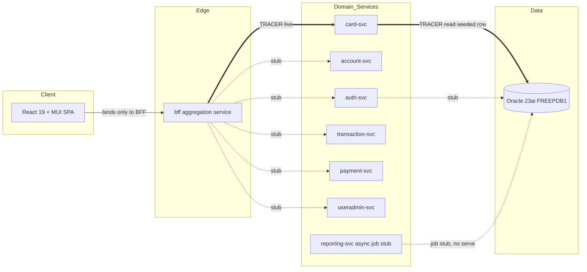
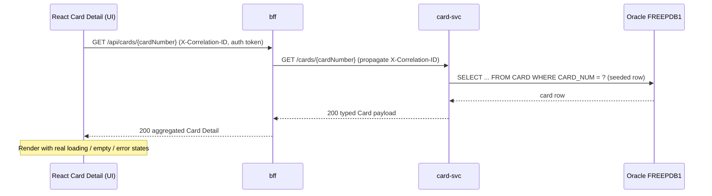

# CardDemo Modernized Walking Skeleton — Architecture

[← Back to skeleton docs index](README.md)

This document describes the target-state architecture of the modernized **CardDemo** walking skeleton. This is a **structural / topology run**: the goal is a skeleton that **builds green** and runs exactly **one** live vertical tracer slice (Card Detail) end-to-end, while every other capability is present only as a typed placeholder stub. All functional epics beyond the single tracer are **[DEFERRED]** with zero implementation.

## Service Topology

The skeleton decomposes the legacy CardDemo CICS application into **seven bounded-context domain services** (Spring Boot 3 / Java 21), one per bounded context, derived from the legacy transaction → program → file groupings registered in the CICS system definition `[SRC: CARDDEMO.CSD]`. A thin **`bff`** (backend-for-frontend) aggregation service fronts the seven domain services — **eight Spring services in total** — and a **React 19 + MUI** single-page application is the sole client. Each request-serving service is packaged as its own long-running container.

| Service | Legacy program(s) | Role / provenance |
|---------|-------------------|-------------------|
| `auth-svc` | COSGN00C | Permissive sign-on / login `[SRC: COSGN00C \| USRSEC]` |
| `account-svc` | COACTVWC / COACTUPC | Account view / update (typed stub) |
| `card-svc` | COCRDLIC / **COCRDSLC** / COCRDUPC | Card list / view / update; **hosts the live tracer** `[SRC: COCRDSLC \| CARDDAT]` |
| `transaction-svc` | COTRN00C / COTRN01C / COTRN02C | Transaction list / view / add (typed stub) |
| `payment-svc` | COBIL00C | Bill payment (typed stub) |
| `useradmin-svc` | COUSR00C–03C, COADM01C | User admin (list/add/update/delete) + admin menu (typed stub) |
| `reporting-svc` | CORPT00C, CBSTM03A/B | **Async job stub** — health-exempt, not start-and-serve |
| `bff` | — | Thin aggregation service — aggregation only, no domain logic |
| `ui` | — | React 19 + MUI SPA — binds **only** to the BFF |

Two hard topology rules govern the skeleton:

- **The UI binds only to the BFF.** There are no direct UI → domain-service calls; every browser request is routed through the `bff` aggregation seam.
- **`reporting-svc` is exempt** from the start-and-serve / `service_healthy` requirement. It is an async **job stub** that must build green and expose an invokable job entrypoint, but it is not held to starting as a request-serving container and does not participate in the health-gated startup chain.

## Target Topology Diagram

Solid double arrows (`==>`) denote the one fully-wired vertical tracer slice; dotted arrows (`-.stub.->`) denote stubbed seams.

## Contract-First APIs

The OpenAPI **3.1** specifications under `/contracts/**` are the **frozen single source of truth (SSoT)** for every seam. There are **eight** specifications — one per domain service plus the BFF — and they are versioned and **frozen** after this run.

- **Java server interfaces** are generated with `openapi-generator-maven-plugin` (`generatorName=spring`, `interfaceOnly=true`). Each controller `implements` the generated interface and returns typed placeholder responses; the generated interfaces and models are never hand-edited.
- **The UI TypeScript client** is generated (`typescript-axios`) from the BFF specification and consumed by the SPA; it too is never hand-edited.

Because both the Java servers and the TypeScript client are regenerated from the same frozen specs, a **contract mismatch fails the build** rather than surfacing at runtime. In this skeleton, *a stub returning a typed placeholder is the correct outcome; a hallucinated implementation is a failure.*

## Data Layer

Persistence is **Oracle Database 23ai** (PDB `FREEPDB1`), accessed via JPA + Hibernate (`OracleDialect`) with the `ojdbc11` driver, and provisioned entirely through **Flyway** migrations:

- `/db/migration/V1__baseline.sql` — the Oracle schema, derived from the VSAM record layouts registered in the CSD `[SRC: CARDDEMO.CSD]` and the card copybook `[SRC: CVACT02Y \| CARDDAT]`.
- `/db/migration/V2__seed_tracer.sql` — seeds **exactly one** card and its owning account (no bulk seeding).

The schema comprises roughly **ten** tables:

- **Core tables** (derived from the six VSAM datasets `[SRC: CARDDEMO.CSD]`): `USERS` (from `USRSEC`), `ACCOUNT` (from `ACCTDAT`), `CUSTOMER` (from `CUSTDAT`), `CARD` (from `CARDDAT`), `CARD_XREF` (from `CCXREF`), and `TRANSACTION` (from `TRANSACT`).
- **Supporting lookup tables**: `TRANSACTION_TYPE`, `TRANSACTION_CATEGORY`, `DISCLOSURE_GROUP`, and `TRANSACTION_CATEGORY_BALANCE`.

Binding persistence rules:

- Surrogate primary keys use **`GENERATED BY DEFAULT AS IDENTITY`**, which is seed-safe and avoids `ORA-32795` when inserting pre-seeded rows.
- JPA `@GeneratedValue` **AUTO / SEQUENCE** strategies are **prohibited**.
- The `CARD` table **retains its natural key `CARD_NUM`**, and the tracer read keys on that natural card number, keeping the surrogate identity PK entirely **off the read path** `[SRC: CVACT02Y \| CARDDAT]`.

The `CARD` table columns map directly from the legacy `CARD-RECORD` copybook `[SRC: CVACT02Y \| CARDDAT]`:

| Oracle column | Legacy COBOL field | Notes |
|---------------|--------------------|-------|
| `CARD_NUM` | `CARD-NUM PIC X(16)` | Natural key; the tracer read keys on this column |
| `CARD_ACCT_ID` | `CARD-ACCT-ID PIC 9(11)` | Owning account identifier |
| `CARD_EMBOSSED_NAME` | `CARD-EMBOSSED-NAME PIC X(50)` | Name on card |
| `CARD_EXPIRAION_DATE` | `CARD-EXPIRAION-DATE PIC X(10)` | Card expiry (legacy field spelling preserved) |
| `CARD_ACTIVE_STATUS` | `CARD-ACTIVE-STATUS PIC X(01)` | Card active flag (Y / N) |

## The Tracer Slice (the one live path)

Exactly one vertical slice is fully wired end-to-end. An authenticated request flows **UI → BFF → `card-svc` → Oracle `FREEPDB1` (a single seeded row) → rendered Card Detail**, with **real loading, empty, and error states** `[SRC: COCRDSLC \| CARDDAT]`, `[SRC: COCRDSLC \| COCRDSL.bms]`.

The rendered Card Detail screen surfaces these fields `[SRC: COCRDSLC \| COCRDSL.bms]`:

- **Account Number**
- **Card Number**
- **Name on card**
- **Active status**
- **Expiry (mm/yyyy)**

The BFF endpoint `GET /api/cards/{cardNumber}` fronts `card-svc`'s `GET /cards/{cardNumber}`, which performs a **real** Oracle read of the seeded row keyed on `CARD_NUM` — mapping directly onto the legacy `EXEC CICS READ FILE(CARDDAT)` keyed on the 16-character card number `[SRC: COCRDSLC \| CARDDAT]`.

## Cross-Cutting Concerns

- **Correlation-ID propagation.** A correlation ID (`X-Correlation-ID`) is generated by the UI **Axios request interceptor** and propagated as a header through UI → BFF → `card-svc`. Each Spring service runs an **`OncePerRequestFilter`** that places the value into the **SLF4J MDC** so it appears in trace logs. This hop is **real** even though authentication is a permissive stub.
- **Auth gate (a real seam over a permissive stub).** The Sign-On screen posts through the BFF to `auth-svc`, which returns a token that is carried on subsequent requests; **React Router route guards** enforce token presence before rendering the menu and screens `[SRC: COSGN00C \| COSGN00.bms]`. The token issuance and correlation-ID hop are real; real credential validation, password hashing, RBAC, and session management are **[DEFERRED]**.

## Navigation

The MUI `Drawer` navigation is built from the legacy **10-option main menu** `[SRC: COMEN01C \| COMEN02Y]`; option 4, "Credit Card View", routes to the live tracer screen. The full option → legacy-program mapping is:

1. Account View → COACTVWC
2. Account Update → COACTUPC
3. Credit Card List → COCRDLIC
4. **Credit Card View → COCRDSLC (tracer route)**
5. Credit Card Update → COCRDUPC
6. Transaction List → COTRN00C
7. Transaction View → COTRN01C
8. Transaction Add → COTRN02C
9. Transaction Reports → CORPT00C
10. Bill Payment → COBIL00C

Every menu destination other than option 4 renders a typed placeholder screen; the underlying functional behavior is **[DEFERRED]**.

## Platform & Deployment

Each service ships as a **multi-stage Dockerfile** built on Eclipse Temurin `21-jdk` (build stage) and run on `21-jre` (runtime stage). The UI image builds with **Node 22** and serves the static bundle via **nginx**.

The root `docker-compose.yml` is the **deployment unit** and gates startup with `depends_on: condition: service_healthy` in the chain **Oracle → Flyway migration → request-serving services**. The request-serving services (`auth`, `account`, `card`, `transaction`, `payment`, `useradmin`, `bff`) each expose Spring Boot Actuator `/actuator/health`, while **`reporting-svc` is exempt** from the health-gated chain.

The `gvenzl/oracle-free` image is pinned to an **explicit version tag** — `23.26.2-slim` — never `latest`, and never the bare, moving `23` / `23-slim` major tag. It serves `FREEPDB1` on port **1521**. The image ships a health-probe script at **`/opt/oracle/healthcheck.sh`** (on the container `PATH`) but defines **no baked Docker `HEALTHCHECK`**; the Compose Oracle service therefore declares its own `healthcheck` that invokes `/opt/oracle/healthcheck.sh` to drive `depends_on: condition: service_healthy`. Continuous integration provisions the database with `gvenzl/setup-oracle-free@v1`.

`docker-compose` is the deployment unit on a **single Linux VM** running Docker Engine; there is **no Kubernetes and no serverless**.

---

[← Index](README.md) · [Write-Ownership Matrix](write-ownership-matrix.md) · [[DEFERRED] Epic Register](deferred-epics.md)
