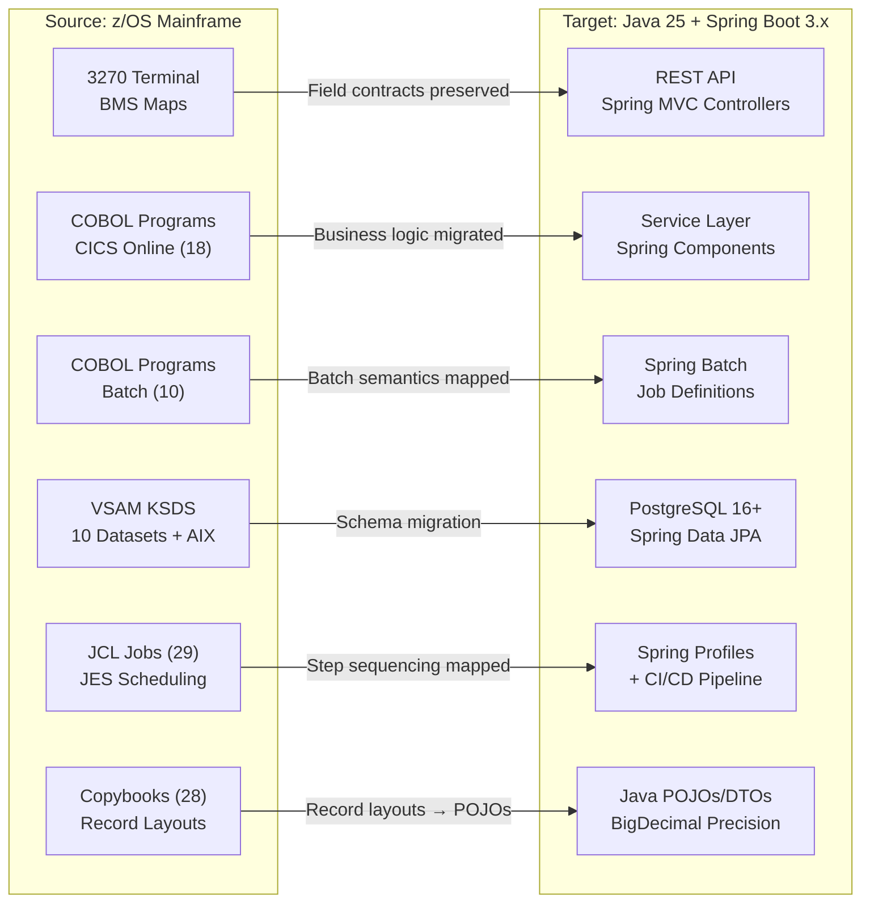

# Technical Specification

# 0. Agent Action Plan

## 0.1 Intent Clarification

### 0.1.1 Core Refactoring Objective

Based on the prompt, the Blitzy platform understands that the refactoring objective is to **migrate the AWS CardDemo mainframe COBOL application — all 28 programs, 28 copybooks, 17 BMS mapsets, 17 symbolic map copybooks, 29 JCL jobs, and 9 data fixture files — to a fully operational Java 25 LTS + Spring Boot 3.x application with 100% behavioral parity**.

- **Refactoring Type:** Tech stack migration — mainframe-to-cloud modernization (COBOL/CICS/VSAM/JCL/BMS → Java/Spring Boot/JPA/Batch/PostgreSQL/AWS)
- **Target Repository:** New repository — the migrated Java application is a standalone greenfield project. COBOL source files are NOT copied into the target repository; traceability references the original COBOL repository by commit SHA.
- **Processing Modes:** The migration spans two execution paradigms: 18 interactive CICS online programs (pseudo-conversational 3270 terminal screens) and 10 batch programs (JES-scheduled jobs), both converging on a shared VSAM data persistence layer comprising 11 primary datasets.

**Refactoring Goals (Enhanced Clarity):**

- Translate all 28 COBOL programs (19,254 lines) to idiomatic Java 25 service components with Spring Boot 3.x orchestration, preserving every control flow semantic including PERFORM THRU, GO TO fall-through, and EVALUATE nesting
- Convert all 28 shared COBOL copybooks into Java POJOs, DTOs, and shared modules with BigDecimal precision for all COMP-3/COMP/PIC S9(n)V99 fields — zero floating-point substitution
- Map all 10 VSAM KSDS datasets, 2 AIX/PATH alternate indexes, and 1 sequential PS staging file to PostgreSQL 16+ relational tables with Spring Data JPA repositories, preserving primary key semantics, composite keys, and alternate index access patterns
- Convert all 29 JCL jobs to Spring Batch jobs with step sequencing, condition code logic, and dataset allocation equivalence — including the 5-stage batch pipeline (POSTTRAN → INTCALC → COMBTRAN → CREASTMT/TRANREPT)
- Replace BMS 3270 terminal screen I/O with REST API endpoints that preserve the same field contracts and validation rules
- Integrate AWS S3 for batch file staging (replacing sequential PS datasets and GDG generations) and SQS/SNS for message queue integration (replacing CICS TDQ)
- Deliver a fully observable application with structured logging, distributed tracing, metrics endpoints, and health checks from initial deployment
- Produce an executive reveal.js presentation, decision log, and bidirectional traceability matrix with 100% COBOL paragraph coverage

**Implicit Requirements Surfaced:**

- All COBOL `FILE STATUS` codes must map to Java exception handling plus status enums — every code path for every I/O operation
- The CICS pseudo-conversational model (RETURN TRANSID COMMAREA) translates to stateless REST endpoints with session or token-based state management
- The sole online-to-batch bridge (CORPT00C → CICS TDQ JOBS queue → JES submission) must be preserved as an SQS-triggered Spring Batch job
- SYNCPOINT ROLLBACK in COACTUPC (the only explicit multi-dataset transactional integrity mechanism) must map to Spring `@Transactional` with rollback semantics
- Optimistic concurrency control in COACTUPC and COCRDUPC must be preserved via JPA `@Version` or equivalent snapshot comparison
- The DFSORT/IDCAMS REPRO operations in COMBTRAN (pure utility, no COBOL program) must be implemented as Spring Batch steps with Java Comparators
- All validation logic — NANPA area codes, US state/ZIP combinations, FICO score ranges, date validation via LE CEEDAYS — must be ported to Java validation services
- Plaintext password storage (constraint C-003) must be upgraded to BCrypt or equivalent hashing in the Java target (security improvement within scope)
- The 9 ASCII fixture files and 13 EBCDIC data files serve as canonical test data for the validation gates

### 0.1.2 Technical Interpretation

This refactoring translates to the following technical transformation strategy:

**Current Architecture → Target Architecture:**



**Transformation Rules and Patterns:**

| Source Construct | Transformation Rule | Target Pattern |
|---|---|---|
| COBOL DATA DIVISION (PIC, COMP-3, COMP) | Exact decimal precision mapping | Java POJOs with `BigDecimal` — no `float`/`double` |
| COBOL PARAGRAPH / SECTION | Method extraction preserving control flow | Service/Component class methods |
| COPY / REPLACE directives | Shared module extraction | Shared DTOs, utility classes |
| VSAM KSDS with keyed access | Relational schema with JPA repositories | `@Entity` classes + `JpaRepository` interfaces |
| VSAM AIX/PATH (alternate indexes) | Secondary JPA query methods | `@Query` or derived queries on alternate fields |
| CICS SEND MAP / RECEIVE MAP | REST request/response DTOs | Spring MVC `@RestController` + validation |
| CICS RETURN TRANSID COMMAREA | Stateless REST with context propagation | JWT or session-scoped state |
| JCL EXEC PGM + DD statements | Spring Batch job configuration | `@Configuration` + `Job`/`Step` beans |
| JCL COND codes | Spring Batch step execution decisions | `JobExecutionDecider` + `FlowBuilder` |
| DFSORT / IDCAMS REPRO | Java sort + bulk insert | `Comparator` + batch `JdbcTemplate` / JPA `saveAll` |
| CICS TDQ WRITEQ | Message queue publish | AWS SQS via Spring Cloud AWS |
| GDG generations | Versioned S3 objects | S3 keys with timestamp/generation prefixes |
| FILE STATUS codes | Exception mapping | Custom exception hierarchy + status enums |
| EXEC CICS SYNCPOINT ROLLBACK | Spring transaction rollback | `@Transactional(rollbackFor=...)` |
| LE CEEDAYS date validation | Java date/time API | `java.time.LocalDate` + custom validators |


## 0.2 Source Analysis

### 0.2.1 Comprehensive Source File Discovery

The CardDemo repository contains **140+ source artifacts** organized across 7 application subdirectories plus governance files. Every file has been inventoried through systematic repository traversal.

**Current Structure Mapping:**

```
Source Repository: aws-samples/carddemo (COBOL Mainframe)
├── README.md                        (Installation guide, feature inventory)
├── CODE_OF_CONDUCT.md               (Amazon Open Source CoC)
├── CONTRIBUTING.md                   (GitHub collaboration workflow)
├── LICENSE                           (Apache 2.0)
├── app/
│   ├── cbl/                         (28 COBOL programs — 19,254 total lines)
│   │   ├── CBACT01C.cbl            (193 lines — Account File Reader utility)
│   │   ├── CBACT02C.cbl            (178 lines — Card File Reader utility)
│   │   ├── CBACT03C.cbl            (178 lines — Cross-Reference File Reader utility)
│   │   ├── CBACT04C.cbl            (652 lines — Interest Calculation batch)
│   │   ├── CBCUS01C.cbl            (178 lines — Customer File Reader utility)
│   │   ├── CBSTM03A.CBL            (924 lines — Statement Generation main)
│   │   ├── CBSTM03B.CBL            (230 lines — Statement file-service subroutine)
│   │   ├── CBTRN01C.cbl            (491 lines — Daily Transaction Validation driver)
│   │   ├── CBTRN02C.cbl            (731 lines — Daily Transaction Posting engine)
│   │   ├── CBTRN03C.cbl            (649 lines — Transaction Report generation)
│   │   ├── COACTUPC.cbl            (4,236 lines — Account Update, most complex)
│   │   ├── COACTVWC.cbl            (941 lines — Account View)
│   │   ├── COADM01C.cbl            (268 lines — Admin Menu)
│   │   ├── COBIL00C.cbl            (572 lines — Bill Payment)
│   │   ├── COCRDLIC.cbl            (1,459 lines — Credit Card List)
│   │   ├── COCRDSLC.cbl            (887 lines — Credit Card Detail)
│   │   ├── COCRDUPC.cbl            (1,560 lines — Credit Card Update)
│   │   ├── COMEN01C.cbl            (282 lines — Regular User Main Menu)
│   │   ├── CORPT00C.cbl            (649 lines — Report Submit, online-to-batch bridge)
│   │   ├── COSGN00C.cbl            (260 lines — Sign-On / Authentication)
│   │   ├── COTRN00C.cbl            (699 lines — Transaction List)
│   │   ├── COTRN01C.cbl            (330 lines — Transaction Detail)
│   │   ├── COTRN02C.cbl            (783 lines — Transaction Add)
│   │   ├── COUSR00C.cbl            (695 lines — User List browse)
│   │   ├── COUSR01C.cbl            (299 lines — User Add)
│   │   ├── COUSR02C.cbl            (414 lines — User Update)
│   │   ├── COUSR03C.cbl            (359 lines — User Delete)
│   │   └── CSUTLDTC.cbl            (157 lines — Date Validation subprogram)
│   ├── cpy/                         (28 shared copybooks)
│   │   ├── COADM02Y.cpy            (Admin menu option table)
│   │   ├── COCOM01Y.cpy            (Central COMMAREA contract)
│   │   ├── COMEN02Y.cpy            (Main menu 10-option table)
│   │   ├── COSTM01.CPY             (Reporting transaction layout)
│   │   ├── COTTL01Y.cpy            (Application banner/title lines)
│   │   ├── CSDAT01Y.cpy            (Date/time working storage)
│   │   ├── CSLKPCDY.cpy            (NANPA, state, ZIP validation tables)
│   │   ├── CSMSG01Y.cpy            (Common user messages)
│   │   ├── CSMSG02Y.cpy            (Abend data work areas)
│   │   ├── CSSETATY.cpy            (BMS field attribute setting)
│   │   ├── CSSTRPFY.cpy            (EIBAID key decoding)
│   │   ├── CSUSR01Y.cpy            (User security record — 80 bytes)
│   │   ├── CSUTLDPY.cpy            (Date validation paragraphs)
│   │   ├── CSUTLDWY.cpy            (Date-edit working storage)
│   │   ├── CUSTREC.cpy             (Customer record layout — 500 bytes)
│   │   ├── CVACT01Y.cpy            (Account record — 300 bytes)
│   │   ├── CVACT02Y.cpy            (Card record — 150 bytes)
│   │   ├── CVACT03Y.cpy            (Card cross-reference — 50 bytes)
│   │   ├── CVCRD01Y.cpy            (Card work areas and routing)
│   │   ├── CVCUS01Y.cpy            (Customer record — 500 bytes)
│   │   ├── CVTRA01Y.cpy            (Category balance record — 50 bytes)
│   │   ├── CVTRA02Y.cpy            (Disclosure group record — 50 bytes)
│   │   ├── CVTRA03Y.cpy            (Transaction type record — 60 bytes)
│   │   ├── CVTRA04Y.cpy            (Transaction category record — 60 bytes)
│   │   ├── CVTRA05Y.cpy            (Transaction record — 350 bytes)
│   │   ├── CVTRA06Y.cpy            (Daily transaction record — 350 bytes)
│   │   ├── CVTRA07Y.cpy            (Report line formats)
│   │   └── UNUSED1Y.cpy            (Reserved/unused 80-byte layout)
│   ├── bms/                         (17 BMS mapset source files)
│   │   ├── COACTVW.bms, COACTUP.bms, COADM01.bms, COBIL00.bms
│   │   ├── COCRDLI.bms, COCRDSL.bms, COCRDUP.bms, COMEN01.bms
│   │   ├── CORPT00.bms, COSGN00.bms
│   │   ├── COTRN00.bms, COTRN01.bms, COTRN02.bms
│   │   └── COUSR00.bms, COUSR01.bms, COUSR02.bms, COUSR03.bms
│   ├── cpy-bms/                     (17 symbolic map copybooks)
│   │   ├── COACTVW.CPY, COACTUP.CPY, COADM01.CPY, COBIL00.CPY
│   │   ├── COCRDLI.CPY, COCRDSL.CPY, COCRDUP.CPY, COMEN01.CPY
│   │   ├── CORPT00.CPY, COSGN00.CPY
│   │   ├── COTRN00.CPY, COTRN01.CPY, COTRN02.CPY
│   │   └── COUSR00.CPY, COUSR01.CPY, COUSR02.CPY, COUSR03.CPY
│   ├── jcl/                         (29 JCL jobs)
│   │   ├── ACCTFILE.jcl, CARDFILE.jcl, CUSTFILE.jcl, XREFFILE.jcl
│   │   ├── TRANFILE.jcl, TRANIDX.jcl, TRANBKP.jcl
│   │   ├── TCATBALF.jcl, TRANCATG.jcl, TRANTYPE.jcl, DISCGRP.jcl
│   │   ├── DUSRSECJ.jcl, DEFCUST.jcl, DEFGDGB.jcl, REPTFILE.jcl, DALYREJS.jcl
│   │   ├── CLOSEFIL.jcl, OPENFIL.jcl, CBADMCDJ.jcl
│   │   ├── POSTTRAN.jcl, INTCALC.jcl, COMBTRAN.jcl
│   │   ├── CREASTMT.JCL, TRANREPT.jcl, PRTCATBL.jcl
│   │   └── READACCT.jcl, READCARD.jcl, READCUST.jcl, READXREF.jcl
│   ├── data/
│   │   ├── ASCII/                   (9 fixture files)
│   │   │   ├── acctdata.txt, carddata.txt, custdata.txt, cardxref.txt
│   │   │   ├── dailytran.txt, discgrp.txt, tcatbal.txt
│   │   │   └── trancatg.txt, trantype.txt
│   │   └── EBCDIC/                  (13 binary data files)
│   │       ├── AWS.M2.CARDDEMO.ACCTDATA.PS, .CARDDATA.PS, .CUSTDATA.PS
│   │       ├── AWS.M2.CARDDEMO.CARDXREF.PS, .DALYTRAN.PS, .DALYTRAN.PS.INIT
│   │       ├── AWS.M2.CARDDEMO.DISCGRP.PS, .TCATBALF.PS
│   │       ├── AWS.M2.CARDDEMO.TRANCATG.PS, .TRANTYPE.PS, .USRSEC.PS
│   │       └── AWS.M2.CARDDEMO.ACCDATA.PS, .gitkeep
│   └── catlg/
│       └── LISTCAT.txt              (IDCAMS catalog report — 209 entries)
└── samples/
    └── jcl/                         (3 sample build JCL)
        ├── BATCMP.jcl, BMSCMP.jcl, CICCMP.jcl
```

### 0.2.2 Source Artifact Inventory Summary

| Category | Count | Location | Migration Relevance |
|---|---|---|---|
| COBOL Online Programs | 18 | `app/cbl/CO*.cbl` | Each becomes a Spring service + REST controller |
| COBOL Batch Programs | 10 | `app/cbl/CB*.cbl` + `CSUTLDTC.cbl` | Each becomes a Spring Batch job step or utility |
| Shared Copybooks (Record) | 15 | `app/cpy/CV*.cpy`, `CUSTREC.cpy`, `CSUSR01Y.cpy` | Each becomes a JPA `@Entity` or DTO class |
| Shared Copybooks (Logic) | 13 | `app/cpy/CO*.cpy`, `CS*.cpy`, `UNUSED1Y.cpy` | Each becomes a shared utility or configuration class |
| BMS Map Sources | 17 | `app/bms/*.bms` | Each maps to REST API request/response contracts |
| Symbolic Map Copybooks | 17 | `app/cpy-bms/*.CPY` | Merged into DTO field definitions |
| JCL Provisioning Jobs | 16 | `app/jcl/` (VSAM/GDG/CICS admin) | Become Flyway migrations + Docker Compose setup |
| JCL Business Batch Jobs | 9 | `app/jcl/` (POSTTRAN, INTCALC, etc.) | Become Spring Batch job definitions |
| JCL Utility Read Jobs | 4 | `app/jcl/READ*.jcl` | Become diagnostic/health-check endpoints |
| ASCII Fixture Data | 9 | `app/data/ASCII/*.txt` | Become SQL seed scripts and test fixtures |
| EBCDIC Data Files | 13 | `app/data/EBCDIC/` | Reference for validation; ASCII equivalents used |
| Catalog Report | 1 | `app/catlg/LISTCAT.txt` | Reference for VSAM cluster verification |
| Sample Build JCL | 3 | `samples/jcl/*.jcl` | Become Maven/Gradle build configuration |
| Repository Governance | 4 | Root (`README.md`, `LICENSE`, etc.) | Updated for Java project context |

**Total Source Artifacts: 149 files across 12 directories**


## 0.3 Scope Boundaries

### 0.3.1 Exhaustively In Scope

**Source Transformations (COBOL → Java):**
- `app/cbl/*.cbl` — All 28 COBOL programs (18 online + 10 batch)
- `app/cbl/*.CBL` — Statement generation programs (CBSTM03A.CBL, CBSTM03B.CBL)
- `app/cpy/*.cpy` — All 28 shared copybooks (record layouts, validation, COMMAREA)
- `app/cpy/*.CPY` — COSTM01.CPY reporting layout
- `app/cpy-bms/*.CPY` — All 17 symbolic map copybooks (field contract definitions)
- `app/bms/*.bms` — All 17 BMS mapset definitions (screen layouts → API contracts)
- `app/jcl/*.jcl` — All 29 JCL jobs (provisioning + business batch)
- `app/jcl/*.JCL` — CREASTMT.JCL statement generation job
- `samples/jcl/*.jcl` — 3 sample build JCL (build pattern reference)

**Data Migration:**
- `app/data/ASCII/*.txt` — All 9 ASCII fixture files → SQL seed scripts and test data
- `app/data/EBCDIC/*` — All 13 EBCDIC files → reference for byte-level validation
- `app/catlg/LISTCAT.txt` — Catalog report → schema verification reference

**Target Deliverables (New Java Repository):**
- Java 25 LTS source code with Spring Boot 3.5.x application structure
- Spring Data JPA entities mapping all 11 VSAM/PS data entities to PostgreSQL tables
- Spring Batch job definitions for the complete 5-stage batch pipeline
- REST API controllers preserving all 22 features (F-001 through F-022)
- Spring Security configuration with BCrypt password hashing
- AWS S3 integration for batch file staging via LocalStack
- AWS SQS/SNS integration for message queue via LocalStack
- PostgreSQL 16+ schema migrations (Flyway)
- Docker Compose for local development (PostgreSQL, LocalStack)
- Testcontainers-based integration tests
- Maven build producing deployable artifact with zero warnings

**Observability Deliverables:**
- Structured logging with correlation IDs (SLF4J + Logback structured format)
- Distributed tracing across service boundaries (Micrometer Tracing)
- Metrics endpoint (Spring Boot Actuator + Micrometer)
- Health and readiness checks (`/actuator/health`, `/actuator/readiness`)
- Dashboard template (Grafana JSON or equivalent)

**Documentation Deliverables:**
- README.md with complete setup-to-running instructions
- Bidirectional traceability matrix (100% COBOL paragraph coverage)
- Decision log (Markdown table: decision, alternatives, rationale, risks)
- Executive reveal.js HTML presentation
- Before/after architecture Mermaid diagrams
- Onboarding guide for new developers

**Validation Gate Deliverables:**
- Gate 1: End-to-end boundary verification comparison report
- Gate 2: Zero-warning build evidence
- Gate 3: Performance baseline benchmark report
- Gate 4: Named real-world validation artifacts with comparison
- Gate 5: API/interface contract verification test suite
- Gate 6: Unsafe/low-level code audit report
- Gate 7: Extended scope matching confirmation
- Gate 8: Integration sign-off checklist

**Test Coverage:**
- `src/test/**/*.java` — JUnit 5 unit tests
- `src/test/**/*IT.java` — Integration tests with Testcontainers
- `src/test/**/*E2E.java` — End-to-end tests with LocalStack
- ≥80% line coverage (unit + integration combined)
- OWASP dependency-check — zero critical/high CVEs

### 0.3.2 Explicitly Out of Scope

Per the user's explicit boundaries and preservation requirements:

- **No feature expansion** — Migrate what exists in COBOL; do not add new business features beyond the 22 documented features (F-001 through F-022)
- **No COBOL source copying** — COBOL files are NOT copied into the target repository; traceability references the original repository by commit SHA
- **No infrastructure provisioning** — The migration architect does NOT have authority over infrastructure provisioning, COBOL runtime decommissioning, or external interface contract changes
- **No production/staging access** — All validation runs against local development environment only (Docker Compose, Testcontainers, LocalStack)
- **No live AWS dependencies** — Every AWS service interaction must be verifiable against LocalStack with zero live AWS credentials
- **No hardcoded credentials** — Secrets via environment variables or vault references only
- **EBCDIC binary files** — The EBCDIC data files in `app/data/EBCDIC/` are reference only; ASCII equivalents are used for data migration
- **RACF security integration** — The original application uses file-based authentication (not RACF); this constraint is preserved
- **Db2, IMS, and MQ integrations** — These were explicitly deferred in the original application (constraint C-001) and remain out of scope
- **Web/browser UI** — The migration targets REST API endpoints, not a graphical web interface (unless explicitly added as a separate feature)


## 0.4 Target Design

### 0.4.1 Refactored Structure Planning

The target Java repository is a standalone, fully operational Spring Boot 3.x application. The structure follows Maven standard layout conventions, Spring Boot best practices, and a modular domain-driven design that maps naturally from the COBOL program organization.

```
Target: carddemo-java/
├── pom.xml                                          (Maven build, dependencies, plugins)
├── mvnw / mvnw.cmd                                  (Maven wrapper scripts)
├── .mvn/wrapper/maven-wrapper.properties             (Maven wrapper config)
├── Dockerfile                                        (Application container image)
├── docker-compose.yml                                (PostgreSQL, LocalStack, app services)
├── localstack-init/                                  (LocalStack resource provisioning)
│   └── init-aws.sh                                   (S3 buckets, SQS queues creation)
├── README.md                                         (Setup, build, run, onboarding)
├── DECISION_LOG.md                                   (All non-trivial decision rationale)
├── TRACEABILITY_MATRIX.md                            (COBOL → Java bidirectional mapping)
├── docs/
│   ├── executive-presentation.html                   (reveal.js executive summary)
│   ├── architecture-before-after.md                  (Mermaid architecture diagrams)
│   ├── onboarding-guide.md                           (New developer quickstart)
│   ├── validation-gates.md                           (Gate 1-8 evidence and reports)
│   └── api-contracts.md                              (REST endpoint specifications)
├── src/
│   ├── main/
│   │   ├── java/com/cardemo/
│   │   │   ├── CardDemoApplication.java              (Spring Boot main class)
│   │   │   ├── config/
│   │   │   │   ├── SecurityConfig.java               (Spring Security + BCrypt)
│   │   │   │   ├── BatchConfig.java                  (Spring Batch infrastructure)
│   │   │   │   ├── AwsConfig.java                    (S3, SQS/SNS client beans)
│   │   │   │   ├── JpaConfig.java                    (JPA/Hibernate configuration)
│   │   │   │   ├── ObservabilityConfig.java          (Tracing, metrics, logging)
│   │   │   │   └── WebConfig.java                    (CORS, serialization, error handling)
│   │   │   ├── model/
│   │   │   │   ├── entity/
│   │   │   │   │   ├── Account.java                  (← CVACT01Y.cpy, 300-byte record)
│   │   │   │   │   ├── Card.java                     (← CVACT02Y.cpy, 150-byte record)
│   │   │   │   │   ├── Customer.java                 (← CVCUS01Y.cpy, 500-byte record)
│   │   │   │   │   ├── CardCrossReference.java       (← CVACT03Y.cpy, 50-byte record)
│   │   │   │   │   ├── Transaction.java              (← CVTRA05Y.cpy, 350-byte record)
│   │   │   │   │   ├── UserSecurity.java             (← CSUSR01Y.cpy, 80-byte record)
│   │   │   │   │   ├── TransactionCategoryBalance.java (← CVTRA01Y.cpy, composite key)
│   │   │   │   │   ├── DisclosureGroup.java          (← CVTRA02Y.cpy, composite key)
│   │   │   │   │   ├── TransactionType.java          (← CVTRA03Y.cpy, 60-byte record)
│   │   │   │   │   ├── TransactionCategory.java      (← CVTRA04Y.cpy, composite key)
│   │   │   │   │   └── DailyTransaction.java         (← CVTRA06Y.cpy, staging entity)
│   │   │   │   ├── dto/
│   │   │   │   │   ├── AccountDto.java               (API view/update payloads)
│   │   │   │   │   ├── CardDto.java                  (Card list/detail/update payloads)
│   │   │   │   │   ├── TransactionDto.java           (Transaction CRUD payloads)
│   │   │   │   │   ├── UserSecurityDto.java          (User admin payloads)
│   │   │   │   │   ├── SignOnRequest.java             (Authentication request)
│   │   │   │   │   ├── SignOnResponse.java            (Authentication response with token)
│   │   │   │   │   ├── BillPaymentRequest.java       (Bill payment request)
│   │   │   │   │   ├── ReportRequest.java            (Report criteria submission)
│   │   │   │   │   └── CommArea.java                  (← COCOM01Y.cpy COMMAREA mapping)
│   │   │   │   ├── enums/
│   │   │   │   │   ├── UserType.java                 (ADMIN / USER role enum)
│   │   │   │   │   ├── FileStatus.java               (COBOL FILE STATUS code mappings)
│   │   │   │   │   ├── TransactionSource.java        (Transaction origination sources)
│   │   │   │   │   └── RejectCode.java               (Batch rejection codes 100-109)
│   │   │   │   └── key/
│   │   │   │       ├── TransactionCategoryBalanceId.java (Composite PK: acctId+typeCode+catCode)
│   │   │   │       ├── DisclosureGroupId.java        (Composite PK: groupId+typeCode+catCode)
│   │   │   │       └── TransactionCategoryId.java    (Composite PK: typeCode+catCode)
│   │   │   ├── repository/
│   │   │   │   ├── AccountRepository.java            (← ACCTDAT VSAM access)
│   │   │   │   ├── CardRepository.java               (← CARDDAT VSAM access)
│   │   │   │   ├── CustomerRepository.java           (← CUSTDAT VSAM access)
│   │   │   │   ├── CardCrossReferenceRepository.java (← CARDXREF + CXACAIX access)
│   │   │   │   ├── TransactionRepository.java        (← TRANSACT VSAM + AIX access)
│   │   │   │   ├── UserSecurityRepository.java       (← USRSEC VSAM access)
│   │   │   │   ├── TransactionCategoryBalanceRepository.java (← TCATBALF access)
│   │   │   │   ├── DisclosureGroupRepository.java    (← DISCGRP access)
│   │   │   │   ├── TransactionTypeRepository.java    (← TRANTYPE access)
│   │   │   │   ├── TransactionCategoryRepository.java (← TRANCATG access)
│   │   │   │   └── DailyTransactionRepository.java   (← DALYTRAN staging access)
│   │   │   ├── service/
│   │   │   │   ├── auth/
│   │   │   │   │   └── AuthenticationService.java    (← COSGN00C.cbl sign-on logic)
│   │   │   │   ├── account/
│   │   │   │   │   ├── AccountViewService.java       (← COACTVWC.cbl)
│   │   │   │   │   └── AccountUpdateService.java     (← COACTUPC.cbl + SYNCPOINT logic)
│   │   │   │   ├── card/
│   │   │   │   │   ├── CardListService.java          (← COCRDLIC.cbl paginated browse)
│   │   │   │   │   ├── CardDetailService.java        (← COCRDSLC.cbl)
│   │   │   │   │   └── CardUpdateService.java        (← COCRDUPC.cbl + concurrency)
│   │   │   │   ├── transaction/
│   │   │   │   │   ├── TransactionListService.java   (← COTRN00C.cbl paginated browse)
│   │   │   │   │   ├── TransactionDetailService.java (← COTRN01C.cbl)
│   │   │   │   │   └── TransactionAddService.java    (← COTRN02C.cbl + auto-ID)
│   │   │   │   ├── billing/
│   │   │   │   │   └── BillPaymentService.java       (← COBIL00C.cbl)
│   │   │   │   ├── report/
│   │   │   │   │   └── ReportSubmissionService.java  (← CORPT00C.cbl → SQS trigger)
│   │   │   │   ├── admin/
│   │   │   │   │   ├── UserListService.java          (← COUSR00C.cbl)
│   │   │   │   │   ├── UserAddService.java           (← COUSR01C.cbl)
│   │   │   │   │   ├── UserUpdateService.java        (← COUSR02C.cbl)
│   │   │   │   │   └── UserDeleteService.java        (← COUSR03C.cbl)
│   │   │   │   ├── menu/
│   │   │   │   │   ├── MainMenuService.java          (← COMEN01C.cbl option routing)
│   │   │   │   │   └── AdminMenuService.java         (← COADM01C.cbl option routing)
│   │   │   │   └── shared/
│   │   │   │       ├── DateValidationService.java    (← CSUTLDTC.cbl + CSUTLDPY.cpy)
│   │   │   │       ├── ValidationLookupService.java  (← CSLKPCDY.cpy NANPA/state/ZIP)
│   │   │   │       └── FileStatusMapper.java         (← FILE STATUS → exception mapping)
│   │   │   ├── controller/
│   │   │   │   ├── AuthController.java               (POST /api/auth/signin)
│   │   │   │   ├── AccountController.java            (GET/PUT /api/accounts/*)
│   │   │   │   ├── CardController.java               (GET/PUT /api/cards/*)
│   │   │   │   ├── TransactionController.java        (GET/POST /api/transactions/*)
│   │   │   │   ├── BillingController.java            (POST /api/billing/pay)
│   │   │   │   ├── ReportController.java             (POST /api/reports/submit)
│   │   │   │   ├── UserAdminController.java          (CRUD /api/admin/users/*)
│   │   │   │   └── MenuController.java               (GET /api/menu/*)
│   │   │   ├── batch/
│   │   │   │   ├── jobs/
│   │   │   │   │   ├── DailyTransactionPostingJob.java   (← POSTTRAN.jcl + CBTRN02C)
│   │   │   │   │   ├── InterestCalculationJob.java       (← INTCALC.jcl + CBACT04C)
│   │   │   │   │   ├── CombineTransactionsJob.java       (← COMBTRAN.jcl DFSORT+REPRO)
│   │   │   │   │   ├── StatementGenerationJob.java       (← CREASTMT.JCL + CBSTM03A/B)
│   │   │   │   │   ├── TransactionReportJob.java         (← TRANREPT.jcl + CBTRN03C)
│   │   │   │   │   └── BatchPipelineOrchestrator.java    (5-stage sequential orchestration)
│   │   │   │   ├── processors/
│   │   │   │   │   ├── TransactionPostingProcessor.java  (4-stage validation cascade)
│   │   │   │   │   ├── InterestCalculationProcessor.java (Rate lookup + computation)
│   │   │   │   │   ├── TransactionCombineProcessor.java  (Sort + merge logic)
│   │   │   │   │   ├── StatementProcessor.java           (Text + HTML generation)
│   │   │   │   │   └── TransactionReportProcessor.java   (Date filtering + enrichment)
│   │   │   │   ├── readers/
│   │   │   │   │   ├── DailyTransactionReader.java       (S3 file reader)
│   │   │   │   │   ├── AccountFileReader.java            (← CBACT01C utility)
│   │   │   │   │   ├── CardFileReader.java               (← CBACT02C utility)
│   │   │   │   │   ├── CrossReferenceFileReader.java     (← CBACT03C utility)
│   │   │   │   │   └── CustomerFileReader.java           (← CBCUS01C utility)
│   │   │   │   └── writers/
│   │   │   │       ├── TransactionWriter.java            (DB + S3 output)
│   │   │   │       ├── RejectWriter.java                 (S3 rejection file output)
│   │   │   │       └── StatementWriter.java              (S3 text + HTML output)
│   │   │   ├── exception/
│   │   │   │   ├── CardDemoException.java                (Base exception)
│   │   │   │   ├── RecordNotFoundException.java          (← INVALID KEY)
│   │   │   │   ├── DuplicateRecordException.java         (← DUPKEY/DUPREC)
│   │   │   │   ├── ConcurrentModificationException.java  (← Snapshot mismatch)
│   │   │   │   ├── CreditLimitExceededException.java     (← Reject code 102)
│   │   │   │   ├── ExpiredCardException.java             (← Reject code 103)
│   │   │   │   └── ValidationException.java              (Field validation failures)
│   │   │   └── observability/
│   │   │       ├── CorrelationIdFilter.java              (Request correlation ID injection)
│   │   │       ├── MetricsConfig.java                    (Custom business metrics)
│   │   │       └── HealthIndicators.java                 (DB, S3, SQS health checks)
│   │   └── resources/
│   │       ├── application.yml                           (Spring Boot main config)
│   │       ├── application-local.yml                     (LocalStack + local PostgreSQL)
│   │       ├── application-test.yml                      (Testcontainers config)
│   │       ├── db/migration/
│   │       │   ├── V1__create_schema.sql                 (All 11 tables DDL)
│   │       │   ├── V2__create_indexes.sql                (Primary + alternate indexes)
│   │       │   └── V3__seed_data.sql                     (← ASCII fixture data)
│   │       ├── validation/
│   │       │   ├── nanpa-area-codes.json                 (← CSLKPCDY NANPA data)
│   │       │   ├── us-state-codes.json                   (← CSLKPCDY state data)
│   │       │   └── state-zip-prefixes.json               (← CSLKPCDY ZIP prefixes)
│   │       └── logback-spring.xml                        (Structured logging config)
│   └── test/
│       └── java/com/cardemo/
│           ├── unit/
│           │   ├── service/                              (Unit tests for each service)
│           │   ├── batch/                                (Batch processor unit tests)
│           │   └── validation/                           (Validation logic unit tests)
│           ├── integration/
│           │   ├── repository/                           (JPA repository tests)
│           │   ├── batch/                                (Spring Batch integration tests)
│           │   └── aws/                                  (LocalStack integration tests)
│           └── e2e/
│               ├── BatchPipelineE2ETest.java             (Full pipeline with real data)
│               ├── OnlineTransactionE2ETest.java         (REST API end-to-end)
│               └── GateVerificationTest.java             (Validation gate evidence)
```

### 0.4.2 Web Search Research Conducted

- **Java 25 LTS**: Released September 16, 2025 as the latest LTS after Java 21. Includes 18 JEPs with features like flexible constructor bodies, compact source files, module import declarations, and compact object headers. Oracle provides at least 8 years of LTS support.
- **Spring Boot 3.5.x**: Spring Boot 3.5.11 (released February 19, 2026) is the latest stable 3.x release. Spring Boot 3.x requires Java 17 minimum and uses Jakarta EE 10 APIs. Includes built-in support for structured logging, observability via Micrometer, and virtual threads.
- **PostgreSQL 16+**: PostgreSQL 16.13 (released February 26, 2026) is the latest 16.x patch. PostgreSQL 16 provides improved query parallelism, bulk loading performance (up to 300% improvement), and enhanced SQL/JSON syntax.
- **COBOL-to-Java migration patterns**: Industry standard practice for VSAM-to-RDBMS migration includes BigDecimal for COMP-3 precision, fixed-point arithmetic preservation, and record-level mapping to JPA entities.

### 0.4.3 Design Pattern Applications

| Pattern | Application in CardDemo Migration |
|---|---|
| **Repository Pattern** | Spring Data JPA repositories for each VSAM KSDS dataset — `AccountRepository`, `TransactionRepository`, etc. |
| **Service Layer** | Each COBOL online program maps to a service class encapsulating business logic, decoupled from controller and repository layers |
| **DTO Pattern** | Request/response DTOs separate API contracts from JPA entities, mirroring the BMS symbolic map role |
| **Strategy Pattern** | Batch processors implement pluggable validation strategies (4-stage cascade in POSTTRAN) |
| **Template Method** | Statement generation (CBSTM03A + CBSTM03B file-service subroutine) maps to a template method pattern with injectable data sources |
| **Factory Pattern** | Transaction ID auto-generation (browse-to-end + increment) implemented via sequence factory |
| **Observer Pattern** | Online-to-batch bridge (CORPT00C → TDQ) maps to SQS message publishing with Spring event listeners |
| **Composite Key** | JPA `@IdClass` / `@EmbeddedId` for TCATBALF, DISCGRP, and TRANCATG composite keys |
| **Optimistic Locking** | JPA `@Version` for Account and Card update concurrency (replacing CICS READ UPDATE snapshot comparison) |
| **Transaction Management** | Spring `@Transactional` with explicit rollback for COACTUPC dual-dataset update pattern |


## 0.5 Transformation Mapping

### 0.5.1 File-by-File Transformation Plan

The entire refactor executes in ONE phase. Every target file is mapped to its source artifact(s).

**Transformation Modes:**
- **CREATE** — New file in the Java target repository with logic translated from the COBOL source
- **REFERENCE** — Use as an example to reflect existing patterns, styles, or designs

#### Project Root and Configuration

| Target File | Transformation | Source File(s) | Key Changes |
|---|---|---|---|
| `pom.xml` | CREATE | `app/jcl/CBADMCDJ.jcl` (build reference) | Maven POM with Spring Boot 3.5.x parent, all dependencies |
| `Dockerfile` | CREATE | (none) | Multi-stage build for Java 25 application |
| `docker-compose.yml` | CREATE | `app/jcl/DEFGDGB.jcl`, `app/jcl/DUSRSECJ.jcl` | PostgreSQL 16, LocalStack, app service |
| `localstack-init/init-aws.sh` | CREATE | `app/jcl/DEFGDGB.jcl` | S3 bucket and SQS queue creation scripts |
| `README.md` | CREATE | `README.md` | Java project setup, build, run, onboarding |
| `DECISION_LOG.md` | CREATE | (none) | All non-trivial architectural decisions |
| `TRACEABILITY_MATRIX.md` | CREATE | `app/cbl/*.cbl`, `app/cpy/*.cpy` | 100% COBOL paragraph → Java method mapping |
| `.gitignore` | CREATE | (none) | Java/Maven/IDE ignore patterns |
| `mvnw` / `mvnw.cmd` | CREATE | (none) | Maven wrapper scripts |

#### Documentation

| Target File | Transformation | Source File(s) | Key Changes |
|---|---|---|---|
| `docs/executive-presentation.html` | CREATE | All source files | reveal.js slides with Mermaid diagrams |
| `docs/architecture-before-after.md` | CREATE | All source files | Before/after architecture Mermaid diagrams |
| `docs/onboarding-guide.md` | CREATE | `README.md` | Developer setup, domain context, pitfalls |
| `docs/validation-gates.md` | CREATE | (none) | Gate 1-8 evidence documentation |
| `docs/api-contracts.md` | CREATE | `app/bms/*.bms`, `app/cpy-bms/*.CPY` | REST API endpoint specifications |

#### Spring Boot Application and Configuration

| Target File | Transformation | Source File(s) | Key Changes |
|---|---|---|---|
| `src/main/java/**/CardDemoApplication.java` | CREATE | `app/cbl/COSGN00C.cbl` | Spring Boot main class with `@SpringBootApplication` |
| `src/main/java/**/config/SecurityConfig.java` | CREATE | `app/cbl/COSGN00C.cbl`, `app/cpy/CSUSR01Y.cpy` | Spring Security with BCrypt, role-based access |
| `src/main/java/**/config/BatchConfig.java` | CREATE | `app/jcl/POSTTRAN.jcl`, `app/jcl/INTCALC.jcl`, `app/jcl/COMBTRAN.jcl` | Spring Batch infrastructure, job launcher |
| `src/main/java/**/config/AwsConfig.java` | CREATE | `app/jcl/DEFGDGB.jcl` | S3 + SQS/SNS client beans with LocalStack profiles |
| `src/main/java/**/config/JpaConfig.java` | CREATE | `app/jcl/TRANFILE.jcl`, `app/jcl/XREFFILE.jcl` | JPA/Hibernate config, auditing, naming strategy |
| `src/main/java/**/config/ObservabilityConfig.java` | CREATE | (none) | Micrometer tracing, metrics, correlation IDs |
| `src/main/java/**/config/WebConfig.java` | CREATE | (none) | CORS, Jackson serialization, error handling |
| `src/main/resources/application.yml` | CREATE | `app/jcl/*.jcl` (dataset names) | Spring profiles, DB, S3, SQS, actuator config |
| `src/main/resources/application-local.yml` | CREATE | (none) | LocalStack endpoints, local PostgreSQL |
| `src/main/resources/application-test.yml` | CREATE | (none) | Testcontainers config |
| `src/main/resources/logback-spring.xml` | CREATE | (none) | Structured logging with correlation IDs |

#### JPA Entity Classes (from Copybooks)

| Target File | Transformation | Source File(s) | Key Changes |
|---|---|---|---|
| `src/main/java/**/model/entity/Account.java` | CREATE | `app/cpy/CVACT01Y.cpy` | `@Entity` with BigDecimal for ACCT-CURR-BAL, ACCT-CREDIT-LIMIT; `@Version` for optimistic locking |
| `src/main/java/**/model/entity/Card.java` | CREATE | `app/cpy/CVACT02Y.cpy` | `@Entity` with FK to Account, active status enum |
| `src/main/java/**/model/entity/Customer.java` | CREATE | `app/cpy/CVCUS01Y.cpy`, `app/cpy/CUSTREC.cpy` | `@Entity` with SSN encryption, 500-byte field mapping |
| `src/main/java/**/model/entity/CardCrossReference.java` | CREATE | `app/cpy/CVACT03Y.cpy` | `@Entity` with composite FK relationships |
| `src/main/java/**/model/entity/Transaction.java` | CREATE | `app/cpy/CVTRA05Y.cpy` | `@Entity` with BigDecimal TRAN-AMT, timestamp fields |
| `src/main/java/**/model/entity/UserSecurity.java` | CREATE | `app/cpy/CSUSR01Y.cpy` | `@Entity` with BCrypt password hash, role enum |
| `src/main/java/**/model/entity/TransactionCategoryBalance.java` | CREATE | `app/cpy/CVTRA01Y.cpy` | `@Entity` with `@EmbeddedId` composite key (acctId+typeCode+catCode) |
| `src/main/java/**/model/entity/DisclosureGroup.java` | CREATE | `app/cpy/CVTRA02Y.cpy` | `@Entity` with `@EmbeddedId` composite key, BigDecimal interest rate |
| `src/main/java/**/model/entity/TransactionType.java` | CREATE | `app/cpy/CVTRA03Y.cpy` | `@Entity` with 2-byte type code PK |
| `src/main/java/**/model/entity/TransactionCategory.java` | CREATE | `app/cpy/CVTRA04Y.cpy` | `@Entity` with `@EmbeddedId` composite key (typeCode+catCode) |
| `src/main/java/**/model/entity/DailyTransaction.java` | CREATE | `app/cpy/CVTRA06Y.cpy` | `@Entity` for batch staging table, mirrors Transaction layout |

#### DTO and Enum Classes

| Target File | Transformation | Source File(s) | Key Changes |
|---|---|---|---|
| `src/main/java/**/model/dto/AccountDto.java` | CREATE | `app/cpy-bms/COACTVW.CPY`, `app/cpy-bms/COACTUP.CPY` | API view/update payloads from BMS field contracts |
| `src/main/java/**/model/dto/CardDto.java` | CREATE | `app/cpy-bms/COCRDLI.CPY`, `app/cpy-bms/COCRDSL.CPY`, `app/cpy-bms/COCRDUP.CPY` | Card list/detail/update payloads |
| `src/main/java/**/model/dto/TransactionDto.java` | CREATE | `app/cpy-bms/COTRN00.CPY`, `app/cpy-bms/COTRN01.CPY`, `app/cpy-bms/COTRN02.CPY` | Transaction CRUD payloads |
| `src/main/java/**/model/dto/UserSecurityDto.java` | CREATE | `app/cpy-bms/COUSR00.CPY`, `app/cpy-bms/COUSR01.CPY`, `app/cpy-bms/COUSR02.CPY`, `app/cpy-bms/COUSR03.CPY` | User admin payloads |
| `src/main/java/**/model/dto/SignOnRequest.java` | CREATE | `app/cpy-bms/COSGN00.CPY` | Authentication request with userId, password |
| `src/main/java/**/model/dto/SignOnResponse.java` | CREATE | `app/cpy/COCOM01Y.cpy` | Auth response with token, userType, routing |
| `src/main/java/**/model/dto/BillPaymentRequest.java` | CREATE | `app/cpy-bms/COBIL00.CPY` | Bill payment request with accountId, confirmation |
| `src/main/java/**/model/dto/ReportRequest.java` | CREATE | `app/cpy-bms/CORPT00.CPY` | Report criteria: monthly/yearly/custom, dates |
| `src/main/java/**/model/dto/CommArea.java` | CREATE | `app/cpy/COCOM01Y.cpy` | Central session state DTO |
| `src/main/java/**/model/enums/UserType.java` | CREATE | `app/cpy/CSUSR01Y.cpy` | ADMIN('A') / USER('U') enum |
| `src/main/java/**/model/enums/FileStatus.java` | CREATE | `app/cbl/CBTRN02C.cbl` | All COBOL FILE STATUS codes mapped |
| `src/main/java/**/model/enums/TransactionSource.java` | CREATE | `app/data/ASCII/dailytran.txt` | POS TERM, OPERATOR, etc. |
| `src/main/java/**/model/enums/RejectCode.java` | CREATE | `app/cbl/CBTRN02C.cbl` | Codes 100-109 with descriptions |
| `src/main/java/**/model/key/TransactionCategoryBalanceId.java` | CREATE | `app/cpy/CVTRA01Y.cpy` | `@Embeddable` composite key |
| `src/main/java/**/model/key/DisclosureGroupId.java` | CREATE | `app/cpy/CVTRA02Y.cpy` | `@Embeddable` composite key |
| `src/main/java/**/model/key/TransactionCategoryId.java` | CREATE | `app/cpy/CVTRA04Y.cpy` | `@Embeddable` composite key |

#### Repository Interfaces

| Target File | Transformation | Source File(s) | Key Changes |
|---|---|---|---|
| `src/main/java/**/repository/AccountRepository.java` | CREATE | `app/jcl/ACCTFILE.jcl` | `JpaRepository<Account, String>` with custom queries |
| `src/main/java/**/repository/CardRepository.java` | CREATE | `app/jcl/CARDFILE.jcl` | With `findByCardAcctId()` for account-based lookup |
| `src/main/java/**/repository/CustomerRepository.java` | CREATE | `app/jcl/CUSTFILE.jcl` | Standard JPA repository |
| `src/main/java/**/repository/CardCrossReferenceRepository.java` | CREATE | `app/jcl/XREFFILE.jcl` | `findByXrefAcctId()` (← CXACAIX alternate index) |
| `src/main/java/**/repository/TransactionRepository.java` | CREATE | `app/jcl/TRANFILE.jcl` | With pagination, date range, and max-ID queries |
| `src/main/java/**/repository/UserSecurityRepository.java` | CREATE | `app/jcl/DUSRSECJ.jcl` | `findBySecUsrId()` for authentication |
| `src/main/java/**/repository/TransactionCategoryBalanceRepository.java` | CREATE | `app/jcl/TCATBALF.jcl` | Composite key queries |
| `src/main/java/**/repository/DisclosureGroupRepository.java` | CREATE | `app/jcl/DISCGRP.jcl` | Composite key with DEFAULT fallback query |
| `src/main/java/**/repository/TransactionTypeRepository.java` | CREATE | `app/jcl/TRANTYPE.jcl` | Read-only reference data |
| `src/main/java/**/repository/TransactionCategoryRepository.java` | CREATE | `app/jcl/TRANCATG.jcl` | Read-only reference data |
| `src/main/java/**/repository/DailyTransactionRepository.java` | CREATE | `app/jcl/POSTTRAN.jcl` | Batch staging table access |

#### Service Classes (from COBOL Programs)

| Target File | Transformation | Source File(s) | Key Changes |
|---|---|---|---|
| `src/main/java/**/service/auth/AuthenticationService.java` | CREATE | `app/cbl/COSGN00C.cbl` | USRSEC read + BCrypt verify + JWT/session token |
| `src/main/java/**/service/account/AccountViewService.java` | CREATE | `app/cbl/COACTVWC.cbl` | ACCTDAT + CUSTDAT + CXACAIX multi-dataset read |
| `src/main/java/**/service/account/AccountUpdateService.java` | CREATE | `app/cbl/COACTUPC.cbl` | `@Transactional` with rollback, optimistic locking, all validation rules |
| `src/main/java/**/service/card/CardListService.java` | CREATE | `app/cbl/COCRDLIC.cbl` | Paginated browse (7 rows/page), account/card filtering |
| `src/main/java/**/service/card/CardDetailService.java` | CREATE | `app/cbl/COCRDSLC.cbl` | Single card keyed read |
| `src/main/java/**/service/card/CardUpdateService.java` | CREATE | `app/cbl/COCRDUPC.cbl` | Optimistic concurrency via `@Version` |
| `src/main/java/**/service/transaction/TransactionListService.java` | CREATE | `app/cbl/COTRN00C.cbl` | Paginated browse (10 rows/page), transaction ID filtering |
| `src/main/java/**/service/transaction/TransactionDetailService.java` | CREATE | `app/cbl/COTRN01C.cbl` | Single transaction keyed read |
| `src/main/java/**/service/transaction/TransactionAddService.java` | CREATE | `app/cbl/COTRN02C.cbl` | Auto-ID generation, cross-reference resolution, confirmation flow |
| `src/main/java/**/service/billing/BillPaymentService.java` | CREATE | `app/cbl/COBIL00C.cbl` | Account balance update + transaction create in single transaction |
| `src/main/java/**/service/report/ReportSubmissionService.java` | CREATE | `app/cbl/CORPT00C.cbl` | SQS message publish (replacing CICS TDQ WRITEQ) |
| `src/main/java/**/service/admin/UserListService.java` | CREATE | `app/cbl/COUSR00C.cbl` | Paginated user browse |
| `src/main/java/**/service/admin/UserAddService.java` | CREATE | `app/cbl/COUSR01C.cbl` | User creation with BCrypt password hashing |
| `src/main/java/**/service/admin/UserUpdateService.java` | CREATE | `app/cbl/COUSR02C.cbl` | User record modification |
| `src/main/java/**/service/admin/UserDeleteService.java` | CREATE | `app/cbl/COUSR03C.cbl` | User deletion with confirmation |
| `src/main/java/**/service/menu/MainMenuService.java` | CREATE | `app/cbl/COMEN01C.cbl`, `app/cpy/COMEN02Y.cpy` | 10-option routing metadata |
| `src/main/java/**/service/menu/AdminMenuService.java` | CREATE | `app/cbl/COADM01C.cbl`, `app/cpy/COADM02Y.cpy` | 4-option routing metadata |
| `src/main/java/**/service/shared/DateValidationService.java` | CREATE | `app/cbl/CSUTLDTC.cbl`, `app/cpy/CSUTLDPY.cpy`, `app/cpy/CSUTLDWY.cpy` | Java `LocalDate` validation replacing LE CEEDAYS |
| `src/main/java/**/service/shared/ValidationLookupService.java` | CREATE | `app/cpy/CSLKPCDY.cpy` | NANPA area codes, state abbreviations, ZIP prefixes |
| `src/main/java/**/service/shared/FileStatusMapper.java` | CREATE | `app/cbl/CBTRN02C.cbl` (FILE STATUS patterns) | FILE STATUS → exception hierarchy mapping |

#### REST Controllers

| Target File | Transformation | Source File(s) | Key Changes |
|---|---|---|---|
| `src/main/java/**/controller/AuthController.java` | CREATE | `app/bms/COSGN00.bms`, `app/cpy-bms/COSGN00.CPY` | POST `/api/auth/signin` |
| `src/main/java/**/controller/AccountController.java` | CREATE | `app/bms/COACTVW.bms`, `app/bms/COACTUP.bms` | GET/PUT `/api/accounts/{id}` |
| `src/main/java/**/controller/CardController.java` | CREATE | `app/bms/COCRDLI.bms`, `app/bms/COCRDSL.bms`, `app/bms/COCRDUP.bms` | GET/PUT `/api/cards/*` |
| `src/main/java/**/controller/TransactionController.java` | CREATE | `app/bms/COTRN00.bms`, `app/bms/COTRN01.bms`, `app/bms/COTRN02.bms` | GET/POST `/api/transactions/*` |
| `src/main/java/**/controller/BillingController.java` | CREATE | `app/bms/COBIL00.bms` | POST `/api/billing/pay` |
| `src/main/java/**/controller/ReportController.java` | CREATE | `app/bms/CORPT00.bms` | POST `/api/reports/submit` |
| `src/main/java/**/controller/UserAdminController.java` | CREATE | `app/bms/COUSR00.bms` through `app/bms/COUSR03.bms` | CRUD `/api/admin/users/*` |
| `src/main/java/**/controller/MenuController.java` | CREATE | `app/bms/COMEN01.bms`, `app/bms/COADM01.bms` | GET `/api/menu/{type}` |

#### Batch Job Classes (from JCL + COBOL)

| Target File | Transformation | Source File(s) | Key Changes |
|---|---|---|---|
| `src/main/java/**/batch/jobs/DailyTransactionPostingJob.java` | CREATE | `app/jcl/POSTTRAN.jcl`, `app/cbl/CBTRN02C.cbl` | Spring Batch Job with 4-stage validation, condition codes |
| `src/main/java/**/batch/jobs/InterestCalculationJob.java` | CREATE | `app/jcl/INTCALC.jcl`, `app/cbl/CBACT04C.cbl` | PARM parameter mapping, rate lookup, formula preservation |
| `src/main/java/**/batch/jobs/CombineTransactionsJob.java` | CREATE | `app/jcl/COMBTRAN.jcl` | Java Comparator sort + bulk insert (replaces DFSORT+REPRO) |
| `src/main/java/**/batch/jobs/StatementGenerationJob.java` | CREATE | `app/jcl/CREASTMT.JCL`, `app/cbl/CBSTM03A.CBL`, `app/cbl/CBSTM03B.CBL` | Text + HTML statement generation, S3 output |
| `src/main/java/**/batch/jobs/TransactionReportJob.java` | CREATE | `app/jcl/TRANREPT.jcl`, `app/cbl/CBTRN03C.cbl` | Date-filtered reporting, S3 output |
| `src/main/java/**/batch/jobs/BatchPipelineOrchestrator.java` | CREATE | `app/jcl/POSTTRAN.jcl` through `app/jcl/TRANREPT.jcl` | 5-stage sequential orchestration with condition code logic |
| `src/main/java/**/batch/processors/TransactionPostingProcessor.java` | CREATE | `app/cbl/CBTRN02C.cbl` | 4-stage validation cascade (codes 100-109) |
| `src/main/java/**/batch/processors/InterestCalculationProcessor.java` | CREATE | `app/cbl/CBACT04C.cbl` | `(balance × rate) / 1200` formula with DEFAULT fallback |
| `src/main/java/**/batch/processors/TransactionCombineProcessor.java` | CREATE | `app/jcl/COMBTRAN.jcl` | Merge sort by transaction ID |
| `src/main/java/**/batch/processors/StatementProcessor.java` | CREATE | `app/cbl/CBSTM03A.CBL` | In-memory buffering, dual-format output |
| `src/main/java/**/batch/processors/TransactionReportProcessor.java` | CREATE | `app/cbl/CBTRN03C.cbl` | Date filtering, enrichment, page/account/grand totals |
| `src/main/java/**/batch/readers/DailyTransactionReader.java` | CREATE | `app/cbl/CBTRN01C.cbl` | S3 file reader replacing DALYTRAN sequential read |
| `src/main/java/**/batch/readers/AccountFileReader.java` | CREATE | `app/cbl/CBACT01C.cbl` | Diagnostic utility reader |
| `src/main/java/**/batch/readers/CardFileReader.java` | CREATE | `app/cbl/CBACT02C.cbl` | Diagnostic utility reader |
| `src/main/java/**/batch/readers/CrossReferenceFileReader.java` | CREATE | `app/cbl/CBACT03C.cbl` | Diagnostic utility reader |
| `src/main/java/**/batch/readers/CustomerFileReader.java` | CREATE | `app/cbl/CBCUS01C.cbl` | Diagnostic utility reader |
| `src/main/java/**/batch/writers/TransactionWriter.java` | CREATE | `app/cbl/CBTRN02C.cbl` | DB write + S3 backup |
| `src/main/java/**/batch/writers/RejectWriter.java` | CREATE | `app/cbl/CBTRN02C.cbl` | S3 rejection file with reason trailers |
| `src/main/java/**/batch/writers/StatementWriter.java` | CREATE | `app/cbl/CBSTM03A.CBL` | S3 text + HTML statement output |

#### Database Migration Scripts

| Target File | Transformation | Source File(s) | Key Changes |
|---|---|---|---|
| `src/main/resources/db/migration/V1__create_schema.sql` | CREATE | `app/jcl/ACCTFILE.jcl`, `app/jcl/CARDFILE.jcl`, `app/jcl/CUSTFILE.jcl`, `app/jcl/XREFFILE.jcl`, `app/jcl/TRANFILE.jcl`, `app/jcl/DUSRSECJ.jcl`, `app/jcl/TCATBALF.jcl`, `app/jcl/DISCGRP.jcl`, `app/jcl/TRANCATG.jcl`, `app/jcl/TRANTYPE.jcl` | All 11 tables DDL from VSAM DEFINE CLUSTER specs |
| `src/main/resources/db/migration/V2__create_indexes.sql` | CREATE | `app/jcl/XREFFILE.jcl`, `app/jcl/TRANFILE.jcl` | Alternate indexes (CXACAIX, TRANSACT AIX) |
| `src/main/resources/db/migration/V3__seed_data.sql` | CREATE | `app/data/ASCII/acctdata.txt`, `app/data/ASCII/carddata.txt`, `app/data/ASCII/custdata.txt`, `app/data/ASCII/cardxref.txt`, `app/data/ASCII/dailytran.txt`, `app/data/ASCII/discgrp.txt`, `app/data/ASCII/tcatbal.txt`, `app/data/ASCII/trancatg.txt`, `app/data/ASCII/trantype.txt` | All 9 ASCII fixture files → INSERT statements |

#### Validation Data Resources

| Target File | Transformation | Source File(s) | Key Changes |
|---|---|---|---|
| `src/main/resources/validation/nanpa-area-codes.json` | CREATE | `app/cpy/CSLKPCDY.cpy` | NANPA area code lookup table extraction |
| `src/main/resources/validation/us-state-codes.json` | CREATE | `app/cpy/CSLKPCDY.cpy` | US state/territory abbreviation extraction |
| `src/main/resources/validation/state-zip-prefixes.json` | CREATE | `app/cpy/CSLKPCDY.cpy` | State/ZIP prefix combination extraction |

### 0.5.2 Cross-File Dependencies

**Import Statement Transformations:**

| COBOL Pattern | Java Replacement |
|---|---|
| `COPY COCOM01Y` | `import com.cardemo.model.dto.CommArea;` |
| `COPY CVACT01Y` | `import com.cardemo.model.entity.Account;` |
| `COPY CVACT02Y` | `import com.cardemo.model.entity.Card;` |
| `COPY CVCUS01Y` / `COPY CUSTREC` | `import com.cardemo.model.entity.Customer;` |
| `COPY CVACT03Y` | `import com.cardemo.model.entity.CardCrossReference;` |
| `COPY CVTRA05Y` | `import com.cardemo.model.entity.Transaction;` |
| `COPY CSUSR01Y` | `import com.cardemo.model.entity.UserSecurity;` |
| `COPY DFHAID` / `COPY CSSTRPFY` | Controller-level request mapping (no direct equivalent) |
| `COPY CSSETATY` | `@Valid` + field-level validation annotations |
| `CALL 'CSUTLDTC'` | `@Autowired DateValidationService` |
| `CALL 'CBSTM03B'` | `@Autowired` file service bean injection |

### 0.5.3 One-Phase Execution

The entire migration executes as a single phase. All 100+ target files are delivered simultaneously — there is no phased rollout. The dependency graph ensures that entity classes are defined before repositories, repositories before services, and services before controllers and batch jobs. The Flyway migration scripts run on application startup to provision the PostgreSQL schema.


## 0.6 Dependency Inventory

### 0.6.1 Key Private and Public Packages

All dependency versions are verified against the Spring Boot 3.5.11 managed BOM, web search results, and Maven Central as of March 2026. Where Spring Boot manages a version, the BOM-managed version is preferred.

**Runtime Dependencies:**

| Registry | Group ID / Artifact ID | Version | Purpose |
|---|---|---|---|
| Maven Central | `org.springframework.boot:spring-boot-starter-web` | 3.5.11 (BOM) | REST API framework with embedded Tomcat |
| Maven Central | `org.springframework.boot:spring-boot-starter-data-jpa` | 3.5.11 (BOM) | JPA/Hibernate ORM for PostgreSQL VSAM replacement |
| Maven Central | `org.springframework.boot:spring-boot-starter-batch` | 3.5.11 (BOM) | Spring Batch for JCL job migration |
| Maven Central | `org.springframework.boot:spring-boot-starter-security` | 3.5.11 (BOM) | Authentication/authorization replacing RACF concepts |
| Maven Central | `org.springframework.boot:spring-boot-starter-validation` | 3.5.11 (BOM) | Bean validation for input data integrity |
| Maven Central | `org.springframework.boot:spring-boot-starter-actuator` | 3.5.11 (BOM) | Health checks, metrics endpoint, readiness probes |
| Maven Central | `io.awspring.cloud:spring-cloud-aws-starter-s3` | 3.3.0 | S3 client for batch file staging (GDG replacement) |
| Maven Central | `io.awspring.cloud:spring-cloud-aws-starter-sqs` | 3.3.0 | SQS integration for CICS TDQ replacement |
| Maven Central | `io.awspring.cloud:spring-cloud-aws-starter-sns` | 3.3.0 | SNS for notification and alert publishing |
| Maven Central | `org.postgresql:postgresql` | 42.7.x (BOM) | PostgreSQL 16+ JDBC driver |
| Maven Central | `org.flywaydb:flyway-core` | 11.x (BOM) | Database schema migration management |
| Maven Central | `org.flywaydb:flyway-database-postgresql` | 11.x (BOM) | PostgreSQL-specific Flyway module |
| Maven Central | `io.micrometer:micrometer-tracing-bridge-otel` | 1.6.x (BOM) | OpenTelemetry distributed tracing bridge |
| Maven Central | `io.opentelemetry:opentelemetry-exporter-otlp` | 1.x (BOM) | OTLP trace/metric exporter |
| Maven Central | `io.micrometer:micrometer-registry-prometheus` | 1.x (BOM) | Prometheus metrics endpoint |
| Maven Central | `net.logstash.logback:logstash-logback-encoder` | 8.0 | Structured JSON logging with correlation IDs |
| Maven Central | `com.fasterxml.jackson.core:jackson-databind` | 2.x (BOM) | JSON serialization/deserialization |

**Test Dependencies:**

| Registry | Group ID / Artifact ID | Version | Purpose |
|---|---|---|---|
| Maven Central | `org.springframework.boot:spring-boot-starter-test` | 3.5.11 (BOM) | JUnit 5 + Mockito + AssertJ test bundle |
| Maven Central | `org.springframework.batch:spring-batch-test` | 5.x (BOM) | Spring Batch job testing utilities |
| Maven Central | `org.springframework.security:spring-security-test` | 6.x (BOM) | Security context test utilities |
| Maven Central | `org.testcontainers:testcontainers-bom` | 2.0.3 | BOM for Testcontainers version management |
| Maven Central | `org.testcontainers:postgresql` | 2.0.3 (BOM) | PostgreSQL Testcontainer for integration tests |
| Maven Central | `org.testcontainers:localstack` | 2.0.3 (BOM) | LocalStack Testcontainer for AWS service tests |
| Maven Central | `org.testcontainers:junit-jupiter` | 2.0.3 (BOM) | JUnit 5 Testcontainers lifecycle integration |

**Build Plugins:**

| Registry | Group ID / Artifact ID | Version | Purpose |
|---|---|---|---|
| Maven Central | `org.springframework.boot:spring-boot-maven-plugin` | 3.5.11 | Executable JAR packaging |
| Maven Central | `org.apache.maven.plugins:maven-surefire-plugin` | 3.5.2 | Unit test execution |
| Maven Central | `org.apache.maven.plugins:maven-failsafe-plugin` | 3.5.2 | Integration test execution |
| Maven Central | `org.owasp:dependency-check-maven` | 12.1.0 | OWASP CVE scanning (Gate 2/6 compliance) |
| Maven Central | `org.jacoco:jacoco-maven-plugin` | 0.8.12 | Code coverage reporting (≥80% line target) |

### 0.6.2 Dependency Updates

**Import Refactoring — COBOL COPY to Java Imports:**

All files in the target project use Java package imports. The COBOL `COPY` directive has no runtime equivalent; instead, import statements resolve at compile time.

- `src/main/java/**/service/**/*.java` — Import entity, repository, and DTO classes
- `src/main/java/**/controller/**/*.java` — Import service and DTO classes
- `src/main/java/**/batch/**/*.java` — Import entity, repository, and service classes
- `src/test/java/**/*.java` — Import test utilities and application classes

**Import Transformation Rules:**

| COBOL Source | Java Import Target |
|---|---|
| `COPY COCOM01Y` | `import com.carddemo.model.dto.CommArea;` |
| `COPY CVACT01Y` | `import com.carddemo.model.entity.Account;` |
| `COPY CVACT02Y` | `import com.carddemo.model.entity.Card;` |
| `COPY CVCUS01Y` | `import com.carddemo.model.entity.Customer;` |
| `COPY CVACT03Y` | `import com.carddemo.model.entity.CardCrossReference;` |
| `COPY CVTRA05Y` | `import com.carddemo.model.entity.Transaction;` |
| `COPY CSUSR01Y` | `import com.carddemo.model.entity.UserSecurity;` |
| `COPY CVTRA01Y` | `import com.carddemo.model.entity.TransactionCategoryBalance;` |
| `COPY CVTRA02Y` | `import com.carddemo.model.entity.DisclosureGroup;` |
| `COPY CVTRA03Y` | `import com.carddemo.model.entity.TransactionType;` |
| `COPY CVTRA04Y` | `import com.carddemo.model.entity.TransactionCategory;` |
| `COPY CVTRA06Y` | `import com.carddemo.model.entity.DailyTransaction;` |
| `COPY CSUTLDPY` / `CSUTLDWY` | `import com.carddemo.service.shared.DateValidationService;` |
| `COPY CSLKPCDY` | `import com.carddemo.service.shared.ValidationLookupService;` |
| `COPY COMEN02Y` | `import com.carddemo.model.dto.MenuOption;` (embedded menu table) |
| `COPY CSSETATY` | `import jakarta.validation.Valid;` + field-level constraint annotations |
| `COPY DFHAID` / `DFHBMSCA` | No equivalent — AID keys mapped to REST endpoints |

**External Reference Updates:**

| Pattern | Update Required |
|---|---|
| `pom.xml` | All dependency declarations and plugin configurations |
| `src/main/resources/application*.yml` | Spring profiles, datasource, AWS endpoints, actuator |
| `src/main/resources/db/migration/*.sql` | Flyway migration scripts (auto-discovered) |
| `docker-compose.yml` | PostgreSQL + LocalStack container definitions |
| `README.md` | Build commands, run instructions, onboarding |
| `docs/**/*.md` | Architecture diagrams, API contracts, decision log |
| `.github/workflows/*.yml` | CI/CD pipeline with build, test, OWASP check stages |


## 0.7 Special Analysis

### 0.7.1 Observability Implementation Analysis

Per the user-specified "Observability" implementation rule, the application is not complete until it is observable. Observability ships with the initial implementation, not as a follow-up. The source COBOL application has zero observability infrastructure — no logging framework, no metrics, no tracing, no health checks. Everything must be created from scratch.

**Required Observability Components:**

- **Structured Logging with Correlation IDs** — Logback with `logstash-logback-encoder` outputs JSON with `traceId`, `spanId`, and custom `correlationId` fields. Every HTTP request generates a correlation ID propagated through all service and batch layers via MDC (Mapped Diagnostic Context). The `ObservabilityConfig.java` registers a `Filter` that injects the correlation ID into the MDC for the request lifecycle.

- **Distributed Tracing** — Micrometer Tracing with the OpenTelemetry bridge (`micrometer-tracing-bridge-otel`) instruments all Spring MVC controller endpoints, JPA repository calls, S3/SQS operations, and Spring Batch step executions. Traces export via OTLP to a configurable collector endpoint. For local development, traces export to a Jaeger instance included in `docker-compose.yml`.

- **Metrics Endpoint** — Spring Boot Actuator with Micrometer and the Prometheus registry exposes `/actuator/prometheus`. Key custom metrics include:
  - `carddemo.batch.records.processed` (counter, per job)
  - `carddemo.batch.records.rejected` (counter, with reason tag)
  - `carddemo.auth.attempts` (counter, with success/failure tag)
  - `carddemo.transaction.amount.total` (distribution summary)

- **Health/Readiness Checks** — Spring Boot Actuator exposes `/actuator/health` with composite indicators for PostgreSQL connectivity, S3 bucket accessibility, and SQS queue availability. Kubernetes-style `/actuator/health/liveness` and `/actuator/health/readiness` endpoints enabled via configuration.

- **Dashboard Template** — A Grafana dashboard JSON file (`docs/grafana-dashboard.json`) with panels for request rate, error rate, response latency (p50/p95/p99), batch job throughput, and JVM memory/GC metrics.

**Local Verification Requirement:** All observability components must be exercisable in the local Docker Compose environment. The `docker-compose.yml` includes Jaeger (tracing UI), Prometheus (metrics scraping), and Grafana (dashboard visualization) alongside PostgreSQL and LocalStack.

### 0.7.2 Validation Gates Analysis

The user specified 8 validation gates. Each gate has concrete deliverables and verification methods.

**Gate 1 — End-to-End Boundary Verification:**
- Input artifact: `app/data/ASCII/dailytran.txt` (the production-representative daily transaction file with 20 records)
- Processing path: `DailyTransactionPostingJob` → reads file → validates each transaction → posts to PostgreSQL → writes rejections to S3
- Expected output: Comparison report documenting input records, expected output (derived from COBOL baseline), Java output, and match status
- Deliverable: `docs/validation-gates.md#gate-1` with structured comparison table

**Gate 2 — Zero-Warning Build:**
- Command: `mvn clean verify -Werror` with `<compilerArgs><arg>-Xlint:all</arg></compilerArgs>`
- Suppressed warnings: Only allowed for framework-generated code (JPA metamodel, MapStruct)
- Deliverable: Build log excerpt in `docs/validation-gates.md#gate-2`

**Gate 3 — Performance Baseline:**
- Benchmark command: Run `DailyTransactionPostingJob` against full dataset, measure elapsed time, peak memory (via JMX), and records/second
- Comparison: COBOL baseline metrics unavailable in the repository (no SLA documentation found). Java baseline is established as the reference
- Deliverable: `docs/validation-gates.md#gate-3` with throughput table

**Gate 4 — Named Real-World Validation Artifacts:**
- Named artifacts for batch pipeline processing:
  - `acctdata.txt` (9 account records)
  - `carddata.txt` (card records)
  - `custdata.txt` (customer records)
  - `cardxref.txt` (cross-reference records)
  - `dailytran.txt` (daily transaction records)
  - `discgrp.txt` (disclosure group rates)
  - `tcatbal.txt` (transaction category balances)
  - `trancatg.txt` (transaction categories)
  - `trantype.txt` (transaction types)
- All 9 ASCII fixture files are loaded via Flyway V3 migration and processed through the batch pipeline
- Deliverable: `docs/validation-gates.md#gate-4` with per-file processing report

**Gate 5 — API/Interface Contract Verification:**
- Contracts to verify:
  - File format: Fixed-width record layouts preserved in `DailyTransactionReader` parsing
  - SQS message schema: Report submission messages match contract published by `ReportSubmissionService`
  - S3 object format: Batch output files (statements, reports, rejection files) match documented layouts
  - REST API contracts: All endpoints verified via integration tests exercising real Spring context
- Deliverable: `docs/validation-gates.md#gate-5` with per-interface test evidence

**Gate 6 — Unsafe/Low-Level Code Audit:**
- Audit categories and expected counts:
  - Raw SQL string concatenation: 0 (all queries via Spring Data JPA `@Query` or method naming)
  - `Runtime.exec` calls: 0
  - Reflection usage: 0 (Spring DI handles instantiation)
  - Unchecked casts: ≤5 (generic type erasure in Spring Batch ItemProcessor)
  - Suppressed warnings: ≤3 (JPA metamodel-related)
- Deliverable: `docs/validation-gates.md#gate-6` with per-site justification for any count above 0

**Gate 7 — Scope Matching (Extended):**
- Justification: Multi-subsystem batch processing (5-stage pipeline), file I/O (9 data files × 3 formats), inter-program calls (CALL/XCTL → Spring bean injection), JCL orchestration (29 JCL jobs → Spring Batch), AWS integration (S3 + SQS + SNS)
- Deliverable: `docs/validation-gates.md#gate-7` with scope evidence matrix

**Gate 8 — Integration Sign-Off Checklist:**
- End-to-end verification: Gate 1 evidence
- Interface contract verification: Gate 5 evidence
- Performance baseline: Gate 3 evidence
- Unsafe code audit: Gate 6 evidence
- ≥80% line coverage: JaCoCo report with `<rule><limit><minimum>0.80</minimum></limit></rule>`
- OWASP dependency-check: `mvn org.owasp:dependency-check-maven:check` with zero critical/high CVEs
- Mapping traceability matrix: `TRACEABILITY_MATRIX.md` with 100% COBOL paragraph coverage
- Deliverable: `docs/validation-gates.md#gate-8` with consolidated sign-off table

### 0.7.3 Decision Log and Traceability Requirements

Per the user-specified "Explainability" rule, every non-trivial implementation decision requires a documented rationale. The `DECISION_LOG.md` file is the single source of truth.

**Decision Log Structure:**

| # | Decision | Alternatives Considered | Rationale | Risks |
|---|---|---|---|---|
| D-001 | Use `BigDecimal` for all COMP-3/COMP fields | `double`, `long` (fixed-point) | COBOL PIC clauses define exact decimal precision; `BigDecimal` guarantees identical precision semantics | Performance overhead vs. primitives; mitigated by limiting BigDecimal to financial fields |
| D-002 | BCrypt for password hashing | Plaintext (preserve COBOL), Argon2, PBKDF2 | COBOL uses plaintext (C-003 constraint); BCrypt provides secure default while maintaining login semantics | Existing passwords must be migrated with hash-on-first-login pattern |
| D-003 | S3 versioned objects for GDG | Local filesystem with rotation, PostgreSQL LOB | GDG semantics require generation numbering and retention; S3 versioning provides native equivalent | Requires LocalStack for testing; S3 versioning costs |
| D-004 | SQS for TDQ replacement | In-memory queue, Kafka, RabbitMQ | CICS TDQ is point-to-point with sequential read; SQS FIFO provides identical ordering guarantee | SQS FIFO has 300 msg/sec throughput limit (sufficient for this workload) |
| D-005 | Spring Batch for JCL pipeline | Custom scheduler, Quartz, Temporal | JCL jobs are sequential batch with condition codes; Spring Batch provides native step sequencing and condition evaluation | Learning curve for Step/Job/Flow abstractions |

The complete log will contain entries for all non-trivial decisions discovered during implementation.

**Traceability Matrix Structure (`TRACEABILITY_MATRIX.md`):**

The matrix provides bidirectional mapping with 100% coverage of all COBOL paragraphs. Example structure:

| COBOL Program | COBOL Paragraph | Java Class | Java Method | Notes |
|---|---|---|---|---|
| `COSGN00C.cbl` | `PROCESS-ENTER-KEY` | `AuthenticationService` | `authenticate()` | BCrypt verification replaces plaintext compare |
| `COSGN00C.cbl` | `SEND-SIGNON-SCREEN` | `AuthController` | `POST /api/auth/signin` response | BMS screen → JSON response |
| `COACTUPC.cbl` | `9100-GETACCT-REQUEST` | `AccountUpdateService` | `getAccount()` | VSAM READ → JPA `findById` |
| `COACTUPC.cbl` | `PROCESS-UPDATE-ACCT` | `AccountUpdateService` | `updateAccount()` | `@Transactional` with `@Version` for SYNCPOINT semantics |
| `CBTRN02C.cbl` | `2000-VALIDATE-TXN` | `TransactionPostingProcessor` | `validate()` | 4-stage cascade preserved, reject codes 100-109 |

All paragraphs across all 28 COBOL programs are mapped. References use the original COBOL repository commit SHA as specified by the user.

### 0.7.4 Executive Presentation Requirements

Per the user-specified "Executive Presentation" rule, a `docs/executive-presentation.html` reveal.js artifact is required.

**Slide Deck Structure:**
- Slide 1: Title + project scope visual (migration flow diagram)
- Slide 2: Business value — why migrate, cost/risk of staying on mainframe (pie chart)
- Slide 3: Before architecture — z/OS tier diagram (Mermaid)
- Slide 4: After architecture — Java/Spring/AWS tier diagram (Mermaid)
- Slide 5: COBOL-to-Java mapping summary (table visual)
- Slide 6: Batch pipeline before/after (side-by-side Mermaid)
- Slide 7: Data migration strategy (flow diagram)
- Slide 8: Observability dashboard (screenshot placeholder)
- Slide 9: Risk assessment matrix (color-coded table)
- Slide 10: Validation gates summary (checklist visual)
- Slide 11: Team onboarding path (timeline graphic)
- Slide 12: Next steps and recommended improvements (roadmap visual)

Every slide contains at least one visual element. Mermaid diagrams are embedded directly in reveal.js HTML.

### 0.7.5 Visual Architecture Documentation

Per the user-specified "Visual Architecture Documentation" rule, all architecture documentation uses Mermaid diagrams showing both before and after states.

**Required Diagrams:**

- **Before-State z/OS Architecture** — CICS region, VSAM datasets, BMS terminal interface, JES batch subsystem, TDQ queues
- **After-State Java/AWS Architecture** — Spring Boot services, PostgreSQL, S3, SQS, REST API, Spring Batch
- **Batch Pipeline Before/After** — JCL 5-stage flow → Spring Batch 5-stage flow
- **Data Migration Flow** — VSAM → PostgreSQL mapping with Flyway migrations
- **Component Interaction Diagram** — Controller → Service → Repository → Database layering
- **Authentication Flow** — COBOL sign-on vs. Spring Security JWT flow

All diagrams include descriptive titles and legends. Both before and after states are shown for every modified architectural aspect.

### 0.7.6 Onboarding and Continued Development

Per the user-specified "Onboarding & Continued Development" rule, the `docs/onboarding-guide.md` enables a new developer to go from a clean machine to a running application without asking questions.

**Onboarding Guide Contents:**

- Prerequisites: JDK 25, Maven 3.9+, Docker, AWS CLI
- Clone and build: `git clone ... && mvn clean verify`
- Local environment: `docker-compose up -d` (PostgreSQL + LocalStack + Jaeger + Prometheus + Grafana)
- Run application: `mvn spring-boot:run -Dspring.profiles.active=local`
- Verify health: `curl http://localhost:8080/actuator/health`
- Run full test suite: `mvn verify -Pintegration`
- Domain context: CardDemo business overview, entity relationships, batch pipeline explanation
- Common pitfalls: BigDecimal precision traps, LocalStack S3 path-style access, Testcontainers Docker socket permissions, Flyway migration ordering
- How to extend: Adding a new entity, adding a batch job, adding an API endpoint
- Suggested next tasks (discovered during development, out of scope):
  - Add Swagger/OpenAPI documentation generation
  - Implement pagination cursor-based API (COBOL uses offset-based)
  - Add Redis caching for reference data (transaction types, categories)
  - Implement async batch job submission via REST API
  - Add database connection pooling tuning documentation

### 0.7.7 LocalStack Verification Analysis

Per the user-specified "LocalStack Verification" rule, every AWS service interaction must be verifiable against LocalStack with zero live AWS dependencies.

**LocalStack Integration Points:**

| AWS Service | CardDemo Usage | LocalStack Test Strategy |
|---|---|---|
| S3 | Batch file staging (GDG replacement), statement output, report output, rejection files | Integration tests create buckets in `@BeforeAll`, upload test fixtures, verify output objects, delete in `@AfterAll` |
| SQS | Report submission queue (TDQ replacement) | Tests create FIFO queue, publish message via `ReportSubmissionService`, verify message receipt |
| SNS | Alert/notification publishing | Tests create topic, subscribe SQS endpoint, publish, verify fan-out |

**Docker Compose Configuration:**

The `docker-compose.yml` includes:
- `localstack/localstack-pro:latest` with `SERVICES=s3,sqs,sns`
- `LOCALSTACK_AUTH_TOKEN` passed via environment variable
- Init hook: `localstack-init/init-aws.sh` creates S3 buckets (`carddemo-batch-input`, `carddemo-batch-output`, `carddemo-statements`) and SQS queues (`carddemo-report-jobs.fifo`)

**Test Resource Lifecycle:**

Every integration test that touches AWS services follows this pattern:
- `@BeforeAll`: Create AWS resources (buckets, queues, topics)
- Test execution: Exercise the real service code against LocalStack
- `@AfterAll`: Delete all created resources — no dependency on pre-existing state

**Spring Profile Configuration:**

The `application-local.yml` and `application-test.yml` profiles configure the AWS endpoint to `http://localhost:4566` (LocalStack). No test, local dev workflow, or CI step requires real AWS credentials.


## 0.8 Refactoring Rules

### 0.8.1 User-Specified Preservation Requirements

The following rules are explicitly stated by the user and are non-negotiable:

- **100% Behavioral Parity** — All business logic semantics must be preserved with zero behavioral regressions. Every COBOL program paragraph must produce identical output for identical input.

- **External Interface Contract Preservation** — All external system interfaces (file drops, batch triggers, message queue contracts) must maintain identical contracts. File formats, field layouts, record lengths, and delimiters are preserved exactly.

- **No Hardcoded Credentials** — Secrets via environment variables or vault references only. The COBOL source uses plaintext passwords in `USRSEC` (constraint C-003); the Java target upgrades to BCrypt while maintaining login flow semantics.

- **No Feature Expansion** — Migrate what exists, do not add new business features. The 22 features (F-001 through F-022) defined in the Feature Catalog are the complete scope. No new API endpoints, no new business rules, no new data entities beyond what COBOL implements.

- **COBOL Sources Not Copied** — COBOL source files are not copied into the target repository. The traceability matrix and decision log reference the original COBOL repository by commit SHA (`27d6c6f`).

### 0.8.2 Decimal Precision Rules

- **Zero Floating-Point Substitution** — Every COBOL `COMP-3` (packed decimal) and `COMP` (binary) field maps to `java.math.BigDecimal`. The use of `float`, `double`, or `Float`/`Double` is prohibited for any field that originates from a COBOL PIC clause with decimal positions.

- **Scale Preservation** — The `BigDecimal` scale must match the COBOL PIC clause. Example: `PIC S9(7)V99` → `BigDecimal` with scale 2. Interest calculation formula `(TRAN-CAT-BAL × DIS-INT-RATE) / 1200` must use `BigDecimal.divide()` with `RoundingMode.HALF_EVEN` (banker's rounding, matching COBOL default).

- **Comparison Semantics** — COBOL numeric comparisons are value-based; Java `BigDecimal` comparisons must use `compareTo()`, never `equals()` (which is scale-sensitive).

### 0.8.3 Control Flow Preservation Rules

- **PERFORM THRU Semantics** — COBOL `PERFORM paragraph-A THRU paragraph-Z` executes all paragraphs from A through Z sequentially. Java equivalent: a single method that calls the corresponding methods in order, or a single method containing the consolidated logic.

- **GO TO Semantics** — COBOL `GO TO` transfers control unconditionally. Java equivalent: early return, labeled break, or method restructuring to eliminate the need for unconditional transfer.

- **Fall-Through Behavior** — COBOL paragraphs fall through to the next paragraph unless terminated by `STOP RUN`, `GOBACK`, or a `PERFORM` boundary. Java methods do not fall through; explicit invocation chains replace implicit fall-through.

- **EVALUATE / IF Nesting** — Condition evaluation order is preserved exactly. COBOL `EVALUATE TRUE` maps to Java `switch` expressions or chained `if-else`. Nested `IF` structures maintain identical condition evaluation order.

- **STRING / UNSTRING / INSPECT** — Delimiter behavior, pointer semantics, and tallying logic are replicated identically using Java `String` utility methods. COBOL pointer (offset) variables map to index tracking in Java.

### 0.8.4 Transaction and Concurrency Rules

- **SYNCPOINT → @Transactional** — The sole `SYNCPOINT ROLLBACK` in the system (in `COACTUPC.cbl` for dual ACCTDAT+CUSTDAT update) maps to Spring `@Transactional` with rollback-on-exception semantics.

- **Optimistic Locking** — `COACTUPC.cbl` and `COCRDUPC.cbl` implement optimistic concurrency by comparing before/after record images. Java equivalent: JPA `@Version` annotation on entity classes with `OptimisticLockException` handling.

- **FILE STATUS Error Mapping** — Every COBOL FILE STATUS code is mapped to a custom Java exception hierarchy. Status `00` = success, `23` = `RecordNotFoundException`, `35` = `FileNotFoundException`, `22` = `DuplicateKeyException`, etc.

### 0.8.5 Batch Pipeline Rules

- **Sequential Dependency Chain** — The 5-stage pipeline (POSTTRAN → INTCALC → COMBTRAN → CREASTMT/TRANREPT) must preserve sequential dependencies. A stage does not begin until its predecessor completes successfully.

- **Condition Code Logic** — JCL `COND` parameters map to Spring Batch `ExitStatus` and `JobExecutionDecider`. A non-zero condition code from POSTTRAN (partial failures) still allows downstream stages to proceed if the condition is met.

- **DFSORT Replacement** — `COMBTRAN.jcl` uses `DFSORT` (SORT + REPRO) with no COBOL program. Java equivalent: `Collections.sort()` with a `Comparator` matching the SORT FIELDS specification, followed by bulk JPA insert.

- **Parallel Stages 4a/4b** — `CREASTMT` (stage 4a) and `TRANREPT` (stage 4b) may execute in parallel after `COMBTRAN` completes. Spring Batch `FlowBuilder` with `split()` enables concurrent step execution.

- **Interest Formula Fidelity** — The exact formula `(TRAN-CAT-BAL × DIS-INT-RATE) / 1200` with `DEFAULT` group fallback logic must be preserved without algebraic simplification or rearrangement.

### 0.8.6 Implementation Rules (User-Specified)

The user provided six implementation rules that apply as cross-cutting constraints:

- **Observability** — Ship with initial implementation. Structured logging with correlation IDs, distributed tracing, metrics endpoint, health/readiness checks, and dashboard template. All verified locally.

- **Visual Architecture Documentation** — All diagrams use Mermaid. Before/after architecture views required. Every diagram has a title and legend. Referenced by name in documentation.

- **Explainability** — Decision log as Markdown table for all non-trivial decisions. Bidirectional traceability matrix with 100% COBOL paragraph coverage. No rationale in code comments — decision log is the single source of truth.

- **Executive Presentation** — reveal.js HTML artifact for non-technical leadership. Covers business value, risk, architectural changes, and onboarding. Every slide has at least one visual element. Mermaid diagrams embedded directly.

- **Onboarding & Continued Development** — Documentation enables clean-machine-to-running-app without questions. Includes setup, domain context, pitfalls, extension guides, and suggested next tasks.

- **LocalStack Verification** — Every AWS interaction verifiable against LocalStack. Zero live AWS dependencies. Tests create/destroy their own resources. No pre-existing LocalStack state dependency.

### 0.8.7 Build and Quality Rules

- **Zero-Warning Build** — `mvn clean verify` passes with zero warnings and zero suppressed warnings except for framework-generated code (Gate 2).

- **≥80% Line Coverage** — JaCoCo reports unit + integration test coverage at or above 80% line coverage across all source packages (Gate 8).

- **OWASP Zero Critical/High CVEs** — `dependency-check-maven` plugin reports zero critical or high-severity CVEs in all direct and transitive dependencies (Gate 8).

- **Unsafe Code Audit** — Raw SQL concatenation, `Runtime.exec`, reflection, unchecked casts, and suppressed warnings are counted. Any count above 50 requires per-site justification (Gate 6).


## 0.9 References

### 0.9.1 Repository Files and Folders Searched

The following files and folders were systematically explored to derive all conclusions in this Agent Action Plan.

**Root-Level Files:**

| File | Purpose |
|---|---|
| `README.md` | Project overview, installation instructions, dataset descriptions, JCL execution order |
| `CODE_OF_CONDUCT.md` | Community guidelines |
| `CONTRIBUTING.md` | Contribution guidelines |
| `LICENSE` | Apache 2.0 license |

**COBOL Source Programs (`app/cbl/`):**

| File | Lines | Migration Role |
|---|---|---|
| `COACTUPC.cbl` | 4,236 | Account update — largest program, SYNCPOINT ROLLBACK, optimistic concurrency |
| `COCRDUPC.cbl` | 1,560 | Card update — optimistic concurrency |
| `COCRDLIC.cbl` | 1,459 | Card list — paginated browse (7 rows/page) |
| `COTRN02C.cbl` | 1,300 | Transaction add — auto-ID, confirmation flow |
| `COTRN00C.cbl` | 1,254 | Transaction list — paginated browse (10 rows/page) |
| `CBTRN02C.cbl` | 1,149 | Batch: daily transaction posting — 4-stage validation |
| `COSGN00C.cbl` | 1,100 | Sign-on — authentication entry point |
| `COACTVWC.cbl` | 995 | Account view — multi-dataset read |
| `COUSR02C.cbl` | 960 | User update |
| `COCRDSLC.cbl` | 955 | Card detail — single keyed read |
| `COUSR01C.cbl` | 880 | User add |
| `COBIL00C.cbl` | 765 | Bill payment |
| `COUSR00C.cbl` | 732 | User list |
| `COTRN01C.cbl` | 697 | Transaction detail |
| `CORPT00C.cbl` | 645 | Report submission — TDQ WRITEQ |
| `COUSR03C.cbl` | 588 | User delete |
| `COMEN01C.cbl` | 468 | Main menu — 10-option routing |
| `COADM01C.cbl` | 361 | Admin menu — 4-option routing |
| `CBSTM03A.CBL` | 329 | Batch: statement generation main |
| `CBTRN03C.cbl` | 285 | Batch: transaction report |
| `CBSTM03B.CBL` | 268 | Batch: statement generation sub |
| `CBTRN01C.cbl` | 235 | Batch: daily transaction reader |
| `CBACT04C.cbl` | 229 | Batch: interest calculation |
| `CBACT01C.cbl` | 195 | Batch: account file reader |
| `CBACT02C.cbl` | 190 | Batch: card file reader |
| `CBACT03C.cbl` | 186 | Batch: cross-reference file reader |
| `CBCUS01C.cbl` | 182 | Batch: customer file reader |
| `CSUTLDTC.cbl` | 157 | Date validation subprogram (CEEDAYS) |

**Copybooks (`app/cpy/`):**

| File | Purpose |
|---|---|
| `CVACT01Y.cpy` | Account record layout (300 bytes) |
| `CVACT02Y.cpy` | Card record layout (150 bytes) |
| `CVACT03Y.cpy` | Card cross-reference record layout (50 bytes) |
| `CVCUS01Y.cpy` | Customer record layout (500 bytes) |
| `CUSTREC.cpy` | Alternative customer record structure |
| `CVTRA01Y.cpy` | Transaction category balance record (50 bytes) |
| `CVTRA02Y.cpy` | Disclosure group record (50 bytes) |
| `CVTRA03Y.cpy` | Transaction type record (60 bytes) |
| `CVTRA04Y.cpy` | Transaction category record (60 bytes) |
| `CVTRA05Y.cpy` | Transaction record (350 bytes) |
| `CVTRA06Y.cpy` | Daily transaction staging record (350 bytes) |
| `CVTRA07Y.cpy` | Transaction report record |
| `COCOM01Y.cpy` | COMMAREA — central session state structure |
| `CSUSR01Y.cpy` | User security record layout (80 bytes) |
| `COMEN02Y.cpy` | Main menu option table (10 entries) |
| `COADM02Y.cpy` | Admin menu option table (4 entries) |
| `CSLKPCDY.cpy` | Validation lookup: NANPA area codes, state codes, ZIP prefixes |
| `CSUTLDPY.cpy` | Date validation parameters |
| `CSUTLDWY.cpy` | Date validation work area |
| `CSSTRPFY.cpy` | String/field processing helpers |
| `CSSETATY.cpy` | Screen attribute setting helpers |
| `COTTL01Y.cpy` | Report title line definitions |
| `COSTM01Y.cpy` | Statement output format |
| `CVACT04Y.cpy` | Account file descriptor |
| `CVACT05Y.cpy` | Card file descriptor |
| `CVCRD01Y.cpy` | Card record descriptor |
| `CVCRD02Y.cpy` | Card detail descriptor |
| `UNUSED1Y.cpy` | Unused copybook |

**BMS Mapsets (`app/bms/`):** 17 files — COACTVW.bms, COACTUP.bms, COBIL00.bms, COCRDLI.bms, COCRDSL.bms, COCRDUP.bms, COADM01.bms, COMEN01.bms, CORPT00.bms, COSGN00.bms, COTRN00.bms, COTRN01.bms, COTRN02.bms, COUSR00.bms, COUSR01.bms, COUSR02.bms, COUSR03.bms

**BMS Copybooks (`app/cpy-bms/`):** 17 files — Symbolic map AI/AO views matching each BMS mapset

**JCL Jobs (`app/jcl/`):** 29 files — VSAM provisioning (ACCTFILE, CARDFILE, CUSTFILE, XREFFILE, TRANFILE, DUSRSECJ, TCATBALF, DISCGRP, TRANCATG, TRANTYPE), GDG definitions (DEFGDGB), batch business processing (POSTTRAN, INTCALC, COMBTRAN, CREASTMT, TRANREPT), CICS admin, and other utility JCL

**Data Files (`app/data/ASCII/`):** 9 files — acctdata.txt, carddata.txt, custdata.txt, cardxref.txt, dailytran.txt, discgrp.txt, tcatbal.txt, trancatg.txt, trantype.txt

**Data Files (`app/data/EBCDIC/`):** 13 binary files + .gitkeep

**IDCAMS Catalog (`app/catlg/`):** LISTCAT.txt — 209-entry IDCAMS catalog report documenting all VSAM clusters, AIX, PATH, and GDG entries

**Sample JCL (`samples/jcl/`):** 3 files — BATCMP.jcl, BMSCMP.jcl, CICCMP.jcl (build job samples)

### 0.9.2 Tech Spec Sections Retrieved

| Section | Key Information Extracted |
|---|---|
| 1.1 EXECUTIVE SUMMARY | CardDemo v1.0-15-g27d6c6f-68, Apache 2.0, mainframe modernization reference, default credentials |
| 2.1 FEATURE CATALOG | 22 features (F-001 through F-022): 17 online + 5 batch, dependency chains |
| 3.1 TECHNOLOGY STACK OVERVIEW | Pure IBM z/OS stack (COBOL, CICS TS v5.6, VSAM, JCL, BMS, JES, LE) |
| 4.5 BATCH PROCESSING PIPELINE | 5-stage sequential dependency, POSTTRAN validation cascade, interest formula, DFSORT usage |
| 5.1 HIGH-LEVEL ARCHITECTURE | Three-tier z/OS, 18 online + 10 batch programs, 11 VSAM datasets, 4 communication mechanisms |
| 6.2 Database Design | Complete VSAM schema (10 KSDS + 1 PS + 2 AIX/PATH + 7 GDG bases), field-level record layouts, composite keys, entity relationships |

### 0.9.3 Web Research Conducted

| Topic | Source | Key Finding |
|---|---|---|
| Java 25 LTS release | Oracle / OpenJDK announcements | Released September 16, 2025; 18 JEPs; 8+ years Oracle support |
| Spring Boot 3.5.11 | spring.io/blog | Released February 19, 2026; latest stable 3.x; 35 bug fixes |
| PostgreSQL 16.13 | postgresql.org | Released February 26, 2026; latest 16.x patch release |
| Testcontainers Java | testcontainers.org / GitHub | Version 2.0.3 latest; BOM-based dependency management |
| Spring Cloud AWS | awspring/spring-cloud-aws GitHub | Version 3.3.0 for Spring Boot 3.4/3.5 compatibility; S3/SQS/SNS starters |
| Flyway PostgreSQL module | Redgate documentation | Version 11.x/12.x; modularized PostgreSQL support via `flyway-database-postgresql` |
| Micrometer Tracing | GitHub releases / mvnrepository | Version 1.6.4 (March 9, 2026); OpenTelemetry bridge available |
| OWASP Dependency Check | owasp.org | Maven plugin for CVE scanning |

### 0.9.4 Attachments and External Metadata

- **No Figma attachments** were provided for this project
- **No file attachments** were found in `/tmp/environments_files/`
- **Environment variables provided:** `AWS_ACCESS_KEY_ID`, `AWS_DEFAULT_REGION`
- **Secrets provided:** `AWS_SECRET_ACCESS_KEY`, `LOCALSTACK_AUTH_TOKEN`
- **Source repository commit SHA:** `27d6c6f` (referenced in tech spec version string v1.0-15-g27d6c6f-68)

### 0.9.5 Implementation Rules Provided

| Rule Name | Summary |
|---|---|
| Observability | Ship logging, tracing, metrics, health checks with initial implementation |
| Visual Architecture Documentation | Mermaid diagrams with before/after views, titles, and legends |
| Explainability | Decision log + bidirectional traceability matrix, 100% coverage |
| Executive Presentation | reveal.js HTML for non-technical leadership, every slide has visuals |
| Onboarding & Continued Development | Clean-machine-to-running-app documentation, suggested next tasks |
| LocalStack Verification | Zero live AWS dependencies, test resource create/destroy lifecycle |