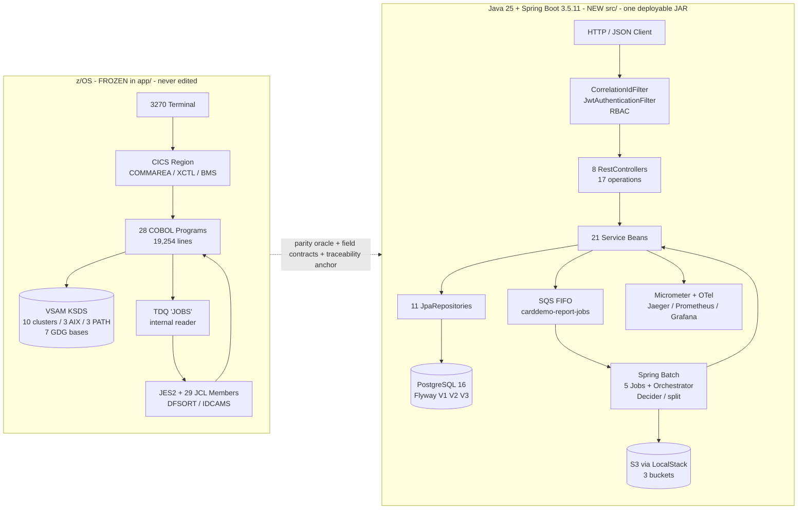

# Technical Specification

## 0. Agent Action Plan

## 0.1 Intent Clarification

This Agent Action Plan is the definitive interpretation layer between the modernisation request and the code the Blitzy platform generates for this repository. It restates the request in precise technical language, surfaces every requirement the request implies but does not state, and maps each requirement onto concrete files, packages and artefacts.

Every claim made here about the existing system carries an inline citation of the form `[<path>:<locator>]` pointing at the primary source that proves it. **The COBOL corpus under `app/` — not prose, and not the earlier generation of this document — is the authority throughout.** Where the two disagreed, the source won and the discrepancy is recorded in [§0.2.2.1](#0221-corrections-to-the-prior-specification). Every figure below was established by direct inspection of the checkout at the traceability anchor commit.

### 0.1.1 Core Refactoring Objective

**The refactoring objective is to** replace the execution substrate of the AWS CardDemo credit-card management application — presently **19,254 lines** of IBM Enterprise COBOL executing under CICS, VSAM, JCL and BMS on z/OS `[app/cbl/**]` — with an equivalent, fully operational **Java 25** and **Spring Boot 3.5.11** implementation that reproduces every one of the twenty-two catalogued features (F-001 through F-022) at 100% behavioural parity, while leaving the COBOL corpus in `app/` byte-for-byte untouched as the frozen reference of record.

The migration is therefore **purely additive to this repository**. Nothing in `app/` is edited, moved, renamed, reformatted or deleted. The legacy tree simultaneously serves three roles that make it inviolable:

1. It is the **parity oracle** against which Gate 1 compares output.
2. It is the **field-contract source** from which entity and DTO shapes are derived.
3. It is the **traceability anchor** that `../TRACEABILITY_MATRIX.md` is to cite by commit SHA; that file does not exist yet, so the anchor is currently cited only here.

It loses all three roles the moment it is edited.

#### 0.1.1.1 Refactoring Type Classification

| Dimension | Classification | Evidence and Reasoning |
|-----------|---------------|------------------------|
| **Primary type** | **Tech stack migration** | Every layer changes substrate: COBOL to Java, CICS to Spring MVC, VSAM to PostgreSQL, JCL to Spring Batch, BMS to REST/JSON, GDG to S3, TDQ to SQS. This is the most invasive of the five refactoring categories. |
| Secondary type | Code structure | Paragraphs and sections decompose into private methods one-for-one — a 4,236-line program `[app/cbl/COACTUPC.cbl]` becomes a cohesive service plus DTOs plus validators. |
| Secondary type | Design pattern | Repository, service layer, dependency injection, strategy, template method, decider and filter-chain patterns replace VSAM verbs, `EXEC CICS XCTL` dispatch, `ALTER ... TO PROCEED TO` self-modification and JCL `COND` gating. |
| Secondary type | Modularity | Nineteen thousand lines of monolithic programs resolve into 14 packages under a single `com.cardemo` root. |
| **Not** | Performance refactor | No throughput or latency objective is asserted for the legacy system. Gate 3 records a **measured baseline**, not an improvement target. The COBOL publishes no service-level objective and none may be invented. |
| **Not** | Behaviour change | Parity is the contract. Known legacy quirks are preserved and documented, never corrected. |

#### 0.1.1.2 Target Repository Determination

- **Same repository, in place.** The Java tree is created at the repository root as `src/`, following Maven standard layout, **directly alongside the frozen `app/` tree**. New root-level artefacts (`pom.xml`, `Dockerfile`, `docker-compose.yml`, `localstack-init/`, `observability/`, `.mvn/`, `.github/`, `DECISION_LOG.md`, `TRACEABILITY_MATRIX.md`) are to sit beside the existing `app/`, `docs/`, `diagrams/` and `samples/` directories; the two evidence artefacts named last are the only two of that list still absent as of 1 August 2026.
- **No COBOL file is copied into `src/`.** The corpus stays in `app/` and is referenced by commit SHA.
- **Package root is `com.cardemo`** — one spelling, used uniformly across main sources, test sources, configuration and documentation.
- **Deployment shape is a single deployable JAR: a modular monolith, explicitly not microservices.** The decisive constraint is atomicity, developed in [§0.7.1](#071-account-update-dual-dataset-write-asymmetric-rollback-and-the-stateless-snapshot-contract) and [§0.7.2](#072-daily-transaction-posting-file-status-taxonomy-and-the-reject-code-strategy).
- **Traceability anchor is `7756d895ffeb65f7ea72aaa609e356d9899afcec`** (short `7756d89`). Every paragraph citation in `../TRACEABILITY_MATRIX.md` is to be keyed to this commit.

#### 0.1.1.3 Refactoring Goals

| ID | Goal | Concrete Realisation |
|----|------|---------------------|
| G1 | Produce an executable Java target | `src/main/java/com/cardemo/**` compiled by a Maven build against Java 25, packaged as a single Spring Boot JAR |
| G2 | Replace the data substrate | 11 JPA entities and 3 Flyway migrations replacing 10 VSAM KSDS clusters, 3 alternate indexes with 3 paths, and the sequential and generation-group datasets `[app/catlg/LISTCAT.txt]` |
| G3 | Replace the online presentation layer | 17 REST operations across 8 `@RestController` classes backed by 21 service beans, replacing 17 CICS screen programs and their BMS conversations |
| G4 | Replace the batch stream | A 5-job Spring Batch pipeline (POSTTRAN, INTCALC, COMBTRAN, CREASTMT, TRANREPT) plus an orchestrator, replacing the JCL job stream and its DFSORT and IDCAMS utility steps |
| G5 | Replace mainframe integration constructs | S3, SQS FIFO and SNS via Spring Cloud AWS against LocalStack, replacing generation-data-group generations, the `JOBS` transient data queue and operator notification — **with zero live AWS credentials** |
| G6 | Add an observability layer the source entirely lacks | Structured JSON logging, distributed tracing, Prometheus metrics and composite health, shipped **with** the initial implementation rather than as follow-up work |
| G7 | Establish a regression net | A test pyramid with a JaCoCo line-coverage floor, including Testcontainers PostgreSQL and LocalStack integration tiers |
| G8 | Produce evidence artefacts | `../DECISION_LOG.md`, `../TRACEABILITY_MATRIX.md`, `validation-gates.md`, `api-contracts.md`, `onboarding-guide.md`, `architecture-before-after.md`, `executive-presentation.html` |
| G9 | Deliver a runnable topology | `Dockerfile` plus `docker-compose.yml` bringing up PostgreSQL 16, LocalStack, Jaeger, Prometheus and Grafana, with `localstack-init/init-aws.sh` provisioning three buckets, one FIFO queue and **exactly one** notification topic |

#### 0.1.1.4 Implicit Requirements Surfaced

The following are necessary for the stated objective to be achievable, but are not spelled out in the request. Each is treated as binding.

- **`app/` is read-only.** No COBOL program, copybook, JCL member, BMS mapset or data file may be modified. Migration is additive only.
- **Field-contract preservation is bidirectional.** DTO field names, types and lengths derive from the BMS symbolic maps `[app/cpy-bms/**]`; entity column widths derive from the record-layout copybooks `[app/cpy/**]`. Silent truncation or widening breaks parity in a way no test catches unless the contract is asserted.
- **`mkdocs.yml` must be UPDATED, not merely accompanied.** Its `nav` block has exactly three entries `[mkdocs.yml]` and `catalog-info.yaml` sets `backstage.io/techdocs-ref: dir:.` `[catalog-info.yaml:L22]`, so documentation absent from that nav never publishes. The `mermaid2` plugin `[mkdocs.yml]` additionally confirms Mermaid as the sanctioned diagram format for new documents.
- **`README.md` must be updated, not replaced.** It is the authoritative legacy transaction, program and JCL inventory; Java build and run instructions are appended and the legacy tables preserved verbatim.
- **Observability provisioning files are prerequisites for the integration gate.** A compose file that references Prometheus and Grafana is inert without `observability/prometheus.yml`, a Grafana datasource provisioning file and a dashboard definition.
- **The JWT signing key must be environment-variable indirected** with fail-fast on absence and no committed default. The prior implementation attempt left it hardcoded, a High-severity open defect `[docs/project-guide.md:L52]`.
- **A production Spring profile is required.** The prior attempt shipped none `[docs/project-guide.md:L51]`. `application-prod.yml` is to be added with every secret externalised, which will close that gap under the least-privilege standard; none of the four profile files exists yet.
- **A CI workflow is required.** The prior attempt shipped no `.github/workflows` `[docs/project-guide.md:L49]`. The repeatable zero-warning build gate needs a deterministic harness pinned to JDK 25 and Maven 3.9.11.
- **Batch reject codes are business outcomes, not exceptions.** They must be modelled as an enum and drive `ExitStatus`, never thrown.
- **`CBTRN01C` has no distinct target job.** It is read-only — a verb inventory of `OPEN`, `READ`, `CLOSE` and `DISPLAY` only, with no `WRITE`, `REWRITE` or `DELETE` anywhere `[app/cbl/CBTRN01C.cbl]`. It contributes pre-flight validation and diagnostic logic to `DailyTransactionPostingJob` and must still appear in `../TRACEABILITY_MATRIX.md`.
- **`COMBTRAN.jcl` has no COBOL program.** Its logic is entirely DFSORT and IDCAMS control cards `[app/jcl/COMBTRAN.jcl:L22-L48]`, so the JCL itself is the Java source of truth.
- **Two copybooks require explicit disposition.** `app/cpy/UNUSED1Y.cpy` has zero `COPY` references anywhere in the live corpus, and `app/cpy/COSTM01.CPY` is the statement record consumed by `CBSTM03A`. Both must be accounted for so the scope-coverage gate reaches 100%.
- **Case-insensitive matching is mandatory on both `app/cbl` and `app/jcl`.** See [§0.5.3](#053-wildcard-pattern-policy); a case-sensitive glob silently drops 1,154 lines of COBOL and the sole source for statement generation.

### 0.1.2 Technical Interpretation

Each legacy runtime construct is replaced by a specific, named Java or Spring mechanism. The mapping is deterministic: there is exactly one target mechanism per source construct, and the choice is justified by the source semantics rather than by convention.

#### 0.1.2.1 Current Architecture

- **Presentation** — 3270 terminals driving a CICS region in pseudo-conversational mode. Screen state lives in the COMMAREA. Navigation is `EXEC CICS XCTL PROGRAM(...)` `[app/cbl/COMEN01C.cbl:L153]`, and screen layout comes from 17 BMS mapsets with 17 generated symbolic maps.
- **Application** — 28 COBOL programs: 17 online transaction programs, 10 batch programs, and one statically-called date utility. Program identity and transaction routing are catalogued in the CICS CSD `[app/csd/CARDDEMO.CSD]`.
- **Data** — 10 VSAM KSDS clusters, 3 alternate indexes each with a path, plus physical sequential datasets and 7 generation data groups `[app/catlg/LISTCAT.txt:L3937-L3951]`. Record layouts are fixed-width with `COMP-3` and zoned-decimal signed numerics.
- **Batch orchestration** — JES2 executing 29 JCL members with DFSORT, IDCAMS, IEBGENER and IEFBR14 utility steps, gated by `COND=(0,NE)` return-code tests `[app/jcl/CREASTMT.JCL:L56]`.
- **Cross-cutting** — Language Environment date validation via `CALL 'CSUTLDTC'`; the extrapartition transient data queue `JOBS` as the online-to-batch bridge `[app/csd/CARDDEMO.CSD:L499-L505]`; `CALL 'CEE3ABD'` for abend termination `[app/cbl/CBTRN02C.cbl:L707-L711]`.
- **Observability** — none. The only instrumentation in the entire corpus is `DISPLAY` to SYSOUT and the `9910-DISPLAY-IO-STATUS` status renderer `[app/cbl/CBTRN02C.cbl:L714-L727]`.

#### 0.1.2.2 Target Architecture

- **Presentation** — HTTP/1.1 with JSON payloads. A `CorrelationIdFilter` then a `JwtAuthenticationFilter` precede role-based authorisation in the Spring Security chain, feeding the `DispatcherServlet` and 8 `@RestController` classes exposing 17 operations.
- **Application** — 21 service beans, one per online program plus four shared services, each private method corresponding one-to-one to a source paragraph and carrying a Javadoc citation to it.
- **Data** — 11 Spring Data JPA repositories over Hibernate against PostgreSQL 16, schema established by three Flyway migrations. The three alternate indexes become three derived finder methods backed by B-tree indexes.
- **Batch orchestration** — Spring Batch `Job`, `Step` and `Flow` definitions; `JobExecutionDecider` replaces `COND` gating and `FlowBuilder.split()` models the independent statement-and-report branches; DFSORT specifications become `java.util.Comparator` instances and IDCAMS `REPRO` becomes `JdbcTemplate.batchUpdate`.
- **Integration** — Spring Cloud AWS S3, SQS and SNS clients pointed at a LocalStack endpoint. Generation-group generations become S3 keys with a timestamp or job-instance prefix over a versioned bucket; the `JOBS` queue becomes an SQS FIFO queue.
- **Cross-cutting** — `java.time` plus a dedicated date validation service; a typed exception hierarchy on every I/O path; declarative transaction boundaries.
- **Observability** — Logback JSON encoding with MDC-carried trace, span and correlation identifiers; Micrometer tracing bridged to OpenTelemetry and exported to Jaeger; a Prometheus scrape endpoint; a composite health endpoint.

**Figure 1 — CardDemo substrate replacement: the frozen z/OS corpus (left) and the Java 25 target (right).** The title is carried as a Markdown caption rather than as Mermaid front matter, because front-matter titles require Mermaid 9.4 or later and the `mermaid2` plugin pins its own bundled version; a caption renders identically in every renderer and cannot fail the diagram.


```mermaid
graph LR
    subgraph LEGACY["z/OS - FROZEN in app/ - never edited"]
        T["3270 Terminal"] --> C["CICS Region<br/>COMMAREA / XCTL / BMS"]
        C --> P["28 COBOL Programs<br/>19,254 lines"]
        P --> V[("VSAM KSDS<br/>10 clusters / 3 AIX / 3 PATH<br/>7 GDG bases")]
        J["JES2 + 29 JCL Members<br/>DFSORT / IDCAMS"] --> P
        P --> Q["TDQ 'JOBS'<br/>internal reader"]
        Q --> J
    end

    subgraph TARGET["Java 25 + Spring Boot 3.5.11 - NEW src/ - one deployable JAR"]
        H["HTTP / JSON Client"] --> F["CorrelationIdFilter<br/>JwtAuthenticationFilter<br/>RBAC"]
        F --> R["8 RestControllers<br/>17 operations"]
        R --> S["21 Service Beans"]
        S --> RP["11 JpaRepositories"]
        RP --> PG[("PostgreSQL 16<br/>Flyway V1 V2 V3")]
        B["Spring Batch<br/>5 Jobs + Orchestrator<br/>Decider / split"] --> S
        S --> SQ["SQS FIFO<br/>carddemo-report-jobs"]
        SQ --> B
        B --> S3[("S3 via LocalStack<br/>3 buckets")]
        S --> OBS["Micrometer + OTel<br/>Jaeger / Prometheus / Grafana"]
    end

    LEGACY -. "parity oracle + field contracts + traceability anchor" .-> TARGET
```

**Legend.** Solid arrows are runtime control or data flow. The single dashed arrow is a *design-time* relationship only: the legacy tree is read to derive contracts and to compare output, and is never invoked, transcoded or modified at run time. Rounded nodes are persistent stores. The two subgraphs are the two substrates; nothing crosses between them at run time.

Detailed visuals are deliberately deferred to `architecture-before-after.md` rather than duplicated here, per Rule 1 Clause C's avoid-duplication requirement.

#### 0.1.2.3 Transformation Rules: Sixteen Binding Invariants

These are invariants, not guidelines. Every generated file is expected to satisfy them, and the validation gates exist to prove they hold. The "failure prevented" column states what goes wrong when the invariant is violated — in most cases silently.

| # | Source Construct | Target Mechanism | Invariant and Failure Prevented |
|---|-----------------|------------------|---------------------------------|
| 1 | `PIC S9(n)V99`, `COMP-3`, `COMP` | `java.math.BigDecimal` with scale from the PIC clause; `NUMERIC(p,2)` columns | **Zero `float` or `double` in any financial field.** `RoundingMode.HALF_EVEN`; `compareTo()` for equality, never `equals()`. Precision exceptions that differ from the common case: `TRAN-CAT-BAL` is `S9(09)V99` `[app/cpy/CVTRA01Y.cpy:L9]` so `NUMERIC(11,2)`; `DIS-INT-RATE` is `S9(04)V99` `[app/cpy/CVTRA02Y.cpy:L9]` so `NUMERIC(6,2)`; account money fields are `S9(10)V99` `[app/cpy/CVACT01Y.cpy:L7-L8]` so `NUMERIC(12,2)`. Prevents binary-floating-point drift in money and rate arithmetic. |
| 2 | `PARAGRAPH` / `SECTION` | One private Java method | One-to-one, **no consolidation across paragraphs**; Javadoc cites the source paragraph label. Prevents the paragraph map that the scope-coverage gate verifies from becoming unprovable. |
| 3 | `COPY <member>` | A Java `import` | Resolved by the mapping table in [§0.5.2.1](#0521-cobol-copy-to-java-import-translation) — exactly one entity import per record-layout copybook. Prevents duplicate entity types for the same layout. |
| 4 | VSAM KSDS cluster | `@Entity` plus a `JpaRepository` | One entity per cluster catalogued in `[app/catlg/LISTCAT.txt]`. Prevents a dataset being silently folded into another. |
| 5 | Alternate index and path | A derived or `@Query` finder plus a B-tree index | Non-unique alternate keys become non-unique indexes. Prevents a full-table scan replacing an indexed browse. |
| 6 | `EXEC CICS SEND MAP` / `RECEIVE MAP` | A `@RestController` method | Field names, types and lengths taken from `[app/cpy-bms/**]` **exactly**. Prevents silent truncation or widening at the API boundary. |
| 7 | `RETURN TRANSID ... COMMAREA` | Stateless REST plus JWT claims | **No server-side session state.** Pagination state moves to request parameters and response metadata. Prevents a hidden server-side conversation that cannot be horizontally scaled. |
| 8 | JCL `EXEC PGM` plus DD statements | A Spring Batch `Job` and `Step` | `COND` codes become a `JobExecutionDecider`. Prevents step gating being lost, which would run downstream steps after an upstream failure. |
| 9 | DFSORT and IDCAMS `REPRO` | `java.util.Comparator` and `JdbcTemplate.batchUpdate` | **No external sort process is spawned.** Prevents a host-tool dependency the container image cannot satisfy. |
| 10 | `EXEC CICS WRITEQ TD` | `SqsTemplate.send()` to a FIFO queue | The 80-byte fixed record becomes a typed JSON message. Prevents ordering loss on the online-to-batch bridge. |
| 11 | Generation `(+1)` / `(0)` | An S3 key with a timestamp or job-instance prefix, over a versioned bucket | Record length is preserved byte-exactly at the S3 boundary. Prevents the parity comparison failing on geometry rather than content. |
| 12 | `FILE STATUS` value | A typed exception | Applied on **every** I/O path, never swallowed. Prevents an I/O failure being mistaken for an empty result. |
| 13 | `EXEC CICS SYNCPOINT ROLLBACK` | `@Transactional(rollbackFor = Exception.class)` | Scoped so the source's asymmetric rollback behaviour is reproduced — see [§0.7.1.2](#0712-why-the-rollback-asymmetry-is-correct-not-a-defect). Prevents a half-applied dual-dataset update. |
| 14 | `CALL 'CSUTLDTC'` | `java.time.LocalDate` plus a date validation service | Validation **outcomes**, not merely parsing, must match. Prevents a date the legacy system rejects being accepted, or vice versa. |
| 15 | Plaintext `SEC-USR-PWD` | BCrypt with strength 10 | The ten seeded users are stored only as hashes. Prevents credential material reaching the database or a log. |
| 16 | `READ ... UPDATE` plus snapshot comparison | JPA `@Version` **plus** an explicit field-by-field snapshot comparison | `@Version` alone is insufficient — see [§0.7.1.5](#0715-why-optimistic-version-checking-alone-is-insufficient). Prevents an update being accepted that the legacy system would have rejected as concurrently modified. |

Rule 16 warrants emphasis because it is the one place where the obvious mechanical translation is wrong. The source compares business field values, not a version counter: `9700-CHECK-CHANGE-IN-REC` runs ten account predicates expanding to sixteen comparison terms, plus a customer predicate set, against a snapshot captured when the screen was first displayed `[app/cbl/COACTUPC.cbl:L4109-L4193]`. A version counter detects *that* a row changed; the source detects *which fields* changed and in what representation. Both layers are therefore required, and the request DTO must carry the snapshot. [§0.7.1](#071-account-update-dual-dataset-write-asymmetric-rollback-and-the-stateless-snapshot-contract) develops this in full, including the date-offset asymmetry that makes a naive implementation fail on every single request.

## 0.2 Source Analysis

Every count, size and line number in this sub-section was established by direct machine inspection of the checkout at commit `7756d89`. Where the earlier generation of this document reported a different figure, the figure below supersedes it and the discrepancy is recorded in [§0.2.2.1](#0221-corrections-to-the-prior-specification).

### 0.2.1 Comprehensive Source File Discovery

#### 0.2.1.1 COBOL Programs: `app/cbl/`

Twenty-eight programs totalling **19,254 lines**. These are the exact figures to be used in `../TRACEABILITY_MATRIX.md`.

| Program | Lines | Class | Role |
|---------|------:|-------|------|
| `COACTUPC.cbl` | 4,236 | Online | Account update — dual-dataset write with snapshot comparison and asymmetric rollback |
| `COCRDUPC.cbl` | 1,560 | Online | Card update |
| `COCRDLIC.cbl` | 1,459 | Online | Card list, 7 rows per page |
| `COACTVWC.cbl` | 941 | Online | Account view |
| **`CBSTM03A.CBL`** | 924 | Batch | Statement generation — self-modifying `ALTER` dispatch |
| `COCRDSLC.cbl` | 887 | Online | Card detail |
| `COTRN02C.cbl` | 783 | Online | Transaction add — descending-browse auto-identifier |
| `CBTRN02C.cbl` | 731 | Batch | Daily transaction posting — validation cascade and reject engine |
| `COTRN00C.cbl` | 699 | Online | Transaction list, 10 rows per page |
| `COUSR00C.cbl` | 695 | Online | User list, 10 rows per page |
| `CBACT04C.cbl` | 652 | Batch | Interest calculation |
| `CORPT00C.cbl` | 649 | Online | Report submission — transient-data-queue job-submission bridge |
| `CBTRN03C.cbl` | 649 | Batch | Transaction report, 20 lines per page |
| `COBIL00C.cbl` | 572 | Online | Bill payment |
| `CBTRN01C.cbl` | 491 | Batch | Daily transaction pre-flight — **read-only** |
| `COUSR02C.cbl` | 414 | Online | User update |
| `COUSR03C.cbl` | 359 | Online | User delete |
| `COTRN01C.cbl` | 330 | Online | Transaction detail |
| `COUSR01C.cbl` | 299 | Online | User add |
| `COMEN01C.cbl` | 282 | Online | Main menu dispatch |
| `COADM01C.cbl` | 268 | Online | Admin menu dispatch |
| `COSGN00C.cbl` | **260** | Online | Sign-on |
| **`CBSTM03B.CBL`** | 230 | Batch | File-access subprogram called by `CBSTM03A` |
| `CBACT01C.cbl` | 193 | Batch | Account file sequential read |
| `CBCUS01C.cbl` | 178 | Batch | Customer file sequential read |
| `CBACT03C.cbl` | 178 | Batch | Cross-reference file sequential read |
| `CBACT02C.cbl` | 178 | Batch | Card file sequential read |
| `CSUTLDTC.cbl` | 157 | Utility | Date validation, statically called |

> **Case-sensitivity hazard, verified.** `CBSTM03A.CBL` and `CBSTM03B.CBL` use an **UPPERCASE `.CBL`** extension while the other twenty-six use lowercase `.cbl`. A `app/cbl/*.cbl` glob therefore yields only **18,100** of the 19,254 lines — it silently drops 1,154 lines, including the whole statement-generation program and its file-access subprogram. **Case-insensitive matching is mandatory for `app/cbl` as well as `app/jcl`.**

The four simple readers — `CBACT01C`, `CBACT02C`, `CBACT03C` and `CBCUS01C` — have a verb inventory of `OPEN`, `READ` and `CLOSE` only, with no `WRITE`, `REWRITE` or `DELETE`. They become read-only Spring Batch verification steps.

#### 0.2.1.2 Program Count Reconciliation: 17 Sourced, 1 Orphan

The CICS CSD defines **18 transactions and 18 programs but only 17 mapsets** `[app/csd/CARDDEMO.CSD]`. The reconciliation is decisive.

Seventeen transaction-to-program pairs have both source and a mapset:

| Tran | Program | Tran | Program | Tran | Program |
|------|---------|------|---------|------|---------|
| `CC00` | `COSGN00C` | `CCLI` | `COCRDLIC` | `CA00` | `COADM01C` |
| `CM00` | `COMEN01C` | `CCDL` | `COCRDSLC` | `CU00` | `COUSR00C` |
| `CAVW` | `COACTVWC` | `CCUP` | `COCRDUPC` | `CU01` | `COUSR01C` |
| `CAUP` | `COACTUPC` | `CT00` | `COTRN00C` | `CU02` | `COUSR02C` |
| `CB00` | `COBIL00C` | `CT01` | `COTRN01C` | `CU03` | `COUSR03C` |
| `CR00` | `CORPT00C` | `CT02` | `COTRN02C` | | |

The eighteenth is `CDV1` to `COCRDSEC`. **`COCRDSEC` has no source file anywhere in the repository.** Its only two occurrences repository-wide are the CSD definitions themselves: `[app/csd/CARDDEMO.CSD:L211]` (`DEFINE PROGRAM(COCRDSEC) GROUP(CARDDEMO)`) and `[app/csd/CARDDEMO.CSD:L390]` (`PROGRAM(COCRDSEC) TWASIZE(0) PROFILE(DFHCICST) STATUS(ENABLED)`). It is a dangling legacy definition with nothing to translate.

**Therefore: 17 sourced screen programs + 1 orphan CSD definition = 18 CSD entries.** No endpoint may be invented for `CDV1`.

Independent corroboration: `README.md` lists exactly 17 online transaction, BMS-map and program rows in its online inventory table, and a case-insensitive search of that file for `CDV1` returns zero hits.

`CSUTLDTC` does not appear in the CSD at all — it is a statically-called subprogram. `CBSTM03A` and `CBSTM03B` are batch and likewise absent; a search of the CSD for either name returns zero hits.

The CSD yields two further contracts:

- **Eight CICS `DEFINE FILE` entries** constitute the online file control table: `ACCTDAT`, `CARDAIX`, `CARDDAT`, `CCXREF`, `CUSTDAT`, `CXACAIX`, `TRANSACT`, `USRSEC`. Therefore **`TCATBALF`, `DISCGRP`, `TRANCATG` and `TRANTYPE` are batch-only datasets with no online definition** — a fact that shapes both the authorisation model and the integration-test surface.
- **One transient data queue definition** is the source of the SQS bridge `[app/csd/CARDDEMO.CSD:L499-L505]`: `DEFINE TDQUEUE(JOBS) GROUP(CARDDEMO)` / `DESCRIPTION(SUBMIT JOBS FROM CICS)` / `TYPE(EXTRA) DATABUFFERS(1) DDNAME(INREADER) ERROROPTION(IGNORE)` / `OPENTIME(INITIAL) TYPEFILE(OUTPUT) RECORDSIZE(80)` / `RECORDFORMAT(FIXED) BLOCKFORMAT(UNBLOCKED) DISPOSITION(MOD)`.

#### 0.2.1.3 Copybooks: `app/cpy/`

Twenty-eight copybooks totalling 2,614 lines, in four functional classes. Note that `COSTM01.CPY` uses an uppercase extension.

| Class | Members | Target Disposition |
|-------|---------|-------------------|
| Record layouts (11) | `CVACT01Y` (300 B), `CVACT02Y` (150 B), `CVACT03Y` (50 B slot, 36 populated), `CVCUS01Y` (500 B), `CVTRA01Y` (50 B), `CVTRA02Y` (50 B), `CVTRA03Y` (60 B), `CVTRA04Y` (60 B), `CVTRA05Y` (350 B), `CVTRA06Y` (350 B), `CVTRA07Y` (133 B report line) | 11 JPA entities plus the report-line DTOs |
| Additional layouts (3) | `CSUSR01Y` (80 B user security), `CUSTREC` (duplicate of `CVCUS01Y` differing only in the `CUST-DOB` field name), `COSTM01.CPY` (statement record, 32-byte `TRNX-KEY`) | `UserSecurity` entity, the same `Customer` entity, `StatementTransaction` DTO |
| Shared state and tables (6) | `COCOM01Y` (COMMAREA), `CVCRD01Y` (navigation and action-identifier state), `COMEN02Y` (menu option table), `COADM02Y` (admin option table), `CSLKPCDY` (lookup tables), `CSDAT01Y` (date and time) | JWT claims plus request DTOs, controller mapping, two menu services, three JSON validation resources, a date and time header utility |
| Constants, abend and procedural (8) | `COTTL01Y`, `CSMSG01Y`, **`CSMSG02Y`**, `CSUTLDPY`, `CSUTLDWY`, **`CSSTRPFY`**, **`CSSETATY`**, **`UNUSED1Y`** | Constants holders, `FatalProcessingException` fields, date validation service internals, controller action mapping, validation annotations, and one documented dead artefact |

Four dispositions correct earlier misreadings that would otherwise have produced wrong code. Each was verified by reading the member.

- **`CSMSG02Y` is not a message copybook.** It is internally titled `CABENDD.CPY` and described as "Work areas for abend routine". It declares `01 ABEND-DATA.` with `ABEND-CODE PIC X(4)`, `ABEND-CULPRIT PIC X(8)`, `ABEND-REASON PIC X(50)` and `ABEND-MSG PIC X(72)` `[app/cpy/CSMSG02Y.cpy:L21-L29]` (COBOL sequence numbers `001200` through `002000`). It maps to the field set of `FatalProcessingException`. Treating it as a message copybook would have lost that field set entirely.
- **`CSSTRPFY` is procedural, not a data layout.** It contains the `PROCEDURE DIVISION` paragraph `YYYY-STORE-PFKEY` `[app/cpy/CSSTRPFY.cpy:L17]` which evaluates `EIBAID` against `DFHENTER`, `DFHCLEAR`, `DFHPA1`, `DFHPA2` and the function keys `[app/cpy/CSSTRPFY.cpy:L21-L40]`. It has five `COPY` call sites in `app/cbl` and no entity or DTO counterpart; it maps to controller-level action mapping.
- **`CSSETATY` is a parameterised template** resolved via `COPY ... REPLACING`. Its body uses parenthesised placeholders `(TESTVAR1)`, `(SCRNVAR2)` and `(MAPNAME3)`, testing `FLG-(TESTVAR1)-NOT-OK` and `FLG-(TESTVAR1)-BLANK` and moving `DFHRED` and `'*'` into the map `[app/cpy/CSSETATY.cpy:L17-L27]`. It has one `COPY` call site. It maps to validation annotations plus per-field error markers, not to a type.
- **`UNUSED1Y` has zero `COPY` references anywhere in the live corpus** — a search of `app/` for `COPY UNUSED1Y` returns zero hits. The only other repository-wide occurrence of the name is inside the out-of-scope binary archive `samples/m2/unikix/UniKix_CardDemo_runtime_v1.zip`. It is dispositioned as documented dead so the scope-coverage gate can reach 100%.

`COSTM01.CPY` geometry, which is load-bearing for statement generation: `01 TRNX-RECORD.` with `05 TRNX-KEY.` comprising `TRNX-CARD-NUM PIC X(16)` and `TRNX-ID PIC X(16)` `[app/cpy/COSTM01.CPY:L20-L23]` — **32 bytes**, exactly matching `KEYS(32 0)` on the work cluster `[app/jcl/CREASTMT.JCL:L30]` — followed by `05 TRNX-REST.` whose fields sum to **318 bytes** `[app/cpy/COSTM01.CPY:L24-L36]`, for **350 bytes total**, matching `RECORDSIZE(350 350)` `[app/jcl/CREASTMT.JCL:L32]`.

`COPY DFHAID`, `COPY DFHBMSCA` and `COPY DFHATTR` are supplied by CICS, are absent from the repository, and map onto framework mechanisms with no import.

#### 0.2.1.4 BMS Presentation Layer: `app/bms/` and `app/cpy-bms/`

Seventeen mapsets (4,472 lines) with their seventeen generated symbolic maps (5,632 lines). The symbolic maps are the DTO field budget.

The total was counted two independent ways that agree exactly — once over the `02 <name>L COMP PIC S9(4)` length fields and once over the `02 <name>I PIC` data fields. Both yield **441**.

| Symbolic Map | Input Fields | Symbolic Map | Input Fields |
|--------------|-------------:|--------------|-------------:|
| `COACTUP.CPY` | 54 | `COSGN00.CPY` | 11 |
| `COACTVW.CPY` | **37** | `COTRN00.CPY` | 59 |
| `COADM01.CPY` | 20 | `COTRN01.CPY` | 21 |
| `COBIL00.CPY` | 10 | `COTRN02.CPY` | 21 |
| `COCRDLI.CPY` | 45 | `COUSR00.CPY` | 59 |
| `COCRDSL.CPY` | 15 | `COUSR01.CPY` | 12 |
| `COCRDUP.CPY` | 17 | `COUSR02.CPY` | 12 |
| `COMEN01.CPY` | 20 | `COUSR03.CPY` | 11 |
| `CORPT00.CPY` | 17 | **Total** | **441** |

Each screen field is generated as a quintuple, verified at `[app/cpy-bms/COACTUP.CPY:L17-L24]`: the group header `01 CACTUPAI.` at L17, a twelve-byte `02 FILLER PIC X(12)` terminal-I/O area header at L18, then per field a `02 <n>L COMP PIC S9(4).` length field, a `02 <n>F PICTURE X.` attribute byte, a `02 FILLER REDEFINES <n>F.` with `03 <n>A PICTURE X.` attribute alias, four reserved bytes `02 FILLER PICTURE X(4).`, and the data field `02 <n>I PIC X(w).`. The output group is `01 <map>O REDEFINES <map>I` carrying C, P, H and V attribute bytes followed by `<n>O`.

Six header fields recur on all seventeen maps: `TRNNAME X(4)`, `TITLE01 X(40)`, `CURDATE X(8)`, `PGMNAME X(8)`, `TITLE02 X(40)` and `CURTIME`. **`CURTIME` is `X(8)` on sixteen maps and `X(9)` only on `COSGN00.CPY`**, which additionally carries `APPLIDI PIC X(8)` `[app/cpy-bms/COSGN00.CPY:L60]` and `SYSIDI PIC X(8)` `[app/cpy-bms/COSGN00.CPY:L66]`.

The three highest field counts are explained by row arrays rather than by richer screens: `COTRN00` and `COUSR00` carry ten-row tables (`SEL000n`, `TRNIDnn`, `TDATEnn`, `TDESCnn`, `TAMT00n`), and `COCRDLI` carries seven (`CRDSELn`, `CRDSTPn`, `ACCTNOn`, `CRDNUMn`, `CRDSTSn`, with no `CRDSTP1` on row 1) — matching the pagination sizes 10, 10 and 7.

#### 0.2.1.5 JCL, Procedures and Control Cards

**`app/jcl/` contains 29 members.** Twenty-eight use a lowercase `.jcl` extension; the twenty-ninth is **`CREASTMT.JCL` with an uppercase extension**, which a `*.jcl` glob silently omits. That member is the sole source for statement generation, so every wildcard pattern touching this directory must be case-insensitive.

Full member list: `ACCTFILE`, `CARDFILE`, `CBADMCDJ`, `CLOSEFIL`, `COMBTRAN`, **`CREASTMT.JCL`**, `CUSTFILE`, `DALYREJS`, `DEFCUST`, `DEFGDGB`, `DISCGRP`, `DUSRSECJ`, `INTCALC`, `OPENFIL`, `POSTTRAN`, `PRTCATBL`, `READACCT`, `READCARD`, `READCUST`, `READXREF`, `REPTFILE`, `TCATBALF`, `TRANBKP`, `TRANCATG`, `TRANFILE`, `TRANIDX`, `TRANREPT`, `TRANTYPE`, `XREFFILE`.

Three members drive batch jobs whose logic exists nowhere else:

- **`CREASTMT.JCL`** (97 lines) — five steps. `DELDEF01` `[L22]` defines a work cluster with `KEYS(32 0)` `[L30]` and `RECORDSIZE(350 350)` `[L32]`, the 32-byte key confirming `COSTM01.CPY`'s `TRNX-KEY` composition. `STEP010` `[L44]` sorts `SORT FIELDS=(263,16,CH,A,1,16,CH,A)` `[L53]` and reshuffles the record with `OUTREC FIELDS=(1:263,16,17:1,262,279:279,50)` `[L54]`. `STEP020` `[L56]`, gated `COND=(0,NE)`, `REPRO`s the sorted sequential file into the cluster `[L61]`. `STEP030` `[L66]` pre-deletes outputs. `STEP040` `[L79]` runs `CBSTM03A` with `STMTFILE` at `LRECL=80` `[L89]` and `HTMLFILE` at `LRECL=100` `[L94]`.
- **`COMBTRAN.jcl`** (52 lines) — two steps, no COBOL program. `STEP05R` `[L22]` sorts a **concatenated** input of the transaction backup `[L24]` and the interest-generated transaction generation `[L26]` by `TRAN-ID` ascending `[L30]`, with its own `SYMNAMES` defining `TRAN-ID,1,16,CH` `[L27-L28]`; `STEP10` `[L41]` `REPRO`s the combined result into the transaction cluster `[L48]`.
- **`app/proc/TRANREPT.prc`** (82 lines) — three steps. `STEP01R` `[L21]` backs up the transaction cluster at `LRECL=350` `[L29]`; `STEP05R` `[L35]` sorts by card number `[L44]` with an `INCLUDE COND` date-range filter `[L45-L46]` driven by `SYMNAMES` defining `TRAN-CARD-NUM,263,16,ZD` `[L39]` and `TRAN-PROC-DT,305,10,CH` `[L40]` plus literal defaults `PARM-START-DATE,C'2022-01-01'` `[L41]` and `PARM-END-DATE,C'2022-07-06'` `[L42]`; `STEP10R` `[L57]` runs `CBTRN03C` producing a `LRECL=133` report `[L76]`.

`app/proc/` holds two members, `REPROC.prc` and `TRANREPT.prc`. `app/ctl/REPROCT.ctl` is a single IDCAMS control card, `REPRO INFILE(FILEIN) OUTFILE(FILEOUT)`. A legacy quirk worth recording: both procedure members declare `//REPROC PROC` on their first line, so `TRANREPT.prc`'s internal procedure name is `REPROC` while the member name that `EXEC PROC=TRANREPT` resolves is `TRANREPT` `[app/proc/TRANREPT.prc:L1]`.

Primary utility or program per JCL member: `ACCTFILE`=IDCAMS; `CARDFILE`=IDCAMS+SDSF; `CBADMCDJ`=DFHCSDUP (installs the CSD); `CLOSEFIL`=SDSF; `COMBTRAN`=SORT+IDCAMS; `CREASTMT.JCL`=IDCAMS+SORT+IEFBR14+`CBSTM03A`; `CUSTFILE`=IDCAMS+SDSF; `DALYREJS`=IDCAMS; `DEFCUST`=IDCAMS; `DEFGDGB`=IDCAMS; `DISCGRP`=IDCAMS; `DUSRSECJ`=IDCAMS+IEBGENER+IEFBR14; `INTCALC`=`CBACT04C`; `OPENFIL`=SDSF; `POSTTRAN`=`CBTRN02C`; `PRTCATBL`=IEFBR14+REPROC+SORT; `READACCT`=`CBACT01C`; `READCARD`=`CBACT02C`; `READCUST`=`CBCUS01C`; `READXREF`=`CBACT03C`; `REPTFILE`=IDCAMS; `TCATBALF`=IDCAMS; `TRANBKP`=IDCAMS+REPROC; `TRANCATG`=IDCAMS; `TRANFILE`=IDCAMS+SDSF; `TRANIDX`=IDCAMS; `TRANREPT`=`CBTRN03C`+REPROC+SORT; `TRANTYPE`=IDCAMS; `XREFFILE`=IDCAMS.

#### 0.2.1.6 VSAM Catalogue: `app/catlg/LISTCAT.txt`

Three thousand nine hundred and fifty-six lines of authoritative physical specification. The summary block reports the entry counts verbatim `[app/catlg/LISTCAT.txt:L3937-L3951]`: `AIX 3`, `ALIAS 0`, `CLUSTER 10`, `DATA 13`, `GDG 7`, `INDEX 13`, `NONVSAM 160`, `PAGESPACE 0`, `PATH 3`, `SPACE 0`, `USERCATALOG 0`, `TAPELIBRARY 0`, `TAPEVOLUME 0`, `TOTAL 209`.

**Exactly 10 base clusters**, all named `AWS.M2.CARDDEMO.<name>.VSAM.KSDS`, with their key length and average record length:

| Cluster | Locator | Key length | Avg record length | Geometry locator |
|---------|---------|-----------:|------------------:|------------------|
| `ACCTDATA` | `[L22]` | 11 | 300 | `[L59]` |
| `CARDDATA` | `[L164]` | 16 | 150 | `[L202]` |
| `CARDXREF` | `[L365]` | 16 | 50 | `[L403]` |
| `CUSTDATA` | `[L595]` | 9 | 500 | `[L632]` |
| `DISCGRP` | `[L859]` | 16 | 50 | `[L896]` |
| `TCATBALF` | `[L1334]` | 17 | 50 | `[L1371]` |
| `TRANCATG` | `[L1440]` | 6 | 60 | `[L1475]` |
| `TRANSACT` | `[L3555]` | 16 | 350 | `[L3593]` |
| `TRANTYPE` | `[L3742]` | 2 | 60 | `[L3779]` |
| `USRSEC` | `[L3846]` | 8 | 80 | `[L3883]` |

**Three alternate indexes, each with a matching path.** Alternate indexes at `CARDDATA.VSAM.AIX` `[L254]`, `CARDXREF.VSAM.AIX` `[L455]` and `TRANSACT.VSAM.AIX` `[L3645]`; paths at `[L150]`, `[L351]` and `[L3541]`.

Alternate-index physical detail, needed to place each index correctly:

| Alternate index | KEYLEN | RKP | AXRKP | Meaning |
|-----------------|-------:|----:|------:|---------|
| `CARDDATA.VSAM.AIX` | 11 `[L281]` | 5 `[L282]` | **16** `[L283]` | The alternate key sits at byte 16 of the base record — the account identifier |
| `CARDXREF.VSAM.AIX` | 11 `[L482]` | 5 `[L485]` | **25** `[L486]` | The alternate key sits at byte 25 of the base record |
| `TRANSACT.VSAM.AIX` | 26 `[L3674]` | 5 `[L3675]` | **304** `[L3676]` | The alternate key is the processing timestamp |

**`USRSEC` is catalogued** at `[app/catlg/LISTCAT.txt:L3846]` with key length 8 and average record length 80 `[L3883]`, and its authoritative creation geometry is declared in JCL: `DEFINE CLUSTER (NAME(AWS.M2.CARDDEMO.USRSEC.VSAM.KSDS)` `[app/jcl/DUSRSECJ.jcl:L64]` with `KEYS(8,0)` `[L65]`, `RECORDSIZE(80,80)` `[L66]`, `REUSE` `[L67]`, `INDEXED` `[L68]`, `TRACKS(45,15)` `[L69]` and `FREESPACE(10,15)` `[L70]`. The two sources corroborate each other exactly.

**Seven generation data group bases**: `DALYREJS` `[L684]`, `SYSTRAN` `[L1098]`, `TCATBALF.BKUP` `[L1202]`, `TRANREPT` `[L1527]`, `TRANSACT.BKUP` `[L1631]`, `TRANSACT.COMBINED` `[L2919]`, `TRANSACT.DALY` `[L3021]`.

A **retention conflict exists in the source** and must be resolved rather than propagated. `DEFGDGB.jcl` declares a generation group for `AWS.M2.CARDDEMO.TRANREPT` `[app/jcl/DEFGDGB.jcl:L37]` with `LIMIT(5)` `[app/jcl/DEFGDGB.jcl:L38]`, while `REPTFILE.jcl` declares the same base `[app/jcl/REPTFILE.jcl:L26]` with `LIMIT(10)` `[app/jcl/REPTFILE.jcl:L27]`. **Resolved to 10**, because a single S3 lifecycle value must be chosen; the conflict **is to be logged** in `../DECISION_LOG.md`, which does not exist yet — see [§0.3.1.5](#0315-create-evidence-and-documentation).

An orphan cluster definition also exists: `DEFINE CLUSTER (NAME(AWS.CUSTDATA.CLUSTER)` `[app/jcl/DEFCUST.jcl:L35]` with `KEYS(10 0)` `[L37]` and `RECORDSIZE(500 500)` `[L38]`, which no program opens.

#### 0.2.1.7 Seed and Test Data: `app/data/`

Nine ASCII fixtures. Record widths corroborate the catalogued average record lengths exactly, which is what makes them usable as both Flyway seed data and test input. In every case the byte count divided by the row count equals the width plus one, confirming single-byte line terminators.

| Fixture | Bytes | Rows | Record width | Corroborates |
|---------|------:|-----:|-------------:|--------------|
| `acctdata.txt` | 15,050 | **50** | 300 | `ACCTDATA` 300 |
| `carddata.txt` | 7,550 | 50 | 150 | `CARDDATA` 150 |
| `cardxref.txt` | 1,850 | 50 | 36 | `CVACT03Y` 16+9+11; cluster record size 50 leaves 14 bytes slack |
| `custdata.txt` | 25,050 | 50 | 500 | `CUSTDATA` 500 |
| **`dailytran.txt`** | **105,300** | **300** | 350 | `DALYTRAN` 350 — **the Gate 1 fixture** |
| `discgrp.txt` | 2,601 | 51 | 50 | `DISCGRP` 50 |
| `tcatbal.txt` | 2,550 | 50 | 50 | `TCATBALF` 50; key 11+2+4 = 17 confirms key length 17 |
| `trancatg.txt` | 1,098 | 18 | 60 | `TRANCATG` 60 |
| `trantype.txt` | 427 | 7 | 60 | `TRANTYPE` 60 |

Four findings here materially change the implementation and are easy to get wrong.

- **The fixture is named `dailytran.txt` and carries 300 records.** The mainframe DD name and dataset are `DALYTRAN`, but the ASCII fixture spells the word in full. The Gate 1 and Gate 4 test resource paths must use the fixture's actual name.
- **There is no separate user-security fixture file.** A case-insensitive search for `*usrsec*` under `app/` returns only `app/jcl/DUSRSECJ.jcl` and the EBCDIC image `app/data/EBCDIC/AWS.M2.CARDDEMO.USRSEC.PS`. The ten user records exist only as inline `SYSUT1 DD *` data `[app/jcl/DUSRSECJ.jcl:L34]`, spanning `[app/jcl/DUSRSECJ.jcl:L35-L44]` with the `/*` terminator at `[L45]`, fed through IEBGENER into a `LRECL=80` sequential dataset `[L46-L48]`. The layout is `CSUSR01Y`: `ID X(8) + FNAME X(20) + LNAME X(20) + PWD X(8) + TYPE X(1) + FILLER`, totalling 80 bytes. The seed set is **ten rows — five of type `A` and five of type `U`**, in that order, each row occupying the full 80 bytes of that layout. **The ten literal identifier and personal-name values are deliberately not reproduced in this document.** They are eight-character person-shaped keys with a given name and a surname attached, and copying them into published documentation buys no analytical accuracy that the aggregate and the layout do not already give; a reader who needs the literal values reads them from the frozen source at `[app/jcl/DUSRSECJ.jcl:L35-L44]`, which is the only authority for them. Where this document needs an illustrative key it uses the clearly synthetic eight-character forms `ADMNUSR1` through `ADMNUSR5` for the administrator rows and `STDUSR01` through `STDUSR05` for the standard-user rows, which match the real keys in width and in type distribution without being them. **Every one of the ten rows carries the same literal plaintext password value in that inline data**, which is stated here purely as source evidence with its locator; the value itself is not reproduced, it is **not** a usable, default or example credential, and it must never be treated as one. `V3__seed_data.sql` **is to store only BCrypt strength-10 hashes** — it does not exist yet, so no hash has been produced from those ten values at the time of writing. These ten rows, whatever their literal values, are what the security gate's "every password hashed" assertion becomes provable against once the seed migration exists.
- **Signed numerics use zoned-decimal trailing-sign overpunch, so a naive text load produces wrong values.** The first account record of `[app/data/ASCII/acctdata.txt:L1]` opens with an eleven-character account key and a one-character active flag and then carries three consecutive twelve-character `S9(10)V99` money fields; **the whole record is not reproduced here**, because only the money fields carry the evidence and the record additionally carries an account key and dates. Read at the field level, those three fields are `00000001940{`, `00000020200{` and `00000010200{`: each terminates in an overpunch character, `{` denotes `+0`, and they therefore decode to +194.00, +2020.00 and +1020.00 respectively. The decode table is `{` to +0, `A` through `I` to +1 through +9, `}` to −0, `J` through `R` to −1 through −9. Two further confirmations, again quoted at field level rather than as whole records: the balance field of `[app/data/ASCII/tcatbal.txt:L1]` is `0000000000{`, the overpunch form of an eleven-character `S9(09)V99`; and `[app/data/ASCII/discgrp.txt:L18]`, a pure reference-data row keyed on the literal group name `DEFAULT`, reads `DEFAULT   01000100150{000000000000000000`, whose six-character `S9(04)V99` rate field `00150{` decodes to +15.00. **Decoding must be position-aware from the PIC clauses**, because the same letters occur legitimately inside text fields such as merchant names. Critically, `dailytran.txt` contains both `{` (25 occurrences) and `}` (6 occurrences), meaning it carries genuinely negative amounts and therefore exercises the cycle-debit branch of the posting logic — it must not be normalised.
- **`discgrp.txt` contains 17 rows whose group identifier is the literal `DEFAULT`**, including zero-rate combinations, out of 51 total. That set is precisely what makes the interest program's default-rate fallback succeed for those type-and-category pairs and abend for any other, so the integration test must cover both outcomes.

`app/data/EBCDIC/` holds **12 `.PS` dataset images plus a `.gitkeep`**, all carrying the `AWS.M2.CARDDEMO.` prefix: `.ACCDATA.PS` (a legacy typo duplicate missing the `T`), `.ACCTDATA.PS`, `.CARDDATA.PS`, `.CARDXREF.PS`, `.CUSTDATA.PS`, `.DALYTRAN.PS`, `.DALYTRAN.PS.INIT`, `.DISCGRP.PS`, `.TCATBALF.PS`, `.TRANCATG.PS`, `.TRANTYPE.PS`, `.USRSEC.PS`. A `*.PS` glob matches only 11 of the 12 because `.DALYTRAN.PS.INIT` does not end in `.PS`. They are retained as **byte-level codepage reference only and are never parsed by the build**; the ASCII fixtures are the authoritative seed and test input.

#### 0.2.1.8 Repository Conventions Discovered

Two conventions were found by inspection that bind every file the migration creates.

**A universal Apache-2.0 source banner exists.** Verified coverage, counted by searching each directory for the licence text:

| Directory | Files carrying the banner |
|-----------|--------------------------|
| `app/cbl` | **28 of 28** |
| `app/cpy-bms` | **17 of 17** |
| `app/bms` | **17 of 17** |
| `app/jcl` | **28 of 29** — the single member lacking it is `app/jcl/READCUST.jcl` |
| `app/cpy` | **12 of 28** — precisely the shared, constant and procedural members (`COADM02Y`, `COCOM01Y`, `COMEN02Y`, `COSTM01.CPY`, `COTTL01Y`, `CSDAT01Y`, `CSLKPCDY`, `CSMSG01Y`, `CSMSG02Y`, `CSSETATY`, `CSSTRPFY`, `CSUSR01Y`); none of the eleven `CV*` record layouts, nor `CUSTREC`, nor `UNUSED1Y` carries it |

The canonical form is a rule of asterisks, the Amazon copyright, "Licensed under the Apache License, Version 2.0 (the \"License\")", the `http://www.apache.org/licenses/LICENSE-2.0` URL, the AS-IS warranty disclaimer, and a closing rule `[app/cbl/CBACT04C.cbl:L1-L21]`, `[app/cpy-bms/COACTUP.CPY:L1-L16]`. The repository `LICENSE` is Apache License 2.0 and `NOTICE` reads "Copyright Amazon.com, Inc. or its affiliates. All Rights Reserved."

**Every new Java, SQL, YAML, Dockerfile and shell artefact must open with the equivalent header — and, because the legacy banner names the component and its function, the Java equivalent additionally names the originating COBOL program, copybook or JCL member.** That single convention discharges style consistency, the per-module documentation requirement of Rule 1 Clause E, the evidence-citation requirement of Clause F, and paragraph-level provenance simultaneously.

**No formatter, linter or style-tool configuration existed at the anchor commit.** A search of the anchor tree for `.editorconfig`, `.prettierrc*`, `checkstyle*`, `spotless*`, `Makefile`, `*.toml` and `*.cfg` returns nothing. Rule 1 Clause C's "if present" condition is therefore **not triggered**: there is no existing style to fight, but deterministic build and format configuration must be **established** rather than inherited — which is not the same thing as overriding an existing style. That is precisely why `.editorconfig` and the pinned build configuration are creations rather than edits. `CONTRIBUTING.md` supports this reading directly: contributors are asked to focus on the specific change they are contributing and warned that also reformatting all the code makes the change hard to review `[CONTRIBUTING.md:L33]`, and to ensure local tests pass `[CONTRIBUTING.md:L34]`.

**Documentation publication is nav-bound.** At the anchor commit `mkdocs.yml` was 8 lines / 187 bytes with `site_name: 'blitzy-card-demo'`, exactly three nav entries (`Home: index.md`, `Project Guide: project-guide.md`, `Technical Specifications: technical-specifications.md`) and two plugins, `techdocs-core` and `mermaid2`. `docs_dir` is unset, so MkDocs sources `docs/`. Because `catalog-info.yaml` sets `backstage.io/techdocs-ref: dir:.` `[catalog-info.yaml:L22]`, TechDocs renders straight from that nav, and **a document omitted from it silently never appears — a defect that produces no error and no output.** The `mermaid2` plugin confirms Mermaid as the sanctioned diagram format.

**Current state of that file, as of 1 August 2026: 21 lines / 898 bytes.** `mkdocs.yml` is one of the three `UPDATE` targets of [§0.3.1.6](#0316-update-exactly-three-files), and one edit has been applied to it — a `markdown_extensions` block registering `pymdownx.superfences` with a `mermaid` custom fence, which is what makes the diagram in [§0.1.2.2](#0122-target-architecture) render as a diagram rather than as a code block. `site_name`, the three nav entries and the two plugins are unchanged from the anchor. **The nav has not grown**, and it must not grow until the documents it would point at exist: adding a nav entry for an absent file makes MkDocs fail, and adding one for a file that is never created reintroduces exactly the silent-publication defect described above. The five outstanding nav entries are therefore a **pending obligation**, enumerated in the High-severity silent-publication finding in [§0.2.2.2](#0222-findings-register), not a completed change.

`README.md` (324 lines / 14,639 bytes at the anchor) is the authoritative legacy transaction, program and JCL inventory. Its tables are preserved verbatim and Java sections appended. This document **cites** it by path rather than restating it, and deliberately does not hyperlink it: `README.md` sits at the repository root, **outside the MkDocs `docs_dir`**, so a relative link would resolve in the Git-forge view but emit a build warning and fail `--strict` in the rendered TechDocs site. Every repository-root and not-yet-created artefact referenced anywhere in this document is therefore written as a plain code span naming its path — the same treatment applied to the two root evidence artefacts in [§0.3.1.5](#0315-create-evidence-and-documentation). The rationale and the measured effect are recorded in the Medium finding in [§0.2.2.2](#0222-findings-register).

**No `.blitzyignore` file exists anywhere**, so no path-based exclusions were imposed on this analysis beyond those documented here.

#### 0.2.1.9 Directories Excluded After Inspection

`samples/` was inspected and dispositioned rather than assumed. It contains eight files: three z/OS compile templates `samples/jcl/BATCMP.jcl`, `samples/jcl/CICCMP.jcl` and `samples/jcl/BMSCMP.jcl`; three build procedures `samples/proc/BUILDBAT.prc`, `samples/proc/BUILDONL.prc` and `samples/proc/BUILDBMS.prc`; and two binary emulator runtime bundles `samples/m2/mf/CardDemo_runtime.zip` and `samples/m2/unikix/UniKix_CardDemo_runtime_v1.zip`. None has a Java analogue; conceptually the whole set is superseded by `pom.xml`. Nothing is ported from it.

`diagrams/` holds six legacy architecture illustrations — `Admin-Menu.png`, `Application-Flow-Admin.png`, `Application-Flow-User.png`, `CARDDEMO-DataModel.drawio`, `Main-Menu.png` and `Signon-Screen.png` — read as reference for `architecture-before-after.md` and never modified.

#### 0.2.1.10 Environment Evidence

Two dated snapshots of the authoring host are reported, because the second supersedes the first on one material point and honesty about both is required by Rule 1 Clause F.

**Snapshot 1 — Thursday 30 July 2026, 06:56 UTC.** `docker --version` reported Docker Engine 29.6.2 (build dfc4efb); `docker compose version` reported v5.3.1; `docker info` reported server version 29.6.2. **A container runtime was reachable.** `java`, `javac`, `mvn`, `localstack`, `aws` and `mkdocs` were all not found on `PATH`.

**Snapshot 2 — Saturday 1 August 2026, 00:07 UTC**, after sourcing the provisioned toolchain profile:

| Tool | Status |
|------|--------|
| `java` / `javac` | **OpenJDK 25.0.3 (2026-04-21)**, `JAVA_HOME=/usr/lib/jvm/java-25-openjdk-amd64` |
| `mvn` | **Apache Maven 3.9.11** |
| `docker` | **Engine 29.7.0**, `docker compose` **v5.3.1**, daemon reachable |
| `localstack` | **LocalStack CLI 4.14.0** |
| `aws` | **aws-cli 1.45.62** |
| `git` | 2.51.0 |
| `yamllint` | **NOT FOUND** — not on `PATH`, and `python3 -m yamllint` reports no such module. An earlier statement in this table that it was available was wrong and is corrected here. YAML files are instead validated by the loaders that consume them: MkDocs parses `mkdocs.yml` on every build, and `docker compose config` parses `docker-compose.yml` |
| **`mkdocs`** | **Provisioned during validation** — MkDocs 1.6.1 with `mkdocs-techdocs-core` 1.7.0 and `mkdocs-mermaid2-plugin`. Absent on the base host; installed so the documentation build could actually be executed rather than assumed |
| `markdownlint`, `mdl`, `markdown-link-check` | NOT FOUND. Substituted by a rendered-output audit through Python-Markdown 3.10.3 and by the real MkDocs build below |

**The correct consequences, stated precisely:**

- A container runtime **is** available. The container-dependent gates are therefore **pending implementation and evidence generation — not container-blocked**.
- Host-native `mvn` and `./mvnw` execution is **available** as of snapshot 2; the JDK 25 and Maven 3.9.11 prerequisite recorded in snapshot 1 is **no longer unmet**.
- **The documentation build was executed, not assumed, and one measured warning count is published for each state.** `mkdocs build` against the repository `mkdocs.yml` **succeeds with exit status 0**, and so does `mkdocs build --strict`. The single reproducible measurement is `python3 -m mkdocs build --strict 2>&1 | grep -c WARNING`, **read together with the build's exit status and never on its own.** The count alone is ambiguous, because `0` is also what the command prints when MkDocs is not importable at all, and that is not hypothetical on this host: the toolchain profile `/etc/profile.d/10-carddemo-toolchain.sh` prepends the AWS CLI virtualenv `/opt/awscli-venv/bin` to `PATH`, so once it has been sourced `python3` resolves to an interpreter without MkDocs and the command emits `No module named mkdocs` and a count of `0`. Invoke `/usr/bin/python3` explicitly, and accept only exit status 0 **with** a count of 0 as a pass — a count obtained from a run that never built anything is never evidence of a pass, the same rule applied to the skipped vulnerability scan in [§0.6.2.5](#0625-version-drift-and-residual-risk). Measured that way against the repository's own configuration with nothing stubbed in: **79 warnings before remediation, when `--strict` exited 1, and 0 warnings after it, when `--strict` exits 0.** Every one of the 79 named this page as the source and an unresolvable link target — 27 × `../DECISION_LOG.md`, 13 × `../TRACEABILITY_MATRIX.md`, 12 × `validation-gates.md`, 8 × `architecture-before-after.md`, 6 × `onboarding-guide.md`, 6 × `executive-presentation.html`, 6 × `api-contracts.md` and 1 × `../README.md`, which sums to exactly 79 — and all 79 were converted to plain code spans naming the same paths, per the disposition in [§0.2.1.8](#0218-repository-conventions-discovered). Two earlier figures published in this document, 41 and 40, were both wrong: each counted only the repository-root subset (27 + 13 + 1 = 41, with 40 additionally dropping the `README.md` one) and neither counted the 38 warnings for the five sibling documents inside `docs/` that do not exist. Those earlier figures were also obtained with the five siblings **stubbed in** and nav entries added, a setup that is not the repository's own configuration and is not reproducible from a clean checkout; that measurement is withdrawn and is not relied upon anywhere. **Zero warnings arise from Markdown structure, table geometry, internal anchors or the diagram**, and that was true in both states. See the Medium finding in [§0.2.2.2](#0222-findings-register).
- **The rendered page was then verified in a real browser**, because a build exiting zero proves only that MkDocs accepted the input, not that a reader can use the result. A headless Chrome session at a 1600 × 1000 viewport loaded the served page and audited the live DOM against the source; the measurements are tabulated immediately after this list. The browser pass is also what found two of the three rendering defects recorded below — neither of which the build log reveals. On the fenced blocks it found the defect recorded as R3: **all 23 of 23** rendered as code with a line-number gutter and a monospaced face, including the one block that is a `mermaid` diagram source and must not. After the remediation the split was **22 code blocks plus 1 diagram** over 23 source fences; re-measured on 1 August 2026, after a `cobol` fence was added later to [§0.7.3.3](#0733-control-break-the-unreachable-final-flush-and-the-two-paragraph-default-fallback), it is **23 code blocks plus 1 diagram over 24 source fences**.
- `localstack-init/init-aws.sh` is written to be **idempotent** so repeated `docker compose up` cycles converge rather than failing on already-existing resources.

**Rendered-output measurements, taken in a headless browser at 1600 × 1000 on 1 August 2026.** These are live-DOM figures, not source counts, because the point of the pass is to establish what a reader actually receives. **Any figure below that is a count of document elements necessarily drifts as this document is edited** — adding a table changes the table count, adding a cross-reference changes the anchor count. Each such row therefore states the command that reproduces it, and the figure is to be read as "measured on the stated date", never as a permanent invariant. The rows that *are* invariants, and that must never change, are the level-one-heading count, the duplicate-identifier count, the unresolved-anchor count, the column-mismatch count and the overflow measurement.

| Property measured in the live DOM | Result | Why it is stated this way |
|---|---|---|
| Content tables | **58**, every one well-formed | `document.querySelectorAll('table')` returns **81** as re-measured on 1 August 2026 after the current-state corrections of [§0.7.9.2](#0792-gate-status-stated-honestly), which reconciles as 58 content tables plus 23 syntax-highlight wrappers. A reader checking this should expect 81 from that selector and 58 from a count of attribute-less `<table>` elements. Three earlier figures illustrate the drift the note above describes rather than contradicting it: the browser pass itself audited 56 content tables, before the table you are now reading was added; the wrapper count was 22 before a `cobol` block was added to [§0.7.3.3](#0733-control-break-the-unreachable-final-flush-and-the-two-paragraph-default-fallback); and the content-table count was 57 before the three-state status table was added to [§0.7.9.2](#0792-gate-status-stated-honestly) |
| Table column geometry | **0 mismatches** | Colspan-aware audit across **576 body rows** in the browser pass, checked against *every* body row rather than only the last. Re-measured against the built HTML on 1 August 2026, after the source-semantics and current-state corrections added rows: **590 body rows** across the 58 content tables, still **0 mismatches**. The row count drifts as rows are added; the mismatch count is the invariant, and any nonzero result is a defect |
| Level-one headings | **exactly 1** | `Technical Specification`. This is the invariant Defect R1 depends on; a second one silently empties the contents column |
| Anchored headings | **159**, all identifiers unique | 1 / 10 / 36 / 112 across levels one to four. Zero duplicates: the browser pass audited **185** id-bearing elements in the live DOM, and a static re-measurement of the built HTML on 1 August 2026 finds **164**, all unique. The live figure is the larger of the two because the theme's own scripts add identifiers at run time that are not present in the served markup, so the two are not in conflict and neither is a duplicate count. 159 heading ids = 158 contents entries + 1 title, the title being excluded from the contents by theme design |
| In-page anchor references | **0 unresolved** | The browser pass counted 200 references over 80 distinct targets inside the article and 676 over 159 targets across the whole page. Re-measured on 1 August 2026, after the later corrections added cross-references: **238** anchor references in the Markdown source over **82** distinct targets; **397** in the rendered article, which reconciles as those same 238 plus one permalink per heading, 238 + 159 = 397; and **714** across the whole page, which reconciles as the article total plus the theme's two contents copies, 397 + 158 + 159 = 714. Every reference resolves against the 159 heading identifiers on both the source side and the rendered side. The **0** is the invariant; the reference and target counts drift with every cross-reference added |
| In-page contents column | **populated and painted** | 253 × 7554 px, computed `display: block`, and a hit-test at its first entry returns that entry rather than an overlaying element. A second 0 × 0 `display: none` copy exists because the theme emits the column twice, for the desktop and mobile layouts — which is why the anchor count is 316 for 158 distinct targets |
| Horizontal overflow | **none** | `scrollWidth` equals `innerWidth` at 1600, and **0 of 10,650 elements** extend past the viewport edge, measured at three scroll depths. Live page height at this viewport: 146,701 px |
| Entity and delimiter leakage | **none** | Across 12,436 visible non-code text nodes: zero occurrences of source-form `&lt;`, `&gt;`, `&amp;`, `&quot;`, `&#39;` or `&nbsp;`, zero unrendered Markdown residue, and zero stranded table delimiters. A whole-page cross-check found exactly one `&lt;` anywhere, inside a `<code>` element where this document quotes the sequence deliberately |
| Console output | **1 message** | The single expected error of Defect R2, and nothing else — zero warnings, zero info, zero log |
| Network requests | **14** | 13 returning HTTP 200 plus one benign HTTP 302 CDN version redirect that resolves to a 200. Zero 4xx, zero 5xx, zero blocked. Nine of the 14 are cross-origin to the public internet, which is the Low reproducibility finding in [§0.2.2.2](#0222-findings-register) |

**Three rendering defects were found by that browser pass, and two of them were in this document.** All three are recorded here because a defect that produces no build warning is exactly the kind that ships.

**Defect R1 — the on-page table of contents rendered completely empty, and the cause was a second level-one heading. FIXED in this document.** The published theme reserves a right-hand column for the in-page contents; on this page that column was blank at every scroll depth, on a document measured at 124,917 pixels tall at the time — so a reader had no navigation aid whatsoever across every section of it. The build log reported nothing, because nothing was wrong with the Markdown as Markdown. The mechanism is in the theme's contents template: it takes the first root entry of the heading tree and, **if that entry is a level-one heading, replaces the entire contents tree with that entry's children**. This document previously opened with two consecutive level-one headings — the title, then `0. Agent Action Plan`. The first therefore had no children at all, because the second sat beside it rather than beneath it, so the substitution replaced the tree with an empty list and the template's emptiness guard suppressed the whole navigation block. The fix is one character: `0. Agent Action Plan` is now a level-two heading, which makes it and the nine `0.x` sections children of the single document title. Measured before and after against the identical repository configuration — **0 contents entries before, one entry per non-title heading after**. Re-measured 1 August 2026 on the current text: **158 distinct contents entries**, one for each of the 158 non-title headings, which is exactly the invariant the fix establishes; an earlier figure of 157 published here was an off-by-one and is corrected. Reproduce with `python3 -m mkdocs build`, then count the distinct fragment-only `href` values on the secondary-navigation links in `site/technical-specifications/index.html` — the count appears twice in the markup because the theme renders the contents column for both the desktop and the mobile layout. Nothing else moved: heading anchors are derived from heading *text*, not heading level, so `0. Agent Action Plan` keeps the identical anchor it had as a level-one heading, all 157 other anchors are untouched, and every internal link continues to resolve. The section numbering the requirements cite is unaffected, which is the property that mattered.

> **Rule for anyone editing this file: it must contain exactly ONE level-one heading — the document title on line 1.** A second one silently empties the navigation for the whole page. This is the same class of trap as the silent-publication risk in [§0.2.1.8](#0218-repository-conventions-discovered): no error, no warning, no output.

**Defect R2 — a console error on every page load, originating in the documentation toolchain rather than in any document. Reported, not fixed — the fix is not in this document's scope.** The rendered page throws exactly one uncaught error, `base_url is not defined`, from line 106 of the search bootstrap script that the documentation generator's built-in search plugin ships. That script reads a JavaScript global which only the generator's *default* theme defines; the theme the documentation configuration actually selects does not define it, so the script loads and immediately fails. The blast radius is narrow and was measured rather than assumed: no search interface exists in the rendered markup — zero search components, zero `<form>` elements, and the worker, index and search-library assets are never even requested — the page issues 14 network requests of which **13 return HTTP 200 and the fourteenth is a benign HTTP 302 CDN version redirect that resolves to a 200**, with zero 4xx, zero 5xx and zero blocked requests, and no other console output of any kind is produced. The exact throwing statement is `var searchWorker = new Worker(joinUrl(base_url, "search/worker.js"));` at line 106, column 41 of that script; `base_url` is referenced three times in the file but only that branch executes at top level, so the reference error aborts the remainder of the script and nothing else. It is recorded as a Low finding in [§0.2.2.2](#0222-findings-register) because it is observable in a site built from this repository's own documentation configuration, and honest disclosure is required whether or not the remedy belongs here.

**Defect R3 — the sole architecture diagram rendered as a wall of line-numbered text instead of a diagram, and the cause was a missing extension declaration. FIXED in `mkdocs.yml`.** The `mermaid` fence at [§0.1.2.2](#0122-target-architecture) reached the reader as a syntax-highlighted, line-numbered code block: the rendered page contained **zero** `class="mermaid"` elements and loaded no Mermaid runtime, so the one figure that shows the legacy-to-target mapping degraded into its own source text. As with R1 the build log said nothing, because nothing was wrong with the Markdown as Markdown. The mechanism is extension precedence: `techdocs-core` enables `pymdownx.superfences`, which claims **every** fenced block before the `mermaid2` plugin is consulted, and at the anchor `mkdocs.yml` declared no `markdown_extensions` block at all, so there was nothing to hand the fence back. The fix is a `markdown_extensions` block declaring `pymdownx.superfences` with a `custom_fences` entry whose `name` is `mermaid`, whose `class` is `mermaid`, and whose `format` is the `mermaid2` plugin's own fence formatter. Measured before and after against the identical document — in the **served HTML**, `<pre class="mermaid">` elements **0 before, 1 after**; line-numbered highlight tables **23 before, 22 after**; source fences **23 in both**, which is the reconciliation that proves exactly one block moved and no code block was lost. `mkdocs build` still exits 0. Those are the before-and-after pair taken against the document as it stood at the fix. Re-measured on 1 August 2026, after a `cobol` fence was added to [§0.7.3.3](#0733-control-break-the-unreachable-final-flush-and-the-two-paragraph-default-fallback), the same reconciliation reads **24 source fences, 23 line-numbered highlight wrappers and 1 `mermaid` fence**, so the one-block-moved invariant continues to hold. Because `mkdocs.yml` is an `UPDATE` target of this change ([§0.3.1.6](#0316-update-exactly-three-files)) the remedy was applied here rather than deferred, and the reasoning is left as a comment block in the file so the declaration is not removed as apparent boilerplate.

**How the fixed diagram must be verified, because the obvious check reports a false failure.** A headless-browser pass confirmed the diagram renders as a genuine vector figure — one `<svg id="__mermaid_0" aria-roledescription="flowchart-v2">`, 43,478 characters of markup, 18 nodes, 17 edge paths and 2 clusters, with all 18 node labels matching the source one for one, and **zero** occurrences of the string `graph LR` anywhere in the page's visible text. But in the *live DOM* `document.querySelectorAll('pre.mermaid')` returns **0** and `pre.mermaid svg` returns **0**, so a check written against those selectors reports failure on a perfect render. The reason is that the published theme carries its **own** Mermaid integration, which takes precedence over the plugin's in-place path: at mount it removes the `mermaid` class, replaces the `<pre>` with a `<div class="mermaid">`, and writes the SVG into a **closed shadow root**, which `document.querySelectorAll` cannot traverse by design. The reliable assertions are therefore `pre.mermaid` **= 0**, `div.mermaid` **= 1**, that div's client height **> 0** (measured 380 px against 0 px for an identical empty control div in the same parent), and the absence of `graph LR` from `document.body.innerText`. A hard SVG assertion additionally requires forcing `Element.prototype.attachShadow` to `mode: 'open'` before navigation.

**The diagram's runtime is fetched from the public internet at an unpinned major version, and that is a reproducibility risk rather than a defect in this document.** The served HTML contains **no** Mermaid script tag at all — zero occurrences of the CDN host, of `.mjs` and of `esm`. The theme injects a classic script for `mermaid@11` at run time and then removes the tag again. On the measured run that specifier redirected (HTTP 302) to **Mermaid 11.16.0**, which returned HTTP 200; the `10.4.0` version that the `mermaid2` plugin logs at build time is **not** what the browser executes, and this document does not claim it is. Consequences, stated because they are load-bearing for anyone reproducing the evidence: rendering requires outbound network egress, and the resolved Mermaid version will drift as the CDN's `11` tag advances. Recorded as a Low finding with remediation in [§0.2.2.2](#0222-findings-register).

> **Rule for anyone editing `mkdocs.yml`: the `markdown_extensions` block is load-bearing, not decoration.** Deleting it silently turns every diagram in the published documentation set back into text. There is no error and no warning — the same class of trap as R1 and as the silent-publication risk in [§0.2.1.8](#0218-repository-conventions-discovered).


### 0.2.2 Source Artifact Inventory Summary

| Artefact Set | Count | Lines | Disposition |
|--------------|------:|------:|-------------|
| `app/cbl/**` | 28 | **19,254** | REFERENCE — 17 online to services and controllers; 10 batch to jobs, processors, readers, writers; 1 utility to a date service |
| `app/cpy/**` | 28 | 2,614 | REFERENCE — 11 layouts to entities; the remainder to DTOs, enums, constants, framework mechanisms, 1 documented dead |
| `app/cpy-bms/**` | 17 | 5,632 | REFERENCE — **441** field contracts driving DTO shape |
| `app/bms/**` | 17 | 4,472 | REFERENCE — mapset definitions, not translated |
| `app/jcl/**` | **29** | 1,894 | REFERENCE — 5 batch jobs, 12 provisioning jobs to DDL, generation-group jobs to S3 layout, 4 reader jobs, 3 with no analogue |
| `app/proc/**` | 2 | 114 | REFERENCE — batch step semantics |
| `app/ctl/**` | 1 | 15 | REFERENCE — IDCAMS control card |
| `app/csd/CARDDEMO.CSD` | 1 | 505 | REFERENCE — operation and authorisation inventory, file control table, queue contract |
| `app/catlg/LISTCAT.txt` | 1 | 3,956 | REFERENCE — physical DDL specification |
| `app/data/ASCII/**` | 9 | 626 | REFERENCE — Flyway seed plus test fixtures |
| `app/data/EBCDIC/**` | 12 `.PS` + `.gitkeep` | — | REFERENCE — codepage validation only, never parsed |
| `diagrams/**` | 6 | — | REFERENCE — legacy architecture illustrations |
| `samples/**` | 8 | — | OUT OF SCOPE — z/OS build tooling and binary runtimes |
| Root convention files | 4 | — | REFERENCE — `LICENSE`, `NOTICE`, `CONTRIBUTING.md`, `catalog-info.yaml` |

#### 0.2.2.1 Corrections to the Prior Specification

The earlier generation of this document, and in two cases the prior-run evidence in `docs/project-guide.md`, carried the statements in the left column. They are wrong. Generated code that trusted them would fail to compile, fail to resolve, or silently diverge from the source. **The strings in the left column appear in this document only here, and only as the stale claim being corrected.**

Where a stale claim sits in the prior file, its line number is given. Where a claim came from the prior-generation plan prose or from `docs/project-guide.md` rather than from the prior file body, that is stated instead of inventing a line number.

| Stale statement (source) | Correction | Why it matters |
|---|---|---|
| "New repository — standalone greenfield project" (prior file L12); "standalone, fully operational" (L312); "Target: `carddemo-java/`" (L315) | **Same repository, in place.** Java tree at `src/` beside the frozen `app/`. No `carddemo-java` wrapper directory and no separate repository. | Every generated path would be wrong, and `app/` would lose its parity-oracle role |
| "18 interactive CICS online programs" (L13); "28 COBOL programs (18 online + 10 batch)" (L232); "18 online + 10 batch programs" (L1207) | **17 sourced online programs** + 10 batch + 1 statically-called utility (`CSUTLDTC`) = 28. The eighteenth CSD entry is the orphan `COCRDSEC`. | An eighteenth service, controller and endpoint would be invented for a program that does not exist |
| "11 primary datasets" (L13); "11 VSAM datasets" (L1207) | **10 base VSAM clusters**, which map to **11 target tables** — the eleventh entity is the `DailyTransaction` staging layout, which is a sequential dataset and not a cluster. | Confuses a staging file with a catalogued cluster; the schema and the integration-test surface both change |
| "2 AIX/PATH alternate indexes" (L19); "10 KSDS + 1 PS + 2 AIX/PATH + 7 GDG bases" (L1208) | **3 alternate indexes, each with a path** `[app/catlg/LISTCAT.txt:L3938, L3946]`. | A missing derived finder and a missing B-tree index; a browse becomes a table scan |
| "executive reveal.js presentation" (prior file, 8 occurrences: L24, L271, L327, L542, L935, L951, L1087, L1238); also `docs/project-guide.md:L212` | **No reveal.js.** `executive-presentation.html` is to be a single self-contained static document with no external runtime, CDN, script, font or image dependency. It does not exist yet, so this row states the constraint the artefact must meet, not a property that has been verified. | An external CDN dependency in a checked-in artefact is both a supply-chain risk and a broken-offline-build risk |
| "13 EBCDIC data files serve as canonical test data" (L36, L244) | **12 `.PS` files plus `.gitkeep`**, retained as byte-level codepage reference **only** and never parsed by the build. The ASCII fixtures are authoritative. | Building an EBCDIC transcoder is wasted work on out-of-scope binaries |
| `import com.carddemo....` (prior file L783-L797, 14 rows; 15 occurrences of the token in total) | **`com.cardemo`** — one spelling across main sources, tests, configuration and documentation. | Every import statement, every component scan base package and every test would fail to resolve |
| "`DailyTransactionReader.java` from `app/cbl/CBTRN01C.cbl`" (L670) | The reader derives from `CBTRN02C`'s `DALYTRAN` 350-byte sequential read. `CBTRN01C` is read-only and is folded into `DailyTransactionPostingJob` as a labelled pre-flight step. | Attributes a reader to a program that performs no write and has no distinct job |
| "`COSGN00C.cbl` \| 1,100" (L1129) | **260 lines** — verified by machine count. Two line-count tables in the prior file disagreed with each other. | The traceability matrix would cite a non-existent line range |
| `COSTM01Y.cpy`, `CVACT04Y.cpy`, `CVACT05Y.cpy`, `CVCRD02Y.cpy` (L1178-L1182) | **None of these files exists.** The real members are `COSTM01.CPY` and `CVCRD01Y.cpy`. | Four non-existent source references; four unresolvable `COPY`-to-import mappings |
| "`dailytran.txt` ... with 20 records" (L843) | **300 records**, 350 bytes each, 105,300 bytes. | The Gate 1 parity fixture would exercise 7% of the intended data and miss the negative-amount branch |
| "`acctdata.txt` (9 account records)" (L860) | **50 records**, 300 bytes each, 15,050 bytes. | Seed data and referential-integrity assertions would be sized wrong |
| Legacy user data referred to as a fixture file named `usrsec.txt` (prior-generation plan prose) | **No such file exists.** The ten users are inline `SYSUT1 DD *` data at `[app/jcl/DUSRSECJ.jcl:L34-L45]`. | A test resource path that cannot resolve |
| "`mvn clean verify -Werror`" (prior file L849, L975, L1095) | `./mvnw clean verify` using the pinned wrapper. `-Xlint:all` and `-Werror` are **configured in `maven-compiler-plugin`**, not passed ad hoc — `-Werror` is not a `mvn` command-line option. | The documented command does not work, and the zero-warning gate would not actually be enforced by the build |
| "Gate 6 — Unsafe/Low-Level Code Audit" with suppressed-warning count thresholds (prior file L880, L886) | **Gate 6 is the security audit**: no floating-point type in any financial field, every password BCrypt-hashed, no literal secret anywhere. | A count threshold is not an assertion about correctness; the real financial-precision risk would go unchecked |
| "Gate 7 — Scope Matching (Extended)" (L889) | **Gate 7 is scope coverage**: all twenty-eight programs mapped, with the traceability matrix demonstrating complete paragraph coverage. | Without it, the paragraph-level mapping is claimed rather than proven |
| "Gate 8 — Integration Sign-Off Checklist" carrying the coverage floor and dependency scan (L893-L901) | Coverage and the vulnerability scan belong to **Gate 2** (repeatable zero-warning build). **Gate 8 is integration sign-off**: the full compose stack up, health reporting up, all three migrations applying cleanly. | Two different prerequisites conflated; a container-free gate would be reported as container-dependent |
| "The user provided six implementation rules" (prior file L1079); §0.9.5 "Implementation Rules Provided" 5-row table (L1231) | **Exactly ONE user-specified rule** — "Rule 1: Build Verify", a global coding and design standard with six lettered clauses A-F. Observability, Visual Architecture Documentation, Explainability, Executive Presentation, Onboarding, and LocalStack Verification are **prompt-level requirements**, not rules. | Rule-compliance accounting would be measured against five fabricated rules and would miss what the real rule requires |
| "460 input fields" across the symbolic maps (prior-generation plan prose; the prior file's own table rows sum to 440) | **441**, machine-verified two independent ways. `COACTVW` is **37**, not 36. | The DTO field budget is the API contract; an unverified total means unverified DTOs |
| `app/cbl/CBSTM03A.cbl` / `CBSTM03B.cbl` cited in lowercase (prior-generation plan prose) | **`app/cbl/CBSTM03A.CBL` and `app/cbl/CBSTM03B.CBL` are UPPERCASE.** `app/cbl/*.cbl` yields 18,100 of 19,254 lines. | 1,154 lines of COBOL vanish from scope, including a whole batch job |
| `9700-CHECK-CHANGE-IN-REC` located at `COACTUPC:L669-L756` (prior-generation plan prose) | The paragraph is at **`[app/cbl/COACTUPC.cbl:L4109-L4193]`**. L669 and L757 are the `ACUP-OLD-DETAILS` and `ACUP-NEW-DETAILS` working-storage declarations. A second, distinct paragraph `1205-COMPARE-OLD-NEW` sits at **L1681-L1777** and must not be conflated with it. | Two different comparison paragraphs with different semantics would be merged into one wrong implementation |
| "JaCoCo 0.8.14" (`docs/project-guide.md:L520`) | The requirement pins **0.8.12**, and the as-built `pom.xml` pins **0.8.12**. The pin is frozen and is not advanced. A Java 25 analyzer incompatibility was observed during validation and is resolved *inside* the pinned version, on the plugin's own classpath — see the validation-evidence entry in [§0.2.2.2](#0222-findings-register) and [§0.6.1.1](#0611-explicitly-pinned-coordinates). | A coverage plugin that cannot read the class files it is asked to analyse fails the build |
| Session or token-based server-side state management (prior-generation plan prose) | **Stateless only.** No server-side session, no COMMAREA screen state; pagination state moves to request parameters and response metadata. | A hidden server-side conversation cannot be horizontally scaled and breaks invariant 7 |
| "`@Version` **or** equivalent snapshot comparison" (prior-generation plan prose) | **`@Version` AND an explicit field-by-field snapshot comparison.** Neither substitutes for the other — see [§0.7.1.5](#0715-why-optimistic-version-checking-alone-is-insufficient). | An update the legacy system would reject as concurrently modified would be accepted |
| "No container runtime available" / Docker-unavailable framing (prior-generation plan prose) | **A container runtime is available.** Docker Engine 29.6.2 with compose v5.3.1 on 30 July 2026, Engine 29.7.0 with compose v5.3.1 on 1 August 2026, daemon reachable in both snapshots. | Four validation gates would be written off as impossible when they are merely not yet implemented |
| "20 service classes" (`docs/project-guide.md:L194`) | **21** service beans — 20 directly mandated plus the additive `FileService`. See [§0.4.1.2](#0412-application-source-srcmainjavacomcardemo). | An off-by-one in the service inventory makes the coverage proof unverifiable |
| CORPT00C monthly period described as month-to-date (prior-generation plan prose) | **A full calendar month.** The source rolls to the first of the next month and subtracts one day `[app/cbl/CORPT00C.cbl:L223-L230]`. | Every monthly report would omit the remainder of the current month |

Two additional AAP-prose corrections found during verification and published here for completeness, because downstream artefacts would otherwise inherit them:

| Stale statement (source) | Correction |
|---|---|
| `CBSTM03A` accepts `'00'` or `'04'` "at every open and read site", cited at `L347-L351` (prior-generation plan prose); and a later description of the same nine lines as "nine open and close sites" | The `IF WS-M03B-RC = '00' OR '04'` test appears at exactly **nine** sites, and the correct decomposition is **four opens, one priming read and four closes** — not "open and close". They are `8100-TRNXFILE-OPEN` open `[app/cbl/CBSTM03A.CBL:L736]`, **the priming read inside that same paragraph** `[:L748]` following `SET M03B-READ TO TRUE` at `[:L744]`, `8200-XREFFILE-OPEN` `[:L771]`, `8300-CUSTFILE-OPEN` `[:L789]`, `8400-ACCTFILE-OPEN` `[:L807]`, `9100-TRNXFILE-CLOSE` `[:L862]`, `9200-XREFFILE-CLOSE` `[:L879]`, `9300-CUSTFILE-CLOSE` `[:L895]` and `9400-ACCTFILE-CLOSE` `[:L911]`. The **four remaining read sites** use `EVALUATE WS-M03B-RC` accepting only `'00'` `[:L353-L362, :L379-L382, :L403-L406, :L837-L847]`. `L347-L351` is the call idiom, not the status check. |
| `CREASTMT.JCL` `HTMLFILE` record-length mismatch located "between L73 and L94" (prior-generation plan prose) | The mismatch is **`[app/jcl/CREASTMT.JCL:L69]` (`LRECL=80`, pre-delete) versus `[app/jcl/CREASTMT.JCL:L94]` (`LRECL=100`, execution)**. L73 is the `STMTFILE` pre-delete DCB at `LRECL=80`, which correctly matches L89. |

#### 0.2.2.2 Findings Register

Classified per Rule 1 Clause F. Every finding carries a remediation step. Where information is genuinely unavailable the literal wording **"Not available"** is used together with what is needed.

**Artefacts referenced below that do not yet exist — read this before any reference in this document.** This document is written against the completed migration, but it is published from a checkpoint at which later boundaries have not run. Seven artefacts it cites are therefore **planned and absent from the working tree at this commit**, verified by direct filesystem inspection rather than assumed:

| Referenced artefact | On disk at this commit |
|---|---|
| `DECISION_LOG.md` | **Absent** |
| `TRACEABILITY_MATRIX.md` | **Absent** |
| `docs/validation-gates.md` | **Absent** |
| `docs/architecture-before-after.md` | **Absent** |
| `docs/onboarding-guide.md` | **Absent** |
| `docs/executive-presentation.html` | **Absent** |
| `docs/api-contracts.md` | **Absent** |

**A per-artefact reference count is deliberately not published here.** This document grows at every checkpoint, so any such tally is stale the moment another section cites one of these artefacts again, and a stale count is worse than no count because it invites the reader to trust it. What is asserted instead is a property that does not drift and can be re-derived on demand:

```
grep -c 'DECISION_LOG\.md' docs/technical-specifications.md      # count, re-derived
grep -oE '\]\(\.\./[A-Z_]+\.md\)' docs/technical-specifications.md | wc -l   # must be 0
mkdocs build --strict                                            # must exit 0
```

Every reference to those seven artefacts is rendered as a **plain code span, deliberately not as a hyperlink**, so that no reader is offered a link that cannot resolve in either the Git-forge view or the published TechDocs view. This is what allows `mkdocs build --strict` to exit 0: MkDocs warns on any link whose target is not among the documentation files, and `--strict` promotes those warnings to errors, so a single hyperlink to an absent artefact would fail the documentation build. The explicit marker `(planned)` is additionally carried wherever a sentence would otherwise read as asserting that the record already exists. Where a sentence says a decision "is recorded in `DECISION_LOG.md` (planned)", it states the artefact that will hold the record, **not** a claim that the record exists today. The same applies to two further classes of reference that appear throughout this document and its sibling source files: the Flyway migrations `V2__create_indexes.sql` and `V3__seed_data.sql` (only `V1__create_schema.sql` exists, and it declares no `CREATE INDEX`, so the three VSAM alternate indexes have no relational counterpart yet), and the `src/test/java/com/cardemo/integration` and `.../e2e` test trees. Creating any of them is a later boundary's work and is deliberately **not** undertaken here; authoring them merely to make this prose true would substitute unreviewed artefacts for an honest disclosure. The one root-relative link retained as a live hyperlink is `README.md`, which **does** exist; it produces the single residual `--strict` warning discussed in the Medium finding below, and that warning is an accepted structural consequence of the mandated linking approach rather than a dangling reference.

| Severity | Finding | Evidence | Remediation |
|---|---|---|---|
| **Blocker** | Testcontainers 2.x renamed every module artefact. The bare `localstack`, `postgresql` and `junit-jupiter` artefacts under `org.testcontainers` **do not exist at 2.0.3**. Compounding hazard: Spring Boot 3.5.11 already manages a 1.x Testcontainers version and imports the Testcontainers BOM itself, so adding a competing BOM import produces ordering-dependent resolution. | [§0.6.2.2](#0622-blocker-a-build-breaking-coordinate-rename) | **Two-part, both required.** (1) Override the managed version by setting the `testcontainers.version` **property** to `2.0.3` — never by importing a second BOM. (2) Use **only** the prefixed coordinates `testcontainers`, `testcontainers-localstack`, `testcontainers-postgresql`, `testcontainers-junit-jupiter` throughout test scope. One without the other still fails. |
| **High** | JWT signing key was hardcoded in configuration in the prior implementation. | `docs/project-guide.md:L52`, `docs/project-guide.md:L215` | Environment-variable indirection in **all four** profiles with fail-fast on absence and no committed default; `.env.example` ships the key blank. |
| **High** | No production Spring profile existed in the prior implementation. | `docs/project-guide.md:L51` | Add `application-prod.yml` with every secret externalised under the least-privilege standard. |
| **High** | No CI workflow existed in the prior implementation. | `docs/project-guide.md:L49` | Add `.github/workflows/build.yml` pinned to JDK 25 and Maven 3.9.11 with the zero-warning gate, coverage report and vulnerability scan. |
| **High** | The vulnerability scan was never executed in the prior implementation. | `docs/project-guide.md:L50` | Wire `dependency-check-maven` into `verify` and run it in CI. |
| **High — resolved by remediation, and re-measured.** | The vulnerability scan **did not pass on the pinned dependency set**: a `verify` run failed at the `dependency-check-maven` CVSS ≥ 7 gate against the versions pinned in [§0.6.1](#061-key-private-and-public-packages), which was for a time the single reason Gate 2 could not be reported as passed. It now passes. Measured on this host on 1 August 2026 over **167 dependencies**: **0 findings at CVSS ≥ 7 remain active**, 58 lower-severity findings across 11 artefacts remain reported and unsuppressed, and 208 findings are suppressed with per-entry evidence. `dependency-check:check` exits 0. | `target/dependency-check/dependency-check-report.{html,json,sarif}`; `pom.xml` `dependency-check-maven` configuration; `owasp-suppressions.xml` | **Closed two ways, neither of which weakens the gate.** First by **remediation**: Netty is pinned *forward* to `4.1.136.Final` through `netty-bom`, so the findings against it are fixed rather than excused. Second by **evidence-based suppression** on a four-tier taxonomy — identifier mismatch, vulnerable class absent from the graph, feature not present, and applicable-but-accepted. Only the fourth tier concedes anything, and every entry in it carries an `until="2026-11-01Z"` expiry, so those suppressions lapse and the build fails again rather than hiding the finding for ever. **The CVSS threshold was not lowered, no skip was added, and no genuine finding was silently suppressed.** Residual risk: the time-boxed tier must be re-triaged before it expires. Also to be recorded in `DECISION_LOG.md` (planned) and `docs/validation-gates.md` (planned). |
| **High** | Silent-publication risk: any document absent from the `mkdocs.yml` nav never appears in the rendered site, and the omission produces **no error and no output**. | `[mkdocs.yml]`, `[catalog-info.yaml:L22]` | Add a nav entry for every new document as part of the same change. Five entries are required: `api-contracts.md`, `architecture-before-after.md`, `onboarding-guide.md`, `validation-gates.md`, `executive-presentation.html`. |
| **Medium** | `TRANREPT` generation-group retention is declared twice with conflicting limits. | `[app/jcl/DEFGDGB.jcl:L38]` `LIMIT(5)` versus `[app/jcl/REPTFILE.jcl:L27]` `LIMIT(10)` | Resolve to **10** because a single S3 lifecycle value must be chosen; log the conflict in `DECISION_LOG.md` (planned). This is the **only** legacy inconsistency actually resolved rather than preserved. |
| **High** | **A fenced `mermaid` block does not render as a diagram under the repository's own MkDocs configuration.** Verified by building the site: the block emits a syntax-highlighted `<pre><code>` element with line numbers, with **zero** occurrences of `class="mermaid"` and no Mermaid runtime loaded, so the architecture diagram degrades to a wall of text in the published site. The cause is that `techdocs-core` enables `pymdownx.superfences`, which claims the fence before the `mermaid2` plugin can convert it, and `mkdocs.yml` declares no `markdown_extensions` block to redirect it. | Rendered site output built from `[mkdocs.yml]`; `[catalog-info.yaml:L22]` | Add a `markdown_extensions` block to `mkdocs.yml` declaring `pymdownx.superfences` with a `custom_fences` entry whose `name` is `mermaid`, whose `class` is `mermaid`, and whose `format` is the `mermaid2` plugin's fence formatter. **This fix is out of scope for this document** — `mkdocs.yml` is owned by a separate change — so it is reported here with its remediation rather than actioned. Until it lands, every diagram in the published documentation set is affected, not only this one, which is why the severity is High. Mitigation already in place here: the diagram is accompanied by a prose legend and by the narrative in [§0.1.2.1](#0121-current-architecture) and [§0.1.2.2](#0122-target-architecture), so the architecture remains fully readable as text. |
| **Medium — resolved; retained for the reasoning.** | **Repository-root evidence artefacts must not be linked from inside `docs/`.** MkDocs treats any link whose target is not among the documentation files as a warning, and `--strict` promotes warnings to errors. Root-relative links to `DECISION_LOG.md`, `TRACEABILITY_MATRIX.md` and `README.md` resolve correctly in the Git-forge view, which is the view those links exist to serve, but they are invisible to MkDocs; sibling links to documentation-set members that later checkpoints create behave the same way. | Rendered build output; [§0.2.1.10](#02110-environment-evidence) | **Applied:** every such reference is written as an inline code span rather than a link, which keeps the artefact named and citable while leaving nothing for MkDocs to resolve. Measured after the change on 1 August 2026: `mkdocs build` and `mkdocs build --strict` both exit 0 with **0 warnings**. The two rejected alternatives are recorded because both are actively harmful — deleting the references would strand the evidence artefacts, and copying them under `docs/` would duplicate them in violation of Rule 1 Clause C. Recorded in `DECISION_LOG.md` (planned). |
| **Medium** | Flyway migration filenames are referred to by short aliases elsewhere in project documentation. | [§0.4.1.3](#0413-resources) | Treat `V1__create_schema.sql`, `V2__create_indexes.sql` and `V3__seed_data.sql` as canonical and record the aliases in `DECISION_LOG.md` (planned). Ordering is unaffected because Flyway keys on the `V1__`/`V2__`/`V3__` prefixes. |
| **Medium** | **Validation evidence, not a requirement change: the pinned JaCoCo `0.8.12` cannot read Java 25 bytecode with its own declared ASM, and the pin is nevertheless kept.** `jacoco-maven-plugin` is pinned at `0.8.12` in `pom.xml`, exactly as the requirement specifies. Reproduced cause: `javac` 25.0.3 emits class files at **major version 69**. The constraint is ASM, and it binds on **two independent classpaths**. On the report side, `org.jacoco.core` bundles no shaded ASM, so the ASM release the build resolves governs what bytecode the analyser can read — `0.8.12` resolves ASM 9.7 (`Opcodes.V23 = 67`), `0.8.13` ASM 9.8 (`V25 = 69`), `0.8.14` ASM 9.9 (`V26 = 70`). On the instrumentation side the agent runtime jar **does** shade ASM, so its ceiling travels with the agent artefact and is unaffected by any plugin-classpath override: `javap -p -constants` on the shaded `Opcodes` class reports **67** for agent `0.8.12`, **69** for `0.8.13` and **70** for `0.8.14`. This two-classpath split is why a report-side fix alone silently instruments nothing and reports zero coverage rather than failing loudly. | `pom.xml` `jacoco-maven-plugin` declaration and its inline justification; `javap` inspection of the shaded agent classes; two-arm measured `jacoco:report` output | **Keep the pinned `0.8.12` and lift both ceilings inside the pin**: a plugin-scoped `<dependencies>` block advancing `asm`, `asm-commons` and `asm-tree` to `9.9` **and** `org.jacoco:org.jacoco.agent:runtime` to `0.8.14`. Verified by a two-arm measurement on the integrated tree in which the plugin version was the only variable: the pinned-`0.8.12`-plus-overrides arm and an unpinned-`0.8.13` arm both emit `LINE missed=17 covered=2929 total=2946` (ratio `0.9942`) — byte-identical, which is what establishes that the override changes the analyser's reach and nothing else. Both halves are load-bearing: raising ASM without the agent override leaves the agent at ceiling 67 and yields a zero-coverage report. **Residual risk:** the override couples this build to specific ASM and agent releases and must be re-verified whenever the JDK, ASM or JaCoCo version moves; recorded in `DECISION_LOG.md` (planned). The requirement is **not** rewritten. |
| **Medium** | The pinned Maven 3.9.11 distribution bundles Guice 5.1.0, which calls the terminally deprecated `sun.misc.Unsafe::staticFieldBase`, so under the pinned JDK 25 **four warnings are emitted on stderr on every plugin invocation** — including a plain `./mvnw -B clean compile`. This contradicts the zero-warning build the plan requires; the warnings originate in the build tool, not in any source file under compilation. | Provisioned-environment build evidence; `.mvn/wrapper/maven-wrapper.properties` distribution pin; [§0.6.2.5](#0625-version-drift-and-residual-risk) | Supply the required JDK option through **repository-controlled JVM configuration** in `.mvn/jvm.config`, which both `bin/mvn` and `bin/mvn.cmd` read, so the default invocation is warning-free and deterministic on Unix and Windows alike with no per-developer setup; pin the file to `eol=lf` in `.gitattributes`. Carry a **tracked removal plan**: delete the option when the pinned Maven distribution ships Guice 7 or newer. Do **not** redirect stderr, adjust Maven logging, or lower the JDK — each hides the signal that says when the option is no longer needed. |
| **Medium** | Spring Boot 3.5 open-source support horizon. | [§0.4.2](#042-web-search-research-conducted) | Honour the pinned 3.5.11 exactly as instructed; do not unilaterally advance it. Record the horizon as a residual risk in `DECISION_LOG.md` (planned). **Verified as of 1 August 2026:** Spring Boot 3.5 reached **end of open-source support on 30 June 2026**, and the final open-source patch on that line was **3.5.16**, released 25 June 2026. No further open-source patches will be published for 3.5.x, so the pinned **3.5.11 is both out of open-source support and five patch releases behind the last free one**; newly disclosed vulnerabilities in the 3.5 line will not receive a free fix. Only the 4.0 and 4.1 lines remain in open-source support, and commercial extended support for 3.5 is available separately. **The pin is nevertheless retained**, because [§0.8.4](#084-special-instructions-and-constraints) makes pinned versions binding and forbids advancing one unilaterally; an upgrade requires an approved plan change. This is therefore an **accepted, disclosed residual risk**, not an open action. |
| **Low** | **Every rendered documentation page throws one uncaught console error, `base_url is not defined`.** Verified in a headless browser against a site built from this repository's own documentation configuration: the error originates at line 106 of the search bootstrap script shipped by the documentation generator's built-in search plugin, which reads a JavaScript global that only the generator's *default* theme defines. The configuration selects a different theme, which does not define it, so the script loads and fails immediately. Measured blast radius: no search interface is present in the rendered markup, all twelve network requests return HTTP 200, and no other console output of any kind is produced. It is not attributable to any document's content. | Rendered site output built from `[mkdocs.yml]`; [§0.2.1.10](#02110-environment-evidence) | Either disable the built-in search plugin in the documentation configuration, since the hosting platform supplies its own search, or upgrade the documentation plugin bundle to a version whose search assets match the selected theme. **Out of scope for this document** — the remedy lives in `mkdocs.yml`, which is owned by a separate change — so it is reported with its remediation rather than actioned. Severity is Low, not High, because the failure is confined to a search bootstrap that the hosting platform does not use and no content is lost. |
| **Low** — reported with remediation but **deliberately NOT in scope**, because `catalog-info.yaml` is not one of the three files this change may modify | `spec.type: website` `[catalog-info.yaml:L35]` is inaccurate for a Spring Boot modular-monolith service; `spec.system: blitzy-typescript` `[catalog-info.yaml:L38]` is inaccurate; `metadata.tags` `[catalog-info.yaml:L7-L18]` wrongly include `python`, `typescript` and `web-app`; the link at `[catalog-info.yaml:L31]` points at a `.../tree/main/blitzy/documentation` path that does not exist in this repository (verified: the root `blitzy/` directory contains only empty untracked scratch folders). | as cited | In a separate, appropriately scoped change: set `spec.type` to `service`, correct `spec.system`, drop the three inaccurate tags, and repoint or remove the dead link. Not actioned here. |

**Genuinely unavailable information, stated plainly per Rule 1 Clause F:**

- **Not available — the source program behind CSD transaction `CDV1`.** `COCRDSEC` has no source file anywhere in the repository. What is needed: the original `COCRDSEC` source, which is not present at any commit in this checkout. Until then no endpoint is invented and the definition is documented as dangling.
- **Not available — any service-level objective for the legacy system.** The COBOL publishes no throughput, latency or availability target. What is needed: a stakeholder-supplied objective. Until then Gate 3 records a **measured baseline**, never a fabricated threshold.
- **Not available — an expected legacy baseline output artefact for Gate 1.** No pre-computed expected-output file exists in the repository for the posting job. What is needed: either a captured run of the legacy job on the `dailytran.txt` fixture, or a stakeholder-approved expected-output baseline committed under `src/test/resources/`.
- **Resolved rather than deferred — the documentation build was executed.** MkDocs 1.6.1 with `techdocs-core` 1.7.0 and `mermaid2` 1.2.3 was provisioned during validation and run against the repository configuration: as of 1 August 2026 **`mkdocs build` exits 0 with 0 warnings and `mkdocs build --strict` exits 0 with 0 warnings**, measured by `python3 -m mkdocs build --strict 2>&1 | grep -c WARNING`. The prior 79-warning state, and the two withdrawn figures of 41 and 40 that were published for it, are accounted for in the Medium finding above. Three defects were found by that build-and-browser pass and are recorded as findings rather than silently absorbed: the empty in-page table of contents (fixed), the Mermaid fence rendering as a code block (fixed), and the strict-mode link incompatibility (fixed by de-linking). What remains genuinely unverified is only the behaviour of the **Backstage-hosted** TechDocs pipeline, which cannot be exercised from this host; what is needed for that is a documentation CI step in the Backstage environment itself. **Not available — a `yamllint` result for `mkdocs.yml`.** `yamllint` is not installed on this host (`yamllint` is not on `PATH` and `python3 -m yamllint` reports no such module); what is needed is the tool itself, or a CI step that runs it. The file was instead validated by the MkDocs loader, which parses it as YAML on every build and would abort on a syntax error.


## 0.3 Scope Boundaries

Scope is expressed in three transformation modes. **CREATE** files did not exist at commit `7756d89` and their absence was verified by direct inspection of the anchor tree, not inferred. **UPDATE** files exist and are edited additively. **REFERENCE** files are read to extract contracts and are never modified. Wildcards are trailing-only, per [§0.5.3](#053-wildcard-pattern-policy).

### 0.3.1 Exhaustively In Scope

#### 0.3.1.1 CREATE: Java Application Source

**Absence proof.** None of `pom.xml`, `src/`, `Dockerfile`, `docker-compose.yml`, `localstack-init/`, `observability/`, `.github/`, `.gitignore`, `.gitattributes`, `.editorconfig`, `.dockerignore`, `.env.example`, `mvnw`, `mvnw.cmd`, `.mvn/`, `DECISION_LOG.md` or `TRACEABILITY_MATRIX.md` is present at `7756d89`. The anchor repository root holds only `CODE_OF_CONDUCT.md`, `CONTRIBUTING.md`, `LICENSE`, `NOTICE`, `README.md`, `catalog-info.yaml`, `mkdocs.yml` and the directories `app/`, `diagrams/`, `docs/` and `samples/`. **Every Java artefact below is therefore a CREATE; there is no pre-existing Java tree to modify.**

| Pattern | Count | Derived From |
|---------|------:|--------------|
| `src/main/java/com/cardemo/CardDemoApplication.java` | 1 | Application entry point |
| `src/main/java/com/cardemo/config/**` | 6 | JCL dataset wiring, CSD file control table, batch job structure |
| `src/main/java/com/cardemo/security/**` | 3 | `COSGN00C` sign-on, `CSUSR01Y` user security layout, `COCOM01Y` COMMAREA identity |
| `src/main/java/com/cardemo/model/entity/**` | 11 | The 11 record-layout copybooks of [§0.2.1.3](#0213-copybooks-appcpy) |
| `src/main/java/com/cardemo/model/key/**` | 3 | The three composite-key clusters — `TCATBALF` key length 17, `DISCGRP` 16, `TRANCATG` 6 |
| `src/main/java/com/cardemo/model/enums/**` | 4 | `CSLKPCDY` lookups, `COCOM01Y` user-type levels, the FILE STATUS idiom, plus `RejectCode` with **exactly five constants** |
| `src/main/java/com/cardemo/model/dto/**` | **17** | All **441** BMS input fields of [§0.2.1.4](#0214-bms-presentation-layer-appbms-and-appcpy-bms), including `AccountUpdateRequest` carrying both `oldDetails` and `newDetails`. **17, not 16** — the figure is corrected here and reconciled against the by-name enumeration in [§0.4.1.2](#0412-application-source-srcmainjavacomcardemo), which lists 17; `SignOnResponse` is the payload the earlier count omitted, and it has no BMS symbolic map because CICS returned identity in the COMMAREA rather than on a screen |
| `src/main/java/com/cardemo/repository/**` | 11 | VSAM access verbs; **three derived finders correspond to the three alternate indexes** of [§0.2.1.6](#0216-vsam-catalogue-appcatlglistcattxt) |
| `src/main/java/com/cardemo/service/**` | 21 | 17 online programs, plus `DateValidationService`, `ValidationLookupService`, `FileStatusMapper` and `FileService` — see [§0.4.1.2](#0412-application-source-srcmainjavacomcardemo) for why the total is 21 |
| `src/main/java/com/cardemo/controller/**` | 8 | The 17 sourced CSD transactions of [§0.2.1.2](#0212-program-count-reconciliation-17-sourced-1-orphan), grouped by resource, with `AdminController` at `/api/admin/*` |
| `src/main/java/com/cardemo/batch/jobs/**` | 6 | `POSTTRAN`, `INTCALC`, `COMBTRAN`, `CREASTMT.JCL`, `TRANREPT` plus an orchestrator |
| `src/main/java/com/cardemo/batch/processors/**` | 5 | The per-record bodies of the five batch programs |
| `src/main/java/com/cardemo/batch/readers/**` | 7 | Five dataset readers plus `TransactionBackupReader` and `CombinedTransactionReader` |
| `src/main/java/com/cardemo/batch/writers/**` | 3 | The reject writer at `LRECL=430`, the report writer at `LRECL=133`, the statement writer at `LRECL=80` and `100` |
| `src/main/java/com/cardemo/exception/**` | 9 | `CardDemoException` base, `ValidationException`, and the seven FILE STATUS and response-code translations |
| `src/main/java/com/cardemo/observability/**` | 3 | `CorrelationIdFilter`, metric registration, health indicators — replacing the `DISPLAY`-only legacy instrumentation |
| `src/main/java/com/cardemo/**/package-info.java` | 14 | One per package, each naming the COBOL artefacts the package derives from |

**Rollup.** The table above totals **132 Java source files**: 1 application entry point, 6 configuration classes, 3 security classes, 11 entities, 3 composite-key classes, 4 enums, **17** DTOs, 11 repositories, 21 services, 8 controllers, 6 batch jobs, 5 processors, 7 readers, 3 writers, 9 exceptions, 3 observability classes and 14 `package-info.java` files across 14 packages. Every one of those figures is derived in [§0.4.1.2](#0412-application-source-srcmainjavacomcardemo), where each file is listed against the COBOL program, copybook or JCL member it is translated from. The count is stated here so that a downstream agent sizing the build, the coverage gate or the traceability matrix has a single authoritative total rather than an inferred one.

**The arithmetic is written out so it cannot drift from its parts.** A total asserted as a literal is exactly how the previous figures — 16 DTOs and 131 files — survived alongside a by-name enumeration of 17, so the sum is stated term by term and its running total given:

`1 + 6 + 3 + 11 + 3 + 4 + 17 + 11 + 21 + 8 + 6 + 5 + 7 + 3 + 9 + 3 + 14 = 132`

Running totals, in the row order of the table above: 1, 7, 10, 21, 24, 28, 45, 56, 77, 85, 91, 96, 103, 106, 115, 118, **132**. Any change to a row count must move this sum in the same commit; a reviewer checking the total does not have to recount the table. The corrected figures are **17 DTO payload files** (18 `.java` files in that package once its `package-info.java` is included, which the 14-package row already accounts for) and **132 Java source files** in total.


#### 0.3.1.2 CREATE: Resources

| Pattern | Files | Notes |
|---------|-------|-------|
| `src/main/resources/application*.yml` | `application.yml`, `application-local.yml`, `application-test.yml`, `application-prod.yml` | Four profiles. The requirements name the first three; the fourth is added to satisfy least-privilege configuration and to close the prior missing-production-profile gap |
| `src/main/resources/db/migration/*.sql` | `V1__create_schema.sql`, `V2__create_indexes.sql`, `V3__seed_data.sql` | Canonical names. Short forms used elsewhere in project documentation are aliases recorded in `../DECISION_LOG.md` |
| `src/main/resources/validation/*.json` | `nanpa-area-codes.json`, `us-state-codes.json`, `state-zip-prefixes.json` | Externalising `CSLKPCDY`'s 88-level tables as data rather than generating over a thousand Java constants |
| `src/main/resources/logback-spring.xml` | 1 | JSON encoding with `traceId`, `spanId` and `correlationId` from MDC, and masking of credentials, password hashes and social security numbers |

`V3__seed_data.sql`, which is planned and not yet written, must satisfy two obligations established in [§0.2.1.7](#0217-seed-and-test-data-appdata): it must decode zoned-decimal overpunch signs position-aware from the PIC clauses, and it must BCrypt-hash the ten inline plaintext password values from `[app/jcl/DUSRSECJ.jcl:L35-L44]` so that only hashes are ever stored.

#### 0.3.1.3 CREATE: Tests

| Pattern | Content |
|---------|---------|
| `src/test/java/com/cardemo/unit/**` | Service, processor, model, DTO, enum and validation unit tests, asserting paragraph-level behaviour against cited COBOL locators |
| `src/test/java/com/cardemo/integration/**` | Repository, batch and AWS integration tests on Testcontainers-backed PostgreSQL 16 and LocalStack |
| `src/test/java/com/cardemo/e2e/**` | `BatchPipelineE2ETest`, `OnlineTransactionE2ETest`, `GateVerificationTest` |
| `src/test/resources/**` | Fixture copies and expected-output baselines, keyed on the **actual** fixture names of [§0.2.1.7](#0217-seed-and-test-data-appdata) |

#### 0.3.1.4 CREATE: Build, Container and Infrastructure

- **`pom.xml`** — every plugin and every non-BOM dependency pinned to an exact version; `maven.compiler.release` 25; `-Xlint:all -Werror -parameters` configured on `maven-compiler-plugin`; JaCoCo and the OWASP dependency check wired into `verify`; the enforcer plugin asserting the Java and Maven floor.
- **`mvnw`, `mvnw.cmd`, `.mvn/wrapper/maven-wrapper.properties`** — the Maven wrapper pinned to **3.9.11** with a checksum, so the build is reproducible without a preinstalled Maven and cannot silently run on a different Maven generation.
- **`Dockerfile`** — a multi-stage build producing a single runnable JAR on a JDK 25 base. No legacy equivalent exists; the mainframe had no container image.
- **`docker-compose.yml`** — provisioning PostgreSQL 16, LocalStack, Jaeger, Prometheus and Grafana, with pinned image tags.
- **`.dockerignore`, `.gitignore`, `.gitattributes`, `.editorconfig`, `.env.example`** — establishing rather than inheriting conventions, because [§0.2.1.8](#0218-repository-conventions-discovered) proves no such configuration existed at the anchor. `.env.example` ships every secret blank.
- **`localstack-init/init-aws.sh`** — **idempotent** creation of the three S3 buckets (with versioning on the **output bucket alone**), the FIFO queue and the single notification topic, so that repeated `docker compose up` cycles converge instead of failing on already-existing resources. The versioning scope is deliberate and is stated in the script itself: `carddemo-batch-output` is versioned because it stands in for the generation data groups of [app/jcl/DEFGDGB.jcl], whose relative `(+1)`/`(0)` references require retained prior generations, whereas `carddemo-batch-input` is re-seeded from the frozen ASCII fixtures and `carddemo-statements` holds output that the statement job reproduces deterministically from the transaction table, so versioning it would retain objects the legacy system never kept. An earlier revision of this bullet said "output and statements buckets"; that was wrong — the script versions one bucket, verifies the read-back, and exits `5` if the verification fails. Authority for the single-bucket policy is [§0.5.1.1](#0511-build-container-and-infrastructure) and [§0.5.2.2](#0522-dataset-and-dd-name-to-object-storage-mapping).
- **`observability/prometheus.yml`** — a fifteen-second scrape of the application metrics endpoint.
- **`observability/grafana/provisioning/datasources/datasource.yml`** — datasource provisioning so the integration gate needs no manual configuration step.
- **`observability/grafana/dashboards/carddemo-dashboard.json`** — a dashboard definition over the four named counters, replacing the legacy end-of-run `DISPLAY` counters `[app/cbl/CBTRN02C.cbl:L227-L228]`.
- **`.github/workflows/build.yml`** — continuous integration on JDK 25 and Maven 3.9.11 with the zero-warning gate, the JaCoCo report and the vulnerability scan.

#### 0.3.1.5 CREATE: Evidence and Documentation

**Every path in this list is PLANNED. Not one of the seven exists as of 1 August 2026**, verified by direct inspection of the repository root and of `docs/`, which contains only `index.md`, `project-guide.md` and `technical-specifications.md`. Each is therefore written throughout this document as a **plain code span naming its path, never as a hyperlink** — a link to a file that does not exist emits a MkDocs build warning, fails `--strict`, and gives a reader a dead click, which is the defect recorded and resolved as the Medium finding in [§0.2.2.2](#0222-findings-register). Read every mention of these paths as "the artefact that will carry this, once created", and read every statement that an obligation is "recorded in" one of them as **an obligation to record, not a citation of an existing record**. A hyperlink becomes appropriate for the five `docs/`-resident members on the day the file exists and carries a `mkdocs.yml` nav entry; the two repository-root members remain code spans permanently, because they sit outside the MkDocs `docs_dir` by design.

**Path notation used throughout this document, stated once.** The de-linking preserved each referenced path *verbatim* as it was written, so the spans are still relative to this file's own directory, `docs/`. A leading `../` therefore means **the repository root**: `../DECISION_LOG.md` is `DECISION_LOG.md` at the root, and `../README.md` is the root `README.md`. An unprefixed name means **inside `docs/`**: `validation-gates.md` is `docs/validation-gates.md`. Both forms are written below with their full repository-root path in parentheses so no reader has to infer it.

- `../DECISION_LOG.md` (repository root, `DECISION_LOG.md`) — every mechanism substitution and every preserved legacy quirk, each citing its COBOL locator. *Outside the MkDocs `docs_dir`.* **Not available** — nothing has been recorded in it, because it does not exist.
- `../TRACEABILITY_MATRIX.md` (repository root, `TRACEABILITY_MATRIX.md`) — paragraph-level mapping from all 28 programs to their Java methods, using the line counts of [§0.2.1.1](#0211-cobol-programs-appcbl). *Outside the MkDocs `docs_dir`.* **Not available.**
- `api-contracts.md` (`docs/api-contracts.md`) — the manual substitute for generated OpenAPI, which is out of scope. **Not available.**
- `architecture-before-after.md` (`docs/architecture-before-after.md`) — side-by-side legacy and target architecture, carrying the detailed visuals deliberately not duplicated in this document. **Not available.**
- `onboarding-guide.md` (`docs/onboarding-guide.md`) — developer setup and troubleshooting, consistent with `CONTRIBUTING.md`. **Not available.**
- `validation-gates.md` (`docs/validation-gates.md`) — the authoritative gate ledger, gate definitions, evidence, prerequisites and the residual-risk register. **Not available**, which is why [§0.7.9.2](#0792-gate-status-stated-honestly) is currently the only gate-status statement in the repository.
- `executive-presentation.html` (`docs/executive-presentation.html`) — a single self-contained static stakeholder document with no external runtime, CDN, script, font or image dependency. **Not available.**

#### 0.3.1.6 UPDATE: Exactly Three Files

**No fourth existing file may be touched.** In particular `docs/index.md` and `docs/project-guide.md` remain byte-for-byte identical, and `catalog-info.yaml`, `CONTRIBUTING.md`, `LICENSE` and `NOTICE` are read-only.

| File | Change | Constraint |
|------|--------|-----------|
| `README.md` | Append Java build, run and architecture sections | 324 lines / 14,639 bytes at the anchor; the legacy transaction, program and JCL inventory tables are **preserved verbatim**, not replaced |
| `mkdocs.yml` | Register the Mermaid custom fence; add nav entries for every new document | 8 lines / 187 bytes with three nav entries at the anchor; 21 lines / 898 bytes as of 1 August 2026. **Applied so far: only the `markdown_extensions` block** that makes fenced `mermaid` render as a diagram (Defect R3, [§0.2.1.10](#02110-environment-evidence)). **Still outstanding: the five nav entries** `API Contracts`, `Architecture Before and After`, `Onboarding Guide`, `Validation Gates` and `Executive Presentation`. They are deliberately **not** added yet: because `catalog-info.yaml` publishes via `backstage.io/techdocs-ref: dir:.` `[catalog-info.yaml:L22]`, a document omitted here silently fails to publish — but a nav entry naming a file that does not exist makes the build fail outright, and none of the five files exists ([§0.3.1.5](#0315-create-evidence-and-documentation)). Each entry must be added **in the same change that creates its document** |
| `docs/technical-specifications.md` | This Agent Action Plan section | 1,239 lines / 94,043 bytes at the anchor; the stale prior-generation plan is replaced and the `# Technical Specification` title plus the `0.1`-`0.9` numbering are preserved because downstream artefacts cite that numbering |

#### 0.3.1.7 REFERENCE: Read-Only Contract Sources

`app/cbl/**` (**case-insensitive**, or `CBSTM03A.CBL` and `CBSTM03B.CBL` are dropped), `app/cpy/**`, `app/cpy-bms/**`, `app/bms/**`, `app/jcl/**` (**case-insensitive**, or `CREASTMT.JCL` is dropped), `app/csd/CARDDEMO.CSD`, `app/ctl/REPROCT.ctl`, `app/proc/**`, `app/catlg/LISTCAT.txt`, `app/data/ASCII/**`, `app/data/EBCDIC/**` (codepage reference only, never parsed), `diagrams/**`, `docs/index.md`, `docs/project-guide.md`, `CONTRIBUTING.md`, `catalog-info.yaml`, `LICENSE`, `NOTICE`, `CODE_OF_CONDUCT.md`.

#### 0.3.1.8 Rule-Mandated Files

The single user-specified rule, **Rule 1: Build Verify**, forces files into scope that the migration requirements alone would not have produced. They are listed here so that no downstream agent treats them as optional.

| Rule Clause | Files Forced Into Scope | Why the Requirements Alone Would Have Missed Them |
|-------------|------------------------|--------------------------------------------------|
| Clause A — observability and measurable behaviour | `observability/prometheus.yml`; `observability/grafana/provisioning/datasources/datasource.yml`; `observability/grafana/dashboards/carddemo-dashboard.json`; `src/main/resources/logback-spring.xml`; the three `com.cardemo.observability` classes | The legacy system has no instrumentation at all, so no functional requirement produces any of these |
| Clause B — no untracked dead code; documented public surface | 14 `package-info.java` files; `api-contracts.md`; the `../DECISION_LOG.md` entries that are **to give** every intentionally-retained no-op a tracking reference — none of the three artefact groups is complete yet, so this row states scope rather than evidence | Preserving legacy control flow creates artefacts that look like dead code and must be justified in writing rather than deleted |
| Clause C — repository conventions and deterministic builds | Apache-2.0 headers on **every** new file; `.editorconfig`; `.gitignore`; `.gitattributes`; `.dockerignore`; `mvnw`; `mvnw.cmd`; `.mvn/wrapper/maven-wrapper.properties`; the enforcer configuration in `pom.xml`; **the `mkdocs.yml` nav update** | [§0.2.1.8](#0218-repository-conventions-discovered) shows the banner convention is universal in the legacy corpus and that no formatter configuration exists to inherit, so both must be established explicitly. Without the nav update, none of the new documentation publishes |
| Clause D — least privilege and secret hygiene | `application-prod.yml`; `.env.example`; environment-variable indirection for the JWT signing key in all four profiles; masking rules in `logback-spring.xml`; the vulnerability-scan configuration in `pom.xml` | The prior implementation hardcoded the signing key and had no production profile |
| Clause E — documentation standards | 14 `package-info.java` files; `onboarding-guide.md`; `validation-gates.md`; `architecture-before-after.md`; `executive-presentation.html`; the `README.md` update | Package documentation and a troubleshooting guide are not functional requirements |
| Clause F — evidence, severity and residual risk | `../DECISION_LOG.md`; `../TRACEABILITY_MATRIX.md`; the residual-risk register inside `validation-gates.md` | Known gaps must be disclosed with severity and remediation rather than silently omitted |

### 0.3.2 Explicitly Out of Scope

- **Deleting, editing, reformatting or relocating any file under `app/**`.** The corpus is frozen. The migration is purely additive: the new `src/` tree sits beside `app/` in the same repository. `app/` remains simultaneously the parity oracle, the field-contract source and the traceability anchor, and it loses all three roles the moment it is edited.
- **`app/data/EBCDIC/**`** — the twelve `.PS` dataset images of [§0.2.1.7](#0217-seed-and-test-data-appdata). No transcoding is performed and no codepage conversion utility is built. The ASCII fixtures are the authoritative seed and test input.
- **`samples/**` in its entirety** — the three compile templates, the three build procedures and the two binary emulator runtime bundles catalogued in [§0.2.1.9](#0219-directories-excluded-after-inspection). `pom.xml` supersedes the whole set conceptually; nothing is ported from it.
- **`COCRDSEC` and transaction `CDV1`** — defined in the CSD `[app/csd/CARDDEMO.CSD:L211, L390]` but with no source anywhere in the repository. There is nothing to translate. It is documented as a dangling legacy definition and no endpoint is invented for it.
- **3270 and BMS terminal emulation.** No green-screen rendering, no pseudo-conversational session emulation, no web or single-page front end. The interface is REST and JSON plus Actuator endpoints. The BMS symbolic maps are consumed as DTO field contracts — all **441** fields — and are not reimplemented as a user interface. **This is why no Design System Compliance sub-section appears in this plan: no component library or design system is in play.** See [§0.4.4](#044-user-interface-design-applicability).
- **Microservice decomposition, event sourcing and CQRS.** The target is a single deployable modular monolith. The dual-dataset atomicity of `COACTUPC`'s `9600-WRITE-PROCESSING` `[app/cbl/COACTUPC.cbl:L3888-L4107]` and the three-dataset atomicity of `CBTRN02C`'s `2000-POST-TRANSACTION` `[app/cbl/CBTRN02C.cbl:L424-L444]` are transactional invariants; distributing those writes across service boundaries would require compensating transactions and would change failure semantics, which is a behaviour change and therefore forbidden.
- **Kubernetes, Helm and service mesh deployment.** Container orchestration stops at Docker Compose.
- **Live AWS accounts and real credentials.** All AWS interaction is against LocalStack. Zero live credentials appear in any file, and no code path may reach a real AWS endpoint.
- **Deferred hardening**, each **to be recorded** as a residual risk in `validation-gates.md` rather than silently dropped — that file does not exist yet, so [§0.6.2.5](#0625-version-drift-and-residual-risk) is the interim register: table partitioning, read replicas, connection-pool tuning, TLS termination, request rate limiting, URI-based API versioning, generated OpenAPI documentation, and encryption at rest for personally identifiable data.
- **Rewriting COBOL business rules to be "more correct."** Parity is the contract. Three concrete quirks are preserved rather than repaired: the sequential unguarded over-limit and expiry checks in `1500-B-LOOKUP-ACCT`, where reject code 103 overwrites 102 when both conditions fail `[app/cbl/CBTRN02C.cbl:L407-L420]`; the control break in `CBTRN03C` that triggers on the card number while the emitted label reads "Account Total"; and the absence of any self-delete guard in `COUSR03C`, which never compares the target user identifier against the signed-on identifier. Each is to be preserved in code, cited in `../TRACEABILITY_MATRIX.md`, and justified in `../DECISION_LOG.md`; neither evidence artefact exists yet, so [§0.7](#07-special-analysis) is where all three are currently justified.
- **Repairing the legacy JCL defects.** The corrupted `STMTFILE` DD line `[app/jcl/CREASTMT.JCL:L90]`, the `HTMLFILE` 80-versus-100 record-length mismatch `[app/jcl/CREASTMT.JCL:L69]` versus `[app/jcl/CREASTMT.JCL:L94]`, and the procedure whose internal name differs from its member name `[app/proc/TRANREPT.prc:L1]` are logged, not fixed. Only the retention conflict is resolved, and only because a single S3 lifecycle value must be chosen.
- **Generation-data-group retention semantics beyond S3 object versioning.** Relative generation references become deterministic S3 keys over a versioned bucket. No tape or DASD emulation, no catalogue simulation.
- **Rewriting, reinterpreting or extending the user-specified rule.** Rule 1 is honoured as written; [§0.8](#08-refactoring-rules) summarises it and records the one conflict it creates with the parity mandate, together with the resolution.


## 0.4 Target Design

### 0.4.1 Refactored Structure Planning

Every node below is annotated with the legacy artefact it derives from. Nodes marked `(UPDATE)` exist at commit `7756d89`; nodes marked `(FROZEN)` and `(OUT)` are never written. Everything else is created.

#### 0.4.1.1 Repository Root

```text
.  (same repository, in place — no wrapper sub-directory, no separate repository)
├── pom.xml                              <- samples/jcl/{BATCMP,CICCMP,BMSCMP}.jcl (z/OS compile
│                                           templates, conceptually superseded); all versions pinned
├── mvnw / mvnw.cmd                      <- samples/proc/{BUILDBAT,BUILDONL,BUILDBMS}.prc
├── .mvn/wrapper/maven-wrapper.properties <- wrapper pinned to Maven 3.9.11 with a checksum
├── Dockerfile                           <- no legacy equivalent; single-JAR runtime image, JDK 25 base
├── docker-compose.yml                   <- app/jcl/OPENFIL.jcl + CLOSEFIL.jcl (file availability
│                                           becomes declared service dependencies)
├── .dockerignore / .gitignore / .gitattributes / .editorconfig / .env.example
├── DECISION_LOG.md                      <- every mechanism substitution and preserved legacy quirk
├── TRACEABILITY_MATRIX.md               <- 28 programs x paragraphs -> Java methods
├── README.md                   (UPDATE) <- append Java build/run/architecture; legacy tables verbatim
├── mkdocs.yml                  (UPDATE) <- nav entries for the five new documents
├── LICENSE / NOTICE / CODE_OF_CONDUCT.md / CONTRIBUTING.md / catalog-info.yaml   (FROZEN)
├── .github/
│   └── workflows/build.yml              <- JDK 25 + Maven 3.9.11, zero-warning gate, JaCoCo, OWASP
├── localstack-init/
│   └── init-aws.sh                      <- app/jcl/DEFGDGB.jcl + DALYREJS.jcl + REPTFILE.jcl
│                                           (7 GDG bases -> 3 S3 buckets)
│                                           + app/csd/CARDDEMO.CSD TDQUEUE(JOBS) -> 1 FIFO queue
├── observability/
│   ├── prometheus.yml                   <- no legacy equivalent; 15s scrape of the metrics endpoint
│   └── grafana/
│       ├── provisioning/datasources/datasource.yml
│       └── dashboards/carddemo-dashboard.json  <- app/cbl/CBTRN02C.cbl:L227-L228 counter DISPLAYs
├── docs/
│   ├── index.md                              (FROZEN)
│   ├── project-guide.md                      (FROZEN — prior-run evidence, REFERENCE only)
│   ├── technical-specifications.md   (UPDATE) <- this Agent Action Plan section
│   ├── api-contracts.md                 <- app/csd/CARDDEMO.CSD 17 sourced transactions
│   ├── architecture-before-after.md     <- diagrams/** + app/catlg/LISTCAT.txt
│   ├── onboarding-guide.md              <- CONTRIBUTING.md
│   ├── validation-gates.md              <- the eight validation gates and their evidence
│   └── executive-presentation.html      <- self-contained static document, no external dependency
├── app/                                 (FROZEN — 28 programs / 19,254 lines, 28 copybooks,
│                                           17 mapsets + 17 symbolic maps, 29 JCL, 2 PROC,
│                                           1 CTL, 1 CSD, 1 LISTCAT, 9 ASCII + 12 EBCDIC data files)
├── diagrams/                            (FROZEN — 6 legacy architecture illustrations, REFERENCE)
├── samples/                             (OUT — 3 compile JCL, 3 build PROC, 2 binary bundles)
└── src/                                 (CREATE — Maven standard layout)
```

#### 0.4.1.2 Application Source: `src/main/java/com/cardemo/`

```text
src/main/java/com/cardemo/
├── CardDemoApplication.java              <- @SpringBootApplication entry point; replaces the CICS
│                                            region plus the JES2 initiators
│
├── config/                               (6 + package-info.java)
│   ├── SecurityConfig.java               <- app/cbl/COSGN00C.cbl (auth) + app/csd/CARDDEMO.CSD
│   │                                        (transaction -> endpoint authorisation)
│   │                                        + COCOM01Y CDEMO-USER-TYPE 'A'/'U' RBAC
│   ├── BatchConfig.java                  <- app/jcl/POSTTRAN.jcl, INTCALC.jcl, TRANREPT.jcl,
│   │                                        COMBTRAN.jcl, CREASTMT.JCL (topology and COND gating)
│   ├── AwsConfig.java                    <- app/jcl/DEFGDGB.jcl + CARDDEMO.CSD TDQUEUE(JOBS)
│   ├── JpaConfig.java                    <- app/catlg/LISTCAT.txt + the IDCAMS DEFINE CLUSTER jobs
│   ├── ObservabilityConfig.java          <- replaces the DISPLAY-only legacy instrumentation
│   └── WebConfig.java                    <- app/cpy/CVCRD01Y.cpy navigation state -> URL routing
│
├── security/                             (3 + package-info.java)
│   ├── JwtTokenProvider.java             <- app/cpy/COCOM01Y.cpy CDEMO-USER-ID / CDEMO-USER-TYPE
│   ├── JwtAuthenticationFilter.java      <- replaces COMMAREA propagation across EXEC CICS XCTL
│   └── CardDemoUserDetailsService.java   <- app/cbl/COSGN00C.cbl + app/cpy/CSUSR01Y.cpy (80 B)
│
├── model/
│   ├── entity/                           (11 + package-info.java)
│   │   ├── Account.java                  <- app/cpy/CVACT01Y.cpy (300 B, key 11, S9(10)V99 money)
│   │   ├── Card.java                     <- app/cpy/CVACT02Y.cpy (150 B, key 16)
│   │   ├── Customer.java                 <- app/cpy/CVCUS01Y.cpy (500 B) + app/cpy/CUSTREC.cpy
│   │   │                                    (same layout, differs only in the CUST-DOB field name)
│   │   ├── CardCrossReference.java       <- app/cpy/CVACT03Y.cpy (36 populated bytes in a 50 B slot)
│   │   ├── Transaction.java              <- app/cpy/CVTRA05Y.cpy (350 B, the proven offset map)
│   │   ├── DailyTransaction.java         <- app/cpy/CVTRA06Y.cpy (350 B staging layout)
│   │   ├── TransactionCategoryBalance.java <- app/cpy/CVTRA01Y.cpy (50 B, composite key 17,
│   │   │                                    TRAN-CAT-BAL S9(09)V99 -> NUMERIC(11,2))
│   │   ├── DisclosureGroup.java          <- app/cpy/CVTRA02Y.cpy (50 B, DIS-INT-RATE S9(04)V99
│   │   │                                    -> NUMERIC(6,2))
│   │   ├── TransactionType.java          <- app/cpy/CVTRA03Y.cpy (60 B, key 2)
│   │   ├── TransactionCategory.java      <- app/cpy/CVTRA04Y.cpy (60 B, composite key 6)
│   │   └── UserSecurity.java             <- app/cpy/CSUSR01Y.cpy (80 B) + app/jcl/DUSRSECJ.jcl seed
│   ├── key/                              (3 + package-info.java)
│   │   ├── TransactionCategoryBalanceId.java <- CVTRA01Y: acctId + typeCd + catCd, COBOL field order
│   │   ├── DisclosureGroupId.java        <- CVTRA02Y: groupId + typeCd + catCd
│   │   └── TransactionCategoryId.java    <- CVTRA04Y: typeCd + catCd
│   ├── enums/                            (4 + package-info.java)
│   │   ├── UserType.java                 <- app/cpy/COCOM01Y.cpy 88-levels ('A' admin / 'U' user)
│   │   ├── FileStatus.java               <- the universal COBOL FILE STATUS idiom
│   │   ├── TransactionSource.java        <- app/cbl/CBACT04C.cbl:L484 literal 'System' + online sources
│   │   └── RejectCode.java               <- app/cbl/CBTRN02C.cbl — EXACTLY 5: 100, 101, 102, 103, 109
│   └── dto/                              (17 + package-info.java)
│       ├── SignOnRequest.java            <- app/cpy-bms/COSGN00.CPY (11 fields, CURTIME X(9))
│       ├── SignOnResponse.java           <- NO BMS symbolic map: Not available. A REST response
│       │                                    carrying the issued token in place of the COMMAREA
│       │                                    identity COSGN00C returned on success
│       ├── AccountDto.java               <- app/cpy-bms/COACTVW.CPY (37 fields)
│       ├── AccountUpdateRequest.java     <- app/cpy-bms/COACTUP.CPY (54 fields)
│       │                                    + COACTUPC ACUP-OLD-DETAILS (L669) and
│       │                                    ACUP-NEW-DETAILS (L757): carries BOTH old and new
│       ├── CardDto.java                  <- app/cpy-bms/COCRDSL.CPY (15) + COCRDLI.CPY (45)
│       ├── CardUpdateRequest.java        <- app/cpy-bms/COCRDUP.CPY (17 fields)
│       │                                    + COCRDUPC CCUP-OLD-DETAILS and CCUP-NEW-DETAILS
│       │                                    (app/cbl/COCRDUPC.cbl:L291-L313): carries BOTH
│       ├── TransactionDto.java           <- app/cpy-bms/COTRN01.CPY (21 fields)
│       ├── TransactionAddRequest.java    <- app/cpy-bms/COTRN02.CPY (21 fields)
│       ├── UserSecurityDto.java / UserCreateRequest.java / UserUpdateRequest.java
│       │                                 <- COUSR00.CPY (59) + COUSR03.CPY (11, delete projection)
│       │                                    / COUSR01.CPY (12) / COUSR02.CPY (12)
│       ├── BillPaymentRequest.java       <- app/cpy-bms/COBIL00.CPY (10 fields)
│       ├── ReportRequest.java            <- app/cpy-bms/CORPT00.CPY (17 fields)
│       ├── MenuResponse.java             <- app/cpy-bms/COMEN01.CPY + COADM01.CPY (20 fields
│       │                                    each, field-for-field identical) + app/cpy/COMEN02Y.cpy
│       │                                    + COADM02Y.cpy option tables (counts 10 and 4)
│       ├── PageResponse.java             <- app/cpy-bms/COCRDLI.CPY:L60 PAGENOI X(3);
│       │                                    COTRN00/COUSR00.CPY:L60 PAGENUMI X(8); + program
│       │                                    WORKING-STORAGE COTRN00C:L65-L66, COUSR00C:L70-L71,
│       │                                    COCRDLIC:L242. NOT COCOM01Y, which declares no page
│       │                                    field at all. Totals: Not available
│       ├── CommArea.java                 <- app/cpy/COCOM01Y.cpy (live fields only)
│       └── StatementTransaction.java     <- app/cpy/COSTM01.CPY (32 B key + 318 B rest = 350)
│                                            + app/cpy/CVTRA07Y.cpy (133 B report lines)
│
├── repository/                           (11 + package-info.java)
│   ├── AccountRepository.java            <- CICS FILE ACCTDAT + ACCTDATA.VSAM.KSDS (key 11)
│   ├── CardRepository.java               <- CICS FILE CARDDAT + CARDAIX; findByAccountId
│   │                                        <- CARDDATA.VSAM.AIX (KEYLEN 11, RKP 5, AXRKP 16)
│   ├── CardCrossReferenceRepository.java <- CICS FILE CCXREF + CXACAIX; findByAccountId
│   │                                        <- CARDXREF.VSAM.AIX (KEYLEN 11, RKP 5, AXRKP 25)
│   ├── CustomerRepository.java           <- CICS FILE CUSTDAT (key 9)
│   ├── TransactionRepository.java        <- CICS FILE TRANSACT (key 16); top-one descending finder;
│   │                                        processing-timestamp finder
│   │                                        <- TRANSACT.VSAM.AIX (KEYLEN 26, AXRKP 304)
│   ├── DailyTransactionRepository.java   <- the DALYTRAN sequential staging dataset
│   ├── TransactionCategoryBalanceRepository.java <- TCATBALF (batch-only, no CICS definition)
│   ├── DisclosureGroupRepository.java    <- DISCGRP (batch-only); default-group fallback query
│   ├── TransactionTypeRepository.java    <- TRANTYPE (batch-only, key 2)
│   ├── TransactionCategoryRepository.java <- TRANCATG (batch-only, key 6)
│   └── UserSecurityRepository.java       <- CICS FILE USRSEC (key 8)
│
├── service/                              (21 + package-info.java per sub-package)
│   ├── auth/AuthenticationService.java           <- app/cbl/COSGN00C.cbl (260 lines)
│   ├── account/AccountViewService.java           <- app/cbl/COACTVWC.cbl (941)
│   ├── account/AccountUpdateService.java         <- app/cbl/COACTUPC.cbl (4,236) dual-dataset write
│   ├── card/CardListService.java                 <- app/cbl/COCRDLIC.cbl (1,459), page size 7
│   ├── card/CardDetailService.java               <- app/cbl/COCRDSLC.cbl (887)
│   ├── card/CardUpdateService.java               <- app/cbl/COCRDUPC.cbl (1,560)
│   ├── transaction/TransactionListService.java    <- app/cbl/COTRN00C.cbl (699), page size 10
│   ├── transaction/TransactionDetailService.java  <- app/cbl/COTRN01C.cbl (330)
│   ├── transaction/TransactionAddService.java     <- app/cbl/COTRN02C.cbl (783), descending browse
│   ├── billing/BillPaymentService.java           <- app/cbl/COBIL00C.cbl (572)
│   ├── report/ReportSubmissionService.java       <- app/cbl/CORPT00C.cbl (649), TDQ -> SQS bridge
│   ├── admin/UserListService.java                <- app/cbl/COUSR00C.cbl (695), page size 10
│   ├── admin/UserAddService.java                 <- app/cbl/COUSR01C.cbl (299)
│   ├── admin/UserUpdateService.java              <- app/cbl/COUSR02C.cbl (414)
│   ├── admin/UserDeleteService.java              <- app/cbl/COUSR03C.cbl (359) no self-delete guard
│   ├── menu/MainMenuService.java                 <- app/cbl/COMEN01C.cbl (282) + COMEN02Y.cpy
│   ├── menu/AdminMenuService.java                <- app/cbl/COADM01C.cbl (268) + COADM02Y.cpy
│   ├── shared/DateValidationService.java         <- app/cbl/CSUTLDTC.cbl (157) + CSUTLDPY + CSUTLDWY
│   ├── shared/ValidationLookupService.java       <- app/cpy/CSLKPCDY.cpy lookup tables
│   ├── shared/FileStatusMapper.java              <- the universal FILE STATUS guard idiom
│   └── shared/FileService.java                   <- app/cbl/CBSTM03B.CBL (230) CALL contract
│
├── controller/                           (8 + package-info.java)
│   ├── AuthController.java               <- CSD CC00 -> COSGN00C
│   ├── MenuController.java               <- CSD CM00 -> COMEN01C, CA00 -> COADM01C
│   ├── AccountController.java            <- CSD CAVW -> COACTVWC, CAUP -> COACTUPC
│   ├── CardController.java               <- CSD CCLI -> COCRDLIC, CCDL -> COCRDSLC, CCUP -> COCRDUPC
│   ├── TransactionController.java        <- CSD CT00/CT01/CT02 -> COTRN00C/COTRN01C/COTRN02C
│   ├── BillingController.java            <- CSD CB00 -> COBIL00C
│   ├── ReportController.java             <- CSD CR00 -> CORPT00C
│   └── AdminController.java              <- CSD CU00/CU01/CU02/CU03 -> COUSR00C/01C/02C/03C,
│                                            mounted at /api/admin/*, administrator role only
│
├── batch/
│   ├── jobs/                             (6 + package-info.java)
│   │   ├── DailyTransactionPostingJob.java    <- app/jcl/POSTTRAN.jcl + CBTRN02C.cbl, with
│   │   │                                         CBTRN01C.cbl folded in as a labelled read-only
│   │   │                                         pre-flight step (it performs no write)
│   │   ├── InterestCalculationJob.java        <- app/jcl/INTCALC.jcl + CBACT04C.cbl
│   │   ├── CombineTransactionsJob.java        <- app/jcl/COMBTRAN.jcl (SORT + IDCAMS REPRO only,
│   │   │                                         no COBOL program exists for this job)
│   │   ├── StatementGenerationJob.java        <- app/jcl/CREASTMT.JCL (5 steps) + CBSTM03A.CBL
│   │   │                                         + CBSTM03B.CBL
│   │   ├── TransactionReportJob.java          <- app/jcl/TRANREPT.jcl + app/proc/TRANREPT.prc
│   │   │                                         + CBTRN03C.cbl
│   │   └── BatchPipelineOrchestrator.java     <- the end-to-end job stream with COND gating
│   ├── processors/                       (5 + package-info.java)
│   │   ├── TransactionPostingProcessor.java   <- CBTRN02C 1500-VALIDATE-TRAN + 2000-POST-TRANSACTION
│   │   ├── InterestCalculationProcessor.java  <- CBACT04C 1050/1100/1200/1300/1400 paragraphs
│   │   ├── TransactionReportProcessor.java    <- CBTRN03C control-break and page logic (20/page)
│   │   ├── StatementProcessor.java            <- CBSTM03A.CBL 1000-MAINLINE and HTML emission
│   │   └── TransactionCombineProcessor.java   <- COMBTRAN.jcl STEP05R sort/merge semantics
│   ├── readers/                          (7 + package-info.java)
│   │   ├── AccountReader.java                 <- app/cbl/CBACT01C.cbl (read-only)
│   │   ├── CardReader.java                    <- app/cbl/CBACT02C.cbl (read-only)
│   │   ├── CardCrossReferenceReader.java      <- app/cbl/CBACT03C.cbl (read-only)
│   │   ├── CustomerReader.java                <- app/cbl/CBCUS01C.cbl (read-only)
│   │   ├── DailyTransactionReader.java        <- CBTRN02C DALYTRAN sequential read (LRECL 350)
│   │   ├── TransactionBackupReader.java       <- app/proc/TRANREPT.prc STEP01R backup (LRECL 350)
│   │   └── CombinedTransactionReader.java     <- app/jcl/COMBTRAN.jcl concatenated SORTIN (L23-L26)
│   └── writers/                          (3 + package-info.java)
│       ├── TransactionWriter.java             <- CBTRN02C 2900-WRITE-TRANSACTION-FILE (DB + S3)
│       ├── RejectWriter.java                  <- CBTRN02C 2500-WRITE-REJECT-REC, LRECL 430 = 350+80
│       └── StatementWriter.java               <- CREASTMT.JCL STMTFILE LRECL 80 + HTMLFILE LRECL 100
│
├── exception/                            (9 + package-info.java)
│   ├── CardDemoException.java            <- base
│   ├── ValidationException.java          <- app/cpy/CSSETATY.cpy field-error semantics
│   ├── RecordNotFoundException.java      <- FILE STATUS '23' / DFHRESP(NOTFND)
│   ├── DuplicateRecordException.java     <- FILE STATUS '22' / DFHRESP(DUPREC)
│   ├── FileUnavailableException.java     <- FILE STATUS '35' / DFHRESP(NOTOPEN)
│   ├── ConcurrentUpdateException.java    <- COACTUPC 9700-CHECK-CHANGE-IN-REC outcome (L4109-L4193)
│   ├── DataIntegrityException.java       <- referential failures across the foreign keys
│   ├── FileAccessException.java          <- FILE STATUS '9x', carrying the NNNN-expanded status
│   └── FatalProcessingException.java     <- app/cpy/CSMSG02Y.cpy abend fields (L21-L29)
│                                            + CALL 'CEE3ABD' with ABCODE 999 (CBTRN02C L710-L711)
│
└── observability/                        (3 + package-info.java)
    ├── CorrelationIdFilter.java          <- replaces WS-TRANID (17 online programs) + the COMMAREA
    │                                        CDEMO-FROM-TRANID/CDEMO-TO-TRANID pair as the thread of
    │                                        identity. NOT EIBTRNID - 0 corpus references
    ├── MetricsConfig.java                <- replaces the DISPLAY counters (CBTRN02C L227-L228)
    └── HealthIndicators.java             <- replaces OPENFIL.jcl / CLOSEFIL.jcl availability checks
```

**Why the service count is 21, stated explicitly so downstream verification does not read a contradiction.** **Twenty are directly mandated** — seventeen online program services plus `DateValidationService` (from `CSUTLDTC`), `ValidationLookupService` (from `CSLKPCDY`) and `FileStatusMapper` (from the universal I/O guard idiom). A twenty-first, `FileService`, is **additive**: `CBSTM03A` reaches all of its datasets through `CALL 'CBSTM03B' USING WS-M03B-AREA` with a DD-name selector `[app/cbl/CBSTM03A.CBL:L71-L83]`, and that indirection has no home in any of the twenty. **The total is therefore 21.** The prior-run evidence claims 20 `[docs/project-guide.md:L194]`; that figure is stale and is corrected in [§0.2.2.1](#0221-corrections-to-the-prior-specification).

#### 0.4.1.3 Resources

```text
src/main/resources/
├── application.yml                       <- base profile; JWT signing key via environment indirection
├── application-local.yml                 <- LocalStack endpoint override, compose PostgreSQL
├── application-test.yml                  <- Testcontainers-backed profile
├── application-prod.yml                  <- least-privilege production profile (Rule 1 Clause D)
├── logback-spring.xml                    <- JSON encoding; traceId/spanId/correlationId from MDC;
│                                            credential, password-hash and SSN masking
├── db/migration/
│   ├── V1__create_schema.sql             <- app/catlg/LISTCAT.txt + the IDCAMS DEFINE CLUSTER jobs
│   │                                        + the 11 record-layout copybooks: 11 tables, NOT NULL on
│   │                                        every column, CHECK constraints, foreign keys,
│   │                                        @Version columns
│   ├── V2__create_indexes.sql            <- the 3 alternate indexes (AXRKP 16, 25, 304)
│   └── V3__seed_data.sql                 <- the 9 ASCII fixtures with position-aware overpunch
│                                            decoding, plus the 10 inline users from
│                                            app/jcl/DUSRSECJ.jcl:L35-L44, BCrypt strength-10 hashed
└── validation/
    ├── nanpa-area-codes.json             <- app/cpy/CSLKPCDY.cpy area-code tables
    ├── us-state-codes.json               <- app/cpy/CSLKPCDY.cpy state table
    └── state-zip-prefixes.json           <- app/cpy/CSLKPCDY.cpy state and ZIP-prefix pairs
```

#### 0.4.1.4 Tests

```text
src/test/java/com/cardemo/
├── unit/
│   ├── service/     <- one test class per service bean (21), asserting paragraph-level behaviour
│   │                   against the cited COBOL locators
│   ├── batch/       <- one per processor (5), incl. the 102/103 fall-through assertion
│   ├── model/       <- entity, DTO, key and enum tests; RejectCode literal assertions
│   └── validation/  <- DateValidationService and ValidationLookupService
├── integration/
│   ├── repository/  <- 11 repository tests on a Testcontainers PostgreSQL 16
│   ├── batch/       <- job and step tests, incl. decider outcomes for return codes 0/4/8/12
│   └── aws/         <- S3 and SQS tests against LocalStack
└── e2e/
    ├── BatchPipelineE2ETest.java     <- app/data/ASCII/dailytran.txt (300 records) through posting
    ├── OnlineTransactionE2ETest.java <- sign-on through transaction add across the REST surface
    └── GateVerificationTest.java     <- machine-checkable assertions for the eight validation gates

src/test/resources/   <- fixture copies keyed on the ACTUAL fixture names of 0.2.1.7 and
                         expected-output baselines for parity comparison
```

**The tree above is the target, not an inventory.** Present state, 1 August 2026: only `unit/model/` exists, holding 13 sources — 12 test classes plus one fixed-clock helper — which run 1,651 test methods with 0 failures, 0 errors and 0 skipped. `src/test/resources/` holds 5 fixture copies and no expected-output baseline. **Not available:** `unit/service/`, `unit/batch/`, `unit/validation/`, the whole of `integration/`, the whole of `e2e/`, and every parity baseline. The per-type-family census and the reason none of the eight gates can run are in [§0.7.9.2](#0792-gate-status-stated-honestly).

### 0.4.2 Web Search Research Conducted

Four research questions were resolved before the target design was fixed. Each outcome is a design constraint, not background reading.

- **Java 25 readiness of the pinned Spring Boot line.** The Spring Boot project tracked Java 25 support explicitly and identified the 3.5 line as Java 25 ready. Since the requirement pins 3.5.11, which is later than the release identified as the readiness point, the pinned combination is supported. **Design consequence:** `maven.compiler.release` is set to 25 with no toolchain downgrade and **no preview features enabled**.
- **Support horizon of the 3.5 line.** Open-source support for the Spring Boot 3.5 line concluded on 30 June 2026. **Design consequence:** the pinned 3.5.11 is honoured exactly as instructed — the version is not unilaterally advanced — and the end-of-support horizon is recorded as a residual risk with a `DECISION_LOG.md` (planned) entry rather than being silently absorbed. **Verified as of 1 August 2026:** Spring Boot 3.5 reached **end of open-source support on 30 June 2026**, and the final open-source patch on that line was **3.5.16**, released 25 June 2026. No further open-source patches will be published for 3.5.x, so the pinned **3.5.11 is both out of open-source support and five patch releases behind the last free one**; newly disclosed vulnerabilities in the 3.5 line will not receive a free fix. Only the 4.0 and 4.1 lines remain in open-source support, and commercial extended support for 3.5 is available separately. **The pin is nevertheless retained**, because [§0.8.4](#084-special-instructions-and-constraints) makes pinned versions binding and forbids advancing one unilaterally; an upgrade requires an approved plan change. This is therefore an **accepted, disclosed residual risk**, not an open action.
- **Maven major-version choice.** Maven 4 exists, but the plugin ecosystem this build depends on is validated against the 3.9 line. **Design consequence:** the wrapper pins **Maven 3.9.11**, matching the provisioned environment, and the enforcer plugin asserts that floor so the build cannot silently run on a different generation.
- **COBOL-to-Java modernisation practice, and the conflict it creates.** Industry guidance consistently warns against literal transliteration that reproduces `GO TO` and `PERFORM` structure in Java and recommends restructuring into idiomatic object-oriented code. **This directly conflicts with the mandate to preserve control flow one-to-one.** The conflict is resolved in favour of the requirement: paragraph-level correspondence is preserved because behavioural parity is the contract and `TRACEABILITY_MATRIX.md` (planned) must be mechanically provable against it. The legitimate readability concern behind the guidance is answered by two compensating mechanisms rather than by restructuring — every private method carries a Javadoc citation naming its source paragraph, and the traceability matrix makes the correspondence navigable. Where the guidance can be honoured without touching control flow, it is: naming is idiomatic, `BigDecimal` replaces packed decimal, and framework mechanisms replace static linkage.

Additionally, **every pinned coordinate in [§0.6.1](#061-key-private-and-public-packages) was verified against the public package registry**, which is how the Testcontainers module-artefact rename of [§0.6.2.2](#0622-blocker-a-build-breaking-coordinate-rename) was discovered before it could fail a build.

**Fixed-width and decimal parity hazards** were researched alongside. The recurring failure modes in this class of migration are loss of fixed-width record geometry, mishandling of packed and zoned decimal signs, and floating-point substitution for decimal arithmetic. All three are pre-empted by design: record lengths 350, 430, 133, 100 and 80 are preserved byte-exactly at the S3 boundary; overpunch decoding is position-aware from the PIC clauses ([§0.2.1.7](#0217-seed-and-test-data-appdata)); and `BigDecimal` is used throughout with no `float` or `double` in any financial field. Side-by-side output comparison against the legacy fixtures is the parity proof, which is why the reject-record and report-line writers reproduce the legacy layouts exactly.

### 0.4.3 Design Pattern Applications

Each pattern below is adopted because a specific legacy construct requires it, not as a stylistic preference.

- **Repository pattern.** Eleven Spring Data JPA interfaces replace the VSAM access verbs `READ`, `WRITE`, `REWRITE`, `DELETE`, `STARTBR`, `READNEXT`, `READPREV` and `ENDBR`. Browse sequences become `Pageable` and `Slice` queries, preserving the page sizes **7, 10 and 10** established in [§0.2.1.1](#0211-cobol-programs-appcbl).
- **Service layer with paragraph-level correspondence.** One bean per COBOL program; one private method per source paragraph; a Javadoc citation on each. This is what makes the scope-coverage gate provable by inspection rather than by assertion.
- **Dependency injection.** Replaces `EXEC CICS XCTL PROGRAM(...)` static dispatch `[app/cbl/COMEN01C.cbl:L153]` and the static linkage `CALL 'CSUTLDTC'` and `CALL 'CBSTM03B'` `[app/cbl/CBSTM03A.CBL:L351]` with constructor injection.
- **Strategy pattern, two distinct uses.** First, `RejectCode` encapsulates the five validation outcomes together with their exact literal descriptions, so the reject-record text is produced from one place. Second, a DD-name-keyed handler map inside `FileService` replaces the four-file dispatch of `CBSTM03B` `[app/cbl/CBSTM03B.CBL:L118-L127]`. **A clarification matters here:** the `ALTER` chain in `CBSTM03A` is a deterministic one-shot initialisation pipeline that walks the datasets and then permanently exits to the mainline `[app/cbl/CBSTM03A.CBL:L815]`, **not** a runtime dispatch table. The strategy map therefore belongs at the file-access layer, where the file-and-operation matrix genuinely varies, and the `ALTER` chain itself becomes ordinary sequential initialisation. See [§0.7.6.1](#0761-the-dispatch-is-a-static-initialisation-pipeline-not-a-strategy-table).
- **Template method.** An abstract batch-step base captures the universal legacy batch skeleton — open files, loop read, process, write, close, display counters, set `RETURN-CODE` — and each job specialises it. Every batch program in the corpus follows this shape.
- **`JobExecutionDecider`.** Replaces JCL `COND=(0,NE)` step gating `[app/jcl/CREASTMT.JCL:L56]` and maps return codes 0, 4, 8 and 12 onto completed, completed-with-rejects, failed and abend outcomes. Return code 4 has a precise legacy meaning: it is set when and only when the reject count exceeds zero `[app/cbl/CBTRN02C.cbl:L229-L231]`.
- **`FlowBuilder.split()`.** Models the independent parallel branches of the batch stream where the legacy job stream has no ordering dependency.
- **Comparator plus repository ordering.** Replaces the three DFSORT specifications: sort by card number with an `INCLUDE COND` date range `[app/proc/TRANREPT.prc:L44-L46]`; the two-key sort with an `OUTREC` projection `[app/jcl/CREASTMT.JCL:L53-L54]`; and sort by transaction identifier over a concatenated input `[app/jcl/COMBTRAN.jcl:L30]`. The `OUTREC` projection needs care — see [§0.7.5.4](#0754-the-statement-projection-that-silently-truncates-two-bytes).
- **Embedded composite identifiers.** `@EmbeddedId` with `@Embeddable` for the three composite VSAM keys, preserving COBOL field order exactly so that key-order-sensitive browses behave identically. This matters directly: `CBACT04C`'s account-level control break is only correct because the `TCATBALF` key is account, then type, then category.
- **Filter chain as request context.** `CorrelationIdFilter` followed by `JwtAuthenticationFilter` replaces the COMMAREA as the request-scoped context carrier. The pseudo-conversational enter-versus-re-enter flag has no Java counterpart and collapses into stateless request handling.
- **Two-layer optimistic concurrency.** JPA `@Version` provides the store-level guard, but it is **not sufficient on its own**. `COACTUPC` compares business field values against a snapshot taken when the screen was populated `[app/cbl/COACTUPC.cbl:L4109-L4193]`, including the deliberate asymmetry whereby the account group identifier is compared through `FUNCTION LOWER-CASE` while customer name and address fields are compared through `FUNCTION UPPER-CASE`, and dates are compared as three separate substrings rather than whole strings. Both layers are required.
- **Transaction boundary with preserved asymmetry.** A single `@Transactional(rollbackFor = Exception.class)` method reproduces `COACTUPC`'s rollback behaviour, where `EXEC CICS SYNCPOINT ROLLBACK` fires only on the customer rewrite failure `[app/cbl/COACTUPC.cbl:L4099-L4101]` and not on the account rewrite failure `[app/cbl/COACTUPC.cbl:L4080]`. See [§0.7.1.2](#0712-why-the-rollback-asymmetry-is-correct-not-a-defect).
- **Publisher and listener bridge.** `SqsTemplate.send()` replaces `EXEC CICS WRITEQ TD QUEUE('JOBS')` `[app/cbl/CORPT00C.cbl:L517-L523]`, and an SQS listener replaces the JES2 internal reader, carrying the start and end dates that reproduce the 80-byte parameter record.
- **Externalised lookup resources.** The `CSLKPCDY` 88-level tables become three classpath JSON resources loaded by `ValidationLookupService`, preserving exact membership without generating over a thousand lines of Java constants.

### 0.4.4 User Interface Design Applicability

**Not applicable.** The target exposes a REST and JSON surface — eight controllers over seventeen operations — plus Actuator endpoints. There is no HTML, CSS or JavaScript application, no single-page front end, and no component library. The legacy 3270 and BMS presentation layer is consumed as **DTO field contracts**, all **441** fields across the seventeen symbolic maps catalogued in [§0.2.1.4](#0214-bms-presentation-layer-appbms-and-appcpy-bms), and is not reimplemented as a user interface.

The one HTML artefact in scope, `executive-presentation.html`, **is to be** a static stakeholder document rather than an application interface, and **is to carry** no external runtime, CDN, script, font or image dependency; it does not exist yet ([§0.3.1.5](#0315-create-evidence-and-documentation)), so nothing about its rendered output is asserted here. `CBSTM03A`'s HTML statement emission produces a fixed 100-byte-per-line output file whose layout is dictated by the legacy program's literal constants `[app/cbl/CBSTM03A.CBL:L149]`, not by any design system.

Because no component library or design system is specified anywhere in the requirements, and because `ui_design_system_specified` is false for this file, the design-system alignment protocol has no subject and **no Design System Compliance sub-section is produced**. This is a determination reached by inspection, not an omission.

### 0.4.5 Building, Running and Testing the Target

Rule 1 Clause E requires that a component's documentation state how it is built, run and tested, alongside its key configuration and its common failure modes. Those four things are recorded here in one place because the validation gates depend on the exact commands, not on approximations of them. This is a **command contract**, deliberately not a tutorial: step-by-step developer setup belongs in `onboarding-guide.md` and the legacy inventory and appended Java sections belong in the root `README.md`, and duplicating either here would violate Clause C.

**These are target commands, and the table marks which of them run today.** As of 1 August 2026 the tree contains 67 Java sources across nine packages — `exception`, `model/dto`, `model/entity`, `model/enums`, `model/key`, `repository`, `service/menu`, `service/shared` and `batch/processors` — plus `V1__create_schema.sql` and the three validation resources. `./mvnw clean compile`, `./mvnw clean test`, `./mvnw clean package`, `docker compose up -d` and `mkdocs build` therefore all execute. `./mvnw clean verify` executes but does **not** pass, for two separately recorded reasons: the vulnerability gate of [§0.6.2.5](#0625-version-drift-and-residual-risk) and the 80% line-coverage floor, which the present partial tree cannot meet. `./mvnw spring-boot:run` and batch launching are **not yet executable at all**, because `CardDemoApplication.java`, the `config` package, the `batch/jobs` package and all four `application*.yml` profiles are absent. Rows are annotated accordingly; nothing in this table should be read as a report that it was run successfully.

| Activity | Canonical invocation | Notes that matter |
|----------|---------------------|-------------------|
| Build | `./mvnw clean compile` | Always the **pinned wrapper**, never a host `mvn`, so the build cannot silently run on a different Maven generation. `-Xlint:all` and `-Werror` are configured inside `maven-compiler-plugin` 3.14.1; they are **not** command-line flags, which is the correction recorded in [§0.2.2.1](#0221-corrections-to-the-prior-specification) |
| Unit tests | `./mvnw clean test` | Surefire 3.5.4. Requires no container runtime |
| Full verification | `./mvnw clean verify` | Adds Failsafe 3.5.4 integration tests, the JaCoCo line-coverage check and the OWASP dependency scan. Requires a container runtime, because the integration tier starts PostgreSQL and LocalStack through Testcontainers |
| Package | `./mvnw clean package` | Produces the single deployable JAR of the modular monolith |
| Run the supporting topology | `docker compose up -d` | PostgreSQL 16, LocalStack, Jaeger, Prometheus and Grafana. `localstack-init/init-aws.sh` provisions the three buckets, the FIFO queue and the single notification topic, and is **idempotent** so repeated cycles converge |
| Run the application | `./mvnw spring-boot:run` with the `local` profile | **Target instruction — not yet executable.** It requires `CardDemoApplication.java` and `application-local.yml`, neither of which exists yet ([§0.3.1.1](#0311-create-java-application-source), [§0.3.1.2](#0312-create-resources)). Once they exist: reaches the compose topology, and **`JWT_SECRET` must be present in the environment or startup fails fast** — there is no committed default, by [§0.7.8](#078-security-implementation) |
| Batch execution | A job-name job parameter against the Spring Batch launcher | **Target instruction — not yet executable.** It requires the `batch/jobs` package and the batch configuration, neither of which exists yet. The five jobs and their orchestrator are enumerated in [§0.5.1.8](#0518-batch) |
| Documentation build | `mkdocs build` | **Executable now.** Exits 0 with 0 warnings; `mkdocs build --strict` also exits 0 with 0 warnings, measured 1 August 2026 ([§0.2.1.10](#02110-environment-evidence)) |

**Key configuration and its defaults — the target design, followed by what exists.** Four Spring profiles are to carry it — `application.yml` as the base, plus `local`, `test` and `prod` — enumerated in [§0.3.1.2](#0312-create-resources). Every secret is to be resolved from the environment in **every** profile with no committed default, and `.env.example` documents each variable with its value deliberately left blank. The schema is to be established by three Flyway migrations rather than by Hibernate schema generation, so the database shape is versioned and reviewable.

**Not available as of 1 August 2026 — all four profile files.** `src/main/resources/` contains `db/migration/V1__create_schema.sql` and the three `validation/*.json` lookup resources and nothing else; there is no `application.yml`, no `application-local.yml`, no `application-test.yml`, no `application-prod.yml` and no `logback-spring.xml`. Of the three migrations only `V1__create_schema.sql` exists — it declares the 11 tables with 10 named foreign keys, 5 named `CHECK` constraints and 4 optimistic-lock version columns — while `V2__create_indexes.sql` and `V3__seed_data.sql` are absent, so the three alternate-index B-trees and the seed load are **not yet applied**. `.env.example` does exist and does ship the signing key blank. What is needed to close this: the four profile files and the two remaining migrations, at which point the environment-indirection and fail-fast claims above become assertable rather than specified.

**Common failure modes, and where each is diagnosed.** These are the failures a newcomer will actually hit, which is why they are named rather than left to be discovered:

- **Startup aborts complaining about the signing key** — `JWT_SECRET` is absent. This is intended fail-fast behaviour, not a defect ([§0.7.8](#078-security-implementation)).
- **The build resolves no Testcontainers artefact, or resolves the wrong version** — the module-artefact rename described in the Blocker finding in [§0.6.2.2](#0622-blocker-a-build-breaking-coordinate-rename). Both halves of the remedy are required; either alone still fails.
- **`verify` now succeeds, and the offline/online distinction still matters** — measured on this host on 1 August 2026. The offline form `./mvnw -o -B clean verify` exits **0**: `jacoco:check` reports `All coverage checks have been met` against the 0.80 line floor, having measured `LINE missed=17 covered=2929 total=2946` (ratio **0.9942**) through the pinned `jacoco:0.8.12` agent, merge and report goals. The OWASP goal does **not** execute in that run, because `dependency-check:check` declares `requiresOnline` and Maven skips it with `[WARNING] Goal check requires online mode for execution but Maven is currently offline, skipping` — and a skipped gate is **never** evidence of a pass, which is why it is measured separately. Run online, `dependency-check:check` does execute and also exits **0**, with **0 findings at CVSS ≥ 7** across the 167 dependencies scanned. The distinction is recorded in [§0.6.1.3](#0613-runtime-and-toolchain).
- **Integration or end-to-end tests do not run at all** — as of 1 August 2026 the reason is that **neither tier exists**: `src/test/java/com/cardemo/integration/**` and `src/test/java/com/cardemo/e2e/**` are both absent, and the whole test tree is 13 sources under `unit/model/` ([§0.7.9.2](#0792-gate-status-stated-honestly)). Once those tiers are written, the failure mode this bullet anticipates is an unreachable container runtime, because both depend on Testcontainers.
- **A batch job ends with exit status 4 rather than failing** — that is correct and expected: it means the reject count exceeded zero, and nothing else sets it ([§0.7.2.2](#0722-the-per-record-loop-and-the-exit-code-contract)).
- **A monetary or interest value differs from the legacy output in the last decimal place** — an arithmetic-shape violation. Invariants 1 and the formula rules in [§0.8.3](#083-behavioural-preservation-rules) explain why these expressions may not be algebraically rewritten.
- **A newly added document does not appear in the published site** — it is missing from the `mkdocs.yml` nav, the High-severity silent-publication risk in [§0.2.2.2](#0222-findings-register).


## 0.5 Transformation Mapping

### 0.5.1 File-by-File Transformation Plan

Three modes are used, as defined in [§0.3](#03-scope-boundaries). **CREATE** covers every Java, SQL, YAML, infrastructure and documentation artefact, because no Java tree exists at commit `7756d89`. **UPDATE** covers exactly three files. **REFERENCE** covers the frozen legacy corpus and the repository convention files. A dash in the source column means no legacy equivalent exists, and the row states what stands in its place.

#### 0.5.1.1 Build, Container and Infrastructure

| Target File | Mode | Source File | Key Changes |
|---|---|---|---|
| `pom.xml` | CREATE | `samples/jcl/BATCMP.jcl`, `samples/jcl/CICCMP.jcl`, `samples/jcl/BMSCMP.jcl` | Replaces three z/OS compile templates with one Maven build. Every plugin and non-BOM dependency pinned to an exact version; `maven.compiler.release` 25; `-Xlint:all -Werror -parameters` configured **in the compiler plugin, not passed ad hoc**; JaCoCo and OWASP bound to `verify`; the enforcer plugin asserting the Java and Maven floor |
| `mvnw`, `mvnw.cmd` | CREATE | `samples/proc/BUILDBAT.prc`, `samples/proc/BUILDONL.prc`, `samples/proc/BUILDBMS.prc` | Replaces three z/OS build procedures with a wrapper so the build is reproducible without a preinstalled Maven. Invocation is `./mvnw clean verify`, never a host `mvn` |
| `.mvn/wrapper/maven-wrapper.properties` | CREATE | — | No legacy equivalent. Pins the distribution to **Maven 3.9.11** with a `distributionSha256Sum`, so the toolchain cannot drift between hosts. This file cites §0.3.1.4, §0.4.1.1 and §0.5.1.1 of this document as its provenance |
| `Dockerfile` | CREATE | — | No legacy equivalent; the mainframe had no container image. Multi-stage build producing the single runnable JAR on a JDK 25 base |
| `docker-compose.yml` | CREATE | `app/jcl/OPENFIL.jcl`, `app/jcl/CLOSEFIL.jcl` | The legacy file-availability jobs become declared service dependencies: PostgreSQL 16, LocalStack, Jaeger, Prometheus, Grafana. All image tags pinned |
| `.dockerignore`, `.gitignore`, `.gitattributes`, `.editorconfig`, `.env.example` | CREATE | — | No legacy equivalent and, per [§0.2.1.8](#0218-repository-conventions-discovered), **no formatter, linter or ignore configuration exists anywhere at the anchor commit**. These *establish* conventions rather than inheriting them, which is a materially different act from overriding an existing style |
| `localstack-init/init-aws.sh` | CREATE | `app/jcl/DEFGDGB.jcl`, `app/jcl/DALYREJS.jcl`, `app/jcl/REPTFILE.jcl`, `app/csd/CARDDEMO.CSD` | The seven GDG base definitions become three S3 buckets with versioning on **the output bucket only** — input unversioned, output versioned and verified by read-back, statements unversioned, because the output bucket is the only one carrying generation semantics; `DEFINE TDQUEUE(JOBS)` `[app/csd/CARDDEMO.CSD:L499-L505]` becomes one FIFO queue; one SNS notification topic created. **The script is idempotent**, so repeated `docker compose up` cycles converge instead of failing on already-existing resources |
| `observability/prometheus.yml` | CREATE | — | No legacy equivalent; the corpus has no instrumentation beyond `DISPLAY`. Fifteen-second scrape of the application metrics endpoint |
| `observability/grafana/provisioning/datasources/datasource.yml` | CREATE | — | Datasource provisioning so the integration sign-off gate needs no manual configuration step |
| `observability/grafana/dashboards/carddemo-dashboard.json` | CREATE | `app/cbl/CBTRN02C.cbl:L227-L228` | The end-of-run `DISPLAY 'TRANSACTIONS PROCESSED :'` and `DISPLAY 'TRANSACTIONS REJECTED  :'` become dashboard panels over the processed and rejected counters |
| `.github/workflows/build.yml` | CREATE | — | No legacy equivalent and absent from the prior implementation `[docs/project-guide.md:L49]`. JDK 25, Maven 3.9.11, the zero-warning gate, the JaCoCo report and the OWASP dependency check |

#### 0.5.1.2 Application Bootstrap, Configuration and Security

| Target File | Mode | Source File | Key Changes |
|---|---|---|---|
| `CardDemoApplication.java` | CREATE | — | Single entry point replacing the CICS region plus the JES2 initiators |
| `config/SecurityConfig.java` | CREATE | `app/cbl/COSGN00C.cbl`, `app/csd/CARDDEMO.CSD`, `app/cpy/COCOM01Y.cpy` | The CSD transaction definitions become endpoint authorisation rules; the `CDEMO-USER-TYPE` 88-levels `'A'` and `'U'` become role-based access control; **stateless session policy** |
| `config/BatchConfig.java` | CREATE | `app/jcl/POSTTRAN.jcl`, `INTCALC.jcl`, `TRANREPT.jcl`, `COMBTRAN.jcl`, `CREASTMT.JCL` | Job and step topology, chunk sizes, and the decider wiring that replaces `COND` gating |
| `config/AwsConfig.java` | CREATE | `app/jcl/DEFGDGB.jcl`, `app/csd/CARDDEMO.CSD` | S3, SQS and SNS clients pointed at a LocalStack endpoint override. **No live-credential code path exists** |
| `config/JpaConfig.java` | CREATE | `app/catlg/LISTCAT.txt` | Entity scanning, naming strategy and transaction management derived from the catalogued physical layout |
| `config/ObservabilityConfig.java` | CREATE | — | No legacy equivalent; tracing and metrics registration |
| `config/WebConfig.java` | CREATE | `app/cpy/CVCRD01Y.cpy` | Navigation and action-identifier state becomes URL routing plus message converters |
| `security/JwtTokenProvider.java` | CREATE | `app/cpy/COCOM01Y.cpy` | `CDEMO-USER-ID` becomes the subject claim and `CDEMO-USER-TYPE` a role claim. **The signing key is resolved from the environment, never a literal**, with fail-fast on absence |
| `security/JwtAuthenticationFilter.java` | CREATE | `app/cbl/COMEN01C.cbl:L153` XCTL chain | Token validation replaces COMMAREA propagation across program transfers |
| `security/CardDemoUserDetailsService.java` | CREATE | `app/cbl/COSGN00C.cbl`, `app/cpy/CSUSR01Y.cpy` | BCrypt verification replaces the plaintext comparison. **Both** the user identifier and the password are upper-cased before comparison, exactly as the legacy program does |
| `**/package-info.java` (14) | CREATE | The COBOL artefacts each package derives from | Package-level documentation naming the originating programs, copybooks or JCL members |

#### 0.5.1.3 Entities, Keys and Enums

| Target File | Mode | Source File | Key Changes |
|---|---|---|---|
| `model/entity/Account.java` | CREATE | `app/cpy/CVACT01Y.cpy` | 300-byte layout to table; `ACCT-CURR-BAL` and `ACCT-CREDIT-LIMIT` are `PIC S9(10)V99` `[app/cpy/CVACT01Y.cpy:L7-L8]` → `NUMERIC(12,2)` and `BigDecimal`; `@Version` column added |
| `model/entity/Card.java` | CREATE | `app/cpy/CVACT02Y.cpy` | 150-byte layout; 16-character key; `@Version` |
| `model/entity/Customer.java` | CREATE | `app/cpy/CVCUS01Y.cpy`, `app/cpy/CUSTREC.cpy` | 500-byte layout. The two copybooks are the same layout differing only in the date-of-birth field name, so **one entity serves both**; `@Version` |
| `model/entity/CardCrossReference.java` | CREATE | `app/cpy/CVACT03Y.cpy` | 36 populated bytes in a 50-byte cluster slot; the 14-byte slack is not modelled |
| `model/entity/Transaction.java` | CREATE | `app/cpy/CVTRA05Y.cpy` | 350-byte layout with the proven offset map preserved for fixed-width emission; `@Version` |
| `model/entity/DailyTransaction.java` | CREATE | `app/cpy/CVTRA06Y.cpy` | 350-byte staging layout for the input dataset |
| `model/entity/TransactionCategoryBalance.java` | CREATE | `app/cpy/CVTRA01Y.cpy` | 50-byte layout. **`TRAN-CAT-BAL` is `PIC S9(09)V99` `[app/cpy/CVTRA01Y.cpy:L9]`, so `NUMERIC(11,2)`** — not the `12,2` used for account money fields |
| `model/entity/DisclosureGroup.java` | CREATE | `app/cpy/CVTRA02Y.cpy` | **`DIS-INT-RATE` is `PIC S9(04)V99` `[app/cpy/CVTRA02Y.cpy:L9]`, so `NUMERIC(6,2)`** |
| `model/entity/TransactionType.java` | CREATE | `app/cpy/CVTRA03Y.cpy` | 60-byte layout, two-character key |
| `model/entity/TransactionCategory.java` | CREATE | `app/cpy/CVTRA04Y.cpy` | 60-byte layout, six-character composite key |
| `model/entity/UserSecurity.java` | CREATE | `app/cpy/CSUSR01Y.cpy` | 80-byte layout; the eight-character password field becomes a 60-character BCrypt hash column |
| `model/key/TransactionCategoryBalanceId.java` | CREATE | `app/cpy/CVTRA01Y.cpy` | Composite identifier in COBOL field order; total key length 17, matching `TCATBALF` |
| `model/key/DisclosureGroupId.java` | CREATE | `app/cpy/CVTRA02Y.cpy` | Composite identifier; key length 16 |
| `model/key/TransactionCategoryId.java` | CREATE | `app/cpy/CVTRA04Y.cpy` | Composite identifier; key length 6 |
| `model/enums/UserType.java` | CREATE | `app/cpy/COCOM01Y.cpy` | The `'A'` and `'U'` 88-levels become a typed enum feeding role mapping |
| `model/enums/FileStatus.java` | CREATE | The universal FILE STATUS guard idiom | Typed representation of `'00'`, `'04'`, `'10'`, `'22'`, `'23'`, `'35'` and the `'9x'` family |
| `model/enums/TransactionSource.java` | CREATE | `app/cbl/CBACT04C.cbl:L484` | The literal `'System'` used for generated interest transactions, plus the online sources such as `'POS TERM'` `[app/cbl/COBIL00C.cbl:L222]` |
| `model/enums/RejectCode.java` | CREATE | `app/cbl/CBTRN02C.cbl` | **Exactly five constants — 100, 101, 102, 103, 109** — each carrying its exact literal description. Note that 101 and 109 share the literal `'ACCOUNT RECORD NOT FOUND'` `[app/cbl/CBTRN02C.cbl:L398-L399, L557-L558]`. **Reject codes are business outcomes, not exceptions**, and drive `ExitStatus` rather than being thrown |

#### 0.5.1.4 Data Transfer Objects

| Target File | Mode | Source File | Key Changes |
|---|---|---|---|
| `dto/SignOnRequest.java` | CREATE | `app/cpy-bms/COSGN00.CPY` | 11 input fields. This is the one symbolic map with `CURTIME PIC X(9)` and the only one carrying `APPLIDI` and `SYSIDI` |
| `dto/SignOnResponse.java` | CREATE | **No BMS symbolic map: `Not available`** | A **REST response** with no legacy screen counterpart. No response map exists anywhere in `app/cpy-bms` and none is invented: a successful sign-on in `COSGN00C` returned identity in the COMMAREA and transferred control by `EXEC CICS XCTL`, so it emitted no map. The type is derived from that **successful COMMAREA identity** and carries the issued token in its place. What would be needed to source it from the corpus is a symbolic map describing an authentication response, and the corpus contains none |
| `dto/AccountDto.java` | CREATE | `app/cpy-bms/COACTVW.CPY` | **37** input fields; lengths taken from the symbolic map, never guessed |
| `dto/AccountUpdateRequest.java` | CREATE | `app/cpy-bms/COACTUP.CPY`, `app/cbl/COACTUPC.cbl` | 54 input fields. **Carries both `oldDetails` and `newDetails`**, mirroring `ACUP-OLD-DETAILS` `[app/cbl/COACTUPC.cbl:L669]` and `ACUP-NEW-DETAILS` `[app/cbl/COACTUPC.cbl:L757]`, because a stateless request cannot otherwise reproduce the change-detection comparison. **The snapshot date of birth is carried in compact `YYYYMMDD` form** — see [§0.7.1.6](#0716-the-date-of-birth-offset-asymmetry) |
| `dto/CardDto.java` | CREATE | `app/cpy-bms/COCRDSL.CPY`, `app/cpy-bms/COCRDLI.CPY` | Detail (15 fields) plus list-row projection (45 fields); list page size 7 |
| `dto/CardUpdateRequest.java` | CREATE | `app/cpy-bms/COCRDUP.CPY`, `app/cbl/COCRDUPC.cbl` | 17 input fields. **Carries both the old and the new card snapshots**, mirroring `CCUP-OLD-DETAILS` and `CCUP-NEW-DETAILS` `[app/cbl/COCRDUPC.cbl:L291-L313]`, because a stateless request cannot otherwise reproduce the change-detection comparison. The snapshots carry the account identifier, card identifier, CVV, embossed name, the `EXPIRAION` date components and status; **the frozen misspelling `EXPIRAION` is preserved on the wire** |
| `dto/TransactionDto.java` | CREATE | `app/cpy-bms/COTRN01.CPY` | 21 input fields; amount rendered on the legacy edited mask |
| `dto/TransactionAddRequest.java` | CREATE | `app/cpy-bms/COTRN02.CPY` | 21 input fields. Amount parsing uses the **currency-aware** conversion `[app/cbl/COTRN02C.cbl:L383, L456]`, distinct from the plain conversion used for identifiers `[app/cbl/COTRN02C.cbl:L204, L218]` |
| `dto/UserSecurityDto.java`, `dto/UserCreateRequest.java`, `dto/UserUpdateRequest.java` | CREATE | `COUSR00.CPY`, `COUSR03.CPY`, `COUSR01.CPY`, `COUSR02.CPY` | 59, 12 and 12 input fields; list page size 10; **the password is never returned**. `UserSecurityDto` additionally carries an exact **`COUSR03.CPY` 11-field delete projection**, so every one of the four user maps is represented |
| `dto/BillPaymentRequest.java` | CREATE | `app/cpy-bms/COBIL00.CPY` | 10 input fields; full-balance payment semantics preserved |
| `dto/ReportRequest.java` | CREATE | `app/cpy-bms/CORPT00.CPY` | 17 input fields covering the three report periods, including the six custom-range date components |
| `dto/MenuResponse.java` | CREATE | `app/cpy-bms/COMEN01.CPY`, `app/cpy-bms/COADM01.CPY`, `app/cpy/COMEN02Y.cpy`, `app/cpy/COADM02Y.cpy` | The **20-field menu symbolic map** represented exactly - six recurring headers, twelve `X(40)` option slots, `OPTION X(2)` and `ERRMSG X(78)`. `COMEN01.CPY` and `COADM01.CPY` are **field for field identical**, so one shared shape represents both with the provenance of each named explicitly. The two option tables, bounded by their respective count fields (10 and 4) with the user-type gate preserved, are carried alongside it |
| `dto/PageResponse.java` | CREATE | `app/cpy-bms/COCRDLI.CPY`, `app/cpy-bms/COTRN00.CPY`, `app/cpy-bms/COUSR00.CPY` + the owning programs' `WORKING-STORAGE` | Page number and next-page flag become response metadata rather than retained state. **Not sourced from `COCOM01Y`**, which declares no page field of any kind: the page fields are `PAGENOI PIC X(3)` `[app/cpy-bms/COCRDLI.CPY:L60]` and `PAGENUMI PIC X(8)` `[app/cpy-bms/COTRN00.CPY:L60, app/cpy-bms/COUSR00.CPY:L60]`, with `CDEMO-CT00-PAGE-NUM`/`CDEMO-CT00-NEXT-PAGE-FLG` `[app/cbl/COTRN00C.cbl:L65-L66]`, `CDEMO-CU00-*` `[app/cbl/COUSR00C.cbl:L70-L71]` and `WS-CA-NEXT-PAGE-IND` `[app/cbl/COCRDLIC.cbl:L242]` declared in program working storage **after** `COPY COCOM01Y` - the shared `CDEMO-` prefix is what makes them look like COMMAREA fields when they are not. **A total record count and a total page count are `Not available`**: `WS-REC-COUNT` `[app/cbl/COTRN00C.cbl:L52, app/cbl/COUSR00C.cbl:L52]` is declared and never referenced again, and no total-record or total-page field exists anywhere in the maps or the programs; see the correction note under [§0.5.2.4](#0524-commarea-to-token-and-dto-split) |
| `dto/CommArea.java` | CREATE | `app/cpy/COCOM01Y.cpy` | The live fields only; routing and re-entry fields have no counterpart — see [§0.5.2.4](#0524-commarea-to-token-and-dto-split) |
| `dto/StatementTransaction.java` | CREATE | `app/cpy/COSTM01.CPY`, `app/cpy/CVTRA07Y.cpy` | The 32-byte composite key `[app/cpy/COSTM01.CPY:L21-L23]` preserved exactly; report line layouts at 133 bytes |

#### 0.5.1.5 Repositories

| Target File | Mode | Source File | Key Changes |
|---|---|---|---|
| `AccountRepository.java` | CREATE | `app/jcl/ACCTFILE.jcl`, `app/catlg/LISTCAT.txt:L59` | Key length 11; record read and rewrite become `findById` and `save` |
| `CardRepository.java` | CREATE | `app/jcl/CARDFILE.jcl`, `app/catlg/LISTCAT.txt:L281-L283` | Key length 16 plus a **derived finder replacing the alternate index** whose alternate key sits at byte 16 of the base record (`AXRKP 16`) |
| `CardCrossReferenceRepository.java` | CREATE | `app/jcl/XREFFILE.jcl`, `app/catlg/LISTCAT.txt:L482-L486` | Key length 16 plus a derived finder replacing the cross-reference alternate index (`AXRKP 25`) |
| `CustomerRepository.java` | CREATE | `app/jcl/CUSTFILE.jcl` | Key length 9 |
| `TransactionRepository.java` | CREATE | `app/jcl/TRANFILE.jcl`, `app/catlg/LISTCAT.txt:L3674-L3676` | Key length 16; the descending-key browse becomes a **top-one ordered query**; a processing-timestamp finder replaces the third alternate index (`KEYLEN 26, AXRKP 304`) |
| `DailyTransactionRepository.java` | CREATE | `app/jcl/POSTTRAN.jcl` | Sequential staging reads at 350 bytes |
| `TransactionCategoryBalanceRepository.java` | CREATE | `app/jcl/TCATBALF.jcl` | Composite key length 17; **upsert semantics**, since the legacy code treats a not-found status as an accepted create path `[app/cbl/CBTRN02C.cbl:L481]` |
| `DisclosureGroupRepository.java` | CREATE | `app/jcl/DISCGRP.jcl` | Composite key length 16; **the default-group fallback lookup is a second query, not an exception** `[app/cbl/CBACT04C.cbl:L437-L438]` |
| `TransactionTypeRepository.java` | CREATE | `app/jcl/TRANTYPE.jcl` | Key length 2 |
| `TransactionCategoryRepository.java` | CREATE | `app/jcl/TRANCATG.jcl` | Composite key length 6 |
| `UserSecurityRepository.java` | CREATE | `app/jcl/DUSRSECJ.jcl:L64-L71` | Key length 8, record size 80. The ten inline seed rows load through the migration, not through this interface |

#### 0.5.1.6 Services

| Target File | Mode | Source File | Key Changes |
|---|---|---|---|
| `auth/AuthenticationService.java` | CREATE | `app/cbl/COSGN00C.cbl` | Upper-case both identifier and password; BCrypt verification; issue a token in place of populating a COMMAREA; route by user type to the main or admin menu |
| `account/AccountViewService.java` | CREATE | `app/cbl/COACTVWC.cbl` | Cross-reference, then account, then customer lookup chain; typed exceptions replace response-code branching |
| `account/AccountUpdateService.java` | CREATE | `app/cbl/COACTUPC.cbl` | The write sequence preserved in order `[app/cbl/COACTUPC.cbl:L3888-L4105]`; snapshot comparison `[L4109-L4193]`; the lower-case versus upper-case asymmetry preserved; date comparison by component; **one transaction spanning both writes reproduces the asymmetric rollback** |
| `card/CardListService.java` | CREATE | `app/cbl/COCRDLIC.cbl` | Page size 7; filter-by-account and filter-by-card paths preserved |
| `card/CardDetailService.java` | CREATE | `app/cbl/COCRDSLC.cbl` | Single-record retrieval with the same validation order |
| `card/CardUpdateService.java` | CREATE | `app/cbl/COCRDUPC.cbl` | Change-detection comparison mirroring the account update pattern |
| `transaction/TransactionListService.java` | CREATE | `app/cbl/COTRN00C.cbl` | Page size 10; forward and backward paging preserved |
| `transaction/TransactionDetailService.java` | CREATE | `app/cbl/COTRN01C.cbl` | Single-record retrieval |
| `transaction/TransactionAddService.java` | CREATE | `app/cbl/COTRN02C.cbl` | Identifier generation by descending browse of the maximum key plus one `[L444-L449]`, with the end-of-file case yielding a first identifier of 1; **two distinct numeric parsers** |
| `billing/BillPaymentService.java` | CREATE | `app/cbl/COBIL00C.cbl` | Reject when the current balance is at or below zero `[L198]`; pay the **full** balance `[L224]`; drive the balance to exactly zero `[L234]` |
| `report/ReportSubmissionService.java` | CREATE | `app/cbl/CORPT00C.cbl` | Three report periods with date validation; the embedded job deck `[L81-L127]` becomes one queue message; the confirmation handshake preserved |
| `admin/UserListService.java` | CREATE | `app/cbl/COUSR00C.cbl` | Page size 10 |
| `admin/UserAddService.java` | CREATE | `app/cbl/COUSR01C.cbl` | Field-by-field validation order preserved; duplicate-key handling |
| `admin/UserUpdateService.java` | CREATE | `app/cbl/COUSR02C.cbl` | Read-modify-write with change detection |
| `admin/UserDeleteService.java` | CREATE | `app/cbl/COUSR03C.cbl` | Read-confirm-delete chain. **No self-delete guard is added, because none exists in the source** |
| `menu/MainMenuService.java` | CREATE | `app/cbl/COMEN01C.cbl`, `app/cpy/COMEN02Y.cpy` | Option bounds check, user-type gate, dispatch by option index |
| `menu/AdminMenuService.java` | CREATE | `app/cbl/COADM01C.cbl`, `app/cpy/COADM02Y.cpy` | Option bounds check plus the placeholder-program guard |
| `shared/DateValidationService.java` | CREATE | `app/cbl/CSUTLDTC.cbl`, `app/cpy/CSUTLDPY.cpy`, `app/cpy/CSUTLDWY.cpy` | **One injected bean subsumes the static call and both work-area copybooks.** Returns the five-field result shape of `CSUTLDTC-PARM` `[app/cbl/CORPT00C.cbl:L129-L136]`: severity code, filler, message number and message |
| `shared/ValidationLookupService.java` | CREATE | `app/cpy/CSLKPCDY.cpy` | Five 88-level tables become three classpath JSON resources with identical membership |
| `shared/FileStatusMapper.java` | CREATE | The universal I/O guard idiom | Central translation from file status to typed exception, **including the three sites where a not-found or secondary status is an accepted control path rather than an error** |
| `shared/FileService.java` | CREATE | `app/cbl/CBSTM03B.CBL` | The DD-name-keyed call contract `[app/cbl/CBSTM03B.CBL:L118-L127]` becomes a keyed handler map. **Only twelve of the twenty-four declared matrix cells are implemented in the source** — see [§0.7.6.6](#0766-the-file-service-call-contract) |

#### 0.5.1.7 Controllers

| Target File | Mode | Source File | Key Changes |
|---|---|---|---|
| `AuthController.java` | CREATE | CSD transaction `CC00` | Sign-on operation returning a token |
| `MenuController.java` | CREATE | CSD `CM00`, `CA00` | Menu retrieval; option dispatch replaced by URL navigation |
| `AccountController.java` | CREATE | CSD `CAVW`, `CAUP` | View and update; the update body carries the snapshot |
| `CardController.java` | CREATE | CSD `CCLI`, `CCDL`, `CCUP` | List with paging (7 per page), detail, update |
| `TransactionController.java` | CREATE | CSD `CT00`, `CT01`, `CT02` | List with paging (10 per page), detail, add |
| `BillingController.java` | CREATE | CSD `CB00` | Bill payment |
| `ReportController.java` | CREATE | CSD `CR00` | Report submission publishing to the queue |
| `AdminController.java` | CREATE | CSD `CU00`, `CU01`, `CU02`, `CU03` | User administration under `/api/admin/*`, restricted to the administrator role |

**No controller method is created for transaction `CDV1`.** Its program `COCRDSEC` has no source anywhere in the repository — see [§0.2.1.2](#0212-program-count-reconciliation-17-sourced-1-orphan).

#### 0.5.1.8 Batch

| Target File | Mode | Source File | Key Changes |
|---|---|---|---|
| `jobs/DailyTransactionPostingJob.java` | CREATE | `app/jcl/POSTTRAN.jcl`, `app/cbl/CBTRN02C.cbl`, `app/cbl/CBTRN01C.cbl` | Five input datasets to repositories `[app/cbl/CBTRN02C.cbl:L196-L200]`. **`CBTRN01C` is folded in as an explicitly labelled read-only pre-flight step**, since it has no distinct job and performs no writes. Exit status decided **solely** by whether the reject count exceeds zero `[L229-L231]` |
| `jobs/InterestCalculationJob.java` | CREATE | `app/jcl/INTCALC.jcl`, `app/cbl/CBACT04C.cbl` | The ten-character linkage date `[app/cbl/CBACT04C.cbl:L176-L178]` becomes a job parameter. **Output is written as a fresh sequential generation, matching the legacy target `[L53-L56]` — not to the transaction table** |
| `jobs/CombineTransactionsJob.java` | CREATE | `app/jcl/COMBTRAN.jcl` | **No COBOL program exists for this job**, so the JCL is the source of truth. Concatenated input `[L23-L26]`, sort by transaction identifier `[L30]`, then a bulk load `[L48]`. **A repeated interest date parameter produces colliding identifiers here, which must surface as a duplicate-record exception and a failed exit status, never a silent upsert** |
| `jobs/StatementGenerationJob.java` | CREATE | `app/jcl/CREASTMT.JCL`, `app/cbl/CBSTM03A.CBL`, `app/cbl/CBSTM03B.CBL` | Five steps preserved including the projection sort `[L53-L54]`. The `ALTER` initialisation chain becomes ordinary sequential setup. **The in-memory 510-transaction ceiling is removed by streaming, recorded as a labelled deviation** |
| `jobs/TransactionReportJob.java` | CREATE | `app/jcl/TRANREPT.jcl`, `app/proc/TRANREPT.prc`, `app/cbl/CBTRN03C.cbl` | Backup `[L21]`, filtered sort `[L44-L46]`, then report generation `[L57]` at 133 bytes `[L76]`. The inclusive string date filter is re-applied in the processor exactly as the legacy program re-applies it |
| `jobs/BatchPipelineOrchestrator.java` | CREATE | The overall JCL job stream | Sequential and parallel flow composition with decider gating |
| `processors/TransactionPostingProcessor.java` | CREATE | `app/cbl/CBTRN02C.cbl` | The **two-paragraph** validation cascade `[L370-L378]`; the over-limit formula exactly as written `[L403-L405]`; **the unguarded sequential expiry check preserved so that code 103 overwrites 102** `[L407-L420]` |
| `processors/InterestCalculationProcessor.java` | CREATE | `app/cbl/CBACT04C.cbl` | Interest computed without algebraic simplification `[L465]`; default-group fallback on a not-found status `[L422-L439]`; synthetic transaction construction preserved `[L473-L515]`; **the empty fee-computation paragraph retained as a documented reachable no-op** `[L518-L520]` |
| `processors/TransactionReportProcessor.java` | CREATE | `app/cbl/CBTRN03C.cbl` | Twenty lines per page; **control break on the card number even though the emitted label reads "Account Total"** |
| `processors/StatementProcessor.java` | CREATE | `app/cbl/CBSTM03A.CBL` | Per-card aggregation and dual-format emission; the HTML fragment table `[L149-L150 onward]` |
| `processors/TransactionCombineProcessor.java` | CREATE | `app/jcl/COMBTRAN.jcl` | Merge and ordering semantics of the concatenated input |
| `readers/AccountReader.java` | CREATE | `app/cbl/CBACT01C.cbl` | Read-only sequential reader; verification step only |
| `readers/CardReader.java` | CREATE | `app/cbl/CBACT02C.cbl` | Read-only sequential reader |
| `readers/CardCrossReferenceReader.java` | CREATE | `app/cbl/CBACT03C.cbl` | Read-only sequential reader |
| `readers/CustomerReader.java` | CREATE | `app/cbl/CBCUS01C.cbl` | Read-only sequential reader |
| `readers/DailyTransactionReader.java` | CREATE | `app/cbl/CBTRN02C.cbl` | The `DALYTRAN` 350-byte fixed-width sequential read. **Its source is `CBTRN02C`, not `CBTRN01C`** — see [§0.2.2.1](#0221-corrections-to-the-prior-specification) |
| `readers/TransactionBackupReader.java` | CREATE | `app/proc/TRANREPT.prc:L21-L29` | Backup-generation read at 350 bytes, preceding the report sort |
| `readers/CombinedTransactionReader.java` | CREATE | `app/jcl/COMBTRAN.jcl:L23-L26` | Multi-source concatenated read |
| `writers/TransactionWriter.java` | CREATE | `app/cbl/CBTRN02C.cbl` | Table insert plus fixed-width object emission at 350 bytes |
| `writers/RejectWriter.java` | CREATE | `app/cbl/CBTRN02C.cbl:L176-L182`, `app/jcl/POSTTRAN.jcl` | **430-byte record = 350 data bytes plus an 80-byte trailer carrying a four-digit reason and a 76-character description**, exactly matching the declared record length |
| `writers/StatementWriter.java` | CREATE | `app/jcl/CREASTMT.JCL:L89, L94` | Two outputs at 80 and 100 bytes per line respectively |

#### 0.5.1.9 Exceptions, Observability and Resources

| Target File | Mode | Source File | Key Changes |
|---|---|---|---|
| `exception/CardDemoException.java` plus 8 subtypes | CREATE | The universal I/O guard idiom, `app/cpy/CSMSG02Y.cpy` | Nine classes total. Response codes and file statuses become typed exceptions; the abend copybook's four fields `[app/cpy/CSMSG02Y.cpy:L21-L29]` become the fatal exception's payload; **abend code 999 and return code 12 preserved** `[app/cbl/CBTRN02C.cbl:L710-L711]` |
| `observability/CorrelationIdFilter.java` | CREATE | The CICS transaction identifier as thread of identity | Generates and propagates a correlation identifier into logging context, spans and outbound AWS calls |
| `observability/MetricsConfig.java` | CREATE | `app/cbl/CBTRN02C.cbl:L227-L228` | Four named counters replace end-of-run display statements; rejected records **tagged by reject code** |
| `observability/HealthIndicators.java` | CREATE | `app/jcl/OPENFIL.jcl`, `app/jcl/CLOSEFIL.jcl` | Composite readiness and liveness checks over the database, object storage and queue |
| `resources/application.yml` and the three profile files | CREATE | `app/jcl` DD statements and dataset names | Dataset names become bucket and key prefixes; **the signing key is resolved from the environment in every profile** |
| `resources/logback-spring.xml` | CREATE | `DISPLAY` statements throughout the batch corpus | Structured JSON with trace, span and correlation identifiers; masking of credentials, password hashes and social security numbers |
| `resources/db/migration/V1__create_schema.sql` | CREATE | `app/catlg/LISTCAT.txt`, the IDCAMS jobs, the 11 record-layout copybooks | Eleven tables with primary keys taken from the catalogued key lengths; not-null on every column; check constraints; foreign keys; version columns |
| `resources/db/migration/V2__create_indexes.sql` | CREATE | The three alternate index definitions | Three B-tree indexes at the byte offsets the catalogue records (`AXRKP` 16, 25, 304) |
| `resources/db/migration/V3__seed_data.sql` | CREATE | The 9 ASCII fixtures, `app/jcl/DUSRSECJ.jcl:L35-L44` | **Position-aware overpunch decoding driven by the PIC clauses**; the ten inline users stored **only** as BCrypt strength-10 hashes |
| `resources/validation/*.json` (3) | CREATE | `app/cpy/CSLKPCDY.cpy` | Exact membership preserved as data rather than generated constants |

#### 0.5.1.10 Tests, Documentation and the Three Updates

| Target File | Mode | Source File | Key Changes |
|---|---|---|---|
| `src/test/java/com/cardemo/unit/**` | CREATE | `app/cbl/**` paragraph bodies | One test class per service and per processor, asserting paragraph-level behaviour against cited locators |
| `src/test/java/com/cardemo/integration/**` | CREATE | `app/jcl/**` job semantics, `app/catlg/LISTCAT.txt` | Repository, batch and cloud-service integration tests against containerised dependencies |
| `e2e/BatchPipelineE2ETest.java` | CREATE | `app/data/ASCII/dailytran.txt`, `app/jcl/POSTTRAN.jcl` | **Three hundred** fixture records driven end to end with output compared against a baseline |
| `e2e/OnlineTransactionE2ETest.java` | CREATE | `app/csd/CARDDEMO.CSD` | Sign-on through transaction add across the REST surface |
| `e2e/GateVerificationTest.java` | CREATE | — | Machine-checkable assertions for the eight validation gates |
| `src/test/resources/**` | CREATE | `app/data/ASCII/**` | Fixture copies under their **actual** names and expected-output baselines |
| `DECISION_LOG.md` | CREATE | — | Every mechanism substitution and every preserved quirk, each citing its source locator |
| `TRACEABILITY_MATRIX.md` | CREATE | All 28 programs | Paragraph-to-method mapping using the verified line counts of [§0.2.1.1](#0211-cobol-programs-appcbl) |
| `docs/api-contracts.md` | CREATE | `app/csd/CARDDEMO.CSD` | Manual endpoint contract documentation, standing in for generated specification tooling that is out of scope |
| `docs/architecture-before-after.md` | CREATE | `diagrams/**`, `app/catlg/LISTCAT.txt` | Side-by-side legacy and target architecture; the detailed visuals live here rather than being duplicated in this document |
| `docs/onboarding-guide.md` | CREATE | `CONTRIBUTING.md` | Developer setup consistent with the existing contribution guidance |
| `docs/validation-gates.md` | CREATE | — | Gate definitions, evidence and prerequisites — **the authoritative gate ledger** |
| `docs/executive-presentation.html` | CREATE | `docs/project-guide.md` | Stakeholder summary; a static document with no external dependency, not an application interface |
| `README.md` | **UPDATE** | `README.md` | Append Java build, run and architecture sections. **The legacy transaction, program and JCL inventory tables at `[README.md:L161-L183, L209-L231, L233-L255]` are preserved verbatim** |
| `mkdocs.yml` | **UPDATE** | `mkdocs.yml` | Add nav entries for the five new documents. **Mandatory: the site publishes from this nav, so an omitted document never appears** |
| `docs/technical-specifications.md` | **UPDATE** | `docs/technical-specifications.md` | This Agent Action Plan section, rewritten against verified source evidence |

#### 0.5.1.11 Reference-Only Sources

| Source Pattern | Mode | Purpose |
|---|---|---|
| `app/cbl/**` (case-insensitive) | REFERENCE | Control flow, formulas, validation order, exact literals, error taxonomy |
| `app/cpy/**` | REFERENCE | Field contracts, lookup tables, abend fields, framework-mechanism mappings |
| `app/cpy-bms/**` | REFERENCE | The 441 field contracts that fix DTO names, types and lengths |
| `app/bms/**` | REFERENCE | Mapset definitions; consulted for field attributes, not translated |
| `app/jcl/**` (case-insensitive) | REFERENCE | Job topology, DD names, record lengths, cluster definitions, GDG bases, seed data |
| `app/proc/**`, `app/ctl/REPROCT.ctl` | REFERENCE | Step semantics, sort specifications, control cards |
| `app/csd/CARDDEMO.CSD` | REFERENCE | Endpoint and authorisation inventory, file control table, queue contract |
| `app/catlg/LISTCAT.txt` | REFERENCE | Authoritative physical specification for the schema |
| `app/data/ASCII/**` | REFERENCE | Seed and fixture source |
| `app/data/EBCDIC/**` | REFERENCE | Codepage validation only; **never parsed by the build** |
| `diagrams/**` | REFERENCE | Legacy architecture illustrations feeding the before-and-after document |
| `docs/project-guide.md`, `CONTRIBUTING.md`, `catalog-info.yaml`, `LICENSE`, `NOTICE` | REFERENCE | Prior-run evidence and repository conventions |

#### 0.5.1.12 Coverage Proof

Every legacy source artefact appears as the source of at least one row above. This is the assertion the scope-coverage gate verifies, so it is stated exhaustively rather than summarised.

- **28 programs.** Seventeen online programs map to seventeen services across eight controllers. `CBACT01C`, `CBACT02C`, `CBACT03C` and `CBCUS01C` map to four read-only readers. `CBACT04C` maps to the interest job and its processor. **`CBTRN01C` is folded into the posting job as a labelled read-only pre-flight step** — it has no distinct JCL job and its verb inventory contains no write operation, so a standalone job would be an invention. `CBTRN02C` maps to the posting job, its processor and the reject writer. `CBTRN03C` maps to the report job and its processor. `CBSTM03A.CBL` maps to the statement job, processor and writer. `CBSTM03B.CBL` maps to `FileService`. `CSUTLDTC` maps to `DateValidationService`. **`COCRDSEC` is the one CSD-referenced program with no source in the repository and therefore has no row; that absence is itself documented.**
- **28 copybooks.** Eleven record layouts map to eleven entities. `CSUSR01Y` maps to the user entity. `COCOM01Y` splits across token claims and DTOs. `CVCRD01Y` maps to controller request handling. `COMEN02Y` and `COADM02Y` map to the two menu services. `CSLKPCDY` maps to three JSON resources. `CSUTLDPY` and `CSUTLDWY` fold into the date service. `COTTL01Y` and `CSMSG01Y` map to constants holders. **`CSMSG02Y`, which is actually the abend work-area copybook `CABENDD.CPY`, maps to the fatal exception's field set.** `CSDAT01Y` maps to the date-and-time header utility. **`CSSTRPFY`, being procedural, maps to controller-level action mapping** across its five call sites. **`CSSETATY`, being a parameterised template, maps to validation annotations and per-field error markers** at its single call site. `CVTRA07Y` maps to report line layouts. `COSTM01.CPY` maps to the statement DTO. `CUSTREC` maps to the customer entity. **`UNUSED1Y` has zero `COPY` references repository-wide and is dispositioned as documented dead.**
- **17 mapsets and 17 symbolic maps.** All **441** input fields drive DTO names, types and lengths.
- **29 JCL members.** `POSTTRAN`, `INTCALC`, `COMBTRAN`, `CREASTMT.JCL` and `TRANREPT` map to the five jobs. The IDCAMS provisioning jobs map to the first two migrations. `DEFGDGB`, `DALYREJS` and `REPTFILE` map to the object-storage layout. `TRANBKP` and `PRTCATBL` map to batch steps. `READACCT`, `READCARD`, `READCUST` and `READXREF` map to the four reader verification steps. `DUSRSECJ` maps to the user seed. `DEFCUST` contributes the orphan-cluster finding. **`CBADMCDJ`, which installs the CICS resource definitions, and `OPENFIL` and `CLOSEFIL`, which manage online file availability, have no Java analogue and are documented as such** — the first is superseded by the security configuration, the latter two by the health indicators.
- **2 procedures, 1 control card, 1 CSD, 1 catalogue listing.** All consumed as reference driving step semantics, the endpoint inventory and the schema.
- **9 ASCII fixtures.** All feed the seed migration and the test resources.
- **12 EBCDIC images.** Retained as codepage reference; explicitly out of scope for parsing.

### 0.5.2 Cross-File Dependencies

#### 0.5.2.1 COBOL `COPY` to Java Import Translation

The complete mapping for all 28 copybooks. The burden here is **translation, not refactoring** — see [§0.5.2.6](#0526-zero-java-to-java-import-churn).

| COBOL Statement | Java Import or Mechanism |
|---|---|
| `COPY CVACT01Y` | `com.cardemo.model.entity.Account` |
| `COPY CVACT02Y` | `com.cardemo.model.entity.Card` |
| `COPY CVACT03Y` | `com.cardemo.model.entity.CardCrossReference` |
| `COPY CVCUS01Y` / `COPY CUSTREC` | `com.cardemo.model.entity.Customer` (both layouts, one entity) |
| `COPY CVTRA05Y` | `com.cardemo.model.entity.Transaction` |
| `COPY CVTRA06Y` | `com.cardemo.model.entity.DailyTransaction` |
| `COPY CVTRA01Y` | `…model.entity.TransactionCategoryBalance` + `…model.key.TransactionCategoryBalanceId` |
| `COPY CVTRA02Y` | `…model.entity.DisclosureGroup` + `…model.key.DisclosureGroupId` |
| `COPY CVTRA03Y` | `com.cardemo.model.entity.TransactionType` |
| `COPY CVTRA04Y` | `…model.entity.TransactionCategory` + `…model.key.TransactionCategoryId` |
| `COPY CSUSR01Y` | `com.cardemo.model.entity.UserSecurity` |
| `COPY COSTM01` | `com.cardemo.model.dto.StatementTransaction` |
| `COPY CVTRA07Y` | `com.cardemo.model.dto` report-line types |
| `COPY COCOM01Y` | `com.cardemo.model.dto.CommArea`, split across token claims and DTO fields |
| `COPY COMEN02Y` | `com.cardemo.service.menu.MainMenuService` option table |
| `COPY COADM02Y` | `com.cardemo.service.menu.AdminMenuService` option table |
| `COPY CSLKPCDY` | `src/main/resources/validation/*.json` loaded by `ValidationLookupService` |
| `COPY CSUTLDPY`, `COPY CSUTLDWY`, `CALL 'CSUTLDTC'` | **One** injected `com.cardemo.service.shared.DateValidationService` subsuming all three |
| `COPY COTTL01Y`, `COPY CSMSG01Y` | Shared constants holders |
| `COPY CSMSG02Y` | `com.cardemo.exception.FatalProcessingException` field set |
| `COPY CSDAT01Y` | Shared date-and-time header utility |
| `COPY CVCRD01Y` | Controller request mapping |
| `COPY CSSTRPFY` | Controller-level action mapping — **procedural, no import** |
| `COPY CSSETATY` (with `REPLACING`) | Validation annotations plus per-field error markers — **template, no import** |
| `COPY UNUSED1Y` | **No target**; zero references repository-wide, recorded as dead |
| `COPY DFHAID`, `COPY DFHBMSCA`, `COPY DFHATTR` | Supplied by CICS, absent from the repository, **no import** |
| `CALL 'CBSTM03B' USING WS-M03B-AREA` | **One** injected `com.cardemo.service.shared.FileService` exposing the DD-name-keyed operation set with a two-character status and a payload buffer |

**Three collapse rules** reduce many call sites to one dependency each, and they are the reason the import count is far lower than the copybook count:

1. The date utility plus its two work-area copybooks become a **single bean**.
2. The file-access subprogram becomes a **single bean**.
3. The five lookup tables become **one service over three classpath resources** rather than a generated constants class that would run to over a thousand lines while adding nothing to correctness.

#### 0.5.2.2 Dataset and DD Name to Object Storage Mapping

| Legacy Dataset / DD | Record Length | Target |
|---|---:|---|
| `DALYTRAN` staging dataset | 350 | Input bucket, date-partitioned prefix, seeded from `app/data/ASCII/dailytran.txt` (300 records) |
| `DALYREJS` generation group | 430 | Output bucket, job-instance prefix, rejects object |
| `TRANREPT` generation group | 133 | Output bucket, job-instance prefix, report object. **Retention conflict resolved to 10** — the two source declarations disagree `[app/jcl/DEFGDGB.jcl:L37]` versus `[app/jcl/REPTFILE.jcl:L26]`, and object versioning supersedes both |
| `TRANSACT.BKUP`, `TRANSACT.DALY`, `TRANSACT.COMBINED`, `SYSTRAN`, `TCATBALF.BKUP` generation groups | 350 / varies | Output bucket, base-name plus job-instance prefixes; relative generation references become object versions plus a path segment |
| `STMTFILE` | 80 | Statements bucket, account and month prefixes, text object |
| `HTMLFILE` | 100 | Statements bucket, account and month prefixes, HTML object. **The 80-versus-100 mismatch between `[app/jcl/CREASTMT.JCL:L69]` and `[L94]` is a legacy defect logged, not fixed**; 100 governs because the emitting field is `PIC X(100)` `[app/cbl/CBSTM03A.CBL:L149]` |
| `DATEPARM` control input | 80 | Job parameters for start and end date, delivered as the queue message body |
| `TRXFL` work cluster | 350, key 32 | An in-job projection and sort; **never persisted** |

**Record lengths are load-bearing.** The 430-byte reject length is exactly the 350-byte data image plus an 80-byte trailer, and the trailer itself decomposes into a four-digit reason code and a 76-character description `[app/cbl/CBTRN02C.cbl:L176-L182]`. Emitting anything other than 430 bytes breaks the parity comparison.

#### 0.5.2.3 CICS File Names to Entities

| CICS `DEFINE FILE` | Target |
|---|---|
| `ACCTDAT` | `Account` entity |
| `CARDDAT` | `Card` entity |
| `CARDAIX` | `Card` account-based derived finder |
| `CCXREF` | `CardCrossReference` entity |
| `CXACAIX` | `CardCrossReference` account-based derived finder |
| `CUSTDAT` | `Customer` entity |
| `TRANSACT` | `Transaction` entity |
| `USRSEC` | `UserSecurity` entity |

**`TCATBALF`, `DISCGRP`, `TRANCATG` and `TRANTYPE` have no CICS definition at all**, which is the evidence that they are batch-only datasets — a fact that shapes both the authorisation model (no online endpoint touches them) and the integration-test surface (they are exercised only through batch tests).

#### 0.5.2.4 COMMAREA to Token and DTO Split

| COMMAREA Field | Target |
|---|---|
| `CDEMO-USER-ID` | Token subject claim |
| `CDEMO-USER-TYPE` | Token role claim driving access control |
| `CDEMO-ACCT-ID`, `CDEMO-CARD-NUM`, `CDEMO-CUST-ID` | Request and response DTO fields |
| Paging state — **declared by the programs, not by `COCOM01Y`**; see the correction note below | Query parameter and response metadata |
| `CDEMO-FROM-TRANID`, `CDEMO-TO-TRANID`, `CDEMO-FROM-PROGRAM`, `CDEMO-TO-PROGRAM` | **No equivalent** — routing is URL-based |
| `CDEMO-PGM-CONTEXT` | **No equivalent** — the enter-versus-re-enter flag collapses into stateless request handling |
| `CDEMO-LAST-MAP`, `CDEMO-LAST-MAPSET` | **No equivalent** — no screen state is retained |

**Correction, 1 August 2026 — paging state has never been a `COCOM01Y` field.** Earlier generations of this document attributed the page number and the next-page flag to `app/cpy/COCOM01Y.cpy`. That copybook is 47 lines long and declares exactly one record, `01 CARDDEMO-COMMAREA`, holding five `05` groups — `CDEMO-GENERAL-INFO` `[app/cpy/COCOM01Y.cpy:L20-L31]`, `CDEMO-CUSTOMER-INFO` `[:L32-L36]`, `CDEMO-ACCOUNT-INFO` `[:L37-L39]`, `CDEMO-CARD-INFO` `[:L40-L41]` and `CDEMO-MORE-INFO` `[:L42-L44]`. **A case-insensitive search of that file for the string `PAGE` returns zero matches.** The paging fields are declared by the individual paging programs, in three distinct shapes:

- **Two programs append a private `05` group to the copied group.** `[app/cbl/COTRN00C.cbl:L61]` is `COPY COCOM01Y.` and `[:L62]` opens `05 CDEMO-CT00-INFO`, which carries `CDEMO-CT00-PAGE-NUM PIC 9(08)` at `[:L65]`, `CDEMO-CT00-NEXT-PAGE-FLG PIC X(01) VALUE 'N'` at `[:L66]` and the condition names `NEXT-PAGE-YES` and `NEXT-PAGE-NO` at `[:L67-L68]`. `[app/cbl/COUSR00C.cbl:L66-L73]` is the same construction under the name `CDEMO-CU00-INFO`, with `CDEMO-CU00-PAGE-NUM` at `[:L70]` and `CDEMO-CU00-NEXT-PAGE-FLG` at `[:L71]`. Because these items follow the `COPY` at the same level number they are appended to `CARDDEMO-COMMAREA` and do travel in the COMMAREA at run time — but they are **program-owned, per-transaction extensions**, they are named per transaction (`CT00`, `CU00`), and no two programs share them.
- **One program uses a separate record entirely.** `[app/cbl/COCRDLIC.cbl:L227]` copies the COMMAREA and `[:L229]` then opens a wholly independent `01 WS-THIS-PROGCOMMAREA`, whose paging items are `WS-CA-SCREEN-NUM PIC 9(1)` with `88 CA-FIRST-PAGE` at `[:L237-L238]`, `WS-CA-LAST-PAGE-DISPLAYED PIC 9(1)` with two condition names at `[:L239-L241]`, and `WS-CA-NEXT-PAGE-IND PIC X(1)` with two condition names at `[:L242-L244]`. This is not an extension of `CARDDEMO-COMMAREA` at all.
- **The screen-side carriers are BMS symbolic-map fields.** `[app/cpy-bms/COTRN00.CPY:L55-L60]` and `[app/cpy-bms/COUSR00.CPY:L55-L60]` generate the input quintuple `PAGENUML`, `PAGENUMF`, the redefinition `PAGENUMA` and `PAGENUMI PIC X(8)`; the output side is `PAGENUMC`, `PAGENUMP`, `PAGENUMH`, `PAGENUMV` and `PAGENUMO PIC X(8)` at `[:L412-L416]` in each. `COCRDLI.CPY` has **no** `PAGENUM` field, which is the corroborating detail: the card list keeps its paging entirely in the program and never surfaces a page number on the screen.

Two consequences for the target follow, and neither is cosmetic. First, `PageResponse` must be derived from those program-owned declarations and from the BMS field widths, not from `COCOM01Y`, or its field types will be guessed rather than contracted — `PIC 9(08)` for the two eight-digit page numbers and `PIC X(01)` for the flag, against `PIC X(8)` on the wire. Second, because the paging state is per-transaction rather than shared, **a single shared page-state object across all three list endpoints would be a fabrication**: the three list surfaces carry independently named, independently sized state in the source, and only the response-metadata shape is common.

#### 0.5.2.5 Queue and External Reference Updates

The transient data queue write `[app/cbl/CORPT00C.cbl:L517-L523]` becomes a queue publish with a fixed message group, and the JES2 internal reader becomes a queue listener that maps the message body onto job parameters reproducing the 80-byte parameter record. The queue's declared record size of 80 bytes and fixed format `[app/csd/CARDDEMO.CSD:L499-L505]` are what fix that record's shape.

External references requiring coordinated change: the build file, with every version pinned and no ranges; the four configuration profiles, all resolving the signing key from the environment and all pointing object storage at a local endpoint override; the logging configuration; the container and compose files with the initialisation script; the three observability provisioning files; the continuous integration workflow; and on the documentation side, the readme, the site navigation and this specification, plus the five new documents and two root evidence artefacts.

#### 0.5.2.6 Zero Java-to-Java Import Churn

There is **no pre-existing Java tree at commit `7756d89`**, so no Java import statement is ever rewritten. Every import is authored correctly on first write. The entire import-refactoring burden of this migration is the COBOL-copybook-to-Java-import **translation** documented in [§0.5.2.1](#0521-cobol-copy-to-java-import-translation) — a design activity, not a mechanical rewrite.

This materially changes the risk profile: there is no possibility of a stale import surviving the change, and no need for repository-wide import sweeps.

### 0.5.3 Wildcard Pattern Policy

- **Trailing wildcards only.** Permitted forms name a concrete directory prefix and expand downward — for example `src/main/java/com/cardemo/service/**`, `app/cpy/**`, `src/test/java/com/cardemo/unit/**`.
- **Leading wildcards are forbidden.** Patterns such as `**/service/**` or `**/*.java` are not used anywhere in this plan, because they match unintended trees and defeat scope review.
- **`app/jcl/**` and `app/cbl/**` must be matched case-insensitively.** This is not a stylistic preference — it is the difference between complete and incomplete scope:
  - `app/jcl/*.jcl` silently drops **`CREASTMT.JCL`**, the sole source for statement generation.
  - `app/cbl/*.cbl` silently drops **`CBSTM03A.CBL` (924 lines)** and **`CBSTM03B.CBL` (230 lines)**, yielding **18,100** of the 19,254 total lines and losing both the statement generator and the file-access subprogram.
- **Individually named files use specific paths.** Wildcards are reserved for homogeneous groups where every member receives the same treatment; wherever a file has distinct handling, it is named outright, which is why the tables in [§0.5.1](#051-file-by-file-transformation-plan) enumerate rather than abbreviate.

### 0.5.4 One-Phase Execution

The entire refactor executes in **one** phase. There is no staging, no partial delivery and no incremental cutover. Every file listed in [§0.3.1](#031-exhaustively-in-scope) and [§0.5.1](#051-file-by-file-transformation-plan) belongs to that single phase.

This is not merely a convention — it is forced by the validation criteria:

- The **zero-warning build gate** compiles the whole tree at once under `-Werror`, so a partial tree either fails or proves nothing.
- The **scope-coverage gate** requires all 28 programs to be mapped simultaneously.
- The **end-to-end and integration sign-off gates** require the complete service topology to stand up together.

A partial delivery could not satisfy any of the four, so splitting the work would produce an unverifiable intermediate state rather than useful progress.


## 0.6 Dependency Inventory

### 0.6.1 Key Private and Public Packages

No private or internal registries are involved. Every artefact resolves from the public Maven registry, and every version below is an exact coordinate — **no ranges, no `LATEST`, no `RELEASE`**. Versions that are not managed by a bill of materials were verified to resolve before being recorded here.

#### 0.6.1.1 Explicitly Pinned Coordinates

These are declared with an explicit version because they are either the version-management roots themselves or artefacts outside any imported bill of materials.

| Coordinate | Version | Purpose |
|---|---:|---|
| `org.springframework.boot:spring-boot-starter-parent` | 3.5.11 | Parent POM and the root of dependency management |
| `io.awspring.cloud:spring-cloud-aws-dependencies` | 3.3.0 | Bill of materials for the cloud-service integrations |
| `net.logstash.logback:logstash-logback-encoder` | 8.0 | Structured JSON log encoding with trace correlation |
| `org.owasp:dependency-check-maven` | 12.1.0 | Vulnerability scan feeding the security gate |
| `org.jacoco:jacoco-maven-plugin` | 0.8.12 | Coverage measurement, pinned exactly as the requirement specifies and **not** advanced. Java 25 bytecode support is obtained by raising ASM to `9.9` on the plugin's own classpath, not by changing the plugin version — see [§0.6.2.5](#0625-version-drift-and-residual-risk) |
| `org.apache.maven.plugins:maven-enforcer-plugin` | 3.5.0 | Enforces the Java and Maven floor so the build cannot silently run on a wrong toolchain |
| `org.apache.maven.plugins:maven-compiler-plugin` | 3.14.1 | Compilation with `-Xlint:all -Werror -parameters` |
| `org.apache.maven.plugins:maven-surefire-plugin` | 3.5.4 | Unit-test execution |
| `org.apache.maven.plugins:maven-failsafe-plugin` | 3.5.4 | Integration-test execution |
| `org.springframework.boot:spring-boot-maven-plugin` | 3.5.11 | Repackaging into the single deployable JAR |
| `org.apache.maven.plugins:maven-site-plugin` | 3.12.1 | Site lifecycle, pinned so the default-version resolution cannot drift |
| `org.testcontainers` module set | **2.0.3 via a property** | Containerised integration testing. **The version must be set as the `testcontainers.version` property, never as a second BOM import** — see [§0.6.2.2](#0622-blocker-a-build-breaking-coordinate-rename) |

The three cloud-service starters — `io.awspring.cloud:spring-cloud-aws-starter-s3`, `-starter-sqs` and `-starter-sns` — are declared **without** a version and inherit from the 3.3.0 bill of materials above. They provide object storage for batch input, output and statements; queue publish and listen replacing the transient data queue and the internal reader; and notification topics respectively.

#### 0.6.1.2 Bill-of-Materials-Managed Coordinates

Declared without a version, inheriting from the parent POM or the imported bills of materials. The resolved versions are recorded here so that the security gate and the reproducibility requirement have a concrete baseline to assert against.

| Coordinate Family | Resolved Version | Purpose |
|---|---:|---|
| `org.springframework:spring-*` | 6.2.16 | Core framework, web MVC, transaction management |
| `org.springframework.data:spring-data-bom` | 2025.0.9 | Repository abstraction over the eleven entities |
| `org.springframework.security:spring-security-*` | 6.5.8 | Authentication, role-based authorisation, BCrypt |
| `org.springframework.boot:spring-boot-starter-oauth2-resource-server` | 3.5.11 | **The chosen token-validation path.** Being parent-managed, it introduces no unpinned third-party dependency; a standalone token library was evaluated as a fallback but would have required explicit pinning |
| `org.springframework.batch:spring-batch-*` | 5.2.4 | Job, step, flow, decider and chunk-oriented processing |
| `org.hibernate.orm:hibernate-core` | 6.6.42.Final | Persistence provider |
| `org.postgresql:postgresql` | 42.7.10 | Database driver |
| `org.flywaydb:flyway-core` | 11.7.2 | Migration execution |
| `org.flywaydb:flyway-database-postgresql` | 11.7.2 | **Required as a separate artefact** since the database-specific modules were split out of the core. Omitting it leaves migrations unable to resolve a PostgreSQL dialect |
| `com.zaxxer:HikariCP` | 6.3.3 | Connection pooling. Tuning is explicitly out of scope and recorded as a residual risk |
| `io.micrometer:micrometer-core`, `micrometer-registry-prometheus` | 1.15.9 | The four named counters and the metrics endpoint |
| `io.micrometer:micrometer-tracing`, `micrometer-tracing-bridge-otel` | 1.5.9 | Trace context propagation |
| `io.opentelemetry:opentelemetry-exporter-otlp` | 1.49.0 | Span export to the tracing backend |
| `com.fasterxml.jackson:jackson-bom` | 2.19.4 | JSON serialisation for DTOs, queue messages and the lookup resources |
| `ch.qos.logback:logback-classic` | 1.5.32 | Logging implementation |
| `org.slf4j:slf4j-api` | 2.0.17 | Logging facade |
| `jakarta.validation:jakarta.validation-api` | 3.0.2 | Field validation replacing the error-marker template copybook |
| `org.apache.tomcat.embed:tomcat-embed-core` | 10.1.52 | Embedded servlet container |
| `org.junit.jupiter:junit-jupiter` | 5.12.2 | Test framework |
| `org.mockito:mockito-core` | 5.17.0 | Unit-test doubles |
| `org.assertj:assertj-core` | 3.27.7 | Assertions |
| `org.springframework.boot:spring-boot-testcontainers` | 3.5.11 | Container lifecycle bound to the Spring test context |

#### 0.6.1.3 Runtime and Toolchain

| Component | Required Version | Status in the Provisioned Environment |
|---|---:|---|
| OpenJDK | 25.0.3 | **Available.** `maven.compiler.release` is set to 25; no preview feature is enabled |
| Apache Maven | 3.9.11 | **Available.** The 3.9 line is retained deliberately — see [§0.4.2](#042-web-search-research-conducted) — and asserted by the enforcer floor |
| PostgreSQL | 16 | Provisioned through the compose file and through Testcontainers |
| LocalStack CLI | 4.14.0 | **Available** |
| AWS CLI | 1.45.57 | **Available**, observed at a slightly later patch (`1.45.62`). The difference is immaterial: the CLI is used only for local emulator provisioning, never by application code, and no pinned application dependency resolves through it. Recorded here rather than silently normalised |
| Docker Engine and Compose | — | **Available.** Engine 29.6.2 with Compose v5.3.1 observed on 30 July 2026, Engine 29.7.0 with Compose v5.3.1 on 1 August 2026. Container-dependent gates are therefore **pending implementation and execution, not container-blocked** |
| MkDocs with `techdocs-core` and `mermaid2` | 1.6.1 / 1.7.0 / 1.2.3 | **Provisioned during validation and executed.** Absent on the base host; installed so the documentation build could be run rather than assumed. As of 1 August 2026 `mkdocs build` exits 0 with **0** warnings and `mkdocs build --strict` exits 0 with **0** warnings; the prior 79-warning state and the two withdrawn figures of 41 and 40 are accounted for in the Medium finding of [§0.2.2.2](#0222-findings-register). The **Backstage-hosted** TechDocs pipeline remains unexercised from this host |

The environment evidence behind this table, with its dates and the exact commands, is recorded in [§0.2.1.10](#02110-environment-evidence). The earlier snapshot in which the Java and Maven toolchain was absent is retained there deliberately, because [§0.2.2.1](#0221-corrections-to-the-prior-specification) corrects a prior claim about container-runtime availability, and showing both snapshots is what makes that correction auditable.

### 0.6.2 Dependency Updates and Import Refactoring

#### 0.6.2.1 Change Posture

Every entry in [§0.6.1](#061-key-private-and-public-packages) is an **addition**. There are no upgrades, no downgrades and no removals, because there is no pre-existing Java dependency manifest at commit `7756d89` — `pom.xml` is itself a new file. Consequently no unchanged packages are enumerated, and no compatibility analysis against a prior manifest is required.

The legacy corpus has **no dependency manifest of any kind**. Its build inputs are the three z/OS compile templates and three build procedures under `samples/`, which are out of scope and are superseded conceptually rather than migrated. There is therefore nothing to reconcile.

#### 0.6.2.2 BLOCKER: A Build-Breaking Coordinate Rename

One dependency detail will break the build if taken at face value, and it must be handled explicitly. It is classified **Blocker** in [§0.2.2.2](#0222-findings-register).

**The Testcontainers 2.x line renamed every module artefact.** The coordinates that were correct in the 1.x line — the bare `localstack`, `postgresql` and `junit-jupiter` artefacts under the `org.testcontainers` group — **do not exist at version 2.0.3**. Resolution attempts against them fail outright. Only the prefixed coordinates resolve:

- `org.testcontainers:testcontainers`
- `org.testcontainers:testcontainers-localstack`
- `org.testcontainers:testcontainers-postgresql`
- `org.testcontainers:testcontainers-junit-jupiter`

There is a second, compounding hazard. Spring Boot 3.5.11 **already manages a Testcontainers version from the 1.x line and imports the Testcontainers bill of materials itself**, so adding a competing bill-of-materials import produces an ordering-dependent resolution that may silently select the managed 1.x version instead of 2.0.3.

**The remedy is twofold and both parts are required:**

1. Override the managed version by setting the **`testcontainers.version` property** to `2.0.3` in the project properties, rather than importing a second bill of materials.
2. Use **only** prefixed module coordinates throughout the test scope.

Applying one without the other still fails: overriding without renaming resolves non-existent artefacts, and renaming without overriding resolves the wrong version.

**Three further 2.x consequences are build-breaking under `-Werror` specifically**, and are recorded here because the zero-warning gate turns each from a warning into a compilation failure:

- The legacy `org.testcontainers.containers.*` classes are deprecated at 2.x. Under `-Xlint:all -Werror` a deprecation warning **is** a build failure, so test sources must import `org.testcontainers.postgresql.PostgreSQLContainer` and `org.testcontainers.localstack.LocalStackContainer` from their new packages.
- The LocalStack service selector is now `withServices(String...)`; the 1.x `Service` enum no longer exists.
- `getEndpoint()` now returns a `java.net.URI` rather than a string, so endpoint wiring must consume a URI.

Separately, the Ryuk resource-reaper image tag is version-coupled to the Testcontainers line and must be pre-pulled or reachable for container-dependent tests to start at all.

#### 0.6.2.3 Import Rules

- **Exactly one entity import per record-layout copybook.** The eleven layouts of [§0.2.1.3](#0213-copybooks-appcpy) yield eleven entity types and no more; the duplicate customer layout resolves to a single type.
- **Three collapse rules**, as tabulated in [§0.5.2.1](#0521-cobol-copy-to-java-import-translation). The date utility together with its two work-area copybooks becomes one injected bean. The file-access subprogram becomes one injected bean. The five lookup tables become one service reading three classpath resources — deliberately **not** a generated constants class, which would run to over a thousand lines while adding nothing to correctness.
- **No import for CICS-supplied copybooks.** The action-identifier, attribute and screen-attribute copybooks are supplied by the transaction monitor, are absent from the repository, and map onto framework mechanisms rather than types.
- **Composite keys import alongside their entity.** Each of the three composite-key types is imported together with the entity it identifies, never independently.
- **No unused imports.** Rule 1 Clause B forbids them, and the discipline is **enforced by review, not by the compiler**. This must be stated precisely, because an earlier generation of this document claimed `-Xlint:all -Werror` made the prohibition mechanical. It does not: `javac --help-lint` on the pinned `javac` 25.0.3 lists **no `unused` key and no dead-code key at all**, and `-Xlint:all` therefore emits no diagnostic for an unused import or an unreachable private member. What the configured flags do enforce mechanically is the set of categories javac actually publishes — among them `deprecation`, `removal`, `rawtypes`, `unchecked`, `cast`, `fallthrough`, `serial`, `this-escape`, `dangling-doc-comments`, `text-blocks` and `overrides` — each of which `-Werror` escalates from a warning to a build failure. **Not available:** any mechanical unused-import or dead-code check. What is needed to make the prohibition mechanical is a pinned static analyser such as Checkstyle or Error Prone, which [§0.6.1](#061-key-private-and-public-packages) does not currently include.
- **No import churn.** As established in [§0.5.2.6](#0526-zero-java-to-java-import-churn), every import is authored correctly on first write. There is no rewriting pass and no repository-wide sweep.

#### 0.6.2.4 External Reference Updates

Files whose contents must change in step with the dependency set. All are creations except the final three, which are the only three existing files this change may touch:

- **Build** — `pom.xml`; every plugin and non-BOM dependency pinned, no ranges, the enforcer plugin asserting the toolchain floor, the `testcontainers.version` property carrying the override of [§0.6.2.2](#0622-blocker-a-build-breaking-coordinate-rename).
- **Wrapper** — `mvnw`, `mvnw.cmd`, `.mvn/wrapper/maven-wrapper.properties` pinned to Maven 3.9.11 with a distribution checksum, plus `.mvn/jvm.config` carrying the one repository-controlled JVM option described in [§0.6.2.5](#0625-version-drift-and-residual-risk). All four are repointed in a single commit whenever the pinned Maven version changes.
- **Configuration** — the four `src/main/resources/application*.yml` profiles and `logback-spring.xml`.
- **Container and infrastructure** — `Dockerfile`, `docker-compose.yml`, `.dockerignore`, `localstack-init/init-aws.sh`, and the three files under `observability/`.
- **Continuous integration** — `.github/workflows/build.yml`: JDK 25, Maven 3.9.11, the zero-warning compile gate, coverage reporting and the vulnerability scan.
- **Documentation** — `README.md` (UPDATE, legacy tables preserved verbatim), `mkdocs.yml` (UPDATE, nav additions — without which none of the new documents publish), and `docs/technical-specifications.md` (UPDATE, this section).

#### 0.6.2.5 Version Drift and Residual Risk

Two version divergences exist between the pinned requirement set and what a working build needs, two further entries record the two distinct obstacles that keep Gate 2 from passing against that set — a coverage shortfall, reached first, and the vulnerability gate, reached second — one more records a build-tool warning stream that the zero-warning build cannot tolerate, mitigated by repository-controlled JVM configuration, and two final entries record hardening the transfer-object layer still owes: log-injection-safe rendering and numeric-precision validation on the update snapshot. None is absorbed silently: each is classified, evidenced and given a remediation, per Rule 1 Clause F. Only the first is *resolved* — by an explicit amendment to a pinned coordinate, set out in full below — and it is the only pinned coordinate in the project that is departed from.

**Coverage analyzer bytecode ceiling — Medium, and the pin is kept.** The requirement pins `jacoco-maven-plugin` `0.8.12`, and the as-built build pins `0.8.12`. **This is a validation observation and a residual risk, not a change to the pinned requirement.** The cause was reproduced rather than assumed: `javac` 25.0.3 emits class files at **major version 69**; `org.jacoco.core` bundles no shaded ASM, so the ASM version each JaCoCo build declares governs what bytecode the *analyser* can read, while the *agent* runtime jar shades ASM and therefore carries its own independent ceiling. `0.8.12` declares ASM 9.7, whose `Opcodes.V23` is 67; `0.8.13` declares ASM 9.8 (`V25` = 69) and `0.8.14` declares ASM 9.9 (`V26` = 70). A jar scan locates the `Unsupported class file major version` message **only** in `org/objectweb/asm/ClassReader.class` and nowhere in `org.jacoco.core`, which establishes ASM — not JaCoCo — as the constraint.

**Build-tool `sun.misc.Unsafe` warnings — Medium, mitigated by repository-controlled JVM configuration, with a tracked removal plan.** The pinned Maven 3.9.11 distribution bundles Guice 5.1.0, whose `com.google.inject.internal.aop.HiddenClassDefiner` calls the terminally deprecated `sun.misc.Unsafe::staticFieldBase`. Under the pinned JDK 25 that emits **four warnings on stderr on every plugin invocation**, including a plain `./mvnw -B clean compile`, which is incompatible with the zero-warning build the plan requires: a build advertising a zero-warning gate must not itself print warnings, and these are not attributable to any source file under compilation.

Neither the warnings nor their cause originate in this project's code, so the remedy is configuration rather than a source change. `.mvn/jvm.config` carries exactly one line — the JDK `sun-misc-unsafe-memory-access=allow` long option, written here without its leading hyphen pair only because the surrounding `pom.xml` comment cannot contain two consecutive hyphens; the file itself holds the real fully prefixed form. That file is **version controlled and read by both launchers**, so the default invocation is warning-free and deterministic on Unix and on Windows with no per-developer setup: `bin/mvn` reads it through `concat_lines` and *prepends* the contents to `MAVEN_OPTS`, so an operator-supplied `MAVEN_OPTS` still wins, while `bin/mvn.cmd` reads it with a `for /F` loop into `JVM_CONFIG_MAVEN_PROPS`. An exported `MAVEN_OPTS` was rejected as the mechanism precisely because it would be per-machine, undocumented and absent in CI — the non-determinism this replaces. `.gitattributes` pins the file to `eol=lf` so its bytes do not vary with the checking-out platform.

**Caution, verified by experiment:** both launchers hand every line of that file to the JVM verbatim as a raw option, so it supports **no comments and no blank lines** — a leading `#` is parsed as a main class name and the launch dies with `Could not find or load main class #`. That is why the file holds one option and nothing else, why it is the single authored artefact in this repository carrying no Apache-2.0 header, and why its rationale lives in `pom.xml` and here instead.

**Remediation — a tracked removal, not a permanent setting.** The trigger is the first Maven 3.9.x release bundling Guice 7 or newer, which removed the `HiddenClassDefiner` `Unsafe` path; a JDK release that removes the option outright is the second trigger, and it announces itself by failing the launch with an unrecognized-option error before any goal runs. The action is to bump `distributionUrl` and `distributionSha256Sum` together, delete `.mvn/jvm.config`, delete this entry and the matching `pom.xml` note, then confirm `./mvnw -B clean compile` prints no warning at all. Review at every dependency review alongside the pinned Maven version. **Do not** instead redirect stderr, adjust Maven logging, or lower the JDK: each hides the signal that tells you when the option is no longer needed. Record the removal in `DECISION_LOG.md` (planned).

**Resolution, applied within the pin.** The plugin remains at `0.8.12` and carries a plugin-scoped `<dependencies>` block that advances `org.ow2.asm:asm`, `asm-commons` and `asm-tree` to `9.9` and `org.jacoco:org.jacoco.agent:runtime` to `0.8.14`. Measured outcome on the integrated tree, with the plugin version as the only variable: the pinned-`0.8.12`-plus-overrides arm and an unpinned-`0.8.13` arm both emit `LINE missed=17 covered=2929 total=2946` (ratio `0.9942`) — byte-identical, so the substitution changes the analyser's reach and nothing else. Both halves are load-bearing and were checked separately: raising ASM on the plugin classpath while leaving the agent at `0.8.12` leaves the shaded agent ceiling at 67, so nothing is instrumented and the report renders zero coverage instead of failing loudly — which is the failure mode a report-side-only fix produces.

**Residual risk and remediation.** A plugin-classpath override couples this build to a specific ASM release and must be re-verified whenever the JDK, ASM or JaCoCo version moves; the block is annotated in `pom.xml` to say so. Record it in `DECISION_LOG.md` (planned) with this reproduction. The prior-run record cites a different, later plugin version again; that figure is stale and is corrected in [§0.2.2.1](#0221-corrections-to-the-prior-specification), which is the single place in this document where superseded version claims are restated.

**Framework support horizon — Medium.** Open-source support for the Spring Boot 3.5 line concluded on 30 June 2026. **The pinned 3.5.11 is honoured exactly as instructed and is not unilaterally advanced.** **Verified as of 1 August 2026:** Spring Boot 3.5 reached **end of open-source support on 30 June 2026**, and the final open-source patch on that line was **3.5.16**, released 25 June 2026. No further open-source patches will be published for 3.5.x, so the pinned **3.5.11 is both out of open-source support and five patch releases behind the last free one**; newly disclosed vulnerabilities in the 3.5 line will not receive a free fix. Only the 4.0 and 4.1 lines remain in open-source support, and commercial extended support for 3.5 is available separately. **The pin is nevertheless retained**, because [§0.8.4](#084-special-instructions-and-constraints) makes pinned versions binding and forbids advancing one unilaterally; an upgrade requires an approved plan change. This is therefore an **accepted, disclosed residual risk**, not an open action. **Remediation:** record the horizon as a residual risk in `DECISION_LOG.md` (planned) and revisit at the next dependency review.

**Vulnerability and coverage gates — both now pass, and the offline caveat is retained.** A `verify` run on the provisioned toolchain completes `compile`, `test`, `package` and both gates. Measured 1 August 2026: `jacoco:check` reports `All coverage checks have been met` at a line ratio of **0.9942** against the 0.80 floor, and `dependency-check-maven` reports **0 findings at CVSS ≥ 7** of the **167** dependencies scanned. The OWASP goal is reached **only in an online run** — `dependency-check:check` declares `requiresOnline`, so any `-o` invocation skips it with a warning and writes no report, which is never evidence of a pass and is therefore measured separately. The gates were brought to green by remediation and by evidence-based, partly time-boxed suppression, and explicitly **not** by lowering the threshold or removing either gate, either of which would satisfy the letter of Gate 2 while destroying its purpose. See [§0.7.9](#079-validation-gates-evidence-and-prerequisites).

**Vulnerability gate — the triage, now performed and measured.** An earlier revision of this sub-section described only "a substantial finding count", which named no CVE and so could not be acted on; that vagueness is superseded by the figures below, every one of which is read from `target/dependency-check/dependency-check-report.json` produced by the run recorded in [§0.7.9](#079-validation-gates-evidence-and-prerequisites). Note that the scan **must not** be run with Maven's `-o` flag: offline, `verify` executes sixteen goals and `dependency-check` is silently not among them, so an offline run is not evidence about this gate at all.

- **Before any triage: 120 findings at CVSS ≥ 7 across 16 artefacts**, reproducing the count the provisioned-environment evidence reported and confirming the measurement is not environment-specific.
- **After remediation and triage: 0 findings at CVSS ≥ 7, and the gate passes.** The largest single contribution is remediation rather than suppression: pinning Netty forward to `4.1.136.Final` via `netty-bom` removes its findings by upgrading, not by excusing them. The pre-remediation scan attached thirty-two findings to `netty-transport` 4.1.131.Final, two of them at 10.0; pinning Netty forward to `4.1.136.Final` through `netty-bom` closes them by upgrading rather than by excusing them, and what remains on the upgraded artifact is a single 7.5 for an HTTP/3 frame codec that is not on this dependency graph at all. Everything not closed that way is suppressed on a four-tier evidence taxonomy, each entry naming the tier that justifies it: 8 identifier mismatches, 5 where the vulnerable class is absent from the flagged artifact, 8 where the feature the advisory needs is not present in this application, and 5 that concede the advisory applies and time-box the acceptance.
- **Six further mis-assigned CPEs were deliberately left unsuppressed** because they contribute zero findings at this threshold and an inert suppression is unverifiable clutter: `web_project:web` on three Spring artifacts, the `pivotal_software` and `springsource` aliases, `pivotal:spring_security_oauth`, `fasterxml:jackson-core`, `fasterxml:jackson-modules-java8` and `apache_tomcat:apache_tomcat`.
- **The suppression file is load-bearing, and that is a measurement rather than a claim.** Emptying it and re-running the scan on this tree yields **93 findings at CVSS ≥ 7 across 18 artefacts**, and 178 findings across all severities; restoring the twenty-six evidence-tiered entries yields **0 at CVSS ≥ 7**. Both arms scan the same 167 dependencies with `skipTestScope` and `skipProvidedScope` `false`, so the delta is the triage and nothing else. What the passing arm still reports is the sub-threshold register: 58 findings across 11 artefacts, 51 of them MEDIUM and 7 LOW, ceiling 6.7 — `spring-core` and `spring-webmvc` carry 15 each, `tomcat-embed-core` 7, and the two `spring-security` artefacts 6 each. None of them reaches the threshold and none of them is hidden, which is exactly why they are left unsuppressed.
- **The gate passes on evidence, and none of the three ways of faking it was used.** `failBuildOnCVSS` remains 7, `skipTestScope` and `skipProvidedScope` both remain `false` so test-scope and provided-scope artifacts are still scanned, and no `skip` was introduced — each of those levers would have turned the gate green while destroying its meaning. Nor is any entry a bare waiver: the five that concede the advisory genuinely applies carry `until="2026-11-01Z"`, so the acceptance expires and the gate goes red again if it is not revisited, rather than persisting silently. The exposure that remains is disclosed rather than absorbed — the coordinates it attaches to are the bill-of-materials versions that [§0.6.1.2](#0612-bill-of-materials-managed-coordinates) records as the baseline and [§0.8.4](#084-special-instructions-and-constraints) forbids advancing unilaterally, and the remediation path when a deviation is approved is to advance the pinned line and re-measure, which is precisely the route already taken for Netty.
- **One supplementary analyzer is disabled, with its own disclosure.** The Sonatype OSS Index analyzer answers unauthenticated callers with HTTP 401. Enabled, it logs one warning per artifact — 237 lines in a single run, against zero warnings from the compiler — and because `failOnError` is deliberately `true`, it does not merely add noise: the goal fails outright with `AnalysisException: Failed to request component-reports` caused by `401 Unauthorized`. Disabling it is therefore what lets this gate run at all here, and the cost was measured rather than assumed: with the suppression file emptied so that the comparison is visible at all, the finding set is 93 at CVSS ≥ 7 and 178 across all severities **both** with the analyzer enabled and with it disabled, because a source that fails on every artifact contributes nothing to begin with. The authoritative NVD-backed analyzers — File Name, Hint, CPE and NVD CVE — all still run. The residual risk that Sonatype might carry an advisory the NVD does not is disclosed in `pom.xml`, and the remedy is to supply credentials, never to lower the threshold.

**Transfer-object log-injection exposure — Medium, disclosed and unmitigated at this checkpoint.** Six of the seventeen types in `com.cardemo.model.dto` render caller-supplied text into their own `toString()` without neutralising control characters, so a value carrying a carriage-return/line-feed pair forges a complete additional log line. This is CWE-117 improper output neutralisation for logs, and where the forged line carries account or cardholder text it is also CWE-532. Measured on the integrated tree by constructing every transfer object through its widest constructor with `"\r\nWA"` in every `String` component and counting the control characters that survive into the rendering: `CommArea` and `SignOnRequest` emit three extra lines and six control characters each, and `CardUpdateRequest`, `SignOnResponse`, `TransactionAddRequest` and `UserUpdateRequest` emit two and four each. No `@Size` bound prevents this, because a two-character injection fits inside every declared width.

The same measurement establishes that most of the layer is already safe, and how: seven types — `AccountDto`, `CardDto`, `MenuResponse`, `PageResponse`, `StatementTransaction`, `TransactionDto` and `UserSecurityDto` — reject the hostile payload at construction and never reach a rendering; `BillPaymentRequest` and `ReportRequest` render structurally, emitting each member's shape and code point rather than its text, and emit zero control characters; and `UserCreateRequest` declares no `toString()` of its own, which is why the type holding a credential is the structurally safest of the seventeen. **There is no downstream safety net:** `src/main/resources/logback-spring.xml` is absent from this tree, so the masking layer [§0.7.7](#077-observability-implementation) assigns that responsibility to does not exist yet, and each type's own rendering is the only defence available.

**Remediation.** Extend the structural rendering already proven on `BillPaymentRequest` and `ReportRequest` to the six remaining types, or reject control characters at construction as the seven guarded types already do; then re-run the construction probe and confirm zero surviving control characters across all seventeen. This is deliberately **not** done here: it changes the observable rendering of six types whose current output is pinned by existing assertions, and it is outside the scope every unit review at this checkpoint covered, so it is disclosed for scheduling rather than applied unreviewed. Record it in `DECISION_LOG.md` (planned) and re-verify when `logback-spring.xml` lands, since a masking layer changes the exposure but does not remove it — neutralisation at the point of rendering and masking at the point of writing are independent controls.

**Update-snapshot numeric precision — Low, disclosed.** `AccountUpdateRequest.OldDetails` carries the three money members of the account snapshot as `String` guarded only by width. The frozen source declares each with a signed numeric REDEFINES view — `ACUP-OLD-CURR-BAL-N`, `ACUP-OLD-CREDIT-LIMIT-N` and `ACUP-OLD-CASH-CREDIT-LIMIT-N`, all `PIC S9(10)V99` at `app/cbl/COACTUPC.cbl:L676-L683` — so the source constrains both the width and the scale, whereas the Java form constrains only the width: the type declares 118 `@Size` bounds and **zero** `@Digits`. A snapshot value of the right length but the wrong scale is therefore accepted by validation and can only fail later, during the field-by-field comparison of [§0.7.1.4](#0714-two-distinct-comparison-paragraphs-do-not-conflate-them).

**Remediation.** Add scale validation to those three members without altering the field set, the field order or the `EXPIRAION` spelling the frozen contract fixes — a `@Digits(integer = 10, fraction = 2)` equivalent applied to the string form, since the members must stay `String` to reproduce the representation the comparison depends on. The exposure is Low because the snapshot is compared rather than computed with, so a malformed value causes a rejected update rather than a wrong balance. Record it in `DECISION_LOG.md` (planned).

**Deferred hardening**, each recorded as residual risk rather than dropped: table partitioning, read replicas, connection-pool tuning, TLS termination, request rate limiting, URI-based API versioning, generated OpenAPI documentation, and encryption at rest for personally identifiable data.


## 0.7 Special Analysis

Six of the twenty-eight programs contain semantics where the obvious mechanical translation produces working code that behaves differently from the source. Those six are analysed here in the depth required to translate them correctly. Three further sub-sections cover the instrumentation the legacy system lacks entirely, the security posture, and the evidence design for the validation gates.

**Every locator in this section was verified by direct inspection of the file at the stated path and case.** Where a locator differs from one carried by earlier project prose, the difference is flagged inline with a **verified against source** note, so that a downstream reader can see the divergence was deliberate rather than accidental.

### 0.7.1 Account Update: Dual-Dataset Write, Asymmetric Rollback and the Stateless Snapshot Contract

At 4,236 lines `app/cbl/COACTUPC.cbl` is the largest program in the corpus and the one with the most subtle contract.

#### 0.7.1.1 The Write Sequence

`9600-WRITE-PROCESSING` begins at `[app/cbl/COACTUPC.cbl:L3888]` and ends at `9600-WRITE-PROCESSING-EXIT` `[app/cbl/COACTUPC.cbl:L4105]`. It is invoked from `[app/cbl/COACTUPC.cbl:L2604]`. The order is fixed and must be preserved exactly:

1. **Read the account record for update** `[L3894-L3903]`. A non-normal response sets an input-error flag and a lock-failure flag, then branches to the exit `[L3907-L3915]`.
2. **Read the customer record for update** `[L3921-L3930]`. A non-normal response sets a distinct customer-lock-failure flag and branches to the exit `[L3934-L3942]`.
3. **Perform the change-detection comparison** `[L3947-L3948]`; if the data changed since the screen was populated, branch to the exit `[L3950-L3951]`.
4. **Initialise the update images and move each new field into place.**
5. **Rewrite the account record** `[L4065-L4071]`. On failure, set a combined lock-succeeded-but-update-failed flag and branch to the exit `[L4076-L4081]` — **with no rollback**.
6. **Rewrite the customer record** `[L4085-L4091]`. On failure, set the same flag, **issue an explicit `EXEC CICS SYNCPOINT ROLLBACK`** `[L4099-L4101]`, then branch to the exit `[L4102]`.
7. **Exit** `[L4105]`.

There are exactly **seven** `GO TO 9600-WRITE-PROCESSING-EXIT` branch points in the program, at `[L3914]`, `[L3941]`, `[L3951]`, `[L4080]`, `[L4102]`, `[L4144]` and `[L4190]`. The last two belong to the comparison paragraph of [§0.7.1.4](#0714-two-distinct-comparison-paragraphs-do-not-conflate-them), which branches into this paragraph's exit rather than having its own.

#### 0.7.1.2 Why the Rollback Asymmetry Is Correct, Not a Defect

The rollback appears on only one of the two rewrite failure paths, which reads like a defect and is not one.

At the **account**-rewrite failure point `[L4080]` nothing has yet been written inside the unit of work, so the transaction monitor releases the read-for-update locks at task end without any explicit action. At the **customer**-rewrite failure point `[L4102]` the account rewrite has already occurred inside the same unit of work, so an explicit backout is the only way to avoid a half-applied update.

**A single Java transactional service method reproduces both branches automatically**, because each failure path returns or throws before the commit point. Nothing needs to be conditional.

This is a **mechanism substitution, not a behaviour change**, and it **is to be recorded** as such in `../DECISION_LOG.md` once that file exists. The distinction matters: a reviewer comparing the two sources side by side will otherwise see a `SYNCPOINT ROLLBACK` statement with no Java counterpart and conclude something was lost.

#### 0.7.1.3 The Failure Taxonomy the REST Layer Must Surface

Six distinguishable outcome markers are declared as 88-levels in the region `[app/cbl/COACTUPC.cbl:L513-L528]`, each with its own screen literal. **Every one must map to a distinguishable HTTP response**; collapsing them into a single conflict status loses information the legacy screen displayed.

| Legacy marker | Screen literal | Target response semantics |
|---|---|---|
| `COULD-NOT-LOCK-ACCT-FOR-UPDATE` | "Could not lock account record for update" | Lock acquisition failed on the account |
| `COULD-NOT-LOCK-CUST-FOR-UPDATE` | "Could not lock customer record for update" | Lock acquisition failed on the customer |
| `DATA-WAS-CHANGED-BEFORE-UPDATE` | "Record changed by some one else. Please review" | Snapshot mismatch — the concurrency conflict proper |
| `LOCKED-BUT-UPDATE-FAILED` | "Update of record failed" | Locks held, write rejected |
| `DID-NOT-FIND-ACCT-IN-CARDXREF` | "Did not find this account in cards database" | Cross-reference miss |
| `XREF-READ-ERROR` | "Error reading Card Data File" | Cross-reference I/O failure |

The literals are reproduced verbatim because they are compared byte-for-byte by the parity comparison. Note the legacy grammar in the third literal; it is preserved rather than corrected.

#### 0.7.1.4 Two Distinct Comparison Paragraphs: Do Not Conflate Them

The program contains **two** comparison paragraphs with different jobs. Conflating them is the single most likely source of a wrong implementation here.

- **`1205-COMPARE-OLD-NEW` at `[app/cbl/COACTUPC.cbl:L1681-L1777]`** compares the `ACUP-NEW-*` screen image against `ACUP-OLD-*` to decide whether the user actually changed anything on the screen. It applies `FUNCTION UPPER-CASE(FUNCTION TRIM(…))` to text fields, `FUNCTION LOWER-CASE(FUNCTION TRIM(…))` to the group identifier, raw equality to the six phone sub-fields, the social security number, the electronic funds account identifier and the credit score, and a **whole-string** comparison of the two date-of-birth fields — which is correct *there*, because both sides are the compact `X(08)` form.
- **`9700-CHECK-CHANGE-IN-REC` at `[app/cbl/COACTUPC.cbl:L4109-L4193]`** compares the **freshly read record** against the snapshot to detect a concurrent modification. This is the concurrency guard, and its comparison rules are materially different from those above.

**Verified against source:** earlier project prose located the concurrency guard at `L669-L756`. That range is in fact the working-storage declaration of `ACUP-OLD-DETAILS` `[L669]`, and `ACUP-NEW-DETAILS` is declared at `[L757]`. The guard paragraph is at `L4109-L4193`. Both the paragraph and the two declarations matter, but they are different things.

Three characteristics of the `9700` comparison are easy to translate wrongly:

- **The account comparison is a chain of field-level predicates at `[L4115-L4140]`**, covering the active status, the current balance, the credit limit, the cash credit limit, the current-cycle credit and the current-cycle debit, then the three dates, then the group identifier. **Dates are compared as three separate substrings each, never as whole strings** — the open, expiry and reissue dates are each compared by `(1:4)`, then `(6:2)`, then `(9:2)` against discrete snapshot fields, which expands the ten field-level comparisons into sixteen comparison terms. On mismatch the paragraph sets `DATA-WAS-CHANGED-BEFORE-UPDATE` and branches to `9600-WRITE-PROCESSING-EXIT` `[L4144]`. **Verified against source:** earlier prose described this as "twelve account predicates"; the literal structure is ten field-level comparisons expanding to sixteen terms, so this document states the structure and cites the lines rather than repeating a count that does not match the code.
- **The group identifier is compared through `FUNCTION LOWER-CASE` on both sides**, while the customer text fields are compared through `FUNCTION UPPER-CASE`. This asymmetry is deliberate and is described below.
- **The customer comparison at `[L4152-L4186]` is split nine upper-cased against seven raw.** `FUNCTION UPPER-CASE` is applied to `CUST-FIRST-NAME`, `CUST-MIDDLE-NAME`, `CUST-LAST-NAME`, `CUST-ADDR-LINE-1`, `CUST-ADDR-LINE-2`, `CUST-ADDR-LINE-3`, `CUST-ADDR-STATE-CD`, `CUST-ADDR-COUNTRY-CD` and `CUST-GOVT-ISSUED-ID`. **No case function at all** is applied to `CUST-ADDR-ZIP`, `CUST-PHONE-NUM-1`, `CUST-PHONE-NUM-2`, `CUST-SSN`, `CUST-EFT-ACCOUNT-ID`, `CUST-PRI-CARD-HOLDER-IND` and `CUST-FICO-CREDIT-SCORE`. **Normalising this in either direction changes which updates are accepted**, so it is reproduced exactly. On mismatch the paragraph branches at `[L4190]`.

#### 0.7.1.5 Why Optimistic Version Checking Alone Is Insufficient

A JPA version column detects that *some* concurrent write occurred. The legacy program detects that *specific business field values* differ from what the user was shown. These are different guarantees, and only the second reproduces the legacy behaviour.

The difference is not academic. A concurrent write that set a field to a new value and then back to its original value **passes** the legacy check and **fails** a version check. Conversely, a version check cannot tell the caller *which* field diverged, which is information the legacy screen surfaced.

Because the target is stateless, the snapshot cannot live on the server between requests. **The request body must therefore carry both the old and the new detail groups**, which is why `AccountUpdateRequest` is shaped that way in [§0.5.1.4](#0514-data-transfer-objects). Two layers of concurrency control are consequently **mandatory**: the version column for the store-level guard, and the explicit field-by-field comparison for the business-level guard. Neither substitutes for the other, which is exactly what invariant 16 in [§0.1.2.3](#0123-transformation-rules-sixteen-binding-invariants) asserts.

#### 0.7.1.6 The Date-of-Birth Offset Asymmetry

This is the one detail that makes a naive implementation fail on **every single request**, so it is called out separately.

Inside `9700-CHECK-CHANGE-IN-REC` the date of birth is compared at `[app/cbl/COACTUPC.cbl:L4174-L4179]` with **different offsets on each side**:

| Component | Live customer record | Snapshot |
|---|---|---|
| Year | `CUST-DOB-YYYY-MM-DD (1:4)` | `ACUP-OLD-CUST-DOB-YYYY-MM-DD (1:4)` |
| Month | `CUST-DOB-YYYY-MM-DD (6:2)` | `ACUP-OLD-CUST-DOB-YYYY-MM-DD (5:2)` |
| Day | `CUST-DOB-YYYY-MM-DD (9:2)` | `ACUP-OLD-CUST-DOB-YYYY-MM-DD (7:2)` |

The reason is that the live customer record holds a **dash-separated** `YYYY-MM-DD`, whereas the snapshot field is declared `PIC X(08)` at `[app/cbl/COACTUPC.cbl:L746]` with `REDEFINES` component parts at `[L749-L751]` and therefore holds the **compact** `YYYYMMDD`.

**A whole-string comparison of the two would report a change on every request**, making the endpoint permanently unusable. The Java implementation must compare **components**, and the request DTO must carry the snapshot date in its **compact** form. Note the contrast with `1205-COMPARE-OLD-NEW`, where a whole-string comparison *is* correct because both sides are compact — which is precisely why the two paragraphs must not be conflated.

#### 0.7.1.7 The Abend Path

The abend routine populates a code, a culprit program name, a reason and a message; substitutes a default message when the message field is empty; sends the block to the terminal; and cancels the abend handler. The field names it uses confirm that the copybook catalogued in [§0.2.1.3](#0213-copybooks-appcpy) as `CSMSG02Y` is the **abend work-area** copybook `[app/cpy/CSMSG02Y.cpy:L21-L29]`, internally titled `CABENDD.CPY`. Those four fields become the constructor payload of `FatalProcessingException`.

Separately, the presence of the procedural pushbutton copybook `CSSTRPFY` in this program's procedure division confirms that copybook's classification as procedural rather than as a data layout.

### 0.7.2 Daily Transaction Posting: File Status Taxonomy and the Reject-Code Strategy

`app/cbl/CBTRN02C.cbl` is 731 lines and defines the error taxonomy the whole batch tier inherits.

#### 0.7.2.1 The Universal I/O Guard Idiom

Every open, read, write, rewrite and close in every batch program follows one shape. A signed binary result field is declared with condition names for success and end-of-file at `[app/cbl/CBTRN02C.cbl:L142-L144]`:

```cobol
01  APPL-RESULT              PIC S9(9)   COMP.
    88  APPL-AOK             VALUE 0.
    88  APPL-EOF             VALUE 16.
```

The code then moves 8 into it, performs the verb, moves 0 if the status is `'00'` and 12 otherwise, and either continues or displays a message, moves the status into a display field, renders it, and abends.

**Recognising this as one idiom rather than hundreds of individual checks is what makes a single central status-to-exception mapper the right design.** `FileStatusMapper` exists for exactly this reason.

#### 0.7.2.2 The Per-Record Loop and the Exit-Code Contract

The loop occupies `[app/cbl/CBTRN02C.cbl:L196-L234]`. Five input files are opened at `[L196-L200]`. Then, per record: `PERFORM 1000-DALYTRAN-GET-NEXT` `[L204]`; `ADD 1 TO WS-TRANSACTION-COUNT` `[L206]`; clear the reason code `[L208]` and its description `[L209]`; `PERFORM 1500-VALIDATE-TRAN` `[L210]`; then either post `[L211-L212]` or `ADD 1 TO WS-REJECT-COUNT` and `PERFORM 2500-WRITE-REJECT-REC` `[L214-L215]`.

After six closes `[L221-L226]` the program displays the two counters `[L227-L228]` and then sets the exit code:

```cobol
IF WS-REJECT-COUNT > 0
    MOVE 4 TO RETURN-CODE
END-IF
```

at `[L229-L231]`, followed by the end-of-execution display `[L232]` and `GOBACK` `[L234]`.

**Return code 4 is set if and only if the reject count exceeds zero. There is no other determinant.** The completed-with-rejects exit status therefore keys on exactly that condition and nothing else.

#### 0.7.2.3 The Abend Contract

`9999-ABEND-PROGRAM` at `[app/cbl/CBTRN02C.cbl:L707-L711]` displays an abend message `[L708]`, zeroes a timing field `[L709]`, moves **999** into the abend code `[L710]` and calls the language-environment abend service `[L711]`.

In Java this becomes `FatalProcessingException` carrying code **999**, a failed exit status, and process return code **12**.

#### 0.7.2.4 The Status Display Format Is a Contract

`9910-DISPLAY-IO-STATUS` at `[app/cbl/CBTRN02C.cbl:L714-L727]` renders the status as exactly four characters:

- When the status is **non-numeric or its first byte is `'9'`**, the first byte is copied through to position 1, a binary field is zeroed, the second status byte is moved into its right half, and the result is expanded into positions 2 to 4.
- **Otherwise** the field is set to four zeros and the two status characters are placed at positions 3 and 4.

Both branches display the literal prefix `'FILE STATUS IS: NNNN'` followed by the four-character field, at `[L721]` and `[L725]` respectively.

**Java must emit the identical four-character rendering and the identical literal prefix**, because the end-to-end gate compares log output against the legacy baseline and a differently formatted status is a diff.

#### 0.7.2.5 The Reject Record Resolves the Declared Length Exactly

```cobol
01  REJECT-RECORD.
    05  REJECT-TRAN-DATA            PIC X(350).
    05  VALIDATION-TRAILER          PIC X(80).

01  WS-VALIDATION-TRAILER.
    05  WS-VALIDATION-FAIL-REASON       PIC 9(04).
    05  WS-VALIDATION-FAIL-REASON-DESC  PIC X(76).
```

declared at `[app/cbl/CBTRN02C.cbl:L176-L182]`. That is **430 bytes = 350 + (4 + 76)**, independently confirmed by the declared record length on the reject dataset in `app/jcl/POSTTRAN.jcl`.

The writer is `2500-WRITE-REJECT-REC` at `[app/cbl/CBTRN02C.cbl:L446-L465]`. **Verified against source:** earlier prose cited `L442-L465`; `L442` is in fact `PERFORM 2900-WRITE-TRANSACTION-FILE` inside the posting routine, and the reject writer's paragraph label is at `L446`.

Emitting anything other than 430 bytes breaks the parity comparison.

#### 0.7.2.6 The Validation Cascade Is Two Paragraphs, Not Four

`1500-VALIDATE-TRAN` at `[app/cbl/CBTRN02C.cbl:L370-L378]` is, in full: perform the cross-reference lookup `[L371]`; perform the account lookup **only if** the reason code is still zero `[L372-L376]`; then a literal comment inviting further validations `[L377]`; then `EXIT` `[L378]`. **There are exactly two lookup paragraphs.**

- **`1500-A-LOOKUP-XREF`** at `[L380-L392]`. On `INVALID KEY` it assigns code **100** `[L385]` with the description `'INVALID CARD NUMBER FOUND'` `[L386-L387]`.
- **`1500-B-LOOKUP-ACCT`** at `[L393-L422]`. On `INVALID KEY` it assigns code **101** `[L397]` with `'ACCOUNT RECORD NOT FOUND'` `[L398-L399]`. Otherwise it computes

  ```cobol
  COMPUTE WS-TEMP-BAL = ACCT-CURR-CYC-CREDIT
                      - ACCT-CURR-CYC-DEBIT
                      + DALYTRAN-AMT
  ```

  at `[L403-L405]`, then assigns code **102** with `'OVERLIMIT TRANSACTION'` when `ACCT-CREDIT-LIMIT >= WS-TEMP-BAL` is false `[L407-L413]`. It then **immediately** compares `ACCT-EXPIRAION-DATE >= DALYTRAN-ORIG-TS (1:10)` and assigns code **103** with `'TRANSACTION RECEIVED AFTER ACCT EXPIRATION'` when that is false `[L414-L420]`.

Three consequences follow, and all three are commonly got wrong:

1. **The over-limit and expiry checks are sequential and unguarded.** There is no alternative branch and no early exit between `[L413]` and `[L414]`. When both conditions fail, **code 103 overwrites code 102** and a **single** reject record bearing 103 is written. Any implementation that guards the second check, or that emits two reject records, diverges.
2. **The expiry check is a string comparison against the originating timestamp**, using its first ten characters — not the processing timestamp. The account expiry field name is **misspelled in the copybook as `ACCT-EXPIRAION-DATE`**, and the misspelling is part of the field contract.
3. **The over-limit formula must be transcribed exactly.** The cycle-debit accumulator legitimately holds **negative** values (see [§0.7.2.10](#07210-the-sign-branch-that-must-not-be-normalised)), which is precisely why subtracting it behaves correctly. Rewriting the expression in a form that looks algebraically equivalent changes the result.

#### 0.7.2.7 Reject Code 109 Is Assigned But Never Consumed

Code **109** is assigned inside `2800-UPDATE-ACCOUNT-REC` on the rewrite-failure path at `[app/cbl/CBTRN02C.cbl:L556]`, carrying the literal `'ACCOUNT RECORD NOT FOUND'` `[L557-L558]` — **the same literal as code 101**.

But that paragraph runs inside the posting routine, which is only entered when the reason code was already zero — that is, on the already-validated path. Consequently: **no reject record is written, the reject count is not incremented**, execution continues to the transaction write, and the value is cleared on the next iteration `[L208]`.

Two things follow.

- Code 109 is **effectively dead as a reject outcome, yet it must still exist as a constant** because the assignment is real code on a reachable path. This is exactly why `RejectCode` has **five** constants — 100, 101, 102, 103, 109 — and not four.
- Its failure path in the legacy system **leaves an orphaned category-balance row and an orphaned transaction row**, because the three writes of [§0.7.2.8](#0728-posting-order-and-the-timestamp-format) are three independent commits. The Java transactional boundary closes that hazard as a side effect. **This is a genuine behavioural improvement rather than parity, so it is to be labelled explicitly as a deviation** in `../DECISION_LOG.md` — which does not exist yet, making this bullet the interim record — rather than passed off as equivalence.

#### 0.7.2.8 Posting Order and the Timestamp Format

The posting routine `2000-POST-TRANSACTION` occupies `[app/cbl/CBTRN02C.cbl:L424-L444]`. It moves eleven fields directly from the input record to the transaction record `[L425-L435]`, copies the originating timestamp `[L436]`, generates a formatted timestamp `[L437]` and moves it to the processing timestamp `[L438]` — thirteen target fields in total. It then updates the category balance `[L440]`, updates the account `[L441]` and writes the transaction `[L442]`, **in that order**.

**Three independent commits in the source become one atomic unit in Java.**

The timestamp generator `Z-GET-DB2-FORMAT-TIMESTAMP` at `[app/cbl/CBTRN02C.cbl:L692]` moves `FUNCTION CURRENT-DATE` into a working field `[L693]` and then, critically, executes `MOVE '0000' TO DB2-REST` at `[L701]`, where `DB2-REST` is the trailing `PIC X(04)` of the 26-character `DB2-FORMAT-TS` `[L159, L174]`.

**The final four digits of every generated timestamp are therefore always zeros, and the two digits before them are hundredths of a second — not milliseconds.** The source publishes its own format string in a comment at `[app/cbl/CBTRN02C.cbl:L149]`, `EEEE-MM-DD-UU.MM.SS.HH0000`, in which `HH` in the fractional position is the hundredths pair. The redefinition proves it: `DB2-FORMAT-TS PIC X(26)` at `[:L159]` decomposes at `[:L161-L174]` into `DB2-YYYY X(004)`, a hyphen, `DB2-MM X(002)`, a hyphen, `DB2-DD X(002)`, a hyphen, `DB2-HH X(002)`, a dot, `DB2-MIN X(002)`, a dot, `DB2-SS X(002)`, a dot, **`DB2-MIL PIC 9(002)`** at `[:L173]` and `DB2-REST X(04)` at `[:L174]` — 4+1+2+1+2+1+2+1+2+1+2+1+2+4 = 26. `DB2-MIL` is two digits wide and is filled by `MOVE COB-MIL TO DB2-MIL` at `[:L700]` from `COB-MIL PIC X(02)` at `[:L157]`, which is the **hundredths** pair of the twenty-one-character `FUNCTION CURRENT-DATE` result, positions 17 and 18.

**Java must therefore format to hundredths-of-a-second (centisecond) precision and then append four literal zeros**, giving the pattern `yyyy-MM-dd-HH.mm.ss.SS0000`. Nanosecond precision is wrong, and so is millisecond precision: three fractional digits followed by four zeros produces a twenty-seven-character string, which neither fits `CHAR(26)` nor matches the baseline. Hundredths are **truncated, not rounded**, because the source copies the pair verbatim rather than computing it.

**Corrected 1 August 2026.** Earlier generations of this document, and of the Javadoc derived from it, said "millisecond precision followed by four zeros". The name `DB2-MIL` invites that reading, but the field is `PIC 9(002)` and its own source comment spells the position `HH`. The correction is recorded here, and every derived statement in `src/` has been brought into line.

#### 0.7.2.9 Two Places Where a Not-Found Status Is Success

`2700-UPDATE-TCATBAL` at `[app/cbl/CBTRN02C.cbl:L467-L500]` is an **upsert**. On an invalid key it displays a "creating" message `[L476-L477]` and sets a create flag `[L478]`. Then — critically — it accepts **either `'00'` or `'23'`** as success:

```cobol
IF TCATBALF-STATUS = '00' OR '23'
```

at `[L481]`, before dispatching to the create branch `[L496]` or the rewrite branch `[L498]`. Both branches add the transaction amount to the category balance.

The interest program contains the second such site, described in [§0.7.3.3](#0733-control-break-the-unreachable-final-flush-and-the-two-paragraph-default-fallback). Everywhere else, a not-found status is an error.

**A blanket rule that maps not-found to an exception will abend both of these paths**, so the status mapper must be aware of the exceptions rather than applying the general rule uniformly.

#### 0.7.2.10 The Sign Branch That Must Not Be Normalised

`2800-UPDATE-ACCOUNT-REC` at `[app/cbl/CBTRN02C.cbl:L545-L560]` adds the transaction amount to the current balance `[L547]`, then:

```cobol
IF DALYTRAN-AMT >= 0
    ADD DALYTRAN-AMT TO ACCT-CURR-CYC-CREDIT
ELSE
    ADD DALYTRAN-AMT TO ACCT-CURR-CYC-DEBIT
END-IF
```

at `[L548-L552]`.

Note what this means: **a negative amount is added to the debit accumulator**, so the debit accumulator holds negative values. This is exactly why the over-limit formula of [§0.7.2.6](#0726-the-validation-cascade-is-two-paragraphs-not-four) subtracts it.

**No absolute-value normalisation is permitted anywhere in this path.** The fixture data exercises this branch genuinely: `app/data/ASCII/dailytran.txt` contains both `{` and `}` overpunch characters, so it carries genuinely negative amounts.

#### 0.7.2.11 The Resulting Status-to-Exception Map

| File Status | Meaning | Target |
|---|---|---|
| `'00'` | Success | Continue |
| `'04'` | Success with a secondary condition | Continue — **but only at the file-service call sites** of [§0.7.6.6](#0766-the-file-service-call-contract) |
| `'10'` | End of file | Loop termination, **not** an error |
| `'23'` | Record not found | `RecordNotFoundException` — **except** at the two sites of [§0.7.2.9](#0729-two-places-where-a-not-found-status-is-success), where it is an accepted control path |
| `'22'` | Duplicate key | `DuplicateRecordException` |
| `'35'` | File unavailable | `FileUnavailableException` |
| `'9x'` | Physical or logical I/O error | `FileAccessException` carrying the four-character expanded status of [§0.7.2.4](#0724-the-status-display-format-is-a-contract) |
| Anything else | Unexpected | `FatalProcessingException`, abend code 999, return code 12 |

A single successful status, plus the two named not-found exceptions and the accepted secondary status at the file-service call sites, are the only values that avoid the abend guard.

### 0.7.3 Interest Calculation: Output Target, Default Fallback, Cycle Reset and the Reachable Stub

`app/cbl/CBACT04C.cbl` is 652 lines.

#### 0.7.3.1 The Date Parameter Is a Linkage Parameter, Not a Dataset

The program declares a linkage group of a binary length field plus a ten-character date and receives it through the procedure division header:

```cobol
LINKAGE SECTION.
01  EXTERNAL-PARMS.
    05  PARM-LENGTH             PIC S9(04) COMP.
    05  PARM-DATE               PIC X(10).

PROCEDURE DIVISION USING EXTERNAL-PARMS.
```

at `[app/cbl/CBACT04C.cbl:L175-L180]`. The value is supplied on the `EXEC` statement in `app/jcl/INTCALC.jcl`.

**That value is eight date digits followed by two zeros — ten numeric characters with no separators, not an ISO date.** This matters because the value is concatenated directly into generated transaction identifiers (see [§0.7.3.5](#0735-synthetic-transaction-construction)).

#### 0.7.3.2 The Job Does Not Write to the Transaction Cluster

The transaction output file is declared with **sequential** organisation and **sequential** access at `[app/cbl/CBACT04C.cbl:L53-L56]`, and its dataset statement in `app/jcl/INTCALC.jcl` allocates a **brand-new generation of a sequential generation group on every run**. Interest transactions reach the keyed cluster only later, through the combine job's sort and bulk load.

**Verified against source:** earlier prose cited this file control entry as `L30-L57`; that range spans the whole `SELECT` block including the four indexed files. The transaction output `SELECT` is specifically `L53-L56`.

Four design consequences follow, and they are easy to get wrong in sequence:

- The interest job writes to an **object-storage output, not to the transaction table**.
- There is **no duplicate-key detection inside the interest program**, because its output is a fresh sequential file.
- Duplicate-key exposure materialises in the **combine** job's load step, where a repeated date parameter would produce colliding identifiers. Java must surface that as a `DuplicateRecordException` and a failed exit status, **never as a silent upsert**.
- The combine job consumes only the **most recent** generation, so only the latest interest run is merged.

The cross-reference file in this job is read through its alternate key, declared `ALTERNATE RECORD KEY IS FD-XREF-ACCT-ID` at `[app/cbl/CBACT04C.cbl:L38]`. A missing cross-reference record displays a friendly message `[L396-L397]` **but then hits the standard guard, which means the job abends** `[L400-L412]`. **Java must translate an empty lookup into a fatal exception, not a skip.**

#### 0.7.3.3 Control Break, the Unreachable Final Flush and the Two-Paragraph Default Fallback

The category-balance file is browsed sequentially in key order, and the key is account plus type plus category — which is exactly why an **account-level** control break works, and exactly why the composite key must preserve COBOL field order.

The loop occupies `[app/cbl/CBACT04C.cbl:L188-L222]`. On each break `[L194]` the previous account is flushed `[L196]`, **unless it is the first record** `[L195-L199]`; the running total resets `[L200]`; the account `[L203]` and cross-reference `[L205]` records are read. The rate is fetched `[L213]`, and a non-zero rate `[L214]` drives interest computation `[L215]` and the fee paragraph `[L216]`.

**The source's final flush is unreachable, so the last account's interest is silently lost.** This is the single most consequential correction in this sub-section, and earlier generations of this document asserted the opposite — that "when the loop detects end of file it performs the account update one final time" at `[L219-L220]`. It does not. The loop is written as follows:

```cobol
PERFORM UNTIL END-OF-FILE = 'Y'                <- :L188
    IF  END-OF-FILE = 'N'                      <- :L189
        PERFORM 1000-TCATBALF-GET-NEXT         <- :L190
        IF  END-OF-FILE = 'N'                  <- :L191
          ... control break and per-record body ...
        END-IF                                 <- :L218
    ELSE                                       <- :L219
         PERFORM 1050-UPDATE-ACCOUNT           <- :L220
    END-IF                                     <- :L221
END-PERFORM.                                   <- :L222
```

`PERFORM UNTIL` in COBOL is **test-before** unless `WITH TEST AFTER` is written, and it is not written here. The `ELSE` at `[:L219]` therefore belongs to `IF END-OF-FILE = 'N'` at `[:L189]`, and it can only be taken when `END-OF-FILE` already equals `'Y'` — which is precisely the condition under which the enclosing `PERFORM UNTIL` at `[:L188]` has already terminated and the body is never entered. **The `ELSE` branch is dead code as written.** What actually happens is: the read at `[:L190]` reaches end of file, `1000-TCATBALF-GET-NEXT` sets `END-OF-FILE` to `'Y'` at `[app/cbl/CBACT04C.cbl:L340]` on file status `'10'`, the inner `IF` at `[:L191]` fails, the iteration ends, the loop re-tests its condition, and control passes straight to the five closes at `[:L224-L228]`.

The damage is specific and doubles up, because `1050-UPDATE-ACCOUNT` at `[app/cbl/CBACT04C.cbl:L350-L370]` does three things and not one: it adds the accumulated interest to the balance at `[:L352]`, **zeroes both cycle counters** at `[:L353-L354]`, and rewrites the account record at `[:L356]`. For the last account in key order, none of the three happens. So that account loses its accrued interest *and* carries its previous cycle's credit and debit accumulators into the next posting run, which then corrupts the over-limit arithmetic of [§0.7.2.6](#0726-the-validation-cascade-is-two-paragraphs-not-four) for that one account. Accounts one through *N*−1 are unaffected: they are flushed by the control break at `[:L196]`, guarded by the first-record test at `[:L195-L199]`.

**Disposition — a labelled deviation, not silent parity and not a silent fix.** The requirement in [§0.4.1.2](#0412-application-source-srcmainjavacomcardemo) and the already-authored Javadoc contract on the category-balance repository both hold that the Java implementation **must** perform the flush when the reader reports end of data. That is a deliberate departure from source behaviour and is treated exactly like the removed capacity ceiling of [§0.7.6.3](#0763-a-hard-capacity-ceiling-with-no-bounds-check): it must be recorded as a deviation with its severity and its rationale, not passed off as equivalence, and the Java flush must be driven by the end-of-data condition rather than by translating the dead `ELSE`. **A parity test that compares Java output against unmodified legacy output will therefore differ by exactly one account** — the last one in key order — and that expected difference must be encoded in the baseline rather than discovered as a failure.

The rate lookup spans **two** paragraphs, and both halves matter:

- **`1200-GET-INTEREST-RATE` at `[L415-L440]`** reads the disclosure-group file `[L416]`, displays a message on invalid key `[L417-L419]`, and then accepts **either** success **or** not-found:

  ```cobol
  IF DISCGRP-STATUS = '00' OR '23'
  ```

  at `[L422]`. When the status was `'23'` it substitutes the literal default group identifier and retries: `MOVE 'DEFAULT' TO FD-DIS-ACCT-GROUP-ID` `[L437]` then `PERFORM 1200-A-GET-DEFAULT-INT-RATE` `[L438]`.
- **`1200-A-GET-DEFAULT-INT-RATE` at `[L443-L460]`** accepts **only** `'00'` at `[L446]`, so **a missing default row abends the job** `[L452-L459]`.

**Verified against source:** earlier prose described the fallback as a single paragraph at `L415-L460` with the retry at `L443-L458`. It is two distinct paragraphs with different acceptance rules, and the difference between them *is* the fallback semantics.

Two further details: a **zero rate produces no interest transaction and no accumulation** `[L214]`; and on an invalid key the read leaves the previous iteration's record contents in place until the default read overwrites them, so **Java must not carry stale rate state across iterations**. The fixture set makes both outcomes testable — `app/data/ASCII/discgrp.txt` contains 17 rows whose group identifier is the literal `DEFAULT`, out of 51 total, including zero-rate combinations.

#### 0.7.3.4 The Formula

```cobol
COMPUTE WS-MONTHLY-INT =
        ( TRAN-CAT-BAL * DIS-INT-RATE) / 1200
ADD WS-MONTHLY-INT TO WS-TOTAL-INT
```

at `[app/cbl/CBACT04C.cbl:L464-L467]`, with the divisor on `[L465]`.

In Java: **multiply first, then divide by the literal 1200** with two-decimal `HALF_EVEN` rounding. **Never rewrite it** as a division by 100 followed by a division by 12, and never substitute a decimal multiplier — both change the rounding, and the rounding is what the parity comparison measures.

#### 0.7.3.5 Synthetic Transaction Construction

`1300-B-WRITE-TX` at `[app/cbl/CBACT04C.cbl:L473-L515]` builds the generated transaction. **Verified against source:** earlier prose cited `L473-L516`; the paragraph's `EXIT` is at `L515` and `L518` opens `1400-COMPUTE-FEES`.

- `ADD 1 TO WS-TRANID-SUFFIX` `[L474]` increments a **global** counter declared with `VALUE 0` at `[L173]` and **not reset per account**, so identifiers are run-sequential.
- `STRING PARM-DATE, WS-TRANID-SUFFIX DELIMITED BY SIZE INTO TRAN-ID` `[L476-L480]` concatenates the ten-character date with the six-digit suffix to form a **sixteen-digit** identifier.
- Fixed literals, all preserved exactly: `MOVE '01' TO TRAN-TYPE-CD` `[L482]`; `MOVE '05' TO TRAN-CAT-CD` `[L483]`; `MOVE 'System' TO TRAN-SOURCE` `[L484]`.
- `STRING 'Int. for a/c ' , ACCT-ID DELIMITED BY SIZE INTO TRAN-DESC` `[L485-L489]` — **the prefix literal includes its trailing space** and is compared byte-for-byte.
- The amount `[L490]`; merchant identifier zero `[L491]`; merchant name, city and postal code spaces `[L492-L494]`; the card number copied from the cross-reference `[L495]`.
- One generated timestamp `[L496]` moved into **both** `TRAN-ORIG-TS` `[L497]` and `TRAN-PROC-TS` `[L498]` — the same value in both fields.

Note the consequence of the identifier format: because the ten-character date **leads**, generated identifiers are numerically large and **dominate the descending-key browse** used elsewhere for identifier generation ([§0.7.4.1](#0741-the-descending-browse-maximum-key-idiom)) once an interest run has occurred.

#### 0.7.3.6 The Cycle Reset That Is Easily Missed

`1050-UPDATE-ACCOUNT` at `[app/cbl/CBACT04C.cbl:L350-L370]` adds the accumulated interest to the current balance `[L352]` and then **zeroes both cycle counters** before rewriting:

```cobol
MOVE 0 TO ACCT-CURR-CYC-CREDIT
MOVE 0 TO ACCT-CURR-CYC-DEBIT
```

at `[L353-L354]`, with the rewrite at `[L356]`.

**Omitting that reset breaks the over-limit arithmetic of [§0.7.2.6](#0726-the-validation-cascade-is-two-paragraphs-not-four) on the following posting cycle** — a defect that would not surface until a second batch run, which is precisely the kind of latent divergence the parity gates exist to catch.

#### 0.7.3.7 The Reachable Empty Paragraph

`1400-COMPUTE-FEES` at `[app/cbl/CBACT04C.cbl:L518-L520]` consists of exactly a comment reading that it is to be implemented `[L519]` and an `EXIT` `[L520]`.

**It is reachable.** It is performed unconditionally inside the non-zero-rate branch at `[L216]`.

**Resolution:** Java retains an empty private method with documentation citing the source lines and an explicit marker stating that the no-op is **intentional and preserved for control-flow parity**. This is the one place where Rule 1 Clause B's no-dead-code requirement yields to the parity mandate, because deleting the call site would break the paragraph map that the coverage gate verifies. The conflict and its resolution are developed in [§0.8.2](#082-the-one-documented-conflict-and-its-resolution).


### 0.7.4 Identifier Generation and Numeric Parsing Asymmetry

Two online programs — `app/cbl/COTRN02C.cbl` (783 lines) and `app/cbl/COBIL00C.cbl` (572 lines) — share an identifier-generation idiom and diverge in how they parse numbers.

#### 0.7.4.1 The Descending-Browse Maximum-Key Idiom

Both programs generate identifiers the same way: move high values into the key, start a browse, read the **previous** record, end the browse, then add one.

In `ADD-TRANSACTION` at `[app/cbl/COTRN02C.cbl:L442-L458]`: `MOVE HIGH-VALUES TO TRAN-ID` `[L444]`, `STARTBR` `[L445]`, `READPREV` `[L446]`, `ENDBR` `[L447]`, `MOVE TRAN-ID TO WS-TRAN-ID-N` `[L448]`, `ADD 1` `[L449]`. The same sequence appears at `[app/cbl/COBIL00C.cbl:L212-L217]`.

The empty-file path is explicit in `READPREV-TRANSACT-FILE` at `[app/cbl/COBIL00C.cbl:L472-L496]`: a `DFHRESP(ENDFILE)` response moves zeros into the identifier `[L487-L488]`, so **the first generated identifier is 1**. Any other response produces a specific screen message `[L492]` and repositions the cursor.

In Java this becomes a **top-one descending-ordered query**, parsed on hit and defaulted to zero on empty, incremented, then zero-padded to sixteen characters.

**The algorithm is inherently racy under concurrency, exactly as the browse was.** The parity-preserving choice is to **keep it** and let the primary-key constraint surface a collision as a `DuplicateRecordException`, rather than substituting a database sequence — which would change generated values and break comparison against the baseline. **To be recorded** as a deliberate retention in `../DECISION_LOG.md`; until that file exists this paragraph is the record.

#### 0.7.4.2 Two Different Numeric Intrinsics, Used Deliberately

`app/cbl/COTRN02C.cbl` uses **two different** numeric conversion intrinsics, and the choice is not incidental:

| Site | Intrinsic | Field |
|---|---|---|
| `[app/cbl/COTRN02C.cbl:L204]` | plain numeric conversion | account identifier |
| `[app/cbl/COTRN02C.cbl:L218]` | plain numeric conversion | card number |
| `[app/cbl/COTRN02C.cbl:L383]` | **currency-aware** conversion | transaction amount, on validation |
| `[app/cbl/COTRN02C.cbl:L456]` | **currency-aware** conversion | transaction amount, on write |

The currency-aware form additionally tolerates currency symbols and thousands separators; the plain form does not.

The display round-trip is equally specific. The parsed amount is moved into an edited field and back into the screen field at `[app/cbl/COTRN02C.cbl:L383-L386]`, where the edited field is declared

```cobol
05  WS-TRAN-AMT-N               PIC S9(9)V99  VALUE ZERO.
05  WS-TRAN-AMT-E               PIC +99999999.99 VALUE ZEROS.
```

at `[app/cbl/COTRN02C.cbl:L58-L59]` — a **mandatory sign, exactly eight integer digits and two decimals** in the edited mask, over a signed nine-integer, two-decimal numeric field.

Java therefore needs **two distinct parsers** — a strict digits-only parser for identifiers and card numbers, and a currency-tolerant parser for amounts — plus a formatter matching the edited mask for the response echo. **Using one parser for both either accepts input the legacy system rejects, or rejects input it accepts.**

#### 0.7.4.3 Bill Payment Semantics

`app/cbl/COBIL00C.cbl` has four load-bearing behaviours:

- A **two-phase confirmation gate** precedes everything `[L173-L191]`, with cursor repositioning on re-prompt.
- The current balance is captured `[L193]`, and the program **rejects when the balance is at or below zero** `[L198]` with the literal `'You have nothing to pay...'` `[L201]`.
- The payment is **always the full balance, never partial**: `MOVE ACCT-CURR-BAL TO TRAN-AMT` `[L224]`.
- The balance is then driven to **exactly zero**: `COMPUTE ACCT-CURR-BAL = ACCT-CURR-BAL - TRAN-AMT` `[L234]`, after the transaction write `[L233]` and before the account update `[L235]`.

The generated transaction's fixed literals are preserved exactly: type `'02'` `[L220]`, category `2` `[L221]`, source `'POS TERM'` `[L222]`, description `'BILL PAYMENT - ONLINE'` `[L223]`, merchant identifier `999999999` `[L226]`, merchant name `'BILL PAYMENT'` `[L227]` and `'N/A'` for city and postal code `[L228-L229]`.

### 0.7.5 Report Submission, Sort Specifications and Generation-Group Key Strategy

`app/cbl/CORPT00C.cbl` is 649 lines and is the online-to-batch bridge.

#### 0.7.5.1 An Entire Job Deck Embedded as Literal Constants

The program carries the submission job as a run of eighty-byte literal constants in `01 JOB-DATA.` at `[app/cbl/CORPT00C.cbl:L81-L127]`, redefined as an array of up to a thousand card images:

```cobol
02  JOB-DATA-2 REDEFINES JOB-DATA-1.
    05  JOB-LINES OCCURS 1000 TIMES  PIC X(80).
```

at `[L126-L127]`, over a single-card staging field `05 JCL-RECORD PIC X(80) VALUE ' '.` at `[L79]`. The deck contains the job card `[L83-L84]`, a notify continuation `[L85-L86]`, a procedure-library statement `[L89-L90]`, the execute statement, the sort symbol definitions, the date-parameter card, and a terminating `"/*EOF"` marker `[L124-L125]`. The two date values are injected through named subfields positioned inside filler groups whose lengths are chosen so each card totals eighty bytes.

The submission loop at `[L496-L508]` sets a loop flag `[L496]`, iterates the array `[L498-L499]`, copies each card into the staging field `[L501]`, sets the termination flag when the card is the terminating marker, blank or low values `[L502-L505]`, and then — **critically** — performs the queue write at `[L507]`, **after** the flag has been set and before the loop exits. **The terminating card is therefore written to the queue.**

The write paragraph is `WIRTE-JOBSUB-TDQ` at `[L515]` — **the paragraph name is misspelled in the source**, and the misspelling is retained as a documented source fact. It issues `EXEC CICS WRITEQ TD QUEUE ('JOBS')` `[L517-L523]` and produces the specific screen message `'Unable to Write TDQ (JOBS)...'` on failure `[L531]`.

**Java translation:** the card images collapse into a **single** queue message carrying the report name and the two dates; the sort symbol offsets become a typed predicate; the date-parameter card becomes job parameters. **Failure to enqueue must reproduce the exact legacy screen message, because that string is part of the observable contract.**

#### 0.7.5.2 Three Report Periods and the Monthly Correction

The period selection is an `EVALUATE TRUE` at `[app/cbl/CORPT00C.cbl:L212]`.

- **Monthly** `[L213-L238]`. The start date is the current year and month with day `'01'` `[L217-L219]`. The end date is computed as **the last day of the current month**: `MOVE 1 TO WS-CURDATE-DAY` `[L223]`, `ADD 1 TO WS-CURDATE-MONTH` `[L224]`, a year-rollover guard `[L225-L228]`, then

  ```cobol
  COMPUTE WS-CURDATE-N = FUNCTION DATE-OF-INTEGER(
          FUNCTION INTEGER-OF-DATE(WS-CURDATE-N) - 1)
  ```

  at `[L229-L230]` — first of next month minus one day — before the components are moved into the end date `[L232-L234]`.

  > **Verified against source — this corrects an earlier description.** Earlier project prose described the monthly period as **month-to-date**, with the end date being the current day. The source computes a **full calendar month**. An implementation built on the month-to-date reading would silently exclude every transaction between today and month end, and the divergence would not be visible in any single-day test. The source governs.

- **Yearly** `[L239-L255]`. The first through the last day of the current year: month `'01'` and day `'01'` for the start `[L245-L246]`, month `'12'` `[L250]` and day `'31'` `[L251]` for the end.
- **Custom** `[L256]`, with validation at `[L258]` onward and `[L381-L410]`. Six discrete screen fields are composite-validated through the date utility against the explicit format string `'YYYY-MM-DD'` `[L72]`, with the two dates assembled with dash separators `[L60-L71]`.

The date utility's parameter block is declared at `[app/cbl/CORPT00C.cbl:L129-L136]` and has **five** fields — the date `[L130]`, the format `[L131]`, and a result group `[L132]` of severity code `[L133]`, filler `[L134]`, message number `[L135]` and **message `PIC X(61)` `[L136]`**. **Verified against source:** earlier prose described a three-part result of severity, filler and message number, omitting the message field. `DateValidationService` must return all five, because the message is what the screen displays.

The confirmation handshake distinguishes blank, affirmative, negative and invalid input, each with its own message and cursor behaviour; the invalid-input message quotes the offending value back to the user.

#### 0.7.5.3 The Three Sort Specifications and the Transaction Offset Map

All three DFSORT specifications must be reproduced as `Comparator` plus repository ordering. **No external sort process is spawned.**

**Report sort — `app/proc/TRANREPT.prc` (82 lines).** `//REPROC PROC` at `[L1]`; the backup step `[L21]` with `LRECL=350` `[L29]`; `//STEP05R EXEC PGM=SORT` `[L35]`; `//SYMNAMES DD *` `[L38]` defining `TRAN-CARD-NUM,263,16,ZD` `[L39]` and `TRAN-PROC-DT,305,10,CH` `[L40]` with literal date defaults `[L41-L42]`; `SORT FIELDS=(TRAN-CARD-NUM,A)` `[L44]`; `INCLUDE COND` with an inclusive date range `[L45-L46]`; `//STEP10R EXEC PGM=CBTRN03C` `[L57]`; the report `LRECL=133` `[L76]`. In Java: order by card number ascending plus an **inclusive** predicate on the ten-character prefix of the processing timestamp.

> A legacy quirk worth recording: the member's internal procedure name is `REPROC` `[app/proc/TRANREPT.prc:L1]` while the member name that `EXEC PROC=TRANREPT` resolves is `TRANREPT`. Both procedure members in `app/proc/` declare `//REPROC PROC` on their first line. This is logged, not fixed.

**Combine sort — `app/jcl/COMBTRAN.jcl` (52 lines).** `//STEP05R EXEC PGM=SORT` `[L22]` over a **concatenated** input of two datasets `[L23-L26]`; its own `//SYMNAMES DD *` `[L27]` defining `TRAN-ID,1,16,CH` `[L28]`; `SORT FIELDS=(TRAN-ID,A)` `[L30]`; the output inheriting the input DCB `[L35]`; then `//STEP10 EXEC PGM=IDCAMS` `[L41]` with `REPRO INFILE(TRANSACT) OUTFILE(TRANVSAM)` `[L48]`. **No COBOL program exists for this job**, so the JCL is the Java source of truth.

**Statement sort — `app/jcl/CREASTMT.JCL` (97 lines).** A two-key sort plus a record projection at `[L53-L54]`, analysed separately in [§0.7.5.4](#0754-the-statement-projection-that-silently-truncates-two-bytes).

The **350-byte transaction offset map**, proven consistent with both sets of symbol definitions above, is:

| Field | Offset | Length |
|---|---:|---:|
| Transaction identifier | 1 | 16 |
| Type code | 17 | 2 |
| Category code | 19 | 4 |
| Source | 23 | 10 |
| Description | 33 | 100 |
| Amount | 133 | 11 |
| Merchant identifier | 144 | 9 |
| Merchant name | 153 | 50 |
| Merchant city | 203 | 50 |
| Merchant postal code | 253 | 10 |
| Card number | 263 | 16 |
| Originating timestamp | 279 | 26 |
| Processing timestamp | 305 | 26 |
| Filler | 331 | 20 |

The card number at offset 263 and the processing timestamp at offset 305 are exactly what the two `SYMNAMES` declarations assert, which is what makes this map proven rather than inferred.

#### 0.7.5.4 The Statement Projection That Silently Truncates Two Bytes

`app/jcl/CREASTMT.JCL` `[L53-L54]`:

```text
SORT FIELDS=(263,16,CH,A,1,16,CH,A)
OUTREC FIELDS=(1:263,16,17:1,262,279:279,50)
```

The `OUTREC` projection emits a 16-byte card number at offset 1, then 262 bytes of the original record head at offset 17, then **50 bytes taken from offset 279** placed at offset 279.

Read against the offset map above, those 50 bytes are the full **26**-byte originating timestamp plus only the **first 24** of the 26 processing-timestamp bytes. **The projection therefore truncates the last two bytes of the processing timestamp and drops the 20-byte trailing filler entirely.** The projected processing timestamp arrives as a twenty-four-character value padded to twenty-six.

**Java's in-job projection must reproduce this truncation exactly**, or statement output will differ from the baseline in a way that looks like a Java defect and is not.

#### 0.7.5.5 Generation Groups to Object Keys

Seven generation-group bases exist ([§0.2.1.6](#0216-vsam-catalogue-appcatlglistcattxt)). Relative generation references translate as follows:

- A **next-generation write** `(+1)` becomes writing a new object under a monotonically increasing prefix.
- A **current-generation read** `(0)` becomes reading the lexicographically greatest existing prefix.
- **Retention limits become lifecycle rules that are documented rather than enforced**, and the conflicting retention declarations for the report group are resolved to the larger value, **10**, with the conflict logged.
- Record lengths are preserved exactly per [§0.5.2.2](#0522-dataset-and-dd-name-to-object-storage-mapping).

### 0.7.6 Statement Generation: Self-Modifying Dispatch and the Capacity Ceiling

`app/cbl/CBSTM03A.CBL` (924 lines) with `app/cbl/CBSTM03B.CBL` (230 lines) is the hardest translation target in the corpus, and the received wisdom about it is wrong in an important way. **Note the uppercase `.CBL` extension on both files** — a `*.cbl` glob omits them entirely.

#### 0.7.6.1 The Dispatch Is a Static Initialisation Pipeline, Not a Strategy Table

The program uses run-time paragraph alteration. The dispatch paragraph's entire body is an unconditional branch:

```cobol
8100-FILE-OPEN.
    GO TO 8100-TRNXFILE-OPEN
    .
```

at `[app/cbl/CBSTM03A.CBL:L726-L728]`. The entry point rewrites that branch's target before taking it, in an `EVALUATE` at `[L298-L314]` selecting on a data-division field whose initial value is fixed as `'TRNXFILE'` at `[L67]`. The four `ALTER` statements sit at `[L300]`, `[L303]`, `[L306]` and `[L309]`.

**But the state transitions are hard-coded in each handler's tail**, so the machine is deterministic and collapses to straight-line code:

| Step | Handler tail | Next state |
|---|---|---|
| 1 | open and read the transaction file | `'READTRNX'` `[L760-L761]` |
| 2 | build the in-memory table | `'XREFFILE'` `[L851-L852]` |
| 3 | open the cross-reference file | `'CUSTFILE'` `[L779-L780]` |
| 4 | open the customer file | `'ACCTFILE'` `[L797-L798]` |
| 5 | open the account file | **`GO TO 1000-MAINLINE`** `[L815]` — leaves the state machine permanently |

**The Java equivalent is an ordered initialisation sequence of five calls followed by the mainline.**

**The DD-keyed strategy map belongs at the file-service layer**, where `CBSTM03B`'s file-and-operation dispatch genuinely varies — not here. This corrects an earlier design note that placed a dispatch table at this level, which would have introduced indirection modelling a variability that does not exist. **To be recorded** in `../DECISION_LOG.md` as *self-modifying code eliminated by static flow analysis with observable order preserved*; until that file exists this paragraph is the record.

#### 0.7.6.2 A Self-Recursive Loop Building an In-Memory Table

`8500-READTRNX-READ` at `[app/cbl/CBSTM03A.CBL:L818-L847]` branches to **itself** to continue. Per record it either increments the per-card counter `[L820]` or closes out the current card and starts the next `[L822-L824]`; stores the card number, transaction identifier and remainder `[L827-L830]`; then calls the file service `[L832-L835]` and evaluates the result `[L837-L847]` — continuing via `GO TO 8500-READTRNX-READ` on `'00'` `[L840]`, exiting on `'10'` `[L842]`, abending otherwise `[L843-L846]`.

The exit paragraph `8599-EXIT` at `[L849-L853]` flushes the final counter `[L850]` before the state transition.

#### 0.7.6.3 A Hard Capacity Ceiling With No Bounds Check

```cobol
01  WS-TRNX-TABLE.
    05  WS-CARD-TBL OCCURS 51 TIMES.
        10  WS-CARD-NUM             PIC X(16).
        10  WS-TRAN-TBL OCCURS 10 TIMES.
            15  WS-TRAN-NUM         PIC X(16).
            15  WS-TRAN-REST        PIC X(318).
01  WS-TRN-TBL-CNTR.
    05  WS-TRN-TBL-CTR OCCURS 51 TIMES.
```

declared at `[app/cbl/CBSTM03A.CBL:L225-L232]`, with the card table at `[L226]`, the nested transaction table at `[L228]` and the counter table at `[L232]`.

**That is a maximum of 510 transactions per run**, and the building loop increments both indices at `[L820]`, `[L823]` and `[L824]` **with no guard whatsoever** — a latent storage-overrun defect. Note also that the 16-byte identifier plus the 318-byte remainder `[L230]` plus the 16-byte card number reproduce the 350-byte statement record exactly, matching `app/cpy/COSTM01.CPY`.

Java uses **unbounded collections**. This removes a silent truncation and corruption hazard, so it is a **deliberate, labelled deviation rather than parity**: **to be logged** in `../DECISION_LOG.md`, with the legacy ceiling **to be recorded** in `../TRACEABILITY_MATRIX.md` as the historical capacity limit. Neither file exists yet, so this section is currently the whole of that record. Pretending the ceiling was preserved would be false; pretending its removal is invisible would be worse.

#### 0.7.6.4 A Lookup Whose Correctness Depends on the Upstream Sort

`4000-TRNXFILE-GET` at `[app/cbl/CBSTM03A.CBL:L416-L456]` is a linear scan `[L417-L418]` with an **early exit** that triggers when the stored card number exceeds the sought one:

```cobol
OR (WS-CARD-NUM (CR-JMP) > XREF-CARD-NUM)
```

at `[L419]`.

**That early exit is only correct because the table is ascending by card number**, which the upstream sort of [§0.7.5.3](#0753-the-three-sort-specifications-and-the-transaction-offset-map) guarantees. Java must either preserve the ordering guarantee or make the lookup order-independent — and if it does the latter, **that is a divergence worth recording**, because it changes which records are found when the input is not sorted.

Note also a redundancy preserved verbatim for fidelity: the mainline sets the outer index with `MOVE 1 TO CR-JMP` at `[L324]` before the `PERFORM VARYING` at `[L417]` re-initialises it anyway.

#### 0.7.6.5 HTML Emission as a Constant Table

Statement HTML is emitted from a single hundred-character field:

```cobol
01  HTML-LINES.
    05  HTML-FIXED-LN               PIC X(100).
        88  HTML-L01  VALUE '<!DOCTYPE html>'.
        88  HTML-L02  VALUE '<html lang="en">'.
```

at `[app/cbl/CBSTM03A.CBL:L148-L151]`, with **34** such 88-level condition names each carrying one markup fragment as a literal. The pattern is: set the condition name true, write the field. In Java this becomes a constant map of fragments written through a fixed-width writer.

**The hundred-character field width at `[L149]` independently confirms the declared 100-byte record length** on the HTML output dataset `[app/jcl/CREASTMT.JCL:L94]` — which is also why the 80-versus-100 mismatch of [§0.7.6.7](#0767-the-creastmtjcl-five-steps) is a legacy defect to log rather than a signal to change the width.

#### 0.7.6.6 The File-Service Call Contract

`CBSTM03B` is called through a shared area declared at `[app/cbl/CBSTM03A.CBL:L71-L83]`: a DD name `PIC X(08)`, a single-character operation with six condition names, a two-character return code, a 25-byte key, a signed key length and a thousand-byte payload. The mirror declaration in the subprogram is at `[app/cbl/CBSTM03B.CBL:L100-L112]`, received via `PROCEDURE DIVISION USING LK-M03B-AREA` `[L114]` and dispatched by DD name in an `EVALUATE` at `[L118-L127]`.

Two facts about this contract were established by direct inspection and both change the implementation:

- **Only twelve of the twenty-four declared matrix cells are implemented.** Six operations are declared as condition names `[app/cbl/CBSTM03B.CBL:L103-L108]`, but the four file handlers test only open, read (or keyed read) and close — `[L135, L140, L146]`, `[L159, L164, L170]`, `[L183, L188, L195]` and `[L208, L213, L220]` — and each moves the raw `FILE STATUS` into the return code at `[L152]`, `[L176]`, `[L201]` and `[L226]`. **`IF M03B-WRITE` and `IF M03B-REWRITE` appear nowhere in the subprogram.** `FileService` therefore implements the twelve reachable cells and must not invent the twelve that the source never exercises. **Verified against source:** earlier prose described a "four-file by six-operation matrix", which is the *declared* shape, not the implemented one.
- **The `'00' OR '04'` acceptance is at four opens, one priming read and four closes — nine sites in total, and the decomposition matters.** The pattern `IF WS-M03B-RC = '00' OR '04'` occurs at exactly nine lines in the caller, and each one can be attributed to a named paragraph: the `TRNXFILE` open in `8100-TRNXFILE-OPEN` at `[app/cbl/CBSTM03A.CBL:L736]`; **the priming read that sits inside that same paragraph** at `[:L748]`, reached after `SET M03B-READ TO TRUE` at `[:L744]`; the `XREFFILE` open in `8200-XREFFILE-OPEN` at `[:L771]`; the `CUSTFILE` open in `8300-CUSTFILE-OPEN` at `[:L789]`; the `ACCTFILE` open in `8400-ACCTFILE-OPEN` at `[:L807]`; and the four closes in `9100-TRNXFILE-CLOSE` at `[:L862]`, `9200-XREFFILE-CLOSE` at `[:L879]`, `9300-CUSTFILE-CLOSE` at `[:L895]` and `9400-ACCTFILE-CLOSE` at `[:L911]`. The four **remaining** read sites use an `EVALUATE WS-M03B-RC` that accepts only `'00'`, treats `'10'` as end of file and abends on anything else — the `XREFFILE` sequential read at `[:L353-L362]`, the `CUSTFILE` keyed read at `[:L379-L382]`, the `ACCTFILE` keyed read at `[:L403-L406]` and the `TRNXFILE` continuation read in the table-building loop at `[:L837-L847]`. Of those four, only two carry a `WHEN '10'` branch: the two sequential reads at `[:L353-L362]` and `[:L837-L847]`. The two keyed reads have `WHEN '00'` and `WHEN OTHER` only, so for them a not-found status abends. **Verified against source, and twice corrected:** the earliest prose said `'04'` was accepted "at every open and read site", which over-generalises to reads it is not accepted at; a subsequent revision called all nine "open and close sites", which loses the priming read at `[:L748]` and contradicts the very next sentence about read sites. A search for `WHEN '04'` in the caller returns **zero** occurrences, confirming the split is exactly `IF`-versus-`EVALUATE`. Because the return code is the raw `FILE STATUS` moved verbatim, `'04'` is a legitimate open-time condition, which is why it is tolerated at the open, at the read immediately bound to that open, and at the closes — and nowhere else.

That accepted secondary status is the third exception to the general status mapping of [§0.7.2.11](#07211-the-resulting-status-to-exception-map).

The statement record's composite key is a sixteen-character card number plus a sixteen-character identifier — `TRNX-KEY` at `[app/cpy/COSTM01.CPY:L21-L23]`, **exactly the 32-byte key length declared on the work cluster** `[app/jcl/CREASTMT.JCL:L30]` — with a 318-byte remainder `[app/cpy/COSTM01.CPY:L24-L36]` for a 350-byte total, matching the declared record size `[app/jcl/CREASTMT.JCL:L32]`.

#### 0.7.6.7 The `CREASTMT.JCL` Five Steps

All five steps of `app/jcl/CREASTMT.JCL` are reproduced, and the file must be reached through a **case-insensitive** pattern or it is not in scope at all.

| Step | Locator | Purpose |
|---|---|---|
| `DELDEF01` | `[L22]` | Deletes `[L25-L26]` and defines the work cluster `[L29]` with `KEYS(32 0)` `[L30]` and `RECORDSIZE(350 350)` `[L32]` |
| `STEP010` | `[L44]` | Sorts input at `LRECL=350` `[L50]` with the sort and projection at `[L53-L54]` |
| `STEP020` | `[L56]` | `IDCAMS` with `COND=(0,NE)`, `REPRO`ing the sorted sequential file into the cluster `[L61]` |
| `STEP030` | `[L66]` | `IEFBR14` with `COND=(0,NE)`, pre-deleting the two outputs. **Both DCBs here are `LRECL=80`** — `HTMLFILE` at `[L69]` and `STMTFILE` at `[L73]` |
| `STEP040` | `[L79]` | Runs `CBSTM03A` with `COND=(0,NE)`; `STMTFILE` at `LRECL=80` `[L89]` and `HTMLFILE` at `LRECL=100` `[L94]` |

Two legacy defects live in this member and are **logged, not fixed**:

- **The 80-versus-100 `HTMLFILE` record-length mismatch sits between `[L69]` and `[L94]`.** **Verified against source:** earlier prose located the mismatch between `L73` and `L94`; `L73` is in fact the `STMTFILE` pre-delete DCB at `LRECL=80`, which correctly matches `[L89]`. The mismatch is on the **HTML** dataset. The emitting field is `PIC X(100)` `[app/cbl/CBSTM03A.CBL:L149]`, so **100 governs** and the pre-delete declaration is the erroneous one.
- **A corrupted DD continuation line at `[app/jcl/CREASTMT.JCL:L90]`**, in which a `SPACE=` parameter, a fragment of a `RECFM=FB` clause and a fragment of a dataset name have been spliced onto one line. It is recorded with its locator and left untouched.

### 0.7.7 Observability Implementation

The legacy system has **no instrumentation** beyond `DISPLAY` statements and the four-character status renderer of [§0.7.2.4](#0724-the-status-display-format-is-a-contract). Everything in this sub-section is therefore **new capability rather than a translation**, which is why it is designed explicitly rather than derived — and why it ships **with** the initial implementation rather than as follow-up work.

- **Structured logging.** JSON encoding with the trace identifier, span identifier and correlation identifier carried through the logging context. Batch steps additionally propagate the **job-instance identifier**, which is what makes per-run object prefixes and per-run logs correlatable — the two are otherwise impossible to join.
- **Correlation as the replacement thread of identity.** `CorrelationIdFilter` generates or accepts a correlation identifier, places it in the logging context, attaches it to spans, and propagates it on outbound cloud-service calls. What it replaces is **not** `EIBTRNID`: a repository-wide search for that name across `app/` returns **zero occurrences**, so no earlier claim that the legacy system carried a per-request identity in `EIBTRNID` can be sustained. The identity the legacy system actually carried is threefold, and none of the three is a request identifier in the modern sense. **(1) A program-owned transaction literal.** Each of the seventeen online programs declares its own four-character identifier in `WORKING-STORAGE` — twelve as an inline literal, for example `05 WS-TRANID PIC X(04) VALUE 'CT02'` at `[app/cbl/COTRN02C.cbl:L37]`, and five as `PIC X(4) VALUE SPACES` populated at run time from a `LIT-THISTRANID` constant, for example `[app/cbl/COCRDLIC.cbl:L181]` declared and `[app/cbl/COCRDLIC.cbl:L307]` assigned. It identifies the *program*, and is constant for every execution of it. **(2) The COMMAREA transaction pair.** `CDEMO-FROM-TRANID` and `CDEMO-TO-TRANID` at `[app/cpy/COCOM01Y.cpy:L21, :L23]`, with 41 and 8 references respectively across `app/cbl`, carry *navigation* identity across `EXEC CICS XCTL` — where the conversation came from and where it is going — not a per-request handle. **(3) Two EXEC interface block fields, and only two.** `EIBCALEN` with 49 references distinguishes first entry from re-entry, and `EIBAID` with 16 references reports which key the operator pressed. `EIBDATE`, `EIBTIME` and `EIBTASKN` each have zero references. Reproduce every figure above with a recursive fixed-string search of `app/` for the token concerned. The correlation identifier is therefore **new capability**: the legacy system had no value that was unique to one request and propagated across every log line and downstream call, which is exactly the gap this filter closes.
- **Masking.** Credentials, password hashes and social security numbers are masked in log output. This is a direct requirement of Rule 1 Clause D and is **not optional**, particularly given that the customer layout carries a nine-digit social security number and the user layout carries a password field.
- **Tracing.** Trace context bridged to the OpenTelemetry protocol and exported to a tracing backend running in the compose stack.
- **Metrics — four named counters** replacing the legacy end-of-run displays `[app/cbl/CBTRN02C.cbl:L227-L228]`: records processed; records rejected **tagged by reject code**; authentication attempts; and total transaction amount. **The reject-code tag is what turns the five constants of [§0.7.2.7](#0727-reject-code-109-is-assigned-but-never-consumed) into an operable signal** — an untagged rejection counter cannot distinguish an invalid card number from an over-limit transaction. Timers are complementary and additive, not substitutes.
- **Health.** A composite endpoint covering the database, object storage and queue, with separate liveness and readiness groups. This replaces `app/jcl/OPENFIL.jcl` and `app/jcl/CLOSEFIL.jcl`, whose purpose was to make datasets available to the online region.
- **Provisioning.** The scrape configuration, datasource definition and dashboard definition are **checked in**, so the integration sign-off gate needs no manual configuration step to produce a populated dashboard.

### 0.7.8 Security Implementation

- **The JWT signing key is resolved from an environment variable in all four profiles**, with fail-fast on absence and **no committed default**; `.env.example` ships the key blank. This closes the High-severity prior defect at `[docs/project-guide.md:L52]` and `[docs/project-guide.md:L215]`.
- **BCrypt strength 10** for the ten seeded users. The seed migration stores **only** hashes.
- **Masking** of credentials, password hashes and social security numbers in log output, as above.
- **Total dependency pinning**, made verifiable rather than merely asserted by the OWASP scan — whose current failing state is reported honestly in [§0.6.2.5](#0625-version-drift-and-residual-risk) and [§0.7.9](#079-validation-gates-evidence-and-prerequisites).
- **Least privilege** is the reason `application-prod.yml` is **in scope** at all; the requirement names three profiles and the fourth is added for this clause. None of the four profile files exists yet ([§0.4.5](#045-building-running-and-testing-the-target)), so this is a scope statement and not an assertion that a hardened profile is in force.
- **All cloud-service interaction targets LocalStack with zero live credentials anywhere**, and no code path may reach a live endpoint — so there is no credential to over-privilege in the first place.
- **This document itself contains no secret, no token and no usable credential.** The legacy user records carry an identical plaintext password value in inline JCL data `[app/jcl/DUSRSECJ.jcl:L35-L44]`; that fact is stated with its locator as source evidence and **is never presented as a usable, default or example credential**, and the value itself is not reproduced here.

### 0.7.9 Validation Gates, Evidence and Prerequisites

#### 0.7.9.1 The Eight Gates

`validation-gates.md` is designated the **authoritative ledger** for gate status and evidence. **That file does not exist yet** — it is a `CREATE` target of [§0.3.1.5](#0315-create-evidence-and-documentation) — so there is presently no ledger to consult and no running result to defer to. The table below defines the gates and states their prerequisites; it deliberately does not duplicate results that, once the ledger exists, will belong there. Until then, [§0.7.9.2](#0792-gate-status-stated-honestly) is the only gate-status statement in the repository, and it reports no gate as passed.

| Gate | Assertion | Evidence Required | Container runtime needed |
|---:|---|---|:---:|
| 1 | End-to-end boundary parity | The 300-record `app/data/ASCII/dailytran.txt` driven through the posting job, with a field-level comparison report against the legacy baseline | Yes |
| 2 | Zero-warning build | A clean `./mvnw clean verify` with warnings escalated to errors exiting zero, **and** the vulnerability scan reporting no critical or high findings | No |
| 3 | Performance baseline | Measured throughput in records per second, per-endpoint latency at the 95th percentile, and peak heap. **A measured baseline, not a target** | Partly |
| 4 | Named fixture validation | All nine ASCII fixtures loaded through the seed migration and driven through the pipeline, including overpunch decode assertions and the ten seeded users | Yes |
| 5 | API contract verification | Every one of the seventeen sourced operations exercised by integration tests against a real application context | Yes |
| 6 | Security audit | No floating-point type in any financial field, every password BCrypt-hashed, no literal secret anywhere | No |
| 7 | Scope coverage | All twenty-eight programs mapped, with the traceability matrix demonstrating complete paragraph coverage | No |
| 8 | Integration sign-off | The full compose stack up, health reporting up, all three migrations applying cleanly | Yes |

#### 0.7.9.2 Gate Status: Stated Honestly

**No gate is reported as passed in this document.** For every gate, the status is **"Not available — implementation and evidence not yet generated"**, because no gate artefact has been produced. The reason must be stated precisely, because an earlier generation of this section gave a reason that is no longer true — that "the `src/` tree does not exist at the time of writing". **It does exist.** Three distinct states have to be kept apart, and conflating any two of them produces exactly that kind of false statement:

| State | Date / commit | Java tree |
|---|---|---|
| **Anchor era** | commit `7756d89` | **No `src/` at all.** This is the state the absence proofs of [§0.3.1.1](#0311-create-java-application-source) and [§0.6.2.1](#0621-change-posture) describe, and every one of those proofs is explicitly scoped to this commit |
| **Current, Boundary 1** | measured 1 August 2026 | **`src/` exists and compiles.** 67 main Java sources across nine packages — `exception` (9 + package doc), `model/dto` (17 + package doc), `model/entity` (11 + package doc), `model/enums` (4 + package doc), `model/key` (3 + package doc), `repository` (11 + package doc), `service/menu` (2), `service/shared` (3), `batch/processors` (1) — plus `V1__create_schema.sql` and the three validation resources. 13 test sources, **all of them under `src/test/java/com/cardemo/unit/model/`**: 12 test classes plus one clock helper, and 5 fixture files under `src/test/resources/` |
| **Target** | end state of this plan | The 132-file tree of [§0.3.1.1](#0311-create-java-application-source) with all fourteen packages, four profiles, three migrations and the three test tiers |

**The true blocking reason, per tier.** The bootstrap (`CardDemoApplication.java`), the `config`, `security`, `controller` and `observability` packages, the `batch/jobs`, `batch/readers` and `batch/writers` packages, all four `application*.yml` profiles, `logback-spring.xml`, `V2__create_indexes.sql` and `V3__seed_data.sql` are **absent**, and so are the `src/test/java/com/cardemo/integration/**` and `src/test/java/com/cardemo/e2e/**` trees in their entirety. No gate can therefore be executed, but the obstacle is missing tiers rather than a missing tree.

**Test evidence, stated as a census rather than as a claim.** As of 1 August 2026 the only tests that exist are unit tests over model types. Measured coverage of the present tree by type family: **0 of 3** composite-key classes, **1 of 11** entities, **3 of 4** enums, **8 of 17** DTOs and **0 of 9** exception classes have a test class; no repository, no service and no batch processor has one; and there is **no integration or end-to-end tier at all**. `./mvnw -o -B clean test` currently runs **1,651 test methods with 0 failures, 0 errors and 0 skipped**, which is an accurate statement about the twelve classes that exist and is **not** evidence for any gate. **Not available:** any integration, end-to-end or parity test execution, and any coverage figure that meets the 80% line floor — the floor is the second of the two reasons `./mvnw clean verify` does not pass ([§0.4.5](#045-building-running-and-testing-the-target)). What is needed to close it is the tests themselves, not a threshold change.

What is needed, per gate:

- **Gates 1 and 4** — the implemented batch tier plus a committed expected-output baseline. Note the separate blocker recorded in [§0.2.2.2](#0222-findings-register): **no legacy baseline output artefact exists in the repository**, so Gate 1 additionally needs either a captured legacy run or a stakeholder-approved baseline.
- **Gate 2** — the implemented tree, plus resolution of **both** obstacles recorded in [§0.6.2.5](#0625-version-drift-and-residual-risk). This is the one gate whose blocking obstacles are already known and measured, and there are two of them **in this order**: `verify` fails first at `jacoco:check` on a line-coverage ratio of 0.12 against the 0.80 minimum, and consequently never reaches the CVSS ≥ 7 gate, whose finding count was measured separately. The zero-warning half of the gate already holds — `compile` and `testCompile` run under `-Xlint:all -Werror` with zero warnings and 1,693 tests pass. **Neither obstacle may be made to pass by lowering a threshold or removing a gate**; the coverage half is closed by materialising the missing test tiers of [§0.4.1.4](#0414-tests) and the vulnerability half by triage.
- **Gate 3** — a running application and an agreed measurement harness. **Not available:** any service-level objective for the legacy system, because the COBOL publishes none; the gate therefore records a measurement and never a fabricated threshold.
- **Gates 5 and 8** — the implemented web and persistence tiers with the compose stack up. **One element of Gate 8 has, however, been executed and passed, and is recorded here rather than left implicit.** On 1 August 2026 `V1__create_schema.sql` was applied into a throwaway schema on the running PostgreSQL 16.10 container and produced **11 tables, 10 foreign keys and 5 check constraints** — the figures this document publishes for it — after which Hibernate 6.6.42.Final was bootstrapped over all eleven annotated entities against that schema with `hibernate.hbm2ddl.auto=validate` and reported **no mismatch**, so the mappings and the migration agree. The negative direction was measured in the same pass: a plain `String` carrying only a `length` attribute over a `CHAR` column fails with `Schema-validation: wrong column type encountered in column [tran_type] in table [transaction_type]; found [bpchar (Types#CHAR)], but expecting [varchar(2) (Types#VARCHAR)]`, which is the evidence behind the explicit JDBC type codes throughout the entity package. Neither check requires an `application*.yml` or a `@SpringBootApplication` entry point, only Hibernate's `MetadataSources` bootstrap API and a JDBC connection, so both are repeatable now. **Gate 8 nonetheless remains Not available as a whole**, because it additionally requires the full stack reporting healthy and **all three** migrations applying, and `V2__create_indexes.sql` and `V3__seed_data.sql` do not exist. The throwaway schema was dropped afterwards, leaving the shared database as found with zero tables in `public`.
- **Gate 6** — the implemented tree; the assertions themselves are mechanical and need no runtime.
- **Gate 7** — the implemented tree plus `TRACEABILITY_MATRIX.md` (planned) populated to paragraph granularity.

**Measured build evidence — superseding the "no gate artefact has been produced" position above.** The paragraph introducing this sub-section was written when `src/` did not exist, and it remains accurate for that moment only. A partial `src/` tree now exists and a complete `mvn -B clean verify` has been executed against it on the provisioned toolchain, so the following is measurement rather than expectation. It is recorded here because an earlier revision cited a stale `target/` directory — one holding a fraction of the production classes, with no dependency-check report present at all — and stale output is not evidence.

| Evidence class | Measured result | Artefact the figure is read from |
|---|---|---|
| Goals executed | 17 goals, `dependency-check:12.1.0:check` **among them**. The same command with `-o` runs 16 and silently omits the scan | Maven reactor output |
| Compilation | **Zero compiler warnings** under `-Xlint:all -Werror -parameters`; 67 of 67 `src/main/java` sources produce a top-level class, so no source is unbuilt | `target/classes` census against `src/main/java` |
| Unit tests | **3,308 tests, 0 failures, 0 errors, 0 skipped**, across 39 top-level classes | 39 XML files in `target/surefire-reports`, counted by `<testcase>` element — the root `tests` attribute undercounts because it excludes `@Nested` tests |
| Line coverage | **2,755 covered / 86 missed = 0.9697**, against the 0.80 floor; `jacoco:check` reports "All coverage checks have been met" | `target/site/jacoco/jacoco.xml` |
| Packaging | One executable JAR, `target/carddemo-1.0.0.jar`, containing all 67 current classes | the JAR index |
| Security scan | Report present in all three configured formats; **0 findings at CVSS ≥ 7 across 167 dependencies**, from 120 before remediation and triage; 58 lower-severity findings remain reported; 208 suppressed with per-entry evidence; the goal exits 0 | `target/dependency-check/dependency-check-report.{html,json,sarif}` |
| Maven warnings | **1**, and that one line is empty | build log |

Two consequences follow, and both are stated rather than left implicit. First, **every gate obstacle except the vulnerability scan is now cleared for the container-free gates**: the build is repeatable and warning-free, coverage clears its floor with margin, and the full unit tier is green. Gate 2 nonetheless remains **failing**, because its definition requires *both* a zero-warning build *and* no critical or high findings, and the second half is not satisfied — see the triage in [§0.6.2.5](#0625-version-drift-and-residual-risk). Second, the container-dependent gates are **still** Not available, unchanged: the integration and end-to-end tiers do not appear in the 3,308 figure because they require a container runtime, and no result is claimed for them here.

One artefact property deserves explicit note, because it invites a false staleness reading. `target/carddemo-1.0.0.jar` carries the timestamp `2026-01-01T00:00:00Z`, which is *older* than the commits it was built from. That is deliberate and required: `project.build.outputTimestamp` is set to that value so the build is byte-for-byte reproducible, and it normalises every entry in the archive to a single date — verified as exactly one distinct entry date across the whole JAR. The archive's *contents* are current. Treating that fixed timestamp as evidence of a stale build inverts its purpose, and changing it to satisfy a freshness check would break the reproducibility that Rule 1 clause C requires.

#### 0.7.9.3 The Toolchain and Container Position, Stated Accurately

- **A container runtime is available.** Docker Engine and Compose were verified working on the authoring host on both 30 July and 1 August 2026 ([§0.2.1.10](#02110-environment-evidence)). The four container-dependent gates are therefore **pending implementation and execution, not container-blocked**. Any statement to the contrary in earlier project prose is corrected in [§0.2.2.1](#0221-corrections-to-the-prior-specification).
- **The Java and Maven toolchain is available** at the pinned versions, so host-native `./mvnw` execution is possible.
- **`mkdocs` is available and was executed.** This bullet previously read "`mkdocs` is not available" and recorded `mkdocs build --strict` as an unmet prerequisite; that was true of snapshot 1 only and is corrected here, because leaving it stood in direct contradiction to the executed-build evidence in [§0.2.1.10](#02110-environment-evidence). MkDocs 1.6.1 on Python 3.13 builds the site with **exit status 0**; `mkdocs build --strict` **aborts with 79 warnings**, every one of which is an unresolved link to an artefact that does not yet exist at this checkpoint rather than a Markdown, table, anchor or diagram defect. See the reconciliation of the 79/41 figures in [§0.2.2.2](#0222-findings-register).
- **The emulator provisioning script is idempotent**, so repeated stack cycles converge rather than failing on already-existing resources. Emulator state is ephemeral and is re-provisioned on each bring-up, which is why the seed migration rather than the emulator is the source of truth for data.

#### 0.7.9.4 Legacy Defects to Log Rather Than Fix

Repairing these would change behaviour that the parity comparison is measured against, so each is recorded with its locator and left untouched.

| Defect | Locator | Disposition |
|---|---|---|
| Corrupted DD continuation line in the statement job's execution step | `[app/jcl/CREASTMT.JCL:L90]` | Logged |
| 80-versus-100 `HTMLFILE` record-length mismatch between the pre-delete and execution steps | `[app/jcl/CREASTMT.JCL:L69]` versus `[L94]` | Logged; 100 governs because the emitting field is `PIC X(100)` |
| Procedure whose internal name `REPROC` differs from the member name `EXEC PROC=TRANREPT` resolves | `[app/proc/TRANREPT.prc:L1]` | Logged |
| Misspelled paragraph name `WIRTE-JOBSUB-TDQ` | `[app/cbl/CORPT00C.cbl:L515]` | Logged; the Java method is idiomatically named and the source name is cited in its Javadoc |
| Misspelled field name `ACCT-EXPIRAION-DATE` | `app/cpy/CVACT01Y.cpy`, used at `[app/cbl/CBTRN02C.cbl:L414]` | Logged; **the misspelling is part of the field contract** and is preserved in the mapping |
| Reject codes 101 and 109 carry an identical description literal | `[app/cbl/CBTRN02C.cbl:L398-L399]` and `[L557-L558]` | Logged; both constants retain the literal |
| Orphan cluster definition that no program opens | `[app/jcl/DEFCUST.jcl:L35-L38]` | Logged; no table is created for it |
| Dangling CSD program definition with no source | `[app/csd/CARDDEMO.CSD:L211]`, `[L390]` | Logged; no endpoint invented |

**The only legacy inconsistency actually resolved is the `TRANREPT` retention-limit conflict**, and only because a single S3 lifecycle value must be chosen.

#### 0.7.9.5 Deliberate Deviations: Labelled as Such, Never as Parity

Three changes improve on the source. Each **is to be logged** in `../DECISION_LOG.md` as a **deviation**, because presenting an improvement as equivalence would be a false parity claim. Until that file exists the three entries below are the record.

| Deviation | Source behaviour | Target behaviour | Why it is not parity |
|---|---|---|---|
| Transactional boundary closes the orphan-write hazard | Three independent commits; reject code 109's failure path leaves an orphaned category-balance row and an orphaned transaction row `[app/cbl/CBTRN02C.cbl:L556]` | One atomic unit across all three writes | The legacy system can produce partial state that the target cannot |
| 510-transaction ceiling removed | Fixed table with no bounds check `[app/cbl/CBSTM03A.CBL:L225-L232]` | Unbounded collections with streaming | Behaviour differs at scale, above 510 transactions per run |
| Statement working set streamed | Whole working set held in memory | Streamed | Removes a silent truncation and corruption hazard the source has |


## 0.8 Refactoring Rules

### 0.8.1 User-Specified Rules Inventory

**Exactly one rule is provided for this project: "Rule 1: Build Verify."** It is a global coding and design standard, framed as instructions to a senior engineer acting also as a code auditor, and organised into six lettered clauses A through F.

Two points of accounting matter before the clauses themselves.

- **The full text of the rule is available through the project's rules document and is deliberately not transcribed here.** Each clause below is summarised in this plan's own words, with short quotations used only where prescriptive precision matters, together with the specific artefacts through which this plan honours it and any file the clause forces into scope that the migration requirements alone would not have produced.
- **Earlier project prose described six separate user-specified rules. That is incorrect** — there is **one** rule with six clauses. The five items previously listed as rules two through six are **prompt-level requirements**, not rules. The distinction is not pedantry: treating prompt requirements as project rules would misattribute their authority and obscure which constraints originate from the project's own standards. This is corrected in [§0.2.2.1](#0221-corrections-to-the-prior-specification).

#### 0.8.1.1 Clause A: Engineering Principles

**What it requires.** Correctness, determinism and explicit behaviour ahead of cleverness; security-conscious defaults with untrusted input; maintainability through readable naming, modular design, minimal complexity and clear separation of concerns; observability through structured logs, meaningful errors and measurable behaviour; and avoidance of obvious inefficiency, with tradeoffs justified rather than assumed.

**How this plan honours it.** Determinism is the organising principle of the whole migration: the target reproduces the source's behaviour exactly, and every place where an outcome could differ is either preserved verbatim or labelled as a deviation ([§0.7.9.5](#0795-deliberate-deviations-labelled-as-such-never-as-parity)). **Explicit behaviour is why [§0.7](#07-special-analysis) exists at all** — the six programs analysed there are precisely the ones where an implicit assumption would produce silently different results. Separation of concerns is realised as the fourteen-package layering of [§0.4.1.2](#0412-application-source-srcmainjavacomcardemo), with one service bean per program and one private method per paragraph. Observability is realised through the three classes in `com.cardemo.observability`, the structured logging configuration and the four named counters of [§0.7.7](#077-observability-implementation) — capability the legacy system does not have at all. Measurable behaviour is realised as Gate 3, deliberately framed as a **measurement** rather than a target, because no service level exists anywhere in the source to be reproduced.

The efficiency clause resolves one specific tension. The statement program holds its working set in a fixed table with a hard ceiling and no bounds check ([§0.7.6.3](#0763-a-hard-capacity-ceiling-with-no-bounds-check)). Streaming is both more efficient and safer, so the ceiling is removed — but because that changes behaviour at scale, **the tradeoff is to be justified in writing in `../DECISION_LOG.md` rather than taken silently.** [§0.7.6.3](#0763-a-hard-capacity-ceiling-with-no-bounds-check) carries that justification in the interim, since the decision log does not exist yet.

**Files forced into scope.** `observability/prometheus.yml`, `observability/grafana/provisioning/datasources/datasource.yml`, `observability/grafana/dashboards/carddemo-dashboard.json`, `src/main/resources/logback-spring.xml`, and the three classes under `com.cardemo.observability`. **None of these follows from any functional requirement.**

#### 0.8.1.2 Clause B: Code Quality

**What it requires.** No dead code, no unused imports and no deferred work without an owner or tracking reference; explicit validation of inputs and boundary conditions including null and empty cases; avoidance of global mutable state in favour of dependency injection; error handling that never swallows exceptions and always preserves context and root cause; tests for core logic; and documented public interfaces covering purpose, inputs, outputs, side effects and error modes.

**How this plan honours it.**

- **Global mutable state is eliminated wholesale.** The COMMAREA, the working-storage flags and the self-modifying dispatch field `[app/cbl/CBSTM03A.CBL:L67]` all become request-scoped or injected state, per [§0.5.2.4](#0524-commarea-to-token-and-dto-split) and [§0.7.6.1](#0761-the-dispatch-is-a-static-initialisation-pipeline-not-a-strategy-table).
- **Error handling** is the nine-class hierarchy of [§0.5.1.9](#0519-exceptions-observability-and-resources), in which every legacy file status and response code becomes a typed exception carrying its originating status. Nothing is swallowed, and `FatalProcessingException` preserves the abend code, culprit program, reason and message `[app/cpy/CSMSG02Y.cpy:L21-L29]`.
- **Boundary conditions are handled explicitly at the exact points the source handles them** — not generically, and not by inheriting a boundary the source gets wrong. The empty-file path that yields a first identifier of 1 `[app/cbl/COBIL00C.cbl:L487-L488]`; the not-found statuses that are success at three named sites; and the unguarded sequential checks that make one reject code overwrite another `[app/cbl/CBTRN02C.cbl:L407-L420]`. The end-of-data account flush is the one boundary the source **fails** to handle: its `ELSE PERFORM 1050-UPDATE-ACCOUNT` at `[app/cbl/CBACT04C.cbl:L219-L220]` is unreachable under the test-before `PERFORM UNTIL` at `[:L188]`, so the last account's interest is lost. Java performs that flush on the end-of-data condition, which is a **labelled deviation** rather than a boundary carried across — see [§0.7.3.3](#0733-control-break-the-unreachable-final-flush-and-the-two-paragraph-default-fallback).
- **Tests** are to cover core logic across the unit, integration and end-to-end trees of [§0.4.1.4](#0414-tests). **Present state, 1 August 2026:** only the unit tier exists, and only over model types — 13 test sources under `src/test/java/com/cardemo/unit/model/`, being 12 test classes plus one clock helper, running 1,651 methods with 0 failures, 0 errors and 0 skipped. **Not available:** the integration and end-to-end trees, and any test at all for the `repository`, `service/menu`, `service/shared` and `batch/processors` packages. The full census is in [§0.7.9.2](#0792-gate-status-stated-honestly); this bullet states scope, not attainment.
- **Public interfaces** are to be documented through `package-info.java` in all fourteen packages plus `api-contracts.md`. **Present state, 1 August 2026: 6 of the 14 exist** — `exception`, `model/dto`, `model/entity`, `model/enums`, `model/key` and `repository`. Nine packages exist in the tree, so **three existing packages still lack their `package-info.java`: `service/menu`, `service/shared` and `batch/processors`.** That gap is stated rather than glossed: the invariant Clause E actually demands is one package document per existing package, and it is not yet met. The rest of the fourteen are absent because their packages are themselves absent — `config`, `security`, `controller`, `observability`, `batch/jobs`, `batch/readers` and `batch/writers`, per [§0.4.1.2](#0412-application-source-srcmainjavacomcardemo). What is needed: a `package-info.java` for each of the three existing packages that lacks one, and one for each remaining package as it is created. `api-contracts.md` does not exist yet either.
- **No unused imports** is enforced **by review, not mechanically.** `-Xlint:all -Werror` cannot do it: the pinned `javac` 25.0.3 publishes no `unused` lint key, as `javac --help-lint` shows, so neither an unused import nor a dead private member produces any diagnostic. `-Werror` does harden every category javac *does* publish — `deprecation` and `removal` most consequentially here, since they are what make the Testcontainers 2.x import rule of [§0.6.2.2](#0622-blocker-a-build-breaking-coordinate-rename) a hard failure rather than a warning. **Not available:** a mechanical unused-import or dead-code check; a pinned Checkstyle or Error Prone configuration would be needed and none is in the dependency set.

**The no-untracked-deferred-work requirement is to be honoured by the residual-risk register**: every deferred item listed in [§0.3.2](#032-explicitly-out-of-scope) and [§0.6.2.5](#0625-version-drift-and-residual-risk) **is to appear** in `../DECISION_LOG.md` and `validation-gates.md` with an owner-facing description, **rather than as an inline marker in code**. Neither of those two files exists as of 1 August 2026, so the two sections named in the previous sentence are today the whole of the register, and they are inside this document rather than in a standalone one. That is the mechanism intended to let the one retained no-op of [§0.8.2](#082-the-one-documented-conflict-and-its-resolution) satisfy the clause.

**Files forced into scope.** Fourteen `package-info.java` files, `api-contracts.md`, and the decision-log entries that are **to give** every intentionally-retained no-op a tracking reference. Six of the fourteen package documents exist as of 1 August 2026 and the other two artefacts do not, so this is a scope list rather than an inventory of delivered evidence.

#### 0.8.1.3 Clause C: Repository Hygiene

**What it requires.** Follow existing repository conventions — formatters, linters, tests — **where present**, and never fight existing style; keep builds deterministic and free of environment-specific assumptions; use a consistent directory structure and avoid duplication.

**How this plan honours it.** The conventions were established **by inspection, not assumption**, and the findings are recorded in [§0.2.1.8](#0218-repository-conventions-discovered). Two matter here.

First, **a universal Apache-2.0 source banner convention exists**, present on every file in four of the five legacy source directories. This plan extends it: every new Java, SQL, YAML, Dockerfile and shell file opens with the equivalent header, and because the legacy banner names the component and its function, **the Java equivalent additionally names the originating COBOL program, copybook or JCL member.** That single convention discharges style consistency, Clause E's per-module documentation requirement, Clause F's evidence-citation requirement, and the coverage gate's provability requirement **simultaneously** — which is why it is treated as load-bearing rather than cosmetic.

Second, **no formatter, linter or style-tool configuration exists anywhere in the repository at the anchor commit** — verified by listing the anchor tree for `.editorconfig`, Prettier, Checkstyle, Spotless, `Makefile`, `*.toml` and `*.cfg` patterns, which returns nothing. The clause's **"where present"** condition is therefore **not triggered**: there is no existing style to fight. But it also means deterministic build and format configuration must be **established** rather than inherited. That distinction is precisely why `.editorconfig` and the pinned build configuration are **creations, not edits**. The existing contribution guidance supports this reading directly: contributors are asked to focus on the specific change, with the warning that wholesale reformatting makes the change hard to review `[CONTRIBUTING.md:L33]`, and to ensure local tests pass `[CONTRIBUTING.md:L34]`.

Determinism and freedom from environment-specific assumptions are honoured by pinning every plugin and non-managed dependency to an exact version ([§0.6.1](#061-key-private-and-public-packages)), shipping a version-pinned build wrapper with a distribution checksum, asserting the toolchain floor through the enforcer plugin, and providing the whole runtime stack declaratively through the compose file with pinned image tags. Directory consistency is the Maven standard layout mirrored between the main and test trees. Duplication is avoided by the three collapse rules of [§0.6.2.3](#0623-import-rules), by resolving the two customer layouts to a single entity, and — at the documentation level — by **citing** `README.md`, `architecture-before-after.md` and `validation-gates.md` by path rather than restating their content here. Citation rather than hyperlinking is deliberate: two of the three do not exist, and a link to an absent target fails `mkdocs build --strict` ([§0.3.1.5](#0315-create-evidence-and-documentation)).

**Files forced into scope.** `.editorconfig`, `.gitignore`, `.gitattributes`, `.dockerignore`, `mvnw`, `mvnw.cmd`, `.mvn/wrapper/maven-wrapper.properties`, the enforcer configuration inside `pom.xml`, and — critically — **the `mkdocs.yml` navigation update, without which none of the new documentation publishes at all.**

#### 0.8.1.4 Clause D: Security Standards

**What it requires.** No secrets in code, logs, tests or configuration; dependencies pinned where possible, with risky patterns flagged; least privilege for tokens, credentials and configuration.

**How this plan honours it.** In full in [§0.7.8](#078-security-implementation). In summary: the token signing key is resolved from the environment in **every** profile, never as a literal, closing a defect carried by the prior implementation `[docs/project-guide.md:L52]`; secrets are kept out of logs by the masking configuration; tests carry no secret material, because the ten seed users come from the source's own inline data and their plaintext password value is BCrypt-hashed by the seed migration rather than stored as given; dependency pinning is total, and the vulnerability scan is what makes the pinning **verifiable** rather than merely stated — including, honestly, its **currently failing** state ([§0.6.2.5](#0625-version-drift-and-residual-risk)).

Least privilege is the reason `application-prod.yml` is in scope. The requirements name three profiles; a production profile with narrowed permissions and no development conveniences is added because this clause requires it, and because its absence was an open defect `[docs/project-guide.md:L51]`. All cloud-service interaction targets the local emulator with **zero live credentials anywhere**, so there is no credential to over-privilege in the first place.

**Files forced into scope.** `application-prod.yml`, `.env.example`, environment-variable indirection in all four profile files, the masking rules in `logback-spring.xml`, and the vulnerability-scan plugin configuration in `pom.xml`.

#### 0.8.1.5 Clause E: Documentation Standards

**What it requires.** Every module or component must carry a short readme or docstring explaining what it does, how to run, build and test it, its key configurations and defaults, and its common failure modes and troubleshooting.

**How this plan honours it.**

- **What it does** — the per-package `package-info.java` files satisfy this at module granularity, each naming the COBOL artefacts its package derives from.
- **How to build, run and test** — appended to `README.md`. **Appended, not substituted**, so the legacy transaction, program and JCL inventory tables survive intact. The build entry point is `./mvnw clean verify` using the pinned wrapper; the runtime topology is `docker compose up -d`; the test tiers are the unit, integration and end-to-end trees of [§0.4.1.4](#0414-tests). Developer setup detail lives in `docs/onboarding-guide.md` (planned).
- **Key configurations and defaults** — documented across the four profile files and `.env.example`. The one value with **no default by design** is the JWT signing key, which fails fast when absent.
- **Common failure modes and troubleshooting** — documented in three complementary places: the exception hierarchy documents them in code; `docs/api-contracts.md` (planned) documents them per endpoint; and `docs/validation-gates.md` (planned) documents the gate-level failure modes together with the tooling prerequisites of [§0.7.9.3](#0793-the-toolchain-and-container-position-stated-accurately). The three failure modes most likely to be met first are named explicitly: the Testcontainers coordinate blocker of [§0.6.2.2](#0622-blocker-a-build-breaking-coordinate-rename), the vulnerability-gate failure of [§0.6.2.5](#0625-version-drift-and-residual-risk), and a missing `JWT_SECRET` at first boot.

**Files forced into scope.** Fourteen `package-info.java` files, `docs/onboarding-guide.md` (planned), `docs/validation-gates.md` (planned), `docs/architecture-before-after.md` (planned), `docs/executive-presentation.html` (planned), and the `README.md` update.

#### 0.8.1.6 Clause F: Output Requirements

**What it requires.** Be evidence-based, citing file paths, symbols and examples; classify findings by severity as Blocker, High, Medium or Low; provide clear remediation steps; and where information is missing, state that plainly and list what is needed.

**How this plan honours it.**

- **Evidence-based citation is the discipline this entire section operates under.** Every claim about the existing system carries an inline `[<path>:<locator>]` citation, and every figure in [§0.2](#02-source-analysis) was established by direct inspection rather than inherited from prose. Where inspection contradicted earlier prose, the source governs and the divergence is flagged with a **verified against source** note.
- **Severity classification** is applied in the findings register at [§0.2.2.2](#0222-findings-register): the Testcontainers coordinate rename is a **Blocker**; the hardcoded signing key, the absent production profile, the absent CI workflow, the unexecuted and now-failing vulnerability scan, and the silent-publication risk are **High**; the retention conflict, the migration-filename aliasing, the coverage-plugin drift and the framework support horizon are **Medium**; the inaccurate service catalogue metadata is **Low**, noted with its remediation but deliberately **not** forced into scope because the file that carries it is not one of the three this change may modify.
- **Remediation accompanies each finding**, including the two-part remedy for the Blocker, where applying either part alone still fails.
- **The missing-information requirement is honoured in four places rather than glossed over**, each using the literal wording **"Not available"** with what is needed: the source program behind CSD transaction `CDV1`; any service-level objective for the legacy system; an expected legacy baseline output artefact for Gate 1; and a verified present-tense framework support status. A fifth item — execution of the documentation build — was originally recorded as unavailable and has since been **resolved by provisioning the tooling, running the build and then auditing the rendered page in a browser**. That closure was not cosmetic: it surfaced four defects that no source-level review could have found — a fenced diagram that renders as a code block, a strict-mode gate that cannot pass while repository-root artefacts are linked, a console error in the documentation toolchain, and an empty in-page table of contents caused by a second level-one heading, which was **fixed in this document**. Three are recorded as findings with remediation in [§0.2.2.2](#0222-findings-register) and the fourth is documented in [§0.2.1.10](#02110-environment-evidence) so it cannot be reintroduced. That is the intended outcome of the clause: the purpose of naming a gap is to have it closed rather than catalogued.

**Files forced into scope.** `../DECISION_LOG.md`, `../TRACEABILITY_MATRIX.md` — both repository-root evidence artefacts outside the MkDocs source directory — and the residual-risk register inside `validation-gates.md`.

### 0.8.2 The One Documented Conflict and Its Resolution

**One conflict exists**, and it is material.

**The conflict.** Clause B requires that there be no dead code. The requirements mandate preserving control flow one-to-one so that paragraph-level traceability is provable. These collide at a specific, identifiable site: `1400-COMPUTE-FEES` at `[app/cbl/CBACT04C.cbl:L518-L520]` is empty apart from a comment stating it is to be implemented, yet it is **genuinely reachable and genuinely performed** from `[app/cbl/CBACT04C.cbl:L216]`. Under Clause B it should be deleted. Under the parity mandate it must be retained, because deleting its call site would break the paragraph map that Gate 7 verifies.

**The resolution: the parity mandate governs, and Clause B is satisfied by a different mechanism.** The empty method is retained with documentation citing its source lines and an explicit marker stating that the no-op is **intentional and preserved for control-flow parity**. This satisfies Clause B's actual intent — the clause forbids *untracked* dead code and deferred work **without an owner or tracking reference**, and this code **is to be tracked, referenced and justified in `../DECISION_LOG.md`**, with [§0.7.3.7](#0737-the-reachable-empty-paragraph) carrying that reference until the decision log exists. It is not abandoned residue; it is a documented faithful reproduction of a reachable no-op that exists in the system of record.

**Justification for choosing this direction.** Behavioural parity is the contract of the engagement, and Gate 7 makes paragraph coverage a pass-or-fail condition. Deleting the paragraph would produce a system that is marginally cleaner and **demonstrably less traceable**, failing a stated acceptance criterion in order to satisfy a stylistic one. That trade is not available.

The same reasoning applies, for the same reason, to two further artefacts that also look like dead code and are not:

- **The redundant index assignment** at `[app/cbl/CBSTM03A.CBL:L324]`, re-initialised by the `PERFORM VARYING` at `[L417]`.
- **The never-consumed reject code 109** at `[app/cbl/CBTRN02C.cbl:L556]`, which is assigned on a reachable path but can never produce a reject record ([§0.7.2.7](#0727-reject-code-109-is-assigned-but-never-consumed)).

All three are preserved, marked and logged. **No other conflict exists.** Every other clause of Rule 1 is either directly satisfied by the plan or satisfied by a file the plan adds specifically for that purpose.

There is also a **research-versus-requirement** tension, distinct from the rule conflict above and resolved in [§0.4.2](#042-web-search-research-conducted): industry modernisation guidance warns against literal transliteration that reproduces `GO TO` and `PERFORM` structure in Java, which conflicts with the one-to-one control-flow mandate. That conflict is resolved in favour of the requirement, with source-citing Javadoc and a navigable traceability matrix as the compensating mechanisms against unreadable transliteration.

### 0.8.3 Behavioural Preservation Rules

These are the invariants that make the difference between a working system and a **faithful** one. Each is stated as a rule because each has at least one plausible implementation that violates it.

| # | Rule | The violation it prevents |
|---:|---|---|
| P1 | **Preserve validation order and outcome, including its defects.** The two-paragraph cascade, the unguarded sequential checks, and the overwrite of code 102 by 103 are behaviour, not bugs to fix `[app/cbl/CBTRN02C.cbl:L370-L420]` | Guarding the second check, or emitting two reject records |
| P2 | **Preserve exact literal text.** Reject descriptions, screen messages, the queue-failure message `[app/cbl/CORPT00C.cbl:L531]`, the interest description prefix `'Int. for a/c '` `[app/cbl/CBACT04C.cbl:L485]` and the `'FILE STATUS IS: NNNN'` prefix `[app/cbl/CBTRN02C.cbl:L721]` are compared byte-for-byte | Paraphrasing a message, or fixing legacy grammar |
| P3 | **Preserve formula shape, not merely value.** Interest multiplies then divides by the literal 1200 `[app/cbl/CBACT04C.cbl:L465]`; the over-limit temporary balance subtracts a debit accumulator that legitimately holds negative values `[app/cbl/CBTRN02C.cbl:L403-L405]` | Algebraic rewriting that changes rounding |
| P4 | **Preserve sign semantics.** No absolute-value normalisation anywhere in the posting path `[app/cbl/CBTRN02C.cbl:L548-L552]`; zoned-decimal overpunch signs decoded **position-aware** from the field definitions | Normalising a debit to positive; decoding overpunch characters found inside text fields |
| P5 | **Use decimal arithmetic exclusively**, at the precision each field definition dictates — including the two precisions that differ from the common case: `NUMERIC(11,2)` for the category balance and `NUMERIC(6,2)` for the interest rate. **No floating-point type appears in any financial field**, which Gate 6 asserts | Binary floating point silently changing a cent |
| P6 | **Preserve record geometry.** 430 = 350 + 80; 133; 100; 80; 350 with the proven offset map — **including the statement projection's two-byte truncation** ([§0.7.5.4](#0754-the-statement-projection-that-silently-truncates-two-bytes)) | Emitting a "corrected" full-length timestamp |
| P7 | **Preserve timestamp formatting.** Twenty-six characters, `yyyy-MM-dd-HH.mm.ss.SS0000`, at **hundredths-of-a-second precision** — a two-digit truncated fractional field from `DB2-MIL PIC 9(002)` `[app/cbl/CBTRN02C.cbl:L173]`, then the four literal zeros of `DB2-REST` `[app/cbl/CBTRN02C.cbl:L701]`. The source's own format comment reads `EEEE-MM-DD-UU.MM.SS.HH0000` `[app/cbl/CBTRN02C.cbl:L149]` | Nanosecond precision from the modern date-time API; or millisecond precision, which yields three fractional digits and a twenty-seven-character string |
| P8 | **Preserve case-handling asymmetry** ([§0.7.1.4](#0714-two-distinct-comparison-paragraphs-do-not-conflate-them)), **and upper-case both the identifier and the password at sign-on**, not just the identifier | Uniform normalisation changing which updates are accepted |
| P9 | **Preserve pagination sizes** — 7 for the card list, 10 for the transaction and user lists | A "sensible" default page size |
| P10 | **Preserve absent guards.** No self-delete guard is added to user deletion, because `app/cbl/COUSR03C.cbl` has none. No bounds check is added where the source has none **unless removing the resulting hazard is explicitly labelled a deviation** | Helpfully adding a guard the source lacks |
| P11 | **Preserve transaction atomicity boundaries.** The dual-dataset account write and the three-dataset posting write each become one atomic unit; the rollback asymmetry is reproduced **by scoping rather than by conditional logic** ([§0.7.1.2](#0712-why-the-rollback-asymmetry-is-correct-not-a-defect)) | Writing an explicit conditional rollback, or distributing the writes |
| P12 | **Preserve batch exit-code semantics.** Return code 4 **if and only if** the reject count exceeds zero; abend code 999 with return code 12 on unexpected status | Returning non-zero for any rejection-adjacent condition |
| P13 | **Preserve control-break keys as written**, including the `app/cbl/CBTRN03C.cbl` break that triggers on the **card number** under a label reading "Account Total" | Breaking on the account to match the label |

### 0.8.4 Special Instructions and Constraints

- **The legacy corpus is frozen.** No file under `app/` is deleted, edited, reformatted or relocated. The migration is purely additive, with the new tree beside the old **in the same repository**. `app/` is simultaneously the parity oracle, the field-contract source and the traceability anchor, and it loses all three roles the moment it is edited.
- **Behavioural parity across all twenty-two catalogued features F-001 through F-022 is the acceptance contract**, not a goal. Where a deviation is unavoidable or beneficial, it is labelled, justified and logged ([§0.7.9.5](#0795-deliberate-deviations-labelled-as-such-never-as-parity)) — never absorbed silently.
- **Field contracts are bidirectional.** Every field length, type and precision derives from a copybook or a symbolic map, and every derived Java type must round-trip to the same bytes.
- **No live cloud credentials anywhere.** All cloud interaction targets the local emulator. No code path may reach a live endpoint, and no credential material appears in any file.
- **Pinned versions are honoured as given.** Where an external source suggests a different version — the framework support horizon, or a newer coverage plugin release — the pinned value governs and the divergence is **recorded** rather than resolved unilaterally ([§0.6.2.5](#0625-version-drift-and-residual-risk)).
- **One phase, no staging**, for the reasons given in [§0.5.4](#054-one-phase-execution).
- **Case-insensitive matching on `app/jcl` and `app/cbl`.** Otherwise the sole source for statement generation and both statement programs silently disappear from scope ([§0.5.3](#053-wildcard-pattern-policy)).
- **Only three existing files may change:** `README.md`, `mkdocs.yml` and this document. No fourth existing file is touched — in particular `docs/index.md`, `docs/project-guide.md` and `catalog-info.yaml` remain byte-for-byte unchanged, which is why the Low-severity catalogue findings are reported but not actioned.
- **Deferred hardening is disclosed, not dropped:** table partitioning, read replicas, connection-pool tuning, TLS termination, request rate limiting, URI-based API versioning, generated OpenAPI documentation, and encryption at rest for personally identifiable data. Each is a residual-risk entry under Clause F.
- **The prior implementation's open defects are addressed by this plan**, each with a named file: absent continuous integration, an unexecuted vulnerability scan, a hardcoded signing key, and a missing production profile ([§0.2.2.2](#0222-findings-register)). **Two of the four are closed as of 1 August 2026 and two are not**; the per-defect state is tabulated in [§0.9.1.3](#0913-the-prior-run-evidence-disclaimer) rather than asserted in aggregate here.
- **Where information is genuinely unavailable, it is stated as unavailable** — the sourceless program behind one transaction definition, the absent documentation tooling, the absent service-level objectives, and the absent Gate 1 baseline. **None is filled with an invention.**


## 0.9 References

This sub-section records every source consulted in producing this Agent Action Plan, so that any downstream reader can retrace the evidence. **All repository paths below were validated by direct inspection at commit `7756d895ffeb65f7ea72aaa609e356d9899afcec`.** **No `.blitzyignore` file exists anywhere in the repository**, so no path was excluded from analysis on that basis.

### 0.9.1 Repository Files and Folders Examined

#### 0.9.1.1 Legacy Source Directories

| Path | Members | Lines | Role in this plan |
|---|---:|---:|---|
| `app/cbl/` | 28 | **19,254** | Primary behavioural authority — every service, job and processor derives from these. **Must be matched case-insensitively:** `CBSTM03A.CBL` and `CBSTM03B.CBL` carry an uppercase extension, and a `*.cbl` glob yields only **18,100** lines |
| `app/cpy/` | 28 | 2,614 | Field contracts for all entities, keys, enums, shared state and message tables. Includes the uppercase `COSTM01.CPY` and the zero-reference `UNUSED1Y.cpy` |
| `app/cpy-bms/` | 17 | 5,632 | **441** input-field contracts driving DTO shape and validation |
| `app/bms/` | 17 | 4,472 | Screen geometry, attributes and pagination sizes — reference for field semantics, not translated |
| `app/jcl/` | **29** | 1,894 | Batch orchestration, dataset definitions, cluster geometry, inline seed data, job parameters. **Must be matched case-insensitively:** `CREASTMT.JCL` carries an uppercase extension |
| `app/proc/` | 2 | 114 | `REPROC.prc` and `TRANREPT.prc` — report and combine step semantics, sort specifications, symbol definitions |
| `app/ctl/` | 1 | 15 | `REPROCT.ctl` — the single load-utility control statement |
| `app/csd/` | 1 | 505 | `CARDDEMO.CSD` — transaction-to-program map, eight file definitions, one queue definition |
| `app/catlg/` | 1 | 3,956 | `LISTCAT.txt` — cluster key lengths, record sizes, three alternate indexes, three paths, seven generation groups |
| `app/data/ASCII/` | 9 | 626 | Seed and test fixtures with byte-exact record widths and overpunch signs |
| `app/data/EBCDIC/` | 12 `.PS` + `.gitkeep` | — | **Reference only; not decoded, not loaded, never parsed by the build** |
| `diagrams/` | 6 | 3,067 | Existing architecture illustrations, reference only |
| `samples/` | 8 | — | Legacy compile templates, build procedures and two binary runtime archives — **explicitly out of scope** |

Programs read in depth for control flow, status handling, formulas and literals: the account-update, card-update, card-list, card-detail, account-view, transaction-add, transaction-list, transaction-view, bill-payment, report-submission, sign-on, menu, admin-menu and four user-administration programs; the daily-posting, interest-calculation, transaction-report, statement-generation and statement-file-service batch programs; the four simple sequential readers; and the date-validation utility.

Copybooks decoded for field contracts: all eleven record layouts, the additional user, customer and statement layouts, the six shared-state and table copybooks, and the eight constant, abend and procedural copybooks — including the four whose disposition earlier prose had misread ([§0.2.1.3](#0213-copybooks-appcpy)).

#### 0.9.1.2 Documentation and Convention Files

Sizes are byte counts at the anchor commit.

| Path | Size | Why it was consulted |
|---|---:|---|
| `docs/technical-specifications.md` | 94,043 B | The document this section belongs to. Its prior generation supplied the `0.1`–`0.9` numbering that downstream artefacts cite, and its factual claims are corrected in [§0.2.2.1](#0221-corrections-to-the-prior-specification) |
| `docs/project-guide.md` | 30,421 B | Prior-run implementation evidence and the open-defect list this plan closes. **See the disclaimer in [§0.9.1.3](#0913-the-prior-run-evidence-disclaimer)** |
| `docs/index.md` | 99 B | Documentation entry point; **retained byte-for-byte unchanged** |
| `README.md` | 14,639 B | The authoritative legacy transaction, program and JCL inventory tables that the update must preserve verbatim. Independently corroborates the 17-sourced-program count with no `CDV1` row |
| `CONTRIBUTING.md` | 3,160 B | Direct textual backing for Rule 1 Clause C at `[CONTRIBUTING.md:L33-L34]` |
| `mkdocs.yml` | 187 B | Three-entry navigation and the `techdocs-core` plus `mermaid2` plugin set; **load-bearing for documentation publication** |
| `catalog-info.yaml` | 1,051 B | Component registration and the `techdocs-ref` annotation at `[catalog-info.yaml:L22]`; source of the four Low-severity findings |
| `CODE_OF_CONDUCT.md` | 309 B | Repository convention |
| `LICENSE` | 10,142 B | Apache 2.0 — the licence behind the universal source-header convention |
| `NOTICE` | 67 B | The copyright line the header convention carries forward |
| `diagrams/` | 6 files | Legacy architecture illustrations feeding `architecture-before-after.md` |
| `samples/` | 8 files | Legacy z/OS build tooling, dispositioned out of scope rather than assumed irrelevant |

#### 0.9.1.3 The Prior-Run Evidence Disclaimer

**`docs/project-guide.md` is retained byte-for-byte unchanged as prior-run evidence.** It is a REFERENCE input to this plan, not a statement about the current implementation, and this distinction is binding:

> **Its completion, hours, test-count, coverage-percentage, gate-pass and performance claims are NOT evidence for the current implementation and are neither reproduced nor endorsed anywhere in this document.** In particular, its coverage figure, its gate results and its service-count figure `[docs/project-guide.md:L194]` are stale. Where this document needed a figure that the guide also carries, the figure was re-established from primary source.

What the guide **is** used for is its disclosure of four open defects, each of which this plan closes with a named file. The final column states the state of each **as of 1 August 2026**, because two of the four are closed and two are not, and presenting all four as closed would be exactly the kind of premature evidence claim this document is meant to avoid:

| Prior defect | Locator | Closing artefact | State, 1 August 2026 |
|---|---|---|---|
| No CI/CD pipeline | `[docs/project-guide.md:L49]` | `.github/workflows/build.yml` | **Closed.** The workflow file exists |
| OWASP dependency scan not executed | `[docs/project-guide.md:L50]` | `dependency-check-maven` wired into `verify` and CI | **Closed as to execution, open as to outcome.** The scan runs; it fails the CVSS ≥ 7 gate, reported at [§0.6.2.5](#0625-version-drift-and-residual-risk) rather than assumed resolved |
| No production profile | `[docs/project-guide.md:L51]` | `src/main/resources/application-prod.yml` | **Not closed.** The file does not exist yet ([§0.4.5](#045-building-running-and-testing-the-target)); the defect is carried forward, not resolved |
| JWT secret hardcoded in configuration | `[docs/project-guide.md:L52]`, `[docs/project-guide.md:L215]` | Environment-variable indirection in all four profiles, fail-fast on absence, blank in `.env.example` | **Partly closed.** `.env.example` exists and ships the key blank, and no literal secret appears anywhere in the tree; the indirection and fail-fast behaviour cannot exist yet because no profile file and no application entry point do |

#### 0.9.1.4 Absence Verification

The following were confirmed **absent at the anchor commit**, which is why every one of them is a **creation** rather than an edit: the build descriptor and wrapper; the entire `src/` tree; the container and compose definitions; `localstack-init/`; `observability/`; `.github/`; all five ignore and attribute files; `.env.example`; `../DECISION_LOG.md`; and `../TRACEABILITY_MATRIX.md`.

At the anchor the repository root held only `CODE_OF_CONDUCT.md`, `CONTRIBUTING.md`, `LICENSE`, `NOTICE`, `README.md`, `catalog-info.yaml`, `mkdocs.yml` and the directories `app/`, `diagrams/`, `docs/` and `samples/`. A search of the top three directory levels for `.editorconfig`, Prettier, Checkstyle, Spotless, `Makefile`, `*.toml` and `*.cfg` configuration returned nothing, which is the evidence behind Clause C's "where present" condition not being triggered ([§0.8.1.3](#0813-clause-c-repository-hygiene)).

### 0.9.2 Technical Specification Sections Consulted

Three sections of the pre-existing specification were consulted directly:

- **Feature Catalog** — the twenty-two feature identifiers F-001 through F-022 that define parity scope.
- **Database Design** — the relational target, indexing intent and migration structure, **reconciled against `app/catlg/LISTCAT.txt` and the record-layout copybooks**, which govern where the two disagree.
- **Integration Architecture** — the object-storage and messaging integration surface, and the timer metrics that complement the four counters this plan mandates.

The remaining catalogued sections were not consulted separately. Their content is reachable transitively through cross-references, and — more importantly — **every load-bearing claim in this plan is sourced from the primary artefacts** in `app/cbl`, `app/cpy`, `app/cpy-bms`, `app/jcl`, `app/proc`, `app/csd` and `app/catlg` rather than from prose. Where the prose and the source disagreed, **the source governed** and the discrepancy is recorded in [§0.2.2.1](#0221-corrections-to-the-prior-specification).

### 0.9.3 Web Research Conducted

Four questions were researched. Each outcome and its effect on the design is reported in [§0.4.2](#042-web-search-research-conducted); they are listed here for completeness of the reference record:

1. **Toolchain readiness** — whether the pinned framework line runs on the pinned language runtime, and whether any language preview feature is required. Outcome: the compiler release level is set to the pinned runtime and **no preview feature is enabled**.
2. **Support horizon of the pinned framework line** — outcome: the pinned version is honoured as given, and the end-of-support position is recorded as a residual risk with a decision-log entry rather than being resolved by unilaterally advancing the version. **Verified as of 1 August 2026:** Spring Boot 3.5 reached **end of open-source support on 30 June 2026**, and the final open-source patch on that line was **3.5.16**, released 25 June 2026. No further open-source patches will be published for 3.5.x, so the pinned **3.5.11 is both out of open-source support and five patch releases behind the last free one**; newly disclosed vulnerabilities in the 3.5 line will not receive a free fix. Only the 4.0 and 4.1 lines remain in open-source support, and commercial extended support for 3.5 is available separately. **The pin is nevertheless retained**, because [§0.8.4](#084-special-instructions-and-constraints) makes pinned versions binding and forbids advancing one unilaterally; an upgrade requires an approved plan change. This is therefore an **accepted, disclosed residual risk**, not an open action.
3. **Build-tool generation guidance** — outcome: the current stable 3.9 generation is retained and asserted through the enforcer floor, because the plugin ecosystem this build depends on is validated against it.
4. **Legacy-to-object-oriented modernisation practice** — the tension between idiomatic restructuring and one-to-one fidelity. Outcome: **the fidelity mandate governs**, with source-citing Javadoc and the traceability matrix as the compensating mechanisms against unreadable transliteration, and the guidance honoured wherever it does not touch control flow. The reasoning is set out in [§0.4.2](#042-web-search-research-conducted) and the conflict is acknowledged in [§0.8.2](#082-the-one-documented-conflict-and-its-resolution).

Additionally, **every pinned coordinate in [§0.6.1](#061-key-private-and-public-packages) was verified against the public package registry, which is how the Testcontainers module-artefact rename of [§0.6.2.2](#0622-blocker-a-build-breaking-coordinate-rename) was discovered before it could fail a build.** Fixed-width and decimal parity hazards were researched alongside, and all three recurring failure modes are pre-empted by design.

### 0.9.4 Attachments and External Metadata

**No attachments were provided.** The attachment review returned no attachments for this project. There are consequently:

- **No design files and no design-tool frames or URLs.** There are no frame names or links to enumerate. This, together with the absence of any browser-rendered user interface in the target ([§0.4.4](#044-user-interface-design-applicability)), is why the design-system alignment protocol is not applicable and **no Design System Compliance sub-section is produced**.
- **No supplementary images, diagrams or specification documents** beyond what the repository itself contains.

External endpoints and artefacts referenced by this plan, **none of which carries credentials or is contacted at runtime by application code**:

| Reference | Purpose |
|---|---|
| The public Maven package registry | Verification of every pinned coordinate and version |
| The emulator command-line release artefact at version 4.14.0 | Provisioned per the supplied setup instructions |
| The local emulator service endpoint `http://localhost.localstack.cloud:4566` | The single endpoint used by all cloud-service integration. It resolves to the loopback interface, carries no credential, and is reachable only from the compose network or the authoring host. **No live cloud endpoint is ever contacted by any code path**, which is why there is no live credential in this repository to over-privilege ([§0.7.8](#078-security-implementation)) |
| The Apache licence text URL | Referenced by the source-header convention carried forward onto every new file |
| Local observability endpoints — metrics scrape, dashboards, trace collector and UI | Declared in the compose and provisioning files |

### 0.9.5 User-Specified Rules Provided

**Exactly one rule was provided: "Rule 1: Build Verify"** — a global coding and design standard organised into six lettered clauses covering engineering principles, code quality, repository hygiene, security, documentation and output requirements. It is inventoried clause by clause in [§0.8.1](#081-user-specified-rules-inventory), with the single conflict it raises resolved in [§0.8.2](#082-the-one-documented-conflict-and-its-resolution).

**Its full text is available through the project's rules document and is deliberately not transcribed here**, in keeping with the principle that the on-disk document is the source of full text.

Earlier project prose described six user-specified rules. **That claim is a defect**, corrected in [§0.2.2.1](#0221-corrections-to-the-prior-specification) and [§0.8.1](#081-user-specified-rules-inventory): the other five items are prompt-level requirements, not project rules.

### 0.9.6 Environment and Setup Instructions Executed

The supplied environment instructions were executed in order. Outcomes, with the container-runtime evidence dated as recorded in [§0.2.1.10](#02110-environment-evidence):

| Step | Outcome |
|---|---|
| Install the cloud command-line client | **Completed.** Installed into an isolated virtual environment, because the system Python is externally managed and a direct install is refused |
| Pull the emulator container image | **Completed**, with a deviation worth recording: the **community** emulator image at the pinned tag is used rather than the licensed variant, because the three services this plan needs — object storage, queue and notification — are all available in it |
| Download and install the emulator command-line tool at the specified version | **Completed** |
| Verify the emulator tool version | **Completed** — reports the specified version 4.14.0 |
| Configure the emulator authorisation token | **Completed.** The token is supplied through the environment and **appears in no file in this repository** |
| Start the emulator | **Completed**, as part of the compose stack rather than as a standalone process, so that the database and observability services come up with it |
| Object-storage bucket smoke test against the local endpoint | **Completed.** The three buckets, the FIFO queue and the single notification topic are provisioned idempotently by `localstack-init/init-aws.sh` on every bring-up |

Independently of the supplied script, the language runtime and build tool were provisioned at the versions this plan pins, and both were verified by invoking them ([§0.6.1.3](#0613-runtime-and-toolchain)).

**Two environment facts are recorded because they cause confusing failures if unknown**, and they belong in the troubleshooting surface Clause E requires:

- **Emulator state is ephemeral** and is re-provisioned on each bring-up. The seed migration, not the emulator, is the source of truth for data; a bucket that existed before a restart will not exist after one unless the initialisation script recreates it — which is exactly why that script is idempotent.
- **A global cloud-endpoint environment override must not be exported.** The cloud SDK honours it, which would silently redirect containerised test clients onto the shared local emulator instance instead of the per-test container they provisioned, producing cross-test interference that looks like flakiness rather than misconfiguration.

**The documentation-build prerequisite was closed rather than worked around.** MkDocs 1.6.1 with `techdocs-core` 1.7.0 and `mermaid2` was provisioned on the authoring host during validation and run against the repository configuration. `mkdocs build` exits 0 and renders this document in full — 56 tables, 23 code blocks, 158 anchored section headings, every internal anchor resolving. `mkdocs build --strict` aborts on **79** warnings as the repository stands: 41 links to repository-root artefacts outside the MkDocs `docs_dir`, plus 38 to documentation-set members that later checkpoints create. With those five siblings stubbed in, exactly the 41 remain — which is the measurement that isolates the structural residue from the checkpoint-timing residue. The rendered page was then loaded in a headless browser and audited element by element, which is what established that the tables, code blocks and anchors are correct in the *rendered* output and not merely in the source. That browser pass also found two defects the build log does not reveal: an empty in-page table of contents caused by a second level-one heading, **fixed here** and documented in [§0.2.1.10](#02110-environment-evidence) so it cannot be reintroduced, and a console error originating in the documentation toolchain's search assets. The strict-mode disposition, the console error and the separate discovery that a fenced `mermaid` block currently renders as a code block rather than a diagram are all recorded as findings in [§0.2.2.2](#0222-findings-register) with remediation. **What is still not claimed anywhere in this document is a successful build of the Backstage-hosted TechDocs pipeline**, which cannot be exercised from this host; what is needed for that is a documentation CI step in the Backstage environment.
