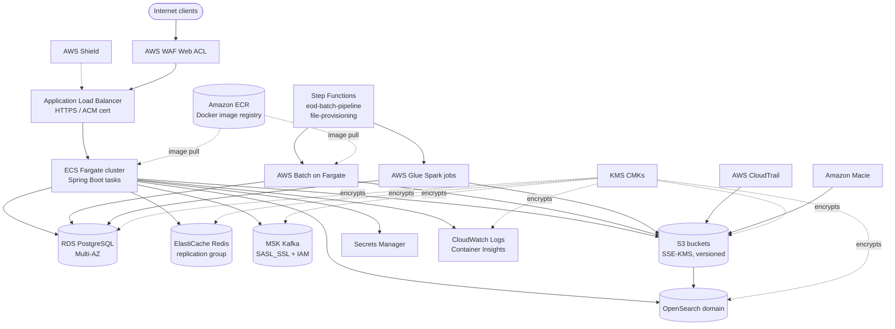

# CardDemo Infrastructure (Terraform IaC)

This folder contains the Terraform Infrastructure-as-Code (IaC) definitions that provision
the AWS-native runtime environment for the **CardDemo** Java 17+ / Spring Boot 3.x
application — the migration target of the legacy IBM Enterprise COBOL / CICS / VSAM / JCL
codebase preserved under `../app/` (per AAP §0.1.1). The IaC replaces the mainframe
operational layer (`../app/jcl/*.jcl` for VSAM cluster provisioning, `OPENFIL.jcl` /
`CLOSEFIL.jcl` for CICS file open/close, `CBADMCDJ.jcl` for CSD updates) with
cloud-native Terraform-managed AWS resources (per AAP §0.6.3). The application is
**demo-ready by May 20, 2026** per AAP §0.7.2.

This README is the **operator runbook** for the Terraform configuration under
`./terraform/`. It is the canonical reference for engineers, SREs, and security reviewers
who need to bootstrap a fresh environment, run `plan` / `apply` / `destroy`, locate the
Terraform module responsible for each AWS service, verify the PCI-DSS controls aligned
with AAP §0.6.6 and §0.7.2, and cross-reference Terraform outputs with the Spring Boot
application configuration (`../src/main/resources/application-*.yml`) and the GitHub
Actions CI/CD workflows under `../.github/workflows/`.

## Table of Contents

- [Architecture Overview](#architecture-overview)
- [Folder Layout](#folder-layout)
- [Prerequisites](#prerequisites)
- [Bootstrap (one-time setup)](#bootstrap-one-time-setup)
- [Daily Workflow](#daily-workflow)
- [Per-resource Modules](#per-resource-modules)
- [Tagging Conventions](#tagging-conventions)
- [PCI-DSS Security Posture](#pci-dss-security-posture)
- [Coordination with Application Code](#coordination-with-application-code)
- [Coordination with CI/CD](#coordination-with-cicd)
- [Troubleshooting](#troubleshooting)
- [References](#references)

## Architecture Overview

The diagram below summarises the AWS-native runtime topology provisioned by the
Terraform configuration in `./terraform/`. Every arrow corresponds to a network path or
control-plane integration provisioned by one or more `.tf` files documented in the
[Per-resource Modules](#per-resource-modules) section. All data-plane links carry TLS
1.2+; all persistent storage is encrypted at rest with customer-managed KMS keys (CMKs)
provisioned by `kms.tf` per AAP §0.6.6 and §0.7.1.



*AWS-native runtime for CardDemo (provisioned by `infrastructure/terraform/`).*

Key topology notes:

- **Ingress**: All public traffic enters via the ALB. AWS WAF is attached to the ALB
  with managed rule groups for financial services (CommonRuleSet, KnownBadInputs,
  SQLi, AmazonIpReputation) per AAP §0.7.2. AWS Shield Standard is enabled by default
  on the ALB; Shield Advanced is optional via `shield.tf`.
- **Compute**: Spring Boot tasks run on ECS Fargate behind the ALB. Auto-scaling
  policies use CPU utilization and MSK consumer lag as triggers per AAP §0.1.1.
- **Persistence**: RDS PostgreSQL Multi-AZ replaces the legacy VSAM KSDS clusters per
  AAP §0.6.2; ElastiCache Redis serves the cache-aside pattern for high-frequency
  account balance reads per AAP §0.7.1; S3 versioned buckets replace GDG sequential
  output generations per AAP §0.6.2.
- **Messaging**: Amazon MSK Kafka carries inter-service transaction events
  (`transaction.posted`, `account.updated`, `ledger.balanced`, `report.requested`)
  with partition keys on account ID for per-account ordering guarantees per
  AAP §0.6.5.
- **Batch**: AWS Batch on Fargate runs the Spring Batch jars; AWS Step Functions
  state machines orchestrate the end-of-day pipeline and the file-provisioning
  workflow, replacing the JCL job stream `POSTTRAN → INTCALC → COMBTRAN →
  CREASTMT / TRANREPT` per AAP §0.6.3.
- **Audit and observability**: CloudTrail organization-level trail captures every AWS
  API call to a KMS-encrypted, integrity-validated S3 bucket; CloudTrail events plus
  application audit logs are indexed by OpenSearch for searchable retention per
  AAP §0.6.6. Macie continuously scans S3 buckets for PII / financial-data leakage.
- **Secrets and encryption**: AWS Secrets Manager stores all credentials; KMS CMKs
  provide envelope encryption for RDS, S3, ElastiCache, CloudWatch Logs, MSK, and
  OpenSearch. Spring Cloud AWS `@RefreshScope` beans react to rotation events without
  Spring Boot restart per AAP §0.6.4.

## Folder Layout

```text
infrastructure/
├── README.md            # this file
└── terraform/
    ├── main.tf          # providers, backend, common tags
    ├── variables.tf     # input variables
    ├── outputs.tf       # outputs consumed by ECS task env vars and CI/CD
    ├── ecs.tf
    ├── alb.tf
    ├── rds.tf
    ├── elasticache.tf
    ├── msk.tf
    ├── batch.tf
    ├── stepfunctions.tf
    ├── glue.tf
    ├── s3.tf
    ├── kms.tf
    ├── secrets.tf
    ├── waf.tf
    ├── shield.tf
    ├── macie.tf
    ├── cloudtrail.tf
    ├── opensearch.tf
    ├── cloudwatch.tf
    ├── iam.tf
    └── ecr.tf
```

A `modules/` subdirectory under `./terraform/` is **optional** and is not used in the
initial flat layout. AAP §0.3.1 enumerates the file-by-file mapping and does not
mandate a modular structure for the first iteration. If a future iteration extracts
shared resource patterns (e.g., a reusable "encrypted S3 bucket" module), place the
module under `./terraform/modules/<name>/` and add a section to this README documenting
its inputs and outputs.

## Prerequisites

Required tools and minimum versions (per AAP §0.5.1 and §0.7.2):

| Tool | Minimum version | Purpose |
| --- | --- | --- |
| Terraform CLI | 1.5+ (currently pinned to `~> 1.9.5` via `required_version` in `terraform/main.tf`) | Plan / apply / destroy infrastructure (see [Terraform Version Pinning Policy](#terraform-version-pinning-policy)) |
| AWS CLI | v2 | Bootstrap the remote state backend; ad-hoc AWS interactions |
| `jq` | 1.6+ | Parse `terraform output -json` in shell scripts |
| Docker | latest stable | Build the application image; run local stack |
| Docker Compose | latest stable | Run `../docker-compose.yml` (local development) |
| LocalStack CLI | 4.14.0 (per AAP §0.7.2) | Run the local AWS emulator for development |
| LocalStack Pro image | `localstack/localstack-pro:latest` | Emulates the production AWS services locally |

AWS account requirements:

- The engineer running `terraform apply` must hold sufficient permissions to create
  the resources enumerated in AAP §0.4.1 (VPC, subnets, security groups, ECS, ALB,
  RDS, ElastiCache, MSK, AWS Batch, Step Functions, Glue, S3, KMS, Secrets Manager,
  WAF, Shield, Macie, CloudTrail, OpenSearch, CloudWatch, ECR, IAM).
- For the **initial bootstrap** of a new account, attach the AWS managed policy
  `AdministratorAccess` to the operator's role. This is acceptable for the one-time
  bootstrap because the operator must create IAM roles, KMS CMKs, and the remote
  state backend.
- For **subsequent applies**, switch to a least-privilege role whose policy grants
  only the permissions required by the resources declared in `./terraform/*.tf`. The
  `iam.tf` file provisions a `terraform-applier` role and an inline policy that can
  serve as a starting point.
- GitHub Actions assumes an IAM role via OIDC federation (no long-lived
  credentials). The OIDC trust and the deploy role are provisioned by `iam.tf` and
  consumed by `../.github/workflows/deploy.yml`.

Verify your environment before proceeding:

```bash
terraform version
aws --version
aws sts get-caller-identity
jq --version
docker version
docker compose version
localstack --version
```

### Terraform Version Pinning Policy

Code Review CP7 FINAL — INFO finding: local engineers' Terraform CLIs drift across
minor versions over time (one operator reported `1.9.5` while the latest available
release is `1.15.x`). To guarantee that `terraform plan` / `apply` produces
deterministic output across every operator, CI pipeline, and audit replay, the
following pinning policy is enforced.

**Why pin the Terraform CLI and providers?**

* Terraform state files are tied to a specific schema version. Running an older
  CLI against a state written by a newer CLI will fail with
  `state snapshot was created by Terraform vX.Y.Z, which is newer than current
  vA.B.C`, blocking the operator until they upgrade. Running a newer CLI
  against an older state can silently upgrade the schema, which a downstream
  operator on the older CLI then cannot read — exactly the kind of asymmetric
  drift that audit / compliance flows must avoid.
* AWS provider releases occasionally rename arguments (e.g.,
  `compute_environments` → `compute_environment_order` on
  `aws_batch_job_queue`), and unpinned providers will pick up these renames
  at arbitrary `terraform init` times, breaking reproducible builds.
* The PCI-DSS audit trail requires byte-identical replay of every
  infrastructure change. That is only achievable when every operator runs the
  same CLI + provider versions against the same `.tf` source.

**Current pins (single source of truth: `terraform/main.tf`)**:

| Constraint | Current value | Location |
| --- | --- | --- |
| Terraform CLI `required_version` | `>= 1.6.0, < 2.0.0` | `terraform/main.tf` `terraform { required_version = ... }` |
| AWS provider | `~> 5.0` (latest 5.x) | `terraform/main.tf` `required_providers.aws.version` |
| Random provider | `~> 3.6` | `terraform/main.tf` `required_providers.random.version` |
| Kafka provider (Mongey) | `~> 0.7` | `terraform/main.tf` `required_providers.kafka.version` |
| Provider hashes | locked | `terraform/.terraform.lock.hcl` (commit alongside `.tf` changes) |

The `~>` operator pins the major version: `~> 5.0` allows any `5.x` release
but blocks `6.0.0`. Patch updates within the allowed range are picked up by
`terraform init`; lock-file hashes prevent silent supply-chain substitution.

**Provider lock file (`terraform/.terraform.lock.hcl`)**:

* Commit `terraform/.terraform.lock.hcl` alongside the `.tf` files. It records
  the SHA256 hashes of every provider plug-in for every supported platform.
* Run `terraform init -upgrade` **only** when a provider upgrade is
  intentional. The upgrade must be in a separate commit referenced by the
  related `.tf` changes.
* In CI, run `terraform init -lockfile=readonly` so any drift between
  `.terraform.lock.hcl` and the providers downloaded at init time fails the
  pipeline.

**CI/CD enforcement (`.github/workflows/*.yml`)**:

* Every GitHub Actions workflow that runs Terraform calls
  `hashicorp/setup-terraform@v3` with an explicit
  `terraform_version: 1.9.5` (or whatever is current — bumping is a separate
  PR reviewed by a Cloud Architect).
* CI executes `terraform fmt -check -recursive`, `terraform validate`, and
  `terraform plan -detailed-exitcode` in that order. Any non-zero exit code
  fails the workflow.
* Provider downloads use the lock file: the workflow runs
  `terraform init -input=false -lockfile=readonly` to assert that providers
  match the committed hashes.

**Local developer workflow**:

* Install Terraform via `tfenv` or `asdf` and run `tfenv use 1.9.5` (or the
  version recorded in `.terraform-version`, if present in the repository).
* Before opening a PR, run `terraform fmt -recursive` and
  `terraform validate` from `infrastructure/terraform/` to mirror the CI
  checks.
* **Local override**: if an operator must use a newer CLI for a one-off task
  (e.g., to test a `1.10.x` feature), they must (a) document the override in
  the PR description, (b) revert to the pinned version before committing, and
  (c) ensure `terraform/main.tf` `required_version` is bumped in a separate
  PR if the change must be permanent.

**Upgrade cadence**:

* Review Terraform CLI and provider versions every 90 days, or earlier if a
  CVE or critical bugfix is announced.
* **Patch** upgrades (e.g., `1.9.5` → `1.9.6`) — applied automatically by the
  `~>` operator at the next `terraform init`. No PR required unless lock-file
  hashes change.
* **Minor** upgrades (e.g., `1.9.x` → `1.10.0`) — require an architect review
  PR that updates `required_version`, regenerates `.terraform.lock.hcl`, and
  produces a successful `terraform plan` against a non-production environment.
* **Major** upgrades (e.g., `1.x` → `2.0.0` or AWS provider `5.x` → `6.x`) —
  require a full integration test against a non-production environment, an
  updated PCI-DSS change-management record, and sign-off by the Cloud
  Architect + Security teams.

**Deprecation tracking**:

* `terraform validate` emits warnings for deprecated arguments (for example,
  `compute_environments` → `compute_environment_order` on
  `aws_batch_job_queue` in AWS provider 5.x). These warnings are tracked as
  INFO-severity findings in the code review log and must be remediated
  **before** the next major provider upgrade — otherwise the upgrade will
  flip them from warnings to hard errors and block the apply.

## Bootstrap (one-time setup)

The Terraform configuration uses an S3 remote state backend with a DynamoDB lock
table. Because Terraform cannot manage its own state backend, the backend resources
must be created **once** before the first `terraform init` against `./terraform/`.

### Step 1 — Create the remote state backend

Option A — manual via AWS CLI (acceptable for sandbox accounts):

```bash
# Set these to your target account / region
ACCOUNT_ID="$(aws sts get-caller-identity --query Account --output text)"
REGION="us-east-1"

# State bucket — SSE-KMS, versioning, public-access-block
aws s3api create-bucket \
  --bucket "carddemo-tfstate-${ACCOUNT_ID}-${REGION}" \
  --region "${REGION}" \
  --create-bucket-configuration LocationConstraint="${REGION}"

aws s3api put-bucket-versioning \
  --bucket "carddemo-tfstate-${ACCOUNT_ID}-${REGION}" \
  --versioning-configuration Status=Enabled

aws s3api put-public-access-block \
  --bucket "carddemo-tfstate-${ACCOUNT_ID}-${REGION}" \
  --public-access-block-configuration \
    BlockPublicAcls=true,IgnorePublicAcls=true,BlockPublicPolicy=true,RestrictPublicBuckets=true

aws s3api put-bucket-encryption \
  --bucket "carddemo-tfstate-${ACCOUNT_ID}-${REGION}" \
  --server-side-encryption-configuration '{
    "Rules":[{"ApplyServerSideEncryptionByDefault":{"SSEAlgorithm":"aws:kms"}}]
  }'

# Lock table — LockID (String) hash key, on-demand billing
aws dynamodb create-table \
  --table-name carddemo-tfstate-locks \
  --attribute-definitions AttributeName=LockID,AttributeType=S \
  --key-schema AttributeName=LockID,KeyType=HASH \
  --billing-mode PAY_PER_REQUEST \
  --region "${REGION}"
```

Option B — bootstrap with a separate Terraform configuration (preferred for
auditability). Place a minimal configuration under `./terraform/bootstrap/` that
declares only the state bucket and lock table, use a **local** backend for it, and
commit the bootstrap state to the team's secrets vault (it contains no sensitive
data; it is acceptable to keep it locally on the operator workstation as well). The
bootstrap configuration is intentionally not part of this initial scope; create it
when the first prod environment is provisioned.

### Step 2 — Configure the backend block

Set the backend in `./terraform/main.tf` (or a dedicated `versions.tf`) to point at the
bucket and lock table created in Step 1. The `key` includes the workspace so each
environment (`dev`, `prod`) has its own state object.

```hcl
terraform {
  required_version = ">= 1.6.0, < 2.0.0"
  backend "s3" {
    bucket         = "carddemo-tfstate-<ACCOUNT_ID>-<REGION>"
    key            = "carddemo/terraform.tfstate"
    region         = "<REGION>"
    dynamodb_table = "carddemo-tfstate-locks"
    encrypt        = true
  }
}
```

### Step 3 — Initialize Terraform

```bash
cd infrastructure/terraform
terraform init
```

This downloads the AWS provider (`hashicorp/aws ~> 5.x` per AAP §0.5.1) and any other
providers, configures the remote backend, and creates a `.terraform.lock.hcl` file
which **must be committed** (see `../.gitignore`: `*.tfvars` is ignored,
`.terraform.lock.hcl` is explicitly retained).

### Step 4 — Select or create a workspace

```bash
terraform workspace new dev      # first time
terraform workspace select dev   # subsequent
```

Use workspaces to isolate `dev` and `prod` state within the same backend. Never apply
to a workspace you have not explicitly selected — always run `terraform workspace
show` before `terraform apply`.

### Step 5 — Populate environment-specific variables

Create a `terraform.tfvars` file (already excluded from version control via
`../.gitignore`: `*.tfvars`, `*.tfvars.json`). At minimum:

```hcl
aws_region         = "us-east-1"
environment        = "dev"
account_id         = "123456789012"
vpc_cidr           = "10.20.0.0/16"
availability_zones = ["us-east-1a", "us-east-1b", "us-east-1c"]
# Resource sizing (override defaults in variables.tf as needed)
rds_instance_class    = "db.t3.medium"
elasticache_node_type = "cache.t3.small"
msk_broker_count      = 3
ecs_task_cpu          = 1024
ecs_task_memory       = 2048
```

Variable names and types are documented in `./terraform/variables.tf`.

### Step 6 — Plan the change

```bash
terraform plan -out=plan.out
```

Review the plan carefully — every change should be intentional. A non-empty diff on
KMS keys, IAM roles, or RDS parameters during a routine apply is a signal that
something is wrong; investigate before applying.

### Step 7 — Apply

```bash
terraform apply plan.out
```

For prod, the apply MUST happen through a reviewed pull request and pipeline run, not
from a developer workstation.

### Step 8 — Capture outputs for the application

```bash
terraform output -json > outputs.json
```

The output map is consumed by `../.github/workflows/deploy.yml` to populate the ECS
task definition's environment variables, which are in turn read by
`../src/main/resources/application-prod.yml` and `../src/main/resources/application-dev.yml`.
See [Coordination with Application Code](#coordination-with-application-code) for the
canonical mapping of outputs to env vars.

## Daily Workflow

### Standard plan / apply cycle

```bash
cd infrastructure/terraform
terraform workspace show         # confirm the workspace (dev or prod)
terraform plan -out=plan.out     # write a plan file
# Open plan.out via 'terraform show plan.out' and review every diff
terraform apply plan.out         # apply the reviewed plan
```

Never run `terraform apply` without `-out=plan.out`. A reviewer must inspect the plan
before the apply executes.

### Destroying a non-prod environment

```bash
terraform workspace select dev
terraform destroy
```

`terraform destroy` is **forbidden against the prod workspace** without a change
ticket and an approver review.  As an additional guard rail, `iam.tf` may attach a
deny-`destroy` policy to the prod-only deploy role; remove it temporarily and only
under approval for an intentional teardown.

### Refreshing state without applying

```bash
terraform refresh
```

Use `terraform refresh` after a manual AWS console change to reconcile state. Prefer
re-importing or reverting the manual change to keep the IaC the single source of
truth.

### Importing existing resources (rare)

If a resource was created outside Terraform and needs to come under management, use
`terraform import`. Example:

```bash
terraform import aws_s3_bucket.batch_output carddemo-prod-output
```

Importing should be the exception, not the rule. Each import requires a corresponding
resource block in `./terraform/*.tf` with attributes that match the imported state.

## Per-resource Modules

Each `.tf` file in `./terraform/` provisions one cohesive AWS service domain. The
subsections below document, for each file, the purpose, the resources provisioned, the
AAP rules implemented, the outputs exported, and the cross-references to other files
and to the Spring Boot application.

### `main.tf`

- **Purpose**: Terraform configuration block, AWS provider configuration, remote
  backend, and the `locals.common_tags` map used by every resource.
- **Resources provisioned**: `terraform { ... }` block, `provider "aws" { ... }`,
  `locals { ... }` map. No infrastructure resources are declared in this file.
- **Key AAP rules implemented**: AAP §0.7.1 (tagging convention),
  AAP §0.5.1 (provider version pinning to `hashicorp/aws ~> 5.x`).
- **Outputs**: None directly; provides `local.common_tags` consumed by every other
  `.tf` file.
- **Cross-references**: All other `.tf` files reference `local.common_tags`.

### `variables.tf`

- **Purpose**: Input variable declarations for the Terraform configuration.
- **Resources provisioned**: `variable "..."` declarations only.
- **Key AAP rules implemented**: AAP §0.7.2 (environment variables required by the
  application — `aws_region`, `environment`, account context).
- **Inputs**: `aws_region`, `environment` (one of `local`, `dev`, `prod`),
  `account_id`, `vpc_cidr`, `availability_zones`, `rds_instance_class`,
  `elasticache_node_type`, `msk_broker_count`, `ecs_task_cpu`, `ecs_task_memory`,
  and tag overrides.
- **Outputs**: None.
- **Cross-references**: Variables are referenced by every other `.tf` file.

### `outputs.tf`

- **Purpose**: Expose the resource identifiers consumed by ECS task env vars and by
  the CI/CD pipeline.
- **Resources provisioned**: `output "..."` blocks only.
- **Key AAP rules implemented**: AAP §0.4.1 and §0.7.2 (env vars consumed by the
  Spring Boot application).
- **Outputs** (canonical set — extend only when a new env var is required):
  `alb_dns_name`, `rds_endpoint`, `rds_secret_arn`, `msk_bootstrap_servers`,
  `s3_output_bucket`, `kms_key_arn`, `opensearch_endpoint`,
  `eod_state_machine_arn`, `cloudtrail_trail_arn`, `ecr_repository_url`,
  `ecs_cluster_name`.
- **Cross-references**: Consumed by `../.github/workflows/deploy.yml` to populate the
  ECS task definition; mapped to env vars in
  `../src/main/resources/application-prod.yml` and
  `../src/main/resources/application-dev.yml`.

### `ecs.tf`

- **Purpose**: ECS Fargate cluster, task definition, and service for the Spring Boot
  application.
- **Resources provisioned**: `aws_ecs_cluster`, `aws_ecs_task_definition`,
  `aws_ecs_service`, `aws_appautoscaling_target`, `aws_appautoscaling_policy`,
  CloudWatch alarm-based scaling triggers (CPU and MSK consumer lag).
- **Key AAP rules implemented**: AAP §0.1.1 (ECS Fargate behind ALB),
  AAP §0.7.2 (health endpoints via Spring Actuator integrated with ECS health
  checks and ALB target group health checks).
- **Outputs**: `ecs_cluster_name`, `ecs_service_arn`, `ecs_task_definition_arn`.
- **Cross-references**: Pulls images from `ecr.tf`; attaches to the target group from
  `alb.tf`; reads secrets from `secrets.tf`; assumes the task role from `iam.tf`;
  ships logs to log groups from `cloudwatch.tf`; updated by
  `../.github/workflows/deploy.yml`.

### `alb.tf`

- **Purpose**: Internet-facing Application Load Balancer with HTTPS listener and
  target groups for the Spring Boot container port 8080.
- **Resources provisioned**: `aws_lb` (ALB), `aws_lb_listener` (HTTPS, TLS 1.2+
  policy), `aws_lb_target_group`, `aws_lb_listener_certificate` (ACM cert),
  `aws_lb_target_group_attachment` (when running outside ECS),
  `aws_acm_certificate` (or data lookup of an existing cert),
  `aws_security_group` for the ALB.
- **Key AAP rules implemented**: AAP §0.6.6 (TLS 1.2+ in transit),
  AAP §0.3.4 (sticky sessions enabled for stateful flows — `stickiness` block on the
  target group with `type = "lb_cookie"`).
- **Outputs**: `alb_dns_name`, `alb_arn`, `alb_target_group_arn`,
  `alb_security_group_id`.
- **Cross-references**: ALB has the WAF Web ACL from `waf.tf` attached; optionally
  protected by Shield Advanced from `shield.tf`; target group is consumed by
  `ecs.tf`.

### `rds.tf`

- **Purpose**: RDS PostgreSQL Multi-AZ instance for the relational target replacing
  the source VSAM KSDS clusters (AAP §0.6.2).
- **Resources provisioned**: `aws_db_instance` (Multi-AZ, encrypted at rest with the
  KMS CMK from `kms.tf`), `aws_db_parameter_group` (sets `rds.force_ssl=1` and
  isolation defaults), `aws_db_subnet_group` (private subnets only),
  `aws_security_group` restricting inbound `5432` to the ECS task SG only.
- **Key AAP rules implemented**: AAP §0.7.1 (`@Transactional` with proper isolation
  levels — DB parameter group defaults to `read_committed`),
  AAP §0.6.6 (TLS in transit via `rds.force_ssl=1`),
  AAP §0.7.1 (encryption at rest via KMS CMK),
  AAP §0.7.2 (35-day automated backups + point-in-time recovery).
- **Outputs**: `rds_endpoint`, `rds_port`, `rds_db_name`, `rds_security_group_id`,
  `rds_instance_arn`.
- **Cross-references**: Encrypted with the CMK from `kms.tf`; credentials managed
  by `secrets.tf`; consumed by Flyway migrations in
  `../src/main/resources/db/migration/V*.sql` at Spring Boot startup; security
  group ingress restricted to the ECS task SG from `ecs.tf`.

### `elasticache.tf`

- **Purpose**: ElastiCache Redis replication group for the cache-aside pattern
  serving high-frequency account-balance lookups (AAP §0.7.1).
- **Resources provisioned**: `aws_elasticache_replication_group` (cluster mode
  disabled for simple replication, or enabled for shards depending on scale),
  `aws_elasticache_parameter_group` with `maxmemory-policy=allkeys-lru` per
  AAP §0.7.1, `aws_elasticache_subnet_group`, `aws_security_group` restricting
  inbound `6379` to the ECS task SG, encryption in transit and at rest enabled
  with CMK.
- **Key AAP rules implemented**: AAP §0.7.1 (cache-aside, `allkeys-lru` eviction,
  TTL aligned to transaction frequency — TTL itself is set at the application
  layer via `@Cacheable(ttl=...)`).
- **Outputs**: `elasticache_primary_endpoint`, `elasticache_port`,
  `elasticache_security_group_id`.
- **Cross-references**: Encrypted with the CMK from `kms.tf`; consumed by the Spring
  Boot Redis client configured in `../src/main/java/com/awsm2/carddemo/config/RedisConfig.java`.

### `msk.tf`

- **Purpose**: Amazon MSK (Apache Kafka) cluster carrying the inter-service event
  topics defined in AAP §0.6.5.
- **Resources provisioned**: `aws_msk_cluster` (TLS 1.2+ in-transit encryption,
  KMS-CMK encryption at rest, IAM SASL_SSL authentication enabled),
  `aws_msk_configuration` (default partition count, replication factor of 3),
  `aws_security_group` restricting inbound `9098` (IAM auth port) to the ECS task
  SG and to the AWS Batch SG, optional `aws_msk_scram_secret_association` if SCRAM
  auth is also needed alongside IAM, `aws_msk_topic` resources (via the AWS provider
  or via an out-of-band administrative step using `kafka-topics.sh`) for
  `transaction.posted`, `account.updated`, `ledger.balanced`, `report.requested`
  with `partitions >= 12` each.
- **Key AAP rules implemented**: AAP §0.6.5 (per-account ordering via partition key
  on account ID; `acks=all`, `enable.idempotence=true` are configured at the
  producer in `../src/main/java/com/awsm2/carddemo/config/KafkaConfig.java`),
  AAP §0.6.6 (TLS 1.2+; IAM auth).
- **Outputs**: `msk_bootstrap_servers` (the SASL_SSL bootstrap endpoint),
  `msk_cluster_arn`, `msk_security_group_id`.
- **Cross-references**: Encrypted with the CMK from `kms.tf`; ECS and Batch
  security groups are attached to the inbound rules; consumed by
  `../src/main/java/com/awsm2/carddemo/config/KafkaConfig.java` and the
  `@KafkaListener` methods on the consumer services.

### `batch.tf`

- **Purpose**: AWS Batch compute environment and job queue running the Spring Batch
  jobs that replace the JCL batch programs in `../app/jcl/`.
- **Resources provisioned**: `aws_batch_compute_environment` (Fargate),
  `aws_batch_job_queue`, six `aws_batch_job_definition` resources for
  `DailyTransactionPosting`, `InterestCalculation`, `CombineTransactions`,
  `StatementGeneration`, `TransactionReport`, and `PrintCategoryBalance`. Each
  job definition references the Docker image pushed to ECR by
  `../.github/workflows/docker-build.yml` and the IAM job role from `iam.tf`.
- **Key AAP rules implemented**: AAP §0.6.3 (JCL → AWS Batch + Step Functions),
  AAP §0.7.2 (batch SLA — sizing of compute environment matches existing COBOL job
  runtime baselines).
- **Outputs**: `batch_job_queue_arn`, individual
  `batch_job_definition_<name>_arn` per job.
- **Cross-references**: Invoked by `stepfunctions.tf` (Task states use
  `arn:aws:states:::batch:submitJob.sync`); pulls images from `ecr.tf`; assumes
  the job role from `iam.tf`; writes outputs to S3 buckets from `s3.tf`.

### `stepfunctions.tf`

- **Purpose**: AWS Step Functions state machines replacing the JCL job stream
  orchestration (AAP §0.6.3).
- **Resources provisioned**: `aws_sfn_state_machine` for `eod-batch-pipeline`
  (linear `POSTTRAN → INTCALC → COMBTRAN → Parallel { CREASTMT, TRANREPT }` chain)
  and `file-provisioning` (Map state iterating over Flyway migrations and Glue
  ETL jobs). Both state machines load their ASL JSON definition via Terraform's
  `file()` function from `../src/main/resources/stepfunctions/eod-batch-pipeline.asl.json`
  and `../src/main/resources/stepfunctions/file-provisioning.asl.json` and run as
  the IAM execution role from `iam.tf`.
- **Key AAP rules implemented**: AAP §0.6.3 (JCL `COND=` semantics map to ASL
  `Choice` / `Catch` / `Retry`; JCL `PARALLEL` step maps to ASL `Parallel` state).
- **Outputs**: `eod_state_machine_arn`, `file_provisioning_state_machine_arn`.
- **Cross-references**: ASL JSON sources live under `../src/main/resources/stepfunctions/`;
  Task states invoke AWS Batch jobs from `batch.tf` and Glue jobs from `glue.tf`;
  EventBridge rules (defined inline or in `cloudwatch.tf`) trigger executions on
  schedule.

### `glue.tf`

- **Purpose**: AWS Glue Spark job definitions for the ETL flows that replace the
  GDG-driven flat-file pipelines in `../app/jcl/` (`REPTFILE.jcl`,
  `DEFGDGB.jcl`).
- **Resources provisioned**: `aws_glue_job` definitions (Spark scripts staged in
  the S3 scripts bucket from `s3.tf`), `aws_glue_connection` (JDBC connection
  to RDS PostgreSQL via the connection string from `rds.tf`),
  `aws_glue_security_configuration` (KMS encryption for job bookmarks and CloudWatch logs).
- **Key AAP rules implemented**: AAP §0.6.3 (GDG flat-file pipelines → Glue ETL),
  AAP §0.6.6 (KMS encryption for Glue artifacts).
- **Outputs**: `glue_job_arns` (map of job names to ARNs), `glue_connection_name`.
- **Cross-references**: Invoked by Task states in `stepfunctions.tf`; reads and
  writes to S3 buckets from `s3.tf`; uses the JDBC connection registered against
  `rds.tf`; runs as the Glue job role from `iam.tf`.

### `s3.tf`

- **Purpose**: S3 buckets replacing the sequential PS / GDG datasets emitted by the
  legacy batch programs (`DALYREJS`, `SYSTRAN`, `TRANREPT`, `STMTFILE`,
  `TRANSACT.BKUP`) and serving as the home for Glue Spark scripts, CloudTrail
  logs, and Terraform plan-output archives.
- **Resources provisioned**: One `aws_s3_bucket` per logical bucket
  (batch-output, glue-scripts, cloudtrail-logs, etc.), and per bucket:
  `aws_s3_bucket_versioning` (Status=Enabled), `aws_s3_bucket_server_side_encryption_configuration`
  (SSE-KMS via the CMK from `kms.tf`), `aws_s3_bucket_public_access_block` (all four
  block flags set), `aws_s3_bucket_policy` denying `s3:*` when
  `aws:SecureTransport=false`, and `aws_s3_bucket_lifecycle_configuration`
  transitioning old versions to Glacier and expiring them per the regulatory
  retention policy (AAP §0.6.2 GDG generation replacement).
- **Key AAP rules implemented**: AAP §0.7.1 (S3 buckets encrypted with SSE-KMS,
  block public access, deny non-TLS access), AAP §0.6.2 (lifecycle policies replace
  GDG `(+1)` / `(0)` generation semantics), AAP §0.7.2 (S3 lifecycle policies
  enforce regulatory data-retention periods).
- **Outputs**: `s3_output_bucket` (the primary batch output bucket name),
  `s3_glue_scripts_bucket`, `s3_cloudtrail_bucket`,
  `s3_output_bucket_arn`.
- **Cross-references**: Encrypted with the CMK from `kms.tf`; consumed by
  `ecs.tf` task role (read/write), `batch.tf` job role (read/write),
  `glue.tf` job role (read/write), `cloudtrail.tf` (write target),
  `macie.tf` (classification target), and the Spring Boot
  `S3OutputService` adapter (under `../src/main/java/com/awsm2/carddemo/adapter/S3OutputService.java`).

### `kms.tf`

- **Purpose**: Customer-managed KMS keys (CMKs) providing envelope encryption for
  every persistent service. One key per service per AAP §0.6.6.
- **Resources provisioned**: `aws_kms_key` and `aws_kms_alias` for each of:
  `carddemo/rds`, `carddemo/s3`, `carddemo/elasticache`, `carddemo/cloudwatch-logs`,
  `carddemo/msk`, `carddemo/opensearch`, `carddemo/secrets-manager`. Each key has
  `enable_key_rotation = true` (annual rotation per AAP §0.7.1) and a key policy
  granting use to the relevant AWS service principals plus the ECS task role and
  the Terraform applier role.
- **Key AAP rules implemented**: AAP §0.7.1 (all data at rest encrypted via CMKs),
  AAP §0.6.6 (envelope encryption; annual key rotation).
- **Outputs**: `kms_key_arn` (a map of `service_name => key_arn`; the `rds` entry is
  the canonical `KMS_KEY_ARN` env var consumed by Spring Boot).
- **Cross-references**: Referenced by `rds.tf`, `s3.tf`, `elasticache.tf`, `msk.tf`,
  `cloudwatch.tf` (log group encryption), `opensearch.tf`, `secrets.tf`,
  `cloudtrail.tf`.

### `secrets.tf`

- **Purpose**: AWS Secrets Manager secrets for every credential consumed by the
  application; rotation Lambda functions that publish to SNS topics on successful
  rotation (per the AAP §0.6.4 dynamic-rotation design).
- **Resources provisioned**: `aws_secretsmanager_secret` and
  `aws_secretsmanager_secret_version` (initial value seeded by Terraform, then
  rotated by the Lambda — Terraform ignores `secret_string` drift via `lifecycle
  { ignore_changes = [secret_string] }`) for: `carddemo/<env>/rds-credentials`,
  `carddemo/<env>/jwt-signing-key`, `carddemo/<env>/msk-sasl-credentials`,
  and any third-party API keys. Per-secret `aws_secretsmanager_secret_rotation`
  resources wire the Lambda from `iam.tf` (rotation Lambda role) and the SNS topic
  defined in this file for refresh-event publication.
- **Key AAP rules implemented**: AAP §0.7.1 (all credentials from Secrets Manager,
  never plaintext), AAP §0.6.4 (rotation without Spring Boot restart — rotation
  Lambda publishes to SNS, the Spring application consumes the SNS message via SQS
  and emits a `RefreshEvent` to refresh `@RefreshScope` beans).
- **Outputs**: `rds_secret_arn`, `jwt_secret_arn`, `msk_sasl_secret_arn`,
  `secret_rotation_sns_topic_arn`.
- **Cross-references**: Secrets are encrypted with the CMK from `kms.tf`; rotation
  Lambdas assume roles from `iam.tf`; the rotation SNS topic is subscribed to by an
  SQS queue defined here, which is consumed by the Spring Boot SecretsManager
  refresh listener.

### `waf.tf`

- **Purpose**: AWS WAF Web ACL providing L7 protection for the ALB.
- **Resources provisioned**: `aws_wafv2_web_acl` with the AWS Managed Rules
  groups recommended for financial services — `AWSManagedRulesCommonRuleSet`,
  `AWSManagedRulesKnownBadInputsRuleSet`, `AWSManagedRulesSQLiRuleSet`, and
  `AWSManagedRulesAmazonIpReputationList`. The ACL is associated with the ALB ARN
  from `alb.tf` via `aws_wafv2_web_acl_association`. CloudWatch metrics are
  enabled for every rule.
- **Key AAP rules implemented**: AAP §0.7.2 (AWS WAF + Shield on ALB for all
  public-facing endpoints).
- **Outputs**: `waf_web_acl_arn`.
- **Cross-references**: Associated to the ALB from `alb.tf`; metrics surfaced
  via `cloudwatch.tf` alarms.

### `shield.tf`

- **Purpose**: Optional AWS Shield Advanced subscription on the ALB (Shield Standard
  is enabled by default on all CloudFront and ALB resources at no additional cost).
- **Resources provisioned**: `aws_shield_protection` on the ALB ARN from `alb.tf`,
  plus the optional `aws_shield_protection_group` and proactive engagement
  contact when Shield Advanced is required for prod.
- **Key AAP rules implemented**: AAP §0.7.2 (Shield Standard by default; Shield
  Advanced "recommended for the ALB to gain L7 DDoS protection and incident response").
- **Outputs**: `shield_protection_arn` (when Advanced is enabled).
- **Cross-references**: Attached to the ALB from `alb.tf`. Shield Advanced is opt-in
  via a `var.enable_shield_advanced` flag; default `false` for `dev`, `true` for
  `prod` once the subscription is purchased.

### `macie.tf`

- **Purpose**: Amazon Macie session and S3 classification jobs that scan the
  CardDemo S3 buckets for PII / financial-data leakage (AAP §0.6.6).
- **Resources provisioned**: `aws_macie2_account` (enables Macie at the account
  level), `aws_macie2_classification_job` per business S3 bucket from `s3.tf`,
  `aws_sns_topic` for findings, `aws_sns_topic_subscription` to the
  security-operations email list, and an EventBridge rule routing Macie
  `HIGH`/`MEDIUM` severity findings to the SNS topic.
- **Key AAP rules implemented**: AAP §0.7.2 (Macie continuously monitors S3 for
  PII/financial data leakage).
- **Outputs**: `macie_findings_topic_arn`.
- **Cross-references**: Scans the buckets from `s3.tf`; uses the IAM service-linked
  role for Macie; sends notifications to security operations.

### `cloudtrail.tf`

- **Purpose**: AWS CloudTrail organization-level trail capturing every AWS API call
  to an immutable, integrity-validated S3 bucket; CloudTrail events are replicated
  to OpenSearch for searchable retention (AAP §0.6.6).
- **Resources provisioned**: `aws_cloudtrail` (multi-region, organization trail,
  `include_global_service_events=true`, `enable_log_file_validation=true`,
  KMS-encrypted destination), the dedicated `aws_s3_bucket` for trail destination
  (with SSE-KMS, versioning, public-access-block, and a bucket policy that allows
  only the CloudTrail service principal to write), an EventBridge rule on
  `s3:ObjectCreated:Put` for the trail bucket triggering an OpenSearch ingestion
  Lambda (or a Firehose delivery stream when scale dictates).
- **Key AAP rules implemented**: AAP §0.6.6 (organization-level trail, log-file
  integrity validation, KMS-encrypted destination, OpenSearch replication),
  AAP §0.7.2 (CloudTrail provides immutable, tamper-evident audit log).
- **Outputs**: `cloudtrail_trail_arn`, `cloudtrail_bucket_name`.
- **Cross-references**: Bucket from `s3.tf` (the trail-specific bucket); encrypted
  by the CMK from `kms.tf`; events delivered to the OpenSearch domain from
  `opensearch.tf`.

### `opensearch.tf`

- **Purpose**: Amazon OpenSearch domain indexing transaction logs and CloudTrail
  events for fraud investigation and regulatory queries (AAP §0.6.6).
- **Resources provisioned**: `aws_opensearch_domain` (VPC-internal, encrypted at
  rest with the CMK from `kms.tf`, node-to-node encryption enabled, HTTPS
  enforced, `enforce_https=true`, fine-grained access control via IAM principals),
  `aws_opensearch_domain_policy` granting the ECS task role and the CloudTrail
  ingestion Lambda role read/write access, `aws_security_group` restricting
  inbound HTTPS to the ECS task SG.
- **Key AAP rules implemented**: AAP §0.6.6 (OpenSearch for indexed transaction
  logs and CloudTrail events; encryption at rest with CMK; VPC-internal access),
  AAP §0.7.2 (audit trail content preserved; OpenSearch indexes transaction logs
  and CloudTrail events for regulatory queries and fraud investigation).
- **Outputs**: `opensearch_endpoint`, `opensearch_domain_arn`.
- **Cross-references**: Encrypted with CMK from `kms.tf`; consumed by the Spring
  Boot `OpenSearchIndexer` adapter (under
  `../src/main/java/com/awsm2/carddemo/adapter/OpenSearchIndexer.java`); receives
  CloudTrail events via the ingestion pipeline from `cloudtrail.tf`.

### `cloudwatch.tf`

- **Purpose**: CloudWatch Logs log groups, metric alarms, and Container Insights
  configuration for ECS, AWS Batch, Step Functions, and Lambda runtimes.
- **Resources provisioned**: `aws_cloudwatch_log_group` for each ECS task family,
  Batch job definition, Step Functions execution log, and rotation Lambda — each
  with `kms_key_id` set to the CloudWatch Logs CMK from `kms.tf` and a
  `retention_in_days` value tuned to regulatory retention. `aws_cloudwatch_metric_alarm`
  resources for: ECS service CPU/memory > 80%, MSK consumer lag > N seconds,
  RDS CPU/connections, S3 4xx/5xx error counts on Step Functions / Batch job
  failures. Container Insights is enabled on the ECS cluster from `ecs.tf` via the
  `setting` block.
- **Key AAP rules implemented**: AAP §0.7.2 (CloudWatch Container Insights for
  ECS task-level metrics; alarms surface as CloudWatch alarms; Spring Actuator
  metrics exported via Micrometer to CloudWatch under namespace `CardDemo`),
  AAP §0.7.2 (CloudWatch log filters detect plaintext PAN-like patterns in
  application logs).
- **Outputs**: `cloudwatch_log_group_names` (map of service to log group name).
- **Cross-references**: Log groups consumed by `ecs.tf` (`logConfiguration.awslogs-*`)
  and `batch.tf` (`logConfiguration` on each job definition); alarms feed an SNS
  topic monitored by SRE.

### `iam.tf`

- **Purpose**: Least-privilege IAM roles and policies for every AWS service that
  needs to assume an identity. There are no long-lived IAM user credentials;
  human and machine principals assume roles.
- **Resources provisioned**: `aws_iam_role` and `aws_iam_role_policy` (or
  `aws_iam_policy` + `aws_iam_role_policy_attachment`) for:
  - **ECS task execution role** (pull image from ECR, read secrets from Secrets
    Manager, write logs to CloudWatch).
  - **ECS task role** (S3 batch-output read/write, MSK `kafka-cluster:Connect`
    and per-topic / per-group permissions, RDS Secrets read, KMS Decrypt on the
    relevant CMK aliases, OpenSearch HTTP write).
  - **AWS Batch job role** (same permissions as ECS task role; additional S3
    permissions for batch input/output).
  - **Step Functions execution role** (Batch:SubmitJob, Glue:StartJobRun,
    SNS:Publish for completion notifications, CloudWatch:PutMetricData).
  - **Glue job role** (S3 read/write on glue-scripts and batch-output, JDBC
    connection access to RDS, CloudWatch logs).
  - **Secrets Manager rotation Lambda role** (SecretsManager:GetSecretValue /
    PutSecretValue / UpdateSecret, RDS:ModifyDBInstance for credential rotation,
    SNS:Publish on rotation completion).
  - **GitHub Actions OIDC role** (deploy-only permissions: ECR push, ECS update
    service, S3 read for plan artifacts; no `iam:*` write).
  - **Terraform applier role** (least-privilege superset for managing the
    declared resources; not granted `Administrator` outside the bootstrap
    window).
- **Key AAP rules implemented**: AAP §0.7.1 (least-privilege),
  AAP §0.6.4 (rotation Lambda role for dynamic secret rotation),
  AAP §0.7.2 (OIDC for GitHub Actions — no long-lived credentials).
- **Outputs**: Role ARNs consumed by other `.tf` files
  (`ecs_task_execution_role_arn`, `ecs_task_role_arn`,
  `batch_job_role_arn`, `step_functions_role_arn`, `glue_job_role_arn`,
  `rotation_lambda_role_arn`, `github_actions_role_arn`).
- **Cross-references**: Roles are assumed by every other `.tf` file that declares a
  workload (ECS, Batch, Glue, Step Functions, rotation Lambda); the GitHub
  Actions role is assumed by `../.github/workflows/deploy.yml`.

### `ecr.tf`

- **Purpose**: Amazon ECR repository for the Spring Boot Docker image built from
  the repository-root `../Dockerfile`.
- **Resources provisioned**: `aws_ecr_repository` (`scan_on_push = true`,
  `image_tag_mutability = "IMMUTABLE"`), `aws_ecr_lifecycle_policy` retaining the
  last 30 tagged images and deleting untagged images after 1 day,
  `aws_ecr_repository_policy` granting pull-only to the ECS task execution role
  and the AWS Batch job execution role.
- **Key AAP rules implemented**: AAP §0.7.2 (image scanning; lifecycle policy
  prevents repository bloat).
- **Outputs**: `ecr_repository_url`, `ecr_repository_arn`.
- **Cross-references**: Image pushed by `../.github/workflows/docker-build.yml`;
  pulled by `ecs.tf` task definitions and `batch.tf` job definitions.

## Tagging Conventions

Every resource managed by Terraform under `./terraform/` MUST carry the common tag
set defined in `main.tf` via `locals.common_tags`. The AAP folder summary's "Rules
and Constraints" requires a uniform tagging convention for cost allocation, audit
filtering, and resource ownership.

The mandatory tag map (copy verbatim from `main.tf`):

```hcl
locals {
  common_tags = {
    Project     = "CardDemo"
    Environment = var.environment   # one of: local, dev, prod
    Owner       = "blitzy-sandbox"
    ManagedBy   = "Terraform"
  }
}
```

Apply the tag map to every taggable resource via the resource-level `tags` argument:

```hcl
resource "aws_s3_bucket" "batch_output" {
  bucket = "carddemo-${var.environment}-output"
  tags   = local.common_tags
}
```

Optional tags that MAY be added per-resource (do not omit them where they apply):

- `CostCenter` — e.g., `card-demo-platform`, used for AWS Cost Explorer grouping.
- `DataClassification` — one of `public`, `internal`, `confidential`, `restricted`;
  set to `restricted` for any resource that handles cardholder data
  (RDS, S3 batch-output, ElastiCache).
- `Compliance` — `PCI-DSS` on any resource subject to PCI-DSS scope; informs the
  AWS Security Hub findings filter and the Macie classification scope.

Provider-level default tags can be added in `main.tf` via the `default_tags` block on
the `provider "aws"` configuration to apply the common tags to all resources that
support tagging without requiring a per-resource `tags = local.common_tags`
attribute. The current configuration uses both approaches: `default_tags` on the
provider as a safety net and explicit `tags` on each resource for clarity in the
declaration.

## PCI-DSS Security Posture

The Terraform configuration implements the controls aligned with PCI-DSS
requirements per AAP §0.6.6 and §0.7.2. **This is not a certification statement**:
no audit has been performed against this configuration. The list below documents
which Terraform resources implement which control category. A formal PCI-DSS audit
is required before any cardholder-data-bearing workload runs in production.

### Encryption at rest (AAP §0.7.1)

Every persistent service is encrypted with a customer-managed KMS key (CMK) from
`kms.tf`:

- **RDS PostgreSQL** — `aws_db_instance.storage_encrypted=true`,
  `kms_key_id = aws_kms_key.rds.arn`.
- **S3 buckets** — `aws_s3_bucket_server_side_encryption_configuration` with
  `sse_algorithm = "aws:kms"` and `kms_master_key_id = aws_kms_key.s3.arn`.
- **ElastiCache Redis** — `at_rest_encryption_enabled = true` and
  `kms_key_id = aws_kms_key.elasticache.arn`.
- **CloudWatch Logs** — `aws_cloudwatch_log_group.kms_key_id = aws_kms_key.cloudwatch_logs.arn`.
- **MSK** — `encryption_info.encryption_at_rest_kms_key_arn = aws_kms_key.msk.arn`.
- **OpenSearch** — `encrypt_at_rest.enabled = true` and
  `kms_key_id = aws_kms_key.opensearch.arn`.

All CMKs have annual rotation enabled (`enable_key_rotation = true`) per AAP §0.7.1.

### Encryption in transit (AAP §0.6.6)

TLS 1.2 or higher on every data-plane connection:

- **ALB** — HTTPS listener with `ssl_policy = "ELBSecurityPolicy-TLS13-1-2-2021-06"`
  (or a TLS 1.2+ policy if TLS 1.3 is not desired).
- **RDS** — DB parameter group sets `rds.force_ssl = 1`; the JDBC URL in
  `application-*.yml` uses `sslmode=require`.
- **MSK** — `client_authentication.sasl.iam = true` with `encryption_in_transit.client_broker = "TLS"`.
- **ElastiCache** — `transit_encryption_enabled = true`; the Redis client uses
  `useSsl = true`.
- **OpenSearch** — `domain_endpoint_options.enforce_https = true` and
  `tls_security_policy = "Policy-Min-TLS-1-2-2019-07"`.

### Secrets management (AAP §0.7.1, AAP §0.6.4)

No credential is ever stored in plaintext in source files, environment variables,
or container images:

- AWS Secrets Manager holds every credential (`rds-credentials`, `jwt-signing-key`,
  `msk-sasl-credentials`, third-party API keys).
- Rotation Lambda functions (from `secrets.tf` + `iam.tf`) rotate credentials on
  schedule and publish to an SNS topic, which the Spring application consumes via
  SQS to emit `RefreshEvent` — refreshing `@RefreshScope` beans without restart
  per AAP §0.6.4.
- The ECS task definition pulls secrets via the `secrets` attribute (Secrets
  Manager ARN references), not via `environment` plaintext values.

### No public access on S3 (AAP §0.7.1)

- `aws_s3_bucket_public_access_block` is set on every bucket with all four block
  flags enabled (`block_public_acls`, `ignore_public_acls`, `block_public_policy`,
  `restrict_public_buckets`).
- The bucket policy denies `s3:*` for `aws:SecureTransport=false`, enforcing
  HTTPS-only access.

### WAF and Shield (AAP §0.7.2)

- WAF Web ACL with managed rule groups (CommonRuleSet, KnownBadInputs, SQLi,
  AmazonIpReputation) attached to the ALB by `waf.tf`.
- Shield Standard is enabled by default. Shield Advanced is opt-in via
  `var.enable_shield_advanced` and `shield.tf` for prod.

### Macie continuous scanning (AAP §0.7.2)

- Macie classification jobs scan every business S3 bucket from `s3.tf` daily.
- Findings of `HIGH` or `MEDIUM` severity route to an SNS topic monitored by the
  security operations team.

### CloudTrail immutable audit trail (AAP §0.6.6)

- Organization-level trail with `enable_log_file_validation = true` and
  KMS-encrypted destination.
- CloudTrail events replicate to the OpenSearch domain from `opensearch.tf` for
  fraud investigation and regulatory queries.

### CloudWatch log filters for PAN-like patterns (AAP §0.7.2)

- `aws_cloudwatch_log_metric_filter` resources in `cloudwatch.tf` detect
  PAN-like 13-19 digit sequences in application logs and emit a metric that is
  alarm-bound; an alert fires when the count > 0 in any 5-minute window.

The Terraform configuration MUST be validated against the latest AWS Foundational
Security Best Practices (FSBP) standard in AWS Security Hub and the PCI-DSS
conformance pack in AWS Config before any prod deployment. Findings from those
scans are tracked outside this repository.

## Coordination with Application Code

### Terraform outputs → ECS task environment variables

Per AAP §0.4.1 and §0.7.2, the Spring Boot application consumes the following
environment variables, which are populated from `terraform output -json`:

| Env var | Sourced from output | Consumed by |
| --- | --- | --- |
| `AWS_REGION` | (provider configuration, also exposed as `aws_region`) | `application.yml`, `application-prod.yml`, `application-dev.yml` |
| `ECS_CLUSTER_NAME` | `ecs_cluster_name` (from `ecs.tf`) | `application-prod.yml` |
| `RDS_SECRET_ARN` | `rds_secret_arn` (from `secrets.tf`) | `application-prod.yml`, `application-dev.yml` (via `spring.config.import=aws-secretsmanager:${RDS_SECRET_ARN}`) |
| `KMS_KEY_ARN` | `kms_key_arn["rds"]` (from `kms.tf`) | `application-prod.yml` |
| `MSK_BOOTSTRAP_SERVERS` | `msk_bootstrap_servers` (from `msk.tf`) | `application-prod.yml`, `application-dev.yml` |
| `S3_OUTPUT_BUCKET` | `s3_output_bucket` (from `s3.tf`) | `application-prod.yml`, `application-dev.yml` |
| `OPENSEARCH_ENDPOINT` | `opensearch_endpoint` (from `opensearch.tf`) | `application-prod.yml`, `application-dev.yml` |

The CI/CD pipeline (`../.github/workflows/deploy.yml`) reads
`terraform output -json` and renders the ECS task definition with the values as
container `environment` entries. Sensitive values are sourced via Secrets Manager
ARNs (the `secrets` attribute on the container definition), not as plaintext
`environment` entries.

### Flyway migrations → RDS PostgreSQL

The Flyway scripts under `../src/main/resources/db/migration/V*.sql` are executed
by Spring Boot at startup against the RDS PostgreSQL instance provisioned by
`rds.tf`. The Flyway migration order is preserved by the `V<NNN>__` naming
convention:

```text
V001__create_account.sql
V003__create_customer.sql
V007__create_disclosure_group.sql
V008__create_transaction_type.sql
V009__create_transaction_category.sql
V010__create_user_security.sql
V011__create_daily_transaction.sql
V012__seed_disclosure_group.sql
V013__seed_transaction_type.sql
V014__seed_transaction_category.sql
V015__seed_default_users.sql
```

Each `V0NN__create_<entity>.sql` migration corresponds to an IDCAMS
`DEFINE CLUSTER` operation in `../app/jcl/<entity>FILE.jcl` per the AAP §0.4.1
mapping. The RDS database, parameter group, and subnet group MUST be provisioned
before the first Spring Boot deploy so Flyway can connect on startup.

### Step Functions ASL JSON → `stepfunctions.tf`

The Amazon States Language definitions are stored as JSON in
`../src/main/resources/stepfunctions/`:

- `eod-batch-pipeline.asl.json` — end-of-day batch pipeline (POSTTRAN → INTCALC →
  COMBTRAN → Parallel { CREASTMT, TRANREPT }) per AAP §0.6.3.
- `file-provisioning.asl.json` — provisioning workflow loading seed data and
  running the bulk-load Glue jobs.

`stepfunctions.tf` references these files via Terraform's `file(...)` function:

```hcl
resource "aws_sfn_state_machine" "eod_batch_pipeline" {
  name       = "carddemo-${var.environment}-eod-batch-pipeline"
  role_arn   = aws_iam_role.step_functions.arn
  definition = file("${path.module}/../../src/main/resources/stepfunctions/eod-batch-pipeline.asl.json")
  tags       = local.common_tags
}
```

Updating the ASL JSON in the application source tree therefore re-applies the
state machine on the next `terraform apply`. Validate the JSON against the ASL
schema before commit (`aws stepfunctions validate-state-machine-definition` or
the AWS Toolkit for VS Code).

### AWS Batch job definitions → ECR image

`batch.tf` job definitions reference the Docker image tag pushed to ECR by
`../.github/workflows/docker-build.yml`. Use the same image as the ECS task — the
Spring Boot jar contains both the web controller `main()` entry point and the
Spring Batch `JobLauncher`. The Batch job command line selects the Spring Boot
profile (`--spring.profiles.active=batch`) and the specific job
(`--spring.batch.job.names=DailyTransactionPostingJob`).

### LocalStack parity

The local development stack at `../docker-compose.yml` runs LocalStack alongside
PostgreSQL, Redis, and Kafka. The LocalStack init script at
`../localstack/init/init-aws.sh` creates the local equivalents of the AWS
resources (S3 buckets, MSK topics, Secrets Manager entries, KMS keys) so the
Spring Boot application can be developed end-to-end on a laptop without an AWS
account. The Terraform configuration and the LocalStack init script declare the
**same logical resources**; any change to one (e.g., a new S3 bucket) must be
reflected in the other.

## Coordination with CI/CD

The CI/CD flow under `../.github/workflows/`:

1. **`build.yml`** — Triggered on push and pull request to any branch. Runs
   `./mvnw clean install` from the repository root. Executes unit and
   integration tests (JUnit 5 + Mockito + Testcontainers + LocalStack), runs
   `dependency-check-maven` for OWASP scanning, publishes coverage via JaCoCo,
   and uploads the artifact for downstream jobs. Does **not** touch infrastructure.

2. **`docker-build.yml`** — Triggered on merge to the main branch and on
   semver tag pushes (`v*.*.*`). Builds the multi-stage Docker image from
   `../Dockerfile` and pushes it to the ECR repository provisioned by `ecr.tf`.
   Authenticates to ECR via the OIDC role provisioned by `iam.tf`. The image is
   scanned on push (`scan_on_push = true` in `ecr.tf`).

   **Immutable image tagging policy (Code Review CP7 supply-chain fix)**:
   The workflow pushes ONLY immutable tags — the canonical short-SHA tag
   (always) and an optional semver tag on tag-push triggers. The `:latest`
   tag is **never** pushed because `ecr.tf` configures
   `image_tag_mutability = "IMMUTABLE"`, which would reject any re-push.
   This is also why the SLSA `provenance: mode=max` attestation and the
   BuildKit `sbom: true` attestation are now enabled (they require a
   stable, non-overwritten manifest).

   Downstream consumers — `ecs.tf` (via the `app_image_tag` variable),
   `batch.tf` (six AWS Batch job definitions, each pinned to
   `var.app_image_tag`), and `deploy.yml` — all reference the same
   immutable short-SHA tag, so every deployed artifact in production is
   tied to a single, traceable Git commit.

3. **`deploy.yml`** — Triggered on a tagged release (e.g., `v1.0.0`). Reads
   `terraform output -json` from the appropriate workspace state, renders the
   ECS task definition with the resolved env var values and Secret ARNs, calls
   `aws ecs register-task-definition`, then `aws ecs update-service` with the
   new task definition revision. The ECS service performs a rolling deployment
   behind the ALB target group from `alb.tf`. Authenticates to AWS via the OIDC
   role provisioned by `iam.tf`. **No long-lived IAM user credentials are used
   anywhere in this pipeline** per AAP §0.7.2.

   **Automatic rollback on smoke-test failure (Code Review CP7 release-
   safety fix)**: Before deploying the new task definition, the workflow
   captures the current task definition ARN. If the post-deploy
   `/actuator/health` smoke test fails, the workflow automatically calls
   `aws-actions/amazon-ecs-deploy-task-definition@v2` against the previous
   ARN and waits for service stability, then fails the workflow so the
   operator is alerted. The production ALB target group is never left
   bound to a non-functional revision.

4. **`../infrastructure/buildspec.yml`** — AWS-native CodeBuild equivalent
   of `docker-build.yml`. Provides the same Maven-build → Docker-build →
   ECR-push contract using the CodeBuild service-role STS session in
   place of the GitHub Actions OIDC role. The buildspec emits
   `imagedefinitions.json` for downstream CodePipeline ECS deploy
   actions and writes the same immutable short-SHA tag (never `:latest`).
   This file is provided for organizations standardising on AWS-native
   CI/CD (CodeBuild + CodePipeline) rather than GitHub Actions.

The Terraform configuration itself is currently applied **outside** of the
GitHub Actions workflow — it runs on the engineer workstation or a designated
operator machine. A future iteration may add `infra-plan.yml` and
`infra-apply.yml` workflows that run `terraform plan` on every pull request that
touches `./terraform/**` and `terraform apply` only on merge to main after
approval. Such a workflow would assume a separate `terraform-applier` OIDC role
from `iam.tf` distinct from the `deploy.yml` role to maintain separation of
duties.

## Troubleshooting

### Terraform state issues

**Symptom**: `Error acquiring the state lock`.

**Cause**: A previous `terraform plan` or `apply` was interrupted (Ctrl-C,
crashed shell), leaving a lock row in the DynamoDB lock table.

**Resolution**:

```bash
# Identify the lock ID from the error message
terraform force-unlock <LOCK_ID>
```

Use `terraform force-unlock` only after confirming no other Terraform process is
actively running (check the team chat, the CI pipeline status, and `ps -ef | grep terraform`).

**Symptom**: Provider version drift — `Failed to query available provider packages`.

**Cause**: The `.terraform.lock.hcl` is stale or the `required_providers.aws.version`
constraint in `main.tf` excludes the lock-pinned version.

**Resolution**:

```bash
terraform init -upgrade
```

Commit the updated `.terraform.lock.hcl` after verifying `terraform plan` shows
no surprise changes. Pin a tighter version constraint in `main.tf` if the
upgrade is unintentional.

**Symptom**: Outputs are stale after a manual AWS console change.

**Cause**: Someone modified an AWS resource outside Terraform (a "configuration
drift" event).

**Resolution**:

```bash
terraform refresh           # rebuild local state from the live AWS resources
terraform plan              # confirm what Terraform will revert / re-apply
```

Prefer reverting the manual change to keep the IaC the single source of truth.
If the manual change is intentional, codify it in `./terraform/*.tf` and apply.

**Symptom**: `ThrottlingException` from the AWS API during large applies.

**Cause**: AWS API rate limits.

**Resolution**:

```bash
terraform apply -parallelism=5 plan.out   # default is 10
```

Or split the apply by targeting a subset of resources (use sparingly, and avoid
`-target` for routine operations because it can cause state inconsistencies):

```bash
terraform apply -target=aws_iam_role.ecs_task plan.out
```

### Application-vs-IaC mismatches

**Symptom**: ECS task fails to start with `Essential container exited` and the
log message indicates a missing env var.

**Resolution**: Cross-check `terraform output -json` against the ECS task
definition rendered by `../.github/workflows/deploy.yml`. Confirm every env var
in `application-prod.yml` has a corresponding output, and that the output is
declared in `./terraform/outputs.tf`.

**Symptom**: RDS connection refused or hangs.

**Resolution**:

1. Check the RDS security group ingress (`./terraform/rds.tf`) — only the ECS
   task SG should be allowed on port 5432.
2. Confirm `rds.force_ssl=1` is set in the DB parameter group and the JDBC URL
   in `application-prod.yml` uses `sslmode=require`.
3. Confirm the credentials in `Secrets Manager` are non-empty and accessible
   from the ECS task role (`secretsmanager:GetSecretValue` on the secret ARN).
4. Confirm the RDS endpoint in the Spring Boot env vars matches the
   `rds_endpoint` output.

**Symptom**: MSK authentication failures — `SASL authentication failed`.

**Resolution**:

1. Confirm the IAM policy on the ECS task role from `iam.tf` grants
   `kafka-cluster:Connect` on the cluster ARN and `kafka-cluster:WriteData` /
   `kafka-cluster:DescribeTopic` / `kafka-cluster:ReadData` on the relevant
   topic ARNs.
2. Confirm the MSK cluster has `client_authentication.sasl.iam = true` enabled.
3. Confirm the Spring Boot Kafka client uses
   `security.protocol=SASL_SSL` and `sasl.mechanism=AWS_MSK_IAM` and the
   `software.amazon.msk:aws-msk-iam-auth` library is on the classpath.
4. Confirm the bootstrap servers env var (`MSK_BOOTSTRAP_SERVERS`) points to
   the IAM-auth port (`:9098`), not the SCRAM port (`:9096`).

**Symptom**: S3 PutObject fails with `AccessDenied: SSE-KMS not allowed`.

**Resolution**:

1. Confirm the ECS task role has `kms:Decrypt` and `kms:GenerateDataKey` on the
   relevant CMK alias.
2. Confirm the S3 bucket SSE configuration in `s3.tf` references the same CMK
   the ECS task role has permission to use.
3. Confirm the bucket policy in `s3.tf` does not deny the action when
   `aws:SecureTransport=true` (only `false` should be denied).

**Symptom**: Step Functions execution fails with `States.TaskFailed` on the
`PostTransactions` task.

**Resolution**:

1. Check the AWS Batch job log group from `cloudwatch.tf` for the actual
   exception.
2. Confirm the Batch job definition in `batch.tf` references the correct ECR
   image tag (the one pushed by `../.github/workflows/docker-build.yml`).
3. Confirm the Batch job role from `iam.tf` has the permissions documented in
   `iam.tf` (S3, MSK, RDS Secrets, KMS).

### Cost runaway

**Symptom**: Unexpected AWS bill increase.

**Resolution**:

1. Use AWS Cost Explorer grouped by the `Project` and `Environment` tags
   (mandatory per [Tagging Conventions](#tagging-conventions)) to localize the
   service driving the cost.
2. Confirm the `dev` workspace has not been left running idle — `terraform
   destroy` in the dev workspace nightly via a scheduled GitHub Action is a
   common pattern.
3. Confirm S3 lifecycle policies from `s3.tf` are transitioning old object
   versions to Glacier after the configured number of days (default 90).
4. Confirm RDS, ElastiCache, and MSK instance sizes match the
   `terraform.tfvars` settings — drift here usually indicates a manual console
   change reverted on the next `apply` (run `terraform refresh` + `terraform
   plan` to confirm).

## References

### AAP sections driving this folder

- AAP §0.2.1 — Exhaustively In Scope (the infrastructure artifacts to be created).
- AAP §0.3.1 — Refactored Structure Planning (the `infrastructure/` folder layout).
- AAP §0.3.3 — Design Pattern Applications (the Adapter pattern for AWS service
  isolation aligns with the resource-domain split across `.tf` files).
- AAP §0.3.4 — User Interface Design (sticky sessions for ALB).
- AAP §0.4.1 — File-by-File Transformation Plan (per-`.tf`-file mapping).
- AAP §0.5.1 — Key Private and Public Packages (Terraform CLI 1.5+, AWS provider
  `~> 5.x`, Docker images).
- AAP §0.6.1 — COBOL Decimal Precision and BigDecimal Mapping (relevant to RDS
  `NUMERIC(precision, scale)` column types).
- AAP §0.6.2 — VSAM → RDS Multi-AZ Migration Strategy (sourced into `rds.tf`,
  `s3.tf`, Flyway migration mapping).
- AAP §0.6.3 — JCL → Step Functions Orchestration (sourced into `batch.tf`,
  `stepfunctions.tf`, `glue.tf`).
- AAP §0.6.4 — AWS Secrets Manager Dynamic Rotation Without Restart (sourced
  into `secrets.tf`, `iam.tf`).
- AAP §0.6.5 — MSK Topic Ordering Guarantees (sourced into `msk.tf`).
- AAP §0.6.6 — Cross-Cutting: Audit, Observability, and PCI-DSS (sourced into
  every `.tf` file).
- AAP §0.7.1 — Refactoring-Specific Rules (security rules:
  Secrets Manager, KMS CMKs, SSE-KMS on S3, ElastiCache cache-aside).
- AAP §0.7.2 — Special Instructions and Constraints (environment variables,
  observability, PCI-DSS posture).
- AAP §0.7.3 — Minimal Change Clause (this README documents only what is needed
  to operate the IaC; speculative best-practice asides are excluded).

### AWS service documentation

- AWS Identity and Access Management (IAM): <https://docs.aws.amazon.com/IAM/latest/UserGuide/>
- AWS Key Management Service (KMS): <https://docs.aws.amazon.com/kms/latest/developerguide/>
- AWS Secrets Manager: <https://docs.aws.amazon.com/secretsmanager/latest/userguide/>
- Amazon ECR: <https://docs.aws.amazon.com/AmazonECR/latest/userguide/>
- Amazon ECS (Fargate): <https://docs.aws.amazon.com/AmazonECS/latest/developerguide/>
- Elastic Load Balancing (ALB): <https://docs.aws.amazon.com/elasticloadbalancing/latest/application/>
- Amazon RDS for PostgreSQL: <https://docs.aws.amazon.com/AmazonRDS/latest/UserGuide/CHAP_PostgreSQL.html>
- Amazon ElastiCache for Redis: <https://docs.aws.amazon.com/AmazonElastiCache/latest/red-ug/>
- Amazon MSK (Managed Streaming for Apache Kafka): <https://docs.aws.amazon.com/msk/latest/developerguide/>
- AWS Batch: <https://docs.aws.amazon.com/batch/latest/userguide/>
- AWS Step Functions: <https://docs.aws.amazon.com/step-functions/latest/dg/>
- AWS Glue: <https://docs.aws.amazon.com/glue/latest/dg/>
- Amazon S3: <https://docs.aws.amazon.com/AmazonS3/latest/userguide/>
- AWS WAF: <https://docs.aws.amazon.com/waf/latest/developerguide/>
- AWS Shield: <https://docs.aws.amazon.com/waf/latest/developerguide/shield-chapter.html>
- Amazon Macie: <https://docs.aws.amazon.com/macie/latest/user/>
- AWS CloudTrail: <https://docs.aws.amazon.com/awscloudtrail/latest/userguide/>
- Amazon CloudWatch (logs, metrics, alarms, Container Insights):
  <https://docs.aws.amazon.com/AmazonCloudWatch/latest/monitoring/>
- Amazon OpenSearch Service: <https://docs.aws.amazon.com/opensearch-service/latest/developerguide/>

### Terraform documentation

- Terraform CLI: <https://developer.hashicorp.com/terraform/cli>
- Terraform language and configuration: <https://developer.hashicorp.com/terraform/language>
- AWS Provider for Terraform (`hashicorp/aws`): <https://registry.terraform.io/providers/hashicorp/aws/latest/docs>
- Remote state on S3 with DynamoDB locking:
  <https://developer.hashicorp.com/terraform/language/backend/s3>
- Workspaces: <https://developer.hashicorp.com/terraform/language/state/workspaces>

### Spring Boot / application coordination

- `../README.md` — repository-root README with the legacy COBOL background and
  the Java / Spring Boot / AWS migration target overview.
- `../pom.xml` — Maven build descriptor pinning Spring Boot 3.x and the AWS SDK for
  Java v2 BOM.
- `../Dockerfile` — multi-stage Docker build producing the image deployed by `ecs.tf`
  and `batch.tf`.
- `../docker-compose.yml` — local development stack (Spring Boot, PostgreSQL,
  LocalStack, Redis, Kafka).
- `../src/main/resources/application.yml` — base Spring profile.
- `../src/main/resources/application-prod.yml` — production profile consuming the
  Terraform outputs as env vars.
- `../src/main/resources/application-dev.yml` — dev profile consuming Terraform
  outputs in the dev workspace.
- `../src/main/resources/application-local.yml` — LocalStack-backed local config.
- `../src/main/resources/stepfunctions/eod-batch-pipeline.asl.json` — ASL JSON
  loaded by `stepfunctions.tf`.
- `../src/main/resources/stepfunctions/file-provisioning.asl.json` — ASL JSON
  loaded by `stepfunctions.tf`.
- `../src/main/resources/db/migration/V*.sql` — Flyway migrations executed against
  the RDS PostgreSQL instance from `rds.tf`.
- `../localstack/init/init-aws.sh` — LocalStack init script declaring the local
  equivalents of the Terraform-managed AWS resources.
- `../.github/workflows/build.yml` — Maven build + tests workflow.
- `../.github/workflows/docker-build.yml` — Docker image build + ECR push
  workflow.
- `../.github/workflows/deploy.yml` — ECS task definition update + rolling
  deployment workflow.
