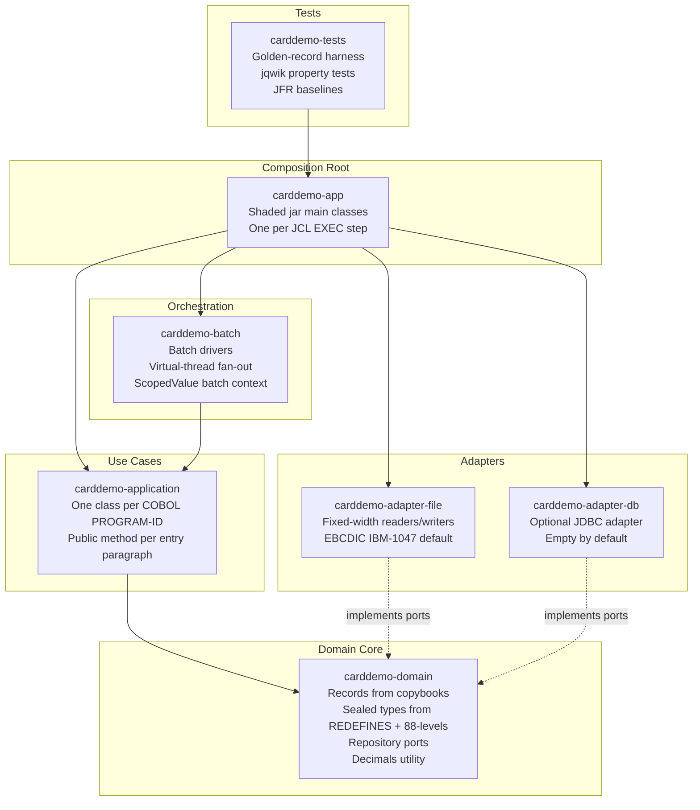

# CardDemo — Java 25 LTS Implementation

> Source-to-source migration of the AWS CardDemo mainframe application from
> Enterprise COBOL/CICS/VSAM/JCL/BMS to idiomatic Java 25 LTS, organised
> around a hexagonal architecture. The original COBOL source tree at
> [`../app/`](../app/) is **preserved unmodified** as the reference
> implementation and as the source for golden-record test fixtures
> (AAP §0.1.1, §0.2.2, §0.7.1).

This document is the entry point for developers who want to build, run, or
contribute to the Java implementation under the `java/` tree. It is
authoritative for the binding target architecture: every cross-cutting rule
documented here overrides any conflicting content in the legacy
`docs/technical-specifications.md` (AAP §0.1.1, §0.6.12).

---

## Table of Contents

1. [Overview](#1-overview)
2. [Prerequisites](#2-prerequisites)
3. [Maven Module Graph](#3-maven-module-graph)
4. [Build and Run Instructions](#4-build-and-run-instructions)
5. [JVM Tuning Baseline](#5-jvm-tuning-baseline)
6. [Mandated Java 25 Finalized Features](#6-mandated-java-25-finalized-features)
7. [Explicitly Forbidden](#7-explicitly-forbidden)
8. [Non-Negotiable Quality Gates](#8-non-negotiable-quality-gates)
9. [Source Lineage Preservation](#9-source-lineage-preservation)
10. [Directory Layout](#10-directory-layout)
11. [Golden-Record Test Harness](#11-golden-record-test-harness)
12. [Configuration](#12-configuration)
13. [Migration Notes](#13-migration-notes)
14. [References](#14-references)

---

## 1. Overview

The `java/` tree is a clean-room **source-to-source migration** of the
28 COBOL programs, 28 copybooks, 17 BMS map definitions, 17 symbolic map
copybooks, 29 JCL jobs, and 9 ASCII test fixtures that live under
[`../app/`](../app/). The Java implementation aims to produce **byte-for-byte
identical file outputs** and **field-for-field identical record outputs**
versus the COBOL baseline — no enhancement of business behaviour, no
optimisation beyond migration requirements, no introduction of frameworks
that the existing COBOL program does not require.

The binding target architecture (AAP §0.1.1) is:

- **Hexagonal Java 25 LTS** with plain factories and constructor injection;
  no container, no Spring, no Spring Boot.
- **File-based batch processing by default** via `java.nio.file`; a JDBC
  adapter is provided as an optional, empty module that can be wired in
  later if a relational source ever appears.
- **One shaded jar per executable program** (one per JCL `EXEC PGM=` step);
  invoked as `java -jar carddemo-<program>.jar <args>`.
- **Virtual-thread fan-out** for parallelisable per-record work where
  reordering does not change observable output.
- **`ScopedValue` propagation of batch-run context** replacing `ThreadLocal`
  entirely in new code.

The original COBOL tree is the **golden source**; if the Java port disagrees
with COBOL on a single byte of any output file, the Java port is wrong.

---

## 2. Prerequisites

| Tool | Required Version | Notes |
|------|------------------|-------|
| **JDK** | **25 LTS** | Eclipse Temurin 25 (or any conforming OpenJDK 25 distribution). Released September 16, 2025. `--enable-preview` is never required and never permitted (AAP §0.7.4). |
| **Apache Maven** | **3.9.9+** | `mvn -version` must report `Java version: 25.x`. Gradle 8.10+ is supported as an alternative (AAP §0.5.1) but the canonical build is Maven. |
| **OS** | Any POSIX (Linux/macOS) or Windows | The build is OS-agnostic; CI runs on Ubuntu 25.10. |

**Explicitly NOT required** (AAP §0.1.1, §0.6.12):

- ❌ Docker / containers — applications ship as plain shaded jars.
- ❌ PostgreSQL / any RDBMS — default persistence is fixed-width files.
- ❌ Spring Boot / Spring Framework / Spring Batch / Spring Security / Spring MVC / Spring Cloud AWS — never introduced.
- ❌ Hibernate / JPA — never introduced.
- ❌ Micrometer / Prometheus / Grafana / Jaeger — observability is JFR + SLF4J + Logback (JSON structured logging).
- ❌ Flyway / Liquibase — no schema management because no database is required.

Sample install on Ubuntu 25.10 (matches the CI baseline):

```bash
# Install JDK 25 LTS (Eclipse Temurin)
curl -fsSL -o /tmp/jdk-25.tar.gz \
  "https://github.com/adoptium/temurin25-binaries/releases/download/jdk-25.0.3%2B9/OpenJDK25U-jdk_x64_linux_hotspot_25.0.3_9.tar.gz"
sudo tar -xzf /tmp/jdk-25.tar.gz -C /opt
sudo ln -sfn /opt/jdk-25.0.3+9 /opt/jdk-25
export JAVA_HOME=/opt/jdk-25
export PATH="$JAVA_HOME/bin:$PATH"

# Install Apache Maven 3.9.9+
sudo apt-get install -y --no-install-recommends maven

# Verify
java --version    # openjdk 25 …
mvn  --version    # Apache Maven 3.9.9 … Java version: 25.x
```

---

## 3. Maven Module Graph

The `java/` tree is a Maven multi-module project with seven modules. The
dependency graph mirrors the hexagonal architecture defined in AAP §0.3.6:
the domain core sits at the centre and knows nothing about adapters or
composition; adapters implement domain ports; the composition root in
`carddemo-app` wires everything together at startup.



The same information in table form, listed in **dependency order**
(top-to-bottom = depended-on-to-depends-on):

| # | Module | Depends On | Purpose |
|---|--------|------------|---------|
| 1 | `carddemo-domain` | *(none)* | Pure domain: records, sealed types, value objects, repository ports, `Decimals` utility, `@CobolProgram` annotation. No external dependencies. The compile classpath is `java.base` only. |
| 2 | `carddemo-application` | `carddemo-domain` | One class per COBOL `PROGRAM-ID`; public method per entry paragraph, private method per internal paragraph. Includes `ProgramRegistry` for dynamic `CALL` routing. |
| 3 | `carddemo-adapter-file` | `carddemo-domain` | Fixed-width record readers/writers via `java.nio.file`. EBCDIC↔ASCII transcoding via `Charset.forName("IBM-1047")` by default, configurable per file. |
| 4 | `carddemo-adapter-db` | `carddemo-domain` | Optional JDBC adapter. Empty by default. JDBC driver scope is `provided` so no driver is bundled. |
| 5 | `carddemo-batch` | `carddemo-application` (transitively `carddemo-domain`) | Batch drivers that compose use cases, apply virtual-thread fan-out for independent per-record work, propagate `BatchRunContext` via `ScopedValue`. |
| 6 | `carddemo-app` | `carddemo-batch`, `carddemo-application`, `carddemo-adapter-file`, `carddemo-adapter-db` | Composition root. One `Main` class per JCL `EXEC PGM=` step; each packaged as an individual shaded jar via `maven-shade-plugin`. |
| 7 | `carddemo-tests` | `carddemo-app` (transitively everything) | Golden-record harness (byte-for-byte parity tests), jqwik property-based tests for `Decimals`, JFR-based performance regression baselines. Test-scope only. |

Modules 1–4 form the hexagonal **core + adapters**; modules 5–6 form the
**composition tier**; module 7 is the **quality tier**.

---

## 4. Build and Run Instructions

### 4.1 Clean-Machine Build

Once the prerequisites in [§2](#2-prerequisites) are installed, from the
repository root:

```bash
cd java
mvn -B clean verify
```

This command:

1. Compiles all 7 modules against Java 25 (`<release>25</release>`).
2. Runs the unit tests, including the **jqwik property-based tests** for
   the `Decimals` utility and the **golden-record byte-for-byte parity
   harness** for every translated program.
3. Produces shaded executable jars under `carddemo-app/target/`, one per
   JCL `EXEC PGM=` step.

The `-B` (batch) flag suppresses interactive output; `-ntp` (no-transfer-
progress) can be added to silence download chatter on CI:

```bash
mvn -B -ntp clean verify
```

### 4.2 Running a Translated Program

Each translated program is packaged as a self-contained shaded jar. The
example below invokes `PostTransactionsApp`, which is the Java translation
of the JCL job `POSTTRAN` driving the COBOL program `CBTRN02C`:

```bash
java \
  -XX:+UseCompactObjectHeaders \
  -XX:+UseShenandoahGC -XX:ShenandoahGCMode=generational \
  -jar carddemo-app/target/carddemo-post-transactions.jar \
  --input=path/to/dailytran \
  --output=path/to/posted
```

`--enable-preview` is **never** required and **never** used (AAP §0.6.7,
§0.7.4). Every mandated Java 25 feature in this codebase is a **finalized**
JEP — no preview features ship in production code.

### 4.3 Configuration at Runtime

All runtime configuration (file paths, codepages, optional DB credentials,
batch run metadata) is supplied through the 12-factor mechanism documented
in [`application.properties.example`](application.properties.example). See
[§12 Configuration](#12-configuration) below.

---

## 5. JVM Tuning Baseline

Per **AAP §0.3.4** and **AAP §0.7.2**, every shaded jar in this project is
documented to run with the following two flag groups. These flags are
mandatory for parity with the baseline performance characteristics:

| Flag | JEP | Effect |
|------|-----|--------|
| `-XX:+UseCompactObjectHeaders` | **JEP 519** (Final in Java 25) | Reduces each HotSpot object header from two machine words to one. On the small-record-heavy workloads typical of this application (`AccountRecord`, `TranRecord`, `CardRecord`, etc.) this yields ~20–30 % heap reduction and improved data locality. |
| `-XX:+UseShenandoahGC -XX:ShenandoahGCMode=generational` | **JEP 521** (Final in Java 25) | Selects the generational Shenandoah collector — finalized in Java 25, no experimental flag required — for low-pause batch operation. |

Both flags are **production-supported** in Java 25; they are not preview or
experimental. The combination yields predictable batch throughput on
millions-of-records-per-job workloads without the GC stalls characteristic
of platform-tuned defaults.

**Forbidden**: `--enable-preview`. This flag is **never** used in the
build, in CI, or in the shaded-jar launch commands documented here. Any
codepath, sample command, or script that requires `--enable-preview` is a
defect to be removed (AAP §0.7.4).

---

## 6. Mandated Java 25 Finalized Features

Per **AAP §0.6.7** and **AAP §0.7.3**, the following Java 25 finalized
features are used wherever they cleanly express a COBOL construct.
**Idiom-for-idiom translation beats clever feature usage**: when a feature
does not improve fidelity or clarity, plain Java is preferred.

| Feature | First Stable | Usage in This Refactor |
|---------|--------------|------------------------|
| **Records** | Java 16 | Every copybook 01-level group becomes an immutable `record` with `parse(byte[])` and `encode()` for fixed-width round-tripping. |
| **Sealed interfaces** | Java 17 | Every COBOL `REDEFINES` becomes a `sealed interface` with explicit `permits`. Every 88-level family that partitions a value space becomes a sealed hierarchy (e.g., `UserType`, `PgmContext`, `AidKey`). |
| **Pattern-matching `switch`** | Java 21 | Every COBOL `EVALUATE` becomes a pattern-matching `switch` expression. Compiler-enforced exhaustiveness — **no `default` branches** that mask missing cases. |
| **Virtual threads** | Java 21 | Batch fan-out only where COBOL was serial but per-record work is independent. Sort orders and sequencing are preserved unchanged. |
| **`ScopedValue`** | **JEP 506 — Final in Java 25** | Replaces `ThreadLocal` entirely in new code. Used to propagate `BatchRunContext` (run ID, processing date, tenant) through the call tree, including across virtual threads. |
| **Module Import Declarations** | **JEP 511 — Final in Java 25** | `import module java.base;` at the top of files that touch many `java.*` packages, to reduce import boilerplate. |
| **Flexible Constructor Bodies** | **JEP 513 — Final in Java 25** | COBOL-style input validation runs **before** the canonical field assignment in record constructors. The natural home for range checks, length checks, and defensive `List.copyOf(...)` calls. |
| **Text blocks** | Java 15 | Embedded SQL (in the optional JDBC adapter), report templates, multi-line DATA DIVISION constants. |
| **`java.math.BigDecimal`** + `MathContext.DECIMAL128` + explicit `RoundingMode` | (timeless) | Every monetary value and every packed-decimal (`COMP-3`, `PIC S9(n)V99`) arithmetic operation, centralised in the `Decimals` utility under `carddemo-domain.util`. |
| **`java.time`** (`LocalDate`, `LocalDateTime`, `LocalTime`, `Period`, `Duration`) | Java 8 | Every date and time value. `java.util.Date` and `java.util.Calendar` are forbidden. |
| **`java.nio.file`** (`Files`, `Path`, `SeekableByteChannel`) | Java 7 | Every file I/O operation. `java.io.File` is forbidden in new code. |
| **KDF API** | **JEP 510 — Final in Java 25** | Conditional — only if existing COBOL requires key/PIN derivation. Not introduced in this refactor unless the source code demands it. |

---

## 7. Explicitly Forbidden

The following are **non-negotiable prohibitions** per the user prompt and
AAP §0.6.7 / §0.7.4. Any pull request that violates one of these rules is
rejected on review.

### 7.1 Preview Features

| JEP | Status in Java 25 | Why Forbidden Here |
|-----|-------------------|---------------------|
| **JEP 502** Stable Values | Preview | User-mandated exclusion. Reassess when finalized. |
| **JEP 505** Structured Concurrency | 5th preview | User-mandated exclusion. Reassess when finalized. |
| **JEP 507** Primitive Types in Patterns, `instanceof`, and `switch` | 3rd preview | User-mandated exclusion. Reassess when finalized. |
| **JEP 512** Compact Source Files / Instance Main Methods | Final | Forbidden for **production code**. Permitted for ad-hoc utilities (e.g., one-off data-shape inspection scripts) but never in `src/main/java`. |

### 7.2 Forbidden Types and APIs

- **`double` / `float`** for any monetary value or any value derived from
  COBOL packed-decimal or zoned-decimal storage. **Ever.**
- **`ThreadLocal`** in new code. Use `ScopedValue` (JEP 506).
- **`java.util.Date`** and **`java.util.Calendar`**. Use `java.time`.
- **`java.io.File`** for new code. Use `java.nio.file`.
- **Reflection** and **dynamic proxies**, unless faithfully translating a
  COBOL construct that genuinely requires runtime dispatch (in which case
  it is routed through `ProgramRegistry`).

### 7.3 Forbidden Frameworks and Runtimes

- **Spring Boot**, **Spring Framework**, **Spring Batch**, **Spring
  Security**, **Spring MVC**, **Spring Cloud AWS**, **Spring Data** —
  the existing COBOL system has no container, so no Spring (AAP §0.5.1).
- **Hibernate / JPA / EclipseLink** — no ORM is introduced.
- **PostgreSQL**, **MySQL**, **DB2 driver bundled** — no RDBMS is required
  for the default file-based execution path. JDBC drivers are `provided`-
  scoped in `carddemo-adapter-db/pom.xml` and never bundled in shaded jars.
- **Docker / OCI containers** — applications ship as plain shaded jars.
- **Flyway / Liquibase** — no schema management because no database is
  required.
- **Micrometer**, **Prometheus exporters**, **Grafana**, **Jaeger** —
  observability is JFR (for performance regression) plus SLF4J + Logback
  with JSON structured layout (for application logs).
- **GraalVM native-image** — not introduced by this refactor.

### 7.4 Forbidden JVM Flags

- **`--enable-preview`** — every Java 25 feature in this codebase is
  finalized. The shaded jars must run on a stock JDK 25 LTS without any
  preview-feature flag.

---

## 8. Non-Negotiable Quality Gates

Per **AAP §0.6.1**, **AAP §0.6.5**, **AAP §0.6.11**, and **AAP §0.7.2**,
the following gates run on **every pull request**. A failure in any gate
blocks the PR — there are no exceptions, no overrides, no opt-outs.

| Gate | Source of Truth | Threshold |
|------|-----------------|-----------|
| **Byte-for-byte file parity** | `carddemo-tests` golden-record harness vs. captured COBOL outputs in `src/test/resources/golden/<program>/expected/` | **100 %**. A single byte of difference fails the build. |
| **Monetary code line coverage** | JaCoCo on `Decimals.java` and all callers in monetary paths | **100 %** line coverage. User mandate. |
| **Overall line coverage** | JaCoCo across all modules | **≥ 90 %** line coverage. |
| **Performance regression** | JFR-based regression baseline in `carddemo-tests` `JfrBaseline.java` | Within a **10 % band** of the documented baseline. Wall-clock and allocation rate. |
| **Decimals property tests** | jqwik 1.9.3 generators in `DecimalsProperties.java` | All properties pass; no shrunk counterexample tolerated. |
| **Compilation** | `mvn -B clean verify` | Zero errors, zero warnings (`-Werror` configured on `maven-compiler-plugin`). |

The byte-for-byte parity gate is the single most important quality
guarantee in this project. If `Decimals.encode(...)`, sign-nybble handling
for `COMP-3`, zero-padding direction, space-padding direction, or
EBCDIC↔ASCII transcoding produces a single byte that disagrees with the
COBOL baseline, the build fails.

---

## 9. Source Lineage Preservation

The user mandate is verbatim:

> *"Make only the changes that are absolutely necessary to implement this
> refactor. Maintain existing functionality exactly as-is and do not modify
> code beyond what is directly required for the COBOL → Java 25
> transition. Your goal is to preserve current behavior while updating the
> underlying technology with minimal risk and disruption."*
> — User prompt, captured verbatim in AAP §0.7.1.

This translates to three concrete invariants enforced by every PR review:

1. **The COBOL tree is immutable.** No file under [`../app/`](../app/) is
   modified, renamed, deleted, or augmented. This includes:
   `app/cbl/` (28 COBOL programs), `app/cpy/` (28 copybooks),
   `app/bms/` (17 BMS map definitions), `app/cpy-bms/` (17 symbolic map
   copybooks), `app/jcl/` (29 JCL jobs), `app/data/ASCII/` (9 ASCII
   fixtures), `app/catlg/`, `app/csd/`, `app/ctl/`, and `app/proc/`.

2. **Every translated Java class carries a `@CobolProgram` annotation.**
   The annotation cites the original COBOL `PROGRAM-ID`, the source file
   path, and the translation date. Example:

   ```java
   /**
    * Translation of COBOL program CBACT01C — sequential ACCTFILE reader.
    *
    * @see <a href="file:../app/cbl/CBACT01C.cbl">CBACT01C.cbl</a>
    */
   @CobolProgram(value = "CBACT01C", sourcePath = "app/cbl/CBACT01C.cbl", translationDate = "2025-09-16")
   public final class CbAct01C { /* ... */ }
   ```

3. **ASCII fixtures are read from `app/`, not copied.** The 9 fixture
   files in `app/data/ASCII/*.txt` are referenced from the golden-record
   harness via classpath-relative paths. They are not duplicated under
   `java/carddemo-tests/src/test/resources/` (AAP §0.4.1 ASCII fixtures
   table). This guarantees that fixture drift cannot occur silently.

---

## 10. Directory Layout

The `java/` tree, abbreviated to the module level for readability. The
full per-file directory tree is documented in AAP §0.3.1.

```text
java/
├── pom.xml                          ← parent POM, <release>25</release>, module list
├── README.md                        ← this file
├── MIGRATION_NOTES.md               ← deviations, dead-code translations, suspected bugs
├── application.properties.example   ← 12-factor configuration template
├── .gitignore
│
├── carddemo-domain/                 ← pure domain (records, sealed types, ports, Decimals)
│   ├── pom.xml
│   └── src/main/java/com/blitzy/carddemo/domain/
│       ├── annotation/              ← @CobolProgram traceability annotation
│       ├── record/                  ← records from copybooks (AccountRecord, TranRecord, ...)
│       ├── commarea/                ← CardDemoCommarea from COCOM01Y
│       ├── menu/                    ← AdminMenuTable, MainMenuTable
│       ├── text/                    ← CcWorkAreas, SystemMessages, ScreenTitle
│       ├── validation/              ← DateConstants, LookupCodes, DateValidationWork
│       ├── port/                    ← repository ports (interfaces)
│       └── util/                    ← Decimals
│
├── carddemo-application/            ← one class per COBOL PROGRAM-ID
│   ├── pom.xml
│   └── src/main/java/com/blitzy/carddemo/application/
│       ├── account/                 ← CbAct01C..04C, CoActVwC, CoActUpC
│       ├── card/                    ← CoCrdLiC, CoCrdSlC, CoCrdUpC
│       ├── customer/                ← CbCus01C
│       ├── transaction/             ← CbTrn01C..03C, CoTrn00C..02C
│       ├── statement/               ← CbStm03A, CbStm03B
│       ├── billpay/                 ← CoBil00C
│       ├── report/                  ← CoRpt00C
│       ├── menu/                    ← CoMen01C, CoAdm01C
│       ├── signon/                  ← CoSgn00C
│       ├── user/                    ← CoUsr00C..03C
│       ├── util/                    ← DateValidator, ScreenAttributeSetter, PfKeyDecoder
│       └── ProgramRegistry.java     ← dynamic CALL routing
│
├── carddemo-adapter-file/           ← java.nio.file readers/writers, EBCDIC IBM-1047 default
│   ├── pom.xml
│   └── src/main/java/com/blitzy/carddemo/adapter/file/
│
├── carddemo-adapter-db/             ← optional JDBC adapter, empty by default
│   ├── pom.xml
│   └── src/main/java/com/blitzy/carddemo/adapter/db/
│
├── carddemo-batch/                  ← batch drivers, virtual-thread fan-out, ScopedValue
│   ├── pom.xml
│   └── src/main/java/com/blitzy/carddemo/batch/
│
├── carddemo-app/                    ← main entry points (one per JCL EXEC step), shaded jars
│   ├── pom.xml                      ← maven-shade-plugin configured here
│   └── src/main/java/com/blitzy/carddemo/app/
│
└── carddemo-tests/                  ← golden-record harness, jqwik tests, JFR baselines
    ├── pom.xml
    └── src/test/
        ├── java/com/blitzy/carddemo/tests/
        │   ├── golden/              ← byte-for-byte parity test base + per-program tests
        │   ├── property/            ← jqwik property tests for Decimals
        │   └── perf/                ← JfrBaseline.java performance regression assertions
        └── resources/golden/        ← <program>/input/ + <program>/expected/ fixtures
```

---

## 11. Golden-Record Test Harness

The golden-record harness in [`carddemo-tests`](carddemo-tests/) is the
**non-negotiable PR gate** for byte-for-byte file parity (AAP §0.6.5,
§0.6.11).

### 11.1 How It Works

Each translated program has a corresponding `<Program>GoldenTest.java` that
extends the abstract `GoldenRecordTest` base class. The base class:

1. Loads the program's input fixture from
   `java/carddemo-tests/src/test/resources/golden/<program>/input/` (or
   directly from `app/data/ASCII/` via classpath for the 9 shared fixtures).
2. Runs the translated Java program against the input.
3. Reads the expected COBOL-produced output from
   `java/carddemo-tests/src/test/resources/golden/<program>/expected/`.
4. Asserts byte-for-byte equality between the actual and expected outputs
   using `assertThat(actual).isEqualTo(expected)`.

```java
public abstract class GoldenRecordTest {
    protected abstract Class<?> programClass();
    protected abstract Path inputFile();
    protected abstract Path expectedOutputFile();

    @Test
    void byteForByteParity() throws IOException {
        Path actualOutput = runProgram(programClass(), inputFile());
        byte[] expected = Files.readAllBytes(expectedOutputFile());
        byte[] actual   = Files.readAllBytes(actualOutput);
        assertThat(actual).isEqualTo(expected);
    }
}
```

### 11.2 Structured-Record Diff Mode

For report files containing embedded timestamps (which legitimately vary
between runs), the harness provides a field-by-field comparison mode that
masks known-variable fields. This is reserved for reports where the
COBOL output itself is non-deterministic; the default mode is strict
byte equality.

### 11.3 Fixture Capture Procedure

The procedure to (re-)capture expected outputs from a live COBOL run is
documented in [`MIGRATION_NOTES.md`](MIGRATION_NOTES.md). Until expected
fixtures are captured, individual golden tests may be marked `@Disabled`
with a TODO pointing at MIGRATION_NOTES.md; the harness skeleton, base
class, and per-program test classes exist unconditionally.

### 11.4 JFR Performance Baselines

`JfrBaseline.java` in `carddemo-tests/.../perf/` captures Java Flight
Recorder recordings of representative batch runs and asserts no
performance regression beyond a **10 % band** versus the documented
baseline (AAP §0.6.11, §0.7.2). JFR is enabled via JVM flag during test
execution; no agent or external profiler is required.

---

## 12. Configuration

Runtime configuration follows the **12-factor methodology** (AAP §0.7.2):
properties live in a classpath-loaded `application.properties` file, and
every property may be overridden by an environment variable formed by
uppercasing the key and replacing dots and hyphens with underscores.

The canonical, **committed** template is
[`application.properties.example`](application.properties.example). It is
the single source of truth for every environment variable name consumed by
the application (resolution of user `[TODO — list each variable name]`
marker, AAP §0.7.5).

To create a local configuration:

```bash
cp application.properties.example application.properties
# edit application.properties for the local environment
```

The real `application.properties` is `.gitignored` (see
[`.gitignore`](.gitignore)) so secrets and local paths never leak into
source control. Settings include input/output file paths, per-file
codepages (default `IBM-1047`), batch processing date, run ID, optional
JDBC credentials (only consumed if the optional DB adapter is wired), and
logging level overrides.

**No Spring framework is involved** in property resolution; configuration
is read with plain `java.util.Properties` + `System.getenv(...)` lookups.

---

## 13. Migration Notes

Every translation decision that deviates from naïve idiom-for-idiom mapping
is recorded in [`MIGRATION_NOTES.md`](MIGRATION_NOTES.md). The note log
captures (AAP §0.7.1, §0.7.5):

- **Dead-code translations** — paragraphs in the COBOL source that have
  no reachable callers but were translated for faithfulness.
- **Suspected COBOL bugs** translated faithfully without "fixing" them.
  Examples include the `DEFCUST.jcl` delete/define dataset-name mismatch
  and any obvious off-by-one or off-by-byte construct in the original.
- **Mandated deviations** where the natural Java idiom is meaningfully
  different from the COBOL idiom (e.g., `EXEC CICS SYNCPOINT ROLLBACK` in
  `COACTUPC` translated as a try/finally with compensating writes).
- **Golden-record capture instructions** for regenerating expected
  outputs from a live COBOL run.
- **Resolved and unresolved `[TODO]` markers** carried over from the user
  prompt, each with a resolution strategy and (where applicable) an
  owner.

Migration Notes is the **only** mid-stream documentation file that grows
over time. No status reports, no progress trackers, no implementation
guides are created; the to-do lists in PR descriptions and the Migration
Notes file are the single sources of truth.

---

## 14. References

### 14.1 Inside This Repository

| Path | Purpose |
|------|---------|
| [`../app/`](../app/) | Original COBOL/CICS/VSAM/JCL/BMS source tree. **Immutable.** Reference implementation and source of golden-record test fixtures. |
| [`../README.md`](../README.md) | Top-level README for the original mainframe system. The "Java 25 Implementation" section links back here. |
| [`MIGRATION_NOTES.md`](MIGRATION_NOTES.md) | Structured, append-only migration log: deviations, dead-code translations, suspected bugs, fixture-capture instructions, resolved/unresolved `[TODO]` markers. |
| [`application.properties.example`](application.properties.example) | 12-factor configuration template. Canonical source of every supported environment variable name. |
| [`pom.xml`](pom.xml) | Parent Maven POM. Pins all dependency versions per AAP §0.5.1. `<release>25</release>`. |
| `carddemo-*/pom.xml` | Per-module Maven POMs. |
| `carddemo-domain/src/main/java/com/blitzy/carddemo/domain/util/Decimals.java` | The centralised `BigDecimal` facade. The single point of control for `MathContext` and `RoundingMode` defaults. 100 % line coverage required. |
| `carddemo-domain/src/main/java/com/blitzy/carddemo/domain/annotation/CobolProgram.java` | Javadoc-style traceability annotation cited by every translated class. |

### 14.2 Agent Action Plan (AAP) Sections

| Section | Topic |
|---------|-------|
| §0.1 — Intent Clarification | Core refactoring objective; architectural override |
| §0.2 — Scope Boundaries | What is in scope vs. out of scope; preservation of `app/` |
| §0.3 — Target Design | Module layout, design patterns, Decimals utility, JVM tuning, hexagonal diagram |
| §0.4 — Transformation Mapping | File-by-file mapping from COBOL/JCL/BMS to Java |
| §0.5 — Dependency Inventory | Maven coordinates, no Spring, no PostgreSQL |
| §0.6 — Special Analysis | Decimal fidelity, REDEFINES, OCCURS DEPENDING ON, dates, file I/O, batch throughput, golden-record harness |
| §0.7 — Refactoring Rules | Minimal-change clause, preserve-as-is list, mandated Java 25 features, forbidden features |

### 14.3 External References

- **OpenJDK 25 LTS release notes** — finalized JEPs 506 (ScopedValue),
  510 (KDF API), 511 (Module Import Declarations), 513 (Flexible
  Constructor Bodies), 519 (Compact Object Headers), 521 (Generational
  Shenandoah). Released September 16, 2025.
- **jqwik 1.9.3 user guide** — property-based testing for monetary
  arithmetic.
- **JUnit 5.13.1 documentation** — test framework underlying the
  golden-record harness.

---

*This document is authoritative for the Java implementation under
`java/`. It supersedes any conflicting guidance in
`docs/technical-specifications.md`, which documents a previously-planned
Spring Boot architecture that has been explicitly overridden by the
user prompt (AAP §0.1.1, §0.6.12).*
