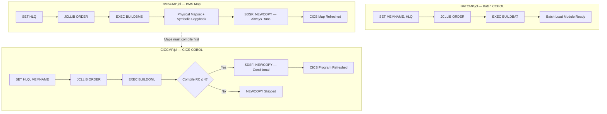

# Sample Build JCL — Build Sample Guide

This directory contains three sample build wrapper JCLs for z/OS batch compilation of CardDemo application artifacts. The samples demonstrate three distinct build patterns: **batch COBOL compilation**, **BMS (Basic Mapping Support) map assembly**, and **CICS (Customer Information Control System) COBOL compilation**. All three use a wrapper-based architecture — they delegate actual compile/link-edit mechanics to reusable cataloged procedures resolved from a shared procedure library, rather than embedding compiler, assembler, or linkage-editor control statements directly in the job stream.

These are distributable sample assets licensed under the Apache License 2.0, intended for users to customize for their specific z/OS environments. Before submission, each sample requires site-specific adjustments to the HLQ (High-Level Qualifier), member names, JOB card parameters, and CICS region identifiers.

> **Source:** [`samples/jcl/BATCMP.jcl`](BATCMP.jcl), [`samples/jcl/BMSCMP.jcl`](BMSCMP.jcl), [`samples/jcl/CICCMP.jcl`](CICCMP.jcl)

---

## Compile Patterns

The three samples cover the complete spectrum of CardDemo artifact compilation:

| File | Build Pattern | Cataloged Procedure | Artifact Type | NEWCOPY Step |
|------|---------------|---------------------|---------------|--------------|
| [`BATCMP.jcl`](BATCMP.jcl) | Batch COBOL Compile | `BUILDBAT` | Batch load module | No — batch programs run via JCL, not loaded into CICS |
| [`BMSCMP.jcl`](BMSCMP.jcl) | BMS Map Assembly | `BUILDBMS` | Physical mapset + symbolic copybook | Yes — always runs (no COND parameter) |
| [`CICCMP.jcl`](CICCMP.jcl) | CICS COBOL Compile | `BUILDONL` | CICS load module | Yes — conditional (`COND=(4,LT)`, skips if compile RC > 4) |

Each wrapper invokes its respective cataloged procedure via an `EXEC` statement, passing symbolic parameters for the member name and HLQ. Procedures are resolved at job submission time from the procedure library `&HLQ..CARDDEMO.PRC.UTIL` via the `JCLLIB ORDER` statement. The procedure definitions themselves are located in [`../proc/`](../proc/):

- [`BUILDBAT.prc`](../proc/BUILDBAT.prc) — Batch COBOL compile/link-edit procedure
- [`BUILDBMS.prc`](../proc/BUILDBMS.prc) — BMS map assembly procedure
- [`BUILDONL.prc`](../proc/BUILDONL.prc) — CICS COBOL compile/translate/link-edit procedure

---

## Customization Parameters

All three samples use JCL `SET` symbols for site-specific customization. The following parameters must be reviewed and updated before job submission:

| Symbol | Default Value | Description | Used In |
|--------|---------------|-------------|---------|
| `HLQ` | `AWS.M2` | High-level qualifier for all CardDemo dataset names. Must match site naming conventions. Determines the procedure library path (`&HLQ..CARDDEMO.PRC.UTIL`). | All 3 samples |
| `MEMNAME` | `BATCHPGM` / `CICSPGMN` | Member name of the source COBOL program being compiled. Must be replaced with the actual program member name. | [`BATCMP.jcl`](BATCMP.jcl), [`CICCMP.jcl`](CICCMP.jcl) |
| `MAPNAME` | `CICSMAP` | Member name of the BMS map source being assembled. Passed directly on the `EXEC BUILDBMS` statement. Must be replaced with the actual map name. | [`BMSCMP.jcl`](BMSCMP.jcl) |

### Parameter Replacement Guidance

- The `HLQ` parameter is common to all samples and controls dataset resolution across the entire job. Update it first to match your site's high-level qualifier.
- `MEMNAME` and `MAPNAME` are placeholder values — users **must** perform a global replace before submission. Use the ISPF editor change command (e.g., `C BATCHPGM CBACT01C all` in ISPF) to replace all occurrences in one pass.
  - Source: `samples/jcl/BATCMP.jcl` lines 4–5 — `change BATCHPGM to your program name everywhere`
  - Source: `samples/jcl/BMSCMP.jcl` lines 4–5 — `Change CICSMAP to your map name everywhere`
  - Source: `samples/jcl/CICCMP.jcl` lines 4–5 — `change CICSPGMN to your program name everywhere`

### JOB Card Parameters

All JOB card parameters should be reviewed with the site administrator to match local JES (Job Entry Subsystem) standards:

| Parameter | Value | Description |
|-----------|-------|-------------|
| `CLASS=A` | `A` | Standard batch execution class — may differ by installation |
| `MSGCLASS=H` | `H` | Hold output in SDSF (System Display and Search Facility) for review |
| `MSGLEVEL=(1,1)` | `(1,1)` | Full diagnostic output — shows all JCL statements and allocation messages |
| `REGION=0M` | `0M` | Maximum available memory — no region size constraint |
| `NOTIFY=&SYSUID` | System user ID | TSO (Time Sharing Option) user notification upon job completion |
| `TIME=1440` | `1440` | CPU time limit of 1440 minutes (24 hours) |

---

## Prerequisites

### 1. Cataloged Procedures Must Exist

The three cataloged procedures referenced by these wrappers must be installed in the procedure library at `&HLQ..CARDDEMO.PRC.UTIL`:

- **`BUILDBAT`** — Batch COBOL compile/link-edit procedure (Source: [`../proc/BUILDBAT.prc`](../proc/BUILDBAT.prc))
- **`BUILDBMS`** — BMS map assembly procedure that compiles the physical mapset and generates the symbolic copybook (Source: [`../proc/BUILDBMS.prc`](../proc/BUILDBMS.prc))
- **`BUILDONL`** — CICS COBOL compile/translate/link-edit procedure that includes the CICS translator step before compilation (Source: [`../proc/BUILDONL.prc`](../proc/BUILDONL.prc))

The `JCLLIB ORDER=&HLQ..CARDDEMO.PRC.UTIL` statement in each wrapper tells JES where to locate these procedures at job submission time.

### 2. Active CICS Region (for NEWCOPY Operations)

A running CICS region is required for BMS map and CICS program NEWCOPY refresh operations:

- The samples use `CICSAWSA` as the CICS region name — this **must** be changed to match the target CICS region identifier at your site.
- The CICS region must have the CardDemo programs and maps defined in its CSD (CICS System Definition) resource table.
- The region must be active and accepting `MODIFY` console commands at the time the NEWCOPY step executes.

### 3. JES Job Submission Environment

- JES2 or JES3 with appropriate job card standards for the installation
- SDSF access authorization for batch command execution — required by the NEWCOPY steps in [`BMSCMP.jcl`](BMSCMP.jcl) and [`CICCMP.jcl`](CICCMP.jcl) which use `EXEC PGM=SDSF`
- TSO NOTIFY capability for job completion alerts (the `NOTIFY=&SYSUID` JOB card parameter)
- RACF (Resource Access Control Facility) or equivalent security authorization for the submitting user to issue z/OS console commands via SDSF

### 4. Compilation Order Dependency

BMS maps **must** be compiled before CICS COBOL programs that reference them. The CICS COBOL translator and compiler require the symbolic map copybook (generated by `BUILDBMS`) to be present in the copybook library at compile time.

- Use [`BMSCMP.jcl`](BMSCMP.jcl) **first** to compile any BMS maps, then use [`CICCMP.jcl`](CICCMP.jcl) for the CICS programs that reference those maps.
- [`BATCMP.jcl`](BATCMP.jcl) has no ordering dependency with the other samples — batch COBOL programs do not use BMS maps or CICS services.

> **Source:** `samples/jcl/CICCMP.jcl` lines 27–28 — *"Compile CICS COBOL program / After compiling the related maps"*

---

## Post-Build NEWCOPY Process

### What Is NEWCOPY?

After compiling a CICS program or BMS map, the new load module exists in the load library on disk, but the CICS region continues using its cached in-memory copy of the previous version. A CEMT (CICS Execute Master Terminal) `SET PROG(...) NEWCOPY` command tells CICS to discard its cached copy and load the newly compiled version from the DFHRPL (Dynamic File Resource Program Library) concatenation the next time the program or map is invoked. This is the standard CICS deployment refresh mechanism on z/OS.

### How It Works in These Samples

Both [`BMSCMP.jcl`](BMSCMP.jcl) and [`CICCMP.jcl`](CICCMP.jcl) include a post-compile step that executes SDSF (System Display and Search Facility) in batch mode to issue the NEWCOPY command:

1. **SDSF Batch Execution:** The step `EXEC PGM=SDSF` launches SDSF as a batch program.
2. **Inline Command Input:** SDSF reads commands from the `ISFIN DD *` inline data stream.
3. **Console Command Issuance:** The command `/MODIFY CICSAWSA,'CEMT SET PROG(...) NEWCOPY'` sends a z/OS `MODIFY` console command to the named CICS region, which the CICS region interprets as a `CEMT` master terminal command.
4. **Diagnostic Output:** SDSF output is captured in `ISFOUT DD SYSOUT=*` and `CMDOUT DD SYSOUT=*` for post-execution review.

### Conditional vs. Unconditional NEWCOPY

The two samples handle the NEWCOPY step differently with respect to compile step success:

- **`CICCMP.jcl` — Conditional NEWCOPY:** The NEWCOPY step specifies `COND=(4,LT)`, which means the step executes **only** when all prior steps completed with a return code of 4 or less (indicating success or a warning). If the compile step fails with RC > 4, the condition `4 < RC` evaluates to true and the NEWCOPY step is bypassed — preventing CICS from being refreshed with a potentially bad program.

  > Source: `samples/jcl/CICCMP.jcl` line 45 — `//NEWCOPY EXEC PGM=SDSF,COND=(4,LT)`

- **`BMSCMP.jcl` — Unconditional NEWCOPY:** The SDSF step does **not** have a `COND` parameter, so NEWCOPY is always attempted regardless of the compile step's return code. This means CICS could be refreshed with a stale map if the BMS assembly step failed.

  > Source: `samples/jcl/BMSCMP.jcl` line 42 — `//SDSF1 EXEC PGM=SDSF`

- **`BATCMP.jcl` — No NEWCOPY:** Batch programs are executed via JCL job submission (not loaded into a CICS region), so no NEWCOPY step is needed.

### NEWCOPY Customization Required

Before submitting `BMSCMP.jcl` or `CICCMP.jcl`, update the NEWCOPY step:

- Replace `CICSAWSA` with the actual CICS region name at your site.
- Replace the program or map name in the `CEMT SET PROG(...)` command to match the `MEMNAME` or `MAPNAME` value you set earlier in the job.

---

## Build and Deploy Flow

The following diagram illustrates the build and deploy flow for all three compile patterns, highlighting the NEWCOPY behavior differences:

---

## Known Limitations and Troubleshooting

### Dataset Naming Convention

All three samples assume the dataset naming convention `AWS.M2.CARDDEMO.*` based on the default `HLQ=AWS.M2`. Sites with different high-level qualifier patterns must update the `HLQ` SET symbol and verify that all dataset references throughout the job resolve correctly.

### Hardcoded CICS Region Name

The CICS region name `CICSAWSA` is hardcoded in the `/MODIFY` console commands within the SDSF inline data. This value must be changed to match the target CICS region at each installation. A missed replacement will cause the NEWCOPY command to fail silently or target the wrong region.

### SDSF Authorization

The SDSF batch command execution (`EXEC PGM=SDSF`) requires appropriate RACF or equivalent security authorization for the submitting TSO user. If the user lacks SDSF console command authority, the NEWCOPY step will fail with a security violation. Coordinate with the security administrator to ensure the submitting user has the required SDSF profiles.

### Silent NEWCOPY Failure

If the SDSF step completes with RC=0 but CICS does not appear to reflect the newly compiled program or map:

- Verify that the program or map name in the `CEMT SET PROG(...)` command exactly matches the member name loaded into the CICS load library.
- Confirm the program or map is defined in the CICS CSD (CICS System Definition) and installed in the active CICS group.
- Check that the CICS region was active and accepting commands at the time the SDSF step executed.
- Review the `ISFOUT` and `CMDOUT` SDSF output DDs in the JES job output for diagnostic messages.

### BMSCMP Unconditional NEWCOPY Risk

[`BMSCMP.jcl`](BMSCMP.jcl) does not include a `COND` parameter on its SDSF step, so the NEWCOPY command is issued regardless of whether the BMS assembly completed successfully. In a production environment, consider adding `COND=(4,LT)` to the SDSF step (matching the pattern used in [`CICCMP.jcl`](CICCMP.jcl)) to prevent refreshing CICS with a potentially stale or incomplete mapset.

### Placeholder Member Names

Submitting a job without replacing the placeholder member names (`BATCHPGM`, `CICSMAP`, `CICSPGMN`) will cause the compile step to fail with a member-not-found condition, since these placeholder names do not correspond to actual source members in the CardDemo libraries.

---

## Related Resources

- **Cataloged Procedures:** [`../proc/`](../proc/) — `BUILDBAT.prc`, `BUILDBMS.prc`, `BUILDONL.prc` (the reusable compile/link-edit procedures invoked by these wrappers)
- **Application JCL:** [`../../app/jcl/`](../../app/jcl/) — Production JCL jobs for CardDemo environment provisioning, batch processing, and CICS administration
- **COBOL Programs:** [`../../app/cbl/`](../../app/cbl/) — Source COBOL programs compiled by these wrappers (28 programs: 18 online + 10 batch)
- **BMS Maps:** [`../../app/bms/`](../../app/bms/) — BMS map source definitions compiled by `BMSCMP.jcl` (17 mapsets)
- **Symbolic Map Copybooks:** [`../../app/cpy-bms/`](../../app/cpy-bms/) — Generated symbolic map copybooks produced by the `BUILDBMS` procedure
- **Main README:** [`../../README.md`](../../README.md) — CardDemo application overview, installation guide, and complete artifact inventory
